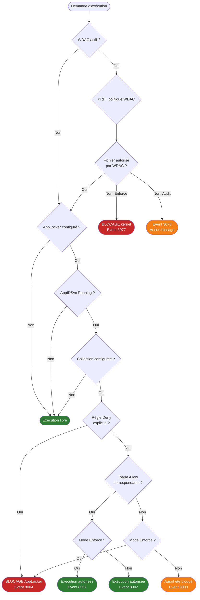

# AppLocker et WDAC : contrôle d'application via GPO

!!! abstract "Ce que vous allez apprendre"
    - La structure des règles AppLocker — trois types (Publisher, Path, Hash), quatre collections, et leur évaluation dans le contexte utilisateur (SID-based)
    - La CSE AppLocker : GUID `{D02B1F72-3407-48AE-BA88-E8213C6761F1}`, journal `Microsoft-Windows-AppLocker/EXE and DLL`, prérequis de service
    - WDAC (Windows Defender Application Control) : politique XML compilée en `.p7b`, déploiement via GPO dans SYSVOL, exécution en mode noyau
    - Les différences architecturales fondamentales entre AppLocker (user-space, SID) et WDAC (kernel-mode, machine-wide)
    - La migration AppLocker → WDAC : `ConvertFrom-CIPolicy`, les correspondances imparfaites, les pièges de règles Publisher
    - Le Managed Installer : comment SCCM/MECM peut être marqué comme source de confiance pour autoriser automatiquement les déploiements
    - Les Event IDs de diagnostic pour AppLocker et WDAC, et comment les exploiter en mode audit avant un déploiement en enforce


!!! tip "Si vous ne retenez qu'une chose"
    AppLocker et WDAC résolvent le même problème — empêcher l'exécution de code non autorisé — mais à des niveaux radicalement différents. AppLocker opère en **user-space**, est évaluable par SID, et est contournable par un administrateur local. WDAC opère en **mode noyau**, s'applique à la machine entière indépendamment de l'utilisateur, et ne peut pas être désactivé par un admin local. En production, WDAC est le seul mécanisme résistant à une compromission de niveau administrateur.


---

## :material-shield-check: AppLocker : modèle de règles et collections

### :material-puzzle-outline: Trois types de règles

AppLocker distingue trois méthodes d'identification d'un exécutable. Le choix du type détermine à la fois la robustesse et la maintenabilité de la règle.

**Publisher** — Identifie un fichier par sa signature Authenticode. La règle peut cibler l'éditeur seul, l'éditeur + le produit, l'éditeur + le produit + le binaire, ou descendre jusqu'à une version exacte.

**Path** — Identifie un fichier par son chemin système ou ses wildcards. Simple à créer, mais contournable : un utilisateur qui peut écrire dans le répertoire peut substituer un binaire.

**Hash** — Identifie un fichier par son empreinte SHA-256. Impossible à contourner, mais fragile : toute mise à jour du fichier invalide la règle et nécessite une régénération manuelle.

!!! info "Ordre de priorité"
    AppLocker évalue les règles **Deny** avant les règles **Allow**, quel que soit le type. Un Deny explicite l'emporte toujours. À l'intérieur d'une même décision, Publisher > Path > Hash en termes de recommandation de maintenabilité — pas d'évaluation par priorité de type.

### :material-layers-outline: Quatre collections

AppLocker organise ses règles en collections distinctes. Chaque collection contrôle une catégorie de fichiers et possède son propre journal d'événements.

| Collection | Extensions ciblées | Journal AppLocker |
|---|---|---|
| Executable Rules | `.exe`, `.com` | `EXE and DLL` |
| Windows Installer Rules | `.msi`, `.msp`, `.mst` | `MSI and Script` |
| Script Rules | `.ps1`, `.bat`, `.cmd`, `.vbs`, `.js` | `MSI and Script` |
| Packaged App Rules | Applications MSIX/AppX (Store) | `Packaged app-Execution` |
| DLL Rules | `.dll`, `.ocx` | `EXE and DLL` (optionnel) |

!!! warning "DLL Rules désactivées par défaut"
    La collection DLL Rules est désactivée par défaut dans la GPMC. L'activer a un impact significatif sur les performances : chaque chargement de DLL déclenche une évaluation. Ne l'activer que si le périmètre de sécurité l'exige et après avoir mesuré l'impact en audit.

!!! check "Point de contrôle"
    Avant de continuer, vérifiez que vous avez bien compris :
    - les repères de lecture du tableau précédent : `Collection`, `Extensions ciblées`, `Journal AppLocker`
    - l'artefact technique à savoir relire sans chercher : `.exe`
    - le second repère technique à retenir avant de continuer : `.com`

### :material-account-check: Évaluation SID : qui est concerné ?

AppLocker est une technologie **user-space**. Chaque règle peut cibler :

- **Everyone** — tous les utilisateurs, y compris les admins
- Un groupe AD spécifique — évaluation par SID au moment de l'exécution
- **BUILTIN\Administrators** — les admins locaux peuvent être exemptés

Par défaut, les règles AppLocker exemptent les membres du groupe `BUILTIN\Administrators`. Cette exemption est une décision de design délibérée, mais elle signifie qu'un compte administrateur local peut contourner AppLocker sans aucune modification de GPO.

!!! warning "Admins locaux = bypass AppLocker"
    Si la sécurité de votre périmètre repose sur AppLocker et que des utilisateurs ont des droits administrateurs locaux, AppLocker n'offre aucune protection contre ces utilisateurs. C'est le cas d'usage principal qui justifie le passage à WDAC.

---
!!! quote "En résumé"
    AppLocker propose trois types de règles (Publisher, Path, Hash) organisées en quatre collections. L'évaluation est SID-based et s'opère en user-space. Les administrateurs locaux sont exemptés par défaut. La collection DLL Rules est disponible mais désactivée par défaut en raison de son impact sur les performances.

---

## :material-cog-sync: AppLocker : déploiement via GPO

### :material-identifier: La CSE AppLocker

AppLocker est implémenté comme une Client-Side Extension. Sa CSE possède un GUID fixe enregistré sous `GPExtensions` :

| Attribut | Valeur |
|---|---|
| GUID CSE | `{D02B1F72-3407-48AE-BA88-E8213C6761F1}` |
| DLL | `appidsvc.dll` (via le service `AppIDSvc`) |
| Contexte | Machine uniquement |

!!! info "AppLocker et le service AppIDSvc"
    AppLocker ne fonctionne pas sans le service **Application Identity** (`AppIDSvc`). Ce service est désactivé par défaut. Il doit être configuré en **Automatic** via GPO avant tout déploiement de règles. Un poste sans ce service en cours d'exécution ignore silencieusement toutes les règles AppLocker.

!!! check "Point de contrôle"
    Avant de continuer, vérifiez que vous avez bien compris :
    - les repères de lecture du tableau précédent : `Attribut`, `Valeur`
    - l'artefact technique à savoir relire sans chercher : `GPExtensions`
    - le second repère technique à retenir avant de continuer : `{D02B1F72-3407-48AE-BA88-E8213C6761F1}`

### :material-folder-network: Emplacement des règles dans la GPO

Les règles AppLocker sont stockées dans la GPO sous :

```
Computer Configuration
  └── Policies
        └── Windows Settings
              └── Security Settings
                    └── Application Control Policies
                          └── AppLocker
```

Dans SYSVOL, les données XML correspondantes se trouvent dans :

```
\\DOMAIN\SYSVOL\DOMAIN\Policies\{GPO-GUID}\Machine\Microsoft\Windows NT\AppLocker\
```

Chaque collection génère un fichier XML séparé : `Exe.xml`, `Msi.xml`, `Script.xml`, `Appx.xml`.

!!! check "Point de contrôle"
    Avant de continuer, vérifiez que vous avez bien compris :
    - le but précis de cette sous-section : **Emplacement des règles dans la GPO**
    - l'artefact technique à savoir relire sans chercher : `Exe.xml`
    - la commande ou l'étape de validation à pouvoir rejouer en labo : `Computer Configuration`

### :material-test-tube: Mode Audit vs mode Enforce

AppLocker supporte deux modes opérationnels configurables par collection indépendamment.

**Audit only** — AppLocker évalue les règles mais ne bloque pas. Tout fichier qui aurait été bloqué génère un Event ID dans le journal correspondant. Ce mode est indispensable avant tout déploiement en production.

**Enforce rules** — AppLocker bloque l'exécution des fichiers non autorisés. L'utilisateur reçoit un message de refus. L'événement est journalisé.

!!! warning "Piège : collection sans règle = tout autorisé ou tout bloqué"
    Le comportement d'une collection sans règle dépend de son état. Si la collection est **configurée** (mode Audit ou Enforce activé) mais ne contient **aucune règle Allow**, alors **tout est bloqué**. Si la collection n'est pas configurée du tout, aucune évaluation n'a lieu. Ne jamais activer le mode Enforce sur une collection vide.

### :material-script-text: Exemple de règle Publisher en XML

```xml title="AppLocker Publisher rule — PowerShell signed by Microsoft"
<FilePublisherRule Id="a9e18c21-ff8f-43cf-b9fc-db40eed693ba"
                   Name="Allow Microsoft-signed PowerShell"
                   Description=""
                   UserOrGroupSid="S-1-1-0"
                   Action="Allow">
  <Conditions>
    <FilePublisherCondition PublisherName="O=MICROSOFT CORPORATION, L=REDMOND, S=WASHINGTON, C=US"
                            ProductName="MICROSOFT® WINDOWS® OPERATING SYSTEM"
                            BinaryName="POWERSHELL.EXE">
      <BinaryVersionRange LowSection="*" HighSection="*" />
    </FilePublisherCondition>
  </Conditions>
</FilePublisherRule>
```

```xml title="Résultat attendu — évaluation en mode Enforce"
<!-- Event ID 8002 dans Microsoft-Windows-AppLocker/EXE and DLL -->
<!-- powershell.exe autorisé par la règle Publisher ci-dessus -->
<!-- Aucun blocage, aucune interaction utilisateur -->
```

---
!!! check "Point de contrôle"
    Avant de continuer, vérifiez que vous avez bien compris :
    - le but précis de cette sous-section : **Exemple de règle Publisher en XML**
    - l'artefact technique à savoir relire sans chercher : `{D02B1F72-3407-48AE-BA88-E8213C6761F1}`
    - la commande ou l'étape de validation à pouvoir rejouer en labo : `<FilePublisherRule Id="a9e18c21-ff8f-43cf-b9fc-db40eed693ba"`

!!! quote "En résumé"
    La CSE AppLocker (`{D02B1F72-3407-48AE-BA88-E8213C6761F1}`) requiert le service `AppIDSvc` en état `Running`. Les règles sont stockées en XML dans SYSVOL. Chaque collection peut être configurée indépendamment en mode Audit ou Enforce. Une collection configurée sans aucune règle Allow bloque tout.

---

## :material-calendar-check: AppLocker : Event IDs de référence

### :material-table: Table des Event IDs

Les journaux AppLocker se trouvent sous `Applications and Services Logs\Microsoft\Windows\AppLocker\`.

| Event ID | Journal | Signification | Mode |
|---|---|---|---|
| 8002 | EXE and DLL | Exécution autorisée | Enforce |
| 8003 | EXE and DLL | Exécution aurait été bloquée | Audit |
| 8004 | EXE and DLL | Exécution bloquée | Enforce |
| 8005 | MSI and Script | Script autorisé | Enforce |
| 8006 | MSI and Script | Script aurait été bloqué | Audit |
| 8007 | MSI and Script | Script bloqué | Enforce |
| 8020 | Packaged app-Execution | App Store autorisée | Enforce |
| 8021 | Packaged app-Execution | App Store aurait été bloquée | Audit |
| 8022 | Packaged app-Execution | App Store bloquée | Enforce |

!!! check "Point de contrôle"
    Avant de continuer, vérifiez que vous avez bien compris :
    - les repères de lecture du tableau précédent : `Event ID`, `Journal`, `Signification`
    - l'artefact technique à savoir relire sans chercher : `Applications and Services Logs\Microsoft\Windows\AppLocker\`
    - le contrôle terrain à effectuer avant de passer à la suite de **Table des Event IDs**

### :material-powershell: Extraction PowerShell des événements de blocage

```powershell title="Collecter les blocages AppLocker en mode Audit (Event 8003)"
Get-WinEvent -LogName 'Microsoft-Windows-AppLocker/EXE and DLL' |
    Where-Object { $_.Id -eq 8003 } |
    Select-Object TimeCreated,
                  @{N='User';E={$_.Properties[3].Value}},
                  @{N='FilePath';E={$_.Properties[1].Value}},
                  @{N='PolicyName';E={$_.Properties[7].Value}} |
    Sort-Object TimeCreated -Descending |
    Format-Table -AutoSize
```

```
Title="Résultat attendu — extrait typique après 48h en mode Audit"
TimeCreated           User                FilePath                              PolicyName
-----------           ----                --------                              ----------
2026-04-04 08:32:11   CORP\jsmith         C:\Users\jsmith\AppData\...\setup.exe (Default Rule)
2026-04-04 07:15:43   CORP\mbrown         C:\Temp\PuTTY.exe                     (Default Rule)
```


!!! check "Point de contrôle"
    Avant de continuer, vérifiez que vous avez bien compris :
    - le but précis de cette sous-section : **Extraction PowerShell des événements de blocage**
    - la valeur, le GUID ou le paramètre qui change réellement le résultat dans **Extraction PowerShell des événements de blocage**
    - la commande ou l'étape de validation à pouvoir rejouer en labo : `Get-WinEvent -LogName 'Microsoft-Windows-AppLocker/EXE and DLL' |`

!!! quote "En résumé"
    - Les journaux AppLocker se trouvent sous Applications and Services Logs\Microsoft\Windows\AppLocker\.
    - 8002 : Enforce.
    - 8003 : Audit.
---

## :material-kernel: WDAC : Windows Defender Application Control

### :material-compare: Positionnement architectural

WDAC est fondamentalement différent d'AppLocker. Là où AppLocker est une extension du service de Group Policy qui s'exécute en user-space, WDAC est un composant du **noyau Windows** (`ci.dll` — Code Integrity).

WDAC évalue chaque binaire **avant** que le noyau l'exécute ou charge la DLL. Cette évaluation se produit indépendamment de l'identité de l'utilisateur, du contexte de processus, ou des droits administrateurs.

| Dimension | AppLocker | WDAC |
|---|---|---|
| Niveau d'exécution | User-space (gpsvc / AppIDSvc) | Kernel-mode (ci.dll) |
| Granularité | Par utilisateur / groupe (SID) | Par machine |
| Contournable par admin local | Oui | Non |
| Format de politique | XML dans GPO / SYSVOL | XML → `.p7b` signé |
| Déploiement GPO | Natif via CSE | Copie de `.p7b` dans SYSVOL |
| OS minimum | Windows 7 / Server 2008 R2 | Windows 10 1903 / Server 2019 |
| Support BYOD / MDM | Limité | Natif via Intune |

!!! check "Point de contrôle"
    Avant de continuer, vérifiez que vous avez bien compris :
    - les repères de lecture du tableau précédent : `Dimension`, `AppLocker`, `WDAC`
    - l'artefact technique à savoir relire sans chercher : `ci.dll`
    - le second repère technique à retenir avant de continuer : `.p7b`

### :material-file-lock: La politique WDAC : XML → .p7b

Une politique WDAC commence toujours sous forme de fichier XML. Ce fichier définit les niveaux de confiance, les signataires autorisés, les options de politique et les règles de fichiers.

La politique XML est ensuite **compilée** en un fichier binaire `.p7b` (ou `.bin` selon la version OS) avant déploiement. Ce fichier binaire est signé pour empêcher toute modification.

```powershell title="Compiler une politique WDAC XML en .p7b"
# Step 1: Generate a base policy from the default Windows mode
New-CIPolicy -Level Publisher -Fallback Hash `
             -FilePath "C:\Policies\BasePolicy.xml" `
             -UserPEs

# Step 2: Convert XML to binary .p7b
ConvertFrom-CIPolicy -XmlFilePath "C:\Policies\BasePolicy.xml" `
                     -BinaryFilePath "C:\Policies\SIPolicy.p7b"
```

```
title="Résultat attendu"
[*] Scanning user-mode PEs...
[*] Policy generated: C:\Policies\BasePolicy.xml
[*] Binary policy written: C:\Policies\SIPolicy.p7b (47 KB)
```

!!! check "Point de contrôle"
    Avant de continuer, vérifiez que vous avez bien compris :
    - le but précis de cette sous-section : **La politique WDAC : XML → .p7b**
    - l'artefact technique à savoir relire sans chercher : `.p7b`
    - la commande ou l'étape de validation à pouvoir rejouer en labo : `New-CIPolicy -Level Publisher -Fallback Hash ``

### :material-layers-triple: Niveaux de confiance (Trust Levels)

WDAC évalue les fichiers selon une hiérarchie de signataires. Le paramètre `-Level` de `New-CIPolicy` définit le niveau de granularité des règles générées.

| Niveau | Description | Maintenabilité |
|---|---|---|
| `Hash` | Empreinte SHA-256 exacte du fichier | Très faible — invalide à chaque mise à jour |
| `FileName` | Nom de fichier uniquement | Faible — facile à usurper |
| `SignedVersion` | Signataire + version minimale | Bonne |
| `Publisher` | Signataire + nom de produit | Bonne |
| `FilePublisher` | Signataire + produit + nom de fichier | Très bonne |
| `WHQLPublisher` | Signataire WHQL Microsoft pour drivers | Excellente pour drivers |
| `WHQLFilePublisher` | WHQL + nom de fichier | Excellente pour drivers |

!!! info "Microsoft Recommended Block Rules"
    Microsoft publie et maintient une liste de règles de blocage (`WDAC Recommended Block Rules`) couvrant les LOLBins (Living-Off-the-Land Binaries) connus pour être abusés : `mshta.exe`, `wscript.exe`, `cscript.exe`, `regsvr32.exe`, etc. Ces règles doivent être intégrées à toute politique de base. La liste est disponible dans la documentation Microsoft Security Baselines.

!!! check "Point de contrôle"
    Avant de continuer, vérifiez que vous avez bien compris :
    - les repères de lecture du tableau précédent : `Niveau`, `Description`, `Maintenabilité`
    - l'artefact technique à savoir relire sans chercher : `-Level`
    - le second repère technique à retenir avant de continuer : `New-CIPolicy`

### :material-options: Options de politique importantes

Les options de politique WDAC se configurent dans le XML via la balise `<Rule>`. Les plus importantes en production :

| Option ID | Nom | Effet |
|---|---|---|
| 3 | Enabled:Audit Mode | Active le mode Audit (pas de blocage) |
| 6 | Enabled:Unsigned System Integrity Policy | Permet les politiques non signées (test uniquement) |
| 10 | Enabled:Boot Audit on Failure | Journal les échecs de démarrage |
| 12 | Required:Enforce Store Applications | Applique WDAC aux apps Store |
| 14 | Enabled:Managed Installer | Active le Managed Installer (voir section dédiée) |

!!! warning "Option 6 : jamais en production"
    L'option 6 (`Unsigned System Integrity Policy`) permet de déployer des politiques WDAC non signées. Elle est indispensable en phase de test, mais doit être supprimée avant le passage en production. Une politique non signée peut être remplacée par un attaquant ayant accès au répertoire de déploiement.

!!! check "Point de contrôle"
    Avant de continuer, vérifiez que vous avez bien compris :
    - les repères de lecture du tableau précédent : `Option ID`, `Nom`, `Effet`
    - l'artefact technique à savoir relire sans chercher : `<Rule>`
    - le second repère technique à retenir avant de continuer : `Unsigned System Integrity Policy`

### :material-antenna: Mode Audit vs mode Enforce dans WDAC

Comme AppLocker, WDAC supporte deux modes. La différence est que le mode est encodé **dans la politique elle-même** via l'option 3.

**Audit Mode (option 3 présente)** — WDAC évalue les fichiers et journalise les violations dans `Microsoft-Windows-CodeIntegrity/Operational` sans bloquer. C'est le mode de déploiement initial obligatoire.

**Enforce Mode (option 3 absente)** — WDAC bloque le chargement de tout code non autorisé, y compris les drivers. Un noyau bloqué pendant le démarrage peut rendre le système inaccessible.

!!! warning "WDAC Enforce en production : prévoir le recovery"
    Avant de basculer une politique WDAC en Enforce, assurez-vous d'avoir un mécanisme de recovery testé : politique de désactivation signée, accès WinPE, ou procédure via MECM. Un Enforce mal calibré sur les drivers peut empêcher le démarrage complet du système.

---
!!! quote "En résumé"
    WDAC opère en mode noyau via `ci.dll`. La politique est un fichier XML compilé en `.p7b` et déployé dans SYSVOL ou via MDM. Les niveaux de confiance vont de Hash (fragile) à FilePublisher (recommandé). Le mode Audit est activé par l'option 3 dans la politique XML. Ne jamais déployer en Enforce sans avoir testé en Audit au minimum 2 semaines en conditions réelles.

---

## :material-server-network: Déploiement WDAC via GPO

### :material-folder-network-outline: Emplacement dans SYSVOL

Le déploiement WDAC via GPO repose sur un mécanisme simple : copier le fichier `.p7b` dans un emplacement spécifique de SYSVOL, puis utiliser une GPO pour pointer les machines vers ce fichier.

Le paramètre GPO se trouve dans :

```
Computer Configuration
  └── Policies
        └── Administrative Templates
              └── System
                    └── Device Guard
                          └── Deploy Windows Defender Application Control
```

Le chemin UNC configuré pointe vers le `.p7b` dans SYSVOL :

```
\\DOMAIN\SYSVOL\DOMAIN\WDAC\SIPolicy.p7b
```

!!! info "Chemin local sur le client"
    Lors de l'application de la GPO, Windows copie le `.p7b` vers :
    `C:\Windows\System32\CodeIntegrity\SIPolicy.p7b`
    C'est depuis ce chemin que `ci.dll` charge la politique au démarrage suivant.

!!! check "Point de contrôle"
    Avant de continuer, vérifiez que vous avez bien compris :
    - le but précis de cette sous-section : **Emplacement dans SYSVOL**
    - l'artefact technique à savoir relire sans chercher : `.p7b`
    - la commande ou l'étape de validation à pouvoir rejouer en labo : `Computer Configuration`

### :material-refresh: Prise d'effet de la politique

Contrairement à AppLocker, **WDAC ne prend pas effet immédiatement** après l'application de la GPO. La politique est copiée au `gpupdate /force`, mais elle n'est activée qu'au **prochain redémarrage** (pour les politiques de démarrage) ou lors du prochain chargement de code (pour certains composants).

```powershell title="Vérifier la politique WDAC active sur un poste"
# Check currently enforced WDAC policy
Get-CIPolicy -BinaryFilePath C:\Windows\System32\CodeIntegrity\SIPolicy.p7b |
    Select-Object PolicyName, PolicyID, PolicyVersion, Rules
```

!!! check "Point de contrôle"
    Avant de continuer, vérifiez que vous avez bien compris :
    - le but précis de cette sous-section : **Prise d'effet de la politique**
    - l'artefact technique à savoir relire sans chercher : `gpupdate /force`
    - la commande ou l'étape de validation à pouvoir rejouer en labo : `Get-CIPolicy -BinaryFilePath C:\Windows\System32\CodeIntegrity\SIPolicy.p7b |`

### :material-cloud-sync: Déploiement via MDM (Intune) vs GPO

Pour les environnements hybrides ou cloud-first, WDAC peut être déployé via Intune (MDM) sans passer par SYSVOL. Le canal MDM utilise le CSP `./Device/Vendor/MSFT/ApplicationControl`.

| Critère | Déploiement GPO | Déploiement Intune/MDM |
|---|---|---|
| Prérequis | Domaine AD | Azure AD Join / Hybrid Join |
| Délai de prise d'effet | Prochain démarrage après gpupdate | Prochain cycle MDM (8h max) |
| Gestion multi-politiques | Non (une seule SIPolicy.p7b) | Oui (politiques multiples par GUID) |
| Recovery centralisé | Manuel / SCCM | Via Intune |
| Recommandé pour | Domaine AD pur | Hybride ou full-cloud |

!!! info "Windows 10 1903+ : politiques multiples"
    À partir de Windows 10 1903, WDAC supporte le déploiement de **plusieurs politiques simultanées**, chacune identifiée par un GUID. Ce mécanisme est natif avec MDM mais nécessite une configuration spécifique en GPO (plusieurs fichiers `.p7b` dans `CodeIntegrity\CiPolicies\Active\`).


!!! check "Point de contrôle"
    Avant de continuer, vérifiez que vous avez bien compris :
    - les repères de lecture du tableau précédent : `Critère`, `Déploiement GPO`, `Déploiement Intune/MDM`
    - l'artefact technique à savoir relire sans chercher : `./Device/Vendor/MSFT/ApplicationControl`
    - le second repère technique à retenir avant de continuer : `.p7b`

!!! quote "En résumé"
    - Le paramètre GPO se trouve dans.
    - Le chemin UNC configuré pointe vers le .p7b dans SYSVOL.
    - Contrairement à AppLocker, WDAC ne prend pas effet immédiatement après l'application de la GPO.
    - Prérequis : Azure AD Join / Hybrid Join.
    - Délai de prise d'effet : Prochain cycle MDM (8h max).
---

## :material-arrow-decision: Diagramme de décision : évaluation d'une exécution

Le diagramme suivant illustre le chemin d'évaluation complet qu'emprunte Windows lors de l'exécution d'un fichier, en présence d'AppLocker et/ou de WDAC.




!!! quote "En résumé"
    - Retenez surtout ce qui change la portée, l’ordre d’application ou le résultat final observé.
    - Ce résumé sert à vérifier que vous avez retenu le mécanisme, sa portée et sa conséquence pratique.
---

## :material-swap-horizontal: Migration AppLocker → WDAC

### :material-tools: L'outil ConvertFrom-CIPolicy

Microsoft fournit un outil PowerShell pour convertir une politique AppLocker en XML WDAC :

```powershell title="Convertir des règles AppLocker existantes vers WDAC"
# Step 1: Export current AppLocker policy to XML
Get-AppLockerPolicy -Effective -Xml | Out-File "C:\Migration\AppLockerPolicy.xml"

# Step 2: Convert AppLocker XML to WDAC-compatible CI policy
ConvertFrom-AppLockerPolicy -XMLFilePath "C:\Migration\AppLockerPolicy.xml" `
                            -Destination "C:\Migration\WdacFromAppLocker.xml"

# Step 3: Review and merge with a base WDAC policy
Merge-CIPolicy -PolicyPaths "C:\Migration\WdacFromAppLocker.xml",
                              "C:\Policies\BasePolicy.xml" `
               -OutputFilePath "C:\Policies\MergedPolicy.xml"
```

```
title="Résultat attendu"
[*] Converting AppLocker Executable Rules... 14 rules converted
[*] Converting AppLocker Script Rules... 8 rules converted
[*] WARNING: 3 Path rules converted to broad wildcards — review required
[*] WARNING: 2 Publisher rules have no WDAC equivalent — manual remediation needed
[*] Output: C:\Migration\WdacFromAppLocker.xml
```

!!! check "Point de contrôle"
    Avant de continuer, vérifiez que vous avez bien compris :
    - le but précis de cette sous-section : **L'outil ConvertFrom-CIPolicy**
    - la valeur, le GUID ou le paramètre qui change réellement le résultat dans **L'outil ConvertFrom-CIPolicy**
    - la commande ou l'étape de validation à pouvoir rejouer en labo : `Get-AppLockerPolicy -Effective -Xml | Out-File "C:\Migration\AppLockerPolicy.xml"`

### :material-alert-circle: Correspondances imparfaites

La conversion n'est pas bijective. Certains types de règles AppLocker n'ont pas d'équivalent direct dans WDAC.

**Règles Publisher avec version exacte** — AppLocker supporte une plage de versions précise (ex: `5.1.0.0` à `5.1.9999.9999`). WDAC ne supporte que la version minimale. Les plages haute sont ignorées.

**Règles Path avec variables d'environnement** — AppLocker supporte `%PROGRAMFILES%` dans les règles Path. La conversion WDAC remplace ces variables par des wildcards larges. Il faut vérifier que ces wildcards ne sont pas trop permissifs.

**Règles SID-based** — AppLocker peut cibler un groupe AD spécifique. WDAC n'a pas de notion de SID utilisateur : la politique s'applique à la machine entière. Les règles AppLocker ciblant des groupes spécifiques devront être scindées en politiques WDAC distinctes par segment de machines.

!!! warning "Ne jamais migrer directement en Enforce"
    Après conversion, déployez la politique WDAC résultante en mode **Audit uniquement** pendant au minimum deux semaines. Comparez les Event IDs 3076 (WDAC audit) avec les applications légitimes en usage. Seulement après validation, supprimez l'option 3 pour basculer en Enforce.

### :material-checklist: Checklist de migration

| Étape | Action | Validation |
|---|---|---|
| 1 | Exporter la politique AppLocker effective | `Get-AppLockerPolicy -Effective -Xml` |
| 2 | Convertir avec `ConvertFrom-AppLockerPolicy` | Examiner les warnings |
| 3 | Réviser les règles Path converties en wildcards | Éliminer les wildcards trop larges |
| 4 | Ajouter les Microsoft Recommended Block Rules | Fusionner avec `Merge-CIPolicy` |
| 5 | Compiler en `.p7b` | `ConvertFrom-CIPolicy` |
| 6 | Déployer en Audit via GPO | Journal `CodeIntegrity/Operational` |
| 7 | Analyser les Event IDs 3076 pendant 2 semaines | Ajuster les règles |
| 8 | Supprimer l'option 3 et redéployer en Enforce | Tester sur un groupe pilote d'abord |
| 9 | Désactiver AppLocker progressivement | Service `AppIDSvc` en Manual |

---
!!! check "Point de contrôle"
    Avant de continuer, vérifiez que vous avez bien compris :
    - les repères de lecture du tableau précédent : `Étape`, `Action`, `Validation`
    - l'artefact technique à savoir relire sans chercher : `Get-AppLockerPolicy -Effective -Xml`
    - le second repère technique à retenir avant de continuer : `ConvertFrom-AppLockerPolicy`

!!! quote "En résumé"
    La migration AppLocker → WDAC n'est pas une conversion automatique transparente. `ConvertFrom-AppLockerPolicy` génère un XML WDAC de départ, mais les règles Publisher avec plages de versions, les règles Path et les règles SID-based nécessitent une révision manuelle. La phase Audit post-migration est non négociable avant tout passage en Enforce.

---

## :material-package-variant-closed: Managed Installer

### :material-lightbulb: Le concept

Le Managed Installer est une fonctionnalité WDAC qui permet de marquer un processus de déploiement (SCCM/MECM, Intune) comme **source de confiance**. Tout binaire installé par ce processus marqué est automatiquement autorisé par WDAC, sans nécessiter une règle Publisher ou Hash explicite.

C'est la solution au problème fondamental du contrôle d'application en entreprise : comment autoriser automatiquement les logiciels déployés par l'outil de management sans les lister un par un ?

!!! info "Lien avec SCCM/MECM"
    Pour le détail de l'intégration SCCM et du déploiement coordonné avec WDAC, voir [SCCM/MECM et GPO](../gpo-pour-les-admins/20-sccm-mecm.md).

### :material-cog-outline: Fonctionnement technique

Le Managed Installer repose sur deux mécanismes complémentaires.

**AppLocker comme étiqueteur** — Paradoxalement, le Managed Installer utilise AppLocker pour marquer les binaires déployés. Une règle AppLocker spéciale (type `ManagedInstaller`) identifie le processus de déploiement (ex: `ccmexec.exe`). Lorsque ce processus écrit un fichier sur le disque, Windows appose un **Extended Attribute** (EA) sur le fichier.

**WDAC comme consommateur** — Quand WDAC évalue un fichier portant cet EA, il l'autorise automatiquement (si l'option 14 `Enabled:Managed Installer` est présente dans la politique WDAC).

```xml title="Règle AppLocker Managed Installer pour SCCM/MECM"
<FilePublisherRule Id="6cc9a840-b0fd-4f86-aca7-8424a22b4b37"
                   Name="SCCM CCMExec — Managed Installer"
                   Description="Mark MECM agent as Managed Installer"
                   UserOrGroupSid="S-1-1-0"
                   Action="Allow">
  <Conditions>
    <FilePublisherCondition
        PublisherName="O=MICROSOFT CORPORATION, L=REDMOND, S=WASHINGTON, C=US"
        ProductName="MICROSOFT ENDPOINT CONFIGURATION MANAGER"
        BinaryName="CCMEXEC.EXE">
      <BinaryVersionRange LowSection="*" HighSection="*" />
    </FilePublisherCondition>
  </Conditions>
</FilePublisherRule>
```

!!! check "Point de contrôle"
    Avant de continuer, vérifiez que vous avez bien compris :
    - le but précis de cette sous-section : **Fonctionnement technique**
    - l'artefact technique à savoir relire sans chercher : `ManagedInstaller`
    - la commande ou l'étape de validation à pouvoir rejouer en labo : `<FilePublisherRule Id="6cc9a840-b0fd-4f86-aca7-8424a22b4b37"`

### :material-shield-alert: Limites du Managed Installer

**L'EA est héritable mais pas infalsifiable** — Un attaquant qui peut écrire via `ccmexec.exe` peut potentiellement faire autoriser un binaire malveillant. Le Managed Installer ne remplace pas une bonne hygiène de sécurité sur l'agent SCCM.

**L'EA n'est pas persistant cross-volume** — Si un fichier étiqueté est copié sur un autre volume, l'EA n'est pas transféré. Le fichier doit être réinstallé par le Managed Installer sur le volume destination.

**AppLocker doit être actif** — Le mécanisme d'étiquetage repose sur AppLocker, même si WDAC est l'autorité finale. `AppIDSvc` doit fonctionner pour que l'étiquetage se produise.

!!! warning "Managed Installer : ordonner le déploiement"
    La politique AppLocker de Managed Installer doit être déployée **avant** la politique WDAC Enforce. Si WDAC Enforce arrive en premier sur un poste où AppLocker n'a pas encore étiqueté les binaires existants, les applications déjà installées peuvent être bloquées.

---
!!! quote "En résumé"
    Le Managed Installer permet à SCCM/MECM d'étiqueter automatiquement les binaires qu'il déploie via un Extended Attribute. WDAC autorise ces binaires sans règle explicite si l'option 14 est activée. Le mécanisme d'étiquetage repose sur AppLocker (`AppIDSvc` requis). L'ordre de déploiement — AppLocker Managed Installer d'abord, WDAC Enforce ensuite — est critique.

---

## :material-magnify: WDAC : Event IDs de référence

### :material-table: Table des Event IDs

Le journal WDAC se trouve sous `Applications and Services Logs\Microsoft\Windows\CodeIntegrity\Operational`.

| Event ID | Signification | Mode | Action |
|---|---|---|---|
| 3076 | Fichier aurait été bloqué | Audit | Analyser : ajouter une règle si légitime |
| 3077 | Fichier bloqué | Enforce | Analyser en urgence si critique |
| 3089 | Signature d'un fichier autorisé | Enforce / Audit | Informatif |
| 3099 | Politique WDAC chargée au démarrage | Enforce / Audit | Vérifier PolicyName et PolicyID |
| 3033 | Code Integrity blocked driver | Enforce | Driver non signé WHQL |
| 3034 | Code Integrity blocked driver (Audit) | Audit | Driver non signé WHQL |

!!! check "Point de contrôle"
    Avant de continuer, vérifiez que vous avez bien compris :
    - les repères de lecture du tableau précédent : `Event ID`, `Signification`, `Mode`
    - l'artefact technique à savoir relire sans chercher : `Applications and Services Logs\Microsoft\Windows\CodeIntegrity\Operational`
    - le contrôle terrain à effectuer avant de passer à la suite de **Table des Event IDs**

### :material-powershell: Exploitation PowerShell des événements WDAC

```powershell title="Analyser les événements WDAC Audit (Event 3076) — top 20 fichiers"
$Events = Get-WinEvent -LogName 'Microsoft-Windows-CodeIntegrity/Operational' |
    Where-Object { $_.Id -eq 3076 }

$Events |
    ForEach-Object {
        [PSCustomObject]@{
            Time      = $_.TimeCreated
            FilePath  = $_.Properties[1].Value
            Publisher = $_.Properties[8].Value
            Hash      = $_.Properties[10].Value
        }
    } |
    Group-Object FilePath |
    Sort-Object Count -Descending |
    Select-Object -First 20 Count, Name |
    Format-Table -AutoSize
```

```
title="Résultat attendu — classement des fichiers les plus fréquemment auditionnés"
Count  Name
-----  ----
  142  C:\Program Files\Vendor\App\updater.exe
   87  C:\Windows\Temp\install_helper.exe
   34  C:\Users\Public\Downloads\setup.exe
   12  C:\Program Files (x86)\Legacy\legacy.dll
```

!!! check "Point de contrôle"
    Avant de continuer, vérifiez que vous avez bien compris :
    - le but précis de cette sous-section : **Exploitation PowerShell des événements WDAC**
    - la valeur, le GUID ou le paramètre qui change réellement le résultat dans **Exploitation PowerShell des événements WDAC**
    - la commande ou l'étape de validation à pouvoir rejouer en labo : `$Events = Get-WinEvent -LogName 'Microsoft-Windows-CodeIntegrity/Operational' |`

### :material-script-text-outline: Générer des règles depuis les événements Audit

```powershell title="Générer une politique WDAC depuis les événements Audit"
# Generate supplemental policy from Audit log events
New-CIPolicy -Audit -Level FilePublisher -Fallback Publisher `
             -FilePath "C:\Policies\SupplementalFromAudit.xml" `
             -Days 14
```

```
title="Résultat attendu"
[*] Scanning Audit events from last 14 days...
[*] 38 unique files found in audit log
[*] 35 rules generated at FilePublisher level
[*] 3 rules fell back to Publisher level (no valid file signature)
[*] Policy written: C:\Policies\SupplementalFromAudit.xml
```

---
!!! check "Point de contrôle"
    Avant de continuer, vérifiez que vous avez bien compris :
    - le but précis de cette sous-section : **Générer des règles depuis les événements Audit**
    - l'artefact technique à savoir relire sans chercher : `CodeIntegrity/Operational`
    - la commande ou l'étape de validation à pouvoir rejouer en labo : `New-CIPolicy -Audit -Level FilePublisher -Fallback Publisher ``

!!! quote "En résumé"
    Les Event IDs WDAC critiques sont 3076 (audit) et 3077 (blocage) dans `CodeIntegrity/Operational`. `New-CIPolicy -Audit` permet de générer automatiquement des règles depuis le journal d'audit. Cette approche est le workflow standard pour couvrir l'existant avant de passer en Enforce.

---

## :material-compare-horizontal: AppLocker vs WDAC : tableau de décision

Le choix entre AppLocker et WDAC dépend du contexte de sécurité, de la version OS, et de la posture admin envisagée.

| Critère | AppLocker | WDAC | Recommandation |
|---|---|---|---|
| OS minimum | Windows 7 / Server 2008 R2 | Windows 10 1903 / Server 2019 | WDAC si OS récents |
| Granularité utilisateur | Oui (SID) | Non (machine-wide) | AppLocker si scénarios par-user |
| Résistance admin local | Faible | Forte | WDAC pour posture Zero Trust |
| Règles drivers | Non | Oui (WHQL) | WDAC obligatoire pour drivers |
| Complexité de déploiement | Moyenne | Élevée | AppLocker pour POC rapide |
| Compatibilité MDM/Intune | Partielle | Native | WDAC pour environnements hybrides |
| Managed Installer | Rôle d'étiqueteur | Rôle d'autorité | Les deux ensemble en enterprise |
| Recommandation Microsoft 2024 | Legacy | Stratégique | Migrer vers WDAC |

!!! info "Coexistence AppLocker + WDAC"
    AppLocker et WDAC peuvent coexister sur le même système. WDAC s'évalue en premier (kernel-mode). Si WDAC autorise le fichier, AppLocker évalue ensuite. Utiliser AppLocker comme Managed Installer labeler et WDAC comme autorité d'enforcement est le pattern enterprise recommandé par Microsoft.

### :material-map-marker-path: Références croisées

Pour le contexte des stratégies de sécurité endpoint plus larges :

- [Stratégies de sécurité GPO](13-securite-strategies.md) — politiques de mot de passe, audit avancé, droits utilisateur
- [Sécurité endpoint](../gpo-pour-les-admins/14-securite-endpoint.md) — vue d'ensemble de la posture endpoint
- [SCCM/MECM et GPO](../gpo-pour-les-admins/20-sccm-mecm.md) — intégration Managed Installer avec MECM


!!! quote "En résumé"
    - OS minimum : WDAC si OS récents.
    - Granularité utilisateur : AppLocker si scénarios par-user.
    - Résistance admin local : WDAC pour posture Zero Trust.
    - Règles drivers : WDAC obligatoire pour drivers.
    - Stratégies de sécurité GPO — politiques de mot de passe, audit avancé, droits utilisateur.
---
!!! quote "En résumé final"
    AppLocker est mature, flexible, et SID-aware, mais contournable par les administrateurs locaux. WDAC opère au niveau du noyau, résiste à la compromission admin, et s'intègre nativement avec MDM. En 2024, Microsoft positionne WDAC comme le mécanisme stratégique : migrer vers WDAC est la trajectoire recommandée, en utilisant AppLocker uniquement comme Managed Installer labeler ou comme couverture pour les OS pré-1903. La phase Audit pre-Enforce n'est pas négociable dans les deux cas.
