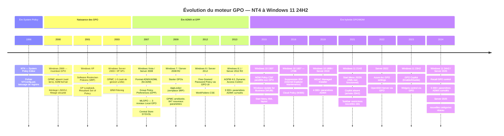

# GPO et versions Windows : compatibilité, dépréciations, paramètres fantômes

!!! abstract "Ce que vous allez apprendre"
    - La matrice de compatibilité complète NT4 → Windows 11 24H2 : innovations majeures du moteur GPO, ADMX disponibles, dépréciations par release
    - Les paramètres dépréciés critiques : IEM (Internet Explorer Maintenance), `DisallowRun`, restrictions XP sans équivalent moderne
    - Les innovations structurantes par version : MLGPO (Vista), Starter GPOs (7), AGPM 4.0 (8.1/2012R2), Cloud Policy et WUfB (10), Start Menu JSON (11)
    - Les différences ADMX spécifiques aux éditions Server : Server 2022 (Azure Arc, OpenSSH), Server 2025 (nouvelles catégories)
    - La divergence ADMX entre Windows 10 et Windows 11 : paramètres présents d'un côté, absents de l'autre, changements de clés de registre silencieux
    - La détection et la remédiation des **paramètres fantômes** : GPO configurées pour un ancien OS, persistantes dans AD, sans effet sur le parc actuel
    - Un script PowerShell de détection des paramètres fantômes exploitant les attributs `gPCMachineExtensionNames` et les clés de registre cibles


!!! tip "Si vous ne retenez qu'une chose"
    Une GPO ne s'auto-désactive jamais. Un paramètre configuré pour Windows XP en 2008 **existe toujours dans votre AD aujourd'hui**, s'applique à vos clients Windows 11, et écrit dans le registre une valeur que le système d'exploitation ignore silencieusement — ou pire, interprète différemment. Les paramètres fantômes ne génèrent aucune erreur. La seule défense est un audit proactif.


---

## :material-timeline: Chronologie et moteur GPO : NT4 → Windows 11 24H2

### :material-history: Les grandes ruptures architecturales

L'évolution du moteur GPO ne suit pas un rythme annuel régulier. Elle se structure autour de **cinq ruptures majeures** qui ont redéfini la portée et la maintenabilité des stratégies de groupe.

La première rupture est Windows 2000 : c'est l'invention de Group Policy telle qu'on la connaît. NT4 avait des System Policies, pas des GPO.

La deuxième rupture est Windows Vista / Server 2008 : introduction du format ADMX, des GPO Preferences (GPP), et de la gestion multi-niveau locale (MLGPO).

La troisième rupture est Windows 10 1507 : introduction du moteur MDM parallèle, de `CloudPolicy`, et des premiers paramètres `PolicyCSP` qui doublonnent les clés de registre GPO avec des chemins différents.

La quatrième rupture est Windows 11 21H2 : le Start Menu bascule d'un format XML vers JSON, cassant silencieusement toutes les GPO de verrouillage du Start Menu déployées pour Windows 10.

La cinquième rupture est Server 2025 / Windows 11 24H2 : intégration d'Azure Arc dans les ADMX, apparition des premières GPO de contrôle de fonctionnalités IA (Copilot, Recall, Widgets).

### :material-chart-timeline-variant: Diagramme chronologique



---
!!! quote "En résumé"
    - Le moteur GPO a connu cinq ruptures majeures : Windows 2000 (invention), Vista (ADMX + GPP), Windows 10 (MDM parallèle), Windows 11 (Start Menu JSON), Server 2025 (Azure Arc + IA).
    - Chaque rupture introduit des paramètres non rétrocompatibles et des dépréciations silencieuses.
    - Le nombre de paramètres ADMX est passé de ~700 (Windows 2000) à plus de 5 000 (Windows 11 24H2).

---

## :material-table: Matrice de compatibilité NT4 → Windows 11 24H2

### :material-grid: Tableau de référence complet

| Version OS | Innovations GPO majeures | ADMX disponibles | Dépréciations / Retraits notables |
|---|---|---|---|
| **NT4** | System Policy Editor, `NTConfig.pol`, tatouage de registre | N/A (format ADM non introduit) | — |
| **Windows 2000** | Invention des GPO, LSDOU, filtrage sécurité, WMI filtering (limité) | ~300 paramètres ADM (`system.adm`, `inetres.adm`) | System Policies NT4 remplacées (mais compatibles) |
| **Windows XP / Server 2003** | GPMC 1.0, SRP (Software Restriction Policies), GP Loopback, RSoP | ~500 paramètres ADM | — |
| **Windows Vista / Server 2008** | **Format ADMX**, GPP (18 CSE Preferences), MLGPO, Central Store | ~2 600 paramètres ADMX | Format ADM déprécié (encore supporté) |
| **Windows 7 / Server 2008 R2** | Starter GPOs, AppLocker, 847 nouveaux paramètres ADMX | ~3 400 paramètres | SRP déconseillé (AppLocker préféré) |
| **Windows 8 / Server 2012** | Work Folders CSE, FGPP via GPMC UI | ~3 700 paramètres | — |
| **Windows 8.1 / Server 2012 R2** | AGPM 4.0, Dynamic Access Control, CSE Work Folders stable | ~4 000 paramètres | — |
| **Windows 10 1507** | MDM Policy CSP, WUfB, Start Menu XML layout | ~4 100 paramètres | — |
| **Windows 10 1511–1607** | Cloud Policy (M365 Apps), **suppression IEM** | ~4 200 paramètres | **IEM supprimé** (Event ID 1085), IE Maintenance CSE retirée |
| **Windows 10 1703–1809** | WDAC (Windows Defender Application Control), delivery optimization GPO | ~4 400 paramètres | Aucun ADMX IE pour Edge Legacy |
| **Windows 10 1903–22H2** | Windows Update for Business étendu, Microsoft Edge ADMX (Chromium), WDAC Managed Installer | ~4 600 paramètres | Internet Explorer 11 retiré (juin 2022, 22H2) |
| **Windows 11 21H2** | Start Menu **JSON** (XML cassé), nouvelles clés Taskbar, restrictions Widgets | ~4 700 paramètres | Start Menu XML sans effet sur W11 |
| **Windows 11 22H2–23H2** | GPO Copilot, Widgets control, GPO Phishing Protection | ~4 850 paramètres | — |
| **Windows 11 24H2** | GPO Recall (Copilot+ PC), nouvelles clés réseau, paramètres ARM64 | ~5 000+ paramètres | Certains paramètres XP/Vista sans équivalent retirés des ADMX |
| **Server 2019** | WDAC Managed Installer, 4 000+ paramètres ADMX Server | ~4 500 paramètres | — |
| **Server 2022** | **Azure Arc GPO settings**, OpenSSH Server via GPO, Secured-Core | ~4 700 paramètres | — |
| **Server 2025** | Nouvelles catégories réseau (SMB over QUIC), contrôle Hyper-V avancé, intégration Azure Arc étendue | ~5 100 paramètres | — |

!!! info "Lecture du tableau"
    Les colonnes ADMX indiquent des ordres de grandeur cumulés. Le nombre exact varie selon la version des ADMX téléchargées depuis le Microsoft Download Center, qui publie des packages ADMX distincts par version d'OS.

---
!!! quote "En résumé"
    - Windows Vista est la rupture technique la plus importante pour les ADMX : passage au format XML, Central Store, et ajout des GPP.
    - Windows 10 1607 est le point de non-retour pour IEM : si votre environnement utilisait encore l'Internet Explorer Maintenance CSE à cette date, vos paramètres ont été silencieusement ignorés.
    - Windows 11 21H2 casse le déploiement du Start Menu XML sans avertissement.

---

## :material-alert-remove: Paramètres dépréciés : ce qui ne fonctionne plus

### :material-history-off: Tableau des dépréciations critiques

| Paramètre / CSE | Dernière version fonctionnelle | Comportement post-dépréciation | Remplacement recommandé |
|---|---|---|---|
| **Internet Explorer Maintenance (IEM)** — CSE `{A2E30F80-D7DE-11D2-BBDE-00C04F86AE3B}` | Windows 10 1511 | Event ID 1085 dans le journal GP Operational, paramètre ignoré silencieusement | Préférences IE via GPP Internet Settings, ou migration vers Microsoft Edge ADMX |
| **DisallowRun** — `HKCU\Software\Microsoft\Windows\CurrentVersion\Policies\Explorer\DisallowRun` | Windows 7 (fonctionnel mais contournable) | Paramètre appliqué mais inefficace sur les processus 64 bits et les applications Store | **AppLocker** (Publisher rules) ou **WDAC** |
| **Software Restriction Policies (SRP)** | Windows 10 21H1 (déprécié officiellement) | Appliqué mais sans support Microsoft, non évalué pour les processus PPID spoofing | **WDAC** (remplacement direct), AppLocker pour transition |
| **Group Policy Slow Link Detection** — anciens seuils XP | Windows 8.1 (seuils ignorés sur 10+) | Seuil de 500 kbps non pertinent, le moteur utilise les Network Location Awareness | Reconfigurer avec les paramètres `Configure Group Policy slow link detection` W10+ |
| **Folder Redirection — XP paths** (`%HOMEPATH%`) | Windows 7 | Chemin résolu différemment sur W10+ (espaces dans UPN), erreurs 569 | Variables `%USERNAME%` + GPP Environment |
| **Run Legacy Logon Scripts synchronously** | Windows 10 1903 | Paramètre ignoré en contexte Hybrid Azure AD Join | Scripts remplacés par PowerShell DSC ou Intune Proactive Remediation |
| **IE Enhanced Security Configuration via GPO User** | Windows 10 1607 | IEM CSE absente, paramètre sans effet | Microsoft Edge ADMX, zone de sécurité via registre direct GPP |
| **Wallpaper style — stretch (valeur 2)** | Windows 8 | Valeur remappée à `Fit` sur Windows 10+ | Utiliser les valeurs documentées W10 (0=Center, 2=Stretch, 6=Fit, 10=Fill, 22=Span) |
| **Outlook 2003/2007 ADMX** | Office 2016 / M365 | Clés de registre `Office\11.0` et `Office\12.0` non lues par Outlook 2019+ | Office ADMX M365 Apps pour Entreprise |

### :material-alert-circle-outline: L'Internet Explorer Maintenance en détail

L'IEM est le cas le plus fréquent de paramètre fantôme rencontré en environnement de production. Sa suppression n'a pas été annoncée par un assistant de migration — elle a eu lieu par retrait silencieux de la CSE.

Avant Windows 10 1607, la CSE IEM (`ieaksext.dll`) était présente et traitait les paramètres stockés dans la section `\Software\Policies\Microsoft\Internet Explorer\*` de la GPO. À partir de la 1607, cette DLL est absente.

Le résultat : `gpsvc` liste la CSE dans `gPCMachineExtensionNames`, tente de l'appeler, échoue, et écrit l'Event ID 1085 avec le code d'erreur `0x80070002` (fichier non trouvé). La GPO continue d'exister dans AD. Le paramètre continue d'apparaître dans GPMC (comme "Extra Registry Settings" ou dans la section IEM). Aucune erreur visible dans la console de gestion.

!!! warning "Production : Event ID 1085 = GPO fantôme"
    Un Event ID 1085 dans `Microsoft-Windows-GroupPolicy/Operational` sur un poste Windows 10 1607+ signifie qu'une CSE référencée dans la GPO est absente. Ce n'est pas une erreur réseau. C'est une CSE manquante, le plus souvent IEM. Cherchez et nettoyez immédiatement ces GPO.

```powershell title="Détecter les GPO avec CSE IEM encore référencée"
# Run on a domain controller or RSAT workstation
Import-Module GroupPolicy

$iemGuid = "{A2E30F80-D7DE-11D2-BBDE-00C04F86AE3B}"

Get-GPO -All | ForEach-Object {
    $gpo = $_
    $ad  = [ADSI]"LDAP://CN={$($gpo.Id)},CN=Policies,CN=System,$((Get-ADDomain).DistinguishedName)"
    $machExt = $ad.Properties["gPCMachineExtensionNames"].Value
    $userExt = $ad.Properties["gPCUserExtensionNames"].Value

    if (($machExt -like "*$iemGuid*") -or ($userExt -like "*$iemGuid*")) {
        [PSCustomObject]@{
            GPOName     = $gpo.DisplayName
            GPOId       = $gpo.Id
            Status      = $gpo.GpoStatus
            MachineExt  = $machExt -like "*$iemGuid*"
            UserExt     = $userExt -like "*$iemGuid*"
        }
    }
}
```

```powershell title="Résultat attendu"
GPOName            : IE - Intranet Zones Legacy
GPOId              : 3a4b2c1d-xxxx-xxxx-xxxx-xxxxxxxxxxxx
Status             : AllSettingsEnabled
MachineExt         : False
UserExt            : True
```

### :material-close-box-multiple-outline: DisallowRun vs AppLocker

`DisallowRun` est un paramètre de registre introduit sous Windows NT qui interdisait l'exécution de programmes listés par nom d'exécutable. Il est encore configurable via GPMC sous `User Configuration > Administrative Templates > System`.

Il ne fonctionne pas. Du moins, pas de manière fiable.

`DisallowRun` fonctionne en interceptant l'appel `CreateProcess` côté shell Explorer. Il ne bloque pas les processus lancés depuis un autre contexte (cmd.exe, PowerShell, service, tâche planifiée). Il ne couvre pas les applications Store (MSIX). Il ne couvre pas les processus 64 bits sur certaines configurations.

!!! warning "DisallowRun en production = fausse sécurité"
    Si vous avez des GPO `DisallowRun` actives dans votre domaine, elles donnent une illusion de contrôle d'application. Un utilisateur averti contourne en lançant l'exécutable depuis une invite PowerShell. Remplacez par AppLocker (Path rules au minimum) ou WDAC.

---
!!! quote "En résumé"
    - IEM a été supprimée silencieusement en Windows 10 1607. L'Event ID 1085 est le seul signal. Des milliers de domaines en production ont encore des GPO IEM actives sans le savoir.
    - `DisallowRun` est toujours configurable via GPMC mais ne constitue pas un contrôle d'application fiable. Remplacer par AppLocker ou WDAC.
    - SRP est officiellement déprécié depuis Windows 10 21H1. WDAC est le successeur architectural.

---

## :material-new-box: Innovations clés par version

### :material-eye: Vista / Server 2008 : la révolution GPP et ADMX

Windows Vista introduit deux évolutions qui changent durablement la manière de gérer les postes de travail en entreprise.

**Le format ADMX** remplace ADM. Les fichiers de modèles d'administration quittent les objets GPO pour rejoindre un dépôt central dans SYSVOL (`Policies\PolicyDefinitions\`). La taille de SYSVOL cesse de croître linéairement avec le nombre de GPO.

**Les Group Policy Preferences (GPP)** introduisent 18 nouvelles CSE capables de gérer des objets que les paramètres de stratégie ordinaires ne touchent pas : lecteurs réseau, imprimantes, sources de données ODBC, variables d'environnement, entrées de registre, fichiers et dossiers, raccourcis. GPP introduit également le mode Item-Level Targeting (ILT), permettant un ciblage granulaire par SID, adresse IP, nom de machine, version d'OS, ou appartenance à un groupe.

**MLGPO** (Multiple Local Group Policy Objects) permet de définir jusqu'à trois niveaux de GPO locales sur un poste : Local Computer Policy, Administrators Policy, et Non-Administrators Policy. Avant Vista, il n'existait qu'une seule GPO locale.

!!! info "GPP vs Paramètres de stratégie : la différence fondamentale"
    Un paramètre de stratégie **enforce** : il s'applique, et l'utilisateur ne peut pas le modifier tant que la GPO est en vigueur. Un GPP **configure** : il applique une valeur par défaut que l'utilisateur peut ensuite modifier (sauf si l'option "Apply once and do not reapply" est décochée). Cette distinction est architecturale et détermine le choix entre les deux mécanismes.

### :material-security: Windows 7 / Server 2008 R2 : AppLocker et Starter GPOs

Windows 7 introduit **AppLocker** comme successeur de SRP. La différence architecturale est fondamentale : SRP évalue les règles côté processus parent, AppLocker évalue côté SID utilisateur avec un service dédié (`AppIDSvc`).

Les **Starter GPOs** permettent de créer des modèles de GPO réutilisables contenant un sous-ensemble de paramètres. Une Starter GPO ne peut contenir que des paramètres `Administrative Templates`. Elle sert de point de départ lors de la création d'une nouvelle GPO.

Le GPMC 2.0 intégré à Windows 7 apporte 847 nouveaux paramètres ADMX, notamment les premières politiques de contrôle de Windows Update et de gestion de l'énergie.

### :material-server: Windows 8.1 / Server 2012 R2 : AGPM 4.0 et DAC

**AGPM 4.0** (Advanced Group Policy Management) atteint sa maturité. Il introduit le contrôle de version des GPO, la délégation granulaire des droits de modification, et le workflow d'approbation. AGPM stocke une copie contrôlée des GPO dans une base AGPM distincte de SYSVOL.

**Dynamic Access Control (DAC)** introduit des stratégies d'accès centralisées configurables via GPO. Les règles DAC s'appuient sur des claims utilisateurs et des propriétés de ressources, une couche d'autorisation au-dessus des ACL NTFS classiques.

La CSE **Work Folders** permet de configurer les paramètres de synchronisation des Work Folders via GPO — URL du serveur, chiffrement obligatoire, politiques de mot de passe.

### :material-cloud: Windows 10 (1507–22H2) : l'ère hybride GPO/MDM

Windows 10 introduit un moteur de politique parallèle aux GPO : le **MDM Policy CSP** (Configuration Service Provider). Pour un poste joint à Azure AD ou en co-gestion, les deux moteurs peuvent s'appliquer simultanément.

!!! warning "Conflit GPO / MDM : qui gagne ?"
    Par défaut, MDM gagne sur GPO pour les paramètres en conflit sur un poste Azure AD joint. Ce comportement est contrôlé par la clé `MDMWinsOverGP` dans `HKLM\Software\Policies\Microsoft\PolicyCSP\`. Si ce paramètre est à 1, MDM override les GPO correspondantes silencieusement — sans erreur dans les journaux GPO.

**Windows Update for Business (WUfB)** introduit une gestion des mises à jour via GPO indépendante de WSUS. Les paramètres sont dans `Computer Configuration > Administrative Templates > Windows Components > Windows Update > Windows Update for Business`.

**Start Menu XML layout** (Windows 10 1507–21H1) permet de déployer un Start Menu verrouillé via un fichier XML référencé dans la GPO `StartLayout`. Ce mécanisme fonctionne exclusivement sur Windows 10. Il est sans effet sur Windows 11.

**WDAC** (Windows Defender Application Control) arrive avec Windows 10 1507 comme successeur architectural de SRP et concurrent de AppLocker. Il opère en mode noyau, s'appuie sur une politique XML compilée en `.p7b`, et peut être déployé via GPO ou MDM.

Le tableau ci-dessous résume les grands jalons ADMX de la branche Windows 10 :

| Build Windows 10 | Nouveaux ADMX notables | Changements structurels |
|---|---|---|
| 1507 | WUfB, MDM Enrollment, Start Layout | Premier PolicyCSP |
| 1511 | Credential Guard, Virtualization Based Security | — |
| 1607 | **Suppression IEM**, Windows Defender ATP | LTSB 2016 |
| 1703 | WDAC, Delivery Optimization | — |
| 1709 | Windows Hello for Business étendu | — |
| 1809 | Windows Sandbox (absent des ADMX), WDAC Managed Installer | LTSC 2019 |
| 1903–1909 | Cortana restrictions, Teams Machine-Wide | — |
| 2004–21H1 | **Microsoft Edge (Chromium) ADMX**, SRP déprécié officiellement | ~4 600 paramètres |
| 21H2–22H2 | Cloud PC (Windows 365) settings | LTSC 2021 |

### :material-microsoft-windows: Windows 11 (21H2–24H2) : ruptures et nouveautés

#### :material-menu: Start Menu JSON : la rupture silencieuse

Windows 11 abandonne le format XML pour le Start Menu. La GPO `StartLayout` (qui pointe vers un fichier `.xml`) n'a aucun effet sur Windows 11. Aucune erreur n'est générée. Le Start Menu conserve sa disposition par défaut.

La gestion du Start Menu sous Windows 11 passe par un fichier JSON déployé via `LayoutModification.json`, placé dans `%SystemDrive%\Users\Default\AppData\Local\Microsoft\Windows\Shell\` — ou via la GPO `Start_ConfigureStartPins` (disponible dans les ADMX Windows 11 22H2+).

!!! warning "GPO StartLayout XML active sur un parc mixte W10/W11"
    Si votre parc est en cours de migration vers Windows 11 et que vous avez des GPO `StartLayout` XML actives, elles continuent à fonctionner sur Windows 10 et sont silencieusement ignorées sur Windows 11. Il n'y a pas de GPO unique compatible avec les deux. Vous devez déployer deux GPO distinctes filtrées par version d'OS via WMI Filter ou ciblage sur des OUs séparées.

#### :material-robot: Copilot, Recall et Widgets

**Copilot** (apparu avec Windows 11 23H2) est contrôlable via la GPO `TurnOffWindowsCopilot` dans `User Configuration > Administrative Templates > Windows Components > Windows Copilot`. La valeur de registre est `HKCU\Software\Policies\Microsoft\Windows\WindowsCopilot\TurnOffWindowsCopilot` (DWORD, 1 = désactivé).

**Recall** (fonctionnalité Copilot+, 24H2) est contrôlable via `DisableAIDataAnalysis` dans `HKLM\Software\Policies\Microsoft\Windows\WindowsAI\`.

**Widgets** est contrôlable depuis Windows 11 21H2 via `AllowWidgets` dans `HKLM\Software\Policies\Microsoft\Dsh\`.

#### :material-dock-bottom: Restrictions Taskbar

Windows 11 introduit de nouvelles clés de registre pour la barre des tâches, distinctes des clés Windows 10.

| Paramètre | Clé Windows 10 | Clé Windows 11 | Via ADMX W11 ? |
|---|---|---|---|
| Masquer la barre des tâches | `TaskbarAl` absent, `Shell_TrayWnd` | Nouvelle clé `TaskbarAl` (alignement) | Non, registre direct |
| Masquer la zone de recherche | `SearchboxTaskbarMode` | `SearchboxTaskbarMode` (même clé) | Oui |
| Désactiver le bouton Chat (Teams) | Absent | `TaskbarMn` | Oui (ADMX 21H2+) |
| Désactiver le bouton Widgets | Absent | `AllowWidgets` | Oui |
| Désactiver la vue Tâches | `ShowTaskViewButton` | `ShowTaskViewButton` (même clé) | Oui |

### :material-server-network: Server 2022 et Server 2025 : paramètres spécifiques serveur

#### :material-cloud-sync: Server 2022 : Azure Arc et OpenSSH

Server 2022 introduit des paramètres ADMX spécifiques à l'édition Server, absents des ADMX clients.

**Azure Arc** : les paramètres `AzureArcSetup\*` permettent de contrôler l'enrôlement automatique dans Azure Arc via GPO. Ces paramètres sont dans les ADMX Server 2022 uniquement.

**OpenSSH Server** : le service OpenSSH peut être configuré via GPO sur Server 2022 — activation du service, configuration du port d'écoute, restrictions d'accès. Ces paramètres ne sont pas présents dans les ADMX Windows 10/11.

**Secured-Core Server** : les paramètres de Virtualization Based Security (VBS), Hypervisor Protected Code Integrity (HVCI) et Secure Boot sont disponibles dans les ADMX Server 2022 avec une granularité supérieure aux éditions client.

### :material-server-plus: Windows Server 2025

Windows Server 2025 reprend la base 24H2 et ajoute des catégories à traiter dans les baselines serveur : **SMB over QUIC**, durcissement NTLM SMB, OpenSSH Server et Hotpatching. Ces paramètres doivent être validés avec les ADMX Server 2025, pas seulement avec le kit ADMX Windows 11.

#### :material-lan-connect: SMB over QUIC

SMB over QUIC publie SMB via UDP 443, avec certificat TLS côté serveur. Les GPO à documenter dans une baseline Server 2025 sont :

| Cible | Chemin GPO | Usage |
|---|---|---|
| Serveur | `Configuration ordinateur > Modèles d'administration > Réseau > Serveur Lanman > Activer SMB over QUIC` | Autoriser ou bloquer SMB over QUIC côté file server |
| Client | `Configuration ordinateur > Modèles d'administration > Réseau > Station de travail Lanman > Activer SMB over QUIC` | Autoriser ou bloquer les connexions SMB over QUIC sortantes |
| Client | `Configuration ordinateur > Modèles d'administration > Réseau > Station de travail Lanman > Liste d'exceptions des serveurs SMB over QUIC désactivés` | Autoriser certains serveurs même si SMB over QUIC est désactivé côté client |

!!! warning "Certificats"
    La GPO ne remplace pas le prérequis certificat. Le FQDN utilisé par les clients doit correspondre au certificat du serveur ; évitez les adresses IP pour ne pas retomber sur des scénarios NTLM fragiles.

#### :material-shield-key: NTLM blocking et rate limiter SMB

Server 2025 renforce le contrôle NTLM côté SMB. Commencez par l'audit, puis activez le blocage par anneaux.

| Besoin | Chemin GPO |
|---|---|
| Bloquer NTLM côté client SMB | `Configuration ordinateur > Modèles d'administration > Réseau > Station de travail Lanman > Bloquer NTLM` |
| Déclarer des exceptions | `Configuration ordinateur > Modèles d'administration > Réseau > Station de travail Lanman > Exceptions au blocage NTLM` |
| Régler le rate limiter d'authentification | `Configuration ordinateur > Modèles d'administration > Réseau > Serveur Lanman > Délai des échecs d'authentification SMB` |

!!! warning "Noms ADMX variables"
    Les libellés exacts du rate limiter peuvent varier selon la révision ADMX Server 2025. Si le paramètre n'apparaît pas dans GPMC, pilotez-le par PowerShell/registre après validation sur un serveur pilote.

#### :material-console-network: OpenSSH Server

OpenSSH Server fait partie des fonctionnalités Windows à intégrer aux baselines hybrides. La GPO ne suffit pas à définir toute la configuration `sshd_config`, mais elle doit au minimum couvrir :

- installation/présence de la fonctionnalité OpenSSH Server ;
- état du service `sshd` et type de démarrage ;
- règles de pare-feu sur TCP 22 limitées aux sous-réseaux d'administration ;
- groupes autorisés, par exemple `SSH-Admins`, via `AllowGroups` dans `sshd_config`.

#### :material-update: Hotpatching et Config Refresh

Hotpatching réduit certains redémarrages, mais dépend de l'édition, d'Azure Arc et de l'abonnement. Traitez-le comme une capacité de gestion de correctifs, pas comme une simple GPO.

Config Refresh est hérité de la vague 24H2 : sur Server 2025, il doit être pris en compte dans les baselines car il peut réappliquer des paramètres de sécurité même sans changement de version GPO.

#### :material-format-list-checks: Impact baseline

La baseline Server 2025 du Security Compliance Toolkit doit devenir la référence de comparaison. Les écarts à isoler en revue :

- GPO SMB over QUIC serveur/client ;
- NTLM blocking et exceptions temporaires ;
- configuration OpenSSH et firewall ;
- Hotpatching via Azure Arc quand applicable ;
- Config Refresh et effets de réapplication.

Pour l'audit SMB over QUIC côté client, surveillez `Applications and Services Logs > Microsoft > Windows > SMBClient > Connectivity`, notamment l'Event ID `30832`.

!!! info "ADMX Server vs ADMX Client : ne pas mélanger"
    Les ADMX téléchargés depuis le kit ADMX Windows 11 ne contiennent pas les paramètres Server 2025. Et inversement. Pour un parc mixte client/serveur, le Central Store doit être alimenté avec les deux sets d'ADMX. En cas de conflit de namespace (même fichier `.admx`, versions différentes), la version la plus récente doit remplacer l'ancienne.

---
!!! quote "En résumé"
    - Vista : ADMX + GPP = les deux piliers de la gestion GPO moderne.
    - Windows 10 : l'ère hybride GPO/MDM commence. `MDMWinsOverGP` peut silencieusement invalider des GPO.
    - Windows 11 : le Start Menu XML est mort. Deux mécanismes distincts pour W10 et W11, sans ADMX commune.
    - Server 2022/2025 : des paramètres spécifiques serveur (Azure Arc, OpenSSH, SMB over QUIC, NTLM blocking, Config Refresh) ne se trouvent que dans les ADMX Server.

---

## :material-code-not-equal: Divergence ADMX Windows 10 / Windows 11

### :material-swap-horizontal: Paramètres présents dans un set, absents de l'autre

La divergence ADMX entre Windows 10 et Windows 11 n'est pas documentée dans un changelog officiel consolidé. Elle se découvre opérationnellement, lors d'une migration de parc.

Le tableau suivant liste les divergences les plus impactantes en production :

| Paramètre | Présent W10 ADMX | Présent W11 ADMX | Clé de registre | Impact si divergent |
|---|---|---|---|---|
| `StartLayout` (XML) | Oui | **Non** | `HKCU\Software\Policies\Microsoft\Windows\Explorer\LockedStartLayout` | GPO sans effet sur W11, silencieux |
| `Start_ConfigureStartPins` (JSON) | **Non** | Oui (22H2+) | `HKLM\Software\Policies\Microsoft\Windows\Explorer\LockedStartLayout` | Nouveau paramètre W11 uniquement |
| `AllowNewsAndInterests` (Widgets W10) | Oui (21H1) | **Remplacé** par `AllowWidgets` | Clé différente entre W10 et W11 | Double paramètre nécessaire |
| `TurnOffWindowsCopilot` | **Non** (Copilot absent) | Oui (23H2+) | `HKCU\Software\Policies\Microsoft\Windows\WindowsCopilot\` | N/A sur W10 |
| `ShowSyncProviderNotifications` | Oui | Oui (même clé) | `HKCU\Software\Policies\Microsoft\Windows\Explorer\` | Compatible |
| `ConfigureStartPinnedList` | **Non** | Oui (24H2) | `HKLM\Software\Policies\Microsoft\Windows\Explorer\` | W11 24H2 uniquement |
| `DisableSearchBoxSuggestions` | Oui | **Comportement différent** | `HKCU\Software\Policies\Microsoft\Windows\Explorer\` | Même clé, sémantique différente selon l'OS |
| `HideFileExt` (masquer extensions) | Oui | Oui | `HKCU\Software\Microsoft\Windows\CurrentVersion\Explorer\Advanced\` | Compatible, clé identique |
| `NoTaskbarClock` | Oui | **Ignoré** (nouvelle implémentation horloge) | `HKCU\Software\Microsoft\Windows\CurrentVersion\Policies\Explorer\` | Clé lue mais sans effet sur W11 22H2+ |
| `Task_ShowTaskViewButton` | Oui | Oui | `HKCU\Software\Microsoft\Windows\CurrentVersion\Explorer\Advanced\` | Compatible |

### :material-magnify-scan: Paramètres fantômes : détection des clés obsolètes

Un **paramètre fantôme** (stranded setting) est un paramètre GPO qui :

1. Est configuré dans un objet GPO existant dans AD.
2. S'applique à des objets (postes ou utilisateurs) qui ont migré vers une version d'OS qui ne lit plus la clé de registre concernée.
3. Ne génère aucun événement d'erreur, aucun avertissement dans GPMC.
4. Consomme du temps de traitement GPO pour un résultat nul.

La détection manuelle est impossible à l'échelle. Un script PowerShell exploitant `Get-GPOReport` et une liste de clés de registre connues comme obsolètes est la seule approche viable.

```powershell title="Detect-StrandedGPOSettings.ps1 — Audit des paramètres fantômes"
#Requires -Modules GroupPolicy, ActiveDirectory

<#
.SYNOPSIS
    Identifies GPO settings targeting registry keys known to be ignored
    on Windows 10 1607+ or Windows 11.
.DESCRIPTION
    Generates an XML report for every GPO, then searches for registry
    keys flagged as stranded. Outputs a CSV report.
.PARAMETER OutputPath
    Path to the output CSV file. Defaults to .\stranded-settings.csv
#>
param(
    [string]$OutputPath = ".\stranded-settings.csv"
)

# Registry keys known to be stranded (no effect on target OS)
$strandedKeys = @(
    @{
        Key     = "Software\Policies\Microsoft\Internet Explorer"
        Reason  = "IEM CSE removed in Windows 10 1607 — Event ID 1085"
        LastOS  = "Windows 10 1511"
    },
    @{
        Key     = "Software\Microsoft\Windows\CurrentVersion\Policies\Explorer\DisallowRun"
        Reason  = "DisallowRun bypassed by non-Explorer process launchers"
        LastOS  = "Windows 7 (unreliable)"
    },
    @{
        Key     = "Software\Policies\Microsoft\Windows\Explorer\LockedStartLayout"
        Reason  = "Start Menu XML layout has no effect on Windows 11"
        LastOS  = "Windows 10 21H1"
    },
    @{
        Key     = "Software\Microsoft\Windows\CurrentVersion\Policies\Explorer\NoTaskbarClock"
        Reason  = "NoTaskbarClock ignored on Windows 11 22H2+ (new clock implementation)"
        LastOS  = "Windows 11 21H2"
    },
    @{
        Key     = "Software\Policies\Microsoft\Windows\System\AllowNewsAndInterests"
        Reason  = "Replaced by AllowWidgets on Windows 11 — different key path"
        LastOS  = "Windows 10 21H1"
    }
)

$results = [System.Collections.Generic.List[PSCustomObject]]::new()

Write-Host "Retrieving all GPOs..." -ForegroundColor Cyan
$allGPOs = Get-GPO -All

$total = $allGPOs.Count
$i     = 0

foreach ($gpo in $allGPOs) {
    $i++
    Write-Progress -Activity "Scanning GPOs" -Status "$($gpo.DisplayName)" `
        -PercentComplete (($i / $total) * 100)

    try {
        # Export GPO report as XML
        [xml]$report = Get-GPOReport -Guid $gpo.Id -ReportType Xml -ErrorAction Stop
    }
    catch {
        Write-Warning "Cannot retrieve report for GPO '$($gpo.DisplayName)': $_"
        continue
    }

    # Collect all registry key values from Computer and User configuration
    $regSettings = $report.GPO.Computer.ExtensionData.Extension.RegistrySetting +
                   $report.GPO.User.ExtensionData.Extension.RegistrySetting |
                   Where-Object { $_ -ne $null }

    foreach ($setting in $regSettings) {
        $keyPath = $setting.KeyPath

        foreach ($stranded in $strandedKeys) {
            if ($keyPath -like "*$($stranded.Key)*") {
                $results.Add([PSCustomObject]@{
                    GPOName     = $gpo.DisplayName
                    GPOId       = $gpo.Id
                    GPOStatus   = $gpo.GpoStatus
                    KeyPath     = $keyPath
                    ValueName   = $setting.Value.Name
                    StrandedKey = $stranded.Key
                    Reason      = $stranded.Reason
                    LastOS      = $stranded.LastOS
                })
            }
        }
    }
}

Write-Progress -Activity "Scanning GPOs" -Completed

if ($results.Count -eq 0) {
    Write-Host "No stranded settings found." -ForegroundColor Green
}
else {
    $results | Export-Csv -Path $OutputPath -NoTypeInformation -Encoding UTF8
    Write-Host "$($results.Count) stranded setting(s) found. Report: $OutputPath" `
        -ForegroundColor Yellow
    $results | Format-Table GPOName, KeyPath, Reason, LastOS -AutoSize
}
```

```powershell title="Résultat attendu"
GPOName                        KeyPath                                                  Reason                                          LastOS
-------                        -------                                                  ------                                          ------
IE - Intranet Zones Legacy     Software\Policies\Microsoft\Internet Explorer\Main       IEM CSE removed in Windows 10 1607              Windows 10 1511
Start Menu - HQ Standard       Software\Policies\Microsoft\Windows\Explorer\LockedSta… Start Menu XML layout has no effect on Win 11   Windows 10 21H1
Desktop Restrictions v2        Software\Microsoft\Windows\CurrentVersion\Policies\Expl DisallowRun bypassed by non-Explorer launchers  Windows 7 (unreliable)

3 stranded setting(s) found. Report: .\stranded-settings.csv
```

### :material-tools: Remédiation des paramètres fantômes

La remédiation suit une logique en trois phases.

**Phase 1 — Triage.** Identifier les GPO actives (status `AllSettingsEnabled` ou `ComputerSettingsEnabled` / `UserSettingsEnabled`) qui contiennent des paramètres fantômes. Les GPO désactivées ne sont pas urgentes.

**Phase 2 — Décision.** Pour chaque paramètre fantôme détecté, trois options : désactiver le paramètre dans la GPO (si remplacé par un mécanisme moderne), créer une GPO de remplacement ciblant la nouvelle clé, ou documenter et accepter (si le paramètre est inoffensif et que la migration MDM est en cours).

**Phase 3 — Validation.** Après modification, exécuter `gpupdate /force` sur un poste pilote et vérifier avec `gpresult /h` que le paramètre fantôme n'apparaît plus dans "Applied" et ne génère plus d'Event ID 1085 dans le journal `Microsoft-Windows-GroupPolicy/Operational`.

!!! warning "Ne pas supprimer une GPO fantôme sans audit des liaisons"
    Avant de désactiver ou de supprimer une GPO contenant des paramètres fantômes, vérifier qu'elle ne contient pas aussi d'autres paramètres encore valides. `Get-GPOReport` ou le panneau Settings de GPMC donnent la vue complète. Une GPO peut contenir 50 paramètres valides et 2 paramètres fantômes.

---
!!! quote "En résumé"
    - La divergence ADMX W10/W11 est réelle et non documentée de manière centralisée. Les paramètres Start Menu, Widgets, Taskbar Clock sont les plus fréquemment impactés.
    - Un paramètre fantôme ne génère aucune erreur dans GPMC. Il faut un audit proactif par script.
    - Le script `Detect-StrandedGPOSettings.ps1` ci-dessus exploite `Get-GPOReport` pour comparer les clés de registre configurées à une liste de clés connues comme obsolètes.
    - La remédiation commence par le triage des GPO actives, puis la décision paramètre par paramètre.

---

## :material-link: Références croisées

Ce chapitre couvre la dimension temporelle et la compatibilité entre versions. Pour les thématiques connexes :

- **Gestion des ADMX multi-versions** — structure XML, namespace, Central Store : [05-admx-adml.md](05-admx-adml.md)
- **Central Store et stratégie de versioning des ADMX** — organisation pour parc multi-versions : [../gpo-pour-les-admins/04-central-store.md](../gpo-pour-les-admins/04-central-store.md)
- **Spécificités Windows 11 pour débutants** — guide d'introduction aux nouveautés GPO W11 : [../gpo-pour-les-nuls/14-windows11.md](../gpo-pour-les-nuls/14-windows11.md)
- **AppLocker et WDAC** — pour remplacer SRP et DisallowRun : [15-applocker-wdac.md](15-applocker-wdac.md)
- **GPO et MDM : convergence** — coexistence GPO/Intune et gestion du conflit `MDMWinsOverGP` : [25-mdm-convergence.md](25-mdm-convergence.md)

!!! quote "En résumé"
    - À relire : 05-admx-adml.md.
    - À relire : ../gpo-pour-les-admins/04-central-store.md.
    - À relire : ../gpo-pour-les-nuls/14-windows11.md.
    - À relire : 15-applocker-wdac.md.
    - Ces renvois prolongent le chapitre avec des mécanismes complémentaires ou des cas d’usage voisins.
