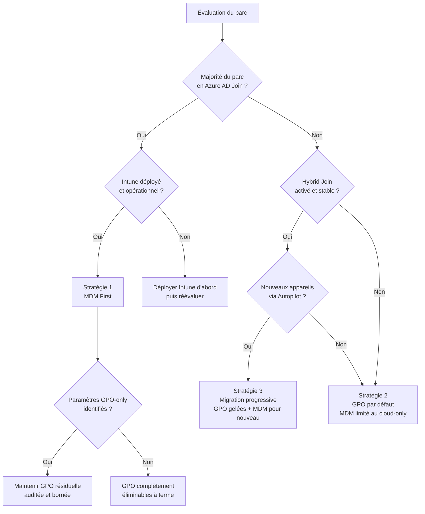

# GPO et MDM : convergence et coexistence

!!! abstract "Ce que vous allez apprendre"
    - L'architecture MDM côté Windows : les **Configuration Service Providers (CSP)**, le chemin OMA-URI canonique, et comment `PolicyManager` stocke les valeurs gagnantes dans le registre
    - La relation directe entre un paramètre ADMX et son équivalent OMA-URI **ADMX-backed** dans Intune — et pourquoi `PolicyManager\current` est toujours dominé par MDM en cas de conflit
    - Les zones sans recouvrement : paramètres disponibles **uniquement en GPO** (DCs, héritage ADMX sans CSP) et paramètres disponibles **uniquement en MDM** (Autopilot, Zero Touch, fonctions cloud-only)
    - Les trois stratégies de coexistence architecturales et le **decision tree** basé sur la maturité cloud de l'organisation
    - Le comportement de **Windows Autopilot** vis-à-vis des GPO : timing d'application, OOBE vs post-OOBE, Hybrid Join vs Azure AD Join
    - La **pile de configuration complète** (BIOS → Autopilot → CSP → GPO → Applications) et quel couche gagne à chaque niveau
    - La trajectoire réaliste de la convergence GPO/MDM selon la feuille de route Microsoft 2026+


!!! tip "Si vous ne retenez qu'une chose"
    MDM et GPO ne sont pas en guerre — ils écrivent dans des clés de registre **différentes**. La clé MDM (`PolicyManager\current`) est lue en priorité par les composants modernes. La clé GPO (`SOFTWARE\Policies\`) est lue en priorité par les composants legacy. Maîtriser quelle couche gagne sur quel paramètre est la compétence centrale de l'architecte hybride.


---

## :material-cellphone-cog: Architecture MDM : CSP, OMA-URI et PolicyManager

### :material-file-tree: Les Configuration Service Providers

Un **Configuration Service Provider (CSP)** est un composant Windows qui expose une interface de configuration standardisée au moteur MDM. Chaque CSP gère un domaine fonctionnel : politiques de sécurité, certificats, Wi-Fi, pare-feu, etc.

Le CSP le plus important pour la convergence GPO/MDM est **Policy CSP**. Il expose la quasi-totalité des paramètres de stratégie de groupe sous forme d'URI adressables.

L'adressage OMA-URI suit une structure stricte :

```
./Device/Vendor/MSFT/Policy/Config/<Area>/<PolicyName>
./User/Vendor/MSFT/Policy/Config/<Area>/<PolicyName>
```

Le préfixe `./Device/` cible la configuration machine. Le préfixe `./User/` cible la configuration utilisateur, analogue à la hive `HKCU` des GPO.

### :material-database: La ruche PolicyManager

Quand le client MDM (service `dmwappushservice` + `DeviceEnrollmentService`) reçoit une politique, il écrit le résultat dans la ruche `HKLM\SOFTWARE\Microsoft\PolicyManager\`.

Cette ruche contient quatre sous-clés structurantes :

| Sous-clé | Rôle |
|---|---|
| `PolicyManager\default\` | Valeurs par défaut du système, jamais modifiées par une politique active |
| `PolicyManager\device\` | Valeurs envoyées par le serveur MDM pour le contexte machine |
| `PolicyManager\user\<SID>\` | Valeurs envoyées par le serveur MDM pour un utilisateur spécifique |
| `PolicyManager\current\` | **Valeur effective calculée** — la valeur réellement lue par les composants |

La sous-clé `current\` est recalculée à chaque synchronisation MDM. C'est elle qui représente l'état appliqué.

```powershell title="Inspect-PolicyManager.ps1"
# Read all effective MDM policy values from PolicyManager\current
# Requires elevation

$basePath = 'HKLM:\SOFTWARE\Microsoft\PolicyManager\current\device'

Get-ChildItem -Path $basePath -Recurse -ErrorAction SilentlyContinue |
    Get-ItemProperty -ErrorAction SilentlyContinue |
    Select-Object PSChildName, * -ExcludeProperty PS* |
    Where-Object { $_.PSObject.Properties.Count -gt 1 } |
    Format-Table -AutoSize
```

```powershell title="Résultat attendu"
PSChildName                     value  providerName
-----------                     -----  ------------
AllowCamera                     0      MDM_DeviceLock
DisableAntiSpyware              0      MDM_Security
AllowIndexingEncryptedStoresOrI 0      MDM_Search
```

!!! info "providerName"
    Le champ `providerName` indique la source qui a posé la valeur gagnante : `MDM_*` pour une valeur issue d'Intune ou d'un autre serveur MDM, `GP_*` pour une valeur issue d'une GPO traitée via ADMX-backed. En cas de conflit sur le même paramètre, `MDM_*` l'emporte.

### :material-scale-balance: Règle de précédence MDM vs GPO

La précédence dépend du chemin de registre lu par le composant Windows concerné.

| Composant | Lit d'abord | Fallback |
|---|---|---|
| Composants modernes (WinRT, Defender, Edge moderne) | `PolicyManager\current\` | `SOFTWARE\Policies\` |
| Composants legacy (MMC snap-ins, GPP, IE) | `SOFTWARE\Policies\` | — |
| Paramètres Security Settings | `SOFTWARE\Policies\Microsoft\Windows\` | — |

!!! warning "Conflit silencieux"
    Si une GPO et une politique MDM configurent le même paramètre via des chemins différents, **aucune erreur n'est générée**. Le composant lit la clé qu'il connaît. Un composant moderne peut lire la valeur MDM pendant qu'un outil de diagnostic GPO (RSoP, `gpresult`) affiche la valeur GPO. Les deux rapportent "appliqué" — mais avec des valeurs opposées.

!!! quote "En résumé"
    Le CSP Policy expose les paramètres Windows sous forme d'OMA-URI `./Device/Vendor/MSFT/Policy/Config/...`. Le client MDM stocke les valeurs dans `PolicyManager\current\` — la clé effective. En cas de conflit, les composants modernes lisent MDM en priorité. Les composants legacy lisent les `SOFTWARE\Policies\` GPO. Les conflits sont silencieux.

---

## :material-map-marker-path: Mapping GPO → CSP : les ADMX-backed policies

### :material-link: Le pont entre les deux mondes

Une **ADMX-backed policy** est une politique Intune qui configure un paramètre ADMX via OMA-URI plutôt que via la GPMC. Du côté Windows, le mécanisme de réception est identique à une GPO : le CSP ingeste la valeur et écrit dans la clé de registre cible identique à celle qu'aurait écrite la GPO.

Le chemin OMA-URI d'une ADMX-backed policy suit le format :

```
./Device/Vendor/MSFT/Policy/Config/<ADMX_AreaName>~Policy~<CategoryPath>/<PolicyName>
```

Exemple pour le paramètre `Turn off Windows Defender` (zone `WindowsDefender`) :

```
./Device/Vendor/MSFT/Policy/Config/WindowsDefender~Policy~WindowsDefender/DisableAntiSpyware
```

### :material-magnify: Identifier le mapping d'un paramètre GPO

Pour trouver l'équivalent OMA-URI d'une GPO existante, trois sources sont exploitables :

1. **La documentation MDM de Microsoft** — chaque paramètre Policy CSP est documenté avec son mapping ADMX sur [docs.microsoft.com](https://docs.microsoft.com/en-us/windows/client-management/mdm/policy-csp-admx-windowsdefender)
2. **Le fichier ADMX lui-même** — l'attribut `key` du nœud `<policy>` donne la clé de registre cible ; si le même chemin existe dans la doc Policy CSP, le mapping est confirmé
3. **L'Intune Settings Catalog** — la console Intune expose les ADMX-backed policies sous `Devices → Configuration → Settings Catalog` avec un champ de recherche textuel

```powershell title="Find-ADMXPolicyMapping.ps1"
# Extract registry key and value name from an ADMX file for a named policy
# Usage: point $admxPath to a local ADMX file, set $policyName to search

param(
    [string]$admxPath = 'C:\Windows\PolicyDefinitions\WindowsDefender.admx',
    [string]$policyName = 'DisableAntiSpyware'
)

[xml]$admx = Get-Content -Path $admxPath -Encoding UTF8

$policy = $admx.policyDefinitions.policies.policy |
    Where-Object { $_.name -eq $policyName }

if ($policy) {
    [PSCustomObject]@{
        PolicyName   = $policy.name
        RegistryKey  = $policy.key
        RegistryValue = $policy.valueName
        Class        = $policy.class   # Machine or User
        SupportedOn  = $policy.supportedOn.ref
    }
} else {
    Write-Warning "Policy '$policyName' not found in $admxPath"
}
```

```powershell title="Résultat attendu"
PolicyName    : DisableAntiSpyware
RegistryKey   : SOFTWARE\Policies\Microsoft\Windows Defender
RegistryValue : DisableAntiSpyware
Class         : Machine
SupportedOn   : SUPPORTED_WindowsVista
```

### :material-fire: Exemple concret : règle de pare-feu

Le paramètre **Windows Firewall — Domain Profile — Firewall State** illustre parfaitement le double chemin.

| Chemin | Valeur |
|---|---|
| **GPMC** | `Computer Config → Policies → Windows Settings → Security Settings → WFAS → Domain Profile → Firewall state` |
| **Clé GPO** | `HKLM\SOFTWARE\Policies\Microsoft\WindowsFirewall\DomainProfile\EnableFirewall` |
| **OMA-URI MDM** | `./Device/Vendor/MSFT/Policy/Config/Firewall~Policy~MDMFirewall~DomainProfile/EnableFirewall` |
| **Clé PolicyManager** | `HKLM\SOFTWARE\Microsoft\PolicyManager\current\device\Firewall\EnableDomainNetworkFirewall` |

!!! warning "Clés différentes, même effet"
    GPO et MDM écrivent dans des clés distinctes. Le composant pare-feu (`MpsSvc`) lit **les deux** et applique la valeur la plus restrictive. En pratique, si la GPO active le pare-feu et que MDM le désactive (valeur `0`), le composant modern lit MDM en priorité — le pare-feu est désactivé malgré la GPO active.

!!! quote "En résumé"
    Les ADMX-backed policies permettent à Intune de configurer des paramètres ADMX sans GPO. L'OMA-URI encode l'espace de nommage ADMX. La clé de registre **cible** est identique à celle de la GPO, mais la clé PolicyManager source est distincte. Le Settings Catalog Intune est la surface de découverte recommandée.

### Group Policy Analytics

`Group Policy Analytics` dans Intune importe des rapports GPO au format XML et indique quels paramètres disposent d'un équivalent MDM.
Il sert à préparer une migration, pas à convertir automatiquement toute l'architecture GPO.

Flux recommandé :

1. Exporter le rapport XML depuis `gpmc.msc` ou `Get-GPOReport`.
2. Importer le fichier dans `Devices → Manage devices → Group Policy analytics`.
3. Lire le pourcentage de support MDM, les paramètres inconnus, obsolètes ou non supportés.
4. Créer une politique Settings Catalog uniquement pour les paramètres supportés et validés.
5. Piloter sur un groupe restreint avant de délier la GPO historique.

```powershell title="Exporter une GPO pour Group Policy Analytics"
Get-GPOReport -Name "SEC-WKS-Defender-Baseline" `
    -ReportType Xml `
    -Path "C:\Temp\SEC-WKS-Defender-Baseline.xml"
```

| Résultat Analytics | Lecture |
|---|---|
| `MDM Support = Yes` | Mapping disponible vers Intune / Settings Catalog ou CSP |
| `MDM Support = No` | Pas d'équivalent MDM documenté |
| `Deprecated` | Paramètre hérité, à remplacer ou supprimer |
| `Unknown settings` | Paramètre détecté mais non interprété par l'outil |

!!! warning "Limites à connaître"
    Microsoft documente des limites de taille et d'encodage pour les rapports importés.
    L'outil peut aussi être moins fiable avec certains exports non anglais ou paramètres non ADMX ; ne migrez pas sans validation fonctionnelle.

!!! quote "En résumé"
    Group Policy Analytics est un outil d'analyse et de tri.
    Il accélère la migration GPO → Intune, mais ne remplace ni la revue technique ni le pilote.

---

## :material-puzzle: Zones sans recouvrement : GPO-only et MDM-only

### :material-alert-circle: Ce que GPO peut faire et MDM ne peut pas

Certains domaines restent exclusifs aux GPO en 2026. La raison principale est architecturale : MDM gère des machines, pas des services d'annuaire.

Les paramètres GPO sans équivalent CSP documenté incluent :

| Paramètre GPO | Raison de l'absence MDM |
|---|---|
| `Default Domain Password Policy` | Paramètre AD DS, pas un paramètre machine |
| `Default Domain Controllers Policy` | Cible des DCs, pas des clients MDM |
| `Kerberos Policy` (tickets, clocks) | Paramètre realm AD, géré par la configuration du domaine |
| `Wireless Network (IEEE 802.11) Policies` (héritage XP/7) | Remplacé par Wi-Fi CSP mais pas mappé 1:1 |
| `Internet Explorer Maintenance (IEM)` | Déprécié, aucun équivalent MDM ni CSP |
| `Folder Redirection` (mode avancé multi-profils) | Partiellement remplacé par OneDrive Known Folder Move, non équivalent |
| `Software Installation (MSI via GPO)` | Déprécié côté MDM, remplacé par Win32 App Intune |
| `Scripts GPP — Drive Maps` | Aucun CSP pour le mappage réseau persistant |
| `Scripts GPP — Printers` (imprimantes réseau partagées) | Universal Print remplace, non équivalent legacy |
| `Fine-Grained Password Policies (PSO)` | Objet AD PSO, aucun pendant MDM |

### :material-cloud-check: Ce que MDM peut faire et GPO ne peut pas

Les fonctionnalités MDM-only sont liées à l'identité cloud et au cycle de vie de l'appareil :

| Fonctionnalité MDM | Raison de l'exclusivité |
|---|---|
| **Windows Autopilot** — profil de déploiement Zero Touch | Nécessite Azure AD, aucun analogue domaine |
| **Autopilot Self-Deploying Mode** | Provisionnement sans interaction utilisateur, OOBE contrôlée par MDM |
| **Enrollment Status Page (ESP)** | Page de blocage OOBE gérée par Intune uniquement |
| **Windows Hello for Business — Cloud Trust** | Mode Cloud Kerberos, nécessite Azure AD Kerberos |
| **Microsoft Store for Business** — attribution d'apps | Gestion par UPN cloud, aucun équivalent GPO |
| **Conditional Access Device Compliance** | Évaluation de conformité Intune envoyée à Azure AD |
| **Update Rings WUfB** (mises à jour par ring cloud) | Séquençage cloud, GPO WUfB partiel uniquement |
| **Remote Wipe / Fresh Start via Intune** | Action cloud sur appareil, aucun équivalent GPO |
| **Windows LAPS Azure AD** (rotation cloud) | Mode Azure, distinct de Windows LAPS on-prem |
| **Endpoint Analytics** — score de santé | Télémétrie cloud Intune, inexistant côté GPO |

### :material-code-braces: Détecter les gaps programmatiquement

```powershell title="Find-GPOWithoutCSP.ps1"
# Identify GPO registry settings that have no known PolicyManager equivalent
# Compares SOFTWARE\Policies\ values with PolicyManager\current\ keys

# Step 1: collect all values written by GPO under Software\Policies
$gpoPolicies = Get-ChildItem -Path 'HKLM:\SOFTWARE\Policies\Microsoft' `
    -Recurse -ErrorAction SilentlyContinue |
    Get-ItemProperty -ErrorAction SilentlyContinue

# Step 2: collect all area names present in PolicyManager\current\device
$mdmAreas = Get-ChildItem -Path `
    'HKLM:\SOFTWARE\Microsoft\PolicyManager\current\device' `
    -ErrorAction SilentlyContinue |
    Select-Object -ExpandProperty PSChildName

# Step 3: flag GPO subkeys with no PolicyManager counterpart
$results = foreach ($policy in $gpoPolicies) {
    $keyFragment = ($policy.PSPath -split 'Microsoft\\')[1]
    $hasMdmEquivalent = $mdmAreas | Where-Object {
        $keyFragment -like "*$_*"
    }
    if (-not $hasMdmEquivalent) {
        [PSCustomObject]@{
            RegistryPath = $policy.PSChildName
            GPOSubKey    = $keyFragment
            MDMEquivalent = 'NOT FOUND'
        }
    }
}

$results | Format-Table -AutoSize
```

!!! info "Limitations du script"
    Ce script donne une approximation. La correspondance entre clés GPO et areas PolicyManager n'est pas bijective. Certains paramètres MDM utilisent des noms d'area différents du nom de sous-clé GPO. La documentation Microsoft reste la référence normative pour confirmer l'absence de CSP.

!!! quote "En résumé"
    Les GPO-only incluent tout ce qui touche à AD DS (DCs, Kerberos, PSO), aux scripts GPP réseaux, et aux technologies dépréciées sans successeur CSP. Les MDM-only incluent Autopilot, le cycle de vie cloud, et la conformité conditionnelle. Ces zones ne se chevauchent pas et ne se remplaceront probablement jamais.

---

## :material-transit-connection-variant: Stratégies de coexistence

### :material-strategy: Les trois architectures

Il n'existe pas de stratégie universelle. Le choix dépend de la maturité cloud, du parc existant et des délais de migration.

**Stratégie 1 — MDM First, GPO by Exception**

MDM gère l'intégralité de la configuration. Les GPO ne subsistent que pour les paramètres sans équivalent CSP documenté (DCs, Kerberos, Drive Maps legacy).

*Prérequis :* Azure AD Join ou Hybrid Join activé, Intune déployé, parc Windows 10 1903+ minimum.

*Risque principal :* Les GPO résiduelles sont difficiles à gouverner sur le long terme — absence d'outillage de reporting unifié entre GPMC et Intune.

**Stratégie 2 — GPO par défaut, MDM pour le cloud-only**

L'AD on-prem reste le canal primaire. MDM est ajouté uniquement pour les fonctionnalités requérant Azure AD (Autopilot, WHfB Cloud Trust, Conditional Access).

*Prérequis :* Hybrid Join fonctionnel, synchronisation AAD Connect stable.

*Risque principal :* Conflits silencieux sur les paramètres qui existent dans les deux couches. Un audit de superposition est obligatoire.

**Stratégie 3 — Configuration gelée, migration progressive**

La configuration GPO existante est maintenue sans évolution. Les nouveaux paramètres sont systématiquement posés en MDM. L'objectif est de migrer les GPO existantes vers MDM sur 18-36 mois en utilisant le Settings Catalog comme guide de migration.

*Prérequis :* Gel de production accepté, roadmap de migration documentée.

*Risque principal :* Dérive progressive vers la stratégie 1 sans gouvernance claire.

### :material-table: Tableau comparatif des stratégies

| Stratégie | Maturité cloud requise | Effort initial | Risque de conflit | Gouvernance long terme |
|---|---|---|---|---|
| MDM First | Élevée (AAD Join majoritaire) | Élevé | Faible si GPO résiduelle bien bornée | Simple (Intune seul) |
| GPO par défaut | Faible à moyenne (Hybrid Join) | Faible | **Élevé** sans audit de superposition | Complexe (deux outils) |
| Migration progressive | Moyenne | Moyen | Moyen pendant la transition | Moyenne (roadmap nécessaire) |

### :material-sitemap: Decision tree : quelle stratégie choisir



!!! warning "Hybrid Join n'est pas une étape intermédiaire"
    Beaucoup d'organisations traitent Hybrid Join comme une étape transitoire vers Azure AD Join pur. En pratique, les contraintes légales, de supervision réseau ou de dépendance Kerberos on-prem font que Hybrid Join devient permanent. Dimensionner la stratégie de coexistence pour la durée réelle, pas pour la durée théorique de migration.

!!! quote "En résumé"
    Trois stratégies couvrent la majorité des cas : MDM First (cloud mature), GPO par défaut (AD dominant), migration progressive (transition). Le choix dépend du statut de l'identité (AAD Join vs Hybrid Join) et de la présence opérationnelle d'Intune. Aucune stratégie n'élimine les GPO à court terme pour les paramètres AD DS-only.

---

## :material-rocket-launch: Windows Autopilot et les GPO

### :material-timeline-clock: Timing d'application des GPO

Windows Autopilot et les GPO répondent à des cycles de vie différents. Comprendre leur séquençage évite les erreurs de déploiement.

**Azure AD Join pur (Autopilot standard)**

Les GPO ne s'appliquent jamais. L'appareil n'est pas membre d'un domaine AD DS. Toute la configuration passe par MDM. L'ESP (Enrollment Status Page) bloque le bureau jusqu'à la fin de l'application des politiques Intune.

**Hybrid Azure AD Join (Autopilot Hybrid)**

Les GPO s'appliquent **après** la jonction au domaine. Cette jonction nécessite une première connexion réseau au DC, ce qui intervient après le redémarrage post-OOBE.

La séquence complète est :

```
OOBE → Autopilot Profile download → AAD Join → MDM Enrollment
→ ESP phase Device Setup (MDM policies)
→ Reboot → Domain Join (Hybrid) → First foreground GPO processing
→ ESP phase Account Setup → User logon
```

!!! warning "GPO absentes pendant l'OOBE"
    Pendant la phase OOBE Autopilot — y compris en mode Hybrid — les GPO ne sont jamais appliquées. Les paramètres de sécurité critiques (BitLocker, restrictions UAC, pare-feu) **doivent** être configurés via MDM/CSP pour être actifs dès la première session. Les GPO ne prennent le relais qu'au premier refresh background après la jonction domaine.

### :material-compare: Ce qui s'applique à chaque phase

| Phase | MDM (CSP) | GPO |
|---|---|---|
| OOBE — Device Setup ESP | Oui (bloquant si requis) | Non |
| OOBE — Account Setup ESP | Oui | Non |
| Premier logon (AAD Join pur) | Oui (refresh) | Non (jamais) |
| Premier logon (Hybrid Join) | Oui | Non (DC pas encore joint) |
| Deuxième logon (Hybrid, DC accessible) | Oui | **Oui — premier refresh GPO** |
| Logons suivants | Oui | Oui |

### :material-cog-transfer: ADMX-backed via Intune sur appareils Autopilot

Sur les appareils Autopilot AAD Join purs, il est possible de pousser des paramètres ADMX via le Settings Catalog Intune. Le mécanisme est identique aux ADMX-backed policies décrites plus haut.

```powershell title="Verify-AutopilotMDMPolicies.ps1"
# Check which MDM policies are active on an Autopilot-enrolled device
# Run on the enrolled device — no domain membership required

$mdmDiagPath = "$env:TEMP\MDMDiag_$(Get-Date -Format 'yyyyMMdd_HHmmss')"
New-Item -ItemType Directory -Path $mdmDiagPath -Force | Out-Null

# Generate MDM diagnostic report
MdmDiagnosticsTool.exe -area DeviceEnrollment+DeviceProvisioning -zip "$mdmDiagPath\diag.zip"

# Read PolicyManager current values directly
$policyPath = 'HKLM:\SOFTWARE\Microsoft\PolicyManager\current\device'
$policies = Get-ChildItem -Path $policyPath -Recurse -ErrorAction SilentlyContinue |
    Get-ItemProperty -ErrorAction SilentlyContinue |
    Select-Object PSChildName, * -ExcludeProperty PS*

Write-Host "Active MDM policy areas on this device:" -ForegroundColor Cyan
$policies | Where-Object { $_.PSObject.Properties.Count -gt 2 } |
    Group-Object -Property PSChildName |
    Select-Object Name, Count |
    Sort-Object Count -Descending |
    Format-Table -AutoSize
```

!!! info "MdmDiagnosticsTool.exe"
    `MdmDiagnosticsTool.exe` est présent sur tout Windows 10/11 sous `C:\Windows\System32\`. Il génère un ZIP contenant les logs d'enrollment, les politiques appliquées et l'état de conformité — sans nécessiter d'élévation pour certaines zones. C'est l'équivalent MDM de `gpresult /h`.

!!! quote "En résumé"
    Sur Autopilot AAD Join pur, les GPO ne s'appliquent jamais. Sur Autopilot Hybrid Join, les GPO s'appliquent au deuxième logon minimum, après la jonction domaine. Les paramètres de sécurité OOBE doivent impérativement être couverts par MDM. Les ADMX-backed policies Intune couvrent la majorité des paramètres GPO sur les appareils non-joints.

---

## :material-layers-triple: La pile de configuration complète

Le diagramme suivant représente l'intégralité de la pile de configuration Windows, de la couche matérielle aux applications, avec les annotations de précédence à chaque niveau.

```mermaid
flowchart TD
    subgraph HW["Couche 0 — Matériel"]
        BIOS["BIOS / UEFI\nSecure Boot, TPM, BIOS password\nPrécédence : absolue — software ne peut pas contourner"]
    end

    subgraph PROV["Couche 1 — Provisionnement"]
        AP["Windows Autopilot\nProfil de déploiement, ESP, OOBE\nPrécédence : configure le tenant MDM avant toute session"]
        WCD["Windows Configuration Designer\nProvisioning Packages (.ppkg)\nPrécédence : appliqué avant MDM enrollment si on-device"]
    end

    subgraph MDM["Couche 2 — MDM (Configuration Service Providers)"]
        CSP["Policy CSP / autres CSPs\nPolicyManager\\current\\\nPrécédence : gagne sur GPO pour composants modernes"]
        COMP["Compliance Policy\nEvaluation de conformité → Conditional Access\nBloque l'accès si non conforme, indépendamment des GPO"]
    end

    subgraph GPO["Couche 3 — Group Policy (GPO)"]
        MACHINE["Computer Configuration\nSOFTWARE\\Policies\\\nPrécédence : gagne sur GPP et Local Policy"]
        USER["User Configuration\nHKCU\\Software\\Policies\\\nPrécédence : soumise à LSDOU, loopback"]
        GPP["Group Policy Preferences\nPrécédence : la plus basse — peut être remplacée par l'utilisateur"]
    end

    subgraph LOCAL["Couche 4 — Configuration locale"]
        LGPO["Local GPO (MLGPO)\nPrécédence : la plus basse des GPO, dominée par AD GPO"]
        REG["Paramètres utilisateur\nHKCU sans Policies\\\nPrécédence : dominée par GPO et MDM"]
    end

    subgraph APP["Couche 5 — Applications"]
        APPCONF["Configuration applicative\nHKCU\\Software\\<vendor>\\\nPrécédence : aucune sur les couches système"]
    end

    BIOS --> AP
    AP --> WCD
    WCD --> CSP
    CSP --> COMP
    COMP --> MACHINE
    MACHINE --> USER
    USER --> GPP
    GPP --> LGPO
    LGPO --> REG
    REG --> APPCONF

    style HW fill:#1a1a2e,color:#e0e0e0,stroke:#4a4a6a
    style PROV fill:#16213e,color:#e0e0e0,stroke:#4a4a6a
    style MDM fill:#0f3460,color:#e0e0e0,stroke:#4a6a9a
    style GPO fill:#1a3a5c,color:#e0e0e0,stroke:#4a6a9a
    style LOCAL fill:#162447,color:#e0e0e0,stroke:#4a6a9a
    style APP fill:#1f1f1f,color:#c0c0c0,stroke:#4a4a4a
```



### :material-information: Annotations de précédence

**BIOS/UEFI** est la seule couche incontournable. Un Secure Boot activé et un TPM 2.0 requis imposent des contraintes que ni MDM ni GPO ne peuvent modifier depuis Windows.

**Autopilot** configure l'identité et l'enrollment avant toute politique. L'ESP peut bloquer l'accès au bureau jusqu'à ce que les politiques MDM soient appliquées.

**Policy CSP** domine sur les composants modernes. La ruche `PolicyManager\current\` est la source de vérité pour Defender, Edge Chromium, les restrictions AAD.

**GPO Machine** domine sur tous les paramètres legacy et les composants qui lisent `SOFTWARE\Policies\`. La jonction domaine est requise.

**GPP et Local GPO** sont les couches les plus basses et les plus facilement écrasées. Elles ne doivent pas porter de paramètres de sécurité critiques.

!!! quote "En résumé"
    La pile a six couches : BIOS, provisionnement, MDM, GPO, configuration locale, applications. La précédence descend du hardware vers le software. MDM et GPO sont au même niveau conceptuel mais lisent des clés différentes — il n'y a pas de "winner absolu" entre les deux, seulement un winner par composant consommateur.

---

## :material-telescope: Vision 2026+ : convergence réaliste

### :material-road: La feuille de route Microsoft

Microsoft n'a pas annoncé la fin des GPO. Le signal le plus clair de la feuille de route est l'**Intune Settings Catalog** : une interface qui expose des milliers de paramètres issus à la fois de Policy CSP et d'ADMX, dans une surface unifiée, sans nécessiter la GPMC.

En 2026, trois trajectoires sont confirmées :

**1. Le Settings Catalog comme interface de convergence**

Le Settings Catalog Intune dépasse désormais 5 000 paramètres configurables. Microsoft y intègre systématiquement les nouveaux paramètres Windows avant de les exposer dans les ADMX. Pour les appareils AAD Join, c'est déjà la surface primaire recommandée.

**2. La documentation des gaps GPO/CSP**

Microsoft publie et maintient une liste officielle des paramètres Policy CSP avec leur équivalent ADMX. Cette liste s'allonge à chaque version de Windows. Le nombre de paramètres GPO sans équivalent CSP diminue — mais ne disparaît pas.

**3. La pérennité des GPO pour les environnements AD DS**

Les GPO ne sont pas dépréciées. Les DCs, les politiques Kerberos, les PSO, et la configuration du domaine AD resteront gérés par GPO pour la durée prévisible. Microsoft ne propose aucun mécanisme MDM pour configurer un contrôleur de domaine.

### :material-chart-line: Ce que GPO fera toujours mieux que MDM

| Domaine | Pourquoi GPO reste supérieure |
|---|---|
| Configuration des contrôleurs de domaine | Les DCs ne sont pas enrollés en MDM |
| Politiques Kerberos du domaine | Paramètres realm AD DS, aucun CSP prévu |
| Fine-Grained Password Policies | Objets PSO dans AD, hors portée MDM |
| Redirection de dossiers vers serveur de fichiers on-prem | OneDrive Known Folder Move ne remplace pas tous les cas |
| Scripts GPP complexes avec dépendances domaine | L'exécution dans le contexte domaine est requise |
| Gouvernance multi-domaine complexe (LSDOU, WMI filters avancés) | MDM ne modélise pas la hiérarchie OU |

### :material-lightbulb: Ce que MDM fera toujours mieux que GPO

| Domaine | Pourquoi MDM reste supérieure |
|---|---|
| Gestion des appareils hors réseau d'entreprise | MDM fonctionne sur tout réseau internet ; GPO nécessite DC ou VPN |
| Provisionnement Zero Touch (Autopilot) | Aucun équivalent GPO pour l'OOBE cloud |
| Conformité conditionnelle (Conditional Access) | Intégration AAD native, aucun pendant GPO |
| Gestion BYOD et appareils personnels | Enrollment MDM possible sans jonction domaine |
| Déploiement d'applications modernes (Store, Win32 via Intune) | GPO Software Installation est déprécié |

### :material-check-decagram: L'Intune Settings Catalog comme convergence pratique

Pour un architecte en 2026, l'approche pragmatique est la suivante :

1. **Paramètre nouveau** → chercher d'abord dans le Settings Catalog Intune
2. **Paramètre existant en GPO** → vérifier si le Settings Catalog expose l'équivalent avant de migrer
3. **Paramètre GPO sans équivalent CSP** → maintenir en GPO, documenter dans le registre de la dette technique
4. **Paramètre AD DS / DC** → GPO uniquement, définitivement

```powershell title="Export-SettingsCatalogGaps.ps1"
# Compare active GPO registry settings with known PolicyManager areas
# to identify candidates for Settings Catalog migration

# Enumerate all Computer Configuration GPO registry values
$gpoKeys = Get-ChildItem -Path 'HKLM:\SOFTWARE\Policies' -Recurse `
    -ErrorAction SilentlyContinue

# Enumerate PolicyManager areas (MDM-managed settings)
$mdmKeys = Get-ChildItem -Path `
    'HKLM:\SOFTWARE\Microsoft\PolicyManager\current\device' `
    -ErrorAction SilentlyContinue |
    Select-Object -ExpandProperty PSChildName

$report = foreach ($key in $gpoKeys) {
    $relPath = $key.PSPath -replace '.*SOFTWARE\\Policies\\', ''
    $mdmCoverage = if ($mdmKeys | Where-Object { $relPath -like "*$_*" }) {
        'MDM equivalent found'
    } else {
        'GPO-only — no MDM equivalent detected'
    }
    [PSCustomObject]@{
        GPOPath      = $relPath
        MDMCoverage  = $mdmCoverage
    }
}

$report | Sort-Object MDMCoverage | Format-Table -AutoSize -Wrap
```

```powershell title="Résultat attendu"
GPOPath                                          MDMCoverage
-------                                          -----------
Microsoft\Windows Defender\DisableAntiSpyware    MDM equivalent found
Microsoft\Windows\WindowsUpdate\AU\NoAutoUpdate  MDM equivalent found
Microsoft\Windows NT\CurrentVersion\Winlogon\... GPO-only — no MDM equivalent detected
Microsoft\Windows\Kerberos\...                   GPO-only — no MDM equivalent detected
```

!!! info "Convergence ≠ remplacement"
    Le terme "convergence" dans la feuille de route Microsoft désigne l'unification des surfaces de configuration — pas le remplacement des GPO par MDM. Le Settings Catalog est une interface qui peut piloter les deux mécanismes. La GPMC restera l'outil AD DS. La convergence est une couche d'abstraction, pas une migration forcée.

!!! quote "En résumé"
    Le Settings Catalog Intune est l'interface de convergence — il expose GPO et CSP dans une surface unifiée pour les appareils managés MDM. Les GPO resteront le mécanisme exclusif pour tout ce qui touche à AD DS. La trajectoire 2026+ est une complémentarité stable, non une substitution. L'enjeu n'est pas de choisir entre GPO et MDM — c'est de savoir précisément quel outil couvre quel paramètre.

---

## :material-bookshelf: Références croisées

Ce chapitre est le dernier de la Bible GPO. Les sujets traités s'articulent avec les chapitres suivants du livre **GPO pour les Admins** :

- [Chapitre 18 — Azure AD Hybrid Join](../gpo-pour-les-admins/18-azure-ad-hybrid.md) — configuration de la jonction hybride, prérequis AAD Connect, coexistence des identités
- [Chapitre 19 — Migration vers Intune](../gpo-pour-les-admins/19-migration-intune.md) — méthodologie de migration GPO → Settings Catalog, outils d'analyse, déploiement progressif
- [Chapitre 25 — Zero Trust et GPO](../gpo-pour-les-admins/25-zero-trust.md) — architecture Zero Trust, rôle des GPO dans le modèle de confiance moderne, Conditional Access


!!! quote "En résumé"
    - À relire : Chapitre 18 — Azure AD Hybrid Join.
    - À relire : Chapitre 19 — Migration vers Intune.
    - À relire : Chapitre 25 — Zero Trust et GPO.
    - Ces renvois prolongent le chapitre avec des mécanismes complémentaires ou des cas d’usage voisins.
    - Gardez ces chapitres sous la main pour le diagnostic ou la conception d’une GPO liée à ce thème.
---
!!! abstract "Ce que vous avez appris dans ce chapitre"
    - `PolicyManager\current\` est la clé de vérité MDM — les composants modernes la lisent en priorité sur `SOFTWARE\Policies\`
    - Les ADMX-backed policies Intune écrivent dans la même clé de registre que la GPO équivalente, mais via un chemin PolicyManager distinct
    - Les conflits MDM/GPO sont silencieux — aucun événement d'erreur n'est généré ; l'audit actif est obligatoire
    - Les GPO-only incluent tout le périmètre AD DS (DCs, Kerberos, PSO) — permanent, non remplaçable par MDM
    - Les MDM-only incluent Autopilot, la conformité conditionnelle, et la gestion hors réseau — permanent, non remplaçable par GPO
    - Sur Autopilot Hybrid Join, les GPO ne s'appliquent pas avant le deuxième logon minimum — les paramètres OOBE critiques doivent être en MDM
    - Le Settings Catalog Intune est la surface de convergence — pas un remplacement, une abstraction unifiée
    - La trajectoire 2026+ est une coexistence stable : GPO pour AD DS, MDM pour le cloud, Settings Catalog comme pont entre les deux
