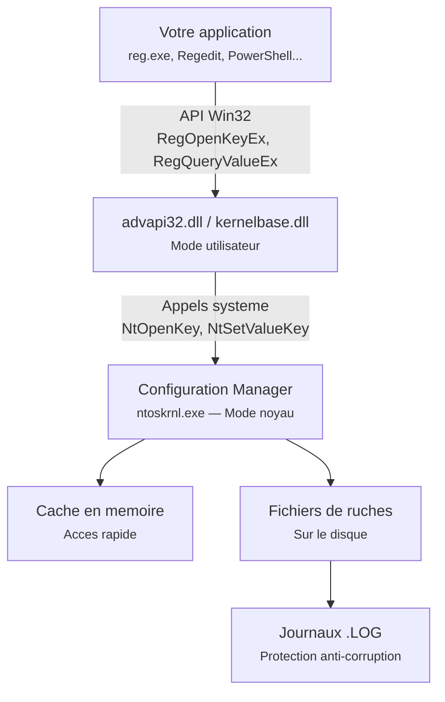
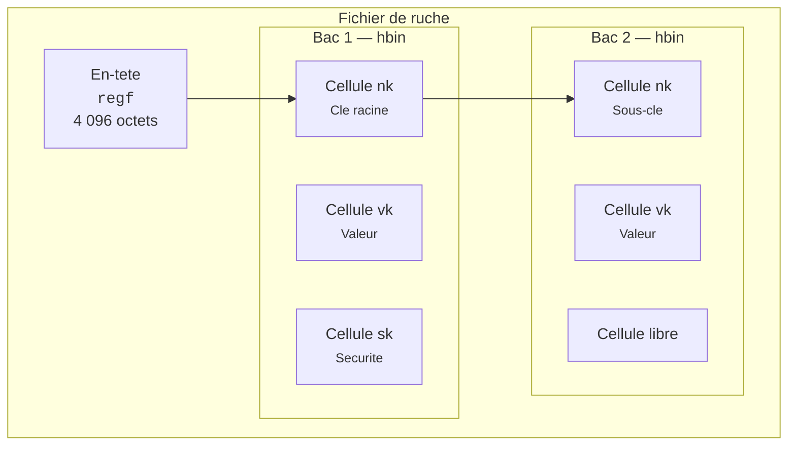
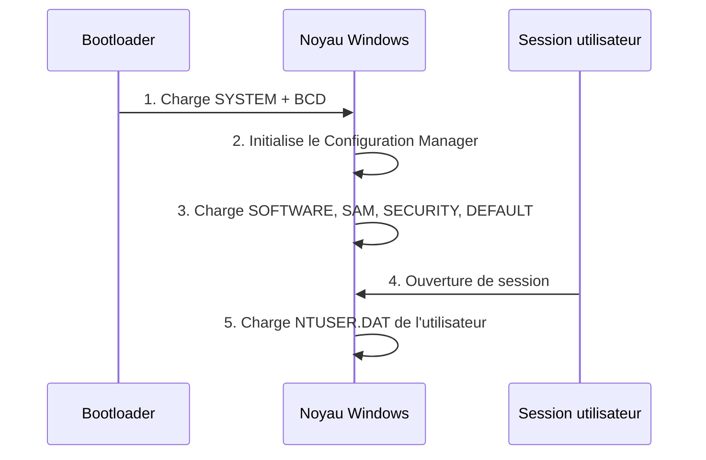

---
tags:
  - registre
  - architecture
---

# Architecture et structure

## Ce que vous allez apprendre

- Comment Windows gere le registre en coulisses (le Configuration Manager)
- La structure binaire interne d'un fichier de ruche
- Le systeme de cellules, bacs et en-tetes
- Comment la journalisation protege vos donnees contre la corruption
- Les limites techniques du registre

---

## Vue d'ensemble : qui gere le registre ?

Quand vous appelez `reg query`, votre commande traverse **trois couches** avant d'atteindre le fichier sur le disque :



Le **Configuration Manager** (*CmpMgr*) est un composant du noyau Windows (`ntoskrnl.exe`).
C'est lui qui charge, met en cache, synchronise et enregistre les ruches.

!!! tip "Analogie"
    Le Configuration Manager est comme un **bibliothecaire**. Vous ne touchez jamais directement les livres sur les etageres (les fichiers sur le disque). Vous demandez au bibliothecaire, qui va chercher l'information, la garde en memoire pour les prochaines demandes, et note soigneusement toute modification dans un journal avant de l'appliquer.

!!! info "En resume"
    - Les acces au registre traversent 3 couches : API Win32, appels systeme, puis le Configuration Manager dans le noyau
    - Le Configuration Manager (`ntoskrnl.exe`) est le seul composant qui lit et ecrit les fichiers de ruche sur le disque
    - Un cache memoire et des journaux `.LOG` assurent performance et integrite

---

## Structure interne d'une ruche

Un fichier de ruche (ex : `SYSTEM`, `SOFTWARE`) est un fichier binaire structure.
Ouvrons le capot.

### L'en-tete (*Base Block*) : la carte d'identite

Les **4 096 premiers octets** du fichier contiennent les metadonnees de la ruche.
C'est sa carte d'identite.

| Offset | Taille | Champ | Description |
|--------|--------|-------|-------------|
| `0x00` | 4 | Signature | `regf` (0x66676572) -- identifie le fichier comme une ruche |
| `0x04` | 4 | Sequence 1 | Incremente **avant** chaque ecriture |
| `0x08` | 4 | Sequence 2 | Incremente **apres** chaque ecriture |
| `0x0C` | 8 | Horodatage | Derniere modification (format FILETIME) |
| `0x14` | 4 | Version majeure | Generalement `1` |
| `0x18` | 4 | Version mineure | `3` pour NT 3.5, `5` pour XP / Server 2003, `6` pour Vista et versions ulterieures |
| `0x1C` | 4 | Type | `0` = fichier principal |
| `0x20` | 4 | Format | `1` = memoire directe |
| `0x24` | 4 | Offset cle racine | Pointe vers la cellule de la cle racine |
| `0x28` | 4 | Taille des donnees | Taille totale des donnees de la ruche |

!!! note "Les numeros de sequence : un filet de securite"
    Si Sequence 1 et Sequence 2 sont **differents**, cela signifie qu'une ecriture a ete interrompue (coupure de courant, crash). Au prochain demarrage, Windows utilise les journaux `.LOG` pour restaurer la coherence. C'est comme un **carnet a double signature** : si la deuxieme signature manque, on sait que l'operation n'a pas ete terminee.

---

### Les cellules (*Cells*) : les briques de base

Apres l'en-tete, toutes les donnees sont organisees en **cellules**.
Chaque cellule commence par un entier signe de 4 octets indiquant sa taille :

| Signe de la taille | Signification |
|---------------------|---------------|
| **Negatif** | Cellule **allouee** (en cours d'utilisation) |
| **Positif** | Cellule **libre** (disponible) |

!!! example "Analogie"
    C'est comme un parking : une place occupee a un panneau "reserve" (negatif), une place libre a un panneau "disponible" (positif).

Les principaux **types de cellules** :

| Type | Signature | Contenu |
|------|-----------|---------|
| Cellule de cle | `nk` | Nom de la cle, horodatage, pointeurs vers sous-cles et valeurs |
| Cellule de valeur | `vk` | Nom, type de donnees, donnees ou pointeur vers les donnees |
| Liste de sous-cles | `lf`, `lh`, `ri`, `li` | Index trie des sous-cles d'une cle |
| Cellule de securite | `sk` | Descripteur de securite (ACL) partage entre plusieurs cles |

---

### Les bacs (*Bins*) : les conteneurs

Les cellules sont regroupees dans des **bacs** (*bins*).
Chaque bac fait un multiple de **4 096 octets** (taille d'une page memoire).

| Offset | Taille | Champ | Description |
|--------|--------|-------|-------------|
| `0x00` | 4 | Signature | `hbin` (0x6E696268) |
| `0x04` | 4 | Offset | Position du bac depuis le debut des donnees |
| `0x08` | 4 | Taille | Taille totale du bac |
| `0x14` | 8 | Horodatage | Date de creation (FILETIME) |

!!! tip "Analogie"
    Si les cellules sont des **boites**, les bacs sont les **etageres** qui contiennent ces boites. Chaque etagere a une etiquette (`hbin`) et une taille fixe.

Voici comment tout s'emboite :



!!! info "En resume"
    Un fichier de ruche = un **en-tete** `regf` + une serie de **bacs** `hbin` contenant des **cellules** (`nk`, `vk`, `sk`, listes). C'est une structure comme des poupees russes : fichier > bacs > cellules.

---

## Le Configuration Manager en detail

### Chargement des ruches : un ballet ordonne

Les ruches ne sont pas toutes chargees en meme temps.
Le demarrage suit un ordre precis :



| Etape | Ruches chargees | Par qui |
|-------|-----------------|---------|
| 1 | `SYSTEM`, `BCD` | Bootloader (avant le noyau !) |
| 2 | Reprise des ruches du bootloader | Configuration Manager |
| 3 | `SOFTWARE`, `SAM`, `SECURITY`, `DEFAULT` | Initialisation systeme |
| 4 | `NTUSER.DAT` | Ouverture de session utilisateur |

---

### Cache en memoire : la vitesse avant tout

Le Configuration Manager ne lit pas le disque a chaque acces. Il utilise un **cache en memoire** :

- Les bacs sont **mappes en memoire** a la demande
- Les bacs frequemment accedes **restent en memoire**
- Un mecanisme appele *lazy flusher* ecrit les modifications sur le disque de maniere **asynchrone** (toutes les quelques secondes)

!!! tip "Analogie"
    C'est comme un serveur de restaurant qui garde les plats les plus commandes en cuisine plutot que de retourner au cellier a chaque commande. Les modifications sont notees sur un bon, puis envoyees en cuisine quand le serveur a un moment.

### Clés volatiles : ce qui ne touche jamais le disque

Toutes les clés du registre ne correspondent pas à un stockage persistant sur disque.
Certaines sont **volatiles** : elles existent uniquement en mémoire et ne sont jamais écrites dans un fichier de ruche.

Au niveau API Win32, ce comportement est demandé avec le flag `REG_OPTION_VOLATILE` lors d'un appel comme `RegCreateKeyEx`.
La clé est alors créée dans l'espace du registre en mémoire, mais sans support persistant.

Concrètement :

- elle apparaît normalement dans Regedit ou via PowerShell
- elle peut contenir des sous-clés et des valeurs
- elle disparaît entièrement à l'arrêt de Windows ou au redémarrage

Windows utilise ce mécanisme pour exposer des informations transitoires, liées à l'état courant de la machine plutôt qu'à une configuration durable.

Exemples classiques de zones volatiles :

- `HKLM\HARDWARE` : entièrement volatile, reconstruite à partir de la détection matérielle à chaque boot
- `HKCU\Software\Classes\Local Settings` : certaines branches sont temporaires ou recalculées
- certaines clés de registration COM temporaires créées par des applications

| Zone volatile | Qui la crée | Durée de vie |
|---------------|-------------|--------------|
| `HKLM\HARDWARE` | Noyau Windows au démarrage | Jusqu'au prochain redémarrage |
| `HKLM\SYSTEM\CurrentControlSet\Enum` (partiel) | Plug and Play Manager | Jusqu'au redémarrage |
| Clés d'application marquées `REG_OPTION_VOLATILE` | Toute application via API Win32 | Jusqu'à la fermeture de session ou redémarrage |

```powershell title="Observer que HKLM\\HARDWARE est une vue mémoire"
# HARDWARE hive has no backing file — it's pure memory
(Get-Item "HKLM:\HARDWARE").GetType().Name

# Try to export it — will succeed in Regedit but the exported .reg is a snapshot
reg export "HKLM\HARDWARE" "$env:TEMP\hardware_snapshot.reg" /y
```

```text title="Interprétation"
L'export réussit, mais le fichier capturé reflète l'état au moment de l'export.
À chaque redémarrage, HKLM\HARDWARE est entièrement reconstruit par le noyau.
```

!!! warning "Pas de fichier HARDWARE sur disque"
    Ne cherchez pas `HKLM\HARDWARE` dans `System32\config\` : ce fichier n'existe pas sur le disque. Vous observez une projection dynamique du matériel détecté pendant la phase de boot.

!!! info "En résumé"
    - Une clé volatile vit en mémoire uniquement et n'a aucun backing file
    - Le flag `REG_OPTION_VOLATILE` permet à une application d'en créer via l'API Win32
    - `HKLM\HARDWARE` est l'exemple le plus visible d'une ruche reconstruite à chaque démarrage

---

### Etat propre et etat sale (*dirty/clean*)

Une ruche en memoire peut etre dans deux etats :

| Etat | Signification |
|------|---------------|
| **Clean** (propre) | Le contenu en memoire est identique au fichier sur le disque |
| **Dirty** (sale) | Des modifications en memoire n'ont pas encore ete ecrites sur le disque |

Quand une application modifie une valeur, le Configuration Manager marque la ruche comme **dirty**. Un flag specifique dans l'en-tete (*base block*) est positionne pour indiquer cet etat.

Le mecanisme **CmpFlushNotify** est charge de notifier le systeme qu'une ruche a ete modifiee et doit etre synchronisee.

#### Ce qui se passe a l'arret normal

1. Windows envoie un signal d'arret a tous les services
2. Le Configuration Manager effectue un **flush** de toutes les ruches dirty
3. Chaque ruche est ecrite sur le disque via le processus de journalisation
4. Les flags dirty sont remis a zero
5. L'arret se termine proprement

#### Ce qui se passe en cas de crash

1. La ruche reste dans un etat dirty sur le disque (Sequence 1 ≠ Sequence 2)
2. Au redemarrage, le Configuration Manager detecte l'incoherence
3. Il rejoue les modifications depuis les fichiers `.LOG1` / `.LOG2`
4. La ruche est restauree dans un etat coherent

```powershell
# Check the last write time of the SYSTEM hive file
Get-ItemProperty "$env:SystemRoot\System32\config\SYSTEM" | Select-Object LastWriteTime
```

```title="Resultat attendu"
LastWriteTime
-------------
2026-04-03 09:15:00
```

!!! warning "Coupure de courant"
    Si votre PC s'eteint brutalement (coupure de courant, ecran bleu), les ruches dirty ne sont **pas** perdues grace aux fichiers journaux. Cependant, des coupures repetees peuvent fragiliser le mecanisme de recuperation. Un onduleur (UPS) est toujours recommande pour les machines critiques.

---

### Les fichiers LOG1 et LOG2 en detail

Chaque ruche est accompagnee de deux fichiers journaux : `.LOG1` et `.LOG2`. Comprendre leur role est essentiel pour le depannage et la forensique.

| Fichier | Role |
|---------|------|
| `.LOG1` | Journal transactionnel primaire. Contient les modifications incrementales en attente d'ecriture. |
| `.LOG2` | Journal secondaire / de secours. Utilise en alternance avec `.LOG1` pour garantir la securite. |

#### Pourquoi deux journaux ?

Le systeme utilise un mecanisme de **double journalisation** (*dual logging*). Si une corruption survient pendant la relecture du premier journal, le second journal contient une copie de secours. Le processus est le suivant :

1. Les modifications sont ecrites dans `.LOG1`
2. Si `.LOG1` est plein ou lors d'un cycle de synchronisation, Windows bascule sur `.LOG2`
3. En cas de crash, la priorite de recuperation est : `.LOG1` > `.LOG2` > `RegBack`

#### Verifier la coherence d'un journal

Les fichiers journaux commencent par une signature identifiable :

| Signature (4 premiers octets) | Signification |
|-------------------------------|---------------|
| `DIRT` (0x54524944) | Fichier journal avec des modifications en attente |
| `regf` (0x66676572) | Fichier de ruche principal (pas un journal) |

```powershell
# List all log files for the SYSTEM hive
Get-ChildItem "$env:SystemRoot\System32\config\SYSTEM.LOG*"
```

```title="Resultat attendu"
    Directory: C:\Windows\System32\config

Mode                 LastWriteTime         Length Name
----                 -------------         ------ ----
-a----         1/15/2026   8:30 AM         262144 SYSTEM.LOG1
-a----         1/15/2026   8:30 AM         262144 SYSTEM.LOG2
```

!!! tip "Pour la forensique"
    Les fichiers `.LOG1` et `.LOG2` peuvent contenir des modifications qui n'ont **jamais atteint** le fichier principal. En analyse forensique, il est essentiel de les examiner pour reconstituer l'etat complet du registre au moment d'un incident. Les outils comme **Eric Zimmerman's Registry Explorer** ou **yarp** savent rejouer ces journaux.

---

### Journalisation transactionnelle : zero perte de donnees

Chaque modification suit un processus en **4 etapes** :


1. Les donnees modifiees sont ecrites dans le fichier journal (`.LOG`)
2. Le numero de sequence 1 de l'en-tete est incremente
3. Les donnees sont ecrites dans le fichier principal de la ruche
4. Le numero de sequence 2 est incremente pour confirmer la transaction

!!! warning "Pourquoi c'est important"
    Si le courant coupe entre l'etape 2 et l'etape 4, Windows detecte la difference entre les deux numeros de sequence au redemarrage. Il utilise alors le journal `.LOG` pour **rejouer** ou **annuler** la transaction. Resultat : aucune corruption.

!!! info "En resume"
    Le Configuration Manager est le **gardien** du registre. Il charge les ruches dans un ordre precis au demarrage, les garde en cache memoire pour la performance, et protege chaque ecriture par un systeme de journalisation transactionnelle. Si le courant coupe, les journaux `.LOG` permettent de tout restaurer.

---

## Limites connues

| Parametre | Limite |
|-----------|--------|
| Longueur d'un nom de cle | 255 caracteres (512 octets Unicode) |
| Longueur d'un nom de valeur | 16 383 caracteres |
| Taille maximale d'une valeur | ~1 Mo (pratique), 2 Go (theorique) |
| Profondeur maximale d'imbrication | 512 niveaux |
| Taille maximale d'une ruche | ~4 Go (format actuel) |

!!! danger "Limites pratiques"
    Les limites theoriques sont elevees, mais **ne les testez pas**. Le registre est concu pour des donnees de configuration de **petite taille**. Au-dela de quelques centaines de Mo par ruche, les performances se degradent significativement. Si vous devez stocker beaucoup de donnees, utilisez un fichier ou une base de donnees dediee.

!!! info "En resume"
    - Un nom de cle est limite a 255 caracteres, une valeur a environ 1 Mo en pratique
    - La profondeur maximale d'imbrication est de 512 niveaux et une ruche ne peut depasser environ 4 Go
    - Le registre est concu pour des donnees de petite taille ; au-dela, les performances se degradent

---

## Surveiller la taille du registre

La taille du registre n'est pas qu'une curiosité.
Des ruches trop volumineuses ralentissent plusieurs opérations critiques :

- le démarrage de Windows, car davantage de données doivent être chargées et validées
- l'ouverture de session, surtout quand `NTUSER.DAT` grossit fortement
- les sauvegardes, restaurations et captures forensiques, qui deviennent plus longues et plus lourdes

Dans la pratique, ce n'est pas la taille totale du registre qui pose problème, mais la croissance anormale d'une ou deux ruches.
`SOFTWARE` et `NTUSER.DAT` sont souvent les premiers candidats.

```powershell title="Mesurer la taille des principales ruches sur disque"
# Check size of main hive files
$hives = @("SYSTEM", "SOFTWARE", "SAM", "SECURITY", "DEFAULT")
foreach ($hive in $hives) {
    $path = "$env:SystemRoot\System32\config\$hive"
    if (Test-Path $path) {
        $size = (Get-Item $path).Length / 1MB
        Write-Host ("{0,-12} : {1:N1} MB" -f $hive, $size)
    }
}
```

```text title="Exemple de sortie"
SYSTEM       : 18.2 MB
SOFTWARE     : 82.4 MB
SAM          : 0.1 MB
SECURITY     : 0.3 MB
DEFAULT      : 0.5 MB
```

| Ruche | Taille normale | Signe d'alerte |
|-------|----------------|----------------|
| `SYSTEM` | 5–25 MB | > 100 MB |
| `SOFTWARE` | 20–150 MB | > 500 MB |
| `NTUSER.DAT` | 2–30 MB par utilisateur | > 100 MB |

Les causes classiques d'un gonflement du registre sont bien connues :

- logiciels désinstallés laissant des clés orphelines
- listes MRU (*Most Recently Used*) qui s'accumulent sans purge
- malwares qui stockent charges utiles, configuration ou données exfiltrées dans des valeurs
- applications mal conçues qui utilisent le registre comme pseudo base de données temporaire

Quand vous suspectez un abus, il peut être utile de rechercher des **valeurs anormalement grosses**.
Le script suivant explore un sous-arbre et remonte les entrées dépassant 1 Mo :

```powershell title="Rechercher de grosses valeurs dans une branche du registre"
# Find registry values larger than 1 MB (may indicate bloat or abuse)
function Find-LargeRegistryValues {
    param([string]$Path, [int]$ThresholdKB = 1024)
    try {
        $key = Get-Item -LiteralPath $Path -ErrorAction Stop
        foreach ($valueName in $key.GetValueNames()) {
            $data = $key.GetValue($valueName)
            $size = if ($data -is [byte[]]) { $data.Length } else { [System.Text.Encoding]::Unicode.GetByteCount($data.ToString()) }
            if ($size -gt ($ThresholdKB * 1024)) {
                [PSCustomObject]@{ Path = $Path; Value = $valueName; SizeKB = [math]::Round($size/1KB, 1) }
            }
        }
        foreach ($subkey in $key.GetSubKeyNames()) {
            Find-LargeRegistryValues -Path "$Path\$subkey" -ThresholdKB $ThresholdKB
        }
    } catch {}
}
Find-LargeRegistryValues -Path "HKLM:\SOFTWARE" | Sort-Object SizeKB -Descending | Select-Object -First 20
```

Cette approche peut compléter un `reg.exe query /s` ciblé sur une branche connue, notamment quand vous cherchez à confirmer qu'une valeur volumineuse explique une ruche anormalement grosse.

!!! warning "Analyse potentiellement lente"
    Cette fonction est lente sur `SOFTWARE` et `NTUSER.DAT`. Limitez la profondeur ou filtrez à un sous-arbre connu pour éviter un scan trop long sur une machine de production.

!!! info "En résumé"
    - Surveiller la taille des ruches permet d'anticiper des lenteurs au boot, au logon et pendant les sauvegardes
    - `SOFTWARE` et `NTUSER.DAT` sont les ruches qui grossissent le plus souvent
    - Des valeurs volumineuses peuvent signaler un abus applicatif, un reste logiciel ou une activité malveillante

---

## Flags de compatibilite

Le Configuration Manager expose plusieurs parametres internes via le registre lui-meme. Ces valeurs, situees sous `HKLM\SYSTEM\CurrentControlSet\Control\Session Manager\Configuration Manager`, permettent d'ajuster le comportement du gestionnaire de ruches.

| Valeur | Type | Description | Defaut |
|--------|------|-------------|--------|
| `RegistryFlushInterval` | REG_DWORD | Intervalle en secondes entre deux ecritures forcees sur le disque | Variable (gere par le noyau) |
| `RegistryLazyFlushInterval` | REG_DWORD | Intervalle du *lazy flusher* en secondes. Controle la frequence a laquelle les ruches dirty sont synchronisees | 5 secondes (approx.) |
| `RegistryLazyFlushHiveCount` | REG_DWORD | Nombre maximal de ruches traitees par cycle du lazy flusher | Toutes les ruches dirty |
| `CmpMaximumValueDataLength` | REG_DWORD | Taille maximale autorisee pour les donnees d'une valeur (en octets) | ~1 Mo |
| `RegistrySizeLimit` | REG_DWORD | Ancienne limite de taille globale du registre. **Ignoree** sur les versions modernes de Windows (XP+) | Non applicable |
| `EnablePeriodicBackup` | REG_DWORD | Active les sauvegardes RegBack periodiques (desactivees depuis Windows 10 1803) | 0 |

```powershell
# Read Configuration Manager settings
Get-ItemProperty "HKLM:\SYSTEM\CurrentControlSet\Control\Session Manager\Configuration Manager" -ErrorAction SilentlyContinue
```

```title="Resultat attendu"
RegistryLazyFlushInterval : 5
EnablePeriodicBackup      : 0
```

!!! warning "Modifier ces valeurs avec precaution"
    Ces parametres affectent le **noyau** directement. Une valeur incorrecte pour `RegistryLazyFlushInterval` (par exemple 0) pourrait provoquer des ecritures continues sur le disque ou au contraire retarder indefiniment la synchronisation. Ne modifiez ces valeurs que si vous comprenez parfaitement leur impact et que vous avez une raison technique precise.

!!! note "RegistrySizeLimit : un vestige du passe"
    Sous Windows NT 4.0, la valeur `RegistrySizeLimit` definissait la taille maximale totale du registre en memoire. Cette limite a ete supprimee a partir de Windows XP. La valeur peut encore exister dans le registre de certaines machines, mais elle est completement ignoree par le noyau.

!!! info "En resume"
    Le registre a une architecture en couches : vos applications parlent a une API, qui parle au Configuration Manager dans le noyau, qui gere un cache memoire et des fichiers binaires structures sur le disque. Chaque fichier de ruche est compose d'un en-tete `regf`, de bacs `hbin` et de cellules typees. La journalisation transactionnelle garantit l'integrite des donnees meme en cas de crash.
