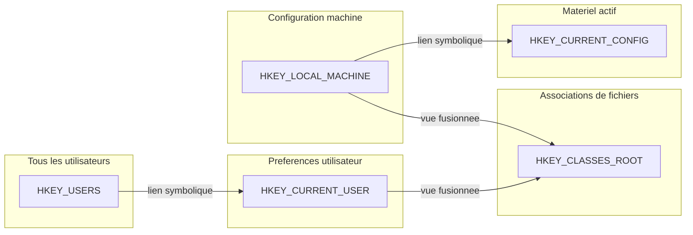

---
tags:
  - registre
  - ruches
  - hives
---

# Les ruches principales

## Ce que vous allez apprendre

- Le role de chacune des 5 ruches principales
- Les sous-cles critiques de `HKLM` (SYSTEM, SOFTWARE, SAM, SECURITY, HARDWARE)
- Comment `HKCU` stocke vos preferences personnelles
- Ce que contiennent `HKU`, `HKCR` et `HKCC`
- La difference entre une "vraie" ruche et un lien symbolique

---

## Vue d'ensemble



!!! tip "Analogie"
    Pensez aux ruches comme aux **rayons d'un supermarche**. `HKLM` est le rayon "pour tout le magasin" (configuration machine). `HKCU` est votre **panier personnel** (preferences utilisateur). `HKU` est l'entrepot ou sont stockes **tous les paniers**. `HKCR` est le catalogue qui fusionne deux sources. Et `HKCC` est l'etiquette du profil materiel actif.

!!! info "En resume"
    - Le registre compte 5 ruches principales : HKLM, HKCU, HKU, HKCR et HKCC
    - Certaines ruches sont de vraies sources de donnees, d'autres sont des liens symboliques ou des vues fusionnees
    - HKLM gere la configuration machine, HKCU les preferences utilisateur

---

## HKEY_LOCAL_MACHINE (HKLM)

Configuration globale de la machine, **independante de l'utilisateur connecte**.
C'est la ruche la plus volumineuse et la plus critique.

---

### HKLM\SYSTEM

Chargee par le bootloader **avant meme le noyau**. Contient la configuration materielle et les parametres de demarrage.

Explorons-la :

```batch
reg query "HKLM\SYSTEM\Select"
```

```title="Resultat attendu"
HKEY_LOCAL_MACHINE\SYSTEM\Select
    Current    REG_DWORD    0x1
    Default    REG_DWORD    0x1
    Failed     REG_DWORD    0x0
    LastKnownGood    REG_DWORD    0x2
```

Ce resultat vous dit quel **jeu de controle** (*ControlSet*) est actif. Ici, `Current = 1` signifie que `ControlSet001` est utilise.

| Sous-cle | Role |
|----------|------|
| `CurrentControlSet` | Lien symbolique vers le jeu de controle actif (`ControlSet001` ou `002`) |
| `ControlSet001` | Premier jeu de configuration (services, pilotes, reseau) |
| `ControlSet002` | Jeu de secours (*Last Known Good Configuration*) |
| `Select` | Indique quel ControlSet est actif, par defaut, et en dernier recours |
| `MountedDevices` | Table de correspondance volumes / identifiants |
| `Setup` | Informations sur l'installation et les mises a jour |

!!! info "CurrentControlSet n'existe pas vraiment"
    `CurrentControlSet` n'est **pas une vraie cle**. C'est un lien symbolique cree au demarrage par le noyau. Il pointe vers le ControlSet designe par la valeur `Current` dans `HKLM\SYSTEM\Select`. Cela permet aux applications d'acceder a la configuration active sans connaitre le numero exact du ControlSet.

!!! example "Analogie"
    `CurrentControlSet` est comme un **raccourci sur le bureau**. Il pointe vers le vrai dossier (`ControlSet001` ou `ControlSet002`), mais vous n'avez jamais besoin de savoir lequel.

---

### HKLM\SOFTWARE

Parametres de configuration des logiciels installes **au niveau machine**.

Voyons la version de Windows :

```batch
reg query "HKLM\SOFTWARE\Microsoft\Windows NT\CurrentVersion" /v CurrentBuild
```

```title="Resultat attendu"
HKEY_LOCAL_MACHINE\SOFTWARE\Microsoft\Windows NT\CurrentVersion
    CurrentBuild    REG_SZ    22631
```

| Sous-cle | Role |
|----------|------|
| `Microsoft\Windows\CurrentVersion` | Programmes au demarrage, desinstallation, etc. |
| `Microsoft\Windows NT\CurrentVersion` | Version, build, licence, chemin d'installation |
| `Classes` | Associations de fichiers et enregistrements COM (niveau machine) |
| `Policies` | Strategies de groupe appliquees a la machine |
| `WOW6432Node` | Miroir 32 bits sur systemes 64 bits (redirection du registre) |
| `RegisteredApplications` | Applications enregistrees pour les protocoles et types de fichiers |

---

### HKLM\SAM

La ruche **Security Account Manager** stocke les comptes utilisateurs locaux et les groupes.

Son contenu est **chiffre** et accessible uniquement par le compte SYSTEM.

Les informations stockees :

- Hashes des mots de passe locaux (NT hash)
- Identifiants de securite (SID) des comptes
- Appartenances aux groupes
- Politiques de verrouillage de compte

!!! danger "Acces restreint"
    Meme un **administrateur** ne peut pas lire la ruche SAM via Regedit. Seul le compte `SYSTEM` y a acces. Pour y acceder, il faut elever ses privileges au niveau SYSTEM, par exemple avec `PsExec -s regedit`. Cette restriction protege les hashes de mots de passe contre l'extraction.

---

### HKLM\SECURITY

Stocke la **politique de securite locale** (LSA Policy) :

- Secrets LSA (mots de passe de comptes de service, cles de chiffrement)
- Politiques d'audit
- Droits utilisateurs
- Relations d'approbation de domaine

Comme SAM, cette ruche est **reservee au compte SYSTEM**.

---

### HKLM\HARDWARE

Ruche **volatile** (en memoire uniquement), generee dynamiquement au demarrage.
Elle disparait a l'arret du systeme.

| Sous-cle | Contenu |
|----------|---------|
| `DESCRIPTION` | Inventaire materiel (processeurs, bus, controleurs) |
| `DEVICEMAP` | Correspondance peripheriques / pilotes |
| `RESOURCEMAP` | Ressources allouees (IRQ, DMA, plages d'E/S, memoire) |

!!! note "Pas de fichier sur le disque"
    Contrairement aux autres sous-ruches de HKLM, `HARDWARE` n'a **aucun fichier** correspondant sur le disque. Elle est reconstruite a chaque demarrage en detectant le materiel present.

---

### HKLM\BCD00000000

La ruche **BCD** (*Boot Configuration Data*) contient la configuration de demarrage du systeme.

Elle est chargee par le bootloader **avant le noyau**, en meme temps que la ruche SYSTEM. Son fichier source se trouve a l'un des emplacements suivants :

| Mode de demarrage | Emplacement du fichier |
|-------------------|----------------------|
| UEFI | `\EFI\Microsoft\Boot\BCD` (sur la partition EFI) |
| BIOS/Legacy | `\Boot\BCD` (sur la partition systeme active) |

Les informations stockees dans cette ruche :

| Donnee | Description |
|--------|-------------|
| Entrees de demarrage | Liste des systemes d'exploitation disponibles au boot |
| Chemin du noyau | Emplacement de `ntoskrnl.exe` et du chargeur |
| Parametres de debug | Configuration du debogage noyau (port serie, reseau, etc.) |
| Timeout | Delai d'attente du menu de demarrage |
| Mode sans echec | Configuration des options de demarrage avancees |

```batch
bcdedit /enum
```

```title="Resultat attendu"
Windows Boot Manager
--------------------
identifier              {bootmgr}
device                  partition=\Device\HarddiskVolume1
description             Windows Boot Manager
locale                  fr-FR
timeout                 30

Windows Boot Loader
-------------------
identifier              {current}
device                  partition=C:
path                    \Windows\system32\winload.efi
description             Windows 11
```

!!! tip "bcdedit plutot que Regedit"
    Bien que la ruche BCD soit visible dans Regedit sous `HKLM\BCD00000000`, il est **fortement deconseille** de la modifier directement. Utilisez l'outil en ligne de commande `bcdedit.exe` qui valide les modifications avant de les appliquer. Une erreur dans la configuration de demarrage peut rendre le systeme non bootable. Le chapitre 13 detaille la configuration du demarrage.

---

### HKLM\COMPONENTS

La ruche **COMPONENTS** gere le systeme de maintenance de Windows (*Component Based Servicing* -- CBS).

| Propriete | Detail |
|-----------|--------|
| Fichier | `%SystemRoot%\System32\config\COMPONENTS` |
| Taille typique | 50 Mo a plus de 1 Go sur les systemes fortement mis a jour |
| Acces | Reserve au compte SYSTEM et a TrustedInstaller |

Cette ruche contient :

- Les **composants installes** via Windows Update
- La gestion du **stockage cote a cote** (*Side-by-Side* ou SxS) dans le dossier `WinSxS`
- Les **manifestes** et metadonnees des packages systeme
- L'etat des mises a jour (en attente, installees, desinstallees)

Le service **TrustedInstaller** (`TiWorker.exe`) est le principal consommateur de cette ruche. C'est lui qui orchestre l'installation et la desinstallation des composants Windows.

```powershell
# Check the size of the COMPONENTS hive
$componentsPath = "$env:SystemRoot\System32\config\COMPONENTS"
if (Test-Path $componentsPath) {
    $size = (Get-Item $componentsPath).Length / 1MB
    Write-Output "COMPONENTS hive size: $([math]::Round($size, 2)) MB"
}
```

```title="Resultat attendu"
COMPONENTS hive size: 812.34 MB
```

!!! warning "Taille excessive"
    Sur les machines ayant recu de nombreuses mises a jour cumulatives, la ruche COMPONENTS peut depasser **1 Go**. Cela peut ralentir les operations de maintenance et les mises a jour. L'outil `DISM /Online /Cleanup-Image /StartComponentCleanup` permet de reduire cette taille en supprimant les anciennes versions des composants.

!!! info "En resume"
    `HKLM` est le **coffre-fort de la machine**. `SYSTEM` contient le demarrage et les services. `SOFTWARE` contient les logiciels. `SAM` et `SECURITY` protegent les comptes et les politiques de securite. `HARDWARE` est un inventaire materiel en memoire, reconstruit a chaque boot.

---

## HKEY_CURRENT_USER (HKCU)

`HKCU` est un **lien symbolique** vers la sous-cle de `HKU` correspondant au SID de l'utilisateur connecte.
Elle contient vos preferences personnelles.

Voyons votre fond d'ecran :

```batch
reg query "HKCU\Control Panel\Desktop" /v WallPaper
```

```title="Resultat attendu"
HKEY_CURRENT_USER\Control Panel\Desktop
    WallPaper    REG_SZ    C:\Users\User\Pictures\wallpaper.jpg
```

| Sous-cle | Role |
|----------|------|
| `Software` | Parametres des applications pour l'utilisateur courant |
| `Control Panel` | Preferences d'affichage, clavier, souris, accessibilite |
| `Environment` | Variables d'environnement utilisateur |
| `Keyboard Layout` | Disposition du clavier selectionnee |
| `Network` | Lecteurs reseau mappes |
| `Printers` | Imprimantes configurees |
| `Volatile Environment` | Variables de session (volatile, recreees a chaque ouverture de session) |

Le fichier physique associe est `NTUSER.DAT`, situe dans votre profil (`%UserProfile%`).

!!! tip "Analogie"
    `HKCU` est votre **bureau personnel** dans un espace de coworking. Chaque utilisateur a le sien, avec ses propres preferences. Quand vous vous connectez, Windows charge le votre depuis `NTUSER.DAT`.

!!! info "En resume"
    - `HKCU` est un lien symbolique vers votre profil dans `HKU`
    - Son fichier physique est `NTUSER.DAT`, situe dans votre dossier utilisateur
    - Toutes vos preferences personnelles (fond d'ecran, programmes, clavier) y sont stockees

---

## HKEY_USERS (HKU)

Contient les ruches de **tous les utilisateurs dont le profil est actuellement charge** :

```
HKEY_USERS
├── .DEFAULT                    → Profil par defaut (sessions systeme)
├── S-1-5-18                    → Compte SYSTEM
├── S-1-5-19                    → Compte LOCAL SERVICE
├── S-1-5-20                    → Compte NETWORK SERVICE
├── S-1-5-21-...-1001           → Utilisateur connecte (SID complet)
└── S-1-5-21-...-1001_Classes   → Classes COM / associations de fichiers
```

Verifiez par vous-meme :

```powershell
Get-ChildItem "Registry::HKEY_USERS" | Select-Object Name
```

```title="Resultat attendu"
Name
----
HKEY_USERS\.DEFAULT
HKEY_USERS\S-1-5-18
HKEY_USERS\S-1-5-19
HKEY_USERS\S-1-5-20
HKEY_USERS\S-1-5-21-XXXXXXXXXX-XXXXXXXXXX-XXXXXXXXXX-1001
HKEY_USERS\S-1-5-21-XXXXXXXXXX-XXXXXXXXXX-XXXXXXXXXX-1001_Classes
```

!!! warning "Profils non charges"
    Les profils des utilisateurs **non connectes** ne sont pas visibles dans `HKU`. Pour acceder a la ruche d'un utilisateur deconnecte, il faut charger manuellement son fichier `NTUSER.DAT` :

    ```batch
    reg load "HKU\UtilisateurHorsLigne" "C:\Users\Autre\NTUSER.DAT"
    ```

    ```title="Resultat attendu"
    The operation completed successfully.
    ```

    Et le dechargez quand vous avez termine :

    ```batch
    reg unload "HKU\UtilisateurHorsLigne"
    ```

    ```title="Resultat attendu"
    The operation completed successfully.
    ```

!!! info "En resume"
    - `HKU` contient les ruches de tous les utilisateurs dont le profil est actuellement charge
    - Les profils des utilisateurs deconnectes ne sont pas visibles (il faut les charger manuellement)
    - Chaque profil est identifie par son SID (identifiant de securite unique)

---

## HKEY_CLASSES_ROOT (HKCR)

`HKCR` est une **vue fusionnee** de deux sources :

| Source | Priorite |
|--------|----------|
| `HKLM\SOFTWARE\Classes` | Basse (parametres machine) |
| `HKCU\SOFTWARE\Classes` | **Haute** (parametres utilisateur) |

Les parametres utilisateur **l'emportent** sur les parametres machine.

Cette ruche contient :

- **Associations de fichiers** : quelle application ouvre quel type de fichier
- **Enregistrements COM** : CLSID, ProgID, interfaces, serveurs COM
- **Gestionnaires de shell** : menus contextuels, icones, apercus

```
HKEY_CLASSES_ROOT
├── .txt                        → Association de l'extension .txt
├── .docx                       → Association de l'extension .docx
├── txtfile                     → ProgID decrivant le type "fichier texte"
├── CLSID                       → Repertoire des classes COM
│   └── {GUID}                  → Identifiant unique d'un objet COM
└── Directory
    └── shell                   → Entrees du menu contextuel des dossiers
```

Voyons quelle application ouvre les fichiers `.txt` :

```batch
reg query "HKCR\.txt" /ve
```

```title="Resultat attendu"
HKEY_CLASSES_ROOT\.txt
    (Default)    REG_SZ    txtfile
```

!!! example "Analogie"
    `HKCR` est comme un **annuaire telephonique** fusionne. L'annuaire de la ville (HKLM) donne les numeros par defaut, mais votre carnet personnel (HKCU) peut ecraser certaines entrees. Quand vous cherchez un numero, on regarde d'abord votre carnet, puis l'annuaire.

!!! info "En resume"
    - `HKCR` fusionne `HKLM\SOFTWARE\Classes` et `HKCU\SOFTWARE\Classes`
    - Les parametres utilisateur ont priorite sur les parametres machine
    - Elle contient les associations de fichiers, les enregistrements COM et les menus contextuels

---

## HKEY_CURRENT_CONFIG (HKCC)

`HKCC` est un **lien symbolique** vers :

```
HKLM\SYSTEM\CurrentControlSet\Hardware Profiles\Current
```

Elle contient le profil materiel actif, principalement les parametres d'affichage et d'impression.

!!! note "Usage marginal"
    Dans les versions modernes de Windows, cette ruche est tres peu utilisee. Les profils materiels multiples etaient utiles a l'epoque des stations d'accueil pour portables, mais cette fonctionnalite a ete largement abandonnee.

!!! info "En resume"
    - `HKCC` est un lien symbolique vers `HKLM\SYSTEM\CurrentControlSet\Hardware Profiles\Current`
    - Elle contient le profil materiel actif (affichage, impression)
    - Son usage est marginal dans les versions modernes de Windows

---

## Cles volatiles vs persistantes

Toutes les cles du registre ne sont pas egales. Certaines survivent au redemarrage, d'autres disparaissent avec lui.

### Cles persistantes

Par defaut, toute cle creee dans le registre est **persistante**. Elle est ecrite dans le fichier de ruche sur le disque et survit aux redemarrages.

### Cles volatiles

Une cle volatile est creee avec le flag `REG_OPTION_VOLATILE`. Elle existe **uniquement en memoire** et n'est jamais ecrite sur le disque. Au prochain redemarrage, elle disparait.

| Exemple de cle volatile | Raison |
|--------------------------|--------|
| `HKLM\HARDWARE` (toute la ruche) | Inventaire materiel reconstruit a chaque boot |
| `HKCU\Volatile Environment` | Variables de session (APPDATA, USERDNSDOMAIN, etc.) |
| `HKLM\SYSTEM\CurrentControlSet` | Le lien symbolique lui-meme est recree a chaque demarrage |
| `HKLM\SYSTEM\CurrentControlSet\Enum` (certaines sous-cles) | Peripheriques Plug-and-Play detectes dynamiquement |

### Identifier une cle volatile

Au niveau interne, une cle volatile est identifiee par le flag `KEY_VOLATILE` (bit 0x01) dans l'en-tete de la cellule `nk` (*named key*). Ce flag est visible avec des outils d'analyse binaire des ruches.

En pratique, avec PowerShell, on peut detecter les cles volatiles par leur comportement :

```powershell
# Volatile keys don't survive reboot - verify by checking Volatile Environment
Get-ItemProperty "HKCU:\Volatile Environment" | Format-List
```

```title="Resultat attendu"
APPDATA            : C:\Users\User\AppData\Roaming
HOMEDRIVE          : C:
HOMEPATH           : \Users\User
LOCALAPPDATA       : C:\Users\User\AppData\Local
LOGONSERVER        : \\PC-USER
USERDNSDOMAIN      : example.local
USERDOMAIN         : PC-USER
USERDOMAIN_ROAMINGPROFILE : PC-USER
USERNAME           : User
USERPROFILE        : C:\Users\User
```

!!! tip "Pour les developpeurs"
    Si vous creez des cles temporaires via l'API Win32, utilisez le flag `REG_OPTION_VOLATILE` dans `RegCreateKeyEx`. Cela evite d'encombrer le registre avec des donnees de session qui n'ont pas besoin de persister. C'est la bonne pratique pour les caches, les compteurs temporaires et les flags de session.

!!! info "En resume"
    - Les cles persistantes sont ecrites sur le disque et survivent au redemarrage
    - Les cles volatiles (`REG_OPTION_VOLATILE`) n'existent qu'en memoire et disparaissent au reboot
    - Exemples de cles volatiles : `HKLM\HARDWARE`, `HKCU\Volatile Environment`, `CurrentControlSet`

---

## AppCompatFlags et les donnees de compatibilite

La cle `HKLM\SOFTWARE\Microsoft\Windows NT\CurrentVersion\AppCompatFlags` est le centre nevralgique du systeme de **compatibilite applicative** de Windows.

### Structure

```
AppCompatFlags
├── Layers            → Modes de compatibilite par application
├── InstalledSDB      → Bases de shims installees (.sdb)
├── Custom            → Corrections personnalisees
└── Compatibility Assistant
    └── Store         → Historique des diagnostics de compatibilite
```

### La sous-cle Layers

La sous-cle `Layers` contient les **modes de compatibilite** appliques a des executables specifiques. Chaque valeur a pour nom le chemin complet de l'executable et pour donnee les flags de compatibilite.

```batch
reg query "HKLM\SOFTWARE\Microsoft\Windows NT\CurrentVersion\AppCompatFlags\Layers"
```

```title="Resultat attendu"
HKEY_LOCAL_MACHINE\SOFTWARE\Microsoft\Windows NT\CurrentVersion\AppCompatFlags\Layers
    C:\Program Files\OldApp\app.exe    REG_SZ    ~ RUNASADMIN WIN7RTM
```

Les flags courants :

| Flag | Signification |
|------|---------------|
| `WIN7RTM` | Executer en mode compatibilite Windows 7 |
| `WINXPSP3` | Executer en mode compatibilite Windows XP SP3 |
| `RUNASADMIN` | Toujours executer en tant qu'administrateur |
| `HIGHDPIAWARE` | Desactiver la mise a l'echelle DPI |
| `640X480` | Forcer la resolution 640x480 |
| `256COLOR` | Forcer le mode 256 couleurs |

### La sous-cle InstalledSDB

Les fichiers `.sdb` (*Shim Database*) contiennent des **corrections de compatibilite** packagees. Quand un administrateur ou un editeur deploie un fix de compatibilite via le **Compatibility Administrator** (inclus dans le Windows ADK), il est enregistre ici.

```powershell
# List installed shim databases
Get-ChildItem "HKLM:\SOFTWARE\Microsoft\Windows NT\CurrentVersion\AppCompatFlags\InstalledSDB" -ErrorAction SilentlyContinue
```

```title="Resultat attendu"
Name                           Property
----                           --------
{GUID}                         DatabasePath, DatabaseDescription
```

!!! warning "Interet forensique"
    En analyse forensique, la cle `AppCompatFlags` est une **mine d'or**. Elle revele les programmes qui ont ete executes, les corrections appliquees et les diagnostics de compatibilite effectues. Le cache Shimcache (detaille au chapitre 17) s'appuie sur ces memes mecanismes pour enregistrer les traces d'execution des applications.

!!! info "En resume"
    - `AppCompatFlags` gere les modes de compatibilite (Windows 7, XP, etc.) et les corrections applicatives
    - La sous-cle `Layers` stocke les flags de compatibilite par executable
    - La sous-cle `InstalledSDB` contient les bases de shims deployees par les administrateurs
    - En forensique, cette cle revele les programmes executes et les corrections appliquees

---

!!! info "En resume"
    Le registre a 5 ruches, mais seulement 2 sont "reelles" au sens ou elles stockent vraiment des donnees : **HKLM** (la machine) et **HKU** (les utilisateurs). Les 3 autres sont des raccourcis :

    - `HKCU` = lien vers votre profil dans `HKU`
    - `HKCR` = fusion de `HKLM\SOFTWARE\Classes` + `HKCU\SOFTWARE\Classes`
    - `HKCC` = lien vers le profil materiel actif dans `HKLM`
