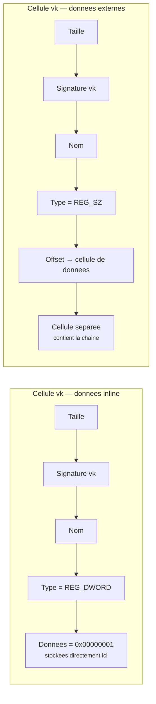
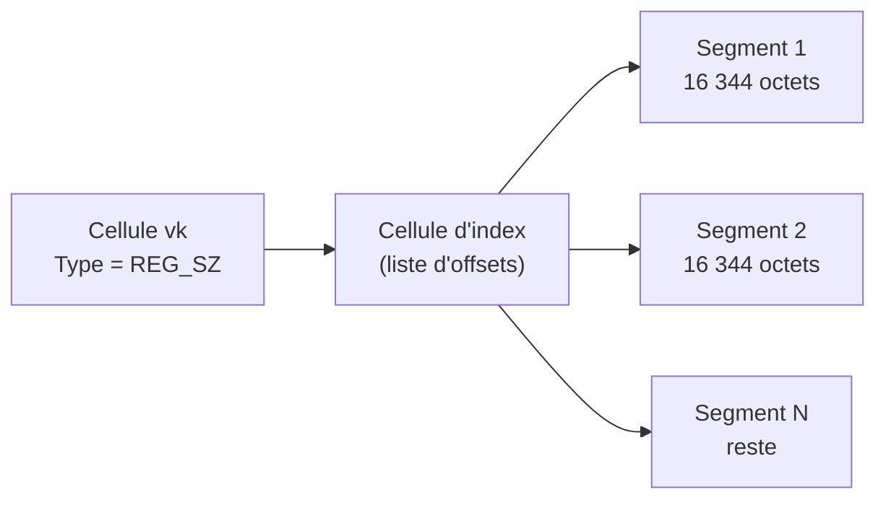

---
tags:
  - registre
  - types
  - données
---

# Types de donnees

## Ce que vous allez apprendre

- Les 11 types de donnees du registre et quand utiliser chacun
- Comment lire et ecrire les types courants (REG_SZ, REG_DWORD, REG_MULTI_SZ...)
- Le stockage interne des valeurs en memoire
- L'astuce de l'optimisation "inline" pour les petites donnees

---

## Exemple concret d'abord

Avant la theorie, regardons les types en action :

```batch
reg query "HKLM\SOFTWARE\Microsoft\Windows NT\CurrentVersion" /v ProductName
```

```title="Resultat attendu"
HKEY_LOCAL_MACHINE\SOFTWARE\Microsoft\Windows NT\CurrentVersion
    ProductName    REG_SZ    Windows 11 Pro
```

Le `REG_SZ` au milieu, c'est le **type** de la valeur. Il dit a Windows : "cette donnee est une chaine de caracteres".

!!! tip "Analogie"
    Le type d'une valeur du registre, c'est comme le **format d'un fichier**. Un `.jpg` est une image, un `.txt` est du texte, un `.exe` est un programme. De la meme maniere, `REG_SZ` est du texte, `REG_DWORD` est un nombre, `REG_BINARY` est du binaire brut.

!!! info "En resume"
    - Chaque valeur du registre a un type qui indique a Windows comment interpreter ses donnees
    - Le type apparait dans les resultats de `reg query` (ex : `REG_SZ` pour une chaine de texte)
    - C'est l'equivalent du format de fichier (`.txt`, `.jpg`) mais pour les donnees du registre

---

## Les 11 types en un coup d'oeil

| Type | ID | En bref |
|------|----|---------|
| `REG_NONE` | 0 | Aucun type defini |
| `REG_SZ` | 1 | Chaine de texte |
| `REG_EXPAND_SZ` | 2 | Chaine avec variables d'environnement (`%SystemRoot%\...`) |
| `REG_BINARY` | 3 | Donnees binaires brutes |
| `REG_DWORD` | 4 | Nombre entier 32 bits |
| `REG_DWORD_BIG_ENDIAN` | 5 | Nombre 32 bits (big-endian, tres rare) |
| `REG_LINK` | 6 | Lien symbolique vers une autre cle |
| `REG_MULTI_SZ` | 7 | Liste de chaines |
| `REG_RESOURCE_LIST` | 8 | Liste de ressources materielles |
| `REG_FULL_RESOURCE_DESCRIPTOR` | 9 | Descripteur de ressource materielle |
| `REG_RESOURCE_REQUIREMENTS_LIST` | 10 | Exigences de ressources |
| `REG_QWORD` | 11 | Nombre entier 64 bits |

!!! note "En pratique"
    Vous utiliserez **90% du temps** seulement 4 types : `REG_SZ`, `REG_DWORD`, `REG_EXPAND_SZ` et `REG_MULTI_SZ`. Les types 8, 9 et 10 sont reserves au systeme pour la gestion du materiel.

!!! info "En resume"
    - Le registre propose 11 types de donnees, identifies par un ID numerique (0 a 11)
    - En pratique, 4 types couvrent 90% des besoins : `REG_SZ`, `REG_DWORD`, `REG_EXPAND_SZ` et `REG_MULTI_SZ`
    - Les types 8, 9 et 10 sont reserves au systeme pour la gestion du materiel

---

## Les types courants en detail

### REG_SZ -- la chaine de texte

Le type le **plus frequent**. Stocke une chaine de caracteres Unicode (UTF-16LE) terminee par un caractere nul (`\0`).

```batch
rem Creer une valeur REG_SZ
reg add "HKCU\Software\Demo" /v AppPath /t REG_SZ /d "C:\Program Files\MonApp\app.exe" /f
```

```title="Resultat attendu"
The operation completed successfully.
```

```batch
rem Relire la valeur
reg query "HKCU\Software\Demo" /v AppPath
```

```title="Resultat attendu"
HKEY_CURRENT_USER\Software\Demo
    AppPath    REG_SZ    C:\Program Files\MonApp\app.exe
```

!!! warning "Encodage UTF-16"
    Toutes les chaines du registre sont stockees en **UTF-16 Little Endian**. Meme si Regedit les affiche comme du texte simple, chaque caractere occupe **2 octets**, plus 2 octets pour le terminateur nul.

---

### REG_EXPAND_SZ -- la chaine avec variables

Identique a `REG_SZ`, mais contient des **references a des variables d'environnement** :

```batch
reg add "HKCU\Software\Demo" /v SysPath /t REG_EXPAND_SZ /d "%%SystemRoot%%\System32\drivers" /f
```

```title="Resultat attendu"
The operation completed successfully.
```

```batch
reg query "HKCU\Software\Demo" /v SysPath
```

```title="Resultat attendu"
HKEY_CURRENT_USER\Software\Demo
    SysPath    REG_EXPAND_SZ    %SystemRoot%\System32\drivers
```

La valeur stockee est `%SystemRoot%\System32\drivers`.
A la lecture, elle peut etre **resolue** en `C:\Windows\System32\drivers`.

!!! tip "Resolution des variables"
    La resolution n'est **pas automatique**. L'application doit appeler `ExpandEnvironmentStrings()` ou utiliser `RegGetValue()` avec le flag `RRF_RT_REG_EXPAND_SZ` pour obtenir la valeur resolue.

!!! example "Analogie"
    `REG_EXPAND_SZ` est comme une adresse avec un **code postal**. L'adresse dit `%Ville%`, et c'est au facteur (l'application) de traduire le code en nom de ville.

---

### REG_DWORD -- le nombre entier 32 bits

Entier **32 bits non signe** (de 0 a 4 294 967 295).
C'est le type standard pour les booleens, les compteurs et les options.

```batch
rem Activer une fonctionnalite (1 = on)
reg add "HKCU\Software\Demo" /v EnableFeature /t REG_DWORD /d 1 /f
```

```title="Resultat attendu"
The operation completed successfully.
```

```batch
reg query "HKCU\Software\Demo" /v EnableFeature
```

```title="Resultat attendu"
HKEY_CURRENT_USER\Software\Demo
    EnableFeature    REG_DWORD    0x1
```

**Conventions courantes** :

| Valeur | Signification habituelle |
|--------|--------------------------|
| `0` | Desactive / Faux |
| `1` | Active / Vrai |
| Autres | Selon le contexte (delais en ms, tailles en octets, etc.) |

!!! tip "Analogie"
    Un `REG_DWORD` est comme un **interrupteur numerote**. Position 0 = eteint, position 1 = allume. Mais certains interrupteurs ont plus de positions (0 a 4 294 967 295).

---

### REG_QWORD -- le nombre entier 64 bits

Entier **64 bits non signe** (de 0 a 18 446 744 073 709 551 615).
Utilise pour les compteurs, horodatages et valeurs depassant la capacite d'un DWORD.

```batch
reg add "HKCU\Software\Demo" /v BigCounter /t REG_QWORD /d 1000 /f
```

```title="Resultat attendu"
The operation completed successfully.
```

```batch
reg query "HKCU\Software\Demo" /v BigCounter
```

```title="Resultat attendu"
HKEY_CURRENT_USER\Software\Demo
    BigCounter    REG_QWORD    0x3e8
```

`0x3e8` en hexadecimal = `1000` en decimal.

---

### REG_BINARY -- les donnees binaires brutes

Donnees binaires **sans format impose**. L'interpretation depend entierement de l'application.

```
Nom :    ConfigBlob
Type :   REG_BINARY
Donnees : 48 00 65 00 6C 00 6C 00 6F 00
```

!!! note "Quand l'utiliser"
    `REG_BINARY` est le "sac a tout" du registre. Il est utilise quand aucun autre type ne convient : structures de donnees custom, blobs de configuration, etc.

---

### REG_MULTI_SZ -- la liste de chaines

Liste ordonnee de chaines, chacune terminee par un caractere nul.
La liste entiere se termine par un **double** caractere nul.

```
Nom :    DependOnService
Type :   REG_MULTI_SZ
Donnees : LanmanWorkstation\0
          Netlogon\0
          \0
```

**Cas d'usage typiques** :

- Dependances de services
- Listes de pilotes a charger
- Chemins de recherche multiples

En PowerShell, la manipulation est plus naturelle :

```powershell
# Read a REG_MULTI_SZ value
$deps = (Get-ItemProperty "HKLM:\SYSTEM\CurrentControlSet\Services\Netlogon").DependOnService
$deps
```

```title="Resultat attendu"
LanmanWorkstation
```

!!! example "Analogie"
    `REG_MULTI_SZ` est comme une **liste de courses**. Chaque element est separe par un retour a la ligne (le `\0`), et la fin de la liste est marquee par un double retour.

---

### REG_LINK -- le lien symbolique interne

Lien symbolique pointant vers **une autre cle du registre**.
C'est ce type qui est utilise pour creer les alias comme `HKEY_CURRENT_USER` ou `CurrentControlSet`.

!!! warning "Usage restreint"
    Les liens symboliques ne peuvent etre crees qu'avec l'API native (`NtCreateKey` avec `REG_OPTION_CREATE_LINK`). L'API Win32 standard et `reg.exe` ne permettent **pas** de creer ce type de valeur.

---

### Les types materiels (REG_RESOURCE_LIST, REG_FULL_RESOURCE_DESCRIPTOR, REG_RESOURCE_REQUIREMENTS_LIST)

Ces trois types sont reserves au **gestionnaire Plug and Play** (PnP) de Windows. Vous ne les manipulerez jamais directement, mais comprendre leur role aide a dechiffrer certaines cles systeme.

Ils resident principalement sous :

```
HKLM\HARDWARE\ResourceMap
```

| Type | ID | Role |
|------|----|------|
| `REG_RESOURCE_LIST` | 8 | Liste de ressources materielles attribuees a un pilote : IRQ, canaux DMA, ports E/S, plages memoire |
| `REG_FULL_RESOURCE_DESCRIPTOR` | 9 | Descripteur complet d'un peripherique unique (toutes ses ressources en un seul bloc) |
| `REG_RESOURCE_REQUIREMENTS_LIST` | 10 | Ressources qu'un peripherique **demande** avant que le PnP Manager ne les attribue |

#### Structure interne

Ces valeurs encapsulent des structures C documentees dans le WDK (Windows Driver Kit) :

| Type registre | Structure C sous-jacente |
|---------------|--------------------------|
| `REG_RESOURCE_LIST` | `CM_RESOURCE_LIST` contenant un tableau de `CM_FULL_RESOURCE_DESCRIPTOR` |
| `REG_FULL_RESOURCE_DESCRIPTOR` | `CM_FULL_RESOURCE_DESCRIPTOR` (interface type + `CM_PARTIAL_RESOURCE_LIST`) |
| `REG_RESOURCE_REQUIREMENTS_LIST` | `IO_RESOURCE_REQUIREMENTS_LIST` (liste de plages acceptables) |

Chaque `CM_PARTIAL_RESOURCE_DESCRIPTOR` indique un type de ressource :

| Code | Ressource |
|------|-----------|
| 1 | Port E/S |
| 2 | IRQ (ligne d'interruption) |
| 3 | Memoire mappee |
| 5 | Canal DMA |

!!! warning "Ne jamais creer ces valeurs manuellement"
    Le PnP Manager est le seul composant autorise a ecrire ces donnees. Modifier ou creer une valeur de type 8, 9 ou 10 a la main peut provoquer des conflits de ressources, des ecrans bleus ou rendre un peripherique inaccessible.

#### Lire la carte des ressources en PowerShell

```powershell
# Browse hardware resource map entries
$basePath = "HKLM:\HARDWARE\ResourceMap"
Get-ChildItem $basePath -Recurse | ForEach-Object {
    $key = $_
    $key.GetValueNames() | ForEach-Object {
        $type = $key.GetValueKind($_)
        [PSCustomObject]@{
            Key      = $key.Name -replace "HKEY_LOCAL_MACHINE", "HKLM"
            Value    = $_
            Type     = $type
            SizeBytes = ($key.GetValue($_, $null, "DoNotExpandEnvironmentNames")).Length
        }
    }
} | Format-Table -AutoSize
```

```title="Resultat attendu"
Key                                                        Value                Type              SizeBytes
---                                                        -----                ----              ---------
HKLM\HARDWARE\ResourceMap\PnP Manager\PnpManager          .Raw                 Unknown                 312
HKLM\HARDWARE\ResourceMap\System Resources\Physical Memory .Translated          Unknown                 120
```

!!! tip "Analogie"
    Imaginez un immeuble de bureaux. `REG_RESOURCE_REQUIREMENTS_LIST` est la **liste de voeux** d'un locataire ("je veux un bureau au 3e etage avec vue"). `REG_RESOURCE_LIST` est le **bail signe** ("bureau 302 attribue"). `REG_FULL_RESOURCE_DESCRIPTOR` est la **fiche complete** du bureau (surface, equipements, acces reseau).

!!! info "En resume"
    - `REG_SZ` (texte) et `REG_DWORD` (nombre 32 bits) sont les types les plus frequents
    - `REG_EXPAND_SZ` permet d'utiliser des variables d'environnement (`%SystemRoot%`)
    - `REG_MULTI_SZ` stocke des listes de chaines, `REG_BINARY` du binaire brut
    - Les types materiels (8, 9, 10) sont reserves au gestionnaire Plug and Play

---

## Comparaison rapide

| Besoin | Type a utiliser |
|--------|-----------------|
| Stocker du texte simple | `REG_SZ` |
| Stocker un chemin avec `%variables%` | `REG_EXPAND_SZ` |
| Stocker un booleen ou un petit nombre | `REG_DWORD` |
| Stocker un grand nombre (> 4 milliards) | `REG_QWORD` |
| Stocker une liste de chaines | `REG_MULTI_SZ` |
| Stocker des donnees binaires brutes | `REG_BINARY` |

!!! info "En resume"
    Le registre propose 11 types, mais 4 couvrent 90% des besoins : `REG_SZ` (texte), `REG_DWORD` (nombre), `REG_EXPAND_SZ` (texte avec variables) et `REG_MULTI_SZ` (liste de textes). Chaque valeur a un type fixe qui determine comment Windows interprete ses donnees.

---

## Representation en memoire (avance)

Pour les curieux, voici comment une valeur est stockee **physiquement** dans le fichier de ruche.

### Structure d'une cellule de valeur (`vk`)

| Offset | Taille | Champ |
|--------|--------|-------|
| `0x00` | 4 | Taille de la cellule (negatif si allouee) |
| `0x04` | 2 | Signature `vk` (0x6B76) |
| `0x06` | 2 | Longueur du nom |
| `0x08` | 4 | Taille des donnees |
| `0x0C` | 4 | Offset des donnees (ou donnees inline si <= 4 octets) |
| `0x10` | 4 | Type de donnees (REG_SZ = 1, REG_DWORD = 4, etc.) |
| `0x14` | 2 | Flags (bit 0 = nom ASCII, sinon Unicode) |
| `0x18` | var | Nom de la valeur |

!!! tip "Donnees inline : l'optimisation cachee"
    Quand les donnees font **4 octets ou moins** (typiquement un `REG_DWORD`), elles sont stockees **directement dans le champ "offset"** au lieu d'etre dans une cellule separee. Le bit de poids fort du champ "taille des donnees" est mis a `1` pour signaler cette astuce. Cela evite une allocation supplementaire et accelere la lecture.



!!! info "En resume"
    Chaque valeur du registre est une cellule `vk` dans un fichier de ruche. Elle contient le nom, le type et soit les donnees directement (si <= 4 octets), soit un pointeur vers une cellule separee. C'est cette structure binaire qui permet au Configuration Manager de lire et ecrire des valeurs efficacement.

---

## Edge cases et limites d'encodage

Chaque type du registre a ses particularites et ses limites. Connaitre ces cas limites evite des heures de debogage.

### Taille maximale d'une valeur REG_SZ

L'API `RegSetValueEx` autorise theoriquement une valeur jusqu'a **2 Go** (le champ taille est un DWORD). En pratique, la limite reelle est d'environ **1 Mo**. Au-dela, certaines applications et certains outils (Regedit, reg.exe) ne peuvent plus afficher ou manipuler la valeur correctement.

| Limite | Valeur |
|--------|--------|
| Theorique (API) | ~2 Go |
| Pratique (fiable) | ~1 Mo |
| Recommandee | < 16 Ko |

### REG_MULTI_SZ et les chaines vides

Une `REG_MULTI_SZ` est une suite de chaines separees par des `\0`, terminee par un double `\0`. Que se passe-t-il si une chaine est vide (deux `\0` consecutifs au milieu) ? Windows interprete cela comme la **fin de la liste**. Les elements suivants sont ignores silencieusement.

```
Valeur stockee :  "Premier\0\0Deuxieme\0\0"
Valeur lue :      "Premier"
```

!!! warning "Chaines vides dans REG_MULTI_SZ"
    N'inserez jamais de chaine vide dans une liste `REG_MULTI_SZ`. Le double `\0` resultant est interprete comme le terminateur de liste, et tout ce qui suit est perdu.

### REG_EXPAND_SZ et la resolution non recursive

Les variables d'environnement dans une `REG_EXPAND_SZ` sont resolues **une seule fois**. Si une variable pointe vers une valeur contenant elle-meme `%UneAutreVariable%`, la seconde n'est **pas** resolue.

```
%CUSTOM_PATH%  =  %SystemRoot%\MonDossier
REG_EXPAND_SZ  =  %CUSTOM_PATH%\fichier.txt

Apres resolution :  %SystemRoot%\MonDossier\fichier.txt   (et non C:\Windows\MonDossier\fichier.txt)
```

L'appel a `ExpandEnvironmentStrings()` ne fait qu'un seul passage de substitution, pas de resolution en chaine.

### REG_DWORD vs REG_DWORD_BIG_ENDIAN

Les deux stockent un entier 32 bits, mais l'ordre des octets differe :

| Type | Valeur logique | Octets en memoire |
|------|----------------|-------------------|
| `REG_DWORD` (little-endian) | `0x00000001` | `01 00 00 00` |
| `REG_DWORD_BIG_ENDIAN` | `0x00000001` | `00 00 00 01` |

`REG_DWORD_BIG_ENDIAN` (type 5) est extremement rare. Il existe pour compatibilite avec certains protocoles reseau, mais la quasi-totalite des valeurs Windows utilise le format little-endian standard.

### REG_NONE : le marqueur sans type

`REG_NONE` (type 0) n'impose aucun format. Il sert dans deux cas :

- **Marqueur de presence** : la simple existence de la valeur suffit, le contenu n'importe pas
- **Donnees opaques** : l'application interprete elle-meme le blob binaire, sans indication de format

Certaines cles systeme utilisent `REG_NONE` pour signaler qu'une fonctionnalite est active, avec zero octet de donnees.

### Stockage "big data" (Windows Vista+)

Avant Windows Vista, une cellule de donnees ne pouvait pas depasser **16 344 octets** (la taille maximale d'une cellule dans un bin de 4 Ko). A partir de Vista, le gestionnaire de configuration utilise un mecanisme de **big data** : les donnees sont decoupees en segments de 16 344 octets, chacun dans sa propre cellule, et une cellule d'index les reference.



### La limite de 1 Mo en pratique

`RegSetValueEx` peut retourner `ERROR_SUCCESS` meme pour des donnees depassant 1 Mo. Cependant :

- **Regedit** ne peut pas afficher correctement les valeurs superieure a 1 Mo
- **reg.exe** tronque silencieusement certaines valeurs volumineuses a l'export
- Les API .NET (`Microsoft.Win32.Registry`) peuvent lever une `IOException` au-dela de certains seuils
- Le temps de chargement de la ruche augmente significativement avec des valeurs tres volumineuses

!!! tip "Bonne pratique"
    Si vous avez besoin de stocker plus de quelques kilo-octets, envisagez de placer les donnees dans un **fichier externe** et de stocker uniquement le chemin dans le registre (en `REG_SZ` ou `REG_EXPAND_SZ`).

!!! info "En resume"
    - La taille recommandee d'une valeur est inferieure a 16 Ko (limite pratique : environ 1 Mo)
    - Les chaines vides dans `REG_MULTI_SZ` coupent la liste ; `REG_EXPAND_SZ` ne resout les variables qu'une seule fois
    - `REG_DWORD_BIG_ENDIAN` est quasi inexistant ; `REG_NONE` sert de marqueur de presence sans format impose
    - Depuis Vista, le mecanisme "big data" decoupe les grosses valeurs en segments de 16 344 octets

---

Nettoyons les valeurs de demonstration :

```batch
reg delete "HKCU\Software\Demo" /f
```

```title="Resultat attendu"
The operation completed successfully.
```
