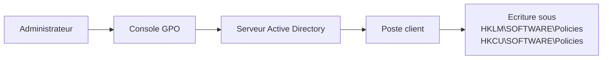

---
tags:
  - registre
  - réseau
  - distant
---

# Registre et reseau

## Ce que vous allez apprendre

- Acceder au registre d'un ordinateur distant (et pourquoi c'est rarement une bonne idee)
- Connaitre les cles reseau essentielles : TCP/IP, interfaces, proxy, pare-feu
- Comprendre comment les strategies de groupe (GPO) modifient le registre

---

## Acces distant au registre

Imaginez pouvoir ouvrir le tableau de bord d'une voiture garee dans un autre parking, depuis chez vous. C'est exactement ce que fait le service **Registre distant** (*Remote Registry*) : il permet de lire et modifier le registre d'une autre machine via le reseau.

### Prerequis

Quatre conditions doivent etre reunies sur la machine cible :

| Condition | Detail |
|-----------|--------|
| Service `RemoteRegistry` | Doit etre demarre |
| Droits | Droits d'administration sur la machine cible |
| Pare-feu | Ports TCP 135 et 445 ouverts (RPC + canaux nommes) |
| Partage reseau | Partage de fichiers et d'imprimantes active |

```powershell
# Enable the Remote Registry service on the target machine
Set-Service -Name RemoteRegistry -StartupType Manual -ComputerName SERVEUR01
Start-Service -Name RemoteRegistry -ComputerName SERVEUR01
```

```title="Resultat attendu"
aucune sortie si tout fonctionne. Une erreur apparait si le service est introuvable ou si les droits sont insuffisants.
```

### Connexion via Regedit

1. **Fichier** > **Connexion au Registre reseau**
2. Entrez le nom ou l'adresse IP de la machine distante
3. Seules les ruches `HKLM` et `HKU` sont accessibles a distance

!!! info "Pourquoi seulement HKLM et HKU ?"
    Les autres ruches (`HKCR`, `HKCU`, `HKCC`) sont des **vues virtuelles** construites localement. Elles n'existent pas en tant que fichiers independants et ne sont donc pas accessibles via le reseau.

### Connexion via PowerShell

```powershell
# Open a remote registry key
$reg = [Microsoft.Win32.RegistryKey]::OpenRemoteBaseKey(
    [Microsoft.Win32.RegistryHive]::LocalMachine,
    "SERVEUR01"
)
$key = $reg.OpenSubKey("SOFTWARE\Microsoft\Windows NT\CurrentVersion")
$key.GetValue("ProductName")
$key.Close()
$reg.Close()
```

```title="Resultat attendu"
Windows 11 Pro
```

### Connexion via reg.exe

```batch
rem Read a remote registry value
reg query "\\SERVEUR01\HKLM\SOFTWARE\Microsoft\Windows NT\CurrentVersion" /v ProductName
```

```title="Resultat attendu"
HKEY_LOCAL_MACHINE\SOFTWARE\Microsoft\Windows NT\CurrentVersion
    ProductName    REG_SZ    Windows 11 Pro
```

```batch
rem Write a remote registry value
reg add "\\SERVEUR01\HKLM\SOFTWARE\MonApp" /v Config /t REG_SZ /d "valeur" /f
```

```title="Resultat attendu"
L'operation a reussi.
```

!!! danger "Le service Remote Registry est un risque de securite"
    Ce service est **desactive par defaut** sur Windows 10/11 pour de bonnes raisons : il expose le registre aux attaques reseau. Privilegiez **PowerShell Remoting (WinRM)** ou des outils de gestion centralisee (GPO, SCCM/Intune) pour les operations a distance.

!!! info "En resume"
    - Le service `RemoteRegistry` permet l'acces reseau au registre
    - Seules `HKLM` et `HKU` sont accessibles a distance
    - Trois methodes : Regedit, PowerShell (.NET), reg.exe
    - **Recommandation** : evitez Remote Registry, preferez WinRM ou les GPO

---

## Cles reseau importantes

### Configuration TCP/IP

C'est le **tableau de bord reseau** de la machine : nom d'hote, domaine DNS, et options de routage.

```
HKLM\SYSTEM\CurrentControlSet\Services\Tcpip\Parameters
```

| Valeur | Type | Description |
|--------|------|-------------|
| `Hostname` | REG_SZ | Nom d'hote de la machine |
| `Domain` | REG_SZ | Suffixe DNS principal |
| `SearchList` | REG_SZ | Liste de suffixes DNS (separes par des virgules) |
| `IPEnableRouter` | REG_DWORD | Active le routage IP entre interfaces (`0` = non, `1` = oui) |

### Configuration par interface

Chaque carte reseau (Wi-Fi, Ethernet, VPN...) possede sa propre sous-cle, identifiee par un GUID unique -- comme un numero de serie pour chaque prise reseau.

```
HKLM\SYSTEM\CurrentControlSet\Services\Tcpip\Parameters\Interfaces\{GUID}
```

| Valeur | Type | Description |
|--------|------|-------------|
| `IPAddress` | REG_MULTI_SZ | Adresses IP statiques |
| `SubnetMask` | REG_MULTI_SZ | Masques de sous-reseau |
| `DefaultGateway` | REG_MULTI_SZ | Passerelles par defaut |
| `NameServer` | REG_SZ | Serveurs DNS (separes par des virgules) |
| `EnableDHCP` | REG_DWORD | `1` = DHCP, `0` = configuration statique |
| `DhcpIPAddress` | REG_SZ | Adresse obtenue par DHCP |

!!! example "Trouver le GUID d'une interface"
    ```powershell
    # List network adapters and their GUIDs
    Get-NetAdapter | Select-Object Name, InterfaceGuid
    ```

    ```title="Resultat attendu"
    Name       InterfaceGuid
    ----       -------------
    Ethernet   {12345678-abcd-1234-abcd-123456789abc}
    Wi-Fi      {87654321-dcba-4321-dcba-987654321cba}
    ```

### Configuration DNS detaillee

Le cache et le comportement du client DNS sont controles par la cle suivante :

```
HKLM\SYSTEM\CurrentControlSet\Services\Dnscache\Parameters
```

| Valeur | Type | Description | Defaut |
|--------|------|-------------|--------|
| `MaxCacheTtl` | REG_DWORD | Duree maximale (en secondes) de conservation d'un enregistrement positif dans le cache | 86400 (24 h) |
| `MaxNegativeCacheTtl` | REG_DWORD | Duree de conservation d'une reponse negative (NXDOMAIN) | 5 |
| `EnableAutoDoh` | REG_DWORD | Active DNS over HTTPS : `0` = desactive, `2` = automatique | 0 |
| `ServerPriorityTimeLimit` | REG_DWORD | Duree (en secondes) avant de re-evaluer la priorite des serveurs DNS | 15 |

#### Cache DNS local

Windows conserve un cache local des resolutions DNS pour eviter de repeter les memes requetes.

```batch
rem Display the local DNS cache
ipconfig /displaydns
```

```title="Resultat attendu"
    docs.microsoft.com
    ----------------------------------------
    Record Name . . . . . : docs.microsoft.com
    Record Type . . . . . : 1
    Time To Live  . . . . : 234
    Data Length . . . . . : 4
    Section . . . . . . . : Answer
    A (Host) Record . . . : 23.43.117.200
```

```batch
rem Flush the DNS cache (useful after modifying DNS settings)
ipconfig /flushdns
```

```title="Resultat attendu"
Configuration IP de Windows
Cache de resolution DNS vide.
```

#### Suffixes DNS

Deux mecanismes coexistent :

| Parametre | Emplacement | Portee |
|-----------|-------------|--------|
| `SearchList` | `Tcpip\Parameters` | Global (toutes les interfaces) |
| `Domain` | `Tcpip\Parameters\Interfaces\{GUID}` | Par interface |

Le suffixe global est utilise quand un nom court est saisi (par exemple `serveur01` au lieu de `serveur01.corp.local`). Windows ajoute tour a tour chaque suffixe de la liste pour tenter la resolution.

### WinHTTP vs WinInet

Windows possede **deux piles HTTP distinctes**, chacune avec ses propres cles de registre. Confondre les deux est une source frequente de problemes de connectivite.

| Caracteristique | WinInet | WinHTTP |
|-----------------|---------|---------|
| Utilisateurs | Navigateurs (IE/Edge legacy), applications desktop | Services systeme, Windows Update, PowerShell |
| Registre proxy | `HKCU\Software\Microsoft\Windows\CurrentVersion\Internet Settings` | `HKLM\SOFTWARE\Microsoft\Windows\CurrentVersion\Internet Settings\WinHttp` |
| Configuration | Par utilisateur | Par machine |
| Authentification interactive | Oui | Non |
| Supporte PAC | Oui | Oui (via WPAD) |

#### Configurer le proxy WinHTTP

```batch
rem Show current WinHTTP proxy configuration
netsh winhttp show proxy

rem Set a proxy for WinHTTP
netsh winhttp set proxy proxy-server="proxy.corp.local:8080" bypass-list="*.corp.local;localhost"

rem Import proxy settings from Internet Explorer (WinInet -> WinHTTP)
netsh winhttp import proxy source=ie
```

```title="Resultat attendu"
Configuration actuelle du proxy WinHTTP :

    Acces direct (aucun serveur proxy).

Configuration actuelle du proxy WinHTTP :

    Serveur proxy : proxy.corp.local:8080
    Liste de contournement : *.corp.local;localhost

Configuration actuelle du proxy WinHTTP :

    Serveur proxy : proxy.corp.local:8080
    Liste de contournement : *.corp.local;localhost
```

#### Protocoles TLS par defaut

La valeur `DefaultSecureProtocols` controle quels protocoles TLS sont actives :

| Pile | Cle |
|------|-----|
| WinInet | `HKCU\Software\Microsoft\Windows\CurrentVersion\Internet Settings` |
| WinHTTP | `HKLM\SOFTWARE\Microsoft\Windows\CurrentVersion\Internet Settings\WinHttp` |

| Bit | Protocole |
|-----|-----------|
| 0x00000008 | SSL 2.0 |
| 0x00000020 | SSL 3.0 |
| 0x00000080 | TLS 1.0 |
| 0x00000200 | TLS 1.1 |
| 0x00000800 | TLS 1.2 |
| 0x00002000 | TLS 1.3 |

!!! warning "TLS 1.3 et KB3140245"
    Le bit `0x00002000` pour `TLS 1.3` est utilise par les versions recentes de Windows, mais il ne fait pas partie de la documentation historique de `KB3140245`. Ne supposez pas que toute machine ayant recu ce correctif comprend `TLS 1.3` : verifiez toujours la version de Windows et de Schannel ciblee.

!!! danger "Desactiver SSL 2.0 et 3.0"
    SSL 2.0 et 3.0 sont considerees comme **cassees** (attaques POODLE, DROWN). Assurez-vous que seuls TLS 1.2 et TLS 1.3 sont actives en environnement de production.

### Profils Wi-Fi et VPN dans le registre

#### Profils Wi-Fi

Les profils de reseaux sans fil sont stockes a la fois dans le registre et sous forme de fichiers XML. Le registre les reference sous :

```
HKLM\SOFTWARE\Microsoft\WlanSvc\Interfaces\{GUID}\Profiles
```

Chaque profil est identifie par un GUID et contient les metadonnees de connexion. Le SSID, le type de securite et les parametres 802.1X y figurent.

```powershell
# List saved Wi-Fi profiles
netsh wlan show profiles
```

```title="Resultat attendu"
Profils sur l'interface Wi-Fi :
    Profil Tous les utilisateurs : CorpWiFi
    Profil Tous les utilisateurs : MaisonWiFi
```

#### Connexions VPN integrees

Les connexions VPN natives de Windows sont stockees sous :

```
HKCU\Software\Microsoft\Windows\CurrentVersion\Internet Settings\Connections
```

La valeur binaire contient les parametres de chaque connexion RAS/VPN. Les VPN tiers (Cisco AnyConnect, GlobalProtect, OpenVPN) stockent leurs parametres dans leurs propres sous-cles sous `HKLM\SOFTWARE`.

#### Parametres 802.1X

La configuration 802.1X par interface reside sous :

```
HKLM\SOFTWARE\Microsoft\dot3svc\Interfaces\{GUID}
```

| Valeur | Type | Description |
|--------|------|-------------|
| `Enabled` | REG_DWORD | `1` = authentification 802.1X active sur cette interface |
| `Profile` | REG_SZ | Nom du profil 802.1X applique |

!!! info "Exporter un profil Wi-Fi"
    ```batch
    rem Export a specific Wi-Fi profile to XML
    netsh wlan export profile name="CorpWiFi" folder="%USERPROFILE%\Desktop" key=clear
    ```

    ```title="Resultat attendu"
    Le profil d'interface "CorpWiFi" est enregistre dans le fichier ".\Wi-Fi-CorpWiFi.xml".
    ```

### Configuration du pare-feu Windows

```
HKLM\SYSTEM\CurrentControlSet\Services\SharedAccess\Parameters\FirewallPolicy
```

Cette cle contient les profils du pare-feu (**Domain**, **Standard**, **Public**) et leurs regles. Chaque profil est une sous-cle avec sa propre configuration.

### Parametres de proxy

C'est ici que Windows stocke la configuration du proxy Internet -- le "peage" par lequel passent vos requetes web.

```
HKCU\Software\Microsoft\Windows\CurrentVersion\Internet Settings
```

| Valeur | Type | Description |
|--------|------|-------------|
| `ProxyEnable` | REG_DWORD | `1` = proxy active, `0` = desactive |
| `ProxyServer` | REG_SZ | Adresse et port du proxy (ex : `proxy:8080`) |
| `ProxyOverride` | REG_SZ | Exclusions du proxy (separees par `;`) |
| `AutoConfigURL` | REG_SZ | URL du script de configuration automatique (PAC) |

!!! tip "Verifier rapidement la configuration proxy"
    ```batch
    reg query "HKCU\Software\Microsoft\Windows\CurrentVersion\Internet Settings" /v ProxyEnable
    ```

    ```title="Resultat attendu"
    HKEY_CURRENT_USER\Software\Microsoft\Windows\CurrentVersion\Internet Settings
        ProxyEnable    REG_DWORD    0x0
    ```

!!! info "En resume"
    - **TCP/IP global** : `Tcpip\Parameters` pour le nom d'hote et le DNS
    - **Par interface** : `Tcpip\Parameters\Interfaces\{GUID}` pour chaque carte reseau
    - **Pare-feu** : `FirewallPolicy` avec un profil par type de reseau
    - **Proxy** : `Internet Settings` sous `HKCU` (par utilisateur)

### IPv6 dans le registre

La pile IPv6 est controlee par la cle suivante :

```
HKLM\SYSTEM\CurrentControlSet\Services\Tcpip6\Parameters
```

#### DisabledComponents : le masque de controle

La valeur `DisabledComponents` (REG_DWORD) permet de desactiver selectivement des composants IPv6 via un masque binaire.

| Valeur | Effet |
|--------|-------|
| `0x00` | Tout IPv6 active (defaut) |
| `0x01` | Desactive tous les tunnels IPv6 |
| `0x02` | Desactive 6to4 |
| `0x04` | Desactive ISATAP |
| `0x08` | Desactive Teredo |
| `0x10` | Desactive les interfaces IPv6 natives (hors loopback) |
| `0x20` | Prefere IPv4 a IPv6 dans la resolution de noms |
| `0xFF` | Desactive tous les composants IPv6 (sauf le loopback) |

```batch
rem Prefer IPv4 over IPv6 (recommended troubleshooting step)
reg add "HKLM\SYSTEM\CurrentControlSet\Services\Tcpip6\Parameters" /v DisabledComponents /t REG_DWORD /d 0x20 /f
```

```title="Resultat attendu"
L'operation a reussi.
```

!!! warning "Desactiver IPv6 completement (0xFF) n'est pas recommande"
    Microsoft deconseille de mettre `DisabledComponents` a `0xFF`. Certains composants Windows (comme les groupes de travail et DirectAccess) dependent d'IPv6. La valeur `0x20` (preferer IPv4) est le compromis le plus sur.

#### Technologies de transition

Les technologies de transition permettent au trafic IPv6 de circuler sur des reseaux IPv4 :

| Technologie | Cle de registre | Description |
|-------------|-----------------|-------------|
| Teredo | `Tcpip6\Parameters` (bit 0x08) | Encapsulation IPv6 dans UDP/IPv4 (traverse les NAT) |
| ISATAP | `Tcpip6\Parameters` (bit 0x04) | IPv6 sur un reseau IPv4 interne |
| 6to4 | `Tcpip6\Parameters` (bit 0x02) | Encapsulation automatique IPv6 sur IPv4 (obsolete) |

```powershell
# Check current IPv6 configuration
Get-NetIPv6Protocol | Select-Object DefaultHopLimit, NeighborCacheLimit,
    RouteCacheLimit, ReassemblyLimit | Format-List
```

```title="Resultat attendu"
DefaultHopLimit    : 128
NeighborCacheLimit : 256
RouteCacheLimit    : 128
ReassemblyLimit    : 264241152
```

#### Partage de connexion Internet et IPv6

La valeur `EnableICSIPv6` sous `Tcpip6\Parameters` controle si le partage de connexion Internet (ICS) prend en charge IPv6 :

| Valeur | Effet |
|--------|-------|
| `0` | ICS ne partage pas la connectivite IPv6 |
| `1` | ICS partage IPv6 avec les clients du reseau local |

---

## Strategies de groupe et registre

Les strategies de groupe (GPO) sont comme un **reglement interieur d'entreprise** : elles imposent des reglages a toutes les machines du domaine en ecrivant directement dans le registre.



Les parametres sont ecrits sous deux emplacements :

| Cible | Chemin du registre |
|-------|--------------------|
| Machine | `HKLM\SOFTWARE\Policies` |
| Utilisateur | `HKCU\SOFTWARE\Policies` |

Le client de strategies de groupe (`gpsvc`) applique ces parametres a intervalles reguliers : **toutes les 90 minutes**, avec un decalage aleatoire de 0 a 30 minutes.

### Commandes utiles

```batch
rem Force an immediate Group Policy refresh
gpupdate /force
```

```title="Resultat attendu"
Mise a jour de la strategie d'ordinateur effectuee.
Mise a jour de la strategie d'utilisateur effectuee.
```

```batch
rem Generate an HTML report of applied GPO settings
gpresult /h rapport.html
```

```title="Resultat attendu"
aucune sortie console, mais un fichier `rapport.html` est cree.
```

!!! info "Les GPO sont prioritaires"
    Les valeurs ecrites par les GPO sous `Policies` **ecrasent** les valeurs equivalentes placees directement sous `Software`. C'est comme un arrete municipal qui prime sur les habitudes du quartier. Les applications bien concues verifient d'abord `Policies` avant de consulter leurs propres parametres.

!!! info "En resume"
    - Les GPO ecrivent dans `HKLM\SOFTWARE\Policies` (machine) et `HKCU\SOFTWARE\Policies` (utilisateur)
    - Rafraichissement automatique toutes les 90 minutes (+/- 30 min)
    - `gpupdate /force` pour forcer l'application immediate
    - Les valeurs GPO sont **toujours prioritaires** sur les valeurs locales
