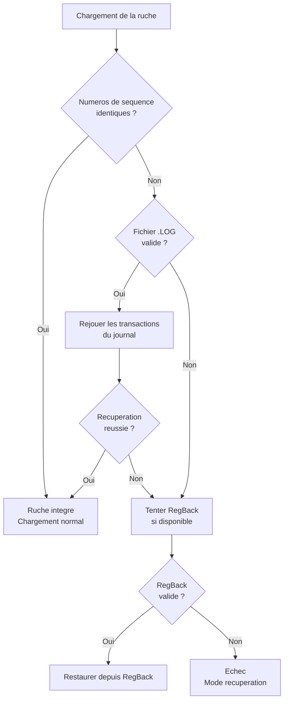
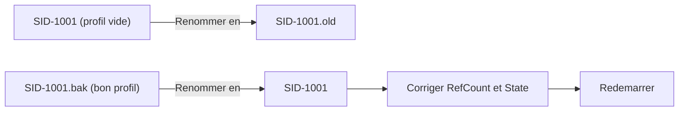
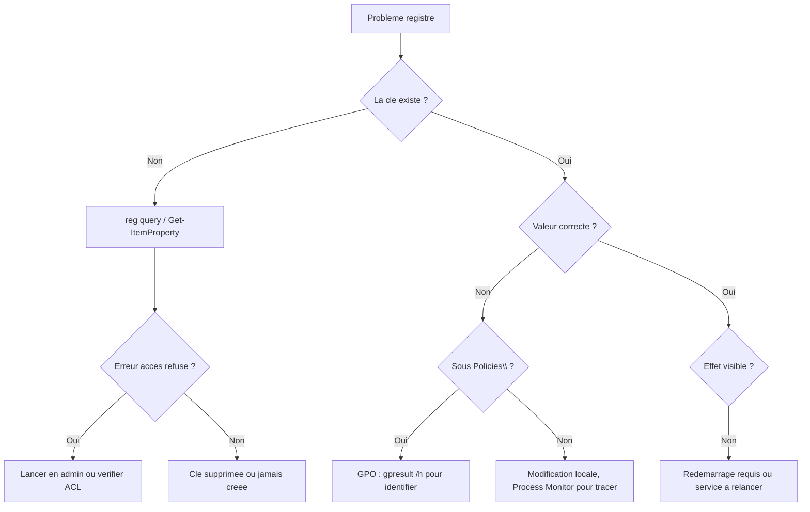

---
tags:
  - registre
  - dépannage
  - réparation
---

# Depannage avance

## Ce que vous allez apprendre

- Identifier rapidement un probleme lie au registre a partir des symptomes
- Utiliser Process Monitor pour diagnostiquer les acces registre
- Comprendre et reparer la corruption du registre
- Resoudre le probleme du profil utilisateur temporaire
- Reparer un service endommage dans le registre

---

## Diagnostic rapide : quel symptome, quelle cause ?

Avant de plonger dans les details, voici la **table de correspondance** entre les symptomes et leurs causes probables. C'est votre boussole de diagnostic.

| Symptome | Cause probable | Section |
|----------|---------------|---------|
| Ecran bleu (BSOD) au demarrage | Ruche SYSTEM ou BCD corrompue | [Corruption du registre](#corruption-du-registre) |
| Profil utilisateur temporaire | NTUSER.DAT corrompu ou permissions incorrectes | [Profil temporaire](#profil-utilisateur-temporaire) |
| Application qui ne demarre pas | Cles de configuration manquantes ou corrompues | [Process Monitor](#process-monitor-loutil-de-diagnostic) |
| Services qui ne demarrent pas | Entrees de services endommagees | [Services endommages](#services-endommages) |
| Strategies de groupe non appliquees | Cles sous `Policies` verrouillees ou corrompues | [Process Monitor](#process-monitor-loutil-de-diagnostic) |

!!! info "En resume"
    - Partez toujours du symptome pour identifier la cause probable
    - Ecran bleu = corruption de ruche, profil temporaire = NTUSER.DAT corrompu
    - Utilisez la table de correspondance ci-dessus comme point de depart du diagnostic

---

## Process Monitor : l'outil de diagnostic

Process Monitor (Sysinternals) est le **stethoscope** du registre : il ecoute toutes les operations en temps reel et vous montre exactement ce qui echoue.

### Configuration en 3 etapes

**Etape 1** -- Lancez Process Monitor en tant qu'administrateur.

**Etape 2** -- Configurez les filtres pour reduire le bruit :

| Filtre | Operateur | Valeur | Effet |
|--------|-----------|--------|-------|
| `Operation` | contains | `Reg` | Affiche uniquement les operations registre |
| `Result` | is | `ACCESS DENIED` | Trouve les problemes de permissions |
| `Result` | is | `NAME NOT FOUND` | Trouve les cles manquantes |
| `Process Name` | is | `application.exe` | Isole l'application problematique |

**Etape 3** -- Reproduisez le probleme et analysez les resultats.

!!! tip "Combiner les filtres"
    Vous pouvez empiler plusieurs filtres. Par exemple, `Operation contains Reg` **ET** `Result is NAME NOT FOUND` **ET** `Process Name is monapp.exe` vous montrera uniquement les cles que votre application cherche sans les trouver.

!!! example "Exemple concret : application qui ne demarre pas"
    1. Filtre : `Process Name is monapp.exe` + `Result is NAME NOT FOUND`
    2. Resultat : `RegOpenKey HKCU\Software\MonApp\License` -- `NAME NOT FOUND`
    3. Diagnostic : la cle de licence est manquante
    4. Solution : recreer la cle ou reinstaller l'application

!!! info "En resume"
    - C'est l'outil numero un pour diagnostiquer les problemes de registre
    - Filtrez par **processus** + **type d'erreur** pour aller droit au but
    - Cherchez `ACCESS DENIED` (permission) et `NAME NOT FOUND` (cle manquante)

---

## Corruption du registre

### Comment Windows detecte la corruption

Chaque ruche possede un **mecanisme d'auto-verification**, comme le code de controle sur une carte bancaire. Au demarrage, Windows verifie :

- La coherence des **numeros de sequence** dans l'en-tete de la ruche
- L'integrite des **signatures** (`regf` pour la ruche, `hbin` pour les blocs)
- La validite des **pointeurs internes** (offsets des cellules)

Si un de ces controles echoue, le Configuration Manager tente une recuperation automatique.

### Processus de recuperation automatique



Pensez a ce diagramme comme a un **plan d'evacuation** : Windows essaie d'abord la porte principale (journal de transactions), puis la sortie de secours (RegBack), et en dernier recours demande de l'aide (mode recuperation).

### Reparation manuelle

Quand la recuperation automatique echoue, vous devez intervenir depuis l'environnement de recuperation (WinRE).

**Etape 1 -- Demarrer en mode recuperation**

- Interrompez le demarrage 3 fois de suite pour acceder a WinRE
- Ou demarrez depuis un support d'installation USB
- Ouvrez une invite de commandes

**Etape 2 -- Identifier les ruches corrompues**

```batch
rem Check if hive files exist and their sizes
dir D:\Windows\System32\config\SYSTEM
dir D:\Windows\System32\config\SOFTWARE
```

```title="Resultat attendu"
 Repertoire de D:\Windows\System32\config

02/04/2026  14:30        19 267 584 SYSTEM
```

```batch
rem Check if RegBack copies are available
dir D:\Windows\System32\config\RegBack\
```

```title="Resultat attendu"
 Repertoire de D:\Windows\System32\config\RegBack

01/04/2026  03:00        18 874 368 SYSTEM
01/04/2026  03:00        89 128 960 SOFTWARE
01/04/2026  03:00           262 144 SAM
01/04/2026  03:00            28 672 SECURITY
01/04/2026  03:00           262 144 DEFAULT
```

!!! warning "Fichiers de taille 0 dans RegBack"
    Si les fichiers dans `RegBack` font 0 octet, la sauvegarde automatique est desactivee. Voir la section [Reactiver RegBack](07-sauvegarde.md#points-de-restauration-systeme).

**Etape 3 -- Remplacer les ruches corrompues**

```batch
rem Back up the corrupted hives first (always keep them!)
mkdir D:\RegBackup
copy D:\Windows\System32\config\SYSTEM D:\RegBackup\SYSTEM.corrupt
copy D:\Windows\System32\config\SOFTWARE D:\RegBackup\SOFTWARE.corrupt
```

```title="Resultat attendu"
        1 fichier(s) copie(s).
```

```batch
rem Restore from RegBack
copy D:\Windows\System32\config\RegBack\SYSTEM D:\Windows\System32\config\SYSTEM
copy D:\Windows\System32\config\RegBack\SOFTWARE D:\Windows\System32\config\SOFTWARE
```

```title="Resultat attendu"
        1 fichier(s) copie(s).
```

!!! danger "Sauvegardez les ruches corrompues avant de les remplacer"
    Gardez toujours une copie des fichiers corrompus (`SYSTEM.corrupt`, etc.). Si la restauration echoue, vous pourrez revenir en arriere ou les confier a un specialiste.

!!! info "En resume"
    - Windows verifie automatiquement l'integrite des ruches au demarrage
    - Mecanisme de recuperation : journal de transactions > RegBack > mode recuperation
    - En cas d'echec automatique : remplacement manuel depuis WinRE
    - **Toujours** sauvegarder les ruches corrompues avant de les remplacer

---

## Profil utilisateur temporaire

Quand un utilisateur se connecte et voit "Profil temporaire", c'est comme arriver a l'hotel et trouver sa chambre habituelle condamnee : Windows l'installe dans une chambre temporaire a la place.

La cause est presque toujours une incapacite a charger le fichier `NTUSER.DAT` de l'utilisateur.

### Diagnostic

```batch
rem Check the profile list in the registry
reg query "HKLM\SOFTWARE\Microsoft\Windows NT\CurrentVersion\ProfileList" /s
```

```title="Resultat attendu"
HKEY_LOCAL_MACHINE\SOFTWARE\...\ProfileList\S-1-5-21-...-1001
    ProfileImagePath    REG_EXPAND_SZ    C:\Users\Jean
    State               REG_DWORD        0x0

HKEY_LOCAL_MACHINE\SOFTWARE\...\ProfileList\S-1-5-21-...-1001.bak
    ProfileImagePath    REG_EXPAND_SZ    C:\Users\Jean
    State               REG_DWORD        0x0
```

Cherchez le SID de l'utilisateur concerne. Trois cas problematiques courants :

| Situation | Signe | Signification |
|-----------|-------|---------------|
| Double entree | Un SID + un SID`.bak` | Conflit apres une corruption |
| Chemin incorrect | `ProfileImagePath` pointe vers un dossier inexistant | Profil deplace ou supprime |
| Etat corrompu | `State` different de `0` | Le profil est marque comme endommage |

### Resolution

Le cas le plus frequent est la **double entree** (SID + SID`.bak`) :



**Etape 1** -- Dans Regedit, renommez la cle du SID normal en `.old`.

**Etape 2** -- Renommez la cle `.bak` pour supprimer le suffixe `.bak`.

**Etape 3** -- Dans la cle renommee, corrigez les valeurs :

```batch
rem Set RefCount to 0 and State to 0
reg add "HKLM\SOFTWARE\Microsoft\Windows NT\CurrentVersion\ProfileList\S-1-5-21-...-1001" /v RefCount /t REG_DWORD /d 0 /f
reg add "HKLM\SOFTWARE\Microsoft\Windows NT\CurrentVersion\ProfileList\S-1-5-21-...-1001" /v State /t REG_DWORD /d 0 /f
```

```title="Resultat attendu"
L'operation a reussi.
```

**Etape 4** -- Redemarrez la machine.

!!! info "Remplacez `S-1-5-21-...-1001` par le vrai SID"
    Pour trouver le SID de l'utilisateur concerne :

    ```batch
    wmic useraccount where name='Jean' get sid
    ```

    ```title="Resultat attendu"
    SID
    S-1-5-21-1234567890-1234567890-1234567890-1001
    ```

!!! info "En resume"
    - Cause : Windows ne peut pas charger `NTUSER.DAT`
    - Diagnostic : verifier `ProfileList` pour des doubles entrees ou un `State` incorrect
    - Resolution : renommer les cles SID et remettre `RefCount` et `State` a `0`
    - Toujours redemarrer apres la correction

---

## Services endommages

Un service dont la configuration est corrompue dans le registre peut empecher le demarrage du systeme. C'est comme un rouage casse dans un mecanisme d'horloge : un seul element defaillant peut bloquer tout le systeme.

### Localisation des services dans le registre

```
HKLM\SYSTEM\CurrentControlSet\Services\<NomDuService>
```

### Valeurs critiques d'un service

| Valeur | Type | Signification |
|--------|------|---------------|
| `Start` | REG_DWORD | Type de demarrage (voir ci-dessous) |
| `Type` | REG_DWORD | Type de service (voir ci-dessous) |
| `ImagePath` | REG_EXPAND_SZ | Chemin vers l'executable ou le pilote |
| `ErrorControl` | REG_DWORD | Comportement en cas d'echec |
| `ObjectName` | REG_SZ | Compte sous lequel le service s'execute |
| `DependOnService` | REG_MULTI_SZ | Services requis avant le demarrage |

**Valeurs de `Start`** (type de demarrage) :

| Valeur | Signification | Exemple |
|--------|---------------|---------|
| `0` | Boot (charge par le chargeur de demarrage) | Pilotes de disque |
| `1` | Systeme (charge par le noyau) | Pilotes de systeme de fichiers |
| `2` | Automatique (charge par le gestionnaire de services) | Services Windows |
| `3` | Manuel (demarre a la demande) | Service d'impression |
| `4` | Desactive | Service desactive par l'admin |

**Valeurs de `Type`** :

| Valeur | Signification |
|--------|---------------|
| `1` | Pilote noyau |
| `2` | Pilote systeme de fichiers |
| `16` | Processus propre (un seul service par processus) |
| `32` | Processus partage (plusieurs services dans le meme `svchost.exe`) |

### Desactiver un service problematique hors ligne

Quand un service empeche Windows de demarrer, vous devez le desactiver depuis l'environnement de recuperation -- comme couper le courant sur un appareil defectueux avant de le reparer.

```batch
rem Load the SYSTEM hive from the offline Windows installation
reg load "HKU\OfflineSYSTEM" "D:\Windows\System32\config\SYSTEM"
```

```title="Resultat attendu"
L'operation a reussi.
```

```batch
rem Find the current ControlSet (check the "Current" value in Select)
reg query "HKU\OfflineSYSTEM\Select" /v Current
```

```title="Resultat attendu"
HKEY_USERS\OfflineSYSTEM\Select
    Current    REG_DWORD    0x1
```

La valeur `0x1` signifie que `ControlSet001` est le jeu actif.

```batch
rem Disable the problematic service (set Start to 4 = disabled)
reg add "HKU\OfflineSYSTEM\ControlSet001\Services\ServiceProblematique" /v Start /t REG_DWORD /d 4 /f
```

```title="Resultat attendu"
L'operation a reussi.
```

```batch
rem Unload the hive
reg unload "HKU\OfflineSYSTEM"
```

```title="Resultat attendu"
L'operation a reussi.
```

!!! tip "Comment identifier le service coupable ?"
    Si Windows affiche un ecran bleu, notez le code d'arret (ex : `DRIVER_IRQL_NOT_LESS_OR_EQUAL`). Recherchez ce code en ligne -- il pointe souvent vers un pilote ou service specifique.

!!! info "En resume"
    - Les services vivent sous `HKLM\SYSTEM\CurrentControlSet\Services\`
    - `Start = 4` desactive un service
    - En cas de blocage au demarrage : charger la ruche SYSTEM hors ligne et desactiver le service coupable
    - Verifier `Select\Current` pour savoir quel `ControlSet` est actif

---

## Trouver quelle GPO a modifie une cle

Quand une valeur revient après correction manuelle, cherchez d'abord une GPO.
Le registre n'est souvent que le résultat final ; l'autorité réelle peut être dans Active Directory.

### Methode 1 : gpresult

```batch
gpresult /h rapport.html
```

Ouvrez `rapport.html`, puis recherchez le nom du paramètre, la clé ou la valeur.
Le rapport indique les GPO appliquées et, selon le type de paramètre, le composant qui l'a écrit.

### Methode 2 : regarder le chemin de la cle

Si la valeur est sous l'un de ces chemins, elle vient très probablement d'une politique :

```
HKLM\SOFTWARE\Policies\...
HKCU\Software\Policies\...
```

Comparer la valeur actuelle avec la valeur sous `Policies` permet de distinguer un réglage applicatif d'un réglage GPO.

### Methode 3 : audit et evenements

Deux événements peuvent aider selon la source du changement :

| Event ID | Journal | Usage |
|---|---|---|
| `5136` | Security sur DC | Modification d'objet AD, utile pour suivre un changement de GPO côté annuaire |
| `4657` | Security local | Modification d'une valeur registre auditée |

Activer l'audit registre :

```batch
auditpol /set /subcategory:"Registry" /success:enable /failure:enable
```

Il faut aussi poser une SACL sur la clé surveillée.
Sans SACL, activer la sous-catégorie ne suffit pas à produire les événements utiles.

### Trouver les GPO qui ciblent un chemin registre

```powershell title="Trouver les GPO qui modifient une cle specifique"
$targetKey = "HKLM\SOFTWARE\Policies\Microsoft\Windows\WindowsUpdate"

Get-GPO -All | ForEach-Object {
    [xml]$report = Get-GPOReport -Guid $_.Id -ReportType Xml
    if ($report.OuterXml -match [regex]::Escape($targetKey)) {
        [PSCustomObject]@{
            GPO    = $_.DisplayName
            Status = $_.GpoStatus
        }
    }
}
```

!!! warning "Module GroupPolicy"
    `Get-GPO` nécessite le module `GroupPolicy`, généralement disponible dans Windows PowerShell 5.1 avec RSAT ou sur un serveur d'administration.

!!! info "En resume"
    Pour trouver l'origine d'une valeur imposée, commencez par `gpresult /h`, vérifiez si la clé est sous `Policies`, puis utilisez les rapports XML GPO ou l'audit si l'origine reste ambiguë.

---

## Codes d'erreur courants

| Code | Source | Description | Action |
|------|--------|-------------|--------|
| `0x00000005` | `reg.exe` / API | `ERROR_ACCESS_DENIED` | Verifier permissions, lancer en admin, verifier TrustedInstaller |
| `0x00000002` | `reg.exe` / API | `ERROR_FILE_NOT_FOUND` | Cle ou valeur inexistante |
| `0x000003F1` | Regedit import | `ERROR_LOG_HARD_ERROR` | Fichier `.reg` corrompu ou encodage incorrect |
| `0x80070005` | PowerShell | `E_ACCESSDENIED` (COM) | WMI/CIM acces refuse, verifier DCOM permissions |
| `0x800703FA` | Service | `ERROR_KEY_DELETED` | Cle supprimee pendant l'acces, relancer l'operation |

!!! tip "Lecture rapide"
    `0x80070005` est presque toujours un problème d'autorisation.
    Avant de chercher une corruption, vérifiez le contexte d'exécution, l'élévation et les ACL.

---

## Arbre de decision : symptome → outil → correction



!!! info "En resume"
    Le dépannage registre commence par trois questions : la clé existe-t-elle, la valeur est-elle correcte, et une autorité supérieure la réécrit-elle.
