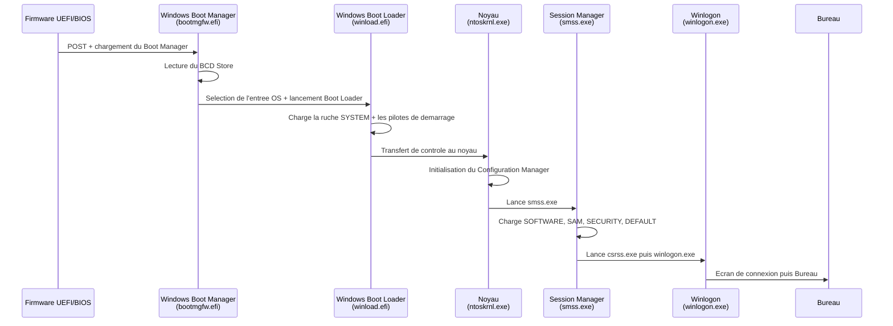
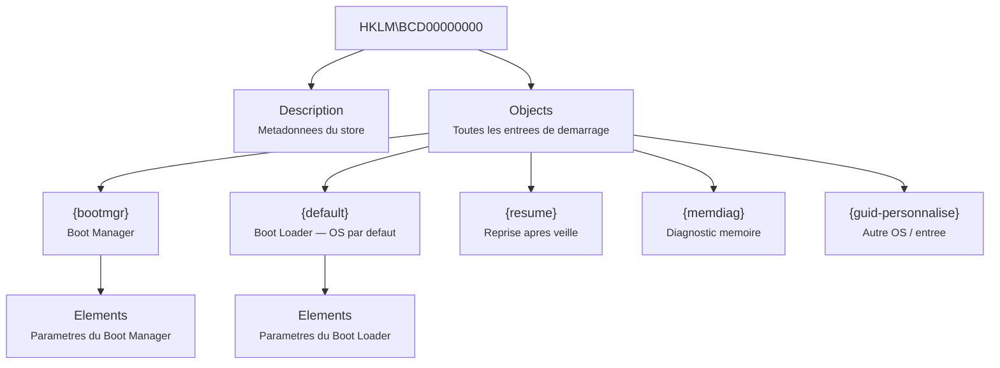
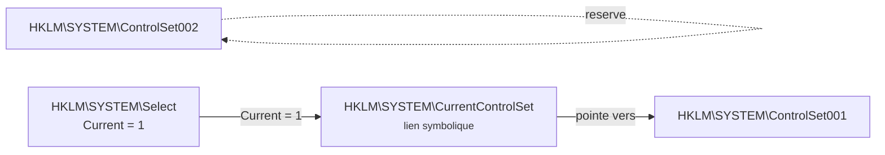
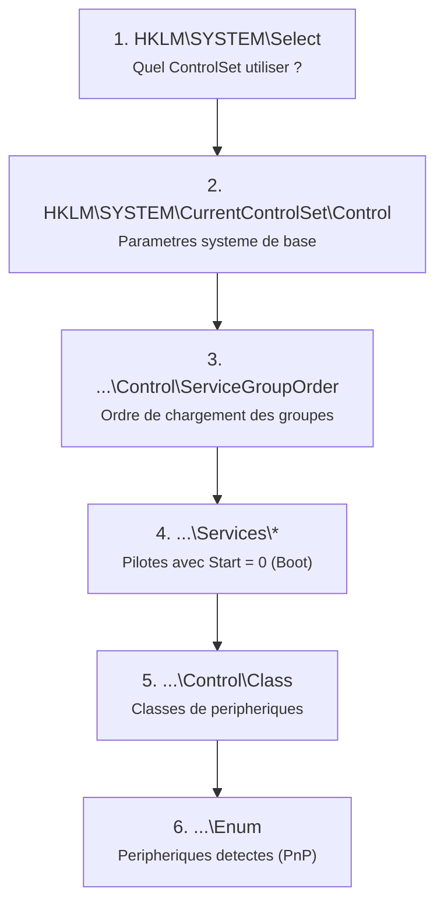

---
tags:
  - registre
  - démarrage
  - BCD
  - boot
---

# Processus de demarrage et BCD

## Ce que vous allez apprendre

- Le chemin complet d'un demarrage Windows, du firmware UEFI/BIOS jusqu'au Bureau
- Ce qu'est le BCD Store, ou il vit sur le disque et comment il est structure
- Les elements BCD : Boot Manager, Boot Loader, Resume, Memory Diagnostic
- La ruche `HKLM\BCD00000000` et sa structure interne
- Les commandes `bcdedit.exe` essentielles avec leurs sorties completes
- La configuration du double-boot via le registre
- Le Safe Mode et ses cles dans `HKLM\SYSTEM\CurrentControlSet\Control\SafeBoot`
- WinRE (Windows Recovery Environment) et sa configuration dans le registre
- La selection du ControlSet au demarrage via `HKLM\SYSTEM\Select`
- Le role de `smss.exe` (Session Manager) pendant le demarrage precoce
- L'initialisation du noyau et les premieres cles de registre lues
- Le debogage et la journalisation du demarrage via BCD
- Le depannage de problemes de demarrage reels avec `bcdedit`

---

## Le demarrage en un coup d'oeil

Avant d'entrer dans les details, voici le trajet complet de l'alimentation electrique jusqu'au Bureau :



!!! tip "Analogie"
    Le demarrage est comme un **relais de course**. Le firmware passe le temoin au Boot Manager, qui le passe au Boot Loader, qui le passe au noyau, qui le passe au Session Manager, et ainsi de suite. Chaque etape a un role precis et transmet le controle a la suivante.

!!! info "En resume"
    - Le demarrage Windows traverse 7 etapes : firmware, Boot Manager, Boot Loader, noyau, Session Manager, Winlogon, Bureau
    - Chaque composant lit des cles de registre specifiques avant de passer le controle au suivant
    - Ce schema de reference permet de situer rapidement l'origine d'un probleme de demarrage

---

## Phase 1 : le firmware (UEFI ou BIOS)

### UEFI (systemes modernes)

Le firmware UEFI lit la **table de partitions GPT** et cherche la **partition systeme EFI** (ESP).
Sur cette partition, il execute le fichier :

```
\EFI\Microsoft\Boot\bootmgfw.efi
```

!!! info "Ou se trouve la partition EFI ?"
    ```cmd
    mountvol S: /S
    dir S:\EFI\Microsoft\Boot\
    ```
    ```title="Resultat attendu"
    bootmgfw.efi       (Windows Boot Manager)
    bootmgr.efi        (copie de secours)
    BCD                 (Boot Configuration Data)
    memtest.efi         (diagnostic memoire)
    ```

### BIOS/MBR (systemes anciens)

Le BIOS lit le **Master Boot Record** (secteur 0 du disque), qui pointe vers le fichier `bootmgr` a la racine de la partition active.

| Element | UEFI/GPT | BIOS/MBR |
|---------|----------|----------|
| Fichier principal | `bootmgfw.efi` | `bootmgr` |
| Emplacement | ESP (`\EFI\Microsoft\Boot\`) | Racine de la partition active |
| BCD Store | `\EFI\Microsoft\Boot\BCD` | `\Boot\BCD` |
| Taille partition dediee | ~100 Mo (ESP) | ~350 Mo (partition systeme) |

!!! info "En resume"
    Le firmware initialise le materiel et localise le Windows Boot Manager. En UEFI, c'est `bootmgfw.efi` sur la partition EFI. En BIOS, c'est `bootmgr` sur la partition active.

!!! info "En resume"
    - Le demarrage suit une chaine de relais : firmware > Boot Manager > Boot Loader > noyau > Session Manager > Winlogon > Bureau
    - Chaque etape lit des cles de registre specifiques avant de transmettre le controle a la suivante
    - Le schema mermaid ci-dessus est la carte de reference pour tout depannage de demarrage

---

## Phase 2 : le Windows Boot Manager

Le Boot Manager (`bootmgfw.efi`) est le **chef d'orchestre** du demarrage.
Son travail : lire le BCD Store et decider quel systeme demarrer.

### Ce qu'il fait exactement

1. **Charge le BCD Store** depuis le disque
2. **Affiche le menu de demarrage** s'il y a plusieurs entrees OS (ou si ++f8++ est presse)
3. **Applique le timeout** configure dans le BCD
4. **Lance le Boot Loader** correspondant a l'entree selectionnee

### Le BCD Store : la carte routiere du demarrage

Le BCD (*Boot Configuration Data*) est un fichier binaire qui remplace le `boot.ini` des anciens Windows (XP et anterieurs).

!!! warning "Le BCD n'est PAS un fichier texte"
    Contrairement a `boot.ini`, le BCD est un **fichier de ruche du registre** au format binaire. Vous ne pouvez pas l'editer avec un editeur de texte. Utilisez `bcdedit.exe` ou montez-le dans `regedit`.

| Propriete | Detail |
|-----------|--------|
| Format | Ruche de registre (binaire `regf`) |
| Emplacement UEFI | `\EFI\Microsoft\Boot\BCD` (partition ESP) |
| Emplacement BIOS | `\Boot\BCD` (partition systeme) |
| Monte dans le registre sous | `HKLM\BCD00000000` |
| Outils d'edition | `bcdedit.exe`, `regedit` (en montant la ruche) |

!!! info "En resume"
    - Le Boot Manager lit le BCD Store et decide quel OS demarrer, puis lance le Boot Loader correspondant
    - Le BCD est un fichier binaire au format ruche de registre (`regf`), pas un fichier texte editable
    - L'outil officiel de manipulation est `bcdedit.exe` ; une sauvegarde prealable avec `/export` est indispensable

---

## Structure de la ruche BCD (`HKLM\BCD00000000`)

Le BCD Store est monte comme une ruche de registre pendant le demarrage.
Voici sa structure :



### Les objets BCD

Chaque entree du BCD est un **objet** identifie par un GUID.
Certains GUID sont bien connus :

| GUID | Alias bcdedit | Role |
|------|---------------|------|
| `{9dea862c-5cdd-4e70-acc1-f32b344d4795}` | `{bootmgr}` | Windows Boot Manager |
| `{a5a30fa2-3d06-4e9f-b5f4-a01df9d1fcba}` | `{fwbootmgr}` | Firmware Boot Manager |
| `{b2721d73-1db4-4c62-bf78-c548a880142d}` | `{memdiag}` | Diagnostic memoire |
| `{147aa509-0358-4473-b83b-d950dda00615}` | `{resumeloadersettings}` | Parametres de reprise |
| `{default}` | `{default}` | Entree OS par defaut |
| `{current}` | `{current}` | Entree de l'OS en cours d'execution |

### Les elements BCD

Chaque objet contient des **elements** — des paires cle-valeur qui definissent son comportement.
Les elements sont identifies par des codes hexadecimaux.

| Code element | Nom lisible | Description |
|-------------|-------------|-------------|
| `0x10000001` | `device` | Peripherique contenant le fichier |
| `0x10000002` | `path` | Chemin vers le fichier executable |
| `0x12000004` | `description` | Texte affiche dans le menu |
| `0x25000004` | `timeout` | Delai d'attente du menu (secondes) |
| `0x23000003` | `default` | GUID de l'entree par defaut |
| `0x24000001` | `displayorder` | Ordre d'affichage des entrees |
| `0x25000020` | `nx` | Politique DEP (Data Execution Prevention) |
| `0x260000a0` | `winpe` | Mode WinPE active |
| `0x22000002` | `systemroot` | Chemin vers le dossier Windows |

!!! info "En resume"
    - La ruche BCD est montee sous `HKLM\BCD00000000` avec deux sous-cles principales : `Description` et `Objects`
    - Chaque entree de demarrage est un objet identifie par un GUID, contenant des elements (paires code-valeur)
    - Les GUID bien connus incluent `{bootmgr}`, `{default}`, `{current}` et `{memdiag}`

---

## Commandes `bcdedit.exe`

`bcdedit.exe` est l'outil officiel pour manipuler le BCD Store.
Toutes les commandes suivantes necessitent une **invite de commandes administrateur**.

!!! danger "Prudence absolue"
    Une mauvaise commande `bcdedit` peut rendre votre systeme **impossible a demarrer**. Exportez toujours le BCD avant toute modification : `bcdedit /export C:\backup-bcd`.

### Lister toutes les entrees : `/enum`

```cmd
bcdedit /enum ALL
```

```title="Resultat attendu"
Windows Boot Manager
--------------------
identifier              {bootmgr}
device                  partition=\Device\HarddiskVolume1
description             Windows Boot Manager
locale                  fr-FR
inherit                 {globalsettings}
default                 {current}
resumeobject            {xxxxxxxx-xxxx-xxxx-xxxx-xxxxxxxxxxxx}
displayorder            {current}
toolsdisplayorder       {memdiag}
timeout                 30

Windows Boot Loader
-------------------
identifier              {current}
device                  partition=C:
path                    \Windows\system32\winload.efi
description             Windows 11
locale                  fr-FR
inherit                 {bootloadersettings}
recoverysequence        {xxxxxxxx-xxxx-xxxx-xxxx-xxxxxxxxxxxx}
displaymessageoverride  Recovery
recoveryenabled         Yes
isolatedcontext         Yes
allowedinmemorysettings 0x15000075
osdevice                partition=C:
systemroot              \Windows
resumeobject            {xxxxxxxx-xxxx-xxxx-xxxx-xxxxxxxxxxxx}
nx                      OptIn
bootmenupolicy          Standard

Windows Memory Diagnostic
-------------------------
identifier              {memdiag}
device                  partition=\Device\HarddiskVolume1
path                    \EFI\Microsoft\Boot\memtest.efi
description             Windows Memory Diagnostic
locale                  fr-FR
inherit                 {globalsettings}
badmemoryaccess         Yes
```

### Exporter et importer le BCD

```cmd
:: Export du BCD vers un fichier de sauvegarde
bcdedit /export C:\backup-bcd

:: Restauration depuis la sauvegarde
bcdedit /import C:\backup-bcd
```

```title="Resultat attendu"
The operation completed successfully.
```

### Modifier le timeout du menu

```cmd
bcdedit /timeout 10
```

```title="Resultat attendu"
The operation completed successfully.
```

!!! tip "Astuce"
    Un timeout de `0` desactive le menu de demarrage et demarre directement l'entree par defaut. Pratique pour un systeme a OS unique.

### Modifier l'entree par defaut

```cmd
:: Lister les GUID disponibles
bcdedit /enum | findstr "identifier description"

:: Definir l'entree par defaut
bcdedit /default {xxxxxxxx-xxxx-xxxx-xxxx-xxxxxxxxxxxx}
```

```title="Resultat attendu"
identifier              {current}
description             Windows 11
identifier              {xxxxxxxx-xxxx-xxxx-xxxx-xxxxxxxxxxxx}
description             Windows 11 (Test)
The operation completed successfully.
```

### Creer une nouvelle entree de demarrage

```cmd
:: Copier l'entree existante
bcdedit /copy {current} /d "Windows 11 (Test)"
```

```title="Resultat attendu"
The entry was successfully copied to {xxxxxxxx-xxxx-xxxx-xxxx-xxxxxxxxxxxx}.
```

```cmd
:: Modifier la partition de la nouvelle entree
bcdedit /set {xxxxxxxx-xxxx-xxxx-xxxx-xxxxxxxxxxxx} device partition=D:
bcdedit /set {xxxxxxxx-xxxx-xxxx-xxxx-xxxxxxxxxxxx} osdevice partition=D:
```

```title="Resultat attendu"
The operation completed successfully.
The operation completed successfully.
```

### Supprimer une entree

```cmd
bcdedit /delete {xxxxxxxx-xxxx-xxxx-xxxx-xxxxxxxxxxxx}
```

```title="Resultat attendu"
The operation completed successfully.
```

!!! warning "Suppression avec `/cleanup`"
    Par defaut, `/delete` supprime l'entree **et** la retire de la liste d'affichage. Ajoutez `/nocleanup` pour conserver la reference dans `displayorder`.

### Activer le mode debogage

```cmd
:: Activer le debogage noyau
bcdedit /debug {current} ON

:: Configurer le transport de debogage (port serie)
bcdedit /dbgsettings SERIAL DEBUGPORT:1 BAUDRATE:115200

:: Debogage via reseau (Windows 10+)
bcdedit /dbgsettings NET HOSTIP:192.168.1.100 PORT:50000
```

```title="Resultat attendu"
Key=xxxxxxxxxxxxx.xxxxxxxxxxxxx.xxxxxxxxxxxxx.xxxxxxxxxxxxx
```

!!! note "La cle de debogage reseau"
    La commande genere une cle cryptographique que vous devez entrer dans WinDbg sur la machine hote. Notez-la immediatement.

!!! info "En resume"
    - `bcdedit.exe` est l'outil officiel pour manipuler le BCD Store ; toujours exporter avec `/export` avant modification
    - Les operations courantes : `/enum` (lister), `/timeout` (delai du menu), `/default` (entree par defaut), `/copy` et `/create` (nouvelles entrees)
    - Le mode debogage noyau s'active via `/debug ON` et se configure via `/dbgsettings` (serie ou reseau)

---

## Configuration du double-boot

### Ajouter un deuxieme Windows

Scenario : Windows 11 est sur `C:` et un deuxieme Windows 11 est sur `D:`.

```cmd
:: Etape 1 : Creer une nouvelle entree Boot Loader
bcdedit /create /d "Windows 11 (Second)" /application osloader
```

```title="Resultat attendu"
The entry {xxxxxxxx-xxxx-xxxx-xxxx-xxxxxxxxxxxx} was successfully created.
```

```cmd
:: Etape 2 : Configurer la nouvelle entree (remplacer le GUID)
bcdedit /set {xxxxxxxx-xxxx-xxxx-xxxx-xxxxxxxxxxxx} device partition=D:
bcdedit /set {xxxxxxxx-xxxx-xxxx-xxxx-xxxxxxxxxxxx} osdevice partition=D:
bcdedit /set {xxxxxxxx-xxxx-xxxx-xxxx-xxxxxxxxxxxx} path \Windows\system32\winload.efi
bcdedit /set {xxxxxxxx-xxxx-xxxx-xxxx-xxxxxxxxxxxx} systemroot \Windows

:: Etape 3 : Ajouter au menu de demarrage
bcdedit /displayorder {xxxxxxxx-xxxx-xxxx-xxxx-xxxxxxxxxxxx} /addlast

:: Etape 4 : Definir un timeout pour voir le menu
bcdedit /timeout 15
```

```title="Resultat attendu"
The operation completed successfully.
The operation completed successfully.
The operation completed successfully.
The operation completed successfully.
The operation completed successfully.
The operation completed successfully.
```

### Double-boot avec Linux (via le firmware UEFI)

Le BCD ne gere pas directement les chargeurs Linux.
La strategie recommandee est de laisser le **firmware UEFI** gerer le choix :

```cmd
:: Lister les entrees du firmware
bcdedit /enum FIRMWARE
```

```title="Resultat attendu"
Firmware Boot Manager
---------------------
identifier              {fwbootmgr}
displayorder            {bootmgr}
                        {xxxxxxxx-xxxx-xxxx-xxxx-xxxxxxxxxxxx}

Firmware Application (1)
------------------------
identifier              {xxxxxxxx-xxxx-xxxx-xxxx-xxxxxxxxxxxx}
path                    \EFI\ubuntu\shimx64.efi
description             ubuntu
```

!!! tip "Changer l'ordre de demarrage du firmware"
    Utilisez `bcdedit /set {fwbootmgr} displayorder {bootmgr} {guid-linux} /addfirst` ou l'utilitaire `efibootmgr` sous Linux.

!!! info "En resume"
    Le double-boot passe par la creation d'entrees dans le BCD Store via `bcdedit`. Pour les systemes Linux, laissez le firmware UEFI gerer le choix entre les chargeurs.

---

## La selection du ControlSet (`HKLM\SYSTEM\Select`)

Quand le noyau demarre, il doit choisir **quel jeu de configuration utiliser**.
Les parametres systeme sont stockes dans `HKLM\SYSTEM\ControlSet001`, `ControlSet002`, etc.

La cle `HKLM\SYSTEM\Select` contient quatre valeurs qui determinent le choix :

```powershell
Get-ItemProperty "HKLM:\SYSTEM\Select"
```

```title="Resultat attendu"
Current       : 1
Default       : 1
Failed        : 0
LastKnownGood : 1
```

| Valeur | Signification |
|--------|---------------|
| `Current` | Le ControlSet utilise par le demarrage **en cours** |
| `Default` | Le ControlSet qui sera utilise au **prochain** demarrage normal |
| `Failed` | Le ControlSet qui a **echoue** la derniere fois |
| `LastKnownGood` | Le dernier ControlSet qui a permis un demarrage **reussi** |

!!! tip "Analogie"
    Imaginez deux coffres-forts contenant chacun une copie de la configuration systeme. `Current` vous dit quel coffre est ouvert en ce moment. `LastKnownGood` est le coffre que vous ouvrirez si l'autre pose probleme.

### Comment `CurrentControlSet` est cree

`CurrentControlSet` n'est **pas** un vrai jeu de configuration sur le disque.
C'est un **lien symbolique** cree par le noyau au demarrage, pointant vers `ControlSet00X` en fonction de la valeur `Current`.



### Forcer le demarrage en LastKnownGood

Si le systeme ne demarre plus avec le ControlSet par defaut :

```cmd
:: Depuis la console de recuperation
reg load HKLM\OFFLINE_SYSTEM D:\Windows\System32\config\SYSTEM
reg query HKLM\OFFLINE_SYSTEM\Select
reg add HKLM\OFFLINE_SYSTEM\Select /v Default /t REG_DWORD /d 2 /f
reg unload HKLM\OFFLINE_SYSTEM
```

```title="Resultat attendu"
The operation completed successfully.

HKEY_LOCAL_MACHINE\OFFLINE_SYSTEM\Select
    Current       REG_DWORD    0x1
    Default       REG_DWORD    0x1
    Failed        REG_DWORD    0x0
    LastKnownGood REG_DWORD    0x2

The operation completed successfully.
The operation completed successfully.
```

!!! danger "Manipulation delicate"
    Ne modifiez `HKLM\SYSTEM\Select` que si vous savez exactement ce que vous faites. Une mauvaise valeur peut empecher tout demarrage.

!!! info "En resume"
    - `HKLM\SYSTEM\Select` contient quatre valeurs (`Current`, `Default`, `Failed`, `LastKnownGood`) qui determinent quel ControlSet utiliser
    - `CurrentControlSet` est un lien symbolique cree par le noyau au demarrage, pointant vers le ControlSet designe par `Current`
    - En cas de probleme, on peut forcer le demarrage sur un autre ControlSet via la console de recuperation

---

## Le Safe Mode (Mode sans echec)

### Ou sont stockees les options du Safe Mode ?

Les pilotes et services autorises en Safe Mode sont listes sous :

```
HKLM\SYSTEM\CurrentControlSet\Control\SafeBoot
```

```powershell
Get-ChildItem "HKLM:\SYSTEM\CurrentControlSet\Control\SafeBoot"
```

```title="Resultat attendu"
    Hive: HKEY_LOCAL_MACHINE\SYSTEM\CurrentControlSet\Control\SafeBoot

Name                           Property
----                           --------
Minimal                        (default) : ...
Network                        (default) : ...
```

| Sous-cle | Correspond a |
|----------|-------------|
| `Minimal` | Mode sans echec **standard** (pas de reseau) |
| `Network` | Mode sans echec **avec prise en charge reseau** |

### Contenu de `SafeBoot\Minimal`

Chaque sous-cle sous `Minimal` ou `Network` represente un **service ou groupe** autorise a demarrer.

```powershell
Get-ChildItem "HKLM:\SYSTEM\CurrentControlSet\Control\SafeBoot\Minimal" |
    Select-Object Name | Format-Table -AutoSize
```

```title="Resultat attendu"
Name
----
HKEY_LOCAL_MACHINE\SYSTEM\CurrentControlSet\Control\SafeBoot\Minimal\AppInfo
HKEY_LOCAL_MACHINE\SYSTEM\CurrentControlSet\Control\SafeBoot\Minimal\Base
HKEY_LOCAL_MACHINE\SYSTEM\CurrentControlSet\Control\SafeBoot\Minimal\Boot Bus Extender
HKEY_LOCAL_MACHINE\SYSTEM\CurrentControlSet\Control\SafeBoot\Minimal\CryptSvc
HKEY_LOCAL_MACHINE\SYSTEM\CurrentControlSet\Control\SafeBoot\Minimal\EventLog
HKEY_LOCAL_MACHINE\SYSTEM\CurrentControlSet\Control\SafeBoot\Minimal\File system
HKEY_LOCAL_MACHINE\SYSTEM\CurrentControlSet\Control\SafeBoot\Minimal\FilterManager
HKEY_LOCAL_MACHINE\SYSTEM\CurrentControlSet\Control\SafeBoot\Minimal\Kernel.Networking
HKEY_LOCAL_MACHINE\SYSTEM\CurrentControlSet\Control\SafeBoot\Minimal\PnP Filter
HKEY_LOCAL_MACHINE\SYSTEM\CurrentControlSet\Control\SafeBoot\Minimal\Power
HKEY_LOCAL_MACHINE\SYSTEM\CurrentControlSet\Control\SafeBoot\Minimal\WinDefend
```

!!! note "Valeur par defaut de chaque sous-cle"
    La valeur `(Default)` de chaque sous-cle indique le type : `Service` pour un service individuel, `Driver Group` pour un groupe de pilotes.

### Forcer le demarrage en Safe Mode via le BCD

```cmd
:: Activer le Safe Mode minimal
bcdedit /set {current} safeboot minimal

:: Activer le Safe Mode avec reseau
bcdedit /set {current} safeboot network

:: Desactiver le Safe Mode (retour normal)
bcdedit /deletevalue {current} safeboot
```

```title="Resultat attendu"
The operation completed successfully.
```

!!! warning "N'oubliez pas de desactiver"
    Si vous activez le Safe Mode via `bcdedit`, le systeme redemarrera **en boucle** en mode sans echec jusqu'a ce que vous supprimiez la valeur `safeboot`. C'est un piege classique.

### Alternative : `msconfig.exe`

```cmd
msconfig
```

```title="Resultat attendu"
La fenetre "Configuration du systeme" s'ouvre.
Aucune sortie dans la console.
```

Dans l'onglet **Demarrer** > cochez **Demarrage securise** et choisissez :

- **Minimal** : mode sans echec standard
- **Reseau** : mode sans echec avec reseau
- **Reparation Active Directory** : pour les controleurs de domaine
- **Autre shell** : invite de commandes uniquement (pas d'Explorateur)

!!! info "En resume"
    Le Safe Mode est controle par les cles sous `SafeBoot\Minimal` et `SafeBoot\Network` dans le registre, et peut etre force via `bcdedit /set safeboot`. Chaque sous-cle liste un service ou groupe de pilotes autorise a demarrer.

---

## WinRE (Windows Recovery Environment)

WinRE est l'environnement de recuperation de Windows.
Sa configuration est stockee dans le BCD et dans le registre.

### Verifier l'etat de WinRE

```cmd
reagentc /info
```

```title="Resultat attendu"
Windows RE status:         Enabled
Windows RE location:       \\?\GLOBALROOT\device\harddisk0\partition3\Recovery\WindowsRE
Boot Configuration Data (BCD) identifier: {xxxxxxxx-xxxx-xxxx-xxxx-xxxxxxxxxxxx}
Recovery image location:
Recovery image index:      0
Custom image location:
Custom image index:        0
```

### Cles de registre WinRE

| Cle | Description |
|-----|-------------|
| `HKLM\SYSTEM\CurrentControlSet\Control\Session Manager\Environment\RECOVERYIMAGE` | Chemin vers l'image de recuperation |
| `HKLM\SOFTWARE\Microsoft\Windows NT\CurrentVersion\WinRE` | Configuration WinRE principale |

```powershell
Get-ItemProperty "HKLM:\SOFTWARE\Microsoft\Windows NT\CurrentVersion\WinRE"
```

```title="Resultat attendu"
WinREVersion     : 10.0.22621
WinRELocation    : \\?\GLOBALROOT\device\harddisk0\partition3\Recovery\WindowsRE
ImageStamp       : 0
WinREStaged      : 0
OperationParam   :
OperationType    : 0
ScheduledOperation : 0
```

### Le BCD et WinRE

L'entree WinRE dans le BCD est liee a l'entree OS par la valeur `recoverysequence` :

```cmd
bcdedit /enum {current} | findstr "recovery"
```

```title="Resultat attendu"
recoverysequence        {xxxxxxxx-xxxx-xxxx-xxxx-xxxxxxxxxxxx}
recoveryenabled         Yes
```

### Activer ou desactiver WinRE

```cmd
:: Desactiver WinRE
reagentc /disable

:: Reactiver WinRE
reagentc /enable
```

```title="Resultat attendu"
REAGENTC.EXE: Operation Successful.
```

!!! tip "Depannage WinRE"
    Si `reagentc /info` montre "Disabled" et que vous ne pouvez pas le reactiver, verifiez que le fichier `Winre.wim` existe dans le dossier `Recovery\WindowsRE` sur la partition de recuperation.

!!! info "En resume"
    - WinRE est l'environnement de recuperation dont la configuration se trouve dans le BCD et sous `HKLM\SOFTWARE\Microsoft\Windows NT\CurrentVersion\WinRE`
    - `reagentc /info` affiche l'etat et l'emplacement de WinRE ; `reagentc /enable` et `/disable` le controlent
    - L'entree OS du BCD reference WinRE via la valeur `recoverysequence`

---

## Session Manager (`smss.exe`) : le premier processus utilisateur

Apres l'initialisation du noyau, `smss.exe` est le **premier processus en mode utilisateur** lance.
Il lit de nombreuses cles du registre pour configurer l'environnement systeme.

### Cles lues par `smss.exe`

| Cle | Role |
|-----|------|
| `HKLM\SYSTEM\CurrentControlSet\Control\Session Manager\BootExecute` | Programmes a executer avant les services (ex : `autochk`) |
| `HKLM\SYSTEM\CurrentControlSet\Control\Session Manager\SubSystems` | Definition des sous-systemes (Windows, POSIX) |
| `HKLM\SYSTEM\CurrentControlSet\Control\Session Manager\Memory Management` | Parametres de memoire virtuelle et pagination |
| `HKLM\SYSTEM\CurrentControlSet\Control\Session Manager\Environment` | Variables d'environnement systeme |
| `HKLM\SYSTEM\CurrentControlSet\Control\Session Manager\KnownDLLs` | DLL chargees en memoire partagee |

### `BootExecute` : verification du disque au demarrage

```powershell
Get-ItemProperty "HKLM:\SYSTEM\CurrentControlSet\Control\Session Manager" |
    Select-Object -ExpandProperty BootExecute
```

```title="Resultat attendu"
autocheck autochk *
```

!!! info "Que fait `autocheck autochk *` ?"
    Cette commande lance la verification de tous les disques marques comme "dirty" (arret non propre). C'est l'equivalent d'un `chkdsk` automatique au demarrage, **avant** le chargement des pilotes de systeme de fichiers complets.

### `SubSystems` : les sous-systemes Windows

```powershell
(Get-ItemProperty "HKLM:\SYSTEM\CurrentControlSet\Control\Session Manager\SubSystems").Windows
```

```title="Resultat attendu"
%SystemRoot%\system32\csrss.exe ObjectDirectory=\Windows SharedSection=1024,20480,768 Windows=On SubSystemType=Windows ServerDll=basesrv,1 ServerDll=winsrv:UserServerDllInitialization,3 ServerDll=sxssrv,4 ProfileControl=Off MaxRequestThreads=16
```

C'est ainsi que `smss.exe` sait comment lancer `csrss.exe` (Client/Server Runtime Subsystem).

### `KnownDLLs` : les DLL pre-chargees

```powershell
Get-Item "HKLM:\SYSTEM\CurrentControlSet\Control\Session Manager\KnownDLLs" |
    Select-Object -ExpandProperty Property | Sort-Object
```

```title="Resultat attendu"
advapi32
clbcatq
combase
coml2
comdlg32
difxapi
gdi32
gdiplus
...
kernel32
...
ntdll
ole32
oleaut32
...
user32
...
```

!!! warning "Securite des KnownDLLs"
    La liste `KnownDLLs` empeche les attaques par **DLL hijacking** pour ces DLL specifiques. Windows les charge toujours depuis `System32`, peu importe le dossier courant de l'application. Ajouter une DLL a cette liste est une technique de durcissement.

!!! info "En resume"
    - `smss.exe` est le premier processus utilisateur ; il lit `BootExecute`, `SubSystems`, `Memory Management`, `Environment` et `KnownDLLs`
    - `BootExecute` lance `autochk` pour verifier les disques marques comme "dirty" avant le chargement complet du systeme
    - `KnownDLLs` force le chargement de DLL critiques depuis `System32`, empechant les attaques par DLL hijacking

---

## Initialisation du noyau : les premieres cles lues

Le noyau Windows (`ntoskrnl.exe`) lit les cles suivantes dans un ordre precis, **avant** le lancement de `smss.exe` :



### Ordre de chargement des groupes de pilotes

```powershell
(Get-ItemProperty "HKLM:\SYSTEM\CurrentControlSet\Control\ServiceGroupOrder").List
```

```title="Resultat attendu"
System Reserved
EMS
WdfLoadGroup
Boot Bus Extender
System Bus Extender
SCSI miniport
Port
Primary Disk
SCSI Class
SCSI CDROM Class
FSFilter Infrastructure
FSFilter System
FSFilter Bottom
FSFilter Copy Protection
FSFilter Security Enhancer
...
File system
Boot File System
Filter
...
PNP_TDI
NDIS Wrapper
NDIS
TDI
...
```

!!! note "Pourquoi l'ordre est important"
    Les pilotes de bus doivent demarrer **avant** les pilotes de peripheriques qui en dependent. Les pilotes de systeme de fichiers doivent demarrer **avant** que Windows puisse lire les autres ruches du registre. C'est une cascade de dependances.

!!! info "En resume"
    - Le noyau lit d'abord `HKLM\SYSTEM\Select`, puis charge les pilotes Boot Start (Start = 0) dans l'ordre defini par `ServiceGroupOrder`
    - L'ordre de chargement suit une cascade de dependances : bus > stockage > systeme de fichiers > reseau
    - Les cles `Control\Class` et `Enum` gerent les peripheriques PnP detectes au demarrage

---

## Journalisation et debogage du demarrage

### Boot Logging (journalisation du demarrage)

```cmd
:: Activer la journalisation du demarrage
bcdedit /set {current} bootlog Yes
```

```title="Resultat attendu"
The operation completed successfully.
```

Au prochain redemarrage, Windows cree le fichier `C:\Windows\ntbtlog.txt` :

```title="Extrait de ntbtlog.txt"
Service Pack 0
5 2 2026 16:45:12.500
Loaded driver \SystemRoot\system32\ntoskrnl.exe
Loaded driver \SystemRoot\system32\hal.dll
Loaded driver \SystemRoot\system32\kdcom.dll
Loaded driver \SystemRoot\system32\mcupdate_GenuineIntel.dll
Loaded driver \SystemRoot\System32\drivers\CLFS.SYS
Loaded driver \SystemRoot\System32\drivers\tm.sys
Loaded driver \SystemRoot\system32\PSHED.dll
Loaded driver \SystemRoot\system32\BOOTVID.dll
Loaded driver \SystemRoot\System32\drivers\FLTMGR.SYS
Loaded driver \SystemRoot\System32\drivers\msrpc.sys
Loaded driver \SystemRoot\System32\drivers\ksecdd.sys
...
Did not load driver @oem42.inf,%intcaudiobus.svcdesc%;Intel(R) Smart Sound Technology (Intel(R) SST) Audio Controller
...
```

### Demarrage en mode verbose

```cmd
bcdedit /set {current} sos on
```

```title="Resultat attendu"
The operation completed successfully.
```

Affiche les noms des pilotes a l'ecran pendant le demarrage au lieu de l'animation de chargement.

### Desactiver le redemarrage automatique en cas d'erreur

```cmd
bcdedit /set {current} recoveryenabled No
bcdedit /set {current} bootstatuspolicy IgnoreAllFailures
```

```title="Resultat attendu"
The operation completed successfully.
The operation completed successfully.
```

!!! tip "Utile pour le diagnostic"
    Par defaut, Windows redemarre automatiquement apres un ecran bleu (BSOD). Desactiver cette option permet de **lire le message d'erreur** avant le redemarrage.

### Journal d'evenements du demarrage

```powershell
# View the last 20 boot-related events
Get-WinEvent -LogName "Microsoft-Windows-Diagnostics-Performance/Operational" -MaxEvents 20 |
    Where-Object { $_.Id -eq 100 } |
    Format-Table TimeCreated, Id, Message -Wrap
```

```title="Resultat attendu"
TimeCreated          Id Message
-----------          -- -------
2026-03-15 08:30:12 100 Windows has started up:
                         Boot Duration    : 12450ms
                         IsDegradation    : false
                         ...
```

!!! info "En resume"
    - `bcdedit /set bootlog Yes` active la journalisation du demarrage dans `C:\Windows\ntbtlog.txt`
    - `bcdedit /set sos on` affiche les noms des pilotes a l'ecran pendant le demarrage au lieu de l'animation
    - Le journal `Diagnostics-Performance/Operational` (Event ID 100) mesure la duree du demarrage

---

## Depannage reel : reparer un demarrage casse

### Probleme 1 : "No bootable device found"

**Cause** : le BCD Store est absent ou corrompu.

```cmd
:: Depuis l'environnement de recuperation (WinRE)
:: Etape 1 : Identifier les partitions
diskpart
list disk
select disk 0
list partition
exit

:: Etape 2 : Reconstruire le BCD
bootrec /fixboot
bootrec /rebuildbcd
```

```title="Resultat attendu"
Scanning all disks for Windows installations.

Successfully scanned Windows installations.
Total identified Windows installations: 1
[1]  D:\Windows
Add installation to boot list? Yes(Y)/No(N)/All(A): Y
```

!!! note "Si `bootrec /fixboot` renvoie 'Access denied'"
    Sur les systemes UEFI recents, utilisez plutot :
    ```cmd
    :: Monter la partition EFI
    mountvol S: /S
    :: Copier les fichiers de demarrage
    bcdboot D:\Windows /s S: /f UEFI
    ```

### Probleme 2 : "INACCESSIBLE_BOOT_DEVICE" (ecran bleu)

**Cause** : le pilote du controleur de stockage n'est pas charge.

```cmd
:: Depuis WinRE, charger la ruche SYSTEM du systeme casse
reg load HKLM\OFFLINE_SYSTEM D:\Windows\System32\config\SYSTEM

:: Verifier le type de demarrage du pilote de stockage
reg query "HKLM\OFFLINE_SYSTEM\ControlSet001\Services\storahci" /v Start
```

```title="Resultat attendu"
    Start    REG_DWORD    0x0
```

Si la valeur est differente de `0` (Boot Start), corrigez :

```cmd
reg add "HKLM\OFFLINE_SYSTEM\ControlSet001\Services\storahci" /v Start /t REG_DWORD /d 0 /f
reg unload HKLM\OFFLINE_SYSTEM
```

```title="Resultat attendu"
The operation completed successfully.
The operation completed successfully.
```

### Probleme 3 : le menu de demarrage n'apparait plus

```cmd
:: Verifier le timeout
bcdedit /enum {bootmgr} | findstr "timeout"

:: S'il est a 0, le corriger
bcdedit /timeout 10

:: Verifier que les entrees sont dans displayorder
bcdedit /enum {bootmgr} | findstr "displayorder"
```

```title="Resultat attendu"
timeout                 0
The operation completed successfully.
displayorder            {current}
```

### Probleme 4 : boucle de reparation automatique

```cmd
:: Depuis WinRE
bcdedit /set {current} recoveryenabled No

:: Si le probleme persiste, verifier les valeurs critiques
bcdedit /enum {current}

:: Verifier que le chemin vers winload est correct
bcdedit /set {current} path \Windows\system32\winload.efi
bcdedit /set {current} device partition=C:
bcdedit /set {current} osdevice partition=C:
```

```title="Resultat attendu"
The operation completed successfully.
The operation completed successfully.
The operation completed successfully.
The operation completed successfully.
```

### Probleme 5 : restaurer un ControlSet sain

```cmd
:: Depuis WinRE
reg load HKLM\OFFLINE_SYSTEM D:\Windows\System32\config\SYSTEM

:: Voir les ControlSets disponibles
reg query HKLM\OFFLINE_SYSTEM\Select

:: Forcer l'utilisation du ControlSet 2 (LastKnownGood)
reg add HKLM\OFFLINE_SYSTEM\Select /v Default /t REG_DWORD /d 2 /f
reg add HKLM\OFFLINE_SYSTEM\Select /v Current /t REG_DWORD /d 2 /f

reg unload HKLM\OFFLINE_SYSTEM
```

```title="Resultat attendu"
The operation completed successfully.

HKEY_LOCAL_MACHINE\OFFLINE_SYSTEM\Select
    Current       REG_DWORD    0x1
    Default       REG_DWORD    0x1
    Failed        REG_DWORD    0x0
    LastKnownGood REG_DWORD    0x2

The operation completed successfully.
The operation completed successfully.
The operation completed successfully.
```

!!! info "En resume"
    - Les problemes de demarrage courants se reparent depuis WinRE avec `bootrec`, `bcdboot` et `reg load`
    - Un BCD absent se reconstruit avec `bootrec /rebuildbcd` ; un pilote de stockage desactive se corrige en mettant `Start = 0`
    - Forcer un ControlSet sain via `HKLM\SYSTEM\Select` et desactiver la boucle de reparation via `recoveryenabled No` resolvent la majorite des cas

---

## Resume du processus de demarrage complet

```mermaid
graph TD
    A["Firmware UEFI/BIOS<br/><small>POST + localisation du Boot Manager</small>"]
    B["Windows Boot Manager<br/><small>Lecture du BCD Store</small>"]
    C["Windows Boot Loader<br/><small>Charge SYSTEM + pilotes Boot Start</small>"]
    D["Noyau ntoskrnl.exe<br/><small>Configuration Manager + pilotes</small>"]
    E["smss.exe<br/><small>Sous-systemes + BootExecute</small>"]
    F["csrss.exe<br/><small>Sous-systeme Windows</small>"]
    G["wininit.exe<br/><small>Services (services.exe) + lsass.exe</small>"]
    H["winlogon.exe<br/><small>Ecran de connexion</small>"]
    I["explorer.exe<br/><small>Bureau + Shell</small>"]

    A --> B --> C --> D --> E --> F --> G --> H --> I

    style A fill:#445,stroke:#888
    style B fill:#446,stroke:#888
    style C fill:#447,stroke:#888
    style D fill:#448,stroke:#888
    style E fill:#449,stroke:#888
    style F fill:#44a,stroke:#888
    style G fill:#44b,stroke:#888
    style H fill:#44c,stroke:#888
    style I fill:#44d,stroke:#888
```



| Phase | Composant | Cles de registre lues |
|-------|-----------|----------------------|
| 1 | Firmware | Aucune (pre-OS) |
| 2 | Boot Manager | BCD Store (ruche BCD) |
| 3 | Boot Loader | `HKLM\SYSTEM` (ruche SYSTEM) |
| 4 | Noyau | `Select`, `Services` (Start=0), `ServiceGroupOrder` |
| 5 | smss.exe | `Session Manager`, `KnownDLLs`, `Environment` |
| 6 | Services | `Services` (Start=1, 2, 3), `SOFTWARE` |
| 7 | Winlogon | `Winlogon`, `NTUSER.DAT` |

!!! info "En resume"
    Le demarrage Windows est une chaine orchestree par le registre de bout en bout. Le BCD Store (lui-meme une ruche de registre) guide le Boot Manager, la ruche SYSTEM configure les pilotes et services, et les cles du Session Manager preparent l'environnement utilisateur. Chaque phase lit des cles specifiques du registre, ce qui fait du registre le veritable **chef d'orchestre** du demarrage.
