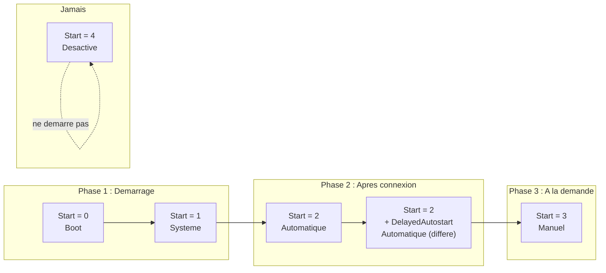
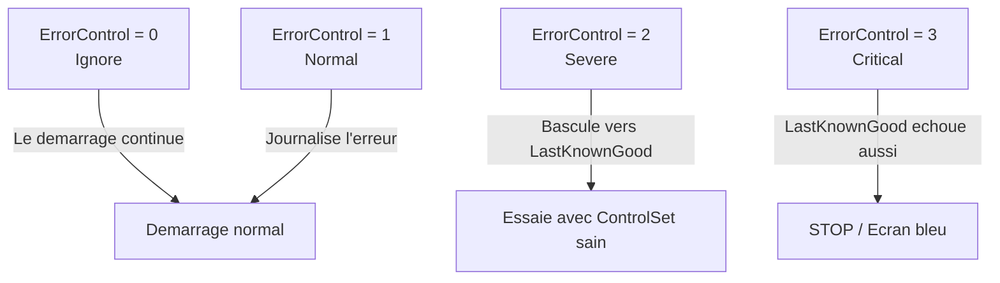
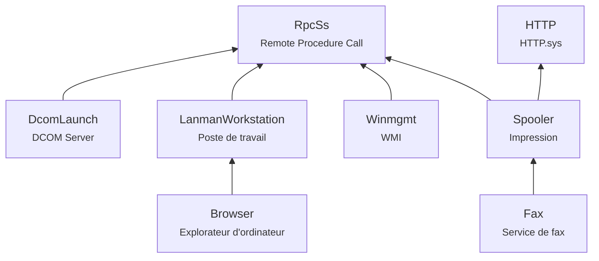
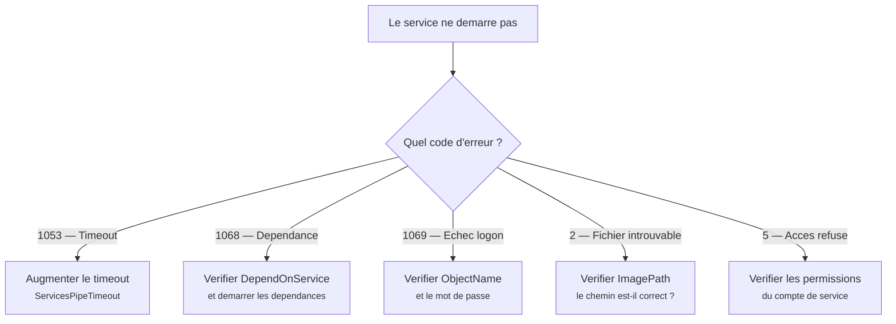

---
tags:
  - registre
  - services
  - pilotes
---

# Services Windows en profondeur

## Ce que vous allez apprendre

- Ou et comment chaque service est enregistre dans le registre
- La signification de **chaque** valeur du registre d'un service : Start, Type, ErrorControl, ImagePath, et bien d'autres
- Les types de demarrage (0 a 4) avec des exemples concrets
- Les types de services : pilotes noyau, processus, processus partage
- Le systeme de dependances entre services
- Les options de recuperation : FailureActions, FailureCommand, ResetPeriod
- Les services proteges (PPL) et LaunchProtected
- Les comptes de service : LocalSystem, LocalService, NetworkService, gMSA
- Comment creer un service directement dans le registre
- Les pilotes noyau vs les services utilisateur
- Les services a declenchement (Trigger-Started Services)
- Le depannage de services qui refusent de demarrer

---

## Anatomie d'un service dans le registre

Chaque service Windows est un ensemble de valeurs sous :

```
HKLM\SYSTEM\CurrentControlSet\Services\{nom-du-service}
```

Regardons un service concret :

```powershell
Get-ItemProperty "HKLM:\SYSTEM\CurrentControlSet\Services\Spooler"
```

```title="Resultat attendu"
DisplayName     : @%systemroot%\system32\spoolsv.exe,-1
Description     : @%systemroot%\system32\spoolsv.exe,-2
ErrorControl    : 1
FailureActions  : {128, 81, 1, 0...}
Group           :
ImagePath       : %SystemRoot%\System32\spoolsv.exe
ObjectName      : LocalSystem
RequiredPrivileges : {SeTcbPrivilege, SeImpersonatePrivilege, SeAuditPrivilege...}
ServiceSidType  : 1
Start           : 2
Type            : 16
DependOnService : {RPCSS, http}
```

!!! tip "Analogie"
    Pensez a chaque cle de service comme a une **fiche d'employe**. Elle contient le nom (`DisplayName`), le poste (`Type`), les horaires (`Start`), le superieur hierarchique (`DependOnService`), les droits d'acces au batiment (`RequiredPrivileges`), et les instructions en cas de probleme (`FailureActions`).

!!! info "En resume"
    - Chaque service est une cle sous `HKLM\SYSTEM\CurrentControlSet\Services\{nom}`
    - Les valeurs principales incluent `DisplayName`, `Start`, `Type`, `ImagePath`, `ObjectName`
    - L'ensemble fonctionne comme une fiche descriptive complete du service

---

## Toutes les valeurs d'un service

### Valeurs fondamentales

| Valeur | Type | Description |
|--------|------|-------------|
| `DisplayName` | `REG_SZ` | Nom affiche dans `services.msc` |
| `Description` | `REG_SZ` | Description longue du service |
| `ImagePath` | `REG_EXPAND_SZ` | Chemin complet vers l'executable (ou le pilote) |
| `ObjectName` | `REG_SZ` | Compte sous lequel le service s'execute |
| `Start` | `REG_DWORD` | Type de demarrage (0-4) |
| `Type` | `REG_DWORD` | Type de service (pilote, processus, etc.) |
| `ErrorControl` | `REG_DWORD` | Comportement en cas d'echec au demarrage |

### Valeurs de dependances

| Valeur | Type | Description |
|--------|------|-------------|
| `DependOnService` | `REG_MULTI_SZ` | Liste des services dont il depend |
| `DependOnGroup` | `REG_MULTI_SZ` | Liste des groupes dont il depend |
| `Group` | `REG_SZ` | Groupe de chargement auquel il appartient |

### Valeurs de recuperation

| Valeur | Type | Description |
|--------|------|-------------|
| `FailureActions` | `REG_BINARY` | Actions a effectuer en cas de crash (binaire) |
| `FailureCommand` | `REG_EXPAND_SZ` | Commande a executer en cas de crash |
| `FailureActionsOnNonCrashFailures` | `REG_DWORD` | Appliquer aussi si le service s'arrete avec une erreur (pas seulement crash) |
| `ResetPeriod` | Inclus dans `FailureActions` | Delai avant reinitialisation du compteur d'echecs |

### Valeurs avancees

| Valeur | Type | Description |
|--------|------|-------------|
| `ServiceSidType` | `REG_DWORD` | Type de SID du service : 0 (aucun), 1 (sans restriction), 3 (restreint) |
| `RequiredPrivileges` | `REG_MULTI_SZ` | Liste des privileges necessaires |
| `DelayedAutostart` | `REG_DWORD` | 1 = demarrage automatique **differe** |
| `LaunchProtected` | `REG_DWORD` | Niveau de protection PPL |
| `PreShutdownTimeout` | `REG_DWORD` | Temps accorde (ms) avant l'arret du systeme |
| `PreshutdownOrder` | `REG_DWORD` | Ordre de notification avant arret |
| `SvcMemHardLimitInMB` | `REG_DWORD` | Limite de memoire en Mo |
| `SvcMemMidLimitInMB` | `REG_DWORD` | Seuil d'avertissement memoire en Mo |
| `SvcMemSoftLimitInMB` | `REG_DWORD` | Limite souple de memoire en Mo |

!!! info "En resume"
    - Les valeurs fondamentales (`Start`, `Type`, `ImagePath`, `ErrorControl`) definissent le comportement de base du service
    - Les valeurs de dependances (`DependOnService`, `DependOnGroup`, `Group`) controlent l'ordre de demarrage
    - Les valeurs avancees gerent la recuperation, la protection PPL, les privileges et les limites memoire

---

## Types de demarrage (`Start`)

La valeur `Start` determine **quand** le service ou le pilote est charge.

| Valeur | Constante | Nom | Qui le charge ? | Exemple |
|--------|-----------|-----|----------------|---------|
| `0` | `SERVICE_BOOT_START` | Boot | **Bootloader** (avant le noyau complet) | `storahci` (controleur AHCI) |
| `1` | `SERVICE_SYSTEM_START` | Systeme | **Noyau** (pendant l'initialisation) | `Tcpip` (pile TCP/IP) |
| `2` | `SERVICE_AUTO_START` | Automatique | **Service Control Manager** (apres connexion) | `Spooler` (impression) |
| `3` | `SERVICE_DEMAND_START` | Manuel | **A la demande** (quand necessaire) | `WebClient` (WebDAV) |
| `4` | `SERVICE_DISABLED` | Desactive | **Jamais** | Service desactive par l'admin |



### Exemples concrets pour chaque type

=== "Start = 0 (Boot)"
    ```powershell
    # Disk driver — loaded by the boot loader itself
    Get-ItemProperty "HKLM:\SYSTEM\CurrentControlSet\Services\disk" |
        Select-Object DisplayName, Start, Type, Group
    ```
    ```title="Resultat attendu"
    DisplayName : Disk Driver
    Start       : 0
    Type        : 1
    Group       : SCSI Class
    ```

=== "Start = 1 (System)"
    ```powershell
    # TCP/IP stack — loaded by the kernel during init
    Get-ItemProperty "HKLM:\SYSTEM\CurrentControlSet\Services\Tcpip" |
        Select-Object DisplayName, Start, Type, Group
    ```
    ```title="Resultat attendu"
    DisplayName : TCP/IP Protocol Driver
    Start       : 1
    Type        : 1
    Group       : PNP_TDI
    ```

=== "Start = 2 (Automatic)"
    ```powershell
    # Print Spooler — started automatically after logon
    Get-ItemProperty "HKLM:\SYSTEM\CurrentControlSet\Services\Spooler" |
        Select-Object DisplayName, Start, Type
    ```
    ```title="Resultat attendu"
    DisplayName : @%systemroot%\system32\spoolsv.exe,-1
    Start       : 2
    Type        : 16
    ```

=== "Start = 3 (Manual)"
    ```powershell
    # WebClient — started only when needed
    Get-ItemProperty "HKLM:\SYSTEM\CurrentControlSet\Services\WebClient" |
        Select-Object DisplayName, Start, Type
    ```
    ```title="Resultat attendu"
    DisplayName : WebClient
    Start       : 3
    Type        : 32
    ```

=== "Start = 4 (Disabled)"
    ```powershell
    # Example: a disabled service
    Get-ItemProperty "HKLM:\SYSTEM\CurrentControlSet\Services\RemoteRegistry" |
        Select-Object DisplayName, Start, Type
    ```
    ```title="Resultat attendu"
    DisplayName : @%SystemRoot%\system32\regsvc.dll,-1
    Start       : 4
    Type        : 32
    ```

!!! warning "Start = 0 et Start = 1 sont reserves aux pilotes"
    Seuls les **pilotes** (Type 1 ou 2) peuvent avoir Start = 0 ou 1. Un service utilisateur (Type 16 ou 32) avec Start = 0 ou 1 ne demarrera pas et provoquera une erreur.

!!! info "En resume"
    - La valeur `Start` (0 a 4) determine quand le service est charge : boot, systeme, automatique, manuel ou desactive
    - `DelayedAutostart = 1` combine avec `Start = 2` donne un demarrage automatique differe
    - Les valeurs 0 et 1 sont exclusivement reservees aux pilotes noyau

---

## Types de services (`Type`)

| Valeur | Constante | Description | Exemple |
|--------|-----------|-------------|---------|
| `1` | `SERVICE_KERNEL_DRIVER` | Pilote noyau | `NTFS`, `Tcpip` |
| `2` | `SERVICE_FILE_SYSTEM_DRIVER` | Pilote de systeme de fichiers | `FltMgr` |
| `4` | `SERVICE_ADAPTER` | Adaptateur (obsolete) | — |
| `8` | `SERVICE_RECOGNIZER_DRIVER` | Pilote de reconnaissance FS | — |
| `16` (`0x10`) | `SERVICE_WIN32_OWN_PROCESS` | Processus propre (un .exe dedie) | `Spooler` |
| `32` (`0x20`) | `SERVICE_WIN32_SHARE_PROCESS` | Processus partage (`svchost.exe`) | `Themes`, `AudioSrv` |
| `48` (`0x30`) | `OWN + SHARE` | Les deux modes possibles | Rare |
| `256` (`0x100`) | `SERVICE_INTERACTIVE_PROCESS` | Peut interagir avec le bureau (obsolete) | — |

!!! note "Le cas svchost.exe"
    La majorite des services Windows sont de Type `32` (processus partage). Ils s'executent tous dans des instances de `svchost.exe`, regroupes par compte de service et par affinite. C'est pourquoi le Gestionnaire des taches montre de nombreux processus `svchost.exe`.

```powershell
# See which services share a svchost group
Get-ItemProperty "HKLM:\SYSTEM\CurrentControlSet\Services\AudioSrv" |
    Select-Object DisplayName, Type, ImagePath
```

```title="Resultat attendu"
DisplayName : Windows Audio
Type        : 32
ImagePath   : %SystemRoot%\System32\svchost.exe -k LocalServiceNetworkRestricted -p
```

Le parametre `-k LocalServiceNetworkRestricted` indique le **groupe svchost**, et `-p` active le **SID de processus** (isolation).

!!! info "En resume"
    - `Type` distingue les pilotes noyau (1, 2) des services utilisateur (16, 32)
    - Type 16 = processus propre (un .exe dedie), Type 32 = processus partage (`svchost.exe`)
    - La majorite des services Windows tournent dans des instances `svchost.exe` regroupees par affinite

---

## Niveaux de controle d'erreur (`ErrorControl`)

Que fait Windows si un service ou un pilote **echoue au demarrage** ?

| Valeur | Constante | Comportement |
|--------|-----------|-------------|
| `0` | `SERVICE_ERROR_IGNORE` | L'erreur est **ignoree** — le demarrage continue |
| `1` | `SERVICE_ERROR_NORMAL` | L'erreur est **journalisee** dans le journal d'evenements |
| `2` | `SERVICE_ERROR_SEVERE` | Le systeme bascule vers le **LastKnownGood ControlSet** |
| `3` | `SERVICE_ERROR_CRITICAL` | Le systeme bascule vers LastKnownGood, ou **ecran bleu** si deja en LastKnownGood |



!!! danger "N'augmentez jamais ErrorControl sans raison"
    Mettre `ErrorControl = 3` sur un pilote tiers peut provoquer un ecran bleu au demarrage si le pilote a un probleme. La majorite des services ont `ErrorControl = 1`.

!!! info "En resume"
    - `ErrorControl` (0 a 3) determine la reaction de Windows si un service echoue au demarrage
    - Les valeurs 0 et 1 laissent le demarrage continuer ; les valeurs 2 et 3 basculent vers le LastKnownGood
    - La grande majorite des services utilisent `ErrorControl = 1` (journaliser sans bloquer)

---

## Dependances de services

### `DependOnService`

Un service ne demarre que si **tous** les services listes dans `DependOnService` sont deja en cours d'execution.

```powershell
(Get-ItemProperty "HKLM:\SYSTEM\CurrentControlSet\Services\Spooler").DependOnService
```

```title="Resultat attendu"
RPCSS
http
```

Le Spooler d'impression a besoin de **RPCSS** (Remote Procedure Call) et de **HTTP** (HTTP.sys).

### `DependOnGroup`

Le service demarre si **au moins un** service du groupe est en cours d'execution.

```powershell
(Get-ItemProperty "HKLM:\SYSTEM\CurrentControlSet\Services\LanmanWorkstation").DependOnGroup
```

```title="Resultat attendu"
NetworkProvider
```

### Groupes de chargement et `ServiceGroupOrder`

Les services ayant une valeur `Group` sont charges **dans l'ordre defini** par :

```powershell
(Get-ItemProperty "HKLM:\SYSTEM\CurrentControlSet\Control\ServiceGroupOrder").List[0..15]
```

```title="Resultat attendu"
System Reserved
EMS
WdfLoadGroup
Boot Bus Extender
System Bus Extender
SCSI miniport
Port
Primary Disk
SCSI Class
SCSI CDROM Class
FSFilter Infrastructure
FSFilter System
FSFilter Bottom
FSFilter Copy Protection
FSFilter Security Enhancer
FSFilter Open
```

!!! tip "Visualiser l'arbre de dependances"
    ```cmd
    sc qc Spooler
    sc EnumDepend Spooler
    ```
    ```title="Resultat de sc EnumDepend Spooler"
    SERVICE_NAME: Fax
            TYPE               : 10  WIN32_OWN_PROCESS
            STATE              : 1  STOPPED
            WIN32_EXIT_CODE    : 1077  (0x435)
    ```
    Le service `Fax` depend du `Spooler`. Si le Spooler s'arrete, le Fax aussi.

### Diagramme de dependances typique



!!! info "En resume"
    Les dependances forment un arbre. `RpcSs` est le service dont la majorite des autres services dependent. Si `RpcSs` echoue, c'est la cascade.

---

## Options de recuperation (`FailureActions`)

### Structure binaire de `FailureActions`

La valeur `FailureActions` est un blob binaire de type `REG_BINARY`.
Voici sa structure :

| Offset | Taille | Champ | Description |
|--------|--------|-------|-------------|
| `0x00` | 4 | `dwResetPeriod` | Delai (secondes) avant remise a zero du compteur d'echecs |
| `0x04` | 4 | `lpRebootMsg` | Offset vers le message de redemarrage (0 = aucun) |
| `0x08` | 4 | `lpCommand` | Offset vers la commande a executer (0 = aucun) |
| `0x0C` | 4 | `cActions` | Nombre d'actions configurees |
| `0x10` | 8*N | Actions | Paires (Type, Delai) pour chaque echec |

Chaque **action** est composee de :

| Valeur Type | Constante | Action |
|-------------|-----------|--------|
| `0` | `SC_ACTION_NONE` | Ne rien faire |
| `1` | `SC_ACTION_RESTART` | Redemarrer le service |
| `2` | `SC_ACTION_REBOOT` | Redemarrer l'ordinateur |
| `3` | `SC_ACTION_RUN_COMMAND` | Executer une commande |

!!! example "Exemple : decoder FailureActions en PowerShell"
    ```powershell
    $fa = (Get-ItemProperty "HKLM:\SYSTEM\CurrentControlSet\Services\Spooler").FailureActions
    # Reset period (seconds) — first 4 bytes, little-endian
    $resetPeriod = [BitConverter]::ToUInt32($fa, 0)
    # Number of actions — at offset 0x0C
    $actionCount = [BitConverter]::ToUInt32($fa, 12)

    Write-Host "Reset period: $resetPeriod seconds"
    Write-Host "Number of actions: $actionCount"

    # Decode each action (starting at offset 0x10, 8 bytes each)
    for ($i = 0; $i -lt $actionCount; $i++) {
        $offset = 16 + ($i * 8)
        $type = [BitConverter]::ToUInt32($fa, $offset)
        $delay = [BitConverter]::ToUInt32($fa, $offset + 4)
        $typeName = switch ($type) {
            0 { "None" }; 1 { "Restart service" }
            2 { "Reboot computer" }; 3 { "Run command" }
        }
        Write-Host "  Failure $($i+1): $typeName (delay: $($delay)ms)"
    }
    ```
    ```title="Resultat attendu"
    Reset period: 86400 seconds
    Number of actions: 3
      Failure 1: Restart service (delay: 60000ms)
      Failure 2: Restart service (delay: 60000ms)
      Failure 3: None (delay: 0ms)
    ```

### Configurer les actions de recuperation avec `sc.exe`

```cmd
:: Redemarrer le service au 1er et 2e echec, ne rien faire au 3e
:: Reinitialiser le compteur apres 86400 secondes (24h)
sc failure Spooler reset= 86400 actions= restart/60000/restart/60000//0
```

```title="Resultat attendu"
[SC] ChangeServiceConfig2 SUCCESS
```

```cmd
:: Ajouter une commande a executer au 3e echec
sc failure Spooler reset= 86400 actions= restart/60000/restart/60000/run/120000
sc failureflag Spooler 1
sc description Spooler "Manages print jobs"
```

```title="Resultat attendu"
[SC] ChangeServiceConfig2 SUCCESS
[SC] ChangeServiceConfig2 SUCCESS
[SC] ChangeServiceConfig2 SUCCESS
```

### `FailureActionsOnNonCrashFailures`

Par defaut, `FailureActions` ne s'applique que si le service **plante** (terminaison anormale).
Pour appliquer aussi les actions quand le service s'arrete avec un code d'erreur non nul :

```cmd
sc failureflag Spooler 1
```

```title="Resultat attendu"
[SC] ChangeServiceConfig2 SUCCESS
```

Cela positionne la valeur de registre :

```
FailureActionsOnNonCrashFailures = 1 (REG_DWORD)
```

!!! info "En resume"
    - `FailureActions` est un blob binaire qui definit les actions en cas de crash : redemarrer le service, redemarrer le PC ou executer une commande
    - `ResetPeriod` reinitialise le compteur d'echecs apres un delai configurable
    - `FailureActionsOnNonCrashFailures = 1` etend ces actions aux arrets avec code d'erreur non nul

---

## Services proteges (PPL — Protected Process Light)

### Qu'est-ce que PPL ?

Certains services critiques sont proteges contre la modification, meme par un administrateur.
C'est le mecanisme **Protected Process Light** (PPL).

| Valeur `LaunchProtected` | Niveau | Exemple |
|--------------------------|--------|---------|
| `0` | Aucune protection | Majorite des services |
| `1` | PPL — Windows TCB | `lsass.exe` (si configure) |
| `2` | PPL — Windows | `csrss.exe` |
| `3` | PPL — Antimalware | `MsMpEng.exe` (Windows Defender) |
| `4` | PPL — Lsa | `lsass.exe` (RunAsPPL) |

```powershell
Get-ItemProperty "HKLM:\SYSTEM\CurrentControlSet\Services\WinDefend" |
    Select-Object DisplayName, LaunchProtected
```

```title="Resultat attendu"
DisplayName     : Windows Defender Antivirus Service
LaunchProtected : 3
```

!!! warning "Protection contre la falsification"
    Un processus PPL ne peut etre ouvert (OpenProcess) que par un processus d'un niveau de protection **egal ou superieur**. Meme un administrateur ne peut pas injecter du code dans un processus PPL via le Gestionnaire des taches.

### Activer PPL pour LSASS

```cmd
reg add "HKLM\SYSTEM\CurrentControlSet\Control\Lsa" /v RunAsPPL /t REG_DWORD /d 1 /f
```

```title="Resultat attendu"
The operation completed successfully.
```

Redemarrage necessaire. Apres redemarrage :

```powershell
Get-ItemProperty "HKLM:\SYSTEM\CurrentControlSet\Control\Lsa" | Select-Object RunAsPPL
```

```title="Resultat attendu"
RunAsPPL : 1
```

!!! info "En resume"
    - PPL (Protected Process Light) empeche la modification d'un service, meme par un administrateur
    - La valeur `LaunchProtected` (0 a 4) definit le niveau de protection du service
    - Activer `RunAsPPL` pour LSASS renforce la securite contre le vol de credentials

---

## Comptes de service

### Les trois comptes integres

| Compte | Valeur `ObjectName` | Niveau de privilege | Acces reseau |
|--------|-------------------|-------------------|-------------|
| **LocalSystem** | `LocalSystem` | Le plus eleve (presque equivalent a SYSTEM) | Oui (avec les identifiants de la machine) |
| **LocalService** | `NT AUTHORITY\LocalService` | Restreint (privileges d'un utilisateur standard) | Oui (connexions anonymes) |
| **NetworkService** | `NT AUTHORITY\NetworkService` | Restreint | Oui (avec les identifiants de la machine) |

!!! tip "Analogie"
    `LocalSystem` est le **directeur** de l'entreprise — il a acces a tout. `NetworkService` est un **employe standard** qui peut representer l'entreprise a l'exterieur. `LocalService` est un **stagiaire** avec un acces limite et anonyme.

### gMSA (Group Managed Service Accounts)

Les comptes gMSA sont des comptes de domaine Active Directory dont le mot de passe est gere automatiquement.

```powershell
# Check if a service uses a gMSA
Get-ItemProperty "HKLM:\SYSTEM\CurrentControlSet\Services\MyService" |
    Select-Object ObjectName
```

```title="Resultat attendu"
ObjectName : DOMAIN\svc-myapp$
```

Le `$` a la fin est la signature d'un compte gMSA.

### Comptes virtuels (NT SERVICE\)

Chaque service a un **compte virtuel** implicite : `NT SERVICE\{nom-du-service}`.
Ce compte a un SID unique et peut recevoir des permissions sur des fichiers ou des cles de registre.

```powershell
# Granting a virtual account access to a folder
$acl = Get-Acl "C:\ServiceData"
$rule = New-Object System.Security.AccessControl.FileSystemAccessRule(
    "NT SERVICE\MyService", "FullControl", "Allow"
)
$acl.SetAccessRule($rule)
Set-Acl "C:\ServiceData" $acl
```

```title="Resultat attendu"
Aucune sortie si la commande reussit. Un message d'erreur apparait en cas de probleme.
```

!!! info "En resume"
    - Trois comptes integres : `LocalSystem` (privileges maximaux), `NetworkService` et `LocalService` (privileges restreints)
    - Les gMSA (Group Managed Service Accounts) sont des comptes AD dont le mot de passe est gere automatiquement (identifiables par le `$` final)
    - Chaque service dispose d'un compte virtuel implicite `NT SERVICE\{nom}` avec un SID unique

---

## Creer un service via le registre

!!! danger "Methode non recommandee en production"
    Utilisez `sc.exe` ou `New-Service` en production. La creation directe dans le registre est presentee ici a des fins **pedagogiques** et de depannage.

### Methode manuelle pas a pas

```cmd
:: Step 1: Create the service key
reg add "HKLM\SYSTEM\CurrentControlSet\Services\MyCustomSvc" /f

:: Step 2: Set the mandatory values
reg add "HKLM\SYSTEM\CurrentControlSet\Services\MyCustomSvc" /v DisplayName /t REG_SZ /d "My Custom Service" /f
reg add "HKLM\SYSTEM\CurrentControlSet\Services\MyCustomSvc" /v Description /t REG_SZ /d "A custom service for demonstration" /f
reg add "HKLM\SYSTEM\CurrentControlSet\Services\MyCustomSvc" /v ImagePath /t REG_EXPAND_SZ /d "%%SystemRoot%%\System32\myservice.exe" /f
reg add "HKLM\SYSTEM\CurrentControlSet\Services\MyCustomSvc" /v Start /t REG_DWORD /d 3 /f
reg add "HKLM\SYSTEM\CurrentControlSet\Services\MyCustomSvc" /v Type /t REG_DWORD /d 16 /f
reg add "HKLM\SYSTEM\CurrentControlSet\Services\MyCustomSvc" /v ErrorControl /t REG_DWORD /d 1 /f
reg add "HKLM\SYSTEM\CurrentControlSet\Services\MyCustomSvc" /v ObjectName /t REG_SZ /d "LocalSystem" /f
```

```title="Resultat attendu"
The operation completed successfully.
The operation completed successfully.
The operation completed successfully.
The operation completed successfully.
The operation completed successfully.
The operation completed successfully.
The operation completed successfully.
The operation completed successfully.
```

### Methode recommandee : `sc.exe`

```cmd
sc create MyCustomSvc binPath= "%SystemRoot%\System32\myservice.exe" type= own start= demand DisplayName= "My Custom Service"
sc description MyCustomSvc "A custom service for demonstration"
```

```title="Resultat attendu"
[SC] CreateService SUCCESS
[SC] ChangeServiceConfig2 SUCCESS
```

### Methode PowerShell

```powershell
New-Service -Name "MyCustomSvc" `
    -BinaryPathName "$env:SystemRoot\System32\myservice.exe" `
    -DisplayName "My Custom Service" `
    -Description "A custom service for demonstration" `
    -StartupType Manual
```

```title="Resultat attendu"
Status   Name               DisplayName
------   ----               -----------
Stopped  MyCustomSvc        My Custom Service
```

!!! info "En resume"
    - La creation directe dans le registre est possible mais deconsellee en production
    - `sc.exe create` et `New-Service` sont les methodes recommandees
    - Les valeurs obligatoires minimales sont `ImagePath`, `Start`, `Type` et `ErrorControl`

---

## Pilotes noyau vs services utilisateur

Les pilotes sont enregistres dans le **meme emplacement** que les services (`HKLM\SYSTEM\CurrentControlSet\Services`), mais ils ont des differences fondamentales.

| Propriete | Service utilisateur | Pilote noyau |
|-----------|-------------------|-------------|
| Type | `16` ou `32` | `1` ou `2` |
| Start | `2`, `3`, `4` | `0`, `1`, `3`, `4` |
| ImagePath | Chemin vers `.exe` | Chemin vers `.sys` |
| ObjectName | Compte de service | Non applicable |
| Espace d'execution | Mode utilisateur | Mode noyau |
| Crash | Le service s'arrete | **Ecran bleu** possible |

```powershell
# Compare a user-mode service and a kernel driver
$svc = Get-ItemProperty "HKLM:\SYSTEM\CurrentControlSet\Services\Spooler" |
    Select-Object @{N='Name';E={'Spooler'}}, Type, Start, ImagePath
$drv = Get-ItemProperty "HKLM:\SYSTEM\CurrentControlSet\Services\NTFS" |
    Select-Object @{N='Name';E={'NTFS'}}, Type, Start, ImagePath

$svc, $drv | Format-Table -AutoSize
```

```title="Resultat attendu"
Name    Type Start ImagePath
----    ---- ----- ---------
Spooler   16     2 %SystemRoot%\System32\spoolsv.exe
NTFS       2     1
```

!!! note "ImagePath vide pour certains pilotes"
    Certains pilotes noyau integres (comme NTFS) n'ont pas d'`ImagePath` car le noyau sait ou les trouver. D'autres ont un chemin comme `system32\drivers\ntfs.sys`.

!!! info "En resume"
    - Pilotes et services partagent le meme emplacement registre mais different par `Type` (1-2 vs 16-32) et `Start` (0-1 vs 2-4)
    - Les pilotes pointent vers des fichiers `.sys` et s'executent en mode noyau ; un crash pilote peut provoquer un ecran bleu
    - Les services utilisateur pointent vers des `.exe` et s'executent sous un compte de service

---

## Services a declenchement (Trigger-Started Services)

Depuis Windows 7, certains services demarrent en reaction a un **evenement systeme** plutot qu'au demarrage.

### Types de declencheurs

| Type | Description | Exemple |
|------|-------------|---------|
| Device Interface Arrival | Un peripherique est branche | Service USB |
| IP Address Availability | Une adresse IP est disponible | Service reseau |
| Domain Join | La machine rejoint un domaine | Service de domaine |
| Firewall Port Event | Un port est ouvert/ferme | Service pare-feu |
| Group Policy | Une strategie de groupe est appliquee | Service GPO |
| Network Event | Evenement reseau specifique | NlaSvc |
| Custom | Evenement ETW personnalise | Divers |

### Ou sont stockes les declencheurs ?

```
HKLM\SYSTEM\CurrentControlSet\Services\{nom}\TriggerInfo
```

```powershell
Get-ChildItem "HKLM:\SYSTEM\CurrentControlSet\Services\ShellHWDetection\TriggerInfo" -ErrorAction SilentlyContinue
```

```title="Resultat attendu"
    Hive: HKEY_LOCAL_MACHINE\SYSTEM\CurrentControlSet\Services\ShellHWDetection\TriggerInfo

Name                           Property
----                           --------
0                              Type     : 1
                               Action   : 1
                               GUID     : {53f56307-b6bf-11d0-94f2-00a0c91efb8b}
```

| Champ | Description |
|-------|-------------|
| `Type` | Type de declencheur (1 = Device, 2 = IP, etc.) |
| `Action` | 1 = demarrer le service, 2 = arreter le service |
| `GUID` | Identifiant de la classe de peripherique ou de l'evenement |

### Configurer un declencheur via `sc.exe`

```cmd
:: Start service when a USB device is plugged in
sc triggerinfo ShellHWDetection start/deviceinterface/{53f56307-b6bf-11d0-94f2-00a0c91efb8b}
```

```title="Resultat attendu"
[SC] ChangeServiceConfig2 SUCCESS
```

```cmd
:: View current triggers
sc qtriggerinfo ShellHWDetection
```

```title="Resultat attendu"
[SC] QueryServiceConfig2 SUCCESS

SERVICE_NAME: ShellHWDetection

        START SERVICE
          DEVICE INTERFACE ARRIVAL  : 53f56307-b6bf-11d0-94f2-00a0c91efb8b [VOLUME DEVICE INTERFACE CLASS]
```

!!! info "En resume"
    - Les services a declenchement demarrent en reaction a un evenement systeme (branchement USB, adresse IP disponible, etc.)
    - Les declencheurs sont stockes dans la sous-cle `TriggerInfo` avec un type, une action et un GUID
    - `sc triggerinfo` permet de configurer et consulter les declencheurs

---

## Gestion des services : commandes de reference

### `sc.exe`

=== "Interroger un service"
    ```cmd
    sc qc Spooler
    ```
    ```title="Resultat attendu"
    [SC] QueryServiceConfig SUCCESS

    SERVICE_NAME: Spooler
            TYPE               : 10  WIN32_OWN_PROCESS
            START_TYPE         : 2   AUTO_START
            ERROR_CONTROL      : 1   NORMAL
            BINARY_PATH_NAME   : %SystemRoot%\System32\spoolsv.exe
            LOAD_ORDER_GROUP   :
            TAG                : 0
            DISPLAY_NAME       : Print Spooler
            DEPENDENCIES       : RPCSS
                               : http
            SERVICE_START_NAME : LocalSystem
    ```

=== "Etat en temps reel"
    ```cmd
    sc query Spooler
    ```
    ```title="Resultat attendu"
    SERVICE_NAME: Spooler
            TYPE               : 10  WIN32_OWN_PROCESS
            STATE              : 4  RUNNING
                                    (STOPPABLE, NOT_PAUSABLE, ACCEPTS_SHUTDOWN)
            WIN32_EXIT_CODE    : 0  (0x0)
            SERVICE_EXIT_CODE  : 0  (0x0)
            CHECKPOINT         : 0x0
            WAIT_HINT          : 0x0
    ```

=== "Demarrer / Arreter"
    ```cmd
    sc start Spooler
    sc stop Spooler
    ```
    ```title="Resultat attendu"
    Aucune sortie si la commande reussit. Le service demarre ou s'arrete.
    Un message d'erreur apparait si le service est deja dans l'etat demande.
    ```

=== "Modifier le type de demarrage"
    ```cmd
    :: Passer en demarrage automatique
    sc config Spooler start= auto

    :: Passer en demarrage automatique differe
    sc config Spooler start= delayed-auto

    :: Desactiver
    sc config Spooler start= disabled
    ```
    ```title="Resultat attendu"
    [SC] ChangeServiceConfig SUCCESS
    ```

### PowerShell

=== "Lister les services"
    ```powershell
    Get-Service | Where-Object { $_.Status -eq "Running" } |
        Sort-Object DisplayName |
        Format-Table Status, Name, DisplayName -AutoSize
    ```
    ```title="Resultat attendu"
    Status  Name                   DisplayName
    ------  ----                   -----------
    Running AudioSrv               Windows Audio
    Running BFE                    Base Filtering Engine
    Running CryptSvc               Cryptographic Services
    Running DcomLaunch             DCOM Server Process Launcher
    Running Dhcp                   DHCP Client
    Running Dnscache               DNS Client
    Running EventLog               Windows Event Log
    Running LanmanWorkstation      Workstation
    Running RpcSs                  Remote Procedure Call (RPC)
    Running Spooler                Print Spooler
    ...
    ```

=== "Details complets"
    ```powershell
    Get-CimInstance Win32_Service -Filter "Name='Spooler'" |
        Format-List Name, DisplayName, State, StartMode, PathName,
            StartName, Description, ProcessId
    ```
    ```title="Resultat attendu"
    Name        : Spooler
    DisplayName : Print Spooler
    State       : Running
    StartMode   : Auto
    PathName    : %SystemRoot%\System32\spoolsv.exe
    StartName   : LocalSystem
    Description : Loads files to memory for later printing...
    ProcessId   : 2148
    ```

=== "Modifier le type de demarrage"
    ```powershell
    Set-Service -Name Spooler -StartupType Automatic
    Set-Service -Name Spooler -StartupType Disabled
    Set-Service -Name Spooler -StartupType Manual
    ```
    ```title="Resultat attendu"
    Aucune sortie si la commande reussit. Un message d'erreur apparait en cas de probleme.
    ```

!!! info "En resume"
    - `sc.exe` est l'outil en ligne de commande natif pour interroger, configurer et controler les services
    - PowerShell offre `Get-Service`, `Set-Service` et `Get-CimInstance Win32_Service` pour des operations equivalentes
    - Les deux approches modifient les memes valeurs de registre sous `CurrentControlSet\Services`

---

## Exemples concrets du monde reel

### Desactiver les services de telemetrie

!!! warning "Politique d'entreprise"
    La desactivation de la telemetrie peut violer les conditions d'utilisation de certaines licences. Verifiez votre contexte avant de proceder.

```powershell
# List telemetry-related services
$telemetryServices = @(
    "DiagTrack",          # Connected User Experiences and Telemetry
    "dmwappushservice"    # Device Management WAP Push
)

foreach ($svc in $telemetryServices) {
    $current = Get-ItemProperty "HKLM:\SYSTEM\CurrentControlSet\Services\$svc" -ErrorAction SilentlyContinue
    if ($current) {
        Write-Host "$svc : Start = $($current.Start)"
        Set-ItemProperty "HKLM:\SYSTEM\CurrentControlSet\Services\$svc" -Name "Start" -Value 4
        Write-Host "$svc : now disabled (Start = 4)"
    }
}
```

```title="Resultat attendu"
DiagTrack : Start = 2
DiagTrack : now disabled (Start = 4)
dmwappushservice : Start = 3
dmwappushservice : now disabled (Start = 4)
```

### Configurer les options de recuperation de Windows Update

```cmd
sc failure wuauserv reset= 86400 actions= restart/120000/restart/300000/restart/600000
sc failureflag wuauserv 1
```

```title="Resultat attendu"
[SC] ChangeServiceConfig2 SUCCESS
[SC] ChangeServiceConfig2 SUCCESS
```

Cela configure : redemarrer apres 2 min au 1er echec, 5 min au 2e, 10 min au 3e, avec reinitialisation du compteur toutes les 24h.

!!! info "En resume"
    - La desactivation de services passe par `Start = 4` dans le registre ou `sc config ... start= disabled`
    - Les options de recuperation (`sc failure`) permettent de definir des actions automatiques en cas d'echec
    - Toute modification de service de telemetrie doit etre validee par rapport a la politique d'entreprise

---

## Depannage des services

### Le service ne demarre pas



### Augmenter le timeout de demarrage global

Si de nombreux services echouent avec le code 1053 :

```cmd
reg add "HKLM\SYSTEM\CurrentControlSet\Control" /v ServicesPipeTimeout /t REG_DWORD /d 120000 /f
```

```title="Resultat attendu"
The operation completed successfully.
```

La valeur est en **millisecondes** (120 000 = 2 minutes au lieu des 30 secondes par defaut).

### Verifier la chaine de dependances

```powershell
function Get-ServiceDependencyTree {
    param([string]$ServiceName, [int]$Indent = 0)
    $svc = Get-Service $ServiceName -ErrorAction SilentlyContinue
    if (-not $svc) { return }

    $prefix = "  " * $Indent
    $status = $svc.Status
    Write-Host "$prefix[$status] $($svc.Name) ($($svc.DisplayName))"

    foreach ($dep in $svc.ServicesDependedOn) {
        Get-ServiceDependencyTree -ServiceName $dep.Name -Indent ($Indent + 1)
    }
}

Get-ServiceDependencyTree -ServiceName "Spooler"
```

```title="Resultat attendu"
[Running] Spooler (Print Spooler)
  [Running] RpcSs (Remote Procedure Call (RPC))
    [Running] DcomLaunch (DCOM Server Process Launcher)
  [Running] HTTP (HTTP Service)
```

### Service bloque en etat "Stopping"

```cmd
:: Find the PID of the stuck service
sc queryex Spooler
```

```title="Resultat attendu"
SERVICE_NAME: Spooler
        TYPE               : 10  WIN32_OWN_PROCESS
        STATE              : 3  STOP_PENDING
                                (NOT_STOPPABLE, NOT_PAUSABLE, IGNORES_SHUTDOWN)
        WIN32_EXIT_CODE    : 0  (0x0)
        SERVICE_EXIT_CODE  : 0  (0x0)
        CHECKPOINT         : 0x3
        WAIT_HINT          : 0x4e20
        PID                : 2148
        FLAGS              :
```

```cmd
:: Force-kill the process
taskkill /PID 2148 /F
```

```title="Resultat attendu"
SUCCESS: The process with PID 2148 has been terminated.
```

!!! info "En resume"
    Les services Windows sont entierement configures dans `HKLM\SYSTEM\CurrentControlSet\Services`. Chaque service possede des dizaines de valeurs de registre qui controlent son demarrage, ses dependances, sa recuperation, sa protection et son compte d'execution. La maitrise de ces valeurs permet de diagnostiquer et de resoudre la quasi-totalite des problemes de services.
