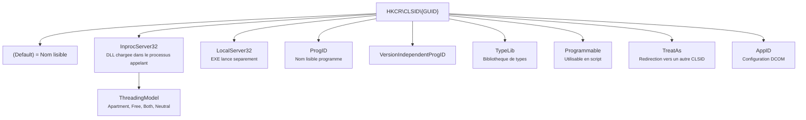
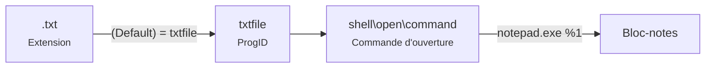
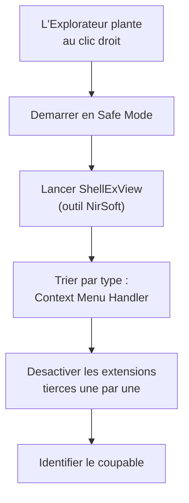

---
tags:
  - registre
  - COM
  - DCOM
  - Shell
---

# COM, DCOM et le Shell

## Ce que vous allez apprendre

- Ce qu'est COM et pourquoi le registre en est le pilier central
- La structure de `HKCR\CLSID\{GUID}` et le role de chaque sous-cle
- Les ProgID, TypeLib et les modeles de threading
- La configuration DCOM : AppID, permissions, `dcomcnfg.exe`
- Les extensions Shell en profondeur : menus contextuels, apercu, miniatures, etc.
- Les associations de fichiers dans HKCR : `.ext`, ProgID, `OpenWithProgids`, `UserChoice`
- Les extensions d'espace de noms (dossiers virtuels)
- Comment creer des entrees de menu contextuel personnalisees
- L'enregistrement et le desenregistrement d'objets COM
- Le depannage des erreurs COM, DCOM et des extensions Shell cassees

---

## COM en 30 secondes

COM (*Component Object Model*) est le systeme qui permet a des logiciels de **partager du code** sans se connaitre.

Quand vous faites un clic droit sur un fichier `.zip` et voyez "Extraire tout...", c'est une extension Shell COM.
Quand Excel expose ses objets a un script VBA, c'est COM. Quand DCOM permet d'administrer un serveur a distance, c'est COM sur le reseau.

**Et tout repose sur le registre.**

!!! tip "Analogie"
    COM est comme les **Pages Jaunes** : un logiciel cherche un service par son identifiant (GUID), le registre lui dit ou trouver le fichier DLL qui le fournit, et Windows charge cette DLL a la volee. Sans le registre, personne ne trouverait personne.

!!! info "En resume"
    - COM permet a des logiciels de partager du code via des composants identifies par des GUID dans le registre
    - Le registre sert de repertoire central : il associe chaque identifiant COM au fichier DLL ou EXE qui le fournit
    - Menus contextuels, automatisation Office et administration a distance (DCOM) reposent tous sur COM

---

## CLSID : le coeur de COM

Chaque objet COM est identifie par un **CLSID** (*Class Identifier*) — un GUID unique au monde.

```
HKEY_CLASSES_ROOT\CLSID\{GUID}
```

### Exemple concret : Windows Script Host

```powershell
Get-ItemProperty "HKLM:\SOFTWARE\Classes\CLSID\{72C24DD5-D70A-438B-8A42-98424B88AFB8}"
```

```title="Resultat attendu"
(default) : Windows Script Host Shell Object
```

```powershell
Get-ItemProperty "HKLM:\SOFTWARE\Classes\CLSID\{72C24DD5-D70A-438B-8A42-98424B88AFB8}\InprocServer32"
```

```title="Resultat attendu"
(default)       : C:\Windows\system32\wshom.ocx
ThreadingModel  : Apartment
```

!!! note "HKCR vs HKLM\\SOFTWARE\\Classes"
    `HKEY_CLASSES_ROOT` (HKCR) est une **vue fusionnee** de `HKLM\SOFTWARE\Classes` (configuration machine) et `HKCU\SOFTWARE\Classes` (configuration utilisateur). Les cles HKCU ont priorite. En pratique, pour lire c'est equivalent ; pour ecrire, visez directement HKLM ou HKCU.

### Structure complete d'un CLSID



| Sous-cle / Valeur | Description |
|-------------------|-------------|
| `(Default)` | Nom affichable de l'objet COM |
| `InprocServer32` | Chemin vers la **DLL** (chargee dans le processus appelant) |
| `LocalServer32` | Chemin vers l'**EXE** (lance comme processus separe) |
| `InprocHandler32` | DLL handler (cas intermediaire) |
| `ProgID` | Identifiant texte avec version (`Word.Document.8`) |
| `VersionIndependentProgID` | Identifiant texte sans version (`Word.Document`) |
| `TypeLib` | GUID de la bibliotheque de types |
| `Programmable` | Cle vide — indique que l'objet est scriptable |
| `TreatAs` | Redirige l'activation vers un autre CLSID |
| `AppID` | Lie a la configuration DCOM |

!!! info "En resume"
    - Chaque objet COM est identifie par un CLSID (GUID unique) enregistre sous `HKCR\CLSID\{GUID}`
    - Les sous-cles principales sont `InprocServer32` (DLL), `LocalServer32` (EXE), `ProgID` et `TypeLib`
    - `HKCR` est une vue fusionnee de `HKLM\SOFTWARE\Classes` et `HKCU\SOFTWARE\Classes` (HKCU prioritaire)

---

## InprocServer32 vs LocalServer32

| Propriete | InprocServer32 | LocalServer32 |
|-----------|---------------|---------------|
| Type de fichier | DLL (`.dll`, `.ocx`) | EXE (`.exe`) |
| Espace d'execution | **Dans** le processus appelant | **Processus separe** |
| Performance | Rapide (pas de marshalling) | Plus lent (communication inter-processus) |
| Isolation | Aucune (crash = crash de l'appelant) | Bonne (crash isole) |
| Exemple | Extensions Shell | Excel Automation |

```powershell
# InprocServer32 example: Shell extension DLL
Get-ItemProperty "HKLM:\SOFTWARE\Classes\CLSID\{1894C7AB-E9B2-4FF2-8B6E-42EBD680F7E4}\InprocServer32" -ErrorAction SilentlyContinue |
    Select-Object "(default)", ThreadingModel
```

```title="Resultat attendu"
(default)                                        ThreadingModel
---------                                        --------------
C:\Windows\System32\explorerframe.dll            Apartment
```

!!! info "En resume"
    - `InprocServer32` charge une DLL dans le processus appelant (rapide, pas d'isolation)
    - `LocalServer32` lance un EXE separe (plus lent, mais isole en cas de crash)
    - Le choix entre les deux determine le compromis performance / stabilite

---

## ProgID et VersionIndependentProgID

Un **ProgID** est un alias textuel lisible pour un CLSID.

| ProgID | CLSID |
|--------|-------|
| `Excel.Application` | `{00024500-0000-0000-C000-000000000046}` |
| `Word.Document` | `{000209FF-0000-0000-C000-000000000046}` |
| `Scripting.FileSystemObject` | `{0D43FE01-F093-11CF-8940-00A0C9054228}` |
| `WScript.Shell` | `{72C24DD5-D70A-438B-8A42-98424B88AFB8}` |

La resolution fonctionne dans les deux sens :


```powershell
# Resolve ProgID to CLSID
(Get-ItemProperty "HKLM:\SOFTWARE\Classes\WScript.Shell\CLSID").'(default)'
```

```title="Resultat attendu"
{72C24DD5-D70A-438B-8A42-98424B88AFB8}
```

```powershell
# Resolve CLSID to ProgID
(Get-ItemProperty "HKLM:\SOFTWARE\Classes\CLSID\{72C24DD5-D70A-438B-8A42-98424B88AFB8}\ProgID").'(default)'
```

```title="Resultat attendu"
WScript.Shell.1
```

### Versions de ProgID

| Cle | Exemple | Usage |
|-----|---------|-------|
| `ProgID` | `WScript.Shell.1` | Version specifique |
| `VersionIndependentProgID` | `WScript.Shell` | Toujours la derniere version |

Le `VersionIndependentProgID` a son propre CLSID sous HKCR, et une sous-cle `CurVer` pointe vers le ProgID versionne actuel.

!!! info "En resume"
    - Un ProgID est un alias textuel lisible (ex : `Excel.Application`) qui pointe vers un CLSID
    - La resolution fonctionne dans les deux sens : ProgID vers CLSID et CLSID vers ProgID
    - Le `VersionIndependentProgID` pointe toujours vers la derniere version via la sous-cle `CurVer`

---

## Modeles de threading (ThreadingModel)

COM supporte plusieurs modeles de threading pour gerer la concurrence.

| Valeur | Modele | Description |
|--------|--------|-------------|
| `Apartment` | STA (Single-Threaded Apartment) | L'objet ne peut etre appele que depuis **un seul thread** |
| `Free` | MTA (Multi-Threaded Apartment) | L'objet peut etre appele depuis **n'importe quel thread** |
| `Both` | STA ou MTA | S'adapte au contexte de l'appelant |
| `Neutral` | NTA (Neutral Apartment) | Pas de marshalling, le thread appelant execute directement |
| *(absent)* | STA (main thread only) | Seul le thread principal peut acceder a l'objet |

!!! tip "Analogie"
    - **Apartment** = un bureau individuel avec une seule porte. Tout le monde fait la queue.
    - **Free** = un open space. Tout le monde entre quand il veut (mais gare aux collisions).
    - **Both** = flexible — s'installe dans le bureau ou l'open space selon le besoin.
    - **Neutral** = un comptoir d'accueil — le visiteur est servi la ou il se trouve.

```powershell
# Check threading model of a COM object
(Get-ItemProperty "HKLM:\SOFTWARE\Classes\CLSID\{0D43FE01-F093-11CF-8940-00A0C9054228}\InprocServer32").ThreadingModel
```

```title="Resultat attendu"
Both
```

!!! info "En resume"
    - `ThreadingModel` determine comment COM gere la concurrence : `Apartment` (mono-thread), `Free` (multi-thread), `Both` ou `Neutral`
    - Si `ThreadingModel` est absent, l'objet n'est accessible que depuis le thread principal
    - Un mauvais modele de threading provoque des blocages ou des plantages dans les applications multi-thread

---

## TypeLib (bibliotheques de types)

Une **TypeLib** decrit les interfaces, methodes et proprietes d'un objet COM.
C'est le "mode d'emploi" que les outils de developpement utilisent pour l'autocompletion.

```
HKCR\TypeLib\{GUID}\{version}
```

```powershell
# Locate the TypeLib for Scripting runtime
Get-ChildItem "HKLM:\SOFTWARE\Classes\TypeLib\{420B2830-E718-11CF-893D-00A0C9054228}" |
    Get-ChildItem | ForEach-Object {
        [PSCustomObject]@{
            Version = $_.PSParentPath -replace '.*\\'
            Platform = $_.PSChildName
            Path = (Get-ItemProperty $_.PSPath).'(default)'
        }
    }
```

```title="Resultat attendu"
Version Platform Path
------- -------- ----
1.0     win32    C:\Windows\SysWOW64\scrrun.dll
1.0     win64    C:\Windows\System32\scrrun.dll
```

!!! info "En resume"
    - Une TypeLib decrit les interfaces, methodes et proprietes d'un objet COM
    - Elle est enregistree sous `HKCR\TypeLib\{GUID}\{version}` avec des chemins distincts pour win32 et win64
    - Les outils de developpement utilisent les TypeLib pour l'autocompletion et la validation de types

---

## COM Categories

Les categories COM regroupent des objets par fonctionnalite.
Elles sont sous :

```
HKCR\Component Categories\{GUID}
```

| GUID de categorie | Description |
|-------------------|-------------|
| `{40FC6ED4-2438-11CF-A3DB-080036F12502}` | Controles qui supportent l'edition visuelle |
| `{40FC6ED5-2438-11CF-A3DB-080036F12502}` | Controles avec donnees persistantes |
| `{7DD95801-9882-11CF-9FA9-00AA006C42C4}` | Controles securises pour le scripting |

Un objet COM declare ses categories via :

```
HKCR\CLSID\{GUID}\Implemented Categories\{catGUID}
```

!!! info "En resume"
    - Les categories COM regroupent les objets par fonctionnalite sous `HKCR\Component Categories\{GUID}`
    - Un objet declare ses categories via la sous-cle `Implemented Categories`
    - Elles servent a filtrer les controles par capacite (edition visuelle, securite scripting, etc.)

---

## DCOM : COM sur le reseau

DCOM (*Distributed COM*) permet d'activer des objets COM sur une **machine distante**.

### Configuration AppID

Chaque application DCOM est identifiee par un **AppID** :

```
HKCR\AppID\{GUID}
```

| Valeur | Type | Description |
|--------|------|-------------|
| `(Default)` | `REG_SZ` | Nom de l'application |
| `RunAs` | `REG_SZ` | Compte d'execution (`Interactive User`, un compte specifique) |
| `LaunchPermission` | `REG_BINARY` | ACL binaire — qui peut **lancer** l'objet |
| `AccessPermission` | `REG_BINARY` | ACL binaire — qui peut **acceder** a l'objet |
| `AuthenticationLevel` | `REG_DWORD` | Niveau d'authentification requis |
| `DllSurrogate` | `REG_SZ` | Chemin vers un processus hote pour les DLL |
| `RemoteServerName` | `REG_SZ` | Nom du serveur distant (pour les clients) |

```powershell
# List AppIDs with their names
Get-ChildItem "HKLM:\SOFTWARE\Classes\AppID" |
    Where-Object { $_.PSChildName -match '^\{' } |
    ForEach-Object {
        $props = Get-ItemProperty $_.PSPath
        if ($props.'(default)') {
            [PSCustomObject]@{
                AppID = $_.PSChildName
                Name = $props.'(default)'
                RunAs = $props.RunAs
            }
        }
    } | Select-Object -First 10 | Format-Table -AutoSize
```

```title="Resultat attendu"
AppID                                  Name                              RunAs
-----                                  ----                              -----
{000C101C-0000-0000-C000-000000000046} Microsoft Office                  Interactive User
{00020906-0000-0000-C000-000000000046} Microsoft Word Document
{4839DDB7-58C2-48F5-8283-E1D1807D0D7D} DfsShellExtension
```

### `dcomcnfg.exe` : l'interface graphique DCOM

`dcomcnfg.exe` (Component Services) est l'interface graphique pour configurer DCOM.

Tout ce qu'il modifie se trouve dans le registre :

| Onglet dcomcnfg | Cle de registre |
|-----------------|----------------|
| Proprietes par defaut | `HKLM\SOFTWARE\Microsoft\Ole` |
| Securite par defaut | `HKLM\SOFTWARE\Microsoft\Ole\DefaultLaunchPermission` |
| Protocoles | `HKLM\SOFTWARE\Microsoft\Rpc` |
| Application specifique | `HKCR\AppID\{GUID}` |

```powershell
# Check default DCOM settings
Get-ItemProperty "HKLM:\SOFTWARE\Microsoft\Ole" |
    Select-Object EnableDCOM, LegacyAuthenticationLevel, LegacyImpersonationLevel
```

```title="Resultat attendu"
EnableDCOM                  : Y
LegacyAuthenticationLevel   : 2
LegacyImpersonationLevel    : 3
```

| Valeur | Signification |
|--------|---------------|
| `EnableDCOM = Y` | DCOM est active |
| `AuthenticationLevel = 2` | Connect (authentification a la connexion) |
| `ImpersonationLevel = 3` | Impersonate (le serveur peut agir au nom du client) |

!!! warning "Securite DCOM"
    DCOM est une surface d'attaque connue. Les permissions par defaut sont souvent trop permissives. Verifiez les `LaunchPermission` et `AccessPermission` de chaque AppID expose au reseau.

!!! info "En resume"
    - DCOM etend COM au reseau via les AppID sous `HKCR\AppID\{GUID}`
    - Chaque AppID definit le compte d'execution (`RunAs`), les permissions de lancement et d'acces
    - `dcomcnfg.exe` est l'interface graphique ; toute modification se retrouve dans le registre sous `HKLM\SOFTWARE\Microsoft\Ole`

---

## Extensions Shell : le registre controle votre clic droit

Les extensions Shell sont des objets COM qui s'integrent dans l'Explorateur Windows.
Elles sont enregistrees sous les CLSID des types de fichiers.

### Types d'extensions Shell

| Extension | Sous-cle registre | Description |
|-----------|------------------|-------------|
| Context Menu Handler | `shellex\ContextMenuHandlers` | Entrees du menu contextuel |
| Property Sheet Handler | `shellex\PropertySheetHandlers` | Onglets dans les proprietes |
| Icon Overlay Handler | `HKLM\SOFTWARE\Microsoft\Windows\CurrentVersion\Explorer\ShellIconOverlayIdentifiers` | Icones superposees (ex : OneDrive, Git) |
| Drag-and-Drop Handler | `shellex\DragDropHandlers` | Actions de glisser-deposer |
| Copy Hook Handler | `HKCR\Directory\shellex\CopyHookHandlers` | Interception de copie/deplacement de dossiers |
| Preview Handler | `shellex\{8895b1c6-b41f-4c1c-a562-0d564250836f}` | Volet d'apercu |
| Thumbnail Handler | `shellex\{e357fccd-a995-4576-b01f-234630154e96}` | Miniatures dans l'Explorateur |
| Infotip Handler | `shellex\{00021500-0000-0000-C000-000000000046}` | Info-bulle au survol |

### Context Menu Handlers

Les gestionnaires de menu contextuel ajoutent des entrees au clic droit.

```
HKCR\{type}\shellex\ContextMenuHandlers\{nom}
    (Default) = {CLSID du handler}
```

```powershell
# List context menu handlers for all files
Get-ChildItem "HKLM:\SOFTWARE\Classes\*\shellex\ContextMenuHandlers" -ErrorAction SilentlyContinue |
    ForEach-Object {
        [PSCustomObject]@{
            Handler = $_.PSChildName
            CLSID = (Get-ItemProperty $_.PSPath).'(default)'
        }
    } | Select-Object -First 10 | Format-Table -AutoSize
```

```title="Resultat attendu"
Handler                    CLSID
-------                    -----
7-Zip                      {23170F69-40C1-278A-1000-000100020000}
ModernSharing              {E2BF9676-5F8F-435C-97EB-11607A5BEDF7}
OpenWithEncryptionMenu     {A470F8CF-A1E8-4f65-8335-227475AA5C46}
```

### Icon Overlay Handlers

Les icones superposees (la coche verte de OneDrive, le cadenas de Git) sont des extensions Shell.

```powershell
Get-ChildItem "HKLM:\SOFTWARE\Microsoft\Windows\CurrentVersion\Explorer\ShellIconOverlayIdentifiers" |
    ForEach-Object {
        [PSCustomObject]@{
            Name = $_.PSChildName.Trim()
            CLSID = (Get-ItemProperty $_.PSPath).'(default)'
        }
    } | Format-Table -AutoSize
```

```title="Resultat attendu"
Name                           CLSID
----                           -----
 OneDrive1                     {BBACC218-34EA-4666-9D7A-C78F2274A524}
 OneDrive2                     {5AB7172C-9C11-405C-8DD5-AF20F3606282}
 OneDrive3                     {A78ED123-AB77-406B-9962-2A5D9D2F7F30}
  Tortoise1Normal              {C5994560-53D9-4125-87C9-F193FC689CB2}
  Tortoise2Modified            {C5994561-53D9-4125-87C9-F193FC689CB2}
```

!!! note "Limite de 15 overlays"
    Windows ne prend en charge que **15 icones overlay** maximum. Les entrees sont triees par ordre alphabetique, d'ou les espaces au debut des noms (pour apparaitre en premier). Si vous avez plus de 15 overlays, les derniers sont ignores.

### Preview Handlers (volet d'apercu)

```powershell
# Find which handler provides preview for .pdf files
$progId = (Get-ItemProperty "HKLM:\SOFTWARE\Classes\.pdf" -ErrorAction SilentlyContinue).'(default)'
if ($progId) {
    $previewGuid = "{8895b1c6-b41f-4c1c-a562-0d564250836f}"
    Get-ItemProperty "HKLM:\SOFTWARE\Classes\$progId\shellex\$previewGuid" -ErrorAction SilentlyContinue |
        Select-Object '(default)'
}
```

```title="Resultat attendu"
(default)
---------
{DC6EFB56-9CFA-464D-8880-44885D7DC193}
```

### Thumbnail Handlers (miniatures)

```powershell
# Find thumbnail handler for .jpg
$thumbGuid = "{e357fccd-a995-4576-b01f-234630154e96}"
Get-ItemProperty "HKLM:\SOFTWARE\Classes\.jpg\shellex\$thumbGuid" -ErrorAction SilentlyContinue |
    Select-Object '(default)'
```

```title="Resultat attendu"
(default)
---------
{C7657C4A-9F68-40FA-A4DF-96BC08EB3551}
```

!!! info "En resume"
    - Les extensions Shell sont des objets COM integres a l'Explorateur via des sous-cles `shellex`
    - Les types principaux : menus contextuels, icones overlay, apercu, miniatures, glisser-deposer
    - Windows limite a 15 icones overlay ; l'ordre alphabetique determine la priorite

---

## Associations de fichiers dans HKCR

### Architecture en deux niveaux

Le systeme d'association de fichiers utilise **deux niveaux d'indirection** :



### Niveau 1 : l'extension

```powershell
Get-ItemProperty "HKLM:\SOFTWARE\Classes\.txt"
```

```title="Resultat attendu"
(default)        : txtfile
Content Type     : text/plain
PerceivedType    : text
```

| Valeur | Description |
|--------|-------------|
| `(Default)` | ProgID associe |
| `Content Type` | Type MIME |
| `PerceivedType` | Type percu : `text`, `image`, `audio`, `video`, `compressed`, `document`, `system` |
| `OpenWithProgids` | Sous-cle listant les ProgID alternatifs |

### Niveau 2 : le ProgID

```powershell
Get-ItemProperty "HKLM:\SOFTWARE\Classes\txtfile"
Get-ItemProperty "HKLM:\SOFTWARE\Classes\txtfile\shell\open\command"
```

```title="Resultat attendu"
# txtfile
(default)     : Text Document
FriendlyTypeName : @%SystemRoot%\system32\notepad.exe,-469

# txtfile\shell\open\command
(default)     : %SystemRoot%\system32\notepad.exe %1
```

### `OpenWithProgids` : alternatives d'ouverture

```powershell
Get-Item "HKLM:\SOFTWARE\Classes\.txt\OpenWithProgids" | Select-Object -ExpandProperty Property
```

```title="Resultat attendu"
txtfile
txtfilelegacy
```

### `UserChoice` : le choix de l'utilisateur

L'utilisateur peut surcharger l'association par defaut. Ce choix est stocke dans HKCU :

```powershell
Get-ItemProperty "HKCU:\SOFTWARE\Microsoft\Windows\CurrentVersion\Explorer\FileExts\.txt\UserChoice"
```

```title="Resultat attendu"
Hash    : xxxxxxxxx
ProgId  : Applications\notepad++.exe
```

!!! warning "UserChoice est protege par un hash"
    La valeur `Hash` est calculee par Windows pour empecher les applications de modifier les associations en douce. Si vous modifiez `ProgId` sans mettre a jour le `Hash`, Windows **ignorera** votre modification. Utilisez plutot les API officielles ou les Parametres Windows.

### `OpenWithList` : applications recemment utilisees

```
HKCU\SOFTWARE\Microsoft\Windows\CurrentVersion\Explorer\FileExts\.txt\OpenWithList
```

Contient les applications que l'utilisateur a utilisees pour ouvrir ce type de fichier, dans l'ordre de `MRUList`.

!!! info "En resume"
    - L'association de fichiers suit deux niveaux : l'extension (`.txt`) pointe vers un ProgID (`txtfile`), qui definit la commande d'ouverture
    - `UserChoice` dans HKCU permet a l'utilisateur de surcharger l'association par defaut, protegee par un hash
    - `OpenWithProgids` et `OpenWithList` gerent les alternatives et l'historique des applications utilisees

---

## Extensions d'espace de noms (dossiers virtuels)

Les dossiers speciaux comme "Ce PC", "Corbeille" ou "Reseau" sont des **extensions d'espace de noms Shell** enregistrees comme des CLSID.

| Dossier virtuel | CLSID |
|----------------|-------|
| Ce PC (My Computer) | `{20D04FE0-3AEA-1069-A2D8-08002B30309D}` |
| Corbeille (Recycle Bin) | `{645FF040-5081-101B-9F08-00AA002F954E}` |
| Panneau de configuration | `{21EC2020-3AEA-1069-A2DD-08002B30309D}` |
| Reseau | `{F02C1A0D-BE21-4350-88B0-7367FC96EF3C}` |
| Bureau | `{00021400-0000-0000-C000-000000000046}` |

```powershell
# Open "This PC" using its CLSID
explorer shell:::{20D04FE0-3AEA-1069-A2D8-08002B30309D}
```

```title="Resultat attendu"
La fenetre "Ce PC" s'ouvre dans l'Explorateur Windows.
Aucune sortie dans la console.
```

### Masquer un dossier virtuel du Bureau

```powershell
# Hide "This PC" from desktop
$path = "HKCU:\SOFTWARE\Microsoft\Windows\CurrentVersion\Explorer\HideDesktopIcons\NewStartPanel"
New-ItemProperty -Path $path -Name "{20D04FE0-3AEA-1069-A2D8-08002B30309D}" -Value 1 -PropertyType DWord -Force
```

```title="Resultat attendu"
{20D04FE0-3AEA-1069-A2D8-08002B30309D} : 1
PSPath                                   : ...HideDesktopIcons\NewStartPanel
```

!!! info "En resume"
    - Les dossiers virtuels (Ce PC, Corbeille, Reseau) sont des extensions d'espace de noms identifiees par un CLSID
    - On peut les ouvrir directement via `explorer shell:::{CLSID}`
    - On peut masquer un dossier virtuel du Bureau via une valeur DWORD dans `HideDesktopIcons\NewStartPanel`

---

## Creer des entrees de menu contextuel personnalisees

### Methode 1 : menu contextuel simple (sans DLL)

Ajouter "Ouvrir avec Notepad++" au clic droit sur tous les fichiers :

```cmd
:: Create the verb under * (all files)
reg add "HKCR\*\shell\OpenWithNpp" /ve /d "Edit with Notepad++" /f
reg add "HKCR\*\shell\OpenWithNpp" /v "Icon" /d "C:\Program Files\Notepad++\notepad++.exe,0" /f
reg add "HKCR\*\shell\OpenWithNpp\command" /ve /d "\"C:\Program Files\Notepad++\notepad++.exe\" \"%%1\"" /f
```

```title="Resultat attendu"
The operation completed successfully.
The operation completed successfully.
The operation completed successfully.
```

Structure creee dans le registre :

```
HKCR\*\shell\OpenWithNpp
    (Default) = "Edit with Notepad++"
    Icon = "C:\Program Files\Notepad++\notepad++.exe,0"
    \command
        (Default) = "C:\Program Files\Notepad++\notepad++.exe" "%1"
```

### Methode 2 : menu contextuel pour les dossiers

```cmd
reg add "HKCR\Directory\shell\OpenTerminal" /ve /d "Open Terminal Here" /f
reg add "HKCR\Directory\shell\OpenTerminal" /v "Icon" /d "wt.exe,0" /f
reg add "HKCR\Directory\shell\OpenTerminal\command" /ve /d "wt.exe -d \"%%V\"" /f
```

```title="Resultat attendu"
The operation completed successfully.
The operation completed successfully.
The operation completed successfully.
```

### Methode 3 : menu contextuel avec sous-menu (cascading)

```cmd
:: Create a cascading menu group
reg add "HKCR\Directory\Background\shell\MyTools" /ve /d "My Tools" /f
reg add "HKCR\Directory\Background\shell\MyTools" /v "MUIVerb" /d "My Tools" /f
reg add "HKCR\Directory\Background\shell\MyTools" /v "SubCommands" /d "MyTools.cmd;MyTools.ps1" /f
reg add "HKCR\Directory\Background\shell\MyTools" /v "Icon" /d "shell32.dll,294" /f

:: Define sub-commands
reg add "HKLM\SOFTWARE\Microsoft\Windows\CurrentVersion\Explorer\CommandStore\shell\MyTools.cmd" /ve /d "Open CMD" /f
reg add "HKLM\SOFTWARE\Microsoft\Windows\CurrentVersion\Explorer\CommandStore\shell\MyTools.cmd\command" /ve /d "cmd.exe /k cd /d \"%%V\"" /f

reg add "HKLM\SOFTWARE\Microsoft\Windows\CurrentVersion\Explorer\CommandStore\shell\MyTools.ps1" /ve /d "Open PowerShell" /f
reg add "HKLM\SOFTWARE\Microsoft\Windows\CurrentVersion\Explorer\CommandStore\shell\MyTools.ps1\command" /ve /d "powershell.exe -NoExit -Command \"Set-Location '%%V'\"" /f
```

```title="Resultat attendu"
The operation completed successfully.
The operation completed successfully.
The operation completed successfully.
The operation completed successfully.
The operation completed successfully.
The operation completed successfully.
The operation completed successfully.
The operation completed successfully.
```

### Valeurs speciales pour les entrees de menu

| Valeur | Type | Description |
|--------|------|-------------|
| `(Default)` | `REG_SZ` | Texte affiche dans le menu |
| `MUIVerb` | `REG_SZ` | Texte affiche (prioritaire sur Default) |
| `Icon` | `REG_SZ` | Icone (`fichier.exe,index` ou `fichier.ico`) |
| `Position` | `REG_SZ` | `Top`, `Bottom` (position dans le menu) |
| `Extended` | *(presence suffit)* | N'apparait qu'avec ++shift++"clic droit"++ |
| `NeverDefault` | *(presence suffit)* | N'est jamais l'action par defaut (double-clic) |
| `HasLUAShield` | `REG_SZ` | Affiche le bouclier UAC |
| `SubCommands` | `REG_SZ` | Liste des sous-commandes (menu en cascade) |
| `AppliesTo` | `REG_SZ` | Filtre (ex : `System.FileExtension:=.log`) |

!!! tip "Le drapeau Extended"
    Ajoutez une valeur vide nommee `Extended` pour que l'entree n'apparaisse qu'avec ++shift++"clic droit"++. Utile pour les outils avances que vous ne voulez pas encombrer le menu standard.

!!! info "En resume"
    - Un menu contextuel simple se cree sous `HKCR\*\shell\{verbe}\command` pour les fichiers, ou `HKCR\Directory\shell\` pour les dossiers
    - Les menus en cascade utilisent `SubCommands` et le `CommandStore` de l'Explorateur
    - Les valeurs `Position`, `Extended`, `Icon` et `AppliesTo` permettent de controler l'apparence et la visibilite

---

## Enregistrement et desenregistrement d'objets COM

### `regsvr32.exe` : pour les DLL COM

```cmd
:: Register a COM DLL
regsvr32 C:\path\to\mycomponent.dll

:: Unregister
regsvr32 /u C:\path\to\mycomponent.dll

:: Silent mode (no dialog)
regsvr32 /s C:\path\to\mycomponent.dll
```

```title="Resultat attendu"
Une boite de dialogue confirme "DllRegisterServer in ... succeeded."
En mode /s, aucune sortie si la commande reussit.
```

!!! note "Ce que fait `regsvr32`"
    Il charge la DLL en memoire et appelle sa fonction `DllRegisterServer()`. Cette fonction ecrit les cles CLSID, ProgID, TypeLib, etc. dans le registre. `DllUnregisterServer()` les supprime.

### Enregistrement manuel (sans regsvr32)

Parfois necessaire pour le depannage ou sur des systemes verrouilles.

```cmd
:: Manually register a COM object
reg add "HKCR\CLSID\{00000000-1111-2222-3333-444444444444}" /ve /d "My COM Object" /f
reg add "HKCR\CLSID\{00000000-1111-2222-3333-444444444444}\InprocServer32" /ve /d "C:\path\to\mycom.dll" /f
reg add "HKCR\CLSID\{00000000-1111-2222-3333-444444444444}\InprocServer32" /v "ThreadingModel" /d "Both" /f
reg add "HKCR\CLSID\{00000000-1111-2222-3333-444444444444}\ProgID" /ve /d "MyApp.MyObject.1" /f

:: Register the ProgID
reg add "HKCR\MyApp.MyObject.1" /ve /d "My COM Object" /f
reg add "HKCR\MyApp.MyObject.1\CLSID" /ve /d "{00000000-1111-2222-3333-444444444444}" /f
```

```title="Resultat attendu"
The operation completed successfully.
The operation completed successfully.
The operation completed successfully.
The operation completed successfully.
The operation completed successfully.
The operation completed successfully.
```

### Enregistrement per-utilisateur (sans privileges admin)

```cmd
:: Register under HKCU instead of HKLM
reg add "HKCU\SOFTWARE\Classes\CLSID\{00000000-1111-2222-3333-444444444444}" /ve /d "My COM Object" /f
reg add "HKCU\SOFTWARE\Classes\CLSID\{00000000-1111-2222-3333-444444444444}\InprocServer32" /ve /d "C:\Users\User\mycom.dll" /f
reg add "HKCU\SOFTWARE\Classes\CLSID\{00000000-1111-2222-3333-444444444444}\InprocServer32" /v "ThreadingModel" /d "Both" /f
```

```title="Resultat attendu"
The operation completed successfully.
The operation completed successfully.
The operation completed successfully.
```

!!! info "En resume"
    - `regsvr32` enregistre une DLL COM en appelant sa fonction `DllRegisterServer()` qui ecrit les cles CLSID et ProgID
    - L'enregistrement manuel est possible en creant directement les cles `CLSID`, `InprocServer32` et `ProgID`
    - L'enregistrement sous `HKCU\SOFTWARE\Classes` ne necessite pas de privileges administrateur

---

## Depannage COM et Shell

### Erreur DCOM 10016 dans le journal d'evenements

C'est l'erreur DCOM la plus courante : "The application-specific permission settings do not grant Local Activation permission."

```powershell
# Find recent DCOM error events
Get-WinEvent -FilterHashtable @{LogName="System"; Id=10016} -MaxEvents 5 |
    Select-Object TimeCreated, Message | Format-List
```

```title="Resultat attendu"
TimeCreated : 2026-04-02 09:15:33
Message     : The application-specific permission settings do not grant Local
              Activation permission for the COM Server application with CLSID
              {2593F8B9-4EAF-457C-B68A-50F6B8EA6B54} and APPID
              {15C20B67-12E7-4BB6-92BB-7AFF07997402} to the user
              PC\User SID (S-1-5-21-...) from address LocalHost (Using LRPC)
              running in the application container Unavailable SID (Unavailable).
```

**Solution** : ouvrir `dcomcnfg.exe` > Component Services > Computers > My Computer > DCOM Config, trouver l'application concernee, et modifier les permissions de lancement.

### Extensions Shell cassees : l'Explorateur plante



**Methode manuelle sans outil tiers** :

```powershell
# List all third-party context menu handlers
Get-ChildItem "HKLM:\SOFTWARE\Classes\*\shellex\ContextMenuHandlers" -ErrorAction SilentlyContinue |
    ForEach-Object {
        $clsid = (Get-ItemProperty $_.PSPath -ErrorAction SilentlyContinue).'(default)'
        if ($clsid -match '^\{') {
            $dllPath = (Get-ItemProperty "HKLM:\SOFTWARE\Classes\CLSID\$clsid\InprocServer32" -ErrorAction SilentlyContinue).'(default)'
            if ($dllPath -and $dllPath -notmatch 'Windows|Microsoft') {
                [PSCustomObject]@{
                    Handler = $_.PSChildName
                    CLSID = $clsid
                    DLL = $dllPath
                }
            }
        }
    } | Format-Table -AutoSize
```

```title="Resultat attendu"
Handler              CLSID                                  DLL
-------              -----                                  ---
7-Zip                {23170F69-40C1-278A-1000-000100020000} C:\Program Files\7-Zip\7-zip.dll
Notepad++64          {B298D29A-A6ED-11DE-BA8C-A68E55D89593} C:\Program Files\Notepad++\NppShell.dll
TortoiseGit          {D0F1D173-7A4C-4B97-B602-835B9D4D6EAF} C:\Program Files\TortoiseGit\TortoiseGit.dll
```

### Erreur "Class not registered" (0x80040154)

**Cause** : le CLSID n'existe pas dans le registre ou la DLL est absente.

```powershell
# Check if a CLSID is registered
$clsid = "{XXXXXXXX-XXXX-XXXX-XXXX-XXXXXXXXXXXX}"
$exists = Test-Path "HKLM:\SOFTWARE\Classes\CLSID\$clsid"
if ($exists) {
    $dll = (Get-ItemProperty "HKLM:\SOFTWARE\Classes\CLSID\$clsid\InprocServer32" -ErrorAction SilentlyContinue).'(default)'
    $fileExists = Test-Path $dll
    Write-Host "CLSID registered: True"
    Write-Host "DLL path: $dll"
    Write-Host "DLL file exists: $fileExists"
} else {
    Write-Host "CLSID not registered"
}
```

```title="Resultat attendu"
CLSID registered: True
DLL path: C:\Windows\System32\shell32.dll
DLL file exists: True
```

### Outils de diagnostic

| Outil | Usage |
|-------|-------|
| **ShellExView** (NirSoft) | Lister et desactiver les extensions Shell |
| **OleView** (SDK Windows) | Inspecter les objets COM enregistres |
| **Process Monitor** (Sysinternals) | Tracer les acces registre COM en temps reel |
| `regsvr32 /i` | Tester l'enregistrement d'une DLL COM |
| `dcomcnfg.exe` | Configurer les permissions DCOM |

!!! info "En resume"
    COM est le ciment invisible de Windows, et le registre en est le repertoire central. Chaque objet COM (identifie par un CLSID) a sa fiche dans `HKCR\CLSID`, avec ses DLL, ses ProgID, ses modeles de threading. Les extensions Shell (menus contextuels, apercu, miniatures) sont des objets COM enregistres sous les types de fichiers. Les associations de fichiers suivent une chaine extension > ProgID > commande. DCOM etend COM au reseau via les AppID et les permissions. La maitrise de ces cles permet de personnaliser, diagnostiquer et reparer le comportement de l'Explorateur et des applications Windows.
