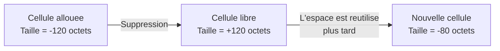
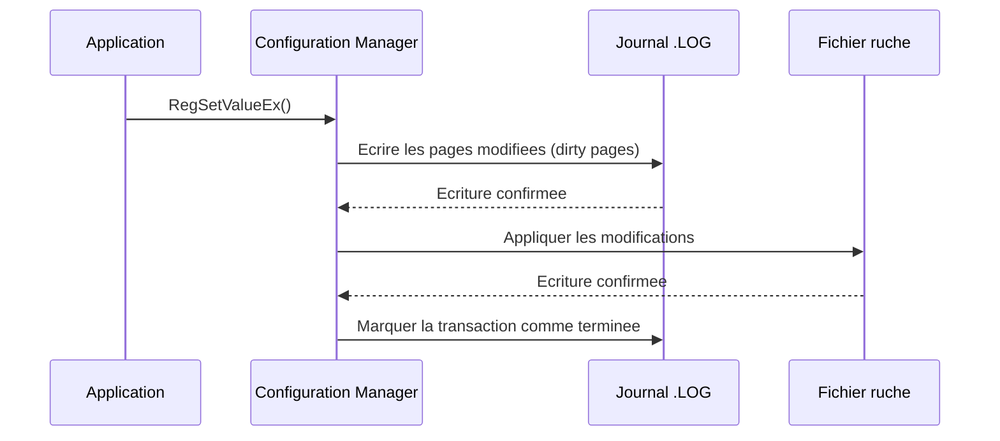
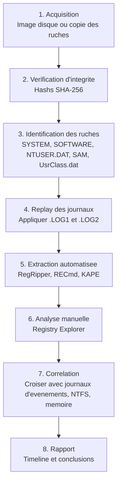
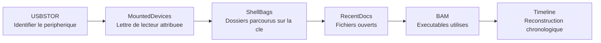

---
tags:
  - registre
  - forensique
  - analyse
---

# Analyse forensique

## Ce que vous allez apprendre

- Pourquoi le registre est une mine d'or pour les enquetes numeriques
- Les artefacts forensiques majeurs : activite utilisateur, peripheriques USB, historique reseau, execution d'applications
- Les ShellBags, UserAssist, Shimcache, AmCache et BAM/DAM
- Comment lire les horodatages du registre et leurs limites
- La recuperation de cles supprimees a partir du format binaire
- L'analyse des journaux de transactions (.LOG)
- Les outils incontournables : Registry Explorer, RegRipper, RECmd, KAPE
- Les techniques anti-forensiques et comment les detecter
- Un workflow complet d'analyse hors ligne, etape par etape

---

## Pourquoi le registre interesse les enqueteurs

Imaginez la scene d'un crime numerique. Le disque dur contient des milliers de fichiers.
Mais le registre, lui, est un **temoin silencieux** qui note presque tout ce que l'utilisateur et le systeme ont fait.

```powershell
# Display the last write timestamp of a registry key
$key = Get-Item "HKCU:\Software\Microsoft\Windows\CurrentVersion\Explorer\RecentDocs"
$key.GetValue("") | Out-Null
Write-Output "Last write time: $($key.Name) -> check with forensic tools"
```

```title="Resultat attendu"
Last write time: HKEY_CURRENT_USER\Software\Microsoft\Windows\CurrentVersion\Explorer\RecentDocs -> check with forensic tools
```

!!! tip "Analogie"
    Le registre est le **journal de bord** d'un navire. Meme si l'equipage efface les cameras, le journal note les escales, les manoeuvres et les incidents. C'est la premiere chose qu'un enqueteur consulte.

Le registre enregistre sans que l'utilisateur le sache :

| Information | Cle du registre |
|------------|-----------------|
| Documents ouverts recemment | `RecentDocs` |
| Cles USB connectees | `USBSTOR` |
| Reseaux Wi-Fi utilises | `NetworkList\Profiles` |
| Programmes executes | `UserAssist`, `BAM`, `Shimcache` |
| Chemins tapes dans l'Explorateur | `TypedPaths` |
| URLs tapees dans IE/Edge | `TypedURLs` |

!!! info "En resume"
    - Le registre est un temoin silencieux qui enregistre l'activite utilisateur, les peripheriques, les reseaux et les programmes executes
    - Ces traces persistent meme si l'utilisateur n'en est pas conscient
    - C'est la premiere source a consulter lors d'une enquete numerique

---

## Artefacts d'activite utilisateur

### RecentDocs : les documents ouverts recemment

Chaque fois qu'un utilisateur ouvre un fichier via l'Explorateur Windows, une trace est ecrite ici :

```
HKCU\Software\Microsoft\Windows\CurrentVersion\Explorer\RecentDocs
```

Les sous-cles sont organisees par extension de fichier :

```
RecentDocs
├── .pdf
├── .docx
├── .xlsx
├── .txt
└── .jpg
```

```powershell
# List all file extensions tracked in RecentDocs
Get-ChildItem "HKCU:\Software\Microsoft\Windows\CurrentVersion\Explorer\RecentDocs"
```

```title="Resultat attendu"
    Hive: HKEY_CURRENT_USER\Software\Microsoft\Windows\CurrentVersion\Explorer\RecentDocs

Name                           Property
----                           --------
.docx                          MRUListEx : {1, 0, 0, 0...}
                               0         : {82, 0, 97, 0...}
                               1         : {66, 0, 117, 0...}
.pdf                           MRUListEx : {0, 0, 0, 0...}
                               0         : {82, 0, 101, 0...}
```

!!! warning "Donnees encodees en binaire"
    Les noms de fichiers sont stockes en **binaire Unicode (UTF-16LE)** avec des structures internes. Il ne suffit pas de lire les valeurs brutes -- il faut un outil forensique pour decoder les noms de fichiers.

### TypedPaths : les chemins tapes dans la barre d'adresse

```
HKCU\Software\Microsoft\Windows\CurrentVersion\Explorer\TypedPaths
```

```powershell
# Read typed paths from Explorer address bar
Get-ItemProperty "HKCU:\Software\Microsoft\Windows\CurrentVersion\Explorer\TypedPaths"
```

```title="Resultat attendu"
url1 : C:\Users\User\Documents
url2 : \\server\share
url3 : D:\Projects
```

Chaque `url1`, `url2`, etc., represente un chemin que l'utilisateur a **tape manuellement**.
C'est un indicateur fort d'intention : l'utilisateur savait ou il allait.

### TypedURLs : les adresses tapees dans Internet Explorer / Edge Legacy

```
HKCU\Software\Microsoft\Internet Explorer\TypedURLs
```

```powershell
Get-ItemProperty "HKCU:\Software\Microsoft\Internet Explorer\TypedURLs" -ErrorAction SilentlyContinue
```

```title="Resultat attendu"
url1 : https://www.google.com
url2 : https://intranet.contoso.com
url3 : http://192.168.1.1
```

!!! note "Edge Chromium"
    Le navigateur Edge base sur Chromium ne stocke plus ses URLs dans le registre. Il utilise une base SQLite dans le profil utilisateur. Cette cle reste pertinente pour les versions legacy d'IE et d'Edge.

### RunMRU : les commandes executees via Executer (Win+R)

```
HKCU\Software\Microsoft\Windows\CurrentVersion\Explorer\RunMRU
```

```powershell
Get-ItemProperty "HKCU:\Software\Microsoft\Windows\CurrentVersion\Explorer\RunMRU"
```

```title="Resultat attendu"
a : cmd\1
b : regedit\1
c : notepad\1
d : powershell\1
MRUList : dcba
```

Le `\1` a la fin de chaque valeur est un terminateur interne.
`MRUList` indique l'ordre chronologique inverse : `d` est la commande la plus recente.

### LastVisitedMRU et OpenSaveMRU

Ces cles enregistrent les dossiers utilises dans les dialogues **Ouvrir** et **Enregistrer sous** :

```
HKCU\Software\Microsoft\Windows\CurrentVersion\Explorer\ComDlg32\LastVisitedPidlMRU
HKCU\Software\Microsoft\Windows\CurrentVersion\Explorer\ComDlg32\OpenSavePidlMRU
```

!!! info "Valeur pour l'enqueteur"
    Ces artefacts revelent quels dossiers un utilisateur a parcourus dans les dialogues standard de fichiers, meme si les fichiers eux-memes ont ete supprimes. Ils sont encodes en PIDL (*Pointer to an Item IDentifier List*), un format binaire specifique a Windows.

!!! info "En resume"
    - `RecentDocs`, `TypedPaths`, `RunMRU` et `OpenSaveMRU` tracent les actions de l'utilisateur dans l'Explorateur
    - `TypedPaths` est un indicateur d'intention : l'utilisateur savait ou il allait
    - Les donnees sont souvent encodees en binaire (UTF-16LE, PIDL) et necessitent des outils forensiques pour etre decodees

---

## Historique des peripheriques USB

### USBSTOR : la carte d'identite de chaque cle USB

Chaque peripherique USB de stockage connecte a la machine laisse une empreinte ici :

```
HKLM\SYSTEM\CurrentControlSet\Enum\USBSTOR
```

```powershell
# List all USB storage devices ever connected
Get-ChildItem "HKLM:\SYSTEM\CurrentControlSet\Enum\USBSTOR"
```

```title="Resultat attendu"
    Hive: HKEY_LOCAL_MACHINE\SYSTEM\CurrentControlSet\Enum\USBSTOR

Name
----
Disk&Ven_SanDisk&Prod_Ultra&Rev_1.00
Disk&Ven_Kingston&Prod_DataTraveler_3.0&Rev_PMAP
Disk&Ven_Seagate&Prod_Expansion&Rev_0636
```

Chaque sous-cle contient le **numero de serie unique** du peripherique :

```powershell
# Get serial numbers for a specific device
Get-ChildItem "HKLM:\SYSTEM\CurrentControlSet\Enum\USBSTOR\Disk&Ven_SanDisk&Prod_Ultra&Rev_1.00"
```

```title="Resultat attendu"
Name
----
4C530001131223117025&0
```

!!! danger "Preuve legale"
    Le numero de serie permet d'associer un **peripherique physique precis** a un **ordinateur precis**. Combine avec l'horodatage de derniere connexion, c'est une preuve solide pour etablir qu'une cle USB donnee a ete branchee sur cette machine a un moment precis.

### MountedDevices : les lettres de lecteur attribuees

```
HKLM\SYSTEM\MountedDevices
```

Cette cle associe les lettres de lecteur (`\DosDevices\E:`) aux identifiants physiques des volumes.
En croisant avec USBSTOR, on peut determiner **quelle lettre** a ete attribuee a un peripherique USB.

```powershell
# List mounted device mappings
Get-ItemProperty "HKLM:\SYSTEM\MountedDevices" |
    Select-Object -Property * -ExcludeProperty PS* |
    Format-List
```

```title="Resultat attendu"
\DosDevices\C:  : {84, 0, 0, 0...}
\DosDevices\D:  : {84, 0, 0, 0...}
\??\Volume{guid} : {95, 0, 0, 0...}
Les donnees sont en binaire et representent les identifiants physiques des volumes.
```

### EMDMgmt : estimation des performances USB

```
HKLM\SOFTWARE\Microsoft\Windows NT\CurrentVersion\EMDMgmt
```

Cette cle (liee a ReadyBoost) contient un enregistrement pour chaque peripherique USB avec :

- Le nom convivial du volume
- Le numero de serie
- L'horodatage de derniere connexion
- La taille du volume

!!! tip "Astuce forensique"
    EMDMgmt est souvent **oublie** par les attaquants qui nettoient USBSTOR mais ignorent cette cle. C'est une source de corroboration precieuse.

!!! info "En resume"
    - `USBSTOR` contient le modele et le numero de serie unique de chaque peripherique USB connecte
    - `MountedDevices` permet de retrouver la lettre de lecteur attribuee a chaque peripherique
    - `EMDMgmt` est une source de corroboration souvent ignoree par les attaquants qui nettoient USBSTOR

---

## Historique reseau

### NetworkList : les reseaux connus

```
HKLM\SOFTWARE\Microsoft\Windows NT\CurrentVersion\NetworkList\Profiles
```

Chaque sous-cle (un GUID) represente un reseau auquel la machine s'est connectee :

```powershell
# List all known network profiles
Get-ChildItem "HKLM:\SOFTWARE\Microsoft\Windows NT\CurrentVersion\NetworkList\Profiles" |
    ForEach-Object {
        $props = Get-ItemProperty $_.PSPath
        [PSCustomObject]@{
            Name        = $props.ProfileName
            Description = $props.Description
            DateCreated = $props.DateCreated
            DateLastConnected = $props.DateLastConnected
        }
    }
```

```title="Resultat attendu"
Name                Description              DateCreated          DateLastConnected
----                -----------              -----------          -----------------
MonWiFi             MonWiFi                  {7, 232, 4, ...}    {7, 232, 5, ...}
Hotel_Guest         Hotel_Guest              {7, 232, 3, ...}    {7, 232, 3, ...}
Contoso-Corp        Contoso-Corp             {7, 231, 6, ...}    {7, 232, 5, ...}
```

!!! warning "Horodatages encodes"
    `DateCreated` et `DateLastConnected` sont stockes en binaire sous forme de `SYSTEMTIME` (16 octets). Les outils forensiques les decodent automatiquement.

### NetworkList Signatures : les identifiants physiques

```
HKLM\SOFTWARE\Microsoft\Windows NT\CurrentVersion\NetworkList\Signatures
```

Contient les **adresses MAC** des passerelles et les **SSID** des reseaux sans fil.
Cela permet de **geolocalis** un ordinateur en associant un SSID a un emplacement physique connu.

!!! info "En resume"
    - `NetworkList\Profiles` enregistre chaque reseau auquel la machine s'est connectee, avec les dates de creation et derniere connexion
    - `NetworkList\Signatures` contient les adresses MAC des passerelles et les SSID, permettant la geolocalisation
    - Les horodatages sont encodes en binaire `SYSTEMTIME` et necessitent des outils forensiques pour etre decodes

---

## Traces d'execution d'applications

### UserAssist : compteur d'utilisation des programmes

```
HKCU\Software\Microsoft\Windows\CurrentVersion\Explorer\UserAssist
```

Windows compte chaque execution de programme via l'Explorateur.
Les donnees sont encodees en **ROT13** (un simple decalage de 13 lettres).

```python
# Decode a ROT13-encoded UserAssist path
import codecs
encoded = "HRZR_PHEERAG_HFRE\\Fbsgjner\\Zvpebfbsg\\Jvaqbjf\\PheeragIrefvba\\Rkcybere\\EhaZEH"
decoded = codecs.decode(encoded, 'rot_13')
print(decoded)
```

```title="Resultat attendu"
HEME_CURRENT_USER\Software\Microsoft\Windows\CurrentVersion\Explorer\RunMRU
```

!!! info "Structure des donnees UserAssist"
    Chaque valeur contient une structure binaire de 72 octets (Windows 7+) avec :

    | Offset | Taille | Champ |
    |--------|--------|-------|
    | 0x04 | 4 | Nombre d'executions |
    | 0x08 | 4 | Nombre de focus |
    | 0x0C | 4 | Temps de focus (ms) |
    | 0x3C | 8 | Derniere execution (FILETIME) |

### BAM et DAM : Background/Desktop Activity Moderator

**Disponible depuis Windows 10 1709.**

```
HKLM\SYSTEM\CurrentControlSet\Services\bam\State\UserSettings\<SID>
HKLM\SYSTEM\CurrentControlSet\Services\dam\State\UserSettings\<SID>
```

```powershell
# List BAM entries for the current user (requires admin)
$sid = (whoami /user /fo csv | ConvertFrom-Csv).SID
Get-ItemProperty "HKLM:\SYSTEM\CurrentControlSet\Services\bam\State\UserSettings\$sid" -ErrorAction SilentlyContinue |
    Select-Object -Property * -ExcludeProperty PS*, Version, SequenceNumber
```

```title="Resultat attendu"
\Device\HarddiskVolume3\Windows\System32\cmd.exe               : {216, 7, 4, 0...}
\Device\HarddiskVolume3\Program Files\Mozilla Firefox\firefox.exe : {216, 7, 4, 0...}
\Device\HarddiskVolume3\Windows\System32\WindowsPowerShell\v1.0\powershell.exe : {216, 7, 4, 0...}
```

!!! tip "Avantage du BAM"
    Contrairement a UserAssist (qui ne suit que les programmes lances via l'Explorateur), BAM enregistre **tout executables lance**, y compris depuis la ligne de commande. Les horodatages sont en format FILETIME binaire (8 octets).

### Shimcache (AppCompatCache)

Le cache de compatibilite applicative enregistre les metadonnees des executables que le systeme a **vu**, meme s'ils n'ont pas forcement ete executes.

```
HKLM\SYSTEM\CurrentControlSet\Control\Session Manager\AppCompatCache
```

La valeur `AppCompatCache` est un **blob binaire** compresse qui contient :

- Le chemin complet de l'executable
- L'horodatage de derniere modification du fichier (`$STANDARD_INFORMATION`)
- Un drapeau d'execution (avant Windows 10)

!!! warning "Subtilite critique"
    Sur **Windows 10+**, le Shimcache ne contient **plus** de drapeau d'execution. La presence dans le cache signifie que le fichier a ete **vu** par le systeme (interaction du shell, scan antivirus, etc.), pas necessairement execute.

L'outil **ShimCacheParser** d'Eric Zimmerman permet d'extraire ces donnees :

```batch
AppCompatCacheParser.exe -f C:\Windows\System32\config\SYSTEM --csv C:\output
```

```title="Resultat attendu"
ControlSet,Path,LastModifiedTimeUTC,Executed
1,C:\Windows\System32\cmd.exe,2024-01-15 10:23:45,N/A
1,C:\Program Files\7-Zip\7z.exe,2024-02-20 14:15:00,N/A
1,C:\temp\suspicious.exe,2024-03-01 08:00:12,N/A
```

### AmCache : l'historique detaille des executables

```
C:\Windows\appcompat\Programs\Amcache.hve
```

AmCache est une ruche **separee** (pas une sous-cle du registre principal) qui enregistre :

| Information | Description |
|-------------|------------|
| Chemin complet | Emplacement de l'executable |
| Hash SHA-1 | Empreinte du fichier au moment de l'execution |
| Editeur | Informations de signature numerique |
| Taille du fichier | En octets |
| Date de compilation | Timestamp PE |
| Date de premiere execution | Quand le fichier a ete vu pour la premiere fois |

!!! danger "Hash SHA-1"
    Le hash SHA-1 dans AmCache est un indicateur de compromission (*IoC*) precieux. Vous pouvez le croiser avec des bases de menaces comme VirusTotal ou MISP pour identifier un malware connu.

```batch
AmcacheParser.exe -f C:\Windows\appcompat\Programs\Amcache.hve --csv C:\output
```

```title="Resultat attendu"
AmcacheParser version X.X.X.X
Processing C:\Windows\appcompat\Programs\Amcache.hve...
Found X entries
CSV output: C:\output
```

### ShellBags : l'historique de navigation dans l'Explorateur

Les ShellBags enregistrent les **preferences d'affichage** (taille des icones, position de la fenetre, tri) pour chaque dossier visite dans l'Explorateur Windows.

```
HKCU\Software\Microsoft\Windows\Shell\BagMRU
HKCU\Software\Microsoft\Windows\Shell\Bags
HKCU\Software\Classes\Local Settings\Software\Microsoft\Windows\Shell\BagMRU
HKCU\Software\Classes\Local Settings\Software\Microsoft\Windows\Shell\Bags
```

!!! tip "Analogie"
    Les ShellBags sont comme des **marque-pages involontaires**. Chaque fois que vous ouvrez un dossier et modifiez l'affichage (ou meme simplement naviguez), Windows note que vous etes passe par la. Meme si le dossier est supprime, la trace persiste.

Pourquoi les ShellBags sont precieux pour l'enqueteur :

| Situation | Ce que revele le ShellBag |
|-----------|--------------------------|
| Dossier supprime | Le ShellBag prouve que le dossier a existe et a ete consulte |
| Cle USB retiree | Les dossiers parcourus sur la cle sont enregistres |
| Partage reseau | Les chemins UNC visites sont enregistres |
| Horodatage | Date de premiere et derniere visite du dossier |

L'outil **ShellBags Explorer** d'Eric Zimmerman offre une interface graphique pour naviguer dans ces artefacts :

```batch
SBECmd.exe -d C:\Users\suspect --csv C:\output
```

```title="Resultat attendu"
SBECmd version X.X.X.X
Processing C:\Users\suspect...
Found X ShellBag entries
CSV output: C:\output
```

!!! info "En resume"
    - `UserAssist` (encode en ROT13) trace les programmes lances via l'Explorateur avec un compteur et un horodatage
    - `BAM/DAM` enregistre **tous** les executables lances (y compris en ligne de commande), disponible depuis Windows 10 1709
    - `Shimcache` et `AmCache` fournissent les metadonnees et le hash SHA-1 des executables vus par le systeme
    - Les `ShellBags` enregistrent les dossiers visites, meme s'ils ont ete supprimes ou se trouvaient sur un support amovible

---

## Horodatages dans le registre

### Ce que le registre enregistre

Chaque **cle** du registre possede un unique horodatage : le **Last Write Time**.
C'est l'equivalent du timestamp de modification d'un fichier.

!!! danger "Piege courant"
    Le registre ne stocke **PAS** d'horodatage au niveau des **valeurs**. Seule la cle parente a un horodatage. Si une cle contient 10 valeurs, vous savez quand la cle a ete modifiee pour la derniere fois, mais pas **quelle** valeur a change.

### Lire les horodatages

```powershell
# Read the last write time of a registry key
$key = [Microsoft.Win32.RegistryKey]::OpenBaseKey(
    [Microsoft.Win32.RegistryHive]::LocalMachine,
    [Microsoft.Win32.RegistryView]::Default
).OpenSubKey("SOFTWARE\Microsoft\Windows\CurrentVersion")

# The .NET API doesn't expose LastWriteTime directly
# Use P/Invoke or forensic tools for precise timestamps
Write-Output "Use forensic tools like Registry Explorer for precise timestamps"
```

```title="Resultat attendu"
Use forensic tools like Registry Explorer for precise timestamps
```

Avec les outils forensiques, c'est plus direct :

```batch
RECmd.exe -d C:\Windows\System32\config --bn BatchExamples\BasicSystemInfo.reb --csv C:\output
```

```title="Resultat attendu"
RECmd version X.X.X.X

Processing C:\Windows\System32\config\SYSTEM...
Processing C:\Windows\System32\config\SOFTWARE...
Processed 2 hive files in X.XX seconds
CSV output: C:\output
```

### Ce que les horodatages disent -- et ne disent PAS

| Ce que l'horodatage dit | Ce qu'il ne dit PAS |
|------------------------|--------------------|
| Quand la cle a ete modifiee pour la derniere fois | Quelle valeur specifique a change |
| Qu'une ecriture a eu lieu | Qui a fait la modification |
| La date en UTC (FILETIME, 100ns depuis 1601) | Les modifications precedentes (seule la derniere compte) |

!!! info "En resume"
    Les horodatages du registre sont un **indice partiel**. Ils vous disent *quand*, mais pas *quoi* ni *qui*. Combinez-les toujours avec d'autres artefacts (journaux d'evenements, NTFS timestamps) pour une image complete.

---

## Recuperation de cles supprimees

### Comment fonctionne la "suppression" dans le registre

Quand une cle est supprimee, le registre ne l'efface pas physiquement.
Il marque simplement la cellule comme **libre** en changeant le signe de sa taille.



!!! tip "Analogie"
    C'est comme un cahier ou vous raturez une ligne au lieu de l'arracher. Tant que personne n'ecrit par-dessus, le texte rature reste lisible.

### Espace non alloue (*unallocated cells*)

Les cellules marquees comme libres mais pas encore reutilisees forment l'**espace non alloue**.
C'est la que les outils forensiques cherchent les donnees supprimees.

### Outils de recuperation

**Registry Explorer** (Eric Zimmerman) :

1. Charger la ruche hors ligne
2. Aller dans `Tools > Search > Include deleted keys`
3. Les cles supprimees apparaissent en rouge
4. Examiner les valeurs associees

**yarp** (Yet Another Registry Parser) :

```bash
# Parse a hive and extract deleted keys
python -m yarp --deleted-keys C:\evidence\SYSTEM > deleted_keys.txt
```

```title="Resultat attendu"
Les cles supprimees sont ecrites dans deleted_keys.txt avec leurs chemins et valeurs recuperees.
```

**RegRipper** avec l'option de recuperation :

```bash
rip.exe -r C:\evidence\NTUSER.DAT -p all -d
```

```title="Resultat attendu"
La sortie inclut les artefacts standards plus les donnees recuperees dans l'espace non alloue,
marquees comme "deleted" ou "recovered".
```

Le drapeau `-d` active la recherche dans les cellules non allouees.

!!! warning "Limites de la recuperation"
    La recuperation n'est pas garantie. Si l'espace libere a ete **reutilise** par une nouvelle cle, les anciennes donnees sont perdues. Plus le temps passe entre la suppression et l'acquisition, plus les chances diminuent.

!!! info "En resume"
    - La suppression d'une cle ne l'efface pas physiquement : la cellule est simplement marquee comme libre
    - Les outils comme Registry Explorer, yarp et RegRipper peuvent recuperer les cles dans l'espace non alloue
    - La recuperation n'est pas garantie : si l'espace a ete reutilise, les donnees sont perdues

---

## Analyse des journaux de transactions

### Les fichiers .LOG, .LOG1 et .LOG2

Chaque ruche est accompagnee de fichiers de journal :

| Fichier | Role |
|---------|------|
| `SYSTEM.LOG1` | Journal transactionnel primaire |
| `SYSTEM.LOG2` | Journal transactionnel secondaire |
| `SYSTEM.LOG` | Journal legacy (ancienne methode) |

```batch
dir %SystemRoot%\System32\config\SYSTEM*
```

```title="Resultat attendu"
 Volume in drive C is OS
 Directory of C:\Windows\System32\config

03/15/2024  10:23 AM      16,777,216 SYSTEM
03/15/2024  10:23 AM         262,144 SYSTEM.LOG1
03/15/2024  09:45 AM         262,144 SYSTEM.LOG2
```

### Comment fonctionnent les transactions



Si un crash survient entre l'ecriture du journal et l'application a la ruche, Windows **rejoue** le journal au demarrage suivant pour restaurer la coherence.

### Utiliser les journaux en forensique

Les journaux de transactions peuvent contenir des **modifications recentes** qui n'ont pas encore ete appliquees a la ruche principale. Ils peuvent aussi reveler l'etat **pre-modification** des donnees.

**rla.exe** (Registry Log Analyzer, Eric Zimmerman) :

```batch
rla.exe -f C:\evidence\SYSTEM.LOG1 --csv C:\output
```

```title="Resultat attendu"
rla version X.X.X.X
Processing C:\evidence\SYSTEM.LOG1...
Found X dirty pages with pending transactions
CSV output: C:\output
```

**yarp** avec replay de transactions :

```python
import yarp

# Load primary hive
primary = open("C:/evidence/SYSTEM", "rb")

# Load transaction logs
log1 = open("C:/evidence/SYSTEM.LOG1", "rb")
log2 = open("C:/evidence/SYSTEM.LOG2", "rb")

# Create a hive object and apply transaction logs
hive = yarp.Registry.RegistryHive(primary)
recovery_result = hive.recover_auto(log1, log2)

print(f"Recovery result: {recovery_result}")
# 0 = no recovery needed, 1 = recovered from log1, 2 = recovered from log2
```

```title="Resultat attendu"
Recovery result: 1
```

!!! info "Dirty hive"
    Si les numeros de sequence dans l'en-tete de la ruche ne correspondent pas (Sequence 1 ≠ Sequence 2), la ruche est **dirty** : une ecriture a ete interrompue. Appliquer les journaux est alors obligatoire pour obtenir un etat coherent.

!!! info "En resume"
    - Chaque ruche est accompagnee de fichiers `.LOG1` et `.LOG2` qui contiennent les ecritures en cours
    - En cas de crash, Windows rejoue les journaux au demarrage pour restaurer la coherence de la ruche
    - En forensique, les journaux peuvent reveler des modifications recentes non encore appliquees a la ruche principale

---

## Outils forensiques en profondeur

### Registry Explorer (Eric Zimmerman)

L'outil de reference pour l'analyse graphique des ruches.

| Fonctionnalite | Description |
|----------------|-------------|
| Chargement hors ligne | Ouvre n'importe quel fichier de ruche sans monter Windows |
| Cles supprimees | Affiche les cles recuperees en rouge |
| Signets | Plugins qui identifient automatiquement les artefacts connus |
| Replay des journaux | Integre les fichiers .LOG automatiquement |
| Recherche avancee | Par cle, valeur, donnees, horodatage |
| Export | CSV, JSON, texte |

!!! tip "Signets (Bookmarks)"
    Registry Explorer inclut des **signets** predefinis qui pointent directement vers les artefacts forensiques les plus courants. C'est comme avoir un guide qui surligne les passages importants d'un livre.

Workflow typique :

1. Lancer `RegistryExplorer.exe`
2. `File > Load hive` : charger `NTUSER.DAT`
3. Accepter le chargement des journaux de transactions
4. `Bookmarks > Common` : naviguer vers les artefacts predefinis
5. `Tools > Find` : rechercher des valeurs specifiques
6. Clic droit sur une cle > `Export subtree` pour sauvegarder

### RegRipper : automatisation par plugins

RegRipper est un outil en ligne de commande qui execute des **plugins** Perl sur des ruches.
Chaque plugin extrait un artefact specifique.

```batch
rip.exe -r C:\evidence\NTUSER.DAT -p userassist
```

```title="Resultat attendu"
Launching userassist v.20200511
UserAssist
Software\Microsoft\Windows\CurrentVersion\Explorer\UserAssist

{CEBFF5CD-ACE2-4F4F-9178-9926F41749EA}
  Tue Mar 01 08:15:23 2024 Z
    Microsoft.Windows.Explorer (Count: 45)
  Mon Feb 28 14:30:12 2024 Z
    C:\Windows\System32\cmd.exe (Count: 12)
  Mon Feb 28 10:00:05 2024 Z
    C:\Program Files\Mozilla Firefox\firefox.exe (Count: 87)
```

Plugins les plus utiles :

| Plugin | Ruche | Artefact |
|--------|-------|----------|
| `userassist` | NTUSER.DAT | Programmes executes via l'Explorateur |
| `recentdocs` | NTUSER.DAT | Documents ouverts recemment |
| `typedpaths` | NTUSER.DAT | Chemins tapes dans l'Explorateur |
| `typedurls` | NTUSER.DAT | URLs tapees dans IE |
| `shellbags` | UsrClass.dat | Dossiers visites |
| `usbstor` | SYSTEM | Peripheriques USB |
| `networklist` | SOFTWARE | Reseaux connus |
| `shimcache` | SYSTEM | Cache de compatibilite |
| `bam` | SYSTEM | Background Activity Moderator |
| `services` | SYSTEM | Services installes |

Execution en masse avec le profil `all` :

```batch
rip.exe -r C:\evidence\NTUSER.DAT -p all > C:\output\ntuser_all.txt
```

```title="Resultat attendu"
Tous les plugins disponibles sont executes sur la ruche NTUSER.DAT.
La sortie complete est redirigee vers ntuser_all.txt.
```

### RECmd : la puissance de la ligne de commande

RECmd est l'equivalent en ligne de commande de Registry Explorer, ideal pour le scripting et le traitement en masse.

```batch
RECmd.exe -d C:\evidence --bn BatchExamples\RECmd_Batch_MC.reb --csv C:\output --csvf results.csv
```

```title="Resultat attendu"
Command line: -d C:\evidence --bn BatchExamples\RECmd_Batch_MC.reb --csv C:\output --csvf results.csv
Found 5 hive files in C:\evidence
Processing SYSTEM... done (2.3 seconds)
Processing SOFTWARE... done (4.1 seconds)
Processing NTUSER.DAT... done (1.8 seconds)
Processing SAM... done (0.4 seconds)
Processing UsrClass.dat... done (1.2 seconds)

Total results: 1,247
CSV file: C:\output\results.csv
```

!!! info "Batch files (.reb)"
    Les fichiers `.reb` definissent les cles et valeurs a extraire. Vous pouvez creer vos propres fichiers batch pour cibler des artefacts specifiques a votre investigation.

### KAPE : collecte automatisee d'artefacts

**KAPE** (*Kroll Artifact Parser and Extractor*) orchestre la collecte et le traitement des artefacts.

```batch
kape.exe --tsource C:\ --tdest C:\output\collected --target RegistryHives
kape.exe --msource C:\output\collected --mdest C:\output\parsed --module RegistryASEPs,AmcacheParser,ShimCacheParser
```

```title="Resultat attendu"
KAPE version X.X.X.X
Target source: C:\
Target destination: C:\output\collected
Found X files matching RegistryHives targets
Copied X files in X.XX seconds
```

La premiere commande **collecte** les ruches, la seconde les **traite** avec les outils d'Eric Zimmerman.

| Concept KAPE | Description |
|-------------|-------------|
| **Target** | Quels fichiers collecter (ruches, journaux, AmCache...) |
| **Module** | Quels outils executer sur les fichiers collectes |
| **Compound** | Combinaison de targets et modules pour un workflow complet |

### Autopsy : modules registre

Autopsy est un framework forensique open source qui inclut des modules d'analyse du registre :

1. Creer un cas dans Autopsy
2. Ajouter une source de donnees (image disque ou dossier)
3. Activer les modules : `Recent Activity`, `Registry Analyzer`
4. Les artefacts sont extraits automatiquement et classes par categorie

!!! info "En resume"
    - Registry Explorer (Eric Zimmerman) est la reference pour l'analyse graphique, avec chargement hors ligne, signets et recuperation de cles supprimees
    - RegRipper execute des plugins specialises (userassist, shellbags, usbstor, etc.) sur les ruches
    - RECmd et KAPE permettent l'automatisation et le traitement en masse de plusieurs ruches

---

## Workflow d'analyse hors ligne

Voici le processus complet pour analyser un registre en contexte forensique :



### Etape 1 : acquisition

```batch
:: Copy registry hives from a mounted image
robocopy E:\Windows\System32\config C:\evidence SYSTEM SOFTWARE SAM SECURITY DEFAULT /B
robocopy E:\Windows\System32\config C:\evidence SYSTEM.LOG* SOFTWARE.LOG* SAM.LOG* /B
robocopy E:\Users\suspect C:\evidence NTUSER.DAT NTUSER.DAT.LOG* /B
robocopy "E:\Users\suspect\AppData\Local\Microsoft\Windows" C:\evidence UsrClass.dat UsrClass.dat.LOG* /B
```

```title="Resultat attendu"
               Total    Copied   Skipped  Mismatch    FAILED    Extras
    Files :         5         5         0         0         0         0
    Bytes :   16.0 m    16.0 m         0         0         0         0
```

### Etape 2 : verification d'integrite

```powershell
# Generate SHA-256 hashes for all collected files
Get-ChildItem C:\evidence -File | ForEach-Object {
    $hash = (Get-FileHash $_.FullName -Algorithm SHA256).Hash
    "$hash  $($_.Name)" | Out-File C:\evidence\hashes.txt -Append
}
Get-Content C:\evidence\hashes.txt
```

```title="Resultat attendu"
A1B2C3D4E5F6...  SYSTEM
F6E5D4C3B2A1...  SOFTWARE
1234ABCD5678...  NTUSER.DAT
```

### Etape 3 : extraction automatisee

```batch
:: Run RegRipper on all hives
rip.exe -r C:\evidence\SYSTEM -p all > C:\output\system_report.txt
rip.exe -r C:\evidence\SOFTWARE -p all > C:\output\software_report.txt
rip.exe -r C:\evidence\NTUSER.DAT -p all > C:\output\ntuser_report.txt
rip.exe -r C:\evidence\SAM -p all > C:\output\sam_report.txt

:: Run RECmd with batch processing
RECmd.exe -d C:\evidence --bn BatchExamples\RECmd_Batch_MC.reb --csv C:\output
```

```title="Resultat attendu"
Les rapports sont generes dans C:\output pour chaque ruche.
RECmd produit un fichier CSV avec les resultats du traitement par lot.
```

### Etape 4 : analyse ciblee

Chercher des indicateurs specifiques :

```batch
:: Search for persistence mechanisms (auto-start)
RECmd.exe -d C:\evidence --kn "Run" --csv C:\output --csvf autostart.csv
RECmd.exe -d C:\evidence --kn "Services" --csv C:\output --csvf services.csv

:: Search for specific executable paths
RECmd.exe -d C:\evidence --sd "suspicious.exe" --csv C:\output --csvf suspicious.csv
```

```title="Resultat attendu"
Les fichiers CSV autostart.csv, services.csv et suspicious.csv sont generes dans C:\output
avec les cles et valeurs correspondant aux criteres de recherche.
```

!!! info "En resume"
    - Le workflow forensique suit 8 etapes : acquisition, verification d'integrite, identification, replay des journaux, extraction, analyse manuelle, correlation et rapport
    - Ne jamais analyser l'original : toujours travailler sur une copie avec des hashs SHA-256
    - L'extraction automatisee (RegRipper, RECmd) est suivie d'une analyse ciblee pour les indicateurs specifiques

---

## Chaine de tracabilite (*Chain of Custody*)

!!! danger "Importance legale"
    En contexte judiciaire, une analyse forensique n'a de valeur que si la **chaine de tracabilite** est maintenue. Toute rupture peut rendre les preuves irrecevables.

Regles essentielles :

| Regle | Detail |
|-------|--------|
| **Copie de travail** | Ne jamais analyser l'original, toujours une copie |
| **Hashs d'integrite** | Calculer SHA-256 avant et apres chaque manipulation |
| **Documentation** | Noter chaque action, outil, commande et resultat |
| **Horodatage** | Documenter la date et l'heure de chaque etape |
| **Acces restreint** | Seul le personnel autorise manipule les preuves |
| **Stockage securise** | Les supports de preuves sont conserves en lieu sur  |

!!! info "En resume"
    - La chaine de tracabilite garantit la recevabilite legale des preuves
    - Regles cles : ne jamais toucher l'original, calculer les hashs a chaque etape, documenter chaque action
    - Toute rupture dans la chaine peut rendre les preuves irrecevables devant un tribunal

---

## Anti-forensique : manipulation et contre-mesures

### Manipulation des horodatages

Un attaquant peut modifier le Last Write Time d'une cle pour **brouiller la chronologie** :

```powershell
# Attackers can use NtSetInformationKey to modify timestamps
# This requires direct NT API calls or tools like SetRegTime
```

**Detection** : comparer les horodatages du registre avec ceux du systeme de fichiers NTFS (`$STANDARD_INFORMATION` vs `$FILE_NAME`). Les incoherences revelent une manipulation (*timestomping*).

### Donnees cachees dans le registre

Les attaquants peuvent stocker des donnees dans des endroits inhabituels :

| Technique | Description | Detection |
|-----------|-------------|-----------|
| Valeurs avec noms tres longs | Noms de valeurs de plusieurs Ko contenant des donnees | Scan des tailles de noms |
| Donnees binaires dans des cles innocentes | Shellcode stocke comme valeur REG_BINARY | Analyse d'entropie |
| Cles avec caracteres nuls | Noms contenant `\0` invisibles dans Regedit | Outils forensiques specialises |
| Valeurs en dehors du namespace visible | Exploiter des bugs du parseur | Registry Explorer les detecte |

!!! warning "Cles avec caracteres nuls"
    Certains malwares creent des cles dont le nom contient un caractere **null** (`\0`). Regedit ne peut pas les afficher ni les supprimer. Seuls les outils forensiques comme Registry Explorer ou des scripts utilisant l'API native NT peuvent les voir.

### Suppression selective de traces

Un attaquant sophistique peut :

1. Supprimer les entrees specifiques dans USBSTOR
2. Vider les ShellBags
3. Effacer les entrees UserAssist
4. Purger les RecentDocs

**Contre-mesure** : les donnees supprimees restent dans l'**espace non alloue** de la ruche.
Les outils de recuperation peuvent les retrouver (voir la section *Recuperation de cles supprimees*).

### Outils anti-forensiques connus

| Outil | Action | Contre-mesure |
|-------|--------|---------------|
| CCleaner | Supprime les MRU, historiques, ShellBags | Analyser l'espace non alloue |
| Privacy Eraser | Nettoie les traces utilisateur | Volume Shadow Copies |
| Timestomp (Metasploit) | Modifie les horodatages | Comparer NTFS et registre |
| SDelete | Ecrasement securise | Limites : ne fonctionne pas sur les ruches montees |

!!! info "En resume"
    - Les techniques anti-forensiques incluent la manipulation d'horodatages, les donnees cachees dans des valeurs binaires et les cles avec caracteres nuls
    - La suppression selective de traces (USBSTOR, ShellBags, UserAssist) peut etre contree par l'analyse de l'espace non alloue
    - La comparaison entre horodatages NTFS et registre permet de detecter le timestomping

---

## Scenarios d'investigation reels

### Scenario 1 : vol de donnees par cle USB

**Contexte** : un employe est suspecte d'avoir copie des fichiers confidentiels sur une cle USB.



Demarche :

1. **USBSTOR** : identifier le modele et le numero de serie de la cle USB
2. **MountedDevices** : retrouver la lettre de lecteur attribuee (ex : `E:`)
3. **ShellBags** : verifier si l'utilisateur a parcouru des dossiers sur `E:`
4. **RecentDocs** : voir si des fichiers specifiques ont ete ouverts depuis `E:`
5. **Horodatages** : etablir la fenetre temporelle

### Scenario 2 : execution d'un malware

**Contexte** : un poste de travail est suspecte d'avoir ete compromis par un executable malveillant.

Demarche :

1. **Shimcache** : verifier si `malware.exe` apparait dans le cache
2. **AmCache** : obtenir le hash SHA-1 de l'executable
3. **BAM** : confirmer l'execution avec horodatage
4. **UserAssist** : verifier s'il a ete lance via l'Explorateur
5. **Services / Run keys** : verifier les mecanismes de persistance
6. **VirusTotal** : rechercher le hash dans les bases de menaces

### Scenario 3 : connexion a un reseau suspect

**Contexte** : verifier si un laptop s'est connecte a un reseau Wi-Fi specifique.

1. **NetworkList\Profiles** : chercher le nom du SSID
2. **NetworkList\Signatures** : obtenir l'adresse MAC de la passerelle
3. **Horodatages** : dates de premiere et derniere connexion
4. **Geolocalisation** : croiser le SSID/MAC avec des bases comme WiGLE

!!! info "En resume"
    - Chaque scenario d'investigation (vol de donnees USB, execution de malware, connexion a un reseau suspect) suit une demarche methodique combinant plusieurs artefacts du registre
    - La reconstruction chronologique repose sur le croisement de USBSTOR, ShellBags, RecentDocs, BAM, Shimcache, AmCache et NetworkList
    - La cle du succes est de ne jamais se fier a un seul artefact : toujours croiser plusieurs sources pour etablir une preuve solide

---

!!! info "En resume"
    Le registre Windows est un **temoin exhaustif** de l'activite d'un systeme. Les artefacts comme UserAssist, ShellBags, USBSTOR, Shimcache et BAM permettent de reconstruire une chronologie detaillee des actions utilisateur. Les outils d'Eric Zimmerman (Registry Explorer, RECmd, KAPE) sont la reference du domaine. La cle du succes en forensique : **toujours croiser plusieurs sources** et maintenir une chaine de tracabilite irremprochable.
