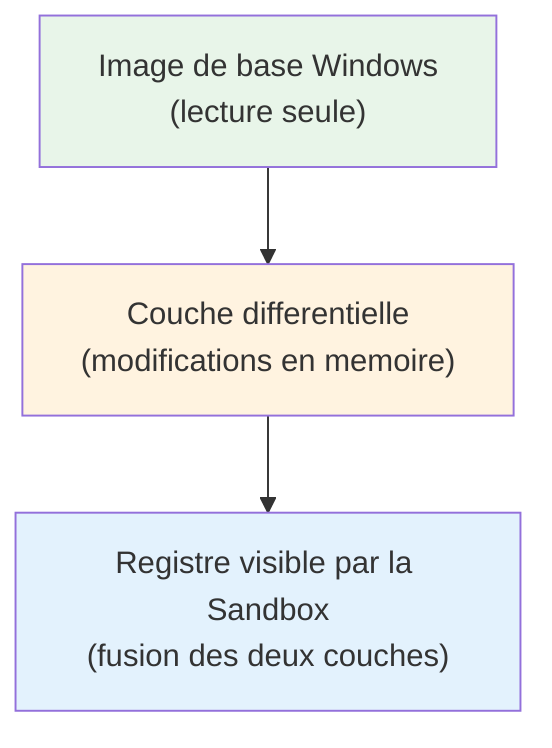
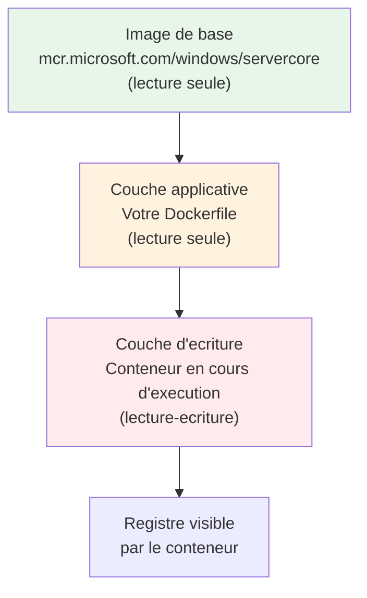
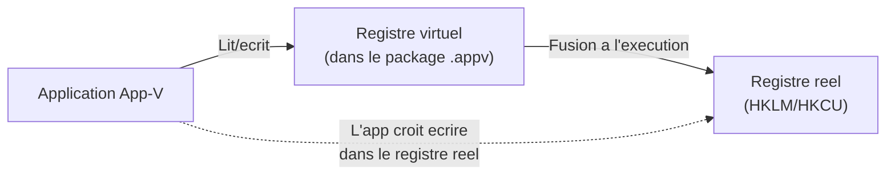
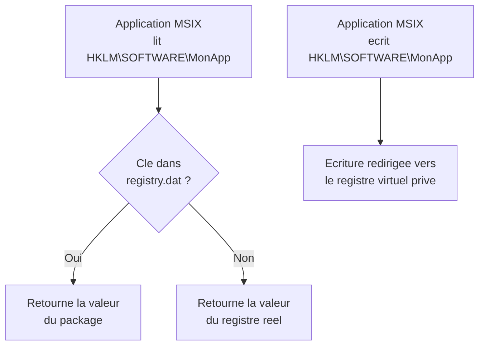
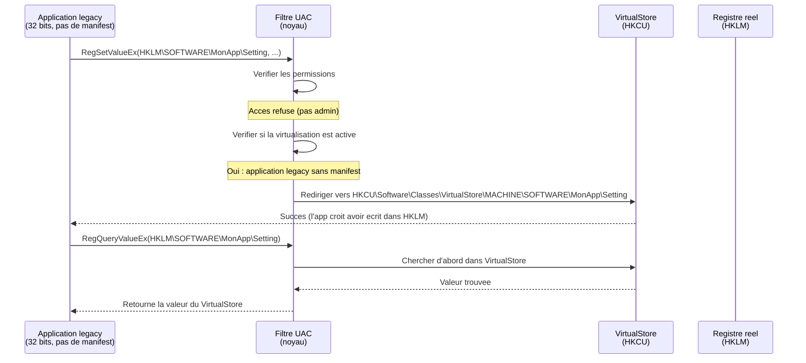
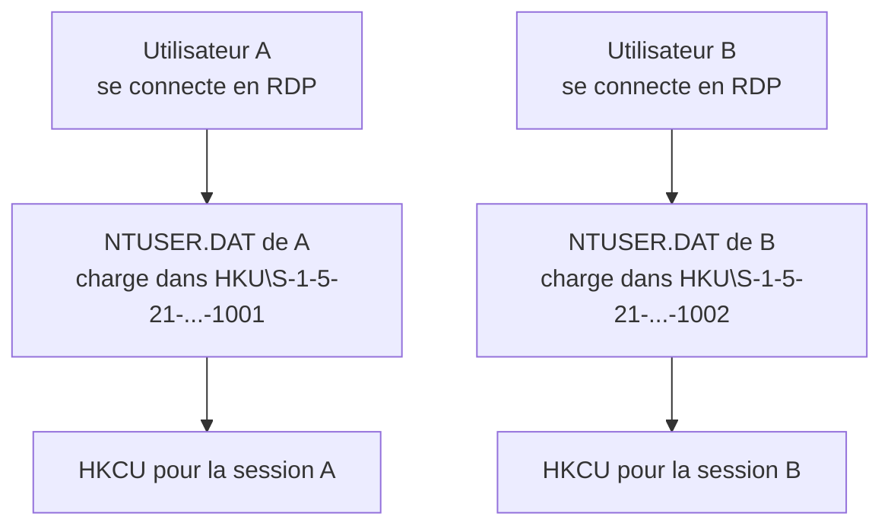

---
tags:
  - registre
  - virtualisation
  - conteneurs
  - sandbox
---

# Virtualisation et conteneurs

## Ce que vous allez apprendre

- Comment le registre fonctionne dans les machines virtuelles Hyper-V
- Le registre jetable de Windows Sandbox
- Le registre dans les conteneurs Docker Windows
- La virtualisation App-V et son registre virtuel
- Le registre dans les packages MSIX
- La virtualisation UAC (VirtualStore) en profondeur
- Le registre en environnement Remote Desktop / Terminal Services
- La configuration WSL stockee dans le registre
- Les restrictions du mode S de Windows
- Comment diagnostiquer les problemes lies a la virtualisation du registre

---

## Hyper-V : le registre dans les machines virtuelles

### Chaque VM a son propre registre

Une machine virtuelle Hyper-V est un **ordinateur complet simule**.
Son registre est stocke dans les fichiers de ruches situes sur le disque virtuel (VHDX).

!!! tip "Analogie"
    C'est comme un appartement dans un immeuble. Chaque appartement (VM) a ses propres meubles (registre). Le proprietaire de l'immeuble (l'hote Hyper-V) ne partage pas ses meubles avec les locataires.

```
Machine virtuelle (VHDX)
└── Windows
    └── System32
        └── config
            ├── SYSTEM
            ├── SOFTWARE
            ├── SAM
            ├── SECURITY
            └── DEFAULT
```

### Acceder au registre d'une VM hors ligne

Vous pouvez monter le disque virtuel d'une VM eteinte et acceder a son registre :

```powershell
# Mount the VHDX file
Mount-VHD -Path "C:\VMs\Server01\Virtual Hard Disks\Server01.vhdx" -ReadOnly

# The disk appears as a new drive letter (e.g., E:)
# Load the hive into the local registry
reg load HKLM\VM_SOFTWARE "E:\Windows\System32\config\SOFTWARE"
```

```title="Resultat attendu"
The operation completed successfully.
```

```powershell
# Query a value from the mounted hive
Get-ItemProperty "HKLM:\VM_SOFTWARE\Microsoft\Windows NT\CurrentVersion" |
    Select-Object ProductName, CurrentBuild
```

```title="Resultat attendu"
ProductName      CurrentBuild
-----------      ------------
Windows Server 2022 20348
```

```powershell
# Unload the hive when done
reg unload HKLM\VM_SOFTWARE

# Dismount the VHDX
Dismount-VHD -Path "C:\VMs\Server01\Virtual Hard Disks\Server01.vhdx"
```

```title="Resultat attendu"
The operation completed successfully.
Aucune sortie supplementaire si le demontage reussit.
```

!!! danger "Toujours en lecture seule"
    Montez le VHDX en **lecture seule** (`-ReadOnly`) sauf si vous avez une raison precise de modifier le registre de la VM. Une erreur de manipulation peut rendre la VM non demarrable.

### Cles specifiques a Hyper-V sur l'hote

```
HKLM\SOFTWARE\Microsoft\Windows NT\CurrentVersion\Virtualization
HKLM\SOFTWARE\Microsoft\Virtual Machine\Guest\Parameters
```

Sur l'invite (la VM elle-meme), les services d'integration ecrivent dans :

```
HKLM\SOFTWARE\Microsoft\Virtual Machine\Auto
    HostName = "HYPERV-HOST01"
    VirtualMachineName = "Server01"
```

!!! info "En resume"
    - Chaque VM Hyper-V possede son propre registre complet, stocke dans les fichiers de ruches du disque virtuel VHDX.
    - On peut monter un VHDX hors ligne (en lecture seule) et charger ses ruches avec `reg load` pour inspecter ou recuperer des donnees.
    - Les cles sous `HKLM\SOFTWARE\Microsoft\Virtual Machine` permettent a l'hote et a l'invite d'echanger des metadonnees via les services d'integration.

---

## Windows Sandbox : le registre jetable

### Principe de fonctionnement

Windows Sandbox cree un environnement **ephemere** : tout est detruit a la fermeture.
Le registre de la Sandbox fonctionne par **couches differentielles** :



!!! tip "Analogie"
    C'est comme un cahier avec des feuilles de papier calque. L'image de base est le cahier (lecture seule). Vos modifications sont ecrites sur le calque. Quand vous fermez la Sandbox, vous jetez le calque et le cahier reste intact.

### Ce qui persiste et ce qui ne persiste pas

| Element | Persiste ? |
|---------|-----------|
| Modifications du registre | Non |
| Fichiers crees | Non |
| Applications installees | Non |
| Configuration reseau | Non |
| L'image de base elle-meme | Oui (mise a jour avec Windows Update) |

### Configuration de la Sandbox via le registre hote

La Sandbox elle-meme est configuree sur l'hote :

```
HKLM\SOFTWARE\Microsoft\Windows\CurrentVersion\RunOnce  ← Commandes au demarrage de la Sandbox
```

Le fichier de configuration `.wsb` (XML) permet de preconfigurer la Sandbox :

```xml
<Configuration>
    <MappedFolders>
        <MappedFolder>
            <HostFolder>C:\Tools</HostFolder>
            <SandboxFolder>C:\Users\WDAGUtilityAccount\Desktop\Tools</SandboxFolder>
            <ReadOnly>true</ReadOnly>
        </MappedFolder>
    </MappedFolders>
    <LogonCommand>
        <Command>C:\Users\WDAGUtilityAccount\Desktop\Tools\setup.bat</Command>
    </LogonCommand>
</Configuration>
```

Le script `setup.bat` peut contenir des commandes `reg add` pour configurer le registre de la Sandbox au demarrage.

!!! info "En resume"
    - Windows Sandbox utilise un registre ephemere base sur des couches differentielles : une image de base en lecture seule et une couche de modifications en memoire.
    - Rien ne persiste a la fermeture de la Sandbox (registre, fichiers, applications).
    - Un fichier `.wsb` et un script de demarrage permettent de preconfigurer le registre de la Sandbox a chaque lancement.

---

## Docker Windows Containers : le registre en couches

### Architecture du registre dans un conteneur

Les conteneurs Windows utilisent un systeme de **couches** (*layers*) pour le systeme de fichiers et le registre :



### Le registre a l'interieur du conteneur

Un conteneur Windows a **son propre registre complet**, isole de l'hote :

```batch
:: Inside a Windows container
docker run -it mcr.microsoft.com/windows/servercore:ltsc2022 cmd
```

```title="Resultat attendu"
L'image est telechargee si necessaire, puis une invite de commandes s'ouvre dans le conteneur.
Microsoft Windows [Version 10.0.20348.XXX]
C:\>
```

```batch
reg query "HKLM\SOFTWARE\Microsoft\Windows NT\CurrentVersion" /v ProductName
```

```title="Resultat attendu"
HKEY_LOCAL_MACHINE\SOFTWARE\Microsoft\Windows NT\CurrentVersion
    ProductName    REG_SZ    Windows Server 2022
```

### Modifier le registre via Dockerfile

Les instructions `RUN` dans un Dockerfile peuvent modifier le registre du conteneur :

```dockerfile
FROM mcr.microsoft.com/windows/servercore:ltsc2022

# Disable Server Manager at logon
RUN reg add "HKLM\SOFTWARE\Microsoft\ServerManager" /v DoNotOpenServerManagerAtLogon /t REG_DWORD /d 1 /f

# Configure application settings
RUN reg add "HKLM\SOFTWARE\MyApp" /v DataPath /t REG_SZ /d "C:\AppData" /f
RUN reg add "HKLM\SOFTWARE\MyApp" /v MaxConnections /t REG_DWORD /d 100 /f

# Import a complete .reg file
COPY config.reg C:/temp/config.reg
RUN reg import C:\temp\config.reg
```

Chaque instruction `RUN` cree une **nouvelle couche**. Les modifications de registre sont capturees dans cette couche, exactement comme les modifications de fichiers.

### Inspecter le registre d'un conteneur

```powershell
# Execute a command inside a running container
docker exec my_container reg query "HKLM\SOFTWARE\MyApp"
```

```title="Resultat attendu"
HKEY_LOCAL_MACHINE\SOFTWARE\MyApp
    DataPath    REG_SZ    C:\AppData
    MaxConnections    REG_DWORD    0x64
```

!!! warning "Conteneurs Windows vs Linux"
    Seuls les conteneurs **Windows** ont un registre. Les conteneurs Linux sur Docker Desktop pour Windows n'ont **pas** de registre -- ils tournent dans une VM Linux (WSL 2). Ne confondez pas les deux.

### Process isolation vs Hyper-V isolation

| Mode | Registre |
|------|----------|
| **Process isolation** | Le conteneur partage le noyau de l'hote, mais le registre est isole par des filtres du noyau (namespace) |
| **Hyper-V isolation** | Le conteneur tourne dans une micro-VM avec son propre noyau et registre completement separe |

```powershell
# Run a container with Hyper-V isolation
docker run --isolation=hyperv mcr.microsoft.com/windows/servercore:ltsc2022 cmd
```

```title="Resultat attendu"
Le conteneur demarre dans une micro-VM Hyper-V avec isolation complete.
Une invite de commandes s'ouvre dans le conteneur.
```

!!! info "En resume"
    - Les conteneurs Windows possedent leur propre registre complet, isole de l'hote par un systeme de couches (image de base, couche applicative, couche d'ecriture).
    - Les modifications registre faites dans un Dockerfile (`RUN reg add`) sont capturees dans une couche permanente de l'image.
    - En mode *process isolation*, l'isolation repose sur des filtres du noyau ; en mode *Hyper-V isolation*, le conteneur dispose d'un noyau et d'un registre completement separes.

---

## App-V : registre virtuel applicatif

### Concept de registre virtuel

Microsoft Application Virtualization (App-V) permet de **virtualiser** des applications sans les installer au sens classique.
Chaque application App-V possede son propre **registre virtuel**.



!!! tip "Analogie"
    C'est comme des lunettes de realite augmentee. L'application "voit" un registre qui semble reel, mais c'est en fait un melange du registre reel et d'une couche virtuelle superposee.

### Le registre dans le package .appv

Un fichier `.appv` est un ZIP qui contient :

```
MonApp.appv
├── Registry.dat           ← Ruche du registre virtuel (format regf standard)
├── FilesystemMetadata.xml
├── PackageHistory.xml
├── AppxManifest.xml
└── Root/
    └── VFS/               ← Systeme de fichiers virtuel
```

Le fichier `Registry.dat` contient les cles que l'application **pense** ecrire dans le registre reel.

### Interception des appels registre

Quand une application App-V appelle `RegOpenKeyEx`, le filtre App-V intercepte l'appel :

| Situation | Comportement |
|-----------|-------------|
| La cle existe dans le registre virtuel | Retourne la version virtuelle |
| La cle n'existe pas dans le registre virtuel | Passe l'appel au registre reel |
| L'application ecrit une valeur | L'ecriture va dans le registre virtuel |

### Groupes de connexion

Quand plusieurs applications App-V doivent partager des cles de registre, on cree un **groupe de connexion** (*Connection Group*) :

```powershell
# List App-V connection groups
Get-AppvClientConnectionGroup
```

```title="Resultat attendu"
La liste des groupes de connexion App-V s'affiche avec leur nom, GUID et etat.
Si aucun groupe n'est configure, la sortie est vide.
```

Les registres virtuels des applications du groupe sont **fusionnes** dans un namespace commun.

!!! info "En resume"
    - App-V virtualise le registre par application : chaque package `.appv` contient un fichier `Registry.dat` qui forme une couche virtuelle transparente.
    - Les lectures et ecritures registre sont interceptees par le filtre App-V, qui sert la version virtuelle quand elle existe et passe au registre reel sinon.
    - Les groupes de connexion permettent a plusieurs applications App-V de partager un registre virtuel fusionne.

---

## MSIX : registre dans les packages modernes

### Le registre virtualise MSIX

Les applications MSIX ont un registre **virtualise** stocke dans le package.
C'est une evolution directe du concept App-V.

```
MonApp.msix (ZIP)
├── registry.dat       ← Ruche du registre virtuel
├── AppxManifest.xml
├── Assets/
└── VFS/
```

### Comment Windows fusionne le registre



### Verifier le registre d'un package MSIX

```powershell
# List installed MSIX packages
Get-AppxPackage | Select-Object Name, InstallLocation | Format-Table

# The registry.dat is inside the package folder
$package = Get-AppxPackage -Name "Microsoft.WindowsTerminal"
$registryDat = Join-Path $package.InstallLocation "registry.dat"
Test-Path $registryDat
```

```title="Resultat attendu"
True
```

Vous pouvez charger cette ruche pour l'examiner :

```powershell
# Load the MSIX registry hive
reg load HKLM\MSIX_TEMP $registryDat
reg query HKLM\MSIX_TEMP
reg unload HKLM\MSIX_TEMP
```

```title="Resultat attendu"
The operation completed successfully.
HKEY_LOCAL_MACHINE\MSIX_TEMP
HKEY_LOCAL_MACHINE\MSIX_TEMP\Registry
HKEY_LOCAL_MACHINE\MSIX_TEMP\Registry\Machine
HKEY_LOCAL_MACHINE\MSIX_TEMP\Registry\User
The operation completed successfully.
```

!!! info "Isolation des ecritures"
    Quand une application MSIX ecrit dans le registre, les modifications sont stockees dans un espace prive sous :
    ```
    %ProgramData%\Packages\<package_family_name>\SystemAppData\Helium\
    ```
    Rien n'est ecrit dans le registre reel. A la desinstallation, tout est supprime proprement.

!!! info "En resume"
    - Les applications MSIX disposent d'un registre virtualise (`registry.dat`) stocke dans le package, fusion du concept App-V dans un format moderne.
    - Windows fusionne le registre du package avec le registre reel a l'execution : les ecritures sont redirigees vers un espace prive.
    - A la desinstallation, toutes les modifications registre de l'application sont supprimees proprement sans laisser de traces.

---

## Virtualisation UAC (VirtualStore) en profondeur

### Le probleme : applications legacy et UAC

Avant Vista, de nombreuses applications ecrivaient librement dans `HKLM\SOFTWARE`.
Avec l'UAC de Vista, les processus non eleves n'ont **plus le droit** d'ecrire dans `HKLM`.

La **virtualisation UAC** resout ce probleme en redirigeant silencieusement les ecritures vers un espace prive.

### Mecanisme detaille



### Emplacement du VirtualStore

```
HKCU\Software\Classes\VirtualStore\MACHINE\SOFTWARE\
```

C'est le miroir de `HKLM\SOFTWARE`, mais par utilisateur.

```powershell
# Check if any keys exist in the VirtualStore
Get-ChildItem "HKCU:\Software\Classes\VirtualStore\MACHINE\SOFTWARE" -ErrorAction SilentlyContinue
```

```title="Resultat attendu"
    Hive: HKEY_CURRENT_USER\Software\Classes\VirtualStore\MACHINE\SOFTWARE

Name
----
OldApp1
LegacyGame
AncientUtility
```

### Quels processus sont virtualises ?

La virtualisation ne s'applique **pas** a tous les processus. Voici les regles :

| Critere | Virtualise ? |
|---------|-------------|
| Application 32 bits **sans manifest** | Oui |
| Application 32 bits **avec manifest** incluant `requestedExecutionLevel` | Non |
| Application 64 bits | Non |
| Services Windows | Non |
| Processus eleves (admin) | Non |
| Scripts (cmd, powershell) | Non |
| Applications avec `uiAccess=true` | Non |

!!! warning "Piege du diagnostic"
    Si une application legacy semble fonctionner mais ne retrouve pas ses parametres entre deux sessions utilisateur differentes, verifiez le VirtualStore. Chaque utilisateur a **son propre** VirtualStore, donc les "memes" parametres dans HKLM sont en realite differents pour chaque utilisateur.

### Detecter la virtualisation

```powershell
# Check if a specific application is being virtualized
# Look for the compatibility flag in the PEB (Process Environment Block)
$process = Get-Process -Name "oldapp" -ErrorAction SilentlyContinue
if ($process) {
    # Check the executable for an application manifest
    $manifest = [System.Reflection.Assembly]::LoadFile($process.Path).GetManifestResourceInfo("RT_MANIFEST")
    Write-Output "Has manifest: $($null -ne $manifest)"
}

# Simpler check: look for VirtualStore entries
$virtualStoreEntries = Get-ChildItem "HKCU:\Software\Classes\VirtualStore\MACHINE\SOFTWARE" -ErrorAction SilentlyContinue
if ($virtualStoreEntries) {
    Write-Output "Virtualized keys found:"
    $virtualStoreEntries | ForEach-Object { Write-Output "  $($_.Name)" }
}
```

```title="Resultat attendu"
Virtualized keys found:
  HKEY_CURRENT_USER\Software\Classes\VirtualStore\MACHINE\SOFTWARE\OldApp1
  HKEY_CURRENT_USER\Software\Classes\VirtualStore\MACHINE\SOFTWARE\LegacyGame
```

### Drapeaux de compatibilite

Vous pouvez **desactiver** la virtualisation pour une application specifique via les drapeaux de compatibilite :

```
HKLM\SOFTWARE\Microsoft\Windows NT\CurrentVersion\AppCompatFlags\Layers
    "C:\Path\to\app.exe" = "RUNASINVOKER"
```

| Drapeau | Effet |
|---------|-------|
| `RUNASINVOKER` | Pas d'elevation, pas de virtualisation |
| `RUNASADMIN` | Demande d'elevation systematique |
| `DISABLEUSERCALLBACKEXCEPTION` | Desactive certaines protections UAC |

!!! info "En resume"
    - La virtualisation UAC redirige silencieusement les ecritures `HKLM` des applications legacy (32 bits, sans manifest) vers `HKCU\Software\Classes\VirtualStore\MACHINE\SOFTWARE`.
    - Seules les applications 32 bits sans manifest sont virtualisees ; les applications 64 bits, les services et les processus eleves ne le sont pas.
    - Le VirtualStore est par utilisateur : chaque utilisateur possede sa propre copie des parametres, ce qui peut creer des comportements inattendus lors du diagnostic.

---

## Remote Desktop / Terminal Services

### Cles par session vs par machine

En environnement Remote Desktop, plusieurs utilisateurs partagent le meme systeme.
Le registre gere cette cohabitation :

```
HKLM\SYSTEM\CurrentControlSet\Control\Terminal Server
    fDenyTSConnections = 0    ; 0 = RDP active, 1 = RDP desactive
    fSingleSessionPerUser = 1 ; Une session par utilisateur
```

### Profils utilisateurs et registre

Chaque session RDP charge le `NTUSER.DAT` de l'utilisateur :



`HKCU` est une **vue par session** : chaque utilisateur connecte voit son propre `HKCU`.

### Configuration du serveur RDS

```
HKLM\SYSTEM\CurrentControlSet\Control\Terminal Server\WinStations\RDP-Tcp
    PortNumber = 3389         ; Port d'ecoute RDP
    SecurityLayer = 2         ; 0=RDP, 1=Negotiate, 2=TLS
    UserAuthentication = 1    ; NLA (Network Level Authentication)
    MinEncryptionLevel = 3    ; Niveau de chiffrement minimum
```

```powershell
# Check RDP configuration
Get-ItemProperty "HKLM:\SYSTEM\CurrentControlSet\Control\Terminal Server\WinStations\RDP-Tcp" |
    Select-Object PortNumber, SecurityLayer, UserAuthentication, MinEncryptionLevel
```

```title="Resultat attendu"
PortNumber      : 3389
SecurityLayer   : 2
UserAuthentication : 1
MinEncryptionLevel : 3
```

### Cles specifiques par session

Certaines cles sont **instanciees par session** sur les serveurs RDS :

```
HKCU\Software\Microsoft\Windows\CurrentVersion\Explorer\SessionInfo\<session_id>
```

Cela permet a chaque session d'avoir ses propres parametres d'Explorateur Windows.

### Profils itinerants et registre

Avec les profils itinerants (*roaming profiles*), le `NTUSER.DAT` est **synchronise** avec un partage reseau :

```
HKLM\SOFTWARE\Microsoft\Windows NT\CurrentVersion\ProfileList\<SID>
    ProfileImagePath = \\server\profiles$\%username%
    CentralProfile   = \\server\profiles$\%username%
```

!!! warning "Conflits de registre"
    Les profils itinerants peuvent causer des **conflits** si l'utilisateur se connecte simultanement a plusieurs serveurs. Le dernier a se deconnecter "gagne" et ecrase le profil sur le serveur. Utilisez UPD (*User Profile Disks*) ou FSLogix pour eviter ce probleme.

!!! info "En resume"
    - En environnement RDP/Terminal Services, chaque session utilisateur charge son propre `NTUSER.DAT`, isolant ainsi les `HKCU` de chaque utilisateur connecte.
    - Les cles `RDP-Tcp` sous `Terminal Server\WinStations` controlent le port, le chiffrement et l'authentification NLA.
    - Les profils itinerants synchronisent le `NTUSER.DAT` avec un partage reseau, mais les connexions simultanees peuvent provoquer des conflits.

---

## WSL (Windows Subsystem for Linux)

### Configuration WSL dans le registre

L'installation et la configuration de WSL sont tracees dans le registre Windows :

```
HKCU\Software\Microsoft\Windows\CurrentVersion\Lxss
```

```powershell
# List all WSL distributions registered for the current user
Get-ChildItem "HKCU:\Software\Microsoft\Windows\CurrentVersion\Lxss" |
    ForEach-Object {
        $props = Get-ItemProperty $_.PSPath
        [PSCustomObject]@{
            Name    = $props.DistributionName
            Version = $props.Version
            State   = $props.State
            Path    = $props.BasePath
            Default = $props.DefaultUid
        }
    }
```

```title="Resultat attendu"
Name             Version State Path                                            Default
----             ------- ----- ----                                            -------
Ubuntu-22.04           2     1 C:\Users\User\AppData\Local\Packages\...          1000
Debian                 2     1 C:\Users\User\AppData\Local\Packages\...          1000
kali-linux             2     1 C:\Users\User\AppData\Local\Packages\...          1000
```

### Structure des cles WSL

Chaque distribution est une sous-cle identifiee par un GUID :

```
HKCU\Software\Microsoft\Windows\CurrentVersion\Lxss\{guid}
    DistributionName = "Ubuntu-22.04"
    Version = 2                          ; 1 = WSL 1, 2 = WSL 2
    BasePath = "C:\Users\...\ext4.vhdx"  ; Chemin du disque virtuel
    State = 1                            ; 1 = installe, 3 = en cours d'installation
    DefaultUid = 1000                    ; UID par defaut (generalement 1000)
    Flags = 15                           ; Drapeaux de configuration
    PackageFamilyName = "Canonical..."    ; Store package
```

### La distribution par defaut

```
HKCU\Software\Microsoft\Windows\CurrentVersion\Lxss
    DefaultDistribution = {guid}    ; GUID de la distribution lancee par "wsl" sans argument
```

```powershell
# Get the default WSL distribution GUID
$defaultGuid = (Get-ItemProperty "HKCU:\Software\Microsoft\Windows\CurrentVersion\Lxss").DefaultDistribution
Write-Output "Default distribution GUID: $defaultGuid"
```

```title="Resultat attendu"
Default distribution GUID: {xxxxxxxx-xxxx-xxxx-xxxx-xxxxxxxxxxxx}
```

### Configuration globale WSL 2

```
HKLM\SOFTWARE\Microsoft\Windows\CurrentVersion\Lxss
    NatNetwork = 172.28.0.0/16    ; Reseau NAT pour WSL 2
    DhcpRange = 172.28.0.1        ; Plage DHCP
```

!!! info "wsl.conf vs registre"
    La configuration par-distribution se fait dans `/etc/wsl.conf` (cote Linux), tandis que la configuration globale `.wslconfig` (cote Windows, dans `%UserProfile%`) affecte WSL 2 dans son ensemble. Ces fichiers sont lus par le service WSL et certains parametres se refletent dans le registre.

!!! info "En resume"
    - Chaque distribution WSL est enregistree sous `HKCU\...\Lxss\{GUID}` avec son nom, sa version (WSL 1 ou 2), son chemin de base et son UID par defaut.
    - La distribution par defaut (lancee par `wsl` sans argument) est definie par la valeur `DefaultDistribution` sous la cle `Lxss`.
    - La configuration globale WSL 2 (reseau NAT, DHCP) est stockee sous `HKLM\...\Lxss`, tandis que les fichiers `/etc/wsl.conf` et `.wslconfig` completent la configuration.

---

## Windows en mode S : restrictions du registre

### Qu'est-ce que le mode S ?

Windows en mode S est une configuration **verrouillee** qui n'autorise que les applications du Microsoft Store et le navigateur Edge.

### Restrictions au niveau du registre

```
HKLM\SYSTEM\CurrentControlSet\Control\CI\Policy
    VerifiedAndReputablePolicyState = 1    ; Mode S actif
```

| Restriction | Cle associee |
|------------|-------------|
| Seules les apps du Store | `HKLM\SOFTWARE\Policies\Microsoft\Windows\safer\codeidentifiers` |
| Pas de PowerShell non-contraint | `HKLM\SOFTWARE\Policies\Microsoft\PowerShell` |
| Pas d'execution de .exe tiers | Politique Code Integrity (CI) |
| Configuration verrouillee | Certaines cles ne sont pas modifiables par l'utilisateur |

### Quitter le mode S

```powershell
# Verify S Mode status
$ciPolicy = Get-ItemProperty "HKLM:\SYSTEM\CurrentControlSet\Control\CI\Policy" -ErrorAction SilentlyContinue
if ($ciPolicy.VerifiedAndReputablePolicyState -eq 1) {
    Write-Output "Windows S Mode is ACTIVE"
} else {
    Write-Output "Windows S Mode is NOT active"
}
```

```title="Resultat attendu"
Windows S Mode is NOT active
```

!!! warning "Sortie irreversible"
    Quitter le mode S est un processus **unidirectionnel** effectue via le Microsoft Store. Vous ne pouvez pas y revenir une fois sorti. Le processus modifie les politiques CI dans le registre.

!!! info "En resume"
    - Le mode S verrouille Windows pour n'autoriser que les applications du Store ; la cle `CI\Policy` avec `VerifiedAndReputablePolicyState = 1` indique son activation.
    - Certaines cles de registre deviennent non modifiables en mode S, et PowerShell non-contraint est bloque.
    - La sortie du mode S est irreversible et modifie les politiques Code Integrity dans le registre.

---

## Diagnostiquer les problemes de virtualisation

### Scenario 1 : une application ne retrouve pas ses parametres

**Symptome** : une application legacy ecrit des parametres qui semblent disparaitre.

**Diagnostic** :

```powershell
# Step 1: Check if the app is writing to VirtualStore
$appName = "OldApp"
$virtualStorePath = "HKCU:\Software\Classes\VirtualStore\MACHINE\SOFTWARE\$appName"
$realPath = "HKLM:\SOFTWARE\$appName"

$virtualExists = Test-Path $virtualStorePath
$realExists = Test-Path $realPath

Write-Output "Real key exists: $realExists"
Write-Output "VirtualStore key exists: $virtualExists"

if ($virtualExists) {
    Write-Output "--- VirtualStore values ---"
    Get-ItemProperty $virtualStorePath
    Write-Output "--- Real registry values ---"
    Get-ItemProperty $realPath -ErrorAction SilentlyContinue
}
```

```title="Resultat attendu"
Real key exists: True
VirtualStore key exists: True
--- VirtualStore values ---
Setting1 : UserValue
Setting2 : CustomConfig
--- Real registry values ---
Setting1 : DefaultValue
Setting2 : OriginalConfig
```

**Solution** : l'application utilise la virtualisation UAC. Ajoutez un manifest avec `requestedExecutionLevel` ou executez en tant qu'administrateur.

### Scenario 2 : les parametres d'un conteneur Docker ne persistent pas

**Symptome** : des modifications `reg add` dans un conteneur en cours d'execution sont perdues au redemarrage.

**Diagnostic** : les modifications faites dans un conteneur en cours d'execution sont **dans la couche d'ecriture**. Si le conteneur est supprime (`docker rm`), elles sont perdues.

**Solutions** :

```dockerfile
# Solution 1: Put reg changes in the Dockerfile (build time)
RUN reg add "HKLM\SOFTWARE\MyApp" /v Setting /t REG_SZ /d "value" /f

# Solution 2: Use a startup script (run time)
COPY startup.bat C:/startup.bat
CMD ["C:\\startup.bat"]
```

### Scenario 3 : une application MSIX ne lit pas le registre systeme

**Symptome** : une application MSIX ne voit pas les cles que vous avez ajoutees dans `HKLM\SOFTWARE`.

**Diagnostic** : l'application MSIX est **isolee** et son registre virtuel prend le dessus.

```powershell
# Check the MSIX package's virtual registry
$package = Get-AppxPackage -Name "MyApp"
$registryPath = Join-Path $package.InstallLocation "registry.dat"
if (Test-Path $registryPath) {
    reg load HKLM\MSIX_CHECK $registryPath
    reg query HKLM\MSIX_CHECK
    reg unload HKLM\MSIX_CHECK
}
```

```title="Resultat attendu"
The operation completed successfully.
HKEY_LOCAL_MACHINE\MSIX_CHECK
HKEY_LOCAL_MACHINE\MSIX_CHECK\Registry
The operation completed successfully.
```

**Solution** : utilisez les mecanismes de configuration prevus par l'application (fichier de config, variables d'environnement) plutot que le registre systeme.

### Scenario 4 : WSL ne demarre pas

**Symptome** : `wsl` retourne une erreur de lancement.

```powershell
# Verify WSL registration in the registry
$lxssPath = "HKCU:\Software\Microsoft\Windows\CurrentVersion\Lxss"
if (Test-Path $lxssPath) {
    $distros = Get-ChildItem $lxssPath
    Write-Output "Registered distributions: $($distros.Count)"
    $distros | ForEach-Object {
        $props = Get-ItemProperty $_.PSPath
        $basePath = $props.BasePath
        $exists = Test-Path $basePath
        Write-Output "  $($props.DistributionName): BasePath exists = $exists"
    }
} else {
    Write-Output "No WSL configuration found in registry"
}
```

```title="Resultat attendu"
Registered distributions: 1
  Ubuntu-22.04: BasePath exists = False
```

**Solution** : le disque virtuel de la distribution a ete deplace ou supprime. Reinstallez la distribution ou restaurez le fichier VHDX a l'emplacement attendu.

!!! info "En resume"
    - Les problemes de virtualisation du registre se manifestent souvent par des parametres qui "disparaissent" ou ne persistent pas
    - Le diagnostic passe par la verification du VirtualStore (applications legacy), des couches Docker (conteneurs), du registre virtuel MSIX et de l'enregistrement WSL
    - Les solutions varient selon le contexte : ajout d'un manifest applicatif, modification du Dockerfile, utilisation des mecanismes de configuration prevus par l'application, ou restauration du disque virtuel WSL

---

!!! info "En resume"
    Le registre existe dans de **nombreux contextes virtualises** : machines virtuelles (registre complet dans un VHDX), conteneurs (couches differentielles), Sandbox (registre ephemere), App-V et MSIX (registre virtuel par application), et VirtualStore UAC (redirection transparente). Chaque technologie a sa propre approche de l'isolation, mais le format sous-jacent reste le meme `regf`. Comprendre ces mecanismes est essentiel pour diagnostiquer les problemes de "parametres disparus" et pour gerer correctement la configuration en environnement virtualise.
