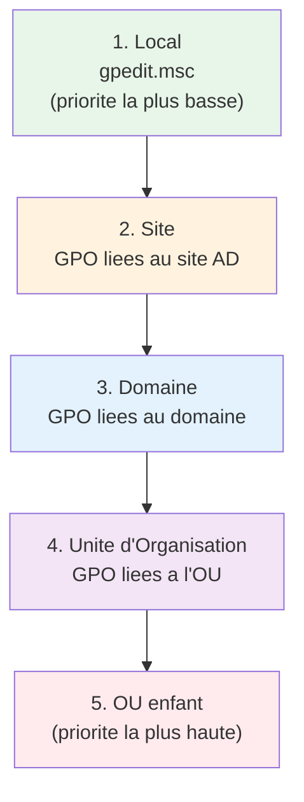
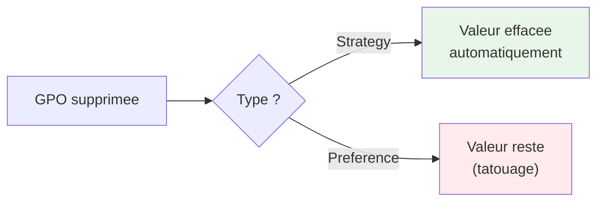
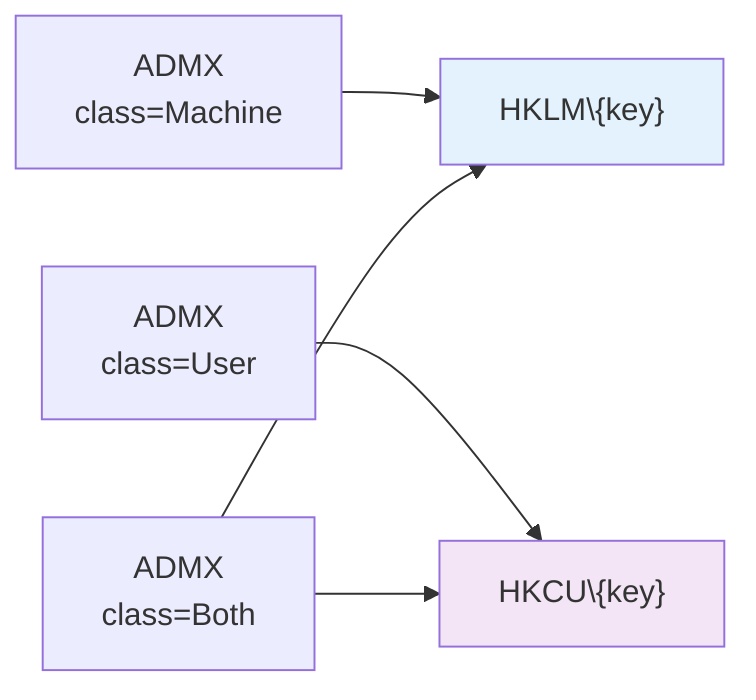
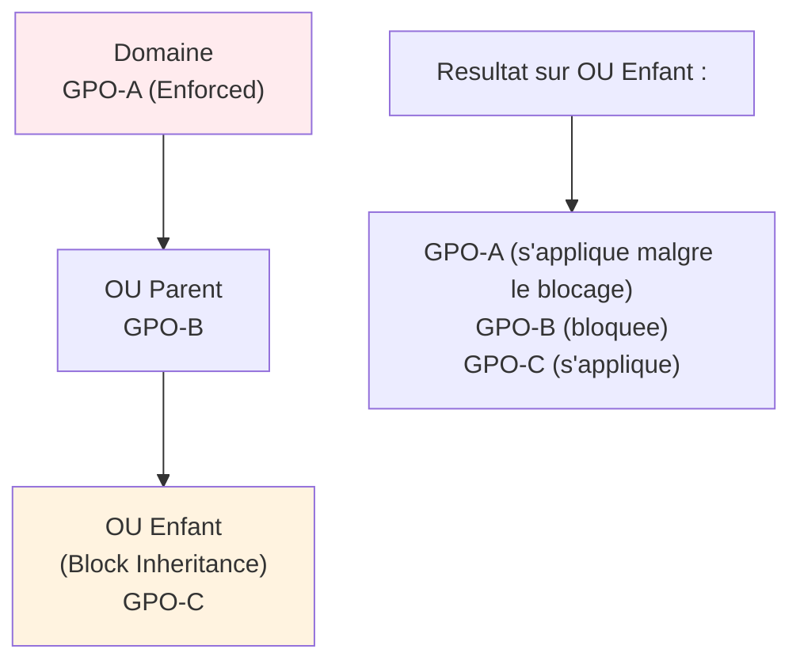
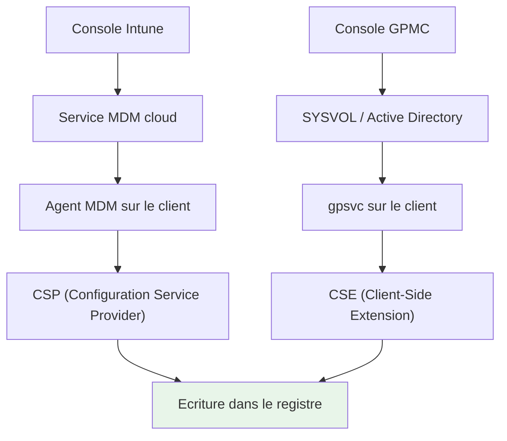
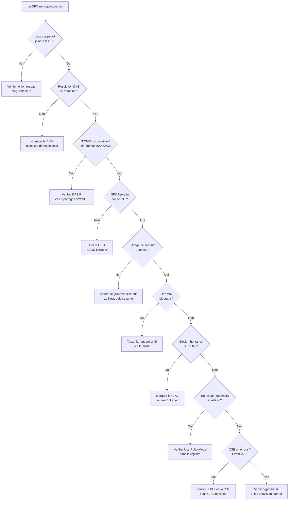

---
tags:
  - registre
  - stratégies de groupe
  - GPO
  - Active Directory
  - ADMX
  - sécurité
  - MDM
  - Intune
---

# Strategies de groupe en profondeur

## Ce que vous allez apprendre

- L'architecture complete des strategies de groupe : modele LSDOU, Client-Side Extensions, cycle de rafraichissement
- Les quatre emplacements du registre ou les GPO ecrivent et pourquoi cette distinction compte
- Le fonctionnement interne des modeles d'administration ADMX/ADML et comment creer les votres
- Le format binaire de `registry.pol` et comment le lire octet par octet
- La difference fondamentale entre strategies (policies) et preferences (GPP), incluant le probleme du tatouage
- La configuration de strategies locales avec `gpedit.msc` et `LGPO.exe` sans Active Directory
- Le diagnostic complet avec `gpresult`, `RSOP.msc` et PowerShell
- La securite des GPO : filtrage, bouclage, heritage, liens lents
- Les cas pratiques de deploiement de valeurs de registre via GPO
- Le pont entre GPO et MDM : CSP, PolicyManager, coexistence Intune

---

## Architecture des strategies de groupe

Ouvrez une invite PowerShell en tant qu'administrateur et executez :

```powershell
# Show all Client-Side Extensions registered on this machine
Get-ChildItem "HKLM:\SOFTWARE\Microsoft\Windows NT\CurrentVersion\Winlogon\GPExtensions" |
    ForEach-Object { [PSCustomObject]@{
        GUID = $_.PSChildName
        Name = (Get-ItemProperty $_.PSPath).'(default)'
        DllName = (Get-ItemProperty $_.PSPath).DllName
    }} | Format-Table -AutoSize
```

```title="Resultat attendu"
GUID                                   Name                                      DllName
----                                   ----                                      -------
{35378EAC-683F-11D2-A89A-00C04FBBCFA2} Registry                                  userenv.dll
{827D319E-6EAC-11D2-A4EA-00C04F79F83A} Security                                  scecli.dll
{42B5FAAE-6536-11D2-AE5A-0000F87571E3} Scripts                                   gpscript.dll
...
```

!!! tip "Analogie"
    Les strategies de groupe fonctionnent comme un **code du travail en entreprise**. Le siege (le domaine) definit les regles. Chaque etage (unite d'organisation) peut ajouter des regles specifiques. L'employe (l'ordinateur ou l'utilisateur) recoit l'ensemble des regles empilees, et celles de l'etage le plus proche priment en cas de conflit.

### Le modele LSDOU

L'ordre d'application des strategies suit le modele **LSDOU** : Local, Site, Domaine, Unite d'Organisation. Chaque niveau ecrase les parametres du niveau precedent.



Quand deux GPO definissent la **meme valeur de registre**, la derniere appliquee gagne. Comme l'OU enfant est traitee en dernier, elle a toujours le dernier mot -- sauf si une GPO parente est marquee **Enforced** (voir la section securite).

### Client-Side Extensions (CSE)

Le moteur GPO ne fait pas tout lui-meme. Il delegue le travail a des **Client-Side Extensions** -- des DLL specialisees qui savent traiter un type de parametre precis. Chaque CSE est enregistree sous :

```
HKLM\SOFTWARE\Microsoft\Windows NT\CurrentVersion\Winlogon\GPExtensions\{GUID}
```

| Valeur | Type | Description |
|--------|------|-------------|
| `(Default)` | `REG_SZ` | Nom lisible de l'extension |
| `DllName` | `REG_EXPAND_SZ` | Chemin vers la DLL qui implemente l'extension |
| `ProcessGroupPolicy` | `REG_SZ` | Nom de la fonction exportee par la DLL |
| `NoMachinePolicy` | `REG_DWORD` | `1` = ne traite pas les strategies machine |
| `NoUserPolicy` | `REG_DWORD` | `1` = ne traite pas les strategies utilisateur |
| `NoSlowLink` | `REG_DWORD` | `1` = ne s'execute pas sur les liens lents |
| `NoBackgroundPolicy` | `REG_DWORD` | `1` = ne s'execute qu'a l'ouverture de session |
| `NoGPOListChanges` | `REG_DWORD` | `1` = ne s'execute que si la liste des GPO a change |
| `EnableAsynchronousProcessing` | `REG_DWORD` | `1` = traitement asynchrone autorise |
| `MaxNoGPOListChangesInterval` | `REG_DWORD` | Intervalle maximum (minutes) avant un traitement force |

### Table de reference des CSE principales

| GUID | Nom | DLL | Fonction |
|------|-----|-----|----------|
| `{35378EAC-683F-11D2-A89A-00C04FBBCFA2}` | Registry (Administrative Templates) | `userenv.dll` | Applique les fichiers `registry.pol` |
| `{827D319E-6EAC-11D2-A4EA-00C04F79F83A}` | Security | `scecli.dll` | Strategies de securite (mot de passe, audit, droits) |
| `{42B5FAAE-6536-11D2-AE5A-0000F87571E3}` | Scripts | `gpscript.dll` | Scripts de demarrage, arret, ouverture, fermeture |
| `{E437BC1C-AA7D-11D2-A382-00C04F991E27}` | IP Security | `polstore.dll` | Strategies IPSec |
| `{A2E30F80-D7DE-11D2-BBDE-00C04F86AE3B}` | Internet Explorer Maintenance | `iedkcs32.dll` | Parametres Internet Explorer (obsolete) |
| `{B1BE8D72-6EAC-11D2-A4EA-00C04F79F83A}` | EFS Recovery | `scecli.dll` | Agents de recuperation EFS |
| `{25537BA6-77A8-11D2-9B6C-0000F8080861}` | Folder Redirection | `fdeploy.dll` | Redirection de dossiers (Bureau, Documents, etc.) |
| `{C631DF4C-088F-4156-B058-4375F0853CD8}` | Offline Files | `cscobj.dll` | Configuration des fichiers hors connexion |
| `{AADCED64-746C-4633-A97C-D61349046527}` | Group Policy Preferences: Registry | `gpprefcl.dll` | Preferences de registre |
| `{BC75B1ED-5833-4858-9BB8-CBF0B166DF9D}` | Group Policy Preferences: Printers | `gpprefcl.dll` | Preferences d'imprimantes |
| `{E47248BA-94CC-49C4-BBB5-9EB7F05183D0}` | Group Policy Preferences: Scheduled Tasks | `gpprefcl.dll` | Preferences de taches planifiees |
| `{17D89FEC-5C44-4972-B12D-241CAEF74509}` | Group Policy Preferences: Local Users and Groups | `gpprefcl.dll` | Preferences de groupes locaux |
| `{3A0DBA37-F8B2-4356-83DE-3E90BD5C261F}` | Group Policy Preferences: Network Options | `gpprefcl.dll` | Preferences de partages reseau |
| `{F9C77450-3A41-477E-9310-9ACD617BD9E5}` | Group Policy Preferences: Data Sources | `gpprefcl.dll` | Preferences de sources ODBC |
| `{728EE579-943C-4519-9EF7-AB56765798ED}` | Group Policy Preferences: Files | `gpprefcl.dll` | Preferences de copie de fichiers |
| `{7933F41E-56F8-41D6-A31C-4148A711EE93}` | Windows Search (Group Policy) | `srchadmin.dll` | Parametres de Windows Search |
| `{0ACDD40C-75AC-47AB-BAA0-BF6DE7E7FE63}` | Wireless Network (IEEE 802.11) | `dot3gpclnt.dll` | Strategies Wi-Fi |
| `{F312195E-3D9D-447A-A3F5-08DFFA24735E}` | Windows Firewall | `gpfirewallclient.dll` | Configuration du pare-feu avance |

### Le service Group Policy Client (gpsvc)

Le service `gpsvc` est le **chef d'orchestre** de toute la machinerie GPO. Sans lui, aucune strategie de groupe ne s'applique.

```
HKLM\SYSTEM\CurrentControlSet\Services\gpsvc
```

| Valeur | Type | Description |
|--------|------|-------------|
| `Start` | `REG_DWORD` | `2` (Automatique) -- ne jamais changer |
| `Type` | `REG_DWORD` | `32` (Win32 Share Process) |
| `ImagePath` | `REG_EXPAND_SZ` | `%SystemRoot%\system32\svchost.exe -k netsvcs -p` |
| `ObjectName` | `REG_SZ` | `LocalSystem` |
| `DependOnService` | `REG_MULTI_SZ` | `RPCSS`, `Mup` |

```powershell
# Check that the Group Policy Client service is running
Get-Service gpsvc | Select-Object Name, Status, StartType
```

```title="Resultat attendu"
Name  Status StartType
----  ------ ---------
gpsvc Running Automatic
```

### Cycle de rafraichissement

Le moteur GPO rafraichit les strategies a intervalles reguliers, configures dans :

```
HKLM\SOFTWARE\Policies\Microsoft\Windows\System
```

| Valeur | Type | Description | Par defaut |
|--------|------|-------------|------------|
| `GroupPolicyRefreshTime` | `REG_DWORD` | Intervalle en minutes pour les postes de travail | `90` |
| `GroupPolicyRefreshTimeDC` | `REG_DWORD` | Intervalle en minutes pour les controleurs de domaine | `5` |
| `GroupPolicyRefreshTimeOffset` | `REG_DWORD` | Decalage aleatoire en minutes (evite la tempete de rafraichissement) | `30` |

!!! warning "Ne descendez pas en dessous de 30 minutes"
    Un intervalle trop court genere un trafic LDAP/SYSVOL considerable. Sur un domaine de 10 000 machines, passer a 5 minutes peut saturer les controleurs de domaine.

!!! info "En resume"
    - Les strategies de groupe suivent le modele LSDOU (Local, Site, Domaine, OU) : la derniere appliquee gagne
    - Le travail est delegue a des Client-Side Extensions (CSE), des DLL specialisees enregistrees sous `GPExtensions`
    - Le service `gpsvc` orchestre le tout, avec un rafraichissement par defaut toutes les 90 minutes (+ decalage aleatoire de 30 min)

---

## Ou les GPO ecrivent dans le registre

### Les quatre emplacements strategiques

Les strategies de groupe ecrivent dans **quatre branches** du registre, divisees en deux familles :

| Famille | Machine | Utilisateur |
|---------|---------|-------------|
| **Branche moderne** | `HKLM\SOFTWARE\Policies` | `HKCU\SOFTWARE\Policies` |
| **Branche historique** | `HKLM\SOFTWARE\Microsoft\Windows\CurrentVersion\Policies` | `HKCU\SOFTWARE\Microsoft\Windows\CurrentVersion\Policies` |

La branche historique (`CurrentVersion\Policies`) existe depuis Windows NT 4.0. La branche moderne (`SOFTWARE\Policies`) a ete introduite avec Windows 2000. Les deux sont toujours utilisees : les anciennes strategies (comme les restrictions de l'Explorateur) ecrivent dans la branche historique, tandis que les nouveaux modeles d'administration utilisent la branche moderne.

```powershell
# List all policy keys on this machine (machine scope)
Get-ChildItem "HKLM:\SOFTWARE\Policies" -Recurse -ErrorAction SilentlyContinue |
    Select-Object -First 20 PSPath
```

```title="Resultat attendu"
PSPath
------
Microsoft.PowerShell.Core\Registry::HKEY_LOCAL_MACHINE\SOFTWARE\Policies\Microsoft
Microsoft.PowerShell.Core\Registry::HKEY_LOCAL_MACHINE\SOFTWARE\Policies\Microsoft\Cryptography
Microsoft.PowerShell.Core\Registry::HKEY_LOCAL_MACHINE\SOFTWARE\Policies\Microsoft\Edge
Microsoft.PowerShell.Core\Registry::HKEY_LOCAL_MACHINE\SOFTWARE\Policies\Microsoft\Windows
Microsoft.PowerShell.Core\Registry::HKEY_LOCAL_MACHINE\SOFTWARE\Policies\Microsoft\Windows\DeviceGuard
Microsoft.PowerShell.Core\Registry::HKEY_LOCAL_MACHINE\SOFTWARE\Policies\Microsoft\Windows\Explorer
Microsoft.PowerShell.Core\Registry::HKEY_LOCAL_MACHINE\SOFTWARE\Policies\Microsoft\Windows\Personalization
Microsoft.PowerShell.Core\Registry::HKEY_LOCAL_MACHINE\SOFTWARE\Policies\Microsoft\Windows\PowerShell
Microsoft.PowerShell.Core\Registry::HKEY_LOCAL_MACHINE\SOFTWARE\Policies\Microsoft\Windows\System
Microsoft.PowerShell.Core\Registry::HKEY_LOCAL_MACHINE\SOFTWARE\Policies\Microsoft\Windows\WindowsUpdate
...
```

### Strategies vs preferences : le tatouage

C'est une distinction **fondamentale** que tout administrateur doit comprendre :

**Les strategies (policies)** ecrivent dans les branches `Policies`. Quand la GPO est supprimee ou ne s'applique plus, les valeurs sont **automatiquement effacees**. Le registre revient a son etat d'origine.

**Les preferences (GPP)** ecrivent **en dehors** des branches `Policies`, directement dans les cles applicatives normales. Quand la GPO est supprimee, les valeurs **restent**. C'est le phenomene de **tatouage** (*tattooing*).



### Identifier une cle de strategie vs une cle de preference

| Critere | Strategie (policy) | Preference (GPP) |
|---------|-------------------|-------------------|
| Emplacement | Sous `...\Policies\...` | N'importe ou dans le registre |
| Suppression auto | Oui | Non (tatouage) |
| Priorite | Ecrase les preferences de l'application | Ne prime pas sur une strategie |
| Verrouillage de l'interface | L'option est grisee dans l'interface | L'option reste modifiable |
| Origine dans `gpresult` | Affichee comme "Administrative Template" | Affichee comme "Preference" |

```powershell
# Check if a value comes from a policy or is a normal setting
$policyPath = "HKLM:\SOFTWARE\Policies\Microsoft\Windows\WindowsUpdate"
$normalPath = "HKLM:\SOFTWARE\Microsoft\Windows\CurrentVersion\WindowsUpdate"

if (Test-Path $policyPath) {
    Write-Output "Policy-driven Windows Update settings found:"
    Get-ItemProperty $policyPath
}
```

```title="Resultat attendu"
Policy-driven Windows Update settings found:

DisableWindowsUpdateAccess : 0
WUServer                   : https://wsus.domaine.local:8531
WUStatusServer             : https://wsus.domaine.local:8531
DeferQualityUpdates        : 1
DeferQualityUpdatesPeriodInDays : 7
PSPath                     : Microsoft.PowerShell.Core\Registry::HKEY_LOCAL_MACHINE\SOFTWARE\Policies\Microsoft\Windows\WindowsUpdate
PSParentPath               : Microsoft.PowerShell.Core\Registry::HKEY_LOCAL_MACHINE\SOFTWARE\Policies\Microsoft\Windows
PSChildName                : WindowsUpdate
PSProvider                 : Microsoft.PowerShell.Core\Registry
```

!!! info "En resume"
    - Les GPO ecrivent dans quatre branches : `HKLM\SOFTWARE\Policies`, `HKCU\SOFTWARE\Policies` (modernes) et leurs equivalents sous `CurrentVersion\Policies` (historiques)
    - Les strategies (policies) sont nettoyees automatiquement quand la GPO est retiree ; les preferences (GPP) restent en place (tatouage)
    - Une strategie grise l'option dans l'interface utilisateur, tandis qu'une preference laisse l'option modifiable

---

## Modeles d'administration (ADMX/ADML)

### Structure d'un fichier ADMX

Les modeles d'administration sont des fichiers XML qui **decrivent** la correspondance entre un parametre affiche dans la console GPO et une valeur de registre. Un fichier ADMX ne contient **aucun texte affichable** -- les chaines localisees sont dans les fichiers ADML.

Voici la structure d'un parametre reel dans un fichier ADMX :

```xml
<!-- Example: DisableWindowsUpdateAccess from WindowsUpdate.admx -->
<policy name="DisableWindowsUpdateAccess"
        class="Machine"
        displayName="$(string.DisableWindowsUpdateAccess)"
        explainText="$(string.DisableWindowsUpdateAccess_Help)"
        presentation="$(presentation.DisableWindowsUpdateAccess)"
        key="SOFTWARE\Policies\Microsoft\Windows\WindowsUpdate"
        valueName="DisableWindowsUpdateAccess">
    <parentCategory ref="WindowsUpdateCat" />
    <supportedOn ref="windows:SUPPORTED_WindowsVista" />
    <enabledValue>
        <decimal value="1" />
    </enabledValue>
    <disabledValue>
        <decimal value="0" />
    </disabledValue>
</policy>
```

Decryptage des attributs :

| Attribut | Signification |
|----------|---------------|
| `name` | Identifiant interne unique de la strategie |
| `class` | `Machine` → HKLM, `User` → HKCU, `Both` → les deux |
| `key` | Chemin du registre (sans la ruche racine, deduite de `class`) |
| `valueName` | Nom de la valeur de registre |
| `enabledValue` | Donnee ecrite quand le parametre est **Active** |
| `disabledValue` | Donnee ecrite quand le parametre est **Desactive** |
| `parentCategory` | Categorie dans l'arborescence de la console GPO |

### Structure du fichier ADML correspondant

Le fichier ADML contient les chaines localisees au format suivant :

```xml
<!-- WindowsUpdate.adml (fr-FR) -->
<policyDefinitionResources revision="1.0" schemaVersion="1.0">
    <displayName>Windows Update</displayName>
    <description>Parametres de Windows Update</description>
    <resources>
        <stringTable>
            <string id="DisableWindowsUpdateAccess">
                Supprimer l'acces a toutes les fonctionnalites Windows Update
            </string>
            <string id="DisableWindowsUpdateAccess_Help">
                Ce parametre vous permet de supprimer l'acces a Windows Update.
            </string>
        </stringTable>
    </resources>
</policyDefinitionResources>
```

### Comment ADMX mappe vers le registre

Le mappage suit une logique simple :



Quand un administrateur **active** un parametre dans la console GPO :

1. La console lit l'ADMX pour trouver `key`, `valueName` et `enabledValue`
2. Elle ecrit ces informations dans le fichier `registry.pol` de la GPO
3. Au prochain rafraichissement, la CSE Registry (`userenv.dll`) lit le `registry.pol`
4. La CSE ecrit la valeur dans le registre local du client

### Le Central Store sur SYSVOL

Par defaut, chaque poste utilise les fichiers ADMX de `%SystemRoot%\PolicyDefinitions`. Pour centraliser les modeles dans un domaine, creez un **Central Store** :

```
\\domaine.local\SYSVOL\domaine.local\Policies\PolicyDefinitions\
    ├── fr-FR\
    │   ├── WindowsUpdate.adml
    │   └── ...
    ├── en-US\
    │   ├── WindowsUpdate.adml
    │   └── ...
    ├── WindowsUpdate.admx
    └── ...
```

```powershell
# Create the Central Store structure
$sysvolPath = "\\domaine.local\SYSVOL\domaine.local\Policies"
New-Item "$sysvolPath\PolicyDefinitions" -ItemType Directory -Force
New-Item "$sysvolPath\PolicyDefinitions\fr-FR" -ItemType Directory -Force
New-Item "$sysvolPath\PolicyDefinitions\en-US" -ItemType Directory -Force

# Copy local ADMX/ADML files to the Central Store
Copy-Item "$env:SystemRoot\PolicyDefinitions\*.admx" "$sysvolPath\PolicyDefinitions\"
Copy-Item "$env:SystemRoot\PolicyDefinitions\fr-FR\*.adml" "$sysvolPath\PolicyDefinitions\fr-FR\"
Copy-Item "$env:SystemRoot\PolicyDefinitions\en-US\*.adml" "$sysvolPath\PolicyDefinitions\en-US\"
```

```title="Resultat attendu"
Aucune sortie si la commande reussit.
```

!!! info "Detection automatique"
    La console GPMC detecte automatiquement la presence d'un Central Store. Si le dossier `PolicyDefinitions` existe sur le SYSVOL, il est utilise a la place des fichiers locaux. Aucune configuration supplementaire n'est necessaire.

### Creer un modele ADMX personnalise

Voici un exemple complet de modele ADMX personnalise qui configure une application fictive :

```xml
<?xml version="1.0" encoding="utf-8"?>
<!-- CustomApp.admx - Custom ADMX template for MyApp -->
<policyDefinitions
    xmlns:xsd="http://www.w3.org/2001/XMLSchema"
    xmlns:xsi="http://www.w3.org/2001/XMLSchema-instance"
    revision="1.0"
    schemaVersion="1.0"
    xmlns="http://schemas.microsoft.com/GroupPolicy/2006/07/PolicyDefinitions">

    <policyNamespaces>
        <target prefix="customapp" namespace="CustomApp.Policies" />
        <using prefix="windows" namespace="Microsoft.Policies.Windows" />
    </policyNamespaces>

    <resources minRequiredRevision="1.0" />

    <categories>
        <category name="CustomAppCat" displayName="$(string.CustomAppCat)" />
        <category name="CustomAppNetworkCat" displayName="$(string.CustomAppNetworkCat)">
            <parentCategory ref="CustomAppCat" />
        </category>
    </categories>

    <policies>
        <policy name="EnableTelemetry"
                class="Machine"
                displayName="$(string.EnableTelemetry)"
                explainText="$(string.EnableTelemetry_Help)"
                key="SOFTWARE\Policies\CustomApp"
                valueName="EnableTelemetry">
            <parentCategory ref="CustomAppCat" />
            <supportedOn ref="windows:SUPPORTED_Windows10" />
            <enabledValue><decimal value="1" /></enabledValue>
            <disabledValue><decimal value="0" /></disabledValue>
        </policy>

        <policy name="MaxCacheSize"
                class="Machine"
                displayName="$(string.MaxCacheSize)"
                explainText="$(string.MaxCacheSize_Help)"
                key="SOFTWARE\Policies\CustomApp"
                presentation="$(presentation.MaxCacheSize)">
            <parentCategory ref="CustomAppNetworkCat" />
            <supportedOn ref="windows:SUPPORTED_Windows10" />
            <elements>
                <decimal id="MaxCacheSizeValue"
                         valueName="MaxCacheSize"
                         minValue="64"
                         maxValue="4096" />
            </elements>
        </policy>
    </policies>
</policyDefinitions>
```

Et le fichier ADML correspondant :

```xml
<?xml version="1.0" encoding="utf-8"?>
<!-- CustomApp.adml (en-US) -->
<policyDefinitionResources
    xmlns:xsd="http://www.w3.org/2001/XMLSchema"
    xmlns:xsi="http://www.w3.org/2001/XMLSchema-instance"
    revision="1.0"
    schemaVersion="1.0"
    xmlns="http://schemas.microsoft.com/GroupPolicy/2006/07/PolicyDefinitions">
    <displayName>CustomApp</displayName>
    <description>Custom application policy settings</description>
    <resources>
        <stringTable>
            <string id="CustomAppCat">CustomApp Settings</string>
            <string id="CustomAppNetworkCat">Network</string>
            <string id="EnableTelemetry">Enable telemetry</string>
            <string id="EnableTelemetry_Help">Enables or disables telemetry data collection for CustomApp.</string>
            <string id="MaxCacheSize">Maximum cache size (MB)</string>
            <string id="MaxCacheSize_Help">Sets the maximum disk cache size in megabytes. Valid range: 64-4096.</string>
        </stringTable>
        <presentationTable>
            <presentation id="MaxCacheSize">
                <decimalTextBox refId="MaxCacheSizeValue" defaultValue="512">Cache size (MB):</decimalTextBox>
            </presentation>
        </presentationTable>
    </resources>
</policyDefinitionResources>
```

### Outils de reference

| Outil | Usage |
|-------|-------|
| **LGPO.exe** | Appliquer des parametres GPO en local via la ligne de commande |
| **Policy Analyzer** | Comparer des GPO entre elles ou avec des baselines Microsoft |
| **Group Policy Settings Reference Spreadsheet** | Tableur Excel officiel Microsoft listant chaque parametre ADMX avec son chemin de registre |

!!! info "En resume"
    - Les fichiers ADMX decrivent la correspondance entre un parametre de la console GPO et une valeur de registre ; les ADML contiennent les chaines localisees
    - L'attribut `class` determine la ruche cible (`Machine` pour HKLM, `User` pour HKCU)
    - Le Central Store sur le SYSVOL centralise les modeles ADMX pour tout le domaine, detecte automatiquement par la console GPMC

---

## Traitement des strategies de registre (registry.pol)

### Le format binaire de registry.pol

Le fichier `registry.pol` est le coeur du mecanisme de strategies de registre. C'est un fichier binaire avec une structure simple mais precise.

**En-tete** (8 octets) :

| Offset | Taille | Contenu | Description |
|--------|--------|---------|-------------|
| 0x00 | 4 octets | `50 52 65 67` | Signature "PReg" en ASCII |
| 0x04 | 4 octets | `01 00 00 00` | Version du format (toujours 1) |

**Chaque entree** suit le format `[key;value;type;size;data]` en Unicode (UTF-16LE), avec des delimiteurs :

| Element | Delimiteur | Description |
|---------|------------|-------------|
| `[` | `5B 00` | Debut de l'entree |
| `key` | -- | Chemin de la cle (ex: `SOFTWARE\Policies\Microsoft\Windows`) en UTF-16LE, termine par null |
| `;` | `3B 00` | Separateur |
| `value` | -- | Nom de la valeur en UTF-16LE, termine par null |
| `;` | `3B 00` | Separateur |
| `type` | -- | Type de registre (REG_DWORD = `04 00 00 00`) |
| `;` | `3B 00` | Separateur |
| `size` | -- | Taille des donnees en octets (DWORD little-endian) |
| `;` | `3B 00` | Separateur |
| `data` | -- | Les donnees brutes |
| `]` | `5D 00` | Fin de l'entree |

### Emplacements sur le disque

| Contexte | Chemin |
|----------|--------|
| Strategie locale machine | `%SystemRoot%\System32\GroupPolicy\Machine\Registry.pol` |
| Strategie locale utilisateur | `%SystemRoot%\System32\GroupPolicy\User\Registry.pol` |
| GPO de domaine machine | `\\domaine\SYSVOL\domaine\Policies\{GUID-GPO}\Machine\Registry.pol` |
| GPO de domaine utilisateur | `\\domaine\SYSVOL\domaine\Policies\{GUID-GPO}\User\Registry.pol` |

### Lire un fichier registry.pol avec PowerShell

La methode recommandee utilise le module `GPRegistryPolicyParser` :

```powershell
# Install the module (once)
Install-Module -Name GPRegistryPolicyParser -Force -Scope CurrentUser

# Parse a local machine registry.pol
$polPath = "$env:SystemRoot\System32\GroupPolicy\Machine\Registry.pol"
$entries = Parse-PolFile -Path $polPath

# Display each entry
$entries | ForEach-Object {
    [PSCustomObject]@{
        Key       = $_.KeyName
        Value     = $_.ValueName
        Type      = $_.ValueType
        Data      = $_.ValueData
    }
} | Format-Table -AutoSize
```

```title="Resultat attendu"
Key                                             Value                    Type    Data
---                                             -----                   ----    ----
SOFTWARE\Policies\Microsoft\Windows\WindowsUpdate DisableWindowsUpdateAccess REG_DWORD 1
SOFTWARE\Policies\Microsoft\Windows\System       GroupPolicyRefreshTime     REG_DWORD 90
```

### Analyse hexadecimale manuelle

Pour comprendre ce qui se passe reellement, examinons un fichier `registry.pol` minimal octet par octet :

```powershell
# Read the raw bytes of a registry.pol file
$bytes = [System.IO.File]::ReadAllBytes(
    "$env:SystemRoot\System32\GroupPolicy\Machine\Registry.pol"
)

# Display as hex dump (first 128 bytes)
$offset = 0
while ($offset -lt [Math]::Min($bytes.Length, 128)) {
    $hex = ($bytes[$offset..([Math]::Min($offset + 15, $bytes.Length - 1))] |
        ForEach-Object { '{0:X2}' -f $_ }) -join ' '
    $ascii = ($bytes[$offset..([Math]::Min($offset + 15, $bytes.Length - 1))] |
        ForEach-Object { if ($_ -ge 32 -and $_ -le 126) { [char]$_ } else { '.' } }) -join ''
    '{0:X4}  {1,-47}  {2}' -f $offset, $hex, $ascii
    $offset += 16
}
```

```title="Resultat attendu"
0000  50 52 65 67 01 00 00 00 5B 00 53 00 4F 00 46 00  PReg....[.S.O.F.
0010  54 00 57 00 41 00 52 00 45 00 5C 00 50 00 6F 00  T.W.A.R.E.\.P.o.
0020  6C 00 69 00 63 00 69 00 65 00 73 00 5C 00 4D 00  l.i.c.i.e.s.\.M.
0030  69 00 63 00 72 00 6F 00 73 00 6F 00 66 00 74 00  i.c.r.o.s.o.f.t.
```

Decodage de cet extrait :

- `50 52 65 67` → "PReg" (signature)
- `01 00 00 00` → version 1
- `5B 00` → `[` en UTF-16LE (debut d'entree)
- `53 00 4F 00 46 00 54 00 ...` → "SOFTWARE\Policies\Microsoft..." en UTF-16LE

!!! danger "Ne modifiez jamais registry.pol a la main"
    Un fichier `registry.pol` corrompu empeche l'application de **toutes** les strategies de registre de la GPO concernee. Utilisez toujours les outils officiels (GPMC, `LGPO.exe`, `GPRegistryPolicyParser`).

!!! info "En resume"
    - Le fichier `registry.pol` est un binaire avec la signature `PReg`, contenant des entrees au format `[cle;valeur;type;taille;donnees]` en UTF-16LE
    - Il existe en version locale (`System32\GroupPolicy`) et en version domaine (sur le SYSVOL de chaque GPO)
    - Le module PowerShell `GPRegistryPolicyParser` permet de lire son contenu sans manipulation hexadecimale

---

## Group Policy Preferences (GPP)

### Strategies vs preferences : comparaison detaillee

| Critere | Strategie (Policy) | Preference (GPP) |
|---------|-------------------|-------------------|
| Emplacement registre | Sous `...\Policies\...` | N'importe quelle cle |
| Suppression automatique | Oui, quand la GPO est retiree | Non (tatouage) |
| Interface utilisateur | Option grisee (forcee) | Option modifiable par l'utilisateur |
| Types de donnees | REG_DWORD, REG_SZ principalement | Tous les types de registre |
| Actions disponibles | Active / Desactive / Non configure | Create / Replace / Update / Delete |
| Ciblage fin (ILT) | Non | Oui (Item-Level Targeting) |
| Fichier de stockage | `registry.pol` | Fichiers XML dans la GPO |
| CSE utilisee | `{35378EAC-...}` (userenv.dll) | `{AADCED64-...}` (gpprefcl.dll) |
| Gestion des conflits | La GPO la plus prioritaire gagne | Derniere ecriture gagne |
| Necessite RSAT | Non (modeles integres) | Non (integre depuis Windows 2008) |

### Les quatre actions GPP

| Action | Comportement | Equivalent registre |
|--------|-------------|---------------------|
| **Create** | Cree la valeur **uniquement si elle n'existe pas**. Si elle existe deja, ne fait rien. | `reg add ... /f` seulement si absent |
| **Replace** | Supprime puis recree. Si la valeur n'existe pas, la cree. Ecrase systematiquement. | `reg delete ... && reg add ...` |
| **Update** | Modifie la valeur si elle existe, la cree si elle n'existe pas. C'est l'action la plus courante. | `reg add ... /f` |
| **Delete** | Supprime la valeur ou la cle entiere. | `reg delete ...` |

!!! tip "Quelle action choisir ?"
    Dans 90% des cas, utilisez **Update**. Elle couvre le scenario ou la valeur existe deja (mise a jour) et celui ou elle n'existe pas encore (creation). **Replace** est utile quand vous devez garantir un etat "propre" en supprimant d'abord l'existant.

### Item-Level Targeting (ILT)

Le ciblage au niveau de l'element permet d'appliquer une preference uniquement si certaines conditions sont remplies. Les conditions sont evaluees **sur le client** au moment de l'application.

Conditions disponibles :

| Condition | Exemples |
|-----------|----------|
| Systeme d'exploitation | Windows 11, Windows Server 2022 |
| Groupe de securite | "Comptabilite", "VPN-Users" |
| Plage d'adresses IP | 192.168.1.0/24 |
| Nom de l'ordinateur | Commence par "PC-PARIS-" |
| Variable d'environnement | `%DEPT%` = "Finance" |
| Cle de registre | `HKLM\SOFTWARE\MyApp` existe |
| Valeur de registre | `HKLM\SOFTWARE\MyApp\Version` = "2.0" |
| Espace disque | Plus de 10 Go libres |
| Processeur | Architecture x64 |
| Requete WMI | `SELECT * FROM Win32_Battery` (portables uniquement) |
| Site AD | "Paris", "Londres" |

### Structure XML des preferences de registre

Les preferences de registre sont stockees dans des fichiers XML sur le SYSVOL :

```
\\domaine\SYSVOL\domaine\Policies\{GUID-GPO}\Machine\Preferences\Registry\Registry.xml
```

```xml
<?xml version="1.0" encoding="utf-8"?>
<RegistrySettings clsid="{A3CCFC41-DFDB-43A5-8D26-0FE8B954DA51}">
    <Registry clsid="{9CD4B2F4-923D-47F5-A062-E897DD1DAD50}"
              name="MaxCacheAge"
              status="MaxCacheAge"
              image="2"
              changed="2024-01-15 10:30:00"
              uid="{A1B2C3D4-E5F6-7890-ABCD-EF1234567890}">
        <Properties action="U"
                    displayDecimal="1"
                    default="0"
                    hive="HKEY_LOCAL_MACHINE"
                    key="SOFTWARE\MyApp\Settings"
                    name="MaxCacheAge"
                    type="REG_DWORD"
                    value="00000168" />
    </Registry>
</RegistrySettings>
```

L'attribut `action` correspond aux quatre actions : `C` (Create), `R` (Replace), `U` (Update), `D` (Delete).

### La vulnerabilite GPP des mots de passe (MS14-025)

!!! danger "CVE-2014-1812 / MS14-025 : cpassword dans Groups.xml"
    Avant mai 2014, les preferences de groupe permettaient de stocker des mots de passe dans les fichiers XML sur le SYSVOL. Le mot de passe etait "chiffre" avec une cle AES-256 que **Microsoft a publiee dans sa documentation MSDN**. N'importe quel utilisateur du domaine ayant acces en lecture au SYSVOL pouvait dechiffrer ces mots de passe.

Le fichier concerne etait typiquement :

```
\\domaine\SYSVOL\domaine\Policies\{GUID}\Machine\Preferences\Groups\Groups.xml
```

```xml
<!-- VULNERABLE: this format should no longer exist in your environment -->
<Groups>
    <User clsid="{DF5F1855-51E5-4d24-8B1A-D9BDE98BA1D1}"
          name="LocalAdmin" image="2" changed="2013-06-15">
        <Properties action="U"
                    newName=""
                    fullName=""
                    description=""
                    cpassword="j1Uyj3Vx8TY9LtLZil2uAuZkFQA/4latT76ZwgdHdhw"
                    userName="LocalAdmin" />
    </User>
</Groups>
```

**Actions correctives** :

```powershell
# Search SYSVOL for any remaining cpassword attributes
Get-ChildItem "\\$env:USERDNSDOMAIN\SYSVOL" -Recurse -Include "*.xml" |
    Select-String -Pattern "cpassword" |
    Select-Object Path, LineNumber
```

```title="Resultat attendu"
Path                                                                          LineNumber
----                                                                          ----------
\\corp.local\SYSVOL\corp.local\Policies\{6AC1786C-...}\Machine\Preferences\Groups\Groups.xml        8
\\corp.local\SYSVOL\corp.local\Policies\{31B2F340-...}\Machine\Preferences\Groups\Groups.xml       12
```

Le correctif MS14-025 empeche la creation de nouveaux mots de passe GPP, mais **ne supprime pas** les fichiers existants. Vous devez les nettoyer manuellement.

### Tatouage des preferences

Quand une GPO contenant des preferences est supprimee ou que l'ordinateur quitte l'OU, les valeurs ecrites par les preferences **ne sont pas effacees**. Elles restent dans le registre indefiniment.

```powershell
# A GPP wrote this value under a normal (non-policy) key
Get-ItemProperty "HKLM:\SOFTWARE\MyApp\Settings" -Name "MaxCacheAge"

# Even after the GPO is removed, the value persists
# There is no automatic cleanup mechanism
```

```title="Resultat attendu"
MaxCacheAge  : 360
PSPath       : Microsoft.PowerShell.Core\Registry::HKEY_LOCAL_MACHINE\SOFTWARE\MyApp\Settings
PSParentPath : Microsoft.PowerShell.Core\Registry::HKEY_LOCAL_MACHINE\SOFTWARE\MyApp
PSChildName  : Settings
PSProvider   : Microsoft.PowerShell.Core\Registry
```

Pour eviter le tatouage, privilegiez les **strategies** (Administrative Templates) aux preferences quand le parametre existe en tant que modele ADMX.

!!! info "En resume"
    - Les preferences GPP offrent quatre actions (Create, Replace, Update, Delete) et un ciblage fin via Item-Level Targeting
    - Contrairement aux strategies, les preferences tatouent le registre : les valeurs persistent meme apres suppression de la GPO
    - La vulnerabilite historique MS14-025 (`cpassword` dans `Groups.xml`) impose de verifier le SYSVOL pour d'eventuels fichiers residuels

---

## Strategie de groupe locale (LGPO)

### Configuration sans Active Directory

Meme sans domaine Active Directory, Windows offre un editeur de strategies locales :

```batch
rem Open the Local Group Policy Editor
gpedit.msc
```

```title="Resultat attendu"
La console de l'editeur de strategies de groupe locales s'ouvre.
```

!!! warning "Editions familiales de Windows"
    `gpedit.msc` n'est **pas disponible** sur Windows 10/11 Home. Il est reserve aux editions Pro, Enterprise et Education. Sur les editions Home, vous pouvez neanmoins modifier directement les cles de registre cibles.

Les strategies locales ecrivent dans :

```
%SystemRoot%\System32\GroupPolicy\
    ├── Machine\
    │   └── Registry.pol
    ├── User\
    │   └── Registry.pol
    └── GPT.INI
```

### Multiple Local Group Policy Objects (MLGPO)

Depuis Windows Vista, il est possible de definir des strategies locales **differentes par utilisateur** :

```
%SystemRoot%\System32\GroupPolicyUsers\
    ├── {SID-Utilisateur-1}\
    │   └── User\
    │       └── Registry.pol
    ├── {SID-Utilisateur-2}\
    │   └── User\
    │       └── Registry.pol
    └── S-1-5-32-544\       ← Administrators group
        └── User\
            └── Registry.pol
```

L'ordre de priorite est : GPO de domaine > strategie locale specifique a l'utilisateur > strategie locale par defaut.

### LGPO.exe : l'outil en ligne de commande de Microsoft

`LGPO.exe` est un outil officiel Microsoft (disponible dans le Security Compliance Toolkit) qui permet de scripter la gestion des strategies locales.

**Exporter les strategies locales** :

```batch
rem Export current local policies to a backup folder
LGPO.exe /b C:\GPOBackup /n "Baseline-2024"
```

```title="Resultat attendu"
Creating backup...
Backup successfully created: {12345678-ABCD-1234-5678-ABCDEF012345}
```

**Analyser un fichier registry.pol** :

```batch
rem Parse a registry.pol file into human-readable text
LGPO.exe /parse /m C:\Windows\System32\GroupPolicy\Machine\Registry.pol
```

```title="Resultat attendu"
; Source: C:\Windows\System32\GroupPolicy\Machine\Registry.pol
Computer
SOFTWARE\Policies\Microsoft\Windows\WindowsUpdate
DisableWindowsUpdateAccess
DWORD:1

Computer
SOFTWARE\Policies\Microsoft\Windows\System
GroupPolicyRefreshTime
DWORD:90
```

**Importer des strategies depuis un fichier texte** :

Creez un fichier texte avec le format LGPO :

```
; CustomPolicies.txt
Computer
SOFTWARE\Policies\Microsoft\Windows\Explorer
NoNewAppAlert
DWORD:1

Computer
SOFTWARE\Policies\Microsoft\Windows\System
DisableCMD
DWORD:1
```

```batch
rem Apply the policy text file
LGPO.exe /r CustomPolicies.txt /w C:\Windows\System32\GroupPolicy\Machine\Registry.pol
```

```title="Resultat attendu"
Aucune sortie si la commande reussit.
```

**Appliquer une baseline de securite Microsoft** :

```batch
rem Import a previously exported GPO backup
LGPO.exe /g C:\GPOBackup\{12345678-ABCD-1234-5678-ABCDEF012345}

rem Force a policy refresh after import
gpupdate /force
```

```title="Resultat attendu"
Updating policy...

Computer Policy update has completed successfully.
User Policy update has completed successfully.
```

!!! info "En resume"
    - `gpedit.msc` permet de configurer des strategies locales sans Active Directory (editions Pro/Enterprise uniquement)
    - Depuis Vista, les MLGPO permettent de definir des strategies differentes par utilisateur sur une meme machine
    - `LGPO.exe` (Security Compliance Toolkit) scripte l'export, l'import et l'analyse des fichiers `registry.pol` en ligne de commande

---

## Resultant Set of Policy (RSoP)

### gpresult : l'outil de diagnostic essentiel

`gpresult` est la commande la plus importante pour diagnostiquer les problemes de strategies de groupe. Elle montre exactement quelles GPO sont appliquees et quelles valeurs de registre ont ete ecrites.

**Rapport HTML complet** :

```batch
rem Generate a comprehensive HTML report
gpresult /h C:\Temp\gpresult.html
```

```title="Resultat attendu"
Aucune sortie si la commande reussit. Le fichier C:\Temp\gpresult.html est genere.
```

Le rapport HTML est le format le plus lisible. Il affiche les GPO appliquees, les parametres resultants et les eventuels filtres WMI ou de securite.

**Resume rapide** :

```batch
rem Quick summary of applied GPOs
gpresult /r
```

```title="Resultat attendu"
RSOP data for DOMAINE\jbombled on POSTE-01 : Logging Mode
-------------------------------------------------------------

OS Configuration:            Member Workstation
OS Version:                  10.0.22621
Site Name:                   Paris
Roaming Profile:             (None)

COMPUTER SETTINGS
-----------------
    Applied Group Policy Objects
    ----------------------------
        Default Domain Policy
        Securite-Baseline-2024
        WindowsUpdate-Config

USER SETTINGS
-------------
    Applied Group Policy Objects
    ----------------------------
        Default Domain Policy
        Bureau-Standard
```

**Mode verbeux avec valeurs de registre** :

```batch
rem Verbose output including registry values
gpresult /v
```

```title="Resultat attendu"
RSOP data for DOMAINE\jbombled on POSTE-01 : Logging Mode
-------------------------------------------------------------
...
COMPUTER SETTINGS
-----------------
    Software Installations
    ----------------------
        N/A

    Administrative Templates
    ------------------------
        GPO: Securite-Baseline-2024
            KeyName:    Software\Policies\Microsoft\Windows\System\DisableCMD
            Value:      1, 0, 0, 0
            State:      Enabled

        GPO: WindowsUpdate-Config
            KeyName:    Software\Policies\Microsoft\Windows\WindowsUpdate\DeferQualityUpdatesPeriodInDays
            Value:      7, 0, 0, 0
            State:      Enabled
...
```

**Mode super-verbeux** :

```batch
rem Full debug-level output
gpresult /z
```

```title="Resultat attendu"
RSOP data for DOMAINE\jbombled on POSTE-01 : Logging Mode
-------------------------------------------------------------
...
COMPUTER SETTINGS
-----------------
    CN=POSTE-01,OU=Workstations,DC=domaine,DC=local
    Last time Group Policy was applied: 15/12/2024 at 08:32:10
    Group Policy was applied from:      SRV-DC01.domaine.local
    Group Policy slow link threshold:   500 kbps

    Applied Group Policy Objects
    ----------------------------
        Default Domain Policy
            Filtering:  Not Applied (Empty)
            Revision:   AD (45), SYSVOL (45)
            GUID:       {31B2F340-016D-11D2-945F-00C04FB984F9}
            Link:       domaine.local
            Extensions: [{35378EAC-683F-11D2-A89A-00C04FBBCFA2}]
...
```

**Cibler machine ou utilisateur specifiquement** :

```batch
rem Computer scope only
gpresult /scope:computer /r

rem User scope only
gpresult /scope:user /r
```

```title="Resultat attendu"
RSOP data for DOMAINE\jbombled on POSTE-01 : Logging Mode
-------------------------------------------------------------

USER SETTINGS
-------------
    Last time Group Policy was applied: 15/12/2024 at 08:15:22
    Group Policy was applied from:      SRV-DC01.domaine.local

    Applied Group Policy Objects
    ----------------------------
        Default Domain Policy
        Bureau-Standard
```

**Generer un rapport pour un autre utilisateur** :

```batch
rem Report for a specific user (requires admin rights)
gpresult /user DOMAINE\autreuser /h C:\Temp\gpresult-autre.html
```

```title="Resultat attendu"
Aucune sortie si la commande reussit. Le fichier C:\Temp\gpresult-autre.html est genere.
```

### RSOP.msc

La console `rsop.msc` est l'ancetre graphique de `gpresult`. Elle affiche les strategies resultantes dans une interface identique a `gpedit.msc`, mais en **lecture seule**.

```batch
rem Open the RSoP console
rsop.msc
```

```title="Resultat attendu"
La console RSoP s'ouvre et affiche les strategies resultantes en lecture seule.
```

!!! note "RSOP.msc est limite"
    Depuis Windows 10, `rsop.msc` ne montre pas toujours tous les parametres (notamment les preferences GPP et certaines extensions modernes). Preferez `gpresult /h` pour un diagnostic complet.

### Diagnostiquer les conflits de GPO

Quand deux GPO definissent la meme valeur de registre, la **GPO la plus prioritaire** gagne. Utilisez `gpresult /v` pour identifier les GPO en conflit :

```powershell
# Find which GPO set a specific registry value
# Method 1: Search the verbose gpresult output
gpresult /v 2>$null | Select-String -Pattern "WindowsUpdate" -Context 2, 2

# Method 2: Use PowerShell RSAT cmdlet (requires RSAT installed)
Get-GPResultantSetOfPolicy -ReportType Html -Path "C:\Temp\rsop.html"
```

```title="Resultat attendu"
      GPO: WindowsUpdate-Config
          KeyName:    Software\Policies\Microsoft\Windows\WindowsUpdate\DeferQualityUpdatesPeriodInDays
>         Value:      7, 0, 0, 0
          State:      Enabled
```

### Get-GPResultantSetOfPolicy

Ce cmdlet PowerShell (module GroupPolicy, disponible avec RSAT) genere un rapport RSoP avance :

```powershell
# Generate an XML RSoP report for the current machine
Get-GPResultantSetOfPolicy -ReportType Xml -Path "C:\Temp\rsop.xml"

# Generate for a remote computer
Get-GPResultantSetOfPolicy -Computer "POSTE-42" -ReportType Html -Path "C:\Temp\rsop-42.html"
```

```title="Resultat attendu"
Aucune sortie si la commande reussit. Les fichiers de rapport sont generes aux chemins specifies.
```

!!! info "En resume"
    - `gpresult` est l'outil principal de diagnostic : `/r` pour un resume, `/v` pour les valeurs de registre, `/h` pour un rapport HTML complet
    - `rsop.msc` offre une vue graphique en lecture seule, mais est limite sur les versions recentes de Windows
    - Pour identifier les conflits entre GPO, `gpresult /v` montre quelle GPO a defini chaque valeur de registre

---

## Securite des GPO

### Filtrage de securite vs filtrage WMI

Les GPO s'appliquent par defaut a tous les objets du conteneur ou elles sont liees. Deux mecanismes permettent de restreindre leur application :

| Mecanisme | Principe | Performance |
|-----------|----------|-------------|
| **Filtrage de securite** | Modifie les ACL de la GPO pour autoriser ou interdire `Apply Group Policy` a des groupes specifiques | Rapide (verification d'ACL) |
| **Filtrage WMI** | Execute une requete WMI sur le client pour decider si la GPO s'applique | Lent (execution de requete) |

```powershell
# Example WMI filter: apply only to laptops
# WQL query used in the WMI filter object in AD
# SELECT * FROM Win32_Battery
# If the query returns results, the GPO applies (the machine has a battery = laptop)
```

### Bouclage (Loopback Processing)

Le bouclage est un mecanisme avance qui modifie le comportement des strategies **utilisateur** en fonction de l'**ordinateur** sur lequel l'utilisateur se connecte. Il est configure dans :

```
HKLM\SOFTWARE\Policies\Microsoft\Windows\System
    UserPolicyMode    REG_DWORD
```

| Valeur | Mode | Comportement |
|--------|------|-------------|
| `0` | Desactive | Comportement normal (pas de bouclage) |
| `1` | Fusion (Merge) | Les strategies utilisateur de l'OU de l'ordinateur sont **ajoutees** aux strategies utilisateur normales. En cas de conflit, les strategies de l'ordinateur priment. |
| `2` | Remplacement (Replace) | Les strategies utilisateur normales sont **ignorees**. Seules les strategies utilisateur de l'OU de l'ordinateur s'appliquent. |

!!! tip "Quand utiliser le bouclage ?"
    Le cas classique est une **salle de conference** ou un **kiosque**. Vous voulez que tout utilisateur qui se connecte sur ces machines ait un bureau verrouille, quel que soit son profil normal. Le mode **Replace** sur l'OU des kiosques garantit cela.

### Blocage d'heritage et Enforced

| Mecanisme | Niveau | Effet |
|-----------|--------|-------|
| **Block Inheritance** | Sur une OU | Empeche les GPO parentes de s'appliquer a cette OU |
| **Enforced (No Override)** | Sur un lien de GPO | Force la GPO a s'appliquer meme si un enfant bloque l'heritage |



### Detection de lien lent

Le moteur GPO detecte les liens lents et peut desactiver certaines extensions pour eviter des temps de connexion trop longs :

```
HKLM\SOFTWARE\Policies\Microsoft\Windows\System
    GroupPolicyMinTransferRate    REG_DWORD
```

| Valeur | Signification |
|--------|---------------|
| `0` | Desactive la detection de lien lent (tout est toujours traite) |
| `500` | Seuil par defaut en Kbps -- en dessous, certaines CSE sont ignorees |
| Autre | Seuil personnalise en Kbps |

Les CSE qui respectent le parametre `NoSlowLink` (voir la table CSE plus haut) ne s'executent pas quand le lien est juge lent. Cela concerne notamment la redirection de dossiers, l'installation de logiciels et les scripts de demarrage.

### Depannage des acces refuses

Quand une GPO ne s'applique pas, le probleme est souvent un **manque de permissions**. Verifiez :

```powershell
# Check GPO permissions (requires RSAT)
Get-GPPermission -Name "Securite-Baseline-2024" -All |
    Format-Table Trustee, Permission, Inherited -AutoSize
```

```title="Resultat attendu"
Trustee                Permission              Inherited
-------                ----------              ---------
Domain Admins          GpoEditDeleteModifySecurity False
Authenticated Users    GpoApply                    False
Enterprise Admins      GpoEditDeleteModifySecurity False
```

!!! warning "Authenticated Users doit avoir GpoRead"
    Si vous retirez `Authenticated Users` du filtrage de securite, vous devez ajouter `Domain Computers` avec au minimum la permission **Read**. Sans cela, les ordinateurs ne peuvent pas telecharger la GPO depuis le SYSVOL et l'evenement **1058** apparait dans le journal.

!!! info "En resume"
    - Le filtrage de securite (ACL rapide) et le filtrage WMI (requete cote client, plus lent) restreignent l'application d'une GPO
    - Le bouclage (*Loopback Processing*) applique les strategies utilisateur en fonction de l'ordinateur (utile pour les kiosques et salles de conference)
    - `Enforced` sur une GPO parente l'emporte sur le `Block Inheritance` d'une OU enfant

---

## GPO et registre : cas pratiques

### Trois methodes pour deployer des modifications de registre via GPO

| Methode | Avantages | Inconvenients |
|---------|-----------|---------------|
| **Administrative Template (ADMX)** | Nettoyage auto, interface graphique, documentation integree | Limite aux parametres definis dans les ADMX |
| **GPP Registry Item** | N'importe quelle cle/valeur, ciblage ILT | Tatouage, pas de nettoyage auto |
| **Script de demarrage** | Flexibilite totale (logique conditionnelle, boucles) | Maintenance complexe, pas de rapport GPO |

### Software Restriction Policies et AppLocker

**AppLocker** stocke ses regles dans le registre sous :

```
HKLM\SOFTWARE\Policies\Microsoft\Windows\SrpV2
```

| Sous-cle | Type de regle |
|----------|---------------|
| `Exe` | Regles pour les executables (.exe, .com) |
| `Dll` | Regles pour les DLL |
| `Msi` | Regles pour les installateurs Windows |
| `Script` | Regles pour les scripts (.ps1, .bat, .cmd, .vbs, .js) |
| `Appx` | Regles pour les applications empaquetees (MSIX/AppX) |

Chaque regle est stockee comme une valeur REG_SZ contenant du XML :

```powershell
# List all AppLocker executable rules
Get-ChildItem "HKLM:\SOFTWARE\Policies\Microsoft\Windows\SrpV2\Exe" |
    ForEach-Object {
        $value = (Get-ItemProperty $_.PSPath).'Value'
        [xml]$rule = $value
        [PSCustomObject]@{
            Name   = $rule.RuleCollection.FilePublisherRule.Name
            Action = $rule.RuleCollection.FilePublisherRule.Action
        }
    }
```

```title="Resultat attendu"
Name                                    Action
----                                    ------
Allow all signed executables            Allow
Allow Windows components                Allow
Deny unauthorized publishers            Deny
```

Le service **Application Identity** (`AppIDSvc`) doit etre en cours d'execution pour qu'AppLocker fonctionne :

```
HKLM\SYSTEM\CurrentControlSet\Services\AppIDSvc
    Start    REG_DWORD    2    (Automatic)
```

### Windows Update via GPO

Les parametres Windows Update deployes par GPO sont stockes dans :

```
HKLM\SOFTWARE\Policies\Microsoft\Windows\WindowsUpdate
```

| Valeur | Type | Description | Donnees |
|--------|------|-------------|---------|
| `WUServer` | `REG_SZ` | URL du serveur WSUS | `https://wsus.domaine.local:8531` |
| `WUStatusServer` | `REG_SZ` | URL du serveur de rapport WSUS | `https://wsus.domaine.local:8531` |
| `DisableWindowsUpdateAccess` | `REG_DWORD` | Desactive l'acces a Windows Update | `0` ou `1` |
| `SetDisablePauseUXAccess` | `REG_DWORD` | Empeche l'utilisateur de suspendre les mises a jour | `0` ou `1` |
| `DeferQualityUpdates` | `REG_DWORD` | Active le report des mises a jour qualite | `0` ou `1` |
| `DeferQualityUpdatesPeriodInDays` | `REG_DWORD` | Nombre de jours de report (qualite) | `0` a `30` |
| `DeferFeatureUpdates` | `REG_DWORD` | Active le report des mises a jour de fonctionnalites | `0` ou `1` |
| `DeferFeatureUpdatesPeriodInDays` | `REG_DWORD` | Nombre de jours de report (fonctionnalites) | `0` a `365` |

Sous-cle `AU` (Automatic Updates) :

```
HKLM\SOFTWARE\Policies\Microsoft\Windows\WindowsUpdate\AU
```

| Valeur | Type | Description | Donnees |
|--------|------|-------------|---------|
| `NoAutoUpdate` | `REG_DWORD` | Desactive les mises a jour automatiques | `0` ou `1` |
| `AUOptions` | `REG_DWORD` | Mode de mise a jour | `2` = notification, `3` = telechargement auto + notification, `4` = installation auto, `5` = laisser l'admin choisir |
| `ScheduledInstallDay` | `REG_DWORD` | Jour d'installation planifie | `0` = tous les jours, `1`-`7` = dimanche a samedi |
| `ScheduledInstallTime` | `REG_DWORD` | Heure d'installation (0-23) | `3` = 03h00 |
| `UseWUServer` | `REG_DWORD` | Utilise le serveur WSUS defini | `0` ou `1` |

### Table des 20+ valeurs de registre couramment deployees via GPO

| Chemin | Valeur | Type | Donnees | Effet |
|--------|--------|------|---------|-------|
| `HKLM\...\Policies\Microsoft\Windows\Installer` | `AlwaysInstallElevated` | `REG_DWORD` | `0` | Empeche l'installation MSI avec elevation |
| `HKLM\...\Policies\Microsoft\Windows\Explorer` | `NoAutoplayfornonVolume` | `REG_DWORD` | `1` | Desactive AutoPlay pour les peripheriques non-volume |
| `HKCU\...\Policies\Microsoft\Windows\Explorer` | `NoNewAppAlert` | `REG_DWORD` | `1` | Supprime les notifications de nouvelles applications |
| `HKLM\...\Policies\Microsoft\Windows\System` | `DisableCMD` | `REG_DWORD` | `1` | Desactive l'invite de commandes |
| `HKLM\...\Policies\Microsoft\Windows\System` | `DisableRegistryTools` | `REG_DWORD` | `1` | Desactive regedit.exe |
| `HKLM\...\Policies\Microsoft\Windows Defender` | `DisableAntiSpyware` | `REG_DWORD` | `1` | Tentative legacy de desactivation Defender ; souvent ignoree ou bloquee sur Windows moderne |
| `HKLM\...\Policies\Microsoft\Windows\Personalization` | `NoLockScreen` | `REG_DWORD` | `1` | Supprime l'ecran de verrouillage |
| `HKLM\...\Policies\Microsoft\Windows\NetworkProvider\HardenedPaths` | `\\*\netlogon` | `REG_SZ` | `RequireMutualAuthentication=1` | Durcit les chemins UNC |
| `HKLM\...\Policies\Microsoft\Windows\CredentialsDelegation` | `AllowDefaultCredentials` | `REG_DWORD` | `0` | Controle la delegation de credentials |
| `HKCU\...\Policies\Microsoft\Office\16.0\Common\Security` | `VBAWarnings` | `REG_DWORD` | `4` | Desactive les macros VBA avec notification |
| `HKLM\...\Policies\Microsoft\Windows\EventLog\Application` | `MaxSize` | `REG_DWORD` | `65536` | Taille max du journal Application (Ko) |
| `HKLM\...\Policies\Microsoft\Windows\EventLog\Security` | `MaxSize` | `REG_DWORD` | `1048576` | Taille max du journal Securite (Ko) |
| `HKLM\...\Policies\Microsoft\Biometrics` | `Enabled` | `REG_DWORD` | `1` | Active la biometrie (Windows Hello) |
| `HKLM\...\Policies\Microsoft\Windows\PowerShell` | `EnableScripts` | `REG_DWORD` | `1` | Active l'execution de scripts PowerShell |
| `HKLM\...\Policies\Microsoft\Windows\PowerShell` | `ExecutionPolicy` | `REG_SZ` | `RemoteSigned` | Strategie d'execution PowerShell |
| `HKLM\...\Policies\Microsoft\Windows\WinRM\Client` | `AllowBasic` | `REG_DWORD` | `0` | Interdit l'auth basique WinRM |
| `HKLM\...\Policies\Microsoft\Windows\WinRM\Service` | `AllowAutoConfig` | `REG_DWORD` | `1` | Active WinRM auto-config |
| `HKLM\...\Policies\Microsoft\Windows NT\Terminal Services` | `fDenyTSConnections` | `REG_DWORD` | `0` | Autorise le Bureau a distance |
| `HKLM\...\Policies\Microsoft\Windows NT\Terminal Services` | `UserAuthentication` | `REG_DWORD` | `1` | Exige NLA pour RDP |
| `HKLM\...\Policies\Microsoft\Windows\DeviceGuard` | `EnableVirtualizationBasedSecurity` | `REG_DWORD` | `1` | Active Credential Guard |
| `HKCU\...\Policies\Microsoft\Windows\Control Panel\Desktop` | `ScreenSaveTimeOut` | `REG_SZ` | `600` | Delai de l'ecran de veille (secondes) |
| `HKCU\...\Policies\Microsoft\Windows\Control Panel\Desktop` | `ScreenSaverIsSecure` | `REG_SZ` | `1` | Verrouillage a la reprise de l'ecran de veille |

!!! info "En resume"
    - Trois methodes pour deployer des valeurs de registre via GPO : Administrative Templates (ADMX), preferences GPP, ou scripts de demarrage
    - AppLocker stocke ses regles XML sous `HKLM\...\SrpV2` et necessite le service `AppIDSvc` en execution
    - Les parametres Windows Update via GPO sont centralises sous `HKLM\SOFTWARE\Policies\Microsoft\Windows\WindowsUpdate` et sa sous-cle `AU`

---

## MDM et CSP : les GPO modernes

### Le pont entre GPO et MDM

Les solutions de gestion moderne (Microsoft Intune, VMware Workspace ONE, etc.) utilisent des **Configuration Service Providers (CSP)** au lieu de fichiers `registry.pol`. Le resultat final est pourtant souvent le meme : une valeur ecrite dans le registre.



### ADMX-backed policies dans Intune

Intune peut ingerer des fichiers ADMX et exposer leurs parametres dans la console d'administration. Cela permet de configurer des parametres de registre identiques a ceux des GPO, mais via le canal MDM.

La correspondance est directe :

| ADMX class | GPO ecrit dans | CSP ecrit dans |
|------------|---------------|----------------|
| `Machine` | `HKLM\SOFTWARE\Policies\...` | `HKLM\SOFTWARE\Policies\...` (identique) |
| `User` | `HKCU\SOFTWARE\Policies\...` | `HKCU\SOFTWARE\Policies\...` (identique) |

### PolicyManager dans le registre

Le moteur MDM de Windows stocke son etat interne dans :

```
HKLM\SOFTWARE\Microsoft\PolicyManager
```

| Sous-cle | Description |
|----------|-------------|
| `current\device` | Strategies MDM actives pour la machine |
| `current\{SID-user}` | Strategies MDM actives pour un utilisateur |
| `default\device` | Valeurs par defaut |
| `Providers\{ProviderID}` | Configuration par fournisseur MDM (Intune, etc.) |
| `AdmxDefault` | Valeurs par defaut des strategies ADMX-backed |
| `AdmxInstalled` | Fichiers ADMX ingeres |

```powershell
# List MDM policy providers registered on this machine
Get-ChildItem "HKLM:\SOFTWARE\Microsoft\PolicyManager\Providers" -ErrorAction SilentlyContinue |
    ForEach-Object {
        [PSCustomObject]@{
            ProviderId = $_.PSChildName
        }
    }
```

```title="Resultat attendu"
ProviderId
----------
{A1B2C3D4-E5F6-7890-ABCD-EF1234567890}
```

### Coexistence GPO + MDM

Quand un meme parametre est configure a la fois par GPO et par MDM, un conflit survient. Windows offre un mecanisme pour le resoudre :

```
HKLM\SOFTWARE\Policies\Microsoft\Windows\CurrentVersion\MDM
    DisableRegistration    REG_DWORD
```

| Valeur | Type | Donnees | Effet |
|--------|------|---------|-------|
| `DisableRegistration` | `REG_DWORD` | `1` | Empeche l'inscription MDM automatique |

La cle de coexistence principale se trouve dans :

```
HKLM\SOFTWARE\Policies\Microsoft\Windows\CurrentVersion\MDM
```

Et le parametre de priorite :

```
HKLM\SOFTWARE\Policies\Microsoft\Windows\CurrentVersion\MDM
    MDMWinsOverGP    REG_DWORD
```

| Donnees | Comportement |
|---------|-------------|
| `0` (ou absent) | **GPO gagne** -- c'est le comportement par defaut |
| `1` | **MDM gagne** -- les strategies MDM ecrasent les GPO |

!!! warning "MDMWinsOverGP ne fonctionne que pour les strategies ADMX-backed"
    Ce parametre n'affecte que les strategies qui ont un equivalent CSP/ADMX. Les strategies de securite, les scripts de demarrage et les autres extensions CSE ne sont pas concernees par cette priorite.

### Configuration Service Providers (CSP) et leurs cibles registre

Les CSP les plus courants et leurs emplacements de registre :

| CSP | Registre cible | Description |
|-----|---------------|-------------|
| `Policy/Config/Update` | `HKLM\SOFTWARE\Policies\Microsoft\Windows\WindowsUpdate` | Parametres Windows Update |
| `Policy/Config/Defender` | `HKLM\SOFTWARE\Policies\Microsoft\Windows Defender` | Configuration antivirus |
| `Policy/Config/DeviceLock` | `HKLM\SOFTWARE\Policies\Microsoft\Windows\PersonalizationCSP` | Verrouillage de l'ecran |
| `Policy/Config/Browser` | `HKLM\SOFTWARE\Policies\Microsoft\Edge` | Strategies Microsoft Edge |
| `Policy/Config/Wifi` | `HKLM\SOFTWARE\Policies\Microsoft\Windows\WcmSvc` | Profils Wi-Fi |
| `Policy/Config/Bitlocker` | `HKLM\SOFTWARE\Policies\Microsoft\FVE` | Chiffrement BitLocker |
| `Policy/Config/RemoteDesktop` | `HKLM\SOFTWARE\Policies\Microsoft\Windows NT\Terminal Services` | Bureau a distance |

!!! info "En resume"
    - Les CSP (Configuration Service Providers) d'Intune ecrivent souvent dans les memes branches `Policies` du registre que les GPO
    - Le moteur MDM stocke son etat interne sous `HKLM\SOFTWARE\Microsoft\PolicyManager`
    - La cle `MDMWinsOverGP` determine qui a priorite en cas de conflit entre GPO et MDM (par defaut, la GPO gagne)

---

## Depannage des strategies de groupe

### Evenements importants

Le journal `Microsoft-Windows-GroupPolicy/Operational` contient tous les evenements GPO. Voici les evenements les plus frequents en cas de probleme :

| Event ID | Source | Cause | Resolution |
|----------|--------|-------|------------|
| **1058** | GroupPolicy | Impossible d'acceder au fichier `gpt.ini` de la GPO sur le SYSVOL | Verifier la resolution DNS, la connectivite SYSVOL, les permissions de partage |
| **1030** | GroupPolicy | Echec du traitement de la strategie de groupe | Verifier les journaux d'evenements plus detailles immediatement apres |
| **7016** | GroupPolicy | Echec du traitement d'une CSE specifique | Identifier la CSE en echec via le GUID dans l'evenement, verifier la DLL |
| **1006** | GroupPolicy | Le service de strategie de groupe n'a pas pu obtenir la liste des GPO | Verifier la connectivite au controleur de domaine, les droits LDAP |
| **1125** | GroupPolicy | Echec du traitement de la strategie de groupe en raison d'un manque de connectivite | VPN non connecte, lien reseau coupe |
| **5312** | GroupPolicy | Succes -- la liste des GPO applicables a ete obtenue | Pas d'action (evenement informatif) |
| **8004** | GroupPolicy | Le filtrage de securite a refuse l'application de la GPO | Verifier les ACL de la GPO, ajouter `GpoApply` au groupe cible |

```powershell
# Retrieve recent Group Policy events
Get-WinEvent -LogName "Microsoft-Windows-GroupPolicy/Operational" -MaxEvents 20 |
    Select-Object TimeCreated, Id, Message |
    Format-Table -Wrap
```

```title="Resultat attendu"
TimeCreated           Id Message
-----------           -- -------
2024-12-15 08:32:10 5312 The list of applicable Group Policy objects has been determined.
2024-12-15 08:32:10 5016 Completed Registry Extension Processing in 156 milliseconds.
2024-12-15 08:32:09 4016 Starting Registry Extension Processing.
2024-12-15 08:32:09 5312 The list of applicable Group Policy objects has been determined.
2024-12-15 08:32:08 4004 Starting policy processing due to network state change.
2024-12-14 14:00:05 8004 Security filtering denied application of GPO Securite-Baseline-2024.
...
```

### gpsvc ne demarre pas

Si le service `gpsvc` ne demarre pas, aucune strategie de groupe ne s'appliquera. Verifiez :

```powershell
# Check the gpsvc service configuration
Get-ItemProperty "HKLM:\SYSTEM\CurrentControlSet\Services\gpsvc"

# Verify the service DLL is registered
Get-ItemProperty "HKLM:\SYSTEM\CurrentControlSet\Services\gpsvc\Parameters" -Name ServiceDll
```

```title="Resultat attendu"
ServiceDll : C:\Windows\system32\gpsvc.dll
```

Si la valeur `ServiceDll` est absente ou incorrecte, restaurez-la :

```powershell
# Repair the gpsvc service DLL registration
Set-ItemProperty "HKLM:\SYSTEM\CurrentControlSet\Services\gpsvc\Parameters" `
    -Name "ServiceDll" -Value "%SystemRoot%\system32\gpsvc.dll" -Type ExpandString
```

```title="Resultat attendu"
Aucune sortie si la commande reussit.
```

Verifiez egalement que le compte `SYSTEM` a les permissions necessaires sur la cle du service :

```powershell
# Check ACL on the gpsvc registry key
Get-Acl "HKLM:\SYSTEM\CurrentControlSet\Services\gpsvc" | Format-List
```

```title="Resultat attendu"
Path   : Microsoft.PowerShell.Core\Registry::HKEY_LOCAL_MACHINE\SYSTEM\CurrentControlSet\Services\gpsvc
Owner  : NT AUTHORITY\SYSTEM
Group  : NT AUTHORITY\SYSTEM
Access : NT AUTHORITY\SYSTEM Allow  FullControl
         BUILTIN\Administrators Allow  FullControl
         NT SERVICE\TrustedInstaller Allow  FullControl
         APPLICATION PACKAGE AUTHORITY\ALL APPLICATION PACKAGES Allow  ReadKey
Audit  :
Sddl   : O:SYG:SYD:AI(A;CI;KA;;;SY)(A;CI;KA;;;BA)(A;CI;KA;;;S-1-5-80-956008885-...)...
```

### Arbre de decision : strategie qui ne s'applique pas



### Forcer le rafraichissement

```batch
rem Standard force refresh (background)
gpupdate /force

rem Force refresh and reboot if needed (e.g., for computer startup scripts)
gpupdate /force /boot

rem Force refresh and logoff if needed (e.g., for folder redirection)
gpupdate /force /logoff

rem Target only computer policies
gpupdate /force /target:computer

rem Target only user policies
gpupdate /force /target:user
```

```title="Resultat attendu"
Updating policy...

Computer Policy update has completed successfully.
User Policy update has completed successfully.
```

!!! warning "gpupdate /force ne resout pas tout"
    Certaines strategies ne s'appliquent qu'au **demarrage** (Computer Configuration > Scripts > Startup) ou qu'a l'**ouverture de session** (User Configuration > Scripts > Logon). Le `/force` force le retraitement de toutes les CSE, mais il ne simule pas un redemarrage. Pour ces strategies, un redemarrage complet est necessaire.

```powershell
# Invoke remote GPO refresh on multiple computers (requires RSAT)
Invoke-GPUpdate -Computer "POSTE-01" -Force -RandomDelayInMinutes 0

# Or via PowerShell remoting for machines without RSAT
Invoke-Command -ComputerName "POSTE-01", "POSTE-02" -ScriptBlock {
    gpupdate /force
}
```

```title="Resultat attendu"
Aucune sortie si la commande reussit. Les strategies de groupe sont rafraichies sur les postes distants.
```

!!! info "En resume"
    - Les evenements du journal `Microsoft-Windows-GroupPolicy/Operational` (notamment 1058, 1030, 7016, 8004) sont la premiere source d'information en cas de probleme
    - L'arbre de decision de depannage passe par la connectivite reseau, le DNS, l'acces au SYSVOL, le filtrage de securite et les CSE en erreur
    - `gpupdate /force` retraite toutes les CSE, mais certaines strategies necessitent un redemarrage complet pour s'appliquer

---

!!! info "En resume"
    Les strategies de groupe sont le mecanisme central de configuration en entreprise Windows. Elles ecrivent dans quatre branches du registre (`HKLM\SOFTWARE\Policies`, `HKCU\SOFTWARE\Policies` et leurs equivalents historiques sous `CurrentVersion\Policies`). Le moteur GPO repose sur des Client-Side Extensions specialisees, chacune enregistree dans le registre sous `GPExtensions`. Les modeles d'administration (ADMX/ADML) definissent le mappage entre l'interface de la console et les valeurs de registre. Les preferences (GPP) offrent plus de flexibilite mais laissent des traces (tatouage). Les outils de diagnostic -- `gpresult`, `gpupdate`, les journaux d'evenements -- sont indispensables pour identifier pourquoi une strategie ne s'applique pas. Avec l'avenement de la gestion moderne (MDM/Intune), les CSP prennent le relais des GPO, mais ecrivent souvent dans les memes emplacements du registre. La coexistence GPO/MDM est geree par la cle `MDMWinsOverGP`.
