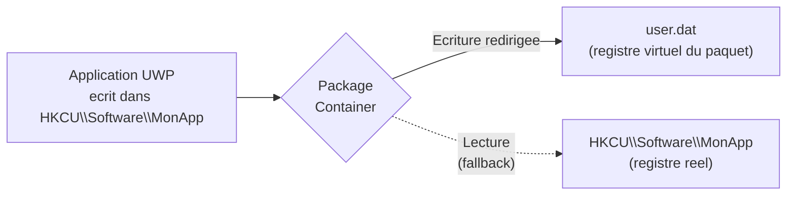
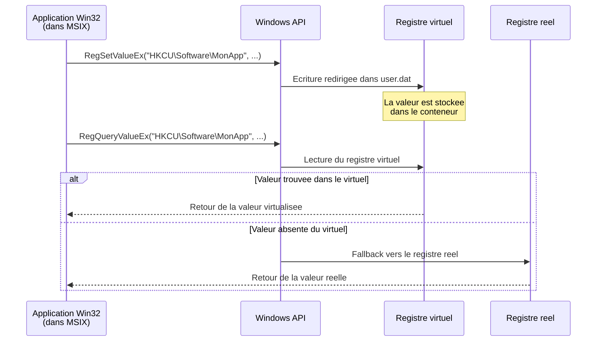

---
tags:
  - registre
  - UWP
  - MSIX
  - applications modernes
---

# Applications modernes

!!! abstract "Ce que vous allez apprendre"
    - Comment les applications UWP interagissent avec le registre
    - Le mecanisme de virtualisation du registre par paquet
    - Le fonctionnement du packaging MSIX et son `registry.dat`
    - Comment WinGet et le Microsoft Store inscrivent les applications
    - Les gestionnaires de protocole URI pour les apps modernes
    - Les cles de sideloading et du mode developpeur
    - Le depannage des applications modernes via le registre

---

## Le modele UWP et l'identite de paquet

Les applications classiques Win32 ecrivent directement dans le registre global. Les applications UWP (*Universal Windows Platform*) fonctionnent autrement : chaque application vit dans une **bulle isolee** appelee *package container*.

Pensez a un immeuble d'appartements. Un programme Win32, c'est un locataire qui a les cles de toutes les pieces communes. Une application UWP, c'est un locataire qui ne peut acceder qu'a **son propre appartement**.

### Package Identity

Chaque application moderne possede une **identite de paquet** composee de plusieurs elements :

| Element | Description | Exemple |
|---------|-------------|---------|
| `Name` | Nom du paquet | `Microsoft.WindowsCalculator` |
| `Publisher` | Editeur signe | `CN=Microsoft Corporation, O=Microsoft...` |
| `Version` | Version semver etendue | `11.2210.0.0` |
| `ProcessorArchitecture` | Architecture cible | `x64` |
| `ResourceId` | Identifiant de ressource (optionnel) | `~` |

L'identite complete genere un **PackageFamilyName** :

```
Microsoft.WindowsCalculator_8wekyb3d8bbwe
```

Le suffixe `8wekyb3d8bbwe` est un hash du certificat de l'editeur. Il garantit l'unicite du paquet.

!!! info "Ou trouver le PackageFamilyName"
    ```powershell
    # List all installed modern apps with their package family names
    Get-AppxPackage | Select-Object Name, PackageFamilyName | Format-Table -AutoSize
    ```

    ```title="Resultat attendu"
    Name                                   PackageFamilyName
    ----                                   -----------------
    Microsoft.WindowsCalculator            Microsoft.WindowsCalculator_8wekyb3d8bbwe
    Microsoft.WindowsStore                 Microsoft.WindowsStore_8wekyb3d8bbwe
    Microsoft.WindowsTerminal              Microsoft.WindowsTerminal_8wekyb3d8bbwe
    ```

---

### AppxManifest et capacites restreintes

Le fichier `AppxManifest.xml` declare tout ce qu'une application a le droit de faire. C'est son **contrat de bail** avec Windows.

Les capacites liees au registre sont strictement controlees :

| Capacite | Effet | Restriction |
|----------|-------|-------------|
| `runFullTrust` | Acces complet au systeme (comme Win32) | Reservee au Desktop Bridge |
| `packagedServices` | Enregistrer un service Windows | Necessite approbation Microsoft |
| `customInstallActions` | Actions d'installation personnalisees | Reservee aux paquets MSIX signes |
| `unvirtualizedResources` | Desactiver la virtualisation du registre | Capacite restreinte, approbation requise |

!!! warning "Capacites restreintes"
    Les capacites prefixees par `rescap:` dans le manifeste necessitent une **approbation explicite** de Microsoft pour etre publiees sur le Store. En sideloading, elles fonctionnent sans restriction.

```xml
<!-- Extract from an AppxManifest.xml showing restricted capabilities -->
<Package xmlns:rescap="http://schemas.microsoft.com/appx/manifest/foundation/windows10/restrictedcapabilities">
  <Capabilities>
    <Capability Name="internetClient" />
    <rescap:Capability Name="runFullTrust" />
    <rescap:Capability Name="unvirtualizedResources" />
  </Capabilities>
</Package>
```

!!! info "En resume"
    - Chaque application UWP possede une identite de paquet unique composee du nom, de l'editeur, de la version et de l'architecture
    - Le `PackageFamilyName` (nom + hash du certificat) identifie de maniere unique chaque application dans le systeme
    - Le fichier `AppxManifest.xml` declare les capacites autorisees ; les capacites restreintes (`rescap:`) necessitent une approbation Microsoft pour le Store

---

## Virtualisation du registre par application

### Le principe

Quand une application UWP ecrit dans `HKCU\Software`, l'ecriture **n'atteint pas** la ruche reelle. Windows redirige l'operation vers un espace prive, le **virtual registry** du paquet.



L'application peut **lire** le registre reel en fallback, mais ses **ecritures** restent confinee dans sa bulle.

### Ou se trouve le registre virtuel

Le fichier `user.dat` est stocke dans le dossier d'etat du paquet :

```
%LOCALAPPDATA%\Packages\<PackageFamilyName>\SystemAppData\Helium\user.dat
```

!!! example "Localiser le registre virtuel de la Calculatrice"
    ```powershell
    # Build the path to the virtual registry hive
    $pkg = Get-AppxPackage Microsoft.WindowsCalculator
    $userDat = "$env:LOCALAPPDATA\Packages\$($pkg.PackageFamilyName)\SystemAppData\Helium\user.dat"
    Test-Path $userDat
    ```

    ```title="Resultat attendu"
    True
    ```

### Charger le registre virtuel dans Regedit

Pour inspecter le contenu de ce `user.dat`, on peut le monter manuellement :

```powershell
# Load the virtual registry hive into Regedit under a temporary key
reg load "HKLM\TEMP_UWP_CALC" "$env:LOCALAPPDATA\Packages\Microsoft.WindowsCalculator_8wekyb3d8bbwe\SystemAppData\Helium\user.dat"
```

```title="Resultat attendu"
The operation completed successfully.
```

!!! danger "N'oubliez pas de demonter"
    Apres inspection, demontez toujours la ruche :

    ```powershell
    reg unload "HKLM\TEMP_UWP_CALC"
    ```

    Laisser une ruche montee peut bloquer les mises a jour de l'application.

!!! info "En resume"
    - Les ecritures d'une application UWP dans `HKCU\Software` sont redirigees vers un fichier `user.dat` prive dans le dossier du paquet
    - L'application peut lire le registre reel en fallback, mais ses ecritures restent confinee dans sa bulle
    - Le `user.dat` peut etre monte temporairement dans Regedit via `reg load` pour inspection

---

## MSIX : le packaging moderne

### Qu'est-ce que MSIX

MSIX est le format de packaging qui remplace MSI et AppX. Il combine les avantages des deux :

| Caracteristique | MSI | AppX | MSIX |
|-----------------|:---:|:----:|:----:|
| Installation propre | Partielle | Oui | Oui |
| Desinstallation complete | Non garantie | Oui | Oui |
| Applications Win32 | Oui | Non | Oui |
| Applications UWP | Non | Oui | Oui |
| Virtualisation du registre | Non | Oui | Oui |
| Signature obligatoire | Non | Oui | Oui |

### registry.dat dans les paquets MSIX

Un paquet MSIX contient un fichier `registry.dat` qui decrit les entrees de registre necessaires a l'application. A l'installation, Windows **fusionne** ce fichier dans l'espace virtualise du paquet.

```
MonApplication.msix
├── AppxManifest.xml
├── registry.dat          ← entrees de registre pre-configurees
├── VFS/                  ← systeme de fichiers virtuel
│   ├── ProgramFilesX64/
│   └── Windows/
└── MonApp.exe
```

!!! info "Fusion, pas ecriture directe"
    Le `registry.dat` ne modifie jamais le registre global. Ses entrees sont visibles **uniquement** par l'application elle-meme, grace au mecanisme de fusion (*merge*) du container.

### Inspecter le registry.dat d'un paquet MSIX

L'outil `MSIX Packaging Tool` de Microsoft permet d'examiner le contenu :

```powershell
# Extract MSIX to a folder for inspection
# Requires the MSIX Packaging Tool or a simple rename to .zip
Copy-Item "MonApp.msix" "MonApp.zip"
Expand-Archive "MonApp.zip" -DestinationPath "MonApp_extracted"

# Load the registry.dat for inspection
reg load "HKLM\TEMP_MSIX" "MonApp_extracted\registry.dat"
```

```title="Resultat attendu"
The operation completed successfully.
```

Sortie typique dans Regedit sous `HKLM\TEMP_MSIX` :

```
HKLM\TEMP_MSIX
└── REGISTRY
    ├── MACHINE
    │   └── SOFTWARE
    │       └── MonApp
    │           └── Settings
    └── USER
        └── .DEFAULT
            └── Software
                └── MonApp
                    └── Preferences
```

!!! info "En resume"
    - MSIX remplace MSI et AppX en combinant installation propre, desinstallation complete et virtualisation du registre
    - Chaque paquet MSIX contient un `registry.dat` dont les entrees sont fusionnees dans l'espace virtualise, sans toucher au registre global
    - Le contenu du `registry.dat` peut etre inspecte en le montant temporairement via `reg load`

---

## Desktop Bridge (Centennial)

Le Desktop Bridge permet d'emballer des applications Win32 classiques dans un conteneur MSIX. L'application pense ecrire dans le registre global, mais Windows intercepte et redirige.

### Comment la redirection fonctionne



### Cles non virtualisees

Certaines cles ne sont **jamais** virtualisees, meme dans un conteneur MSIX :

- `HKLM\SYSTEM` -- configuration du noyau
- `HKLM\SAM` -- base de comptes locaux
- `HKLM\SECURITY` -- politiques de securite
- Les cles de pilotes dans `HKLM\SYSTEM\CurrentControlSet\Services`

!!! tip "Identifier les ecritures redirigees avec Process Monitor"
    Filtrez Process Monitor sur le processus de l'application MSIX. Les operations redirigees affichent le chemin virtuel dans la colonne **Path** et mentionnent `Virtualized` dans la colonne **Detail**.

!!! info "En resume"
    - Le Desktop Bridge emballe des applications Win32 dans un conteneur MSIX, interceptant et redirigeant leurs ecritures de registre
    - Les lectures suivent un mecanisme de fallback : d'abord le registre virtuel, puis le registre reel si la valeur n'existe pas dans le virtuel
    - Les cles systeme critiques (`HKLM\SYSTEM`, `SAM`, `SECURITY`) ne sont jamais virtualisees

---

## WinGet et la detection des applications

WinGet, le gestionnaire de paquets en ligne de commande de Microsoft, detecte les applications installees en scannant le registre.

### Cles d'installation scannees

WinGet consulte ces emplacements pour determiner ce qui est deja installe :

| Emplacement | Contenu |
|-------------|---------|
| `HKLM\SOFTWARE\Microsoft\Windows\CurrentVersion\Uninstall` | Applications 64 bits (machine) |
| `HKLM\SOFTWARE\WOW6432Node\Microsoft\Windows\CurrentVersion\Uninstall` | Applications 32 bits (machine) |
| `HKCU\SOFTWARE\Microsoft\Windows\CurrentVersion\Uninstall` | Applications utilisateur |

Pour chaque sous-cle, WinGet compare les champs suivants :

| Valeur | Role dans la detection |
|--------|----------------------|
| `DisplayName` | Correspondance avec le nom du paquet WinGet |
| `DisplayVersion` | Comparaison de version pour les mises a jour |
| `Publisher` | Verification de l'editeur |
| `UninstallString` | Commande de desinstallation |
| `QuietUninstallString` | Desinstallation silencieuse |

!!! example "Verifier comment WinGet voit une application"
    ```powershell
    # Show how WinGet identifies an installed app
    winget list --name "Visual Studio Code"
    ```

    ```title="Resultat attendu"
    Name                  Id                          Version   Source
    ---------------------------------------------------------------------------
    Microsoft Visual St…  Microsoft.VisualStudioCode  1.87.0    winget
    ```

    ```powershell
    # The corresponding registry entry
    reg query "HKLM\SOFTWARE\Microsoft\Windows\CurrentVersion\Uninstall\{EA457B21-F73E-494C-ACAB-524FDE069978}_is1" /v DisplayVersion
    ```

    ```title="Resultat attendu"
    HKEY_LOCAL_MACHINE\SOFTWARE\Microsoft\Windows\CurrentVersion\Uninstall\{EA457B21-F73E-494C-ACAB-524FDE069978}_is1
        DisplayVersion    REG_SZ    1.87.0
    ```

!!! info "En resume"
    - WinGet detecte les applications installees en scannant trois cles `Uninstall` du registre (64 bits, 32 bits et utilisateur)
    - La correspondance entre WinGet et le registre repose sur `DisplayName`, `DisplayVersion` et `Publisher`
    - Les valeurs `UninstallString` et `QuietUninstallString` fournissent les commandes de desinstallation

---

## Enregistrement des applications du Microsoft Store

### Etat du paquet dans le registre

Les applications du Store sont enregistrees dans une arborescence specifique :

```
HKCU\Software\Classes\Local Settings\Software\Microsoft\Windows\CurrentVersion\AppModel
```

Sous cette cle, plusieurs sous-cles gerent l'etat des paquets :

| Sous-cle | Role |
|----------|------|
| `PackageRepository\Packages` | Liste de tous les paquets installes |
| `Repository\Families` | Index par famille de paquets |
| `StateRepository` | Base de donnees d'etat des applications |
| `PolicyCache` | Cache des politiques de deploiement |

!!! example "Lister les paquets enregistres"
    ```powershell
    # Count registered package entries
    $path = "HKCU:\Software\Classes\Local Settings\Software\Microsoft\Windows\CurrentVersion\AppModel\PackageRepository\Packages"
    (Get-ChildItem -Path $path -ErrorAction SilentlyContinue).Count
    ```

    ```title="Resultat attendu"
    147
    ```

### Activation de paquet

Quand vous lancez une application moderne, Windows effectue une **activation** qui consulte le registre pour :

1. Localiser le manifeste du paquet
2. Verifier l'integrite de la signature
3. Charger le registre virtuel (`user.dat`)
4. Preparer le conteneur d'execution
5. Lancer le processus avec le token d'identite de paquet

L'activation est geree par le service **AppX Deployment Service** (`AppXSvc`).

```powershell
# Check the AppX Deployment Service status
Get-Service AppXSvc | Select-Object Name, Status, StartType
```

```title="Resultat attendu"
Name    Status  StartType
----    ------  ---------
AppXSvc Running    Manual
```

!!! info "En resume"
    - Les applications du Store sont enregistrees sous `HKCU\...\AppModel` avec des sous-cles pour les paquets, les familles et le depot d'etat
    - Le lancement d'une application moderne declenche une activation en cinq etapes (manifeste, signature, registre virtuel, conteneur, token)
    - Le service `AppXSvc` (AppX Deployment Service) orchestre l'ensemble du processus d'activation

---

## Gestionnaires de protocole URI

Les applications modernes peuvent s'enregistrer pour gerer des protocoles URI personnalises (comme `ms-settings:`, `mailto:`, `microsoft-edge:`).

### Ou sont enregistres les protocoles

```
HKCR\<protocol-name>
├── (Default) = "URL:<protocol description>"
├── URL Protocol = ""
└── shell
    └── open
        └── command
            └── (Default) = "<command line>"
```

Pour les applications modernes, le mecanisme est different. L'enregistrement passe par le manifeste et le registre stocke la reference au paquet :

```
HKCU\Software\Classes\<protocol-name>
└── Application
    └── AppUserModelId = "<PackageFamilyName>!<ApplicationId>"
```

!!! example "Trouver le gestionnaire du protocole ms-settings"
    ```powershell
    # Find which app handles the ms-settings protocol
    reg query "HKCR\ms-settings\shell\open\command" /ve
    ```

    ```title="Resultat attendu"
    HKEY_CLASSES_ROOT\ms-settings\shell\open\command
        (Default)    REG_SZ    "C:\Windows\System32\cmd.exe" /c start ms-settings:
    ```

    Pour les applications modernes, le systeme utilise plutot l'activation par identite de paquet, resolue par le **Shell Execution Manager**.

!!! info "En resume"
    - Les protocoles URI classiques sont enregistres sous `HKCR\<protocol-name>\shell\open\command`
    - Les applications modernes utilisent un enregistrement different, base sur le `AppUserModelId` du paquet
    - Le *Shell Execution Manager* resout l'activation par identite de paquet pour les protocoles des apps modernes

---

## Progressive Web Apps (PWA)

Les PWA installees via un navigateur Chromium (Edge, Chrome) sont enregistrees dans le registre comme des applications classiques.

### Enregistrement d'une PWA dans le registre

Quand vous installez une PWA, le navigateur cree une entree dans :

```
HKCU\SOFTWARE\Microsoft\Windows\CurrentVersion\Uninstall\<PWA-ID>
```

| Valeur | Contenu typique |
|--------|----------------|
| `DisplayName` | Nom de la PWA |
| `DisplayIcon` | Chemin vers l'icone |
| `UninstallString` | Commande de desinstallation (via le navigateur) |
| `InstallLocation` | Dossier de profil du navigateur |
| `NoModify` | `1` (pas de modification possible) |
| `NoRepair` | `1` (pas de reparation possible) |

!!! example "Trouver une PWA installee"
    ```powershell
    # Search for PWA entries in the uninstall registry
    Get-ChildItem "HKCU:\SOFTWARE\Microsoft\Windows\CurrentVersion\Uninstall" |
        Get-ItemProperty |
        Where-Object { $_.UninstallString -match "web-app" -or $_.UninstallString -match "--app-id" } |
        Select-Object DisplayName, UninstallString |
        Format-Table -AutoSize
    ```

    ```title="Resultat attendu"
    DisplayName     UninstallString
    -----------     ---------------
    Twitter         "C:\Program Files\Google\Chrome\Application\chrome.exe" --uninstall-app-id=jgeocpdicgm...
    Outlook (PWA)   "C:\Program Files (x86)\Microsoft\Edge\Application\msedge.exe" --uninstall-app-id=bjhm...
    ```

!!! info "En resume"
    - Les PWA installees via un navigateur Chromium sont enregistrees dans le registre sous `HKCU\...\Uninstall` comme des applications classiques
    - Leur `UninstallString` pointe vers le navigateur avec un parametre `--uninstall-app-id`
    - On peut les identifier en filtrant les entrees dont la commande de desinstallation contient `web-app` ou `--app-id`

---

## Sideloading et mode developpeur

### Activer le mode developpeur

Le mode developpeur permet d'installer des applications non signees par le Store. Il est controle par cette cle :

```
HKLM\SOFTWARE\Microsoft\Windows\CurrentVersion\AppModelUnlock
```

| Valeur | Type | Donnees | Effet |
|--------|:----:|:-------:|-------|
| `AllowAllTrustedApps` | REG_DWORD | `1` | Active le sideloading |
| `AllowDevelopmentWithoutDevLicense` | REG_DWORD | `1` | Active le mode developpeur complet |

!!! example "Verifier l'etat du mode developpeur"
    ```powershell
    reg query "HKLM\SOFTWARE\Microsoft\Windows\CurrentVersion\AppModelUnlock"
    ```

    ```title="Resultat attendu"
    HKEY_LOCAL_MACHINE\SOFTWARE\Microsoft\Windows\CurrentVersion\AppModelUnlock
        AllowAllTrustedApps                REG_DWORD    0x1
        AllowDevelopmentWithoutDevLicense   REG_DWORD    0x1
    ```

!!! warning "Securite"
    Activer le mode developpeur sur un poste de production est un risque de securite. Des applications non verifiees peuvent etre installees sans avertissement. Reservez ce parametre aux machines de developpement.

### Device Portal

Le mode developpeur active egalement le **Windows Device Portal**, un serveur web local permettant de gerer l'appareil a distance :

```
HKLM\SOFTWARE\Microsoft\Windows\CurrentVersion\WebManagement\Service
```

| Valeur | Type | Donnees | Effet |
|--------|:----:|:-------:|-------|
| `HttpPort` | REG_DWORD | `50080` | Port HTTP du portail |
| `HttpsPort` | REG_DWORD | `50443` | Port HTTPS du portail |
| `IsEnabled` | REG_DWORD | `1` | Active le Device Portal |

!!! info "En resume"
    - Le sideloading et le mode developpeur sont controles par la cle `AppModelUnlock` avec deux valeurs distinctes
    - `AllowAllTrustedApps` active le sideloading ; `AllowDevelopmentWithoutDevLicense` active le mode developpeur complet
    - Le mode developpeur active egalement le Windows Device Portal, configurable sous `WebManagement\Service`

---

## Depannage des applications modernes

### Probleme : une application refuse de se lancer

**Etape 1** -- Verifier l'enregistrement du paquet :

```powershell
# Re-register a specific app
$app = Get-AppxPackage Microsoft.WindowsCalculator
Add-AppxPackage -Register "$($app.InstallLocation)\AppxManifest.xml" -DisableDevelopmentMode
```

```title="Resultat attendu"
Aucune sortie si la commande reussit.
```

**Etape 2** -- Verifier les cles d'activation :

```powershell
# Check if the app's package state is healthy
Get-AppxPackage Microsoft.WindowsCalculator | Select-Object Status, SignatureKind
```

```title="Resultat attendu"
Status SignatureKind
------ -------------
    Ok        Store
```

Si le statut affiche `Modified` ou `Tampered`, le paquet est corrompu.

### Probleme : erreur 0x80073CF9 a l'installation

Cette erreur indique un conflit dans le registre de paquets. Solution :

```powershell
# Clear the package repository cache
Stop-Service AppXSvc -Force
Remove-Item "$env:ProgramData\Microsoft\Windows\AppRepository\StateRepository-*" -Force
Start-Service AppXSvc
```

```title="Resultat attendu"
Aucune sortie si la commande reussit.
```

!!! danger "Manipulation risquee"
    La suppression du cache StateRepository peut necessiter la reinstallation de certaines applications. Creez un point de restauration avant.

### Probleme : les associations de fichiers ne fonctionnent pas

Les applications modernes enregistrent leurs associations dans :

```
HKCU\Software\Classes\Local Settings\Software\Microsoft\Windows\CurrentVersion\AppModel\Repository\Packages\<PackageFamilyName>\<PackageFullName>\App\Capabilities\FileAssociations
```

Pour reinitialiser les associations :

```powershell
# Reset file associations for a specific app
Get-AppxPackage *Photos* | ForEach-Object {
    Add-AppxPackage -Register "$($_.InstallLocation)\AppxManifest.xml" -DisableDevelopmentMode
}
```

```title="Resultat attendu"
Aucune sortie si la commande reussit.
```

### Reset complet d'une application

Si rien ne fonctionne, le reset supprime toutes les donnees locales de l'application, y compris son registre virtuel :

```powershell
# Full reset of an app (erases all app data)
Get-AppxPackage Microsoft.WindowsCalculator | Reset-AppxPackage
```

```title="Resultat attendu"
Aucune sortie si la commande reussit.
```

!!! tip "Equivalent graphique"
    Parametres > Applications > Applications installees > Cliquez sur l'application > Options avancees > Reinitialiser.

!!! info "En resume"
    - Le re-enregistrement du paquet (`Add-AppxPackage -Register`) et la verification du statut (`Status = Ok`) sont les premieres etapes de diagnostic
    - L'erreur 0x80073CF9 indique un conflit dans le depot de paquets, resoluble en vidant le cache `StateRepository`
    - En dernier recours, `Reset-AppxPackage` supprime toutes les donnees locales de l'application, y compris son registre virtuel

---

## Diagnostics avec Process Monitor

Pour comprendre exactement ce qu'une application moderne fait dans le registre, Process Monitor est l'outil ideal.

### Filtres recommandes

| Colonne | Relation | Valeur | Action |
|---------|----------|--------|--------|
| `Process Name` | is | `Calculator.exe` | Include |
| `Operation` | begins with | `Reg` | Include |
| `Path` | contains | `Helium` | Include |

Avec ces filtres, vous verrez toutes les operations de registre de l'application, y compris les redirections vers le registre virtuel.

!!! info "Les operations virtualisees"
    Dans la colonne **Detail**, les operations redirigees affichent `Desired Access: ...` avec le chemin reel dans le `user.dat` du paquet. La colonne **Path** montre le chemin **tel que l'application le voit**.

!!! info "En resume"
    - Process Monitor avec des filtres sur le nom de processus, les operations `Reg*` et le chemin `Helium` permet de tracer toutes les operations de registre d'une app moderne
    - Les operations virtualisees affichent le chemin reel dans le `user.dat` dans la colonne Detail
    - La colonne Path montre le chemin tel que l'application le percoit, pas l'emplacement physique reel

---

!!! info "En resume"
    - Les applications UWP et MSIX vivent dans un **conteneur isole** avec leur propre registre virtuel
    - Le fichier `user.dat` dans le dossier du paquet contient les ecritures redirigees
    - MSIX embarque un `registry.dat` fusionne a l'installation sans toucher au registre global
    - WinGet detecte les applications en scannant les cles `Uninstall` du registre
    - Le mode developpeur et le sideloading sont controles par `AppModelUnlock`
    - En cas de probleme, le re-enregistrement ou le reset de l'application resout la plupart des cas
    - Process Monitor reste l'outil de diagnostic ultime pour tracer les operations de registre virtualisees
