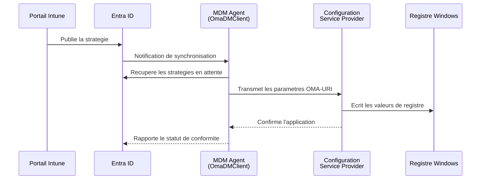
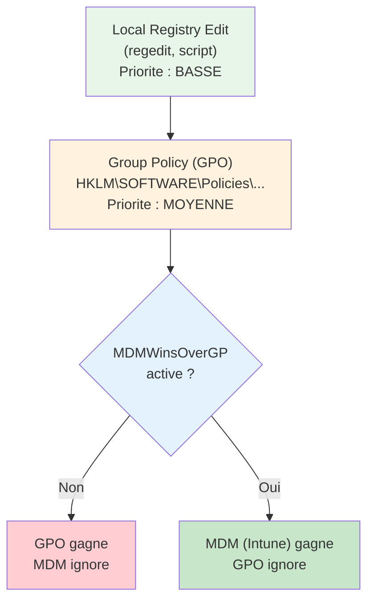
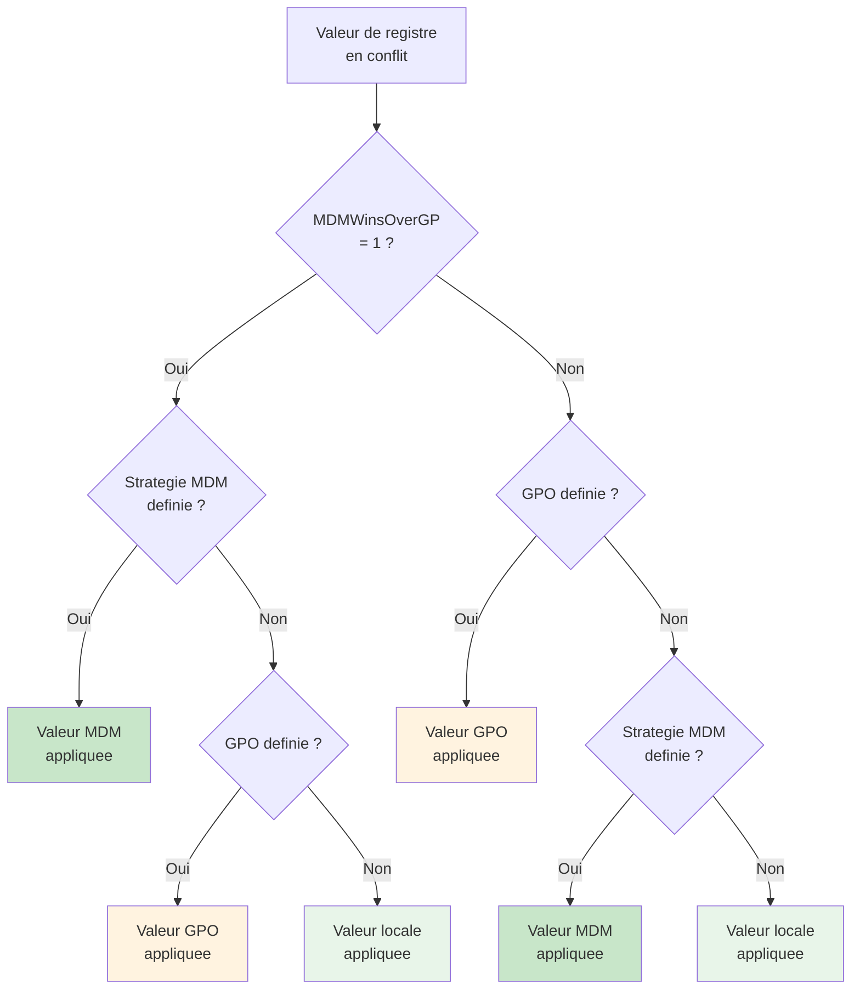

---
tags:
  - registre
  - entreprise
  - Intune
  - cloud
---

# Gestion d'entreprise et cloud

## Ce que vous allez apprendre

- Le chemin complet qu'emprunte une strategie Intune pour atteindre le registre : MDM Agent, CSP, PolicyManager
- Comment creer un profil OMA-URI personnalise et retrouver ses traces dans le registre
- Les cles de registre qui revelent le type de jonction Entra ID (Azure AD Join, Hybrid Join, Registered)
- L'anatomie des cles SCCM/ConfigMgr et les methodes de detection basees sur le registre
- Le role du registre pendant le provisionnement Autopilot et l'Enrollment Status Page
- L'utilisation de PowerShell DSC, Ansible, Chef et Puppet pour gerer le registre a grande echelle
- La resolution des conflits quand GPO, MDM et configuration locale modifient la meme valeur
- Les cles de telemetrie et de conformite alignees sur les benchmarks CIS et les STIG
- Le diagnostic complet d'un poste d'entreprise connecte au cloud

---

## Le registre, point de convergence de l'entreprise moderne

Ouvrez une invite PowerShell en tant qu'administrateur et executez :

```powershell
# Show all MDM policy sources currently writing to the registry
Get-ChildItem "HKLM:\SOFTWARE\Microsoft\PolicyManager\Providers" -ErrorAction SilentlyContinue |
    ForEach-Object { [PSCustomObject]@{
        Provider = $_.PSChildName
        Policies = (Get-ChildItem $_.PSPath -Recurse -ErrorAction SilentlyContinue).Count
    }} | Format-Table -AutoSize
```

```title="Resultat attendu"
Provider                               Policies
--------                               --------
{B1E4B625-1B5C-4113-B1D0-A8D7D2B5ACE7}    47
{D4073CA3-7CFE-4B55-B73D-F1EC21062289}    12
```

Chaque GUID represente une **source de configuration** -- Intune, une GPO convertie, ou un profil local. Tout converge vers le meme endroit : le registre Windows.

!!! tip "Analogie"
    Le registre dans un environnement d'entreprise cloud fonctionne comme le **tableau de bord d'un aeroport**. Plusieurs compagnies (Intune, GPO, SCCM) envoient des instructions de vol (des strategies). Le tableau de bord (le registre) affiche l'etat final. Quand deux compagnies revendiquent la meme porte d'embarquement, des regles de priorite tranchent.

!!! info "En resume"
    - Le registre est le point de convergence de toutes les sources de configuration en entreprise : Intune, GPO, SCCM, outils tiers
    - Chaque source est identifiable par un GUID dans PolicyManager\Providers
    - Des regles de priorite determinent quelle source prevaut quand plusieurs ecrivent la meme valeur

---

## Microsoft Intune et le registre

### Le chemin d'une strategie : de la console au registre

Quand un administrateur configure une strategie dans le portail Intune, la valeur ne tombe pas directement dans le registre. Elle traverse une chaine de composants :



Le **MDM Agent** (`OmaDMClient.exe`) est le moteur local. Il communique avec Entra ID via HTTPS, recupere les strategies et les confie aux **Configuration Service Providers** (CSP). Chaque CSP gere un domaine fonctionnel precis : `Policy`, `WiFi`, `VPN`, `BitLocker`, etc.

### OMA-URI et Configuration Service Providers

Le protocole **OMA-DM** (Open Mobile Alliance Device Management) est la norme utilisee par Windows pour recevoir des instructions MDM. Chaque parametre est adresse par un **OMA-URI** -- un chemin hierarchique qui pointe vers un noeud CSP.

Exemple d'OMA-URI pour desactiver Cortana :

```
./Device/Vendor/MSFT/Policy/Config/Experience/AllowCortana
```

Decomposition :

| Segment | Signification |
|---------|---------------|
| `./Device` | Cible la machine (et non l'utilisateur) |
| `Vendor/MSFT` | Espace de noms Microsoft |
| `Policy/Config` | CSP Policy, branche de configuration |
| `Experience` | Zone de strategie (area) |
| `AllowCortana` | Nom du parametre |

Le CSP **Policy** est le plus utilise. Il traduit les OMA-URI en ecritures de registre sous des chemins previsibles.

### Policy CSP : le pont vers le registre

Quand le CSP Policy recoit une instruction, il ecrit la valeur dans **deux emplacements** :

```
HKLM\SOFTWARE\Microsoft\PolicyManager\current\device\<Area>\<PolicyName>
HKLM\SOFTWARE\Microsoft\PolicyManager\Providers\{GUID}\default\Device\<Area>\<PolicyName>
```

Le premier chemin (`current`) represente l'**etat actif** -- la valeur effectivement appliquee. Le second chemin (`Providers\{GUID}`) garde la trace de **qui** a defini cette valeur.

```powershell
# Examine the active MDM policy for a specific area
Get-ItemProperty "HKLM:\SOFTWARE\Microsoft\PolicyManager\current\device\Experience" -ErrorAction SilentlyContinue
```

```title="Resultat attendu"
AllowCortana          : 0
AllowTailoredExperiences : 0
AllowThirdPartySuggestionsInWindowsSpotlight : 0
PSPath                : Microsoft.PowerShell.Core\Registry::...
```

!!! info "ADMX-backed policies"
    Certaines strategies Intune sont basees sur des modeles ADMX. Elles sont stockees sous un emplacement specifique :

    ```
    HKLM\SOFTWARE\Microsoft\PolicyManager\AdmxDefault\{GUID}\<PolicyName>
    ```

    Ce chemin contient les **valeurs par defaut** du modele ADMX. La valeur effective reste dans `current\device`.

### Creer un profil OMA-URI personnalise

Certains parametres de registre n'ont pas de CSP dedie. Intune permet alors d'utiliser un profil **OMA-URI personnalise** pour ecrire directement dans le registre.

**Etape 1** -- Identifiez la cle et la valeur cibles :

```
HKLM\SOFTWARE\Policies\Microsoft\Windows\Explorer
ValueName: DisableSearchBoxSuggestions
Type: REG_DWORD
Data: 1
```

**Etape 2** -- Construisez l'OMA-URI correspondant. Pour les strategies ADMX ingerees :

```
./Device/Vendor/MSFT/Policy/Config/ADMX_Explorer/DisableSearchBoxSuggestions
```

Pour une ecriture directe via le CSP Registry (si disponible) :

```
./Device/Vendor/MSFT/Registry/HKLM/SOFTWARE/Policies/Microsoft/Windows/Explorer/DisableSearchBoxSuggestions
```

**Etape 3** -- Dans le portail Intune :

1. Naviguez vers **Devices > Configuration profiles > Create profile**
2. Selectionnez **Windows 10 and later**, puis **Templates > Custom**
3. Ajoutez un parametre OMA-URI :
    - **Name** : Disable Search Box Suggestions
    - **OMA-URI** : le chemin construit a l'etape 2
    - **Data type** : Integer
    - **Value** : 1

**Etape 4** -- Verifiez l'application sur le poste client :

```powershell
# Force an Intune sync and check the registry
Start-Process "ms-device-enrollment:?mode=mdm"
Start-Sleep -Seconds 30

# Verify the policy was written
Get-ItemProperty "HKLM:\SOFTWARE\Policies\Microsoft\Windows\Explorer" -Name "DisableSearchBoxSuggestions" -ErrorAction SilentlyContinue
```

```title="Resultat attendu"
DisableSearchBoxSuggestions : 1
PSPath                      : Microsoft.PowerShell.Core\Registry::HKEY_LOCAL_MACHINE\SOFTWARE\Policies\Microsoft\Windows\Explorer
PSParentPath                : Microsoft.PowerShell.Core\Registry::HKEY_LOCAL_MACHINE\SOFTWARE\Policies\Microsoft\Windows
PSChildName                 : Explorer
PSProvider                  : Microsoft.PowerShell.Core\Registry
```

### PolicyManager dans le registre

Les trois branches du PolicyManager meritent une exploration detaillee :

| Chemin | Role | Contenu typique |
|--------|------|-----------------|
| `HKLM\SOFTWARE\Microsoft\PolicyManager\current\device` | Etat actif des strategies appareil | Valeurs effectives appliquees |
| `HKLM\SOFTWARE\Microsoft\PolicyManager\current\user\{SID}` | Etat actif des strategies utilisateur | Valeurs par utilisateur |
| `HKLM\SOFTWARE\Microsoft\PolicyManager\Providers\{GUID}` | Source de chaque strategie | GUID du fournisseur (Intune, local, etc.) |
| `HKLM\SOFTWARE\Microsoft\PolicyManager\AdmxDefault` | Valeurs par defaut ADMX | Modeles charges par Intune |
| `HKLM\SOFTWARE\Microsoft\PolicyManager\AdmxInstalled` | Modeles ADMX installes | Liste des fichiers ADMX ingeres |

```powershell
# List all PolicyManager providers and their policy count
$providers = Get-ChildItem "HKLM:\SOFTWARE\Microsoft\PolicyManager\Providers" -ErrorAction SilentlyContinue
foreach ($provider in $providers) {
    $guid = $provider.PSChildName
    $count = (Get-ChildItem $provider.PSPath -Recurse -ErrorAction SilentlyContinue).Count
    Write-Output "Provider: $guid -> $count policies"
}
```

```title="Resultat attendu"
Provider: B1E4B625-1B5C-4113-B1D0-A8D7D2B5ACE7 -> 47 policies
Provider: D4073CA3-7CFE-4B55-B73D-F1EC21062289 -> 12 policies
Provider: 7C54C8A0-D2B0-4F3E-BE6C-2F0A5E848D90 -> 5 policies
```

### Scripts de remediation et registre

Les **scripts de remediation** (Remediations) dans Intune permettent de detecter et corriger des ecarts de configuration. Le schema classique est :

1. Un **script de detection** lit une valeur de registre
2. S'il detecte un ecart, il retourne un code de sortie non-zero
3. Un **script de remediation** corrige la valeur

```powershell
# Detection script: check if telemetry is set to minimum
$path = "HKLM:\SOFTWARE\Policies\Microsoft\Windows\DataCollection"
$expected = 1
$current = (Get-ItemProperty -Path $path -Name "AllowTelemetry" -ErrorAction SilentlyContinue).AllowTelemetry

if ($current -eq $expected) {
    Write-Output "Compliant: AllowTelemetry is $current"
    exit 0
} else {
    Write-Output "Non-compliant: AllowTelemetry is $current (expected $expected)"
    exit 1
}
```

```title="Resultat attendu"
Compliant: AllowTelemetry is 1
```

```powershell
# Remediation script: set telemetry to minimum
$path = "HKLM:\SOFTWARE\Policies\Microsoft\Windows\DataCollection"
try {
    Set-ItemProperty -Path $path -Name "AllowTelemetry" -Value 1 -Type DWord -Force
    Write-Output "Remediated: AllowTelemetry set to 1"
    exit 0
} catch {
    Write-Output "Failed to remediate: $_"
    exit 1
}
```

```title="Resultat attendu"
Remediated: AllowTelemetry set to 1
```

!!! warning "Execution context"
    Les scripts de remediation s'executent par defaut en tant que **SYSTEM**. Ils ont un acces complet a `HKLM` mais pas a `HKCU` d'un utilisateur specifique. Pour modifier `HKCU`, configurez le script pour s'executer dans le **contexte utilisateur** dans le portail Intune.

!!! info "En resume"
    - Une strategie Intune traverse la chaine MDM Agent → CSP → registre ; le CSP Policy ecrit dans PolicyManager\current et PolicyManager\Providers
    - Les profils OMA-URI personnalises permettent d'ecrire des valeurs de registre non couvertes par les CSP natifs
    - Les scripts de remediation detectent et corrigent les ecarts de configuration en s'executant par defaut sous le compte SYSTEM

---

## Entra ID (Azure AD) et le registre

### Types de jonction

Un poste Windows peut etre connecte a Entra ID de trois manieres :

| Type de jonction | Scenario | Gestion MDM | Acces conditionnel |
|-----------------|----------|:-----------:|:------------------:|
| **Azure AD Join** | Poste cloud-only, pas de domaine AD | Oui | Oui |
| **Hybrid Azure AD Join** | Poste joint au domaine AD et synchronise avec Entra ID | Oui | Oui |
| **Azure AD Registered** | Appareil personnel (BYOD) | Optionnel | Limite |

Chaque type laisse des **empreintes specifiques** dans le registre.

### Cles de registre par type de jonction

#### Azure AD Join et Hybrid Join

```
HKLM\SYSTEM\CurrentControlSet\Control\CloudDomainJoin\JoinInfo
```

Cette cle contient une sous-cle nommee par le **TenantId** (GUID du locataire Entra ID) :

```powershell
# Display Entra ID join information from the registry
Get-ChildItem "HKLM:\SYSTEM\CurrentControlSet\Control\CloudDomainJoin\JoinInfo" -ErrorAction SilentlyContinue |
    ForEach-Object {
        $props = Get-ItemProperty $_.PSPath
        [PSCustomObject]@{
            TenantId   = $_.PSChildName
            UserEmail  = $props.UserEmail
            TenantName = $props.TenantName
            JoinType   = $props.JoinType
            ThumbPrint = $props.CertThumbprint
        }
    } | Format-List
```

```title="Resultat attendu"
TenantId   : a1b2c3d4-e5f6-7890-abcd-ef1234567890
UserEmail  : admin@contoso.com
TenantName : Contoso
JoinType   : 6
ThumbPrint : 1A2B3C4D5E6F7A8B9C0D1E2F3A4B5C6D7E8F9A0B
```

Les valeurs de `JoinType` :

| JoinType | Signification |
|:--------:|--------------|
| `6` | Azure AD Join |
| `4` | Hybrid Azure AD Join |
| `13` | Azure AD Registered (Workplace Join) |

#### Identity Store

```
HKLM\SOFTWARE\Microsoft\IdentityStore\Cache\{GUID}\IdentityCache\{GUID2}
```

Ce chemin stocke les informations d'identite mises en cache localement. On y trouve le nom de l'utilisateur, son UPN et son identifiant Entra ID.

#### CDJ (Cloud Domain Join)

```
HKLM\SOFTWARE\Microsoft\Windows\CurrentVersion\CDJ\AAD
```

Cette branche contient des metadonnees supplementaires sur la jonction, notamment le certificat de l'appareil et les endpoints de decouverte.

```powershell
# Read the CDJ AAD metadata
Get-ItemProperty "HKLM:\SOFTWARE\Microsoft\Windows\CurrentVersion\CDJ\AAD" -ErrorAction SilentlyContinue |
    Select-Object TenantId, TenantName
```

```title="Resultat attendu"
TenantId                             TenantName
--------                             ----------
a1b2c3d4-e5f6-7890-abcd-ef1234567890 Contoso
```

### Determiner le type de jonction a partir du registre seul

Sans executer `dsregcmd /status`, il est possible de determiner l'etat de jonction en examinant le registre :

```powershell
# Determine Entra ID join status from registry only
function Get-JoinStatusFromRegistry {
    $result = [PSCustomObject]@{
        AzureADJoined    = $false
        HybridJoined     = $false
        WorkplaceJoined  = $false
        TenantId         = $null
        DomainJoined     = $false
    }

    # Check CloudDomainJoin
    $joinInfo = Get-ChildItem "HKLM:\SYSTEM\CurrentControlSet\Control\CloudDomainJoin\JoinInfo" -ErrorAction SilentlyContinue
    if ($joinInfo) {
        $props = Get-ItemProperty $joinInfo[0].PSPath
        $result.TenantId = $joinInfo[0].PSChildName

        switch ($props.JoinType) {
            6  { $result.AzureADJoined = $true }
            4  { $result.HybridJoined = $true }
            13 { $result.WorkplaceJoined = $true }
        }
    }

    # Check traditional domain join
    $domainKey = Get-ItemProperty "HKLM:\SYSTEM\CurrentControlSet\Services\Tcpip\Parameters" -ErrorAction SilentlyContinue
    if ($domainKey.Domain -and $domainKey.Domain -ne "") {
        $result.DomainJoined = $true
    }

    return $result
}

Get-JoinStatusFromRegistry | Format-List
```

```title="Resultat attendu"
AzureADJoined   : True
HybridJoined    : False
WorkplaceJoined : False
TenantId        : a1b2c3d4-e5f6-7890-abcd-ef1234567890
DomainJoined    : True
```

### Hybrid Join : quand GPO et MDM coexistent

Dans un environnement Hybrid Join, le poste recoit des strategies **a la fois** des GPO Active Directory et d'Intune. Le registre porte les traces des deux sources :

- **GPO** ecrit sous `HKLM\SOFTWARE\Policies\...`
- **MDM** ecrit sous `HKLM\SOFTWARE\Microsoft\PolicyManager\current\device\...`

Le parametre qui determine la priorite en cas de conflit se trouve dans :

```
HKLM\SOFTWARE\Policies\Microsoft\Windows\CurrentVersion\MDM
```

| Valeur | Type | Donnees | Effet |
|--------|:----:|:-------:|-------|
| `DisableRegistration` | REG_DWORD | `0` | Permet l'inscription MDM automatique |
| `AutoEnrollMDM` | REG_DWORD | `1` | Active l'inscription automatique a Intune |

!!! note "Co-management avec SCCM"
    En co-gestion SCCM + Intune, des **workloads** specifiques sont bascules vers Intune. L'etat de chaque workload est suivi dans le registre sous les cles ConfigMgr (voir la section SCCM ci-dessous).

!!! info "En resume"
    - Le type de jonction Entra ID (Join, Hybrid, Registered) est identifiable dans le registre via CloudDomainJoin\JoinInfo et la valeur JoinType (6, 4 ou 13)
    - En Hybrid Join, les GPO ecrivent sous `HKLM\SOFTWARE\Policies` et MDM sous `PolicyManager\current\device`
    - La cle MDMWinsOverGP determine quelle source de configuration a priorite en cas de conflit

---

## SCCM / ConfigMgr et le registre

### Les cles du client Configuration Manager

Le client SCCM (Configuration Manager) est un agent riche qui laisse une empreinte substantielle dans le registre.

#### Cle principale du client

```
HKLM\SOFTWARE\Microsoft\CCM
```

| Valeur | Type | Description |
|--------|:----:|-------------|
| `TempDir` | REG_SZ | Repertoire temporaire du client |
| `LogDirectory` | REG_SZ | Emplacement des fichiers journaux |
| `HttpPort` | REG_DWORD | Port HTTP du Management Point |
| `HttpsPort` | REG_DWORD | Port HTTPS du Management Point |

#### Strategies (Policy)

```
HKLM\SOFTWARE\Microsoft\CCM\Policy
```

Les sous-cles `Machine\ActualConfig` et `Machine\RequestedConfig` contiennent l'ensemble des strategies recues. Chaque strategie est identifiee par un ID unique et contient sa date de reception, son corps et ses conditions d'evaluation.

```powershell
# List SCCM policy assignments
Get-ChildItem "HKLM:\SOFTWARE\Microsoft\CCM\Policy\Machine\ActualConfig" -ErrorAction SilentlyContinue |
    Select-Object PSChildName | Format-Table -AutoSize
```

```title="Resultat attendu"
PSChildName
-----------
CCM_Policy_Policy5.PolicyID="{c7f7da80-aa3f-4a9e-b82c-0e13f573d2e2}",PolicySource="SMS:PS1"...
CCM_Policy_Policy5.PolicyID="{f82ba86e-5d4a-4c6e-9a3b-1e8d6f0c2a47}",PolicySource="SMS:PS1"...
CCM_Policy_Policy5.PolicyID="{b19e4d3c-8a72-41f5-ae60-3c5d9b1e7f83}",PolicySource="SMS:PS1"...
```

#### Mobile Client (SMS)

```
HKLM\SOFTWARE\Microsoft\SMS\Mobile Client
```

| Valeur | Type | Description |
|--------|:----:|-------------|
| `ProductVersion` | REG_SZ | Version du client SCCM installee |
| `AssignedSiteCode` | REG_SZ | Code du site SCCM affecte (ex: `PS1`) |
| `GPRequestedSiteAssignmentCode` | REG_SZ | Code de site assigne par GPO |

```powershell
# Check SCCM client version and site code
$sms = Get-ItemProperty "HKLM:\SOFTWARE\Microsoft\SMS\Mobile Client" -ErrorAction SilentlyContinue
Write-Output "Client Version: $($sms.ProductVersion)"
Write-Output "Site Code: $($sms.AssignedSiteCode)"
```

```title="Resultat attendu"
Client Version: 5.00.9096.1000
Site Code: PS1
```

### Methodes de detection basees sur le registre

Quand SCCM deploie une application, il doit pouvoir **detecter** si elle est deja installee. La methode de detection par registre est la plus courante :

```powershell
# SCCM detection method: check if an application's registry key exists
$detectionPath = "HKLM:\SOFTWARE\Contoso\MyApp"
$detectionValue = "Version"
$expectedVersion = "2.1.0"

$actual = (Get-ItemProperty -Path $detectionPath -Name $detectionValue -ErrorAction SilentlyContinue).$detectionValue

if ($actual -ge $expectedVersion) {
    Write-Output "Application detected: version $actual"
    # Return $true by writing output — SCCM interprets any stdout as "detected"
} else {
    # Return nothing — SCCM interprets empty stdout as "not detected"
}
```

```title="Resultat attendu"
Application detected: version 2.1.0
```

!!! warning "Regles de detection SCCM"
    SCCM interprete la sortie du script de detection de maniere stricte :

    - **Sortie non vide** (stdout) = application detectee
    - **Sortie vide** = application non detectee
    - Le code de retour (`exit code`) est ignore pour les scripts PowerShell

### Parametres de conformite et registre

Les **Compliance Settings** (parametres de conformite) de SCCM permettent de verifier des valeurs de registre et de rapporter l'etat de conformite. La configuration comprend :

1. Un **Configuration Item** (CI) qui definit la cle, la valeur et le critere attendu
2. Une **Configuration Baseline** qui regroupe les CI
3. Un **deploiement** qui cible une collection de machines

Le CI stocke sa definition dans le registre du client sous :

```
HKLM\SOFTWARE\Microsoft\CCM\CIModels\{CI_ID}
```

### Verification de la sante du client

Le client SCCM possede un mecanisme d'auto-verification. Les resultats sont traces dans :

```
HKLM\SOFTWARE\Microsoft\CCM\CcmEval
```

| Valeur | Type | Description |
|--------|:----:|-------------|
| `LastEvalTime` | REG_SZ | Derniere evaluation du client |
| `LastEvalResult` | REG_SZ | Resultat : `Passed`, `Failed`, `NotYetEvaluated` |
| `LastEvalResultCode` | REG_DWORD | Code numerique du resultat |

```powershell
# Check SCCM client health status
$eval = Get-ItemProperty "HKLM:\SOFTWARE\Microsoft\CCM\CcmEval" -ErrorAction SilentlyContinue
Write-Output "Last evaluation: $($eval.LastEvalTime)"
Write-Output "Result: $($eval.LastEvalResult)"
```

```title="Resultat attendu"
Last evaluation: 4/3/2026 2:15:00 AM
Result: Passed
```

!!! info "En resume"
    - Le client SCCM stocke sa configuration principale sous `HKLM\SOFTWARE\Microsoft\CCM` et les strategies sous CCM\Policy
    - Les methodes de detection basees sur le registre sont les plus courantes pour verifier si une application est deja installee
    - Le mecanisme CcmEval surveille la sante du client et trace les resultats dans `CCM\CcmEval`

---

## Windows Autopilot et le registre

### Le provisionnement OOBE

Windows Autopilot automatise le deploiement de postes neufs. Pendant la phase OOBE (Out-Of-Box Experience), le registre est le **journal de bord** de chaque etape.

#### Parametres Autopilot

```
HKLM\SOFTWARE\Microsoft\Provisioning\AutopilotSettings
```

| Valeur | Type | Description |
|--------|:----:|-------------|
| `CloudAssignedTenantId` | REG_SZ | GUID du locataire Entra ID |
| `CloudAssignedTenantDomain` | REG_SZ | Domaine du locataire (ex: `contoso.onmicrosoft.com`) |
| `IsAutopilotDevice` | REG_DWORD | `1` si l'appareil est enregistre Autopilot |
| `CloudAssignedOobeConfig` | REG_DWORD | Configuration OOBE (masque binaire) |
| `CloudAssignedLanguage` | REG_SZ | Langue attribuee (ex: `fr-FR`) |
| `CloudAssignedRegion` | REG_SZ | Region attribuee |

```powershell
# Read Autopilot provisioning settings
Get-ItemProperty "HKLM:\SOFTWARE\Microsoft\Provisioning\AutopilotSettings" -ErrorAction SilentlyContinue |
    Select-Object CloudAssignedTenantId, CloudAssignedTenantDomain, IsAutopilotDevice, CloudAssignedOobeConfig |
    Format-List
```

```title="Resultat attendu"
CloudAssignedTenantId     : a1b2c3d4-e5f6-7890-abcd-ef1234567890
CloudAssignedTenantDomain : contoso.onmicrosoft.com
IsAutopilotDevice         : 1
CloudAssignedOobeConfig   : 143
```

#### Valeurs du masque CloudAssignedOobeConfig

| Bit | Valeur | Effet |
|:---:|:------:|-------|
| 0 | `1` | Ignorer les pages de confidentialite |
| 1 | `2` | Ignorer l'EULA |
| 2 | `4` | Ignorer le compte OEM |
| 3 | `8` | Ignorer l'ajout d'un compte local |
| 7 | `128` | Desactiver le mode Cortana pendant OOBE |

### Enrollment Status Page (ESP)

L'ESP bloque l'acces au bureau tant que les applications et strategies ne sont pas installees. Sa progression est tracee dans :

```
HKLM\SOFTWARE\Microsoft\Windows\Autopilot\EnrollmentStatusTracking
```

Les sous-cles suivent la progression de chaque categorie :

```
EnrollmentStatusTracking\
    Device\
        Setup\
            Apps\
                Tracking\
                    {PackageId1}  -> InstallationState = 2 (installed)
                    {PackageId2}  -> InstallationState = 1 (in progress)
            Policies\
                Tracking\
                    {PolicyId1}   -> InstallationState = 2
```

```powershell
# Monitor ESP progress for device setup apps
Get-ChildItem "HKLM:\SOFTWARE\Microsoft\Windows\Autopilot\EnrollmentStatusTracking\Device\Setup\Apps\Tracking" -ErrorAction SilentlyContinue |
    ForEach-Object {
        $props = Get-ItemProperty $_.PSPath
        [PSCustomObject]@{
            PackageId         = $_.PSChildName
            InstallationState = $props.InstallationState
            LastError         = $props.LastError
        }
    } | Format-Table -AutoSize
```

```title="Resultat attendu"
PackageId                              InstallationState LastError
---------                              ----------------- ---------
{e3a1b2c4-5d6f-7890-abcd-1234567890ab}                 2         0
{f4b2c3d5-6e7f-8901-bcde-2345678901bc}                 2         0
{a5c3d4e6-7f80-9012-cdef-3456789012cd}                 1         0
```

| InstallationState | Signification |
|:-----------------:|--------------|
| `1` | Installation en cours |
| `2` | Installe avec succes |
| `3` | Echec de l'installation |

### Diagnostics Autopilot

```
HKLM\SOFTWARE\Microsoft\Provisioning\Diagnostics\Autopilot
```

Cette cle contient les resultats detailles de chaque etape du provisionnement :

| Valeur | Type | Description |
|--------|:----:|-------------|
| `CloudAssignedTenantUpn` | REG_SZ | UPN utilise pour l'inscription |
| `IsDevicePersonalized` | REG_DWORD | `1` si le profil utilisateur a ete configure |
| `JoinType` | REG_DWORD | Type de jonction effectuee |
| `LastAutopilotProfileSyncTime` | REG_SZ | Derniere synchronisation du profil |

### White Glove / Pre-provisionnement

Le mode White Glove (renomme **Pre-provisioning**) permet aux techniciens de preparer un poste avant de le livrer a l'utilisateur. Le statut est suivi dans :

```
HKLM\SOFTWARE\Microsoft\Provisioning\AutopilotSettings
```

| Valeur | Type | Description |
|--------|:----:|-------------|
| `PreProvisioningCompleted` | REG_DWORD | `1` si le pre-provisionnement est termine |
| `WhiteGloveTimeout` | REG_DWORD | Delai avant expiration (en minutes) |
| `WhiteGloveSuccess` | REG_DWORD | `1` si le White Glove a reussi |

```powershell
# Verify White Glove / Pre-provisioning status
$autopilot = Get-ItemProperty "HKLM:\SOFTWARE\Microsoft\Provisioning\AutopilotSettings" -ErrorAction SilentlyContinue
if ($autopilot.PreProvisioningCompleted -eq 1) {
    Write-Output "Pre-provisioning completed successfully"
} else {
    Write-Output "Pre-provisioning NOT completed"
}
```

```title="Resultat attendu"
Pre-provisioning completed successfully
```

!!! info "En resume"
    - Les parametres Autopilot sont stockes sous `AutopilotSettings` avec le TenantId, la langue et le masque de configuration OOBE
    - L'Enrollment Status Page (ESP) trace la progression de chaque application et strategie sous EnrollmentStatusTracking
    - Le mode White Glove (pre-provisionnement) enregistre son statut de completion dans AutopilotSettings

---

## PowerShell DSC et le registre

### La ressource Registry dans DSC

PowerShell **Desired State Configuration** (DSC) permet de declarer l'etat souhaite du systeme. La ressource `Registry` gere les cles et valeurs de registre de maniere idempotente.

Parametres de la ressource Registry :

| Parametre | Requis | Description |
|-----------|:------:|-------------|
| `Key` | Oui | Chemin complet de la cle (ex: `HKLM:\SOFTWARE\Contoso`) |
| `ValueName` | Oui | Nom de la valeur |
| `Ensure` | Non | `Present` (par defaut) ou `Absent` |
| `ValueType` | Non | `String`, `Binary`, `Dword`, `Qword`, `MultiString`, `ExpandString` |
| `ValueData` | Non | Donnees de la valeur |
| `Force` | Non | `$true` pour creer les cles parentes manquantes |

### Configuration DSC complete

```powershell
# DSC Configuration: enforce corporate registry settings
Configuration EnterpriseRegistryBaseline {

    Import-DscResource -ModuleName PSDesiredStateConfiguration

    Node "localhost" {

        # Disable Windows telemetry beyond required level
        Registry DisableTelemetry {
            Key       = "HKLM:\SOFTWARE\Policies\Microsoft\Windows\DataCollection"
            ValueName = "AllowTelemetry"
            ValueType = "Dword"
            ValueData = "1"
            Ensure    = "Present"
            Force     = $true
        }

        # Enforce NTP server configuration
        Registry NtpServer {
            Key       = "HKLM:\SYSTEM\CurrentControlSet\Services\W32Time\Parameters"
            ValueName = "NtpServer"
            ValueType = "String"
            ValueData = "time.windows.com,0x9"
            Ensure    = "Present"
        }

        # Disable autorun on all drives
        Registry DisableAutorun {
            Key       = "HKLM:\SOFTWARE\Microsoft\Windows\CurrentVersion\Policies\Explorer"
            ValueName = "NoDriveTypeAutoRun"
            ValueType = "Dword"
            ValueData = "255"
            Ensure    = "Present"
            Force     = $true
        }

        # Block anonymous enumeration of SAM accounts
        Registry RestrictAnonymousSAM {
            Key       = "HKLM:\SYSTEM\CurrentControlSet\Control\Lsa"
            ValueName = "RestrictAnonymousSAM"
            ValueType = "Dword"
            ValueData = "1"
            Ensure    = "Present"
        }

        # Remove a deprecated registry value
        Registry RemoveDeprecatedKey {
            Key       = "HKLM:\SOFTWARE\Contoso\LegacyApp"
            ValueName = "EnableV1Protocol"
            Ensure    = "Absent"
        }
    }
}

# Compile the configuration to a MOF file
EnterpriseRegistryBaseline -OutputPath "C:\DSC\EnterpriseBaseline"

# Apply the configuration
Start-DscConfiguration -Path "C:\DSC\EnterpriseBaseline" -Wait -Verbose -Force
```

```title="Resultat attendu"
VERBOSE: Perform operation 'Invoke CimMethod' with following parameters, ...
VERBOSE: An LCM method call arrived from computer LOCALHOST with user sid ...
VERBOSE: [LOCALHOST]: LCM: [Start  Set     ]
VERBOSE: [LOCALHOST]: LCM: [Start  Resource] [[Registry]DisableTelemetry]
VERBOSE: [LOCALHOST]: [[Registry]DisableTelemetry] (SET) Set registry key value ...
VERBOSE: [LOCALHOST]: LCM: [End    Set     ]
Operation completed successfully.
```

### Azure Machine Configuration

Azure Machine Configuration (anciennement Azure Policy Guest Configuration) est le successeur cloud de DSC. Il utilise le meme format de configuration mais l'execute via un agent Azure.

Le fonctionnement :

1. Une **Azure Policy** de type `AuditIfNotExists` ou `DeployIfNotExists` cible des machines
2. L'agent **Guest Configuration** telecharge le package de configuration
3. Le package contient une configuration DSC compilee (MOF)
4. L'agent evalue la configuration et rapporte l'etat de conformite

```powershell
# Check Guest Configuration agent status
Get-ChildItem "HKLM:\SOFTWARE\Microsoft\GuestConfig" -ErrorAction SilentlyContinue |
    ForEach-Object { Get-ItemProperty $_.PSPath } | Format-List
```

```title="Resultat attendu"
ComplianceStatus             : Compliant
LastComplianceStatusChecked  : 2026-04-03T10:30:00Z
ConfigurationMode            : Audit
ConfigurationName            : AzureWindowsBaseline
PSPath                       : Microsoft.PowerShell.Core\Registry::HKEY_LOCAL_MACHINE\SOFTWARE\Microsoft\GuestConfig\Configuration\AzureWindowsBaseline
```

Le registre local du poste contient les resultats d'evaluation sous :

```
HKLM\SOFTWARE\Microsoft\GuestConfig\Configuration\{ConfigName}
```

| Valeur | Type | Description |
|--------|:----:|-------------|
| `ComplianceStatus` | REG_SZ | `Compliant` ou `NonCompliant` |
| `LastComplianceStatusChecked` | REG_SZ | Horodatage de la derniere verification |
| `ConfigurationMode` | REG_SZ | `Audit` ou `ApplyAndMonitor` |

!!! note "Azure Policy et registre"
    Avec le mode `DeployIfNotExists`, Azure Policy peut **corriger automatiquement** les valeurs de registre non conformes. C'est l'equivalent cloud des scripts de remediation Intune, mais avec une gouvernance centralisee via Azure Policy.

!!! info "En resume"
    - La ressource DSC Registry gere les cles et valeurs de maniere idempotente avec le parametre Force pour creer les cles parentes manquantes
    - Azure Machine Configuration (anciennement Guest Configuration) est le successeur cloud de DSC, pilote par Azure Policy
    - Les resultats de conformite sont stockes localement sous `HKLM\SOFTWARE\Microsoft\GuestConfig\Configuration`

---

## Ansible, Chef, Puppet et le registre

### Ansible : module win_regedit

Ansible gere les machines Windows via WinRM. Le module `win_regedit` permet de manipuler le registre.

```yaml
# Ansible playbook: enforce registry settings on Windows hosts
---
- name: Apply enterprise registry baseline
  hosts: windows_servers
  tasks:

    - name: Disable SMBv1 server
      ansible.windows.win_regedit:
        path: HKLM:\SYSTEM\CurrentControlSet\Services\LanmanServer\Parameters
        name: SMB1
        data: 0
        type: dword
        state: present

    - name: Set minimum TLS version to 1.2
      ansible.windows.win_regedit:
        path: HKLM:\SYSTEM\CurrentControlSet\Control\SecurityProviders\SCHANNEL\Protocols\TLS 1.2\Client
        name: Enabled
        data: 1
        type: dword
        state: present

    - name: Disable TLS 1.0
      ansible.windows.win_regedit:
        path: HKLM:\SYSTEM\CurrentControlSet\Control\SecurityProviders\SCHANNEL\Protocols\TLS 1.0\Client
        name: Enabled
        data: 0
        type: dword
        state: present

    - name: Remove legacy application key
      ansible.windows.win_regedit:
        path: HKLM:\SOFTWARE\LegacyVendor\OldApp
        state: absent
        delete_key: true
```

### Chef : ressource registry_key

Chef utilise la ressource `registry_key` pour gerer le registre Windows.

```ruby
# Chef recipe: enforce registry settings
# Disable autorun on all drives
registry_key 'HKLM\SOFTWARE\Microsoft\Windows\CurrentVersion\Policies\Explorer' do
  values [{
    name:  'NoDriveTypeAutoRun',
    type:  :dword,
    data:  255
  }]
  action :create
end

# Enforce Windows Update settings
registry_key 'HKLM\SOFTWARE\Policies\Microsoft\Windows\WindowsUpdate\AU' do
  values [
    { name: 'NoAutoUpdate', type: :dword, data: 0 },
    { name: 'AUOptions',    type: :dword, data: 4 },
    { name: 'ScheduledInstallDay',  type: :dword, data: 0 },
    { name: 'ScheduledInstallTime', type: :dword, data: 3 }
  ]
  action    :create
  recursive true
end

# Remove an obsolete registry key and all subkeys
registry_key 'HKLM\SOFTWARE\ObsoleteVendor' do
  action    :delete_key
  recursive true
end
```

### Puppet : type registry

Puppet gere le registre Windows via le module `puppetlabs/registry`.

```puppet
# Puppet manifest: enforce registry settings

# Ensure the parent key exists
registry_key { 'HKLM\SOFTWARE\Policies\Microsoft\Windows\DataCollection':
  ensure => present,
}

# Set telemetry to minimum
registry_value { 'HKLM\SOFTWARE\Policies\Microsoft\Windows\DataCollection\AllowTelemetry':
  ensure => present,
  type   => dword,
  data   => 1,
}

# Disable Remote Desktop NLA requirement (if needed)
registry_value { 'HKLM\SYSTEM\CurrentControlSet\Control\Terminal Server\WinStations\RDP-Tcp\UserAuthentication':
  ensure => present,
  type   => dword,
  data   => 1,
}

# Remove a deprecated value
registry_value { 'HKLM\SOFTWARE\LegacyVendor\OldApp\EnableFeatureX':
  ensure => absent,
}
```

### Comparaison des trois outils

| Capacite | Ansible | Chef | Puppet |
|----------|:-------:|:----:|:------:|
| Creation de cle | `state: present` | `action :create` | `ensure => present` |
| Suppression de cle | `state: absent` | `action :delete_key` | `ensure => absent` |
| Creation recursive | Automatique | `recursive true` | Automatique |
| Types supportes | `string`, `dword`, `qword`, `binary`, `multistring`, `expandstring` | `:string`, `:dword`, `:qword`, `:binary`, `:multi_string`, `:expand_string` | `string`, `dword`, `qword`, `binary`, `array`, `expand` |
| Acces HKCU | Via `ansible.windows.win_regedit` avec `hive` | Via `registry_key` directement | Via `registry_value` directement |
| Architecture (32/64) | Parametre `architecture` | Parametre `architecture` | Non natif (workaround) |
| Mode check/dry-run | `--check` | `--why-run` | `--noop` |
| Protocole | WinRM / SSH | Chef Client (HTTPS) | Puppet Agent (HTTPS) |

!!! tip "Quel outil choisir ?"
    - **Ansible** : ideal pour les operations ponctuelles et les environnements heterogenes (Linux + Windows). Sans agent.
    - **Chef** : adapte aux organisations qui favorisent une approche "infrastructure as code" avec des cookbooks versionnes.
    - **Puppet** : puissant pour la gestion de conformite continue avec des rapports detailles.

!!! info "En resume"
    - Ansible (win_regedit), Chef (registry_key) et Puppet (registry_value) gerent tous le registre avec creation, suppression et mode dry-run
    - Ansible est sans agent (via WinRM), tandis que Chef et Puppet necessitent un agent local
    - Les trois outils supportent tous les types de donnees du registre et la creation recursive de cles

---

## Conflits entre sources de configuration

### L'ordre de priorite

Quand plusieurs sources tentent de definir la meme valeur de registre, Windows applique un **ordre de priorite** strict :



Par defaut, **les GPO priment sur MDM**. Pour inverser ce comportement :

```
HKLM\SOFTWARE\Policies\Microsoft\Windows\CurrentVersion\MDM
```

| Valeur | Type | Donnees | Effet |
|--------|:----:|:-------:|-------|
| `ControlPolicyConflict` | REG_DWORD | -- | Sous-cle contenant la strategie de conflit |

```
HKLM\SOFTWARE\Policies\Microsoft\Windows\CurrentVersion\MDM\ControlPolicyConflict
```

| Valeur | Type | Donnees | Effet |
|--------|:----:|:-------:|-------|
| `MDMWinsOverGP` | REG_DWORD | `1` | MDM (Intune) a priorite sur les GPO |
| `MDMWinsOverGP` | REG_DWORD | `0` | GPO garde la priorite (par defaut) |

```powershell
# Check if MDM has priority over GPO
$mdmConflict = Get-ItemProperty "HKLM:\SOFTWARE\Policies\Microsoft\Windows\CurrentVersion\MDM\ControlPolicyConflict" -ErrorAction SilentlyContinue
if ($mdmConflict.MDMWinsOverGP -eq 1) {
    Write-Output "MDM (Intune) wins over Group Policy"
} else {
    Write-Output "Group Policy wins over MDM (default behavior)"
}
```

```title="Resultat attendu"
Group Policy wins over MDM (default behavior)
```

!!! danger "Impact de MDMWinsOverGP"
    Activer `MDMWinsOverGP` desactive **toutes** les GPO pour les zones couvertes par MDM. Ce n'est pas un parametrage granulaire. Avant de l'activer, assurez-vous que toutes les strategies critiques sont migrees vers Intune.

### Diagnostic : quelle source a defini une valeur ?

Pour determiner quelle source a ecrit une valeur specifique :

```powershell
# Identify the source of a specific policy setting
function Get-PolicySource {
    param(
        [string]$Area = "Experience",
        [string]$PolicyName = "AllowCortana"
    )

    $sources = @()

    # Check MDM PolicyManager
    $mdm = Get-ItemProperty "HKLM:\SOFTWARE\Microsoft\PolicyManager\current\device\$Area" -Name $PolicyName -ErrorAction SilentlyContinue
    if ($mdm) {
        $sources += [PSCustomObject]@{
            Source = "MDM (PolicyManager)"
            Value  = $mdm.$PolicyName
            Path   = "HKLM:\SOFTWARE\Microsoft\PolicyManager\current\device\$Area"
        }
    }

    # Check GPO Policies
    $gpoPath = "HKLM:\SOFTWARE\Policies\Microsoft\Windows\$Area"
    $gpo = Get-ItemProperty $gpoPath -Name $PolicyName -ErrorAction SilentlyContinue
    if ($gpo) {
        $sources += [PSCustomObject]@{
            Source = "Group Policy"
            Value  = $gpo.$PolicyName
            Path   = $gpoPath
        }
    }

    # Check local preferences
    $localPath = "HKLM:\SOFTWARE\Microsoft\Windows\CurrentVersion\$Area"
    $local = Get-ItemProperty $localPath -Name $PolicyName -ErrorAction SilentlyContinue
    if ($local) {
        $sources += [PSCustomObject]@{
            Source = "Local Setting"
            Value  = $local.$PolicyName
            Path   = $localPath
        }
    }

    return $sources
}

Get-PolicySource -Area "Experience" -PolicyName "AllowCortana" | Format-Table -AutoSize
```

```title="Resultat attendu"
Source              Value Path
------              ----- ----
MDM (PolicyManager)     0 HKLM:\SOFTWARE\Microsoft\PolicyManager\current\device\Experience
Group Policy            0 HKLM:\SOFTWARE\Policies\Microsoft\Windows\Experience
```

### Organigramme de resolution des conflits



!!! warning "Cas special : co-gestion SCCM + Intune"
    En co-gestion, le basculement des workloads ajoute un niveau de complexite. Meme si `MDMWinsOverGP` est actif, un workload reste sous SCCM tant qu'il n'a pas ete explicitement bascule vers Intune dans la console ConfigMgr.

!!! info "En resume"
    - Par defaut, les GPO ont priorite sur MDM ; la cle MDMWinsOverGP inverse ce comportement de maniere globale (pas granulaire)
    - La fonction Get-PolicySource permet d'identifier quelle source (MDM, GPO, local) a defini une valeur specifique
    - En co-gestion SCCM + Intune, un workload reste sous SCCM tant qu'il n'est pas explicitement bascule

---

## Telemetrie et conformite

### Cles de telemetrie Windows

Windows collecte des donnees de diagnostic (telemetrie) dont le niveau est controlable par le registre.

#### AllowTelemetry

```
HKLM\SOFTWARE\Policies\Microsoft\Windows\DataCollection
```

| Valeur | Type | Donnees | Niveau |
|--------|:----:|:-------:|--------|
| `AllowTelemetry` | REG_DWORD | `0` | Security (entreprise uniquement, editions Enterprise/Education) |
| `AllowTelemetry` | REG_DWORD | `1` | Required (anciennement Basic) |
| `AllowTelemetry` | REG_DWORD | `2` | Enhanced (supprime dans Windows 11) |
| `AllowTelemetry` | REG_DWORD | `3` | Optional (anciennement Full) |

```powershell
# Check current telemetry level
$telemetry = Get-ItemProperty "HKLM:\SOFTWARE\Policies\Microsoft\Windows\DataCollection" -Name "AllowTelemetry" -ErrorAction SilentlyContinue
$levels = @{ 0 = "Security"; 1 = "Required"; 2 = "Enhanced"; 3 = "Optional" }
$level = $levels[$telemetry.AllowTelemetry]
Write-Output "Telemetry level: $($telemetry.AllowTelemetry) ($level)"
```

```title="Resultat attendu"
Telemetry level: 1 (Required)
```

#### DiagTrack Service

```
HKLM\SOFTWARE\Microsoft\Windows\CurrentVersion\Diagnostics\DiagTrack
```

| Valeur | Type | Description |
|--------|:----:|-------------|
| `DiagTrackAuthorization` | REG_DWORD | Niveau d'autorisation du service DiagTrack |
| `LastPersistedEventTimeOrFirstBoot` | REG_QWORD | Horodatage du dernier evenement persiste |
| `UploadPermissionReceived` | REG_DWORD | `1` si l'autorisation d'upload est recue |

### CIS Benchmarks et le registre

Le **Center for Internet Security** (CIS) publie des benchmarks de securite. Voici les recommandations CIS les plus importantes et leurs chemins de registre :

| Ref. CIS | Recommandation | Chemin | Valeur | Donnees |
|:--------:|---------------|--------|--------|:-------:|
| 1.1.1 | Longueur minimum du mot de passe | `HKLM\SYSTEM\CurrentControlSet\Services\Netlogon\Parameters` | `MinimumPasswordLength` | `14` |
| 2.3.1.1 | Desactiver le compte Administrateur | `HKLM\SAM\SAM\Domains\Account\Users\000001F4` | `F` (flags) | Bit 1 set |
| 2.3.7.1 | Mode approbation administrateur | `HKLM\SOFTWARE\Microsoft\Windows\CurrentVersion\Policies\System` | `EnableLUA` | `1` |
| 2.3.7.3 | Comportement elevation admin | `HKLM\SOFTWARE\Microsoft\Windows\CurrentVersion\Policies\System` | `ConsentPromptBehaviorAdmin` | `2` |
| 2.3.7.4 | Comportement elevation standard | `HKLM\SOFTWARE\Microsoft\Windows\CurrentVersion\Policies\System` | `ConsentPromptBehaviorUser` | `0` |
| 2.3.10.5 | Niveau d'authentification LAN Manager | `HKLM\SYSTEM\CurrentControlSet\Control\Lsa` | `LmCompatibilityLevel` | `5` |
| 2.3.11.7 | Chiffrement systeme FIPS | `HKLM\SYSTEM\CurrentControlSet\Control\Lsa\FIPSAlgorithmPolicy` | `Enabled` | `0` |
| 9.1.1 | Profil pare-feu domaine actif | `HKLM\SOFTWARE\Policies\Microsoft\WindowsFirewall\DomainProfile` | `EnableFirewall` | `1` |
| 9.2.1 | Profil pare-feu prive actif | `HKLM\SOFTWARE\Policies\Microsoft\WindowsFirewall\StandardProfile` | `EnableFirewall` | `1` |
| 9.3.1 | Profil pare-feu public actif | `HKLM\SOFTWARE\Policies\Microsoft\WindowsFirewall\PublicProfile` | `EnableFirewall` | `1` |
| 18.4.1 | Desactiver l'enumeration anonyme | `HKLM\SYSTEM\CurrentControlSet\Control\Lsa` | `RestrictAnonymous` | `1` |
| 18.5.1 | Desactiver NetBIOS sur TCP/IP | `HKLM\SYSTEM\CurrentControlSet\Services\NetBT\Parameters` | `NodeType` | `2` |
| 18.9.4.1 | Desactiver Autorun | `HKLM\SOFTWARE\Microsoft\Windows\CurrentVersion\Policies\Explorer` | `NoDriveTypeAutoRun` | `255` |
| 18.9.11.1 | Desactiver WDigest | `HKLM\SYSTEM\CurrentControlSet\Control\SecurityProviders\WDigest` | `UseLogonCredential` | `0` |
| 18.9.25.1 | Desactiver SMBv1 | `HKLM\SYSTEM\CurrentControlSet\Services\LanmanServer\Parameters` | `SMB1` | `0` |
| 18.9.65.1 | Telemetrie au minimum | `HKLM\SOFTWARE\Policies\Microsoft\Windows\DataCollection` | `AllowTelemetry` | `1` |

```powershell
# Audit CIS critical settings
$cisChecks = @(
    @{ Path = "HKLM:\SOFTWARE\Microsoft\Windows\CurrentVersion\Policies\System"; Name = "EnableLUA"; Expected = 1; CIS = "2.3.7.1" },
    @{ Path = "HKLM:\SYSTEM\CurrentControlSet\Control\Lsa"; Name = "LmCompatibilityLevel"; Expected = 5; CIS = "2.3.10.5" },
    @{ Path = "HKLM:\SOFTWARE\Policies\Microsoft\WindowsFirewall\DomainProfile"; Name = "EnableFirewall"; Expected = 1; CIS = "9.1.1" },
    @{ Path = "HKLM:\SYSTEM\CurrentControlSet\Control\SecurityProviders\WDigest"; Name = "UseLogonCredential"; Expected = 0; CIS = "18.9.11.1" },
    @{ Path = "HKLM:\SYSTEM\CurrentControlSet\Services\LanmanServer\Parameters"; Name = "SMB1"; Expected = 0; CIS = "18.9.25.1" },
    @{ Path = "HKLM:\SOFTWARE\Policies\Microsoft\Windows\DataCollection"; Name = "AllowTelemetry"; Expected = 1; CIS = "18.9.65.1" }
)

foreach ($check in $cisChecks) {
    $actual = (Get-ItemProperty -Path $check.Path -Name $check.Name -ErrorAction SilentlyContinue).($check.Name)
    $status = if ($actual -eq $check.Expected) { "PASS" } else { "FAIL" }
    Write-Output "[$status] CIS $($check.CIS): $($check.Name) = $actual (expected $($check.Expected))"
}
```

```title="Resultat attendu"
[PASS] CIS 2.3.7.1: EnableLUA = 1 (expected 1)
[FAIL] CIS 2.3.10.5: LmCompatibilityLevel =  (expected 5)
[PASS] CIS 9.1.1: EnableFirewall = 1 (expected 1)
[PASS] CIS 18.9.11.1: UseLogonCredential = 0 (expected 0)
[FAIL] CIS 18.9.25.1: SMB1 =  (expected 0)
[PASS] CIS 18.9.65.1: AllowTelemetry = 1 (expected 1)
```

### STIG et le registre

Les **STIG** (Security Technical Implementation Guides) de la DISA (Defense Information Systems Agency) sont des exigences de securite pour les systemes du Departement de la Defense americain. Beaucoup de recommandations STIG se traduisent en valeurs de registre.

| STIG ID | Titre | Chemin | Valeur | Donnees |
|:-------:|-------|--------|--------|:-------:|
| V-220697 | Caching credentials domain logon | `HKLM\SOFTWARE\Microsoft\Windows NT\CurrentVersion\Winlogon` | `CachedLogonsCount` | `4` |
| V-220702 | Screen saver timeout | `HKCU\SOFTWARE\Policies\Microsoft\Windows\Control Panel\Desktop` | `ScreenSaveTimeOut` | `900` |
| V-220712 | Disable Windows Installer always elevated | `HKLM\SOFTWARE\Policies\Microsoft\Windows\Installer` | `AlwaysInstallElevated` | `0` |
| V-220726 | Prevent storage of LAN Manager hash | `HKLM\SYSTEM\CurrentControlSet\Control\Lsa` | `NoLMHash` | `1` |
| V-220928 | Disable PowerShell script block logging | `HKLM\SOFTWARE\Policies\Microsoft\Windows\PowerShell\ScriptBlockLogging` | `EnableScriptBlockLogging` | `1` |

!!! note "STIG vs CIS"
    Les STIG sont generalement **plus restrictifs** que les benchmarks CIS. Les CIS proposent deux niveaux (Level 1 et Level 2), tandis que les STIG visent un niveau de securite eleve par defaut. En France, l'ANSSI publie des recommandations equivalentes dans ses guides de durcissement.

### Microsoft Security Baselines

Microsoft publie des **Security Baselines** sous forme de fichiers GPO exportes. Ces baselines contiennent des centaines de parametres de registre predefinis.

```powershell
# Download and examine a Security Baseline (example path after extraction)
$baselinePath = "C:\SecurityBaseline\Windows11-23H2\GPOs"

# List all registry.pol files in the baseline
Get-ChildItem $baselinePath -Recurse -Filter "registry.pol" |
    ForEach-Object {
        Write-Output "Baseline GPO: $($_.Directory.Parent.Name)"
        Write-Output "  Path: $($_.FullName)"
    }
```

```title="Resultat attendu"
Baseline GPO: {6AC1786C-016F-11D2-945F-00C04fB984F9}
  Path: C:\SecurityBaseline\Windows11-23H2\GPOs\{6AC1786C-016F-11D2-945F-00C04fB984F9}\DomainSysvol\GPO\Machine\registry.pol
Baseline GPO: {F312195B-A4D0-4C5A-9B6A-4E5C8F2D1E3A}
  Path: C:\SecurityBaseline\Windows11-23H2\GPOs\{F312195B-A4D0-4C5A-9B6A-4E5C8F2D1E3A}\DomainSysvol\GPO\Machine\registry.pol
```

Les baselines couvrent les categories principales :

| Categorie | Exemples de parametres de registre |
|-----------|------------------------------------|
| Credential Guard | `HKLM\SOFTWARE\Policies\Microsoft\Windows\DeviceGuard` |
| Windows Defender | `HKLM\SOFTWARE\Policies\Microsoft\Windows Defender` |
| Audit Policy | `HKLM\SYSTEM\CurrentControlSet\Services\EventLog\Security` |
| Network Security | `HKLM\SYSTEM\CurrentControlSet\Services\LDAP` |
| User Rights | `HKLM\SOFTWARE\Microsoft\Windows\CurrentVersion\Policies\System` |

!!! info "Outil LGPO"
    L'outil **LGPO.exe** (distribue avec le Security Compliance Toolkit) permet d'appliquer des baselines sur des machines non jointes a un domaine. Il lit les fichiers `registry.pol` et les traduit en ecritures de registre directes.

    ```powershell
    # Apply a Security Baseline using LGPO
    .\LGPO.exe /g "C:\SecurityBaseline\Windows11-23H2\GPOs\{GUID}"
    ```

!!! info "En resume"
    - AllowTelemetry controle le niveau de donnees diagnostiques (0 = Security pour Enterprise, 1 = Required, 3 = Optional)
    - Les benchmarks CIS et les STIG fournissent des centaines de valeurs de registre verifiables pour la conformite securite
    - Les Microsoft Security Baselines sont des fichiers GPO exportes applicables via LGPO.exe sur des machines hors domaine

---

## Depannage de l'entreprise connectee

### Intune : strategie non appliquee

Quand une strategie Intune ne s'applique pas, le registre fournit les indices necessaires au diagnostic.

**Etape 1 : verifier l'inscription MDM**

```powershell
# Check MDM enrollment status
$enrollments = Get-ChildItem "HKLM:\SOFTWARE\Microsoft\Enrollments" -ErrorAction SilentlyContinue
foreach ($enrollment in $enrollments) {
    $props = Get-ItemProperty $enrollment.PSPath
    if ($props.ProviderID) {
        [PSCustomObject]@{
            EnrollmentId = $enrollment.PSChildName
            ProviderID   = $props.ProviderID
            UPN          = $props.UPN
            EnrollmentState = $props.EnrollmentState
        }
    }
} | Format-Table -AutoSize
```

```title="Resultat attendu"
EnrollmentId                           ProviderID  UPN                    EnrollmentState
------------                           ----------  ---                    ---------------
B1E4B625-1B5C-4113-B1D0-A8D7D2B5ACE7  MS DM Server admin@contoso.com              1
```

| EnrollmentState | Signification |
|:---------------:|--------------|
| `1` | Inscrit et actif |
| `2` | En cours de desinscription |
| `3` | Non inscrit |

**Etape 2 : verifier la synchronisation**

```powershell
# Check last MDM sync time
$enrollmentId = (Get-ChildItem "HKLM:\SOFTWARE\Microsoft\Enrollments" -ErrorAction SilentlyContinue |
    Where-Object { (Get-ItemProperty $_.PSPath).ProviderID -eq "MS DM Server" }).PSChildName

if ($enrollmentId) {
    $dmClient = Get-ItemProperty "HKLM:\SOFTWARE\Microsoft\Enrollments\$enrollmentId\DMClient\MS DM Server" -ErrorAction SilentlyContinue
    Write-Output "Last sync attempt: $($dmClient.LastSuccessfulSyncTime)"
    Write-Output "Number of applied policies: $($dmClient.NumberOfAppliedPolicies)"
}
```

```title="Resultat attendu"
Last sync attempt: 4/3/2026 9:45:12 AM
Number of applied policies: 47
```

**Etape 3 : verifier les strategies dans PolicyManager**

```powershell
# List all active MDM policies and their areas
$areas = Get-ChildItem "HKLM:\SOFTWARE\Microsoft\PolicyManager\current\device" -ErrorAction SilentlyContinue
Write-Output "Active policy areas: $($areas.Count)"
$areas | Select-Object PSChildName | Sort-Object PSChildName | Format-Table -AutoSize
```

```title="Resultat attendu"
Active policy areas: 47

PSChildName
-----------
AboveLock
Accounts
ApplicationManagement
BitLocker
Browser
Connectivity
CredentialProviders
DataProtection
Defender
DeviceLock
Experience
Privacy
RemoteDesktopServices
Search
Security
Settings
Start
System
Update
WiFi
```

**Etape 4 : forcer une synchronisation**

```powershell
# Trigger an Intune sync from PowerShell
$syncCmd = New-CimInstance -Namespace "root\cimv2\mdm\dmmap" `
    -ClassName "MDM_DeviceAction_Provider01" `
    -Property @{ ParentID = "./Vendor/MSFT/RemoteWipe"; InstanceID = "doWipe"; ActionVerb = "SyncML" } `
    -ErrorAction SilentlyContinue

# Alternative: use the scheduled task
Get-ScheduledTask | Where-Object { $_.TaskName -like "*EnterpriseMgmt*" } |
    Start-ScheduledTask
```

```title="Resultat attendu"
Aucune sortie si la commande reussit. La synchronisation Intune est declenchee.
```

### Problemes d'inscription MDM

```
HKLM\SOFTWARE\Microsoft\Enrollments
```

Chaque sous-cle est un GUID representant une tentative d'inscription. Les valeurs importantes :

| Valeur | Type | Description |
|--------|:----:|-------------|
| `ProviderID` | REG_SZ | Identifiant du fournisseur MDM (`MS DM Server` pour Intune) |
| `UPN` | REG_SZ | UPN de l'utilisateur inscrit |
| `EnrollmentState` | REG_DWORD | Etat de l'inscription (voir tableau precedent) |
| `LastError` | REG_DWORD | Code d'erreur de la derniere operation |
| `AADResourceID` | REG_SZ | Identifiant de la ressource Entra ID |

```powershell
# Detailed enrollment diagnostic
Get-ChildItem "HKLM:\SOFTWARE\Microsoft\Enrollments" -ErrorAction SilentlyContinue |
    ForEach-Object {
        $props = Get-ItemProperty $_.PSPath
        if ($props.ProviderID) {
            [PSCustomObject]@{
                GUID        = $_.PSChildName
                Provider    = $props.ProviderID
                UPN         = $props.UPN
                State       = $props.EnrollmentState
                LastError   = "0x{0:X8}" -f [int]$props.LastError
                ResourceID  = $props.AADResourceID
            }
        }
    } | Format-List
```

```title="Resultat attendu"
GUID       : B1E4B625-1B5C-4113-B1D0-A8D7D2B5ACE7
Provider   : MS DM Server
UPN        : admin@contoso.com
State      : 1
LastError  : 0x00000000
ResourceID : https://enrollment.manage.microsoft.com/
```

### Hybrid Join : echec de jonction

Le diagnostic des problemes de Hybrid Join repose sur la comparaison entre `dsregcmd /status` et les cles de registre correspondantes.

```powershell
# Compare dsregcmd output with registry values
Write-Output "=== dsregcmd /status ==="
$dsreg = dsregcmd /status
$dsreg | Select-String "AzureAdJoined|DomainJoined|WorkplaceJoined|TenantName|DeviceId"

Write-Output "`n=== Registry check ==="

# Cloud Domain Join info
$joinInfo = Get-ChildItem "HKLM:\SYSTEM\CurrentControlSet\Control\CloudDomainJoin\JoinInfo" -ErrorAction SilentlyContinue
if ($joinInfo) {
    $props = Get-ItemProperty $joinInfo[0].PSPath
    Write-Output "Registry TenantId: $($joinInfo[0].PSChildName)"
    Write-Output "Registry UserEmail: $($props.UserEmail)"
    Write-Output "Registry JoinType: $($props.JoinType)"
} else {
    Write-Output "No CloudDomainJoin\JoinInfo found — device may not be joined"
}

# Check Automatic Device Join task
$task = Get-ScheduledTask -TaskName "Automatic-Device-Join" -TaskPath "\Microsoft\Windows\Workplace Join\" -ErrorAction SilentlyContinue
if ($task) {
    Write-Output "`nAutomatic-Device-Join task state: $($task.State)"
    $lastRun = (Get-ScheduledTaskInfo -TaskName "Automatic-Device-Join" -TaskPath "\Microsoft\Windows\Workplace Join\" -ErrorAction SilentlyContinue).LastRunTime
    Write-Output "Last run: $lastRun"
}
```

```title="Resultat attendu"
=== dsregcmd /status ===
             AzureAdJoined : YES
          DomainJoined : YES
       WorkplaceJoined : NO
            TenantName : Contoso
              DeviceId : d4e5f6a7-b8c9-0123-4567-890abcdef012

=== Registry check ===
Registry TenantId: a1b2c3d4-e5f6-7890-abcd-ef1234567890
Registry UserEmail: admin@contoso.com
Registry JoinType: 4

Automatic-Device-Join task state: Ready
Last run: 4/3/2026 8:00:00 AM
```

### Tableau de diagnostic complet

| Symptome | Cle de registre a verifier | Valeur attendue | Action corrective |
|----------|--------------------------|-----------------|-------------------|
| Intune ne se synchronise pas | `HKLM\SOFTWARE\Microsoft\Enrollments\{GUID}\DMClient\MS DM Server` → `LastSuccessfulSyncTime` | Date recente (< 8h) | Forcer une synchronisation via la tache planifiee |
| Strategie MDM absente | `HKLM\SOFTWARE\Microsoft\PolicyManager\current\device\{Area}` | Valeur attendue presente | Verifier l'attribution du profil dans le portail Intune |
| GPO ecrase la strategie MDM | `HKLM\SOFTWARE\Policies\Microsoft\Windows\CurrentVersion\MDM\ControlPolicyConflict` → `MDMWinsOverGP` | `1` | Activer `MDMWinsOverGP` si MDM doit primer |
| Hybrid Join echoue | `HKLM\SYSTEM\CurrentControlSet\Control\CloudDomainJoin\JoinInfo` | Sous-cle avec TenantId | Verifier la tache `Automatic-Device-Join`, le SCP AD et la connectivite reseau |
| Autopilot bloque sur l'ESP | `HKLM\SOFTWARE\Microsoft\Windows\Autopilot\EnrollmentStatusTracking\Device\Setup\Apps\Tracking\{ID}` → `InstallationState` | `2` (installe) | Identifier l'application bloquee et verifier son deploiement |
| SCCM client absent | `HKLM\SOFTWARE\Microsoft\SMS\Mobile Client` → `ProductVersion` | Version du client (ex: `5.00.9096.1000`) | Reinstaller le client SCCM |
| Telemetrie non conforme | `HKLM\SOFTWARE\Policies\Microsoft\Windows\DataCollection` → `AllowTelemetry` | `0` ou `1` selon la strategie | Verifier la GPO ou le profil Intune de telemetrie |
| Enregistrement MDM desactive | `HKLM\SOFTWARE\Policies\Microsoft\Windows\CurrentVersion\MDM` → `DisableRegistration` | `0` | Verifier la GPO qui pourrait bloquer l'inscription |

```powershell
# Comprehensive enterprise diagnostic script
function Invoke-EnterpriseRegistryDiagnostic {
    $results = @()

    # 1. Check Entra ID join status
    $joinInfo = Get-ChildItem "HKLM:\SYSTEM\CurrentControlSet\Control\CloudDomainJoin\JoinInfo" -ErrorAction SilentlyContinue
    $results += [PSCustomObject]@{
        Check   = "Entra ID Join"
        Status  = if ($joinInfo) { "JOINED" } else { "NOT JOINED" }
        Details = if ($joinInfo) { "TenantId: $($joinInfo[0].PSChildName)" } else { "No JoinInfo found" }
    }

    # 2. Check MDM enrollment
    $enrollment = Get-ChildItem "HKLM:\SOFTWARE\Microsoft\Enrollments" -ErrorAction SilentlyContinue |
        Where-Object { (Get-ItemProperty $_.PSPath -ErrorAction SilentlyContinue).ProviderID -eq "MS DM Server" }
    $results += [PSCustomObject]@{
        Check   = "MDM Enrollment"
        Status  = if ($enrollment) { "ENROLLED" } else { "NOT ENROLLED" }
        Details = if ($enrollment) { "UPN: $((Get-ItemProperty $enrollment.PSPath).UPN)" } else { "No MDM enrollment found" }
    }

    # 3. Check PolicyManager policies
    $policyAreas = (Get-ChildItem "HKLM:\SOFTWARE\Microsoft\PolicyManager\current\device" -ErrorAction SilentlyContinue).Count
    $results += [PSCustomObject]@{
        Check   = "MDM Policies"
        Status  = if ($policyAreas -gt 0) { "ACTIVE ($policyAreas areas)" } else { "NONE" }
        Details = "PolicyManager areas found: $policyAreas"
    }

    # 4. Check SCCM client
    $sccm = Get-ItemProperty "HKLM:\SOFTWARE\Microsoft\SMS\Mobile Client" -ErrorAction SilentlyContinue
    $results += [PSCustomObject]@{
        Check   = "SCCM Client"
        Status  = if ($sccm.ProductVersion) { "INSTALLED ($($sccm.ProductVersion))" } else { "NOT INSTALLED" }
        Details = if ($sccm.AssignedSiteCode) { "Site: $($sccm.AssignedSiteCode)" } else { "No site assigned" }
    }

    # 5. Check MDMWinsOverGP
    $mdmWins = (Get-ItemProperty "HKLM:\SOFTWARE\Policies\Microsoft\Windows\CurrentVersion\MDM\ControlPolicyConflict" -ErrorAction SilentlyContinue).MDMWinsOverGP
    $results += [PSCustomObject]@{
        Check   = "MDM vs GPO Priority"
        Status  = if ($mdmWins -eq 1) { "MDM WINS" } else { "GPO WINS" }
        Details = "MDMWinsOverGP = $mdmWins"
    }

    # 6. Check telemetry level
    $telemetry = (Get-ItemProperty "HKLM:\SOFTWARE\Policies\Microsoft\Windows\DataCollection" -Name "AllowTelemetry" -ErrorAction SilentlyContinue).AllowTelemetry
    $results += [PSCustomObject]@{
        Check   = "Telemetry Level"
        Status  = switch ($telemetry) { 0 { "SECURITY" } 1 { "REQUIRED" } 2 { "ENHANCED" } 3 { "OPTIONAL" } default { "NOT SET" } }
        Details = "AllowTelemetry = $telemetry"
    }

    $results | Format-Table -AutoSize
}

Invoke-EnterpriseRegistryDiagnostic
```

```title="Resultat attendu"
Check                Status                   Details
-----                ------                   -------
Entra ID Join        JOINED                   TenantId: a1b2c3d4-e5f6-...
MDM Enrollment       ENROLLED                 UPN: admin@contoso.com
MDM Policies         ACTIVE (47 areas)        PolicyManager areas found: 47
SCCM Client          INSTALLED (5.00.9096...) Site: PS1
MDM vs GPO Priority  GPO WINS                 MDMWinsOverGP =
Telemetry Level      REQUIRED                 AllowTelemetry = 1
```

!!! info "En resume"
    - Le diagnostic commence par verifier l'inscription MDM (Enrollments), puis la synchronisation (DMClient) et enfin les strategies (PolicyManager)
    - Pour Hybrid Join, comparez dsregcmd /status avec les cles CloudDomainJoin\JoinInfo et la tache Automatic-Device-Join
    - Le script Invoke-EnterpriseRegistryDiagnostic rassemble toutes les verifications cles en un seul rapport

---

!!! info "En resume"
    Le registre est le **point de convergence** de toutes les sources de configuration dans une entreprise moderne. Que les strategies proviennent d'Intune (via le CSP Policy et PolicyManager), de GPO (via `registry.pol` et la CSE Registry), de SCCM (via les parametres de conformite) ou d'outils tiers (Ansible, Chef, Puppet), elles aboutissent toutes dans les memes ruches.

    Comprendre **qui ecrit quoi** dans le registre est essentiel pour diagnostiquer les conflits. La cle `MDMWinsOverGP` est le levier central de la coexistence GPO/MDM. Les cles de `PolicyManager\Providers` identifient la source de chaque strategie. Les benchmarks CIS et les STIG fournissent un cadre de conformite verifiable par le registre.

    Dans un environnement Hybrid Join, le registre porte simultanement les traces d'Active Directory, d'Entra ID et d'Intune. Maitriser la lecture de ces cles -- `CloudDomainJoin\JoinInfo`, `Enrollments`, `PolicyManager` -- permet de diagnostiquer rapidement les problemes de jonction, d'inscription MDM et d'application des strategies.
