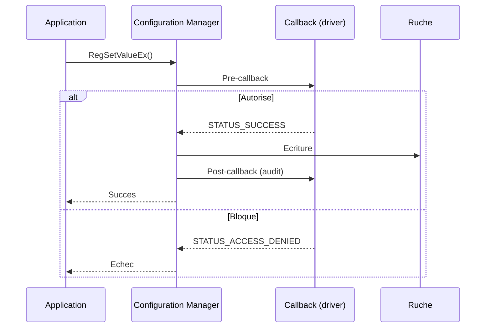

---
tags:
  - registre
  - API
  - Win32
  - noyau
---

# API Win32 et noyau en profondeur

## Ce que vous allez apprendre

- Comment surveiller les modifications du registre en temps reel avec `RegNotifyChangeKeyValue`
- Les transactions KTM pour des modifications atomiques du registre
- Les operations en masse : chargement, sauvegarde et remplacement de ruches
- La gestion avancee de la securite via les API (DACL, SACL, prise de possession)
- Les callbacks noyau avec `CmRegisterCallbackEx` pour intercepter toute operation registre
- Les API non documentees (NtAPI) : renommer des cles, surveiller plusieurs cles simultanement
- Les techniques d'optimisation et les benchmarks
- L'interoperabilite avec C#, Python, Rust et Go
- Le depannage des codes d'erreur et les pieges classiques

---

## En 30 secondes

```c
// Watch a registry key for changes in real time
HKEY hKey;
RegOpenKeyExW(HKEY_CURRENT_USER, L"Software\\MonApp", 0, KEY_NOTIFY, &hKey);
RegNotifyChangeKeyValue(hKey, TRUE, REG_NOTIFY_CHANGE_LAST_SET, NULL, FALSE);
printf("Something changed!\n");
RegCloseKey(hKey);
```

!!! tip "Analogie"
    Si les API de base sont le **volant et les pedales** d'une voiture, les API avancees de ce chapitre sont le **turbo, l'ABS et le controle de traction**. Vous pouvez conduire sans eux, mais ils deviennent indispensables quand vous poussez la machine a ses limites.

!!! info "En resume"
    - Ce chapitre couvre les API avancees : surveillance en temps reel, transactions, operations en masse, securite, callbacks noyau et API non documentees
    - RegNotifyChangeKeyValue est la fonction cle pour detecter les modifications du registre sans interrogation repetee

---

## Rappel des API de base

Le [chapitre 05](05-outils.md#api-de-programmation) presente les API fondamentales : `RegOpenKeyEx`, `RegQueryValueEx`, `RegSetValueEx`, `RegCloseKey`. Les sections suivantes couvrent des fonctions que la plupart des developpeurs ne touchent jamais, mais qui sont essentielles pour les outils systeme, la securite et l'administration avancee.

!!! info "En resume"
    - Les API de base (RegOpenKeyEx, RegQueryValueEx, RegSetValueEx, RegCloseKey) sont couvertes au chapitre 05
    - Ce chapitre se concentre sur les fonctions avancees pour les outils systeme, la securite et l'administration

---

## RegNotifyChangeKeyValue : surveillance en temps reel

### Signature et parametres

```c
LSTATUS RegNotifyChangeKeyValue(
    HKEY   hKey,            // Handle to an open key
    BOOL   bWatchSubtree,   // TRUE = watch all subkeys recursively
    DWORD  dwNotifyFilter,  // What changes to watch for
    HANDLE hEvent,          // Event object (async) or NULL (sync)
    BOOL   fAsynchronous    // TRUE = async, FALSE = blocking
);
```

| Flag | Valeur | Declenchement |
|------|:------:|---------------|
| `REG_NOTIFY_CHANGE_NAME` | `0x01` | Ajout ou suppression d'une sous-cle |
| `REG_NOTIFY_CHANGE_ATTRIBUTES` | `0x02` | Modification des attributs |
| `REG_NOTIFY_CHANGE_LAST_SET` | `0x04` | Modification d'une valeur |
| `REG_NOTIFY_CHANGE_SECURITY` | `0x08` | Modification du descripteur de securite |
| `REG_NOTIFY_THREAD_AGNOSTIC` | `0x10000000` | Survit a la fin du thread (Windows 8+) |

### Implementation synchrone

```c
#include <windows.h>
#include <stdio.h>

int main(void) {
    HKEY hKey;
    RegOpenKeyExW(HKEY_CURRENT_USER, L"Software\\MonApp",
                  0, KEY_NOTIFY, &hKey);
    printf("Watching HKCU\\Software\\MonApp...\n");

    // Block until something changes
    LSTATUS s = RegNotifyChangeKeyValue(hKey, TRUE,
        REG_NOTIFY_CHANGE_NAME | REG_NOTIFY_CHANGE_LAST_SET,
        NULL, FALSE);

    if (s == ERROR_SUCCESS) printf("Change detected!\n");
    else printf("Failed: %ld\n", s);

    RegCloseKey(hKey);
    return 0;
}
```

### Implementation asynchrone avec evenements

```c
#include <windows.h>
#include <stdio.h>

int main(void) {
    HKEY hKey;
    RegOpenKeyExW(HKEY_CURRENT_USER, L"Software\\MonApp",
                  0, KEY_NOTIFY, &hKey);
    HANDLE hEvent = CreateEventW(NULL, TRUE, FALSE, NULL);

    printf("Watching (async). Ctrl+C to stop.\n");
    while (1) {
        ResetEvent(hEvent);
        LSTATUS s = RegNotifyChangeKeyValue(hKey, TRUE,
            REG_NOTIFY_CHANGE_NAME | REG_NOTIFY_CHANGE_LAST_SET |
            REG_NOTIFY_THREAD_AGNOSTIC,
            hEvent, TRUE);
        if (s != ERROR_SUCCESS) break;

        DWORD w = WaitForSingleObject(hEvent, 5000);
        if (w == WAIT_OBJECT_0)
            printf("[CHANGE] detected at tick %lu\n", GetTickCount());
        else if (w == WAIT_TIMEOUT)
            printf("[TICK] no change (5s)\n");
        else break;
    }
    CloseHandle(hEvent);
    RegCloseKey(hKey);
    return 0;
}
```

### Surveillance multi-cles (WaitForMultipleObjects)

```c
#include <windows.h>
#include <stdio.h>

typedef struct { HKEY hKey; HANDLE hEvent; WCHAR path[MAX_PATH]; } WATCH;

static LSTATUS RegisterWatch(WATCH *w) {
    ResetEvent(w->hEvent);
    return RegNotifyChangeKeyValue(w->hKey, TRUE,
        REG_NOTIFY_CHANGE_NAME | REG_NOTIFY_CHANGE_LAST_SET |
        REG_NOTIFY_THREAD_AGNOSTIC, w->hEvent, TRUE);
}

int main(void) {
    WATCH w[2]; HANDLE ev[2];
    LPCWSTR paths[] = { L"Software\\MonApp", L"Software\\AutreApp" };
    for (int i = 0; i < 2; i++) {
        w[i].hEvent = CreateEventW(NULL, TRUE, FALSE, NULL);
        wcscpy_s(w[i].path, MAX_PATH, paths[i]);
        RegOpenKeyExW(HKEY_CURRENT_USER, paths[i], 0, KEY_NOTIFY, &w[i].hKey);
        ev[i] = w[i].hEvent;
        RegisterWatch(&w[i]);
    }
    while (1) {
        DWORD idx = WaitForMultipleObjects(2, ev, FALSE, INFINITE);
        if (idx >= WAIT_OBJECT_0 && idx < WAIT_OBJECT_0 + 2) {
            int i = idx - WAIT_OBJECT_0;
            wprintf(L"[CHANGE] %s\n", w[i].path);
            RegisterWatch(&w[i]);
        }
    }
    return 0;
}
```

!!! note "Limite de 64 handles"
    `WaitForMultipleObjects` accepte au maximum 64 handles. Pour surveiller plus de cles, utilisez un I/O Completion Port ou `NtNotifyChangeMultipleKeys` (section NtAPI).

### Wrapper C# (P/Invoke)

```csharp
using System;
using System.Runtime.InteropServices;
using System.Threading;
using Microsoft.Win32;

public static class RegistryWatcher
{
    [DllImport("advapi32.dll", SetLastError = true)]
    private static extern int RegNotifyChangeKeyValue(
        IntPtr hKey, bool bWatchSubtree, int dwNotifyFilter,
        IntPtr hEvent, bool fAsynchronous);

    public static void Watch(RegistryKey key, CancellationToken ct)
    {
        IntPtr hKey = key.Handle.DangerousGetHandle();
        using var evt = new ManualResetEvent(false);
        IntPtr hEvent = evt.SafeWaitHandle.DangerousGetHandle();
        int filter = 0x01 | 0x04 | 0x10000000; // NAME + LAST_SET + THREAD_AGNOSTIC

        while (!ct.IsCancellationRequested)
        {
            evt.Reset();
            int r = RegNotifyChangeKeyValue(hKey, true, filter, hEvent, true);
            if (r != 0) throw new System.ComponentModel.Win32Exception(r);
            while (!evt.WaitOne(1000))
                if (ct.IsCancellationRequested) return;
            Console.WriteLine($"[{DateTime.Now:HH:mm:ss}] Change detected");
        }
    }
}
```

### Wrapper PowerShell

```powershell
$job = Start-Job -ScriptBlock {
    Add-Type -TypeDefinition @"
using System; using System.Runtime.InteropServices; using Microsoft.Win32;
public static class RegWatch {
    [DllImport("advapi32.dll")]
    public static extern int RegNotifyChangeKeyValue(
        IntPtr hKey, bool watch, int filter, IntPtr evt, bool async);
}
"@
    $key = [Microsoft.Win32.Registry]::CurrentUser.OpenSubKey("Software\MonApp")
    $h = $key.Handle.DangerousGetHandle()
    while ($true) {
        # 0x05 = CHANGE_NAME | CHANGE_LAST_SET; sync mode (blocks)
        $r = [RegWatch]::RegNotifyChangeKeyValue($h, $true, 0x05, [IntPtr]::Zero, $false)
        if ($r -eq 0) { Write-Output "[$(Get-Date -Format 'HH:mm:ss')] Change detected" }
    }
}
Receive-Job -Job $job -Wait
```

```title="Resultat attendu"
[12:34:56] Change detected
```

### Limitation et contournement

!!! danger "L'API ne dit pas CE QUI a change"
    `RegNotifyChangeKeyValue` signale qu'un changement a eu lieu, mais pas lequel. Contournement : prenez un instantane des valeurs avant la notification, attendez le signal, prenez un nouvel instantane, comparez les deux (pattern **snapshot + diff**).

!!! info "En resume"
    - RegNotifyChangeKeyValue surveille une cle en mode synchrone (bloquant) ou asynchrone (avec un objet evenement)
    - WaitForMultipleObjects permet de surveiller jusqu'a 64 cles simultanement ; au-dela, utilisez un I/O Completion Port
    - L'API ne precise pas quel changement a eu lieu : le pattern snapshot + diff est necessaire pour identifier les modifications

---

## Transactions KTM (Kernel Transaction Manager)

Les transactions regroupent plusieurs modifications en une **operation atomique** : tout est applique, ou rien.

| Fonction | Role |
|----------|------|
| `CreateTransaction` | Creer un objet transaction |
| `RegCreateKeyTransacted` | Creer/ouvrir une cle dans une transaction |
| `RegOpenKeyTransacted` | Ouvrir une cle existante dans une transaction |
| `RegDeleteKeyTransacted` | Supprimer une cle dans une transaction |
| `CommitTransaction` | Appliquer toutes les modifications |
| `RollbackTransaction` | Annuler toutes les modifications |

### Modification atomique avec rollback

```c
#include <windows.h>
#include <ktmw32.h>
#include <stdio.h>
#pragma comment(lib, "ktmw32.lib")
#pragma comment(lib, "advapi32.lib")

int main(void) {
    HANDLE hTx = CreateTransaction(NULL, NULL, 0, 0, 0, 0, NULL);
    if (hTx == INVALID_HANDLE_VALUE) return 1;

    HKEY hKey1 = NULL, hKey2 = NULL;
    DWORD disp;
    LSTATUS s;

    // Operation 1: create Config key
    s = RegCreateKeyTransacted(HKEY_CURRENT_USER,
        L"Software\\MonApp\\Config", 0, NULL,
        REG_OPTION_NON_VOLATILE, KEY_WRITE, NULL,
        &hKey1, &disp, hTx, NULL);
    if (s != ERROR_SUCCESS) goto rollback;

    DWORD ver = 2;
    s = RegSetValueExW(hKey1, L"Version", 0, REG_DWORD, (LPBYTE)&ver, sizeof(ver));
    if (s != ERROR_SUCCESS) goto rollback;

    // Operation 2: create State key
    s = RegCreateKeyTransacted(HKEY_CURRENT_USER,
        L"Software\\MonApp\\State", 0, NULL,
        REG_OPTION_NON_VOLATILE, KEY_WRITE, NULL,
        &hKey2, &disp, hTx, NULL);
    if (s != ERROR_SUCCESS) goto rollback;

    DWORD migrated = 1;
    s = RegSetValueExW(hKey2, L"Migrated", 0, REG_DWORD, (LPBYTE)&migrated, sizeof(migrated));
    if (s != ERROR_SUCCESS) goto rollback;

    // All OK: commit
    CommitTransaction(hTx);
    printf("Transaction committed.\n");
    goto cleanup;

rollback:
    RollbackTransaction(hTx);
    printf("Transaction rolled back.\n");

cleanup:
    if (hKey1) RegCloseKey(hKey1);
    if (hKey2) RegCloseKey(hKey2);
    CloseHandle(hTx);
    return 0;
}
```

!!! warning "Deprecation de TxR"
    Microsoft deconseille les transactions registre depuis Windows 10 : surcharge de performance, deadlocks, maintenance couteuse. Les API fonctionnent toujours mais pourraient disparaitre. **Alternative** : sauvegardez les valeurs existantes dans une structure en memoire, appliquez les modifications, et restaurez manuellement en cas d'echec.

!!! info "En resume"
    - Les transactions KTM regroupent plusieurs modifications en une operation atomique (tout ou rien) avec CommitTransaction et RollbackTransaction
    - Les API transactionnelles (RegCreateKeyTransacted, RegOpenKeyTransacted) fonctionnent toujours mais sont depreciees depuis Windows 10
    - L'alternative recommandee est de sauvegarder les valeurs en memoire et de restaurer manuellement en cas d'echec

---

## Operations en masse

Ces API manipulent des **ruches entieres** -- indispensables pour l'administration et la forensique.

### RegLoadKey / RegUnLoadKey : ruches hors ligne

```c
#include <windows.h>
#include <stdio.h>

static void EnablePrivilege(LPCWSTR priv) {
    HANDLE hToken; TOKEN_PRIVILEGES tp;
    OpenProcessToken(GetCurrentProcess(), TOKEN_ADJUST_PRIVILEGES | TOKEN_QUERY, &hToken);
    LookupPrivilegeValueW(NULL, priv, &tp.Privileges[0].Luid);
    tp.PrivilegeCount = 1; tp.Privileges[0].Attributes = SE_PRIVILEGE_ENABLED;
    AdjustTokenPrivileges(hToken, FALSE, &tp, 0, NULL, NULL);
    CloseHandle(hToken);
}

int main(void) {
    EnablePrivilege(SE_BACKUP_NAME);
    EnablePrivilege(SE_RESTORE_NAME);

    // Load an offline NTUSER.DAT into HKLM\TempHive
    RegLoadKeyW(HKEY_LOCAL_MACHINE, L"TempHive", L"C:\\Backup\\NTUSER.DAT");

    HKEY hKey;
    RegOpenKeyExW(HKEY_LOCAL_MACHINE,
        L"TempHive\\Software\\Microsoft\\Windows\\CurrentVersion",
        0, KEY_READ, &hKey);
    WCHAR buf[256]; DWORD sz = sizeof(buf);
    RegQueryValueExW(hKey, L"ProgramFilesDir", NULL, NULL, (LPBYTE)buf, &sz);
    wprintf(L"ProgramFilesDir = %s\n", buf);
    RegCloseKey(hKey);

    // Unload
    RegUnLoadKeyW(HKEY_LOCAL_MACHINE, L"TempHive");
    return 0;
}
```

### RegSaveKeyEx / RegRestoreKey

```c
// Save: requires SeBackupPrivilege
HKEY hKey;
RegOpenKeyExW(HKEY_LOCAL_MACHINE, L"SOFTWARE\\MonApp", 0, KEY_READ, &hKey);
RegSaveKeyExW(hKey, L"C:\\Backup\\monapp.hiv", NULL, REG_LATEST_FORMAT);
// REG_STANDARD_FORMAT = compatible older Windows
// REG_LATEST_FORMAT   = compact, current Windows
// REG_NO_COMPRESSION  = fastest write, largest file
RegCloseKey(hKey);

// Restore: requires SeRestorePrivilege
RegOpenKeyExW(HKEY_LOCAL_MACHINE, L"SOFTWARE\\MonApp", 0, KEY_WRITE, &hKey);
RegRestoreKeyW(hKey, L"C:\\Backup\\monapp.hiv", REG_FORCE_RESTORE);
RegCloseKey(hKey);
```

### RegReplaceKey : remplacement atomique

```c
// Replace the SYSTEM hive atomically at next reboot
RegReplaceKeyW(HKEY_LOCAL_MACHINE, L"SYSTEM",
    L"C:\\Backup\\system_new.hiv",  // new hive
    L"C:\\Backup\\system_old.hiv"); // backup of current
```

!!! danger "Necessite un redemarrage"
    Le remplacement n'a lieu qu'au prochain boot. Si le fichier est corrompu, le systeme ne demarre plus.

### RegLoadMUIString : chaines localisees

```c
HKEY hKey;
RegOpenKeyExW(HKEY_LOCAL_MACHINE,
    L"SYSTEM\\CurrentControlSet\\Services\\Spooler", 0, KEY_READ, &hKey);
WCHAR name[256]; DWORD outSize;
RegLoadMUIStringW(hKey, L"DisplayName", name, sizeof(name), &outSize, 0, NULL);
// name = "Print Spooler" (EN) or "Spouleur d'impression" (FR)
RegCloseKey(hKey);
```

### RegLoadAppKey : ruches applicatives privees

```c
HKEY hAppKey;
RegLoadAppKeyW(L"C:\\MonApp\\settings.dat", &hAppKey, KEY_ALL_ACCESS, 0, 0);
DWORD val = 1;
RegSetValueExW(hAppKey, L"Initialized", 0, REG_DWORD, (LPBYTE)&val, sizeof(val));
RegCloseKey(hAppKey);  // hive auto-unloaded when all handles close
```

!!! tip "Avantage"
    Les ruches privees sont invisibles dans Regedit et evitent les conflits avec d'autres applications. Parfait pour les configs portables ou sensibles.

!!! info "En resume"
    - RegLoadKey / RegUnLoadKey permettent de charger des ruches hors ligne (NTUSER.DAT d'un autre utilisateur) pour lecture ou modification
    - RegSaveKeyEx sauvegarde une sous-arborescence et RegRestoreKey la restaure ; RegReplaceKey effectue un remplacement atomique au prochain redemarrage
    - RegLoadAppKey charge une ruche privee invisible dans Regedit, ideale pour les donnees applicatives isolees

---

## Securite avancee via API

### Lire la DACL d'une cle

```c
#include <windows.h>
#include <sddl.h>
#include <stdio.h>

void ReadKeySecurity(HKEY hKey) {
    DWORD sdSize = 0;
    RegGetKeySecurity(hKey, DACL_SECURITY_INFORMATION, NULL, &sdSize);
    PSECURITY_DESCRIPTOR pSD = malloc(sdSize);
    RegGetKeySecurity(hKey, DACL_SECURITY_INFORMATION, pSD, &sdSize);

    LPWSTR sddl = NULL;
    ConvertSecurityDescriptorToStringSecurityDescriptorW(
        pSD, SDDL_REVISION_1, DACL_SECURITY_INFORMATION, &sddl, NULL);
    wprintf(L"SDDL: %s\n", sddl);
    LocalFree(sddl); free(pSD);
}
```

### Construire une DACL par programmation

```c
#include <windows.h>
#include <aclapi.h>
#pragma comment(lib, "advapi32.lib")

BOOL SetKeyDacl(HKEY hKey) {
    PSID pAdmin = NULL, pUsers = NULL;
    SID_IDENTIFIER_AUTHORITY ntAuth = SECURITY_NT_AUTHORITY;

    AllocateAndInitializeSid(&ntAuth, 2, SECURITY_BUILTIN_DOMAIN_RID,
        DOMAIN_ALIAS_RID_ADMINS, 0,0,0,0,0,0, &pAdmin);
    AllocateAndInitializeSid(&ntAuth, 2, SECURITY_BUILTIN_DOMAIN_RID,
        DOMAIN_ALIAS_RID_USERS, 0,0,0,0,0,0, &pUsers);

    EXPLICIT_ACCESS ea[2] = {0};
    // Administrators: Full Control
    ea[0].grfAccessPermissions = KEY_ALL_ACCESS;
    ea[0].grfAccessMode = SET_ACCESS;
    ea[0].grfInheritance = SUB_CONTAINERS_AND_OBJECTS_INHERIT;
    ea[0].Trustee.TrusteeForm = TRUSTEE_IS_SID;
    ea[0].Trustee.ptstrName = (LPWSTR)pAdmin;
    // Users: Read Only
    ea[1].grfAccessPermissions = KEY_READ;
    ea[1].grfAccessMode = SET_ACCESS;
    ea[1].grfInheritance = SUB_CONTAINERS_AND_OBJECTS_INHERIT;
    ea[1].Trustee.TrusteeForm = TRUSTEE_IS_SID;
    ea[1].Trustee.ptstrName = (LPWSTR)pUsers;

    PACL pDacl = NULL;
    SetEntriesInAcl(2, ea, NULL, &pDacl);
    DWORD err = SetSecurityInfo(hKey, SE_REGISTRY_KEY,
        DACL_SECURITY_INFORMATION, NULL, NULL, pDacl, NULL);

    LocalFree(pDacl); FreeSid(pAdmin); FreeSid(pUsers);
    return (err == ERROR_SUCCESS);
}
```

### Prise de possession (SeTakeOwnershipPrivilege)

```c
BOOL TakeKeyOwnership(LPCWSTR keyPath) {
    // 1. Enable SeTakeOwnershipPrivilege (same pattern as EnablePrivilege above)
    HANDLE hToken; TOKEN_PRIVILEGES tp;
    OpenProcessToken(GetCurrentProcess(), TOKEN_ADJUST_PRIVILEGES | TOKEN_QUERY, &hToken);
    LookupPrivilegeValueW(NULL, SE_TAKE_OWNERSHIP_NAME, &tp.Privileges[0].Luid);
    tp.PrivilegeCount = 1; tp.Privileges[0].Attributes = SE_PRIVILEGE_ENABLED;
    AdjustTokenPrivileges(hToken, FALSE, &tp, 0, NULL, NULL);
    CloseHandle(hToken);

    // 2. Open key with WRITE_OWNER
    HKEY hKey;
    RegOpenKeyExW(HKEY_LOCAL_MACHINE, keyPath, 0, WRITE_OWNER, &hKey);

    // 3. Set Administrators as owner
    PSID pAdmin = NULL;
    SID_IDENTIFIER_AUTHORITY ntAuth = SECURITY_NT_AUTHORITY;
    AllocateAndInitializeSid(&ntAuth, 2, SECURITY_BUILTIN_DOMAIN_RID,
        DOMAIN_ALIAS_RID_ADMINS, 0,0,0,0,0,0, &pAdmin);
    DWORD err = SetSecurityInfo(hKey, SE_REGISTRY_KEY,
        OWNER_SECURITY_INFORMATION, pAdmin, NULL, NULL, NULL);
    FreeSid(pAdmin); RegCloseKey(hKey);
    return (err == ERROR_SUCCESS);
}
```

### SACL : audit des acces

La SACL controle quels acces generent des evenements dans le journal de securite (evenement **4663**). L'activation necessite `SeSecurityPrivilege` et l'ouverture avec `ACCESS_SYSTEM_SECURITY`.

```c
// Open with SACL access
HKEY hKey;
RegOpenKeyExW(HKEY_LOCAL_MACHINE, L"SOFTWARE\\SensitiveApp",
    0, KEY_READ | ACCESS_SYSTEM_SECURITY, &hKey);
// Read/modify SACL with RegGetKeySecurity / RegSetKeySecurity
// using SACL_SECURITY_INFORMATION flag
RegCloseKey(hKey);
```

!!! info "En resume"
    - RegGetKeySecurity lit la DACL d'une cle sous forme SDDL ; SetEntriesInAcl et SetSecurityInfo permettent de construire et appliquer une DACL par programmation
    - SeTakeOwnershipPrivilege permet de prendre possession d'une cle protegee pour en modifier ensuite les permissions
    - La SACL controle l'audit des acces et genere des evenements 4663 dans le journal de securite

---

## Mode noyau : CmRegisterCallbackEx

Les callbacks noyau interceptent **toute** operation registre du systeme. Un pre-callback peut bloquer l'operation, un post-callback peut l'auditer.



### Types de callbacks (REG_NOTIFY_CLASS)

| Pre-operation | Post-operation | Declenchement |
|---------------|----------------|---------------|
| `RegNtPreCreateKey` | `RegNtPostCreateKey` | Creation |
| `RegNtPreOpenKey` | `RegNtPostOpenKey` | Ouverture |
| `RegNtPreDeleteKey` | `RegNtPostDeleteKey` | Suppression de cle |
| `RegNtPreSetValueKey` | `RegNtPostSetValueKey` | Modification de valeur |
| `RegNtPreDeleteValueKey` | `RegNtPostDeleteValueKey` | Suppression de valeur |
| `RegNtPreQueryValueKey` | `RegNtPostQueryValueKey` | Lecture de valeur |
| `RegNtPreRenameKey` | `RegNtPostRenameKey` | Renommage |

### Driver squelette

```c
#include <ntddk.h>

LARGE_INTEGER g_Cookie;

NTSTATUS RegistryCallback(PVOID Ctx, PVOID Arg1, PVOID Arg2) {
    UNREFERENCED_PARAMETER(Ctx);
    REG_NOTIFY_CLASS cls = (REG_NOTIFY_CLASS)(ULONG_PTR)Arg1;

    if (cls == RegNtPreSetValueKey) {
        PREG_SET_VALUE_KEY_INFORMATION info = (PREG_SET_VALUE_KEY_INFORMATION)Arg2;
        UNICODE_STRING protected = RTL_CONSTANT_STRING(L"ProtectedValue");
        if (info->ValueName &&
            RtlEqualUnicodeString(info->ValueName, &protected, TRUE)) {
            DbgPrint("[RegFilter] Blocked write to ProtectedValue\n");
            return STATUS_ACCESS_DENIED;
        }
    }
    if (cls == RegNtPreDeleteKey) {
        PREG_DELETE_KEY_INFORMATION info = (PREG_DELETE_KEY_INFORMATION)Arg2;
        DbgPrint("[RegFilter] Delete attempt on %p\n", info->Object);
    }
    if (cls == RegNtPostSetValueKey) {
        PREG_POST_OPERATION_INFORMATION info = (PREG_POST_OPERATION_INFORMATION)Arg2;
        if (NT_SUCCESS(info->Status))
            DbgPrint("[RegFilter] Value write succeeded on %p\n", info->Object);
    }
    return STATUS_SUCCESS;
}

VOID DriverUnload(PDRIVER_OBJECT Drv) {
    UNREFERENCED_PARAMETER(Drv);
    CmUnRegisterCallback(g_Cookie);
}

NTSTATUS DriverEntry(PDRIVER_OBJECT Drv, PUNICODE_STRING Path) {
    UNREFERENCED_PARAMETER(Path);
    UNICODE_STRING alt = RTL_CONSTANT_STRING(L"380000");
    NTSTATUS s = CmRegisterCallbackEx(RegistryCallback, &alt, Drv, NULL, &g_Cookie, NULL);
    if (NT_SUCCESS(s)) Drv->DriverUnload = DriverUnload;
    return s;
}
```

| Domaine | Usage typique |
|---------|---------------|
| Antivirus | Bloquer la desactivation de Windows Defender |
| EDR | Journaliser les modifications des cles Run/RunOnce |
| Protection anti-sabotage | Empecher la suppression des cles du service AV |
| Sandbox | Rediriger les ecritures vers un espace isole |

!!! warning "Performance"
    Le callback est invoque pour **chaque** operation registre du systeme. Filtrez rapidement, evitez les allocations memoire et ne faites jamais d'I/O dans le callback.

!!! info "En resume"
    - CmRegisterCallbackEx enregistre un callback noyau qui intercepte toute operation registre (pre et post-operation)
    - Un pre-callback peut bloquer une operation (retourner STATUS_ACCESS_DENIED), un post-callback peut l'auditer
    - Les antivirus, EDR et sandboxes utilisent ce mecanisme pour proteger ou surveiller les cles sensibles

---

## NtAPI : les API non documentees

Les fonctions `Nt*` de `ntdll.dll` offrent des capacites impossibles via Win32.

| Fonction | Equivalent Win32 | Specificite |
|----------|-------------------|-------------|
| `NtCreateKey` | `RegCreateKeyEx` | Options supplementaires |
| `NtOpenKey` | `RegOpenKeyEx` | Support `OBJ_OPENLINK` |
| `NtQueryKey` | aucun | Metadonnees detaillees |
| `NtRenameKey` | **aucun** | Seul moyen de renommer une cle |
| `NtNotifyChangeMultipleKeys` | aucun | Surveille plusieurs cles en un appel |
| `NtQueryValueKey` | `RegQueryValueEx` | Modes de lecture optimises |

### NtRenameKey : renommer une cle

```c
#include <windows.h>
#include <winternl.h>
#include <stdio.h>

typedef NTSTATUS (NTAPI *PFN_NtRenameKey)(HANDLE, PUNICODE_STRING);

BOOL RenameRegistryKey(HKEY hParent, LPCWSTR subKey, LPCWSTR newName) {
    HKEY hKey;
    if (RegOpenKeyExW(hParent, subKey, 0, KEY_WRITE, &hKey) != ERROR_SUCCESS)
        return FALSE;

    PFN_NtRenameKey pNtRenameKey = (PFN_NtRenameKey)
        GetProcAddress(GetModuleHandleW(L"ntdll.dll"), "NtRenameKey");
    if (!pNtRenameKey) { RegCloseKey(hKey); return FALSE; }

    UNICODE_STRING us;
    us.Length = (USHORT)(wcslen(newName) * sizeof(WCHAR));
    us.MaximumLength = us.Length + sizeof(WCHAR);
    us.Buffer = (PWSTR)newName;

    NTSTATUS st = pNtRenameKey(hKey, &us);
    RegCloseKey(hKey);
    return (st == 0);
}
```

!!! warning "Le parametre est le nouveau nom seul"
    Pour `HKCU\Software\OldName`, passez `L"NewName"` et non `L"Software\\NewName"`.

### NtNotifyChangeMultipleKeys

```c
typedef NTSTATUS (NTAPI *PFN_NtNotifyChangeMultipleKeys)(
    HANDLE MasterKeyHandle, ULONG Count,
    OBJECT_ATTRIBUTES SubordinateObjects[],
    HANDLE Event, PIO_APC_ROUTINE ApcRoutine, PVOID ApcContext,
    PIO_STATUS_BLOCK IoStatusBlock, ULONG CompletionFilter,
    BOOLEAN WatchTree, PVOID Buffer, ULONG BufferSize,
    BOOLEAN Asynchronous);
```

En pratique, la plupart des developpeurs l'appellent avec `Count = 0` (equivalent a `RegNotifyChangeKeyValue` mais avec moins de surcharge Win32).

### Python : NtRenameKey via ctypes

```python
import ctypes
from ctypes import wintypes

ntdll = ctypes.WinDLL("ntdll")
advapi32 = ctypes.WinDLL("advapi32")

class UNICODE_STRING(ctypes.Structure):
    _fields_ = [("Length", wintypes.USHORT),
                ("MaximumLength", wintypes.USHORT),
                ("Buffer", wintypes.LPWSTR)]

def rename_key(parent, subkey_path, new_name):
    """Rename a registry key using NtRenameKey (undocumented API)."""
    hkey = wintypes.HKEY()
    advapi32.RegOpenKeyExW(parent, subkey_path, 0, 0x20006, ctypes.byref(hkey))

    buf = ctypes.create_unicode_buffer(new_name)
    us = UNICODE_STRING(len(new_name) * 2, len(new_name) * 2 + 2,
                        ctypes.cast(buf, wintypes.LPWSTR))

    ntdll.NtRenameKey.restype = ctypes.c_long
    ntdll.NtRenameKey.argtypes = [wintypes.HANDLE, ctypes.POINTER(UNICODE_STRING)]
    status = ntdll.NtRenameKey(hkey, ctypes.byref(us))
    advapi32.RegCloseKey(hkey)
    if status != 0:
        raise OSError(f"NtRenameKey failed: 0x{status & 0xFFFFFFFF:08X}")

if __name__ == "__main__":
    rename_key(0x80000001, "Software\\OldKeyName", "NewKeyName")
    print("Key renamed.")
```

!!! danger "Non documentee = risque de rupture"
    Les fonctions `Nt*` ne font pas partie du contrat API stable de Windows. Microsoft peut les modifier entre deux versions. En pratique, `NtRenameKey` n'a pas change depuis Windows XP, mais il n'existe aucune garantie.

!!! info "En resume"
    - NtRenameKey est le seul moyen de renommer une cle de registre sans la recreer manuellement
    - NtNotifyChangeMultipleKeys surveille plusieurs cles en un seul appel, depassant la limite de WaitForMultipleObjects
    - Les fonctions Nt* sont stables en pratique depuis Windows XP mais ne font partie d'aucun contrat API officiel

---

## Performance et optimisation

### Benchmarks

Lecture de 10 000 valeurs REG_SZ de 256 octets. Temps relatif a `RegQueryValueEx` (base 100).

| API | Temps | Notes |
|-----|:-----:|-------|
| `RegQueryValueEx` | 100 | Pas de validation de type |
| `RegGetValue` | 105 | Validation de type, expansion auto |
| `NtQueryValueKey` (Partial) | 85 | Acces direct noyau |
| `NtQueryValueKey` (Full) | 92 | Retourne aussi le nom |
| C# `RegistryKey.GetValue` | 150 | Marshalling .NET |
| PowerShell `Get-ItemPropertyValue` | 1200 | Surcharge pipeline |

### RegGetValue : l'API moderne recommandee

```c
DWORD value; DWORD size = sizeof(value);
RegGetValueW(HKEY_CURRENT_USER, L"Software\\MonApp", L"Counter",
    RRF_RT_REG_DWORD,  // reject if not DWORD
    NULL, &value, &size);
// Returns ERROR_UNSUPPORTED_TYPE if the value is not REG_DWORD
```

| Flag | Effet |
|------|-------|
| `RRF_RT_REG_SZ` | Accepte REG_SZ uniquement |
| `RRF_RT_REG_DWORD` | Accepte REG_DWORD uniquement |
| `RRF_RT_ANY` | Accepte tous les types |
| `RRF_NOEXPAND` | Ne pas expander les %variables% |
| `RRF_SUBKEY_WOW6464KEY` | Force la vue 64-bit |
| `RRF_SUBKEY_WOW6432KEY` | Force la vue 32-bit |

### Impact de la profondeur

| Profondeur | Temps relatif |
|:----------:|:------------:|
| 1 niveau | 100 |
| 5 niveaux | 112 |
| 10 niveaux | 135 |
| 20 niveaux | 185 |
| 50 niveaux | 340 |

Le Configuration Manager maintient un cache de cellules en memoire. La premiere lecture est lente (cache miss), les suivantes sont quasi-instantanees. Les ecritures invalident la page correspondante.

### Lecture par lots

```c
// WRONG: opens/closes the key 100 times
for (int i = 0; i < 100; i++)
    RegGetValueW(HKEY_CURRENT_USER, L"Software\\MonApp",
                 names[i], RRF_RT_ANY, NULL, &data, &sz);

// RIGHT: open once, read 100 times
HKEY hKey;
RegOpenKeyExW(HKEY_CURRENT_USER, L"Software\\MonApp", 0, KEY_READ, &hKey);
for (int i = 0; i < 100; i++) {
    DWORD s = sizeof(data);
    RegQueryValueExW(hKey, names[i], NULL, NULL, (LPBYTE)&data, &s);
}
RegCloseKey(hKey);
// ~40% faster on large batches
```

!!! info "En resume"
    - RegGetValue est l'API moderne recommandee : elle valide le type de donnees et rejette les types inattendus
    - La profondeur des cles impacte les performances (x3.4 a 50 niveaux) ; le cache du Configuration Manager amortit les lectures repetees
    - Ouvrir la cle une seule fois puis lire en boucle est environ 40% plus rapide que des appels independants a RegGetValue

---

## Interoperabilite

### Rust : crate winreg

```rust
use std::io;
use winreg::enums::*;
use winreg::RegKey;

fn main() -> io::Result<()> {
    let hkcu = RegKey::predef(HKEY_CURRENT_USER);
    let (key, _) = hkcu.create_subkey("Software\\MonApp")?;

    key.set_value("Version", &42u32)?;
    key.set_value("Name", &"MonApplication")?;

    let version: u32 = key.get_value("Version")?;
    let name: String = key.get_value("Name")?;
    println!("Version: {version}, Name: {name}");

    // Enumerate subkeys
    for entry in hkcu.open_subkey("Software")?.enum_keys() {
        println!("Subkey: {}", entry?);
    }
    hkcu.delete_subkey_all("Software\\MonApp")?;
    Ok(())
}
```

### Go : golang.org/x/sys/windows/registry

```go
package main

import (
	"fmt"
	"log"
	"golang.org/x/sys/windows/registry"
)

func main() {
	key, _, err := registry.CreateKey(registry.CURRENT_USER,
		`Software\MonApp`, registry.ALL_ACCESS)
	if err != nil { log.Fatal(err) }
	defer key.Close()

	key.SetDWordValue("Version", 42)
	key.SetStringValue("Name", "MonApplication")

	v, _, _ := key.GetIntegerValue("Version")
	n, _, _ := key.GetStringValue("Name")
	fmt.Printf("Version: %d, Name: %s\n", v, n)

	registry.DeleteKey(registry.CURRENT_USER, `Software\MonApp`)
}
```

### C# (.NET) : NtRenameKey via P/Invoke

```csharp
using System;
using System.Runtime.InteropServices;
using Microsoft.Win32;

public static class NtRegistry
{
    [StructLayout(LayoutKind.Sequential)]
    private struct UNICODE_STRING {
        public ushort Length, MaximumLength;
        public IntPtr Buffer;
    }

    [DllImport("ntdll.dll")]
    private static extern int NtRenameKey(IntPtr KeyHandle, ref UNICODE_STRING NewName);

    public static void RenameKey(RegistryKey parent, string oldSub, string newName)
    {
        using var key = parent.OpenSubKey(oldSub,
            RegistryKeyPermissionCheck.ReadWriteSubTree);
        IntPtr hKey = key!.Handle.DangerousGetHandle();
        IntPtr buf = Marshal.StringToHGlobalUni(newName);
        var us = new UNICODE_STRING {
            Length = (ushort)(newName.Length * 2),
            MaximumLength = (ushort)(newName.Length * 2 + 2),
            Buffer = buf };
        try {
            int s = NtRenameKey(hKey, ref us);
            if (s != 0) throw new InvalidOperationException($"0x{(uint)s:X8}");
        } finally { Marshal.FreeHGlobal(buf); }
    }
}
// NtRegistry.RenameKey(Registry.CurrentUser, @"Software\OldName", "NewName");
```

### Python : surveillance avec ctypes

```python
import ctypes, time
from ctypes import wintypes

advapi32 = ctypes.WinDLL("advapi32")
kernel32 = ctypes.WinDLL("kernel32")

def watch_key(subkey, timeout_ms=5000, rounds=10):
    hkey = wintypes.HKEY()
    advapi32.RegOpenKeyExW(0x80000001, subkey, 0, 0x0010, ctypes.byref(hkey))
    event = kernel32.CreateEventW(None, True, False, None)
    try:
        for _ in range(rounds):
            kernel32.ResetEvent(event)
            advapi32.RegNotifyChangeKeyValue(hkey, True, 0x04, event, True)
            w = kernel32.WaitForSingleObject(event, timeout_ms)
            if w == 0: print(f"[{time.strftime('%H:%M:%S')}] Change!")
            else:      print(f"[{time.strftime('%H:%M:%S')}] Timeout")
    finally:
        kernel32.CloseHandle(event)
        advapi32.RegCloseKey(hkey)

if __name__ == "__main__":
    watch_key("Software\\MonApp")
```

!!! info "En resume"
    - Rust (crate winreg), Go (golang.org/x/sys/windows/registry) et C# (P/Invoke) offrent des wrappers natifs pour les operations registre
    - NtRenameKey est accessible depuis Python (ctypes) et C# (P/Invoke) pour renommer des cles
    - Python peut surveiller les modifications du registre en temps reel via RegNotifyChangeKeyValue et ctypes

---

## Depannage des API

### Codes d'erreur

| Code | Constante | Signification |
|:----:|-----------|---------------|
| 0 | `ERROR_SUCCESS` | Reussite |
| 2 | `ERROR_FILE_NOT_FOUND` | Cle ou valeur inexistante |
| 5 | `ERROR_ACCESS_DENIED` | Droits insuffisants |
| 6 | `ERROR_INVALID_HANDLE` | Handle invalide ou deja ferme |
| 87 | `ERROR_INVALID_PARAMETER` | Parametre incorrect |
| 234 | `ERROR_MORE_DATA` | Buffer trop petit |
| 259 | `ERROR_NO_MORE_ITEMS` | Fin de l'enumeration |
| 1010 | `ERROR_KEY_DELETED` | Cle marquee pour suppression |
| 1013 | `ERROR_KEY_HAS_CHILDREN` | Suppression impossible (sous-cles presentes) |
| 1314 | `ERROR_PRIVILEGE_NOT_HELD` | Privilege requis manquant |

### Piege n°1 : dimensionnement des buffers

```c
// WRONG: fixed buffer, fails on long values
WCHAR buf[64]; DWORD sz = sizeof(buf);
RegQueryValueExW(hKey, L"LongValue", NULL, NULL, (LPBYTE)buf, &sz);

// RIGHT: query size first, then allocate
DWORD sz = 0;
RegQueryValueExW(hKey, L"LongValue", NULL, NULL, NULL, &sz);
LPBYTE data = malloc(sz);
RegQueryValueExW(hKey, L"LongValue", NULL, NULL, data, &sz);
free(data);
```

### Piege n°2 : Unicode vs ANSI

```c
// WRONG: ANSI version truncates non-ASCII
RegQueryValueExA(hKey, "Param", NULL, NULL, (LPBYTE)buf, &sz);
// RIGHT: always use the W (Wide) version
RegQueryValueExW(hKey, L"Param", NULL, NULL, (LPBYTE)buf, &sz);
```

### Piege n°3 : vue 32-bit vs 64-bit (WOW64)

Sur un systeme 64-bit, les applications 32-bit voient un registre redirige (`WOW6432Node`).

```c
// 32-bit app reading the real 64-bit hive
RegOpenKeyExW(HKEY_LOCAL_MACHINE, L"SOFTWARE\\Microsoft",
    0, KEY_READ | KEY_WOW64_64KEY, &hKey);

// 64-bit app reading the 32-bit (WOW6432Node) hive
RegOpenKeyExW(HKEY_LOCAL_MACHINE, L"SOFTWARE\\Microsoft",
    0, KEY_READ | KEY_WOW64_32KEY, &hKey);
```

| Flag | Effet |
|------|-------|
| `KEY_WOW64_64KEY` | Force la vue 64-bit |
| `KEY_WOW64_32KEY` | Force la vue 32-bit |
| aucun | Vue du processus appelant |

### Debugger avec Process Monitor

| Colonne | Filtre recommande |
|---------|-------------------|
| Operation | `RegOpenKey`, `RegQueryValue`, `RegSetValue` |
| Process Name | Votre executable |
| Result | `is not SUCCESS` (affiche uniquement les echecs) |

!!! tip "Capture au boot"
    Process Monitor peut capturer les operations registre des le demarrage de Windows (Options > Enable Boot Logging). Indispensable pour diagnostiquer un probleme de service ou de driver.

!!! info "En resume"
    - ERROR_MORE_DATA (234) indique un buffer trop petit : interrogez d'abord la taille avec un buffer NULL puis allouez dynamiquement
    - Utilisez toujours les fonctions W (Wide/Unicode) au lieu des versions A (ANSI) pour eviter la corruption de caracteres
    - Sur un systeme 64 bits, KEY_WOW64_64KEY et KEY_WOW64_32KEY forcent la vue registre souhaitee independamment de l'architecture du processus

---

!!! info "En resume"
    Les API avancees du registre couvrent un large spectre : surveillance en temps reel (`RegNotifyChangeKeyValue`), transactions atomiques (KTM), operations en masse sur les ruches, securite granulaire (DACL/SACL), callbacks noyau (`CmRegisterCallbackEx`) et API non documentees (`NtRenameKey`). Pour la majorite des cas, `RegGetValue` est le meilleur choix. Les NtAPI servent la performance extreme, les callbacks noyau offrent le controle total. Les trois erreurs les plus frequentes : dimensionnement des buffers, confusion Unicode/ANSI, et oubli de la redirection WOW64.
