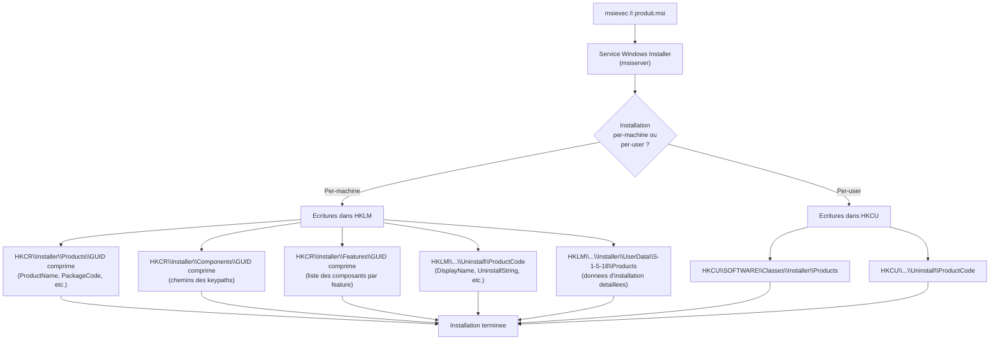
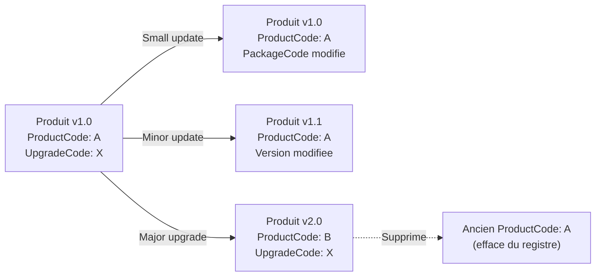
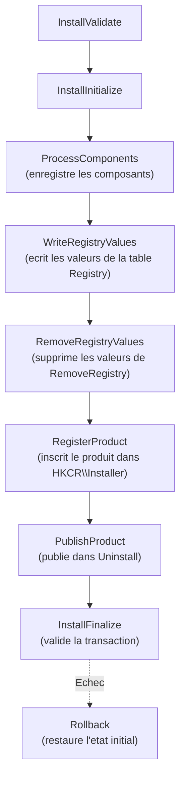
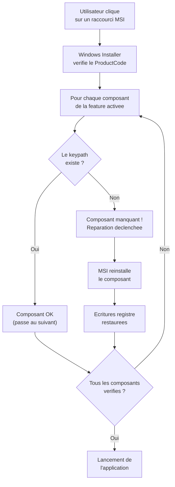

---
tags:
  - registre
  - MSI
  - Windows Installer
  - déploiement
---

# Windows Installer (MSI) et le registre

## Ce que vous allez apprendre

- Comment Windows Installer (msiexec.exe) utilise le registre pour gerer l'etat complet de chaque installation
- Les trois emplacements principaux ou MSI stocke ses donnees : Installer, Uninstall, HKCR\Installer
- Le systeme de GUIDs comprimes et l'algorithme de transformation
- L'arborescence des produits, composants et fonctionnalites dans le registre
- La structure complete de la cle Uninstall et son exploitation par "Programmes et fonctionnalites"
- Le mecanisme de patches et de mises a niveau (major upgrade, minor update, small update)
- Les actions personnalisees MSI et leurs interactions avec le registre
- Le systeme d'auto-reparation et de resilience MSI
- Les strategies de securite et permissions liees a Windows Installer
- Les techniques de diagnostic et de depannage avancees
- La transition de MSI vers MSIX et ses implications sur le registre

---

## Architecture MSI et le registre

Ouvrez une invite PowerShell en tant qu'administrateur et executez :

```powershell
# Count all MSI-installed products registered on this machine
$products = Get-ChildItem "HKLM:\SOFTWARE\Microsoft\Windows\CurrentVersion\Uninstall" |
    Where-Object { (Get-ItemProperty $_.PSPath -ErrorAction SilentlyContinue).WindowsInstaller -eq 1 }
Write-Host "MSI products installed: $($products.Count)"
```

```title="Resultat attendu"
MSI products installed: 47
```

Chaque produit MSI laisse une empreinte considerable dans le registre. Si une application Win32 classique se contente d'ecrire quelques cles, un package MSI inscrit des dizaines de valeurs reparties dans **trois arborescences distinctes**. Comprendre cette architecture est indispensable pour tout administrateur qui deploie, maintient ou depanne des applications en entreprise.

!!! tip "Analogie"
    Pensez a Windows Installer comme au service du cadastre d'une ville. Chaque batiment (produit MSI) possede un **acte de propriete** (ProductCode), un **plan d'architecte** (PackageCode) et un **numero de parcelle** (UpgradeCode). Le cadastre (le registre) conserve la trace de chaque piece du batiment (composant), de chaque etage (fonctionnalite) et de chaque renovation (patch). Quand un batiment est demoli (desinstallation), le cadastre efface methodiquement toutes les references.

### Les trois emplacements principaux

Windows Installer repartit ses donnees dans trois zones du registre :

| Emplacement | Contenu principal | Acces |
|-------------|-------------------|-------|
| `HKLM\SOFTWARE\Microsoft\Windows\CurrentVersion\Installer` | Donnees internes du moteur MSI (UserData, produits, patches) | Systeme |
| `HKLM\SOFTWARE\Microsoft\Windows\CurrentVersion\Uninstall` | Informations affichees dans "Programmes et fonctionnalites" | Lecture publique |
| `HKCR\Installer` | Alias vers `HKLM\SOFTWARE\Classes\Installer` — produits, composants, fonctionnalites | Systeme |

!!! note "HKCR\\Installer est un alias"
    `HKCR\Installer` n'est pas une ruche independante. C'est une vue fusionnee de `HKLM\SOFTWARE\Classes\Installer` et `HKCU\SOFTWARE\Classes\Installer`. Pour les installations per-machine, les donnees se trouvent sous HKLM. Pour les installations per-user, elles se trouvent sous HKCU.

### Les trois GUIDs MSI

Chaque package MSI utilise trois identifiants globalement uniques :

| GUID | Role | Change quand ? | Exemple |
|------|------|----------------|---------|
| **ProductCode** | Identifie un produit specifique | A chaque major upgrade | `{AC76BA86-7AD7-1033-7B44-AC0F074E4100}` |
| **UpgradeCode** | Lie toutes les versions d'un meme produit | Jamais (stable entre les versions) | `{A19B2B52-EA8C-40A0-9E3D-7B1F38494234}` |
| **PackageCode** | Identifie un fichier .msi precis | A chaque compilation du .msi | `{F2E466A7-B10C-4214-9D2C-98B5AC12D0E0}` |

```powershell
# Retrieve the three GUIDs for a specific MSI product using WMI
$product = Get-CimInstance Win32_Product | Where-Object { $_.Name -like "*Visual C++ 2022*" } | Select-Object -First 1
if ($product) {
    Write-Host "ProductCode:  $($product.IdentifyingNumber)"
    Write-Host "PackageCode:  $($product.PackageCode)"
    # UpgradeCode requires querying the MSI database or the registry
    $compressed = ($product.IdentifyingNumber -replace '[{}]','')
    Write-Host "Name:         $($product.Name)"
}
```

```title="Resultat attendu"
ProductCode:  {3A5B2C9E-7F41-4D8A-B6E0-1C9D5E8F2A3B}
PackageCode:  {F2E466A7-B10C-4214-9D2C-98B5AC12D0E0}
Name:         Microsoft Visual C++ 2022 X64 Minimum Runtime - 14.38.33130
```

### Le format GUID comprime

MSI ne stocke pas les GUIDs dans leur format standard `{XXXXXXXX-XXXX-XXXX-XXXX-XXXXXXXXXXXX}`. Il utilise un format **comprime** ou les caracteres sont reordonnes par groupes. Ce format supprime les tirets et les accolades, puis **inverse chaque groupe de caracteres**.

L'algorithme de compression fonctionne ainsi :

1. Supprimer les accolades `{` et `}`
2. Supprimer les tirets `-`
3. Decouper le resultat en groupes de tailles : 8, 4, 4, 2, 2, 2, 2, 2, 2, 2, 2
4. Inverser chaque groupe individuellement
5. Concatener les groupes

Exemple concret avec `{AC76BA86-7AD7-1033-7B44-AC0F074E4100}` :

```
Etape 1 : AC76BA86-7AD7-1033-7B44-AC0F074E4100
Etape 2 : AC76BA867AD710337B44AC0F074E4100
Etape 3 : AC76BA86 | 7AD7 | 1033 | 7B | 44 | AC | 0F | 07 | 4E | 41 | 00
Etape 4 : 68AB67CA | 7DA7 | 3301 | B7 | 44 | CA | F0 | 70 | E4 | 14 | 00
Etape 5 : 68AB67CA7DA73301B744CAF070E41400
```

Le GUID comprime resultant est `68AB67CA7DA73301B744CAF070E41400`.

```powershell
# Convert a standard GUID to MSI compressed format
function ConvertTo-CompressedGuid {
    param([string]$Guid)
    $clean = $Guid -replace '[{}\-]', ''
    $groups = @(8, 4, 4, 2, 2, 2, 2, 2, 2, 2, 2)
    $result = ""
    $pos = 0
    foreach ($len in $groups) {
        $chunk = $clean.Substring($pos, $len)
        $reversed = -join ($chunk.ToCharArray() | Sort-Object { -([array]::IndexOf($chunk.ToCharArray(), $_)) })
        # Proper reversal
        $chars = $chunk.ToCharArray()
        [Array]::Reverse($chars)
        $result += -join $chars
        $pos += $len
    }
    return $result
}

# Convert an MSI compressed GUID back to standard format
function ConvertFrom-CompressedGuid {
    param([string]$Compressed)
    $groups = @(8, 4, 4, 2, 2, 2, 2, 2, 2, 2, 2)
    $parts = @()
    $pos = 0
    foreach ($len in $groups) {
        $chunk = $Compressed.Substring($pos, $len)
        $chars = $chunk.ToCharArray()
        [Array]::Reverse($chars)
        $parts += -join $chars
        $pos += $len
    }
    return "{$($parts[0])-$($parts[1])-$($parts[2])-$($parts[3])$($parts[4])-$($parts[5])$($parts[6])$($parts[7])$($parts[8])$($parts[9])$($parts[10])}"
}

# Example usage
$standard = "{AC76BA86-7AD7-1033-7B44-AC0F074E4100}"
$compressed = ConvertTo-CompressedGuid $standard
Write-Host "Standard:   $standard"
Write-Host "Compressed: $compressed"
Write-Host "Back:       $(ConvertFrom-CompressedGuid $compressed)"
```

```title="Resultat attendu"
Standard:   {AC76BA86-7AD7-1033-7B44-AC0F074E4100}
Compressed: 68AB67CA7DA73301B744CAF070E41400
Back:       {AC76BA86-7AD7-1033-7B44-AC0F074E4100}
```

### Flux d'installation MSI et ecritures registre



!!! info "En resume"
    - MSI repartit ses donnees dans trois arborescences : Installer (donnees internes), Uninstall (affichage utilisateur) et HKCR\Installer (produits/composants)
    - Chaque produit est identifie par trois GUIDs : ProductCode, UpgradeCode et PackageCode, stockes en format comprime (inversion par groupes)
    - Les installations per-machine ecrivent dans HKLM, les per-user dans HKCU

---

## Produits et composants dans le registre

### L'arborescence Products

Chaque produit installe par MSI possede une entree sous :

```
HKCR\Installer\Products\{GUID comprime}
```

Cette cle contient les **proprietes de publication** du produit telles que MSI les a enregistrees :

| Valeur | Type | Description |
|--------|------|-------------|
| `ProductName` | `REG_SZ` | Nom du produit tel que defini dans la table `Property` du MSI |
| `PackageCode` | `REG_SZ` | GUID comprime du fichier .msi utilise pour l'installation |
| `Language` | `REG_DWORD` | Code de langue LCID (ex: `1033` pour anglais US, `1036` pour francais) |
| `Version` | `REG_DWORD` | Version encodee : major * 16777216 + minor * 65536 + build |
| `Assignment` | `REG_DWORD` | `0` = per-user, `1` = per-machine |
| `AdvertiseFlags` | `REG_DWORD` | Drapeaux de publication (installation a la demande) |
| `InstanceType` | `REG_DWORD` | `0` = normal, `1` = instance multiple autorisee |
| `AuthorizedLUAApp` | `REG_DWORD` | `1` = application autorisee pour les utilisateurs non-admin |
| `Clients` | `REG_MULTI_SZ` | Liste des produits dependants |
| `DeploymentFlags` | `REG_DWORD` | Options de deploiement GPO |

```powershell
# List all registered MSI products from the Products subtree
Get-ChildItem "HKLM:\SOFTWARE\Classes\Installer\Products" | ForEach-Object {
    $props = Get-ItemProperty $_.PSPath -ErrorAction SilentlyContinue
    if ($props.ProductName) {
        [PSCustomObject]@{
            CompressedGuid = $_.PSChildName
            ProductName    = $props.ProductName
            Language       = $props.Language
            Assignment     = if ($props.Assignment -eq 1) { "Per-machine" } else { "Per-user" }
        }
    }
} | Format-Table -AutoSize
```

```title="Resultat attendu"
CompressedGuid                   ProductName                              Language Assignment
--------------                   -----------                              -------- ----------
68AB67CA7DA73301B744CAF070E41400  Adobe Acrobat Reader DC                  1033     Per-machine
1E5D742E02F66B740BB72A9A32C5D83C  Microsoft Visual C++ 2022 Redistribut.  1033     Per-machine
...
```

### Decoder la version

La valeur `Version` est un entier 32 bits qui encode trois numeros :

```powershell
# Decode an MSI product version from the registry
function ConvertFrom-MsiVersion {
    param([int]$EncodedVersion)
    $major = [math]::Floor($EncodedVersion / 16777216)   # bits 24-31
    $minor = [math]::Floor(($EncodedVersion % 16777216) / 65536)  # bits 16-23
    $build = $EncodedVersion % 65536                      # bits 0-15
    return "$major.$minor.$build"
}

# Example: version value 0x0E000000 = 14.0.0
$regVersion = (Get-ItemProperty "HKLM:\SOFTWARE\Classes\Installer\Products\68AB67CA7DA73301B744CAF070E41400" -ErrorAction SilentlyContinue).Version
if ($regVersion) {
    Write-Host "Encoded: $regVersion -> Decoded: $(ConvertFrom-MsiVersion $regVersion)"
}
```

```title="Resultat attendu"
Encoded: 385875968 -> Decoded: 23.8.20533
```

### L'arborescence Components

Les composants sont les unites atomiques d'une installation MSI. Chaque composant est identifie par un GUID comprime et pointe vers un **keypath** — l'element (fichier, cle de registre ou dossier) dont la presence confirme que le composant est correctement installe.

```
HKCR\Installer\Components\{GUID comprime du composant}
```

Sous chaque composant, on trouve des **valeurs nommees** par le GUID comprime du produit qui a installe ce composant. La donnee de chaque valeur est le keypath du composant dans le contexte de ce produit.

| Type de keypath | Format de la valeur | Exemple |
|-----------------|---------------------|---------|
| Fichier | Chemin complet du fichier | `C:\Program Files\App\main.exe` |
| Cle de registre | Prefixe `00:`, `01:`, `02:` suivi du chemin | `02:\SOFTWARE\App\Config\Setting` |
| Dossier | Chemin du dossier avec `\` final | `C:\Program Files\App\Data\` |
| Source de donnees ODBC | Prefixe ODBC suivi du DSN | Specifique au composant |
| Assembly | Nom qualifie de l'assembly .NET | `MyLib, Version=1.0, Culture=neutral, PublicKeyToken=...` |

Le prefixe pour les keypaths de type registre indique la racine :

| Prefixe | Racine |
|---------|--------|
| `00:` | `HKCR` |
| `01:` | `HKCU` |
| `02:` | `HKLM` |
| `03:` | `HKU` |

```powershell
# Explore components for a specific product (by compressed GUID)
$productGuid = "68AB67CA7DA73301B744CAF070E41400"
Get-ChildItem "HKLM:\SOFTWARE\Classes\Installer\Components" | ForEach-Object {
    $val = (Get-ItemProperty $_.PSPath -ErrorAction SilentlyContinue).$productGuid
    if ($val) {
        [PSCustomObject]@{
            ComponentGuid = $_.PSChildName
            Keypath       = $val
        }
    }
} | Select-Object -First 10 | Format-Table -AutoSize
```

```title="Resultat attendu"
ComponentGuid                    Keypath
-------------                    -------
0A1B2C3D4E5F67890A1B2C3D4E5F6789 C:\Program Files\Adobe\Acrobat DC\Acrobat\Acrobat.exe
1B2C3D4E5F67890A1B2C3D4E5F67890A 02:\SOFTWARE\Adobe\Acrobat Reader\DC\InstallPath
2C3D4E5F67890A1B2C3D4E5F67890A1B C:\Program Files\Adobe\Acrobat DC\Acrobat\AcroRd32.dll
3D4E5F67890A1B2C3D4E5F67890A1B2C C:\Program Files\Adobe\Acrobat DC\Resource\
...
```

### L'arborescence Features

Les fonctionnalites (features) regroupent un ou plusieurs composants en unites installables par l'utilisateur (ex: "Documentation", "Outils supplementaires").

```
HKCR\Installer\Features\{GUID comprime du produit}
```

Chaque valeur sous cette cle porte le nom d'une fonctionnalite. Sa donnee contient la relation parent-enfant et la liste des composants associes, separes par des caracteres null.

```powershell
# List features of a product
$productGuid = "68AB67CA7DA73301B744CAF070E41400"
$path = "HKLM:\SOFTWARE\Classes\Installer\Features\$productGuid"
if (Test-Path $path) {
    $props = Get-ItemProperty $path
    $props.PSObject.Properties | Where-Object { $_.Name -notlike "PS*" } | ForEach-Object {
        [PSCustomObject]@{
            Feature = $_.Name
            Value   = if ($_.Value) { $_.Value.Substring(0, [Math]::Min(60, $_.Value.Length)) + "..." } else { "(empty)" }
        }
    } | Format-Table -AutoSize
}
```

```title="Resultat attendu"
Feature            Value
-------            -----
AcrobatReader      ...
Accessibility      AcrobatReader...
BrowserIntegration AcrobatReader...
```

### L'arborescence Patches

Les patches (fichiers .msp) appliques a un produit sont enregistres sous :

```
HKCR\Installer\Patches\{GUID comprime du patch}
```

Chaque entree contient le chemin vers le fichier .msp cache localement et des metadonnees sur le patch.

### UserData : les donnees detaillees

L'arborescence `UserData` contient les informations d'installation detaillees, indexees par SID utilisateur :

```
HKLM\SOFTWARE\Microsoft\Windows\CurrentVersion\Installer\UserData\{SID}\Products\{GUID comprime}
```

Pour les installations per-machine, le SID utilise est `S-1-5-18` (compte SYSTEM).

| Sous-cle | Contenu |
|----------|---------|
| `InstallProperties` | Chemin d'installation, source du .msi, date, taille |
| `Features` | Liste des fonctionnalites installees |
| `Patches` | Patches appliques a ce produit |
| `Usage` | Statistiques d'utilisation des fonctionnalites |

```powershell
# Explore UserData for a specific product installed per-machine
$sid = "S-1-5-18"
$basePath = "HKLM:\SOFTWARE\Microsoft\Windows\CurrentVersion\Installer\UserData\$sid\Products"
if (Test-Path $basePath) {
    Get-ChildItem $basePath | Select-Object -First 5 | ForEach-Object {
        $installProps = Get-ItemProperty "$($_.PSPath)\InstallProperties" -ErrorAction SilentlyContinue
        if ($installProps.DisplayName) {
            [PSCustomObject]@{
                CompressedGuid  = $_.PSChildName
                DisplayName     = $installProps.DisplayName
                InstallDate     = $installProps.InstallDate
                InstallLocation = $installProps.InstallLocation
                InstallSource   = $installProps.InstallSource
            }
        }
    } | Format-Table -AutoSize
}
```

```title="Resultat attendu"
CompressedGuid                   DisplayName                            InstallDate InstallLocation                    InstallSource
--------------                   -----------                            ----------- ---------------                    -------------
68AB67CA7DA73301B744CAF070E41400  Adobe Acrobat Reader DC                20240201    C:\Program Files\Adobe\Acrobat DC  C:\Windows\Installer\
1E5D742E02F66B740BB72A9A32C5D83C  Microsoft Visual C++ 2022 X64 Minimum  20240115    C:\Program Files\Microsoft Visu..  C:\ProgramData\Pack..
...
```

!!! info "En resume"
    - Les produits sont enregistres sous HKCR\Installer\Products avec leur GUID comprime, la version encodee et les drapeaux de publication
    - Les composants (unites atomiques d'installation) pointent vers un keypath (fichier, cle de registre ou dossier) qui confirme leur presence
    - L'arborescence UserData sous Installer\UserData\{SID}\Products contient les details d'installation indexes par SID

---

## L'arborescence Uninstall

L'arborescence `Uninstall` est la plus visible : c'est elle que "Programmes et fonctionnalites" (et "Applications installees" dans les parametres Windows 11) interroge pour afficher la liste des logiciels.

### Les trois emplacements

Les applications s'inscrivent dans l'un de ces trois chemins selon leur architecture et leur mode d'installation :

| Emplacement | Cas d'utilisation |
|-------------|-------------------|
| `HKLM\SOFTWARE\Microsoft\Windows\CurrentVersion\Uninstall` | Applications per-machine 64 bits |
| `HKLM\SOFTWARE\WOW6432Node\Microsoft\Windows\CurrentVersion\Uninstall` | Applications per-machine 32 bits sur un systeme 64 bits |
| `HKCU\SOFTWARE\Microsoft\Windows\CurrentVersion\Uninstall` | Applications per-user |

!!! warning "WOW6432Node et la redirection"
    Sur un systeme 64 bits, une application 32 bits qui ecrit dans `HKLM\SOFTWARE\Microsoft\Windows\CurrentVersion\Uninstall` est **automatiquement redirigee** vers `HKLM\SOFTWARE\WOW6432Node\Microsoft\Windows\CurrentVersion\Uninstall` par le WoW64 Registry Reflector. L'application ne voit pas la difference, mais l'administrateur doit savoir qu'il faut verifier les deux emplacements.

### Structure d'une entree Uninstall

Chaque sous-cle porte le nom du `{ProductCode}` pour les produits MSI, ou un identifiant libre pour les installeurs non-MSI (ex: `Google Chrome`, `7-Zip`).

| Valeur | Type | Description | Obligatoire |
|--------|------|-------------|:-----------:|
| `DisplayName` | `REG_SZ` | Nom affiche dans la liste | Oui |
| `DisplayVersion` | `REG_SZ` | Version affichee (ex: `17.3.1`) | Non |
| `Publisher` | `REG_SZ` | Nom de l'editeur | Non |
| `InstallDate` | `REG_SZ` | Date d'installation au format `YYYYMMDD` | Non |
| `InstallLocation` | `REG_SZ` | Dossier d'installation | Non |
| `InstallSource` | `REG_SZ` | Chemin vers la source du .msi ou de l'installeur | Non |
| `UninstallString` | `REG_SZ` | Commande de desinstallation (avec interface) | Oui |
| `QuietUninstallString` | `REG_SZ` | Commande de desinstallation silencieuse | Non |
| `ModifyPath` | `REG_SZ` | Commande pour modifier l'installation | Non |
| `EstimatedSize` | `REG_DWORD` | Taille estimee en Ko | Non |
| `NoModify` | `REG_DWORD` | `1` = masquer le bouton "Modifier" | Non |
| `NoRepair` | `REG_DWORD` | `1` = masquer le bouton "Reparer" | Non |
| `NoRemove` | `REG_DWORD` | `1` = masquer le bouton "Desinstaller" | Non |
| `SystemComponent` | `REG_DWORD` | `1` = masquer completement de la liste | Non |
| `WindowsInstaller` | `REG_DWORD` | `1` = indique un produit MSI (desinstallation via msiexec) | Non |
| `DisplayIcon` | `REG_SZ` | Chemin vers l'icone affichee (format `fichier.exe,index`) | Non |
| `URLInfoAbout` | `REG_SZ` | URL du site web du produit | Non |
| `URLUpdateInfo` | `REG_SZ` | URL de la page de mise a jour | Non |
| `HelpLink` | `REG_SZ` | URL du support technique | Non |
| `HelpTelephone` | `REG_SZ` | Numero de telephone du support | Non |
| `Contact` | `REG_SZ` | Nom du contact de support | Non |
| `Comments` | `REG_SZ` | Commentaires supplementaires | Non |
| `VersionMajor` | `REG_DWORD` | Numero de version majeure | Non |
| `VersionMinor` | `REG_DWORD` | Numero de version mineure | Non |
| `Language` | `REG_DWORD` | Code de langue LCID | Non |

!!! info "SystemComponent et WindowsInstaller"
    Quand `SystemComponent` vaut `1`, le produit n'apparait dans aucune interface graphique de gestion des programmes. Les composants redistribuables (Visual C++ Runtime, .NET Runtime) utilisent souvent cette valeur pour cacher les sous-composants tout en affichant un produit parent. Quand `WindowsInstaller` vaut `1`, Windows sait qu'il doit utiliser `msiexec /x {ProductCode}` pour desinstaller, meme si `UninstallString` est absente.

### Script d'enumeration complete

Ce script interroge les trois emplacements et produit une liste unifiee de tous les logiciels installes :

```powershell
# Enumerate all installed software from all three Uninstall registry locations
$uninstallPaths = @(
    "HKLM:\SOFTWARE\Microsoft\Windows\CurrentVersion\Uninstall",
    "HKLM:\SOFTWARE\WOW6432Node\Microsoft\Windows\CurrentVersion\Uninstall",
    "HKCU:\SOFTWARE\Microsoft\Windows\CurrentVersion\Uninstall"
)

$allSoftware = foreach ($path in $uninstallPaths) {
    if (Test-Path $path) {
        Get-ChildItem $path | ForEach-Object {
            $props = Get-ItemProperty $_.PSPath -ErrorAction SilentlyContinue
            if ($props.DisplayName -and $props.SystemComponent -ne 1) {
                [PSCustomObject]@{
                    Name         = $props.DisplayName
                    Version      = $props.DisplayVersion
                    Publisher    = $props.Publisher
                    InstallDate  = $props.InstallDate
                    Size_MB      = if ($props.EstimatedSize) { [math]::Round($props.EstimatedSize / 1024, 1) } else { $null }
                    Architecture = if ($path -match "WOW6432Node") { "x86" } else { "x64" }
                    Scope        = if ($path -match "HKCU") { "Per-user" } else { "Per-machine" }
                    IsMSI        = $props.WindowsInstaller -eq 1
                    ProductCode  = $_.PSChildName
                }
            }
        }
    }
}

$allSoftware | Sort-Object Name | Format-Table Name, Version, Publisher, Architecture, Scope, IsMSI -AutoSize
Write-Host "`nTotal: $($allSoftware.Count) applications"
```

```title="Resultat attendu"
Name                                           Version    Publisher                Architecture Scope       IsMSI
----                                           -------    ---------                ------------ -----       -----
7-Zip 23.01 (x64)                              23.01      Igor Pavlov              x64          Per-machine False
Adobe Acrobat Reader DC                        23.008.20533 Adobe Inc.             x64          Per-machine  True
Git                                            2.43.0     The Git Development Comm x64          Per-machine False
Microsoft Visual C++ 2022 X64 Minimum Runtime  14.38.33130 Microsoft Corporation  x64          Per-machine  True
...

Total: 87 applications
```

!!! tip "Pourquoi pas Get-WmiObject Win32_Product ?"
    La classe WMI `Win32_Product` est tentante mais **dangereuse en production**. A chaque enumeration, elle declenche une **verification de coherence** de chaque produit MSI, ce qui equivaut a executer `msiexec /f` en arriere-plan. Cela ralentit considerablement la requete et peut **modifier l'etat du systeme** en declenchant des reparations inattendues. Preferez toujours la lecture directe du registre.

!!! info "En resume"
    - L'arborescence Uninstall existe en trois exemplaires : 64 bits, 32 bits (WOW6432Node) et per-user (HKCU)
    - DisplayName et UninstallString sont les valeurs essentielles ; SystemComponent = 1 masque un produit de l'interface graphique
    - Interrogez toujours les cles Uninstall directement au lieu de Win32_Product qui declenche des verifications de coherence couteuses

---

## Patches et upgrades

### Enregistrement des patches

Quand un fichier .msp (Microsoft Installer Patch) est applique, MSI l'enregistre a deux endroits :

**Niveau global :**

```
HKCR\Installer\Patches\{GUID comprime du patch}
```

**Niveau UserData :**

```
HKLM\SOFTWARE\Microsoft\Windows\CurrentVersion\Installer\UserData\{SID}\Patches\{GUID comprime}
```

Chaque entree de patch contient :

| Valeur | Type | Description |
|--------|------|-------------|
| `LocalPackage` | `REG_SZ` | Chemin vers le .msp cache dans `C:\Windows\Installer` |
| `State` | `REG_DWORD` | Etat du patch : `1` = applique, `2` = obsolete |
| `Uninstallable` | `REG_DWORD` | `1` = le patch peut etre desinstalle individuellement |
| `DisplayName` | `REG_SZ` | Nom affiche du patch |
| `MoreInfoURL` | `REG_SZ` | URL avec des informations supplementaires |
| `Installed` | `REG_SZ` | Date d'installation du patch |

La relation entre un produit et ses patches est enregistree sous :

```
HKCR\Installer\Products\{GUID comprime du produit}\Patches
```

Cette cle contient une valeur `Patches` de type `REG_MULTI_SZ` qui liste les GUIDs comprimes de tous les patches appliques, dans l'ordre d'application.

### Types de mises a jour et impact registre

MSI distingue trois types de mises a jour, chacun avec un impact different sur le registre :

| Type | ProductCode change ? | PackageCode change ? | Version change ? | Impact registre |
|------|:--------------------:|:--------------------:|:----------------:|-----------------|
| **Small update** | Non | Oui | Non | Seul le PackageCode est mis a jour dans `Products` |
| **Minor update** | Non | Oui | Oui | PackageCode et Version mis a jour ; patch ajoute a la liste |
| **Major upgrade** | Oui | Oui | Oui | Ancien produit **completement supprime**, nouveau produit inscrit |



### Major upgrade en detail

Lors d'une major upgrade, MSI utilise l'`UpgradeCode` pour localiser les versions precedentes. Le processus suit cet ordre :

1. MSI lit la table `Upgrade` du nouveau .msi
2. Il recherche dans `HKCR\Installer\UpgradeCodes\{GUID comprime de l'UpgradeCode}` les produits existants
3. L'action `FindRelatedProducts` identifie les versions a supprimer
4. L'action `RemoveExistingProducts` desinstalle les anciennes versions
5. Le nouveau produit s'installe et s'enregistre avec un nouveau `ProductCode`

```powershell
# Find all products sharing the same UpgradeCode
$upgradeCodePath = "HKLM:\SOFTWARE\Classes\Installer\UpgradeCodes"
if (Test-Path $upgradeCodePath) {
    Get-ChildItem $upgradeCodePath | ForEach-Object {
        $products = (Get-ItemProperty $_.PSPath -ErrorAction SilentlyContinue).PSObject.Properties |
            Where-Object { $_.Name -notlike "PS*" }
        if ($products.Count -gt 1) {
            [PSCustomObject]@{
                UpgradeCode    = $_.PSChildName
                ProductCount   = $products.Count
                ProductGuids   = ($products.Name -join ", ")
            }
        }
    } | Select-Object -First 5 | Format-Table -AutoSize
}
```

```title="Resultat attendu"
UpgradeCode                      ProductCount ProductGuids
-----------                      ------------ ------------
2DA521E6F3C04B740BB72A9A32C5D83C            3 1E5D742E02F66B74..., 3F8A6B2C01D94E5A..., 9C7D4E5F02A83B61...
5FB832A4C7E61D900EE83C2B4A6F1D5E            2 68AB67CA7DA73301..., 7B9C8D0E1F2A3B4C...
...
```

### Patches obsoletes (superseded)

Quand un nouveau patch remplace un ancien, MSI marque l'ancien comme **obsolete** (superseded) en changeant sa valeur `State` a `2`. Le fichier .msp cache reste dans `C:\Windows\Installer` mais n'est plus actif. Cela explique pourquoi le dossier `C:\Windows\Installer` grossit au fil du temps.

!!! danger "Ne supprimez jamais C:\\Windows\\Installer"
    Le dossier `C:\Windows\Installer` contient les fichiers .msi et .msp caches necessaires a la **desinstallation, reparation et mise a jour** des produits. Supprimer son contenu rend la gestion des logiciels MSI impossible et peut corrompre l'etat du systeme.

!!! info "En resume"
    - Les patches (.msp) sont enregistres sous HKCR\Installer\Patches avec un etat (1 = applique, 2 = obsolete)
    - MSI distingue trois types de mises a jour : small update (PackageCode), minor update (version), major upgrade (nouveau ProductCode)
    - Une major upgrade supprime completement l'ancien produit du registre puis inscrit le nouveau via l'UpgradeCode

---

## Custom Actions et le registre

### Les tables MSI liees au registre

Un fichier .msi est une base de donnees relationnelle qui contient plusieurs tables pour gerer les ecritures de registre :

| Table MSI | Fonction |
|-----------|----------|
| `Registry` | Ecrit des valeurs dans le registre lors de l'installation |
| `RemoveRegistry` | Supprime des cles ou valeurs lors de l'installation |
| `RegLocator` | Recherche des valeurs dans le registre (conditions d'installation) |
| `AppSearch` | Utilise `RegLocator` pour definir des proprietes |
| `Upgrade` | Recherche des produits existants via le registre |

### La table Registry

La table `Registry` est la methode standard pour ecrire dans le registre via MSI. Chaque ligne definit une operation d'ecriture :

| Colonne | Type | Description |
|---------|------|-------------|
| `Registry` | Identifiant | Cle primaire unique de la ligne |
| `Root` | Entier | Racine du registre cible |
| `Key` | Texte | Chemin de la cle de registre (sans la racine) |
| `Name` | Texte | Nom de la valeur (null = valeur par defaut) |
| `Value` | Texte | Donnee a ecrire (supporte les formatters MSI) |
| `Component_` | Identifiant | Composant associe (la valeur n'est ecrite que si le composant est installe) |

Les valeurs de la colonne `Root` :

| Valeur | Racine | Commentaire |
|--------|--------|-------------|
| `0` | `HKCR` | `HKEY_CLASSES_ROOT` |
| `1` | `HKCU` | `HKEY_CURRENT_USER` |
| `2` | `HKLM` | `HKEY_LOCAL_MACHINE` |
| `3` | `HKU` | `HKEY_USERS` |
| `-1` | Variable | `HKCU` pour per-user, `HKLM` pour per-machine |

!!! note "Root = -1 : le choix intelligent"
    La valeur `-1` pour `Root` est une bonne pratique. Elle laisse MSI decider de la racine en fonction du mode d'installation (`ALLUSERS`). Si `ALLUSERS=1`, l'ecriture va dans HKLM. Sinon, elle va dans HKCU. Cela rend le meme package compatible avec les deux modes.

### La table RemoveRegistry

La table `RemoveRegistry` fonctionne de maniere symetrique : elle supprime des cles ou valeurs lors de l'installation (pas de la desinstallation). Sa structure est identique a la table `Registry` sans la colonne `Value`.

### Sequencement et rollback

Les actions d'ecriture de registre s'executent dans l'`InstallExecuteSequence`. L'ordre typique est :



Le mecanisme de **rollback** est une des forces de MSI. Avant chaque ecriture de registre, MSI sauvegarde la valeur existante dans un script de rollback (fichier `.rbs` dans un dossier temporaire). Si l'installation echoue a n'importe quelle etape, MSI execute ce script en sens inverse pour **restaurer le registre a son etat exact d'avant l'installation**.

```powershell
# Watch MSI registry writes in real-time with Process Monitor filters
# (requires Sysinternals Process Monitor)
# Recommended filters:
#   Process Name = msiexec.exe
#   Operation begins with "Reg"
#   Result = SUCCESS
# Export the results to analyze the exact sequence of registry operations
```

!!! warning "Custom Actions de type 51 et registre"
    Les Custom Actions de type 51 (set property) ne touchent pas directement le registre. En revanche, les Custom Actions de types 1 (DLL), 2 (EXE), 5-6 (JScript/VBScript) et 34 (directory) peuvent ecrire dans le registre **sans passer par le systeme de rollback MSI**. Si une telle action echoue, les modifications de registre qu'elle a effectuees ne seront **pas annulees**. C'est pourquoi les Custom Actions qui modifient le systeme doivent toujours etre accompagnees d'une action de rollback correspondante.

!!! info "En resume"
    - La table Registry du fichier .msi definit les ecritures de registre standards avec rollback automatique en cas d'echec
    - Root = -1 dans la table Registry laisse MSI choisir entre HKCU et HKLM selon le mode d'installation (ALLUSERS)
    - Les Custom Actions de type DLL/EXE ecrivent dans le registre sans passer par le rollback MSI : elles necessitent une action de rollback dediee

---

## Reparation et resilience

### Le mecanisme d'auto-reparation

L'une des fonctionnalites les plus distinctives de Windows Installer est sa capacite a **detecter et reparer automatiquement** les installations corrompues. Ce mecanisme s'appelle la resilience MSI.

Le processus se declenche dans deux situations :

1. **Lancement d'un raccourci publie** : les raccourcis MSI (advertised shortcuts) contiennent une reference au ProductCode. Quand l'utilisateur clique, Windows verifie d'abord l'integrite de l'installation
2. **Acces a un composant COM publie** : quand une application tente d'instancier un objet COM enregistre par MSI, le systeme verifie que le composant est intact

### Verification par keypath

A chaque declenchement, MSI verifie la presence du **keypath** de chaque composant de la fonctionnalite sollicitee :



Si un fichier keypath est manquant ou si une cle de registre keypath est absente, MSI declenche une reparation **silencieuse** qui reinstalle les composants defaillants.

### Cles de controle de la reparation

Plusieurs cles de registre influencent le comportement de la reparation :

**Strategies Windows Installer :**

```
HKLM\SOFTWARE\Policies\Microsoft\Windows\Installer
```

| Valeur | Type | Description |
|--------|------|-------------|
| `DisableRollback` | `REG_DWORD` | `1` = desactive le rollback (acceleration de l'installation au detriment de la securite) |
| `MaxPatchCacheSize` | `REG_DWORD` | Taille maximale du cache de patches en pourcentage du disque (defaut: `10`) |
| `AlwaysInstallElevated` | `REG_DWORD` | `1` = installe avec les privileges eleves (voir section securite) |
| `DisableMSI` | `REG_DWORD` | Controle l'autorisation d'installation (voir section securite) |
| `DisableBrowse` | `REG_DWORD` | `1` = desactive le bouton "Parcourir" dans les boites de dialogue MSI |
| `Logging` | `REG_SZ` | Active la journalisation automatique (ex: `voicewarmupx` pour un log complet) |
| `Debug` | `REG_DWORD` | `7` = active le mode debug du moteur MSI |
| `EnableUserControl` | `REG_DWORD` | `1` = autorise les utilisateurs a modifier les proprietes publiques |
| `LimitSystemRestoreCheckpointing` | `REG_DWORD` | `1` = limite les points de restauration crees par MSI |
| `TransformsSecure` | `REG_DWORD` | `1` = les transformations (.mst) sont stockees dans un emplacement securise |
| `SafeForScripting` | `REG_DWORD` | `1` = autorise les controles ActiveX MSI dans les pages web (obsolete) |

### Reparation manuelle

La commande `msiexec /f` permet de declencher une reparation manuelle avec des drapeaux granulaires :

```batch
rem Full repair: reinstall files, registry, shortcuts, and re-validate
msiexec /fa {AC76BA86-7AD7-1033-7B44-AC0F074E4100}
```

```title="Resultat attendu"
La fenetre de progression MSI s'affiche puis se ferme. Aucune sortie console.
```

Les drapeaux de reparation :

| Drapeau | Signification |
|---------|---------------|
| `/fp` | Reinstalle les fichiers manquants |
| `/fo` | Reinstalle les fichiers si la version est identique ou plus ancienne |
| `/fe` | Reinstalle les fichiers si la version est identique ou plus recente |
| `/fd` | Reinstalle les fichiers si la version est differente |
| `/fa` | Force la reinstallation de **tous** les fichiers |
| `/fu` | Reecrit les cles de registre per-user |
| `/fm` | Reecrit les cles de registre per-machine |
| `/fs` | Reinstalle les raccourcis |
| `/fc` | Reinstalle si le fichier est manquant ou si le checksum ne correspond pas |
| `/fv` | Reinstalle depuis le package source (re-cache le .msi local) |

```powershell
# Repair only registry entries for a product (per-user and per-machine)
$productCode = "{AC76BA86-7AD7-1033-7B44-AC0F074E4100}"
Start-Process "msiexec.exe" -ArgumentList "/fum $productCode /qn" -Wait -NoNewWindow
Write-Host "Registry repair completed for $productCode"
```

```title="Resultat attendu"
Registry repair completed for {AC76BA86-7AD7-1033-7B44-AC0F074E4100}
```

### Desactiver l'auto-reparation pour un produit specifique

Dans certains cas, l'auto-reparation provoque des boucles de reparation indesirables. Pour desactiver l'auto-reparation d'un produit specifique, vous pouvez supprimer ses raccourcis publies ou desactiver la fonctionnalite globalement :

```powershell
# Disable MSI auto-repair globally (not recommended in production)
# This setting prevents the repair check on advertised shortcuts
Set-ItemProperty -Path "HKLM:\SOFTWARE\Policies\Microsoft\Windows\Installer" `
    -Name "DisableAutoPatch" -Value 1 -Type DWord

# Alternatively, convert advertised shortcuts to standard shortcuts
# This removes the repair trigger for a specific product
$shortcutPath = "$env:ProgramData\Microsoft\Windows\Start Menu\Programs\MyApp.lnk"
if (Test-Path $shortcutPath) {
    $shell = New-Object -ComObject WScript.Shell
    $shortcut = $shell.CreateShortcut($shortcutPath)
    # Re-save the shortcut as a standard (non-advertised) shortcut
    $shortcut.TargetPath = "C:\Program Files\MyApp\MyApp.exe"
    $shortcut.Save()
    Write-Host "Converted advertised shortcut to standard shortcut"
}
```

```title="Resultat attendu"
Converted advertised shortcut to standard shortcut
```

!!! info "En resume"
    - L'auto-reparation MSI verifie le keypath de chaque composant au lancement d'un raccourci publie et reinstalle silencieusement les elements manquants
    - Les strategies sous HKLM\...\Policies\Microsoft\Windows\Installer controlent le rollback, le cache de patches et la journalisation
    - Les boucles de reparation indesirables se resolvent en convertissant les raccourcis publies en raccourcis standards

---

## MSI et les permissions

### Installation per-machine vs per-user

Le mode d'installation determine les emplacements du registre et les permissions requises :

| Aspect | Per-machine (`ALLUSERS=1`) | Per-user (`ALLUSERS=""`) |
|--------|---------------------------|--------------------------|
| Registre produit | `HKLM\SOFTWARE\Classes\Installer\Products` | `HKCU\SOFTWARE\Classes\Installer\Products` |
| Registre Uninstall | `HKLM\...\Uninstall` | `HKCU\...\Uninstall` |
| UserData SID | `S-1-5-18` (SYSTEM) | SID de l'utilisateur |
| Privileges requis | Administrateur | Aucun |
| Visible pour tous les utilisateurs | Oui | Non (seulement l'utilisateur qui a installe) |

### AlwaysInstallElevated : le risque de securite majeur

La strategie `AlwaysInstallElevated` est l'un des parametres les plus dangereux de Windows Installer. Quand elle est activee **simultanement** dans HKLM et HKCU, tout utilisateur peut installer un package MSI avec les privileges SYSTEM.

```
HKLM\SOFTWARE\Policies\Microsoft\Windows\Installer
    AlwaysInstallElevated = 1

HKCU\SOFTWARE\Policies\Microsoft\Windows\Installer
    AlwaysInstallElevated = 1
```

!!! danger "Elevation de privilege critique"
    Un attaquant peut creer un .msi malveillant contenant une Custom Action qui execute du code arbitraire. Si `AlwaysInstallElevated` est active dans les deux ruches, ce code s'executera avec les privileges **NT AUTHORITY\SYSTEM**. C'est un vecteur d'attaque bien connu et recherche activement par les outils de pentest comme PowerUp, Metasploit et winPEAS.

```powershell
# Check if AlwaysInstallElevated is enabled (security audit)
$hklmValue = Get-ItemProperty "HKLM:\SOFTWARE\Policies\Microsoft\Windows\Installer" `
    -Name "AlwaysInstallElevated" -ErrorAction SilentlyContinue
$hkcuValue = Get-ItemProperty "HKCU:\SOFTWARE\Policies\Microsoft\Windows\Installer" `
    -Name "AlwaysInstallElevated" -ErrorAction SilentlyContinue

$hklmEnabled = $hklmValue.AlwaysInstallElevated -eq 1
$hkcuEnabled = $hkcuValue.AlwaysInstallElevated -eq 1

if ($hklmEnabled -and $hkcuEnabled) {
    Write-Host "[CRITICAL] AlwaysInstallElevated is enabled in BOTH HKLM and HKCU!" -ForegroundColor Red
    Write-Host "           Any user can install MSI packages with SYSTEM privileges." -ForegroundColor Red
} elseif ($hklmEnabled -or $hkcuEnabled) {
    Write-Host "[WARNING] AlwaysInstallElevated is partially enabled." -ForegroundColor Yellow
    Write-Host "          HKLM: $hklmEnabled | HKCU: $hkcuEnabled" -ForegroundColor Yellow
} else {
    Write-Host "[OK] AlwaysInstallElevated is not enabled." -ForegroundColor Green
}
```

```title="Resultat attendu"
[OK] AlwaysInstallElevated is not enabled.
```

### Table complete des strategies MSI

```
HKLM\SOFTWARE\Policies\Microsoft\Windows\Installer
```

| Valeur | Type | Description | Impact securite |
|--------|------|-------------|-----------------|
| `AlwaysInstallElevated` | `REG_DWORD` | `1` = elevation automatique | **Critique** — permet l'execution de code en tant que SYSTEM |
| `DisableMSI` | `REG_DWORD` | `0` = jamais desactive, `1` = desactive pour non-admin, `2` = toujours desactive | Moyen — bloque les installations non autorisees |
| `EnableUserControl` | `REG_DWORD` | `1` = utilisateurs peuvent modifier les proprietes publiques | Faible — facilite les installations personnalisees |
| `AllowLockdownBrowse` | `REG_DWORD` | `1` = autorise la navigation dans les sources en mode restreint | Faible |
| `AllowLockdownMedia` | `REG_DWORD` | `1` = autorise l'utilisation de sources media en mode restreint | Faible |
| `AllowLockdownPatch` | `REG_DWORD` | `1` = autorise l'application de patches en mode restreint | Moyen |
| `DisablePatch` | `REG_DWORD` | `1` = interdit l'application de patches | Moyen — empeche les mises a jour |
| `DisableRollback` | `REG_DWORD` | `1` = desactive le rollback | Moyen — empeche la restauration en cas d'echec |
| `TransformsSecure` | `REG_DWORD` | `1` = force le stockage securise des transforms | Faible |
| `DisableAutoPatch` | `REG_DWORD` | `1` = desactive l'application automatique de patches | Faible |

### Le service Windows Installer (msiserver)

Le service `msiserver` est le moteur de Windows Installer. Il s'execute sous le compte `LocalSystem` et gere toutes les operations d'installation, reparation et desinstallation.

```
HKLM\SYSTEM\CurrentControlSet\Services\msiserver
```

| Valeur | Donnee | Description |
|--------|--------|-------------|
| `Start` | `3` (Manuel) | Demarre a la demande (quand `msiexec` est invoque) |
| `Type` | `16` (Own Process) | S'execute dans son propre processus |
| `ImagePath` | `%systemroot%\system32\msiexec.exe /V` | Chemin de l'executable avec le flag service |
| `ObjectName` | `LocalSystem` | Compte de service |

!!! note "Pourquoi msiexec s'execute-t-il en tant que SYSTEM ?"
    Meme quand un utilisateur standard lance une installation, le service `msiserver` effectue les operations privilegiees (ecriture dans HKLM, installation de fichiers dans Program Files) sous le compte SYSTEM. L'interface utilisateur et les dialogues s'executent dans le contexte de l'utilisateur, mais toutes les modifications systeme passent par le service. C'est cette separation qui permet a MSI de gerer les installations per-machine sans donner les droits admin a l'utilisateur (dans certains cas).

!!! info "En resume"
    - AlwaysInstallElevated est un risque critique quand il est active dans HKLM et HKCU simultanement (execution de code en tant que SYSTEM)
    - DisableMSI controle qui peut installer des packages MSI ; le service msiserver s'execute sous LocalSystem pour les operations privilegiees
    - Les strategies sous HKLM\...\Policies\Microsoft\Windows\Installer couvrent la securite, le rollback, le patching et la journalisation

---

## Diagnostique et depannage

### Journalisation verbose

La premiere etape de tout depannage MSI est d'activer la journalisation verbose :

```batch
rem Install with verbose logging
msiexec /i "MonProduit.msi" /l*v "C:\Temp\msi-install.log"

rem Uninstall with verbose logging
msiexec /x {AC76BA86-7AD7-1033-7B44-AC0F074E4100} /l*v "C:\Temp\msi-uninstall.log"
```

```title="Resultat attendu"
La fenetre de progression MSI s'affiche. Le fichier journal est cree au chemin specifie.
```

Les drapeaux de journalisation :

| Drapeau | Information journalisee |
|---------|------------------------|
| `/li` | Messages de statut |
| `/lw` | Avertissements non fatals |
| `/le` | Messages d'erreur |
| `/la` | Demarrage des actions |
| `/lr` | Enregistrements specifiques aux actions |
| `/lu` | Requetes utilisateur |
| `/lc` | Parametres initiaux de l'interface |
| `/lm` | Messages d'insuffisance memoire ou de sortie fatale |
| `/lo` | Messages de depassement d'espace disque |
| `/lp` | Proprietes du terminal |
| `/lv` | Sortie verbose |
| `/lx` | Informations de debug supplementaires |
| `/l+` | Ajouter au fichier existant |
| `/l!` | Vider chaque ligne dans le log (pas de mise en tampon) |
| `/l*` | Journaliser toutes les informations sauf verbose |
| `/l*v` | Journaliser **tout** (le plus complet) |

Pour activer la journalisation permanente (tous les MSI seront logues) :

```powershell
# Enable global MSI logging via registry
# Value contains the logging flags to use
New-ItemProperty -Path "HKLM:\SOFTWARE\Policies\Microsoft\Windows\Installer" `
    -Name "Logging" -Value "voicewarmupx" -PropertyType String -Force

# Logs will be created in %TEMP% as MSI*.LOG
Write-Host "MSI global logging enabled. Logs will appear in: $env:TEMP"
```

```title="Resultat attendu"
MSI global logging enabled. Logs will appear in: C:\Users\User\AppData\Local\Temp
```

!!! warning "Impact sur les performances"
    La journalisation globale ralentit toutes les installations MSI. Ne l'activez que temporairement pour le diagnostic.

### Produits orphelins

Un produit orphelin est un produit enregistre dans le registre mais dont les fichiers n'existent plus sur le disque. Cela se produit quand des fichiers sont supprimes manuellement sans passer par la desinstallation MSI.

```powershell
# Detect orphaned MSI products (registered but install location missing)
$uninstallPath = "HKLM:\SOFTWARE\Microsoft\Windows\CurrentVersion\Uninstall"
Get-ChildItem $uninstallPath | ForEach-Object {
    $props = Get-ItemProperty $_.PSPath -ErrorAction SilentlyContinue
    if ($props.WindowsInstaller -eq 1 -and $props.InstallLocation) {
        $location = $props.InstallLocation.TrimEnd('\')
        if ($location -and -not (Test-Path $location)) {
            [PSCustomObject]@{
                ProductCode     = $_.PSChildName
                DisplayName     = $props.DisplayName
                InstallLocation = $location
                Status          = "ORPHANED"
            }
        }
    }
} | Format-Table -AutoSize
```

```title="Resultat attendu"
ProductCode                            DisplayName                      InstallLocation                   Status
-----------                            -----------                      ---------------                   ------
{B7A4F2E1-3C8D-4E5F-A6B0-9D1C2E3F4A5B} OldApp Pro 2.1                  D:\Programs\OldApp                ORPHANED
{C8B5A3F2-4D9E-5F60-B7C1-AE2D3F4050C6} Legacy Tool Suite               C:\Program Files\LegacyTool       ORPHANED
```

### Composants orphelins

Un composant orphelin pointe vers un produit qui n'est plus enregistre. Cela peut provoquer des erreurs lors des reparations ou des nouvelles installations.

```powershell
# Detect orphaned components (pointing to non-existent products)
$productsPath = "HKLM:\SOFTWARE\Classes\Installer\Products"
$existingProducts = @{}
if (Test-Path $productsPath) {
    Get-ChildItem $productsPath | ForEach-Object { $existingProducts[$_.PSChildName] = $true }
}

$orphanedComponents = 0
$componentsPath = "HKLM:\SOFTWARE\Classes\Installer\Components"
if (Test-Path $componentsPath) {
    Get-ChildItem $componentsPath | ForEach-Object {
        $componentGuid = $_.PSChildName
        $refs = Get-ItemProperty $_.PSPath -ErrorAction SilentlyContinue
        $refs.PSObject.Properties | Where-Object { $_.Name -notlike "PS*" } | ForEach-Object {
            if (-not $existingProducts.ContainsKey($_.Name)) {
                $orphanedComponents++
            }
        }
    }
}

Write-Host "Orphaned component references found: $orphanedComponents"
```

```title="Resultat attendu"
Orphaned component references found: 23
```

### Nettoyage manuel

!!! danger "Nettoyage du registre MSI : procedure risquee"
    La suppression manuelle d'entrees MSI dans le registre peut rendre la desinstallation, la mise a jour et la reparation d'un produit **impossibles**. Ne procedez au nettoyage manuel que si toutes les autres methodes ont echoue.

L'ancien outil `msizap.exe` (inclus dans le Windows SDK) a ete **deprecie** par Microsoft. La methode recommandee pour nettoyer un produit MSI bloque est l'outil **Windows Installer Cleanup Utility** (egalement deprecie) ou le **Microsoft Program Install and Uninstall Troubleshooter** (`MicrosoftProgram_Install_and_Uninstall.meta.diagcab`).

En dernier recours, la procedure manuelle pour supprimer un produit MSI du registre :

```powershell
# Manual MSI product cleanup procedure
# WARNING: Only use this after all other methods have failed

param(
    [Parameter(Mandatory)]
    [string]$ProductCode  # Format: {XXXXXXXX-XXXX-XXXX-XXXX-XXXXXXXXXXXX}
)

# Step 1: Compute the compressed GUID
$clean = $ProductCode -replace '[{}\-]', ''
$groups = @(8, 4, 4, 2, 2, 2, 2, 2, 2, 2, 2)
$compressed = ""
$pos = 0
foreach ($len in $groups) {
    $chars = $clean.Substring($pos, $len).ToCharArray()
    [Array]::Reverse($chars)
    $compressed += -join $chars
    $pos += $len
}

Write-Host "ProductCode:    $ProductCode"
Write-Host "Compressed GUID: $compressed"

# Step 2: List all registry locations to clean (DO NOT delete without confirmation)
$locations = @(
    "HKLM:\SOFTWARE\Classes\Installer\Products\$compressed",
    "HKLM:\SOFTWARE\Classes\Installer\Features\$compressed",
    "HKLM:\SOFTWARE\Classes\Installer\UpgradeCodes",
    "HKLM:\SOFTWARE\Microsoft\Windows\CurrentVersion\Installer\UserData\S-1-5-18\Products\$compressed",
    "HKLM:\SOFTWARE\Microsoft\Windows\CurrentVersion\Uninstall\$ProductCode",
    "HKLM:\SOFTWARE\WOW6432Node\Microsoft\Windows\CurrentVersion\Uninstall\$ProductCode"
)

foreach ($loc in $locations) {
    if (Test-Path $loc) {
        Write-Host "[EXISTS]  $loc" -ForegroundColor Yellow
    } else {
        Write-Host "[ABSENT] $loc" -ForegroundColor Gray
    }
}

Write-Host "`nReview the [EXISTS] entries above. Remove them only if you are certain."
```

```title="Resultat attendu"
ProductCode:    {AC76BA86-7AD7-1033-7B44-AC0F074E4100}
Compressed GUID: 68AB67CA7DA73301B744CAF070E41400
[EXISTS]  HKLM:\SOFTWARE\Classes\Installer\Products\68AB67CA7DA73301B744CAF070E41400
[EXISTS]  HKLM:\SOFTWARE\Classes\Installer\Features\68AB67CA7DA73301B744CAF070E41400
[EXISTS]  HKLM:\SOFTWARE\Classes\Installer\UpgradeCodes
[EXISTS]  HKLM:\SOFTWARE\Microsoft\Windows\CurrentVersion\Installer\UserData\S-1-5-18\Products\68AB67CA7DA73301B744CAF070E41400
[EXISTS]  HKLM:\SOFTWARE\Microsoft\Windows\CurrentVersion\Uninstall\{AC76BA86-7AD7-1033-7B44-AC0F074E4100}
[ABSENT] HKLM:\SOFTWARE\WOW6432Node\Microsoft\Windows\CurrentVersion\Uninstall\{AC76BA86-7AD7-1033-7B44-AC0F074E4100}

Review the [EXISTS] entries above. Remove them only if you are certain.
```

### Outils de diagnostic

| Outil | Description | Source |
|-------|-------------|--------|
| **Orca** | Editeur officiel de tables MSI (inclus dans le Windows SDK) | Microsoft |
| **InstEd** | Editeur MSI gratuit avec interface moderne | instedd.com |
| **lessmsi** | Extracteur de contenu MSI sans installation | github.com/activescott/lessmsi |
| **Super Orca** | Editeur MSI gratuit, alternative a Orca | pantaray.com |
| **MSI Viewer** | Visualiseur MSI leger | github.com |
| **Process Monitor** | Trace les operations de registre en temps reel | Sysinternals |
| **WiLogUtl.exe** | Analyseur de logs MSI (inclus dans le Windows SDK) | Microsoft |

### L'alternative a Win32_Product

Comme mentionne plus haut, `Get-WmiObject Win32_Product` (ou `Get-CimInstance Win32_Product`) est a eviter. Voici la methode recommandee pour interroger les logiciels installes sans declencher de reparation :

```powershell
# Fast software inventory without triggering MSI repair checks
function Get-InstalledSoftware {
    $paths = @(
        "HKLM:\SOFTWARE\Microsoft\Windows\CurrentVersion\Uninstall\*",
        "HKLM:\SOFTWARE\WOW6432Node\Microsoft\Windows\CurrentVersion\Uninstall\*",
        "HKCU:\SOFTWARE\Microsoft\Windows\CurrentVersion\Uninstall\*"
    )

    foreach ($path in $paths) {
        Get-ItemProperty $path -ErrorAction SilentlyContinue |
            Where-Object { $_.DisplayName -and $_.SystemComponent -ne 1 } |
            Select-Object DisplayName, DisplayVersion, Publisher, InstallDate,
                @{N='Size_MB'; E={ if($_.EstimatedSize) { [math]::Round($_.EstimatedSize/1024,1) } }},
                @{N='IsMSI'; E={ $_.WindowsInstaller -eq 1 }},
                @{N='ProductCode'; E={ $_.PSChildName }}
    }
}

# Usage: fast query, no side effects
Get-InstalledSoftware | Sort-Object DisplayName | Format-Table -AutoSize
```

```title="Resultat attendu"
DisplayName                       DisplayVersion Publisher              InstallDate Size_MB IsMSI ProductCode
-----------                       -------------- ---------              ----------- ------- ----- -----------
7-Zip 23.01 (x64)                23.01          Igor Pavlov            20240115        5.2 False 7-Zip
Adobe Acrobat Reader DC           23.008.20533   Adobe Inc.             20240201       412.3  True {AC76BA86-...}
Git                               2.43.0         The Git Development..  20240110       324.1 False Git_is1
...
```

!!! tip "Performance"
    Cette fonction s'execute en **moins d'une seconde** sur la plupart des systemes, contre **plusieurs minutes** pour `Get-CimInstance Win32_Product`. De plus, elle ne declenche aucune verification de coherence et ne modifie rien.

!!! info "En resume"
    - La journalisation verbose (`/l*v`) est la premiere etape de tout depannage MSI ; la cle Logging = "voicewarmupx" active la journalisation permanente
    - Les produits orphelins (enregistres mais fichiers manquants) et les composants orphelins (pointant vers des produits supprimes) sont detectables par script
    - La suppression manuelle d'entrees MSI dans le registre est un dernier recours ; utilisez le Microsoft Program Install and Uninstall Troubleshooter en priorite

---

## De MSI a MSIX

### Le probleme fondamental de MSI

L'architecture MSI repose sur un principe ancien : l'installeur **modifie le systeme global** — registre, systeme de fichiers, variables d'environnement. Ce modele a deux faiblesses majeures :

1. **Pollution du registre** : chaque produit MSI dissemine ses donnees dans de multiples emplacements du registre, rendant le nettoyage complet difficile
2. **Conflits entre applications** : deux produits MSI peuvent ecrire dans les memes cles de registre, provoquant des conflits imprevisibles

MSIX, le format de packaging moderne de Microsoft, resout ces problemes en **virtualisant le registre par paquet** (voir le chapitre 21 — Applications modernes).

### Comparaison MSI vs MSIX

| Aspect | MSI | MSIX |
|--------|-----|------|
| **Modele de registre** | Ecriture directe dans le registre global (HKLM, HKCU) | Registre virtualise par paquet (`registry.dat` fusionne en lecture seule) |
| **Isolation** | Aucune — acces complet au registre systeme | Conteneur isole — ecritures redirigees vers `user.dat` |
| **Desinstallation** | Suppression sequentielle des cles enregistrees (risque de residus) | Suppression atomique du conteneur entier |
| **Conflit entre apps** | Possible (cles partagees, DLL Hell) | Impossible (chaque app a son propre registre) |
| **Rollback** | Script de rollback genere a l'installation | Pas necessaire (installation atomique) |
| **Reparation** | Auto-reparation par verification des keypaths | Pas necessaire (integrite garantie par le conteneur) |
| **Taille dans le registre** | Dizaines de cles reparties dans 5+ arborescences | Aucune cle dans le registre global (sauf Uninstall) |
| **Mise a jour** | Major upgrade = desinstallation + reinstallation | Mise a jour differentielle |
| **Permissions** | Necessite souvent des privileges admin (per-machine) | Installation per-user par defaut, sans elevation |
| **Registre Uninstall** | Inscrit dans les 3 emplacements standards | Inscrit automatiquement par le systeme |

### Conversion MSI vers MSIX

L'outil **MSIX Packaging Tool** de Microsoft capture les ecritures de registre d'un installeur MSI et les convertit en un fichier `registry.dat` integre au package MSIX.

```powershell
# Check if MSIX Packaging Tool is available
$msixTool = Get-AppxPackage -Name "Microsoft.MSIXPackagingTool" -ErrorAction SilentlyContinue
if ($msixTool) {
    Write-Host "MSIX Packaging Tool v$($msixTool.Version) is installed."
} else {
    Write-Host "MSIX Packaging Tool is not installed."
    Write-Host "Install it from the Microsoft Store or via:"
    Write-Host "  winget install Microsoft.MSIXPackagingTool"
}
```

```title="Resultat attendu"
MSIX Packaging Tool v1.2024.405.0 is installed.
```

Le processus de conversion :

1. L'outil demarre une capture (similaire a Process Monitor)
2. L'installeur MSI s'execute normalement et ecrit dans le registre
3. L'outil intercepte toutes les ecritures de registre
4. Les ecritures sont converties en un `registry.dat` embarque dans le package MSIX
5. A l'installation du MSIX, le `registry.dat` est fusionne dans le registre virtuel du paquet

!!! note "Limites de la conversion"
    Tous les packages MSI ne sont pas convertibles en MSIX. Les installations qui necessitent des pilotes noyau, des services Windows ou des modifications profondes du systeme (boot-time drivers, filtre de fichiers) ne peuvent pas etre conteneurisees. Les Custom Actions qui executent du code arbitraire posent egalement des problemes car leur comportement n'est pas toujours capturable.

### Le registre virtuel MSIX en pratique

Quand un package MSIX est installe, son `registry.dat` est charge comme une ruche virtuelle. L'application voit les cles comme si elles etaient dans le registre reel, mais elles sont en realite isolees dans le conteneur (voir le chapitre 19 — Virtualisation).

```powershell
# Examine the virtual registry of an MSIX package
$package = Get-AppxPackage -Name "Microsoft.WindowsTerminal" -ErrorAction SilentlyContinue
if ($package) {
    $registryDat = Join-Path $package.InstallLocation "registry.dat"
    if (Test-Path $registryDat) {
        Write-Host "Virtual registry found: $registryDat"
        Write-Host "Size: $([math]::Round((Get-Item $registryDat).Length / 1024, 1)) KB"
    } else {
        Write-Host "No registry.dat found (app may not use virtual registry)"
    }
}
```

```title="Resultat attendu"
Virtual registry found: C:\Program Files\WindowsApps\Microsoft.WindowsTerminal_1.19.10302.0_x64__8wekyb3d8bbwe\registry.dat
Size: 14.8 KB
```

!!! info "En resume"
    - MSIX virtualise le registre par paquet (registry.dat) au lieu d'ecrire dans le registre global, eliminant la pollution et les conflits
    - La desinstallation MSIX est atomique : le conteneur entier est supprime, sans residus dans le registre
    - Le MSIX Packaging Tool capture les ecritures de registre d'un installeur MSI et les convertit en registre virtualise, mais les installations avec drivers ou services ne sont pas convertibles

---

!!! info "En resume"
    - Windows Installer dissemine les donnees de chaque produit dans **trois arborescences** principales du registre : `Installer\Products`, `Uninstall` et `UserData`
    - Les GUIDs sont stockes dans un **format comprime** obtenu par inversion de groupes de caracteres
    - L'arborescence `Uninstall` est la source de verite pour "Programmes et fonctionnalites" — elle existe en trois exemplaires (64 bits, 32 bits, per-user)
    - La table MSI `Registry` gere les ecritures de registre avec un systeme de **rollback automatique** en cas d'echec
    - L'auto-reparation detecte les composants manquants via la verification des **keypaths** et les reinstalle silencieusement
    - `AlwaysInstallElevated` est un risque de securite **critique** quand il est active dans HKLM et HKCU simultanement
    - Evitez `Win32_Product` pour l'inventaire logiciel — interrogez directement les cles `Uninstall` du registre
    - MSIX remplace l'approche MSI par un **registre virtualise par paquet**, eliminant la pollution du registre global et les conflits entre applications
