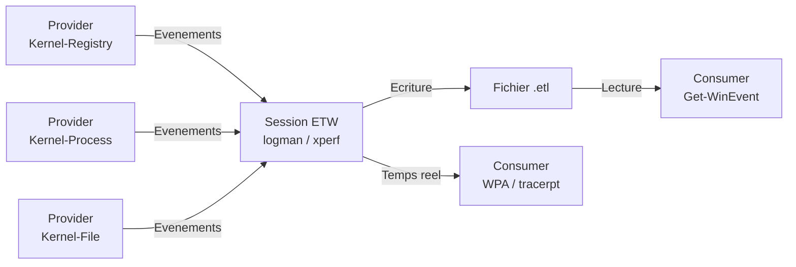
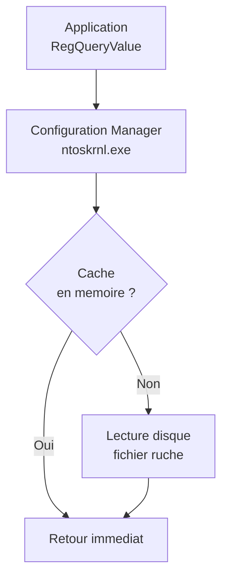
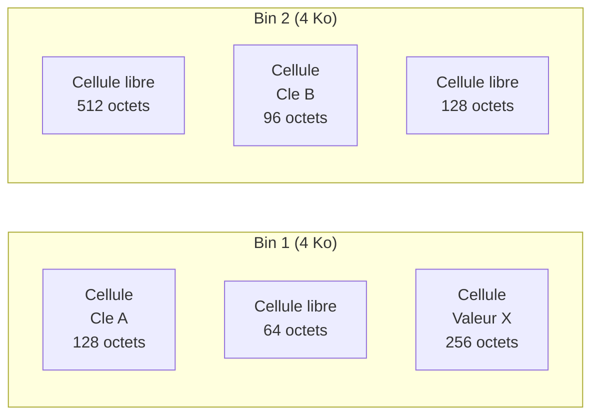
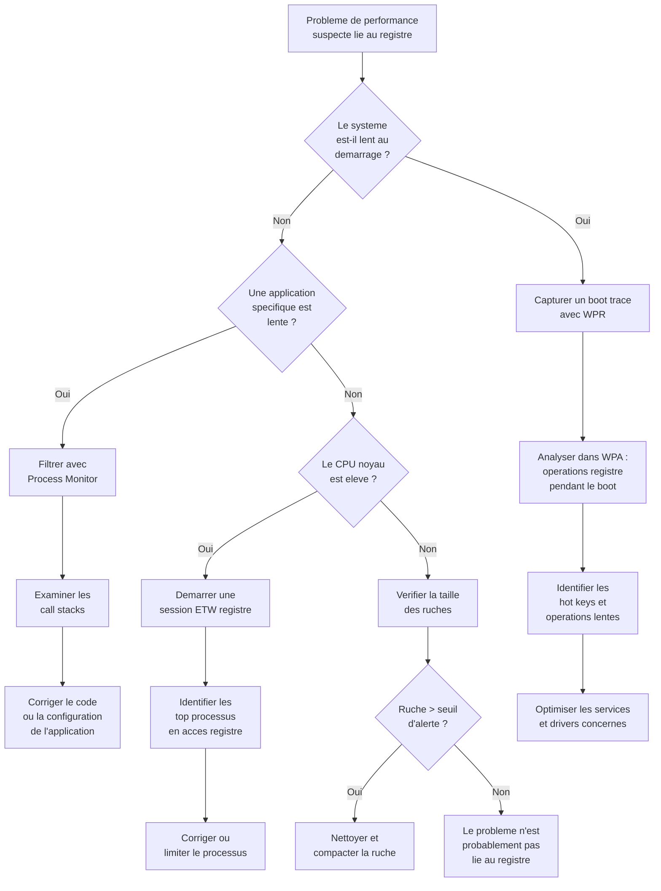

---
tags:
  - registre
  - ETW
  - performance
  - tracing
---

# ETW, tracing et performance du registre

!!! abstract "Ce que vous allez apprendre"
    - L'architecture ETW et le provider registre Microsoft-Windows-Kernel-Registry
    - Comment capturer et analyser les evenements registre avec logman, xperf et PowerShell
    - Les techniques avancees de Process Monitor pour le tracing registre
    - L'analyse de performance avec Windows Performance Recorder (WPR) et Analyzer (WPA)
    - Le fonctionnement interne du cache de ruches et la politique de flush
    - Comment mesurer et optimiser les operations de registre
    - Le depannage des problemes de performance lies au registre

---

## En 30 secondes

Vous suspectez qu'une application ralentit le systeme a cause d'acces registre excessifs. Une seule commande suffit pour commencer a capturer :

```powershell
# Start an ETW trace session capturing all registry events
logman create trace RegistryTrace -p Microsoft-Windows-Kernel-Registry 0xFFFFFFFF -o C:\Traces\registry.etl -ets
```

```title="Resultat attendu"
The command completed successfully.
```

Laissez tourner quelques minutes, puis arretez :

```powershell
# Stop the trace session
logman stop RegistryTrace -ets
```

```title="Resultat attendu"
The command completed successfully.
```

Vous disposez maintenant d'un fichier `.etl` contenant chaque ouverture, lecture, ecriture et fermeture de cle registre survenue sur la machine. Ce chapitre vous apprend a exploiter cette mine d'informations.

!!! tip "Analogie"
    ETW est un **systeme de cameras de surveillance** installe dans les couloirs du noyau Windows. Les cameras (providers) filment en permanence, mais personne ne regarde tant que vous n'allumez pas un moniteur (session de trace). Quand vous activez une session, les images s'enregistrent sur bande (fichier `.etl`). Vous pouvez ensuite rembobiner et analyser chaque passage.

!!! info "En resume"
    - La commande `logman` permet de demarrer une session ETW en une ligne pour capturer toutes les operations registre dans un fichier `.etl`
    - Le fichier `.etl` enregistre chaque ouverture, lecture, ecriture et fermeture de cle survenue sur la machine
    - Ce chapitre couvre ETW, Process Monitor, WPR/WPA, le cache des ruches, le benchmarking et l'optimisation des performances registre

---

## ETW et le registre

### Architecture ETW

Event Tracing for Windows (ETW) est le mecanisme de tracing integre au noyau Windows depuis Windows 2000. Il repose sur trois acteurs :



| Composant | Role | Exemples |
|-----------|------|----------|
| **Provider** | Genere les evenements | Microsoft-Windows-Kernel-Registry, Microsoft-Windows-Kernel-Process |
| **Session** | Collecte et route les evenements | logman, xperf, New-EtwTraceSession |
| **Consumer** | Lit et analyse les evenements | WPA, tracerpt, Get-WinEvent, PerfView |

Les providers sont enregistres dans le systeme avec un GUID unique. Quand une session s'abonne a un provider, celui-ci commence a emettre des evenements dans un buffer en memoire. La session ecrit ces buffers dans un fichier `.etl` ou les transmet en temps reel a un consumer.

!!! info "Performance du tracing"
    ETW est concu pour un impact minimal sur les performances. Les buffers sont geres en mode noyau et le provider n'emet rien si aucune session n'ecoute. Le surcout typique est inferieur a 5% du CPU, meme sous forte charge.

### Le provider Microsoft-Windows-Kernel-Registry

Le provider registre est integre directement dans le noyau Windows (ntoskrnl.exe). Il capture **toutes** les operations du Configuration Manager.

| Propriete | Valeur |
|-----------|--------|
| **Nom** | Microsoft-Windows-Kernel-Registry |
| **GUID** | `{70eb4f03-c1de-4f73-a051-33d13d5413bd}` |
| **Source** | ntoskrnl.exe |
| **Niveau minimal** | Windows Vista / Server 2008 |

```powershell
# Verify the provider is registered on the system
logman query providers | Select-String "Kernel-Registry"
```

```title="Resultat attendu"
Microsoft-Windows-Kernel-Registry {70EB4F03-C1DE-4F73-A051-33D13D5413BD}
```

Pour afficher les mots-cles (keywords) disponibles :

```powershell
# List available keywords for the registry provider
logman query providers Microsoft-Windows-Kernel-Registry
```

```title="Resultat attendu"
Provider                                 GUID
-------------------------------------------------------------------------------
Microsoft-Windows-Kernel-Registry        {70EB4F03-C1DE-4F73-A051-33D13D5413BD}

Value               Keyword              Description
-------------------------------------------------------------------------------
0x0000000000000001  CreateKey            Key create operations
0x0000000000000002  OpenKey              Key open operations
0x0000000000000004  DeleteKey            Key delete operations
0x0000000000000008  QueryKey             Key query operations
0x0000000000000010  SetValue             Value set operations
0x0000000000000020  DeleteValue          Value delete operations
0x0000000000000040  QueryValue           Value query operations
0x0000000000000080  EnumerateKey         Key enumerate operations
0x0000000000000100  EnumerateValueKey    Value enumerate operations
0x0000000000000200  QueryMultipleValues  Multiple value query operations
0x0000000000000400  SetInformation       Key set information operations
0x0000000000000800  FlushKey             Key flush operations
0x0000000000001000  CloseKey             Key close operations
0x0000000000002000  QuerySecurity        Key query security operations
0x0000000000004000  SetSecurity          Key set security operations

Value               Level                Description
-------------------------------------------------------------------------------
0x01                win:Error            Error
0x04                win:Informational    Information
0x05                win:Verbose          Verbose
```

### Table des evenements registre

Le provider emet un evenement distinct pour chaque type d'operation. Voici la table de reference complete :

| Event ID | Nom | Description |
|:--------:|-----|-------------|
| 1 | `CreateKey` | Creation d'une nouvelle cle |
| 2 | `OpenKey` | Ouverture d'une cle existante |
| 3 | `DeleteKey` | Suppression d'une cle |
| 4 | `QueryKey` | Interrogation des metadonnees d'une cle (nombre de sous-cles, etc.) |
| 5 | `SetValue` | Ecriture ou modification d'une valeur |
| 6 | `DeleteValue` | Suppression d'une valeur |
| 7 | `QueryValue` | Lecture d'une valeur |
| 8 | `EnumerateKey` | Enumeration des sous-cles |
| 9 | `EnumerateValueKey` | Enumeration des valeurs d'une cle |
| 10 | `QueryMultipleValues` | Lecture de plusieurs valeurs en une seule operation |
| 11 | `SetInformationKey` | Modification des attributs d'une cle (securite, etc.) |
| 12 | `FlushKey` | Ecriture forcee des modifications sur disque |
| 13 | `CloseKey` | Fermeture d'un handle de cle |
| 14 | `QuerySecurityKey` | Interrogation du descripteur de securite |
| 15 | `SetSecurityKey` | Modification du descripteur de securite |
| 16 | `RegPerfInfo` | Informations de performance internes |
| 17 | `VirtualizationCheck` | Verification de la virtualisation du registre (UAC) |
| 18 | `KCBCreate` | Creation d'un Key Control Block en memoire |
| 19 | `KCBDelete` | Suppression d'un Key Control Block |

!!! note "KCB -- Key Control Block"
    Les evenements KCBCreate et KCBDelete sont des evenements internes du Configuration Manager. Le KCB est la structure en memoire qui represente une cle ouverte. Ces evenements sont utiles pour diagnostiquer les fuites de handles registre.

Chaque evenement contient les champs suivants :

| Champ | Type | Description |
|-------|------|-------------|
| `KeyName` | String | Chemin complet de la cle |
| `Status` | NTSTATUS | Code de retour de l'operation |
| `ProcessId` | UInt32 | PID du processus appelant |
| `ThreadId` | UInt32 | TID du thread appelant |
| `TimeStamp` | UInt64 | Horodatage haute resolution (100 ns) |
| `KeyHandle` | Pointer | Handle de la cle |

---

### Demarrer une session de trace

Il existe trois methodes principales pour capturer les evenements registre.

#### Methode 1 : logman (outil integre)

```powershell
# Create and start a registry trace session
logman create trace RegistryTrace `
    -p Microsoft-Windows-Kernel-Registry 0xFFFFFFFF `
    -o C:\Traces\registry.etl `
    -ets

# Let it run for 60 seconds, then stop
Start-Sleep -Seconds 60
logman stop RegistryTrace -ets
```

```title="Resultat attendu"
The command completed successfully.
The command completed successfully.
```

Les parametres :

| Parametre | Role |
|-----------|------|
| `-p` | Provider a activer |
| `0xFFFFFFFF` | Masque de mots-cles (tous les evenements) |
| `-o` | Fichier de sortie |
| `-ets` | Demarre immediatement (Event Trace Session) |

!!! warning "Droits administrateur"
    Les sessions ETW noyau necessitent des **privileges administrateur**. Lancez toujours votre terminal en tant qu'administrateur.

#### Methode 2 : xperf (Windows Performance Toolkit)

```batch
REM Start registry tracing with xperf
xperf -on REGISTRY

REM Perform the activity you want to trace...

REM Stop and save the trace
xperf -d C:\Traces\registry_xperf.etl
```

```title="Resultat attendu"
Merged Etl: C:\Traces\registry_xperf.etl
```

xperf fait partie du **Windows Performance Toolkit**, inclus dans le Windows ADK. Il offre des options de capture plus granulaires.

#### Methode 3 : PowerShell (New-EtwTraceSession)

```powershell
# Create a new ETW session with PowerShell
New-EtwTraceSession -Name "RegistryTrace" `
    -LogFileMode 0x2 `
    -LocalFilePath "C:\Traces\registry_ps.etl"

# Add the registry provider to the session
Add-EtwTraceProvider -SessionName "RegistryTrace" `
    -Guid "{70eb4f03-c1de-4f73-a051-33d13d5413bd}" `
    -Level 5 `
    -MatchAnyKeyword 0xFFFFFFFF

# When done, stop the session
Stop-EtwTraceSession -Name "RegistryTrace"
```

```title="Resultat attendu"
Aucune sortie si la commande reussit.
```

!!! tip "Avantage PowerShell"
    L'approche PowerShell permet un controle fin sur le niveau de detail (Level) et les mots-cles. Le niveau 5 correspond a Verbose, qui capture tous les evenements.

---

### Analyser les fichiers .etl

Une fois la trace collectee, plusieurs outils permettent de l'exploiter.

#### tracerpt (outil integre)

```powershell
# Convert .etl to CSV and XML summary
tracerpt C:\Traces\registry.etl -o C:\Traces\registry.csv -of CSV -summary C:\Traces\summary.xml
```

```title="Resultat attendu"
Input
----------------
File(s):
        C:\Traces\registry.etl
...
Output
----------------
DumpFile:       C:\Traces\registry.csv
Summary:        C:\Traces\summary.xml
The command completed successfully.
```

Le fichier CSV resultant contient une ligne par evenement, avec le timestamp, le PID, le nom de la cle et le code retour.

#### Get-WinEvent (PowerShell)

```powershell
# Read registry events from an ETL file
$events = Get-WinEvent -Path "C:\Traces\registry.etl" -Oldest -MaxEvents 100
$events | Format-Table TimeCreated, Id, ProcessId, Message -AutoSize
```

```title="Resultat attendu"
TimeCreated          Id ProcessId Message
-----------          -- --------- -------
2026-04-03 10:15:01   2      4812 OpenKey \REGISTRY\MACHINE\SOFTWARE\...
2026-04-03 10:15:01   7      4812 QueryValue \REGISTRY\MACHINE\SOFTWARE\...
2026-04-03 10:15:01  13      4812 CloseKey \REGISTRY\MACHINE\SOFTWARE\...
```

#### Filtrage par processus

```powershell
# Filter registry events for a specific process
$targetPid = 4812
$events = Get-WinEvent -Path "C:\Traces\registry.etl" -Oldest |
    Where-Object { $_.ProcessId -eq $targetPid }

# Group by event type
$events | Group-Object Id | Sort-Object Count -Descending |
    Select-Object Count, @{N="Operation"; E={
        switch ($_.Name) {
            "1" { "CreateKey" }
            "2" { "OpenKey" }
            "5" { "SetValue" }
            "7" { "QueryValue" }
            "13" { "CloseKey" }
            default { "EventId_$($_.Name)" }
        }
    }}
```

```title="Resultat attendu"
Count Operation
----- ---------
 4521 QueryValue
 3890 OpenKey
 3890 CloseKey
  245 SetValue
   12 CreateKey
```

#### xperf (analyse avancee)

```batch
REM Generate a text report from an ETL file
xperf -i C:\Traces\registry_xperf.etl -o C:\Traces\registry_report.txt -a registry
```

```title="Resultat attendu"
Aucune sortie si la commande reussit. Le rapport est ecrit dans C:\Traces\registry_report.txt.
```

xperf produit un rapport structure listant les cles les plus accedees et les operations les plus lentes.

!!! info "En resume"
    - Le provider Microsoft-Windows-Kernel-Registry (GUID `{70eb4f03-...}`) capture toutes les operations registre du noyau avec un impact minimal sur les performances
    - Trois methodes de capture : logman (integre), xperf (Windows Performance Toolkit) et New-EtwTraceSession (PowerShell)
    - Les fichiers .etl se convertissent en CSV via tracerpt ou s'analysent avec Get-WinEvent pour filtrer par processus, type d'operation ou cle specifique

---

## Process Monitor en profondeur

### Pourquoi Process Monitor est l'outil de reference

Process Monitor (Procmon) de Sysinternals est l'outil que la majorite des administrateurs et developpeurs utilisent au quotidien pour tracer les acces registre. Contrairement a ETW brut, il fournit une **interface graphique temps reel** avec filtrage, call stacks et correlation automatique.

En interne, Procmon utilise lui-meme un driver noyau qui intercepte les operations registre via les callbacks CmRegisterCallbackEx -- le meme mecanisme qu'ETW, mais avec un traitement plus riche cote utilisateur.

### Filtrage avance pour le registre

Par defaut, Procmon capture le systeme de fichiers, le registre et le reseau. Pour se concentrer sur le registre :

1. Ouvrez **Filter** (Ctrl+L)
2. Ajoutez la regle : `Operation` → `begins with` → `Reg` → `Include`
3. Cliquez **Add** puis **Apply**

Vous pouvez aussi utiliser les boutons de la barre d'outils pour desactiver les categories **File System** et **Network**, en ne laissant actif que **Registry**.

Les operations registre capturees par Procmon :

| Operation | Description |
|-----------|-------------|
| `RegOpenKey` | Ouverture d'une cle |
| `RegCreateKey` | Creation d'une cle |
| `RegCloseKey` | Fermeture d'une cle |
| `RegQueryKey` | Interrogation des metadonnees |
| `RegQueryValue` | Lecture d'une valeur |
| `RegSetValue` | Ecriture d'une valeur |
| `RegDeleteKey` | Suppression d'une cle |
| `RegDeleteValue` | Suppression d'une valeur |
| `RegEnumKey` | Enumeration des sous-cles |
| `RegEnumValue` | Enumeration des valeurs |
| `RegFlushKey` | Flush sur disque |
| `RegLoadKey` | Chargement d'une ruche |
| `RegUnloadKey` | Dechargement d'une ruche |

### Personnalisation des colonnes

Pour une analyse registre efficace, ajoutez ces colonnes (clic droit sur l'en-tete → **Select Columns**) :

| Colonne | Utilite |
|---------|---------|
| **Duration** | Temps d'execution de l'operation en secondes |
| **Detail** | Donnees lues ou ecrites |
| **Integrity** | Niveau d'integrite du processus (System, High, Medium, Low) |
| **Category** | Confirme qu'il s'agit bien d'une operation "Registry" |

### Call stacks : identifier quel code accede au registre

La fonctionnalite la plus puissante de Procmon est la **pile d'appels**. Double-cliquez sur un evenement, puis allez dans l'onglet **Stack** :

```title="Exemple de call stack"
0  ntoskrnl.exe     CmQueryValueKey + 0x1a2
1  ntoskrnl.exe     NtQueryValueKey + 0x85
2  ntdll.dll        NtQueryValueKey + 0x14
3  KERNELBASE.dll   RegQueryValueExW + 0x110
4  advapi32.dll     RegQueryValueExW + 0x23
5  MyApp.exe        ReadConfig + 0x4a
6  MyApp.exe        Initialize + 0x112
7  MyApp.exe        main + 0x30
```

La pile montre que `MyApp.exe`, dans sa fonction `ReadConfig`, appelle `RegQueryValueExW`. Cela permet d'identifier **exactement** quelle ligne de code est responsable d'un acces registre.

!!! tip "Symboles de debug"
    Pour obtenir des noms de fonctions lisibles, configurez les symboles : **Options** → **Configure Symbols** → ajoutez le chemin `srv*C:\Symbols*https://msdl.microsoft.com/download/symbols`. Sans symboles, vous ne verrez que des offsets hexadecimaux.

### Procmon Boot Logging

Certains problemes de registre surviennent **avant** que vous puissiez lancer Procmon (drivers, services de demarrage, etc.). Le Boot Logging resout ce probleme.

**Activation :**

1. Ouvrez Procmon
2. **Options** → **Enable Boot Logging**
3. Choisissez **Generate thread profiling events** si vous voulez des informations de performance
4. Redemarrez le PC

**Fonctionnement :**

Au redemarrage, le driver Procmon (`PROCMON24.SYS`) se charge tres tot dans le processus de boot et commence a enregistrer tous les evenements dans un fichier temporaire :

```
C:\Windows\Procmon.PMB
```

**Recuperation :**

1. Apres le demarrage, lancez Procmon
2. Il detecte automatiquement le fichier de boot et propose de le convertir
3. Enregistrez le resultat en `.PML` pour analyse

!!! warning "Taille du fichier"
    Le boot logging capture **toute** l'activite systeme pendant le demarrage. Le fichier peut atteindre plusieurs gigaoctets. Prevoyez suffisamment d'espace disque.

### Ligne de commande Procmon

Pour des captures automatisees ou scriptees :

```batch
REM Start Procmon in quiet mode with a backing file
Procmon.exe /BackingFile C:\Traces\boot_trace.pml /Quiet /Minimized

REM Apply a predefined filter
Procmon.exe /BackingFile C:\Traces\registry.pml /LoadConfig RegistryOnly.pmc /Quiet

REM Terminate Procmon after capture
Procmon.exe /Terminate
```

```title="Resultat attendu"
Aucune sortie console. Procmon demarre ou s'arrete en mode silencieux selon la commande utilisee.
```

| Parametre | Effet |
|-----------|-------|
| `/BackingFile` | Fichier de sortie (au lieu du fichier virtuel en memoire) |
| `/Quiet` | Accepte automatiquement le CLUF |
| `/Minimized` | Demarre minimise dans la barre des taches |
| `/LoadConfig` | Charge un fichier de configuration de filtres |
| `/Terminate` | Arrete une instance Procmon en cours |

### Exemples de filtres avances

**Trouver toutes les ecritures sur une cle specifique :**

| Colonne | Relation | Valeur | Action |
|---------|----------|--------|--------|
| `Path` | `contains` | `CurrentVersion\Run` | Include |
| `Operation` | `is` | `RegSetValue` | Include |

**Trouver tous les acces refuses :**

| Colonne | Relation | Valeur | Action |
|---------|----------|--------|--------|
| `Result` | `is` | `ACCESS DENIED` | Include |
| `Category` | `is` | `Registry` | Include |

**Trouver toutes les operations par un processus specifique :**

| Colonne | Relation | Valeur | Action |
|---------|----------|--------|--------|
| `Process Name` | `is` | `svchost.exe` | Include |
| `Category` | `is` | `Registry` | Include |

!!! note "Sauvegarder vos filtres"
    **File** → **Export Configuration** sauvegarde vos filtres dans un fichier `.pmc`. Pratique pour reutiliser les memes filtres sur differentes machines.

!!! info "En resume"
    - Procmon utilise un driver noyau pour intercepter les operations registre en temps reel avec filtrage, call stacks et correlation automatique
    - Le Boot Logging capture l'activite registre des le demarrage de Windows (avant que Procmon ne soit lance manuellement)
    - Les call stacks sont la fonctionnalite la plus puissante : elles identifient la fonction exacte responsable d'un acces registre

---

## Windows Performance Recorder (WPR) et Analyzer (WPA)

### Enregistrement avec WPR

Windows Performance Recorder fait partie du **Windows Performance Toolkit** (inclus dans le Windows ADK). Il produit des traces `.etl` riches, exploitables dans Windows Performance Analyzer (WPA).

Pour capturer l'activite registre, utilisez le profil **Registry I/O** :

```powershell
# Start a WPR recording with registry tracing
wpr -start Registry

# Perform the activity you want to analyze...

# Stop the recording
wpr -stop C:\Traces\registry_wpr.etl "Registry performance analysis"
```

```title="Resultat attendu"
Aucune sortie si la commande reussit. Le fichier registry_wpr.etl est genere dans C:\Traces\.
```

### Profil WPR personnalise pour le registre

Pour un controle plus fin, creez un profil `.wprp` personnalise :

```xml
<?xml version="1.0" encoding="utf-8"?>
<WindowsPerformanceRecorder Version="1.0">
  <Profiles>
    <EventCollector Id="RegistryCollector" Name="Registry Event Collector">
      <BufferSize Value="1024" />
      <Buffers Value="64" />
    </EventCollector>

    <EventProvider Id="RegistryProvider"
                   Name="Microsoft-Windows-Kernel-Registry"
                   Level="5"
                   NonPagedMemory="true">
      <Keywords>
        <Keyword Value="0xFFFFFFFF" />
      </Keywords>
    </EventProvider>

    <Profile Id="RegistryProfile"
             Name="RegistryProfile"
             Description="Capture all registry operations"
             LoggingMode="File"
             DetailLevel="Verbose">
      <Collectors>
        <EventCollectorId Value="RegistryCollector">
          <EventProviders>
            <EventProviderId Value="RegistryProvider" />
          </EventProviders>
        </EventCollectorId>
      </Collectors>
    </Profile>
  </Profiles>
</WindowsPerformanceRecorder>
```

```powershell
# Start recording with the custom profile
wpr -start C:\Profiles\RegistryProfile.wprp

# Stop the recording
wpr -stop C:\Traces\registry_custom.etl "Custom registry trace"
```

```title="Resultat attendu"
Aucune sortie si la commande reussit. Le fichier registry_custom.etl est genere dans C:\Traces\.
```

### Analyse dans WPA

Ouvrez le fichier `.etl` dans **Windows Performance Analyzer** (wpa.exe). L'activite registre se trouve dans :

**Generic Events** → **Microsoft-Windows-Kernel-Registry**

#### Groupements utiles

| Groupement | Ce qu'il revele |
|------------|-----------------|
| Par **Process** | Quel processus genere le plus d'evenements registre |
| Par **KeyName** | Quelles cles sont les plus sollicitees (hot keys) |
| Par **Event Type** | Repartition entre lectures, ecritures, enumerations |
| Par **Thread** | Identification des threads qui saturent le registre |

#### Identifier les cles les plus accedees (hot keys)

Dans WPA, appliquez le preset **Registry by Key** :

1. Faites glisser **Microsoft-Windows-Kernel-Registry** dans la zone d'analyse
2. Faites un clic droit → **Organize Columns**
3. Placez **KeyName** dans la zone **Grouping**
4. Triez par **Count** decroissant

Les cles avec des milliers d'acces sont des candidates a l'optimisation. Un acces excessif a une meme cle peut indiquer un polling (lecture repetee en boucle).

#### Identifier les operations lentes

Pour trouver les operations avec une duree anormalement elevee :

1. Ajoutez la colonne **Duration (ms)** si elle n'est pas visible
2. Triez par duree decroissante
3. Les operations depassant 10 ms meritent une investigation

!!! warning "Operations lentes typiques"
    - `FlushKey` : ecriture forcee sur disque, inheremment lente
    - `EnumerateKey` sur des cles avec des milliers de sous-cles
    - `OpenKey` sur des cles avec des ACL complexes
    - `SetValue` pendant une contention (plusieurs processus ecrivent en meme temps)

#### Timeline du demarrage

WPA excelle dans l'analyse du demarrage. Pour capturer :

```batch
REM Enable boot tracing with WPR
wpr -boottrace -addboot Registry

REM Reboot the machine...
REM After reboot, stop the trace:
wpr -boottrace -stopboot C:\Traces\boot_registry.etl
```

```title="Resultat attendu"
Aucune sortie si la commande reussit. Le fichier boot_registry.etl est genere dans C:\Traces\.
```

Dans WPA, la timeline montre l'activite registre seconde par seconde pendant le boot. Les pics d'activite correspondent aux phases de chargement des services et drivers.

!!! info "En resume"
    - WPR capture des traces .etl riches avec le profil Registry ; un profil .wprp personnalise offre un controle fin sur les keywords et le niveau de detail
    - WPA permet de grouper les evenements par processus, cle ou type d'operation pour identifier les hot keys et les operations lentes
    - Le boot tracing (`wpr -boottrace`) est indispensable pour analyser l'activite registre pendant le demarrage de Windows

---

## Performance du registre

### Cache des ruches en memoire

Le Configuration Manager (Cm) du noyau Windows ne lit pas les ruches depuis le disque a chaque acces. Les ruches sont **mappees en memoire** au demarrage et restent en cache.



Le cache fonctionne a deux niveaux :

1. **Hive mapping** : chaque fichier de ruche est mappe en memoire virtuelle via des sections. Le Memory Manager de Windows gere la pagination -- les pages frequemment accedees restent en RAM physique.

2. **Cell Map** : le Configuration Manager maintient une table qui traduit les index de cellules (cell index) en adresses memoire. Cette table, appelee Cell Map Array, permet un acces O(1) a n'importe quelle cellule de la ruche.

### Structures internes du cache

| Structure | Role | Taille typique |
|-----------|------|---------------|
| **KCB (Key Control Block)** | Represente une cle ouverte en memoire | ~200 octets par cle |
| **KCB Name Block** | Stocke le nom de la cle | Variable |
| **Cell Map Array** | Traduit les index de cellules en adresses | Proportionnel a la taille de la ruche |
| **Hive Bins** | Blocs de 4 Ko contenant les cellules | Taille totale de la ruche |

### Impact de la taille des ruches

La taille d'une ruche affecte directement la memoire consommee et les temps de chargement au demarrage.

| Ruche | Taille typique | Emplacement | Ce qui la fait grossir |
|-------|:-------------:|-------------|----------------------|
| SOFTWARE | 50 -- 200 Mo | `%SystemRoot%\System32\config\SOFTWARE` | Applications installees, enregistrements COM, profils de configuration |
| NTUSER.DAT | 2 -- 30 Mo (par utilisateur) | `%UserProfile%\NTUSER.DAT` | Preferences d'applications, MRU lists, associations de fichiers |
| SYSTEM | 10 -- 50 Mo | `%SystemRoot%\System32\config\SYSTEM` | Drivers, services, configuration materielle |
| SAM | < 1 Mo | `%SystemRoot%\System32\config\SAM` | Comptes utilisateurs locaux |
| SECURITY | < 1 Mo | `%SystemRoot%\System32\config\SECURITY` | Politiques de securite locales |

```powershell
# Measure hive sizes on the current system
$configPath = "$env:SystemRoot\System32\config"
$hives = @("SOFTWARE", "SYSTEM", "SAM", "SECURITY", "DEFAULT")

foreach ($hive in $hives) {
    $file = Get-Item "$configPath\$hive" -ErrorAction SilentlyContinue
    if ($file) {
        [PSCustomObject]@{
            Hive   = $hive
            SizeMB = [math]::Round($file.Length / 1MB, 2)
        }
    }
}

# Also check current user's NTUSER.DAT
$ntuser = Get-Item "$env:UserProfile\NTUSER.DAT" -Force -ErrorAction SilentlyContinue
if ($ntuser) {
    [PSCustomObject]@{
        Hive   = "NTUSER.DAT"
        SizeMB = [math]::Round($ntuser.Length / 1MB, 2)
    }
}
```

```title="Resultat attendu"
Hive      SizeMB
----      ------
SOFTWARE   87.50
SYSTEM     18.75
SAM         0.05
SECURITY    0.03
DEFAULT     0.26
NTUSER.DAT  5.32
```

### Fragmentation interne des ruches

Les ruches utilisent un systeme d'allocation par **bins** (blocs de 4 Ko) contenant des **cellules** de taille variable. Quand une cle ou une valeur est supprimee, la cellule est marquee comme libre mais l'espace n'est pas recupere.



Avec le temps, la fragmentation augmente : de nombreuses cellules libres sont trop petites pour etre reutilisees, mais le fichier ne retrecit pas. C'est pourquoi une ruche SOFTWARE peut peser 200 Mo alors que les donnees utiles n'occupent que 120 Mo.

### Politique de flush

Le registre n'ecrit pas immediatement chaque modification sur disque. Il utilise un mecanisme de **lazy flush** :

| Parametre | Valeur par defaut | Description |
|-----------|:-----------------:|-------------|
| **RegistryFlushInterval** | 5 secondes | Intervalle entre deux flush automatiques |
| **RegistryLazyFlushHiveCount** | 1 | Nombre de ruches traitees par cycle de flush |

Ces valeurs sont configurables (mais rarement modifiees) dans :

```
HKLM\SYSTEM\CurrentControlSet\Control\Session Manager\Configuration Manager
```

| Valeur | Type | Donnees par defaut | Description |
|--------|:----:|:------------------:|-------------|
| `RegistryFlushInterval` | REG_DWORD | `5` | Intervalle en secondes entre les flush |

!!! danger "Ne modifiez pas sans raison"
    Augmenter l'intervalle de flush ameliore les performances en ecriture mais augmente le risque de perte de donnees en cas de crash. La valeur par defaut est un bon compromis.

**Lazy flush vs forced flush :**

- **Lazy flush** : le Configuration Manager ecrit les modifications en arriere-plan a intervalles reguliers. C'est le comportement normal.
- **Forced flush** : l'API `RegFlushKey` force l'ecriture immediate d'une ruche sur disque. C'est une operation couteuse qui bloque le thread appelant.

```powershell
# Demonstrate the difference (conceptual)
# Normal write (lazy flush, returns instantly)
Set-ItemProperty -Path "HKCU:\Software\Test" -Name "Value1" -Value "data"

# Forced flush via .NET (blocks until disk write completes)
$key = [Microsoft.Win32.Registry]::CurrentUser.OpenSubKey("Software\Test", $true)
$key.SetValue("Value2", "data")
$key.Flush()  # Forces immediate disk write
$key.Close()
```

```title="Resultat attendu"
Aucune sortie si la commande reussit. La difference est dans le temps d'execution : Set-ItemProperty retourne immediatement, tandis que Flush() bloque jusqu'a l'ecriture sur disque.
```

### RegIdleBackup : compression en arriere-plan

Windows execute periodiquement une tache planifiee appelee **RegIdleBackup** qui effectue une copie de sauvegarde des ruches et peut les compacter :

```
Task Scheduler Library\Microsoft\Windows\Registry\RegIdleBackup
```

```powershell
# Check the RegIdleBackup scheduled task
Get-ScheduledTask -TaskName "RegIdleBackup" |
    Select-Object TaskName, State, @{N="LastRun"; E={
        (Get-ScheduledTaskInfo -TaskName $_.TaskName).LastRunTime
    }}
```

```title="Resultat attendu"
TaskName       State LastRun
--------       ----- -------
RegIdleBackup  Ready 4/2/2026 3:00:00 AM
```

Les sauvegardes sont stockees dans :

```
%SystemRoot%\System32\config\RegBack
```

!!! note "Windows 10 version 1803+"
    A partir de Windows 10 version 1803, Microsoft a **desactive** la sauvegarde automatique des ruches dans RegBack. Le dossier existe toujours mais les fichiers ont une taille de 0 octet. Pour la reactiver, creez la valeur suivante :

    ```
    HKLM\SYSTEM\CurrentControlSet\Control\Session Manager\Configuration Manager
    ```

    | Valeur | Type | Donnees |
    |--------|:----:|:-------:|
    | `EnablePeriodicBackup` | REG_DWORD | `1` |

    Puis redemarrez.

### Journaux de transactions : .LOG1 et .LOG2

Chaque ruche est accompagnee de fichiers de journalisation WAL (Write-Ahead Logging) :

```
SOFTWARE          ← Fichier principal de la ruche
SOFTWARE.LOG1     ← Premier journal de transactions
SOFTWARE.LOG2     ← Second journal de transactions (rotation)
```

**Fonctionnement :**

1. Quand le Configuration Manager modifie une ruche, il ecrit d'abord la modification dans le fichier `.LOG1`
2. Une fois le journal ecrit et confirme sur disque, la modification est appliquee au fichier principal
3. Si le systeme plante entre les etapes 1 et 2, le journal permet de **rejouer** les transactions au prochain demarrage

Le fichier `.LOG2` sert de journal de rotation : quand `.LOG1` est plein ou en cours d'application, `.LOG2` prend le relais.

```powershell
# List hive files and their transaction logs
$configPath = "$env:SystemRoot\System32\config"
Get-ChildItem $configPath -File |
    Where-Object { $_.Name -match "^(SOFTWARE|SYSTEM|SAM|SECURITY|DEFAULT)" } |
    Sort-Object Name |
    Select-Object Name, @{N="SizeMB"; E={[math]::Round($_.Length / 1MB, 2)}}
```

```title="Resultat attendu"
Name              SizeMB
----              ------
DEFAULT             0.26
DEFAULT.LOG1        0.07
DEFAULT.LOG2        0.01
SAM                 0.05
SAM.LOG1            0.02
SAM.LOG2            0.01
SECURITY            0.03
SECURITY.LOG1       0.02
SECURITY.LOG2       0.01
SOFTWARE           87.50
SOFTWARE.LOG1       3.25
SOFTWARE.LOG2       0.50
SYSTEM             18.75
SYSTEM.LOG1         1.12
SYSTEM.LOG2         0.25
```

!!! info "Taille des journaux"
    La taille des fichiers `.LOG` est proportionnelle au volume de modifications. Un journal depassant 10% de la taille de la ruche indique une forte activite d'ecriture.

!!! info "En resume"
    - Les ruches sont mappees en memoire au demarrage ; le Configuration Manager utilise un Cell Map Array pour un acces O(1) aux cellules
    - Le lazy flush ecrit les modifications sur disque toutes les 5 secondes par defaut ; RegFlushKey force une ecriture immediate mais couteuse
    - Les journaux de transactions (.LOG1, .LOG2) assurent la resilience face aux crashes ; RegIdleBackup est desactive depuis Windows 10 1803 (reactivable via EnablePeriodicBackup)

---

## Benchmarking des operations de registre

### Mesurer la latence avec PowerShell

```powershell
# Benchmark registry read operations
$iterations = 10000
$path = "HKLM:\SOFTWARE\Microsoft\Windows\CurrentVersion"
$valueName = "ProgramFilesDir"

# Warm up the cache
$null = Get-ItemPropertyValue -Path $path -Name $valueName

# Measure read latency
$readTime = Measure-Command {
    for ($i = 0; $i -lt $iterations; $i++) {
        $null = Get-ItemPropertyValue -Path $path -Name $valueName
    }
}

$avgReadUs = [math]::Round(($readTime.TotalMilliseconds / $iterations) * 1000, 2)
Write-Output "Average read latency: $avgReadUs microseconds ($iterations iterations)"
```

```title="Resultat attendu"
Average read latency: 12.45 microseconds (10000 iterations)
```

```powershell
# Benchmark registry write operations
$testPath = "HKCU:\Software\PerfTest"
New-Item -Path $testPath -Force | Out-Null

$writeTime = Measure-Command {
    for ($i = 0; $i -lt $iterations; $i++) {
        Set-ItemProperty -Path $testPath -Name "TestValue" -Value $i
    }
}

$avgWriteUs = [math]::Round(($writeTime.TotalMilliseconds / $iterations) * 1000, 2)
Write-Output "Average write latency: $avgWriteUs microseconds ($iterations iterations)"

# Clean up
Remove-Item -Path $testPath -Recurse
```

```title="Resultat attendu"
Average write latency: 45.67 microseconds (10000 iterations)
```

### Impact du nombre de sous-cles sur l'enumeration

Le temps d'enumeration augmente lineairement avec le nombre de sous-cles :

| Nombre de sous-cles | Temps d'enumeration | Ratio |
|:--------------------:|:-------------------:|:-----:|
| 10 | ~0.2 ms | 1x |
| 100 | ~1.5 ms | 7.5x |
| 1 000 | ~15 ms | 75x |
| 10 000 | ~180 ms | 900x |
| 50 000 | ~1 200 ms | 6 000x |

```powershell
# Create a test key with many subkeys, then measure enumeration time
$basePath = "HKCU:\Software\EnumTest"
New-Item -Path $basePath -Force | Out-Null

# Create 1000 subkeys
$createTime = Measure-Command {
    for ($i = 0; $i -lt 1000; $i++) {
        New-Item -Path "$basePath\Key_$i" -Force | Out-Null
    }
}
Write-Output "Creation of 1000 keys: $([math]::Round($createTime.TotalMilliseconds)) ms"

# Measure enumeration time
$enumTime = Measure-Command {
    $null = Get-ChildItem -Path $basePath
}
Write-Output "Enumeration of 1000 keys: $([math]::Round($enumTime.TotalMilliseconds)) ms"

# Clean up
Remove-Item -Path $basePath -Recurse
```

```title="Resultat attendu"
Creation of 1000 keys: 1250 ms
Enumeration of 1000 keys: 15 ms
```

### Impact de la taille des valeurs

| Taille de la valeur | Temps de lecture moyen | Notes |
|:--------------------:|:---------------------:|-------|
| 4 octets (DWORD) | ~8 us | Cas optimal |
| 256 octets | ~10 us | Negligeable |
| 4 Ko | ~15 us | Tient dans une cellule |
| 64 Ko | ~45 us | Plusieurs cellules |
| 1 Mo | ~350 us | Limite pratique |

!!! warning "Valeurs de grande taille"
    Le registre supporte techniquement des valeurs jusqu'a ~2 Go, mais les valeurs depassant 64 Ko degradent significativement les performances. Au-dela de 1 Mo, envisagez un fichier externe et stockez seulement le chemin dans le registre.

### Cache chaud vs cache froid

| Scenario | Latence typique (lecture) | Facteur |
|----------|:------------------------:|:-------:|
| **Cache chaud** (cle recemment accedee) | 5 -- 15 us | 1x |
| **Cache tiede** (ruche en memoire, page non residente) | 50 -- 200 us | 10 -- 20x |
| **Cache froid** (premiere lecture apres boot) | 500 -- 5 000 us | 100 -- 500x |

Le premier acces a une cle apres le demarrage est le plus lent car la page memoire correspondante doit etre chargee depuis le disque. Les acces suivants sont quasi instantanes.

### Impact de la complexite des ACL

Chaque ouverture de cle declenche une verification d'acces (*access check*). Plus l'ACL est complexe, plus cette verification prend du temps :

| Complexite ACL | Nombre d'ACE | Impact sur RegOpenKey |
|----------------|:------------:|:---------------------:|
| Simple (heritee) | 3 -- 5 | Negligeable |
| Moderee (personnalisee) | 10 -- 15 | +5 -- 10% |
| Complexe (audit + deny) | 20+ | +15 -- 30% |
| Tres complexe (groupes imbriques) | 50+ | +50 -- 100% |

### Comparaison des types de valeurs

```powershell
# Benchmark different value types
$testPath = "HKCU:\Software\TypeBench"
New-Item -Path $testPath -Force | Out-Null

$types = @{
    "REG_SZ"       = "This is a test string value for benchmarking"
    "REG_DWORD"    = 42
    "REG_BINARY"   = [byte[]](1..256)
    "REG_MULTI_SZ" = @("Line1", "Line2", "Line3", "Line4", "Line5")
}

foreach ($type in $types.GetEnumerator()) {
    Set-ItemProperty -Path $testPath -Name $type.Key -Value $type.Value

    $readTime = Measure-Command {
        for ($i = 0; $i -lt 10000; $i++) {
            $null = Get-ItemPropertyValue -Path $testPath -Name $type.Key
        }
    }

    $avgUs = [math]::Round(($readTime.TotalMilliseconds / 10000) * 1000, 2)
    Write-Output "$($type.Key): $avgUs us per read"
}

# Clean up
Remove-Item -Path $testPath -Recurse
```

```title="Resultat attendu"
REG_DWORD: 8.12 us per read
REG_SZ: 10.34 us per read
REG_BINARY: 14.78 us per read
REG_MULTI_SZ: 16.92 us per read
```

REG_DWORD est le plus rapide car c'est une valeur de taille fixe (4 octets) qui ne necessite aucune allocation dynamique.

!!! info "En resume"
    - La latence moyenne d'une lecture en cache chaud est de 5-15 microsecondes ; un cache froid (premiere lecture apres boot) peut atteindre 5 millisecondes
    - Le temps d'enumeration augmente lineairement avec le nombre de sous-cles (x900 a 10 000 sous-cles)
    - La complexite des ACL impacte chaque ouverture de cle : une ACL de 50+ ACE peut doubler le temps de RegOpenKey

---

## Optimisation pratique

### Reduire la taille de la ruche SOFTWARE

La ruche SOFTWARE est la plus volumineuse et celle qui beneficie le plus d'un nettoyage.

**Identifier les cles volumineuses :**

```powershell
# Find the largest subkeys under SOFTWARE (requires admin)
$root = "HKLM:\SOFTWARE"
$results = @()

foreach ($key in Get-ChildItem $root -ErrorAction SilentlyContinue) {
    $subkeyCount = 0
    try {
        $subkeyCount = (Get-ChildItem $key.PSPath -Recurse -ErrorAction SilentlyContinue).Count
    } catch { }
    $results += [PSCustomObject]@{
        Key       = $key.PSChildName
        SubKeys   = $subkeyCount
    }
}

$results | Sort-Object SubKeys -Descending | Select-Object -First 15
```

```title="Resultat attendu"
Key                SubKeys
---                -------
Classes              42150
Microsoft            28340
WOW6432Node          15200
Policies               890
RegisteredApplications  312
Intel                   245
Google                  198
Adobe                   176
Mozilla                 142
Clients                 118
DefaultIcon              95
Khronos                  78
Python                   62
7-Zip                    45
Notepad++                38
```

**Sources courantes de gonflement :**

| Source | Cle | Probleme |
|--------|-----|----------|
| Applications desinstallees | `SOFTWARE\Microsoft\Windows\CurrentVersion\Uninstall` | Entrees orphelines |
| Enregistrements COM obsoletes | `SOFTWARE\Classes\CLSID` | Classes COM d'applications supprimees |
| Extensions de fichiers | `SOFTWARE\Classes\.*` | Associations mortes |
| Pilotes anciens | `SYSTEM\CurrentControlSet\Enum` | Peripheriques jamais reconnectes |
| Caches de politique | `SOFTWARE\Policies` | Anciennes GPO non nettoyees |

**Nettoyage securise :**

```powershell
# Find orphaned uninstall entries (no DisplayName or UninstallString)
$uninstallPath = "HKLM:\SOFTWARE\Microsoft\Windows\CurrentVersion\Uninstall"
Get-ChildItem $uninstallPath | ForEach-Object {
    $props = Get-ItemProperty $_.PSPath
    if (-not $props.DisplayName -and -not $props.UninstallString) {
        [PSCustomObject]@{
            Key  = $_.PSChildName
            Path = $_.PSPath
        }
    }
}
```

```title="Resultat attendu"
Key                                    Path
---                                    ----
{A1B2C3D4-E5F6-7890-ABCD-EF1234567890} Microsoft.PowerShell.Core\Registry::...
{B2C3D4E5-F6A7-8901-BCDE-F12345678901} Microsoft.PowerShell.Core\Registry::...
```

!!! danger "Precautions avant nettoyage"
    1. Creez **toujours** une sauvegarde de la ruche avant modification (voir chapitre 7)
    2. Exportez la cle que vous allez supprimer : `reg export HKLM\SOFTWARE\... backup.reg`
    3. Testez sur une machine non critique d'abord

### Bonnes pratiques pour les developpeurs

#### Preferer HKCU a HKLM

Les ecritures dans HKCU sont plus rapides car :

- La ruche NTUSER.DAT est plus petite
- Pas de conflit avec d'autres processus
- Pas besoin de droits administrateur

```powershell
# Good: per-user settings in HKCU
Set-ItemProperty -Path "HKCU:\Software\MyApp" -Name "Theme" -Value "Dark"

# Avoid: machine-wide settings when per-user suffices
# Set-ItemProperty -Path "HKLM:\SOFTWARE\MyApp" -Name "Theme" -Value "Dark"
```

#### Regrouper les lectures avec RegQueryMultipleValues

L'API `RegQueryMultipleValues` lit plusieurs valeurs en un seul appel noyau, reduisant les transitions user-mode/kernel-mode :

```powershell
# Instead of multiple individual reads...
$val1 = Get-ItemPropertyValue -Path $path -Name "Setting1"
$val2 = Get-ItemPropertyValue -Path $path -Name "Setting2"
$val3 = Get-ItemPropertyValue -Path $path -Name "Setting3"

# ...read all properties at once
$allProps = Get-ItemProperty -Path $path
$val1 = $allProps.Setting1
$val2 = $allProps.Setting2
$val3 = $allProps.Setting3
```

La seconde approche effectue une seule ouverture de cle et une seule verification d'acces, au lieu de trois.

#### Eviter le polling -- utiliser les notifications

Ne lisez **jamais** une cle en boucle pour detecter un changement. Utilisez `RegNotifyChangeKeyValue` (voir chapitre 25 pour les details de l'API) :

```powershell
# Bad: polling (wastes CPU and generates thousands of ETW events)
# while ($true) {
#     $value = Get-ItemPropertyValue -Path $path -Name "Config"
#     Start-Sleep -Seconds 1
# }

# Good: event-based notification (see chapter 25 for full implementation)
# Register-WMIEvent or RegNotifyChangeKeyValue via P/Invoke
```

#### Minimiser les allers-retours avec le registre

Chaque appel `RegOpenKey` / `RegQueryValue` / `RegCloseKey` est une transition user-mode → kernel-mode. Regroupez vos operations :

```powershell
# Bad: opens and closes the key for each value
Set-ItemProperty -Path $path -Name "A" -Value 1
Set-ItemProperty -Path $path -Name "B" -Value 2
Set-ItemProperty -Path $path -Name "C" -Value 3

# Better: use .NET to keep the key open
$key = [Microsoft.Win32.Registry]::CurrentUser.OpenSubKey("Software\MyApp", $true)
$key.SetValue("A", 1)
$key.SetValue("B", 2)
$key.SetValue("C", 3)
$key.Close()
```

#### Utiliser RegLoadAppKey pour les donnees privees

`RegLoadAppKey` charge un fichier de ruche dans un handle prive, invisible des autres processus. Ideal pour les donnees applicatives qui n'ont pas besoin d'etre dans le registre global :

```powershell
# Load a private hive file (requires P/Invoke or C/C++)
# The key is only visible to the calling process
# Perfect for application-specific caches or configuration
```

!!! info "Avantages de RegLoadAppKey"
    - Pas de pollution du registre global
    - Pas de conflit avec d'autres applications
    - Le fichier peut etre supprime a la desinstallation
    - Aucun nettoyage de registre necessaire

### Profiling .NET avec PerfView et dotnet-trace

Les applications .NET generent des evenements ETW specifiques lors de leurs acces registre.

```powershell
# Capture .NET registry events with dotnet-trace
dotnet-trace collect --process-id 1234 `
    --providers Microsoft-Windows-Kernel-Registry:0xFFFFFFFF:5
```

```title="Resultat attendu"
Provider Name                           Keywords            Level  Enabled By
Microsoft-Windows-Kernel-Registry       0xFFFFFFFFFFFFFFFF  Verbose(5)  --providers

Process        : dotnet (1234)
Output File    : /trace.nettrace

[00:00:00:00]   Recording trace...
Press <Enter> or <Ctrl+C> to exit...
```

Avec **PerfView** :

1. Lancez PerfView
2. **Collect** → **Collect** (ou **Run**)
3. Dans **Advanced Options**, ajoutez le provider : `Microsoft-Windows-Kernel-Registry:*:Verbose`
4. Lancez la capture, executez votre application, arretez
5. Dans l'arbre d'analyse, ouvrez **Events** → filtrez par `Registry`

PerfView correle automatiquement les evenements registre avec les call stacks .NET, permettant d'identifier la methode exacte qui cause un acces registre excessif.

### Optimisation du demarrage Windows

Le demarrage est le moment ou le registre est le plus sollicite. Pour identifier les operations lentes :

```powershell
# Capture boot trace with registry events
wpr -boottrace -addboot GeneralProfile

# Reboot the machine

# After reboot, save the trace
wpr -boottrace -stopboot C:\Traces\boot_analysis.etl
```

```title="Resultat attendu"
Aucune sortie si la commande reussit. Le fichier boot_analysis.etl est genere dans C:\Traces\.
```

Dans WPA, cherchez les operations registre avec des durees elevees pendant les 30 premieres secondes du boot. Les causes classiques :

| Symptome | Cause probable | Solution |
|----------|---------------|----------|
| Milliers de RegOpenKey sur la meme cle | Service qui fait du polling au demarrage | Corriger le service ou le retarder |
| RegEnumKey lent sur `HKLM\SOFTWARE\Classes` | Ruche Classes trop volumineuse | Nettoyer les enregistrements COM obsoletes |
| Duree elevee sur RegFlushKey | Flush force par un service | Identifier et corriger le service |
| Contention sur `HKLM\SYSTEM\CurrentControlSet` | Plusieurs drivers demarrant en parallele | Normal, mais verifier les durees |

!!! info "En resume"
    - Preferez HKCU a HKLM (ruche plus petite, pas de conflit, pas de droits admin), regroupez les lectures et utilisez les notifications au lieu du polling
    - Les enregistrements COM obsoletes, les associations de fichiers mortes et les entrees Uninstall orphelines sont les premieres sources de gonflement de la ruche SOFTWARE
    - RegLoadAppKey charge une ruche privee invisible dans Regedit, ideale pour les donnees applicatives sans polluer le registre global

---

## Depannage des problemes de performance registre

### Arbre de decision diagnostique



### Demarrage lent : identifier les goulots d'etranglement registre

**Etape 1 : verifier les tailles de ruches**

```powershell
# Check for oversized hives
$configPath = "$env:SystemRoot\System32\config"
$thresholds = @{
    "SOFTWARE" = 200
    "SYSTEM"   = 60
    "DEFAULT"  = 5
    "SAM"      = 5
    "SECURITY" = 5
}

foreach ($hive in $thresholds.Keys) {
    $file = Get-Item "$configPath\$hive" -ErrorAction SilentlyContinue
    if ($file) {
        $sizeMB = [math]::Round($file.Length / 1MB, 2)
        $status = if ($sizeMB -gt $thresholds[$hive]) { "WARNING" } else { "OK" }
        Write-Output "$status : $hive = $sizeMB MB (threshold: $($thresholds[$hive]) MB)"
    }
}
```

```title="Resultat attendu"
OK : SOFTWARE = 87.50 MB (threshold: 200 MB)
OK : SYSTEM = 18.75 MB (threshold: 60 MB)
OK : DEFAULT = 0.26 MB (threshold: 5 MB)
OK : SAM = 0.05 MB (threshold: 5 MB)
OK : SECURITY = 0.03 MB (threshold: 5 MB)
```

**Etape 2 : capturer un boot trace**

```batch
REM Enable boot tracing
wpr -boottrace -addboot GeneralProfile
REM Reboot, then after logon:
wpr -boottrace -stopboot C:\Traces\boot_diag.etl
```

```title="Resultat attendu"
Aucune sortie si la commande reussit. Le fichier boot_diag.etl est genere dans C:\Traces\.
```

**Etape 3 : analyser dans WPA**

Ouvrez le fichier dans WPA et cherchez les operations registre avec :

- Duration > 10 ms
- Operations repetitives sur la meme cle (indicateur de polling)
- RegFlushKey pendant la sequence de demarrage

### CPU noyau eleve : contention sur le registre

Quand `ntoskrnl.exe` consomme beaucoup de CPU, le registre peut etre en cause. Le Configuration Manager utilise des verrous (push locks) pour proteger les structures internes.

**Diagnostic avec Process Monitor :**

1. Filtrez sur les operations registre
2. Ajoutez la colonne **Duration**
3. Triez par duree decroissante
4. Cherchez des patterns de contention : plusieurs threads accedant a la meme cle avec des durees elevees

**Diagnostic avec ETW :**

```powershell
# Capture with stack traces for contention analysis
xperf -on REGISTRY+CSWITCH+DISPATCHER -stackwalk CSwitch
# Reproduce the issue
xperf -d C:\Traces\contention.etl
```

```title="Resultat attendu"
Merged Etl: C:\Traces\contention.etl
```

Dans WPA, le graphique **CPU Usage (Sampled)** correle avec les evenements registre permet d'identifier les fonctions noyau en contention.

### Blocages d'applications sur les acces registre

Une application qui se fige lors d'un acces registre est generalement en attente d'un verrou. Causes possibles :

| Cause | Diagnostic | Solution |
|-------|-----------|----------|
| Flush force par un autre processus | Procmon : chercher `RegFlushKey` simultane | Identifier le processus qui force le flush |
| Ruche corrompue | Evenement `Microsoft-Windows-Kernel-Registry/Error` | Reparer avec `chkdsk` et restaurer la ruche |
| Deadlock entre callbacks | Debugger noyau : `!locks` | Corriger le driver/logiciel qui installe le callback |
| Antivirus interceptant les acces registre | Procmon : chercher le minifiltre antivirus dans les call stacks | Ajouter une exclusion ou changer d'antivirus |

### Corruption de ruche et degradation des performances

Une ruche partiellement corrompue peut fonctionner mais avec des performances degradees. Signes :

- Operations registre 10 a 100 fois plus lentes que la normale
- Erreurs intermittentes `STATUS_REGISTRY_CORRUPT` dans les logs ETW
- Evenements dans le journal Windows : **Event ID 6** source **Microsoft-Windows-Kernel-Registry**

**Verification :**

```powershell
# Check the system event log for registry errors
Get-WinEvent -FilterHashtable @{
    LogName      = "System"
    ProviderName = "Microsoft-Windows-Kernel-Registry"
    Level        = 2  # Error
} -MaxEvents 20 -ErrorAction SilentlyContinue |
    Format-Table TimeCreated, Id, Message -Wrap
```

```title="Resultat attendu"
TimeCreated          Id Message
-----------          -- -------
2026-03-15 14:22:31   6 Registry hive \SystemRoot\System32\config\SOFTWARE was
                        recovered. Some data may have been lost.
```

### Script de diagnostic complet

Ce script rassemble toutes les verifications en un seul rapport :

```powershell
# Complete registry performance diagnostic script

Write-Output "=" * 60
Write-Output "  REGISTRY PERFORMANCE DIAGNOSTIC REPORT"
Write-Output "  Generated: $(Get-Date -Format 'yyyy-MM-dd HH:mm:ss')"
Write-Output "=" * 60

# --- Section 1: Hive Sizes ---
Write-Output "`n--- HIVE SIZES ---"
$configPath = "$env:SystemRoot\System32\config"
$thresholds = @{
    "SOFTWARE" = 200; "SYSTEM" = 60; "DEFAULT" = 5;
    "SAM" = 5; "SECURITY" = 5
}

foreach ($hive in $thresholds.Keys) {
    $file = Get-Item "$configPath\$hive" -ErrorAction SilentlyContinue
    if ($file) {
        $sizeMB = [math]::Round($file.Length / 1MB, 2)
        $flag = if ($sizeMB -gt $thresholds[$hive]) { "[!]" } else { "[OK]" }
        Write-Output "  $flag $hive : $sizeMB MB (alert threshold: $($thresholds[$hive]) MB)"
    }
}

# Check NTUSER.DAT for all user profiles
Write-Output "`n--- USER HIVE SIZES (NTUSER.DAT) ---"
$profiles = Get-ChildItem "$env:SystemDrive\Users" -Directory -ErrorAction SilentlyContinue
foreach ($profile in $profiles) {
    $ntuser = Get-Item "$($profile.FullName)\NTUSER.DAT" -Force -ErrorAction SilentlyContinue
    if ($ntuser) {
        $sizeMB = [math]::Round($ntuser.Length / 1MB, 2)
        $flag = if ($sizeMB -gt 50) { "[!]" } else { "[OK]" }
        Write-Output "  $flag $($profile.Name) : $sizeMB MB"
    }
}

# --- Section 2: Transaction Log Health ---
Write-Output "`n--- TRANSACTION LOG SIZES ---"
foreach ($hive in @("SOFTWARE", "SYSTEM")) {
    $hiveFile = Get-Item "$configPath\$hive" -ErrorAction SilentlyContinue
    $log1 = Get-Item "$configPath\$hive.LOG1" -ErrorAction SilentlyContinue
    $log2 = Get-Item "$configPath\$hive.LOG2" -ErrorAction SilentlyContinue
    if ($hiveFile -and $log1) {
        $ratio = [math]::Round(($log1.Length / $hiveFile.Length) * 100, 1)
        $flag = if ($ratio -gt 10) { "[!]" } else { "[OK]" }
        Write-Output "  $flag $hive.LOG1 : $([math]::Round($log1.Length / 1MB, 2)) MB ($ratio% of hive)"
    }
    if ($hiveFile -and $log2) {
        $ratio = [math]::Round(($log2.Length / $hiveFile.Length) * 100, 1)
        Write-Output "  $hive.LOG2 : $([math]::Round($log2.Length / 1MB, 2)) MB ($ratio% of hive)"
    }
}

# --- Section 3: Registry Errors in Event Log ---
Write-Output "`n--- RECENT REGISTRY ERRORS (last 30 days) ---"
$startDate = (Get-Date).AddDays(-30)
$errors = Get-WinEvent -FilterHashtable @{
    LogName   = "System"
    StartTime = $startDate
    Level     = @(1, 2)  # Critical, Error
} -MaxEvents 500 -ErrorAction SilentlyContinue |
    Where-Object { $_.ProviderName -like "*Registry*" }

if ($errors) {
    Write-Output "  Found $($errors.Count) registry error(s):"
    $errors | ForEach-Object {
        Write-Output "    [$($_.TimeCreated)] Event $($_.Id): $($_.Message.Substring(0, [Math]::Min(100, $_.Message.Length)))..."
    }
} else {
    Write-Output "  [OK] No registry errors found in the last 30 days."
}

# --- Section 4: Top Registry Consumers ---
Write-Output "`n--- TOP REGISTRY KEY COUNTS (HKLM\SOFTWARE) ---"
$topKeys = Get-ChildItem "HKLM:\SOFTWARE" -ErrorAction SilentlyContinue |
    ForEach-Object {
        $count = 0
        try {
            $count = @(Get-ChildItem $_.PSPath -Recurse -ErrorAction SilentlyContinue).Count
        } catch { }
        [PSCustomObject]@{
            Key      = $_.PSChildName
            SubKeys  = $count
        }
    } | Sort-Object SubKeys -Descending | Select-Object -First 10

$topKeys | ForEach-Object {
    Write-Output "  $($_.Key) : $($_.SubKeys) subkeys"
}

# --- Section 5: Configuration Manager Settings ---
Write-Output "`n--- CONFIGURATION MANAGER SETTINGS ---"
$cmPath = "HKLM:\SYSTEM\CurrentControlSet\Control\Session Manager\Configuration Manager"
if (Test-Path $cmPath) {
    $cmProps = Get-ItemProperty $cmPath -ErrorAction SilentlyContinue
    $flushInterval = $cmProps.RegistryFlushInterval
    $periodicBackup = $cmProps.EnablePeriodicBackup
    Write-Output "  RegistryFlushInterval : $(if ($flushInterval) { "$flushInterval seconds" } else { '5 seconds (default)' })"
    Write-Output "  EnablePeriodicBackup  : $(if ($periodicBackup -eq 1) { 'Enabled' } else { 'Disabled (default since 1803)' })"
} else {
    Write-Output "  [OK] Using default Configuration Manager settings."
}

# --- Section 6: RegIdleBackup Task ---
Write-Output "`n--- REGIDLEBACKUP SCHEDULED TASK ---"
$task = Get-ScheduledTask -TaskName "RegIdleBackup" -ErrorAction SilentlyContinue
if ($task) {
    $taskInfo = Get-ScheduledTaskInfo -TaskName "RegIdleBackup" -ErrorAction SilentlyContinue
    Write-Output "  State     : $($task.State)"
    Write-Output "  Last Run  : $($taskInfo.LastRunTime)"
    Write-Output "  Last Result: $($taskInfo.LastTaskResult)"
} else {
    Write-Output "  [!] RegIdleBackup task not found."
}

Write-Output "`n" + "=" * 60
Write-Output "  END OF DIAGNOSTIC REPORT"
Write-Output "=" * 60
```

```title="Resultat attendu"
============================================================
  REGISTRY PERFORMANCE DIAGNOSTIC REPORT
  Generated: 2026-04-03 14:30:00
============================================================

--- HIVE SIZES ---
  [OK] SOFTWARE : 87.50 MB (alert threshold: 200 MB)
  [OK] SYSTEM : 18.75 MB (alert threshold: 60 MB)
  [OK] DEFAULT : 0.26 MB (alert threshold: 5 MB)
  [OK] SAM : 0.05 MB (alert threshold: 5 MB)
  [OK] SECURITY : 0.03 MB (alert threshold: 5 MB)

--- USER HIVE SIZES (NTUSER.DAT) ---
  [OK] User : 5.32 MB
  [OK] Default : 0.26 MB

--- TRANSACTION LOG SIZES ---
  [OK] SOFTWARE.LOG1 : 3.25 MB (3.7% of hive)
  SOFTWARE.LOG2 : 0.50 MB (0.6% of hive)
  [OK] SYSTEM.LOG1 : 1.12 MB (6.0% of hive)
  SYSTEM.LOG2 : 0.25 MB (1.3% of hive)

--- RECENT REGISTRY ERRORS (last 30 days) ---
  [OK] No registry errors found in the last 30 days.

--- TOP REGISTRY KEY COUNTS (HKLM\SOFTWARE) ---
  Classes : 42150 subkeys
  Microsoft : 28340 subkeys
  WOW6432Node : 15200 subkeys
  Policies : 890 subkeys

--- CONFIGURATION MANAGER SETTINGS ---
  RegistryFlushInterval : 5 seconds (default)
  EnablePeriodicBackup  : Disabled (default since 1803)

--- REGIDLEBACKUP SCHEDULED TASK ---
  State     : Ready
  Last Run  : 2026-04-02 03:00:00
  Last Result: 0

============================================================
  END OF DIAGNOSTIC REPORT
============================================================
```

!!! info "En resume"
    - L'arbre de decision diagnostique commence par les tailles de ruches, puis les traces ETW/Procmon, et enfin l'identification des hot keys
    - Les causes classiques de demarrage lent sont le polling sur une meme cle, les enumerations sur des cles volumineuses et les flush forces par des services
    - Le script de diagnostic complet verifie les tailles de ruches, les journaux de transactions, les erreurs recentes et les parametres du Configuration Manager en un seul rapport

---

!!! info "En resume"
    - **ETW** est le mecanisme de tracing le plus puissant pour analyser les operations registre au niveau noyau. Le provider `Microsoft-Windows-Kernel-Registry` capture chaque ouverture, lecture, ecriture et fermeture de cle.
    - **Process Monitor** reste l'outil le plus accessible pour le tracing quotidien, avec ses filtres graphiques et ses call stacks.
    - **WPR/WPA** excellent dans l'analyse de performance a grande echelle, notamment pour le diagnostic de demarrage lent.
    - Les **ruches sont cachees en memoire** par le Configuration Manager. La taille des ruches impacte directement la consommation de RAM et le temps de demarrage.
    - La **fragmentation interne** des ruches est un phenomene naturel qui ne peut etre resolu que par un rechargement de la ruche.
    - Les **journaux de transactions** (.LOG1, .LOG2) assurent la resilience des ruches face aux crashes, au prix d'un leger surcout en I/O.
    - Pour les developpeurs : preferez HKCU a HKLM, regroupez vos operations, utilisez les notifications au lieu du polling, et ne forcez `RegFlushKey` que si absolument necessaire.
    - En cas de probleme, suivez l'arbre de decision : verifiez les tailles de ruches, capturez une trace ETW ou Procmon, identifiez les cles les plus sollicitees, puis optimisez.
