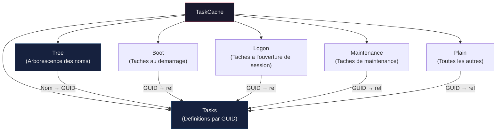
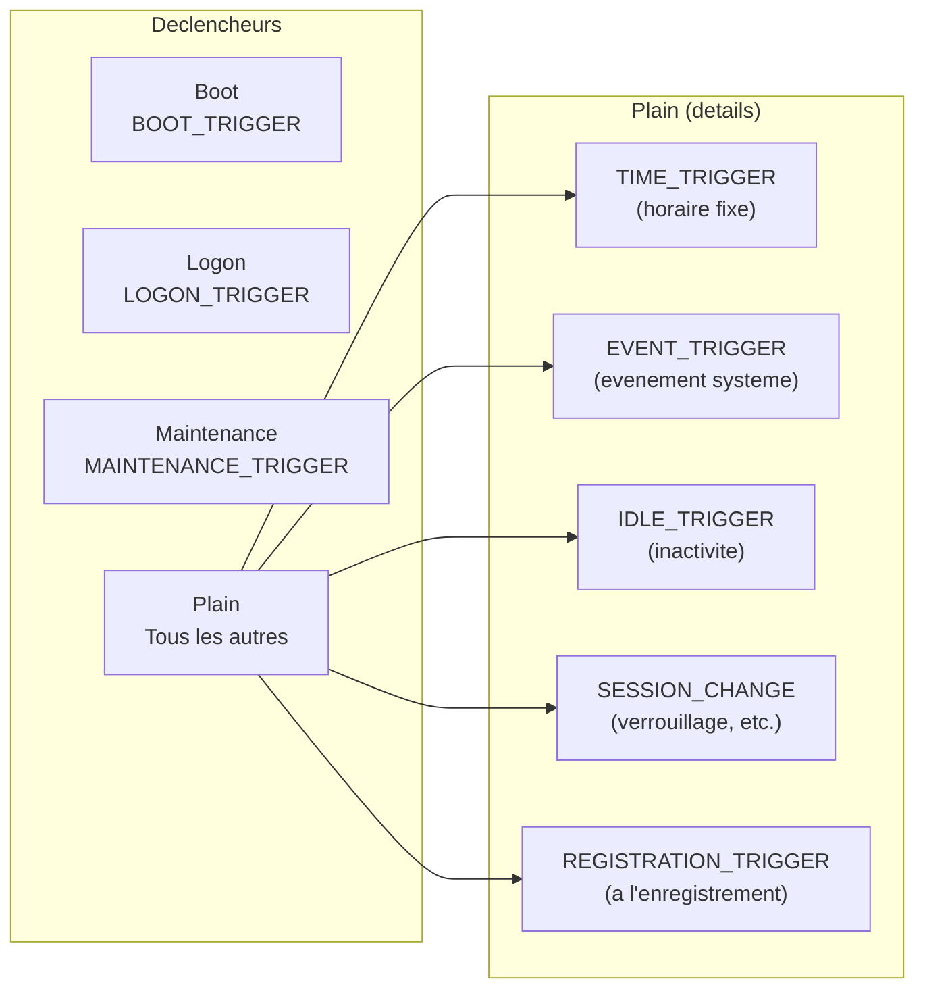

---
tags:
  - registre
  - tâches planifiées
  - Task Scheduler
---

# Planificateur de taches et le registre

!!! abstract "Ce que vous allez apprendre"
    - L'architecture du planificateur de taches Windows et son lien intime avec le registre
    - La structure de la cle TaskCache : Tree, Tasks, Boot, Logon, Maintenance, Plain
    - Comment chaque tache est representee par un GUID et quelles valeurs le registre stocke
    - Les types de declencheurs et leur encodage binaire dans le registre
    - La securite des taches planifiees : SDDL, comptes d'execution, taches masquees
    - Les techniques de persistance par taches planifiees et comment les detecter
    - Le depannage des erreurs courantes via les codes de retour et la reparation du TaskCache

---

## En 30 secondes

Vous voulez savoir exactement quelles taches planifiees existent sur une machine, directement depuis le registre, sans passer par l'interface graphique ? Une seule commande suffit :

```powershell
# List all scheduled task GUIDs and their paths from the registry
Get-ChildItem "HKLM:\SOFTWARE\Microsoft\Windows NT\CurrentVersion\Schedule\TaskCache\Tasks" |
    ForEach-Object {
        [PSCustomObject]@{
            GUID = $_.PSChildName
            Path = $_.GetValue("Path")
        }
    } | Format-Table -AutoSize
```

```title="Resultat attendu"
GUID                                   Path
----                                   ----
{46A1B5D7-4248-4E3E-B3C0-7B63C2A4F700} \Microsoft\Windows\Defrag\ScheduledDefrag
{8E2F4A6C-1D3B-4E5F-A7C9-0B1D2E3F4A5B} \Microsoft\Windows\WindowsUpdate\Scheduled Start
{A3B4C5D6-7E8F-9012-3456-789ABCDEF012} \Microsoft\Windows\DiskDiagnostic\Microsoft-Windows-DiskDiagnosticDataCollector
...
```

Cette commande revele les centaines de taches enregistrees sur un systeme Windows, dont beaucoup sont invisibles dans `taskschd.msc`. Ce chapitre vous enseigne a lire, decoder et manipuler ces donnees.

!!! tip "Analogie"
    Le planificateur de taches est un **reveil intelligent** avec des centaines d'alarmes programmees. Chaque alarme a son heure, son action et ses conditions. Le registre est le **carnet ou toutes ces alarmes sont notees** : meme si vous perdez l'interface du reveil, le carnet contient toutes les instructions pour les reconstruire.

!!! info "En resume"
    - Le registre `TaskCache\Tasks` contient les GUID et chemins de toutes les taches planifiees, y compris celles invisibles dans `taskschd.msc`
    - Une seule commande PowerShell sur `Get-ChildItem` permet d'enumerer l'integralite des taches enregistrees sur la machine
    - Ce chapitre couvre l'architecture du planificateur, le decodage des structures binaires, la securite, les vecteurs de persistance et le depannage

---

## Architecture du planificateur et le registre

### Vue d'ensemble

Le planificateur de taches Windows (`Task Scheduler`, service `Schedule`) est un composant systeme present depuis Windows Vista dans sa version 2.0. Il gere l'execution automatique de programmes selon des declencheurs varies : heure, demarrage, ouverture de session, evenement systeme, etc.

Chaque tache enregistree existe sous **deux formes** simultanees :

| Forme | Emplacement | Format |
|-------|-------------|--------|
| **Fichier XML** | `%SystemRoot%\System32\Tasks\<chemin>` | XML lisible |
| **Entree registre** | `HKLM\SOFTWARE\Microsoft\Windows NT\CurrentVersion\Schedule\TaskCache` | Valeurs binaires et texte |

Le service Schedule lit **les deux** au demarrage. La version registre est la source de verite pour les metadonnees dynamiques (dernier temps d'execution, prochain declenchement), tandis que le fichier XML contient la definition complete de la tache.

```powershell
# Verify both locations exist for a specific task
$taskName = "\Microsoft\Windows\Defrag\ScheduledDefrag"
$xmlPath  = "$env:SystemRoot\System32\Tasks$taskName"

# Check XML file
Test-Path $xmlPath

# Check registry entry (search by Path value)
Get-ChildItem "HKLM:\SOFTWARE\Microsoft\Windows NT\CurrentVersion\Schedule\TaskCache\Tasks" |
    Where-Object { $_.GetValue("Path") -eq $taskName } |
    Select-Object PSChildName
```

```title="Resultat attendu"
True

PSChildName
-----------
{46A1B5D7-4248-4E3E-B3C0-7B63C2A4F700}
```

### La cle TaskCache

Toute l'architecture registre du planificateur se concentre sous une seule cle :

```
HKLM\SOFTWARE\Microsoft\Windows NT\CurrentVersion\Schedule\TaskCache
```

Cette cle contient **six sous-cles** qui organisent les taches de maniere hierarchique :



### Sous-cle Tree : l'annuaire des taches

La sous-cle `Tree` reproduit l'arborescence des dossiers de taches, exactement comme vous la voyez dans `taskschd.msc`. Chaque dossier est une sous-cle et chaque tache terminale possede une valeur `Id` contenant le GUID correspondant.

```
TaskCache\Tree
├── Microsoft
│   ├── Windows
│   │   ├── Defrag
│   │   │   └── ScheduledDefrag   → Id = {GUID}
│   │   ├── WindowsUpdate
│   │   │   └── Scheduled Start   → Id = {GUID}
│   │   └── ...
│   └── ...
└── MyCompany
    └── BackupTask               → Id = {GUID}
```

```powershell
# Walk the Tree to find a specific task's GUID
function Get-TaskGuidFromTree {
    param([string]$TaskPath)

    # Build the registry path from the task path
    $regPath = "HKLM:\SOFTWARE\Microsoft\Windows NT\CurrentVersion\Schedule\TaskCache\Tree$TaskPath"

    if (Test-Path $regPath) {
        $guid = (Get-Item $regPath).GetValue("Id")
        return $guid
    }
    return $null
}

# Example usage
$guid = Get-TaskGuidFromTree -TaskPath "\Microsoft\Windows\Defrag\ScheduledDefrag"
Write-Output "GUID: $guid"
```

```title="Resultat attendu"
GUID: {46A1B5D7-4248-4E3E-B3C0-7B63C2A4F700}
```

La sous-cle `Tree` contient egalement une valeur `SD` (Security Descriptor) au format binaire sur chaque noeud, qui definit les permissions d'acces a la tache dans l'interface du planificateur.

### Sous-cle Tasks : les definitions

La sous-cle `Tasks` est le coeur du systeme. Chaque tache enregistree possede une sous-cle nommee par son GUID (entre accolades). Cette sous-cle contient toutes les metadonnees de la tache.

```
TaskCache\Tasks
├── {1234abcd-5678-efgh-ijkl-9012mnopqrst}
│   ├── Path           (REG_SZ)
│   ├── Hash           (REG_BINARY)
│   ├── DynamicInfo    (REG_BINARY)
│   ├── Triggers       (REG_BINARY)
│   ├── Actions        (REG_SZ)
│   ├── SecurityDescriptor (REG_SZ)
│   ├── Source         (REG_SZ)
│   ├── Author         (REG_SZ)
│   ├── Date           (REG_SZ)
│   ├── URI            (REG_SZ)
│   └── Schema         (REG_DWORD)
└── {...}
```

### Sous-cles de categorisation : Boot, Logon, Maintenance, Plain

Les quatre sous-cles restantes servent a **categoriser** les taches par type de declencheur. Elles ne contiennent pas de donnees propres : chaque sous-cle de tache est nommee par le GUID et contient generalement une seule valeur binaire vide ou un ensemble de metadonnees reduites.

| Sous-cle | Type de taches | Exemple |
|----------|----------------|---------|
| **Boot** | Declenchees au demarrage du systeme (avant toute session utilisateur) | Taches critiques de securite, pilotes |
| **Logon** | Declenchees a l'ouverture de session | Synchronisation OneDrive, lanceurs d'applications |
| **Maintenance** | Declenchees durant la fenetre de maintenance automatique | Defragmentation, nettoyage de disque |
| **Plain** | Toutes les autres : horaires, evenements, idle, etc. | Sauvegardes planifiees, mises a jour |

Une meme tache peut avoir des declencheurs multiples, mais elle n'apparait que dans **une seule** sous-cle de categorisation, celle de son declencheur principal.

!!! info "En resume"
    - Le planificateur stocke chaque tache en double : un fichier XML sur disque et une entree registre sous `TaskCache`.
    - La cle `TaskCache` contient six sous-cles : `Tree` (annuaire par nom), `Tasks` (definitions par GUID), et quatre sous-cles de categorisation (`Boot`, `Logon`, `Maintenance`, `Plain`).
    - La sous-cle `Tree` mappe les noms de taches vers leurs GUID, tandis que `Tasks` contient toutes les metadonnees (chemin, hash, declencheurs, actions, securite).

---

## Structure d'une tache dans le registre

### Tableau complet des valeurs TaskCache\Tasks\{GUID}

| Valeur | Type | Description |
|--------|------|-------------|
| **Path** | REG_SZ | Chemin complet de la tache (ex: `\Microsoft\Windows\Defrag\ScheduledDefrag`) |
| **Hash** | REG_BINARY | Hash CRC32 du fichier XML correspondant ; utilise pour detecter les modifications |
| **DynamicInfo** | REG_BINARY | Structure binaire de 28 octets : dernier temps d'execution, code de retour, prochain temps d'execution |
| **Triggers** | REG_BINARY | Definition binaire encodee de tous les declencheurs de la tache |
| **Actions** | REG_SZ ou REG_BINARY | Definition des actions (commande, arguments, repertoire de travail) ; souvent au format XML inline |
| **SecurityDescriptor** | REG_SZ | Chaine SDDL definissant les permissions d'acces a la tache |
| **Source** | REG_SZ | Origine de l'enregistrement (nom du composant ou de l'application) |
| **Author** | REG_SZ | Auteur declare de la tache |
| **Date** | REG_SZ | Date de creation au format ISO 8601 (`2024-01-15T10:30:00`) |
| **URI** | REG_SZ | Identifiant URI de la tache (generalement identique a Path) |
| **Schema** | REG_DWORD | Version du schema de la definition (valeur `0x10004` pour le schema Vista+) |

### Exploration complete d'une tache reelle

Prenons la tache de defragmentation planifiee comme exemple concret :

```powershell
# Explore all registry values for the ScheduledDefrag task
$treePath = "HKLM:\SOFTWARE\Microsoft\Windows NT\CurrentVersion\Schedule\TaskCache\Tree\Microsoft\Windows\Defrag\ScheduledDefrag"
$guid = (Get-Item $treePath).GetValue("Id")
Write-Output "Task GUID: $guid"

# Read all values from the Tasks entry
$taskPath = "HKLM:\SOFTWARE\Microsoft\Windows NT\CurrentVersion\Schedule\TaskCache\Tasks\$guid"
$taskKey  = Get-Item $taskPath

foreach ($valueName in $taskKey.GetValueNames()) {
    $value = $taskKey.GetValue($valueName)
    $kind  = $taskKey.GetValueKind($valueName)

    if ($kind -eq "Binary") {
        # Display binary values as hex string (first 32 bytes)
        $hex = ($value[0..([Math]::Min(31, $value.Length - 1))] |
            ForEach-Object { '{0:X2}' -f $_ }) -join ' '
        Write-Output "${valueName} ($kind): $hex ..."
    } else {
        Write-Output "${valueName} ($kind): $value"
    }
}
```

```title="Resultat attendu"
Task GUID: {46A1B5D7-4248-4E3E-B3C0-7B63C2A4F700}
Path (String): \Microsoft\Windows\Defrag\ScheduledDefrag
Hash (Binary): A3 4F 2B 11 ...
DynamicInfo (Binary): 03 00 00 00 80 1A 06 00 00 00 00 00 E8 D5 41 8E ...
Triggers (Binary): 15 00 00 00 00 00 00 00 ...
Actions (String): <Actions Context="Author"><Exec><Command>%windir%\system32\defrag.exe</Command>...
URI (String): \Microsoft\Windows\Defrag\ScheduledDefrag
Author (String): Microsoft Corporation
Date (String): 2024-01-15T08:00:00
Schema (DWord): 65540
```

### La structure DynamicInfo

La valeur `DynamicInfo` est une structure binaire de 28 octets qui contient les informations d'execution dynamiques de la tache. C'est la source la plus fiable pour connaitre le dernier temps d'execution.

| Offset | Taille | Contenu |
|--------|--------|---------|
| 0x00 | 4 octets | Version de la structure (generalement `0x03`) |
| 0x04 | 8 octets | Dernier temps d'execution (FILETIME, UTC) |
| 0x0C | 4 octets | Code de retour de la derniere execution (HRESULT) |
| 0x10 | 8 octets | Prochain temps d'execution prevu (FILETIME, UTC) |
| 0x18 | 4 octets | Reserve / alignement |

```powershell
# Decode the DynamicInfo binary structure
function ConvertFrom-DynamicInfo {
    param([byte[]]$Bytes)

    if ($Bytes.Length -lt 28) {
        Write-Warning "DynamicInfo too short ($($Bytes.Length) bytes, expected 28)"
        return
    }

    $version    = [BitConverter]::ToInt32($Bytes, 0)
    $lastRunFt  = [BitConverter]::ToInt64($Bytes, 4)
    $resultCode = [BitConverter]::ToInt32($Bytes, 12)
    $nextRunFt  = [BitConverter]::ToInt64($Bytes, 16)

    # Convert FILETIME to DateTime (0 means never)
    $lastRun = if ($lastRunFt -gt 0) {
        [DateTime]::FromFileTimeUtc($lastRunFt)
    } else { "Never" }

    $nextRun = if ($nextRunFt -gt 0) {
        [DateTime]::FromFileTimeUtc($nextRunFt)
    } else { "Not scheduled" }

    [PSCustomObject]@{
        Version    = $version
        LastRun    = $lastRun
        ResultCode = '0x{0:X8}' -f $resultCode
        NextRun    = $nextRun
    }
}

# Usage: decode DynamicInfo for a specific task
$taskPath = "HKLM:\SOFTWARE\Microsoft\Windows NT\CurrentVersion\Schedule\TaskCache\Tasks\$guid"
$dynInfo  = (Get-Item $taskPath).GetValue("DynamicInfo")
ConvertFrom-DynamicInfo -Bytes $dynInfo
```

```title="Resultat attendu"
Version    : 3
LastRun    : 2024-03-15 02:00:12
ResultCode : 0x00000000
NextRun    : 2024-03-22 02:00:00
```

### Comparaison registre vs fichier XML

Le fichier XML sur disque et l'entree registre coexistent, mais leur contenu peut diverger. Voici comment les comparer :

```powershell
# Compare XML file content with registry Actions value
$taskName = "\Microsoft\Windows\Defrag\ScheduledDefrag"
$xmlPath  = "$env:SystemRoot\System32\Tasks$taskName"

# Read the XML file
[xml]$xmlContent = Get-Content $xmlPath -Encoding UTF8

# Get registry Actions
$guid      = Get-TaskGuidFromTree -TaskPath $taskName
$regPath   = "HKLM:\SOFTWARE\Microsoft\Windows NT\CurrentVersion\Schedule\TaskCache\Tasks\$guid"
$regAction = (Get-Item $regPath).GetValue("Actions")

# Display both for comparison
Write-Output "=== XML Command ==="
$xmlContent.Task.Actions.Exec.Command
Write-Output "=== Registry Actions ==="
$regAction
```

```title="Resultat attendu"
=== XML Command ===
%windir%\system32\defrag.exe
=== Registry Actions ===
<Actions Context="Author"><Exec><Command>%windir%\system32\defrag.exe</Command><Arguments>-c -h -o -$</Arguments></Exec></Actions>
```

!!! warning "Divergence registre / fichier XML"
    Quand le registre et le fichier XML ne concordent pas, le comportement depend de la version de Windows. En regle generale :

    - Le **fichier XML** est utilise par le service `Schedule` au chargement initial de la tache.
    - Les **valeurs DynamicInfo** du registre priment pour les metadonnees d'execution.
    - Si le fichier XML est manquant mais que l'entree registre existe, la tache est **orpheline** et ne s'execute plus.
    - Si l'entree registre est manquante mais que le fichier XML existe, la tache sera **rechargee** au prochain redemarrage du service.

    Un attaquant peut exploiter cette divergence pour masquer une tache modifiee. Voir la section sur la persistance plus bas.

!!! info "En resume"
    - Chaque tache dans `Tasks\{GUID}` contient des valeurs cles : `Path`, `Hash` (CRC32 du XML), `DynamicInfo` (28 octets avec timestamps et code retour), `Triggers` (binaire encode) et `Actions`.
    - La structure `DynamicInfo` est la source la plus fiable pour connaitre la derniere execution, le code de retour et la prochaine execution prevue.
    - Une divergence entre le fichier XML et l'entree registre peut indiquer une tache orpheline, une corruption ou une manipulation malveillante.

---

## Types de declencheurs dans le registre

### Classification par sous-cle

Le planificateur classe chaque tache dans l'une des quatre sous-cles de categorisation selon son declencheur **principal** :



### Taches Boot

Les taches de la sous-cle `Boot` s'executent **avant toute ouverture de session**. Elles sont declenchees par le service Schedule des que celui-ci demarre, typiquement quelques secondes apres le chargement du noyau.

```powershell
# List all Boot tasks
Get-ChildItem "HKLM:\SOFTWARE\Microsoft\Windows NT\CurrentVersion\Schedule\TaskCache\Boot" |
    ForEach-Object {
        $guid    = $_.PSChildName
        $regPath = "HKLM:\SOFTWARE\Microsoft\Windows NT\CurrentVersion\Schedule\TaskCache\Tasks\$guid"
        if (Test-Path $regPath) {
            [PSCustomObject]@{
                GUID = $guid
                Path = (Get-Item $regPath).GetValue("Path")
            }
        }
    } | Format-Table -AutoSize
```

```title="Resultat attendu"
GUID                                   Path
----                                   ----
{1A2B3C4D-5E6F-7890-ABCD-EF0123456789} \Microsoft\Windows\UpdateOrchestrator\Schedule Scan
{2B3C4D5E-6F78-90AB-CDEF-012345678901} \Microsoft\Windows\PI\Sqm-Tasks
```

Cas d'usage typiques : pilotes de peripheriques a initialiser tot, agents de securite, services de chiffrement de disque.

### Taches Logon

Les taches `Logon` se declenchent a l'ouverture de session d'un utilisateur (ou de tout utilisateur, selon la configuration). Elles sont l'equivalent registre des entrees `Run` et `RunOnce`, mais avec beaucoup plus de flexibilite.

```powershell
# List all Logon tasks with their execution account
Get-ChildItem "HKLM:\SOFTWARE\Microsoft\Windows NT\CurrentVersion\Schedule\TaskCache\Logon" |
    ForEach-Object {
        $guid    = $_.PSChildName
        $regPath = "HKLM:\SOFTWARE\Microsoft\Windows NT\CurrentVersion\Schedule\TaskCache\Tasks\$guid"
        if (Test-Path $regPath) {
            $taskKey = Get-Item $regPath
            [PSCustomObject]@{
                Path = $taskKey.GetValue("Path")
                SD   = $taskKey.GetValue("SecurityDescriptor")
            }
        }
    } | Format-Table -AutoSize
```

```title="Resultat attendu"
Path                                                                SD
----                                                                --
\Microsoft\Windows\Workplace Join\Automatic-Device-Join             D:(A;;FA;;;BA)(A;;FA;;;SY)(A;;FR;;;BU)
\Microsoft\Windows\Clip\License Validation                          D:(A;;FA;;;BA)(A;;FA;;;SY)(A;;FR;;;BU)
\Microsoft\Windows\WindowsUpdate\Scheduled Start                    D:(A;;FA;;;BA)(A;;FA;;;SY)(A;;FR;;;BU)
...
```

### Taches Maintenance

Les taches de la sous-cle `Maintenance` sont executees durant la **fenetre de maintenance automatique** de Windows. Par defaut, cette fenetre s'ouvre a 2h00 du matin si la machine est alimentee et inactive.

Les taches de maintenance incluent la defragmentation, les mises a jour Windows Defender, le nettoyage de disque et la generation de rapports de fiabilite.

### Taches Plain

Tout ce qui ne rentre pas dans les trois categories precedentes est classe comme `Plain`. C'est la categorie la plus vaste, incluant :

- Les declencheurs horaires (quotidien, hebdomadaire, mensuel)
- Les declencheurs sur evenement (event ID specifique dans un journal)
- Les declencheurs sur inactivite
- Les declencheurs sur changement de session (verrouillage, deverrouillage, connexion a distance)
- Les declencheurs a l'enregistrement de la tache

### Decodage de la valeur Triggers

La valeur `Triggers` dans le registre est un blob binaire qui encode tous les declencheurs d'une tache. Son format n'est pas documente officiellement, mais il est suffisamment compris pour etre decode :

```powershell
# Extract and display raw trigger data alongside the XML definition
function Compare-TaskTriggers {
    param([string]$TaskPath)

    # Get GUID from Tree
    $treePath = "HKLM:\SOFTWARE\Microsoft\Windows NT\CurrentVersion\Schedule\TaskCache\Tree$TaskPath"
    $guid = (Get-Item $treePath -ErrorAction Stop).GetValue("Id")

    # Registry trigger bytes
    $regPath  = "HKLM:\SOFTWARE\Microsoft\Windows NT\CurrentVersion\Schedule\TaskCache\Tasks\$guid"
    $triggers = (Get-Item $regPath).GetValue("Triggers")

    Write-Output "=== Registry Triggers (hex, first 64 bytes) ==="
    $hex = ($triggers[0..([Math]::Min(63, $triggers.Length - 1))] |
        ForEach-Object { '{0:X2}' -f $_ }) -join ' '
    Write-Output $hex

    # XML trigger definition for comparison
    Write-Output "`n=== XML Triggers ==="
    $xmlPath = "$env:SystemRoot\System32\Tasks$TaskPath"
    if (Test-Path $xmlPath) {
        [xml]$xml = Get-Content $xmlPath -Encoding UTF8
        $xml.Task.Triggers.OuterXml | Format-Xml
    }
}

Compare-TaskTriggers -TaskPath "\Microsoft\Windows\Defrag\ScheduledDefrag"
```

```title="Resultat attendu"
=== Registry Triggers (hex, first 64 bytes) ===
15 00 00 00 00 00 00 00 48 00 00 00 00 00 00 00 FF FF FF FF FF FF FF FF 00 48 8C A5 D6 CE D4 01
00 00 00 00 00 00 00 00 00 48 26 53 E4 63 DA 01 01 00 00 00 30 00 00 00 00 00 00 00 00 00 00 00

=== XML Triggers ===
<CalendarTrigger xmlns="http://schemas.microsoft.com/windows/2004/02/mit/task">
  <StartBoundary>2024-01-15T02:00:00</StartBoundary>
  <ScheduleByWeek><DaysOfWeek><Wednesday /></DaysOfWeek><WeeksInterval>1</WeeksInterval></ScheduleByWeek>
</CalendarTrigger>
```

L'outil `schtasks.exe` permet d'obtenir la definition XML complete, qui est plus lisible que le blob binaire :

```batch
rem Export a task definition as XML
schtasks /query /tn "\Microsoft\Windows\Defrag\ScheduledDefrag" /xml ONE
```

```title="Resultat attendu"
<?xml version="1.0" encoding="UTF-16"?>
<Task version="1.4" xmlns="http://schemas.microsoft.com/windows/2004/02/mit/task">
  <RegistrationInfo>
    <Author>Microsoft Corporation</Author>
    <URI>\Microsoft\Windows\Defrag\ScheduledDefrag</URI>
  </RegistrationInfo>
  <Triggers>
    <CalendarTrigger>
      <StartBoundary>2024-01-15T02:00:00</StartBoundary>
      ...
```

!!! note "Format binaire des declencheurs"
    Le format binaire des declencheurs n'est documente dans aucun SDK officiel. Les chercheurs en securite ont reverse-engineere la structure. L'en-tete contient un magic number (`0x15` pour la version), suivi de la taille totale, puis d'une sequence de blocs TLV (Type-Length-Value) pour chaque declencheur. Pour un decodage complet, il est recommande d'utiliser la bibliotheque Python `dissect.target` ou l'outil `TaskCacheParser`.

!!! info "En resume"
    - Chaque tache est classee dans l'une des quatre sous-cles (`Boot`, `Logon`, `Maintenance`, `Plain`) selon son declencheur principal.
    - La valeur `Triggers` contient les declencheurs au format binaire non documente, tandis que le fichier XML fournit une version lisible.
    - Le format binaire utilise des blocs TLV (Type-Length-Value) ; des outils comme `dissect.target` ou `TaskCacheParser` permettent de le decoder.

---

## Securite des taches planifiees

### SecurityDescriptor et format SDDL

Chaque tache possede un descripteur de securite, stocke de deux manieres :

1. La valeur `SecurityDescriptor` dans `TaskCache\Tasks\{GUID}` (format SDDL en texte)
2. La valeur `SD` dans `TaskCache\Tree\<chemin>` (format binaire)

Le format SDDL (Security Descriptor Definition Language) definit qui peut lire, modifier et executer la tache :

```powershell
# Read the SDDL of a specific task
$guid    = Get-TaskGuidFromTree -TaskPath "\Microsoft\Windows\Defrag\ScheduledDefrag"
$regPath = "HKLM:\SOFTWARE\Microsoft\Windows NT\CurrentVersion\Schedule\TaskCache\Tasks\$guid"
$sddl    = (Get-Item $regPath).GetValue("SecurityDescriptor")
Write-Output "SDDL: $sddl"

# Convert SDDL to human-readable format
$sd = New-Object System.Security.AccessControl.CommonSecurityDescriptor($true, $false, $sddl)
$sd.DiscretionaryAcl | ForEach-Object {
    $sid     = $_.SecurityIdentifier
    $account = try { $sid.Translate([System.Security.Principal.NTAccount]).Value } catch { $sid.Value }
    [PSCustomObject]@{
        Account    = $account
        AccessMask = '0x{0:X8}' -f $_.AccessMask
        AceType    = $_.AceType
    }
} | Format-Table -AutoSize
```

```title="Resultat attendu"
Account                    AccessMask AceType
-------                    ---------- -------
BUILTIN\Administrators     0x1F01FF   AccessAllowed
NT AUTHORITY\SYSTEM         0x1F01FF   AccessAllowed
BUILTIN\Users              0x1200A9   AccessAllowed
```

Les masques d'acces courants pour les taches planifiees :

| Masque | Permissions |
|--------|------------|
| `0x1F01FF` | Controle total (lecture, ecriture, execution, suppression) |
| `0x1200A9` | Lecture et execution |
| `0x100001` | Lecture seule |

### Comptes d'execution

Les taches planifiees peuvent s'executer sous differents comptes, chacun avec des niveaux de privilege differents :

| Compte | Niveau de privilege | Stockage des identifiants |
|--------|--------------------|-----------------------------|
| `NT AUTHORITY\SYSTEM` | Maximum (niveau noyau) | Pas d'identifiants necessaires |
| `NT AUTHORITY\LOCAL SERVICE` | Services locaux avec privileges reduits | Pas d'identifiants necessaires |
| `NT AUTHORITY\NETWORK SERVICE` | Comme LOCAL SERVICE + acces reseau | Pas d'identifiants necessaires |
| Compte utilisateur specifique | Privileges de l'utilisateur | Identifiants chiffres dans LSA Secrets |

Quand une tache est configuree pour s'executer avec un compte utilisateur, les identifiants sont stockes de maniere chiffree :

```
HKLM\SECURITY\Cache
HKLM\SECURITY\Policy\Secrets
```

!!! danger "Acces restreint"
    La ruche `SECURITY` n'est accessible qu'au compte `SYSTEM`. Meme un administrateur ne peut pas la lire directement. Pour y acceder a des fins de diagnostic, il faut utiliser `PsExec -s regedit` ou un outil forensique operant hors ligne.

### Execution privilegiee et UAC

Une tache planifiee peut etre configuree pour s'executer avec les privileges les plus eleves, contournant ainsi la demande de consentement UAC. Ce parametre est defini dans le fichier XML :

```xml
<Principals>
    <Principal id="Author">
        <RunLevel>HighestAvailable</RunLevel>
    </Principal>
</Principals>
```

Dans le registre, cette information est encodee dans la valeur `Actions` ou derivee du SecurityDescriptor. C'est l'une des raisons pour lesquelles les taches planifiees sont un vecteur de privilege escalation.

### Taches masquees (hidden tasks)

Il est possible de masquer une tache dans l'interface graphique en definissant l'element `<Hidden>true</Hidden>` dans le fichier XML. Mais une technique plus avancee consiste a manipuler le **descripteur de securite** pour interdire la lecture a tout le monde :

```powershell
# Detect tasks with restrictive security descriptors (potential hidden tasks)
Get-ChildItem "HKLM:\SOFTWARE\Microsoft\Windows NT\CurrentVersion\Schedule\TaskCache\Tasks" |
    ForEach-Object {
        $taskKey = $_
        $path    = $taskKey.GetValue("Path")
        $sddl    = $taskKey.GetValue("SecurityDescriptor")

        if ($sddl -and $sddl -match "D:\(D;") {
            # SDDL contains a DENY ACE
            [PSCustomObject]@{
                Path = $path
                SDDL = $sddl
                Note = "Contains DENY ACE - potentially hidden"
            }
        }
    } | Format-Table -AutoSize
```

```title="Resultat attendu"
Path                                              SDDL                                   Note
----                                              ----                                   ----
\Microsoft\Windows\Maintenance\SystemHealthCheck  D:(D;OICI;GA;;;BU)(A;OICI;GA;;;BA)...  Contains DENY ACE - potentially hidden
```

!!! warning "Taches fantomes"
    Une tache peut exister dans le registre (`TaskCache\Tasks`) sans apparaitre dans l'arborescence `Tree`. C'est un indicateur fort de manipulation malveillante. Le script suivant detecte ces anomalies :

```powershell
# Detect orphaned tasks: present in Tasks but missing from Tree
$taskGuids = (Get-ChildItem "HKLM:\SOFTWARE\Microsoft\Windows NT\CurrentVersion\Schedule\TaskCache\Tasks").PSChildName

function Get-TreeGuids {
    param([string]$Path)

    $guids = @()
    $key   = Get-Item $Path -ErrorAction SilentlyContinue
    if ($key) {
        $id = $key.GetValue("Id")
        if ($id) { $guids += $id }
    }

    Get-ChildItem $Path -ErrorAction SilentlyContinue | ForEach-Object {
        $guids += Get-TreeGuids -Path $_.PSPath
    }
    return $guids
}

$treeGuids = Get-TreeGuids -Path "HKLM:\SOFTWARE\Microsoft\Windows NT\CurrentVersion\Schedule\TaskCache\Tree"

$orphaned = $taskGuids | Where-Object { $_ -notin $treeGuids }
if ($orphaned) {
    Write-Warning "Orphaned tasks found (present in Tasks, missing from Tree):"
    foreach ($guid in $orphaned) {
        $path = (Get-Item "HKLM:\SOFTWARE\Microsoft\Windows NT\CurrentVersion\Schedule\TaskCache\Tasks\$guid").GetValue("Path")
        Write-Output "  GUID: $guid  Path: $path"
    }
} else {
    Write-Output "No orphaned tasks detected."
}
```

```title="Resultat attendu"
WARNING: Orphaned tasks found (present in Tasks, missing from Tree):
  GUID: {D4E5F6A7-B8C9-0D1E-2F3A-4B5C6D7E8F90}  Path: \Microsoft\Windows\Maintenance\SystemHealthCheck
```

!!! info "En resume"
    - Chaque tache possede un descripteur de securite au format SDDL (dans `Tasks\{GUID}`) et binaire (dans `Tree`), definissant qui peut lire, modifier et executer la tache.
    - Les taches masquees (`SD` restrictif dans `Tree`) sont invisibles dans `taskschd.msc` mais restent presentes dans le registre.
    - La detection des taches orphelines (presentes dans `Tasks` mais absentes de `Tree`, ou inversement) est essentielle pour l'audit de securite.

---

## Le planificateur comme vecteur de persistance

Les taches planifiees sont l'un des mecanismes de persistance preferes des attaquants, et ce pour plusieurs raisons :

- Execution en tant que `SYSTEM` (privileges maximaux)
- Survie au redemarrage
- Possibilite de masquer la tache dans l'interface
- Declenchement flexible (heure, evenement, demarrage)
- Contournement de l'UAC si la tache est configuree en `HighestAvailable`

!!! danger "Reference croisee"
    Ce sujet complete le chapitre 17 (Analyse forensique). Consultez-le pour les techniques d'extraction d'artefacts de persistance sur un systeme compromis.

### Techniques de persistance courantes

#### Technique 1 : creation via schtasks.exe

La methode la plus simple, mais aussi la plus bruyante :

```batch
rem Create a persistent task running as SYSTEM at logon
schtasks /create /tn "WindowsHealthCheck" /tr "C:\Windows\Temp\payload.exe" /sc onlogon /ru SYSTEM /rl HIGHEST /f
```

```title="Resultat attendu"
SUCCESS: The scheduled task "WindowsHealthCheck" has successfully been created.
```

Cette commande laisse de nombreuses traces :

- Event ID **106** dans le journal `Microsoft-Windows-TaskScheduler/Operational` (tache creee)
- Ligne de commande complete dans le journal **Security** (Event ID 4688, si l'audit des processus est actif)
- Fichier XML cree dans `%SystemRoot%\System32\Tasks`
- Entrees dans le registre `TaskCache`

#### Technique 2 : creation directe dans le registre

Une technique plus discrete consiste a ecrire directement dans le registre, **sans passer par l'API du planificateur**. Cela contourne la generation des evenements 106/140/141 du journal TaskScheduler :

```powershell
# WARNING: This is an OFFENSIVE technique shown for educational/detection purposes
# Direct registry task creation bypasses Task Scheduler event logging

$guid     = "{" + [guid]::NewGuid().ToString().ToUpper() + "}"
$taskName = "\Microsoft\Windows\Maintenance\SystemHealthCheck"
$basePath = "HKLM:\SOFTWARE\Microsoft\Windows NT\CurrentVersion\Schedule\TaskCache"

# Step 1: Create entry in Tasks
$taskKeyPath = Join-Path $basePath "Tasks\$guid"
New-Item -Path $taskKeyPath -Force | Out-Null
Set-ItemProperty -Path $taskKeyPath -Name "Path" -Value $taskName
Set-ItemProperty -Path $taskKeyPath -Name "URI"  -Value $taskName

# Step 2: Create entry in Tree (mimicking a legitimate path)
$treeKeyPath = Join-Path $basePath "Tree$taskName"
New-Item -Path $treeKeyPath -Force | Out-Null
Set-ItemProperty -Path $treeKeyPath -Name "Id" -Value $guid -Type String

# Step 3: Register in a trigger category
$logonPath = Join-Path $basePath "Logon\$guid"
New-Item -Path $logonPath -Force | Out-Null

# Step 4: Create matching XML file for the task to actually run
# (omitted - the XML file is also needed for execution)
```

```title="Resultat attendu"
Aucune sortie si la commande reussit. Les cles sont creees silencieusement dans le registre.
```

!!! danger "Detection prioritaire"
    Cette technique est utilisee par des groupes APT documentes (Tarrask, par exemple). La creation directe dans le registre **ne genere pas d'evenements du planificateur**, mais elle est detectable par la surveillance des modifications du registre (voir chapitre 25, API RegNotifyChangeKeyValue, et chapitre 27, ETW).

#### Technique 3 : modification d'une tache existante

Plutot que de creer une nouvelle tache visible, un attaquant peut modifier la commande d'une tache existante legitime :

```powershell
# Modify the Actions of an existing task to add a malicious command
# The original task continues to function, but now executes additional code
$guid    = Get-TaskGuidFromTree -TaskPath "\Microsoft\Windows\Defrag\ScheduledDefrag"
$regPath = "HKLM:\SOFTWARE\Microsoft\Windows NT\CurrentVersion\Schedule\TaskCache\Tasks\$guid"

# Read current action
$currentAction = (Get-Item $regPath).GetValue("Actions")
Write-Output "Original action: $currentAction"

# An attacker would modify the XML file in System32\Tasks to add a second Exec block
# and update the Hash value in the registry to match the new XML
```

```title="Resultat attendu"
Original action: <Actions Context="Author"><Exec><Command>%windir%\system32\defrag.exe</Command><Arguments>-c -h -o -$</Arguments></Exec></Actions>
```

### Methodes de detection

La detection des taches malveillantes repose sur plusieurs approches complementaires :

#### Comparaison registre / fichier XML

Les taches legitimes ont toujours une coherence entre le registre et le fichier XML. Toute divergence est suspecte :

```powershell
# Comprehensive audit: compare registry tasks with XML files on disk
$tasksPath = "HKLM:\SOFTWARE\Microsoft\Windows NT\CurrentVersion\Schedule\TaskCache\Tasks"

Get-ChildItem $tasksPath | ForEach-Object {
    $guid    = $_.PSChildName
    $path    = $_.GetValue("Path")
    $xmlFile = "$env:SystemRoot\System32\Tasks$path"

    $xmlExists = Test-Path $xmlFile
    $status    = if ($xmlExists) { "OK" } else { "MISSING XML" }

    [PSCustomObject]@{
        GUID      = $guid
        Path      = $path
        XMLExists = $xmlExists
        Status    = $status
    }
} | Where-Object { $_.Status -ne "OK" } | Format-Table -AutoSize
```

```title="Resultat attendu"
GUID                                   Path                                           XMLExists Status
----                                   ----                                           --------- ------
{A1B2C3D4-...}                         \Microsoft\Windows\Maintenance\SystemHealthCheck    False MISSING XML
```

#### Evenements du planificateur

Les evenements suivants dans le journal `Microsoft-Windows-TaskScheduler/Operational` sont essentiels pour la detection :

| Event ID | Signification | Interet forensique |
|----------|--------------|-------------------|
| **106** | Tache enregistree (creee) | Creation d'une nouvelle tache |
| **140** | Tache mise a jour | Modification d'une tache existante |
| **141** | Tache supprimee | Suppression (potentiellement pour couvrir des traces) |
| **200** | Action demarree | Execution d'une tache |
| **201** | Action terminee | Fin d'execution avec code de retour |
| **325** | Echec du lancement | Erreur d'execution |

```powershell
# Query recent task creation and modification events
Get-WinEvent -FilterHashtable @{
    LogName = 'Microsoft-Windows-TaskScheduler/Operational'
    Id      = 106, 140, 141
} -MaxEvents 50 | Select-Object TimeCreated, Id, Message | Format-Table -AutoSize
```

```title="Resultat attendu"
TimeCreated           Id Message
-----------           -- -------
2024-03-14 15:32:10  106 Task Scheduler registered the task "\MyCompany\BackupTask" successfully.
2024-03-12 09:15:44  140 Task Scheduler updated the task "\Microsoft\Windows\WindowsUpdate\Scheduled Start".
2024-03-10 11:22:03  141 Task Scheduler deleted the task "\Temp\OldTask".
...
```

!!! note "Limite des evenements"
    Les evenements 106/140/141 ne sont generes que lorsque la tache est creee ou modifiee **via l'API du planificateur** (COM, schtasks.exe, PowerShell). Une ecriture directe dans le registre ne produit **aucun** de ces evenements. C'est pourquoi la surveillance du registre (chapitre 25) et l'ETW (chapitre 27) sont indispensables.

#### Integration avec Autoruns

L'outil Sysinternals Autoruns examine le `TaskCache` et signale les taches suspectes. Depuis la ligne de commande :

```batch
rem Export all scheduled tasks detected by Autoruns to CSV
autorunsc.exe -a t -c -h -s -v > C:\Temp\autoruns_tasks.csv
```

```title="Resultat attendu"
Autorunsc v14.10 - Autostart program viewer
Copyright (C) 2002-2024 Mark Russinovich
Sysinternals - www.sysinternals.com

Entry,Entry Location,Image Path,...
"\Microsoft\Windows\Defrag\ScheduledDefrag","Task Scheduler","%windir%\system32\defrag.exe",...
"\Microsoft\Windows\WindowsUpdate\Scheduled Start","Task Scheduler","C:\Windows\system32\usoclient.exe",...
...
```

Les colonnes utiles dans le rapport :

| Colonne | Description |
|---------|------------|
| `Entry` | Nom de la tache |
| `Image Path` | Commande executee |
| `Signer` | Signature numerique du binaire |
| `VirusTotal` | Ratio de detection (si `-v` est utilise) |

Une tache non signee ou avec un chemin inhabituel (`%TEMP%`, `%APPDATA%`, `C:\Users\Public`) merite une investigation approfondie.

#### Artefacts forensiques dans DynamicInfo

La valeur `DynamicInfo` revele l'historique d'execution meme si les journaux d'evenements ont ete effaces :

```powershell
# Audit all tasks: decode DynamicInfo to find recently executed tasks
Get-ChildItem "HKLM:\SOFTWARE\Microsoft\Windows NT\CurrentVersion\Schedule\TaskCache\Tasks" |
    ForEach-Object {
        $taskKey  = $_
        $path     = $taskKey.GetValue("Path")
        $dynInfo  = $taskKey.GetValue("DynamicInfo")

        if ($dynInfo -and $dynInfo.Length -ge 28) {
            $lastRunFt  = [BitConverter]::ToInt64($dynInfo, 4)
            $resultCode = [BitConverter]::ToInt32($dynInfo, 12)

            $lastRun = if ($lastRunFt -gt 0) {
                [DateTime]::FromFileTimeUtc($lastRunFt)
            } else { $null }

            if ($lastRun -and $lastRun -gt (Get-Date).AddDays(-7).ToUniversalTime()) {
                [PSCustomObject]@{
                    Path       = $path
                    LastRun    = $lastRun
                    ResultCode = '0x{0:X8}' -f $resultCode
                }
            }
        }
    } | Sort-Object LastRun -Descending | Format-Table -AutoSize
```

```title="Resultat attendu"
Path                                                        LastRun                  ResultCode
----                                                        -------                  ----------
\Microsoft\Windows\WindowsUpdate\Scheduled Start            2024-03-15 14:30:22      0x00000000
\Microsoft\Windows\Defrag\ScheduledDefrag                   2024-03-15 02:00:12      0x00000000
\Microsoft\Windows\DiskDiagnostic\Microsoft-Windows-Disk..  2024-03-14 03:15:44      0x00000000
\Microsoft\Windows\Workplace Join\Automatic-Device-Join     2024-03-13 08:01:33      0x00000000
...
```

Ce script identifie toutes les taches executees au cours des 7 derniers jours, avec leur code de retour. Un code `0x00000000` indique un succes, tout autre code merite attention.

!!! info "En resume"
    - Les taches planifiees sont un vecteur de persistance privilegie : execution SYSTEM, survie au redemarrage, possibilite de masquage et contournement UAC.
    - L'ecriture directe dans le registre (sans passer par l'API) contourne la generation des evenements 106/140/141 du journal TaskScheduler.
    - La detection repose sur la comparaison registre/XML, la surveillance des evenements du planificateur, Autoruns et l'analyse forensique de `DynamicInfo`.

---

## Depannage

### Une tache ne s'execute pas

Quand une tache planifiee refuse de s'executer, le premier reflexe est de consulter la valeur `DynamicInfo` pour obtenir le code de retour de la derniere tentative :

```powershell
# Quick diagnostic for a task that won't run
$taskPath = "\Microsoft\Windows\WindowsUpdate\Scheduled Start"
$guid     = Get-TaskGuidFromTree -TaskPath $taskPath
$regPath  = "HKLM:\SOFTWARE\Microsoft\Windows NT\CurrentVersion\Schedule\TaskCache\Tasks\$guid"
$dynInfo  = (Get-Item $regPath).GetValue("DynamicInfo")

if ($dynInfo -and $dynInfo.Length -ge 28) {
    $resultCode = [BitConverter]::ToInt32($dynInfo, 12)
    Write-Output "Last result code: 0x$([Convert]::ToString($resultCode, 16).ToUpper().PadLeft(8, '0'))"
} else {
    Write-Output "No DynamicInfo available for this task."
}
```

```title="Resultat attendu"
Last result code: 0x00041302
```

### Tableau des codes de retour courants

| Code | Constante | Signification | Action recommandee |
|------|-----------|--------------|-------------------|
| `0x00000000` | S_OK | Succes | Aucune |
| `0x00000001` | ERROR_INCORRECT_FUNCTION | Fonction incorrecte | Verifier le chemin de l'executable |
| `0x00000002` | ERROR_FILE_NOT_FOUND | Fichier introuvable | Le binaire a execute n'existe pas |
| `0x0000000A` | ERROR_BAD_ENVIRONMENT | Environnement incorrect | Verifier les variables d'environnement |
| `0x00041300` | SCHED_S_TASK_READY | Tache prete (pas encore executee) | Attendre le prochain declenchement |
| `0x00041301` | SCHED_S_TASK_RUNNING | Tache en cours d'execution | L'instance precedente tourne encore |
| `0x00041302` | SCHED_S_TASK_DISABLED | Tache desactivee | Activer la tache |
| `0x00041303` | SCHED_S_TASK_HAS_NOT_RUN | Jamais executee | Verifier les declencheurs |
| `0x00041325` | SCHED_S_TASK_QUEUED | Tache en file d'attente | Attendre |
| `0x800704DD` | ERROR_NOT_LOGGED_ON | Aucune session ouverte | La tache requiert une session interactive |
| `0x800710E0` | SCHED_E_SERVICE_NOT_RUNNING | Terminee par l'utilisateur | L'execution a ete interrompue manuellement |
| `0x8007010B` | ERROR_DIRECTORY | Repertoire invalide | Le repertoire de travail n'existe pas |
| `0x80070005` | E_ACCESSDENIED | Acces refuse | Verifier les permissions et le compte d'execution |
| `0xC000013A` | STATUS_CONTROL_C_EXIT | Terminaison forcee | Le processus a ete arrete par Ctrl+C ou taskkill |

### Corruption du TaskCache

Un `TaskCache` corrompu peut provoquer divers symptomes : taches qui n'apparaissent plus dans l'interface, duplication de taches, erreurs au demarrage du service Schedule.

#### Symptomes typiques

- Le Planificateur de taches affiche "la tache selectionnee n'existe plus" pour certaines taches
- Impossible de creer ou modifier des taches (erreur "element introuvable")
- Le service Schedule consomme du CPU au demarrage en boucle
- Des taches apparaissent dans `schtasks /query` mais pas dans `taskschd.msc` (ou inversement)

#### Procedure de reparation

```powershell
# Step 1: Identify the corrupted task
# Look for tasks where registry GUID exists but XML file is missing (or vice versa)
$tasksPath = "HKLM:\SOFTWARE\Microsoft\Windows NT\CurrentVersion\Schedule\TaskCache\Tasks"

$corruptedTasks = Get-ChildItem $tasksPath | ForEach-Object {
    $guid    = $_.PSChildName
    $path    = $_.GetValue("Path")
    $xmlFile = "$env:SystemRoot\System32\Tasks$path"

    [PSCustomObject]@{
        GUID       = $guid
        Path       = $path
        HasXML     = (Test-Path $xmlFile)
        HasHash    = ($null -ne $_.GetValue("Hash"))
        HasTrigger = ($null -ne $_.GetValue("Triggers"))
    }
} | Where-Object { -not $_.HasXML -or -not $_.HasHash }

$corruptedTasks | Format-Table -AutoSize
```

```title="Resultat attendu"
GUID                                   Path                                           HasXML HasHash HasTrigger
----                                   ----                                           ------ ------- ----------
{A1B2C3D4-5678-9ABC-DEF0-123456789ABC} \Microsoft\Windows\Maintenance\SystemHealthCheck False    True       True
{B2C3D4E5-6789-ABCD-EF01-23456789ABCD} \Temp\OldBackupTask                              False   False       True
```

```powershell
# Step 2: Remove a corrupted task entry from the registry
# CAUTION: Backup the registry before proceeding
function Remove-CorruptedTask {
    param(
        [string]$Guid,
        [string]$TaskPath
    )

    $basePath = "HKLM:\SOFTWARE\Microsoft\Windows NT\CurrentVersion\Schedule\TaskCache"

    # Remove from Tasks
    $taskKeyPath = Join-Path $basePath "Tasks\$Guid"
    if (Test-Path $taskKeyPath) {
        Remove-Item $taskKeyPath -Recurse -Force
        Write-Output "Removed from Tasks: $Guid"
    }

    # Remove from Tree
    $treeKeyPath = Join-Path $basePath "Tree$TaskPath"
    if (Test-Path $treeKeyPath) {
        Remove-Item $treeKeyPath -Recurse -Force
        Write-Output "Removed from Tree: $TaskPath"
    }

    # Remove from trigger category subtrees
    foreach ($category in @("Boot", "Logon", "Maintenance", "Plain")) {
        $catPath = Join-Path $basePath "$category\$Guid"
        if (Test-Path $catPath) {
            Remove-Item $catPath -Recurse -Force
            Write-Output "Removed from ${category}: $Guid"
        }
    }

    Write-Output "Cleanup complete. Restart the Schedule service to apply changes."
}

# Example usage (replace with actual GUID and path)
# Remove-CorruptedTask -Guid "{A1B2C3D4-...}" -TaskPath "\MyCompany\BrokenTask"
```

```title="Resultat attendu"
Removed from Tasks: {A1B2C3D4-...}
Removed from Tree: \MyCompany\BrokenTask
Removed from Plain: {A1B2C3D4-...}
Cleanup complete. Restart the Schedule service to apply changes.
```

```powershell
# Step 3: Re-import from XML (if the XML file still exists)
# Or recreate the task from scratch
$xmlFile = "$env:SystemRoot\System32\Tasks\Microsoft\Windows\Defrag\ScheduledDefrag"
if (Test-Path $xmlFile) {
    schtasks /create /tn "\Microsoft\Windows\Defrag\ScheduledDefrag" /xml $xmlFile /f
    Write-Output "Task re-imported from XML file."
} else {
    Write-Output "No XML file found. Task must be recreated manually."
}
```

```title="Resultat attendu"
SUCCESS: The scheduled task "\Microsoft\Windows\Defrag\ScheduledDefrag" has successfully been created.
Task re-imported from XML file.
```

### Le service Schedule ne demarre pas

Si le service ne demarre pas du tout, verifiez sa configuration dans le registre :

```powershell
# Check the Schedule service registry configuration
$svcPath = "HKLM:\SYSTEM\CurrentControlSet\Services\Schedule"

[PSCustomObject]@{
    Start        = (Get-ItemProperty $svcPath).Start
    Type         = (Get-ItemProperty $svcPath).Type
    ImagePath    = (Get-ItemProperty $svcPath).ImagePath
    ErrorControl = (Get-ItemProperty $svcPath).ErrorControl
    Group        = (Get-ItemProperty $svcPath).Group
} | Format-List
```

```title="Resultat attendu"
Start        : 2
Type         : 32
ImagePath    : %SystemRoot%\system32\svchost.exe -k netsvcs -p
ErrorControl : 1
Group        : SchedulerGroup
```

| Valeur Start | Signification | Valeur attendue |
|-------------|--------------|----------------|
| 0 | Boot (pilote) | Non applicable |
| 1 | System (pilote) | Non applicable |
| 2 | Automatique | **Valeur correcte** |
| 3 | Manuel | Problematique |
| 4 | Desactive | Le service ne demarrera pas |

Si la valeur `Start` est a `3` ou `4`, remettez-la a `2` :

```powershell
# Reset the Schedule service to automatic start
Set-ItemProperty -Path "HKLM:\SYSTEM\CurrentControlSet\Services\Schedule" -Name "Start" -Value 2

# Restart the service
Restart-Service Schedule -Force
```

```title="Resultat attendu"
Aucune sortie si la commande reussit. Le service Schedule redemarre en mode automatique.
```

Si le probleme persiste, verifiez l'integrite du fichier `schedsvc.dll` :

```powershell
# Verify the integrity of the Task Scheduler service DLL
sfc /verifyfile="%SystemRoot%\system32\schedsvc.dll"
```

```title="Resultat attendu"
Windows Resource Protection did not find any integrity violations.
```

### Outils de diagnostic

| Outil | Type | Usage principal |
|-------|------|----------------|
| `schtasks.exe` | Ligne de commande (integre) | Creation, modification, suppression et requete de taches |
| `taskschd.msc` | Interface graphique (integre) | Exploration visuelle et configuration manuelle |
| `Get-ScheduledTask` | Cmdlet PowerShell (integre) | Requetes et scripts d'automatisation |
| `Autoruns` | Sysinternals (gratuit) | Audit de securite et detection d'anomalies |
| `TaskCacheParser` | Outil forensique (open source) | Analyse hors ligne du registre TaskCache |
| `Registry Explorer` | Eric Zimmerman (gratuit) | Exploration forensique approfondie des ruches |

```powershell
# Quick comparison: Get-ScheduledTask vs registry enumeration
$apiCount = (Get-ScheduledTask).Count
$regCount = (Get-ChildItem "HKLM:\SOFTWARE\Microsoft\Windows NT\CurrentVersion\Schedule\TaskCache\Tasks").Count

Write-Output "Tasks via API:      $apiCount"
Write-Output "Tasks in registry:  $regCount"

if ($regCount -ne $apiCount) {
    Write-Warning "Mismatch detected! $($regCount - $apiCount) tasks exist only in the registry."
}
```

```title="Resultat attendu"
Tasks via API:      182
Tasks in registry:  184
WARNING: Mismatch detected! 2 tasks exist only in the registry.
```

!!! info "En resume"
    Le planificateur de taches Windows repose sur une architecture duale : des fichiers XML sur disque et un cache binaire dans le registre sous `TaskCache`. Les six sous-cles (`Tree`, `Tasks`, `Boot`, `Logon`, `Maintenance`, `Plain`) organisent les taches par nom et par type de declencheur. La valeur `DynamicInfo` est une mine d'or forensique, contenant les timestamps d'execution et les codes de retour. Les taches planifiees sont un vecteur de persistance privilegie par les attaquants, car elles permettent une execution en tant que SYSTEM, survivent au redemarrage et peuvent etre masquees. La detection repose sur la comparaison registre/XML, la surveillance des evenements 106/140/141 et l'audit des descripteurs de securite SDDL. En cas de corruption du TaskCache, la procedure consiste a supprimer les entrees orphelines et a reimporter les taches depuis leurs fichiers XML.
