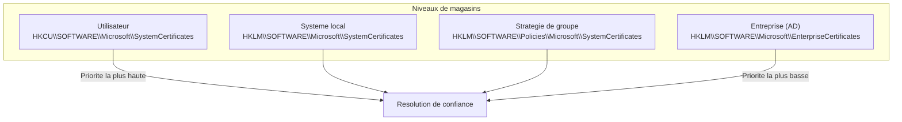
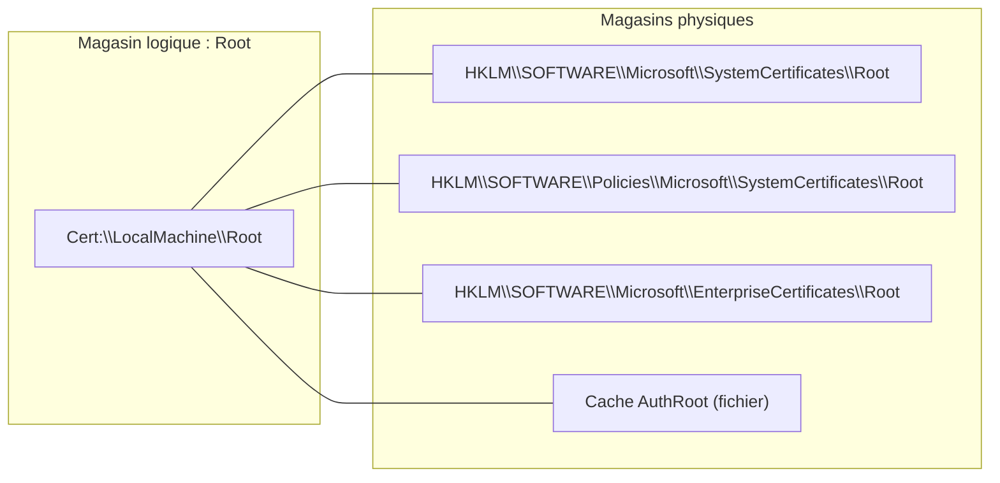
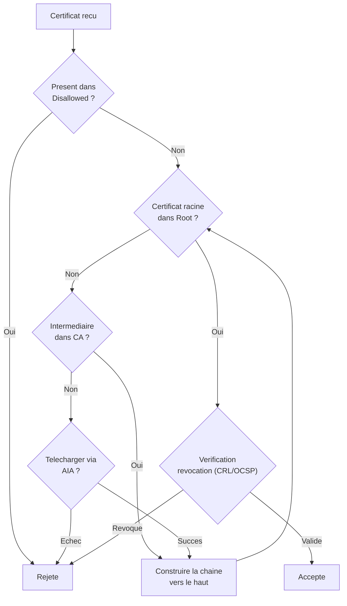
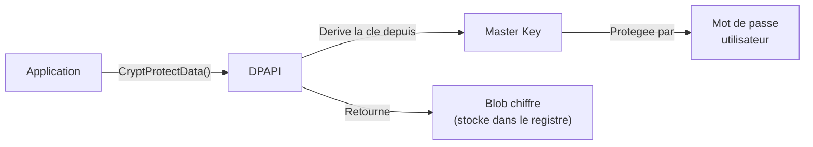
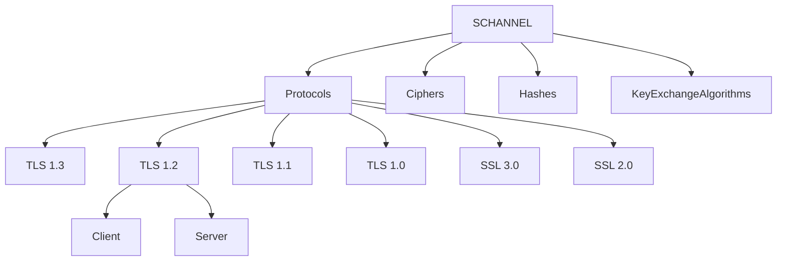

---
tags:
  - registre
  - cryptographie
  - certificats
  - DPAPI
---

# Cryptographie, DPAPI et certificats

## Ce que vous allez apprendre

- L'architecture des magasins de certificats dans le registre (systeme, utilisateur, strategie de groupe, entreprise)
- La structure binaire des blobs de certificats et la difference entre magasins physiques et logiques
- Le fonctionnement de DPAPI (Data Protection API) et ses references dans le registre
- Les coffres d'identifiants (Credential Manager/Vault) et leur integration avec Credential Guard
- Les providers cryptographiques CNG et CSP legacy enregistres dans le registre
- La configuration complete de TLS/SSL via Schannel : protocoles, suites de chiffrement, algorithmes de hachage et d'echange de cles
- Le mecanisme de mise a jour automatique des certificats racine (AutoRootUpdate) et les listes de confiance
- La configuration d'EFS (Encrypted File System) via le registre
- Le depannage des erreurs de chaine de certificats, de handshake TLS et de DPAPI

---

## En 30 secondes

Vous devez verifier si TLS 1.0 est toujours actif sur un serveur de production. Une seule commande suffit :

```powershell
# Check if TLS 1.0 is enabled on the server side
Get-ItemProperty -Path "HKLM:\SYSTEM\CurrentControlSet\Control\SecurityProviders\SCHANNEL\Protocols\TLS 1.0\Server" -ErrorAction SilentlyContinue |
    Select-Object Enabled, DisabledByDefault
```

```title="Resultat attendu"
Enabled            : 0
DisabledByDefault  : 1
```

Si ces valeurs n'existent pas, TLS 1.0 utilise le comportement par defaut du systeme d'exploitation — ce qui signifie souvent qu'il est encore actif. Ce chapitre vous montre comment le registre controle l'ensemble de la pile cryptographique de Windows : certificats, DPAPI, providers, protocoles et chiffrement.

!!! tip "Analogie"
    La cryptographie dans le registre fonctionne comme le **systeme de serrurerie d'un immeuble de haute securite**. Les certificats sont les badges d'acces, les magasins de certificats sont les armoires a badges, DPAPI est le coffre-fort personnel de chaque resident, Schannel est le protocole de communication de l'interphone, et les providers cryptographiques sont les differentes marques de serrures installees. Le registre est le tableau de bord central ou tout est configure.

!!! info "En resume"
    - La verification de l'etat TLS passe par la lecture des cles Schannel dans le registre ; l'absence de valeurs signifie que le protocole utilise le comportement par defaut du systeme
    - Le registre controle l'ensemble de la pile cryptographique : certificats, DPAPI, providers, protocoles TLS/SSL et chiffrement
    - Ce chapitre couvre les magasins de certificats, DPAPI, les providers CNG/CSP, Schannel, AutoRootUpdate, EFS et le depannage

---

## Magasins de certificats dans le registre

### Vue d'ensemble

Windows organise les certificats dans des **magasins** (certificate stores) repartis sur quatre niveaux. Chaque niveau correspond a un emplacement registre distinct.



| Niveau | Chemin registre | Portee | Provenance |
|--------|----------------|--------|------------|
| **Utilisateur** | `HKCU\SOFTWARE\Microsoft\SystemCertificates` | Profil utilisateur courant | Installation manuelle, auto-enrollment |
| **Systeme local** | `HKLM\SOFTWARE\Microsoft\SystemCertificates` | Tous les utilisateurs de la machine | Installation administrateur |
| **Strategie de groupe** | `HKLM\SOFTWARE\Policies\Microsoft\SystemCertificates` | Machine entiere (ecrase les autres) | GPO — deploiement centralise |
| **Entreprise (AD)** | `HKLM\SOFTWARE\Microsoft\EnterpriseCertificates` | Machine entiere | Active Directory, NTAuth store |

### Sous-arbres de chaque magasin

Chaque emplacement contient les memes sous-cles, correspondant chacune a un type de confiance :

| Sous-cle | Nom du magasin | Role |
|----------|---------------|------|
| `Root` | Autorites de certification racines de confiance | Certificats racine auto-signes formant l'ancre de confiance |
| `CA` | Autorites de certification intermediaires | Certificats intermediaires pour completer les chaines |
| `My` | Personnel | Certificats de l'utilisateur ou de la machine avec cle privee |
| `Trust` | Confiance d'entreprise | Listes de confiance de certificats (CTL) |
| `Disallowed` | Certificats non approuves | Certificats explicitement revoques ou bloques |
| `TrustedPeople` | Personnes de confiance | Certificats de fin (end-entity) explicitement approuves |
| `TrustedPublisher` | Editeurs de confiance | Certificats de signature de code approuves |
| `AuthRoot` | Autorites de certification racines tierces | Certificats racine du programme Microsoft Trusted Root |

La combinaison complete donne des chemins comme :

```
HKLM\SOFTWARE\Microsoft\SystemCertificates\Root\Certificates
HKLM\SOFTWARE\Microsoft\SystemCertificates\CA\Certificates
HKCU\SOFTWARE\Microsoft\SystemCertificates\My\Certificates
HKLM\SOFTWARE\Policies\Microsoft\SystemCertificates\Disallowed\Certificates
```

### Structure binaire des certificats

Sous chaque sous-cle `Certificates`, les certificats individuels sont stockes dans des sous-cles nommees par leur empreinte SHA-1 (thumbprint) en majuscules.

```
HKLM\SOFTWARE\Microsoft\SystemCertificates\Root\Certificates
    \{THUMBPRINT_1}
        Blob    (REG_BINARY)
    \{THUMBPRINT_2}
        Blob    (REG_BINARY)
```

La valeur `Blob` contient une structure binaire encodee qui encapsule le certificat X.509 au format DER, ainsi que des proprietes supplementaires :

| Offset | Contenu | Description |
|--------|---------|-------------|
| 0x00-0x03 | Property ID | Identifiant de la propriete (ex: 0x20 = certificat DER) |
| 0x04-0x07 | Reserved | Toujours 0x00000001 |
| 0x08-0x0B | Data Length | Taille des donnees qui suivent |
| 0x0C+ | Data | Contenu de la propriete |

Plusieurs proprietes sont concatenees dans le meme blob. Le certificat DER lui-meme porte le Property ID `0x20` (`CERT_CERT_PROP_ID` = 32).

```powershell
# Export raw blob from a root CA certificate
$thumbprint = (Get-ChildItem Cert:\LocalMachine\Root | Select-Object -First 1).Thumbprint
$regPath = "HKLM:\SOFTWARE\Microsoft\SystemCertificates\Root\Certificates\$thumbprint"
$blob = (Get-ItemProperty -Path $regPath).Blob
"Blob size: $($blob.Length) bytes"
```

```title="Resultat attendu"
Blob size: 1648 bytes
```

### Magasins physiques et logiques

Windows distingue les **magasins logiques** (vus par les applications) des **magasins physiques** (emplacements reels dans le registre ou sur le disque). Un magasin logique peut agreger plusieurs magasins physiques.



Quand une application demande les certificats racine via `Cert:\LocalMachine\Root`, Windows fusionne les resultats de tous les magasins physiques contribuant a ce magasin logique.

### Outils d'administration

```powershell
# List all trusted root CAs on the machine
Get-ChildItem Cert:\LocalMachine\Root | Format-Table Thumbprint, Subject -AutoSize

# List personal certificates of the current user
Get-ChildItem Cert:\CurrentUser\My | Format-Table Thumbprint, Subject, NotAfter -AutoSize

# Find certificates expiring within the next 30 days
$limit = (Get-Date).AddDays(30)
Get-ChildItem Cert:\LocalMachine\My |
    Where-Object { $_.NotAfter -lt $limit } |
    Format-Table Subject, NotAfter -AutoSize
```

```title="Resultat attendu"
Thumbprint                               Subject
----------                               -------
D4DE20D05E66FC53FE1A50882C78DB2852CAE474  CN=Microsoft Root Certificate Authority, DC=microsoft, DC=com
B1BC968BD4F49D622AA89A81F2150152A41D829C  CN=GlobalSign Root CA, OU=Root CA, O=GlobalSign nv-sa
92B46C76E13054E104F230517E6E504D43AB10B5  CN=Symantec Enterprise Mobile Root for Microsoft, O=Symantec...
...

Thumbprint                               Subject                              NotAfter
----------                               -------                              --------
A1B2C3D4E5F6A1B2C3D4E5F6A1B2C3D4E5F6A1B2  CN=srv-web01.contoso.com            2024-04-10 12:00:00
B2C3D4E5F6A1B2C3D4E5F6A1B2C3D4E5F6A1B2C3  CN=*.contoso.com                    2024-03-28 00:00:00

Subject                    NotAfter
-------                    --------
CN=srv-web01.contoso.com   2024-04-10 12:00:00
```

Les consoles MMC dediees :

| Outil | Portee | Lancement |
|-------|--------|-----------|
| `certmgr.msc` | Utilisateur courant (HKCU) | Executer sans elevation |
| `certlm.msc` | Machine locale (HKLM) | Executer en tant qu'administrateur |

### Validation de la chaine de certificats

Quand Windows valide un certificat (par exemple lors d'une connexion TLS), il effectue les etapes suivantes en consultant le registre a chaque etape :



Les magasins registre interviennent dans trois decisions critiques : la verification de blocage (`Disallowed`), la localisation des intermediaires (`CA`) et l'ancrage de confiance (`Root`).

!!! note "Cache de certificats"
    Windows maintient un cache en memoire des magasins pour eviter des lectures registre repetitives. Ce cache est rafraichi lors des changements de GPO, de l'ajout/suppression de certificats, ou au redemarrage du service CryptSvc.

!!! info "En resume"
    - Les certificats sont organises en quatre niveaux de magasins (utilisateur, systeme, GPO, entreprise) sous des cles `SystemCertificates` dans HKCU et HKLM.
    - Chaque magasin contient des sous-cles par type de confiance (`Root`, `CA`, `My`, `Disallowed`, etc.), et les certificats individuels sont stockes sous forme de blobs binaires indexes par leur empreinte SHA-1.
    - Un magasin logique (vu par les applications) agrege plusieurs magasins physiques ; la validation de chaine consulte le registre a chaque etape.

---

## DPAPI et le registre

### Qu'est-ce que DPAPI

Data Protection API (DPAPI) est le mecanisme de chiffrement integre a Windows qui lie les donnees chiffrees aux identifiants de l'utilisateur. Quand une application appelle `CryptProtectData`, DPAPI derive une cle de chiffrement a partir du mot de passe de l'utilisateur (ou des identifiants de la machine pour le contexte SYSTEM).



### Master Keys DPAPI

Les Master Keys DPAPI ne sont pas directement dans le registre — elles sont stockees sur le disque sous le profil utilisateur :

```
%APPDATA%\Microsoft\Protect\{SID}\{GUID}
```

Cependant, le registre contient des **references** vers ces Master Keys et configure le comportement de DPAPI :

| Chemin registre | Role |
|----------------|------|
| `HKCU\SOFTWARE\Microsoft\Protect` | Preferences DPAPI utilisateur |
| `HKLM\SOFTWARE\Microsoft\Cryptography\Protect\Providers` | Providers de protection enregistres |
| `HKLM\SYSTEM\CurrentControlSet\Control\Lsa` | Configuration LSA globale (inclut les parametres DPAPI machine) |

### Valeurs registre chiffrees par DPAPI

De nombreuses valeurs du registre sont protegees par DPAPI. Les plus courantes :

| Donnee protegee | Emplacement registre | Contexte DPAPI |
|----------------|---------------------|----------------|
| Mots de passe Wi-Fi | `HKLM\SOFTWARE\Microsoft\Wlansvc\...` | Machine |
| Identifiants Internet Explorer/Edge | `HKCU\SOFTWARE\Microsoft\...\IntelliForms` | Utilisateur |
| Mots de passe RDP (.rdp) | `HKCU\SOFTWARE\Microsoft\Terminal Server Client` | Utilisateur |
| Cles de chiffrement EFS | `HKCU\SOFTWARE\Microsoft\SystemCertificates\My` | Utilisateur |
| Secrets d'applications UWP | `HKCU\SOFTWARE\Classes\Local Settings\Software\Microsoft\Windows\CurrentVersion\AppContainer` | Utilisateur |

```powershell
# Demonstrate DPAPI encryption and decryption (user context)
Add-Type -AssemblyName System.Security
$plaintext = [System.Text.Encoding]::UTF8.GetBytes("RegistrySecretValue")

# Encrypt with DPAPI (user scope)
$encrypted = [System.Security.Cryptography.ProtectedData]::Protect(
    $plaintext,
    $null,
    [System.Security.Cryptography.DataProtectionScope]::CurrentUser
)

# Store in registry
New-Item -Path "HKCU:\SOFTWARE\DPAPITest" -Force | Out-Null
Set-ItemProperty -Path "HKCU:\SOFTWARE\DPAPITest" -Name "Secret" -Value $encrypted -Type Binary

# Read back and decrypt
$stored = (Get-ItemProperty -Path "HKCU:\SOFTWARE\DPAPITest").Secret
$decrypted = [System.Security.Cryptography.ProtectedData]::Unprotect(
    $stored,
    $null,
    [System.Security.Cryptography.DataProtectionScope]::CurrentUser
)
[System.Text.Encoding]::UTF8.GetString($decrypted)

# Cleanup
Remove-Item -Path "HKCU:\SOFTWARE\DPAPITest" -Force
```

```title="Resultat attendu"
RegistrySecretValue
```

### Credential Manager et le Vault

Le Gestionnaire d'identifiants (Credential Manager) stocke les mots de passe enregistres dans des coffres (vaults). La configuration passe par deux emplacements registre :

```
HKLM\SYSTEM\CurrentControlSet\Control\Lsa
HKCU\SOFTWARE\Microsoft\Vault
```

| Chemin | Valeur | Role |
|--------|--------|------|
| `HKLM\...\Control\Lsa` | `DisabledomainCreds` (REG_DWORD) | Empeche le stockage des identifiants de domaine |
| `HKCU\SOFTWARE\Microsoft\Vault\{GUID}` | (sous-cles) | Configuration des coffres utilisateur |
| `HKLM\SOFTWARE\Microsoft\Vault\{GUID}` | (sous-cles) | Configuration des coffres machine |

Les coffres principaux :

| GUID du Vault | Nom | Contenu |
|---------------|-----|---------|
| `{4BF4C442-9B8A-41A0-B380-DD4A704DDB28}` | Windows Credentials | Identifiants Windows (domaine, reseau) |
| `{77BC582B-F0A6-4E15-4D60-B830EE7E49AB}` | Web Credentials | Identifiants web (Internet Explorer, Edge Legacy) |
| `{3CCD5499-87A8-4B10-A215-608888DD3B55}` | Windows Vault | Coffre generique |

```powershell
# List all stored credentials
cmdkey /list

# List vault schemas registered on the system
Get-ChildItem "HKLM:\SOFTWARE\Vault" -ErrorAction SilentlyContinue
```

```title="Resultat attendu"
Currently stored credentials:

    Target: Domain:target=fileserver.contoso.com
    Type: Domain Password
    User: CONTOSO\jbombled

    Target: LegacyGeneric:target=git:https://github.com
    Type: Generic
    User: PersonalAccessToken


    Hive: HKEY_LOCAL_MACHINE\SOFTWARE\Microsoft\Vault

Name                           Property
----                           --------
{4BF4C442-9B8A-41A0-B380-DD4A704DDB28}
{77BC582B-F0A6-4E15-4D60-B830EE7E49AB}
{3CCD5499-87A8-4B10-A215-608888DD3B55}
```

### Credential Guard et DPAPI

Quand Credential Guard est actif (voir chapitre 16), les identifiants DPAPI du contexte machine sont proteges dans l'enclave VBS (VTL 1). Cela signifie qu'un attaquant avec des privileges noyau (VTL 0) ne peut pas dechiffrer les blobs DPAPI machine.

!!! warning "DPAPI utilisateur et Credential Guard"
    Credential Guard protege les identifiants **machine** (SYSTEM). Les secrets DPAPI **utilisateur** restent proteges par le mot de passe de l'utilisateur et ne beneficient pas de la protection VBS. Pour ces secrets, la defense en profondeur repose sur LSA Protection (RunAsPPL) et Windows Defender Credential Guard.

### DPAPI-NG pour les scenarios de domaine

DPAPI-NG (Next Generation), aussi appele CNG DPAPI, etend la protection aux scenarios multi-utilisateurs et multi-machines. Il permet de chiffrer des donnees accessibles par un groupe de securite Active Directory ou un ensemble de principals specifiques.

| Chemin registre | Role |
|----------------|------|
| `HKLM\SOFTWARE\Microsoft\Cryptography\Protect\Providers\df9d8cd0-1501-11d1-8c7a-00c04fc297eb` | Provider DPAPI-NG |
| `HKLM\SYSTEM\CurrentControlSet\Control\Cryptography\Providers\Microsoft Software Key Storage Provider` | KSP utilise par DPAPI-NG |

!!! info "En resume"
    - DPAPI derive ses cles de chiffrement a partir du mot de passe utilisateur (ou des identifiants machine pour le contexte SYSTEM) et stocke les Master Keys sous `HKCU\SOFTWARE\Microsoft\Protect\{SID}`.
    - Le Credential Manager/Vault et Credential Guard s'appuient sur DPAPI ; leur configuration et les references aux coffres sont tracees dans le registre.
    - DPAPI-NG etend la protection aux scenarios multi-machines et multi-utilisateurs via les providers CNG enregistres dans le registre.

---

## Providers cryptographiques dans le registre

### CNG (Cryptography Next Generation)

CNG est le framework cryptographique moderne de Windows, successeur de CryptoAPI. Les providers CNG sont enregistres sous :

```
HKLM\SYSTEM\CurrentControlSet\Control\Cryptography\Providers
```

Chaque provider possede une sous-cle contenant sa configuration :

```
HKLM\...\Cryptography\Providers\Microsoft Software Key Storage Provider
    Image           (REG_SZ)      = "ncrypt.dll"
    Functions       (REG_MULTI_SZ) = liste des fonctions supportees
    Name            (REG_SZ)      = "Microsoft Software Key Storage Provider"
```

| Valeur | Type | Description |
|--------|------|-------------|
| `Image` | `REG_SZ` | DLL implementant le provider |
| `Functions` | `REG_MULTI_SZ` | Fonctions cryptographiques exposees |
| `Name` | `REG_SZ` | Nom affichable du provider |

Table des providers CNG par defaut :

| Provider | DLL | Role |
|----------|-----|------|
| Microsoft Software Key Storage Provider | `ncrypt.dll` | Stockage de cles logicielles (par defaut) |
| Microsoft Smart Card Key Storage Provider | `scksp.dll` | Stockage de cles sur carte a puce |
| Microsoft Platform Crypto Provider | `pcpksp.dll` | Stockage de cles dans le TPM |
| Microsoft Primitive Provider | `bcryptprimitives.dll` | Algorithmes primitifs (AES, SHA, RSA, ECDSA, etc.) |
| Microsoft SSL Protocol Provider | `ncrypt.dll` | Operations TLS/SSL |
| Microsoft Passport Key Storage Provider | `ngcksp.dll` | Windows Hello for Business |

```powershell
# List all registered CNG providers
Get-ChildItem "HKLM:\SYSTEM\CurrentControlSet\Control\Cryptography\Providers" |
    ForEach-Object {
        [PSCustomObject]@{
            Name  = $_.PSChildName
            Image = (Get-ItemProperty $_.PSPath -ErrorAction SilentlyContinue).Image
        }
    } | Format-Table -AutoSize
```

```title="Resultat attendu"
Name                                           Image
----                                           -----
Microsoft Passport Key Storage Provider        ngcksp.dll
Microsoft Platform Crypto Provider             pcpksp.dll
Microsoft Primitive Provider                   bcryptprimitives.dll
Microsoft Smart Card Key Storage Provider      scksp.dll
Microsoft Software Key Storage Provider        ncrypt.dll
Microsoft SSL Protocol Provider                ncrypt.dll
```

### CSP legacy (Cryptographic Service Providers)

Les anciens providers CryptoAPI sont enregistres sous un chemin different :

```
HKLM\SOFTWARE\Microsoft\Cryptography\Defaults\Provider
```

| Provider legacy | Type | Role |
|----------------|------|------|
| Microsoft Base Cryptographic Provider v1.0 | 1 (PROV_RSA_FULL) | Provider RSA de base |
| Microsoft Enhanced Cryptographic Provider v1.0 | 1 | Provider RSA avec cles longues |
| Microsoft Enhanced RSA and AES Cryptographic Provider | 24 (PROV_RSA_AES) | RSA + AES (le plus courant) |
| Microsoft Base DSS Cryptographic Provider | 3 (PROV_DSS) | DSA/DSS |
| Microsoft Base DSS and Diffie-Hellman Cryptographic Provider | 13 (PROV_DSS_DH) | DSA + Diffie-Hellman |

La cle qui definit le provider par defaut pour chaque type :

```
HKLM\SOFTWARE\Microsoft\Cryptography\Defaults\Provider Types\Type XXX
    Name = "Microsoft Enhanced RSA and AES Cryptographic Provider"
```

!!! warning "Deprecation des CSP"
    Les CSP legacy sont maintenus pour la compatibilite ascendante. Pour tout nouveau developpement, utilisez les API CNG (BCrypt/NCrypt). Microsoft ne corrige plus les bugs non lies a la securite dans les CSP legacy.

### Key Storage Providers (KSP)

Les KSP sont la couche de stockage de cles de CNG. Ils sont enregistres sous la meme arborescence que les providers CNG mais se distinguent par leur fonction :

```
HKLM\SYSTEM\CurrentControlSet\Control\Cryptography\Providers\Microsoft Software Key Storage Provider
```

```powershell
# List all key storage providers and their capabilities
Get-ChildItem "HKLM:\SYSTEM\CurrentControlSet\Control\Cryptography\Providers" |
    Where-Object {
        (Get-ItemProperty $_.PSPath -ErrorAction SilentlyContinue).Functions -match "KeyStorage"
    } |
    ForEach-Object { $_.PSChildName }
```

```title="Resultat attendu"
Microsoft Passport Key Storage Provider
Microsoft Platform Crypto Provider
Microsoft Smart Card Key Storage Provider
Microsoft Software Key Storage Provider
```

### Algorithmes disponibles

La configuration des algorithmes disponibles pour SSL/TLS se trouve sous :

```
HKLM\SYSTEM\CurrentControlSet\Control\Cryptography\Configuration\Local\SSL\00010002
```

Cette cle contient une valeur `Functions` de type `REG_MULTI_SZ` listant les suites de chiffrement TLS dans l'ordre de priorite. Nous detaillons cette configuration dans la section Schannel ci-dessous.

!!! info "En resume"
    - CNG (Cryptography Next Generation) et les anciens CSP (CryptoAPI) sont enregistres dans le registre sous `HKLM\SYSTEM\CurrentControlSet\Control\Cryptography\Providers`.
    - Chaque provider declare ses algorithmes, ses capacites et ses DLL ; l'ajout d'un provider malveillant dans le registre compromet toute la pile cryptographique.
    - L'ordre de priorite des suites de chiffrement TLS est controle par la cle `SSL\00010002` dans la configuration CNG.

---

## TLS/SSL et le registre (Schannel)

### Emplacement central

Schannel (Secure Channel) est le SSP (*Security Support Provider*) de Windows qui implemente les protocoles SSL et TLS. Sa configuration registre se trouve sous :

```
HKLM\SYSTEM\CurrentControlSet\Control\SecurityProviders\SCHANNEL
```



### Configuration des protocoles

Chaque protocole possede deux sous-cles — `Client` et `Server` — avec deux valeurs :

| Valeur | Type | Donnees | Description |
|--------|------|---------|-------------|
| `Enabled` | `REG_DWORD` | `0` = desactive, `1` = active | Active ou desactive le protocole |
| `DisabledByDefault` | `REG_DWORD` | `0` = actif par defaut, `1` = desactive par defaut | Comportement par defaut pour les applications qui ne specifient pas de protocole |

Table complete des sous-cles de protocoles :

| Protocole | Chemin sous SCHANNEL\Protocols | Recommandation |
|-----------|-------------------------------|----------------|
| SSL 2.0 | `SSL 2.0\Client`, `SSL 2.0\Server` | **Desactiver** — obsolete, vulnerable |
| SSL 3.0 | `SSL 3.0\Client`, `SSL 3.0\Server` | **Desactiver** — vulnerable (POODLE) |
| TLS 1.0 | `TLS 1.0\Client`, `TLS 1.0\Server` | **Desactiver** — obsolete (PCI DSS) |
| TLS 1.1 | `TLS 1.1\Client`, `TLS 1.1\Server` | **Desactiver** — obsolete |
| TLS 1.2 | `TLS 1.2\Client`, `TLS 1.2\Server` | **Activer** — standard actuel |
| TLS 1.3 | `TLS 1.3\Client`, `TLS 1.3\Server` | **Activer** — derniere version (Windows Server 2022+) |

!!! danger "Ne desactivez jamais TLS 1.2"
    TLS 1.2 reste le protocole le plus utilise. Le desactiver sans s'assurer que toutes les applications supportent TLS 1.3 provoquera des pannes massives de connectivite.

### Desactiver les protocoles obsoletes

```powershell
# Disable SSL 2.0 (Server and Client)
$protocols = @("SSL 2.0", "SSL 3.0", "TLS 1.0", "TLS 1.1")

foreach ($protocol in $protocols) {
    foreach ($side in @("Server", "Client")) {
        $path = "HKLM:\SYSTEM\CurrentControlSet\Control\SecurityProviders\SCHANNEL\Protocols\$protocol\$side"
        New-Item -Path $path -Force | Out-Null
        Set-ItemProperty -Path $path -Name "Enabled" -Value 0 -Type DWord
        Set-ItemProperty -Path $path -Name "DisabledByDefault" -Value 1 -Type DWord
    }
}

# Ensure TLS 1.2 is explicitly enabled
foreach ($side in @("Server", "Client")) {
    $path = "HKLM:\SYSTEM\CurrentControlSet\Control\SecurityProviders\SCHANNEL\Protocols\TLS 1.2\$side"
    New-Item -Path $path -Force | Out-Null
    Set-ItemProperty -Path $path -Name "Enabled" -Value 1 -Type DWord
    Set-ItemProperty -Path $path -Name "DisabledByDefault" -Value 0 -Type DWord
}

# Enable TLS 1.3 if on Windows Server 2022+
foreach ($side in @("Server", "Client")) {
    $path = "HKLM:\SYSTEM\CurrentControlSet\Control\SecurityProviders\SCHANNEL\Protocols\TLS 1.3\$side"
    New-Item -Path $path -Force | Out-Null
    Set-ItemProperty -Path $path -Name "Enabled" -Value 1 -Type DWord
    Set-ItemProperty -Path $path -Name "DisabledByDefault" -Value 0 -Type DWord
}
```

```title="Resultat attendu"
Aucune sortie si la commande reussit. Les cles de registre sont creees sous SCHANNEL\Protocols. Un redemarrage est requis pour appliquer les changements.
```

!!! warning "Redemarrage requis"
    Les modifications de Schannel necessitent un **redemarrage du systeme** pour prendre effet. Les connexions TLS existantes ne sont pas affectees tant que le serveur ou le service n'est pas redemarre.

### Configuration des algorithmes de chiffrement (Ciphers)

Les algorithmes de chiffrement symetrique sont configures individuellement sous :

```
HKLM\SYSTEM\CurrentControlSet\Control\SecurityProviders\SCHANNEL\Ciphers
```

Chaque algorithme possede une sous-cle avec une valeur `Enabled` :

| Sous-cle | Recommandation | Raison |
|----------|----------------|--------|
| `AES 128/128` | **Activer** | Standard, performant |
| `AES 256/256` | **Activer** | Haute securite |
| `Triple DES 168` | Desactiver | Lent, remplace par AES |
| `DES 56/56` | **Desactiver** | Casse en quelques heures |
| `RC4 40/128` | **Desactiver** | Vulnerable (attaques statistiques) |
| `RC4 56/128` | **Desactiver** | Vulnerable |
| `RC4 64/128` | **Desactiver** | Vulnerable |
| `RC4 128/128` | **Desactiver** | Vulnerable |
| `NULL` | **Desactiver** | Pas de chiffrement |

!!! danger "Attention a la notation des sous-cles"
    Les noms de sous-cles contiennent un slash (`/`). Sous Windows, le registre accepte ce caractere, mais certains outils d'administration peuvent necessiter un echappement. En PowerShell, utilisez `New-Item` avec le chemin complet entre guillemets.

```powershell
# Disable RC4 (all variants)
$rc4Ciphers = @("RC4 40/128", "RC4 56/128", "RC4 64/128", "RC4 128/128")
foreach ($cipher in $rc4Ciphers) {
    $path = "HKLM:\SYSTEM\CurrentControlSet\Control\SecurityProviders\SCHANNEL\Ciphers\$cipher"
    New-Item -Path $path -Force | Out-Null
    Set-ItemProperty -Path $path -Name "Enabled" -Value 0 -Type DWord
}

# Disable DES and Triple DES
foreach ($cipher in @("DES 56/56", "Triple DES 168")) {
    $path = "HKLM:\SYSTEM\CurrentControlSet\Control\SecurityProviders\SCHANNEL\Ciphers\$cipher"
    New-Item -Path $path -Force | Out-Null
    Set-ItemProperty -Path $path -Name "Enabled" -Value 0 -Type DWord
}
```

```title="Resultat attendu"
Aucune sortie si la commande reussit. Les algorithmes RC4, DES et 3DES sont desactives dans le registre.
```

### Algorithmes de hachage (Hashes)

```
HKLM\SYSTEM\CurrentControlSet\Control\SecurityProviders\SCHANNEL\Hashes
```

| Sous-cle | Recommandation |
|----------|----------------|
| `SHA` (SHA-1) | Desactiver si possible (compatibilite legacy) |
| `SHA256` | **Activer** |
| `SHA384` | **Activer** |
| `SHA512` | **Activer** |
| `MD5` | **Desactiver** — collisions connues |

```powershell
# Disable MD5 hash algorithm
$path = "HKLM:\SYSTEM\CurrentControlSet\Control\SecurityProviders\SCHANNEL\Hashes\MD5"
New-Item -Path $path -Force | Out-Null
Set-ItemProperty -Path $path -Name "Enabled" -Value 0 -Type DWord
```

```title="Resultat attendu"
Aucune sortie si la commande reussit. L'algorithme MD5 est desactive dans Schannel.
```

### Algorithmes d'echange de cles (Key Exchange)

```
HKLM\SYSTEM\CurrentControlSet\Control\SecurityProviders\SCHANNEL\KeyExchangeAlgorithms
```

| Sous-cle | Recommandation |
|----------|----------------|
| `Diffie-Hellman` | **Activer** (taille de cle >= 2048 bits) |
| `ECDH` | **Activer** — plus performant que DH classique |
| `PKCS` | **Activer** — echange RSA |

Pour configurer la taille minimale de la cle Diffie-Hellman :

```powershell
# Set minimum DH key size to 2048 bits
$path = "HKLM:\SYSTEM\CurrentControlSet\Control\SecurityProviders\SCHANNEL\KeyExchangeAlgorithms\Diffie-Hellman"
New-Item -Path $path -Force | Out-Null
Set-ItemProperty -Path $path -Name "ServerMinKeyBitLength" -Value 2048 -Type DWord
```

```title="Resultat attendu"
Aucune sortie si la commande reussit. La taille minimale de cle Diffie-Hellman est definie a 2048 bits.
```

### Ordre des suites de chiffrement (Cipher Suite Order)

La configuration la plus puissante n'est pas l'activation/desactivation individuelle des composants, mais l'**ordre des suites de chiffrement completes**. Cet ordre est gere via la strategie de groupe sous :

```
HKLM\SOFTWARE\Policies\Microsoft\Cryptography\Configuration\SSL\00010002
    Functions   (REG_SZ)
```

La valeur `Functions` est une chaine de caracteres unique contenant les suites separees par des virgules, dans l'ordre de preference (la premiere est preferee).

```powershell
# View current cipher suite order
Get-TlsCipherSuite | Format-Table Name, CipherSuite, Protocols -AutoSize

# Enable a specific cipher suite with highest priority
Enable-TlsCipherSuite -Name "TLS_AES_256_GCM_SHA384" -Position 0

# Disable a weak cipher suite
Disable-TlsCipherSuite -Name "TLS_RSA_WITH_3DES_EDE_CBC_SHA"
```

```title="Resultat attendu"
Name                                     CipherSuite Protocols
----                                     ----------- ---------
TLS_AES_256_GCM_SHA384                   {0x1302}    {TLS 1.3}
TLS_AES_128_GCM_SHA256                   {0x1301}    {TLS 1.3}
TLS_ECDHE_ECDSA_WITH_AES_256_GCM_SHA384 {0xC02C}    {TLS 1.2}
TLS_ECDHE_ECDSA_WITH_AES_128_GCM_SHA256 {0xC02B}    {TLS 1.2}
TLS_ECDHE_RSA_WITH_AES_256_GCM_SHA384   {0xC030}    {TLS 1.2}
TLS_ECDHE_RSA_WITH_AES_128_GCM_SHA256   {0xC02F}    {TLS 1.2}
```

!!! tip "IIS Crypto"
    L'outil gratuit **IIS Crypto** (de Nartac Software) fournit une interface graphique pour configurer Schannel. Il genere les memes modifications registre que les commandes manuelles, avec des templates preconfigures ("Best Practices", "PCI DSS", "FIPS 140-2"). Utile pour une premiere mise en place, mais preferez les scripts PowerShell pour un deploiement a grande echelle via GPO.

### Durcissement TLS recommande

Voici la configuration Schannel recommandee pour un serveur de production moderne :

| Composant | Actif | Desactive |
|-----------|-------|-----------|
| **Protocoles** | TLS 1.2, TLS 1.3 | SSL 2.0, SSL 3.0, TLS 1.0, TLS 1.1 |
| **Chiffrements** | AES 128, AES 256 | DES, 3DES, RC4, NULL |
| **Hachage** | SHA256, SHA384, SHA512 | MD5 |
| **Echange de cles** | ECDH, DH (>= 2048 bits) | — |
| **Suites preferees** | TLS_AES_256_GCM_SHA384, TLS_ECDHE_ECDSA_WITH_AES_256_GCM_SHA384 | TLS_RSA_WITH_3DES_EDE_CBC_SHA |

!!! info "En resume"
    - Schannel (le SSP Windows pour SSL/TLS) est entierement configure sous `HKLM\...\SCHANNEL` : protocoles, chiffrements, hachages et echange de cles.
    - Chaque protocole et algorithme possede des sous-cles `Client` et `Server` avec les valeurs `Enabled` et `DisabledByDefault` pour un controle granulaire.
    - Le durcissement TLS recommande consiste a desactiver SSL 2.0/3.0 et TLS 1.0/1.1, a interdire les chiffrements faibles (RC4, 3DES, NULL) et a imposer TLS 1.2/1.3 avec des suites modernes.

---

## Certificats racine et confiance

### Mecanisme AutoRootUpdate

Windows telecharge automatiquement les certificats racine manquants depuis les serveurs Microsoft lors de la verification d'une chaine de certificats. Ce mecanisme est configure sous :

```
HKLM\SOFTWARE\Microsoft\SystemCertificates\AuthRoot\AutoUpdate
```

| Valeur | Type | Description |
|--------|------|-------------|
| `RootDirURL` | `REG_SZ` | URL du serveur contenant les certificats racine (par defaut : `http://ctldl.windowsupdate.com/msdownload/update/v3/static/trustedr/en/`) |
| `EncodedCtl` | `REG_BINARY` | Cache local de la liste de confiance (Certificate Trust List) |
| `LastSyncTime` | `REG_BINARY` | Horodatage de la derniere synchronisation |
| `DisableRootAutoUpdate` | `REG_DWORD` | `1` = desactiver le telechargement automatique |

```powershell
# Check AutoRootUpdate configuration
Get-ItemProperty "HKLM:\SOFTWARE\Microsoft\SystemCertificates\AuthRoot\AutoUpdate" -ErrorAction SilentlyContinue |
    Select-Object RootDirURL, DisableRootAutoUpdate
```

```title="Resultat attendu"
RootDirURL                                                                        DisableRootAutoUpdate
----------                                                                        --------------------
http://ctldl.windowsupdate.com/msdownload/update/v3/static/trustedr/en/
```

!!! warning "Environnements deconnectes"
    Sur les machines sans acces Internet (reseaux air-gapped), desactivez AutoRootUpdate et deployez manuellement les certificats racine via GPO ou script. Sinon, la verification de chaine echouera avec un delai pour chaque tentative de telechargement.

### Certificate Trust List (CTL) et certificats bloques

La CTL est une liste signee par Microsoft contenant les certificats racine approuves. Les certificats explicitement bloques se trouvent dans :

```
HKLM\SOFTWARE\Microsoft\SystemCertificates\Disallowed\Certificates
HKLM\SOFTWARE\Policies\Microsoft\SystemCertificates\Disallowed\Certificates
```

Quand Microsoft decouvre un certificat racine compromis (comme ce fut le cas pour DigiNotar en 2011), il est ajoute au magasin `Disallowed` via Windows Update.

```powershell
# List all explicitly disallowed certificates
Get-ChildItem Cert:\LocalMachine\Disallowed |
    Format-Table Thumbprint, Subject, Issuer -AutoSize
```

```title="Resultat attendu"
Thumbprint                               Subject                                            Issuer
----------                               -------                                            ------
0119071269A5F3C5C0F0D2C6F2E89B5A12F48B2B CN=DigiNotar Root CA, O=DigiNotar, C=NL            CN=DigiNotar Root CA, O=DigiNo...
E7B4F69AB2D76B07B45C5D3D9F5C1E4D4A3B2C1A CN=MCS Holdings, O=MCS Holdings                    CN=China Internet Network Info...
...
```

### Certificate Pinning

Windows supporte le pinning de certificats racine via :

```
HKLM\SOFTWARE\Microsoft\SystemCertificates\Root\ProtectedRoots
    Flags   (REG_DWORD)
```

Cette fonctionnalite empeche l'ajout de nouveaux certificats racine par des utilisateurs non privilegies. Seuls les administrateurs locaux (ou les GPO) peuvent modifier le magasin `Root` de la machine.

### Gestion de la confiance par GPO

En environnement d'entreprise, la gestion des certificats passe generalement par les GPO :

| Strategie | Emplacement GPO | Chemin registre resultant |
|-----------|-----------------|--------------------------|
| Deployer un certificat racine | Computer Configuration > Policies > Windows Settings > Security Settings > Public Key Policies > Trusted Root CAs | `HKLM\SOFTWARE\Policies\Microsoft\SystemCertificates\Root\Certificates` |
| Bloquer un certificat | Idem > Untrusted Certificates | `HKLM\SOFTWARE\Policies\Microsoft\SystemCertificates\Disallowed\Certificates` |
| Deployer un certificat intermediaire | Idem > Intermediate CAs | `HKLM\SOFTWARE\Policies\Microsoft\SystemCertificates\CA\Certificates` |
| Configurer AutoEnrollment | Computer/User Configuration > Policies > Windows Settings > Security Settings > Public Key Policies > Certificate Services Client - Auto-Enrollment | `HKLM\SOFTWARE\Policies\Microsoft\Cryptography\AutoEnrollment` |

```powershell
# Verify which root CAs were deployed via GPO
Get-ChildItem "HKLM:\SOFTWARE\Policies\Microsoft\SystemCertificates\Root\Certificates" -ErrorAction SilentlyContinue |
    ForEach-Object { $_.PSChildName }
```

```title="Resultat attendu"
A1B2C3D4E5F6A7B8C9D0E1F2A3B4C5D6E7F8A9B0
B2C3D4E5F6A7B8C9D0E1F2A3B4C5D6E7F8A9B0C1
```

!!! info "En resume"
    - Windows telecharge automatiquement les certificats racine manquants via le mecanisme AutoRootUpdate, configure sous `AuthRoot\AutoUpdate`.
    - Le magasin `Disallowed` permet de bloquer explicitement des certificats compromis ; les CTL (Certificate Trust Lists) maintenues par Microsoft y sont deployees automatiquement.
    - La desactivation d'AutoRootUpdate en environnement deconnecte necessite le deploiement manuel des certificats racine via GPO ou import registre.

---

## EFS (Encrypted File System) et le registre

### Configuration centrale

EFS utilise des certificats et DPAPI pour chiffrer les fichiers au niveau du systeme de fichiers NTFS. La configuration se trouve sous :

```
HKLM\SOFTWARE\Policies\Microsoft\Windows NT\CurrentVersion\EFS
```

| Valeur | Type | Donnees | Description |
|--------|------|---------|-------------|
| `EfsConfiguration` | `REG_DWORD` | `0` = active (defaut), `1` = desactive | Active ou desactive EFS sur la machine |
| `AlgorithmID` | `REG_DWORD` | OID de l'algorithme | Algorithme de chiffrement (defaut : AES-256) |

### Valeurs d'algorithmes EFS

| AlgorithmID | Algorithme |
|-------------|-----------|
| `0x6610` | AES-256 (defaut depuis Vista) |
| `0x6611` | AES-128 |
| `0x6801` | 3DES (legacy) |
| `0x6601` | DES (obsolete) |

### Agent de recuperation (Recovery Agent)

En environnement de domaine, un agent de recuperation (DRA — Data Recovery Agent) permet de dechiffrer les fichiers EFS d'un utilisateur meme si celui-ci perd ses cles. La configuration se trouve sous :

```
HKLM\SOFTWARE\Policies\Microsoft\SystemCertificates\EFS\Certificates
```

Les certificats de l'agent de recuperation sont deployes par GPO (Computer Configuration > Policies > Windows Settings > Security Settings > Public Key Policies > Encrypting File System).

```powershell
# Check if EFS is enabled on the machine
$efsConfig = Get-ItemProperty "HKLM:\SOFTWARE\Policies\Microsoft\Windows NT\CurrentVersion\EFS" -ErrorAction SilentlyContinue
if ($efsConfig.EfsConfiguration -eq 1) {
    "EFS is disabled by policy"
} else {
    "EFS is enabled (or not configured = enabled by default)"
}

# List EFS certificates for the current user
Get-ChildItem Cert:\CurrentUser\My |
    Where-Object { $_.EnhancedKeyUsageList.ObjectId -contains "1.3.6.1.4.1.311.10.3.4" } |
    Format-Table Subject, Thumbprint, NotAfter -AutoSize
```

```title="Resultat attendu"
EFS is enabled (or not configured = enabled by default)

Subject                      Thumbprint                               NotAfter
-------                      ----------                               --------
CN=jbombled, OU=Users, O=... A1B2C3D4E5F6A7B8C9D0E1F2A3B4C5D6E7F8A9B0 2026-01-15 12:00:00
```

```powershell
# Disable EFS via registry (equivalent to GPO)
$path = "HKLM:\SOFTWARE\Policies\Microsoft\Windows NT\CurrentVersion\EFS"
New-Item -Path $path -Force | Out-Null
Set-ItemProperty -Path $path -Name "EfsConfiguration" -Value 1 -Type DWord
```

```title="Resultat attendu"
Aucune sortie si la commande reussit. EFS est desactive par le registre sur cette machine.
```

!!! note "EFS et BitLocker"
    EFS chiffre des fichiers individuels, tandis que BitLocker chiffre le volume entier. Les deux peuvent coexister. Dans la plupart des environnements d'entreprise, BitLocker est prefere pour sa simplicite de gestion. EFS reste utile pour proteger des fichiers specifiques sur des volumes partages ou quand une granularite par fichier est requise.

!!! info "En resume"
    - EFS utilise des certificats et DPAPI pour chiffrer les fichiers au niveau NTFS ; sa configuration est stockee sous `HKLM\SOFTWARE\Policies\...\EFS`.
    - L'agent de recuperation EFS et les politiques de chiffrement sont deployes via GPO et references dans le registre.
    - EFS et BitLocker coexistent : EFS assure une granularite par fichier, tandis que BitLocker chiffre le volume entier.

---

## Depannage

### Echecs de validation de la chaine de certificats

Les erreurs de chaine de certificats sont parmi les problemes les plus frequents. Le registre est souvent en cause quand un certificat intermediaire ou racine est absent.

```powershell
# Test certificate chain validation for a specific certificate
$cert = Get-ChildItem Cert:\LocalMachine\My | Where-Object { $_.Subject -match "your-server" }
$chain = New-Object System.Security.Cryptography.X509Certificates.X509Chain
$chain.Build($cert)
$chain.ChainStatus | Format-Table Status, StatusInformation -AutoSize
```

```title="Resultat attendu"
Status StatusInformation
------ -----------------
```

Si la chaine est invalide, le tableau `ChainStatus` contient les erreurs :

| Status | Cause probable | Verification registre |
|--------|---------------|----------------------|
| `UntrustedRoot` | Certificat racine absent du magasin Root | `HKLM\...\SystemCertificates\Root\Certificates` |
| `PartialChain` | Intermediaire manquant | `HKLM\...\SystemCertificates\CA\Certificates` |
| `Revoked` | Certificat dans le magasin Disallowed | `HKLM\...\SystemCertificates\Disallowed\Certificates` |
| `RevocationStatusUnknown` | CRL/OCSP inaccessible | Verifier AutoRootUpdate et la connectivite reseau |
| `NotTimeValid` | Certificat expire | Verifier l'horloge systeme et le champ NotAfter |

### Erreurs de handshake TLS et Schannel

Les erreurs Schannel produisent des evenements specifiques dans le journal systeme :

| Event ID | Source | Description | Cause probable |
|:--------:|--------|-------------|----------------|
| 36871 | Schannel | A fatal error occurred while creating a TLS credentials | Certificat serveur invalide ou cle privee manquante |
| 36874 | Schannel | An TLS connection request was received from a remote client, but none of the cipher suites supported by the client are supported by the server | Incompatibilite de suites de chiffrement |
| 36888 | Schannel | The following fatal alert was generated: X. The internal error state is Y | Erreur fatale pendant le handshake |
| 36887 | Schannel | The following fatal alert was received from the remote endpoint: X | Alerte fatale recue du client/serveur distant |

```powershell
# Search for recent Schannel errors
Get-WinEvent -FilterHashtable @{
    LogName = "System"
    ProviderName = "Schannel"
    Level = 2  # Error
    StartTime = (Get-Date).AddDays(-7)
} -ErrorAction SilentlyContinue |
    Select-Object TimeCreated, Id, Message |
    Format-Table -AutoSize -Wrap
```

```title="Resultat attendu"
TimeCreated           Id Message
-----------           -- -------
2024-03-12 14:22:05 36874 An TLS 1.2 connection request was received from a remote client application, but none of the cipher suites...
2024-03-10 09:15:33 36888 The following fatal alert was generated: 40. The internal error state is 1205.
```

Diagnostic des erreurs courantes :

```powershell
# Verify the server certificate has a matching private key
$cert = Get-ChildItem Cert:\LocalMachine\My | Where-Object { $_.Subject -match "your-server" }
if ($cert.HasPrivateKey) {
    "Private key is present"
} else {
    "MISSING private key - this will cause Schannel event 36871"
}

# Verify protocol configuration is consistent
$schannelBase = "HKLM:\SYSTEM\CurrentControlSet\Control\SecurityProviders\SCHANNEL\Protocols"
foreach ($protocol in @("TLS 1.0", "TLS 1.1", "TLS 1.2", "TLS 1.3")) {
    foreach ($side in @("Server", "Client")) {
        $path = "$schannelBase\$protocol\$side"
        $props = Get-ItemProperty -Path $path -ErrorAction SilentlyContinue
        if ($props) {
            "$protocol $side : Enabled=$($props.Enabled) DisabledByDefault=$($props.DisabledByDefault)"
        } else {
            "$protocol $side : Not configured (OS default)"
        }
    }
}
```

```title="Resultat attendu"
Private key is present
TLS 1.0 Server : Enabled=0 DisabledByDefault=1
TLS 1.0 Client : Enabled=0 DisabledByDefault=1
TLS 1.1 Server : Enabled=0 DisabledByDefault=1
TLS 1.1 Client : Enabled=0 DisabledByDefault=1
TLS 1.2 Server : Enabled=1 DisabledByDefault=0
TLS 1.2 Client : Enabled=1 DisabledByDefault=0
TLS 1.3 Server : Enabled=1 DisabledByDefault=0
TLS 1.3 Client : Enabled=1 DisabledByDefault=0
```

### Echecs DPAPI apres reinitialisation du mot de passe

Quand un administrateur reinitialise le mot de passe d'un utilisateur (au lieu de laisser l'utilisateur le changer lui-meme), les Master Keys DPAPI deviennent inaccessibles car elles etaient protegees par l'ancien mot de passe.

| Scenario | Impact DPAPI | Solution |
|----------|-------------|----------|
| L'utilisateur change son mot de passe via Ctrl+Alt+Del | **Aucun** — les Master Keys sont re-protegees avec le nouveau mot de passe | Procedure normale |
| Un administrateur reinitialise le mot de passe | **Perte des secrets DPAPI** — les Master Keys ne peuvent plus etre dechiffrees | Utiliser le DRA (Domain Recovery Agent) ou la sauvegarde des Master Keys |
| Reinitialisation du mot de passe hors domaine | **Perte permanente** si pas de cle de recuperation | Prevenir : exporter les Master Keys avant la reinitialisation |

```powershell
# Check if the DPAPI backup key exists on a domain controller
# (run on DC only)
$backupKeyPath = "HKLM:\SOFTWARE\Microsoft\Cryptography\Protect\Providers\df9d8cd0-1501-11d1-8c7a-00c04fc297eb"
if (Test-Path $backupKeyPath) {
    "DPAPI backup key provider is registered"
} else {
    "WARNING: DPAPI backup key provider is missing"
}
```

```title="Resultat attendu"
DPAPI backup key provider is registered
```

!!! danger "Prevention critique"
    En environnement de domaine, assurez-vous que les controleurs de domaine disposent de la cle de sauvegarde DPAPI. Cette cle est creee automatiquement lors de la promotion du premier DC du domaine et est repliquee sur tous les DC. Sans cette cle, la recuperation des secrets DPAPI apres une reinitialisation de mot de passe est **impossible**.

### Table de diagnostic complete

| Symptome | Verification registre | Commande de diagnostic | Correction |
|----------|----------------------|----------------------|------------|
| Site web affiche "Certificat non approuve" | `HKLM\...\SystemCertificates\Root\Certificates` | `Get-ChildItem Cert:\LocalMachine\Root` | Importer le certificat racine manquant |
| Connexion TLS echoue avec "protocol mismatch" | `HKLM\...\SCHANNEL\Protocols\TLS 1.2\Server` | Script de verification des protocoles ci-dessus | Activer TLS 1.2 cote serveur |
| Event 36874 : "no cipher suites in common" | `HKLM\...\SCHANNEL\Ciphers\*` | `Get-TlsCipherSuite` | Activer les suites de chiffrement requises |
| EFS refuse de chiffrer un fichier | `HKLM\...\EFS\EfsConfiguration` | Commande de verification EFS ci-dessus | Mettre `EfsConfiguration` a `0` |
| Identifiants perdus apres reinitialisation mot de passe | `HKLM\...\Protect\Providers\*` | `cmdkey /list` | Utiliser le DRA ou re-saisir les identifiants |
| AutoRootUpdate echoue (delai de connexion) | `HKLM\...\AuthRoot\AutoUpdate\RootDirURL` | `Test-NetConnection ctldl.windowsupdate.com -Port 80` | Verifier le proxy/firewall ou deployer les certificats manuellement |
| Application legacy echoue apres durcissement TLS | `HKLM\...\SCHANNEL\Protocols\TLS 1.0\Client` | Journal d'evenements Schannel | Reactiver temporairement TLS 1.0 pour le client ou migrer l'application |
| Certificat present mais "cle privee manquante" | `HKLM\...\SystemCertificates\My\Certificates\{thumbprint}` | `$cert.HasPrivateKey` | Reimporter le certificat avec la cle privee (PFX) |

### Script de diagnostic complet

```powershell
# Comprehensive cryptography diagnostic script
Write-Host "=== CERTIFICATE STORES ===" -ForegroundColor Cyan

# Count certificates in each store
$stores = @("Root", "CA", "My", "Disallowed", "TrustedPeople", "TrustedPublisher")
foreach ($store in $stores) {
    $count = (Get-ChildItem "Cert:\LocalMachine\$store" -ErrorAction SilentlyContinue).Count
    Write-Host "  LocalMachine\$store : $count certificates"
}

Write-Host ""
Write-Host "=== EXPIRING CERTIFICATES (next 30 days) ===" -ForegroundColor Cyan
$limit = (Get-Date).AddDays(30)
Get-ChildItem Cert:\LocalMachine\My -ErrorAction SilentlyContinue |
    Where-Object { $_.NotAfter -lt $limit -and $_.NotAfter -gt (Get-Date) } |
    ForEach-Object {
        Write-Host "  [EXPIRING] $($_.Subject) - expires $($_.NotAfter.ToString('yyyy-MM-dd'))" -ForegroundColor Yellow
    }

Write-Host ""
Write-Host "=== SCHANNEL PROTOCOL CONFIGURATION ===" -ForegroundColor Cyan
$schannelBase = "HKLM:\SYSTEM\CurrentControlSet\Control\SecurityProviders\SCHANNEL\Protocols"
foreach ($protocol in @("SSL 2.0", "SSL 3.0", "TLS 1.0", "TLS 1.1", "TLS 1.2", "TLS 1.3")) {
    $serverPath = "$schannelBase\$protocol\Server"
    $props = Get-ItemProperty -Path $serverPath -ErrorAction SilentlyContinue
    if ($props -and $props.Enabled -eq 0) {
        Write-Host "  $protocol Server : DISABLED" -ForegroundColor Green
    } elseif ($props -and $props.Enabled -eq 1) {
        Write-Host "  $protocol Server : ENABLED" -ForegroundColor White
    } else {
        Write-Host "  $protocol Server : NOT CONFIGURED (OS default)" -ForegroundColor Gray
    }
}

Write-Host ""
Write-Host "=== CIPHER SUITES (top 10) ===" -ForegroundColor Cyan
Get-TlsCipherSuite | Select-Object -First 10 | ForEach-Object {
    Write-Host "  $($_.Name)"
}

Write-Host ""
Write-Host "=== EFS STATUS ===" -ForegroundColor Cyan
$efsPath = "HKLM:\SOFTWARE\Policies\Microsoft\Windows NT\CurrentVersion\EFS"
$efsConfig = Get-ItemProperty -Path $efsPath -ErrorAction SilentlyContinue
if ($efsConfig -and $efsConfig.EfsConfiguration -eq 1) {
    Write-Host "  EFS : DISABLED by policy" -ForegroundColor Yellow
} else {
    Write-Host "  EFS : ENABLED (or default)"
}

Write-Host ""
Write-Host "=== DPAPI PROVIDER ===" -ForegroundColor Cyan
$dpapiPath = "HKLM:\SOFTWARE\Microsoft\Cryptography\Protect\Providers\df9d8cd0-1501-11d1-8c7a-00c04fc297eb"
if (Test-Path $dpapiPath) {
    Write-Host "  DPAPI backup provider : PRESENT" -ForegroundColor Green
} else {
    Write-Host "  DPAPI backup provider : NOT FOUND" -ForegroundColor Red
}

Write-Host ""
Write-Host "=== RECENT SCHANNEL ERRORS (last 7 days) ===" -ForegroundColor Cyan
$events = Get-WinEvent -FilterHashtable @{
    LogName = "System"
    ProviderName = "Schannel"
    Level = 2
    StartTime = (Get-Date).AddDays(-7)
} -MaxEvents 5 -ErrorAction SilentlyContinue

if ($events) {
    foreach ($evt in $events) {
        Write-Host "  [$($evt.TimeCreated.ToString('yyyy-MM-dd HH:mm'))] Event $($evt.Id) : $($evt.Message.Substring(0, [Math]::Min(100, $evt.Message.Length)))..." -ForegroundColor Yellow
    }
} else {
    Write-Host "  No Schannel errors in the last 7 days" -ForegroundColor Green
}

Write-Host ""
Write-Host "=== AUTO ROOT UPDATE ===" -ForegroundColor Cyan
$autoUpdate = Get-ItemProperty "HKLM:\SOFTWARE\Microsoft\SystemCertificates\AuthRoot\AutoUpdate" -ErrorAction SilentlyContinue
if ($autoUpdate) {
    $url = $autoUpdate.RootDirURL
    $disabled = $autoUpdate.DisableRootAutoUpdate
    Write-Host "  URL : $url"
    if ($disabled -eq 1) {
        Write-Host "  AutoRootUpdate : DISABLED" -ForegroundColor Yellow
    } else {
        Write-Host "  AutoRootUpdate : ENABLED" -ForegroundColor Green
    }
} else {
    Write-Host "  AutoRootUpdate : DEFAULT (enabled)" -ForegroundColor Green
}
```

```title="Resultat attendu"
=== CERTIFICATE STORES ===
  LocalMachine\Root : 42 certificates
  LocalMachine\CA : 18 certificates
  LocalMachine\My : 3 certificates
  LocalMachine\Disallowed : 12 certificates
  LocalMachine\TrustedPeople : 0 certificates
  LocalMachine\TrustedPublisher : 2 certificates

=== SCHANNEL PROTOCOL CONFIGURATION ===
  SSL 2.0 Server : DISABLED
  SSL 3.0 Server : DISABLED
  TLS 1.0 Server : DISABLED
  TLS 1.1 Server : DISABLED
  TLS 1.2 Server : ENABLED
  TLS 1.3 Server : ENABLED

=== EFS STATUS ===
  EFS : ENABLED (or default)

=== DPAPI PROVIDER ===
  DPAPI backup provider : PRESENT

=== RECENT SCHANNEL ERRORS (last 7 days) ===
  No Schannel errors in the last 7 days

=== AUTO ROOT UPDATE ===
  AutoRootUpdate : ENABLED
```

---

!!! info "En resume"
    - Les **certificats** sont stockes dans le registre sous quatre niveaux (utilisateur, machine, GPO, entreprise), chacun contenant les sous-arbres Root, CA, My, Disallowed, etc. Les blobs binaires encapsulent les certificats X.509 au format DER.
    - **DPAPI** chiffre les secrets en les liant aux identifiants de l'utilisateur ou de la machine. De nombreuses valeurs registre sont protegees par DPAPI. Une reinitialisation de mot de passe par un administrateur peut rendre ces secrets inaccessibles.
    - Les **providers cryptographiques** CNG sont enregistres sous `HKLM\...\Cryptography\Providers`. Les CSP legacy sous `HKLM\SOFTWARE\Microsoft\Cryptography\Defaults\Provider` sont maintenus pour la compatibilite mais ne doivent plus etre utilises pour du nouveau code.
    - **Schannel** configure l'ensemble de la pile TLS/SSL via le registre : protocoles (`Protocols`), chiffrements (`Ciphers`), hachage (`Hashes`), echange de cles (`KeyExchangeAlgorithms`). L'ordre des suites est gere via `SSL\00010002\Functions`.
    - **AutoRootUpdate** telecharge automatiquement les certificats racine manquants. Dans les environnements air-gapped, desactivez-le et deployez les certificats manuellement.
    - **EFS** est configure sous `HKLM\...\EFS\EfsConfiguration`. Le chiffrement par defaut est AES-256 depuis Windows Vista.
    - Pour le depannage, commencez par les evenements Schannel (36871, 36874, 36888), verifiez les magasins de certificats, puis examinez la configuration des protocoles TLS. Le script de diagnostic en fin de chapitre automatise ces verifications.
