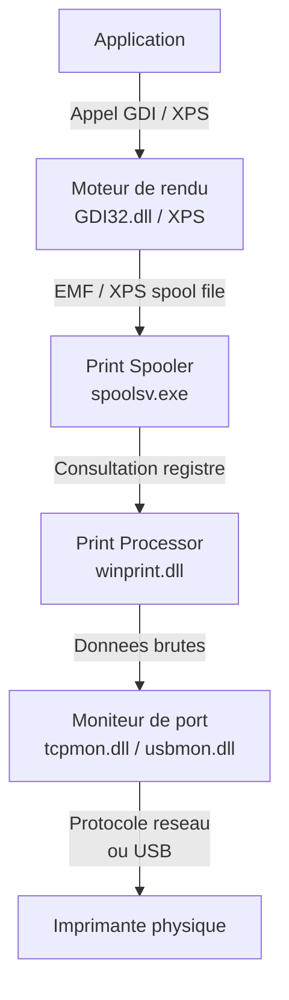
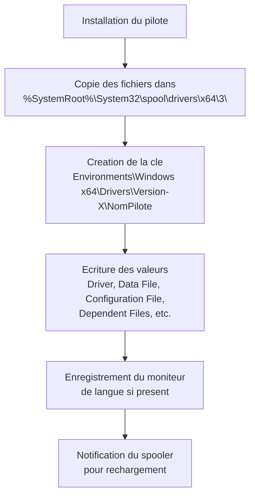
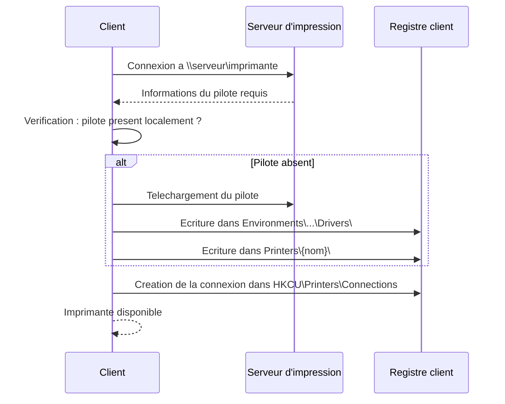

---
tags:
  - registre
  - impression
  - spooler
---

# Sous-systeme d'impression et le registre

!!! abstract "Ce que vous allez apprendre"
    - L'architecture du sous-systeme d'impression Windows et son ancrage dans le registre
    - La structure complete d'une imprimante dans le registre : chaque valeur, chaque attribut
    - Le fonctionnement des pilotes d'impression v3 et v4 et leur stockage dans le registre
    - Le mecanisme Point and Print, ses cles de registre et les failles PrintNightmare
    - La configuration utilisateur : imprimante par defaut, connexions reseau, profils itinerants
    - Le deploiement d'imprimantes en entreprise via GPO et Universal Print
    - Le depannage avance : spooler instable, pilotes corrompus, imprimantes fantomes

---

## En 30 secondes

Vous voulez connaitre l'etat exact du sous-systeme d'impression tel que le voit le noyau ? Une seule commande suffit :

```powershell
# List all printers with their registry-stored properties
Get-ItemProperty "HKLM:\SYSTEM\CurrentControlSet\Control\Print\Printers\*" |
    Select-Object Name, Port, "Printer Driver", Status, Attributes |
    Format-Table -AutoSize
```

```title="Resultat attendu"
Name                          Port            Printer Driver                        Status Attributes
----                          ----            --------------                        ------ ----------
HP LaserJet Pro               IP_10.0.1.50    HP Universal Printing PCL 6                0       2625
Microsoft Print to PDF        PORTPROMPT:     Microsoft Print To PDF                     0         64
OneNote (Desktop)             nul:            Send to Microsoft OneNote 16 Driver         0         64
```

Cette commande interroge directement l'arbre registre ou Windows stocke **chaque** imprimante installee. Pas d'abstraction WMI, pas de couche intermediaire : vous lisez ce que le spooler lit au demarrage. Ce chapitre vous enseigne a maitriser cette structure dans ses moindres details.

!!! tip "Analogie"
    Le sous-systeme d'impression fonctionne comme un **bureau de poste**. L'application depose son courrier (le document) au guichet (le spooler). Le guichet consulte le registre comme un annuaire interne pour savoir quel facteur (pilote) utiliser, quel itineraire (port) emprunter, et quelle boite aux lettres (imprimante physique) viser. Si l'annuaire contient une erreur, le courrier se perd.

!!! info "En resume"
    - La commande `Get-ItemProperty` sur `Control\Print\Printers\*` interroge directement le registre sans couche d'abstraction, revelant chaque imprimante telle que le spooler la voit
    - Le registre stocke le nom, le port, le pilote, le statut et les attributs de chaque imprimante installee sur la machine
    - Ce chapitre couvre l'architecture du spooler, les pilotes v3/v4, Point and Print, PrintNightmare, la configuration utilisateur, le deploiement en entreprise et le depannage

---

## Architecture du spooler et le registre

### Le service Print Spooler

Le spooler d'impression est un service Windows classique, defini dans le registre a :

```
HKLM\SYSTEM\CurrentControlSet\Services\Spooler
```

Ses valeurs principales :

| Valeur | Type | Contenu typique |
|--------|------|-----------------|
| `ImagePath` | `REG_EXPAND_SZ` | `%SystemRoot%\System32\spoolsv.exe` |
| `Start` | `REG_DWORD` | `2` (demarrage automatique) |
| `Type` | `REG_DWORD` | `0x10` (`SERVICE_WIN32_OWN_PROCESS`) |
| `ObjectName` | `REG_SZ` | `LocalSystem` |
| `DependOnService` | `REG_MULTI_SZ` | `RPCSS`, `http` |
| `RequiredPrivileges` | `REG_MULTI_SZ` | `SeTcbPrivilege`, `SeImpersonatePrivilege`, `SeAuditPrivilege` |

!!! note "Service interactif"
    Le flag `SERVICE_INTERACTIVE_PROCESS` (`0x100`) a longtemps existe mais il est deprecie depuis Vista et n'est plus un mode de fonctionnement normal du spooler sur les versions modernes de Windows.

Le processus `spoolsv.exe` charge des DLL (pilotes, moniteurs de port, processeurs d'impression) directement dans son espace d'adressage. C'est pourquoi un pilote defectueux peut faire crasher l'ensemble du sous-systeme.

```powershell
# Check the current state of the Spooler service
Get-Service -Name Spooler | Select-Object Name, Status, StartType
```

```title="Resultat attendu"
Name    Status StartType
----    ------ ---------
Spooler Running Automatic
```

### L'arbre principal du registre d'impression

Toute la configuration du sous-systeme d'impression reside sous une cle unique :

```
HKLM\SYSTEM\CurrentControlSet\Control\Print
```

Cette cle contient plusieurs sous-arbres, chacun dedie a un aspect du systeme :

| Sous-cle | Role | Contenu |
|----------|------|---------|
| `Environments` | Pilotes par architecture | Dossiers `Windows x64`, `Windows NT x86` contenant les pilotes |
| `Forms` | Tailles de papier | Formulaires predefinis et personnalises (A4, Letter, Legal, etc.) |
| `Monitors` | Moniteurs de port | Local Port, Standard TCP/IP Port, USB Monitor, WSD Port |
| `Printers` | Imprimantes installees | Une sous-cle par imprimante avec toute sa configuration |
| `Providers` | Fournisseurs d'impression | LanMan Print Services, Internet Print Provider |

```powershell
# Enumerate all subtrees under the Print key
Get-ChildItem "HKLM:\SYSTEM\CurrentControlSet\Control\Print" |
    Select-Object PSChildName |
    Format-Table -AutoSize
```

```title="Resultat attendu"
PSChildName
-----------
Environments
Forms
Monitors
Printers
Providers
```

### Flux d'un document a travers le sous-systeme

Quand une application imprime un document, les donnees traversent une chaine de composants dont chacun est configure dans le registre :



Le spooler consulte le registre a **chaque etape** : pour trouver le pilote, le processeur d'impression, le moniteur de port et les parametres specifiques a l'imprimante.

!!! note "Moniteurs de port"
    Les moniteurs de port sont des DLL enregistrees sous `HKLM\...\Control\Print\Monitors`. Chaque moniteur gere un type de connexion : `Standard TCP/IP Port` pour les imprimantes reseau, `USB Monitor` pour l'USB, `Local Port` pour les fichiers et ports COM/LPT, `WSD Port` pour Web Services for Devices.

### Environnements d'impression

La cle `Environments` separe les pilotes par architecture processeur :

```
HKLM\SYSTEM\CurrentControlSet\Control\Print\Environments\
    Windows x64\                    # Pilotes 64 bits
        Drivers\
        Print Processors\
    Windows NT x86\                 # Pilotes 32 bits (compatibilite)
        Drivers\
        Print Processors\
```

Sur un serveur d'impression, les deux environnements coexistent pour servir des clients 32 bits et 64 bits.

!!! info "En resume"
    - Le spooler (`spoolsv.exe`) est un service qui charge des DLL tierces dans son espace d'adressage ; un pilote defectueux peut faire crasher l'ensemble du sous-systeme.
    - Toute la configuration d'impression reside sous `HKLM\...\Control\Print` avec cinq sous-arbres : `Environments`, `Forms`, `Monitors`, `Printers` et `Providers`.
    - Le spooler consulte le registre a chaque etape du flux d'impression (pilote, processeur, moniteur de port) et separe les pilotes par architecture (x64, x86).

---

## Structure d'une imprimante dans le registre

### Emplacement et vue d'ensemble

Chaque imprimante installee possede sa propre sous-cle sous :

```
HKLM\SYSTEM\CurrentControlSet\Control\Print\Printers\{NomImprimante}
```

Examinons une imprimante reelle :

```powershell
# Display all registry values for a specific printer
$printerName = (Get-Printer | Select-Object -First 1).Name
Get-ItemProperty "HKLM:\SYSTEM\CurrentControlSet\Control\Print\Printers\$printerName"
```

```title="Resultat attendu"
Name             : HP LaserJet Pro
Port             : IP_10.0.1.50
Printer Driver   : HP Universal Printing PCL 6
Print Processor  : winprint
Datatype         : RAW
Location         : Building A, 2nd Floor
Priority         : 1
DefaultPriority  : 0
Attributes       : 2625
Status           : 0
...
```

### Table complete des valeurs

| Valeur | Type | Description |
|--------|------|-------------|
| `Name` | `REG_SZ` | Nom de l'imprimante tel qu'affiche aux utilisateurs |
| `Port` | `REG_SZ` | Port(s) utilise(s), separe(s) par des virgules (ex. `USB001`, `IP_10.0.1.50`) |
| `Printer Driver` | `REG_SZ` | Nom du pilote associe (doit correspondre a une entree sous `Environments\...\Drivers`) |
| `Print Processor` | `REG_SZ` | Processeur d'impression (generalement `winprint`) |
| `Datatype` | `REG_SZ` | Type de donnees par defaut (`RAW`, `EMF`, `XPS`) |
| `Parameters` | `REG_SZ` | Parametres supplementaires passes au processeur d'impression |
| `Description` | `REG_SZ` | Description libre de l'imprimante |
| `Location` | `REG_SZ` | Emplacement physique (batiment, etage, salle) |
| `Comment` | `REG_SZ` | Commentaire administratif |
| `Priority` | `REG_DWORD` | Priorite de l'imprimante (1 = minimum, 99 = maximum) |
| `DefaultPriority` | `REG_DWORD` | Priorite par defaut des travaux d'impression |
| `Status` | `REG_DWORD` | Etat actuel de l'imprimante (bitmask) |
| `Attributes` | `REG_DWORD` | Bitmask d'attributs (reseau, partagee, publiee, etc.) |
| `Security` | `REG_BINARY` | Descripteur de securite en format SDDL binaire |
| `SpoolDirectory` | `REG_SZ` | Repertoire de spoule personnalise (vide = defaut `%SystemRoot%\System32\spool\PRINTERS`) |
| `PrinterDriverData` | `REG_BINARY` | Blob binaire contenant les parametres specifiques au peripherique |
| `ChangeID` | `REG_DWORD` | Compteur incremente a chaque modification de la configuration |
| `dnsPrinterName` | `REG_SZ` | Nom DNS complet (pour les imprimantes publiees dans AD) |
| `Sharing Name` | `REG_SZ` | Nom de partage reseau |
| `txTimeout` | `REG_DWORD` | Delai d'expiration de transmission (millisecondes) |
| `dnsTimeout` | `REG_DWORD` | Delai d'expiration DNS (millisecondes) |

### DEVMODE par defaut

La sous-cle `Default DevMode` contient une structure binaire `DEVMODE` qui definit les parametres d'impression par defaut :

```
HKLM\...\Printers\{NomImprimante}\Default DevMode
```

Cette structure binaire encode :

| Champ DEVMODE | Description | Valeurs courantes |
|---------------|-------------|-------------------|
| `dmOrientation` | Orientation de la page | `1` = Portrait, `2` = Paysage |
| `dmPaperSize` | Taille de papier | `1` = Letter, `9` = A4, `8` = A3 |
| `dmPaperLength` | Longueur personnalisee | En dixiemes de millimetre |
| `dmPaperWidth` | Largeur personnalisee | En dixiemes de millimetre |
| `dmCopies` | Nombre de copies | Entier |
| `dmDefaultSource` | Bac papier | Depend du pilote |
| `dmPrintQuality` | Qualite d'impression | `-1` = Draft, `-2` = Low, `-3` = Medium, `-4` = High |
| `dmColor` | Mode couleur | `1` = Monochrome, `2` = Couleur |
| `dmDuplex` | Recto-verso | `1` = Simplex, `2` = Horizontal, `3` = Vertical |

```powershell
# Read default DEVMODE as raw bytes (first 100 bytes for inspection)
$printerName = (Get-Printer | Select-Object -First 1).Name
$devmode = (Get-ItemProperty "HKLM:\SYSTEM\CurrentControlSet\Control\Print\Printers\$printerName")."Default DevMode"
if ($devmode) {
    # Show the first 96 bytes in hex (covers the fixed portion of DEVMODE)
    ($devmode[0..95] | ForEach-Object { '{0:X2}' -f $_ }) -join ' '
}
```

```title="Resultat attendu"
48 00 50 00 20 00 4C 00 61 00 73 00 65 00 72 00 4A 00 65 00 74 00 20 00 50 00 72 00 6F 00 00 00
00 00 00 00 00 00 00 00 00 00 00 00 00 00 00 00 00 00 00 00 00 00 00 00 00 00 00 00 00 00 00 00
01 04 00 00 01 00 09 00 68 01 E8 03 01 00 07 00 01 00 01 00 01 00 C8 00 01 00 00 00 00 00 00 00
```

!!! warning "Structure binaire"
    La valeur `Default DevMode` est une structure C serialisee en binaire. Sa taille et son contenu varient selon le pilote. Ne modifiez jamais ces octets manuellement sans connaitre la structure exacte du pilote. Utilisez plutot `Set-PrintConfiguration` ou l'API `DocumentProperties`.

### Decodage du bitmask Attributes

La valeur `Attributes` est un champ de bits (bitmask) qui combine plusieurs proprietes :

| Bit | Valeur hex | Constante | Signification |
|-----|:----------:|-----------|---------------|
| 0 | `0x00000001` | `PRINTER_ATTRIBUTE_QUEUED` | L'imprimante met en file d'attente |
| 1 | `0x00000002` | `PRINTER_ATTRIBUTE_DIRECT` | Impression directe (pas de spooling) |
| 2 | `0x00000004` | `PRINTER_ATTRIBUTE_DEFAULT` | Imprimante par defaut du systeme |
| 3 | `0x00000008` | `PRINTER_ATTRIBUTE_SHARED` | Imprimante partagee sur le reseau |
| 4 | `0x00000010` | `PRINTER_ATTRIBUTE_NETWORK` | Imprimante reseau (connectee depuis un serveur) |
| 5 | `0x00000020` | `PRINTER_ATTRIBUTE_HIDDEN` | Masquee dans l'interface utilisateur |
| 6 | `0x00000040` | `PRINTER_ATTRIBUTE_LOCAL` | Imprimante locale |
| 11 | `0x00000800` | `PRINTER_ATTRIBUTE_ENABLE_DEVQ` | Active la file DevQuery |
| 13 | `0x00002000` | `PRINTER_ATTRIBUTE_KEEPPRINTEDJOBS` | Conserve les travaux termines |
| 14 | `0x00004000` | `PRINTER_ATTRIBUTE_DO_COMPLETE_FIRST` | Imprime d'abord les travaux complets |
| 15 | `0x00008000` | `PRINTER_ATTRIBUTE_WORK_OFFLINE` | Imprimante en mode hors-ligne |
| 22 | `0x00400000` | `PRINTER_ATTRIBUTE_PUBLISHED` | Publiee dans Active Directory |
| 27 | `0x08000000` | `PRINTER_ATTRIBUTE_PER_MACHINE_CONNECTION` | Connexion par machine (pas par utilisateur) |

```powershell
# Decode the Attributes bitmask for all installed printers
$flags = @{
    0x00000001 = "QUEUED"
    0x00000002 = "DIRECT"
    0x00000004 = "DEFAULT"
    0x00000008 = "SHARED"
    0x00000010 = "NETWORK"
    0x00000020 = "HIDDEN"
    0x00000040 = "LOCAL"
    0x00000800 = "ENABLE_DEVQ"
    0x00002000 = "KEEP_PRINTED_JOBS"
    0x00004000 = "DO_COMPLETE_FIRST"
    0x00008000 = "WORK_OFFLINE"
    0x00400000 = "PUBLISHED"
    0x08000000 = "PER_MACHINE_CONNECTION"
}

Get-Printer | ForEach-Object {
    $attr = $_.Attributes
    $decoded = $flags.GetEnumerator() | Where-Object { $attr -band $_.Key } |
        ForEach-Object { $_.Value }
    [PSCustomObject]@{
        Printer    = $_.Name
        AttrHex    = '0x{0:X8}' -f [int]$attr
        Flags      = $decoded -join ', '
    }
} | Format-Table -AutoSize
```

```title="Resultat attendu"
Printer                AttrHex      Flags
-------                -------      -----
HP LaserJet Pro        0x00000A41   QUEUED, LOCAL, SHARED, ENABLE_DEVQ
Microsoft Print to PDF 0x00000040   LOCAL
OneNote (Desktop)      0x00000040   LOCAL
```

### Interrogation avec les cmdlets PowerShell

Les cmdlets modernes offrent une interface propre au-dessus du registre :

```powershell
# List all printers with key properties
Get-Printer | Format-Table Name, DriverName, PortName, Shared, PrinterStatus

# Get device-specific properties (paper size, color mode, etc.)
Get-PrinterProperty -PrinterName "HP LaserJet Pro" |
    Format-Table PropertyName, Type, Value
```

```title="Resultat attendu"
Name                   DriverName                     PortName     Shared PrinterStatus
----                   ----------                     --------     ------ -------------
HP LaserJet Pro        HP Universal Printing PCL 6    IP_10.0.1.50   True Normal
Microsoft Print to PDF Microsoft Print To PDF         PORTPROMPT:   False Normal
OneNote (Desktop)      Send to Microsoft OneNote 16.. nul:          False Normal

PropertyName                   Type   Value
------------                   ----   -----
Config:AccessoryOutputBins     String Stacker
Config:DuplexUnit              String Installed
Config:EnvFeedUnit             String NotInstalled
Config:HPColorSupported        String False
...
```

```powershell
# Compare registry data with cmdlet output
$regData = Get-ItemProperty "HKLM:\SYSTEM\CurrentControlSet\Control\Print\Printers\HP LaserJet Pro"
$cmdData = Get-Printer -Name "HP LaserJet Pro"

[PSCustomObject]@{
    RegistryDriver = $regData."Printer Driver"
    CmdletDriver   = $cmdData.DriverName
    RegistryPort   = $regData.Port
    CmdletPort     = $cmdData.PortName
    Match          = ($regData."Printer Driver" -eq $cmdData.DriverName)
}
```

```title="Resultat attendu"
RegistryDriver : HP Universal Printing PCL 6
CmdletDriver   : HP Universal Printing PCL 6
RegistryPort   : IP_10.0.1.50
CmdletPort     : IP_10.0.1.50
Match          : True
```

!!! info "En resume"
    - Chaque imprimante installee possede sa propre sous-cle sous `Control\Print\Printers\{Nom}` avec toutes ses proprietes : pilote, port, processeur, type de donnees, attributs et permissions.
    - Le bitmask `Attributes` encode les caracteristiques de l'imprimante (reseau, partagee, duplex, couleur, etc.) et le bitmask `Status` reflete son etat courant.
    - Le registre est la source de verite pour le spooler ; les cmdlets PowerShell (`Get-Printer`) offrent une vue equivalente mais passent par une couche d'abstraction.

---

## Pilotes d'impression

### Stockage dans le registre

Les pilotes d'impression sont enregistres sous une structure hierarchique par architecture et par version :

```
HKLM\SYSTEM\CurrentControlSet\Control\Print\
    Environments\
        Windows x64\
            Drivers\
                Version-3\
                    {NomPilote}\          # Pilotes v3 classiques
                Version-4\
                    {NomPilote}\          # Pilotes v4 modernes
```

Chaque pilote possede ses propres valeurs de registre :

| Valeur | Type | Description |
|--------|------|-------------|
| `Configuration File` | `REG_SZ` | DLL d'interface utilisateur du pilote (dialogue des proprietes) |
| `Data File` | `REG_SZ` | Fichier de donnees du pilote (GPD, PPD, ou XML) |
| `Driver` | `REG_SZ` | DLL principale du pilote (rendering engine) |
| `Help File` | `REG_SZ` | Fichier d'aide associe |
| `Monitor` | `REG_SZ` | Moniteur de langue associe (optionnel) |
| `Dependent Files` | `REG_MULTI_SZ` | Liste de fichiers supplementaires requis par le pilote |
| `Driver Version` | `REG_DWORD` | Numero de version du pilote |
| `TempDir` | `REG_SZ` | Repertoire temporaire pour les fichiers de travail |
| `PrinterDriverAttributes` | `REG_DWORD` | Attributs du pilote (v4 : package-aware, sandbox, etc.) |

```powershell
# List all installed print drivers with their version
Get-PrinterDriver | Select-Object Name, MajorVersion, Manufacturer, PrinterEnvironment |
    Format-Table -AutoSize
```

```title="Resultat attendu"
Name                                   MajorVersion Manufacturer       PrinterEnvironment
----                                   ------------ ------------       ------------------
HP Universal Printing PCL 6                       3 HP                  Windows x64
Microsoft Print To PDF                            4 Microsoft           Windows x64
Microsoft XPS Document Writer v4                  4 Microsoft           Windows x64
Send to Microsoft OneNote 16 Driver               3 Microsoft           Windows x64
Microsoft IPP Class Driver                        4 Microsoft           Windows x64
```

```powershell
# Examine the registry entry for a specific driver
$driverPath = "HKLM:\SYSTEM\CurrentControlSet\Control\Print\Environments\Windows x64\Drivers\Version-3"
Get-ChildItem $driverPath | ForEach-Object {
    $props = Get-ItemProperty $_.PSPath
    [PSCustomObject]@{
        Name     = $_.PSChildName
        Driver   = $props.Driver
        DataFile = $props."Data File"
        Config   = $props."Configuration File"
    }
} | Format-Table -AutoSize
```

```title="Resultat attendu"
Name                                 Driver               DataFile                       Config
----                                 ------               --------                       ------
HP Universal Printing PCL 6          hppcl6lm.dll         hppcl6lm.gpd                   hppcl6lm.dll
Send to Microsoft OneNote 16 Driver  msonpnm.dll          msonpnui.gpd                   msonpnui.dll
```

### Pilotes Version-3 vs Version-4

Le modele de pilotes a evolue significativement entre v3 et v4 :

| Caracteristique | Version-3 | Version-4 |
|-----------------|-----------|-----------|
| **Mode d'execution** | Mode noyau possible (Type 2) ou utilisateur (Type 3) | Mode utilisateur uniquement |
| **Isolation** | Dans le processus spoolsv.exe | Processus sandbox isole (PrintIsolationHost.exe) |
| **Compatibilite** | Specifique au modele d'imprimante | Universel (un pilote pour plusieurs modeles) |
| **Fichier de description** | GPD (Generic Printer Description) / PPD | GPD + fichier de contraintes XML |
| **Interface utilisateur** | DLL UI personnalisee | Interface standard + extensions |
| **Installation** | Necessite des droits administrateur | Peut etre installe sans elevation |
| **Point and Print** | Necessite le telechargement du pilote complet | Telechargement minimal |
| **Presence dans le registre** | `Drivers\Version-3\` | `Drivers\Version-4\` |

!!! info "Migration vers v4"
    Microsoft a pousse les fabricants vers les pilotes v4 a partir de Windows 8. Windows 11 inclut un pilote v4 universel (Microsoft IPP Class Driver) qui fonctionne avec la plupart des imprimantes modernes via le protocole IPP. Les pilotes v3 restent supportes pour la compatibilite mais ne beneficient plus de certaines fonctionnalites de securite.

### Flux d'installation d'un pilote

Quand un pilote est installe via `AddPrinterDriver` ou `Add-PrinterDriver`, le systeme effectue les operations suivantes dans le registre :



```powershell
# Install a printer driver from an INF file
# (requires administrative privileges)
pnputil /add-driver "C:\Drivers\printer.inf" /install

# Verify the driver appears in the registry
Get-ChildItem "HKLM:\SYSTEM\CurrentControlSet\Control\Print\Environments\Windows x64\Drivers\Version-4" |
    Select-Object PSChildName
```

```title="Resultat attendu"
PSChildName
-----------
Microsoft IPP Class Driver
Microsoft Print To PDF
Microsoft XPS Document Writer v4
```

!!! info "En resume"
    - Les pilotes d'impression sont organises par architecture et par version (v3 kernel-mode, v3 user-mode, v4 moderne) sous `Environments\...\Drivers`.
    - Chaque pilote declare ses DLL (`Driver`, `Configuration File`, `Data File`, `Help File`) et ses dependances dans le registre.
    - Les pilotes v4 (bases sur des manifestes INF) sont isoles dans des processus utilisateur, reduisant le risque de crash du spooler par rapport aux pilotes v3 charges dans `spoolsv.exe`.

---

## Point and Print et la securite

### Mecanisme Point and Print

Point and Print est une fonctionnalite qui permet a un poste client de se connecter a une imprimante partagee sur un serveur et de telecharger automatiquement le pilote correspondant. Le mecanisme fonctionne ainsi :



### Cles de registre Point and Print

La configuration Point and Print est regie par des cles de strategie :

```
HKLM\SOFTWARE\Policies\Microsoft\Windows NT\Printers\PointAndPrint
```

| Valeur | Type | Description |
|--------|------|-------------|
| `RestrictDriverInstallationToAdministrators` | `REG_DWORD` | `1` = seuls les administrateurs peuvent installer des pilotes via Point and Print |
| `NoWarningNoElevationOnInstall` | `REG_DWORD` | `1` = pas d'avertissement ni d'elevation a l'installation |
| `UpdatePromptSettings` | `REG_DWORD` | `0` = avertissement + elevation, `1` = avertissement, `2` = aucun |
| `TrustedServers` | `REG_DWORD` | `1` = active la restriction par liste de serveurs |
| `ServerList` | `REG_SZ` | Liste de serveurs de confiance separes par des points-virgules |
| `InForest` | `REG_DWORD` | `1` = autorise uniquement les serveurs dans la foret AD |
| `Restricted` | `REG_DWORD` | `1` = active les restrictions Point and Print |

```powershell
# Check current Point and Print policy settings
$pnpPath = "HKLM:\SOFTWARE\Policies\Microsoft\Windows NT\Printers\PointAndPrint"
if (Test-Path $pnpPath) {
    Get-ItemProperty $pnpPath | Format-List
} else {
    Write-Output "No Point and Print policy configured (using defaults)"
}
```

```title="Resultat attendu"
RestrictDriverInstallationToAdministrators : 1
NoWarningNoElevationOnInstall             : 0
UpdatePromptSettings                      : 0
TrustedServers                            : 1
ServerList                                : print-srv01.contoso.com;print-srv02.contoso.com
```

### PrintNightmare (CVE-2021-34527 / CVE-2021-1675)

!!! danger "Vulnerabilite critique"
    PrintNightmare est l'une des vulnerabilites les plus impactantes de l'histoire de Windows. Elle a permis l'execution de code arbitraire a distance avec les privileges SYSTEM via le service Print Spooler.

**Ce qui s'est passe** : Les chercheurs ont decouvert que la fonction `AddPrinterDriverEx()` du spooler pouvait etre appelee a distance par un utilisateur non-administrateur pour charger une DLL malveillante. Puisque le spooler fonctionne sous le compte SYSTEM, la DLL obtenait un controle total de la machine.

La vulnerabilite exploitait deux faiblesses :

1. **CVE-2021-1675** (juin 2021) : Elevation de privileges locale via le spooler
2. **CVE-2021-34527** (juillet 2021) : Execution de code a distance via le meme vecteur

**Chronologie des correctifs et modifications registre** :

| Date | Evenement | Action registre |
|------|-----------|-----------------|
| Juin 2021 | Publication CVE-2021-1675 | Patch initial (incomplet) |
| Juillet 2021 | Decouverte CVE-2021-34527 | Patch d'urgence hors cycle |
| Aout 2021 | Renforcement Point and Print | `RestrictDriverInstallationToAdministrators` = `1` par defaut |
| Septembre 2021 | RPC hardening | `RpcAuthnLevelPrivacyEnabled` = `1` par defaut |
| Janvier 2022 | Restriction finale | Pilotes v3 interdits par defaut via Point and Print |

**Attenuations par le registre** :

```powershell
# MITIGATION 1: Restrict driver installation to administrators only
# This is the primary PrintNightmare fix
New-ItemProperty -Path "HKLM:\SOFTWARE\Policies\Microsoft\Windows NT\Printers\PointAndPrint" `
    -Name "RestrictDriverInstallationToAdministrators" `
    -Value 1 -PropertyType DWord -Force

# MITIGATION 2: Enable RPC authentication level privacy
# Prevents unauthenticated RPC calls to the spooler
New-ItemProperty -Path "HKLM:\SYSTEM\CurrentControlSet\Control\Print" `
    -Name "RpcAuthnLevelPrivacyEnabled" `
    -Value 1 -PropertyType DWord -Force

# MITIGATION 3: Disable Point and Print entirely (most restrictive)
New-ItemProperty -Path "HKLM:\SOFTWARE\Policies\Microsoft\Windows NT\Printers\PointAndPrint" `
    -Name "NoWarningNoElevationOnInstall" `
    -Value 0 -PropertyType DWord -Force
New-ItemProperty -Path "HKLM:\SOFTWARE\Policies\Microsoft\Windows NT\Printers\PointAndPrint" `
    -Name "UpdatePromptSettings" `
    -Value 0 -PropertyType DWord -Force
```

```title="Resultat attendu"
Aucune sortie si la commande reussit. Les valeurs de registre Point and Print sont mises a jour.
```

```powershell
# NUCLEAR OPTION: Disable the Print Spooler service entirely
# (only for servers that do not need printing)
Stop-Service -Name Spooler -Force
Set-Service -Name Spooler -StartupType Disabled

# Verify the service is stopped and disabled
Get-Service -Name Spooler | Select-Object Name, Status, StartType
```

```title="Resultat attendu"
Name    Status StartType
----    ------ ---------
Spooler Stopped  Disabled
```

!!! warning "Impact en entreprise"
    Desactiver le spooler empeche **toute** impression locale et reseau, mais aussi certaines fonctionnalites comme la numerisation et le fax. Sur les controleurs de domaine, desactiver le spooler est une **bonne pratique de securite** car il constitue un vecteur d'attaque inutile sur ces machines.

### Bonnes pratiques actuelles pour Point and Print

Depuis les correctifs PrintNightmare, Microsoft recommande :

1. **Maintenir `RestrictDriverInstallationToAdministrators` a `1`** sur tous les postes
2. **Utiliser des pilotes v4** qui ne necessitent pas de telechargement de DLL
3. **Activer `RpcAuthnLevelPrivacyEnabled`** pour chiffrer les communications RPC du spooler
4. **Restreindre les serveurs de confiance** via `TrustedServers` et `ServerList` si Point and Print est necessaire
5. **Desactiver le spooler** sur les serveurs qui n'ont pas besoin d'imprimer (controleurs de domaine, serveurs applicatifs)

```powershell
# Audit script: check PrintNightmare mitigations on the local machine
$results = @()

# Check RestrictDriverInstallationToAdministrators
$pnpPath = "HKLM:\SOFTWARE\Policies\Microsoft\Windows NT\Printers\PointAndPrint"
$restrict = (Get-ItemProperty $pnpPath -Name "RestrictDriverInstallationToAdministrators" -ErrorAction SilentlyContinue).RestrictDriverInstallationToAdministrators
$results += [PSCustomObject]@{
    Check  = "RestrictDriverInstallationToAdministrators"
    Value  = $restrict
    Status = if ($restrict -eq 1) { "SECURE" } else { "VULNERABLE" }
}

# Check RpcAuthnLevelPrivacyEnabled
$rpcValue = (Get-ItemProperty "HKLM:\SYSTEM\CurrentControlSet\Control\Print" -Name "RpcAuthnLevelPrivacyEnabled" -ErrorAction SilentlyContinue).RpcAuthnLevelPrivacyEnabled
$results += [PSCustomObject]@{
    Check  = "RpcAuthnLevelPrivacyEnabled"
    Value  = $rpcValue
    Status = if ($rpcValue -eq 1) { "SECURE" } else { "REVIEW" }
}

# Check Spooler service status on domain controllers
$isDC = (Get-WmiObject Win32_ComputerSystem).DomainRole -ge 4
$spooler = Get-Service -Name Spooler
$results += [PSCustomObject]@{
    Check  = "Spooler on DC"
    Value  = "$($spooler.Status) / $($spooler.StartType)"
    Status = if ($isDC -and $spooler.Status -eq 'Running') { "REVIEW" } else { "OK" }
}

$results | Format-Table -AutoSize
```

```title="Resultat attendu"
Check                                      Value Status
-----                                      ----- ------
RestrictDriverInstallationToAdministrators      1 SECURE
RpcAuthnLevelPrivacyEnabled                    1 SECURE
Spooler on DC                    Running / Automatic OK
```

!!! info "En resume"
    - Point and Print permet aux clients de telecharger automatiquement les pilotes depuis un serveur d'impression ; les cles sous `Windows NT\...\Point and Print` controlent ce comportement.
    - Les failles PrintNightmare (CVE-2021-34527 et suivantes) exploitaient ce mecanisme pour executer du code arbitraire ; les correctifs imposent `RestrictDriverInstallationToAdministrators = 1`.
    - L'audit de securite du spooler doit verifier les restrictions Point and Print, l'authentification RPC et la presence du spooler sur les controleurs de domaine.

---

## Configuration utilisateur

### Imprimante par defaut

L'imprimante par defaut de l'utilisateur est stockee dans deux emplacements selon la version de Windows et le mode choisi :

**Mode classique** (imprimante par defaut fixe) :

```
HKCU\SOFTWARE\Microsoft\Windows NT\CurrentVersion\Windows
```

| Valeur | Type | Description |
|--------|------|-------------|
| `Device` | `REG_SZ` | Nom de l'imprimante par defaut au format `NomImprimante,winspool,PortName:` |
| `LegacyDefaultPrinterMode` | `REG_DWORD` | `1` = mode classique (defaut fixe), `0` = mode automatique Windows 10+ |

**Mode automatique** (Windows 10 et ulterieur) :

A partir de Windows 10, le systeme selectionne automatiquement la derniere imprimante utilisee sur le reseau actuel. Ce comportement est controle par :

```
HKCU\SOFTWARE\Microsoft\Windows NT\CurrentVersion\Windows
    LegacyDefaultPrinterMode = 0 (REG_DWORD)
```

Quand ce mode est actif, Windows maintient un historique des dernieres imprimantes utilisees par reseau dans :

```
HKCU\SOFTWARE\Microsoft\Windows NT\CurrentVersion\Windows\SessionDefaultPrinter
```

```powershell
# Check which default printer mode is active
$winPath = "HKCU:\SOFTWARE\Microsoft\Windows NT\CurrentVersion\Windows"
$legacy = (Get-ItemProperty $winPath -Name "LegacyDefaultPrinterMode" -ErrorAction SilentlyContinue).LegacyDefaultPrinterMode

if ($legacy -eq 1) {
    $device = (Get-ItemProperty $winPath).Device
    Write-Output "Classic mode: default printer is '$device'"
} else {
    Write-Output "Automatic mode: Windows manages the default printer based on last used"
}
```

```title="Resultat attendu"
Classic mode: default printer is 'HP LaserJet Pro,winspool,IP_10.0.1.50:'
```

```powershell
# Force classic default printer mode and set a specific default
Set-ItemProperty "HKCU:\SOFTWARE\Microsoft\Windows NT\CurrentVersion\Windows" `
    -Name "LegacyDefaultPrinterMode" -Value 1 -Type DWord

# Set default printer via cmdlet (preferred method)
Set-Printer -Name "HP LaserJet Pro" -Default
```

```title="Resultat attendu"
Aucune sortie si la commande reussit. L'imprimante par defaut est fixee en mode classique.
```

### Connexions aux imprimantes reseau

Quand un utilisateur se connecte a une imprimante partagee, la connexion est enregistree sous :

```
HKCU\Printers\Connections\
    ,,serveur,NomPartage\
```

Le format du nom de sous-cle utilise des virgules comme separateurs au lieu de backslashes. Par exemple, `\\print-srv\HP4050` devient `,,print-srv,HP4050`.

| Valeur | Type | Description |
|--------|------|-------------|
| `Server` | `REG_SZ` | Nom du serveur (`\\print-srv`) |
| `Provider` | `REG_SZ` | Fournisseur d'impression (`win32spl.dll`) |
| `GuidPrinter` | `REG_SZ` | GUID unique de l'imprimante sur le serveur |

```powershell
# List all network printer connections for the current user
Get-ChildItem "HKCU:\Printers\Connections" -ErrorAction SilentlyContinue | ForEach-Object {
    $props = Get-ItemProperty $_.PSPath
    [PSCustomObject]@{
        Connection = $_.PSChildName -replace ',', '\'
        Server     = $props.Server
        Provider   = $props.Provider
    }
} | Format-Table -AutoSize
```

```title="Resultat attendu"
Connection             Server           Provider
----------             ------           --------
\\print-srv\HP4050     \\print-srv      win32spl.dll
\\print-srv\Canon-RH   \\print-srv      win32spl.dll
```

### Preferences d'impression par utilisateur

Chaque utilisateur possede ses propres preferences d'impression (orientation, qualite, bac papier) stockees dans :

```
HKCU\Printers\DevModePerUser\{NomImprimante}
```

Cette valeur `REG_BINARY` contient une structure `DEVMODE` identique a celle decrite precedemment, mais specifique a l'utilisateur. Elle prend le dessus sur le `Default DevMode` machine quand l'utilisateur imprime.

### Profils itinerants et impression

Dans un environnement avec profils itinerants (roaming profiles), les preferences d'impression suivent l'utilisateur entre les machines. Cela inclut :

- Les connexions imprimantes (`HKCU\Printers\Connections`)
- Les preferences par utilisateur (`HKCU\Printers\DevModePerUser`)
- L'imprimante par defaut (`HKCU\...\Windows\Device`)

!!! warning "Pieges des profils itinerants"
    Les connexions imprimantes dans un profil itinerant peuvent poser probleme si l'utilisateur se connecte sur un site distant ou le serveur d'impression n'est pas accessible. L'ouverture de session sera ralentie par les tentatives de reconnexion. Utilisez les preferences de strategie de groupe (GPP) pour mapper les imprimantes dynamiquement en fonction du site AD plutot que de les stocker dans le profil.

!!! info "En resume"
    - L'imprimante par defaut de l'utilisateur est stockee sous `HKCU\...\Windows` (mode classique) ou geree dynamiquement par Windows selon le dernier reseau utilise.
    - Les connexions imprimantes reseau et les preferences `DevMode` sont enregistrees dans `HKCU\Printers`.
    - Les profils itinerants synchronisent ces cles, mais les connexions vers des serveurs distants peuvent ralentir l'ouverture de session.

---

## Gestion d'entreprise

### Deploiement par strategie de groupe (GPO)

Les imprimantes deployees par GPO sont enregistrees dans des emplacements specifiques du registre :

**Connexions deploiees par machine** (Computer Configuration) :

```
HKLM\SOFTWARE\Microsoft\Windows NT\CurrentVersion\Print\Connections\
    ,,serveur,NomPartage\
```

**Connexions deploiees par utilisateur** (User Configuration) :

```
HKCU\Software\Microsoft\Windows NT\CurrentVersion\Print\Connections\
    ,,serveur,NomPartage\
```

!!! note "PushPrinterConnections.exe"
    L'executable `PushPrinterConnections.exe` s'execute via un script de demarrage (machine) ou d'ouverture de session (utilisateur). Il lit la liste des imprimantes deployees dans la GPO et cree les connexions correspondantes dans le registre. Sans ce script, les GPO d'impression ne s'appliquent pas.

```powershell
# Check machine-deployed printer connections
$machinePrinters = "HKLM:\SOFTWARE\Microsoft\Windows NT\CurrentVersion\Print\Connections"
if (Test-Path $machinePrinters) {
    Get-ChildItem $machinePrinters | ForEach-Object {
        [PSCustomObject]@{
            Type       = "Machine"
            Connection = $_.PSChildName -replace ',', '\'
        }
    }
} else {
    Write-Output "No machine-deployed printer connections found"
}

# Check user-deployed printer connections
$userPrinters = "HKCU:\Software\Microsoft\Windows NT\CurrentVersion\Print\Connections"
if (Test-Path $userPrinters) {
    Get-ChildItem $userPrinters | ForEach-Object {
        [PSCustomObject]@{
            Type       = "User"
            Connection = $_.PSChildName -replace ',', '\'
        }
    }
} else {
    Write-Output "No user-deployed printer connections found"
}
```

```title="Resultat attendu"
Type    Connection
----    ----------
Machine \\print-srv01\HP-RDC-2F
Machine \\print-srv01\Canon-Accueil

No user-deployed printer connections found
```

### Preferences de strategie de groupe (GPP)

Les GPP Printer sont une alternative plus flexible aux GPO classiques. Elles permettent de :

- Mapper des imprimantes selon le groupe AD, le site ou l'OU de l'utilisateur
- Definir l'imprimante par defaut conditionnellement
- Supprimer des connexions obsoletes

Les GPP ne stockent pas directement les connexions dans le registre : elles executent une action au moment de l'application de la strategie qui cree ou modifie les entrees dans `HKCU\Printers\Connections`.

### Universal Print

Universal Print est la solution d'impression cloud de Microsoft, integree a Azure AD. Sa configuration registre reside sous :

```
HKLM\SOFTWARE\Microsoft\UniversalPrint
```

| Valeur | Type | Description |
|--------|------|-------------|
| `DiscoveryEndpoint` | `REG_SZ` | URL du service de decouverte Universal Print |
| `TenantId` | `REG_SZ` | Identifiant du tenant Azure AD |
| `Enabled` | `REG_DWORD` | `1` = Universal Print active sur ce poste |

```powershell
# Check if Universal Print is configured
$upPath = "HKLM:\SOFTWARE\Microsoft\UniversalPrint"
if (Test-Path $upPath) {
    Get-ItemProperty $upPath | Select-Object DiscoveryEndpoint, TenantId, Enabled
} else {
    Write-Output "Universal Print is not configured on this machine"
}
```

```title="Resultat attendu"
DiscoveryEndpoint                                         TenantId                             Enabled
-----------------                                         --------                             -------
https://print.print.microsoft.com/clientdiscovery/v1.0    a1b2c3d4-e5f6-7890-abcd-ef0123456789       1
```

Universal Print elimine le besoin de serveurs d'impression locaux et de Point and Print, ce qui reduit considerablement la surface d'attaque liee a PrintNightmare.

### Pool d'imprimantes et priorites

Le pool d'imprimantes permet d'associer plusieurs ports physiques a une seule imprimante logique. Le spooler envoie chaque travail au premier port disponible.

```
HKLM\...\Printers\{PoolPrinter}\
    Port = "IP_10.0.1.50,IP_10.0.1.51,IP_10.0.1.52"   (REG_SZ)
    Attributes = 0x... (avec le flag ENABLE_BIDI)
```

Les ports sont separes par des virgules dans la valeur `Port`. Le spooler les essaie sequentiellement.

Pour gerer les priorites, creez plusieurs imprimantes logiques pointant vers le meme port physique, mais avec des valeurs `Priority` differentes :

```powershell
# Create a high-priority logical printer for executives
Add-Printer -Name "HP4050-Priority" -DriverName "HP Universal Printing PCL 6" `
    -PortName "IP_10.0.1.50"
Set-ItemProperty "HKLM:\SYSTEM\CurrentControlSet\Control\Print\Printers\HP4050-Priority" `
    -Name "Priority" -Value 99 -Type DWord

# The standard printer keeps the default priority (1)
# Jobs from HP4050-Priority will always print before standard jobs
```

```title="Resultat attendu"
Aucune sortie si la commande reussit. L'imprimante HP4050-Priority est creee avec une priorite de 99.
```

### Print Management Console

La console `printmanagement.msc` est un outil graphique qui interagit directement avec le registre et les API du spooler. Elle offre une vue centralisee de :

- Tous les serveurs d'impression de l'entreprise
- Les imprimantes, pilotes, ports et formulaires
- Les filtres personnalises (imprimantes en erreur, avec file d'attente, etc.)

Sa configuration est stockee sous :

```
HKCU\Software\Microsoft\Print\Components
```

!!! info "En resume"
    - Les imprimantes deployees par GPO sont enregistrees sous `HKLM\...\Print\Connections` (machine) ou `HKCU\...\Print\Connections` (utilisateur) avec des sous-cles au format `,,serveur,partage`.
    - Universal Print (impression cloud Microsoft) utilise une infrastructure sans serveur d'impression on-premise, avec ses propres cles de configuration dans le registre.
    - Le Print Management Console (printmanagement.msc) offre une vue centralisee des imprimantes, serveurs et pilotes pour l'administration en entreprise.

---

## Depannage

### Crash du spooler

Le service Spooler est particulierement vulnerable aux crashes car il charge des DLL tierces (pilotes) dans son espace d'adressage. Les causes les plus frequentes :

| Cause | Symptome | Verification registre |
|-------|----------|----------------------|
| Pilote v3 defectueux | Crash au demarrage du spooler | Verifier `Environments\...\Drivers\Version-3\` pour des pilotes suspects |
| Moniteur de port corrompu | Crash au chargement d'un port | Examiner `Control\Print\Monitors\` pour des DLL invalides |
| Processeur d'impression defaillant | Crash lors de la soumission d'un travail | Verifier `Print Processors\` sous l'environnement concerne |
| Fichier spool corrompu | Crash au redemarrage du spooler | Vider `%SystemRoot%\System32\spool\PRINTERS\` |
| Cle registre corrompue | Crash aleatoire | Exporter et examiner `Control\Print\Printers\` |

```powershell
# Check Event Log for Spooler crash events
Get-WinEvent -FilterHashtable @{
    LogName   = 'System'
    Id        = 7031, 7034, 7000, 808
    StartTime = (Get-Date).AddDays(-7)
} -ErrorAction SilentlyContinue | Where-Object {
    $_.Message -match 'Spooler|spoolsv|Print'
} | Select-Object TimeCreated, Id, Message | Format-Table -Wrap
```

```title="Resultat attendu"
TimeCreated           Id Message
-----------           -- -------
2024-03-14 09:22:15 7031 The Print Spooler service terminated unexpectedly. It has done this 2 time(s). The following
                         corrective action will be taken in 60000 milliseconds: Restart the service.
2024-03-12 14:05:33  808 A print job (document: Quarterly Report.docx, owner: CONTOSO\jbombled) failed to print on
                         printer HP LaserJet Pro. Error code: 0x00000709.
```

### Nettoyage d'un pilote corrompu

Quand un pilote empeche le spooler de demarrer, il faut le retirer manuellement du registre :

```powershell
# Step 1: Stop the spooler
Stop-Service -Name Spooler -Force

# Step 2: Identify the problematic driver in the registry
$driverPath = "HKLM:\SYSTEM\CurrentControlSet\Control\Print\Environments\Windows x64\Drivers\Version-3"
Get-ChildItem $driverPath | Select-Object PSChildName

# Step 3: Remove the faulty driver key (replace with actual driver name)
# Remove-Item "$driverPath\FaultyDriverName" -Recurse -Force

# Step 4: Remove associated driver files
# $driverDir = "$env:SystemRoot\System32\spool\drivers\x64\3"
# Remove-Item "$driverDir\faulty*" -Force

# Step 5: Restart the spooler
Start-Service -Name Spooler
```

```title="Resultat attendu"
PSChildName
-----------
HP Universal Printing PCL 6
Send to Microsoft OneNote 16 Driver
```

!!! danger "Suppression de pilotes"
    Ne supprimez jamais un pilote du registre pendant que le spooler est en cours d'execution. Arretez **toujours** le service d'abord. Exportez la cle avant de la supprimer (`reg export`) pour pouvoir revenir en arriere.

### Imprimantes fantomes

Les imprimantes fantomes sont des imprimantes qui apparaissent dans l'interface malgre leur suppression. Elles sont causees par des residus dans le registre. Procedure de nettoyage complete :

```powershell
# Step 1: Stop the spooler
Stop-Service -Name Spooler -Force

# Step 2: List all printer keys in the registry
$printerRegPath = "HKLM:\SYSTEM\CurrentControlSet\Control\Print\Printers"
$regPrinters = (Get-ChildItem $printerRegPath).PSChildName

# Step 3: Compare with actually installed printers
# (spooler must be running for Get-Printer to work, so we restart temporarily)
Start-Service -Name Spooler
Start-Sleep -Seconds 3
$livePrinters = (Get-Printer).Name
Stop-Service -Name Spooler -Force

# Step 4: Identify ghost printers (in registry but not in live list)
$ghosts = $regPrinters | Where-Object { $_ -notin $livePrinters }

if ($ghosts) {
    Write-Output "Ghost printers found:"
    $ghosts | ForEach-Object { Write-Output "  - $_" }

    # Step 5: Back up and remove ghost entries
    foreach ($ghost in $ghosts) {
        $keyPath = "$printerRegPath\$ghost"
        # Export the key before deletion for safety
        reg export "HKLM\SYSTEM\CurrentControlSet\Control\Print\Printers\$ghost" `
            "$env:TEMP\ghost_printer_$($ghost -replace '[\\/:*?""<>|]','_').reg" /y
        Remove-Item $keyPath -Recurse -Force
        Write-Output "Removed ghost printer: $ghost"
    }
} else {
    Write-Output "No ghost printers detected"
}

# Step 6: Clear the spool folder and restart
Remove-Item "$env:SystemRoot\System32\spool\PRINTERS\*" -Force -ErrorAction SilentlyContinue
Start-Service -Name Spooler
```

```title="Resultat attendu"
Ghost printers found:
  - OldPrinter-Building-C
Removed ghost printer: OldPrinter-Building-C
```

### Script de reinitialisation complete du spooler

Ce script effectue une reinitialisation propre du sous-systeme d'impression :

```powershell
# Full spooler reset procedure
# WARNING: This will clear all pending print jobs

# Step 1: Stop the spooler service
Write-Output "Stopping Print Spooler..."
Stop-Service -Name Spooler -Force -ErrorAction Stop
Start-Sleep -Seconds 2

# Step 2: Clear the spool directory (pending jobs)
$spoolPath = "$env:SystemRoot\System32\spool\PRINTERS"
$files = Get-ChildItem $spoolPath -ErrorAction SilentlyContinue
if ($files) {
    Write-Output "Clearing $($files.Count) files from spool directory..."
    Remove-Item "$spoolPath\*" -Force
} else {
    Write-Output "Spool directory is already clean"
}

# Step 3: Clear any stuck rendering in the shadow directory
$shadowPath = "$env:SystemRoot\System32\spool\drivers\x64\3\Old"
if (Test-Path $shadowPath) {
    Remove-Item "$shadowPath\*" -Force -ErrorAction SilentlyContinue
}

# Step 4: Reset the spooler service failure counter
sc.exe failure Spooler reset= 0

# Step 5: Restart the spooler
Write-Output "Starting Print Spooler..."
Start-Service -Name Spooler
$status = (Get-Service -Name Spooler).Status
Write-Output "Spooler status: $status"

# Step 6: Verify printers are back
Get-Printer | Select-Object Name, PrinterStatus | Format-Table -AutoSize
```

```title="Resultat attendu"
Stopping Print Spooler...
Clearing 3 files from spool directory...
Starting Print Spooler...
Spooler status: Running

Name                          PrinterStatus
----                          -------------
HP LaserJet Pro               Normal
Microsoft Print to PDF        Normal
```

### Erreurs de permissions d'impression

Les permissions d'impression sont stockees dans la valeur `Security` (descriptor SDDL binaire) de chaque imprimante. Les problemes courants :

| Probleme | Cause | Solution registre |
|----------|-------|-------------------|
| "Access Denied" a l'impression | ACL incorrecte sur l'imprimante | Reconstruire le descripteur SDDL |
| Impossible de gerer la file | Permission "Manage Documents" absente | Ajouter le SID utilisateur a la DACL |
| Impossible de partager | Permission "Manage Printers" absente | Modifier la valeur `Security` ou utiliser `Set-Printer` |

```powershell
# Display the security descriptor for a printer in SDDL format
$printerName = "HP LaserJet Pro"
$printer = Get-Printer -Name $printerName -Full
$printer | Select-Object Name, PermissionSDDL
```

```title="Resultat attendu"
Name            PermissionSDDL
----            --------------
HP LaserJet Pro G:SYD:(A;;LCSWSDRCWDWO;;;BA)(A;;LCSWSDRCWDWO;;;SY)(A;;SWRC;;;WD)(A;CIIO;RC;;;CO)
```

```powershell
# Grant print permission to a specific group
$printerName = "HP LaserJet Pro"
$printer = Get-Printer -Name $printerName -Full
$currentSDDL = $printer.PermissionSDDL

# Append an ACE granting Print permission to Domain Users
# (A;;0x20008;;;DU) = Allow, Print+ReadPermissions, Domain Users
$newSDDL = $currentSDDL -replace '(?=D:)', ''
Set-Printer -Name $printerName -PermissionSDDL "$currentSDDL(A;;0x20008;;;DU)"
```

```title="Resultat attendu"
Aucune sortie si la commande reussit. Le groupe Domain Users dispose maintenant de la permission d'impression.
```

### Table de diagnostic

| Symptome | Verification registre | Correction |
|----------|----------------------|------------|
| Spooler ne demarre pas | `HKLM\...\Services\Spooler` — verifier `ImagePath` et `DependOnService` | Reparer le chemin ou les dependances |
| Imprimante disparue | `HKLM\...\Control\Print\Printers\` — cle presente ? | Reinstaller l'imprimante ou restaurer la cle |
| Pilote manquant | `HKLM\...\Environments\Windows x64\Drivers\` — cle du pilote presente ? | Reinstaller le pilote |
| Impression bloquee en file | Verifier `SpoolDirectory` et l'espace disque | Vider le repertoire de spool, augmenter l'espace |
| Point and Print refuse | `HKLM\...\Printers\PointAndPrint` — `RestrictDriverInstallationToAdministrators` | Ajuster la politique ou installer le pilote manuellement |
| Imprimante par defaut change toute seule | `HKCU\...\Windows\LegacyDefaultPrinterMode` | Passer a `1` pour fixer l'imprimante par defaut |
| Double imprimante (fantome) | `HKLM\...\Print\Printers\` — doublons presents | Supprimer la cle fantome (spooler arrete) |
| Port TCP/IP en erreur | `HKLM\...\Print\Monitors\Standard TCP/IP Port\Ports\` | Verifier IP, protocole et numero de port |
| Impression en mode hors-ligne | Verifier `Attributes` — flag `WORK_OFFLINE` (`0x8000`) | Retirer le flag via `Set-Printer` ou edition du registre |

### Evenements cles du journal

Le sous-systeme d'impression genere des evenements dans le journal `System` et le journal `Microsoft-Windows-PrintService/Operational` :

| Event ID | Source | Signification |
|:--------:|--------|---------------|
| 307 | PrintService | Document imprime avec succes (nom, utilisateur, taille, pages) |
| 372 | PrintService | Pilote d'impression charge |
| 805 | PrintService | Echec de l'installation d'un pilote |
| 808 | PrintService | Erreur du spooler lors du traitement d'un travail |
| 842 | PrintService | Point and Print : pilote telecharge depuis un serveur |
| 7031 | Service Control Manager | Le service Spooler s'est termine de maniere inattendue |
| 7034 | Service Control Manager | Le service Spooler s'est termine de maniere inattendue (repetition) |
| 10010 | DCOM | Erreur DCOM liee au spooler (timeout d'activation) |

```powershell
# Enable the operational log for detailed print events
wevtutil set-log "Microsoft-Windows-PrintService/Operational" /enabled:true

# Query recent print events
Get-WinEvent -LogName "Microsoft-Windows-PrintService/Operational" -MaxEvents 20 |
    Select-Object TimeCreated, Id, LevelDisplayName, Message |
    Format-Table -Wrap
```

```title="Resultat attendu"
TimeCreated           Id LevelDisplayName Message
-----------           -- --------------- -------
2024-03-15 16:42:10  307 Information     Document Budget_2024.xlsx, owned by CONTOSO\jbombled, was printed on HP LaserJet Pro...
2024-03-15 16:42:08  372 Information     Printer driver HP Universal Printing PCL 6 for Windows x64 Version-3 was loaded.
2024-03-15 15:18:55  307 Information     Document Compte-rendu reunion.docx, owned by CONTOSO\mdurand, was printed on HP Las...
...
```

```powershell
# Audit: who printed what in the last 24 hours
Get-WinEvent -FilterHashtable @{
    LogName   = 'Microsoft-Windows-PrintService/Operational'
    Id        = 307
    StartTime = (Get-Date).AddDays(-1)
} -ErrorAction SilentlyContinue | ForEach-Object {
    [PSCustomObject]@{
        Time     = $_.TimeCreated
        User     = $_.Properties[2].Value
        Printer  = $_.Properties[4].Value
        Document = $_.Properties[1].Value
        Pages    = $_.Properties[7].Value
        Size     = '{0:N0} KB' -f ($_.Properties[6].Value / 1KB)
    }
} | Format-Table -AutoSize
```

```title="Resultat attendu"
Time                 User              Printer          Document                    Pages Size
----                 ----              -------          --------                    ----- ----
2024-03-15 16:42:10  CONTOSO\jbombled  HP LaserJet Pro  Budget_2024.xlsx               3 245 KB
2024-03-15 15:18:55  CONTOSO\mdurand   HP LaserJet Pro  Compte-rendu reunion.docx      7 1,024 KB
2024-03-15 14:05:22  CONTOSO\jbombled  Canon-Accueil    Presentation clients.pptx     12 3,842 KB
...
```

---

!!! info "En resume"
    Le sous-systeme d'impression Windows est entierement pilote par le registre. Chaque imprimante, chaque pilote, chaque moniteur de port et chaque politique de securite repose sur des cles et des valeurs sous `HKLM\SYSTEM\CurrentControlSet\Control\Print`. La maitrise de cette structure vous permet de diagnostiquer des problemes invisibles depuis l'interface graphique, de deployer des configurations en masse, et de securiser votre parc contre des vulnerabilites comme PrintNightmare. La transition vers les pilotes v4 et Universal Print simplifie progressivement cette architecture, mais le registre reste le socle indispensable pour tout administrateur qui veut comprendre ce qui se passe reellement sous le capot.
