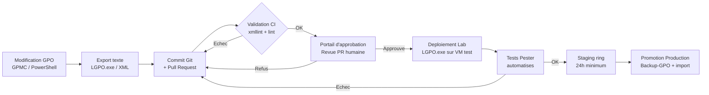

# Automatisation et CI/CD pour les GPO

!!! abstract "Ce que vous allez apprendre"
    - Mettre en place un pipeline CI/CD complet : de la modification d'une GPO en texte diffable jusqu'au déploiement en production avec portail d'approbation humaine
    - Exporter une GPO dans un format ligne par ligne committable dans Git, visible dans une pull request comme n'importe quelle diff de code
    - Automatiser la sauvegarde quotidienne de toutes les GPO dans un dépôt Git avec historique complet des modifications
    - Écrire des tests Pester qui valident les valeurs de registre attendues après application, et les intégrer dans Azure DevOps ou GitHub Actions
    - Gérer le référentiel ADMX dans Git et déployer vers le Central Store SYSVOL avec comparaison de hash et rollback via `git revert`

!!! tip "Si vous ne retenez qu'une chose"
    Une GPO mal testée déployée en production peut atteindre **5 000 machines en 90 minutes**. La seule protection réelle est un **portail d'approbation humaine** entre le lab et la production — une revue de PR, un test de staging de 24h minimum. L'automatisation sans frein humain n'est pas de la maturité DevOps, c'est une bombe à retardement.

---

## Contexte de production

La plupart des équipes gèrent leurs GPO comme un système de fichiers partagé non versionné. Une modification dans GPMC, un commentaire dans le ticket, et on oublie. Six mois plus tard, personne ne sait pourquoi `NTLMv1` est encore activé sur 200 machines.

GitOps appliqué aux GPO résout ce problème structurellement : toute modification est un commit, toute promotion est une pull request, tout rollback est un `git revert`. Ce chapitre décrit comment passer de l'état "GPO artisanales" à un pipeline reproductible et auditable, sans changer d'outil de gestion.


!!! quote "En résumé"
    - La plupart des équipes gèrent leurs GPO comme un système de fichiers partagé non versionné.
    - Une modification dans GPMC, un commentaire dans le ticket, et on oublie.
    - Six mois plus tard, personne ne sait pourquoi NTLMv1 est encore activé sur 200 machines.
    - Le contexte de production fixe les contraintes réelles de réseau, de portée et d’exploitation qui gouvernent tout le chapitre.
    - Retenez les hypothèses opérationnelles avant de choisir un modèle de liaison ou de déploiement.
---

## :material-source-branch: Le pipeline CI/CD GPO

### Principe fondamental

Le principe est simple : les GPO sont du code. Elles ont des paramètres, des dépendances, des impacts mesurables. Elles méritent le même traitement que le reste du code de production — versioning, revue, test, promotion contrôlée.

Le pipeline suit cinq étapes dans l'ordre. Aucune étape ne peut être sautée en production.

### :material-chart-timeline-variant: Diagramme du pipeline



Chaque flèche vers la gauche représente un retour en arrière — c'est voulu. Un pipeline GPO sain rejette plus qu'il ne laisse passer.

### :material-git: Git comme source de vérité

Le dépôt Git contient tout ce qui définit l'état GPO du domaine. Pas de vérité dans GPMC, pas de vérité dans le share réseau — uniquement dans Git.

La structure du dépôt recommandée :

```
gpo-repository/
├── admx/                          # Central Store source of truth
│   ├── PolicyDefinitions/
│   │   ├── WindowsDefender.admx
│   │   └── ...
│   └── deploy-admx.ps1
├── gpo-backups/                   # Backup-GPO output, auto-committed daily
│   ├── 2026-04-05/
│   └── 2026-04-06/
├── gpo-text/                      # LGPO.exe text exports, diff-friendly
│   ├── SEC-Postes-Baseline/
│   │   ├── machine.txt
│   │   └── user.txt
│   └── ...
├── tests/                         # Pester test suites
│   ├── SEC-Postes-Baseline.Tests.ps1
│   └── ...
└── pipelines/                     # CI/CD pipeline definitions
    ├── azure-pipelines.yml
    └── github-actions.yml
```

### :material-check-all: Validation XML en CI

Avant toute promotion, les fichiers XML des GPO doivent passer une validation syntaxique. `xmllint` détecte les fichiers corrompus ou mal formés avant qu'ils n'atteignent SYSVOL.

```bash title="validate-gpo-xml.sh"
#!/bin/bash
# Validate all GPO XML files in the repository
# Requires: xmllint (libxml2-utils on Ubuntu runners)

ERRORS=0

find ./gpo-backups -name "*.xml" | while read -r xmlfile; do
    if ! xmllint --noout "$xmlfile" 2>/dev/null; then
        echo "INVALID XML: $xmlfile"
        ERRORS=$((ERRORS + 1))
    fi
done

if [ "$ERRORS" -gt 0 ]; then
    echo "XML validation failed: $ERRORS file(s) invalid"
    exit 1
fi

echo "All XML files are valid"
```

Sur les runners Windows (Azure DevOps ou GitHub Actions), utilisez l'équivalent PowerShell :

```powershell title="Validate-GpoXml.ps1"
# Validate all GPO XML exports — runs on Windows runners
$errors = 0

Get-ChildItem -Path ".\gpo-backups" -Recurse -Filter "*.xml" | ForEach-Object {
    try {
        [xml](Get-Content $_.FullName -Raw) | Out-Null
    } catch {
        Write-Error "INVALID XML: $($_.FullName) — $_"
        $errors++
    }
}

if ($errors -gt 0) {
    Write-Error "XML validation failed: $errors file(s) invalid"
    exit 1
}

Write-Host "All XML files passed validation"
```

!!! quote "En résumé"
    - Git est la source de vérité unique pour les GPO, les ADMX et les scripts
    - Toute modification passe par commit + pull request — pas d'exception
    - La validation XML en CI bloque les fichiers corrompus avant SYSVOL
    - Cinq étapes obligatoires : export → CI → approbation → lab → staging → production

---

## :material-file-document-outline: Export texte des GPO avec LGPO.exe

### Pourquoi le format texte

`Backup-GPO` produit un dossier de fichiers XML structurés — complet, mais peu diffable. Comparer deux backups XML dans une PR revient à comparer deux blobs.

LGPO.exe propose un format texte ligne par ligne, pensé exactement pour ce cas d'usage. Chaque ligne de registre est visible, chaque modification ressemble à une diff de code.

### :material-export: Export avec LGPO.exe

LGPO.exe est disponible dans le [Security Compliance Toolkit](https://www.microsoft.com/en-us/download/details.aspx?id=55319) de Microsoft. Placez-le dans `C:\Tools\LGPO\LGPO.exe` sur toutes les machines de gestion.

```powershell title="Export-GpoToText.ps1"
# Export a GPO's registry.pol files to LGPO text format
# Prerequisites: LGPO.exe in $LgpoPath

param(
    [Parameter(Mandatory)]
    [string]$GpoName,

    [string]$OutputPath = ".\gpo-text",
    [string]$LgpoPath   = "C:\Tools\LGPO\LGPO.exe"
)

$gpo = Get-GPO -Name $GpoName -ErrorAction Stop
$gpoGuid = $gpo.Id.ToString("B")

# Locate the GPO's registry.pol files in SYSVOL
$sysvolBase = "\\$env:USERDNSDOMAIN\SYSVOL\$env:USERDNSDOMAIN\Policies\$gpoGuid"
$machinePol = Join-Path $sysvolBase "Machine\Registry.pol"
$userPol    = Join-Path $sysvolBase "User\Registry.pol"

$destFolder = Join-Path $OutputPath $GpoName
New-Item -ItemType Directory -Path $destFolder -Force | Out-Null

# Machine policy
if (Test-Path $machinePol) {
    & $LgpoPath /parse /m $machinePol | Set-Content "$destFolder\machine.txt" -Encoding UTF8
    Write-Host "Exported machine policy: $destFolder\machine.txt"
}

# User policy
if (Test-Path $userPol) {
    & $LgpoPath /parse /u $userPol | Set-Content "$destFolder\user.txt" -Encoding UTF8
    Write-Host "Exported user policy: $destFolder\user.txt"
}
```

```title="Résultat attendu — machine.txt"
; Source file:  \\domain.local\SYSVOL\...\Registry.pol
; PARSING COMPLETED.

Computer

HKLM\SOFTWARE\Policies\Microsoft\Windows Defender
DisableAntiSpyware
DWORD:0

HKLM\SOFTWARE\Policies\Microsoft\Windows\WindowsUpdate\AU
NoAutoUpdate
DWORD:0
```

Ce format est lisible par un humain, diffable par Git, et réimportable par LGPO.exe. C'est la base de la revue de PR pour les changements GPO.

### :material-xml: Alternative : export XML via Get-GPOReport

L'autre approche est d'exporter le rapport XML complet de chaque GPO et de le committer dans Git. Plus verbeux, mais plus complet — il capture aussi les paramètres de sécurité que LGPO.exe ne couvre pas.

```powershell title="Export-GpoReports.ps1"
# Export all GPO XML reports for Git versioning
param(
    [string]$OutputPath = ".\gpo-xml-reports"
)

New-Item -ItemType Directory -Path $OutputPath -Force | Out-Null

Get-GPO -All | ForEach-Object {
    $safeName = $_.DisplayName -replace '[\\/:*?"<>|]', '_'
    $outFile   = Join-Path $OutputPath "$safeName.xml"

    Get-GPOReport -Guid $_.Id -ReportType Xml |
        Set-Content -Path $outFile -Encoding UTF8

    Write-Host "Exported: $safeName.xml"
}

Write-Host "Done. $((Get-GPO -All).Count) GPO reports exported to $OutputPath"
```

### Comparaison des deux approches

| Critère | LGPO.exe text | Get-GPOReport XML |
|---|---|---|
| Lisibilité dans une PR | Excellente — une ligne par valeur | Moyenne — XML verbeux |
| Couverture des paramètres | Registre uniquement | Complet (sécu, scripts, etc.) |
| Réimportable directement | Oui (`LGPO.exe /s`) | Non sans post-traitement |
| Taille des fichiers | Petite | Grande |
| Recommandé pour | Revue de PR quotidienne | Audit et archivage complet |

!!! tip "Combinez les deux"
    Utilisez LGPO.exe text pour les revues de PR (diff rapide, lisible) et Get-GPOReport XML pour les archives de conformité. Les deux sont dans le même dépôt Git — dossiers séparés.

!!! quote "En résumé"
    - LGPO.exe `/parse /m registry.pol` produit un format texte ligne par ligne, idéal pour Git diff
    - `Get-GPOReport -ReportType XML` capture l'intégralité des paramètres, y compris sécurité et scripts
    - Les deux approches sont complémentaires — texte pour la revue, XML pour l'archive

---

## :material-content-save-all: Sauvegarde GPO automatisée dans Git

### Architecture de la solution

Le principe : un script tourne chaque nuit via le Task Scheduler, exécute `Backup-GPO -All`, et committe automatiquement le résultat dans Git. Chaque matin, vous avez un historique complet des modifications de la nuit.

Si une GPO a changé à 14h37 hier, le commit du soir le capture. Si personne n'a touché aux GPO en trois semaines, le dépôt reste propre — Git ne crée pas de commits vides.

### :material-powershell: Script de sauvegarde avec intégration Git

```powershell title="Backup-GpoToGit.ps1"
# Nightly GPO backup with Git auto-commit
# Schedule: Task Scheduler, daily at 23:00
# Run as: Domain Admin service account with Git credentials configured
# Prerequisites: Git in PATH, repo cloned at $RepoPath

param(
    [string]$RepoPath    = "C:\GPO-Git-Repo",
    [string]$BackupSubdir = "gpo-backups",
    [string]$TextSubdir   = "gpo-text",
    [string]$LgpoPath    = "C:\Tools\LGPO\LGPO.exe",
    [string]$LogPath     = "C:\Logs\gpo-git-backup.log"
)

function Write-Log {
    param([string]$Message, [string]$Level = "INFO")
    $entry = "$(Get-Date -Format 'yyyy-MM-dd HH:mm:ss') [$Level] $Message"
    Add-Content -Path $LogPath -Value $entry
    Write-Host $entry
}

$date       = Get-Date -Format "yyyy-MM-dd"
$backupPath = Join-Path $RepoPath $BackupSubdir $date
$textPath   = Join-Path $RepoPath $TextSubdir

Write-Log "Starting nightly GPO backup — date: $date"

# --- Pull latest changes to avoid conflicts ---
Push-Location $RepoPath
try {
    git pull origin main --quiet
    if ($LASTEXITCODE -ne 0) { Write-Log "git pull failed — continuing anyway" -Level "WARN" }
} finally {
    Pop-Location
}

# --- Backup all GPOs ---
New-Item -ItemType Directory -Path $backupPath -Force | Out-Null

try {
    $results = Backup-GPO -All -Path $backupPath -ErrorAction Stop
    Write-Log "Backed up $($results.Count) GPOs"

    $results | Select-Object DisplayName, Id, BackupDirectory |
        Export-Csv "$backupPath\manifest.csv" -NoTypeInformation
} catch {
    Write-Log "Backup-GPO failed: $_" -Level "ERROR"
    exit 1
}

# --- Export LGPO text format for diff-friendly history ---
New-Item -ItemType Directory -Path $textPath -Force | Out-Null

if (Test-Path $LgpoPath) {
    Get-GPO -All | ForEach-Object {
        $gpoGuid    = $_.Id.ToString("B")
        $safeName   = $_.DisplayName -replace '[\\/:*?"<>|]', '_'
        $destFolder = Join-Path $textPath $safeName
        New-Item -ItemType Directory -Path $destFolder -Force | Out-Null

        $sysvolBase = "\\$env:USERDNSDOMAIN\SYSVOL\$env:USERDNSDOMAIN\Policies\$gpoGuid"

        $machinePol = Join-Path $sysvolBase "Machine\Registry.pol"
        $userPol    = Join-Path $sysvolBase "User\Registry.pol"

        if (Test-Path $machinePol) {
            & $LgpoPath /parse /m $machinePol |
                Set-Content "$destFolder\machine.txt" -Encoding UTF8
        }
        if (Test-Path $userPol) {
            & $LgpoPath /parse /u $userPol |
                Set-Content "$destFolder\user.txt" -Encoding UTF8
        }
    }
    Write-Log "LGPO text exports complete"
} else {
    Write-Log "LGPO.exe not found at $LgpoPath — skipping text export" -Level "WARN"
}

# --- Git commit if there are changes ---
Push-Location $RepoPath
try {
    git add "$BackupSubdir/$date" "$TextSubdir" 2>&1 | Out-Null

    $status = git status --porcelain
    if ($status) {
        $commitMsg = "chore: nightly GPO backup $date — $($results.Count) GPOs"
        git commit -m $commitMsg --author="GPO-Bot <gpo-bot@domain.local>"

        if ($LASTEXITCODE -eq 0) {
            Write-Log "Git commit created: $commitMsg"
        } else {
            Write-Log "git commit failed" -Level "ERROR"
        }
    } else {
        Write-Log "No changes detected — no commit needed"
    }
} finally {
    Pop-Location
}

Write-Log "Nightly backup complete"
```

```title="Résultat attendu (log)"
2026-04-06 23:00:01 [INFO] Starting nightly GPO backup — date: 2026-04-06
2026-04-06 23:00:03 [INFO] Backed up 47 GPOs
2026-04-06 23:00:18 [INFO] LGPO text exports complete
2026-04-06 23:00:19 [INFO] Git commit created: chore: nightly GPO backup 2026-04-06 — 47 GPOs
2026-04-06 23:00:19 [INFO] Nightly backup complete
```

### :material-folder-tree: Structure du dépôt après quelques semaines

```
gpo-repository/
├── gpo-backups/
│   ├── 2026-04-01/
│   │   ├── {GUID-BACKUP-1}/
│   │   │   ├── Backup.xml
│   │   │   ├── bkupInfo.xml
│   │   │   └── gpreport/
│   │   │       └── gpreport.xml
│   │   ├── {GUID-BACKUP-2}/
│   │   └── manifest.csv
│   ├── 2026-04-02/          ← only if GPOs changed
│   └── 2026-04-06/
└── gpo-text/
    ├── SEC-Postes-Baseline/
    │   ├── machine.txt      ← diff-friendly, updated on change
    │   └── user.txt
    └── WSUS-Configuration/
        └── machine.txt
```

!!! warning "À surveiller — Taille du dépôt"
    `Backup-GPO` sauvegarde les fichiers scripts inclus dans les GPO. Sur un parc avec beaucoup de scripts GPO volumineux, le dépôt peut grossir vite. Ajoutez un `.gitignore` pour exclure les binaires de scripts si nécessaire, et surveillez `git count-objects -vH` mensuellement.

!!! quote "En résumé"
    - Le script tourne la nuit, committe uniquement si des changements existent
    - Le format LGPO texte rend les diffs Git lisibles dans une interface web
    - L'historique Git remplace le "qui a modifié quoi" du ticket ITSM
    - Le `manifest.csv` reste l'index de navigation pour les restaurations

---

## :material-test-tube: Tests automatisés avec Pester

### Pourquoi tester les GPO

Déployer une GPO sans test, c'est faire confiance à GPMC. GPMC vous dit que le paramètre est configuré — pas qu'il est appliqué correctement sur la machine cible, pas qu'il n'entre pas en conflit avec une autre GPO, pas qu'il produit l'effet attendu dans le registre.

Pester permet d'écrire des tests qui vérifient l'état réel du registre après application. Ces tests tournent sur la VM de lab après import LGPO.exe, et bloquent la promotion si un test échoue.

### :material-powershell: Exemple complet : 5 tests pour une baseline sécurité

```powershell title="SEC-Postes-Baseline.Tests.ps1"
# Pester test suite for SEC-Postes-Baseline GPO
# Run AFTER applying the GPO on the test VM via LGPO.exe
# Requires: Pester 5.x, run as Administrator on target machine

BeforeAll {
    # Allow up to 90 seconds for GP to apply before running tests
    $maxWait   = 90
    $elapsed   = 0
    $gpresult  = $null

    while ($elapsed -lt $maxWait) {
        $gpresult = gpresult /r 2>&1
        if ($gpresult -match "SEC-Postes-Baseline") { break }
        Start-Sleep -Seconds 10
        $elapsed += 10
    }
}

Describe "SEC-Postes-Baseline — Registry validation" {

    Context "Windows Defender settings" {

        It "Defender real-time protection is enabled (DisableAntiSpyware = 0)" {
            $value = Get-ItemProperty -Path "HKLM:\SOFTWARE\Policies\Microsoft\Windows Defender" `
                                      -Name "DisableAntiSpyware" -ErrorAction SilentlyContinue
            $value.DisableAntiSpyware | Should -Be 0
        }

        It "Cloud protection level is set to Advanced (MpCloudBlockLevel = 2)" {
            $value = Get-ItemProperty -Path "HKLM:\SOFTWARE\Policies\Microsoft\Windows Defender\MpEngine" `
                                      -Name "MpCloudBlockLevel" -ErrorAction SilentlyContinue
            $value.MpCloudBlockLevel | Should -Be 2
        }
    }

    Context "Windows Update settings" {

        It "Auto-update is not disabled (NoAutoUpdate = 0)" {
            $value = Get-ItemProperty -Path "HKLM:\SOFTWARE\Policies\Microsoft\Windows\WindowsUpdate\AU" `
                                      -Name "NoAutoUpdate" -ErrorAction SilentlyContinue
            $value.NoAutoUpdate | Should -Be 0
        }

        It "Active hours maximum range is set (ActiveHoursMaxRange = 12)" {
            $value = Get-ItemProperty -Path "HKLM:\SOFTWARE\Policies\Microsoft\Windows\WindowsUpdate" `
                                      -Name "ActiveHoursMaxRange" -ErrorAction SilentlyContinue
            $value.ActiveHoursMaxRange | Should -Be 12
        }
    }

    Context "Network security" {

        It "LAN Manager authentication level is set to NTLMv2 only (LmCompatibilityLevel = 5)" {
            $value = Get-ItemProperty `
                -Path "HKLM:\SYSTEM\CurrentControlSet\Control\Lsa" `
                -Name "LmCompatibilityLevel" -ErrorAction SilentlyContinue
            $value.LmCompatibilityLevel | Should -Be 5
        }
    }
}
```

```title="Résultat attendu — Pester output"
Starting discovery in 1 files.
Discovery found 5 tests in 94ms.
Running tests.

Describing SEC-Postes-Baseline — Registry validation
  Context Windows Defender settings
    [+] Defender real-time protection is enabled (DisableAntiSpyware = 0) 47ms (37ms|10ms)
    [+] Cloud protection level is set to Advanced (MpCloudBlockLevel = 2) 12ms (9ms|3ms)
  Context Windows Update settings
    [+] Auto-update is not disabled (NoAutoUpdate = 0) 15ms (11ms|4ms)
    [+] Active hours maximum range is set (ActiveHoursMaxRange = 12) 11ms (8ms|3ms)
  Context Network security
    [+] LAN Manager authentication level is set to NTLMv2 only (LmCompatibilityLevel = 5) 9ms (6ms|3ms)

Tests completed in 386ms
Tests Passed: 5, Failed: 0, Skipped: 0
```

### :material-microsoft-azure-devops: Intégration Azure DevOps

Le pipeline Azure DevOps doit tourner sur un **agent Windows** — Pester ne fonctionne pas sur les runners Ubuntu pour des tests de registre Windows.

```yaml title="azure-pipelines.yml"
trigger:
  branches:
    include:
      - main
      - feature/*

pool:
  vmImage: 'windows-latest'

stages:
  - stage: Validate
    displayName: 'GPO Validation'
    jobs:
      - job: XmlValidation
        displayName: 'Validate XML syntax'
        steps:
          - task: PowerShell@2
            displayName: 'Validate GPO XML files'
            inputs:
              filePath: 'pipelines/scripts/Validate-GpoXml.ps1'

  - stage: LabTest
    displayName: 'Lab Deployment and Pester Tests'
    dependsOn: Validate
    jobs:
      - job: PesterTests
        displayName: 'Apply GPO on lab VM and run Pester'
        steps:
          - task: PowerShell@2
            displayName: 'Install Pester 5.x'
            inputs:
              targetType: 'inline'
              script: |
                Install-Module -Name Pester -RequiredVersion 5.6.0 -Force -Scope CurrentUser

          - task: PowerShell@2
            displayName: 'Apply GPO via LGPO.exe on lab VM'
            inputs:
              filePath: 'pipelines/scripts/Apply-GpoLab.ps1'
              arguments: '-GpoName "SEC-Postes-Baseline"'

          - task: PowerShell@2
            displayName: 'Run Pester test suite'
            inputs:
              targetType: 'inline'
              script: |
                $config = New-PesterConfiguration
                $config.Run.Path     = "tests\"
                $config.Output.Verbosity = "Detailed"
                $config.TestResult.Enabled  = $true
                $config.TestResult.OutputPath = "$(Build.ArtifactStagingDirectory)\pester-results.xml"
                $config.TestResult.OutputFormat = "NUnitXml"

                $result = Invoke-Pester -Configuration $config
                if ($result.FailedCount -gt 0) { exit 1 }

          - task: PublishTestResults@2
            displayName: 'Publish Pester results'
            inputs:
              testResultsFormat: 'NUnit'
              testResultsFiles: '$(Build.ArtifactStagingDirectory)\pester-results.xml'

  - stage: ManualApproval
    displayName: 'Production Approval Gate'
    dependsOn: LabTest
    jobs:
      - deployment: WaitForApproval
        displayName: 'Human approval required before production'
        environment: 'GPO-Production'   # environment with approval check configured
        strategy:
          runOnce:
            deploy:
              steps:
                - script: echo "Approved — proceeding to production deployment"
```

### :material-github: Intégration GitHub Actions

```yaml title="github-actions.yml"
name: GPO CI/CD Pipeline

on:
  pull_request:
    branches: [main]
  push:
    branches: [main]

jobs:
  validate-xml:
    name: Validate XML syntax
    runs-on: windows-latest
    steps:
      - uses: actions/checkout@v4

      - name: Validate GPO XML files
        shell: pwsh
        run: .\pipelines\scripts\Validate-GpoXml.ps1

  pester-tests:
    name: Pester tests on lab VM
    runs-on: windows-latest
    needs: validate-xml
    steps:
      - uses: actions/checkout@v4

      - name: Install Pester
        shell: pwsh
        run: Install-Module -Name Pester -RequiredVersion 5.6.0 -Force -Scope CurrentUser

      - name: Run Pester tests
        shell: pwsh
        run: |
          $config = New-PesterConfiguration
          $config.Run.Path     = "tests\"
          $config.Output.Verbosity = "Detailed"
          $config.TestResult.Enabled = $true
          $config.TestResult.OutputPath = "pester-results.xml"
          $config.TestResult.OutputFormat = "NUnitXml"

          $result = Invoke-Pester -Configuration $config
          if ($result.FailedCount -gt 0) { exit 1 }

      - name: Publish test results
        uses: dorny/test-reporter@v1
        if: always()
        with:
          name: Pester Results
          path: pester-results.xml
          reporter: java-junit

  production-gate:
    name: Production deployment (requires approval)
    runs-on: windows-latest
    needs: pester-tests
    environment: gpo-production   # GitHub environment with required reviewers
    if: github.ref == 'refs/heads/main'
    steps:
      - uses: actions/checkout@v4

      - name: Deploy GPO to production
        shell: pwsh
        run: .\pipelines\scripts\Deploy-GpoProduction.ps1
```

!!! warning "À surveiller — Runners et accès SYSVOL"
    Les runners hébergés (GitHub-hosted, Azure DevOps Microsoft-hosted) n'ont pas accès à votre SYSVOL ou à votre domaine AD. Les étapes qui accèdent à AD (Backup-GPO, Get-GPO, déploiement SYSVOL) doivent tourner sur des **agents auto-hébergés** dans votre réseau d'entreprise. Séparez les étapes : validation XML sur runner hébergé (pas d'accès AD requis), tests et déploiement sur runner auto-hébergé.

!!! quote "En résumé"
    - Pester vérifie les valeurs de registre réelles — pas ce que GPMC affiche, ce qui est effectivement appliqué
    - Azure DevOps et GitHub Actions nécessitent des runners Windows pour les tests de registre
    - Le résultat Pester publié en NUnit est visible directement dans l'interface CI/CD
    - L'`environment` avec approbation requise est la clé du portail humain avant production

---

## :material-file-cabinet: Gestion des ADMX dans le pipeline

### Le Central Store comme artefact déployable

Le Central Store SYSVOL (`\\domain\SYSVOL\domain\Policies\PolicyDefinitions`) est souvent géré manuellement — un copier-coller depuis un poste à jour, sans traçabilité. Git + pipeline changent ça.

Le dépôt Git contient la copie de référence des fichiers ADMX. Le pipeline compare les hash, déploie uniquement ce qui a changé, et un `git revert` suffit pour annuler un déploiement problématique.

### :material-powershell: Script de déploiement ADMX avec comparaison de hash

```powershell title="Deploy-Admx.ps1"
# Deploy ADMX files from Git repo to SYSVOL Central Store
# Compares SHA256 hashes — only copies changed files
# Requires: Domain Admin, write access to SYSVOL

param(
    [string]$SourcePath = ".\admx\PolicyDefinitions",
    [string]$SysvolPath = "\\$env:USERDNSDOMAIN\SYSVOL\$env:USERDNSDOMAIN\Policies\PolicyDefinitions",
    [switch]$DryRun,
    [string]$LogPath    = "C:\Logs\admx-deploy.log"
)

function Write-Log {
    param([string]$Message, [string]$Level = "INFO")
    $entry = "$(Get-Date -Format 'yyyy-MM-dd HH:mm:ss') [$Level] $Message"
    Add-Content -Path $LogPath -Value $entry
    Write-Host $entry
}

function Get-FileHash256 {
    param([string]$Path)
    if (-not (Test-Path $Path)) { return $null }
    return (Get-FileHash -Path $Path -Algorithm SHA256).Hash
}

Write-Log "Starting ADMX deployment$(if ($DryRun) { ' [DRY RUN]' })"
Write-Log "Source: $SourcePath"
Write-Log "Target: $SysvolPath"

if (-not (Test-Path $SysvolPath)) {
    Write-Log "Central Store path not found: $SysvolPath" -Level "ERROR"
    exit 1
}

$deployed = 0
$skipped  = 0
$errors   = 0

Get-ChildItem -Path $SourcePath -Recurse -File | ForEach-Object {
    $relativePath = $_.FullName.Substring($SourcePath.Length).TrimStart('\')
    $targetPath   = Join-Path $SysvolPath $relativePath

    $sourceHash = Get-FileHash256 $_.FullName
    $targetHash = Get-FileHash256 $targetPath

    if ($sourceHash -eq $targetHash) {
        $skipped++
        return
    }

    $action = if ($targetHash) { "UPDATE" } else { "ADD" }
    Write-Log "$action $relativePath"

    if (-not $DryRun) {
        try {
            $targetDir = Split-Path $targetPath -Parent
            if (-not (Test-Path $targetDir)) {
                New-Item -ItemType Directory -Path $targetDir -Force | Out-Null
            }
            Copy-Item -Path $_.FullName -Destination $targetPath -Force
            $deployed++
        } catch {
            Write-Log "Failed to copy $relativePath : $_" -Level "ERROR"
            $errors++
        }
    } else {
        $deployed++
    }
}

Write-Log "Deployment complete — Deployed: $deployed, Skipped (unchanged): $skipped, Errors: $errors"

if ($errors -gt 0) { exit 1 }
```

```title="Résultat attendu"
2026-04-06 10:15:00 [INFO] Starting ADMX deployment
2026-04-06 10:15:00 [INFO] Source: .\admx\PolicyDefinitions
2026-04-06 10:15:00 [INFO] Target: \\domain.local\SYSVOL\domain.local\Policies\PolicyDefinitions
2026-04-06 10:15:02 [INFO] UPDATE WindowsDefender.admx
2026-04-06 10:15:02 [INFO] UPDATE fr-FR\WindowsDefender.adml
2026-04-06 10:15:03 [INFO] Deployment complete — Deployed: 2, Skipped (unchanged): 148, Errors: 0
```

### :material-shield-alert: Détection des conflits de namespace en CI

Les conflits de namespace ADMX — deux fichiers ADMX déclarant le même namespace — corrompent silencieusement l'éditeur GPO. Le CI doit les détecter avant tout déploiement.

```powershell title="Test-AdmxNamespaceConflicts.ps1"
# Detect ADMX namespace conflicts in the PolicyDefinitions folder
# A conflict occurs when two .admx files declare the same namespace URI

param(
    [string]$AdmxPath = ".\admx\PolicyDefinitions"
)

$namespaceMap = @{}
$conflicts    = @()

Get-ChildItem -Path $AdmxPath -Filter "*.admx" | ForEach-Object {
    try {
        [xml]$content = Get-Content $_.FullName -Raw

        $targetNamespace = $content.policyDefinitions.policyNamespaces.target.namespace

        if (-not $targetNamespace) { return }

        if ($namespaceMap.ContainsKey($targetNamespace)) {
            $conflicts += [PSCustomObject]@{
                Namespace  = $targetNamespace
                File1      = $namespaceMap[$targetNamespace]
                File2      = $_.Name
            }
        } else {
            $namespaceMap[$targetNamespace] = $_.Name
        }
    } catch {
        Write-Warning "Could not parse $($_.Name): $_"
    }
}

if ($conflicts.Count -gt 0) {
    Write-Error "NAMESPACE CONFLICTS DETECTED:"
    $conflicts | Format-Table -AutoSize
    exit 1
}

Write-Host "No namespace conflicts detected — $($namespaceMap.Count) namespaces checked"
```

### :material-undo: Rollback via git revert

Si un déploiement ADMX cause des problèmes (éditeur GPO corrompu, paramètres disparus), le rollback est immédiat :

```bash
# Identify the commit that introduced the problematic ADMX
git log --oneline admx/

# Revert that specific commit
git revert <commit-hash> --no-edit

# Push the revert — triggers the pipeline which re-déploie l'état précédent
git push origin main
```

Le pipeline se déclenche sur le push du revert, exécute à nouveau `Deploy-Admx.ps1` avec les anciens fichiers, et le Central Store est restauré en quelques minutes.

!!! danger "Production — Ne jamais modifier SYSVOL manuellement en parallèle du pipeline"
    Si vous copiez des fichiers ADMX manuellement dans SYSVOL pendant que le pipeline tourne, vous cassez la cohérence entre Git et SYSVOL. La prochaine exécution du pipeline réécrit les fichiers manuels si le hash diffère — et le `git revert` ne cible que ce qui est dans Git. **SYSVOL doit être géré exclusivement par le pipeline** dès que vous activez cette approche.

!!! quote "En résumé"
    - Git est la source de vérité des ADMX — SYSVOL est une destination de déploiement, pas une source
    - La comparaison de hash évite les copies inutiles et les SYSVOL en cours de réplication
    - La détection des conflits de namespace en CI évite les corruptions silencieuses de l'éditeur GPO
    - Le rollback ADMX = `git revert` + push — le pipeline fait le reste

---

## :material-shield-lock: Le portail d'approbation humaine obligatoire

### Le scénario catastrophe

Voici ce qui arrive sans portail d'approbation humaine : un développeur modifie une GPO de sécurité baseline un vendredi après-midi. Les tests Pester passent sur la VM de lab. Le pipeline détecte le succès et promeut en production automatiquement. À 14h37, la GPO est liée à l'OU racine. À 16h07, 5 000 machines ont appliqué le changement.

Le lundi matin, 200 tickets : les applications métier ne démarrent plus. Le paramètre `LmCompatibilityLevel = 5` a cassé une dépendance NTLM d'une application vieille de dix ans, non testée en lab parce que le lab ne réplique pas cet environnement.

Rollback : `Restore-GPO` sur la GPO, mais les machines doivent obtenir une nouvelle GP — 90 minutes supplémentaires pour toutes les machines hors ligne.

### :material-clock-alert: Le temps de propagation est votre ennemi

| Scénario | Machines impactées | Délai |
|---|---|---|
| Déploiement direct en prod (GPO liée OU racine) | 5 000 | 90 min |
| Staging ring 10 % (500 machines) | 500 | 90 min |
| Staging ring 10 % + détection proactive | 500 | Détecté avant 90 min |
| Lab seul, staging 24h, prod approuvée | 0 en prod | Problème détecté en lab |

La seule protection structurelle est le temps : 24 heures de staging sur un anneau représentatif avant production.

### :material-check-decagram: Structure du portail d'approbation

```
Modification GPO (branch feature/xxx)
        │
        ▼
    Pull Request
        │
        ├── CI : validation XML ............. automatique
        ├── CI : Pester lab ................. automatique
        │
        └── Code review (≥1 reviewer) ....... HUMAIN OBLIGATOIRE
                │
                ▼
            Merge → main
                │
                ▼
        Déploiement Staging (10 % des machines)
                │
                └── Monitoring 24h (Event IDs, tickets support)
                        │
                        ▼
                Approbation production ........ HUMAIN OBLIGATOIRE
                        │
                        ▼
                Déploiement production
                (OU racine — toutes machines)
```

### :material-powershell: Script de déploiement en anneau (staging ring)

```powershell title="Deploy-GpoStagingRing.ps1"
# Deploy a GPO link to the staging ring OU only
# Staging ring = a representative sample OU (10% of fleet, mixed models)
# After 24h monitoring, a human approves promotion to production

param(
    [Parameter(Mandatory)]
    [string]$GpoName,

    [string]$StagingOu    = "OU=Staging-Ring,OU=Computers,DC=domain,DC=local",
    [string]$ProductionOu = "OU=Computers,DC=domain,DC=local",

    [ValidateSet("Staging", "Production")]
    [string]$Target = "Staging"
)

switch ($Target) {
    "Staging" {
        Write-Host "Linking '$GpoName' to staging ring: $StagingOu"
        New-GPLink -Name $GpoName -Target $StagingOu -LinkEnabled Yes -ErrorAction Stop
        Write-Host "Staging link created. Monitor for 24h before promoting to production."
    }

    "Production" {
        Write-Host "Promoting '$GpoName' to production: $ProductionOu"

        # Verify staging link still exists and GPO is unchanged
        $stagingLink = Get-GPInheritance -Target $StagingOu |
            Select-Object -ExpandProperty GpoLinks |
            Where-Object { $_.DisplayName -eq $GpoName }

        if (-not $stagingLink) {
            Write-Error "Staging link not found — cannot promote without completed staging"
            exit 1
        }

        New-GPLink -Name $GpoName -Target $ProductionOu -LinkEnabled Yes -ErrorAction Stop
        Write-Host "Production link created."
    }
}
```

### :material-alert-circle: Les règles non négociables

Quatre règles que votre pipeline doit implémenter structurellement — pas comme commentaire dans un README, mais comme bloquants techniques :

1. **Aucun merge sans revue approuvée** — branch protection rule sur `main`, minimum 1 reviewer.
2. **Aucun déploiement staging sans CI vert** — le job staging dépend du job Pester.
3. **Aucun déploiement production sans approbation manuelle** — `environment` Azure DevOps ou GitHub avec required reviewers.
4. **Délai staging minimum de 24h** — implémentez une vérification du timestamp du déploiement staging.

```powershell title="Assert-StagingMaturity.ps1"
# Verify the staging ring has been running for at least 24 hours
# Call this script as a gate before production deployment

param(
    [string]$GpoName,
    [string]$StagingOu      = "OU=Staging-Ring,OU=Computers,DC=domain,DC=local",
    [int]$MinimumHours      = 24
)

$stagingLinks = Get-GPInheritance -Target $StagingOu |
    Select-Object -ExpandProperty GpoLinks |
    Where-Object { $_.DisplayName -eq $GpoName }

if (-not $stagingLinks) {
    Write-Error "GPO '$GpoName' is not linked to staging ring. Staging required before production."
    exit 1
}

# Check GPO version timestamp as proxy for staging start
$gpo = Get-GPO -Name $GpoName
$modificationTime = $gpo.ModificationTime
$stagingAge = (Get-Date) - $modificationTime

if ($stagingAge.TotalHours -lt $MinimumHours) {
    $remaining = [math]::Ceiling($MinimumHours - $stagingAge.TotalHours)
    Write-Error "Staging ring has been active for only $([math]::Floor($stagingAge.TotalHours))h. Minimum: ${MinimumHours}h. Wait ${remaining}h more."
    exit 1
}

Write-Host "Staging maturity check passed: $([math]::Floor($stagingAge.TotalHours))h >= ${MinimumHours}h required"
```

!!! danger "Production — L'automatisation totale est un anti-pattern GPO"
    Un pipeline CI/CD GPO mature n'élimine pas les humains — il les positionne aux bons points de contrôle. La différence entre un pipeline qui aide et un pipeline qui détruit est la présence de deux portails humains : la revue de PR et l'approbation de production. Retirez l'un des deux, et vous avez automatisé votre capacité à causer des incidents de masse.

!!! quote "En résumé"
    - Une GPO liée à l'OU racine peut atteindre 5 000 machines en 90 minutes — le portail humain est la seule protection
    - Deux portails humains obligatoires : revue de PR + approbation de production
    - 24h de staging sur un anneau représentatif avant promotion
    - Les règles de protection de branche et les `environment` avec required reviewers sont les implémentations techniques de ces portails

---

## :material-magnify: Vérification post-déploiement

### :material-powershell: Validation du pipeline complet

Après un déploiement en production, vérifiez l'état de cohérence entre Git et les GPO vivantes du domaine.

```powershell title="Verify-GpoPipelineHealth.ps1"
# Post-deployment verification: compare Git state with live domain GPOs
# Run after each production deployment

param(
    [string]$RepoTextPath = "C:\GPO-Git-Repo\gpo-text",
    [string]$LgpoPath     = "C:\Tools\LGPO\LGPO.exe"
)

$driftDetected = $false

Get-GPO -All | ForEach-Object {
    $gpo        = $_
    $safeName   = $gpo.DisplayName -replace '[\\/:*?"<>|]', '_'
    $repoFolder = Join-Path $RepoTextPath $safeName
    $gpoGuid    = $gpo.Id.ToString("B")

    if (-not (Test-Path $repoFolder)) {
        Write-Warning "GPO '$($gpo.DisplayName)' exists in domain but NOT in Git repo"
        $driftDetected = $true
        return
    }

    # Export current live state to temp
    $tempFolder = Join-Path $env:TEMP "gpo-verify-$safeName"
    New-Item -ItemType Directory -Path $tempFolder -Force | Out-Null

    $sysvolBase = "\\$env:USERDNSDOMAIN\SYSVOL\$env:USERDNSDOMAIN\Policies\$gpoGuid"
    $machinePol = Join-Path $sysvolBase "Machine\Registry.pol"

    if (Test-Path $machinePol) {
        & $LgpoPath /parse /m $machinePol |
            Set-Content "$tempFolder\machine.txt" -Encoding UTF8

        $repoContent  = Get-Content "$repoFolder\machine.txt" -Raw -ErrorAction SilentlyContinue
        $liveContent  = Get-Content "$tempFolder\machine.txt" -Raw

        if ($repoContent -ne $liveContent) {
            Write-Warning "DRIFT: '$($gpo.DisplayName)' machine policy differs from Git"
            $driftDetected = $true
        }
    }

    Remove-Item $tempFolder -Recurse -Force
}

if ($driftDetected) {
    Write-Error "Drift detected — review differences and commit or revert"
    exit 1
}

Write-Host "All GPOs match Git state — no drift detected"
```

```title="Résultat attendu (déploiement propre)"
All GPOs match Git state — no drift detected
```

### :material-clipboard-check: Checklist de validation post-déploiement

Après chaque promotion en production :

| Vérification | Commande / Action |
|---|---|
| GPO liée à la bonne OU | `Get-GPInheritance -Target "OU=..."` |
| Tests Pester verts sur machine de prod (échantillon) | `Invoke-Pester .\tests\` sur 3 machines cibles |
| Aucun drift Git vs SYSVOL | `Verify-GpoPipelineHealth.ps1` |
| Event ID 1704 présent sur les machines | `Get-WinEvent -LogName System -Id 1704` |
| Aucun ticket support ouvert dans les 2h | Vérification ITSM manuelle |
| Log de backup du soir à jour | Vérifier `C:\Logs\gpo-git-backup.log` |


!!! quote "En résumé"
    - Après un déploiement en production, vérifiez l'état de cohérence entre Git et les GPO vivantes du domaine.
    - Après chaque promotion en production.
    - Validez toujours le résultat sur un poste ou un utilisateur réellement dans le périmètre avant d’élargir.
    - Conservez les commandes et résultats de contrôle comme preuve de conformité post-déploiement.
---

## Références croisées

- [PowerShell GroupPolicy module](03-powershell-gpo.md) — cmdlets utilisés dans ce chapitre (`Backup-GPO`, `Get-GPO`, `New-GPLink`, etc.)
- [Sauvegarde, restauration et migration](05-backup-migration.md) — fondations de la sauvegarde GPO et gestion des commentaires `Backup.xml`
- [LGPO.exe — Bible GPO](../bible-gpo/21-lgpo.md) — référence complète de LGPO.exe : options de parse, import, apply et génération de `registry.pol`

!!! quote "En résumé"
    - À relire : PowerShell GroupPolicy module.
    - À relire : Sauvegarde, restauration et migration.
    - À relire : LGPO.exe — Bible GPO.
    - Ces renvois prolongent le chapitre avec des mécanismes complémentaires ou des cas d’usage voisins.
    - Gardez ces chapitres sous la main pour le diagnostic ou la conception d’une GPO liée à ce thème.
