# OSD / MDT / WDS

!!! abstract "Ce que vous allez apprendre"
    - Comprendre pourquoi un déploiement Windows réussi ne s'arrête jamais à l'image WIM, mais dépend de la jonction au domaine et des **GPO post-déploiement**
    - Distinguer précisément le rôle de **WDS**, de **MDT 8456**, de **Sysprep/Audit Mode**, et le moment où chaque composant prend la main
    - Déployer un socle OSD robuste avec **images WinPE x64**, **task sequences MDT**, **variables OSD** et **Offline Domain Join** selon le contexte réseau
    - Faire coexister **Autopilot**, **Intune** et les **GPO** sans attendre des GPO qu'elles configurent quelque chose avant que la machine ne soit réellement jointe
    - Utiliser une **checklist opérationnelle** pour réduire les incidents les plus classiques : mauvais pilote NIC, image mal capturée, GPO attendue trop tôt, blob ODJ expiré

!!! tip "Si vous ne retenez qu'une chose"
    **WinPE déploie. Les task sequences orchestrent. Les GPO normalisent après la jonction.**
    Si vous attendez d'une GPO qu'elle configure quelque chose pendant WinPE ou avant que la machine n'ait réellement redémarré dans son OS déployé, vous allez diagnostiquer un faux problème pendant des heures.
    En OSD, la question critique n'est pas "la GPO existe-t-elle ?".
    La vraie question est : **à quel moment exact la machine devient-elle un client de stratégie de groupe ?**

---

## :material-sitemap: Pourquoi le déploiement OS est une affaire de GPO

### La chaîne réelle d'un poste neuf

Un déploiement OS n'est pas un bloc unique.

C'est une chaîne de décisions successives.

Chaque brique répond à une question différente.

WDS répond à la question "quel environnement de démarrage fournir ?".

MDT répond à la question "quelles étapes exécuter dans quel ordre ?".

Sysprep répond à la question "dans quel état l'image doit-elle être généralisée ?".

Active Directory et `gpsvc` répondent à la question "quelle configuration standard appliquer à cette machine devenue membre du domaine ?".

Le piège classique consiste à croire que l'image "porte déjà tout".

En pratique, l'image ne doit porter que le strict socle.

Le durcissement durable, les paramètres d'entreprise et une partie des dépendances applicatives arrivent ensuite via GPO.

| Étape | Composant maître | Ce qui se décide | Ce que vous devez vérifier |
|---|---|---|---|
| Démarrage réseau | PXE / DHCP / UEFI | Le client obtient un boot program | VLAN, IP helper, architecture UEFI x64 |
| Chargement du boot image | WDS | WinPE x64 est servi au client | NIC visible, stockage visible, `boot.wim` correct |
| Orchestration | MDT | Task sequence, variables, injections | `CustomSettings.ini`, `Bootstrap.ini`, rules MDT |
| Application de l'OS | DISM / Setup Windows | L'image OS et les drivers sont appliqués | Index WIM, HAL, drivers mass storage |
| Jonction / identité | MDT / djoin / OOBE | La machine obtient sa vraie identité | `OSDComputerName`, join mode, OU cible |
| Normalisation | GPO | Configuration d'entreprise post-déploiement | lien GPO, portée, redémarrage après join |

### La séquence WDS → MDT → GPO → Sysprep/Audit Mode

L'ordre logique à retenir est simple.

**WDS** fournit l'amorce.

**MDT** pilote la séquence.

**Sysprep** nettoie ou prépare l'image de référence.

**GPO** stabilise la machine une fois qu'elle existe vraiment dans le domaine.

Le point d'attention important : **Sysprep/Audit Mode intervient avant la vie de la machine en production**.

Les GPO de production, elles, interviennent après la création de l'objet machine, la jonction, puis un démarrage où `gpsvc` peut enfin travailler normalement.

Autrement dit :

- WinPE ne traite pas les GPO de domaine
- Une machine non jointe ne traite pas les GPO de domaine
- Une machine jointe mais qui n'a pas encore redémarré dans la bonne phase peut ne pas avoir appliqué la GPO attendue
- Une task sequence ne doit jamais dépendre d'un paramètre GPO qui n'existe qu'après le redémarrage post-join

### Diagramme du flux OSD complet

```mermaid
flowchart LR
    A[Power on / PXE] --> B[DHCP + IP Helper]
    B --> C[WDS]
    C --> D[WinPE x64]
    D --> E[Bootstrap MDT]
    E --> F[Deployment Share MDT]
    F --> G[Task Sequence]
    G --> H[Apply OS + Drivers + Apps]
    H --> I[Sysprep / Capture ou OOBE]
    I --> J[First full OS boot]
    J --> K{Join mode}
    K -->|Domain Join| L[Objet machine AD]
    K -->|Offline Domain Join| M[Blob ODJ injecté]
    L --> N[Redémarrage]
    M --> N
    N --> O[gpsvc]
    O --> P[Computer GPO]
    P --> Q[Logon utilisateur]
    Q --> R[User GPO]
```



### Sysprep et Audit Mode : où les GPO s'insèrent réellement

Audit Mode sert à préparer l'image de référence.

Il n'est pas là pour "simuler la prod".

Si vous capturez une image pendant Audit Mode avec des paramètres locaux bricolés pour compenser des GPO qui arriveront plus tard, vous fabriquez une image ambiguë.

Le bon modèle :

1. Image de référence la plus neutre possible
2. Drivers, agents et apps communes via task sequence
3. Paramètres d'entreprise via GPO après la vraie jonction

!!! warning "Erreur de design fréquente"
    Une GPO n'est pas un substitut à une étape MDT.
    Si un composant doit être présent **avant** l'ouverture de session initiale, traitez-le dans la task sequence.
    Si le composant doit être maintenu, réappliqué, audité ou différencié par OU, traitez-le via GPO.

### Ce que la GPO apporte que l'image ne doit pas porter

Une image figée vieillit mal.

Une GPO vieillit mieux parce qu'elle reste modifiable sans recapturer de WIM.

| Sujet | À mettre dans l'image ou la task sequence | À mettre en GPO |
|---|---|---|
| Drivers de boot / stockage | Oui | Non |
| Agent EDR ou VPN de base | Oui, si indispensable au premier démarrage | Parfois, pour les composants additionnels |
| Paramètres de sécurité Windows | Rarement | Oui |
| Stratégies Defender / pare-feu | Non | Oui |
| Mappages d'imprimantes ou de lecteurs | Non | Oui |
| Paramètres BitLocker / LAPS | Non | Oui |
| Paramètres locaux spécifiques à un modèle | Parfois | Seulement si standardisables |

!!! quote "En résumé"
    - WDS, MDT, Sysprep et GPO n'ont pas le même rôle ; confondre leurs responsabilités crée des déploiements fragiles.
    - Les GPO n'existent opérationnellement qu'après la vraie jonction et un cycle normal de traitement `gpsvc`.
    - Une task sequence ne doit pas dépendre d'un réglage GPO attendu avant le redémarrage post-join.
    - Audit Mode prépare l'image ; il ne remplace pas la normalisation post-déploiement.

---

## :material-server-network: WDS : serveur de déploiement réseau

### Ce que WDS fait réellement sur Windows Server 2022

WDS n'est pas un moteur d'industrialisation complet.

C'est un **serveur de boot** et de distribution d'images au sens réseau.

Il sert surtout à :

- répondre au client PXE
- exposer un environnement WinPE x64
- héberger des images de démarrage et, si vous le souhaitez, des images d'installation
- servir de point d'entrée à MDT

Sur Windows Server 2022, le duo classique reste :

- **WDS** pour l'amorçage réseau
- **MDT 8456** pour l'orchestration détaillée

WDS seul suffit pour des scénarios simples.

Dès que vous avez des variables de nommage, du join conditionnel, des apps, du BitLocker, des drivers par modèle ou plusieurs branches de déploiement, MDT devient le vrai chef d'orchestre.

### Installation du rôle WDS, des outils RSAT et vérifications DISM

Sur le serveur WDS lui-même :

```powershell title="Installer WDS sur Windows Server 2022"
Install-WindowsFeature -Name WDS -IncludeManagementTools

wdsutil /Initialize-Server /RemInst:"D:\RemoteInstall"

Get-WindowsFeature -Name WDS*
```

Sur une station d'administration Windows 11 avec RSAT :

```powershell title="Installer les outils RSAT pour WDS"
Add-WindowsCapability -Online -Name Rsat.ServerManager.Tools~~~~0.0.1.0
Add-WindowsCapability -Online -Name Rsat.ActiveDirectory.DS-LDS.Tools~~~~0.0.1.0
Add-WindowsCapability -Online -Name Rsat.GroupPolicy.Management.Tools~~~~0.0.1.0
```

Pour contrôler les WIM avant import :

```powershell title="Inspecter une image avec DISM"
dism /Get-WimInfo /WimFile:"E:\sources\boot.wim"
dism /Get-WimInfo /WimFile:"E:\sources\install.wim"
```

Trois vérifications DISM évitent beaucoup de faux départs :

- l'architecture est bien `amd64`
- l'index choisi correspond au bon SKU
- l'image de boot contient bien les composants WinPE attendus

!!! info "RSAT et WDS"
    RSAT ne remplace pas la console WDS côté serveur.
    Il sert surtout à l'administration distante, à la GPMC et au diagnostic de l'écosystème autour du déploiement.
    En OSD, l'admin n'utilise presque jamais WDS sans AD, DHCP, DNS et GPMC dans la même boucle de diagnostic.

### Images de démarrage WinPE x64 et images d'installation

Retenez la différence suivante :

- l'**image de démarrage** démarre la machine
- l'**image d'installation** installe Windows

En pratique, avec MDT, WDS sert surtout un **boot image WinPE x64** généré par MDT.

L'installation finale, elle, est davantage pilotée par la task sequence MDT que par une simple sélection manuelle d'index WIM.

| Type d'image | Fichier courant | Fonction | Quand elle est utilisée |
|---|---|---|---|
| Boot image | `LiteTouchPE_x64.wim` ou `boot.wim` | Démarre WinPE, charge réseau et stockage | Juste après PXE |
| Install image | `install.wim` | Contient l'OS à appliquer | Pendant l'étape d'application de l'OS |
| Capture image | WIM WinPE spécialisée | Capture une machine de référence | En phase de masterisation |

En 2026, la règle opérationnelle reste simple :

**WinPE x64 uniquement**, sauf héritage matériel très particulier.

Le maintien d'images x86 crée plus de dette que de valeur dans la plupart des parcs.

### Import typique dans WDS

```powershell title="Étapes d'import les plus courantes"
# 1. Importer le boot image généré par MDT
# 2. Valider son démarrage sur un poste UEFI x64
# 3. Ne publier l'install image WDS que si vous utilisez aussi des scénarios sans MDT
```

Si MDT est votre moteur principal :

- publiez le boot image MDT dans WDS
- laissez MDT piloter la task sequence
- n'ajoutez des install images WDS que pour des scénarios de secours ou de lab

### GPO utiles autour de WDS

Les GPO ne remplacent pas les paramètres PXE.

Elles encadrent le contexte autour de WDS.

Exemples utiles :

- empêcher les postes de production de rester dans un cycle de redémarrage réseau
- contrôler les droits locaux et la surface d'attaque pendant OSD
- préparer les prérequis post-déploiement comme BitLocker, LAPS, Defender ou l'inscription automatique de certificats

Sur le sujet **F12 PXE**, soyez précis :

le vrai prompt PXE dépend du firmware, de WDS et parfois du programme de boot utilisé.

La GPO ne "désactive" pas magiquement un prompt F12 UEFI.

Elle est utile pour le **cadre d'exploitation**, pas pour le microcode de la carte réseau.

Les méthodes réellement utilisées en production sont :

- ordre de boot BIOS/UEFI géré par outil constructeur
- scoping DHCP/VLAN réservé aux zones d'imaging
- approbation des clients dans WDS
- boot program sans interaction seulement sur les segments de staging

!!! warning "Ne promettez pas à tort une GPO miracle pour F12"
    Si votre besoin est de supprimer le prompt F12 sur tout le parc, la réponse est d'abord **firmware + WDS + DHCP**, pas GPO.
    La GPO complète l'architecture.
    Elle n'administre pas directement le comportement PXE du firmware réseau.

### Table des options DHCP souvent citées avec WDS

| Option DHCP | Nom usuel | Usage avec WDS | Remarque opérationnelle |
|---|---|---|---|
| `66` | Boot Server Host Name | Adresse du serveur de boot | Souvent déconseillée en UEFI moderne derrière IP helper |
| `67` | Bootfile Name | Nom du programme de boot | Diffère selon BIOS/UEFI et architecture |
| `60` | PXEClient | Utilisée si DHCP et WDS cohabitent sur le même serveur | Pas à activer aveuglément hors scénario documenté |

Exemples de boot files rencontrés :

| Contexte | Boot file fréquent |
|---|---|
| BIOS hérité | `boot\x86\wdsnbp.com` |
| UEFI x64 | `boot\x64\wdsmgfw.efi` |
| Boot sans F12 dans certains scénarios | `pxeboot.n12` |

!!! info "IP helper vs options 66/67"
    Dans les environnements actuels, **IP helper** sur les équipements réseau reste généralement plus fiable que les options `66/67`.
    Les options DHCP sont encore vues en labo ou en petite infra.
    En production multi-VLAN, elles deviennent vite une source d'ambiguïté, surtout avec UEFI.

### GPO de cadrage utiles avant même le premier déploiement

Même si elles n'agissent pas dans WinPE, certaines GPO doivent exister avant le projet OSD.

| GPO à préparer | Pourquoi avant OSD | Moment d'effet réel |
|---|---|---|
| BitLocker baseline | Évite un chiffrement improvisé après mise en service | Premier cycle GPO post-join |
| LAPS / Windows LAPS | Standardise le compte admin local dès la sortie d'usine | Après jonction et refresh |
| Defender / pare-feu | Réduit la fenêtre d'exposition d'un poste neuf | Premier traitement `gpsvc` |
| Certificats machine | Prépare Wi-Fi, VPN, 802.1X ou mTLS | Après auto-enrollment |
| WUfB ou WSUS | Oriente immédiatement les correctifs | Une fois la machine gérée |

!!! quote "En résumé"
    - WDS sur Server 2022 sert surtout l'amorçage et l'exposition des images ; MDT prend vite le relais pour l'orchestration.
    - Validez toujours l'architecture WinPE x64, l'index WIM et la visibilité réseau/stockage avant d'accuser MDT.
    - Les options DHCP `66/67` existent, mais IP helper reste souvent le choix le plus robuste en environnement UEFI.
    - Les GPO utiles à l'OSD cadrent surtout l'après-déploiement : sécurité, identité, chiffrement et standardisation.

---

## :material-timeline-check: MDT 8456 : task sequences et GPO

### LiteTouch vs ZeroTouch : où commencent les attentes irréalistes

MDT 8456 sait faire beaucoup.

Mais il ne fait pas tout seul du Zero Touch au sens large.

Dans le vocabulaire opérationnel :

- **LiteTouch** = MDT + intervention minimale opérateur
- **ZeroTouch** = MDT intégré à une solution d'orchestration plus large, historiquement MECM/SCCM

| Mode | Ce qui déclenche | Intervention humaine | Cas d'usage |
|---|---|---|---|
| LiteTouch | PXE, média, USB, ISO | Souvent choix de TS ou validation minimale | Ateliers, renouvellement de parc, lab |
| ZeroTouch | MECM / automatisation complète | Idéalement aucune | Grandes vagues industrialisées |

Si vous utilisez MDT + WDS sans MECM, vous êtes en pratique sur du LiteTouch, même très bien automatisé.

Ce n'est pas un problème.

Le problème commence quand l'équipe promet un "zero touch" tout en conservant des choix manuels de task sequence, d'OU ou de nom de poste.

### Variables MDT critiques à connaître

Trois variables reviennent dans presque tous les projets :

| Variable | Rôle | Erreur typique |
|---|---|---|
| `OSDComputerName` | Nom final de la machine | Nom défini trop tard ou format non conforme |
| `JoinDomain` | Domaine AD cible | Valeur renseignée mais compte de join non valide |
| `JoinWorkgroup` | Groupe de travail si pas de join AD | Conflit oublié avec `JoinDomain` |

Variables souvent liées :

| Variable complémentaire | À quoi elle sert |
|---|---|
| `MachineObjectOU` | Dépose l'objet ordinateur dans l'OU cible dès le join |
| `DomainAdmin` / `DomainAdminDomain` / `DomainAdminPassword` | Compte de jonction si join en ligne |
| `TaskSequenceID` | Branche logique de déploiement |
| `SkipDomainMembership` | Permet d'éviter une saisie opérateur |

Le point à retenir :

la **bonne GPO** n'arrive que si la **bonne OU** reçoit la machine.

Une task sequence parfaitement exécutée qui joint la machine dans le conteneur `CN=Computers` au lieu de `OU=Workstations,OU=Paris` produit souvent un poste "techniquement déployé" mais fonctionnellement non standard.

### Extrait type de règles MDT

```ini title="CustomSettings.ini — exemple ciblé OSD"
[Settings]
Priority=DefaultGateway, TaskSequenceID, Default
Properties=MyOU

[10.10.20.1]
MachineObjectOU=OU=Workstations,OU=Paris,DC=quid,DC=local

[WIN11-STD]
OSDComputerName=PC-%SerialNumber%
JoinDomain=quid.local
DomainAdmin=svc_mdtjoin
DomainAdminDomain=quid
SkipDomainMembership=YES

[Default]
KeyboardLocale=fr-FR
UILanguage=fr-FR
UserLocale=fr-FR
TimeZoneName=Romance Standard Time
```

### Le moment exact où la GPO intervient dans la task sequence

C'est la question la plus mal comprise du sujet.

Pendant **WinPE**, il n'y a pas de traitement normal des GPO de domaine.

Pendant l'application de l'image, non plus.

Pendant le **State Restore**, MDT peut exécuter des scripts, installer des applications, faire la jonction et préparer le premier usage.

Mais la **vraie application stable des GPO machine** intervient seulement quand :

1. l'OS déployé a démarré
2. la machine est effectivement jointe
3. elle peut contacter un DC
4. `gpsvc` traite le cycle ordinateur au démarrage suivant

En pratique, la jonction a lieu dans la séquence **Restore State** via les scripts MDT de domain join.

Le premier traitement GPO pertinent suit donc la jonction et le redémarrage associé.

Conséquence directe :

si une application installée plus tôt dans la task sequence a besoin d'une clé de registre, d'un certificat ou d'un paramètre de sécurité fourni uniquement par GPO, **la task sequence arrive trop tôt**.

Il faut alors :

- soit pousser ce réglage dans MDT lui-même
- soit retarder l'installation après le redémarrage post-join
- soit repenser la dépendance

!!! warning "Règle d'or"
    **Ne faites jamais dépendre une étape MDT de la certitude qu'une GPO est déjà là.**
    Dans MDT, si le paramètre est requis pour continuer la task sequence, il doit être porté par la task sequence.
    La GPO sert ensuite à converger durablement vers l'état cible.

### Vue séquencée simplifiée

| Moment | Ce que fait MDT | Ce que fait GPO |
|---|---|---|
| WinPE | Boot, partitionnement, accès au share | Rien de normal côté domaine |
| Application OS | Copie de l'image, injection drivers | Rien |
| Première ouverture en full OS | Reprise TS, installations, join | Pas encore garanti |
| Join de domaine en Restore State | Création / réutilisation de l'objet machine | Toujours pas la vraie convergence |
| Redémarrage suivant | La machine parle AD comme vrai membre | **Traitement ordinateur** |
| Ouverture de session utilisateur | Apps, shell, profil | **Traitement utilisateur** |

### Exemple PowerShell : créer un deployment share MDT

```powershell title="Créer un deployment share MDT"
Import-Module "C:\Program Files\Microsoft Deployment Toolkit\bin\MicrosoftDeploymentToolkit.psd1"

New-PSDrive -Name DS001 -PSProvider MDTProvider -Root "D:\DeploymentShare" `
    -Description "Deployment Share MDT principal" `
    -NetworkPath "\\MDT01\DeploymentShare$"

New-Item -Path "DS001:\Operating Systems" -Enable "True" -Name "Windows 11 24H2 x64" `
    -ItemType "folder"

New-Item -Path "DS001:\Task Sequences" -Enable "True" -Name "Postes standards" `
    -ItemType "folder"

Update-MDTDeploymentShare -Path "DS001:" -Force
```

À l'usage, ce script n'est que le début.

Il faut encore :

- importer les OS
- organiser les Out-of-Box Drivers par modèle
- créer les task sequences
- signer la gouvernance de nommage, d'OU et de comptes de join

### Ce que MDT fait mieux qu'une image "manuelle"

| Besoin | Image capturée seule | MDT 8456 |
|---|---|---|
| Variables par site | Faible | Oui |
| Nommage automatique | Non | Oui |
| Branche selon modèle | Non | Oui |
| Join conditionnel | Non | Oui |
| Post-actions avant remise au salarié | Limité | Oui |
| Répétabilité | Faible à moyenne | Élevée |

!!! quote "En résumé"
    - MDT 8456 n'est pas magique ; il faut distinguer LiteTouch et vrai ZeroTouch.
    - `OSDComputerName`, `JoinDomain` et `JoinWorkgroup` structurent la plupart des erreurs de déploiement.
    - La phase `Restore State` peut effectuer la jonction, mais la convergence GPO arrive après le redémarrage post-join.
    - Si une étape MDT dépend d'un paramètre GPO, ce paramètre a probablement été placé au mauvais endroit.

---

## :material-lan-disconnect: Offline Domain Join (djoin.exe)

### Quand choisir ODJ

L'Offline Domain Join répond à un besoin précis.

La machine doit devenir membre du domaine **sans dialogue direct initial avec un contrôleur de domaine**.

Cas classiques :

- filiale avec lien AD coupé ou intermittent
- zone de staging en DMZ
- chaîne industrielle isolée
- masterisation hors réseau de production

ODJ n'est pas un join "meilleur".

C'est un join **différé**.

L'identité AD est préparée à l'avance côté domaine, puis injectée côté client via un blob.

### Provisionner le blob côté domaine

```powershell title="Provisionner un Offline Domain Join"
djoin /provision `
      /domain quid.local `
      /machine PC-LYON-042 `
      /savefile C:\Temp\PC-LYON-042.odj `
      /reuse
```

Ce blob contient ce qu'il faut pour que la machine se déclare comme membre du domaine lors de la reprise locale.

Il doit être protégé comme un secret de déploiement.

Le stocker en clair dans un partage ouvert est une faute de conception.

### Injecter le blob sur la machine déployée

```powershell title="Appliquer le blob sur l'OS déployé"
djoin /requestODJ `
      /loadfile C:\Temp\PC-LYON-042.odj `
      /windowspath C:\Windows `
      /localos

shutdown /r /t 0
```

Vous pouvez aussi viser une image hors ligne avec `/imagepath`.

Mais dans les environnements MDT, le scénario le plus lisible reste souvent :

1. appliquer l'OS
2. déposer le blob
3. exécuter `djoin /requestODJ`
4. redémarrer

### GPO et ODJ : quand la politique s'applique

ODJ ne change pas la logique GPO.

Il change seulement **la manière dont le join est préparé**.

La GPO s'applique au **premier redémarrage utile après la jonction effective**, exactement comme pour un join en ligne.

Ce qu'ODJ ne fait pas :

- il ne donne pas de GPO pendant WinPE
- il ne donne pas de GPO avant le redémarrage post-join
- il ne remplace pas le besoin d'accéder ensuite à un DC pour traiter les stratégies

### Ce que vous devez surveiller en ODJ

| Point de contrôle | Pourquoi c'est critique |
|---|---|
| Nom machine cohérent avec le blob | Un blob provisionné pour un autre nom rend le diagnostic trompeur |
| Horloge correcte | Kerberos et confiance domaine détestent les dérives de temps |
| Chemin du blob protégé | Le fichier ODJ n'est pas un simple fichier annexe |
| Premier redémarrage contrôlé | C'est lui qui matérialise le vrai basculement |
| OU cible documentée | La première vague de GPO dépend de l'emplacement AD |

!!! warning "Durée de vie du blob ODJ"
    Considérez le blob ODJ comme **valable 30 jours maximum** avant expiration opérationnelle.
    Au-delà, les erreurs deviennent plus difficiles à interpréter que la simple reprovisionnement d'un blob neuf.
    Dans un pipeline industrialisé, régénérez le blob au plus près de la date de déploiement.

### Comparaison : ODJ vs jonction en ligne vs Azure AD Join

| Critère | Offline Domain Join | Jonction AD en ligne | Azure AD Join |
|---|---|---|---|
| Besoin d'un DC pendant le setup | Non, pas au moment de l'injection | Oui | Non |
| GPO classiques AD | Oui, après redémarrage et connectivité AD | Oui | Non |
| Cas idéal | DMZ, site isolé, staging | Réseau LAN/VPN stable | Cloud-first / Entra |
| Simplicité d'exploitation | Moyenne | Élevée | Élevée côté cloud |
| Dépendance à un blob ou secret préalable | Oui | Non | Non |
| Compatibilité avec un workflow Autopilot pur | Faible | Moyenne | Élevée |
| Dépannage | Plus délicat | Le plus lisible | Différent, orienté cloud |

### Où ODJ s'insère le mieux dans un design moderne

ODJ reste pertinent quand vous devez garder le monde AD classique tout en traversant une zone sans ligne AD directe.

Il n'est pas le bon réflexe si votre objectif réel est de moderniser l'onboarding cloud.

Dans ce cas, Autopilot et Entra ID répondent souvent mieux au besoin.

Utilisez ODJ quand la contrainte réseau ou de sécurité vous y force.

N'utilisez pas ODJ pour reproduire laborieusement un workflow qui serait plus simple en join en ligne.

!!! quote "En résumé"
    - `djoin.exe` sert à préparer la jonction sans contact initial direct avec un DC.
    - Le blob ODJ doit être traité comme un secret de déploiement et utilisé rapidement.
    - Les GPO s'appliquent seulement après le premier redémarrage post-join, pas pendant l'injection du blob.
    - ODJ est utile pour les zones isolées ; il ne remplace pas un design cloud moderne quand celui-ci est viable.

---

## :material-cloud-sync: Autopilot + GPO : coexistence

### Le modèle de coexistence à retenir

Autopilot n'efface pas automatiquement l'univers GPO.

Dans un scénario **Hybrid Azure AD Join**, les deux coexistent.

La machine traverse d'abord une phase OOBE et d'enrôlement moderne.

Puis elle entre dans un état où elle peut aussi recevoir les stratégies de groupe héritées du domaine.

Le piège consiste à considérer Autopilot comme un remplaçant immédiat de tout ce que faisaient les GPO.

Ce n'est pas vrai en environnement hybride.

### Séquence exacte en scénario hybride

Retenez cette séquence sans la mélanger :

1. **OOBE** démarre sur la machine neuve ou réinitialisée
2. **Autopilot** identifie le profil matériel et décide du parcours
3. **Intune enrollment** inscrit la machine et/ou l'utilisateur selon le scénario
4. **Hybrid Azure AD Join** relie la machine au monde AD classique
5. **GPO** s'appliquent ensuite parce que la machine devient réellement joignable comme client AD

Si l'équipe attend une GPO avant l'étape 4, l'attente est mal placée.

### Tableau de coexistence rapide

| Besoin | Autopilot / Intune | GPO en Hybrid Join | Commentaire |
|---|---|---|---|
| OOBE guidé et branding | Oui | Non | Point fort Autopilot |
| Paramètres MDM modernes | Oui | Non | Point fort Intune |
| Paramètres AD classiques et hérités | Partiel | Oui | Point fort GPO |
| Traitement par OU et groupes AD on-prem | Limité | Oui | Toujours très utile |
| Boucles utilisateurs/ordinateurs type loopback | Non natif équivalent | Oui | Cas RDS, kiosques, salles |
| Scripts de démarrage historiques | Partiel | Oui | Dette héritée fréquente |
| Security Options / registry-based settings legacy | Partiel selon CSP | Oui | Encore très présent |

### Ce que GPO sait encore mieux faire

Il faut être lucide : Intune a énormément progressé.

Mais il reste des zones où GPO garde un avantage opérationnel ou de profondeur.

Exemples courants :

- paramètres très anciens encore portés par ADMX on-prem
- stratégies liées à l'architecture AD classique
- loopback processing pour RDS ou postes partagés
- scripts de démarrage ordinateur dépendants du LAN
- ciblage précis par OU, héritage, blocage et sécurité AD
- scénarios où l'appareil doit converger même hors Internet mais sur réseau interne

Formulation utile face au métier :

**Autopilot accélère l'entrée en service. GPO continue de gouverner une partie du comportement Windows en mode hybride.**

### Où les conflits apparaissent vraiment

Les conflits ne viennent pas du principe "Autopilot + GPO".

Ils viennent des **mêmes paramètres** poussés à deux endroits.

Checklist de bon sens :

- un seul maître pour Windows Update
- un seul maître pour le navigateur et Office quand les paramètres sont identiques
- un seul maître pour le chiffrement et l'identité locale
- une matrice claire des réglages pilotés par GPO, CSP Intune ou script

!!! info "Windows 11 22H2+"
    **Windows Autopilot device preparation** simplifie plusieurs étapes du parcours moderne et réduit la dépendance à certains workflows historiques.
    Cela ne change toutefois pas une réalité : dès que vous gardez un scénario **Hybrid Azure AD Join**, les GPO peuvent continuer à coexister avec le profil Autopilot.
    Le gain n'est pas la disparition des GPO.
    Le gain est une entrée en service plus prévisible côté cloud.

### Quand choisir OSD classique, Autopilot, ou hybride

| Contexte | Recommandation principale |
|---|---|
| Salle de staging on-prem, drivers complexes, séquences riches | WDS + MDT |
| Filiale isolée avec besoin AD classique | MDT + ODJ |
| Parc cloud-first, utilisateurs distants, minimalisme d'image | Autopilot |
| Entreprise mixte avec dette GPO forte et transition progressive | Autopilot + Hybrid Join + GPO |

### Règle de décision rapide

Si votre poste doit être prêt avant remise au salarié, avec applications lourdes, drivers spécifiques, BIOS géré et plusieurs séquences conditionnelles, l'OSD classique garde un sens.

Si votre poste peut être remis quasiment brut avec un onboarding piloté par l'identité cloud, Autopilot gagne.

Si vous êtes entre les deux, vous êtes en hybride.

Et dans l'hybride, les GPO ne disparaissent pas par décret.

!!! quote "En résumé"
    - En Hybrid Azure AD Join, Autopilot et GPO coexistent ; ils n'agissent simplement pas au même moment.
    - La séquence correcte est OOBE → Autopilot → Intune enrollment → Hybrid Join → GPO.
    - Les GPO restent fortes sur l'héritage AD, le loopback, certains ADMX legacy et les scénarios purement on-prem.
    - Le vrai danger est le double pilotage d'un même paramètre, pas la coexistence en elle-même.

---

## :material-checklist: Checklist déploiement OSD avec GPO

### Comment lire cette checklist

Le but n'est pas de cocher des cases pour la forme.

Le but est d'éviter les incidents qui font perdre une journée de vague de déploiement.

La colonne statut est volontairement simple :

- `✅ obligatoire` = sans cela, le projet est fragile
- `⚠️ recommandé` = fortement conseillé en production
- `ℹ️ optionnel` = utile selon le niveau de maturité

| Statut | Contrôle | Pourquoi | Validation terrain |
|---|---|---|---|
| ✅ obligatoire | VLAN / IP helper documentés | Évite les pannes PXE aléatoires | Test PXE depuis chaque site |
| ✅ obligatoire | Boot image WinPE x64 validé | Conditionne tout le reste | NIC + stockage visibles |
| ✅ obligatoire | `LiteTouchPE_x64.wim` régénéré après changement drivers | Évite les boot images obsolètes | Date du WIM et test réel |
| ✅ obligatoire | Variables `OSDComputerName` normalisées | Évite les noms incohérents et doublons | Prévisualisation du nom final |
| ✅ obligatoire | Compte de jonction dédié | Réduit le risque et les blocages AD | Test de join sur machine de lab |
| ✅ obligatoire | `MachineObjectOU` défini | Conditionne l'arrivée des bonnes GPO | Vérifier l'OU de l'objet créé |
| ✅ obligatoire | GPO BitLocker prêtes avant la vague | Évite un chiffrement non maîtrisé | `gpresult /r` après join |
| ✅ obligatoire | GPO LAPS / Windows LAPS prêtes | Sécurise l'admin local dès la sortie | Lecture du secret sur pilote |
| ✅ obligatoire | Séquence de redémarrage post-join documentée | Place correctement les attentes GPO | Journal MDT + journal GP |
| ✅ obligatoire | Horloge NTP correcte | Évite les incidents de join et de Kerberos | `w32tm /query /status` |
| ⚠️ recommandé | ODJ prêt pour les sites isolés | Donne une option de secours | Blob de test encore valide |
| ⚠️ recommandé | Matrice "ce qui est dans MDT vs GPO" | Évite les doublons et les attentes irréalistes | Document validé par l'équipe |
| ⚠️ recommandé | Drivers organisés par modèle | Réduit la casse liée au PnP | Un modèle = un dossier piloté |
| ⚠️ recommandé | Ring pilote de 5 à 10 machines | Détecte les erreurs d'OU et de GPO | Check-list post-déploiement |
| ⚠️ recommandé | Scripts MDT et partages signés / contrôlés | Réduit la dérive opérationnelle | Hash ou dépôt Git interne |
| ⚠️ recommandé | WDS séparé des segments de prod courante | Réduit les démarrages PXE intempestifs | Filtrage réseau validé |
| ⚠️ recommandé | Journalisation MDT centralisée | Accélère le diagnostic | `SLShare` ou logs centralisés |
| ⚠️ recommandé | Test d'ouverture de session hors siège | Valide VPN, certificats, stratégie | Utilisateur pilote distant |
| ℹ️ optionnel | Capture d'image custom minimale | Réduit le temps de déploiement | Image recapturée avec discipline |
| ℹ️ optionnel | Intégration Autopilot pour certains profils | Prépare la transition cloud | Parcours hybride validé |

### Mini routine de validation après chaque poste

À faire juste après un poste pilote :

1. vérifier le nom final
2. vérifier l'OU
3. vérifier la jonction
4. vérifier le premier `gpresult`
5. vérifier BitLocker / LAPS / Defender

Une machine "arrivée au bureau Windows" n'est pas une machine validée.

La validation se fait sur l'état de conformité.

### Anti-patterns à éliminer

| Anti-pattern | Pourquoi c'est mauvais |
|---|---|
| Attendre une GPO pendant WinPE | Ce cycle n'existe pas |
| Capturer une image surchargée de réglages métier | L'image devient une dette |
| Laisser les machines dans `CN=Computers` | Les bonnes GPO n'arrivent pas |
| Déployer sans test de redémarrage post-join | Le vrai comportement GPO reste inconnu |
| Mélanger ODJ et join en ligne sans règle claire | Le dépannage devient confus |

!!! quote "En résumé"
    - La checklist OSD avec GPO sert à valider la chaîne complète, pas seulement l'application de l'image.
    - Les points les plus critiques sont le boot image, le join, l'OU cible et le premier cycle GPO post-join.
    - Une machine déployée n'est pas une machine conforme tant que `gpresult`, BitLocker, LAPS et les baselines ne sont pas vérifiés.
    - Supprimez les anti-patterns de design avant d'ouvrir la vague de production.
