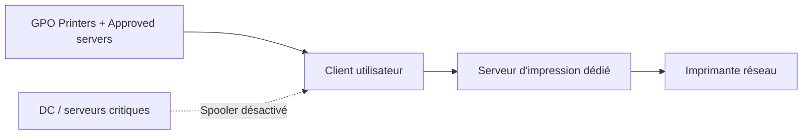

# PrintNightmare et durcissement Print Spooler

!!! abstract "Ce que vous allez apprendre"
    - Comprendre en quelques minutes pourquoi **PrintNightmare** a transformé un service banal en vecteur d'élévation **SYSTEM** et de mouvement latéral
    - Identifier rapidement les actifs les plus exposés, en particulier les **contrôleurs de domaine** et les serveurs qui font encore tourner **Spooler**
    - Déployer les **5 paramètres GPO critiques** qui réduisent réellement la surface d'attaque autour de Point and Print, des drivers et des connexions client
    - Concevoir une architecture d'impression plus sûre avec **serveur d'impression dédié**, **GPP Printers** maîtrisé et, si besoin, **Universal Print**
    - Mettre en place un **audit opérationnel** avec événements Windows, PowerShell et une requête KQL de détection simple

!!! tip "Si vous ne retenez qu'une chose"
    **Sur un contrôleur de domaine, Print Spooler doit être considéré comme coupable jusqu'à preuve du contraire.**
    Si un DC n'a aucun besoin métier d'imprimer, le service doit être **désactivé**.
    Le durcissement GPO vient ensuite.
    La meilleure défense contre PrintNightmare sur un DC reste encore : **pas de Spooler du tout**.

---

## :material-alert-octagon: CVE-2021-1675 / CVE-2021-34527 : PrintNightmare en 5 minutes

### Le vecteur d'attaque à retenir

PrintNightmare repose sur un mélange toxique :

- une surface RPC exposée par le service Print Spooler
- la capacité d'ajouter ou de charger un driver d'impression
- des contrôles de privilèges insuffisants ou contournables selon le contexte

L'appel souvent cité est `RpcAddPrinterDriverEx()`.

Dans les scénarios vulnérables, l'attaquant force ou détourne l'installation d'un driver via un chemin ou un répertoire de spool contrôlé.

Le résultat n'est pas juste un incident d'impression.

Le résultat peut être de l'exécution de code **en SYSTEM**.

### Pourquoi c'était critique

Ce bug a fait très mal pour une raison simple :

un service historiquement banal s'exécutait avec des privilèges élevés.

Un utilisateur standard de domaine pouvait, dans certains cas, s'en servir pour obtenir davantage de privilèges qu'il n'aurait jamais dû en avoir.

Le sujet n'était donc pas seulement la disponibilité de l'impression.

Le sujet était la **rupture de frontière de privilèges**.

Sur un serveur sensible, et pire sur un DC, le risque devenait immédiatement structurel.

### Timeline des correctifs : de juillet 2021 à l'état actuel

| Période | Correctif / état | Ce qu'il faut retenir |
|---|---|---|
| Juillet 2021 | `KB5004945` | Réponse d'urgence initiale |
| Été 2021 | `KB5005010` | Renforce Point and Print et les exigences admin |
| Période post-patch | Variantes et contournements | Le patch seul n'élimine pas les mauvaises pratiques |
| Windows Server 2022 actuel | Correctifs intégrés + posture de durcissement attendue | Le vrai niveau de sécurité dépend toujours de votre configuration |

Le message opérationnel important :

on ne "sort" pas de PrintNightmare parce qu'un patch est installé.

On sort de PrintNightmare quand :

- le niveau de patch est correct
- le service Spooler est coupé là où il est inutile
- Point and Print est réellement restreint
- les serveurs autorisés sont explicitement définis

!!! danger "Toujours exploitable"
    Des variantes post-patch ont continué d'exister quand **Point and Print** restait ouvert, quand les serveurs approuvés n'étaient pas limités, ou quand les droits d'installation de drivers n'étaient pas restreints aux administrateurs.
    Le patch réduit le risque.
    Une configuration permissive le réintroduit.

### Ce que l'attaque vise vraiment dans votre architecture

| Cible | Pourquoi elle intéresse l'attaquant |
|---|---|
| Contrôleur de domaine | Gain maximal si le service y tourne |
| Serveur multi-rôle | Impact latéral élevé, pivot plus facile |
| Serveur d'impression partagé | Charge utile via drivers et connexions |
| Poste d'administration | Point d'appui pour propager des pilotes douteux |

### Réflexe d'analyse

Quand vous voyez "PrintNightmare", ne partez pas d'abord sur le patch.

Partez sur ces trois questions :

1. où Spooler tourne-t-il encore ?
2. qui peut installer des drivers ?
3. quels serveurs Point and Print sont implicitement autorisés ?

!!! quote "En résumé"
    - PrintNightmare n'est pas un simple bug d'impression ; c'est un problème d'exécution de code avec privilèges élevés.
    - `RpcAddPrinterDriverEx()` et la chaîne d'installation de drivers sont le cœur du risque.
    - `KB5004945` puis `KB5005010` ont corrigé une partie du problème, pas vos mauvaises pratiques de configuration.
    - Sur les actifs sensibles, la question prioritaire reste : le service Spooler doit-il vraiment tourner ?

---

## :material-magnify: Inventaire de l'exposition : qui fait tourner Spooler ?

### La première question à poser

Avant toute GPO, mesurez l'exposition.

Vous devez savoir :

- quels DC font encore tourner Spooler
- quels serveurs d'infrastructure l'exécutent encore sans justification
- quels postes d'administration ont encore des pilotes ou files inutiles

L'erreur la plus fréquente est de traiter l'impression comme un "petit sujet annexe".

En réalité, c'est un **service système** qui ouvre une surface supplémentaire.

### PowerShell : détecter les DC avec Spooler actif

```powershell title="Lister les contrôleurs de domaine avec Spooler actif"
Get-ADDomainController -Filter * | ForEach-Object {
    $svc = Get-Service -ComputerName $_.HostName -Name Spooler -ErrorAction SilentlyContinue
    [PSCustomObject]@{
        DC = $_.HostName
        SpoolerStatus = $svc.Status
    }
}
```

Si ce tableau vous retourne autre chose que `Stopped` ou `Disabled` sur vos DC, vous avez déjà un axe de remédiation prioritaire.

### Étendre l'inventaire au-delà des DC

Les DC sont le point rouge.

Mais ils ne sont pas la seule surface.

Il faut aussi classer les actifs en trois catégories :

| Catégorie | Position recommandée |
|---|---|
| Contrôleurs de domaine | Spooler désactivé |
| Serveurs d'impression dédiés | Spooler autorisé, durci, surveillé |
| Autres serveurs | Désactivé sauf besoin métier documenté |

### Règle absolue pour les DC

Il n'y a pas d'ambiguïté utile ici.

**Spooler désactivé sur tous les contrôleurs de domaine.**

S'il existe une exception, elle doit être :

- documentée
- temporaire
- compensée par des contrôles supplémentaires

Et surtout, elle doit être challengée.

Un DC n'est pas un serveur d'impression d'appoint.

### Script complémentaire : statut et mode de démarrage

```powershell title="Inventaire simple du service Spooler"
$targets = Get-ADComputer -Filter { OperatingSystem -like "*Server*" } |
    Select-Object -ExpandProperty Name

foreach ($computer in $targets) {
    try {
        $service = Get-CimInstance -ClassName Win32_Service -ComputerName $computer `
            -Filter "Name='Spooler'"

        [PSCustomObject]@{
            ComputerName = $computer
            State        = $service.State
            StartMode    = $service.StartMode
            Status       = $service.Status
        }
    } catch {
        [PSCustomObject]@{
            ComputerName = $computer
            State        = "UNREACHABLE"
            StartMode    = "UNREACHABLE"
            Status       = $_.Exception.Message
        }
    }
}
```

### Ce que vous cherchez dans les résultats

| Cas observé | Décision |
|---|---|
| `Running` sur un DC | Incident de sécurité à traiter |
| `Auto` sur un serveur non print | Désactivation planifiée |
| `Manual` mais jamais utilisé | Désactivation si aucun besoin métier |
| `Running` sur print server dédié | Acceptable si durcissement complet |

!!! quote "En résumé"
    - La première étape n'est pas de pousser une GPO, mais d'inventorier où Spooler tourne encore.
    - Les DC avec Spooler actif sont la priorité absolue.
    - Un serveur d'impression dédié peut garder Spooler ; les autres serveurs doivent justifier son existence.
    - Le mode de démarrage compte autant que l'état courant du service.

---

## :material-shield-lock: GPO de durcissement Print Spooler

### Chemin GPMC exact

Le nœud à retenir est :

```text
Computer Configuration
  > Policies
    > Administrative Templates
      > Printers
```

Le danger vient souvent d'un durcissement partiel.

On désactive une option.

On en oublie trois.

Et l'équipe pense que "le sujet est traité".

### Les 5 paramètres critiques

| Paramètre GPO | Chemin | Valeur recommandée | CVE ciblé |
|----------------------------------------------------|----------|--------------------------|---------------------|
| Allow Print Spooler to accept client connections   | Printers | Disabled (DC)            | CVE-2021-34527      |
| Point and Print Restrictions                       | Printers | Enabled, Admins only     | CVE-2021-34527 var. |
| Package Point and Print - Approved servers         | Printers | Liste serveurs autorisés | Post-patch var.     |
| Limits print driver installation to Administrators | Printers | Enabled                  | General hardening   |
| Configure RPC listener settings                    | Printers | Enabled, TCP/IP only     | Lateral movement    |

### Ce que chaque paramètre change réellement

**Allow Print Spooler to accept client connections**

Sur un DC, la valeur recommandée est `Disabled`.

Cela réduit l'exposition réseau du service.

Sur un serveur d'impression dédié, la décision est différente parce que le service existe pour servir des clients.

**Point and Print Restrictions**

C'est le paramètre qui évite qu'un utilisateur standard fasse installer n'importe quel pilote depuis n'importe quel serveur.

Activez-le avec une logique "admins only".

**Package Point and Print - Approved servers**

Ce paramètre transforme la posture.

Au lieu de faire confiance implicitement au réseau, vous faites confiance explicitement à une courte liste de serveurs d'impression approuvés.

**Limits print driver installation to Administrators**

Si vous n'activez pas ce réglage, vous laissez une voie trop large à l'installation de drivers.

**Configure RPC listener settings**

Réduisez la souplesse inutile.

Moins de canaux exposés signifie moins de surface de mouvement latéral.

### Stratégie de déploiement recommandée

| Périmètre | Réglage prioritaire |
|---|---|
| DC | Refuser connexions clients + désactiver le service si possible |
| Serveurs non print | Désactiver le service ou au minimum bloquer les connexions |
| Serveurs d'impression dédiés | Limiter serveurs approuvés, restreindre drivers, surveiller événements |
| Postes utilisateurs | Point and Print restreint + admins pour drivers |

### Pièges de mise en œuvre

| Piège | Effet produit |
|---|---|
| Point and Print ouvert "temporairement" | Le temporaire devient permanent |
| Pas de liste d'Approved servers | Toute la posture repose sur la confiance implicite |
| Pas de séparation serveurs d'impression / autres rôles | La compromission d'un rôle impacte le reste |
| GPO liée trop haut sans exceptions documentées | Blocage de certains usages métiers sans visibilité |

### Vérification locale après application

```powershell title="Contrôles rapides après application GPO"
gpupdate /force
gpresult /r /scope computer

Get-ItemProperty "HKLM:\Software\Policies\Microsoft\Windows NT\Printers" -ErrorAction SilentlyContinue
Get-Service -Name Spooler
```

Le but n'est pas seulement de voir la GPO "applied".

Le but est de vérifier :

- la valeur de registre écrite
- l'état du service
- le comportement réel d'installation de driver

!!! quote "En résumé"
    - Le chemin GPMC critique est `Computer Configuration > Policies > Administrative Templates > Printers`.
    - Les 5 réglages clés doivent être pensés ensemble, pas isolément.
    - Sur les DC, la posture correcte reste la plus restrictive possible.
    - Le test final doit porter sur le comportement réel, pas seulement sur la présence de la GPO.

---

## :material-printer-check: Déploiement des imprimantes sans Spooler universel

### GPP Printers : oui, mais sans Point and Print permissif

Le sujet n'est pas d'arrêter de déployer les imprimantes.

Le sujet est d'arrêter de les déployer **n'importe comment**.

Les **GPP Printers** restent utiles si :

- vous maîtrisez les serveurs sources
- vous savez quels pilotes sont autorisés
- vous n'ouvrez pas Point and Print à tout le monde

Le bon pattern :

1. serveurs d'impression dédiés
2. liste d'Approved servers
3. droits d'installation limités
4. ciblage GPP propre

### Universal Print : alternative cloud

Quand l'objectif est de sortir de l'héritage des print servers classiques, **Universal Print** peut réduire la dépendance au modèle Spooler traditionnel côté serveur Windows.

Ce n'est pas une baguette magique.

Mais dans une architecture déjà orientée Entra ID / Intune, c'est une alternative crédible pour certains usages bureautiques.

| Option | Ce que vous gagnez | Ce que vous perdez ou devez compenser |
|---|---|---|
| Print server classique | Compatibilité large, contrôle fin on-prem | Dette Spooler, drivers, maintenance |
| Universal Print | Simplification cloud, moins de serveurs Windows dédiés | Dépendance cloud, licence, compatibilité des périphériques |

### Serveur d'impression dédié : architecture recommandée

Le compromis réaliste pour beaucoup d'entreprises reste :

- un **serveur d'impression dédié**
- aucun DC ni serveur critique polyvalent qui héberge Spooler
- un flux clair entre client, print server et imprimante



### Pourquoi isoler le serveur d'impression

Le serveur d'impression dédié concentre le risque au bon endroit.

Il permet :

- une journalisation dédiée
- une liste de pilotes connue
- une maintenance ciblée
- un périmètre de durcissement clair

Il ne rend pas Spooler "sûr".

Il rend le risque **confiné et administrable**.

### Matrice de décision simple

| Besoin | Choix recommandé |
|---|---|
| Imprimantes on-prem existantes, faible budget | Serveur d'impression dédié durci |
| Parc moderne cloud, besoins standards | Universal Print si l'écosystème suit |
| Déploiement par département avec ciblage précis | GPP Printers + serveur approuvé |
| Impression depuis DC ou serveur applicatif | À proscrire |

!!! quote "En résumé"
    - GPP Printers reste valable si Point and Print est strictement encadré.
    - Universal Print est une alternative crédible dans les environnements déjà très cloud.
    - Le meilleur compromis on-prem reste souvent un serveur d'impression dédié et isolé.
    - Ne laissez pas Spooler vivre sur des rôles critiques qui n'ont rien à voir avec l'impression.

---

## :material-radar: Audit et détection

### Événements Windows à surveiller

Deux événements minimum doivent entrer dans votre routine :

- **Event ID 316** dans `PrintService/Admin` pour les installations ou changements suspects de drivers
- **Event ID 808** pour les erreurs de Spooler à corréler avec une activité inhabituelle

Ces événements ne racontent pas tout à eux seuls.

Mais ils donnent un point d'entrée rapide pour distinguer un incident banal d'impression d'un comportement anormal.

### Script d'audit hebdomadaire des drivers installés

```powershell title="Audit hebdomadaire des drivers d'impression"
$servers = @("print01", "print02")

foreach ($server in $servers) {
    Invoke-Command -ComputerName $server -ScriptBlock {
        Get-PrinterDriver |
            Select-Object Name, Manufacturer, MajorVersion, DriverPath, InfPath |
            Sort-Object Manufacturer, Name
    } | Export-Csv -Path "C:\Temp\$server-printer-drivers.csv" -NoTypeInformation
}
```

Ce script n'est pas là pour être élégant.

Il est là pour produire un **baseline diffable**.

Si un pilote apparaît soudainement sans ticket, sans changement approuvé et sans fenêtre de maintenance, vous avez un signal.

### Journal PowerShell rapide

```powershell title="Lire les derniers événements PrintService/Admin"
Get-WinEvent -LogName "Microsoft-Windows-PrintService/Admin" -MaxEvents 50 |
    Select-Object TimeCreated, Id, LevelDisplayName, Message
```

### Exemple KQL simplifié pour Sentinel / Defender

```kusto title="Détection simple d'activité PrintNightmare"
DeviceEvents
| where Timestamp > ago(7d)
| where ActionType in ("DriverLoad", "ServiceInstalled", "RegistryValueSet")
| where AdditionalFields has_any ("Spooler", "Print", "RpcAddPrinterDriverEx", "PointAndPrint")
| project Timestamp, DeviceName, ActionType, InitiatingProcessFileName, AccountName, AdditionalFields
| order by Timestamp desc
```

Cette requête est volontairement simple.

Elle ne remplace pas une détection ingénierée.

Elle donne un point de départ pour voir remonter :

- des chargements de drivers
- des services liés à l'impression
- des traces associées à Point and Print

### Routine de revue hebdomadaire

| Contrôle hebdomadaire | Ce que vous cherchez |
|---|---|
| Diff des pilotes installés | Nouveau pilote non approuvé |
| Événements 316 | Installation ou changement suspect |
| Événements 808 | Anomalie de Spooler à corréler |
| Serveurs approuvés GPO | Dérive de liste ou oubli de documentation |
| État Spooler des DC | Tout écart par rapport à `Disabled` |

### Ce qui transforme l'audit en valeur

L'audit ne sert à rien si personne ne sait quoi faire d'une anomalie.

Documentez une action simple :

1. geler l'installation de nouveaux pilotes
2. isoler le serveur ou le poste concerné si nécessaire
3. extraire la liste des pilotes et événements
4. comparer au baseline approuvé
5. corriger la GPO ou la configuration fautive

!!! quote "En résumé"
    - Event ID 316 et Event ID 808 sont le socle minimal de surveillance opérationnelle.
    - Un inventaire hebdomadaire des drivers permet de détecter la dérive plus vite que l'attente d'un incident utilisateur.
    - Une requête KQL simple suffit déjà à remonter des signaux intéressants autour de Spooler et des drivers.
    - L'audit n'a de valeur que s'il débouche sur une action de confinement et de correction.
