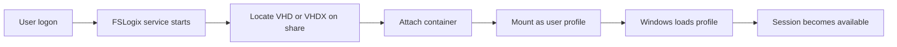

# FSLogix et GPO

!!! abstract "Ce que vous allez apprendre"
    - Comprendre pourquoi **FSLogix** remplace avantageusement les profils itinérants classiques dans les environnements **RDS**, **AVD** et multi-session
    - Installer les **ADMX/ADML FSLogix** dans le **Central Store** pour gérer proprement la solution depuis la GPMC
    - Configurer un **Profile Container** via GPO avec les réglages qui comptent vraiment en production
    - Éviter les conflits les plus courants entre **FSLogix** et les GPO historiques : Folder Redirection, profils itinérants, quotas et suppression de cache
    - Diagnostiquer un logon lent ou un fallback sur profil local à partir des **logs**, **event IDs** et commandes PowerShell simples

!!! tip "Si vous ne retenez qu'une chose"
    **FSLogix n'est pas un "petit add-on de profil".**
    C'est un **remplacement d'architecture**.
    Dès qu'un utilisateur ouvre sa session, son profil doit être **monté comme un disque** depuis le stockage.
    Si le partage, les permissions ou le fallback ne sont pas pensés avant la GPO, vous fabriquez des incidents de logon à grande échelle.

---

## :material-folder-account: FSLogix : pourquoi et pour qui

### Le problème que FSLogix vient réellement résoudre

Les profils itinérants historiques ont un défaut structurel.

Ils copient.

Ils recopient.

Puis ils recassent.

En environnement :

- **Remote Desktop Services**
- **Azure Virtual Desktop**
- VDI persistant ou non persistant

cela se traduit par :

- logons longs
- déconnexions lentes
- profils corrompus
- caches Office instables

### Pourquoi le modèle classique vieillit mal

Quand un profil entier doit être copié au logon puis au logoff, chaque petit gain de capacité disque est mangé par :

- la latence réseau
- la croissance d'Outlook, OneDrive, Teams et Office
- les fichiers temporaires
- les extensions navigateur

Plus le poste est multi-session, plus le problème devient visible.

### Le principe FSLogix

FSLogix remplace la copie par le **montage**.

Au lieu de recopier un profil, il attache un **VHD** ou **VHDX** qui devient le profil de l'utilisateur.

Pour l'application, le profil ressemble à un profil local.

Pour l'infrastructure, le profil vit sur un **partage réseau** ou un autre provider de stockage.

### Les deux composants à connaître

**Profile Container**

C'est le composant principal.

Il virtualise le profil utilisateur complet dans un VHD/VHDX.

**Office Container**

Il cible surtout les données Microsoft 365 / Office dans les environnements où vous ne voulez pas forcément virtualiser le profil complet.

Dans la majorité des projets modernes RDS/AVD, on retient surtout :

- **Profile Container** comme socle
- Office Container seulement si un cas d'usage le justifie

### Le mauvais réflexe

Installer FSLogix parce que "Microsoft 365 le recommande".

Ce n'est pas un argument suffisant.

La vraie question est :

votre environnement souffre-t-il de :

- profils itinérants lents
- redirections incohérentes
- multi-session
- besoin de mobilité rapide d'un utilisateur à l'autre

Si oui, FSLogix a du sens.

Si non, ajoutez-le seulement avec une raison documentée.

### Les licences à retenir

Les licences souvent rencontrées sur le terrain incluent :

- **Microsoft 365 E3 / E5**
- **RDS CAL**
- **Azure Virtual Desktop**

La documentation Microsoft actuelle mentionne aussi d'autres SKUs éligibles.

Mais pour une équipe infra, les trois familles ci-dessus couvrent l'essentiel des cas rencontrés en entreprise.

### Diagramme simple du flux FSLogix



### Ce que ce diagramme vous dit vraiment

Le point de rupture n'est pas "Windows n'arrive pas à lire `C:\Users`".

Le point de rupture est souvent :

- le **partage**
- la **permission**
- l'**attachement du VHD**

Autrement dit :

quand FSLogix tombe, ce n'est pas qu'un problème "poste".

C'est souvent un problème de **stockage** ou de **réseau**.

### Les environnements où FSLogix est particulièrement pertinent

| Contexte | Intérêt de FSLogix |
|---|---|
| Ferme RDS multi-session | Réduction forte des logons lents et des profils corrompus |
| Azure Virtual Desktop | Standard quasi naturel pour la mobilité utilisateur |
| VDI non persistant | Conservation de l'expérience utilisateur entre sessions |
| Bureautique classique mono-session | À évaluer, pas automatique |

### Les environnements où il faut réfléchir avant

Soyez prudent si vous avez :

- agences avec latence élevée vers le stockage
- partages SMB fragiles
- antivirus agressif sur les VHDX
- équipes support non préparées au diagnostic FSLogix

FSLogix améliore la vie des utilisateurs.

À condition que le stockage soit traité comme un **composant critique**.

### Le point qui change la gouvernance GPO

Avec FSLogix, certaines GPO historiques deviennent inutiles.

D'autres deviennent dangereuses.

Ce chapitre sert précisément à faire ce tri.

!!! quote "En résumé"
    - FSLogix remplace la **copie de profil** par le **montage d'un conteneur**.
    - Le bénéfice est maximal en **RDS**, **AVD** et plus largement en **multi-session**.
    - Les deux briques à connaître sont **Profile Container** et **Office Container**.
    - Le vrai point critique n'est pas Windows lui-même, mais le **stockage**, le **réseau** et les **permissions**.
    - Dès que FSLogix devient votre socle, plusieurs GPO historiques doivent être **retirées ou revues**.

---

## :material-store: ADMX FSLogix : installation et Central Store

### Commencez par les bons fichiers

FSLogix se pilote très bien par registre.

Mais en environnement d'entreprise, ce n'est pas votre meilleure option.

Votre meilleure option, c'est :

- installer le produit FSLogix sur les hôtes cibles
- importer les **templates ADMX/ADML** dans le **Central Store**

### Où récupérer le package

Téléchargez **FSLogix Apps** depuis la **page officielle Microsoft** dédiée au produit.

Le but ici n'est pas de coller une URL dans un runbook.

Le but est d'utiliser la **source officielle Microsoft** pour éviter :

- les vieux packages
- les liens de blog périmés
- les copies non maîtrisées

### Les fichiers qui vous intéressent

Dans l'archive extraite, cherchez :

- `fslogix.admx`
- `fslogix.adml`

Le plus souvent, le fichier de langue sera sous :

- `en-US\fslogix.adml`

### Le chemin Central Store

Copiez les fichiers dans :

`\\domain\SYSVOL\domain\Policies\PolicyDefinitions`

et pour la langue :

`\\domain\SYSVOL\domain\Policies\PolicyDefinitions\en-US`

Si votre domaine utilise un autre dossier de langue, adaptez-le.

Mais ne mélangez pas :

- Central Store domaine
- magasin local d'une seule machine

### Pourquoi le Central Store est le bon choix

Sans Central Store :

- la console GPMC dépend du poste d'administration
- vous obtenez des écarts de templates entre admins
- les captures d'écran de procédure ne correspondent plus

Avec Central Store :

- tout le monde voit les mêmes templates
- les GPO sont éditées avec la même base
- les audits sont plus propres

### Procédure simple

1. Télécharger et extraire FSLogix Apps
2. Repérer `fslogix.admx` et `fslogix.adml`
3. Copier les fichiers dans le Central Store
4. Fermer puis rouvrir la GPMC
5. Vérifier l'apparition du nœud FSLogix

### Vérification attendue

Après copie correcte, vous devez voir :

`Computer Configuration > Administrative Templates > FSLogix`

Si ce nœud n'apparaît pas :

- revérifiez le chemin
- revérifiez la langue ADML
- revérifiez que la console GPMC a bien été relancée

### Erreurs fréquentes

| Erreur | Symptôme | Correction |
|---|---|---|
| ADMX copié sans ADML | Nœud absent ou erreurs de libellé | Copier le fichier de langue correspondant |
| Mauvais dossier de langue | Template invisible | Vérifier `en-US` ou votre culture cible |
| Copie sur un DC local uniquement | Un admin voit FSLogix, un autre non | Utiliser le vrai Central Store SYSVOL |
| Ancienne version de template | Certains réglages manquent | Mettre à jour depuis le package officiel |

### Mini runbook de contrôle

Après mise en place :

- ouvrir la GPMC depuis un poste d'administration standard
- créer une GPO de test vide
- parcourir le nœud FSLogix
- confirmer que les paramètres de **Profile Containers** sont visibles

### Point d'hygiène documentaire

N'intitulez pas votre GPO "FSLogix".

Intitulez-la selon son rôle, par exemple :

- `FSLogix-ProfileContainer-RDS-Prod`
- `FSLogix-AVD-Pilot`

Le jour où vous avez plusieurs environnements, ce nommage vous sauve du brouillard.

### Ce qu'il faut documenter en plus du template

Le template ADMX ne dit rien sur :

- le **partage SMB**
- les **ACL**
- le **plan de capacité**
- le **fallback en cas d'indisponibilité**

Ne confondez jamais :

- pilotage GPO
- design de stockage

Vous avez besoin des deux.

!!! quote "En résumé"
    - Les fichiers à importer sont **`fslogix.admx`** et **`fslogix.adml`**.
    - Ils doivent vivre dans le **Central Store** : `\\domain\SYSVOL\domain\Policies\PolicyDefinitions`.
    - Le contrôle final est simple : le nœud **FSLogix** doit apparaître dans la GPMC.
    - Un template visible ne valide pas l'architecture ; il valide seulement le **pilotage**.
    - Si vous ne documentez pas le **stockage** et les **ACL**, l'ADMX ne vous sauvera pas.

---

## :material-cog: Configuration GPO Profile Container

### La règle d'or

Commencez par **Profile Container**.

N'essayez pas d'optimiser tout l'écosystème Office le premier jour.

Votre objectif initial est plus simple :

obtenir un profil utilisateur stable, attaché rapidement, et cohérent d'une session à l'autre.

### Paramètres essentiels

| Paramètre | Chemin GPO | Valeur recommandée |
|---|---|---|
| Enabled | FSLogix > Profile Containers | 1 |
| VHDLocations | FSLogix > Profile Containers | `\\fileserver\FSLogix\%username%` |
| DeleteLocalProfileWhenVHDShouldApply | FSLogix > Profile Containers | 1 |
| SizeInMBs | FSLogix > Profile Containers | 30720 (30 Go) |
| VolumeType | FSLogix > Profile Containers | VHDX |
| FlipFlopProfileDirectoryName | FSLogix > Profile Containers | 1 |
| PreventLoginWithFailure | FSLogix > Profile Containers | 0 (prod) / 1 (test) |

### `Enabled`

Celui-ci paraît trivial.

Il ne l'est pas.

Assurez-vous que la GPO cible uniquement les hôtes concernés.

Si vous activez FSLogix au mauvais endroit, par exemple sur un serveur qui ne dispose pas du partage attendu, vous fabriquez votre propre incident.

### `VHDLocations`

Le chemin UNC mérite une vraie revue.

Utilisez un chemin lisible et stable, par exemple :

`\\fileserver\FSLogix\Profiles`

ou un chemin construit par utilisateur si c'est votre standard.

Le plus important n'est pas la beauté du chemin.

C'est :

- sa disponibilité
- ses permissions
- sa sauvegarde
- sa capacité

### Cloud Cache pour multi-region

Cloud Cache remplace `VHDLocations` par `CCDLocations`. Le profil est cache localement puis replique vers plusieurs backends, par exemple deux partages SMB dans deux regions.

```
HKLM\SOFTWARE\FSLogix\Profiles
```

| Paramètre | Type | Exemple |
|---|---|---|
| `CCDLocations` | REG_SZ | `type=smb,connectionString=\\server1\profiles;type=smb,connectionString=\\server2\profiles` |

Avantage : resilience multi-site et basculement si un backend devient indisponible.

Inconvenient : plus de trafic reseau au logon/logoff, synchronisation plus longue et diagnostic stockage plus exigeant.

Cas d'usage raisonnables : AVD multi-region, Cloud PC avec sauvegarde on-prem, design DR active-active.

!!! warning "Exclusivite"
    Ne combinez pas `VHDLocations` et `CCDLocations` dans la meme GPO. Choisissez Profile Container classique ou Cloud Cache, puis documentez le design de stockage correspondant.

!!! quote "En resume"
    - Cloud Cache utilise `CCDLocations` au lieu de `VHDLocations`.
    - Il apporte de la resilience multi-backend, mais augmente la charge reseau et la complexite.
    - Il est pertinent pour AVD multi-region, Cloud PC avec secours ou DR active-active.
    - Ne melangez pas `VHDLocations` et `CCDLocations`.

### `DeleteLocalProfileWhenVHDShouldApply`

Cette valeur évite une grande partie des sessions "bizarres".

Quand FSLogix doit s'appliquer, garder un ancien profil local concurrent est une source classique :

- de confusion
- de mauvais cache
- de support interminable

Activez-la sauf cas exceptionnel très documenté.

### `SizeInMBs`

30 Go est une base utile.

Mais ce n'est pas une vérité universelle.

Ajustez selon :

- taille moyenne des profils Office
- usage OneDrive
- volumétrie Outlook / OST
- politique de nettoyage

Le mauvais design ici est de fixer 30 Go puis d'oublier de surveiller la croissance.

### `VolumeType`

Choisissez **VHDX**.

En 2026, le débat n'a plus beaucoup d'intérêt en environnement moderne.

VHDX est le choix rationnel pour la robustesse et la capacité.

### `FlipFlopProfileDirectoryName`

Cette setting simplifie souvent la lisibilité des dossiers en fonction du mode de nommage attendu.

Sur le terrain, elle vous évite des répertoires moins pratiques à corréler avec l'utilisateur réel.

Le gain n'est pas "sécurité".

Le gain est surtout **opérationnel**.

### `PreventLoginWithFailure`

C'est la setting qui mérite le plus de respect.

En **test**, la valeur `1` peut être utile.

Elle force le comportement attendu :

si le VHD ne se monte pas, la connexion doit être refusée.

En **production**, cette rigidité peut transformer un incident stockage ponctuel en panne utilisateur massive.

La valeur `0` est donc souvent préférable pour absorber un incident court, à condition de surveiller les fallback locaux.

!!! danger "Production"
    Ne jamais activer `PreventLoginWithFailure=1` sans avoir testé la disponibilité réelle du partage réseau, la latence, les ACL et le comportement de reprise après incident.
    En prod, une erreur de stockage ne doit pas devenir automatiquement une vague de refus de connexion sans runbook prêt.

### Modèle de GPO recommandé

Créez une GPO dédiée.

Exemple :

`FSLogix-ProfileContainer-RDS-Pilot`

Puis une GPO prod séparée.

Pourquoi séparer ?

Parce que vous voulez faire varier :

- le chemin de stockage
- la valeur `PreventLoginWithFailure`
- la population cible

sans bricoler en urgence.

### Vérifications avant liaison de GPO

Avant de lier la GPO :

- les hôtes ont-ils FSLogix installé ?
- le partage est-il accessible depuis les hôtes ?
- les ACL de création et d'attachement sont-elles validées ?
- l'antivirus exclut-il les VHD/VHDX et chemins FSLogix ?
- le support connaît-il le chemin des logs ?

### ACL et partage : rappel rapide

Ce chapitre n'est pas un guide complet d'ACL FSLogix.

Mais retenez ceci :

si vous ne contrôlez pas les permissions à l'écriture, à la création et au montage, vous verrez des profils locaux de secours apparaître.

Et vous penserez à tort que "FSLogix est instable".

### Check-list stockage avant production

Avant la mise en production, validez au minimum :

| Contrôle | Pourquoi c'est important |
|---|---|
| Le partage SMB répond vite depuis tous les hôtes | Le logon dépend directement du montage du VHDX |
| Les ACL autorisent création, lecture, écriture et verrouillage | Un droit manquant provoque fallback ou échec de montage |
| Le quota ou la capacité libre sont surveillés | Un VHDX plein se transforme en incident utilisateur |
| Les sauvegardes savent gérer les conteneurs ouverts | Sinon vous croyez sauvegarder alors que vous ne récupérez rien d'exploitable |
| Les exclusions antivirus couvrent les chemins FSLogix | Les scans sur VHDX cassent les performances et parfois l'attachement |

### Convention de stockage à documenter

Choisissez une convention simple.

Exemple :

- un partage pour la production
- un partage pour le pilote
- un partage distinct si vous séparez RDS et AVD

Le mauvais design consiste à stocker tous les conteneurs "quelque part sur un file server" sans convention.

Le jour où vous devez déplacer, dépanner ou restaurer, vous payez ce flou.

### Ordre de déploiement conseillé

1. Hôtes pilotes
2. Petit groupe utilisateur
3. Validation logon/logoff
4. Extension progressive

Le plus mauvais ordre possible :

1. tous les hôtes
2. tous les utilisateurs
3. diagnostic en production

!!! quote "En résumé"
    - La base, c'est **Profile Container** avec une **GPO dédiée**.
    - `VHDLocations`, `DeleteLocalProfileWhenVHDShouldApply`, `VolumeType` et `PreventLoginWithFailure` sont les réglages à surveiller en priorité.
    - **VHDX** est le format à privilégier.
    - La valeur de `PreventLoginWithFailure` dépend du contexte : **souple en prod**, **stricte en test**.
    - Une GPO correcte sans **stockage correct** reste un déploiement fragile.

---

## :material-compare: Interaction GPO classiques et FSLogix

### Le piège numéro un : empiler au lieu de remplacer

Quand FSLogix arrive, beaucoup d'équipes gardent toutes les anciennes GPO "au cas où".

Mauvaise stratégie.

FSLogix n'est pas censé cohabiter avec toutes les vieilles techniques de gestion de profil.

Il en **remplace** plusieurs.

### Folder Redirection + FSLogix : conflit classique

La redirection de dossiers a longtemps servi à réduire la taille des profils.

Avec FSLogix Profile Container, cette logique change.

Si vous laissez en place des redirections agressives sur :

- `AppData`
- `Desktop`
- `Documents`

vous risquez :

- double logique de stockage
- comportements incohérents
- support très difficile

### Règle simple

Avec **FSLogix Profile Container**, désactivez la Folder Redirection pour :

- `AppData`
- `Desktop`
- `Documents`

Ce n'est pas une loi universelle de l'informatique.

C'est une règle de stabilité d'exploitation.

### Exception utile

L'exception la plus courante reste :

**Office Container** ou certains composants Microsoft 365 peuvent coexister avec une stratégie **OneDrive** bien pensée.

Mais là encore :

coexister ne veut pas dire empiler sans design.

### Tableau des GPO classiques à désactiver

| GPO classique | Action avec FSLogix | Raison |
|---|---|---|
| Folder Redirection AppData | Désactiver | Conflit container |
| Roaming Profiles | Désactiver | Remplacé par FSLogix |
| Profile Quota | Désactiver | Géré par `SizeInMBs` |
| Delete cached copies of roaming profiles | Désactiver | FSLogix gère la suppression |

### Pourquoi laisser Roaming Profiles est une mauvaise idée

Parce que vous créez deux autorités pour un même objet logique :

le profil utilisateur.

Ensuite vous obtenez :

- des répertoires inattendus
- des comportements différents selon l'hôte
- des logons qui semblent "aléatoires"

Ils ne sont pas aléatoires.

Ils sont juste gérés par deux mécanismes concurrents.

### Transition depuis un environnement Roaming Profiles

Si vous migrez depuis des profils itinérants classiques, n'essayez pas de convertir tout le monde le même soir.

Procédez par anneaux :

1. retirer les GPO Roaming Profiles sur l'OU pilote
2. vérifier qu'aucune redirection AppData parasite ne reste
3. activer FSLogix sur un petit lot d'utilisateurs
4. contrôler le premier et le deuxième logon
5. seulement ensuite élargir

Le contrôle du **deuxième logon** est important.

Beaucoup de pilotes paraissent corrects au premier essai, puis révèlent le vrai problème au retour de session :

- verrou résiduel
- profil local recréé
- VHDX non remonté correctement

### Quid des GPP et scripts de nettoyage

Faites aussi l'inventaire des scripts ou GPP qui :

- suppriment des profils locaux
- déplacent des dossiers utilisateur
- recréent des raccourcis dans des emplacements redirigés

Ces éléments ont souvent été ajoutés pour compenser les limites des anciens profils.

Avec FSLogix, ils deviennent parfois nocifs.

### Stratégie de coexistence réaliste

Pendant un pilote, vous pouvez temporairement conserver certaines GPO historiques.

Mais vous devez expliciter :

- lesquelles restent
- lesquelles sont retirées
- pourquoi

Si ce tableau n'existe pas, votre pilote est déjà brouillé.

### Comment mener le nettoyage

Approche conseillée :

1. inventorier les GPO liées au profil utilisateur
2. taguer celles qui deviennent obsolètes avec FSLogix
3. les désactiver sur l'OU pilote
4. mesurer les effets avant généralisation

### Cas particulier OneDrive

OneDrive n'est pas "anti-FSLogix" par nature.

Mais il ne faut pas empiler aveuglément :

- KFM
- redirection de dossiers
- Profile Container
- Office Container

Choisissez un design lisible.

### Ce qu'il faut expliquer au support

Le support doit savoir répondre à cette question :

"Sur ce serveur, qui gère le profil utilisateur ?"

La réponse doit être unique.

Si elle prend trois phrases, votre design n'est pas assez clair.

### Petite checklist de transition

Avant bascule complète vers FSLogix :

- Roaming Profiles retiré de l'OU cible
- Folder Redirection revue
- GPP de nettoyage de profil relues
- scripts hérités audités
- documentation support mise à jour

!!! quote "En résumé"
    - Avec FSLogix, le mauvais réflexe est de **cumuler** au lieu de **remplacer**.
    - **Folder Redirection**, **Roaming Profiles** et plusieurs GPO historiques deviennent des sources de conflit.
    - La règle pratique est de désactiver la redirection pour **AppData**, **Desktop** et **Documents** quand le **Profile Container** devient le socle.
    - OneDrive peut coexister, mais seulement avec un **design explicite**.
    - Le support doit pouvoir dire en une phrase **qui pilote le profil** sur l'hôte concerné.

---

## :material-magnify: Diagnostic FSLogix

### Commencez par les logs, pas par l'intuition

Le premier chemin à retenir est :

`C:\ProgramData\FSLogix\Logs\Profile`

Quand un utilisateur dit "mon bureau a disparu" ou "j'ai eu un profil temporaire", ouvrez ce dossier avant d'inventer une théorie.

### Event IDs utiles

Source :

`FSLogix-Apps`

| Event ID | Signification |
|---|---|
| 7 | VHD attaché avec succès |
| 25 | Profil local utilisé (VHD inaccessible) |
| 26 | Erreur d'attachement VHD |

### Lecture opérationnelle des trois IDs

**7**

Le conteneur a bien été attaché.

C'est votre confirmation de base.

Si l'utilisateur se plaint malgré un `7`, cherchez plutôt :

- corruption applicative
- données dans le mauvais emplacement
- ancien profil déjà chargé

**25**

C'est l'événement qui doit attirer votre attention en prod.

Le système a utilisé un profil local parce que le VHD n'était pas disponible ou utilisable.

Cela peut venir :

- du partage réseau
- des ACL
- d'un verrou de fichier
- d'un antivirus

**26**

Ici, vous êtes sur l'échec d'attachement pur.

Le diagnostic doit aller immédiatement vers :

- accessibilité du partage
- droits NTFS / partage
- état du VHDX
- verrou concurrent

### PowerShell : vérifier les VHD montés

Sur une session RDS active :

```powershell title="Vérifier les VHD montés"
Get-Disk | Where-Object { $_.FriendlyName -like "*FSLogix*" } |
    Select-Object Number, FriendlyName, Size
```

Cette commande ne remplace pas les logs.

Elle sert à confirmer rapidement qu'un attachement existe réellement côté système.

### Autres contrôles utiles

```powershell title="Tester l'accès au partage FSLogix"
Test-Path "\\fileserver\FSLogix"
```

```powershell title="Lire les derniers événements FSLogix"
Get-WinEvent -ProviderName "FSLogix-Apps" -MaxEvents 20 |
    Select-Object TimeCreated, Id, LevelDisplayName, Message
```

### Ordre de diagnostic recommandé

Quand un utilisateur remonte un problème :

1. vérifier le partage
2. ouvrir les logs FSLogix
3. vérifier les event IDs
4. confirmer le montage VHD
5. vérifier la GPO appliquée

### Symptômes et causes probables

| Symptôme | Cause probable | Première action |
|---|---|---|
| Logon très lent | Partage lent ou AV sur VHDX | Contrôler stockage + exclusions AV |
| Profil temporaire ou local | Fallback après échec conteneur | Chercher event `25` |
| Session refusée en test | `PreventLoginWithFailure=1` | Vérifier disponibilité du partage |
| Profil incohérent selon les hôtes | Anciennes GPO concurrentes | Auditer Roaming Profiles / Redirection |

### Le rôle de l'antivirus

Trop d'équipes diagnostiquent le réseau pendant des heures alors que le vrai problème est :

- un scan AV du VHDX
- un verrou sur un fichier `.lock`
- une quarantaine d'un composant FSLogix

Si vous n'avez pas défini les exclusions recommandées, votre diagnostic part avec un handicap.

### `!!! check "Point de contrôle"`

!!! check "Point de contrôle"
    - Le partage `\\fileserver\FSLogix` est-il **accessible et stable** depuis tous les hôtes cibles ?
    - Voyez-vous un event `7`, `25` ou `26` cohérent avec le symptôme remonté ?
    - Les anciennes GPO de **Roaming Profiles** ou de **Folder Redirection** ont-elles bien été retirées de l'OU pilote ?

### Ce qu'un runbook support doit contenir

Minimum vital :

- le chemin des logs
- les trois event IDs
- la commande de contrôle VHD
- la règle de lecture de `PreventLoginWithFailure`
- le contact ou l'équipe propriétaire du stockage

### Décision d'exploitation après incident

Si vous voyez une série de `25` sur plusieurs hôtes, ne traitez pas ticket par ticket.

Traitez l'incident comme un incident :

- de stockage
- de réseau
- ou d'architecture

FSLogix peut donner des symptômes individuels.

Mais la cause est souvent collective.

!!! quote "En résumé"
    - Les logs à connaître sont sous **`C:\ProgramData\FSLogix\Logs\Profile`**.
    - Les événements `7`, `25` et `26` suffisent déjà pour orienter la majorité des diagnostics.
    - `Get-Disk` aide à confirmer le **montage réel** du conteneur.
    - Beaucoup d'incidents FSLogix sont en réalité des incidents **stockage**, **permissions** ou **antivirus**.
    - Votre support doit savoir distinguer **fallback local** et **échec de montage** sans improviser.
