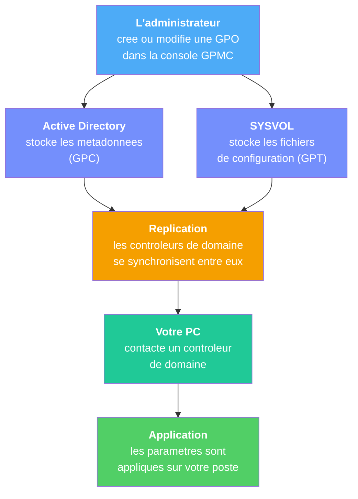
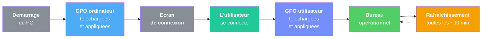

# C'est quoi une strategie de groupe ?

!!! abstract "Ce que vous allez apprendre"
    - Ce qu'est une strategie de groupe (GPO) en termes simples
    - La difference entre une GPO locale et une GPO de domaine
    - Les deux grands types de configuration : ordinateur et utilisateur
    - Ce qu'une GPO peut faire et ce qu'elle ne peut pas faire
    - Comment une GPO arrive jusqu'a votre poste de travail


!!! tip "Si vous ne retenez qu'une chose"
    Une GPO permet de définir une règle une seule fois et de l'appliquer automatiquement à tout le parc.

---

## Voyons d'abord un exemple concret

Vous arrivez a votre premier jour dans une nouvelle entreprise. On vous installe devant un PC flambant neuf. Vous allumez, vous vous connectez, et la...

- :material-image-off: Impossible de changer le fond d'ecran. Le logo de l'entreprise est impose.
- :material-download-off: Impossible d'installer un logiciel. Le bouton est grise.
- :material-usb-flash-drive-off: Vous branchez votre cle USB : rien ne se passe.
- :material-web-off: Certains sites web sont bloques.
- :material-lock: Au bout de 5 minutes sans activite, l'ecran se verrouille automatiquement.

Vous n'avez rien demande. Vous n'avez rien configure. Et pourtant, toutes ces regles sont deja en place.

**Qui a decide tout ca ?**

L'administrateur systeme de votre entreprise. Et l'outil qu'il a utilise pour imposer ces regles a tous les ordinateurs en une seule fois, c'est la **strategie de groupe** -- plus souvent appelee **GPO** (*Group Policy Object*).

### Ce n'est pas qu'une question de restrictions

A premiere vue, on pourrait croire que les GPO ne servent qu'a **interdire** des choses. C'est faux.

Les GPO servent aussi a **configurer** des choses utiles pour vous :

- :material-printer: Votre imprimante de service est deja installee, sans que vous ayez eu a chercher le pilote
- :material-folder-network: Votre lecteur reseau `Z:\` est connecte automatiquement a chaque connexion
- :material-shield-check: Votre antivirus est configure et a jour sans intervention de votre part
- :material-power-plug: Votre PC ne se met jamais en veille pendant une presentation

Tout ca, c'est aussi grace aux GPO. Elles ne sont pas uniquement des "murs" -- elles sont aussi des "ponts" qui vous connectent aux bons outils automatiquement.

### Maintenant, imaginez l'alternative

Imaginez que l'administrateur doive configurer chaque PC **a la main**. L'entreprise a 300 postes.

Il devrait :

1. S'asseoir devant le poste numero 1
2. Ouvrir les parametres
3. Desactiver l'USB, imposer le fond d'ecran, configurer le mot de passe...
4. Se lever, aller au poste numero 2
5. Recommencer exactement la meme chose
6. Et ainsi de suite, 300 fois

A raison de 15 minutes par poste, ca represente **75 heures de travail**. Plus de 9 jours complets, sans pause.

Avec une GPO, cette meme operation prend **5 minutes**. L'administrateur cree la regle une seule fois, et les 300 postes l'appliquent automatiquement.

Et si demain il faut changer le parametre ? Sans GPO, il faut refaire les 300 postes. Avec GPO, il modifie la regle une seule fois et tous les postes se mettent a jour automatiquement.

!!! tip "La vraie force des GPO"
    Les GPO ne sont pas seulement un outil de restriction. Elles sont avant tout un outil de **gain de temps colossal**. Chaque modification est faite une seule fois et s'applique a l'ensemble du parc informatique.

!!! quote "En resume"
    - Quand vous arrivez sur un poste d'entreprise, des dizaines de regles sont deja appliquees : fond d'ecran impose, logiciels bloques, ecran de veille automatique, etc.
    - Les GPO ne servent pas qu'a **interdire** : elles servent aussi a **configurer** des outils utiles (imprimantes, lecteurs reseau, antivirus...).
    - Ces regles ne sont pas configurees une par une sur chaque PC : elles viennent d'un outil centralise appele **GPO**.
    - Sans les GPO, l'administrateur devrait configurer chaque poste individuellement -- un travail titanesque et source d'erreurs.

---

## L'analogie du reglement interieur

Pour comprendre les GPO, oubliez l'informatique un instant. Pensez a un college.

### Le reglement du college

Quand vous etiez au college, il y avait un **reglement interieur**. Ce reglement contenait des regles comme :

- :material-tshirt-crew: Port de l'uniforme obligatoire
- :material-cellphone-off: Telephone interdit en classe
- :material-clock-outline: Arrivee avant 8h00
- :material-food-apple: Interdiction de manger en dehors de la cantine

Vous n'aviez pas le choix. Le reglement s'appliquait a **tous les eleves**, dans **toutes les salles**, des le premier jour.

### Qui ecrivait ce reglement ?

Le directeur (et l'equipe de direction). Pas les eleves. Pas les parents. Le directeur decidait des regles, les ecrivait dans un document officiel, et elles s'appliquaient automatiquement.

Si le directeur decidait un jour que les bonnets etaient interdits a l'interieur, il n'allait pas voir chaque eleve un par un. Il ajoutait la regle au reglement, et **tous les eleves** devaient la respecter des le lendemain.

### La GPO, c'est exactement ca

Dans un reseau Windows d'entreprise, le principe est identique :

| College | Reseau d'entreprise |
|---------|---------------------|
| Le directeur | L'administrateur systeme |
| Le reglement interieur | La strategie de groupe (GPO) |
| Les eleves | Les utilisateurs et les ordinateurs |
| Les salles de classe | Les unites d'organisation (OU) |
| "Telephone interdit" | "Installation de logiciels bloquee" |
| Le panneau d'affichage | Le controleur de domaine |
| Le premier jour de classe | Le demarrage du PC |

Le directeur n'a pas besoin d'aller voir chaque eleve individuellement pour lui rappeler les regles. Il les ecrit **une seule fois**, et elles s'appliquent **a tout le monde**.

C'est pareil pour l'administrateur : il cree une GPO une seule fois, et elle s'applique automatiquement a des dizaines, des centaines, voire des milliers de postes.

### Plusieurs reglements pour differents groupes

Un college peut avoir des regles differentes selon les niveaux :

- Les 6e n'ont pas acces a la salle de chimie sans accompagnement
- Les 3e ont le droit de sortir a midi
- Les delegues ont une cle de la salle des delegues

De la meme facon, un administrateur peut creer **plusieurs GPO** pour differents groupes d'utilisateurs ou d'ordinateurs :

- Les comptables ont acces au logiciel de facturation
- Les developpeurs peuvent installer des outils de test
- Les postes de la salle de reunion n'ont pas d'ecran de veille

On appelle ces groupes des **unites d'organisation** (OU). Mais ne vous inquietez pas, on verra ca en detail plus tard.

### Que se passe-t-il quand le reglement change ?

Quand le directeur modifie le reglement interieur (par exemple, les bonnets sont desormais autorises), il n'a pas besoin de rappeler chaque eleve un par un. Il met a jour le document, et la nouvelle version s'applique a tout le monde au prochain affichage.

C'est pareil avec les GPO. Quand l'administrateur modifie une GPO, les postes recoivent la mise a jour automatiquement lors du prochain **rafraichissement** (on verra plus tard que c'est environ toutes les 90 minutes).

!!! tip "L'analogie resume toute la suite du livre"
    Si vous retenez l'analogie du reglement interieur, vous comprendrez 80% des concepts GPO. Chaque fois qu'un concept vous semble complexe, repensez au college :

    - "Heritage des GPO" → Les regles du college s'appliquent-elles aussi au club de sport ? (Oui, sauf exception.)
    - "Filtrage de securite" → Peut-on avoir une regle qui ne s'applique qu'aux 3e ? (Oui.)
    - "GPO bloquee" → Peut-on empecher le reglement du college de s'appliquer dans une salle specifique ? (Oui, mais c'est rare.)

!!! quote "En resume"
    - Une GPO fonctionne comme le **reglement interieur** d'un college : un ensemble de regles ecrites une seule fois par le directeur (l'administrateur) et appliquees automatiquement a tous les eleves (les utilisateurs et ordinateurs).
    - On peut creer **plusieurs GPO** pour cibler differents groupes, comme un college qui a des regles differentes pour chaque niveau.
    - Quand le reglement change, la nouvelle version s'applique automatiquement a tout le monde.
    - L'avantage principal : on configure **une fois**, ca s'applique **partout**.

---

## Les deux grands types de configuration

Revenons a notre analogie du college. Dans un reglement interieur, certaines regles concernent les **lieux** et d'autres concernent les **personnes** :

- "La salle informatique ferme a 17h" -- c'est une regle sur le **lieu**. Peu importe qui est dans la salle, elle ferme a 17h.
- "Les eleves de 3e ont acces a la salle de reunion" -- c'est une regle sur les **personnes**. Peu importe la salle, ce sont les eleves de 3e qui ont le droit.

Les GPO fonctionnent exactement pareil. Elles se divisent en deux grandes categories :

### :material-desktop-tower: Configuration ordinateur

Ces parametres s'appliquent a la **machine**, quel que soit l'utilisateur qui se connecte.

Exemples concrets :

- :material-shield-check: Activer le pare-feu Windows
- :material-update: Configurer les mises a jour automatiques
- :material-usb-flash-drive-off: Desactiver les ports USB
- :material-form-textbox-password: Definir la politique de mots de passe (longueur minimale, complexite, etc.)
- :material-harddisk: Activer le chiffrement BitLocker

C'est comme une regle affichee sur la porte de la salle : "Defense de manger ici". Tous ceux qui entrent doivent la respecter, que ce soit un eleve de 6e, un prof ou le directeur.

!!! example "Scenario typique"
    L'administrateur veut que **tous les PC** de la salle de formation aient les ports USB desactives, pour eviter les virus. Il cree une GPO "ordinateur" liee a l'OU "Salle de formation". Quel que soit l'utilisateur qui se connecte sur ces postes, les ports USB restent bloques.

### :material-account: Configuration utilisateur

Ces parametres s'appliquent a l'**utilisateur**, quel que soit l'ordinateur sur lequel il se connecte.

Exemples concrets :

- :material-image: Imposer un fond d'ecran d'entreprise
- :material-eye-off: Masquer certains elements du menu Demarrer
- :material-folder-network: Connecter un lecteur reseau (par ex. `Z:\` pointe vers le serveur de fichiers)
- :material-folder-move: Rediriger le dossier Documents vers un serveur
- :material-script-text: Executer un script a chaque connexion

C'est comme une regle inscrite sur la carte d'etudiant : "Eleve de 3e, acces a la salle de reunion". Ou que l'eleve aille dans le college, cette regle le suit.

!!! example "Scenario typique"
    L'administrateur veut que tous les **comptables** aient automatiquement un lecteur `Z:\` connecte au dossier partage de la comptabilite. Il cree une GPO "utilisateur" liee a l'OU "Comptabilite". Peu importe sur quel PC un comptable se connecte, le lecteur `Z:\` apparait.

### Tableau comparatif

| | Configuration ordinateur | Configuration utilisateur |
|---|---|---|
| :material-target: **S'applique a** | La machine | L'utilisateur |
| :material-clock-start: **Quand** | Au demarrage du PC | A l'ouverture de session |
| :material-shield-lock: **Exemples securite** | Pare-feu, mises a jour, BitLocker | Restriction du Panneau de configuration |
| :material-cog: **Exemples pratique** | Desactiver USB, configurer WSUS | Fond d'ecran, lecteurs reseau, scripts de connexion |
| :material-help-circle: **Question a se poser** | "Ce parametre doit-il s'appliquer a **cette machine**, peu importe qui l'utilise ?" | "Ce parametre doit-il suivre **cet utilisateur**, peu importe la machine ?" |
| :material-lightbulb: **Analogie** | Regle affichee sur la porte de la salle | Regle inscrite sur la carte d'etudiant |

!!! info "Pas besoin de choisir"
    Une meme GPO peut contenir a la fois des parametres ordinateur **et** des parametres utilisateur. On verra dans les chapitres suivants comment les organiser. En pratique, beaucoup d'administrateurs preferent separer les deux dans des GPO distinctes pour plus de clarte.

!!! warning "Un piege classique pour les debutants"
    Quand on debute, on a tendance a tout mettre en "configuration utilisateur" parce que ca semble plus intuitif. Mais certains parametres (comme la politique de mots de passe ou le pare-feu) **ne fonctionnent qu'en configuration ordinateur**. Si un parametre ne s'applique pas, verifiez d'abord s'il est dans la bonne categorie.

!!! quote "En resume"
    - La **configuration ordinateur** s'applique a la machine, quel que soit l'utilisateur. Elle est appliquee au demarrage du PC.
    - La **configuration utilisateur** s'applique a l'utilisateur, quel que soit la machine. Elle est appliquee a l'ouverture de session.
    - Une meme GPO peut contenir les deux types de parametres.
    - Pour choisir le bon type, posez-vous la question : "Ce parametre concerne la **machine** ou la **personne** ?"

---

## Qui decide ? Le role de l'administrateur

Revenons encore a notre college. Qui a le droit de modifier le reglement interieur ?

- :material-check: Le directeur et l'equipe de direction
- :material-close: Les eleves
- :material-close: Le personnel d'entretien
- :material-close: Les parents (sauf au conseil d'administration)

Pour les GPO, c'est pareil. Seul l'**administrateur systeme** (ou un membre du groupe de securite autorise) peut creer, modifier ou supprimer des GPO.

En tant qu'utilisateur standard, vous ne pouvez pas :

- :material-close: Voir la liste des GPO qui s'appliquent a votre PC (sauf avec des outils specifiques)
- :material-close: Modifier ou desactiver une GPO
- :material-close: Contourner une restriction imposee par une GPO

C'est volontaire. Tout comme un eleve ne peut pas modifier le reglement interieur du college, un utilisateur ne peut pas modifier les strategies de groupe de l'entreprise.

!!! example "Comment savoir quelles GPO s'appliquent a mon PC ?"
    Meme si vous ne pouvez pas modifier les GPO, vous pouvez voir celles qui s'appliquent a votre poste. Ouvrez une invite de commandes et tapez :
    ```
    gpresult /r
    ```
    Cette commande affiche un rapport avec la liste des GPO appliquees a votre ordinateur et a votre compte utilisateur. C'est un outil de **diagnostic**, pas de modification. On l'explorera en detail au [chapitre 12](12-diagnostic.md).

### L'outil du directeur : la console GPMC

L'administrateur utilise un outil appele **GPMC** (*Group Policy Management Console*, ou "Console de gestion des strategies de groupe" en francais). C'est son tableau de bord.

Avec la GPMC, il peut :

- :material-plus-circle: Creer une nouvelle GPO
- :material-link: La lier a un groupe d'ordinateurs ou d'utilisateurs (une OU)
- :material-pencil: Modifier ses parametres
- :material-content-copy: La copier pour en creer une variante
- :material-delete: La supprimer
- :material-backup-restore: La sauvegarder et la restaurer
- :material-eye: Voir un rapport detaille de tous ses parametres

!!! warning "Vous ne verrez pas la GPMC sur votre poste"
    La GPMC est un outil d'administration. Elle n'est installee que sur les **serveurs** ou sur les postes des administrateurs qui ont installe les outils RSAT (*Remote Server Administration Tools*). Un utilisateur standard n'y a pas acces -- et c'est volontaire.

### Et gpedit.msc dans tout ca ?

Il existe un outil plus simple appele **gpedit.msc** (*Group Policy Editor*, ou "Editeur de strategies de groupe locales"). Celui-ci est disponible sur les editions Pro et Enterprise de Windows et permet de modifier les **strategies locales** du PC sur lequel vous vous trouvez.

C'est un peu comme si un professeur pouvait ajouter une regle supplementaire dans sa propre salle de classe, sans que ca affecte les autres salles. La regle ne vaut que pour sa salle.

!!! info "Windows Edition Famille"
    Si vous avez Windows 10 ou 11 en edition **Famille** (Home), gpedit.msc n'est **pas disponible**. Cet outil n'est inclus que dans les editions Pro, Enterprise et Education. Ce n'est pas un bug, c'est une limitation volontaire de l'edition Famille.

On explorera gpedit.msc en detail dans le [chapitre 2](02-gpedit.md).

!!! quote "En resume"
    - Seul l'**administrateur** peut creer, modifier ou supprimer des GPO. Les utilisateurs standards n'ont pas acces aux outils de gestion.
    - L'outil principal est la **GPMC** (*Group Policy Management Console*), disponible uniquement sur les serveurs ou les postes d'administration.
    - L'outil **gpedit.msc** permet de modifier les strategies locales d'un seul PC (on le verra au chapitre 2).
    - L'edition Famille de Windows ne dispose pas de gpedit.msc.

---

## GPO locale vs GPO de domaine

C'est le moment d'introduire une distinction importante. Il existe deux "niveaux" de GPO, et cette distinction revient tout le temps.

### :material-laptop: La GPO locale

C'est la strategie de groupe qui vit **sur votre propre PC**, independamment de tout reseau.

Pour reprendre l'analogie : c'est comme le reglement **de votre chambre** a la maison. C'est vous (ou vos parents) qui decidez des regles. Ca ne concerne que votre chambre, pas celle du voisin.

Caracteristiques :

- :material-check: Existe sur **chaque PC Windows** (edition Pro ou Enterprise)
- :material-tools: Se modifie avec **gpedit.msc**
- :material-target: N'affecte que **ce PC-la**
- :material-server-off: Ne necessite **aucun serveur**, ni reseau, ni domaine
- :material-account-check: Utile pour configurer son propre poste ou un poste isole

Quand c'est utile :

- Vous avez un PC personnel et vous voulez desactiver Cortana ou les suggestions du menu Demarrer
- Vous etes technicien et vous configurez un PC en kiosque (borne d'accueil, point d'information)
- Vous voulez tester un parametre avant de le deployer en entreprise
- Vous administrez un petit reseau sans Active Directory (groupe de travail)

### :material-server-network: La GPO de domaine

C'est la strategie de groupe creee par l'administrateur sur un **controleur de domaine** et qui s'applique a tous les ordinateurs et utilisateurs du domaine Active Directory.

Pour reprendre l'analogie : c'est le **reglement interieur officiel du college**, decide par le directeur, et qui s'applique a toutes les salles et tous les eleves.

Caracteristiques :

- :material-check: Creee sur un **controleur de domaine** via la GPMC
- :material-database: Stockee dans **Active Directory** (AD)
- :material-target: S'applique a des centaines ou milliers de postes
- :material-folder-account: Peut cibler des groupes specifiques (via les OU)
- :material-trophy: **Ecrase** les strategies locales en cas de conflit

Quand c'est utilise :

- L'entreprise veut imposer un mot de passe complexe a tous les employes
- Le service informatique veut deployer une imprimante sur tous les postes du 3e etage
- La direction veut interdire l'installation de logiciels non approuves
- L'equipe securite veut activer le chiffrement BitLocker sur tous les portables
- Le support veut configurer Windows Update pour eviter les redemarrages en plein travail

### Tableau comparatif

| | GPO locale | GPO de domaine |
|---|---|---|
| :material-map-marker: **Ou elle vit** | Sur le PC lui-meme | Dans Active Directory (sur le serveur) |
| :material-tools: **Outil de gestion** | gpedit.msc | GPMC (gpmc.msc) |
| :material-target: **Portee** | Ce PC uniquement | Tous les postes du domaine (ou d'une OU) |
| :material-server: **Necessite un serveur** | Non | Oui (controleur de domaine) |
| :material-account-multiple: **Nombre de PC affectes** | 1 | De 1 a plusieurs milliers |
| :material-trophy: **Priorite en cas de conflit** | Perd | Gagne |
| :material-school: **Cas d'usage typique** | Configuration personnelle, test, kiosque | Entreprise, administration centralisee |
| :material-lightbulb: **Analogie** | Le reglement de votre chambre | Le reglement interieur du college |

!!! danger "La GPO de domaine gagne toujours"
    Si vous configurez un parametre via gpedit.msc (GPO locale) et que votre administrateur configure le meme parametre differemment via une GPO de domaine, c'est la **GPO de domaine qui l'emporte**. Pas de discussion.

    C'est comme si le directeur du college annulait la regle que vous aviez affichee dans votre chambre. Le reglement officiel a toujours le dernier mot.

!!! info "L'ordre d'application : LSDOU"
    L'acronyme **LSDOU** resume l'ordre dans lequel les GPO sont appliquees :

    1. **L**ocale -- la GPO de votre PC
    2. **S**ite -- la GPO du site AD (rarement utilisee en pratique)
    3. **D**omaine -- la GPO du domaine
    4. **OU** -- la GPO de l'unite d'organisation

    Chaque niveau peut ecraser le precedent. La derniere GPO appliquee a le dernier mot.

    C'est comme les niveaux d'autorite : le reglement de votre chambre peut etre annule par le reglement du college, qui peut lui-meme etre annule par la loi. On verra ca en detail au [chapitre 6](06-heritage.md).

!!! example "Scenario concret"
    Vous configurez via gpedit.msc (GPO locale) que l'ecran de veille se declenche apres **15 minutes**. Votre administrateur a configure via la GPMC (GPO de domaine) que l'ecran de veille se declenche apres **5 minutes**.

    Resultat : votre ecran se verrouille apres **5 minutes**. La GPO de domaine a ecrase votre parametre local. Et si vous remettez 15 minutes via gpedit.msc, au prochain rafraichissement (~90 min), ca repassera a 5 minutes automatiquement.

!!! quote "En resume"
    - La **GPO locale** vit sur un seul PC, se modifie avec gpedit.msc et ne necessite aucun serveur.
    - La **GPO de domaine** vit dans Active Directory, se gere avec la GPMC et s'applique a tous les postes du domaine.
    - En cas de conflit, la GPO de domaine **l'emporte toujours** sur la GPO locale.
    - L'ordre d'application s'appelle **LSDOU** : Locale, Site, Domaine, OU.

---

## Ce qu'une GPO peut faire (et ce qu'elle ne peut pas)

Les GPO sont puissantes, mais elles ne sont pas magiques. Beaucoup de debutants s'imaginent que les GPO peuvent tout faire -- ce n'est pas le cas.

C'est important de bien cerner leurs limites des le depart, pour eviter de perdre du temps a essayer de faire quelque chose d'impossible. Un bon administrateur sait quand utiliser une GPO et quand utiliser un autre outil.

### :material-check-circle: Ce qu'une GPO peut faire

| Categorie | Exemples concrets |
|-----------|-------------------|
| :material-shield-lock: Securite | Politique de mots de passe (longueur, complexite, expiration), verrouillage de compte apres X tentatives, pare-feu Windows, chiffrement BitLocker, restriction d'execution de logiciels |
| :material-image: Apparence | Fond d'ecran impose, ecran de veille avec delai, masquer des icones du bureau, personnaliser la barre des taches |
| :material-download: Logiciels | Deployer des applications au format `.msi`, interdire l'execution de certains programmes |
| :material-update: Mises a jour | Configurer Windows Update (serveur WSUS, calendrier d'installation, redemarrage force), reporter les mises a jour de fonctionnalite |
| :material-printer: Peripheriques | Deployer des imprimantes reseau, bloquer les cles USB, desactiver le Bluetooth |
| :material-folder-network: Reseau | Connecter des lecteurs reseau, configurer le proxy, gerer les profils Wi-Fi, configurer le pare-feu |
| :material-script: Scripts | Executer un script au demarrage du PC, a la connexion de l'utilisateur, a la deconnexion ou a l'arret |
| :material-cog: Parametres Windows | Configurer le menu Demarrer, l'Explorateur de fichiers, le Panneau de configuration, les options d'alimentation |
| :material-registry: Registre | Ecrire des valeurs dans la base de registre de facon centralisee (via les preferences GPO) |

!!! tip "Le saviez-vous ?"
    Windows contient plus de **5 000 parametres** configurables par GPO. Personne ne les connait tous. Meme les administrateurs les plus experimentes n'en utilisent qu'une fraction. Ne vous sentez pas submerge : on commencera par les parametres les plus utiles au quotidien.

!!! info "GPO et base de registre : un lien etroit"
    La plupart des parametres configures par GPO finissent par etre ecrits dans la **base de registre** de Windows. La GPO n'est qu'un moyen de transport : elle dit "ecris cette valeur a cet endroit du registre". Si vous voulez comprendre ce lien en profondeur, consultez le livre [La Bible de la Base de Registre Windows -- Chapitre 20](../bible-registre-windows/20-gpo.md).

### :material-close-circle: Ce qu'une GPO ne peut **pas** faire

| Ce que les gens croient | La realite |
|------------------------|-----------|
| "Une GPO peut installer des pilotes materiel" | Non. Les GPO ne gerent pas le materiel directement. Il faut d'autres outils (SCCM, Intune, etc.) |
| "Une GPO peut accelerer la connexion internet" | Non. Les GPO configurent des parametres, elles ne modifient pas les capacites physiques du reseau |
| "Une GPO peut remplacer un antivirus" | Non. Une GPO peut *configurer* un antivirus (ex. : planifier les analyses), mais pas le remplacer |
| "Une GPO peut gerer des Mac ou des Linux" | Non. Les GPO sont un mecanisme **Windows uniquement**. Pour les autres OS, il faut des outils comme Intune ou Jamf |
| "Une GPO peut reparer un PC en panne" | Non. Si le PC ne demarre plus, il ne peut pas contacter le controleur de domaine et donc pas recevoir de GPO |
| "Une GPO peut surveiller ce que fait l'utilisateur en temps reel" | Non. Les GPO configurent des regles statiques, elles ne sont pas un outil de surveillance ou de monitoring |
| "Une GPO peut deployer n'importe quel logiciel" | Partiellement. Les GPO ne deploient que des fichiers `.msi`. Pour les `.exe`, il faut passer par SCCM, Intune ou un script |
| "Une GPO peut empecher un administrateur local de la contourner" | Pas toujours. Un administrateur local avec suffisamment de droits peut modifier le registre directement. La securite passe aussi par la gestion des droits |

!!! tip "Regle d'or pour comprendre les limites"
    Une GPO **configure des parametres**. Elle ne cree pas de nouvelles capacites.

    C'est comme un reglement interieur : il peut interdire de courir dans les couloirs, mais il ne peut pas rendre les eleves plus rapides. Il peut obliger les eleves a porter un uniforme, mais il ne peut pas leur acheter l'uniforme.

### :material-calendar-today: Un jour typique avec des GPO

On parle beaucoup de ce que les GPO "peuvent" faire en theorie. Mais a quoi ca ressemble **en pratique**, pour un employe qui ne sait meme pas que les GPO existent ?

Voici ce que les GPO font pour un employe typique au cours d'une journee, **sans qu'il s'en rende compte** :

| Moment de la journee | Ce qui se passe | GPO responsable |
|----------------------|-----------------|-----------------|
| :material-power: 8h00 -- Le PC demarre | Les mises a jour Windows sont telechargees en arriere-plan | GPO Windows Update |
| :material-login: 8h05 -- Connexion | Le lecteur reseau `Z:\` apparait dans l'Explorateur | GPO Preferences - Lecteurs reseau |
| :material-printer: 8h05 -- Connexion | L'imprimante du service est disponible | GPO Deploiement d'imprimantes |
| :material-image: 8h05 -- Bureau | Le fond d'ecran affiche le logo de l'entreprise | GPO Fond d'ecran |
| :material-lock: 8h20 -- Pause cafe | Apres 10 min d'inactivite, l'ecran se verrouille | GPO Ecran de veille |
| :material-download-off: 10h00 -- Tentative | L'employe essaie d'installer un jeu : refuse | GPO Restriction logicielle |
| :material-usb-flash-drive-off: 14h00 -- Cle USB | L'employe branche une cle USB : rien ne se passe | GPO Peripheriques amovibles |
| :material-refresh: 15h30 -- En arriere-plan | Le PC verifie s'il y a de nouvelles GPO | Rafraichissement automatique |

Tout ca se passe **silencieusement**, sans intervention de l'utilisateur ni de l'administrateur. L'employe ne sait probablement meme pas que les GPO existent, et c'est tant mieux : tout fonctionne sans qu'il ait a y penser.

C'est la force des GPO : une fois configurees, elles travaillent toutes seules, jour apres jour, sur tous les postes.

!!! quote "En resume"
    - Les GPO peuvent configurer la securite, l'apparence, les logiciels, les mises a jour, les peripheriques, le reseau, les scripts et le registre.
    - Les GPO **ne peuvent pas** installer du materiel, accelerer le reseau, remplacer un antivirus, gerer des systemes non-Windows ou reparer un PC en panne.
    - Au quotidien, les GPO travaillent **silencieusement en arriere-plan** : l'utilisateur ne les voit pas, mais elles configurent tout son environnement de travail.
    - Regle d'or : une GPO **configure**, elle ne **cree pas** de nouvelles capacites.

---

## Ou se trouvent les GPO ?

Quand un administrateur cree une GPO dans la GPMC, ou va-t-elle concretement ? Pas sur son PC a lui -- ca n'aurait aucun sens, puisque les autres postes doivent pouvoir y acceder.

La reponse est un peu surprenante : chaque GPO est stockee a **deux endroits** en meme temps.

### Les deux moities d'une GPO

Chaque GPO de domaine est composee de deux parties complementaires. Aucune ne fonctionne sans l'autre.

| Partie | Ou elle est stockee | Ce qu'elle contient |
|--------|--------------------|--------------------|
| :material-database: **GPC** (*Group Policy Container*) | Dans **Active Directory** (la base de donnees du domaine) | Les metadonnees : nom de la GPO, liens vers les OU, numero de version, permissions de securite |
| :material-folder: **GPT** (*Group Policy Template*) | Dans le dossier **SYSVOL** (partage reseau sur les controleurs de domaine) | Les fichiers de configuration : scripts, parametres de registre, modeles d'administration |

Pour reprendre notre analogie : c'est comme si le reglement interieur du college etait compose de deux parties :

- Le **sommaire et l'index** (stockes dans le bureau du directeur) : qui indique quels chapitres existent et a qui ils s'appliquent
- Les **pages du reglement** (affichees sur le panneau d'affichage) : le contenu reel des regles

!!! info "Pourquoi deux endroits ?"
    Active Directory est optimise pour stocker de petites informations structurees (comme des noms et des permissions). SYSVOL est optimise pour stocker des fichiers. En separant les deux, Microsoft utilise les forces de chaque systeme.

    C'est comme un bibliothecaire qui a un fichier numerique pour retrouver chaque livre (rapide a chercher) et les livres eux-memes sur les etageres (trop gros pour le fichier).

### L'adresse d'une GPO dans SYSVOL

Si vous etes curieux, voici a quoi ressemble le chemin d'une GPO dans SYSVOL :

```
\\domaine.local\SYSVOL\domaine.local\Policies\{GUID-de-la-GPO}
```

Le **GUID** (*Globally Unique Identifier*) est un identifiant unique genere automatiquement par Windows au moment de la creation de la GPO. Il ressemble a quelque chose comme `{31B2F340-016D-11D2-945F-00C04FB984F9}`. Ce n'est pas tres lisible pour un humain, mais Windows s'y retrouve parfaitement.

A l'interieur de ce dossier, on trouve generalement :

- Un sous-dossier `Machine\` contenant les parametres de configuration ordinateur
- Un sous-dossier `User\` contenant les parametres de configuration utilisateur
- Un fichier `GPT.INI` contenant le numero de version de la GPO

Vous n'avez pas besoin de connaitre ces details pour utiliser les GPO au quotidien. Mais ca aide de savoir que derriere l'interface graphique de la GPMC, ce sont de simples fichiers et dossiers.

!!! warning "Ne touchez pas a SYSVOL directement"
    Meme si vous avez acces au dossier SYSVOL, ne modifiez **jamais** les fichiers a la main. Utilisez toujours la GPMC. Modifier les fichiers directement peut corrompre la GPO et causer des problemes sur tout le reseau.

### Le chemin d'une GPO, de l'administrateur a votre PC

Voici comment une GPO voyage depuis l'administrateur jusqu'a votre poste de travail :



En resume, le parcours est le suivant :

1. L'administrateur cree la GPO dans la GPMC
2. La GPO est enregistree dans Active Directory (metadonnees) et dans SYSVOL (fichiers)
3. Les controleurs de domaine se synchronisent entre eux (replication)
4. Votre PC contacte un controleur de domaine et telecharge les GPO qui le concernent
5. Les parametres sont appliques sur votre poste

!!! warning "Pas instantane"
    La replication entre controleurs de domaine prend un peu de temps. Si votre administrateur vient de creer une GPO, il est possible qu'elle ne soit pas encore arrivee jusqu'a votre PC. En general, il faut compter quelques minutes, parfois jusqu'a une heure selon la taille du reseau et le nombre de sites distants.

!!! quote "En resume"
    - Chaque GPO de domaine est stockee a **deux endroits** : les metadonnees dans **Active Directory** (GPC) et les fichiers de configuration dans **SYSVOL** (GPT).
    - La GPO voyage depuis la GPMC de l'administrateur jusqu'a votre PC en passant par la replication entre controleurs de domaine.
    - Ce processus n'est pas instantane : il faut un peu de temps pour que la GPO arrive jusqu'a votre poste.
    - Ne modifiez **jamais** les fichiers SYSVOL directement.

---

## Comment ca fonctionne en pratique ?

Maintenant que vous savez ou vivent les GPO, voyons comment elles arrivent concretement sur votre PC au quotidien.

### Le cycle de vie d'une GPO sur votre poste

C'est un processus invisible pour l'utilisateur, mais qui se repete **chaque jour**, a chaque demarrage.

Quand vous allumez votre PC et que vous vous connectez, voici ce qui se passe en coulisses :

**:material-power: Etape 1 -- Le PC demarre**

Votre ordinateur s'allume et contacte un **controleur de domaine** (le "serveur principal" du reseau). C'est comme arriver au college le matin et passer devant le panneau d'affichage.

**:material-download: Etape 2 -- Telechargement des GPO ordinateur**

Le controleur de domaine verifie quelles GPO s'appliquent a **cet ordinateur** (en fonction de l'OU dans laquelle il se trouve) et les envoie. Le PC applique ces parametres *avant* que quiconque ne se connecte.

C'est comme les regles affichees dans la salle de classe avant l'arrivee des eleves. Le tableau blanc dit deja "Interdiction d'utiliser le telephone" avant que le premier eleve ne franchisse la porte.

**:material-login: Etape 3 -- L'utilisateur se connecte**

Vous entrez votre identifiant et votre mot de passe. Le controleur de domaine verifie maintenant quelles GPO s'appliquent a **votre compte utilisateur** et les envoie.

C'est comme recevoir votre emploi du temps personnel apres avoir montre votre carte d'etudiant. Les regles qui vous concernent personnellement s'ajoutent aux regles de la salle.

**:material-cog: Etape 4 -- Application des parametres utilisateur**

Le PC applique les parametres utilisateur : fond d'ecran, lecteurs reseau, scripts de connexion, raccourcis, preferences du menu Demarrer, etc.

A partir de ce moment, votre bureau est configure avec a la fois les regles de la **machine** (etape 2) et les regles de **votre compte** (etape 4). Les deux se combinent pour former votre environnement de travail complet.

C'est pour ca que l'ouverture de session peut parfois prendre quelques secondes de plus en entreprise : Windows est en train d'appliquer toutes ces regles en arriere-plan.

**:material-refresh: Etape 5 -- Rafraichissement periodique**

Toutes les **90 minutes environ** (avec un decalage aleatoire de 0 a 30 minutes), votre PC re-verifie aupres du controleur de domaine s'il y a eu des changements. Si l'administrateur a modifie une GPO entre-temps, les nouveaux parametres sont appliques sans que vous ayez besoin de redemarrer.

### Pourquoi 90 minutes ?

!!! info "Pourquoi 90 minutes et pas immediatement ?"
    Imaginez 5 000 ordinateurs qui contactent le serveur toutes les secondes pour demander "il y a du nouveau ?". Le serveur serait submerge.

    L'intervalle de 90 minutes (avec un decalage aleatoire de 0 a 30 minutes) repartit la charge. Chaque PC verifie a un moment legerement different. C'est comme les vagues d'arrivee a la cantine : tout le monde ne vient pas en meme temps pour eviter la cohue.

    Pour les controleurs de domaine eux-memes, l'intervalle est plus court : **5 minutes**. Normal, les serveurs doivent etre a jour en priorite.

### Forcer la mise a jour

!!! example "Forcer le rafraichissement"
    Si vous etes administrateur et que vous ne voulez pas attendre 90 minutes, vous pouvez forcer le rafraichissement avec la commande :
    ```
    gpupdate /force
    ```
    Cette commande force le PC a re-telecharger **toutes** les GPO immediatement, sans attendre le prochain cycle.

    C'est comme envoyer un message a tous les eleves : "Allez relire le panneau d'affichage maintenant, il y a du nouveau."

    Certains parametres (comme la redirection de dossiers ou l'installation de logiciels) necessitent un **redemarrage** ou une **reconnexion** pour prendre effet. Dans ce cas, `gpupdate` vous le signalera.

### Le cycle represente visuellement



### Le cycle complet en un coup d'oeil

| Etape | Moment | Ce qui se passe | Analogie |
|-------|--------|-----------------|----------|
| 1 | Demarrage du PC | Le PC contacte le controleur de domaine | Arriver au college le matin |
| 2 | Avant la connexion | Les GPO ordinateur sont telechargees et appliquees | Les regles de la salle sont affichees avant l'arrivee des eleves |
| 3 | Connexion utilisateur | Les GPO utilisateur sont telechargees | Montrer sa carte d'etudiant a l'entree |
| 4 | Apres la connexion | Les parametres utilisateur sont appliques | Recevoir son emploi du temps personnel |
| 5 | Toutes les ~90 min | Le PC verifie s'il y a du nouveau | La cantine sert les repas par vagues |

!!! danger "Pas de reseau, pas de GPO de domaine"
    Si votre PC n'arrive pas a contacter le controleur de domaine (cable reseau debranche, Wi-Fi coupe, VPN non connecte), il ne pourra pas telecharger les GPO de domaine. Il utilisera alors les **derniers parametres en cache** -- ceux de la derniere connexion reussie. C'est pourquoi certaines restrictions semblent disparaitre quand vous n'etes pas connecte au reseau de l'entreprise.

### Que se passe-t-il quand deux GPO se contredisent ?

Bonne question. Imaginez deux GPO :

- La GPO "Securite-Entreprise" dit : "L'ecran de veille se declenche apres **5 minutes**"
- La GPO "Developpeurs" dit : "L'ecran de veille se declenche apres **30 minutes**"

Si un developpeur recoit les deux, laquelle gagne ? La reponse depend de l'**ordre d'application** (le fameux LSDOU) et de la **priorite** des GPO. En general, la GPO la plus "proche" de l'utilisateur gagne (celle de l'OU la plus specifique).

C'est comme si le reglement du college disait "Arrivee a 8h" et que le reglement special du club de theatre disait "Les membres du club peuvent arriver a 8h30 le jeudi". La regle la plus specifique prime.

On explorera cette mecanique en detail au [chapitre 6 -- Heritage et ordre d'application](06-heritage.md). Pour l'instant, retenez simplement que **les conflits sont geres automatiquement** par Windows selon des regles de priorite bien definies.

!!! quote "En resume"
    - Les GPO ordinateur s'appliquent au **demarrage du PC**, avant toute connexion.
    - Les GPO utilisateur s'appliquent a l'**ouverture de session**.
    - Les parametres sont **rafraichis toutes les ~90 minutes** pour prendre en compte les modifications de l'administrateur.
    - On peut forcer un rafraichissement immediat avec `gpupdate /force`.
    - Sans connexion au reseau, le PC utilise les GPO en **cache** (de la derniere connexion reussie).

---

## Questions que vous vous posez peut-etre

Apres cette premiere decouverte, voici quelques questions qu'on entend regulierement de la part des debutants. Si vous ne vous les posez pas encore, vous vous les poserez probablement dans les prochains chapitres.

Prenez le temps de lire celles qui vous interpellent -- les autres, vous pourrez toujours y revenir plus tard.

### :material-help-circle: "Est-ce que mon patron peut voir ce que je fais grace aux GPO ?"

Non. Les GPO **configurent des regles**, elles ne **surveillent** pas. Une GPO peut interdire l'acces a un site web, mais elle ne peut pas enregistrer les sites que vous visitez.

Cela dit, d'autres outils (proxy, antivirus, logiciel de supervision) peuvent le faire. Mais ce ne sont pas des GPO.

### :material-help-circle: "Est-ce que je peux contourner une GPO ?"

En tant qu'utilisateur standard, non. Les GPO s'appliquent au niveau du systeme, et vous n'avez pas les droits necessaires pour les modifier ou les desactiver.

Un administrateur local peut parfois contourner certaines restrictions en modifiant le registre directement, mais c'est une mauvaise pratique pour deux raisons :

1. Au prochain rafraichissement (toutes les ~90 min), la GPO re-appliquera ses parametres et ecrasera les modifications
2. Les audits de securite peuvent detecter ces modifications non autorisees

### :material-help-circle: "Est-ce que les GPO ralentissent mon PC ?"

En general, non. Les GPO sont des **parametres de configuration**, pas des programmes qui tournent en permanence. Elles sont appliquees au demarrage et a la connexion, puis le PC fonctionne normalement.

Il existe un cas ou les GPO peuvent ralentir le demarrage : quand il y en a **beaucoup** (des dizaines) ou qu'elles contiennent des **scripts lourds**. Mais c'est rare dans un environnement bien gere.

### :material-help-circle: "Est-ce que ca fonctionne si je suis en teletravail ?"

Ca depend. Si votre PC est connecte au reseau de l'entreprise via un **VPN**, oui : il peut contacter le controleur de domaine et recevoir les GPO normalement.

Si vous n'etes pas connecte au VPN, votre PC utilisera les **GPO en cache** -- celles de la derniere connexion au reseau de l'entreprise. Les parametres restent en place, mais les nouvelles GPO ne seront pas telechargees tant que vous ne serez pas reconnecte.

!!! info "Et Intune ?"
    Les entreprises modernes utilisent de plus en plus **Intune** (le service cloud de Microsoft) en complement ou en remplacement des GPO de domaine. Intune fonctionne via internet, sans VPN. Mais ca, c'est un autre sujet -- on reste sur les GPO classiques dans ce livre.

### :material-help-circle: "Combien de GPO peut-il y avoir dans une entreprise ?"

Il n'y a pas de limite technique stricte. En pratique :

| Taille de l'entreprise | Nombre typique de GPO |
|------------------------|-----------------------|
| Petite entreprise (< 50 postes) | 5 a 15 GPO |
| Entreprise moyenne (50-500 postes) | 15 a 50 GPO |
| Grande entreprise (> 500 postes) | 50 a plusieurs centaines |

Microsoft recommande de ne pas depasser une trentaine de GPO applicables **par poste** (pas au total), pour eviter de ralentir le demarrage. Mais c'est une recommandation, pas une limite dure.

### :material-help-circle: "Les GPO existent depuis quand ?"

Les GPO existent depuis **Windows 2000**, sorti en fevrier 2000. Elles ont remplace un ancien systeme appele "System Policies" (strategies systeme) qui existait sous Windows NT 4.0. Plus de 25 ans plus tard, les GPO restent un pilier de l'administration Windows en entreprise.

Elles ont bien sur evolue avec le temps : chaque nouvelle version de Windows ajoute de nouveaux parametres configurables par GPO. Windows 11, par exemple, a introduit des parametres pour le nouveau menu Demarrer et les widgets.

!!! quote "En resume"
    - Les GPO ne surveillent pas votre activite, elles configurent des regles.
    - Un utilisateur standard ne peut pas contourner une GPO.
    - Les GPO ne ralentissent pas le PC en temps normal.
    - En teletravail sans VPN, le PC utilise les GPO en **cache**.

---

## Les termes a retenir

Les GPO viennent avec leur lot de jargon technique. Ca peut paraitre intimidant au debut, mais la plupart des termes se comprennent facilement une fois qu'on les associe a notre analogie du college.

Voici un petit lexique des termes que vous allez croiser regulierement dans ce livre. Pas besoin de tout memoriser maintenant -- considerez cette section comme un aide-memoire. Revenez-y quand vous tombez sur un terme que vous avez oublie.

| Terme | Signification | Analogie |
|-------|---------------|----------|
| **GPO** | *Group Policy Object* -- un ensemble de parametres a appliquer | Le reglement interieur |
| **GPMC** | *Group Policy Management Console* -- l'outil de gestion centralise | Le bureau du directeur |
| **gpedit.msc** | L'editeur de strategies de groupe locales | Le carnet de regles de votre chambre |
| **OU** | *Organizational Unit* -- un conteneur pour organiser les utilisateurs et ordinateurs | Une classe ou un niveau |
| **AD** | *Active Directory* -- la base de donnees du reseau d'entreprise | Le registre administratif du college |
| **SYSVOL** | Le dossier partage contenant les fichiers de GPO | Le panneau d'affichage du college |
| **LSDOU** | L'ordre d'application des GPO : Locale, Site, Domaine, OU | La hierarchie d'autorite |
| **GPC** | *Group Policy Container* -- les metadonnees de la GPO dans AD | Le sommaire du reglement |
| **GPT** | *Group Policy Template* -- les fichiers de la GPO dans SYSVOL | Les pages du reglement |
| **gpupdate** | La commande pour forcer le rafraichissement des GPO | "Allez relire le panneau d'affichage !" |

!!! quote "En resume"
    - Les GPO utilisent un vocabulaire specifique, mais chaque terme a un equivalent dans l'analogie du college.
    - Les termes les plus importants a retenir pour la suite : **GPO**, **GPMC**, **gpedit.msc** et **OU**.

---

## Recapitulatif du chapitre

Vous avez maintenant une vision d'ensemble de ce qu'est une strategie de groupe. Voici un tableau recapitulatif pour tout retenir en un coup d'oeil :

!!! quote "En resume"
    | Question | Reponse |
    |----------|---------|
    | C'est quoi une GPO ? | Un ensemble de regles creees par un administrateur et appliquees automatiquement aux ordinateurs et utilisateurs d'un reseau Windows |
    | Une analogie ? | Le **reglement interieur** d'un college : ecrit une seule fois par le directeur, applique a tous les eleves |
    | Les deux types ? | **Configuration ordinateur** (s'applique a la machine) et **Configuration utilisateur** (s'applique a la personne) |
    | Qui peut creer des GPO ? | Uniquement l'**administrateur systeme**, via la console GPMC |
    | GPO locale vs domaine ? | La GPO **locale** n'affecte que ce PC (gpedit.msc). La GPO de **domaine** affecte tous les postes du reseau (GPMC) |
    | Ou sont stockees les GPO ? | Dans **Active Directory** (metadonnees) et dans **SYSVOL** (fichiers de configuration) |
    | Quand sont-elles appliquees ? | Au **demarrage** du PC (ordinateur) et a la **connexion** de l'utilisateur (utilisateur), puis toutes les **~90 minutes** |
    | Ce qu'elles ne peuvent pas faire ? | Installer du materiel, accelerer le reseau, remplacer un antivirus, gerer du Linux/Mac |

---
### Verifiez vos connaissances

Avant de passer au chapitre 2, essayez de repondre a ces questions sans regarder le cours :

1. Quelle est la difference entre une GPO ordinateur et une GPO utilisateur ?
2. Que signifie l'acronyme LSDOU ?
3. Un utilisateur standard peut-il modifier une GPO de domaine ?
4. A quoi sert la commande `gpupdate /force` ?
5. Ou sont stockees les GPO de domaine ? (Deux endroits)
6. Toutes les combien de minutes un PC verifie-t-il s'il y a de nouvelles GPO ?

Si vous pouvez repondre a au moins 4 de ces 6 questions, vous etes pret pour la suite.

!!! tip "Les reponses"
    1. La GPO ordinateur s'applique a la machine (au demarrage), la GPO utilisateur s'applique a la personne (a la connexion).
    2. Locale, Site, Domaine, OU -- l'ordre d'application des GPO.
    3. Non, seul l'administrateur peut modifier les GPO.
    4. Forcer le PC a re-telecharger et appliquer toutes les GPO immediatement.
    5. Dans Active Directory (GPC) et dans SYSVOL (GPT).
    6. Environ 90 minutes (avec un decalage aleatoire de 0 a 30 minutes).

---

## La suite

Maintenant que vous savez ce qu'est une GPO, il est temps de **la voir en action**.

Dans le [chapitre 2 -- L'editeur de strategies locales (gpedit.msc)](02-gpedit.md), vous allez :

- :material-application-outline: Ouvrir gpedit.msc pour la premiere fois
- :material-file-tree: Comprendre l'arborescence des parametres
- :material-navigation: Apprendre a naviguer dans les categories
- :material-eye: Voir a quoi ressemble un parametre de strategie de groupe

Pas besoin de serveur, pas besoin de domaine, pas besoin d'etre administrateur d'entreprise : tout se passe sur votre propre PC.

!!! quote "En résumé"
    - Ouvrir gpedit.msc pour la premiere fois.
    - Comprendre l'arborescence des parametres.
    - Apprendre a naviguer dans les categories.
    - Voir a quoi ressemble un parametre de strategie de groupe.
    - Maintenant que vous savez ce qu'est une GPO, il est temps de la voir en action.
