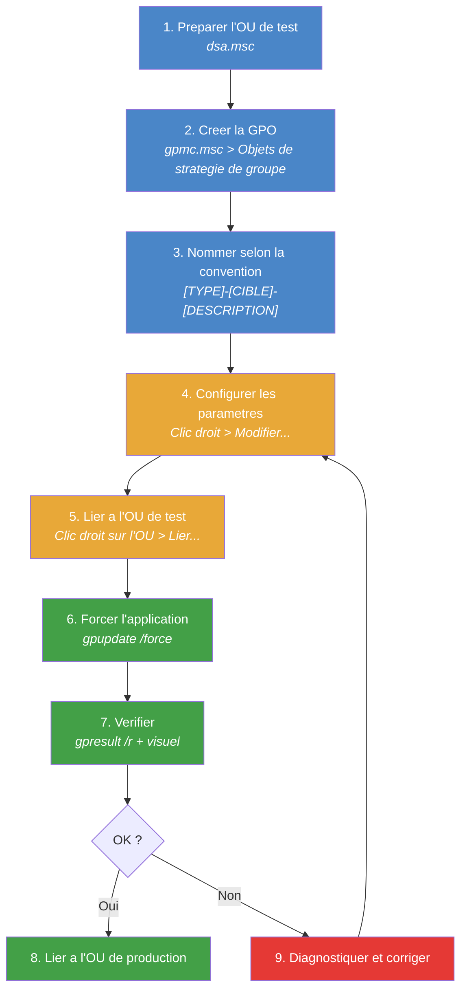

# Creer et lier sa premiere GPO

!!! abstract "Ce que vous allez apprendre"
    - Preparer un environnement de test isole avant toute manipulation
    - Creer une GPO dans la console GPMC et lui donner un nom clair
    - Configurer un parametre concret (fond d'ecran impose)
    - Lier la GPO a une OU et verifier son application
    - Faire la difference entre supprimer un lien et supprimer une GPO


!!! tip "Si vous ne retenez qu'une chose"
    Une bonne première GPO est simple, testable et liée d'abord à une OU de laboratoire avant toute généralisation.

---

## Le reflexe avant de commencer

On ne le repetera jamais assez : **ne testez jamais une GPO directement sur une OU de production**.

Imaginez un pilote d'avion qui testerait une nouvelle manoeuvre avec 200 passagers a bord. Absurde, non ? C'est pourtant exactement ce que font beaucoup d'administrateurs quand ils lient une GPO non testee sur l'OU qui contient tous les postes de l'entreprise.

Le reflexe a adopter est simple : **on teste d'abord dans une OU dediee**, avec un seul poste et un seul utilisateur. Si tout fonctionne, on elargit. Si ca casse, on n'a impacte personne.

Voici les trois scenarios possibles quand on deploie une GPO :

| Scenario | Consequence | Temps de resolution |
|:--------:|:-----------:|:-------------------:|
| GPO testee dans une OU de test, tout va bien | On deploie sereinement en production | 0 min |
| GPO testee dans une OU de test, ca casse | On corrige tranquillement, personne n'est impacte | 10-30 min |
| GPO deployee directement en production, ca casse | 200 postes impactes, tickets en cascade, manager au telephone | 2-8 h |

La conclusion s'impose d'elle-meme.

!!! danger "Regle d'or"
    Ne liez **jamais** une GPO non testee a une OU de production. Creez toujours une OU de test avec un poste et un utilisateur sacrifiables. C'est 5 minutes de preparation qui peuvent vous eviter des heures de depannage.

!!! quote "En resume"
    - Toujours tester dans une OU isolee avant de deployer en production.
    - Un seul poste + un seul utilisateur suffisent pour valider une GPO.
    - 5 minutes de preparation valent mieux que 3 heures de rollback.

---

## Preparer l'environnement de test

Avant de creer notre premiere GPO, on va construire un petit bac a sable dans Active Directory. Ce sera notre terrain d'experimentation pour tout le reste du livre.

### Creer l'OU de test

!!! example "Pas a pas"

    **Etape 1** : Ouvrir la console Active Directory Users and Computers.

    Appuyez sur ++win+r++, tapez `dsa.msc` et appuyez sur ++enter++.

    **Etape 2** : Creer l'OU de test a la racine du domaine.

    1. Dans le panneau de gauche, faites un clic droit sur le nom de votre domaine (ex. : `labo.local`)
    2. Selectionnez **Nouveau** > **Unite d'organisation**
    3. Nommez-la `OU-Test-GPO`
    4. Laissez cochee l'option **Proteger le conteneur contre la suppression accidentelle**
    5. Cliquez **OK**

    **Etape 3** : Deplacer un poste de test dans cette OU.

    1. Trouvez un poste de test dans votre arborescence (par exemple `PC-TEST-01`)
    2. Clic droit sur le poste > **Deplacer...**
    3. Selectionnez `OU-Test-GPO`
    4. Cliquez **OK**

    **Etape 4** : Deplacer un utilisateur de test dans cette OU.

    1. Trouvez un compte utilisateur de test (par exemple `u.test`)
    2. Clic droit > **Deplacer...**
    3. Selectionnez `OU-Test-GPO`
    4. Cliquez **OK**

!!! tip "Pas de poste de test ?"
    Si vous n'avez pas de poste de test disponible, vous pouvez creer une machine virtuelle avec Windows 10 ou 11, la joindre au domaine, puis la deplacer dans l'OU de test. C'est la solution la plus sure.

!!! warning "Ne pas utiliser un compte administrateur de domaine comme compte de test"
    Utilisez un compte utilisateur **standard** pour les tests, pas un compte admin. Les comptes administrateurs de domaine sont proteges par des mecanismes speciaux qui peuvent fausser les resultats. On veut tester ce que verront les **vrais utilisateurs**, pas les admins.

Votre arborescence devrait maintenant ressembler a ceci :

```
labo.local
├── OU-Test-GPO
│   ├── PC-TEST-01     (ordinateur)
│   └── u.test         (utilisateur)
├── Computers
├── Domain Controllers
├── Users
└── ...
```

!!! quote "En resume"
    - Creez une OU nommee `OU-Test-GPO` a la racine du domaine avec `dsa.msc`.
    - Deplacez-y un poste et un utilisateur de test.
    - Cette OU servira de bac a sable pour toutes vos experimentations.

---

## Creer une GPO

Maintenant que le terrain de jeu est pret, on passe a la creation de notre premiere GPO. On va creer une strategie qui impose un fond d'ecran specifique.

!!! example "Pas a pas"

    **Etape 1** : Ouvrir la console GPMC.

    Appuyez sur ++win+r++, tapez `gpmc.msc` et appuyez sur ++enter++.

    **Etape 2** : Naviguer vers le conteneur des GPO.

    Dans le panneau de gauche, developpez :

    **Foret** > **Domaines** > **labo.local** > **Objets de strategie de groupe**

    Ce conteneur liste toutes les GPO existantes dans le domaine. Vous y trouverez deja deux GPO par defaut :

    - `Default Domain Policy`
    - `Default Domain Controllers Policy`

    **Etape 3** : Creer la nouvelle GPO.

    1. Clic droit sur **Objets de strategie de groupe**
    2. Selectionnez **Nouveau**
    3. Dans le champ **Nom**, tapez : `GPO-Test-FondEcran`
    4. Laissez **Objet GPO de demarrage source** sur **(aucun)**
    5. Cliquez **OK**

    La GPO apparait dans la liste. Elle existe, mais elle est **vide** et **non liee**. Pour l'instant, elle ne fait strictement rien.

!!! warning "GPO creee ≠ GPO appliquee"
    Creer une GPO, c'est comme imprimer une affiche. Tant que vous ne l'avez pas accrochee quelque part (= liee a une OU), personne ne la voit. C'est une erreur tres frequente chez les debutants : creer une GPO, la configurer... et oublier de la lier.

!!! info "Ou est stockee la GPO ?"
    Quand vous creez une GPO, Windows stocke ses donnees a deux endroits :

    - **Active Directory** : les metadonnees de la GPO (nom, liens, filtres de securite...) sont stockees dans le conteneur `CN=Policies,CN=System,DC=labo,DC=local`
    - **SYSVOL** : les fichiers de configuration (les parametres que vous avez configures) sont stockes dans `\\labo.local\SYSVOL\labo.local\Policies\{GUID-de-la-GPO}`

    Pas besoin de retenir ca pour l'instant, mais ca explique pourquoi la replication entre controleurs de domaine est importante.

!!! quote "En resume"
    - On cree les GPO dans `gpmc.msc`, sous le conteneur **Objets de strategie de groupe**.
    - Une GPO nouvellement creee est **vide** et **non liee** : elle n'a aucun effet.
    - Il faudra la configurer (section suivante) puis la lier a une OU pour qu'elle s'applique.

---

## Nommer correctement ses GPO

Vous avez actuellement 3 GPO. Ca va. Mais dans un an, vous en aurez peut-etre 50. Dans trois ans, 200. Et si chacune s'appelle `Nouvelle GPO (1)`, `test truc`, ou `GPO de Pierre`... bon courage pour s'y retrouver.

Un bon nommage, c'est un investissement. Ca prend 30 secondes de plus a la creation, et ca fait gagner des heures quand il faut diagnostiquer un probleme a 23h un vendredi soir.

### La convention de nommage

Adoptez une convention des le depart. Une methode simple et efficace :

```
[TYPE]-[CIBLE]-[DESCRIPTION]
```

- **TYPE** : la categorie fonctionnelle de la GPO
- **CIBLE** : a qui ou a quoi elle s'applique
- **DESCRIPTION** : ce qu'elle fait, en quelques mots

### Les types courants

Voici les prefixes les plus utilises. Adaptez-les a votre contexte :

| Type | Signification | Exemple d'utilisation |
|:----:|:-------------:|:---------------------:|
| `SEC` | Securite | Politique de mot de passe, verrouillage de compte |
| `CFG` | Configuration | Fond d'ecran, page d'accueil, parametres d'affichage |
| `APP` | Application | Deploiement ou configuration de logiciels |
| `RES` | Restriction | Blocage du panneau de configuration, du registre |
| `NET` | Reseau | Configuration proxy, pare-feu, Wi-Fi |
| `AUD` | Audit | Activation des journaux d'audit |
| `IMP` | Impression | Deploiement d'imprimantes |
| `SCR` | Script | Scripts de connexion/deconnexion |

### Exemples concrets

| Nom de la GPO | Signification |
|:-------------:|:-------------:|
| `SEC-Postes-PolitiqueMDP` | Securite : politique de mot de passe sur les postes |
| `CFG-Utilisateurs-FondEcran` | Configuration : fond d'ecran impose aux utilisateurs |
| `APP-Postes-Chrome` | Application : deploiement de Chrome sur les postes |
| `RES-Utilisateurs-BlocagePanneau` | Restriction : blocage du panneau de configuration |
| `NET-Postes-ConfigProxy` | Reseau : configuration du proxy sur les postes |
| `SEC-DC-AuditConnexions` | Securite : audit des connexions sur les DC |
| `CFG-Postes-AlimentationEcran` | Configuration : mise en veille de l'ecran sur les postes |
| `IMP-Postes-ComptaHP4050` | Impression : deploiement de l'imprimante HP 4050 au service comptabilite |

!!! tip "Coherence avant tout"
    La convention que vous choisissez importe moins que le fait de **s'y tenir**. Que vous utilisiez `SEC-Postes-MDP` ou `Securite_Postes_MotDePasse`, l'essentiel est que toute l'equipe suive la meme logique.

### Les erreurs de nommage a eviter

| Mauvais nom | Pourquoi c'est mauvais | Meilleure alternative |
|:-----------:|:----------------------:|:---------------------:|
| `Nouvelle GPO` | Aucune indication du contenu | `CFG-Postes-AlimentationEcran` |
| `test` | Lequel ? Il y en a 15 qui s'appellent "test" | `CFG-Test-FondEcran` |
| `GPO de Pierre` | Pierre est parti. Personne ne sait ce que fait sa GPO | `APP-Postes-Chrome` |
| `fdezajiofd` | Sans commentaire | N'importe quoi d'autre |
| `Do Not Delete!!!` | Ca donne envie de la supprimer, et ca ne dit rien du contenu | `SEC-DC-AuditKerberos` |

!!! quote "En resume"
    - Adoptez une convention de nommage **des le depart** : `[TYPE]-[CIBLE]-[DESCRIPTION]`.
    - Les types courants sont `SEC`, `CFG`, `APP`, `RES`, `NET`, `AUD`.
    - La coherence est plus importante que le format exact.

---

## Configurer un parametre

Notre GPO `GPO-Test-FondEcran` existe mais elle est vide. On va maintenant lui donner du contenu : imposer un fond d'ecran specifique a tous les utilisateurs cibles.

### Preparer le fichier image

Avant de configurer la GPO, il faut que l'image soit accessible a tous les postes du domaine. On la place sur un partage reseau.

Pour notre test, on va utiliser le partage SYSVOL, qui est disponible sur tous les postes du domaine par defaut :

1. Copiez une image JPG sur votre controleur de domaine, par exemple dans :
   `C:\Windows\SYSVOL\sysvol\labo.local\scripts\wallpaper.jpg`
2. Le chemin UNC correspondant sera : `\\labo.local\SYSVOL\labo.local\scripts\wallpaper.jpg`
3. Depuis un poste du domaine, verifiez l'acces avec :

```cmd
dir \\labo.local\SYSVOL\labo.local\scripts\wallpaper.jpg
```

```title="Resultat attendu"
 Le volume dans le lecteur \\labo.local\SYSVOL n'a pas de nom.

 Repertoire de \\labo.local\SYSVOL\labo.local\scripts

05/04/2026  14:15           245 832 wallpaper.jpg
               1 fichier(s)          245 832 octets
```

Si la commande retourne une erreur, le fichier n'est pas au bon endroit ou le poste n'arrive pas a joindre le partage.

!!! warning "Le chemin doit etre un chemin UNC"
    Le chemin vers l'image doit etre un chemin reseau (UNC) accessible par tous les postes, comme `\\serveur\partage\wallpaper.jpg`. Un chemin local (`C:\Images\...`) ne fonctionnera que sur la machine ou se trouve le fichier.

!!! tip "SYSVOL vs partage dedie"
    Pour un test, SYSVOL convient parfaitement. En production, privilegiez un partage dedie (ex. : `\\serveur\Ressources$\Wallpapers\`) avec les bonnes permissions. SYSVOL est replique entre tous les DC, ce qui est pratique mais pas ideal pour stocker des fichiers volumineux.

### Modifier la GPO

!!! example "Pas a pas"

    **Etape 1** : Ouvrir l'editeur de GPO.

    Dans `gpmc.msc`, sous **Objets de strategie de groupe**, faites un clic droit sur `GPO-Test-FondEcran` et selectionnez **Modifier...**

    L'editeur de gestion des strategies de groupe s'ouvre. C'est une fenetre a deux panneaux, similaire a `gpedit.msc` mais appliquee a une GPO du domaine.

    **Etape 2** : Naviguer vers le parametre.

    Dans le panneau de gauche, developpez :

    **Configuration utilisateur** > **Strategies** > **Modeles d'administration** > **Bureau** > **Bureau**

    Oui, il y a deux fois "Bureau". Le premier est la categorie generale, le second est le sous-dossier qui contient les parametres specifiques au bureau Windows (fond d'ecran, icones, etc.). C'est deroutant la premiere fois, mais on s'y habitue vite.

    **Etape 3** : Configurer le fond d'ecran.

    1. Dans le panneau de droite, double-cliquez sur **Papier peint du Bureau**
    2. Selectionnez **Active**
    3. Dans le champ **Nom du papier peint**, tapez le chemin UNC :
       `\\serveur\partage\wallpaper.jpg`
    4. Dans la liste deroulante **Style du papier peint**, selectionnez **Etendu**
    5. Cliquez **OK**

    **Etape 4** : Verifier l'etat.

    De retour dans le panneau de droite, la colonne **Etat** du parametre doit indiquer **Active**.

!!! tip "Configuration utilisateur vs Configuration ordinateur"
    Chaque GPO a deux grandes sections : **Configuration ordinateur** (s'applique aux comptes d'ordinateurs) et **Configuration utilisateur** (s'applique aux comptes d'utilisateurs). Le fond d'ecran est un reglage **utilisateur**, donc on le configure dans la section correspondante.

Le parametre est configure. Mais la GPO n'est toujours liee nulle part. Passons a l'etape suivante.

### Les 3 etats d'un parametre

Quand vous ouvrez un parametre dans l'editeur de GPO, il peut avoir trois etats :

| Etat | Signification | Icone |
|:----:|:-------------:|:-----:|
| **Non configure** | La GPO ne touche pas a ce parametre. La valeur par defaut du systeme s'applique. | Gris |
| **Active** | La GPO applique activement ce parametre avec la valeur que vous avez definie. | Vert |
| **Desactive** | La GPO force explicitement la desactivation de ce parametre. | Rouge |

!!! warning "Non configure ≠ Desactive"
    C'est une confusion classique. **Non configure** signifie "je ne m'en occupe pas". **Desactive** signifie "je force la desactivation". La difference est cruciale quand plusieurs GPO s'appliquent au meme objet (on verra ca au chapitre 6).

!!! quote "En resume"
    - On modifie une GPO via clic droit > **Modifier...** dans la GPMC.
    - Le parametre du fond d'ecran se trouve dans **Configuration utilisateur** > **Strategies** > **Modeles d'administration** > **Bureau** > **Bureau**.
    - L'image doit etre sur un **partage reseau** (chemin UNC).
    - Tant que la GPO n'est pas liee, le parametre n'a aucun effet.

---

## Lier la GPO a une OU

C'est le moment ou tout prend vie. On va connecter notre GPO configuree a l'OU de test.

!!! example "Pas a pas"

    **Etape 1** : Dans `gpmc.msc`, naviguez vers votre OU de test.

    Developpez : **Foret** > **Domaines** > **labo.local** > **OU-Test-GPO**

    **Etape 2** : Lier la GPO.

    1. Clic droit sur **OU-Test-GPO**
    2. Selectionnez **Lier un objet de strategie de groupe existant...**
    3. Dans la liste, selectionnez `GPO-Test-FondEcran`
    4. Cliquez **OK**

    La GPO apparait maintenant sous l'OU avec une petite icone de raccourci (une fleche). Ca confirme que c'est bien un **lien** vers la GPO, pas la GPO elle-meme.

!!! info "Une GPO, plusieurs liens"
    Une meme GPO peut etre liee a **plusieurs OU** simultanement. Par exemple, si vous voulez imposer le meme fond d'ecran aux utilisateurs de Paris et de Lyon, vous creez **une seule GPO** et vous la liez aux deux OU. Pas besoin de creer deux GPO identiques.

    C'est justement la force du systeme : la GPO est un objet central, les liens sont des raccourcis vers cet objet.

### Le flux complet

Voici ce qui va se passer maintenant que la GPO est liee :


Trois phases distinctes :

1. **Preparation** (bleu) : on cree et on configure la GPO dans la GPMC
2. **Distribution** (orange) : on lie la GPO a une OU et le controleur de domaine replique l'information vers les autres DC
3. **Application** (vert) : le poste client contacte un DC, recupere la GPO et applique les parametres

C'est un flux **unidirectionnel** : le poste ne renvoie jamais de donnees au controleur de domaine. Il se contente de lire et d'appliquer.

!!! warning "Pas instantane !"
    L'application n'est pas immediate. Par defaut, les postes clients interrogent les controleurs de domaine toutes les **90 minutes** (+ un delai aleatoire de 0 a 30 minutes) pour recuperer les mises a jour de GPO. Les controleurs de domaine, eux, rafraichissent toutes les **5 minutes**.

    On peut forcer l'application, c'est ce qu'on va voir juste apres.

!!! quote "En resume"
    - On lie une GPO via clic droit sur l'OU > **Lier un objet de strategie de groupe existant...**
    - Le lien apparait sous l'OU avec une icone de raccourci.
    - L'application prend effet apres replication et rafraichissement (jusqu'a 120 minutes par defaut).
    - On peut forcer l'application avec `gpupdate /force`.

---

## Forcer l'application

Attendre 90 minutes pour voir si ca marche ? Non merci. On va forcer le poste de test a recuperer la GPO immediatement.

### Sur le poste de test

Connectez-vous sur `PC-TEST-01` avec le compte `u.test`, puis ouvrez une **Invite de commandes** (++win+r++ > `cmd` > ++enter++) et tapez :

```cmd
gpupdate /force
```

```title="Resultat attendu"
Mise a jour de la strategie...

La mise a jour de la strategie de l'ordinateur s'est terminee.
La mise a jour de la strategie de l'utilisateur s'est terminee.
```

La commande force le poste a contacter le controleur de domaine **immediatement** pour recuperer toutes les GPO qui le concernent, sans attendre le prochain cycle de rafraichissement.

!!! info "Et si l'utilisateur n'est pas admin local ?"
    `gpupdate /force` ne necessite **pas** de droits administrateur pour etre execute. N'importe quel utilisateur peut forcer le rafraichissement de ses propres GPO. C'est pratique pour les tests avec un compte standard.

### Que fait `/force` exactement ?

| Commande | Comportement |
|:--------:|:------------:|
| `gpupdate` | Applique uniquement les GPO qui ont **change** depuis la derniere application |
| `gpupdate /force` | Reapplique **toutes** les GPO, meme celles qui n'ont pas change |

!!! tip "Quand utiliser `/force` ?"
    En phase de test, utilisez toujours `/force`. En production, un simple `gpupdate` suffit generalement, car il est plus leger : il ne reapplique que ce qui a change.

!!! warning "Certains parametres necessitent une deconnexion ou un redemarrage"
    Les parametres de la section **Configuration utilisateur** sont generalement appliques a l'ouverture de session. Si `gpupdate /force` ne suffit pas, deconnectez-vous et reconnectez-vous. Les parametres **Configuration ordinateur** peuvent necessiter un redemarrage complet du poste.

    En cas de doute, `gpupdate /force` vous indiquera si une deconnexion ou un redemarrage est necessaire :

    ```title="Exemple de message"
    La mise a jour de la strategie de l'utilisateur s'est terminee.
    Pour que certaines modifications prennent effet, vous devez
    fermer la session et ouvrir une nouvelle session.
    ```

!!! quote "En resume"
    - `gpupdate /force` force l'application immediate de toutes les GPO sur le poste.
    - Certains parametres necessitent une **deconnexion** ou un **redemarrage** pour prendre effet.
    - En test, utilisez toujours `/force`. En production, `gpupdate` (sans `/force`) suffit.

---

## Verifier le resultat

On a cree la GPO, on l'a configuree, liee et forcee. Mais est-ce que ca marche vraiment ? Trois methodes de verification, de la plus simple a la plus detaillee.

### Methode 1 : la verification visuelle

La plus evidente. Le fond d'ecran a-t-il change ?

Si oui : la GPO fonctionne. Si non : on passe aux methodes suivantes pour comprendre pourquoi.

!!! tip "Forcer le rafraichissement du bureau"
    Parfois le fond d'ecran ne change pas immediatement, meme apres `gpupdate /force`. Essayez de verrouiller la session (++win+l++) puis de vous reconnecter. Les parametres utilisateur sont souvent appliques a l'ouverture de session.

### Methode 2 : `gpresult /r`

Cette commande affiche un rapport des GPO appliquees sur le poste. Ouvrez une invite de commandes et tapez :

```cmd
gpresult /r
```

```title="Resultat attendu"
Informations sur le systeme d'exploitation de l'utilisateur connecte

    Nom de l'ordinateur :           PC-TEST-01
    Nom du domaine :                labo.local
    Site du domaine :               Default-First-Site-Name
    Profil local :                  C:\Users\u.test
    Profil itinerant :              (Aucun)

    ...

RESULTAT UTILISATEUR
--------------------

    Derniere application de la strategie de groupe :    05/04/2026 a 14:32:15
    Application de la strategie de groupe a partir de : DC01.labo.local
    Seuil du lien lent du domaine :                     500 Kbits/s

    Objets de strategie de groupe appliques
    ----------------------------------------
        GPO-Test-FondEcran
        Default Domain Policy

    ...
```

!!! tip "Verifier un utilisateur ou un ordinateur specifique"
    Par defaut, `gpresult /r` affiche les GPO pour l'utilisateur connecte et l'ordinateur. Vous pouvez cibler un scope precis :

    - `gpresult /r /scope:user` : uniquement les GPO utilisateur
    - `gpresult /r /scope:computer` : uniquement les GPO ordinateur

Si `GPO-Test-FondEcran` apparait dans la liste **Objets de strategie de groupe appliques**, c'est bon. Si elle apparait dans la liste **Objets refuses**, il y a un probleme de filtrage ou de lien.

!!! tip "Generer un rapport HTML plus lisible"
    Pour un rapport plus complet et plus lisible, vous pouvez generer un fichier HTML :

    ```cmd
    gpresult /h C:\rapport-gpo.html
    ```

    Ouvrez ensuite `C:\rapport-gpo.html` dans un navigateur. Le rapport est interactif : vous pouvez developper chaque GPO pour voir exactement quels parametres elle a appliques, et quelles valeurs ont ete definies. C'est beaucoup plus detaille que `gpresult /r`.

### Methode 3 : l'Observateur d'evenements

Pour un diagnostic plus fin, Windows enregistre chaque etape du traitement des GPO dans les journaux.

1. Ouvrez l'**Observateur d'evenements** (++win+r++ > `eventvwr.msc`)
2. Naviguez vers : **Journaux des applications et des services** > **Microsoft** > **Windows** > **GroupPolicy** > **Operational**
3. Cherchez l'evenement **4016** (pour les parametres utilisateur) ou **5016** (pour les parametres ordinateur)
4. Double-cliquez sur l'evenement pour voir les details, notamment le nom de la GPO appliquee et le temps de traitement

| ID evenement | Signification |
|:------------:|:-------------:|
| 4016 | La strategie utilisateur a ete appliquee avec succes |
| 5016 | La strategie ordinateur a ete appliquee avec succes |
| 7016 | Un parametre de modele d'administration a ete applique |
| 1006 | Le traitement de la strategie a echoue (erreur reseau, etc.) |

!!! quote "En resume"
    - **Methode visuelle** : rapide mais limitee (le fond d'ecran a-t-il change ?).
    - **`gpresult /r`** : affiche la liste des GPO appliquees et refusees.
    - **Observateur d'evenements** : le diagnostic le plus detaille, evenements 4016/5016.
    - Si la GPO apparait dans "Objets refuses" au lieu de "Objets appliques", il y a un probleme de filtrage.

---

## Annuler : supprimer le lien vs supprimer la GPO

C'est l'une des confusions les plus dangereuses pour un debutant. Il y a une **enorme** difference entre supprimer un lien et supprimer une GPO. Se tromper peut avoir des consequences catastrophiques, surtout si la GPO est liee a plusieurs OU.

### L'analogie du poster

Imaginez que votre GPO est un **poster** que vous avez accroche dans une salle de reunion.

- **Supprimer le lien** = retirer le poster de cette salle. Le poster existe toujours, vous pouvez l'accrocher ailleurs.
- **Supprimer la GPO** = passer le poster a la broyeuse. Il n'existe plus nulle part.

### La difference en tableau

| Action | Comment faire | Effet | La GPO existe encore ? | Les autres liens sont touches ? |
|:------:|:-------------:|:-----:|:----------------------:|:-------------------------------:|
| Supprimer le lien | Clic droit sur le lien sous l'OU > **Supprimer** | La GPO ne s'applique plus a cette OU | **Oui** | **Non** |
| Supprimer la GPO | Clic droit sur la GPO dans "Objets de strategie de groupe" > **Supprimer** | La GPO est supprimee de tout le domaine | **Non** | **Oui**, tous les liens sont supprimes |

### Supprimer le lien (methode sure)

!!! example "Pas a pas"

    1. Dans `gpmc.msc`, naviguez vers **OU-Test-GPO**
    2. Sous l'OU, vous voyez le lien `GPO-Test-FondEcran` (avec l'icone de raccourci)
    3. Clic droit sur le lien > **Supprimer**
    4. Confirmez en cliquant **OK**

    Le lien disparait. La GPO existe toujours dans le conteneur **Objets de strategie de groupe** et peut etre reliee ailleurs.

### Supprimer la GPO (methode definitive)

!!! danger "Attention : action irreversible"
    Supprimer une GPO la supprime **definitivement** de tout le domaine. Tous les liens vers cette GPO, dans toutes les OU, sont automatiquement supprimes. Il n'y a pas de corbeille, pas de "Ctrl+Z". La seule facon de la recuperer est de la restaurer depuis une sauvegarde (qu'on verra au chapitre 11).

Pour supprimer une GPO :

1. Dans `gpmc.msc`, naviguez vers **Objets de strategie de groupe**
2. Clic droit sur `GPO-Test-FondEcran` > **Supprimer**
3. Le message d'avertissement vous previent que **tous les liens** seront supprimes
4. Confirmez uniquement si vous etes certain de ne plus en avoir besoin

### Desactiver un lien (la troisieme option)

Il existe aussi une option intermediaire : **desactiver** le lien sans le supprimer. C'est pratique pour tester.

1. Clic droit sur le lien sous l'OU
2. Selectionnez **Lien active** pour decocher l'option

Le lien reste visible mais apparait avec une icone grisee. La GPO ne s'applique plus a cette OU, mais le lien est toujours la, pret a etre reactive.

| Methode | Quand l'utiliser | Reversible ? |
|:-------:|:----------------:|:------------:|
| Desactiver le lien | Test temporaire, maintenance planifiee | Oui, un clic suffit |
| Supprimer le lien | La GPO n'a plus besoin de s'appliquer a cette OU | Oui, on peut re-lier |
| Supprimer la GPO | La GPO n'a plus aucune utilite dans le domaine | Non, irreversible |

!!! quote "En resume"
    - **Supprimer le lien** = detacher la GPO d'une OU. La GPO existe toujours.
    - **Supprimer la GPO** = la detruire completement du domaine. Tous les liens disparaissent. Irreversible.
    - **Desactiver le lien** = l'option intermediaire : le lien reste mais est inactif.
    - En cas de doute, commencez par **desactiver le lien**. C'est la methode la plus sure.

---

## Exercice complet guide

Vous avez vu toutes les etapes individuellement. On va maintenant les enchainer dans un exercice complet, de A a Z, avec une GPO differente.

**Objectif** : creer une GPO qui desactive les notifications toast (les petites bulles en bas a droite de l'ecran), la lier a l'OU de test, verifier qu'elle s'applique, puis la supprimer proprement.

**Duree estimee** : 10-15 minutes.

**Prerequis** : l'OU de test `OU-Test-GPO` est en place avec un poste et un utilisateur (section "Preparer l'environnement de test" ci-dessus).

Suivez chaque etape dans l'ordre. Si une etape echoue, ne passez pas a la suivante : corrigez d'abord le probleme.

### Etape 1 : Creer la GPO

1. Ouvrez `gpmc.msc`
2. Naviguez vers **Objets de strategie de groupe**
3. Clic droit > **Nouveau**
4. Nom : `CFG-Utilisateurs-DesactiverNotifications`
5. Cliquez **OK**

### Etape 2 : Configurer le parametre

1. Clic droit sur `CFG-Utilisateurs-DesactiverNotifications` > **Modifier...**
2. Naviguez vers : **Configuration utilisateur** > **Strategies** > **Modeles d'administration** > **Menu Demarrer et barre des taches** > **Notifications**
3. Double-cliquez sur **Desactiver les notifications par toast**
4. Selectionnez **Active**
5. Cliquez **OK**
6. Fermez l'editeur

### Etape 3 : Lier a l'OU de test

1. Dans `gpmc.msc`, naviguez vers **OU-Test-GPO**
2. Clic droit > **Lier un objet de strategie de groupe existant...**
3. Selectionnez `CFG-Utilisateurs-DesactiverNotifications`
4. Cliquez **OK**

### Etape 4 : Forcer et verifier

Sur le poste `PC-TEST-01`, connecte avec `u.test` :

```cmd
gpupdate /force
```

```title="Resultat attendu"
Mise a jour de la strategie...

La mise a jour de la strategie de l'ordinateur s'est terminee.
La mise a jour de la strategie de l'utilisateur s'est terminee.
```

Verifiez avec `gpresult /r` :

```cmd
gpresult /r /scope:user
```

```title="Resultat attendu"
RESULTAT UTILISATEUR
--------------------

    Derniere application de la strategie de groupe :    05/04/2026 a 14:45:22
    Application de la strategie de groupe a partir de : DC01.labo.local

    Objets de strategie de groupe appliques
    ----------------------------------------
        CFG-Utilisateurs-DesactiverNotifications
        GPO-Test-FondEcran
        Default Domain Policy
```

La GPO `CFG-Utilisateurs-DesactiverNotifications` apparait dans la liste ? Parfait.

Pour verifier visuellement : essayez de declencher une notification (changer le volume, brancher une cle USB...). Si les notifications toast sont desactivees, vous ne verrez rien apparaitre en bas a droite.

### Etape 5 : Nettoyer

1. Dans `gpmc.msc`, naviguez vers **OU-Test-GPO**
2. Clic droit sur le lien `CFG-Utilisateurs-DesactiverNotifications` > **Supprimer**
3. Confirmez

Le lien est supprime, mais la GPO existe toujours dans **Objets de strategie de groupe**. Les notifications reviendront au prochain `gpupdate /force` (ou au prochain cycle de rafraichissement automatique) sur le poste de test.

Pour verifier que le lien a bien ete supprime, executez `gpresult /r /scope:user` sur le poste de test apres un `gpupdate /force`. La GPO `CFG-Utilisateurs-DesactiverNotifications` ne devrait plus apparaitre dans les objets appliques.

!!! tip "Allez plus loin"
    Essayez de refaire l'exercice avec un parametre **Configuration ordinateur** cette fois. Par exemple, desactivez l'ecran de verrouillage : **Configuration ordinateur** > **Strategies** > **Modeles d'administration** > **Panneau de configuration** > **Personnalisation** > **Ne pas afficher l'ecran de verrouillage**. Vous constaterez qu'un redemarrage du poste est necessaire pour ce type de parametre.

!!! danger "Attention a ne pas confondre les exercices"
    Si vous avez suivi cet exercice apres avoir configure le fond d'ecran, votre OU de test a maintenant **deux liens** : `GPO-Test-FondEcran` et `CFG-Utilisateurs-DesactiverNotifications`. Pensez a nettoyer les liens dont vous n'avez plus besoin pour garder un environnement de test propre.

!!! quote "En resume"
    - Vous avez enchaine les 5 etapes du cycle de vie d'une GPO : creer, configurer, lier, verifier, nettoyer.
    - La commande `gpresult /r /scope:user` confirme que la GPO est bien appliquee.
    - Supprimer le lien suffit pour annuler l'effet sans detruire la GPO.

---

## Les pieges frequents du debutant

Avant de passer au recapitulatif, voici les erreurs les plus courantes que font les debutants. On les a presque toutes mentionnees dans ce chapitre, mais les rassembler ici permet de s'y referer rapidement.

| Piege | Symptome | Solution |
|:-----:|:--------:|:--------:|
| Oublier de lier la GPO | La GPO est configuree mais n'a aucun effet | Verifier qu'un lien existe sous l'OU cible |
| Lier a la mauvaise OU | Le parametre s'applique aux mauvaises personnes/machines | Verifier l'emplacement du lien dans la GPMC |
| Parametre dans la mauvaise section | GPO liee a une OU de postes, mais parametre configure dans "Configuration utilisateur" | Les parametres utilisateur s'appliquent la ou se trouvent les **comptes utilisateurs**, pas les postes |
| Chemin UNC incorrect | Le fond d'ecran ne s'applique pas, erreur dans le journal | Verifier que le partage est accessible : `dir \\serveur\partage\` |
| Supprimer la GPO au lieu du lien | La GPO disparait de toutes les OU | Toujours supprimer le **lien** sauf si on veut vraiment detruire la GPO |
| Ne pas attendre la replication | La GPO fonctionne depuis un DC mais pas l'autre | Patienter ou forcer la replication avec `repadmin /syncall` |
| Tester avec un compte admin | Les resultats ne refletent pas l'experience des vrais utilisateurs | Utiliser un compte utilisateur standard pour les tests |

!!! tip "Un doute ? Utilisez `gpresult /h`"
    En cas de comportement inattendu, generez toujours un rapport HTML avec `gpresult /h C:\diag.html`. Il vous dira exactement quelles GPO ont ete appliquees, quelles GPO ont ete refusees, et pourquoi. C'est votre meilleur outil de diagnostic a ce stade.

!!! quote "En resume"
    - La plupart des problemes viennent d'un oubli de lien, d'un mauvais placement (OU ou section), ou d'un chemin reseau incorrect.
    - `gpresult /h` est votre meilleur ami pour diagnostiquer les problemes de GPO.
    - En cas de doute, revenez a cette checklist avant de chercher des causes complexes.

---

## Recapitulatif du workflow

Voici le flux complet de creation d'une GPO, de A a Z :



### Checklist avant deploiement en production

Utilisez cette checklist a chaque nouvelle GPO avant de la deployer en production :

| # | Verification | Fait ? |
|:-:|:-------------|:------:|
| 1 | La GPO a un nom conforme a la convention de nommage | :material-checkbox-blank-outline: |
| 2 | Les parametres sont configures dans la bonne section (ordinateur vs utilisateur) | :material-checkbox-blank-outline: |
| 3 | La GPO a ete testee sur l'OU de test | :material-checkbox-blank-outline: |
| 4 | `gpresult /r` confirme que la GPO apparait dans les "Objets appliques" | :material-checkbox-blank-outline: |
| 5 | Le parametre a ete verifie visuellement ou fonctionnellement sur le poste de test | :material-checkbox-blank-outline: |
| 6 | Aucun effet de bord indesirable n'a ete constate | :material-checkbox-blank-outline: |
| 7 | Le lien sur l'OU de test a ete supprime ou desactive apres validation | :material-checkbox-blank-outline: |
| 8 | La documentation interne a ete mise a jour (objectif de la GPO, parametres configures) | :material-checkbox-blank-outline: |

### Les commandes essentielles

| Commande | Utilite |
|:--------:|:-------:|
| `dsa.msc` | Ouvrir Active Directory Users and Computers |
| `gpmc.msc` | Ouvrir la console de gestion des strategies de groupe |
| `gpupdate /force` | Forcer l'application immediate de toutes les GPO |
| `gpresult /r` | Afficher les GPO appliquees sur le poste |
| `gpresult /r /scope:user` | Afficher uniquement les GPO utilisateur |
| `gpresult /r /scope:computer` | Afficher uniquement les GPO ordinateur |
| `gpresult /h C:\rapport.html` | Generer un rapport HTML detaille |
| `eventvwr.msc` | Ouvrir l'Observateur d'evenements |

---
!!! quote "En resume"
    | Concept | Ce qu'il faut retenir |
    |---------|----------------------|
    | OU de test | Toujours tester dans une OU isolee avant de deployer |
    | Creer une GPO | `gpmc.msc` > Objets de strategie de groupe > Nouveau |
    | Convention de nommage | `[TYPE]-[CIBLE]-[DESCRIPTION]` |
    | Configurer | Clic droit sur la GPO > Modifier... |
    | Lier | Clic droit sur l'OU > Lier un objet existant... |
    | Forcer | `gpupdate /force` sur le poste cible |
    | Verifier | `gpresult /r` + verification visuelle |
    | Supprimer un lien | Detache la GPO de l'OU (la GPO existe toujours) |
    | Desactiver un lien | Le lien reste visible mais inactif (reactiver en un clic) |
    | Supprimer une GPO | Destruction definitive, tous les liens disparaissent |

---

## Et maintenant ?

Felicitations, vous avez cree et deploye votre premiere GPO de domaine !

Vous savez creer une GPO, la configurer, la lier, la verifier et la nettoyer. C'est le cycle de base que vous repeterez des centaines de fois dans votre carriere d'administrateur.

Mais un detail important vous a peut-etre echappe : que se passe-t-il quand **plusieurs GPO** s'appliquent au meme utilisateur ou au meme poste ? Si une GPO impose un fond d'ecran bleu et une autre un fond d'ecran rouge, laquelle gagne ?

C'est la question de l'**heritage** et de l'**ordre d'application**. Comprendre ce mecanisme est indispensable des que vous avez plus d'une poignee de GPO. Et c'est exactement ce que couvre le chapitre suivant.

**Chapitre suivant** : :material-arrow-right: [Comprendre l'heritage et l'ordre d'application](06-heritage.md) — Decouvrez l'ordre LSDOU, le blocage d'heritage et l'application forcee.

!!! quote "En résumé"
    - Felicitations, vous avez cree et deploye votre premiere GPO de domaine !
    - Vous savez creer une GPO, la configurer, la lier, la verifier et la nettoyer.
    - Prochaine étape utile : Comprendre l'heritage et l'ordre d'application.
    - Le bon enchaînement reste de tester le chapitre courant avant d’ouvrir le suivant.
