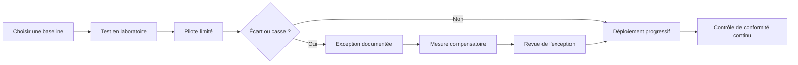

---
tags:
  - hardening
  - baselines
  - CIS
  - ANSSI
  - STIG
---

# Baselines de sécurité

!!! abstract "Ce que vous allez apprendre"
    - Définir une baseline et ses limites réelles.
    - Distinguer `CIS`, `Microsoft Security Baseline`, `STIG` et `ANSSI`.
    - Lire une recommandation de baseline sans s'arrêter au nom du paramètre.
    - Importer une baseline Microsoft avec `LGPO.exe` et vérifier un réglage via PowerShell.

Une baseline de sécurité n'est pas un dogme.
C'est un point de départ documenté.

Elle sert à éviter deux extrêmes.
Improviser chaque réglage à la main, ou appliquer un référentiel sans comprendre ce qu'il casse.

!!! info "Idée clé"
    Une baseline n'est utile que si elle est :
    - adaptée à la version exacte de l'OS ;
    - testée sur votre contexte ;
    - suivie dans le temps.

## Qu'est-ce qu'une baseline ?

Une baseline est un ensemble cohérent de paramètres recommandés.
Elle vise à établir un niveau de configuration de référence.

Dans le monde Windows, cela prend souvent la forme de :

- sauvegardes de GPO ;
- feuilles de calcul de réglages ;
- rapports HTML ;
- règles d'audit ou de sécurité ;
- contenu exploitable par des outils de conformité.

Le rôle d'une baseline est double.
Guider la configuration initiale et servir d'étalon pour la vérification continue.

Une bonne baseline répond à trois questions :

1. Quel paramètre doit être configuré ?
2. À quelle valeur exacte ?
3. Pourquoi ce choix réduit-il le risque ?

!!! tip "Ce qu'une baseline apporte vraiment"
    - Une réduction des oublis.
    - Un langage commun entre sécurité et exploitation.
    - Une base pour l'audit, le pilotage et la gestion des écarts.

### Ce qu'une baseline ne fait pas

Une baseline ne remplace pas l'analyse de risque.
Elle ne connaît ni vos logiciels métier, ni vos contraintes d'interopérabilité.

Elle ne remplace pas non plus le maintien en condition de sécurité.
Un système parfaitement aligné hier peut être obsolète demain.

Enfin, une baseline ne suffit pas à elle seule contre un attaquant déterminé.
Elle réduit le risque, mais ne constitue ni détection, ni réponse à incident.

!!! warning "Limite structurelle"
    Une baseline donne des valeurs cibles.
    Elle ne garantit pas que ces valeurs soient pertinentes pour chaque rôle serveur, chaque application ou chaque dépendance héritée.

!!! quote "En résumé"
    Une baseline est une référence de configuration, pas une vérité universelle.
    Elle vaut par sa cohérence, son contexte et sa maintenabilité.

## CIS Benchmarks

Le `Center for Internet Security` publie des benchmarks de configuration sécurisée, construits de manière communautaire et multi-éditeurs.
Ils sont très utilisés comme base d'audit.

Leur force est la standardisation.
Leur faiblesse est qu'ils restent génériques par nature.

### Niveaux L1 et L2

Le modèle CIS distingue classiquement deux niveaux.
La différence est essentielle pour éviter de tout appliquer sans discernement.

| Niveau | Intention | Effet attendu |
|---|---|---|
| `Level 1` | Mesures "practical and prudent" avec bénéfice clair | Peu ou pas d'impact fonctionnel au-delà d'un seuil acceptable |
| `Level 2` | Environnements où la sécurité prime, logique de défense en profondeur | Impact possible sur l'utilité ou la performance |

!!! info "Lecture rapide"
    `L1` est souvent un bon point de départ pour un parc bureautique ou serveur classique.
    `L2` demande presque toujours des tests plus poussés et une gestion d'exceptions plus active.

### Téléchargement et structure

Les benchmarks CIS existent généralement en PDF.
Selon le produit et l'offre, on peut aussi disposer de formats plus directement exploitables pour l'évaluation et la remédiation.

Une recommandation CIS comporte souvent :

- un identifiant ;
- un niveau `L1` ou `L2` ;
- une description ;
- une justification ;
- une méthode d'audit ;
- une remédiation ;
- un impact éventuel ;
- des références.

### Quand CIS est le plus utile

`CIS` est très adapté si vous voulez :

- un langage commun avec les auditeurs ;
- un niveau de rigueur reproductible ;
- un référentiel indépendant de l'éditeur ;
- une base de conformité sur plusieurs technologies.

!!! example "Utilisation typique"
    Une équipe sécurité peut partir du benchmark CIS pour établir une cible.
    L'équipe Windows traduit ensuite les écarts acceptés en GPO, Intune ou scripts d'industrialisation.

!!! quote "En résumé"
    `CIS` est fort pour cadrer et auditer.
    Il est moins prescriptif que Microsoft sur la mise en œuvre concrète dans un parc Windows donné.

## Microsoft Security Baseline

La baseline Microsoft est la référence la plus naturelle pour un parc Windows.
Elle est publiée dans le `Security Compliance Toolkit`, souvent abrégé `SCT` ou `MSCT`.

Microsoft la décrit comme un ensemble de paramètres recommandés, établi à partir des équipes sécurité, des équipes produit, de partenaires et de clients.
Le format est pensé pour un usage opérationnel.

### Ce que contient le toolkit

Le téléchargement Microsoft inclut typiquement :

- des archives de baseline par version de Windows ;
- `LGPO.exe` ;
- `Policy Analyzer` ;
- `SetObjectSecurity` ;
- des documents d'accompagnement ;
- des sauvegardes de GPO exploitables.

### Philosophie Microsoft

Microsoft ne cherche pas à tout verrouiller.
La baseline vise plutôt les environnements bien administrés où les utilisateurs standards n'ont pas de droits d'administration.

Le principe est pragmatique :
imposer un réglage seulement s'il réduit un risque actuel sans provoquer un coût opérationnel supérieur au risque traité.

### Formats à retenir

Quand vous extrayez une baseline Microsoft, vous rencontrez souvent :

- un dossier `GPOs` contenant des sauvegardes de GPO ;
- des rapports HTML lisibles ;
- une feuille Excel détaillant les réglages ;
- des scripts d'import AD ou local.

!!! tip "Pourquoi Microsoft est souvent le meilleur socle Windows"
    - Les réglages suivent de près les versions de l'OS.
    - Le chemin de déploiement est concret.
    - Le lien avec les GPO, `LGPO.exe` et `Policy Analyzer` est immédiat.

### Où elle excelle

Si votre besoin principal est de durcir Windows sans réinventer chaque valeur, c'est souvent la baseline la plus rentable.
Elle est particulièrement pertinente pour les postes, les serveurs membres et les contrôleurs de domaine.

!!! quote "En résumé"
    La baseline Microsoft est très adaptée au monde Windows parce qu'elle combine guidance, artefacts de déploiement et outils de comparaison.

## STIG

`STIG` signifie `Security Technical Implementation Guide`.
Le corpus est publié dans l'écosystème `DoD/DISA`.

Le niveau de rigueur y est élevé.
Le positionnement est très orienté conformité forte et environnements sensibles.

### Formats et outillage

Dans la pratique, le monde STIG s'appuie sur plusieurs types d'artefacts :

- du contenu STIG en `XCCDF` ;
- des résultats importables issus de `SCAP` ou `XCCDF` ;
- des checklists ;
- l'outil `STIG Viewer`.

Le guide utilisateur de `STIG Viewer 3.x` confirme notamment :

- le chargement de fichiers STIG `XCCDF` ;
- l'import de résultats `SCAP` ou `XCCDF` dans une checklist ;
- l'export de données de checklist ;
- le tri par `Rule ID`, `STIG ID`, sévérité et références `CCI`.

### CKL, CKLB et vocabulaire de terrain

Sur le terrain, beaucoup d'équipes parlent encore de `CKL`.
Il s'agit du terme historique le plus répandu pour la checklist STIG.

Avec `STIG Viewer 3`, les mécanismes ont évolué.
Vous pouvez rencontrer `CKLB` selon la version de l'outil, tout en conservant la logique checklist côté exploitation.

### Quand STIG est pertinent

`STIG` devient intéressant quand vous devez :

- répondre à une exigence de conformité forte ;
- travailler avec des environnements très réglementés ;
- aligner un audit technique sur un corpus extrêmement prescriptif ;
- industrialiser des contrôles via des formats normalisés.

!!! warning "Point d'attention"
    Un profil STIG appliqué sans adaptation peut être très cassant sur un parc métier classique.
    Il doit être abordé comme un référentiel exigeant, pas comme un bouton "sécurité maximale".

!!! quote "En résumé"
    `STIG` est excellent pour les environnements à forte contrainte de conformité.
    Il est plus rigide et plus exigeant à opérer qu'une baseline Microsoft standard.

## ANSSI

La référence `ANSSI` est particulière.
Ce n'est pas, à ce jour, une baseline Windows monolithique exactement équivalente à `CIS`, `MSCT` ou `STIG`.

L'ANSSI publie surtout un corpus de guides, de notes techniques et de fiches pratiques.
Pour Windows, il faut donc raisonner par assemblage de références utiles.

### Comment lire la ligne ANSSI

Vous y trouverez notamment :

- des guides sur l'administration sécurisée ;
- des guides `Windows 10` sur la virtualisation de sécurité et la confidentialité ;
- des recommandations sur les restrictions logicielles ;
- des fiches `Windows Server` récentes de type "Les Essentiels".

### Recommandations R1 à R5

L'ANSSI travaille souvent par recommandations numérotées.
Le guide sur l'administration sécurisée illustre bien cette approche.

Les cinq premières recommandations y portent par exemple sur :

| Référence | Objet |
|---|---|
| `R1` | Informer les administrateurs de leurs droits et devoirs |
| `R2` | Former les administrateurs à l'état de l'art en SSI |
| `R3` | Disposer d'une documentation à jour |
| `R4` | Mener une analyse de risque sur le SI d'administration |
| `R5` | Définir les zones de confiance et les zones d'administration |

Cette logique est très utile.
Elle rappelle qu'une posture Windows robuste ne repose pas seulement sur des clés de registre.

### Ce que cela change pour un administrateur Windows

Avec l'ANSSI, vous traduisez plus souvent les recommandations en contrôles techniques.
Le travail d'implémentation est donc plus manuel.

Cela ne rend pas la référence moins sérieuse.
Cela signifie simplement qu'elle est moins "packagée" sous forme d'artefacts GPO prêts à importer.

!!! info "Lecture honnête de la référence ANSSI"
    Pour du hardening Windows, l'ANSSI est une référence d'orientation et d'exigence.
    Pour du déploiement poste à poste, Microsoft fournit généralement un outillage plus direct.

!!! quote "En résumé"
    `ANSSI` apporte un cadre de sécurité très solide, mais sous forme de guides à traduire en mise en œuvre.
    Ce n'est pas le même mode de consommation qu'une baseline Microsoft.

## Tableau comparatif

Comparer les quatre familles aide à choisir le bon point de départ.
Le meilleur référentiel n'est pas toujours le plus strict.

| Référence | Cible | Rigueur | Outillage | Coût |
|---|---|---|---|---|
| `CIS Benchmarks` | Entreprises multi-technos, audit, conformité transversale | Moyenne à élevée, modulable via `L1/L2` | PDF, workbench, outils d'évaluation selon l'offre | PDF accessible, outillage avancé souvent lié à une offre payante |
| `Microsoft Security Baseline` | Parcs Windows et Windows Server | Élevée mais pragmatique | Très bon : GPO backups, Excel, HTML, `LGPO.exe`, `Policy Analyzer` | Gratuit |
| `STIG` | Environnements très réglementés, défense, conformité forte | Très élevée | `STIG Viewer`, `XCCDF`, imports `SCAP`, checklists | Gratuit |
| `ANSSI` | Organisations françaises, SI sensibles, administration sécurisée | Élevée, orientée doctrine et architecture | Plus faible à moyen, traduction technique souvent manuelle | Gratuit |

### Lecture pratique du tableau

Si vous gérez avant tout Windows, démarrez souvent par `Microsoft Security Baseline`.
Si l'audit ou le multi-technos dominent, `CIS` devient très utile.

Si la conformité impose un niveau très dur, `STIG` est pertinent.
Si vous construisez une posture d'administration robuste et contextualisée, `ANSSI` complète très bien le reste.

!!! quote "En résumé"
    Le choix d'une baseline dépend du but recherché :
    déployer vite, auditer proprement, répondre à une conformité forte ou structurer la doctrine d'administration.

## Comment lire une baseline : exemple avec "Disable SMBv1"

Un bon exemple de lecture est la désactivation de `SMBv1`.
C'est un paramètre simple en apparence, mais révélateur de la méthode.

### Côté CIS

Dans le benchmark CIS Windows, la recommandation apparaît comme un contrôle explicite.
Selon les versions, la numérotation peut bouger.

L'intention reste stable :

- `Configure SMB v1 client driver` doit être réglé sur `Enabled: Disable driver` ;
- `Configure SMB v1 server` doit être réglé sur `Disabled`.

Le benchmark vous donne ensuite :

- la justification ;
- la méthode d'audit ;
- la remédiation ;
- le niveau `L1` ou `L2`.

### Côté Microsoft Security Baseline

Dans la baseline Microsoft Windows 11 `24H2` vérifiée pour ce chapitre, les rapports GPO montrent explicitement :

- `Configure SMB v1 client driver` = `Enabled` avec `Configure MrxSmb10 driver = Disable driver (recommended)` ;
- `Configure SMB v1 server` = `Disabled`.

On voit aussi d'autres réglages SMB modernes.
Par exemple les versions minimales et maximales du protocole et plusieurs options d'audit.

### Ce qu'il faut lire réellement

Quand vous lisez une baseline, ne vous arrêtez pas au seul titre.
Suivez cette grille :

1. version exacte de l'OS ciblé ;
2. profil ou niveau (`L1`, `L2`, poste, serveur, DC) ;
3. valeur attendue ;
4. impact métier possible ;
5. méthode de contrôle ;
6. méthode de remédiation.

!!! example "Lecture correcte"
    Lire "Disable SMBv1" ne suffit pas.
    Il faut distinguer le serveur, le client, la valeur attendue et l'emplacement technique utilisé pour la vérifier.

| Référentiel | Ce que vous voyez | Ce que cela veut dire pour l'admin |
|---|---|---|
| `CIS` | Une recommandation numérotée, scorée et documentée | Vous obtenez la cible et la justification |
| `MSCT` | Une GPO prête à l'emploi et un rapport concret | Vous obtenez la cible, le déploiement et la preuve technique |

!!! quote "En résumé"
    Une baseline se lit comme une combinaison de portée, de valeur cible, d'impact et de méthode de vérification.
    Le nom du contrôle seul n'est jamais suffisant.

## Importer une Microsoft Security Baseline via `LGPO.exe`

L'import local d'une baseline Microsoft repose sur des sauvegardes de GPO et sur `LGPO.exe`.
Il faut distinguer le primitive unitaire et le script officiel.

### Prérequis

- extraire l'archive de baseline correspondant exactement à votre OS ;
- disposer de `LGPO.exe` ;
- ouvrir une console élevée avec `++ctrl++` + `++shift++` + `++enter++` ;
- travailler sur un poste ou une VM de test.

### La commande exacte d'import d'un GPO backup

Dans le script officiel `Baseline-LocalInstall.ps1` du package Windows 11 `24H2`, Microsoft appelle `LGPO.exe` ainsi :

```powershell
LGPO.exe /v /g ..\GPOs\$gpoGuid
```

Cette ligne importe un dossier de sauvegarde GPO unique.
Dans un usage manuel, il faut donc fournir un chemin concret.

### Exemple concret sur le GPO "Computer"

Dans le package Microsoft vérifié pour ce chapitre, le GPO `MSFT Windows 11 24H2 - Computer` correspond au GUID suivant :

```powershell
LGPO.exe /v /g "C:\Baselines\Windows 11 v24H2 Security Baseline\GPOs\{DAD42DA1-8499-42FE-A1CD-9E39196D8B98}"
```

### Extension côté client

Le même script active d'abord plusieurs extensions de traitement local :

```powershell
LGPO.exe /v /e mitigation /e audit /e zone /e DGVBS
```

Sans cela, certains réglages ne seront pas pris en compte correctement.
Il faut donc éviter un import "à moitié" improvisé.

### Ce qu'il faut retenir

Pour importer un GPO local isolé, `LGPO.exe /g` suffit.
Pour appliquer l'ensemble de la baseline Microsoft, le plus propre est souvent d'utiliser le script fourni par Microsoft, qui boucle sur plusieurs GPOs.

!!! warning "Important"
    Une baseline Microsoft complète n'est généralement pas un seul GPO.
    Si vous n'importez qu'un GUID, vous n'appliquez qu'une partie du socle.

!!! quote "En résumé"
    `LGPO.exe /g` est la primitive exacte d'import.
    Le script officiel Microsoft l'enchaîne sur plusieurs sauvegardes GPO pour reconstruire la baseline complète.

## Vérifier un paramètre baseline avec PowerShell

Le moyen le plus rapide de contrôler un paramètre stocké dans le registre est `Get-ItemProperty`.
L'exemple `SMBv1 serveur` est idéal pour cela.

### Vérification simple

```powershell
Get-ItemProperty `
  -Path "HKLM:\SYSTEM\CurrentControlSet\Services\LanmanServer\Parameters" `
  -Name SMB1 `
  -ErrorAction SilentlyContinue | Select-Object SMB1
```

### Interprétation

- `SMB1 = 0` : le protocole serveur SMBv1 est explicitement désactivé ;
- `SMB1 = 1` : il est explicitement activé ;
- aucune valeur retournée : l'état par défaut n'est pas écrit explicitement dans la clé.

### Variante compacte

```powershell
(Get-ItemProperty `
  -Path "HKLM:\SYSTEM\CurrentControlSet\Services\LanmanServer\Parameters" `
  -Name SMB1 `
  -ErrorAction SilentlyContinue).SMB1
```

### Ce que cette méthode ne couvre pas

Tous les paramètres de baseline ne vivent pas dans le registre.
Pour les audits avancés, certains droits utilisateurs, des objets de sécurité ou certains réglages MDM, il faut compléter.

Les outils complémentaires sont souvent :

- `rsop.msc` ;
- `secedit /export` ;
- les rapports GPO ;
- le rapport de diagnostic MDM ;
- `Policy Analyzer`.

!!! tip "Raccourci utile"
    `++win++` + `++x++`, puis ouvrir `Windows PowerShell (Admin)` ou `Terminal (Admin)` pour exécuter rapidement ces contrôles.

!!! quote "En résumé"
    `Get-ItemProperty` est excellent pour les réglages de registre.
    Il n'est pas une méthode d'audit universelle pour tous les types de stratégie.

## Pièges courants et gestion des exceptions

Le piège numéro un est simple.
Confondre "plus strict" et "meilleur".

Une baseline trop agressive peut casser :

- un logiciel métier ancien ;
- un agent d'administration ;
- une intégration SMB ou RDP héritée ;
- des scripts internes ;
- des pilotes ou composants VBS incompatibles.

### Exception acceptable ou dette cachée ?

Une exception peut être légitime.
Elle devient une dette dangereuse si elle n'est ni tracée, ni revue.

Une exception sérieuse doit comporter au minimum :

- le réglage concerné ;
- le référentiel source ;
- la raison métier ;
- l'actif ou le groupe concerné ;
- la mesure compensatoire ;
- la date de prochaine revue.

### Mauvaises pratiques fréquentes

- désactiver un contrôle "temporairement" sans ticket ni échéance ;
- modifier localement un poste de production sans reporter l'écart dans la source d'autorité ;
- mélanger GPO, MDM et corrections manuelles pour le même réglage ;
- valider une baseline sur une VM propre et conclure qu'elle est prête pour tout le parc.

!!! danger "Cas très fréquent"
    Une baseline `L2` ou un profil `STIG` appliqué sans test peut casser un logiciel métier puis être désactivé en urgence.
    Le résultat final est souvent pire qu'un bon socle `L1` correctement tenu.

### Règle de discipline

Une exception documentée vaut mieux qu'un faux sentiment de conformité.
L'audit doit montrer la réalité du risque, pas une image idéale mais fausse.

!!! quote "En résumé"
    Une baseline n'est pas là pour supprimer le jugement.
    Elle impose au contraire de documenter proprement les écarts et les compensations.

## Workflow recommandé

Le bon workflow n'est pas "télécharger puis appliquer".
Il est plus simple et plus robuste que cela.



### Séquence pratique

1. Choisir la baseline adaptée au rôle et à la version de l'OS.
2. Tester sur un périmètre représentatif.
3. Documenter les exceptions dès le premier écart.
4. Déployer par vagues.
5. Vérifier la conformité réelle, pas seulement l'intention.

!!! example "Bon réflexe terrain"
    Si une application métier casse après désactivation de `SMBv1`, la bonne réponse n'est pas "réactiver partout".
    La bonne réponse est d'identifier le périmètre, documenter l'écart, prévoir une compensation et traiter le logiciel ou l'usage à la source.

!!! quote "En résumé"
    Une baseline utile suit toujours le même cycle :
    référence, test, exception documentée, déploiement, contrôle continu.

!!! tip "Voir aussi"
    - :material-shield-lock: [Baselines de securite (CIS, STIG, Microsoft)](../bible-gpo/22-baselines.md) — Bible GPO
    - :material-shield-lock: [LGPO et strategies locales multiples](../bible-gpo/21-lgpo.md) — Bible GPO
