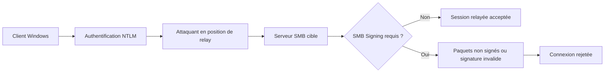

---
tags:
  - hardening
  - SMB
  - réseau
  - protocoles
---

# SMB hardening

!!! abstract "Ce que couvre ce chapitre"
    - Comprendre pourquoi `SMB` reste un plan d'attaque majeur en environnement Windows.
    - Désactiver `SMBv1` côté serveur et côté client, sans confondre les deux périmètres.
    - Imposer `SMB Signing` et cibler `SMB Encryption` là où le risque le justifie.
    - Traiter la désactivation des partages administratifs cachés comme une exception documentée.

`SMB` est un protocole d'échange de fichiers.
Dans Windows, c'est aussi une brique de gestion à distance,
de copie latérale et d'administration quotidienne.

Cette ubiquité explique sa valeur offensive.
Quand `SMB` est faible, un attaquant n'a pas seulement accès à des fichiers.
Il gagne souvent un couloir de mouvement latéral.

!!! info "Idée directrice"
    Sur Windows, `SMB` n'est pas un simple service de partage.
    C'est un protocole transversal entre postes, serveurs, contrôleurs de domaine,
    consoles d'administration et outils de support.

## Pourquoi SMB est une cible récurrente

`SMB` est présent presque partout dans un SI Windows.
Il transporte les accès aux partages,
les copies de fichiers et de nombreux scénarios d'administration.

Un attaquant aime les protocoles déjà autorisés.
`SMB` évite d'introduire un trafic exotique.
Il recycle des mécanismes légitimes du système.

Dans un domaine Active Directory,
`SYSVOL`, `NETLOGON`, les partages métiers
et les partages administratifs reposent sur le même plan réseau.

### Le précédent `EternalBlue`

`EternalBlue` a exploité `MS17-010` sur `SMBv1`.
En mai 2017, `WannaCry` a montré à quel point
une faiblesse `SMB` pouvait devenir un phénomène massif.

Ce point reste structurant pour le hardening.
Une seule machine exposée avec un dialecte ancien
peut suffire à rouvrir une classe d'attaque entière.

### Le cas `PrintNightmare`

`PrintNightmare` ne visait pas `SMB` lui-même.
La vulnérabilité concernait le service `Print Spooler`
et a fait l'objet d'une mise à jour hors cycle le 6 juillet 2021.

Son intérêt ici est architectural.
Dans les chaînes d'attaque Windows,
`RPC`, impression, pilotes et partages `SMB`
se combinent souvent pour déposer ou charger du contenu distant.

### Le mouvement latéral

Après compromission initiale,
`SMB` sert souvent à copier des outils,
accéder à `ADMIN$` ou `C$`,
ou préparer une exécution distante via service.

Le protocole est aussi visé par les attaques de relay.
Si l'intégrité n'est pas imposée,
un attaquant peut tenter de réutiliser une authentification capturée
contre une autre cible `SMB`.

| Facteur | Pourquoi c'est rentable offensivement |
|---|---|
| Ubiquité | `SMB` est déjà ouvert ou toléré dans de nombreux flux internes |
| Fonction système | Il sert autant aux fichiers qu'à l'administration |
| Héritage | Les vieux dialectes et usages historiques restent fréquents |
| Rebond | `ADMIN$`, `C$` et les partages métiers facilitent le pivot |

!!! warning "Point important"
    Toutes les attaques citées ne sont pas des vulnérabilités `SMB` pures.
    En revanche, elles démontrent qu'un protocole de gestion omniprésent
    devient un multiplicateur de mouvement latéral.

!!! quote "En résumé"
    `SMB` est une cible récurrente parce qu'il est partout,
    déjà autorisé et directement utile à l'attaquant.
    Le durcissement cherche donc à casser les usages hérités,
    puis à protéger l'intégrité et la confidentialité du trafic restant.

## SMBv1 : désactivation côté serveur et côté client

`SMBv1` est le point de rupture historique du protocole.
Il n'apporte plus de valeur de sécurité
et concentre l'essentiel du risque de compatibilité héritée.

Il faut distinguer deux choses :
le serveur `SMB`,
et le client `SMB`.

Désactiver seulement le serveur
empêche la machine d'accepter des connexions `SMBv1`.
Mais la machine peut encore initier une connexion `SMBv1`
vers un serveur ancien si le client reste actif.

!!! danger "Règle de base"
    Le retrait de `SMBv1` doit être pensé des deux côtés.
    La désactivation serveur seule n'élimine pas la dépendance du poste
    envers un équipement ou un NAS resté en `SMBv1`.

### Côté serveur

La valeur registre demandée est :

```text
HKLM\SYSTEM\CurrentControlSet\Services\LanmanServer\Parameters\SMB1 = 0
```

En PowerShell,
la commande de référence est :

```powershell
Set-SmbServerConfiguration -EnableSMB1Protocol $false
```

Pour vérifier l'état réel côté serveur :

```powershell
Get-SmbServerConfiguration | Select-Object EnableSMB1Protocol
```

Cette vérification est importante.
Elle confirme la configuration effective du service `LanmanServer`,
pas seulement l'intention de déploiement.

### Côté client

La valeur registre demandée est :

```text
HKLM\SYSTEM\CurrentControlSet\Services\mrxsmb10\Start = 4
```

Ici, la logique est différente.
On ne coupe pas un partage entrant.
On désactive le pilote client `SMBv1`.

`Start = 4` place le pilote en état désactivé.
En pratique, un redémarrage est la méthode la plus sûre
pour garantir qu'il n'est plus chargé.

### Exemple de séquence

!!! example "Serveur puis client"
    1. Désactiver `SMBv1` sur les serveurs de fichiers et les hôtes sensibles.
    2. Vérifier les journaux et les dépendances legacy.
    3. Désactiver ensuite le client `SMBv1` sur les postes et serveurs restants.
    4. Sortir du périmètre ou isoler les équipements incapables de migrer.

!!! tip "Raccourcis utiles"
    `++win++` + `++x++`, puis `++a++` ouvre un terminal administrateur.
    `++win++` + `++r++`, puis `regedit`, ouvre l'éditeur du Registre.

| Périmètre | Clé registre | Effet |
|---|---|---|
| Serveur | `LanmanServer\Parameters\SMB1 = 0` | Refuse le dialecte `SMBv1` en entrée |
| Client | `mrxsmb10\Start = 4` | Empêche l'initiation de connexions via le pilote `SMBv1` |

!!! info "Bonne pratique"
    Le vrai objectif n'est pas seulement de "désactiver un bit".
    Il faut supprimer la dépendance métier ou technique
    qui exige encore `SMBv1`.

!!! quote "En résumé"
    `SMBv1` doit être désactivé côté serveur et côté client.
    Le premier bloque l'exposition entrante,
    le second empêche le poste de parler à des systèmes hérités.

## SMB Signing : protéger l'intégrité

`SMB Signing` protège l'intégrité des échanges.
Il ne chiffre pas les données.
Il permet de détecter une altération ou un relay non signé.

Microsoft souligne explicitement
que le signing aide à prévenir
la falsification des données et les attaques de relay.

Un paquet non signé ou signé de manière invalide
doit être refusé.
Le serveur et le client cessent alors d'accepter
une conversation `SMB` non intègre.

### Clé serveur

La valeur registre demandée est :

```text
HKLM\SYSTEM\CurrentControlSet\Services\LanmanServer\Parameters\RequireSecuritySignature = 1
```

### Clé client

La valeur registre demandée est :

```text
HKLM\SYSTEM\CurrentControlSet\Services\LanmanWorkstation\Parameters\RequireSecuritySignature = 1
```

### Commandes PowerShell utiles

```powershell
Set-SmbServerConfiguration -RequireSecuritySignature $true
Set-SmbClientConfiguration -RequireSecuritySignature $true
```

### Équivalent GPO classique

!!! info "Correspondance Security Options"
    - `Microsoft network server: Digitally sign communications (always)`
    - `Microsoft network client: Digitally sign communications (always)`

### Effet sur `NTLM relay` et `SMB relay`

Une attaque de relay tente de rejouer
une authentification valide vers une autre cible.
Si la cible `SMB` impose une signature correcte,
le relais ne peut pas finaliser le flux comme un client légitime.

Le signing ne supprime pas `NTLM`.
Il réduit une classe d'abus du protocole `SMB`
quand l'attaquant cherche à relayer,
modifier ou injecter des paquets.

### Impact opérationnel

Le coût principal se joue sur la compatibilité
avec des équipements anciens ou des implémentations tierces faibles.
Dans un parc moderne, l'impact est surtout à tester,
pas à présumer.

Sur versions récentes de Windows,
Microsoft renforce d'ailleurs les comportements par défaut autour du signing.
Dans un parc hétérogène, il reste utile d'imposer la baseline explicitement.

| Réglage | Ce qu'il apporte | Ce qu'il n'apporte pas |
|---|---|---|
| Signing requis | Intégrité et anti-relay `SMB` | Confidentialité des fichiers |
| Signing non requis | Compatibilité héritée | Forte exposition au relay |

!!! warning "Erreur fréquente"
    Confondre `SMB Signing` et `SMB Encryption`
    conduit à des choix incomplets.
    Le signing protège l'intégrité.
    Le chiffrement protège la confidentialité du contenu sur le réseau.

!!! quote "En résumé"
    Le signing est la mesure centrale contre `SMB relay`.
    Il doit être pensé côté serveur et côté client,
    car l'intégrité du flux dépend des deux extrémités.

## SMB Encryption : protéger la confidentialité

`SMB Encryption` est disponible à partir de `Windows Server 2012`.
Il repose sur `SMB 3.x`.
Il protège les données `SMB` sur le réseau.

Cette mesure devient utile
quand le trafic traverse un segment moins fiable,
quand un partage transporte des données sensibles,
ou quand on veut réduire le risque d'écoute réseau interne.

### Chiffrement global côté serveur

```powershell
Set-SmbServerConfiguration -EncryptData $true
```

Ce réglage impose le chiffrement
pour les connexions `SMB` vers le serveur.
Il augmente fortement le niveau de protection,
mais doit être validé côté compatibilité et performances.

### Chiffrement ciblé par partage

```powershell
Set-SmbShare -Name "DATA" -EncryptData $true
```

Le ciblage par partage est souvent plus pragmatique.
Il permet de réserver le chiffrement
aux données sensibles ou aux zones exposées.

### Quand privilégier l'un ou l'autre

| Approche | Cas typique | Limite |
|---|---|---|
| Global serveur | Serveur dédié à des données sensibles | Peut impacter tous les flux et tous les clients |
| Par partage | Mix de données sensibles et ordinaires | Demande une gouvernance plus fine |

### Impact performance

Le chiffrement ajoute un coût CPU
et peut réduire le débit utile
sur des serveurs anciens ou très sollicités.

L'effet réel dépend du matériel,
de la version de Windows,
du volume de trafic
et des fonctionnalités réseau utilisées.

Il faut donc mesurer sur le périmètre réel.
Le bon réflexe n'est pas de supposer un coût théorique,
mais d'observer latence, débit et consommation CPU.

!!! tip "Cas d'usage typiques"
    - partages contenant des données sensibles ;
    - flux inter-sites sans autre protection suffisante ;
    - segments internes où l'écoute réseau reste plausible ;
    - serveurs exposés à des accès d'administration distants.

!!! info "Point de méthode"
    `SMB Encryption` n'est pas un substitut au signing.
    Le chiffrement protège le contenu transporté.
    Le signing reste une baseline robuste pour l'intégrité globale du protocole.

!!! quote "En résumé"
    Activez le chiffrement `SMB` là où la confidentialité du trafic compte vraiment.
    Le ciblage par partage offre souvent le meilleur compromis
    entre protection, compatibilité et performance.

## Désactiver les partages administratifs cachés : mesure facultative

Les partages administratifs cachés
comme `ADMIN$`, `C$` ou `D$`
existent pour l'administration distante.

Ils simplifient le support,
la copie d'outils,
certaines tâches d'inventaire
et de nombreux scénarios de maintenance.

C'est précisément pour cela
qu'ils intéressent aussi un attaquant déjà authentifié.
Ils fournissent un chemin de copie ou d'accès
sans créer de partage visible supplémentaire.

### Valeurs registre

Pour un serveur :

```text
HKLM\SYSTEM\CurrentControlSet\Services\LanmanServer\Parameters\AutoShareServer = 0
```

Pour un poste de travail :

```text
HKLM\SYSTEM\CurrentControlSet\Services\LanmanServer\Parameters\AutoShareWks = 0
```

### Effet réel

Microsoft documente que `0`
empêche la création automatique des partages administratifs.
La même documentation précise aussi
que cela ne concerne pas `IPC$`
ni les partages créés manuellement.

Après modification,
il faut redémarrer le service `Server`
ou redémarrer la machine.

!!! danger "Mesure d'exception"
    Cette désactivation ne doit pas devenir une règle aveugle.
    Elle peut casser des flux d'administration,
    de support ou de sauvegarde fondés sur `ADMIN$` ou `C$`.

### Quand l'envisager

Cette mesure a du sens
sur des systèmes très cloisonnés,
sur des postes non administrés à distance,
ou sur des environnements où les outils ont été validés sans ces partages.

Elle est rarement appropriée
comme baseline universelle.
Elle doit être tracée comme une exception,
avec justification et test de non-régression.

| Décision | Lecture recommandée |
|---|---|
| Laisser les partages cachés | Baseline la plus compatible pour l'administration |
| Les désactiver | Exception ciblée, testée et documentée |

!!! warning "Point de gouvernance"
    Si vous désactivez `AutoShareServer` ou `AutoShareWks`,
    documentez aussi les outils, scripts et équipes
    qui utilisaient implicitement ces partages.

!!! quote "En résumé"
    La désactivation des partages administratifs cachés est possible,
    mais elle relève de l'exception à haut risque.
    Le bon choix dépend surtout de votre modèle d'administration.

## Diagramme : `SMB relay` et effet du signing

Sans signature obligatoire,
un attaquant peut tenter de relayer
une authentification capturée vers un serveur `SMB`.

Avec `SMB Signing` requis,
le serveur attend des paquets signés correctement.
Le flux relayé perd alors son intérêt offensif.



!!! info "Lecture du diagramme"
    Le signing n'empêche pas un attaquant d'essayer.
    Il l'empêche de finaliser utilement la session `SMB`
    si le protocole exige une signature valide.

!!! quote "En résumé"
    Le relay exploite l'absence d'intégrité de la session.
    `SMB Signing` coupe précisément ce levier
    en imposant une preuve d'intégrité paquet par paquet.

## Tableau récapitulatif

| Mesure | Clé registre | PowerShell | Impact principal |
|---|---|---|---|
| Désactiver `SMBv1` serveur | `HKLM\SYSTEM\CurrentControlSet\Services\LanmanServer\Parameters\SMB1 = 0` | `Set-SmbServerConfiguration -EnableSMB1Protocol $false` | Supprime l'exposition serveur au dialecte historique |
| Vérifier `SMBv1` serveur | n/a | `Get-SmbServerConfiguration \| Select-Object EnableSMB1Protocol` | Confirme l'état effectif du service |
| Désactiver `SMBv1` client | `HKLM\SYSTEM\CurrentControlSet\Services\mrxsmb10\Start = 4` | déploiement registre ou outillage de configuration | Empêche les connexions sortantes en `SMBv1` |
| Imposer le signing serveur | `HKLM\SYSTEM\CurrentControlSet\Services\LanmanServer\Parameters\RequireSecuritySignature = 1` | `Set-SmbServerConfiguration -RequireSecuritySignature $true` | Réduit `SMB relay` et la falsification des paquets |
| Imposer le signing client | `HKLM\SYSTEM\CurrentControlSet\Services\LanmanWorkstation\Parameters\RequireSecuritySignature = 1` | `Set-SmbClientConfiguration -RequireSecuritySignature $true` | Aligne l'intégrité côté poste initiateur |
| Chiffrement global | configuration serveur `SMB` | `Set-SmbServerConfiguration -EncryptData $true` | Protège la confidentialité des flux `SMB` |
| Chiffrement par partage | propriété du partage | `Set-SmbShare -Name "DATA" -EncryptData $true` | Cible les données sensibles sans tout chiffrer |
| Désactiver les partages cachés | `AutoShareServer = 0` ou `AutoShareWks = 0` | déploiement registre | Réduit certains chemins de copie latérale, avec risque opérationnel élevé |

!!! tip "Lecture recommandée du tableau"
    Les trois mesures prioritaires sont :
    retrait de `SMBv1`,
    signing requis,
    et chiffrement ciblé des partages sensibles.

!!! quote "En résumé"
    Le durcissement `SMB` se résume à trois axes :
    supprimer l'héritage, imposer l'intégrité,
    puis chiffrer sélectivement ce qui doit l'être.

## Références Microsoft et vérification

Les faits historiques et techniques de ce chapitre
ont été recoupés avec la documentation Microsoft
et les publications `MSRC`.

- `MSRC` sur `WannaCrypt` et `MS17-010` pour le contexte `EternalBlue`.
- `MSRC` sur `CVE-2021-34527` pour le contexte `PrintNightmare`.
- Documentation Microsoft sur le hardening `SMB` pour le rôle du signing et de l'encryption.
- Documentation Microsoft sur les partages administratifs pour `AutoShareServer` et `AutoShareWks`.
- Documentation des cmdlets `Set-SmbServerConfiguration`, `Get-SmbServerConfiguration` et `Set-SmbShare` pour les commandes citées.

!!! info "Portée des interprétations"
    Les chemins registre et commandes PowerShell sont tirés des sources Microsoft.
    Les conseils de séquencement et de gouvernance
    sont des déductions opérationnelles cohérentes avec ces sources.

!!! quote "En résumé"
    Le chapitre s'appuie sur des sources Microsoft pour les réglages
    et sur une lecture opérationnelle prudente pour le déploiement.
    C'est cette combinaison qui rend un hardening `SMB` exploitable sur le terrain.

!!! tip "Voir aussi"
    - :material-book-open-variant: [Registre et reseau](../bible-registre-windows/08-reseau.md) — Bible Registre
    - :material-book-cog: [File Server / DFS](../registre-pour-les-admins/12-file-server.md) — Registre Admins
