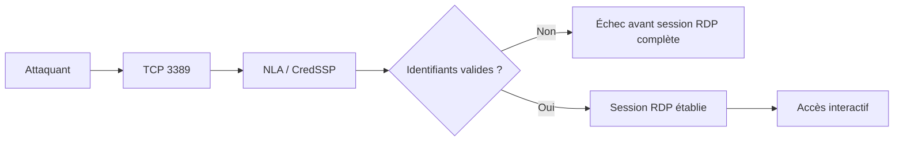

---
tags:
  - hardening
  - RDP
  - accès distant
  - protocoles
---

# RDP hardening

!!! abstract "Ce que couvre ce chapitre"
    - Comprendre pourquoi `RDP` est une cible de brute force, de credential stuffing et d'exploits pré-authentification.
    - Imposer `NLA`, `TLS` et un niveau de chiffrement cohérent avec la baseline.
    - Distinguer `Restricted Admin Mode` de `Remote Credential Guard`.
    - Réduire l'exposition `RDP` par le firewall, la désactivation des usages inutiles et une gouvernance stricte des accès.

`RDP` est un protocole d'administration très pratique.
Dans un SI Windows, c'est aussi une surface d'attaque à haut rendement
car il donne un accès interactif direct à la machine ciblée.

Le bon hardening `RDP` commence avant la session.
Il faut d'abord limiter qui peut atteindre le service,
puis imposer une authentification précoce
et enfin protéger les credentials d'administration.

!!! info "Fil directeur"
    Pour `RDP`, le contrôle le plus rentable est celui qui coupe l'accès
    avant la création de session : firewall, segmentation,
    désactivation des usages non justifiés et `NLA`.

## Pourquoi RDP est une cible majeure

Un port `RDP` exposé
est une invitation au brute force.
L'attaquant n'a pas besoin d'outil exotique :
un compte faible ou réutilisé peut suffire.

Le `credential stuffing` est particulièrement dangereux.
Si des identifiants ont déjà fuité ailleurs,
`RDP` devient un point de validation simple
pour tenter de les rejouer sur des actifs internes ou exposés.

Le précédent `BlueKeep` (`CVE-2019-0708`)
a rappelé qu'une faille `RDP`
peut être pré-authentification et potentiellement de type ver.
Microsoft a publié des correctifs hors cycle
à cause du risque de propagation.

`NLA` a aidé à réduire l'exposition des systèmes concernés.
Il ne faut toutefois pas en tirer une mauvaise conclusion :
`NLA` ne remplace jamais le correctif
et ne protège pas d'un mot de passe valide.

| Menace | Ce qu'elle exploite | Contrôle le plus utile |
|---|---|---|
| Brute force | Compte faible ou trop exposé | Filtrage réseau, verrouillage, MFA |
| Credential stuffing | Réutilisation d'identifiants compromis | Comptes dédiés, MFA, limitation d'exposition |
| Exploit pré-auth | Surface `RDP` avant session | Correctifs, `NLA`, réduction d'exposition |

!!! warning "Point central"
    Un `RDP` patché mais trop exposé reste attaquable par mot de passe.
    Un `RDP` non patché reste dangereux même derrière un filtrage imparfait.

!!! quote "En résumé"
    `RDP` est une cible majeure parce qu'il donne un accès interactif immédiat.
    Le hardening doit donc traiter en même temps patching,
    exposition réseau et qualité des comptes.

## Network Level Authentication (`NLA`)

`NLA` impose l'authentification de l'utilisateur
avant l'établissement complet de la session `RDP`.
Microsoft documente explicitement ce comportement
via la valeur `UserAuthentication`.

La clé registre à imposer est :

```text
HKLM\SYSTEM\CurrentControlSet\Control\Terminal Server\WinStations\RDP-Tcp\UserAuthentication = 1
```

Le chemin `GPO` utile est :

```text
Computer Configuration > Administrative Templates > Windows Components > Remote Desktop Services > Remote Desktop Session Host > Security
```

La stratégie correspondante est :

```text
Require user authentication for remote connections by using Network Level Authentication
```

L'intérêt est simple.
Sans `NLA`, la cible expose plus tôt la pile `RDP`
et consomme plus de ressources de session
avant d'avoir validé l'identité.

Avec `NLA`,
si l'authentification échoue,
la session graphique complète n'est pas créée.
La surface pré-authentification devient plus étroite.

`NLA` a toutefois ses limites.
Ce n'est pas du `MFA`.
Ce n'est pas une protection contre un mot de passe valide.
Ce n'est pas non plus un substitut au patching.

Les clients très anciens
ou certains outillages hérités
peuvent mal se comporter avec `NLA`.
Ce coût de compatibilité reste généralement acceptable
dans un parc moderne, mais il doit être testé.

!!! tip "Raccourci utile"
    `++win++` + `++r++`, puis `SystemPropertiesRemote`,
    permet d'ouvrir rapidement les paramètres système de l'accès distant.

!!! info "Lecture correcte"
    `NLA` réduit l'exposition avant session.
    Il doit être combiné au filtrage réseau,
    à une bonne hygiène de mots de passe
    et à une politique d'accès restreinte.

!!! quote "En résumé"
    `NLA` est la première barrière `RDP` à imposer.
    Il réduit la surface pré-authentification,
    sans remplacer ni le firewall ni la discipline des identités.

## TLS et niveau de chiffrement

Deux réglages sont à distinguer :
la couche de sécurité utilisée par `RDP`,
et le niveau minimal de chiffrement.

La valeur prioritaire est :

```text
HKLM\SYSTEM\CurrentControlSet\Control\Terminal Server\WinStations\RDP-Tcp\SecurityLayer = 2
```

`SecurityLayer = 2` force `TLS`.
Ce réglage doit être préféré
au mode négocié ou au `RDP Security Layer` natif.

La baseline de chiffrement haute est :

```text
HKLM\SYSTEM\CurrentControlSet\Control\Terminal Server\WinStations\RDP-Tcp\MinEncryptionLevel = 3
```

`MinEncryptionLevel = 3`
correspond au niveau `High`.
Il garde une exigence forte
si un repli vers le chiffrement `RDP` natif devait se produire.

Le niveau `FIPS` existe aussi :

```text
HKLM\SYSTEM\CurrentControlSet\Control\Terminal Server\WinStations\RDP-Tcp\MinEncryptionLevel = 4
```

`MinEncryptionLevel = 4`
répond à des besoins de conformité particuliers.
Il ne doit pas être activé par réflexe,
car il peut introduire des contraintes de compatibilité.

La nuance importante est la suivante :
dans la documentation Microsoft,
la stratégie `Set client connection encryption level`
vise d'abord le chiffrement `RDP` natif.
Quand `SecurityLayer = 2`, le contrôle principal devient `TLS`.

La lecture pratique est donc :

- `SecurityLayer = 2` est prioritaire ;
- `MinEncryptionLevel = 3` reste une baseline cohérente ;
- `MinEncryptionLevel = 4` vise des cas `FIPS` bien identifiés.

Les stratégies `GPO` associées
se trouvent sous le même noeud `Security` :

- `Require use of specific security layer for remote (RDP) connections`
- `Set client connection encryption level`

| Réglage | Valeur | Interprétation |
|---|---|---|
| `SecurityLayer` | `2` | Force `TLS` |
| `MinEncryptionLevel` | `3` | Baseline élevée |
| `MinEncryptionLevel` | `4` | Cas `FIPS` seulement |

!!! warning "Erreur fréquente"
    Régler seulement `MinEncryptionLevel`
    sans forcer `SecurityLayer = 2`
    laisse une ambiguïté inutile sur la protection réellement utilisée.

!!! quote "En résumé"
    Pour `RDP`, le réglage essentiel est `SecurityLayer = 2`.
    `MinEncryptionLevel` complète la baseline,
    mais ne remplace pas l'obligation de `TLS`.

## Restricted Admin Mode

`Restricted Admin Mode`
sert à limiter l'exposition des credentials
d'un administrateur qui ouvre une session `RDP`
sur une machine distante.

La clé registre côté hôte est :

```text
HKLM\SYSTEM\CurrentControlSet\Control\Lsa\DisableRestrictedAdmin = 0
```

Ce mode a du sens
sur des postes d'administration,
des `PAW`
ou des accès `Tier 0`
délibérément cadrés.

Il n'est pas destiné
aux sessions bureautiques ordinaires.
Il peut gêner le `single sign-on`
ou certains accès réseau depuis la session distante.

Pour l'utiliser côté client :

!!! example "Invocation"
    `++win++` + `++r++`, puis `mstsc.exe /restrictedadmin`

Le bénéfice principal
est de ne pas exposer inutilement
les secrets complets de l'opérateur
sur l'hôte distant.

Il faut cependant rester prudent.
`Restricted Admin` est un contrôle de réduction d'exposition,
pas une suppression générale des scénarios `pass-the-hash`
dans le plan d'administration `RDP`.

Il doit donc rester réservé
aux hôtes d'administration prévus pour cela,
avec comptes dédiés,
segmentation réseau
et gouvernance stricte des accès.

!!! warning "Risque résiduel"
    `Restricted Admin` protège surtout les secrets de l'opérateur
    sur la cible distante.
    Il ne dispense ni du cloisonnement des comptes,
    ni des mesures globales contre la réutilisation des secrets.

!!! quote "En résumé"
    `Restricted Admin` réduit l'exposition des credentials
    sur l'hôte administré.
    Il doit être utilisé de façon ciblée,
    jamais comme une sécurité universelle.

## Remote Credential Guard

`Remote Credential Guard`
et `Restricted Admin`
ne doivent pas être confondus.
Ils poursuivent une idée voisine,
mais avec des propriétés opérationnelles différentes.

`Remote Credential Guard`
est généralement préférable
quand le contexte supporte `Kerberos`.
Le poste source conserve alors le contrôle des credentials
au lieu de les abandonner à l'hôte distant.

Le prérequis central est clair :
`Kerberos` doit être disponible.
Pas de compte local.
Pas de scénario `NTLM` de secours.

Si la connexion ne peut pas s'appuyer sur `Kerberos`,
`Remote Credential Guard`
perd son intérêt
et il faut revoir le modèle d'accès.

La différence pratique se résume ainsi :

| Fonction | Restricted Admin | Remote Credential Guard |
|---|---|---|
| Objectif | Réduire l'exposition des secrets sur la cible | Même objectif avec un usage plus fluide |
| Usage typique | Admin ciblée, contexte sensible | Admin courante depuis poste maîtrisé |
| Dépendance `Kerberos` | Non stricte | Oui, indispensable |
| Comptes locaux / `NTLM` | Peu souhaitables | Non adaptés |

!!! tip "Choix simple"
    Si `Kerberos` fonctionne et que le poste d'administration est maîtrisé,
    privilégiez `Remote Credential Guard`.
    Réservez `Restricted Admin` aux cas où son modèle est explicitement voulu.

!!! quote "En résumé"
    `Remote Credential Guard` est la meilleure option
    pour l'administration sécurisée quand `Kerberos` est disponible.
    Il faut le distinguer clairement de `Restricted Admin`.

## Réduire la surface d'exposition RDP

Le durcissement `RDP`
commence avant `NLA`.
La question centrale est :
qui peut atteindre le port,
depuis quel réseau,
et pour quel usage.

### Changer le port par défaut

Le port par défaut est `3389`.
Il se règle via :

```text
HKLM\SYSTEM\CurrentControlSet\Control\Terminal Server\WinStations\RDP-Tcp\PortNumber
```

Changer ce port
réduit parfois le bruit opportuniste
de certains scanners automatisés.
Ce n'est pas un contrôle de sécurité fort.

Un scan sérieux retrouvera le service.
Le changement de port
est donc une mesure de discrétion relative,
pas une mesure de confiance.

### Filtrage réseau avant `NLA`

Le contrôle le plus rentable
reste le firewall.
Il faut limiter `RDP`
aux adresses, sous-réseaux ou bastions
explicitement autorisés.

Exemples usuels :

- liste blanche des postes d'administration ;
- `VPN`, `RD Gateway` ou bastion ;
- segmentation dédiée à l'administration ;
- fermeture complète des flux inutiles.

### Désactiver `RDP` si non utilisé

La valeur de coupure est :

```text
HKLM\SYSTEM\CurrentControlSet\Control\Terminal Server\fDenyTSConnections = 1
```

Quand `RDP` n'est pas nécessaire,
la meilleure défense consiste simplement
à ne pas laisser le service actif.
Cette mesure supprime à elle seule
une grande partie de la surface d'attaque.

| Mesure | Avantage | Limite |
|---|---|---|
| Changer `PortNumber` | Réduit le bruit opportuniste | N'arrête pas un scan réel |
| Filtrer au firewall | Coupe l'accès avant `NLA` | Demande une gouvernance réseau claire |
| `fDenyTSConnections = 1` | Supprime la surface `RDP` | Impossible si l'usage métier l'exige |

!!! danger "Priorité réelle"
    Filtrer l'accès `RDP` par firewall
    vaut bien plus que déplacer le port `3389`.
    La vraie réduction de risque
    se fait avant la pile `RDP`.

!!! quote "En résumé"
    La réduction d'exposition `RDP`
    repose d'abord sur le firewall
    et sur la désactivation des usages non nécessaires.
    Le changement de port ne vient qu'en complément mineur.

## Diagramme : brute force `RDP` et effet de `NLA`



!!! info "Lecture du diagramme"
    `NLA` ne supprime pas le risque d'identifiants valides.
    Il évite surtout d'exposer une session `RDP` complète
    avant la validation de l'utilisateur.

!!! quote "En résumé"
    `NLA` déplace le point de contrôle en amont.
    Sa valeur est maximale
    sur un `RDP` déjà filtré et correctement patché.

## Tableau récapitulatif

| Mesure | Clé registre | GPO | Niveau de protection |
|---|---|---|---|
| Imposer `NLA` | `HKLM\SYSTEM\CurrentControlSet\Control\Terminal Server\WinStations\RDP-Tcp\UserAuthentication = 1` | `Require user authentication for remote connections by using Network Level Authentication` | Élevé contre la surface pré-authentification |
| Forcer `TLS` | `HKLM\SYSTEM\CurrentControlSet\Control\Terminal Server\WinStations\RDP-Tcp\SecurityLayer = 2` | `Require use of specific security layer for remote (RDP) connections` | Élevé pour la protection du transport |
| Chiffrement `High` | `...RDP-Tcp\MinEncryptionLevel = 3` | `Set client connection encryption level` | Bon niveau de baseline |
| Chiffrement `FIPS` | `...RDP-Tcp\MinEncryptionLevel = 4` | `Set client connection encryption level` | Très élevé, cas particuliers seulement |
| Autoriser `Restricted Admin` | `HKLM\SYSTEM\CurrentControlSet\Control\Lsa\DisableRestrictedAdmin = 0` | baseline dédiée ou registre | Réduction ciblée de l'exposition des credentials |
| Changer le port | `...RDP-Tcp\PortNumber` | configuration centralisée ou locale | Faible seul, utile surtout contre le bruit |
| Désactiver `RDP` | `HKLM\SYSTEM\CurrentControlSet\Control\Terminal Server\fDenyTSConnections = 1` | politique d'accès distant / registre | Très élevé si l'usage n'est pas requis |
| Filtrer au firewall | règles réseau | `Windows Defender Firewall` / filtrage périmétrique | Très élevé, car l'accès est coupé avant `NLA` |

!!! tip "Priorités terrain"
    Les contrôles les plus rentables sont :
    désactiver `RDP` quand il n'est pas nécessaire,
    filtrer l'accès réseau,
    puis imposer `NLA` et `TLS`.

!!! quote "En résumé"
    Une baseline `RDP` solide
    traite d'abord l'exposition,
    puis l'authentification,
    puis la protection des credentials administratifs.

## Références Microsoft et vérification

Les valeurs registre,
les chemins `GPO`
et les principes de fonctionnement
ont été recoupés avec les sources Microsoft suivantes :

- `MSRC` sur `BlueKeep` (`CVE-2019-0708`) pour le risque pré-authentification.
- Documentation Microsoft sur `UserAuthentication` pour `NLA`.
- Documentation Microsoft sur `SecurityLayer` et `MinEncryptionLevel` pour les réglages `RDP-Tcp`.
- Documentation Microsoft sur `Restricted Admin` et `Remote Credential Guard` pour la distinction fonctionnelle entre les deux modes.
- Documentation Microsoft `Remote Desktop Services` pour les stratégies du noeud `Security`.

!!! info "Portée des interprétations"
    Les réglages sont issus des sources Microsoft.
    Le séquencement de déploiement
    et la hiérarchie des priorités
    relèvent d'une lecture opérationnelle prudente de ces sources.

!!! quote "En résumé"
    Le hardening `RDP` est simple à énoncer :
    moins d'exposition, `NLA`, `TLS`,
    puis un mode d'administration adapté au contexte `Kerberos`.

!!! tip "Voir aussi"
    - :material-book-cog: [Remote Desktop Services](../registre-pour-les-admins/10-rds.md) — Registre Admins
    - :material-shield-account: [Remote Desktop Services via GPO](../gpo-pour-les-admins/11-rds.md) — GPO Admins
