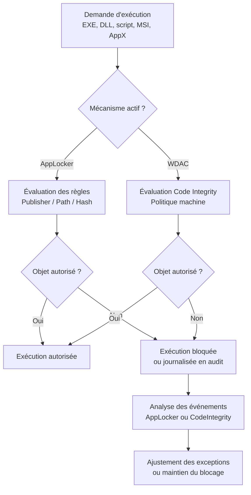

---
tags:
  - hardening
  - AppLocker
  - WDAC
  - contrôle applicatif
---

# AppLocker et WDAC

!!! abstract "Ce que vous allez apprendre"
    - Pourquoi le contrôle applicatif réduit directement la capacité d'un attaquant à exécuter son code.
    - Ce qu'AppLocker et WDAC contrôlent réellement, et à quel niveau de la pile Windows.
    - Comment déployer, auditer et durcir ces mécanismes sans casser l'exploitation.
    - Quels pièges éviter avant de passer d'un pilote en audit à un mode bloquant.

!!! info "Terminologie"
    WDAC est le nom historique le plus utilisé.
    Microsoft parle désormais surtout de *App Control for Business*.
    Dans ce chapitre, `WDAC` désigne ce mécanisme.

## 1. Pourquoi le contrôle applicatif est une des mesures les plus efficaces

Un antivirus détecte.
Un EDR corrèle.
Le contrôle applicatif, lui, retire à l'attaquant la permission d'exécuter son propre code.

Dans beaucoup d'incidents Windows, la chaîne d'attaque passe par une étape simple :
un fichier arrive sur le poste, est déposé dans un emplacement inscriptible par l'utilisateur,
puis un processus autorisé l'exécute.

Si cette exécution est refusée, plusieurs familles d'attaque échouent plus tôt :
payloads téléchargés, scripts opportunistes, loaders copiés dans `%TEMP%`,
installateurs MSI détournés, et binaires non approuvés lancés hors des répertoires de confiance.

Le gain défensif est élevé parce que la mesure agit avant l'élévation de privilèges
ou avant la persistance.
Elle coupe la capacité d'exécution, pas seulement la détection a posteriori.

Le contrôle applicatif est particulièrement rentable contre :

- les malwares distribués par phishing ou téléchargement manuel ;
- les scripts `.ps1`, `.js`, `.vbs`, `.cmd`, `.bat` déposés dans le profil utilisateur ;
- les binaires portables exécutés depuis `%APPDATA%`, `%LOCALAPPDATA%`, `%TEMP%` ou `Downloads` ;
- certaines chaînes Living-off-the-Land où un binaire légitime tente de lancer un contenu non approuvé.

Il ne remplace pas Defender, ASR, Credential Guard ou un EDR.
Il change la question.
On ne demande plus "est-ce malveillant ?", mais "est-ce explicitement autorisé ?".

Cette bascule de logique est puissante dans un environnement d'entreprise.
Elle favorise les logiciels signés, inventoriés, déployés et maintenus par l'organisation.
Elle pénalise les exécutions opportunistes et les écarts hors processus.

| Étape de l'attaque | Sans contrôle applicatif | Avec contrôle applicatif |
|---|---|---|
| Téléchargement d'un binaire | Le fichier peut être lancé si l'utilisateur clique | Le fichier peut rester présent mais son exécution est bloquée |
| Script déposé dans `%TEMP%` | Exécution possible via `wscript`, `cscript`, `powershell` | Lancement refusé si la collection Scripts ou la politique user-mode le couvre |
| MSI hors catalogue | Installation possible si aucun autre contrôle ne l'arrête | Le MSI peut être refusé par règle explicite |
| DLL parasite | Chargement parfois possible par un processus vulnérable | Peut être bloqué si la collection DLL ou la politique WDAC le couvre |

!!! tip "Lecture opérationnelle"
    Plus vos postes autorisent peu d'emplacements d'exécution,
    plus une compromission initiale doit passer par des applications déjà approuvées.
    Cela augmente fortement le coût de l'attaque.

!!! quote "En résumé"
    Le contrôle applicatif est efficace parce qu'il bloque l'étape d'exécution elle-même.
    Il neutralise une grande partie des payloads, scripts et binaires lancés hors des chemins ou signatures de confiance.

## 2. AppLocker

AppLocker est le mécanisme de contrôle applicatif historique de Windows côté poste et serveur.
Il reste utile pour un durcissement progressif, surtout si vous voulez commencer vite
avec des règles compréhensibles et lisibles dans une GPO.

Microsoft le positionne comme une mesure de défense en profondeur,
pas comme le mécanisme le plus robuste pour empêcher l'exécution de code.
Cette nuance est importante pour le comparer à WDAC.

### 2.1 Ce qu'AppLocker contrôle

AppLocker structure sa politique par **collections de règles**.
Chaque collection cible une famille d'objets précise.

| Collection AppLocker | Ce qui est contrôlé | Exemples |
|---|---|---|
| Executable Rules | Exécutables Win32 | `.exe`, `.com` |
| Windows Installer Rules | Installateurs Windows | `.msi`, `.msp`, `.mst` |
| Script Rules | Scripts interprétés | `.ps1`, `.bat`, `.cmd`, `.vbs`, `.js` |
| DLL Rules | Bibliothèques chargées dynamiquement | `.dll`, `.ocx` |
| Packaged app Rules | Applications packagées | `AppX`, `MSIX`, applications UWP |
| Packaged app installer Rules | Installateurs d'apps packagées | App installers packagés |

La couverture est large côté espace utilisateur.
En revanche, AppLocker n'est pas un moteur d'intégrité de code noyau.
Il ne remplace pas la logique Code Integrity de WDAC.

!!! warning "Nuance importante"
    La collection `DLL` n'est pas activée par défaut dans beaucoup de déploiements,
    car elle augmente la surface d'analyse et le risque de bruit.
    Sans cette collection, un scénario de chargement de DLL peut rester partiellement ouvert.

### 2.2 Modes : Audit vs Enforce

AppLocker supporte deux usages opérationnels essentiels :
l'observation et l'application.
En pratique, il faut toujours commencer par l'observation.

| Mode | Effet | Usage recommandé |
|---|---|---|
| Audit only | L'exécution n'est pas bloquée, mais l'événement est journalisé | Phase pilote, cartographie des écarts |
| Enforce rules | L'exécution non autorisée est bloquée | Après validation du périmètre et des exceptions |

Le mode `Audit only` est utile pour identifier :

- les scripts internes encore lancés depuis des répertoires utilisateurs ;
- les installateurs techniques exécutés depuis des partages ou des profils ;
- les outils de support utilisés localement hors catalogue ;
- les mises à jour éditeur qui changent de chemin ou de signature.

Une erreur fréquente consiste à interpréter un pilote "calme" comme un pilote prêt.
Si la collecte d'événements n'est pas centralisée,
l'absence de bruit peut simplement signifier l'absence de visibilité.

### 2.3 Types de règles : éditeur, chemin, hash

AppLocker propose trois conditions principales pour identifier ce qui est autorisé ou refusé.
Le bon choix dépend du niveau de stabilité du logiciel.

| Type de règle | Principe | Avantages | Limites |
|---|---|---|---|
| Publisher | Signature de l'éditeur, produit, nom binaire, version | Très bon pour logiciels commerciaux signés | Inutilisable si non signé |
| Path | Emplacement du fichier | Simple à déployer et à lire | Dangereux si le chemin est inscriptible par un utilisateur |
| Hash | Empreinte du fichier exact | Très précis pour un binaire figé | À régénérer à chaque mise à jour |

Les règles `Publisher` sont généralement le meilleur compromis.
Elles tolèrent les mises à jour si vous utilisez correctement les bornes de version.
Elles réduisent aussi le volume d'administration.

Les règles `Path` sont adaptées aux répertoires strictement maîtrisés,
comme `%WINDIR%` ou `%PROGRAMFILES%`.
Elles ne doivent pas servir à autoriser des zones modifiables par l'utilisateur.

Les règles `Hash` conviennent aux outils rares, non signés et stables.
Elles deviennent coûteuses si l'application se met à jour fréquemment.

!!! danger "Erreur classique"
    Une règle `Allow` basée sur un chemin utilisateur inscriptible annule souvent l'intérêt du contrôle applicatif.
    Si un utilisateur peut écrire dans le chemin, un attaquant peut généralement l'utiliser aussi.

### 2.4 Déploiement via GPO

Le chemin GPO AppLocker est le suivant :

`Computer Configuration > Policies > Windows Settings > Security Settings > Application Control Policies > AppLocker`

Dans beaucoup de documentations internes, le nœud `Policies` est omis à l'écrit.
Dans l'éditeur GPO, il apparaît bien dans l'arborescence.

Le point d'entrée pratique est `gpmc.msc`.
Ouvrez-le via ++win++ + ++r++, puis éditez la GPO ciblée.

!!! example "Séquence de déploiement minimale"
    1. Ouvrir `gpmc.msc`.
    2. Créer une GPO dédiée au contrôle applicatif.
    3. Aller dans `Computer Configuration > Policies > Windows Settings > Security Settings > Application Control Policies > AppLocker`.
    4. Générer des règles par défaut pour `%WINDIR%` et `%PROGRAMFILES%`.
    5. Ajouter les règles de refus ciblant les répertoires utilisateurs à risque.
    6. Basculer d'abord en audit.
    7. Analyser les journaux avant tout passage en enforcement.

Un déploiement propre isole AppLocker dans une GPO dédiée.
Évitez de le mélanger avec des dizaines d'autres paramètres.
La lecture, le dépannage et le rollback seront plus simples.

### 2.5 Journaux utiles

Pour observer AppLocker, ouvrez `eventvwr.msc` via ++win++ + ++r++.
Les journaux se trouvent sous :
`Applications and Services Logs > Microsoft > Windows > AppLocker`

Vous y trouverez plusieurs sous-journaux selon la collection :

- `EXE and DLL` ;
- `MSI and Script` ;
- `Packaged app-Deployment` ;
- `Packaged app-Execution` .

Ce sont les premiers journaux à regarder en phase d'audit.
Ils montrent ce qui aurait été bloqué,
et donc ce qui doit être autorisé explicitement ou déplacé.

### 2.6 Limitation majeure : éditions Windows

Le point de vigilance historique sur AppLocker est son **support par édition**.
Pendant longtemps, l'application via GPO concernait surtout
Windows Enterprise, Education et les éditions Server.

Cette règle empirique reste utile si votre parc contient des builds anciens.
Elle évite de supposer à tort une application homogène partout.

Il existe toutefois une nuance importante :
Microsoft indique qu'à partir de Windows 10 2004 avec `KB5024351`
et sur toutes les versions Windows 11, une édition spécifique n'est plus requise
pour **enforcer** AppLocker.

En pratique, la bonne formulation est donc la suivante :

- pour un parc hétérogène ou ancien, traitez AppLocker comme un contrôle historiquement lié à Enterprise/Education/Server ;
- pour un parc récent homogène Windows 10 2004+ corrigé ou Windows 11, vérifiez la matrice de support réelle avant d'écarter AppLocker.

!!! info "Consigne d'architecture"
    Si votre objectif est un contrôle applicatif robuste et durable à grande échelle,
    partez plutôt sur WDAC.
    Si votre objectif est un durcissement rapide, lisible et pilotable par GPO, AppLocker reste utile.

!!! quote "En résumé"
    AppLocker contrôle les EXE, DLL, scripts, MSI et applications packagées.
    Il s'administre facilement par GPO, mais sa portée et sa robustesse restent inférieures à WDAC, avec une vigilance particulière sur le support par édition et sur les règles de chemin.

## 3. WDAC

WDAC, ou *Windows Defender Application Control*,
est le mécanisme d'intégrité de code de référence pour durcir l'exécution sur Windows.
Microsoft le présente aujourd'hui sous le nom *App Control for Business*.

L'idée centrale diffère d'AppLocker.
WDAC s'ancre dans la logique **Code Integrity** du système,
avec une décision appliquée plus bas dans la pile.

### 3.1 Différences clés avec AppLocker

AppLocker agit surtout au niveau applicatif.
WDAC s'intègre à l'intégrité de code Windows et peut contrôler
le code noyau ainsi que le code user-mode si l'option UMCI est activée.

| Aspect | AppLocker | WDAC |
|---|---|---|
| Niveau principal | Couche applicative / userland | Code Integrity, ancré plus bas dans le système |
| Couverture noyau | Non | Oui, pour les pilotes et binaires noyau |
| Couverture user-mode | Oui | Oui avec `UMCI` |
| Positionnement Microsoft | Défense en profondeur | Contrôle applicatif robuste |

Cette différence d'architecture a une conséquence opérationnelle :
les contournements historiquement documentés sont plus fréquents côté AppLocker
que côté WDAC.

Cette phrase doit être lue comme une **inférence défensive** :
Microsoft ne publie pas un compteur officiel de "bypass connus",
mais sa recommandation d'utiliser WDAC pour une protection forte
reflète bien cette différence de surface de contournement.

### 3.2 Politique WDAC : XML puis binaire

Une politique WDAC est d'abord décrite en **XML**.
Elle contient les règles d'intégrité de code,
les options de politique, et les identités de fichiers autorisés.

Cette politique est ensuite convertie en forme binaire pour le déploiement.
Dans le schéma historique **single-policy** utilisé par GPO,
on rencontre le binaire `SiPolicy.p7b`.

Dans les déploiements modernes, surtout multi-policy,
vous rencontrerez aussi des formats `.cip`.
La présence de cette nuance ne change pas le principe demandé ici :
on part d'un XML, puis on applique une politique binaire.

!!! example "Cycle de vie simplifié"
    1. Construire ou générer la politique XML.
    2. L'analyser en audit sur un pilote.
    3. La convertir en binaire pour déploiement.
    4. La distribuer.
    5. Redémarrer si nécessaire.
    6. Contrôler les journaux `CodeIntegrity`.

### 3.3 Modes : Audit vs Enforcement

Comme AppLocker, WDAC doit être introduit par étapes.
Le mode audit n'est pas un luxe.
C'est le seul moyen raisonnable de mesurer l'impact réel.

| Mode | Effet | Point de vigilance |
|---|---|---|
| Audit | Le code continue à s'exécuter, mais WDAC journalise ce qui serait bloqué | Certains comportements applicatifs peuvent malgré tout changer |
| Enforcement | Le code non autorisé est bloqué | Une erreur de conception peut immobiliser une fonction métier ou un poste |

Microsoft recommande explicitement de commencer par `Enabled:Audit Mode`.
Le retrait de cette option fait basculer la politique en mode appliqué.

Si vous activez `UMCI`, les exécutables user-mode et les scripts entrent dans le périmètre.
C'est indispensable si vous voulez que WDAC couvre réellement
les scripts et binaires déposés dans le contexte utilisateur.

### 3.4 Déploiement via GPO ou MDM

Le déploiement GPO WDAC classique passe par :

`Computer Configuration > Administrative Templates > System > Device Guard > Deploy App Control for Business`

Ce mécanisme GPO supporte surtout le **single-policy format**.
Microsoft recommande d'autres méthodes de déploiement
pour les scénarios plus modernes sur Windows 10 1903+ et Windows 11.

Le déploiement MDM reste pertinent dans un parc moderne,
notamment pour des terminaux gérés par Intune.
Le bénéfice est une gestion plus cohérente des politiques récentes.

!!! warning "Point à connaître"
    Le déploiement GPO n'est pas la voie la plus souple pour toutes les politiques WDAC modernes.
    Si vous visez une stratégie multi-policy ou une administration à grande échelle,
    vérifiez la méthode de déploiement choisie avant de figer votre design.

### 3.5 Vérification et journaux

Pour vérifier la présence de configuration liée à WDAC,
la clé registre souvent inspectée est :

`HKLM\SYSTEM\CurrentControlSet\Control\CI\Config`

Cette clé est un point de contrôle utile,
mais elle ne doit pas être le seul indicateur de validation.
Le meilleur réflexe reste la corrélation avec les journaux Code Integrity.

Les emplacements utiles sont :

- `HKLM\SYSTEM\CurrentControlSet\Control\CI\Config` pour l'état de configuration visible dans le registre ;
- `C:\Windows\System32\CodeIntegrity\` pour les fichiers de politique présents sur le poste ;
- `Applications and Services Logs > Microsoft > Windows > CodeIntegrity > Operational` pour la télémétrie d'application et de blocage.

Ouvrez `regedit` ou `eventvwr.msc` via ++win++ + ++r++.
Sur un poste pilote, contrôlez toujours registre et journaux avant de conclure
qu'une politique est correctement active.

!!! tip "Règle pratique"
    Une politique WDAC visible sur disque n'est pas synonyme de politique correctement appliquée.
    Ce sont les événements `CodeIntegrity` qui confirment le comportement réel.

!!! quote "En résumé"
    WDAC applique le contrôle applicatif plus bas dans la pile que AppLocker.
    Sa politique part d'un XML, aboutit à un binaire tel que `SiPolicy.p7b` dans les scénarios GPO simples, et se vérifie par le registre `CI\Config` ainsi que par les journaux `CodeIntegrity`.

## 4. AppLocker vs WDAC

Le bon choix dépend du niveau d'exigence.
AppLocker est plus simple à démarrer.
WDAC est plus exigeant, mais aussi plus solide.

| Critère | AppLocker | WDAC |
|---|---|---|
| Maturité d'administration | Élevée, très lisible pour les équipes GPO | Élevée techniquement, mais plus complexe à concevoir |
| Niveau de contrôle | Principalement applicatif | Intégrité de code, y compris noyau |
| Robustesse défensive | Défense en profondeur | Contrôle applicatif de référence |
| Bypass connus ou surface de contournement | Plus large historiquement | Plus réduite en pratique |
| Types de règles | Publisher, Path, Hash | Règles d'intégrité, signatures, options de politique |
| Ciblage utilisateur / groupe | Très naturel | Moins orienté "par utilisateur", plus orienté machine |
| Déploiement | GPO simple et direct | GPO possible, MDM fréquent, design plus structurant |
| Audit | Facile à lire | Indispensable, plus technique à exploiter |
| Prérequis | Support dépendant du niveau Windows et du scénario | Design, génération de politique, tests, reboot selon scénario |
| Complexité de déploiement | Faible à moyenne | Moyenne à élevée |
| Cas d'usage idéal | Premier niveau de contrôle, parc connu, besoin rapide | Durcissement fort, parc standardisé, stratégie long terme |

!!! info "Lecture du tableau"
    La ligne `Bypass connus ou surface de contournement` synthétise l'architecture et l'historique public.
    Microsoft ne publie pas une métrique officielle comparable entre AppLocker et WDAC.

Si votre priorité est le **time to value**,
AppLocker peut produire un gain rapide.
Si votre priorité est la **résistance au contournement**,
WDAC est le choix plus cohérent.

Dans les grands environnements, on voit souvent une trajectoire réaliste :
AppLocker pour assainir rapidement,
puis WDAC pour le niveau de maîtrise supérieur.

!!! quote "En résumé"
    AppLocker est plus simple et plus proche des usages GPO classiques.
    WDAC demande plus de préparation, mais offre une posture défensive plus robuste et plus difficile à contourner.

## 5. Règles de base recommandées

Une base saine vise d'abord les **emplacements inscriptibles par l'utilisateur**.
Ce sont les zones favorites des loaders, scripts opportunistes
et exécutables téléchargés à la volée.

La logique recommandée est simple :
autoriser depuis les répertoires système ou maîtrisés,
refuser depuis les répertoires utilisateurs à risque,
et gérer les exceptions de manière explicite.

| Objectif | AppLocker | WDAC | Risque opérationnel |
|---|---|---|---|
| Bloquer l'exécution depuis `%TEMP%` | Règles `Deny` sur `Executable`, `Script`, éventuellement `MSI` | Couverture via allowlist et `UMCI`, sans faire confiance à cette zone | Outils d'installation temporaires |
| Bloquer `%APPDATA%` et `%LOCALAPPDATA%` | Règles `Deny` ciblées sur profils utilisateurs | Non-confiance implicite si la politique n'autorise pas ces chemins | Updaters et logiciels auto-installés |
| Bloquer les scripts depuis `Downloads` | Collection `Script` avec refus sur `%USERPROFILE%\Downloads\*` | Contrôle user-mode avec `UMCI`, éventuellement complété par ASR | Scripts d'administration locaux |
| Autoriser `%WINDIR%` et `%PROGRAMFILES%` | Règles `Allow` par défaut sur chemins ou éditeurs | Politique basée sur signatures et corpus approuvé | Faible si les ACL restent saines |
| Encadrer les installateurs | Contrôler `MSI`, `MSP`, `MST` | Autoriser seulement les installateurs approuvés | Déploiements internes hors catalogue |

Les trois refus les plus rentables à introduire tôt sont souvent :

- exécutions depuis `%OSDRIVE%\Users\*\AppData\Local\Temp\*` ;
- exécutions depuis `%OSDRIVE%\Users\*\AppData\Roaming\*` ;
- scripts et installateurs lancés depuis `%USERPROFILE%\Downloads\*` .

Ces règles doivent être testées.
Certaines équipes de support, chaînes de déploiement ou applications métier
utilisent encore ces emplacements de manière légitime.

!!! warning "Ne confondez pas rapidité et brutalité"
    Bloquer `%APPDATA%` sans phase d'audit est une recette classique pour interrompre des mises à jour applicatives,
    des agents de support ou des scripts de packaging.

!!! example "Approche pragmatique"
    1. Créer les règles de refus sur `Temp`, `AppData` et `Downloads`.
    2. Activer l'audit uniquement.
    3. Observer les événements pendant un cycle complet de production.
    4. Extraire les besoins légitimes.
    5. Remplacer les tolérances de chemin par des exceptions `Publisher` quand c'est possible.
    6. Basculer progressivement en blocage.

!!! danger "Mauvaise exception"
    Une exception trop large sur un répertoire utilisateur revient souvent à recréer un trou permanent.
    Préférez une exception par éditeur, par hash ou par politique complémentaire maîtrisée.

!!! quote "En résumé"
    La base recommandée consiste à refuser l'exécution depuis `%TEMP%`, `%APPDATA%` et `Downloads`,
    puis à traiter les exceptions de manière explicite et minimale, après audit.

## 6. Flux de décision AppLocker / WDAC

Le schéma ci-dessous résume le point de décision.
Le fichier peut exister sur le poste.
La question est de savoir si Windows lui permet de s'exécuter.

!!! tip "Observation"
    En audit, le flux ne s'arrête pas sur `bloqué`.
    Il produit une télémétrie qui sert à affiner la politique avant l'application stricte.

!!! quote "En résumé"
    Le contrôle applicatif insère une décision explicite entre la demande d'exécution et le lancement réel.
    Ce point de décision est précisément ce qui coupe les payloads non autorisés.

## 7. Pièges et points d'exploitation

Le plus gros risque n'est pas technique.
C'est le **déploiement sans inventaire**, sans audit, sans exceptions propres
et sans trajectoire de rollback.

### 7.1 Faux positifs

Les faux positifs arrivent souvent dans trois catégories :

- outils internes non signés ;
- mises à jour d'éditeurs qui changent d'emplacement ou de certificat ;
- scripts de déploiement exécutés depuis des répertoires temporaires.

Les zones utilisateur sont particulièrement piégeuses.
Elles hébergent à la fois beaucoup de bruit légitime
et beaucoup d'activité réellement indésirable.

### 7.2 Gestion des exceptions

Une exception doit être la plus étroite possible.
C'est vrai pour AppLocker comme pour WDAC.

Bon ordre de préférence :

1. exception par éditeur ;
2. exception par version ou produit ;
3. exception par hash ;
4. exception par chemin uniquement si le chemin est strictement maîtrisé.

Pour WDAC, la logique d'exception peut passer par une politique complémentaire.
Pour AppLocker, elle passe souvent par des règles d'autorisation plus spécifiques.
Dans les deux cas, la discipline de design compte plus que l'outil.

### 7.3 Impact sur les scripts de déploiement

Les scripts de packaging et les agents de déploiement sont souvent les premières victimes.
Beaucoup extraient des fichiers dans `%TEMP%`,
ou exécutent des composants transitoires hors de `%PROGRAMFILES%`.

| Symptôme | Cause typique | Réponse recommandée |
|---|---|---|
| Installation qui échoue sur quelques postes | Binaire intermédiaire lancé depuis `%TEMP%` | Déplacer le workflow ou autoriser précisément l'éditeur |
| Script PowerShell interne bloqué | Lancement depuis `Downloads` ou profil utilisateur | Déplacer le script vers un partage ou un répertoire maîtrisé |
| Application métier cassée après mise à jour | Signature ou chemin modifié | Réviser la règle `Publisher` ou la plage de version |
| Bruit massif en audit | Politique trop large ou journal non filtré | Réduire le scope pilote et classer les événements |

### 7.4 AppLocker : pièges spécifiques

Si vous activez des règles `Executable` sans préparer les applications packagées,
les apps packagées peuvent être bloquées faute de règles adaptées.

Autre piège courant :
activer la collection `DLL` en production sans pilote suffisant.
Le volume d'impact peut monter très vite.

### 7.5 WDAC : pièges spécifiques

Une politique WDAC mal conçue est plus sévère qu'une GPO AppLocker trop stricte.
Elle s'insère plus profondément dans la décision d'exécution.
Le plan de récupération doit être pensé avant la généralisation.

Sur les politiques signées, certaines opérations exigent un redémarrage.
Sur les postes avec `memory integrity`, Microsoft documente un point de vigilance
pour l'activation de nouvelles politiques de base signées.

!!! warning "Règle d'hygiène"
    Si vous ne savez pas encore comment retirer proprement une politique WDAC en cas d'incident,
    vous n'êtes pas prêt à la généraliser.

Le meilleur déploiement est incrémental :

- anneau pilote technique ;
- anneau IT ;
- petit périmètre métier ;
- généralisation progressive.

Collectez les journaux avant chaque élargissement.
Ne corrigez pas les faux positifs en ouvrant de grands chemins.
Corrigez-les en rendant les exceptions plus intelligentes.

!!! quote "En résumé"
    Les pièges majeurs sont les faux positifs, les exceptions trop larges et l'impact sur les chaînes de déploiement.
    Un contrôle applicatif réussi repose sur l'audit, un périmètre pilote et des exceptions minimales.

!!! tip "Voir aussi"
    - :material-shield-lock: [AppLocker et WDAC : controle d'application via GPO](../bible-gpo/15-applocker-wdac.md) — Bible GPO
    - :material-shield-account: [Securite endpoint via GPO](../gpo-pour-les-admins/14-securite-endpoint.md) — GPO Admins
