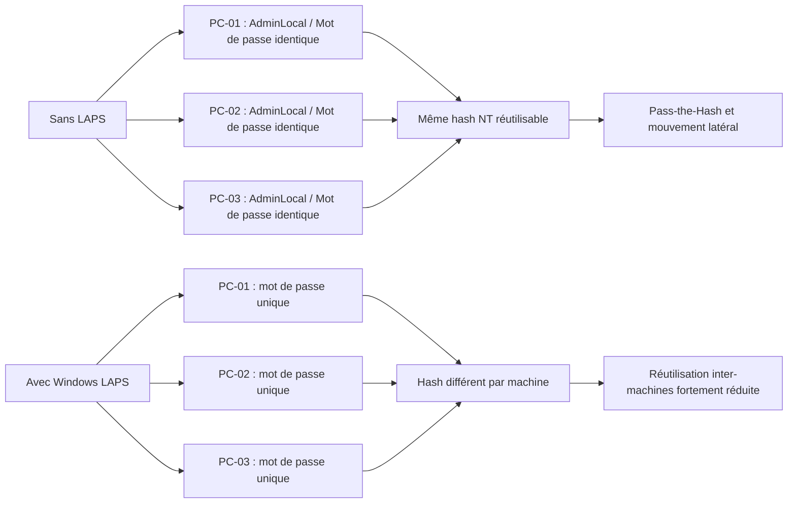

---
tags:
  - hardening
  - LAPS
  - comptes locaux
  - administrateur
---

# Windows LAPS et comptes locaux

!!! abstract "Ce que vous allez apprendre"
    - Pourquoi les comptes locaux restent un vecteur classique de mouvement latéral.
    - Ce que change Windows LAPS par rapport au produit Microsoft LAPS historique.
    - Quels chemins GPO, clés de registre et attributs Active Directory surveiller.
    - Comment traiter le compte `Administrateur` intégré et les comptes locaux supplémentaires.

!!! info "Terminologie"
    Dans ce chapitre, `LAPS legacy` désigne le produit Microsoft LAPS historique.
    `Windows LAPS` désigne la fonctionnalité intégrée au système d'exploitation
    depuis les mises à jour diffusées à partir du 11 avril 2023.

## 1. Pourquoi les comptes locaux sont un vecteur de mouvement latéral

Un compte local administrateur n'est valable que sur une machine donnée.
En pratique, le risque apparaît quand plusieurs machines partagent
le même mot de passe local, souvent par image maître, script ou habitude d'exploitation.

Dans ce cas, le secret n'est plus local au sens défensif.
Il devient un secret transversal réutilisable sur l'ensemble d'un parc,
ce qui crée une voie directe de mouvement latéral.

Si un attaquant compromet un poste et récupère ce mot de passe,
ou son hash NT associé, il peut tenter la même authentification
sur d'autres postes qui exposent le même compte local.

Ce schéma facilite les scénarios de `Pass-the-Hash`.
Le mot de passe n'a même pas besoin d'être révélé en clair
si le hash du compte réutilisé suffit à ouvrir d'autres systèmes.

Le problème est aggravé quand le compte local appartient au groupe local
`Administrators` sur tous les postes.
Une compromission locale devient alors un rebond d'administration.

| Situation | Effet opérationnel | Impact sécurité |
|---|---|---|
| Même mot de passe local sur tout le parc | Support simple mais secret partagé | Forte surface de mouvement latéral |
| Mot de passe local unique par machine | Dépannage plus encadré | Réduit la réutilisation d'identité |
| Compte local administrateur jamais audité | Comptes orphelins et oubliés | Persistance discrète et élévation locale |

!!! warning "Ce que LAPS corrige exactement"
    LAPS ne supprime pas les comptes locaux.
    Il casse surtout la réutilisation du même secret d'une machine à l'autre,
    qui est le cœur du problème défensif.

### 1.1 Chaîne d'attaque typique

1. Un poste est compromis via phishing, RMM exposé ou exécution locale.
2. L'attaquant extrait des secrets locaux ou des hashes en mémoire.
3. Il teste le même compte local sur d'autres machines.
4. Il obtient un accès administrateur sur plusieurs postes.
5. Il pivote ensuite vers des serveurs, des consoles d'administration ou des sauvegardes.

Ce mécanisme reste fréquent dans les environnements où l'on a voulu
conserver une "porte de secours" locale commune.
Cette commodité d'exploitation devient une fragilité structurelle.

!!! danger "Fausse bonne idée"
    Renommer seulement le compte local sans changer son modèle de secret
    ne résout pas le problème.
    Un même mot de passe derrière plusieurs comptes renommés reste exploitable.

!!! quote "En résumé"
    Le risque n'est pas l'existence d'un compte local en soi.
    Le risque est la réutilisation d'un même secret d'administration local sur plusieurs machines.

## 2. Windows LAPS : principe et évolution

Windows LAPS signifie `Windows Local Administrator Password Solution`.
La fonctionnalité gère automatiquement le mot de passe d'un compte administrateur local
et sauvegarde ce secret dans Active Directory ou dans Microsoft Entra ID selon le scénario.

L'objectif opérationnel est simple.
Chaque machine obtient son propre mot de passe local,
roté automatiquement selon une politique centrale.

Cela réduit fortement les opportunités de mouvement latéral
entre postes utilisant auparavant un compte local identique.
La récupération du mot de passe reste possible par un administrateur autorisé.

### 2.1 LAPS legacy vs Windows LAPS intégré

Le produit historique Microsoft LAPS était un composant séparé.
Il s'appuyait sur une extension cliente et sur des modèles d'administration dédiés
pour écrire des attributs spécifiques dans Active Directory.

Windows LAPS est différent.
Il est natif à Windows, non désinstallable, et administrable
par GPO, CSP ou configuration locale de test.

| Sujet | LAPS legacy | Windows LAPS |
|---|---|---|
| Nature du produit | Composant séparé à déployer | Fonctionnalité intégrée à Windows |
| Administration | GPO et outillage legacy | GPO, CSP Intune, PowerShell, config locale |
| Attribut AD principal | `ms-Mcs-AdmPwd` | `ms-LAPS-Password` |
| Chiffrement AD natif | Non | Oui, avec prérequis AD adéquats |
| Historique des mots de passe | Non | Oui pour les mots de passe chiffrés en AD |
| Support Entra ID | Non | Oui |

Microsoft indique que le produit legacy est déprécié
sur les OS récents, notamment à partir de Windows 11 23H2.
La trajectoire recommandée est donc la migration vers Windows LAPS.

!!! tip "Point de migration"
    Windows LAPS peut fonctionner en mode d'émulation legacy
    pour accompagner une transition existante,
    mais le mode cible reste la pile native Windows LAPS.

### 2.2 Prérequis de plateforme

Windows LAPS est disponible sur Windows 11 et Windows 10 pris en charge,
ainsi que sur Windows Server 2019 et versions ultérieures,
à condition d'avoir les mises à jour diffusées à partir du 11 avril 2023.

Pour un parc Windows 10, Microsoft cite explicitement
les versions `20H2`, `21H2` et `22H2` mises à jour.
Pour les serveurs, Microsoft cite notamment `Server 2019` et `Server 2022`.

Il est donc exact de raisonner en pratique sur
`Windows 10 20H2+` et `Windows Server 2019+`,
mais seulement si le niveau de correctifs correspondant est présent.

!!! warning "Nuance importante"
    Le simple numéro de version ne suffit pas.
    Sans les mises à jour publiées le 11 avril 2023 ou après,
    Windows LAPS intégré n'est pas disponible sur ces plateformes.

### 2.3 Ce que fait LAPS

Windows LAPS gère automatiquement le mot de passe d'un compte local administrateur.
Par défaut, il peut cibler le compte administrateur intégré,
ou un autre compte si la stratégie le précise.

Le poste génère un mot de passe conforme à la politique.
Il l'applique localement, met à jour sa date d'expiration,
puis sauvegarde le secret dans l'annuaire configuré.

L'administrateur n'a donc plus besoin de maintenir
un mot de passe local commun, ni de le diffuser manuellement.
Le secret devient unique par machine et borné dans le temps.

!!! example "Bénéfice concret"
    Une compromission d'un poste de support ne donne plus automatiquement
    accès à tous les autres postes du même lot,
    car chaque machine expose un mot de passe local différent.

!!! quote "En résumé"
    Windows LAPS remplace un secret local partagé par des secrets uniques,
    rotés automatiquement et récupérables seulement par des opérateurs autorisés.

## 3. Registre, attributs AD et surfaces d'administration

Windows LAPS distingue plusieurs racines de stratégie.
Cette distinction est importante pour le diagnostic,
car la valeur effective n'est pas toujours au même emplacement.

Microsoft documente quatre racines principales.
Elles ne s'héritent pas entre elles.
La première racine contenant des paramètres explicites devient la stratégie active.

| Mécanisme | Racine de registre |
|---|---|
| LAPS CSP | `HKLM\Software\Microsoft\Policies\LAPS` |
| LAPS Group Policy | `HKLM\Software\Microsoft\Windows\CurrentVersion\Policies\LAPS` |
| LAPS Local Configuration | `HKLM\Software\Microsoft\Windows\CurrentVersion\LAPS\Config` |
| Legacy Microsoft LAPS | `HKLM\Software\Policies\Microsoft Services\AdmPwd` |

### 3.1 Clé registre demandée : `HKLM\SOFTWARE\Microsoft\Windows\CurrentVersion\LAPS\Config`

La clé `HKLM\SOFTWARE\Microsoft\Windows\CurrentVersion\LAPS\Config`
correspond à la configuration locale Windows LAPS.
Microsoft la documente surtout pour les tests et le développement.

Cette clé n'est pas la racine GPO normale.
En déploiement de domaine, la GPO écrit plutôt sous
`HKLM\SOFTWARE\Microsoft\Windows\CurrentVersion\Policies\LAPS`.

Autrement dit, `Config` sert à l'observation locale ou à des essais ciblés,
alors que `Policies\LAPS` correspond au pilotage GPO.
Confondre les deux conduit à de faux diagnostics.

!!! info "Réflexe utile"
    Si une stratégie LAPS semble "ne pas s'appliquer",
    vérifiez d'abord quelle racine de politique est réellement active
    avant de conclure à un problème GPO.

### 3.2 Attributs Active Directory : legacy et intégré

Dans le produit historique, l'attribut emblématique est `ms-Mcs-AdmPwd`.
Il transporte le mot de passe local en clair côté annuaire,
avec un attribut séparé pour l'expiration.

Dans Windows LAPS, l'attribut demandé à retenir est `ms-LAPS-Password`.
Il existe aussi d'autres attributs Windows LAPS,
notamment pour les versions chiffrées et l'historique selon le scénario.

| Mode | Attribut principal | Rôle |
|---|---|---|
| LAPS legacy | `ms-Mcs-AdmPwd` | Mot de passe sauvegardé dans AD |
| LAPS legacy | `ms-Mcs-AdmPwdExpirationTime` | Expiration du mot de passe |
| Windows LAPS | `ms-LAPS-Password` | Mot de passe Windows LAPS en AD |
| Windows LAPS | `ms-LAPS-EncryptedPassword` | Version chiffrée du mot de passe |

Si vous migrez depuis LAPS legacy,
il faut distinguer la présence d'anciens attributs
de l'activation réelle de Windows LAPS natif.

Le mode intégré sait aussi lire le mot de passe legacy
via `Get-LapsADPassword` en mode d'émulation.
En revanche, les champs restitués ne sont pas strictement identiques.

### 3.3 Canal d'événements

Pour le diagnostic local, Windows expose le journal
`Microsoft-Windows-LAPS/Operational`.
Il est utile pour vérifier l'application de politique et les échecs de rotation.

Ouvrez l'Observateur d'événements avec ++win+r++ puis `eventvwr.msc`,
ou utilisez `Get-WinEvent -ListLog *LAPS*`
pour confirmer que le canal est présent sur la machine.

!!! warning "Ne pas déduire l'état depuis AD seulement"
    Un attribut en annuaire ne prouve pas à lui seul
    que la dernière application de stratégie s'est bien déroulée.
    Le journal local reste la source de diagnostic immédiate.

!!! quote "En résumé"
    Pour Windows LAPS, il faut distinguer le registre de configuration locale,
    le registre piloté par GPO et les attributs AD réellement utilisés par le mode choisi.

## 4. Déploiement via GPO

Le chemin GPO demandé est exact.
Dans l'éditeur de stratégie de groupe,
Windows LAPS se configure sous :
`Computer Configuration > Administrative Templates > System > LAPS`.

Le modèle d'administration est livré avec Windows
dans `%windir%\PolicyDefinitions\LAPS.admx`.
Si vous utilisez un `Central Store`, il faut y copier le modèle explicitement.

Pour ouvrir rapidement la console locale sur un poste de test,
utilisez ++win+r++ puis `gpedit.msc`.
En domaine, préférez `gpmc.msc`.

### 4.1 Réglages fondamentaux

Un socle GPO Windows LAPS couvre généralement :

| Paramètre | Rôle |
|---|---|
| `BackupDirectory` | Choisit AD DS, Entra ID ou désactivé |
| `PasswordAgeDays` | Définit la fréquence de rotation |
| `PasswordLength` | Définit la longueur du mot de passe |
| `PasswordComplexity` | Définit le niveau de complexité |
| `AdministratorAccountName` | Cible un compte local précis si nécessaire |
| `PasswordExpirationProtectionEnabled` | Empêche des dates d'expiration trop permissives |

Si la sauvegarde cible Active Directory,
Windows LAPS peut aussi chiffrer le mot de passe en annuaire.
Cette fonction suppose un niveau fonctionnel de domaine compatible.

### 4.2 Séquence de déploiement recommandée

1. Vérifier que les OS cibles sont bien à jour pour Windows LAPS.
2. Vérifier que le schéma AD supporte les attributs Windows LAPS nécessaires.
3. Déployer ou mettre à jour `LAPS.admx` dans le `Central Store` si besoin.
4. Créer une GPO dédiée, puis la lier aux OU concernées.
5. Tester sur un lot pilote avant généralisation.

Cette approche évite de casser un workflow d'installation ou d'imagerie.
Microsoft recommande explicitement d'éviter qu'une politique LAPS active
interfère avec une séquence de déploiement utilisant le même compte local.

!!! tip "Bonne pratique d'OU"
    Utilisez une OU de staging sans stratégie LAPS active pendant l'installation,
    puis déplacez la machine dans son OU finale
    une fois le workflow de déploiement terminé.

### 4.3 Vérifications après application

Après application de la GPO, contrôlez :

| Vérification | Outil |
|---|---|
| Présence des valeurs de stratégie | `regedit` ou PowerShell |
| Journal local LAPS | `Microsoft-Windows-LAPS/Operational` |
| Présence de l'attribut côté AD | Console AD ou PowerShell LAPS |
| Délégation de lecture | ACL AD et groupes d'administration |

Sur un poste, `gpupdate /force` peut accélérer le test.
Sur le plan défensif, ne considérez pas la GPO comme validée
tant que la rotation et la récupération ont été testées bout en bout.

!!! quote "En résumé"
    Déployer LAPS ne se limite pas à une GPO.
    Il faut valider la compatibilité OS, le schéma AD, la délégation et la preuve de rotation réelle.

## 5. Récupération du mot de passe local

La récupération du mot de passe doit rester exceptionnelle et traçable.
Le but de LAPS n'est pas de multiplier les lectures en clair,
mais d'encadrer un accès de support ou de secours.

### 5.1 PowerShell : `Get-LapsADPassword`

Le cmdlet `Get-LapsADPassword` interroge Active Directory
pour récupérer un mot de passe Windows LAPS ou legacy,
selon ce qui est stocké pour l'objet ordinateur ciblé.

Exemple sobre :

```powershell
Get-LapsADPassword -Identity "PC-023"
```

Affichage explicite en clair, à réserver aux cas nécessaires :

```powershell
Get-LapsADPassword -Identity "PC-023" -AsPlainText
```

!!! danger "Usage de `-AsPlainText`"
    Microsoft signale explicitement que `-AsPlainText`
    expose le secret à une consultation triviale.
    Réservez cette option au support contrôlé ou au test.

### 5.2 Portail d'administration Intune

Quand la sauvegarde vise Microsoft Entra ID,
la récupération peut se faire via les portails d'administration Microsoft,
notamment les parcours exposés par Intune et Microsoft Entra.

Le point essentiel n'est pas l'interface utilisée,
mais le contrôle d'accès.
La lecture du mot de passe doit être bornée à des rôles précis.

### 5.3 Gouvernance de lecture

La lecture du mot de passe LAPS est un droit sensible.
Les ACL de l'objet ordinateur, et éventuellement les droits de déchiffrement,
font partie du périmètre de sécurité à auditer.

Évitez les délégations trop larges.
Un groupe de support de proximité n'a pas forcément besoin
de lire les secrets de tous les serveurs ou de tous les postes VIP.

!!! example "Modèle opérationnel"
    Créez des groupes de lecture LAPS distincts par périmètre,
    par exemple `Helpdesk-Postes`, `Ops-Serveurs` et `BreakGlass`,
    au lieu d'un unique groupe global.

!!! quote "En résumé"
    La récupération du mot de passe LAPS doit être rare, traçable et limitée.
    Le cmdlet `Get-LapsADPassword` et les portails Microsoft ne doivent pas devenir des canaux de lecture massifs.

## 6. Désactiver ou renommer le compte Administrateur intégré

Le compte `Administrateur` intégré reste une cible prioritaire.
Même protégé par LAPS, il peut être judicieux de réduire sa prévisibilité
ou de le désactiver quand le modèle d'exploitation le permet.

### 6.1 Ce que montre la SAM

Le compte administrateur intégré correspond au RID bien connu `500`.
Dans la base SAM locale, il apparaît sous la ruche
`HKLM\SAM\SAM\Domains\Account\Users\...`.

Sur un système classique, le sous-identifiant historique associé est `000001F4`,
qui représente `0x1F4`, soit `500` en décimal.
Cette ruche n'est pas un emplacement d'administration courant.

L'accès y est restreint.
Une lecture ou modification directe nécessite des privilèges élevés
et n'est pas la méthode attendue pour l'administration de sécurité quotidienne.

!!! warning "Ne pas administrer le compte intégré via la SAM"
    La SAM sert à comprendre le modèle interne.
    Pour gouverner le compte `Administrateur`,
    utilisez les stratégies de sécurité locales ou de domaine.

### 6.2 Via GPO : renommage et désactivation

Le chemin GPO demandé est exact :
`Computer Configuration > Windows Settings > Security Settings > Local Policies > Security Options`.

Deux réglages sont à distinguer :

| Réglage | Rôle |
|---|---|
| `Accounts: Rename administrator account` | Change le nom du compte intégré |
| `Accounts: Administrator account status` | Active ou désactive le compte intégré |

Le second paramètre est parfois résumé oralement comme
"Disable administrator account".
Le libellé de stratégie précis côté Windows est bien `Accounts: Administrator account status`.

Renommer le compte améliore un peu l'opacité.
Désactiver le compte réduit davantage la surface d'attaque,
mais suppose qu'un autre modèle d'administration local de secours existe.

### 6.3 Stratégie défensive réaliste

Sur un parc moderne, deux approches sont fréquentes :

| Approche | Avantage | Limite |
|---|---|---|
| Conserver le compte intégré sous LAPS | Simplicité et compatibilité | Compte toujours présent |
| Désactiver le compte intégré et gérer un compte local dédié sous LAPS | Réduit la cible évidente | Demande plus de gouvernance |

Si vous désactivez le compte intégré,
documentez la procédure de secours hors-ligne et de réactivation.
Une mesure de hardening non opérable finit souvent contournée.

!!! tip "Point de cohérence"
    Si vous renommez ou désactivez le compte intégré,
    alignez la stratégie LAPS, la documentation de support
    et les procédures de `break-glass`.

!!! quote "En résumé"
    Le compte `Administrateur` intégré doit être considéré comme une cible hautement prévisible.
    Le renommer aide peu, le désactiver aide plus, mais seulement si l'exploitation reste maîtrisée.

## 7. Comptes locaux supplémentaires : audit et suppression

L'autre dérive classique est l'accumulation de comptes locaux secondaires.
Comptes de support temporaires, comptes d'installateurs,
anciens comptes de maintenance ou comptes créés pendant un incident.

Ces comptes finissent souvent sans propriétaire clair,
sans rotation de mot de passe et sans revue régulière.
Ils deviennent des portes d'entrée silencieuses.

### 7.1 Inventorier les comptes locaux

Le cmdlet `Get-LocalUser` permet d'énumérer les comptes locaux.
Il retourne aussi les comptes intégrés, dont l'administrateur local.

Exemple simple :

```powershell
Get-LocalUser
```

Exemple un peu plus exploitable :

```powershell
Get-LocalUser | Select-Object Name, Enabled, Description, PrincipalSource
```

Pour ouvrir le gestionnaire local graphique sur un poste,
utilisez ++win+r++ puis `lusrmgr.msc`.
Sur des éditions ne l'exposant pas, restez sur PowerShell.

### 7.2 Désactiver un compte local

La désactivation est adaptée quand vous voulez d'abord
retirer le droit de connexion avant suppression définitive.

```powershell
Disable-LocalUser -Name "SupportTemp"
```

Cela coupe la capacité de connexion du compte
sans effacer immédiatement l'objet ni son historique éventuel.
En phase d'assainissement, c'est souvent la première étape prudente.

### 7.3 Supprimer un compte local

Quand un compte n'a plus de justification métier ni technique,
la suppression devient la bonne mesure.

```powershell
Remove-LocalUser -Name "AncienAdmin"
```

Avant suppression, vérifiez qu'aucun service,
aucune tâche planifiée et aucun processus de support
ne dépend encore de cette identité locale.

!!! danger "Erreur classique"
    Supprimer un compte local sans vérifier les dépendances
    peut casser des services historiques ou des tâches planifiées oubliées.
    L'audit précède la suppression.

### 7.4 Cadre d'audit minimal

| Question d'audit | Réponse attendue |
|---|---|
| Le compte a-t-il un propriétaire nommé ? | Oui |
| Son usage est-il encore justifié ? | Oui, documenté |
| Le compte est-il interactif, service ou secours ? | Catégorie connue |
| Le compte est-il protégé par LAPS ou retiré ? | Oui |
| Le compte apparaît-il dans une revue périodique ? | Oui |

Un compte local sans propriétaire
est un écart de gouvernance avant même d'être un écart technique.
La revue périodique doit être un contrôle standard.

!!! quote "En résumé"
    Les comptes locaux supplémentaires doivent être recensés, qualifiés puis désactivés ou supprimés.
    Un compte local "temporaire" non revu finit presque toujours par devenir un compte persistant.

## 8. Diagramme : sans LAPS vs avec LAPS

Le diagramme suivant résume la différence opérationnelle.
Avant LAPS, un même secret produit le même hash partout.
Après LAPS, chaque machine porte un secret différent.



!!! quote "En résumé"
    LAPS ne rend pas un poste impossible à compromettre.
    Il casse surtout la propagation simple d'un même secret administratif local à travers le parc.

## 9. Tableau récapitulatif

| Mesure | Mécanisme | Impact sécurité |
|---|---|---|
| Déployer Windows LAPS | Rotation automatique du mot de passe local | Réduction du mouvement latéral |
| Sauvegarder dans AD ou Entra | Centralisation contrôlée du secret | Récupération encadrée et traçable |
| Utiliser `Policies\LAPS` pour la GPO | Paramètres imposés par stratégie | Cohérence de déploiement |
| Surveiller `LAPS\Config` | Diagnostic local et tests | Vérification de l'état effectif |
| Restreindre la lecture `Get-LapsADPassword` | ACL et groupes dédiés | Réduction de l'exposition du secret |
| Renommer le compte intégré | Diminution de la prévisibilité | Gain marginal |
| Désactiver le compte intégré quand possible | Réduction de surface d'attaque | Gain significatif si modèle d'exploitation prêt |
| Auditer `Get-LocalUser` | Inventaire des comptes locaux | Réduction des comptes orphelins |
| `Disable-LocalUser` avant suppression | Retrait progressif du droit d'accès | Assainissement maîtrisé |
| `Remove-LocalUser` pour les comptes sans usage | Suppression de la persistance locale | Réduction durable du risque |

!!! quote "En résumé"
    La bonne stratégie ne consiste pas seulement à "mettre LAPS".
    Elle combine secret unique par machine, gouvernance des lectures et nettoyage réel des comptes locaux.

## 10. Sources et vérification

!!! info "Sources officielles vérifiées"
    - Microsoft Learn, `What is Windows LAPS?`
    - Microsoft Learn, `Configure policy settings for Windows LAPS`
    - Microsoft Learn, `Windows LAPS architecture`
    - Microsoft Learn, `Get started with Windows LAPS in legacy Microsoft LAPS emulation mode`
    - Microsoft Learn, `Windows Local Administrator Password Solution in Microsoft Entra ID`

!!! info "Vérifications locales complémentaires"
    - `%windir%\PolicyDefinitions\LAPS.admx` pour le chemin GPO et les noms de valeurs de stratégie.
    - `Get-Help Get-LapsADPassword -Full` pour le comportement du cmdlet.
    - `Get-WinEvent -ListLog *LAPS*` pour confirmer le canal `Microsoft-Windows-LAPS/Operational`.

!!! quote "En résumé"
    Les points techniques de ce chapitre ont été recoupés entre la documentation Microsoft Learn,
    les modèles ADMX locaux et l'aide PowerShell native afin d'éviter les approximations sur LAPS, GPO et AD.

!!! tip "Voir aussi"
    - :material-shield-account: [BitLocker et LAPS via GPO](../gpo-pour-les-admins/17-bitlocker-laps.md) — GPO Admins
    - :material-book-open-variant: [Securite et permissions](../bible-registre-windows/06-securite.md) — Bible Registre
