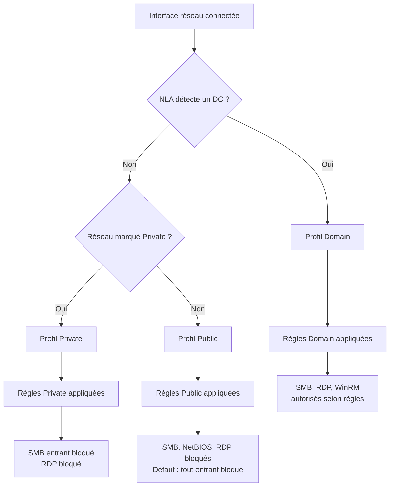

---
tags:
  - hardening
  - firewall
  - réseau
  - profils
---

# Windows Defender Firewall

!!! abstract "Ce que couvre ce chapitre"
    - Comprendre pourquoi le pare-feu local reste indispensable, même derrière un firewall périmétrique.
    - Distinguer les trois profils réseau et leurs conditions d'activation.
    - Déployer des règles via GPO et identifier les clés de registre correspondantes.
    - Appliquer un jeu de règles de blocage recommandées pour limiter le mouvement latéral.

Le pare-feu périmétrique protège la frontière nord-sud.
Le pare-feu local protège chaque poste individuellement,
y compris contre les flux est-ouest à l'intérieur du réseau.

Ce sont deux mesures complémentaires.
Supprimer l'une parce que l'autre existe
revient à retirer la serrure d'un appartement
parce que l'immeuble a un digicode.

## 1. Pourquoi le pare-feu local reste indispensable

### 1.1 Défense en profondeur

Un attaquant qui a franchi le périmètre se retrouve
sur le réseau interne avec une connectivité souvent large.
Le pare-feu local de chaque poste constitue alors
la seule barrière entre lui et les services exposés localement.

Sans cette couche, un mouvement latéral via `SMB`, `RDP`
ou `WinRM` ne rencontre aucune résistance réseau côté poste.

### 1.2 Mouvement latéral

Les outils offensifs post-compromission exploitent
des protocoles légitimes déjà ouverts sur le LAN.
`PsExec`, `WMI`, `WinRM` et les partages administratifs
fonctionnent tous sur des ports que le pare-feu local peut filtrer.

Restreindre ces flux au strict nécessaire
réduit la surface utilisable par l'attaquant.

### 1.3 Postes portables hors VPN

Un portable connecté au Wi-Fi d'un hôtel
ou d'un espace de coworking n'est plus protégé
par l'infrastructure réseau de l'entreprise.

Le profil `Public` du pare-feu local
devient alors la première et parfois la seule ligne de défense.

!!! quote "En résumé"
    Le pare-feu local ne fait pas doublon avec le périmétrique.
    Il couvre les angles que celui-ci ne peut pas traiter :
    le trafic est-ouest interne et les postes en mobilité.

## 2. Les trois profils réseau

Windows attribue un profil à chaque interface réseau connectée.
Ce profil détermine quel jeu de règles de pare-feu s'applique.

| Profil | Condition d'activation | Cas d'usage typique |
|---|---|---|
| **Domain** | Le poste détecte un contrôleur de domaine sur le réseau | LAN d'entreprise, VPN avec visibilité AD |
| **Private** | L'utilisateur ou une stratégie marque le réseau comme privé | Réseau domestique, lab isolé |
| **Public** | Tout réseau non identifié comme Domain ou Private | Wi-Fi public, hôtel, hotspot mobile |

Le profil `Domain` est attribué automatiquement
lorsque le service `NLA` (Network Location Awareness) détecte
qu'un contrôleur de domaine est joignable via LDAP.

Le profil `Public` est le plus restrictif par défaut.
C'est le profil de repli lorsque aucune condition
de détection Domain ou Private n'est remplie.

!!! warning "Profil par interface, pas par machine"
    Si un poste a deux interfaces actives (Ethernet + Wi-Fi),
    chacune peut avoir un profil différent.
    Les règles s'appliquent par profil, donc par interface.

!!! quote "En résumé"
    Le profil réseau est déterminé automatiquement par Windows.
    Le profil `Public` est le plus restrictif.
    Le profil `Domain` ne s'active que si un DC est joignable.

## 3. Déploiement des règles via GPO

### 3.1 Chemin GPO

Les règles du pare-feu se configurent dans :

```
Computer Configuration
  > Windows Settings
    > Security Settings
      > Windows Defender Firewall with Advanced Security
```

Ce noeud expose trois sous-sections : `Domain Profile`, `Private Profile`, `Public Profile`.
Chacune permet de définir l'état du pare-feu, l'action par défaut
et les règles spécifiques à ce profil.

### 3.2 Règles entrantes vs sortantes

| Direction | Rôle | Action par défaut recommandée |
|---|---|---|
| **Inbound** | Trafic initié depuis un hôte distant vers ce poste | **Block** (sauf exceptions explicites) |
| **Outbound** | Trafic initié depuis ce poste vers l'extérieur | **Allow** (filtrage sortant optionnel mais utile) |

!!! tip "Bonne pratique"
    Commencez par durcir les règles entrantes.
    Le filtrage sortant est plus complexe à maintenir
    et peut bloquer des flux légitimes si mal calibré.

### 3.3 Types de règles

Le pare-feu Windows supporte trois critères principaux de filtrage :

- **Par programme** : chemin de l'exécutable autorisé ou bloqué.
- **Par port** : numéro de port TCP ou UDP, avec ou sans restriction d'adresse source.
- **Par service** : nom du service Windows associé à la règle.

Ces critères peuvent se combiner.
Une règle peut par exemple autoriser `svchost.exe`
uniquement sur le port `53/UDP` pour le service `Dnscache`.

!!! quote "En résumé"
    Les règles GPO du pare-feu se déploient par profil.
    Bloquer le trafic entrant par défaut et n'ouvrir que le strict nécessaire
    est le principe fondamental.

## 4. Clés de registre du pare-feu

Les GPO du pare-feu écrivent dans la ruche `HKLM\SOFTWARE\Policies\Microsoft\WindowsFirewall`.
Chaque profil dispose de sa propre sous-clé.

| Clé de registre | Type | Valeur | Effet |
|---|---|---|---|
| `DomainProfile\EnableFirewall` | `REG_DWORD` | `1` | Active le pare-feu sur le profil Domain |
| `PrivateProfile\EnableFirewall` | `REG_DWORD` | `1` | Active le pare-feu sur le profil Private |
| `PublicProfile\EnableFirewall` | `REG_DWORD` | `1` | Active le pare-feu sur le profil Public |
| `PublicProfile\DefaultInboundAction` | `REG_DWORD` | `1` | Bloque le trafic entrant par défaut sur Public |

!!! info "Racine du chemin"
    Toutes ces clés se trouvent sous :
    `HKLM\SOFTWARE\Policies\Microsoft\WindowsFirewall\`

!!! danger "EnableFirewall = 0"
    Positionner `EnableFirewall` à `0` sur n'importe quel profil
    désactive complètement le pare-feu pour ce profil.
    C'est l'équivalent d'ouvrir toutes les portes d'un couloir.

!!! quote "En résumé"
    Les clés sous `WindowsFirewall\<Profil>` contrôlent
    l'état et le comportement par défaut de chaque profil.
    `EnableFirewall = 1` et `DefaultInboundAction = 1` sont les valeurs de durcissement.

## 5. Règles de blocage recommandées

### 5.1 Bloquer SMB en entrée hors profil Domain

Les ports `445/TCP` et `139/TCP` servent aux partages de fichiers.
Sur les profils `Private` et `Public`,
aucun poste standard n'a besoin de recevoir des connexions SMB.

!!! example "Règle GPO"
    Créer une règle entrante de type **Port** :
    protocole `TCP`, ports `445, 139`, profils `Private` et `Public`,
    action **Block**.

### 5.2 Bloquer NetBIOS sur profil Public

Les ports `137/UDP` et `138/UDP` sont utilisés par NetBIOS Name Service
et NetBIOS Datagram Service.
Ces protocoles exposent le poste à des attaques de résolution de noms
sur des réseaux non maîtrisés.

### 5.3 Limiter RDP au profil Domain

Le port `3389/TCP` ne devrait être accessible
que depuis le réseau d'entreprise.
Restreindre RDP au profil `Domain` empêche
toute connexion Bureau à distance depuis un réseau public ou privé non maîtrisé.

| Règle | Ports | Profils concernés | Action |
|---|---|---|---|
| Bloquer SMB entrant | `445/TCP`, `139/TCP` | Private, Public | Block |
| Bloquer NetBIOS | `137/UDP`, `138/UDP` | Public | Block |
| Limiter RDP | `3389/TCP` | Private, Public | Block |
| Autoriser RDP | `3389/TCP` | Domain | Allow (avec restriction source) |

!!! tip "Restriction d'adresse source"
    Même sur le profil `Domain`, limitez RDP
    aux sous-réseaux d'administration identifiés.
    Une règle `Allow` sans restriction de source
    autorise tout le segment Domain à se connecter.

!!! quote "En résumé"
    Bloquer SMB, NetBIOS et RDP sur les profils non-Domain
    réduit drastiquement la surface d'attaque latérale
    sans impacter les usages métier normaux.

## 6. Ne jamais désactiver le pare-feu

Certaines organisations désactivent le pare-feu local via GPO
pour éviter les tickets de support liés à des flux bloqués.

C'est une erreur structurelle.

!!! danger "Risques de la désactivation"
    - Tous les ports de la machine deviennent accessibles depuis le réseau.
    - Le mouvement latéral ne rencontre plus aucune friction.
    - Les postes portables perdent toute protection hors périmètre.
    - Le profil `Public` n'a plus aucun effet protecteur.

La bonne approche est de maintenir le pare-feu actif
et de créer des exceptions ciblées pour les flux légitimes.
Un pare-feu avec des règles bien documentées
est toujours préférable à un pare-feu désactivé.

!!! quote "En résumé"
    Désactiver le pare-feu local via GPO supprime une couche entière de défense.
    Créer des règles d'exception ciblées est la méthode correcte.

## 7. Flux de décision par profil



## 8. Tableau récapitulatif

| Profil | Règle recommandée | Clé de registre | Risque si absent |
|---|---|---|---|
| Domain | Pare-feu actif, entrant filtré | `DomainProfile\EnableFirewall = 1` | Mouvement latéral facilité sur le LAN |
| Private | SMB et RDP entrants bloqués | `PrivateProfile\EnableFirewall = 1` | Exposition sur réseaux non maîtrisés |
| Public | Tout entrant bloqué par défaut | `PublicProfile\EnableFirewall = 1` + `DefaultInboundAction = 1` | Poste ouvert sur Wi-Fi public |
| Tous | Ne jamais désactiver | `EnableFirewall` ne doit jamais être à `0` | Suppression totale de la couche réseau locale |

!!! quote "En résumé"
    Le pare-feu Windows Defender est une brique de hardening à part entière.
    Activé sur les trois profils, avec des règles entrantes restrictives
    et des exceptions documentées, il réduit la surface d'attaque réseau
    de chaque poste sans dépendre de l'infrastructure périmétrique.

!!! tip "Voir aussi"
    - :material-shield-lock: [Windows Firewall with Advanced Security via GPO](../bible-gpo/14-firewall.md) — Bible GPO
    - :material-shield-account: [Wi-Fi, VPN et 802.1X via GPO](../gpo-pour-les-admins/16-wifi-vpn.md) — GPO Admins
