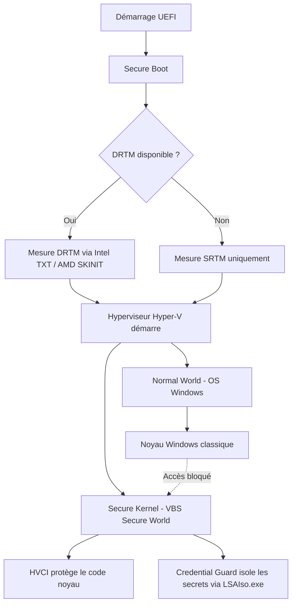

---
tags:
  - hardening
  - secured-core
  - firmware
  - VBS
---

# Secured-Core PC

!!! abstract "Ce que couvre ce chapitre"
    - Comprendre ce que désigne le label Secured-Core PC et pourquoi il va plus loin que Secure Boot.
    - Identifier les composants matériels et firmware requis.
    - Comprendre le rôle de VBS, HVCI et System Guard.
    - Identifier les clés de registre et les vérifications de conformité.

Un poste Windows peut démarrer proprement
et être compromis avant même que l'utilisateur ne se connecte.
Les attaques firmware, les rootkits noyau
et les manipulations de la chaîne de démarrage
ciblent les couches que le système d'exploitation ne surveille pas lui-même.

Secured-Core PC est la réponse de Microsoft à cette classe de menaces.
Le label désigne un ensemble de garanties matérielles et logicielles
qui protègent le poste avant, pendant et après le démarrage.

## 1. Qu'est-ce qu'un Secured-Core PC

### 1.1 Périmètre du label

Secured-Core PC n'est pas une fonctionnalité unique.
C'est un ensemble de prérequis matériels, firmware et logiciels
que le constructeur et le système d'exploitation doivent satisfaire conjointement.

L'objectif est de protéger le chemin de démarrage
et d'isoler les secrets du système,
même face à un attaquant disposant d'un accès physique
ou d'une capacité de modification firmware.

Les composants couverts par le label sont les suivants :

| Composant | Rôle | Prérequis |
|---|---|---|
| UEFI Secure Boot | Valide la chaîne de chargement au démarrage | Firmware UEFI en mode natif |
| TPM 2.0 | Stockage matériel des mesures et des secrets | Puce TPM 2.0 discrète ou firmware |
| DRTM | Mesure dynamique de l'état du système | Intel TXT ou AMD SKINIT |
| VBS | Isolation matérielle du noyau via hyperviseur | CPU avec virtualisation + SLAT |
| HVCI | Intégrité du code noyau imposée par le Secure Kernel | VBS actif |
| System Guard | Attestation de l'intégrité du poste après démarrage | DRTM + TPM 2.0 |

### 1.2 Ce que Secured-Core ajoute à Secure Boot

Secure Boot valide la chaîne de chargement UEFI.
Il vérifie que le bootloader, le noyau
et les drivers de démarrage sont signés par une autorité reconnue.

C'est une condition nécessaire, mais pas suffisante.

Secured-Core va plus loin sur trois axes :

- **Isolation matérielle du noyau** via VBS :
  le noyau Windows classique ne peut pas accéder
  aux secrets gérés dans le Secure Kernel.
- **Attestation firmware** via DRTM :
  l'état du firmware est mesuré dynamiquement,
  pas seulement au moment de la mise sous tension.
- **Protection des secrets** dans une enclave matérielle :
  Credential Guard isole les secrets d'authentification
  via `LSAIso.exe` dans un environnement inaccessible au système principal.

!!! info "Secure Boot est une condition nécessaire, pas suffisante"
    Secure Boot protège la chaîne de démarrage.
    Secured-Core protège aussi le noyau à l'exécution,
    les secrets en mémoire et l'intégrité du firmware après boot.

!!! quote "En résumé"
    Secured-Core PC est un label qui impose des garanties matérielles et logicielles
    au-delà de Secure Boot. Il couvre l'isolation du noyau, l'attestation firmware
    et la protection des secrets via une combinaison de VBS, HVCI, DRTM et TPM 2.0.

## 2. Virtualization-Based Security (VBS)

### 2.1 Principe

VBS utilise l'hyperviseur Windows (Hyper-V)
pour créer un environnement d'exécution isolé du noyau principal.

Le poste fonctionne alors avec deux zones distinctes :

- **Normal World** : le noyau Windows classique,
  les drivers et les applications.
- **Secure World** : le Secure Kernel,
  qui gère les secrets et valide l'intégrité du code noyau.

Les secrets gérés dans le Secure World
ne sont pas accessibles depuis le Normal World.
Même un attaquant avec des droits SYSTEM
dans le noyau classique ne peut pas lire
la mémoire du Secure Kernel.

### 2.2 Composants qui s'appuient sur VBS

VBS est une fondation sur laquelle s'appuient plusieurs mécanismes de sécurité.

| Composant | Dépendance VBS | Effet |
|---|---|---|
| Credential Guard | Oui | Isole les secrets d'authentification via `LSAIso.exe`, protege les hashes NTLM et tickets Kerberos |
| HVCI | Oui | Valide l'intégrité du code noyau en continu depuis le Secure World |
| Virtual TPM | Oui (Hyper-V Gen 2) | Fournit un TPM virtuel aux machines virtuelles |
| Windows Defender Application Guard | Oui | Isole le navigateur dans un conteneur matériel |

### 2.3 Prérequis matériels VBS

VBS ne fonctionne pas sur n'importe quel matériel.
Les prérequis suivants sont tous nécessaires :

- **CPU** avec extensions de virtualisation : Intel VT-x ou AMD-V.
- **SLAT** (Second Level Address Translation) :
  Intel EPT ou AMD NPT.
- **IOMMU** : Intel VT-d ou AMD-Vi,
  pour protéger contre les attaques DMA.
- **UEFI** en mode 64 bits avec Secure Boot actif.
- **TPM 2.0** recommandé pour le stockage des mesures.

!!! warning "VBS sans IOMMU est moins robuste"
    Sans IOMMU, les attaques DMA (via Thunderbolt, PCIe, FireWire)
    peuvent contourner l'isolation mémoire de VBS.
    L'IOMMU restreint les accès DMA des périphériques
    aux seules zones mémoire autorisées.

!!! quote "En résumé"
    VBS crée deux zones isolées sur le poste via l'hyperviseur.
    Le Secure World protège les secrets et valide le code noyau.
    Le Normal World ne peut pas accéder à la mémoire du Secure Kernel,
    même avec les plus hauts privilèges.

## 3. HVCI (Hypervisor-Protected Code Integrity)

### 3.1 Rôle

HVCI impose que tout code exécuté dans le noyau Windows
soit signé et validé par le Secure Kernel avant exécution.

Un rootkit qui tente d'injecter du code non signé dans le noyau
est bloqué par cette validation.
Le noyau classique (Normal World) ne peut pas
charger un driver ou un module
sans que le Secure Kernel l'ait d'abord approuvé.

La différence avec Secure Boot est temporelle.
Secure Boot valide au démarrage.
HVCI valide en continu, à chaque chargement de code noyau.

### 3.2 Clés de registre HVCI

Les clés HVCI se trouvent sous `HKLM\SYSTEM\CurrentControlSet\Control\DeviceGuard`.

| Clé | Type | Valeur | Effet |
|---|---|---|---|
| `EnableVirtualizationBasedSecurity` | `REG_DWORD` | `1` | Active VBS sur le poste |
| `Scenarios\HypervisorEnforcedCodeIntegrity\Enabled` | `REG_DWORD` | `1` | Active HVCI |
| `RequirePlatformSecurityFeatures` | `REG_DWORD` | `1` | Exige Secure Boot |
| `RequirePlatformSecurityFeatures` | `REG_DWORD` | `3` | Exige Secure Boot + DMA Protection |

!!! danger "Incompatibilité drivers"
    HVCI bloque les drivers non signés ou mal signés.
    Sur un parc avec des drivers anciens (imprimantes, périphériques industriels),
    l'activation sans test préalable peut provoquer un écran bleu (BSOD)
    ou un périphérique inutilisable.

### 3.3 Vérification

Plusieurs méthodes permettent de confirmer que HVCI est actif.

**Via `msinfo32.exe`** : ouvrir avec ++win+r++ puis taper `msinfo32`.
Vérifier les lignes suivantes :

- `Virtualization-based security` : doit indiquer `Running`.
- `Virtualization-based security Services Running` :
  doit inclure `Hypervisor enforced Code Integrity`.

**Via PowerShell** :

```powershell
Get-CimInstance -ClassName Win32_DeviceGuard -Namespace root\Microsoft\Windows\DeviceGuard |
    Select-Object VirtualizationBasedSecurityStatus, SecurityServicesRunning
```

!!! tip "Valeurs de SecurityServicesRunning"
    La valeur `1` indique Credential Guard.
    La valeur `2` indique HVCI.
    Si les deux sont actifs, le champ retourne `{1, 2}`.

!!! quote "En résumé"
    HVCI protège l'intégrité du code noyau en continu, pas seulement au démarrage.
    Les clés sous `DeviceGuard` contrôlent son activation.
    La vérification via `msinfo32` ou PowerShell confirme l'état réel du poste.

## 4. System Guard et DRTM

### 4.1 System Guard Runtime Monitor

System Guard utilise DRTM pour mesurer l'état du système
après le démarrage, pas seulement au moment du boot.

Les mesures sont stockées dans le TPM (valeurs PCR)
et peuvent être transmises à un serveur de gestion
pour attester l'intégrité du poste à distance.

Ce mécanisme permet de répondre à une question simple :
le poste est-il dans l'état attendu en ce moment,
ou quelque chose a-t-il été modifié depuis le dernier démarrage fiable ?

### 4.2 DRTM vs SRTM

La mesure de l'intégrité du système repose sur deux approches.

| Critère | SRTM (Static) | DRTM (Dynamic) |
|---|---|---|
| Point de départ | Mise sous tension (reset vector) | Instruction CPU spécifique à tout moment |
| Chaîne mesurée | UEFI → bootloader → OS | État courant du système à l'instant T |
| Mécanisme CPU | Intégré au démarrage UEFI | Intel TXT ou AMD SKINIT |
| Vulnérabilité | Si le firmware est compromis avant la mesure, SRTM ne le détecte pas | Peut mesurer après une compromission firmware |
| Usage principal | Secure Boot, mesure de démarrage | Attestation d'état, System Guard |

SRTM mesure depuis la mise sous tension.
Si le firmware est compromis avant que la mesure ne commence,
SRTM ne le détecte pas car il fait confiance au point de départ.

DRTM peut prendre une mesure à tout moment durant l'exécution.
Il utilise une instruction CPU (Intel `GETSEC[SENTER]` ou AMD `SKINIT`)
pour établir un point de confiance indépendant du firmware.

!!! info "Attestation d'état courant"
    DRTM est le mécanisme qui permet l'attestation de l'état courant du poste,
    pas seulement de son démarrage. C'est la base de System Guard Runtime Monitor.

!!! quote "En résumé"
    SRTM mesure le démarrage. DRTM mesure l'état courant.
    System Guard utilise DRTM pour attester l'intégrité du poste
    à tout moment, indépendamment de la chaîne de démarrage.

## 5. Activation via GPO

### 5.1 Chemin GPO

Les paramètres de Device Guard se configurent dans :

```
Computer Configuration
  > Administrative Templates
    > System
      > Device Guard
```

Le paramètre principal est **Turn on Virtualization Based Security**.
Il expose les sous-options suivantes :

- **Platform Security Level** : Secure Boot, ou Secure Boot and DMA Protection.
- **Virtualization Based Protection of Code Integrity** : active HVCI.
- **Credential Guard Configuration** : active Credential Guard via VBS.

### 5.2 Clés de registre associées

La plupart des cles se trouvent sous `HKLM\SYSTEM\CurrentControlSet\Control\DeviceGuard`, **sauf** `LsaCfgFlags` qui appartient a `HKLM\SYSTEM\CurrentControlSet\Control\Lsa`.

| Valeur | Type | Données | Effet |
|---|---|---|---|
| `EnableVirtualizationBasedSecurity` | `REG_DWORD` | `1` | Active VBS |
| `RequirePlatformSecurityFeatures` | `REG_DWORD` | `3` | Exige Secure Boot + DMA Protection |
| `Scenarios\HypervisorEnforcedCodeIntegrity\Enabled` | `REG_DWORD` | `1` | Active HVCI |
| `Control\Lsa\LsaCfgFlags` | `REG_DWORD` | `1` | Active Credential Guard via VBS (avec verrou UEFI) |

!!! info "Valeurs de LsaCfgFlags"
    `1` = Credential Guard activé avec verrou UEFI (nécessite une intervention manuelle pour désactiver).
    `2` = Credential Guard activé sans verrou (désactivable par GPO).
    La valeur `1` est recommandée pour le hardening.

### 5.3 Déploiement progressif

Un déploiement HVCI sur un parc hétérogène
nécessite une phase de validation préalable.

!!! tip "Approche recommandée"
    Déployez d'abord sur un groupe pilote composé de matériel certifié Secured-Core.
    Testez les drivers critiques (imprimantes, VPN, agents de sécurité).
    Surveillez les événements `CodeIntegrity` dans le journal système
    avant d'étendre au parc complet.

Les drivers incompatibles HVCI provoquent des comportements variés :
BSOD au démarrage, périphérique non fonctionnel,
ou refus de chargement silencieux.

Le mode audit de HVCI permet de journaliser les violations
sans bloquer le chargement des drivers non conformes.
Ce mode est utile pour identifier les incompatibilités
avant de passer en mode enforcement.

!!! quote "En résumé"
    La GPO Device Guard contrôle VBS, HVCI et Credential Guard.
    Le déploiement progressif sur matériel certifié réduit le risque de BSOD.
    Le mode audit permet d'identifier les drivers incompatibles avant enforcement.

## 6. Vérification de conformité

### 6.1 msinfo32

Ouvrir avec ++win+r++ puis taper `msinfo32`.
Les lignes suivantes confirment l'état Secured-Core :

| Ligne msinfo32 | Valeur attendue |
|---|---|
| Virtualization-based security | Running |
| Virtualization-based security Services Running | Hypervisor enforced Code Integrity, Credential Guard |
| Device Guard Virtualization based security | Running |
| Hyper-V | Yes |
| Secure Boot State | On |

### 6.2 PowerShell

```powershell
Get-CimInstance -ClassName Win32_DeviceGuard `
    -Namespace root\Microsoft\Windows\DeviceGuard |
    Select-Object VirtualizationBasedSecurityStatus,
                  SecurityServicesRunning,
                  SecurityServicesConfigured
```

| Valeur numérique | Signification pour `VirtualizationBasedSecurityStatus` |
|---|---|
| `0` | VBS non activé |
| `1` | VBS activé mais non en cours d'exécution |
| `2` | VBS en cours d'exécution |

| Valeur numérique | Signification pour `SecurityServicesRunning` |
|---|---|
| `1` | Credential Guard |
| `2` | HVCI |
| `{1, 2}` | Les deux services sont actifs |

### 6.3 Event Log

Le journal `Microsoft-Windows-DeviceGuard/Operational`
enregistre les événements liés à VBS et HVCI.

| Event ID | Signification |
|---|---|
| 7000 | Activation de VBS |
| 3065 | Violation de Code Integrity en mode audit |
| 3066 | Violation de Code Integrity en mode enforcement |

!!! tip "Surveillance proactive"
    Collectez les événements 3065 et 3066 via votre SIEM.
    En mode audit, les événements 3065 identifient
    les drivers qui seront bloqués en mode enforcement.

!!! quote "En résumé"
    La vérification s'effectue via `msinfo32`, PowerShell ou le journal d'événements.
    `VirtualizationBasedSecurityStatus = 2` confirme que VBS est en cours d'exécution.
    Les événements CodeIntegrity permettent de détecter les incompatibilités drivers.

## 7. Tableau récapitulatif

| Composant | Clé de registre | Effet | Prérequis matériel |
|---|---|---|---|
| VBS | `DeviceGuard\EnableVirtualizationBasedSecurity = 1` | Isolation matérielle via hyperviseur | CPU VT-x/AMD-V + SLAT + IOMMU |
| HVCI | `DeviceGuard\Scenarios\HypervisorEnforcedCodeIntegrity\Enabled = 1` | Intégrité du code noyau en continu | VBS actif |
| Credential Guard | `Control\Lsa\LsaCfgFlags = 1` | Isolation des secrets via `LSAIso.exe` dans le Secure World | VBS actif + TPM 2.0 |
| Secure Boot + DMA | `DeviceGuard\RequirePlatformSecurityFeatures = 3` | Exige Secure Boot et protection DMA | UEFI + IOMMU |
| System Guard / DRTM | Configuration firmware + System Guard policy | Attestation de l'état courant du poste | Intel TXT ou AMD SKINIT + TPM 2.0 |



!!! quote "En résumé"
    Secured-Core PC combine Secure Boot, VBS, HVCI, DRTM et TPM 2.0
    pour protéger le poste depuis le firmware jusqu'au noyau en cours d'exécution.
    L'hyperviseur crée une frontière matérielle entre le système et ses secrets.
    Le déploiement passe par la GPO Device Guard et une validation préalable des drivers.

!!! tip "Voir aussi"
    - :material-shield-account: [Secured-Core PC](../gpo-pour-les-admins/30-secured-core.md) — GPO Admins
