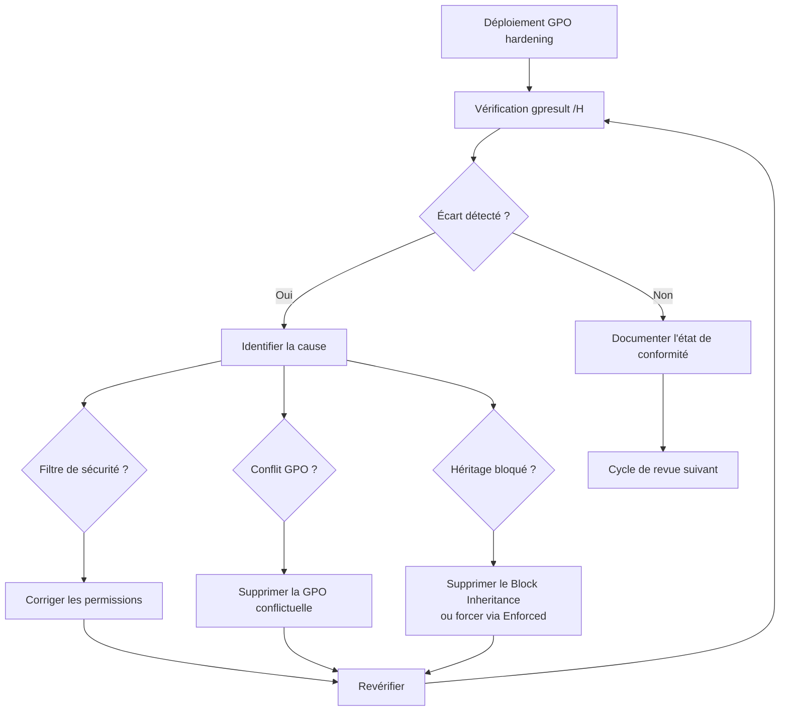

---
tags:
  - hardening
  - audit
  - conformité
  - RSoP
  - GPO
---

# Audit de conformité et RSoP

!!! abstract "Ce que couvre ce chapitre"
    - Comprendre pourquoi un déploiement GPO n'est pas une garantie de conformité.
    - Utiliser RSoP et gpresult pour vérifier les GPO réellement appliquées.
    - Identifier les conflits, héritages et filtres qui modifient le résultat.
    - Automatiser une vérification de conformité légère via PowerShell.

Déployer une GPO ne signifie pas que les paramètres sont appliqués.
L'héritage, les filtres de sécurité, les WMI filters,
les liens désactivés et les conflits de priorité entre GPO
peuvent silencieusement modifier le résultat.

Un audit de conformité vérifie ce qui est réellement en vigueur
sur le poste, pas ce qui devrait l'être en théorie.

## 1. Pourquoi le déploiement GPO n'est pas une garantie

### 1.1 Les raisons d'un écart de conformité

Un paramètre GPO peut ne pas atteindre sa cible
pour de nombreuses raisons, toutes silencieuses.

| Cause d'écart | Détection | Outil |
|---|---|---|
| GPO liée au mauvais niveau AD (OU, domaine, site) | Vérifier les liens dans GPMC | GPMC |
| GPO désactivée (lien ou GPO entière) | Statut du lien dans GPMC | GPMC |
| Filtre de sécurité : permissions de lecture manquantes | Section "Denied GPO" de gpresult | `gpresult /H` |
| WMI Filter : le filtre exclut le poste | Évaluer le filtre WMI manuellement | GPMC, `gwmi` |
| Block Inheritance sur l'OU | Icône de verrou dans GPMC | GPMC |
| Conflit de priorité : GPO plus haute écrase le paramètre | Comparer les GPO appliquées | `rsop.msc`, `gpresult` |
| Paramètre local écrasant la GPO (rare) | Vérifier la clé de registre directement | `regedit`, PowerShell |

### 1.2 Conséquences pratiques

Un poste qui semble dans l'OU cible
peut ne pas avoir reçu la GPO de hardening.

Les paramètres de sécurité peuvent être écrasés
par une GPO plus ancienne ou moins restrictive,
créée pour un besoin temporaire et jamais supprimée.

Sans vérification active,
ces écarts restent invisibles.
Le poste apparaît dans le bon scope AD
mais fonctionne avec une configuration non durcie.

!!! warning "L'écart le plus courant"
    La cause d'écart la plus fréquente en entreprise
    est la GPO d'exception non documentée.
    Elle a été créée en urgence pour résoudre un problème,
    elle écrase un paramètre de hardening,
    et personne ne sait qu'elle existe encore.

!!! quote "En résumé"
    Un déploiement GPO est une intention, pas une garantie.
    Filtres, héritages, liens désactivés et conflits de priorité
    peuvent empêcher un paramètre d'atteindre sa cible.
    Seule une vérification sur le poste confirme la conformité.

## 2. RSoP (Resultant Set of Policy)

### 2.1 Qu'est-ce que RSoP

RSoP calcule le jeu de paramètres effectivement appliqué
à un poste ou un utilisateur donné.

Il tient compte de l'héritage, des filtres,
des priorités et des conflits entre GPO.
Le résultat montre la GPO gagnante pour chaque paramètre.

Deux modes existent :

| Mode | Usage | Limites |
|---|---|---|
| **Logging** | État réel du poste (GPO déjà appliquées) | Ne montre que les GPO qui ont été appliquées |
| **Planning** | Simulation (que se passerait-il si le poste était dans une autre OU) | Ne reflète pas l'état réel |

### 2.2 Lancer RSoP en mode Logging

Sur le poste ciblé, ouvrir avec ++win+r++ puis taper `rsop.msc`.

La console affiche les paramètres effectifs
organisés par catégorie (Computer Configuration, User Configuration).
Chaque paramètre indique la GPO source.

Les paramètres en conflit montrent la GPO gagnante.
Les GPO perdantes ne sont pas affichées dans RSoP,
ce qui est une limite importante.

### 2.3 Limitations de RSoP

RSoP ne couvre pas tous les types de paramètres.
Certaines extensions CSE (Client-Side Extensions)
ne sont pas représentées dans la console RSoP :

- Les règles de pare-feu Windows.
- Les politiques AppLocker et WDAC.
- Les paramètres de sécurité avancés
  qui ne passent pas par les templates ADMX.

RSoP ne montre pas les GPO qui auraient dû s'appliquer
mais ne se sont pas appliquées (filtre, lien désactivé).
Pour ces cas, `gpresult` est plus informatif.

!!! tip "Préférer gpresult"
    Utilisez `gpresult` plutôt que `rsop.msc`
    pour les diagnostics en ligne de commande.
    `gpresult` offre plus de détails sur les GPO filtrées
    et les raisons d'exclusion.

!!! quote "En résumé"
    RSoP montre les paramètres effectivement appliqués sur un poste.
    Il identifie la GPO gagnante par paramètre.
    Ses limites (CSE non couvertes, GPO filtrées invisibles)
    rendent `gpresult` plus adapté au diagnostic de hardening.

## 3. gpresult — l'outil de diagnostic GPO

### 3.1 Syntaxe de base

| Commande | Effet |
|---|---|
| `gpresult /R` | Résumé des GPO appliquées en mode texte |
| `gpresult /H rapport.html` | Rapport HTML détaillé |
| `gpresult /S <serveur> /U <domaine\user> /R` | Diagnostic à distance |
| `gpresult /Scope Computer` | GPO d'ordinateur uniquement |
| `gpresult /Scope User` | GPO utilisateur uniquement |

!!! info "Élévation requise"
    `gpresult /Scope Computer` nécessite une invite
    avec des droits administrateur.
    Sans élévation, seules les GPO utilisateur sont affichées.

### 3.2 Lire la sortie

Le rapport `gpresult /H` contient deux sections clés :

**Applied Group Policy Objects** :
liste les GPO effectivement appliquées au poste,
dans l'ordre de priorité (de la plus prioritaire à la moins prioritaire).

**Denied Group Policy Objects** :
liste les GPO liées au périmètre AD du poste
mais non appliquées, avec la raison de l'exclusion.

| Raison d'exclusion | Signification |
|---|---|
| `Inaccessible` | Le poste n'a pas les permissions de lecture sur la GPO |
| `Disabled Link` | Le lien GPO est désactivé sur l'OU |
| `Empty` | La GPO ne contient aucun paramètre dans le scope Computer ou User |
| `WMI Filter` | Le filtre WMI a exclu le poste |
| `Security Filtering` | Le filtre de sécurité ne s'applique pas au poste |

### 3.3 Vérifier un paramètre spécifique

`gpresult` montre quelles GPO sont appliquées
mais ne liste pas chaque valeur de registre individuelle.

Pour vérifier qu'un paramètre de hardening est effectivement
à la bonne valeur, combinez deux vérifications :

1. `gpresult /H` pour confirmer que la GPO source est appliquée.
2. `Get-ItemProperty` pour lire la valeur de registre effective.

```powershell
# Vérifier que WDigest est désactivé
Get-ItemProperty `
    "HKLM:\SYSTEM\CurrentControlSet\Control\SecurityProviders\WDigest" `
    -Name UseLogonCredential
```

Si la GPO est appliquée (`gpresult` la montre dans "Applied")
mais la valeur de registre est incorrecte,
il y a un conflit avec une GPO de priorité supérieure
ou un paramètre local qui écrase la valeur.

!!! quote "En résumé"
    `gpresult` est l'outil de diagnostic GPO le plus complet.
    Il montre les GPO appliquées, les GPO refusées et les raisons.
    Pour vérifier une valeur précise, combinez `gpresult`
    avec la lecture directe de la clé de registre.

## 4. Identifier les conflits de GPO

### 4.1 Priorité et ordre d'application

L'ordre d'application des GPO suit la hiérarchie AD :

```
Local Policy → Site → Domain → OU parent → OU enfant
```

La GPO la plus proche de l'objet dans l'AD a la priorité la plus haute.
Elle écrase les paramètres définis par les GPO plus éloignées.

À priorité égale dans une même OU,
le numéro de lien détermine l'ordre :
le lien avec le numéro le plus bas a la priorité la plus haute.

Le flag **Enforced** (anciennement "No Override")
force une GPO à ne jamais être écrasée
par une GPO de priorité plus haute.
C'est un mécanisme puissant mais à utiliser avec parcimonie.

### 4.2 Détecter les conflits

| Source de conflit | Comment le détecter | Comment le résoudre |
|---|---|---|
| GPO d'exception sur une OU enfant | `gpresult /H` : la GPO d'exception apparaît avec priorité plus haute | Supprimer la GPO d'exception ou la limiter via filtre de sécurité |
| Block Inheritance sur une OU | GPMC : icône de verrou sur l'OU | Supprimer le blocage ou forcer la GPO de hardening via Enforced |
| GPO fonctionnelle qui réécrit un paramètre de sécurité | `rsop.msc` : la GPO fonctionnelle gagne | Déplacer le paramètre de sécurité hors de la GPO fonctionnelle |
| Deux GPO de hardening en conflit | Comparer les deux GPO dans GPMC | Fusionner les GPO ou clarifier la priorité |

### 4.3 Conflits courants en hardening

Trois scénarios reviennent régulièrement :

**GPO d'exception temporaire jamais supprimée.**
Un projet pilote a nécessité la réactivation de SMBv1
pour un applicatif ancien. La GPO d'exception est toujours active
six mois plus tard, alors que l'applicatif a été remplacé.

**Héritage bloqué sur une OU de test.**
Les postes de cette OU ne re��oivent pas la GPO de hardening.
Si des postes de production y sont déplacés par erreur,
ils perdent silencieusement leur durcissement.

**GPO de compatibilité qui réactive WDigest.**
Une GPO créée pour un applicatif ancien
positionne `UseLogonCredential = 1` pour résoudre
un problème d'authentification.
Elle écrase la GPO de hardening qui positionne la valeur à `0`.

!!! warning "Vecteur de réouverture principal"
    Les GPO d'exception non documentées sont le principal vecteur
    de réouverture des vulnérabilités que le hardening avait fermées.
    Chaque GPO d'exception doit avoir un propriétaire,
    une date de révision et un ticket de support d'origine.

!!! quote "En résumé"
    Les conflits de GPO suivent la hiérarchie AD.
    La GPO la plus proche du poste gagne.
    Les GPO d'exception non documentées sont la cause la plus fréquente
    de régression silencieuse du hardening.

## 5. Automatiser la vérification de conformité

### 5.1 Principe

La vérification la plus fiable ne passe pas par les GPO.
Elle lit directement les clés de registre sur le poste.

Les valeurs de registre sont la réalité.
Les GPO ne sont qu'un mécanisme de déploiement.
Un script de vérification indépendant détecte les écarts
même si les GPO semblent correctes dans GPMC.

### 5.2 Script de vérification niveau 1

Le script suivant vérifie les contrôles critiques du niveau 1
(référence : checklist chapitre 18).

```powershell
$checks = @(
    @{
        Name     = "WDigest désactivé"
        Key      = "HKLM:\SYSTEM\CurrentControlSet\Control\SecurityProviders\WDigest"
        Value    = "UseLogonCredential"
        Expected = 0
    },
    @{
        Name     = "RunAsPPL actif"
        Key      = "HKLM:\SYSTEM\CurrentControlSet\Control\LSA"
        Value    = "RunAsPPL"
        Expected = 1
    },
    @{
        Name     = "LmCompatibilityLevel = 5"
        Key      = "HKLM:\SYSTEM\CurrentControlSet\Control\LSA"
        Value    = "LmCompatibilityLevel"
        Expected = 5
    },
    @{
        Name     = "LLMNR désactivé"
        Key      = "HKLM:\SOFTWARE\Policies\Microsoft\Windows NT\DNSClient"
        Value    = "EnableMulticast"
        Expected = 0
    },
    @{
        Name     = "Script Block Logging actif"
        Key      = "HKLM:\SOFTWARE\Policies\Microsoft\Windows\PowerShell\ScriptBlockLogging"
        Value    = "EnableScriptBlockLogging"
        Expected = 1
    },
    @{
        Name     = "Pare-feu Domain actif"
        Key      = "HKLM:\SOFTWARE\Policies\Microsoft\WindowsFirewall\DomainProfile"
        Value    = "EnableFirewall"
        Expected = 1
    },
    @{
        Name     = "Pare-feu Public actif"
        Key      = "HKLM:\SOFTWARE\Policies\Microsoft\WindowsFirewall\PublicProfile"
        Value    = "EnableFirewall"
        Expected = 1
    },
    @{
        Name     = "MAPS Advanced"
        Key      = "HKLM:\SOFTWARE\Policies\Microsoft\Windows Defender\Spynet"
        Value    = "SpynetReporting"
        Expected = 2
    }
)

$results = foreach ($check in $checks) {
    try {
        $actual = Get-ItemPropertyValue -Path $check.Key `
            -Name $check.Value -ErrorAction Stop
        $status = if ($actual -eq $check.Expected) {
            "OK"
        } else {
            "ECART (valeur : $actual)"
        }
    } catch {
        $status = "ABSENT (clé ou valeur manquante)"
    }
    [PSCustomObject]@{
        Controle = $check.Name
        Statut   = $status
    }
}

$results | Format-Table -AutoSize
```

### 5.3 Interpréter les résultats

| Statut | Signification | Action |
|---|---|---|
| **OK** | La valeur est conforme | Aucune |
| **ECART** | La valeur est présente mais incorrecte | Vérifier les conflits GPO via `gpresult /H` |
| **ABSENT** | La clé ou la valeur n'existe pas | GPO non appliquée ou paramètre jamais déployé |

Un statut ABSENT ne signifie pas toujours un problème.
Certains paramètres n'existent en registre
que si la GPO a été appliquée au moins une fois.
Mais si la GPO devrait être appliquée et que la clé est absente,
c'est un signe de filtre, de lien désactivé ou de problème de réplication.

!!! tip "Exécution à distance"
    Ce script peut être exécuté à distance via `Invoke-Command`
    sur un ensemble de postes pour un audit rapide du parc.

!!! quote "En résumé"
    La vérification directe des clés de registre est la méthode
    la plus fiable pour confirmer la conformité.
    Un script PowerShell léger détecte les écarts
    indépendamment de l'état apparent des GPO.

## 6. Outils complémentaires

### 6.1 Microsoft Security Compliance Toolkit (SCT)

SCT fournit des outils pour importer et exporter
les GPO de baseline Microsoft.

- **LGPO.exe** : applique des GPO locales sans GPMC.
  Utile pour les postes standalone ou les images de déploiement.
- **PolicyAnalyzer** : compare deux ensembles de GPO
  ou l'état d'un poste avec une baseline de référence.
  Il identifie les écarts paramètre par paramètre.

### 6.2 Ping Castle et Purple Knight

**Ping Castle** audite la sécurité Active Directory
dans son ensemble, pas seulement les GPO.
Il identifie les GPO qui affaiblissent la posture de sécurité
et attribue un score de risque.

**Purple Knight** (Semperis) fait un audit similaire
avec un focus sur les indicateurs de compromission Active Directory.
Il détecte les configurations qui facilitent
les attaques de type DCSync, Golden Ticket ou Kerberoasting.

### 6.3 Intune Compliance Policies

Dans un contexte Intune, les politiques de conformité
vérifient l'état des postes de manière continue.

Elles peuvent détecter :
Defender désactivé, BitLocker absent,
version OS obsolète, pare-feu inactif.

| Outil | Type d'audit | Portée | Coût |
|---|---|---|---|
| `gpresult` / RSoP | GPO appliquées, conflits | Poste individuel | Gratuit (intégré) |
| LGPO / PolicyAnalyzer | Comparaison baseline | Poste ou image | Gratuit (SCT) |
| Ping Castle | Sécurité AD globale | Domaine entier | Community gratuit |
| Purple Knight | Indicateurs de compromission AD | Domaine entier | Gratuit |
| Intune Compliance | Conformité continue | Parc Intune | Licence Intune |

!!! quote "En résumé"
    `gpresult` et le script PowerShell couvrent le diagnostic immédiat.
    PolicyAnalyzer et Ping Castle offrent une vue plus large.
    Intune Compliance automatise la vérification continue
    pour les environnements cloud ou hybrides.

## 7. Tableau récapitulatif

| Outil | Usage principal | Commande ou accès | Limite principale |
|---|---|---|---|
| RSoP (`rsop.msc`) | Paramètres effectifs par poste | ++win+r++ `rsop.msc` | Ne montre pas les GPO filtrées |
| `gpresult` | Diagnostic complet GPO | `gpresult /H rapport.html` | Ne montre pas les valeurs de registre individuelles |
| Script PowerShell | Vérification des clés de registre | `Invoke-Command` à distance | Nécessite maintenance manuelle de la liste des clés |
| LGPO | GPO locales sans GPMC | `LGPO.exe /g dossier` | Postes standalone uniquement |
| PolicyAnalyzer | Comparaison baseline | Interface graphique SCT | Ne détecte pas les écarts en temps réel |
| Ping Castle | Audit sécurité AD | `PingCastle.exe --healthcheck` | Focus AD, pas poste individuel |
| Intune Compliance | Conformité continue | Portail Intune | Nécessite licence Intune |



!!! quote "En résumé"
    L'audit de conformité est le chaînon entre le déploiement et la réalité.
    `gpresult` identifie les GPO appliquées et refusées.
    Le script PowerShell vérifie les valeurs réelles en registre.
    Sans cette boucle de vérification, le hardening reste une déclaration d'intention.

!!! tip "Voir aussi"
    - :material-book-cog: [Audit et conformite du registre](../registre-pour-les-admins/03-audit-conformite.md) — Registre Admins
    - :material-shield-account: [Audit et conformite des GPO](../gpo-pour-les-admins/06-audit-conformite.md) — GPO Admins
