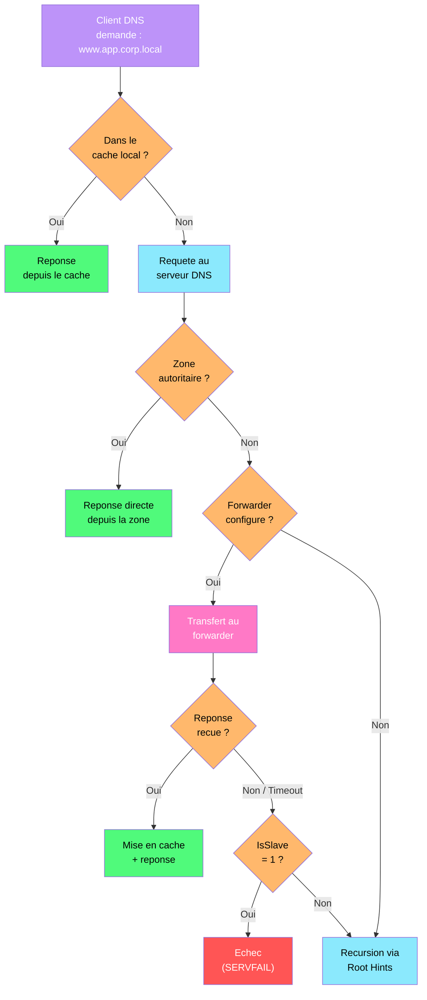

---
tags:
  - registre
  - dns
  - resolution
  - cache
  - zones
---

# DNS Server

!!! abstract "Ce que vous allez apprendre"
    - Configurer le service DNS Server via les cles de registre
    - Ajuster le cache DNS, le scavenging et les forwarders
    - Gerer les zones, le DNSSEC et les parametres client DNS
    - Diagnostiquer et corriger les problemes de resolution via le registre

---

## Parametres du service DNS Server



Un serveur DNS qui met 30 secondes a resoudre un nom, un cache qui retourne des enregistrements obsoletes, des zones qui ne se mettent plus a jour : tous ces problemes se diagnostiquent via les cles de registre du service DNS. Le service Windows DNS Server centralise sa configuration sous une seule cle.

### Emplacement principal

```
HKLM\SYSTEM\CurrentControlSet\Services\DNS\Parameters
```

Cette cle contient les parametres globaux du serveur DNS.

| Valeur | Type | Description | Defaut |
|--------|------|-------------|--------|
| `ListenAddresses` | REG_BINARY | Adresses IP sur lesquelles le serveur ecoute | Toutes les interfaces |
| `BootMethod` | REG_DWORD | Source de configuration : `1` = fichier, `2` = registre, `3` = AD | 3 (AD-integrated) |
| `RpcProtocol` | REG_DWORD | Protocoles RPC actives pour l'administration | 5 (TCP + named pipes) |
| `AdminConfigured` | REG_DWORD | `1` = le serveur a ete configure manuellement | 0 |
| `EnableDnsSec` | REG_DWORD | `1` = validation DNSSEC activee | 0 |
| `ForwardDelegations` | REG_DWORD | `1` = transmet les requetes pour les delegations non resolues | 0 |

```powershell
# Read DNS Server global parameters
Get-ItemProperty -Path "HKLM:\SYSTEM\CurrentControlSet\Services\DNS\Parameters" |
    Select-Object BootMethod, RpcProtocol, AdminConfigured
```

```title="Resultat attendu"
BootMethod RpcProtocol AdminConfigured
---------- ----------- ---------------
         3           5               1
```

### Logging et diagnostics

Le serveur DNS dispose de parametres de journalisation detaillee pour le depannage.

```
HKLM\SYSTEM\CurrentControlSet\Services\DNS\Parameters
```

| Valeur | Type | Description | Defaut |
|--------|------|-------------|--------|
| `LogLevel` | REG_DWORD | Masque binaire des evenements a journaliser | 0 |
| `LogFilePath` | REG_SZ | Chemin du fichier de log DNS | `%SystemRoot%\System32\dns\dns.log` |
| `LogFileMaxSize` | REG_DWORD | Taille maximale du fichier de log (octets) | 500000000 |
| `EventLogLevel` | REG_DWORD | Niveau de journalisation Event Log (0-7) | 4 |

Les bits du `LogLevel` controlent les categories d'evenements :

| Bit | Valeur hex | Categorie |
|-----|------------|-----------|
| 0 | 0x0001 | Requetes |
| 1 | 0x0010 | Notifications |
| 2 | 0x0020 | Mises a jour dynamiques |
| 4 | 0x0100 | Requetes sortantes |
| 5 | 0x0200 | Reponses entrantes |
| 8 | 0x1000 | Paquets TCP |
| 9 | 0x2000 | Paquets UDP |
| 15 | 0x8000 | Donnees detaillees des paquets |

```powershell
# Enable detailed DNS query logging
Set-ItemProperty -Path "HKLM:\SYSTEM\CurrentControlSet\Services\DNS\Parameters" `
    -Name "LogLevel" -Value 0x2321 -Type DWord

# Alternative: use the DNS Server PowerShell cmdlet
Set-DnsServerDiagnostics -All $true
```

```title="Resultat attendu"
aucune sortie. Les logs DNS detailles commenceront a s'ecrire dans dns.log.
```

!!! warning "Impact performance du logging"
    L'activation de tous les niveaux de logging (`LogLevel = 0xFFFF`) genere un **volume enorme de donnees** et peut degrader les performances du serveur. Activez le logging detaille uniquement pour le depannage, puis desactivez-le (`Set-DnsServerDiagnostics -All $false`).

!!! info "En resume"
    - Le service DNS Server stocke tous ses parametres sous `DNS\Parameters`
    - `BootMethod` a `3` indique une configuration integree a Active Directory
    - Le `LogLevel` permet un logging granulaire par type de trafic
    - Desactivez toujours le logging avance apres le depannage

---

## Configuration des zones

Les zones DNS definissent les domaines dont le serveur est autoritaire. En environnement AD, les zones sont generalement stockees dans Active Directory, mais leur configuration reste visible et modifiable dans le registre.

### Types de zones

```
HKLM\SYSTEM\CurrentControlSet\Services\DNS\Zones\<NomDeZone>
```

Chaque zone possede sa propre sous-cle avec les parametres suivants :

| Valeur | Type | Description |
|--------|------|-------------|
| `DatabaseFile` | REG_SZ | Nom du fichier de zone (si stockee en fichier) |
| `Type` | REG_DWORD | Type de zone : `1` = primary, `2` = secondary, `3` = stub, `4` = forwarder |
| `DsIntegrated` | REG_DWORD | `1` = stockee dans AD, `0` = fichier |
| `AllowUpdate` | REG_DWORD | `0` = pas de mise a jour dynamique, `1` = oui, `2` = securisee uniquement |
| `MasterServers` | REG_BINARY | Adresses IP des serveurs maitres (pour les zones secondaires) |

```powershell
# List all DNS zones and their types
Get-DnsServerZone | Select-Object ZoneName, ZoneType, IsDsIntegrated, DynamicUpdate |
    Format-Table -AutoSize
```

```title="Resultat attendu"
ZoneName                ZoneType IsDsIntegrated DynamicUpdate
--------                -------- -------------- -------------
corp.local              Primary            True        Secure
_msdcs.corp.local       Primary            True        Secure
0.168.192.in-addr.arpa  Primary            True        Secure
TrustAnchors            Primary            True          None
```

### Aging et scavenging

Le scavenging (nettoyage automatique) supprime les enregistrements DNS dynamiques obsoletes. C'est essentiel dans les environnements avec beaucoup de clients DHCP qui changent souvent d'adresse.

```
HKLM\SYSTEM\CurrentControlSet\Services\DNS\Zones\<NomDeZone>
```

| Valeur | Type | Description | Defaut |
|--------|------|-------------|--------|
| `Aging` | REG_DWORD | `1` = aging active pour cette zone | 0 |
| `NoRefreshInterval` | REG_DWORD | Duree (en heures) pendant laquelle un enregistrement ne peut pas etre rafraichi | 168 (7 jours) |
| `RefreshInterval` | REG_DWORD | Duree (en heures) apres laquelle un enregistrement non rafraichi devient eligible au scavenging | 168 (7 jours) |

```powershell
# Check aging/scavenging configuration for a zone
Get-DnsServerZoneAging -Name "corp.local"
```

```title="Resultat attendu"
ZoneName     AgingEnabled  NoRefreshInterval  RefreshInterval  ScavengeServers
--------     ------------  -----------------  ---------------  ---------------
corp.local          True   7.00:00:00         7.00:00:00       {192.168.1.10}
```

```powershell
# Enable aging on a zone
Set-DnsServerZoneAging -Name "corp.local" -Aging $true `
    -NoRefreshInterval 7.00:00:00 -RefreshInterval 7.00:00:00
```

```title="Resultat attendu"
aucune sortie si la commande reussit.
```

### Configurer le scavenging automatique au niveau du serveur

L'aging au niveau de la zone ne suffit pas : il faut aussi activer le scavenging **au niveau du serveur** pour que le nettoyage s'execute effectivement.

```powershell
# Enable server-level scavenging (runs every 7 days)
Set-DnsServerScavenging -ScavengingState $true -ScavengingInterval 7.00:00:00 -ApplyOnAllZones
```

```title="Resultat attendu"
aucune sortie si la commande reussit.
```

!!! danger "Scavenging mal configure = perte d'enregistrements"
    Un `RefreshInterval` trop court combine a un scavenging agressif peut supprimer des enregistrements **encore valides**. Commencez par les valeurs par defaut (7 jours pour chaque intervalle) et ajustez progressivement.

!!! info "En resume"
    - Chaque zone a sa propre sous-cle sous `DNS\Zones\<NomDeZone>`
    - L'aging doit etre active a la fois au niveau de la zone et du serveur
    - `NoRefreshInterval` + `RefreshInterval` = duree minimale avant suppression (14 jours par defaut)
    - Le scavenging est essentiel dans les environnements DHCP pour eviter l'accumulation d'enregistrements orphelins

---

## Cache DNS : tuning

Le cache DNS du serveur stocke les reponses des requetes recursives. Un cache mal dimensionne ralentit la resolution ou retourne des donnees perimees.

### Parametres de cache serveur

```
HKLM\SYSTEM\CurrentControlSet\Services\DNS\Parameters
```

| Valeur | Type | Description | Defaut |
|--------|------|-------------|--------|
| `MaxCacheTTL` | REG_DWORD | Duree maximale (en secondes) de conservation d'un enregistrement dans le cache serveur | 86400 (24h) |
| `MaxNegativeCacheTTL` | REG_DWORD | Duree de conservation d'une reponse negative (NXDOMAIN) | 900 (15 min) |
| `MaxCacheSize` | REG_DWORD | Taille maximale du cache en octets (0 = pas de limite) | 0 |

```powershell
# Read current cache settings
Get-ItemProperty -Path "HKLM:\SYSTEM\CurrentControlSet\Services\DNS\Parameters" |
    Select-Object MaxCacheTTL, MaxNegativeCacheTTL, MaxCacheSize
```

```title="Resultat attendu"
MaxCacheTTL MaxNegativeCacheTTL MaxCacheSize
----------- ------------------- ------------
      86400                 900            0
```

### Ajuster le TTL du cache

```powershell
# Reduce cache TTL to 1 hour (useful for frequently changing environments)
Set-ItemProperty -Path "HKLM:\SYSTEM\CurrentControlSet\Services\DNS\Parameters" `
    -Name "MaxCacheTTL" -Value 3600 -Type DWord

# Reduce negative cache to 5 minutes
Set-ItemProperty -Path "HKLM:\SYSTEM\CurrentControlSet\Services\DNS\Parameters" `
    -Name "MaxNegativeCacheTTL" -Value 300 -Type DWord

# Restart DNS service to apply
Restart-Service DNS
```

```title="Resultat attendu"
aucune sortie. Le service DNS redemarrera avec les nouveaux parametres de cache.
```

### Vider le cache DNS serveur

```powershell
# Flush the DNS server cache
Clear-DnsServerCache -Force
```

```title="Resultat attendu"
aucune sortie si le cache a ete vide avec succes.
```

```powershell
# View current cache content
Show-DnsServerCache | Select-Object -First 10 HostName, RecordType, RecordData
```

```title="Resultat attendu"
HostName                RecordType RecordData
--------                ---------- ----------
www.microsoft.com       A          23.43.117.200
dns.google              A          8.8.8.8
```

!!! tip "Cache et changements DNS externes"
    Si un enregistrement DNS externe vient de changer (migration de serveur, changement de CDN), videz le cache serveur avec `Clear-DnsServerCache` pour forcer la re-resolution immediate.

!!! info "En resume"
    - `MaxCacheTTL` (defaut 24h) controle la duree maximale de mise en cache des reponses positives
    - `MaxNegativeCacheTTL` (defaut 15 min) controle la mise en cache des reponses NXDOMAIN
    - Reduisez `MaxNegativeCacheTTL` dans les environnements ou les enregistrements changent souvent
    - `Clear-DnsServerCache` vide le cache sans redemarrer le service

---

## DNSSEC

DNSSEC (Domain Name System Security Extensions) ajoute une couche d'authentification aux reponses DNS en signant les enregistrements.

### Cles de registre DNSSEC

```
HKLM\SYSTEM\CurrentControlSet\Services\DNS\Parameters
```

| Valeur | Type | Description | Defaut |
|--------|------|-------------|--------|
| `EnableDnsSec` | REG_DWORD | `1` = validation DNSSEC activee | 0 |
| `EnableVersionQuery` | REG_DWORD | `0` = desactive les requetes de version (securite) | 1 |

### Signer une zone

```powershell
# Sign a DNS zone with DNSSEC (generates KSK and ZSK)
Invoke-DnsServerZoneSign -ZoneName "corp.local" -SignWithDefault -Force
```

```title="Resultat attendu"
aucune sortie si la zone est signee avec succes. Les enregistrements RRSIG, DNSKEY et NSEC/NSEC3 sont crees.
```

```powershell
# Check DNSSEC signing status
Get-DnsServerDnsSecZoneSetting -ZoneName "corp.local" |
    Select-Object ZoneName, IsSigned, DenialOfExistence
```

```title="Resultat attendu"
ZoneName    IsSigned DenialOfExistence
--------    -------- -----------------
corp.local      True             Nsec3
```

### Trust Anchors

Les ancres de confiance (trust anchors) permettent aux clients de valider les signatures DNSSEC.

```powershell
# View trust anchors on the DNS server
Get-DnsServerTrustAnchor -Name "corp.local"
```

```title="Resultat attendu"
TrustAnchorName    TrustAnchorType    TrustAnchorState    TrustAnchorData
---------------    ---------------    ----------------    ---------------
corp.local         DnsKey             Valid               [DNSKEY data]
```

!!! warning "DNSSEC et zones integrees AD"
    DNSSEC fonctionne mieux avec les zones integrees Active Directory. La distribution des cles se fait automatiquement via la replication AD. Pour les zones secondaires basees sur fichier, la gestion des cles est plus complexe.

!!! info "En resume"
    - `EnableDnsSec` active la validation DNSSEC au niveau du serveur
    - La signature de zone genere les enregistrements RRSIG, DNSKEY et NSEC3
    - Les trust anchors sont distribues automatiquement dans les environnements AD
    - DNSSEC protege contre le DNS spoofing mais ajoute de la complexite operationnelle

---

## Configuration du client DNS

Le client DNS Windows possede ses propres cles de registre, independantes du serveur DNS. Ces parametres controlent comment une machine resout les noms DNS.

### Parametres TCP/IP du client

```
HKLM\SYSTEM\CurrentControlSet\Services\Tcpip\Parameters
```

| Valeur | Type | Description | Defaut |
|--------|------|-------------|--------|
| `Domain` | REG_SZ | Suffixe DNS principal de la machine | (domaine AD) |
| `Hostname` | REG_SZ | Nom d'hote de la machine | (nom de l'ordinateur) |
| `SearchList` | REG_SZ | Liste de suffixes DNS pour la resolution de noms courts | (vide) |
| `UseDomainNameDevolution` | REG_DWORD | `1` = devolution du suffixe DNS active | 1 |
| `NV Domain` | REG_SZ | Suffixe DNS persistant (non volatile) | (domaine AD) |

### Cache DNS client

```
HKLM\SYSTEM\CurrentControlSet\Services\Dnscache\Parameters
```

| Valeur | Type | Description | Defaut |
|--------|------|-------------|--------|
| `MaxCacheTtl` | REG_DWORD | TTL maximal du cache client (en secondes) | 86400 |
| `MaxNegativeCacheTtl` | REG_DWORD | TTL des reponses negatives dans le cache client | 5 |
| `ServerPriorityTimeLimit` | REG_DWORD | Duree (en secondes) avant de reevaluer la priorite des serveurs DNS | 15 |
| `MaxCacheEntryTtlLimit` | REG_DWORD | Limite absolue du TTL dans le cache | 86400 |
| `NegativeCacheTime` | REG_DWORD | Duree de cache des echecs de resolution | 5 |

```powershell
# Reduce client-side negative cache TTL
Set-ItemProperty -Path "HKLM:\SYSTEM\CurrentControlSet\Services\Dnscache\Parameters" `
    -Name "MaxNegativeCacheTtl" -Value 0 -Type DWord

# Restart DNS client service to apply
Restart-Service Dnscache
```

```title="Resultat attendu"
aucune sortie si la commande reussit.
```

### Configuration DNS par interface

```
HKLM\SYSTEM\CurrentControlSet\Services\Tcpip\Parameters\Interfaces\{GUID}
```

| Valeur | Type | Description |
|--------|------|-------------|
| `NameServer` | REG_SZ | Serveurs DNS configures manuellement (separes par des virgules) |
| `DhcpNameServer` | REG_SZ | Serveurs DNS obtenus par DHCP |
| `Domain` | REG_SZ | Suffixe DNS specifique a cette interface |
| `DhcpDomain` | REG_SZ | Suffixe DNS obtenu par DHCP |

```powershell
# View DNS configuration for all interfaces
Get-DnsClientServerAddress | Where-Object AddressFamily -eq 2 |
    Select-Object InterfaceAlias, ServerAddresses | Format-Table -AutoSize
```

```title="Resultat attendu"
InterfaceAlias ServerAddresses
-------------- ---------------
Ethernet       {192.168.1.10, 192.168.1.11}
Wi-Fi          {192.168.1.10}
```

!!! info "En resume"
    - Le cache DNS client est configure sous `Dnscache\Parameters`
    - `MaxNegativeCacheTtl` a `0` desactive le cache negatif (utile pour le depannage)
    - Les serveurs DNS sont configures par interface sous `Tcpip\Parameters\Interfaces\{GUID}`
    - La valeur `NameServer` (manuelle) est prioritaire sur `DhcpNameServer`

---

## Forwarders et zones conditionnelles

Les forwarders (redirecteurs) transmettent les requetes que le serveur DNS ne peut pas resoudre localement vers d'autres serveurs DNS. Les conditional forwarders permettent de diriger les requetes pour un domaine specifique vers un serveur DNS designe.

### Forwarders globaux

```
HKLM\SYSTEM\CurrentControlSet\Services\DNS\Parameters
```

| Valeur | Type | Description | Defaut |
|--------|------|-------------|--------|
| `Forwarders` | REG_BINARY | Liste des adresses IP des forwarders | (vide) |
| `ForwardingTimeout` | REG_DWORD | Timeout (en secondes) pour les requetes forwardees | 3 |
| `IsSlave` | REG_DWORD | `1` = ne pas utiliser la recursion si les forwarders echouent | 0 |

```powershell
# View current forwarders
Get-DnsServerForwarder
```

```title="Resultat attendu"
UseRootHint        : True
Timeout (s)        : 3
EnableReordering   : True
IPAddress          : {8.8.8.8, 1.1.1.1}
```

```powershell
# Set forwarders
Set-DnsServerForwarder -IPAddress "8.8.8.8","1.1.1.1" -PassThru
```

```title="Resultat attendu"
UseRootHint        : True
Timeout (s)        : 3
EnableReordering   : True
IPAddress          : {8.8.8.8, 1.1.1.1}
```

### Conditional forwarders

Les conditional forwarders dirigent les requetes pour un domaine specifique vers un serveur DNS designe. C'est courant dans les environnements multi-forets ou avec des partenaires.

```
HKLM\SYSTEM\CurrentControlSet\Services\DNS\Zones\<NomDeDomaine>
```

Un conditional forwarder apparait comme une zone de type `4` (forwarder).

```powershell
# Create a conditional forwarder for partner.com
Add-DnsServerConditionalForwarderZone -Name "partner.com" `
    -MasterServers "10.20.30.40","10.20.30.41" -ReplicationScope "Forest"
```

```title="Resultat attendu"
aucune sortie si le conditional forwarder est cree avec succes.
```

```powershell
# List all conditional forwarders
Get-DnsServerZone | Where-Object ZoneType -eq "Forwarder" |
    Select-Object ZoneName, MasterServers | Format-Table -AutoSize
```

```title="Resultat attendu"
ZoneName      MasterServers
--------      -------------
partner.com   {10.20.30.40, 10.20.30.41}
```

### Stub zones

Les stub zones maintiennent uniquement les enregistrements NS et SOA d'un domaine delegue. Elles sont plus legeres que les conditional forwarders et se mettent a jour automatiquement.

```powershell
# Create a stub zone
Add-DnsServerStubZone -Name "branch.corp.local" `
    -MasterServers "10.10.10.1" -ReplicationScope "Forest"
```

```title="Resultat attendu"
aucune sortie si la stub zone est creee avec succes.
```

!!! tip "Conditional forwarder vs stub zone"
    Utilisez un **conditional forwarder** lorsque vous connaissez les serveurs DNS exacts et qu'ils ne changent pas. Utilisez une **stub zone** lorsque les serveurs DNS de la zone cible peuvent changer, car la stub zone se met a jour automatiquement via les enregistrements NS.

!!! info "En resume"
    - Les forwarders globaux sont configures sous `DNS\Parameters` (valeur `Forwarders`)
    - `IsSlave = 1` empeche la recursion si les forwarders ne repondent pas
    - Les conditional forwarders apparaissent comme des zones de type 4 dans le registre
    - Les stub zones sont plus adaptees lorsque les serveurs DNS cibles changent frequemment

---

## Scenario : corriger des problemes de resolution DNS

### Contexte

Les utilisateurs d'un site distant signalent une lenteur extreme de la resolution DNS. Les applications internes mettent 10 a 15 secondes a s'ouvrir. Le serveur DNS local est un DC Windows Server 2022.

### Etape 1 : diagnostiquer le cache

```powershell
# Check DNS server cache configuration
$dnsParams = Get-ItemProperty -Path "HKLM:\SYSTEM\CurrentControlSet\Services\DNS\Parameters"
[PSCustomObject]@{
    MaxCacheTTL         = $dnsParams.MaxCacheTTL
    MaxNegativeCacheTTL = $dnsParams.MaxNegativeCacheTTL
    Forwarders          = (Get-DnsServerForwarder).IPAddress -join ", "
}
```

```title="Resultat attendu"
MaxCacheTTL         : 86400
MaxNegativeCacheTTL : 900
Forwarders          : 10.0.0.1
```

Le `MaxNegativeCacheTTL` est a 900 secondes (15 minutes). Si le forwarder 10.0.0.1 est en panne, chaque requete externe echouera et sera mise en cache negative pendant 15 minutes.

### Etape 2 : tester le forwarder

```powershell
# Test the forwarder responsiveness
Resolve-DnsName -Name "www.microsoft.com" -Server "10.0.0.1" -DnsOnly
```

```title="Resultat attendu"
Resolve-DnsName : DNS name does not exist
    + FullyQualifiedErrorId : DNS_ERROR_RCODE_NAME_ERROR,...
```

Le forwarder ne repond pas. C'est la cause des lenteurs : chaque requete externe est envoyee au forwarder mort, attend le timeout, puis echoue.

### Etape 3 : corriger les forwarders

```powershell
# Replace the dead forwarder with working ones
Set-DnsServerForwarder -IPAddress "8.8.8.8","1.1.1.1" -PassThru
```

```title="Resultat attendu"
UseRootHint        : True
Timeout (s)        : 3
EnableReordering   : True
IPAddress          : {8.8.8.8, 1.1.1.1}
```

### Etape 4 : vider le cache negatif

```powershell
# Clear the server cache to remove negative entries
Clear-DnsServerCache -Force

# Also flush the client cache on affected machines
Invoke-Command -ComputerName (Get-ADComputer -Filter * -SearchBase "OU=Site-Lyon,DC=corp,DC=local" |
    Select-Object -ExpandProperty Name) -ScriptBlock {
    Clear-DnsClientCache
}
```

```title="Resultat attendu"
aucune sortie si les caches sont vides avec succes.
```

### Etape 5 : reduire le cache negatif pour l'avenir

```powershell
# Reduce negative cache TTL to 5 minutes on the server
Set-ItemProperty -Path "HKLM:\SYSTEM\CurrentControlSet\Services\DNS\Parameters" `
    -Name "MaxNegativeCacheTTL" -Value 300 -Type DWord

# Restart DNS to apply
Restart-Service DNS
```

```title="Resultat attendu"
aucune sortie. Le service DNS redemarrera avec le nouveau TTL negatif.
```

### Etape 6 : verifier la resolution

```powershell
# Test DNS resolution
Resolve-DnsName -Name "www.microsoft.com" -Server "localhost" -DnsOnly |
    Select-Object Name, Type, TTL, IPAddress
```

```title="Resultat attendu"
Name                Type TTL IPAddress
----                ---- --- ---------
www.microsoft.com   A    300 23.43.117.200
```

```powershell
# Verify with performance counter
Get-Counter "\DNS\Total Query Received/sec" -SampleInterval 2 -MaxSamples 3
```

```title="Resultat attendu"
Timestamp                 CounterSamples
---------                 --------------
04/04/2026 10:30:00       \\dns01\dns\total query received/sec : 45.2
04/04/2026 10:30:02       \\dns01\dns\total query received/sec : 42.8
04/04/2026 10:30:04       \\dns01\dns\total query received/sec : 44.1
```

!!! tip "Prevention : toujours configurer au moins deux forwarders"
    Un seul forwarder est un point de defaillance unique. Configurez toujours au moins deux forwarders de providers differents (par exemple un interne et un public) pour garantir la resilience.

!!! info "En resume"
    - Un forwarder mort cause des timeouts en cascade et un cache negatif sature
    - Videz le cache serveur (`Clear-DnsServerCache`) et client (`Clear-DnsClientCache`) apres correction
    - Reduisez `MaxNegativeCacheTTL` pour limiter l'impact des pannes de forwarder
    - Configurez toujours au moins deux forwarders pour la redondance

!!! tip "Voir aussi"
    - :material-book-open-variant: [Registre et reseau](../bible-registre-windows/08-reseau.md) — Bible Registre
    - :material-shield-check: [Durcissement reseau : LLMNR, NBT-NS et DoH](../hardening-windows/17-reseau-llmnr-doh.md) — Hardening
