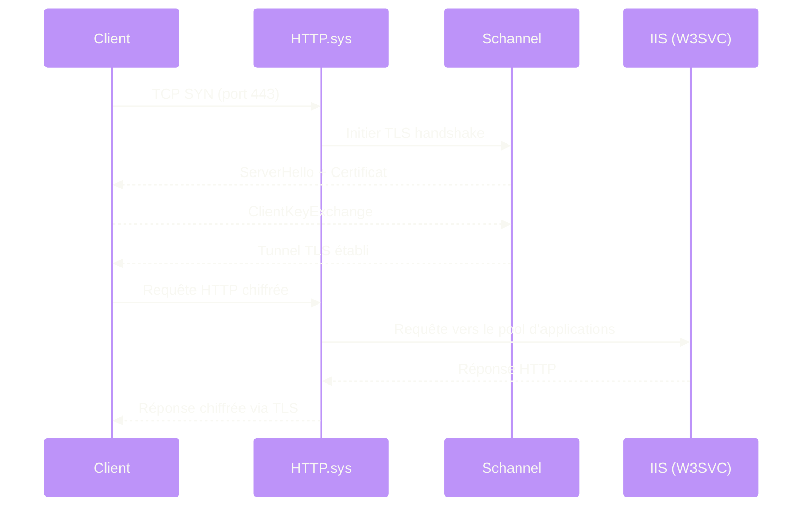

---
tags:
  - registre
  - iis
  - web
  - tls
  - schannel
---

# IIS / Web Server

!!! abstract "Ce que vous allez apprendre"
    - La transition de la metabase IIS 6 vers la configuration registre/applicationHost.config sur IIS 7+
    - Les cles registre qui controlent les pools d'applications et les liaisons de sites
    - Les parametres noyau HTTP.sys dans le registre
    - La configuration TLS/SSL via les cles Schannel
    - Comment diagnostiquer et corriger un probleme de deprecation TLS 1.0 sur un parc IIS

---

## De la metabase au registre : evolution d'IIS




Avant IIS 7, toute la configuration du serveur web vivait dans un fichier binaire appele **metabase** (`MetaBase.xml`). Ce format etait fragile, difficile a versionner et impossible a deployer proprement en masse. A partir d'IIS 7 (Windows Server 2008), Microsoft a migre la configuration principale vers `applicationHost.config`, un fichier XML situe dans `%windir%\system32\inetsrv\config\`.

Le registre reste neanmoins le point de controle pour trois couches critiques :

| Couche | Emplacement registre | Role |
|--------|---------------------|------|
| Service W3SVC | `HKLM\SYSTEM\CurrentControlSet\Services\W3SVC` | Demarrage et parametres du service World Wide Web |
| HTTP.sys (noyau) | `HKLM\SYSTEM\CurrentControlSet\Services\HTTP\Parameters` | Pile HTTP noyau : timeouts, taille des en-tetes, files d'attente |
| Schannel (TLS) | `HKLM\SYSTEM\CurrentControlSet\Control\SecurityProviders\SCHANNEL` | Protocoles, suites de chiffrement, certificats |

```powershell
# Verify W3SVC service registration
Get-ItemProperty "HKLM:\SYSTEM\CurrentControlSet\Services\W3SVC"
```

```title="Resultat attendu"
DisplayName  : Service de publication World Wide Web
ImagePath    : %SystemRoot%\system32\svchost.exe -k iissvcs
Start        : 2
Type         : 32
DependOnService : {HTTP, WAS}
```

Sur IIS 10+ (Windows Server 2016/2019/2022/2025), la configuration applicative est entierement dans `applicationHost.config`, mais la couche transport (HTTP.sys) et la couche crypto (Schannel) restent pilotees par le registre. C'est la que l'administrateur intervient directement.

!!! info "En resume"
    - IIS 6 utilisait une metabase binaire ; IIS 7+ utilise `applicationHost.config` et le registre
    - Le registre controle trois couches : le service W3SVC, la pile noyau HTTP.sys et Schannel (TLS/SSL)
    - La configuration applicative (sites, pools) vit dans le XML, la configuration transport et crypto vit dans le registre

---

## Pools d'applications dans le registre

Les pools d'applications sont principalement geres via `applicationHost.config`, mais le registre stocke les parametres de service et les variables d'environnement qui affectent leur comportement. Le service WAS (Windows Process Activation Service) est le composant responsable du cycle de vie des pools.

```powershell
# Check WAS service configuration
Get-ItemProperty "HKLM:\SYSTEM\CurrentControlSet\Services\WAS"
```

```title="Resultat attendu"
DisplayName  : Service d'activation des processus Windows
ImagePath    : %SystemRoot%\system32\svchost.exe -k iissvcs
Start        : 2
Type         : 32
DependOnService : {}
```

### Variables d'environnement .NET pour les pools

Les pools d'applications heritent des variables d'environnement systeme. Les cles suivantes impactent directement le comportement des pools .NET :

```
HKLM\SYSTEM\CurrentControlSet\Control\Session Manager\Environment
```

| Valeur | Type | Impact sur IIS |
|--------|------|---------------|
| `COMPLUS_Version` | `REG_SZ` | Force une version CLR specifique pour tous les pools |
| `COR_ENABLE_PROFILING` | `REG_SZ` | Active le profiling .NET (APM comme Application Insights) |
| `COR_PROFILER` | `REG_SZ` | CLSID du profiler .NET |

```powershell
# Check if a .NET profiler is globally configured (common with APM tools)
Get-ItemProperty "HKLM:\SYSTEM\CurrentControlSet\Control\Session Manager\Environment" |
    Select-Object COR_ENABLE_PROFILING, COR_PROFILER, COR_PROFILER_PATH
```

```title="Resultat attendu"
COR_ENABLE_PROFILING : 1
COR_PROFILER         : {324F817A-7420-4E6D-B3C1-143FBED6D855}
COR_PROFILER_PATH    : C:\Program Files\Datadog\.NET Tracer\Datadog.Trace.ClrProfiler.Native.dll
```

### Parametres de recyclage au niveau systeme

Le nombre maximal de processus worker (W3WP) et certains seuils systeme sont lus au demarrage du service :

```powershell
# Check IIS worker process crash protection
$iisRegPath = "HKLM:\SOFTWARE\Microsoft\InetStp"
Get-ItemProperty $iisRegPath | Select-Object MajorVersion, MinorVersion, VersionString
```

```title="Resultat attendu"
MajorVersion  : 10
MinorVersion  : 0
VersionString : 10.0
```

Cette cle `HKLM\SOFTWARE\Microsoft\InetStp` est egalement utile pour identifier rapidement la version IIS installee sur un serveur sans ouvrir le gestionnaire IIS.

!!! info "En resume"
    - Les pools d'applications sont configures dans `applicationHost.config` mais dependent de services registre (WAS, W3SVC)
    - Les variables d'environnement .NET dans le registre impactent directement les pools (profiling APM, version CLR)
    - La cle `HKLM\SOFTWARE\Microsoft\InetStp` permet d'identifier la version IIS installee

---

## Liaisons de sites et association de certificats SSL

Les liaisons (bindings) de sites IIS sont stockees dans `applicationHost.config`, mais l'association certificat-port SSL est geree par HTTP.sys et stockee dans un magasin systeme accessible via le registre et l'utilitaire `netsh`.

### Verifier les liaisons SSL actives

```powershell
# List all SSL certificate bindings managed by HTTP.sys
netsh http show sslcert
```

```title="Resultat attendu"
IP:port                      : 0.0.0.0:443
Certificate Hash             : a1b2c3d4e5f6a1b2c3d4e5f6a1b2c3d4e5f6a1b2
Application ID               : {4dc3e181-e14b-4a21-b022-59fc669b0914}
Certificate Store Name       : MY
Verify Client Certificate Revocation : Enabled
Verify Revocation Using Cached Client Certificate Only : Disabled
Usage Check                  : Enabled
Revocation Freshness Time    : 0
URL Retrieval Timeout        : 0
Ctl Identifier               : (null)
Ctl Store Name               : (null)
DS Mapper Usage              : Disabled
Negotiate Client Certificate : Disabled
```

### Configuration des certificats via le registre

Les certificats eux-memes sont stockes dans le magasin de certificats machine, dont les metadonnees registre se trouvent sous :

```
HKLM\SOFTWARE\Microsoft\SystemCertificates\MY\Certificates\{thumbprint}
```

```powershell
# List all certificates in the machine personal store with their thumbprints
Get-ChildItem "HKLM:\SOFTWARE\Microsoft\SystemCertificates\MY\Certificates" |
    ForEach-Object { $_.PSChildName }
```

```title="Resultat attendu"
A1B2C3D4E5F6A1B2C3D4E5F6A1B2C3D4E5F6A1B2
B2C3D4E5F6A1B2C3D4E5F6A1B2C3D4E5F6A1B2C3
```

### Associer un certificat a un site par script

```powershell
# Bind a new SSL certificate to port 443
$certHash = "A1B2C3D4E5F6A1B2C3D4E5F6A1B2C3D4E5F6A1B2"
$appId = "{4dc3e181-e14b-4a21-b022-59fc669b0914}" # IIS App ID

netsh http add sslcert ipport=0.0.0.0:443 certhash=$certHash appid=$appId certstorename=MY
```

```title="Resultat attendu"
SSL Certificate successfully added
```

!!! info "En resume"
    - Les liaisons SSL sont gerees par HTTP.sys, pas directement dans le registre IIS
    - Les certificats machine sont references sous `HKLM\SOFTWARE\Microsoft\SystemCertificates\MY\Certificates`
    - `netsh http show sslcert` est la commande de reference pour auditer les associations certificat-port

---

## Parametres noyau HTTP.sys

HTTP.sys est le pilote noyau qui traite toutes les requetes HTTP/HTTPS avant qu'elles n'atteignent les processus IIS. Ses parametres sont sous :

```
HKLM\SYSTEM\CurrentControlSet\Services\HTTP\Parameters
```

### Parametres de performance et securite

| Valeur | Type | Defaut | Description |
|--------|------|--------|-------------|
| `MaxConnections` | `REG_DWORD` | `-1` (illimite) | Nombre maximal de connexions simultanees |
| `MaxFieldLength` | `REG_DWORD` | `16384` | Taille maximale d'un en-tete HTTP individuel (octets) |
| `MaxRequestBytes` | `REG_DWORD` | `16384` | Taille maximale de la ligne de requete + en-tetes (octets) |
| `UrlSegmentMaxLength` | `REG_DWORD` | `260` | Longueur maximale d'un segment d'URL |
| `UrlSegmentMaxCount` | `REG_DWORD` | `255` | Nombre maximal de segments dans l'URL |
| `AllowRestrictedChars` | `REG_DWORD` | `0` | Autoriser les caracteres non-ASCII dans les URLs |
| `EnableNonUTF8` | `REG_DWORD` | `1` | Accepter les URLs non-UTF8 |
| `PercentUAllowed` | `REG_DWORD` | `1` | Autoriser l'encodage %uNNNN dans les URLs |

```powershell
# Read current HTTP.sys parameters
Get-ItemProperty "HKLM:\SYSTEM\CurrentControlSet\Services\HTTP\Parameters"
```

```title="Resultat attendu"
EnableHttp2Tls   : 1
EnableHttp2Cleartext : 1
Http2MaxSettingsPerFrame : 2796202
Http2MaxSettingsPerMinute : 4294967295
```

### Augmenter la taille maximale des en-tetes

Un probleme frequent avec les applications utilisant des jetons JWT volumineux ou des cookies d'authentification lourds : HTTP.sys rejette la requete avec une erreur 400 avant meme qu'IIS ne la voie. La solution est d'augmenter `MaxFieldLength` et `MaxRequestBytes`.

```powershell
# Increase max header size to 64 KB (for large JWT/auth cookies)
$httpParamsPath = "HKLM:\SYSTEM\CurrentControlSet\Services\HTTP\Parameters"

Set-ItemProperty -Path $httpParamsPath -Name "MaxFieldLength" -Value 65534 -Type DWord
Set-ItemProperty -Path $httpParamsPath -Name "MaxRequestBytes" -Value 65534 -Type DWord
```

```title="Resultat attendu"
Aucune sortie. Les modifications prennent effet apres redemarrage du service HTTP.
```

```powershell
# Restart HTTP.sys to apply changes (WARNING: drops all active connections)
Restart-Service HTTP -Force
```

```title="Resultat attendu"
WARNING: Waiting for service 'HTTP (HTTP)' to stop...
WARNING: Waiting for service 'HTTP (HTTP)' to start...
```

!!! warning "Impact du redemarrage HTTP.sys"
    Redemarrer le service HTTP arrete **tous** les sites web et services dependants (W3SVC, WAS, WMSVC). Planifiez cette operation en dehors des heures de production.

### Parametres de file d'attente

```powershell
# Check the kernel request queue length (per app pool)
$httpParamsPath = "HKLM:\SYSTEM\CurrentControlSet\Services\HTTP\Parameters"
Get-ItemProperty $httpParamsPath -Name "RequestBufferSize" -ErrorAction SilentlyContinue
```

```title="Resultat attendu"
RequestBufferSize : 4096
```

!!! info "En resume"
    - HTTP.sys est configure sous `HKLM\SYSTEM\CurrentControlSet\Services\HTTP\Parameters`
    - `MaxFieldLength` et `MaxRequestBytes` controlent la taille des en-tetes HTTP (a augmenter pour les gros jetons JWT)
    - Le redemarrage du service HTTP coupe toutes les connexions web actives

---

## Filtrage des requetes et limites de connexion

Le filtrage des requetes (Request Filtering) est une fonctionnalite d'IIS configuree dans `applicationHost.config`, mais certains seuils bas niveau sont imposes par HTTP.sys dans le registre.

### Limites de connexion au niveau noyau

```powershell
# Create or modify connection limits
$httpParamsPath = "HKLM:\SYSTEM\CurrentControlSet\Services\HTTP\Parameters"

# Max concurrent connections per server (0 = unlimited)
Set-ItemProperty -Path $httpParamsPath -Name "MaxConnections" -Value 10000 -Type DWord

# Connection timeout in seconds (idle connections)
Set-ItemProperty -Path $httpParamsPath -Name "IdleConnectionsHighMark" -Value 512 -Type DWord
Set-ItemProperty -Path $httpParamsPath -Name "IdleConnectionsLowMark" -Value 256 -Type DWord
```

```title="Resultat attendu"
Aucune sortie. Redemarrer le service HTTP pour appliquer.
```

### Timeouts HTTP.sys

Les timeouts suivants controlent le comportement de la pile noyau :

```
HKLM\SYSTEM\CurrentControlSet\Services\HTTP\Parameters
```

| Valeur | Type | Defaut | Description |
|--------|------|--------|-------------|
| `IdleListTrimmerPeriod` | `REG_DWORD` | `300` | Periode de nettoyage des connexions inactives (secondes) |
| `RequestBufferSize` | `REG_DWORD` | `4096` | Taille du tampon pour les requetes entrantes |
| `ListenBackLog` | `REG_DWORD` | variable | Profondeur de la file d'attente d'ecoute TCP |

```powershell
# Set the TCP listen backlog for high-traffic servers
Set-ItemProperty -Path "HKLM:\SYSTEM\CurrentControlSet\Services\HTTP\Parameters" `
    -Name "ListenBackLog" -Value 1024 -Type DWord
```

```title="Resultat attendu"
Aucune sortie. Prend effet apres redemarrage du service HTTP.
```

### Desactiver les methodes HTTP dangereuses au niveau noyau

Bien que le filtrage des verbes HTTP soit normalement fait dans `applicationHost.config`, vous pouvez renforcer la protection en configurant HTTP.sys pour rejeter des methodes avant qu'elles n'atteignent IIS :

```powershell
# Disable WebDAV methods at the HTTP.sys level via IIS config
# (This is the recommended approach via web.config, shown here for reference)
# HTTP.sys itself doesn't filter verbs — this is done in applicationHost.config

# Verify request filtering module is loaded
Get-WebConfigurationProperty -Filter "system.webServer/security/requestFiltering/verbs" `
    -PSPath "MACHINE/WEBROOT/APPHOST" -Name "Collection" |
    Format-Table verb, allowed
```

```title="Resultat attendu"
verb    allowed
----    -------
TRACE   False
OPTIONS False
```

!!! info "En resume"
    - Les limites de connexion noyau sont dans `HKLM\SYSTEM\CurrentControlSet\Services\HTTP\Parameters`
    - `MaxConnections`, `ListenBackLog` et `IdleConnectionsHighMark` controlent la capacite du serveur
    - Le filtrage des methodes HTTP se fait dans `applicationHost.config`, pas directement dans le registre HTTP.sys

---

## Configuration TLS/SSL via Schannel

Schannel (Secure Channel) est le fournisseur SSP (Security Support Provider) de Windows qui gere TLS/SSL. Sa configuration complete reside dans le registre, sous :

```
HKLM\SYSTEM\CurrentControlSet\Control\SecurityProviders\SCHANNEL
```

### Structure des cles Schannel

```
SCHANNEL
├── Protocols
│   ├── SSL 2.0
│   │   ├── Client
│   │   └── Server
│   ├── SSL 3.0
│   │   ├── Client
│   │   └── Server
│   ├── TLS 1.0
│   │   ├── Client
│   │   └── Server
│   ├── TLS 1.1
│   │   ├── Client
│   │   └── Server
│   ├── TLS 1.2
│   │   ├── Client
│   │   └── Server
│   └── TLS 1.3
│       ├── Client
│       └── Server
├── Ciphers
├── CipherSuites
├── Hashes
└── KeyExchangeAlgorithms
```

### Desactiver un protocole (serveur et client)

Pour desactiver un protocole, il faut creer (ou modifier) deux valeurs dans les sous-cles `Server` et `Client` :

| Valeur | Type | Effet si = 0 |
|--------|------|--------------|
| `Enabled` | `REG_DWORD` | Desactive le protocole |
| `DisabledByDefault` | `REG_DWORD` | Si = 1, desactive par defaut (les applications peuvent tout de meme le forcer) |

```powershell
# Disable TLS 1.0 completely (server-side and client-side)
$protocols = @("TLS 1.0")
$sides = @("Server", "Client")

foreach ($protocol in $protocols) {
    foreach ($side in $sides) {
        $regPath = "HKLM:\SYSTEM\CurrentControlSet\Control\SecurityProviders\SCHANNEL\Protocols\$protocol\$side"

        if (-not (Test-Path $regPath)) {
            New-Item -Path $regPath -Force | Out-Null
        }

        Set-ItemProperty -Path $regPath -Name "Enabled" -Value 0 -Type DWord
        Set-ItemProperty -Path $regPath -Name "DisabledByDefault" -Value 1 -Type DWord
    }
}
```

```title="Resultat attendu"
Aucune sortie. Redemarrage du serveur requis pour prise en compte.
```

### Activer TLS 1.2 et TLS 1.3

```powershell
# Ensure TLS 1.2 and TLS 1.3 are explicitly enabled
$protocols = @("TLS 1.2", "TLS 1.3")
$sides = @("Server", "Client")

foreach ($protocol in $protocols) {
    foreach ($side in $sides) {
        $regPath = "HKLM:\SYSTEM\CurrentControlSet\Control\SecurityProviders\SCHANNEL\Protocols\$protocol\$side"

        if (-not (Test-Path $regPath)) {
            New-Item -Path $regPath -Force | Out-Null
        }

        Set-ItemProperty -Path $regPath -Name "Enabled" -Value 1 -Type DWord
        Set-ItemProperty -Path $regPath -Name "DisabledByDefault" -Value 0 -Type DWord
    }
}
```

```title="Resultat attendu"
Aucune sortie. Redemarrage requis.
```

### Verifier l'etat actuel des protocoles

```powershell
# Audit all Schannel protocol states
$basePath = "HKLM:\SYSTEM\CurrentControlSet\Control\SecurityProviders\SCHANNEL\Protocols"

Get-ChildItem $basePath -Recurse |
    Where-Object { $_.Property -contains "Enabled" } |
    ForEach-Object {
        [PSCustomObject]@{
            Protocol = $_.PSPath -replace '.*Protocols\\', ''
            Enabled  = $_.GetValue("Enabled")
            DisabledByDefault = $_.GetValue("DisabledByDefault")
        }
    } | Format-Table -AutoSize
```

```title="Resultat attendu"
Protocol           Enabled DisabledByDefault
--------           ------- -----------------
SSL 2.0\Client           0                 1
SSL 2.0\Server           0                 1
SSL 3.0\Client           0                 1
SSL 3.0\Server           0                 1
TLS 1.0\Client           0                 1
TLS 1.0\Server           0                 1
TLS 1.1\Client           0                 1
TLS 1.1\Server           0                 1
TLS 1.2\Client           1                 0
TLS 1.2\Server           1                 0
TLS 1.3\Client           1                 0
TLS 1.3\Server           1                 0
```

### Configuration des suites de chiffrement

Les suites de chiffrement sont controlees par une valeur multi-chaine dans le registre ou via GPO :

```
HKLM\SOFTWARE\Policies\Microsoft\Cryptography\Configuration\SSL\00010002
```

```powershell
# List currently enabled cipher suites
Get-TlsCipherSuite | Select-Object Name, CipherSuite | Format-Table -AutoSize
```

```title="Resultat attendu"
Name                                           CipherSuite
----                                           -----------
TLS_AES_256_GCM_SHA384                         4866
TLS_AES_128_GCM_SHA256                         4865
TLS_ECDHE_ECDSA_WITH_AES_256_GCM_SHA384       49196
TLS_ECDHE_ECDSA_WITH_AES_128_GCM_SHA256       49195
TLS_ECDHE_RSA_WITH_AES_256_GCM_SHA384         49200
TLS_ECDHE_RSA_WITH_AES_128_GCM_SHA256         49199
```

!!! info "En resume"
    - Schannel est configure sous `HKLM\SYSTEM\CurrentControlSet\Control\SecurityProviders\SCHANNEL`
    - Chaque protocole (SSL 2.0 a TLS 1.3) a des sous-cles `Server` et `Client` avec `Enabled` et `DisabledByDefault`
    - Les suites de chiffrement sont gerees via GPO ou sous `HKLM\SOFTWARE\Policies\Microsoft\Cryptography`
    - Un redemarrage du serveur est necessaire apres modification des protocoles Schannel

---

## Scenario reel : corriger la deprecation TLS 1.0 sur un parc IIS

### Contexte

Votre equipe securite vous informe que les scanners de vulnerabilite remontent **TLS 1.0 actif** sur 30 serveurs IIS de production. La directive est claire : desactiver TLS 1.0 et TLS 1.1, ne garder que TLS 1.2 et TLS 1.3. Le delai est de 48 heures.

### Etape 1 : auditer l'etat actuel sur tous les serveurs

```powershell
# Audit TLS protocol state across all IIS servers
$servers = Get-Content "C:\Admin\iis-servers.txt"

$results = Invoke-Command -ComputerName $servers -ScriptBlock {
    $basePath = "HKLM:\SYSTEM\CurrentControlSet\Control\SecurityProviders\SCHANNEL\Protocols"
    $protocols = @("SSL 2.0", "SSL 3.0", "TLS 1.0", "TLS 1.1", "TLS 1.2", "TLS 1.3")

    foreach ($protocol in $protocols) {
        $serverPath = Join-Path $basePath "$protocol\Server"
        $enabled = "Not configured"

        if (Test-Path $serverPath) {
            $val = Get-ItemProperty $serverPath -Name "Enabled" -ErrorAction SilentlyContinue
            if ($null -ne $val.Enabled) {
                $enabled = $val.Enabled
            }
        }

        [PSCustomObject]@{
            Server   = $env:COMPUTERNAME
            Protocol = $protocol
            Enabled  = $enabled
        }
    }
}

$results | Format-Table Server, Protocol, Enabled -AutoSize
```

```title="Resultat attendu"
Server     Protocol Enabled
------     -------- -------
WEBSRV01   SSL 2.0  0
WEBSRV01   SSL 3.0  0
WEBSRV01   TLS 1.0  Not configured
WEBSRV01   TLS 1.1  Not configured
WEBSRV01   TLS 1.2  1
WEBSRV01   TLS 1.3  Not configured
WEBSRV02   SSL 2.0  0
WEBSRV02   SSL 3.0  0
WEBSRV02   TLS 1.0  1
...
```

!!! warning "Not configured ne veut pas dire desactive"
    Si une cle de protocole n'existe pas dans le registre, Windows utilise son comportement par defaut. Sur les versions recentes de Windows Server, TLS 1.0 et 1.1 sont actives par defaut meme si aucune cle registre n'est presente. Il faut explicitement les desactiver.

### Etape 2 : identifier les applications dependantes de TLS 1.0

Avant de desactiver TLS 1.0, verifiez que vos applications supportent TLS 1.2. Activez la journalisation Schannel pour detecter les connexions TLS 1.0 :

```powershell
# Enable Schannel event logging (level 3 = warnings + errors + informational)
Set-ItemProperty -Path "HKLM:\SYSTEM\CurrentControlSet\Control\SecurityProviders\SCHANNEL" `
    -Name "EventLogging" -Value 3 -Type DWord
```

```title="Resultat attendu"
Aucune sortie. La journalisation est active immediatement, sans redemarrage.
```

```powershell
# Check Schannel events for TLS 1.0 connections (Event ID 36880)
Get-WinEvent -FilterHashtable @{
    LogName = 'System'
    ProviderName = 'Schannel'
    Id = 36880
} -MaxEvents 20 | Select-Object TimeCreated, Message | Format-List
```

```title="Resultat attendu"
TimeCreated : 04/04/2026 14:32:15
Message     : A SSL connection request was received from a remote client application,
              but none of the cipher suites supported by the client application are supported
              by the server. The TLS connection request has failed.
```

### Etape 3 : appliquer le durcissement TLS sur tous les serveurs

```powershell
# Harden TLS configuration on all IIS servers
$servers = Get-Content "C:\Admin\iis-servers.txt"

Invoke-Command -ComputerName $servers -ScriptBlock {
    $schannelBase = "HKLM:\SYSTEM\CurrentControlSet\Control\SecurityProviders\SCHANNEL\Protocols"

    # Protocols to disable
    $disableProtocols = @("SSL 2.0", "SSL 3.0", "TLS 1.0", "TLS 1.1")
    # Protocols to enable
    $enableProtocols = @("TLS 1.2", "TLS 1.3")

    foreach ($protocol in $disableProtocols) {
        foreach ($side in @("Server", "Client")) {
            $path = "$schannelBase\$protocol\$side"
            New-Item -Path $path -Force | Out-Null
            Set-ItemProperty -Path $path -Name "Enabled" -Value 0 -Type DWord
            Set-ItemProperty -Path $path -Name "DisabledByDefault" -Value 1 -Type DWord
        }
    }

    foreach ($protocol in $enableProtocols) {
        foreach ($side in @("Server", "Client")) {
            $path = "$schannelBase\$protocol\$side"
            New-Item -Path $path -Force | Out-Null
            Set-ItemProperty -Path $path -Name "Enabled" -Value 1 -Type DWord
            Set-ItemProperty -Path $path -Name "DisabledByDefault" -Value 0 -Type DWord
        }
    }

    Write-Output "$env:COMPUTERNAME : TLS hardening applied"
}
```

```title="Resultat attendu"
WEBSRV01 : TLS hardening applied
WEBSRV02 : TLS hardening applied
WEBSRV03 : TLS hardening applied
...
```

### Etape 4 : forcer .NET a utiliser TLS 1.2

Les applications .NET hebergees dans IIS doivent etre configurees pour utiliser TLS 1.2 lors de leurs appels sortants. Deux cles registre controlent ce comportement :

```powershell
# Force .NET Framework 4.x to use TLS 1.2 by default
$netFxPaths = @(
    "HKLM:\SOFTWARE\Microsoft\.NETFramework\v4.0.30319",
    "HKLM:\SOFTWARE\WOW6432Node\Microsoft\.NETFramework\v4.0.30319"
)

Invoke-Command -ComputerName $servers -ScriptBlock {
    param($paths)
    foreach ($path in $paths) {
        if (-not (Test-Path $path)) {
            New-Item -Path $path -Force | Out-Null
        }
        # SchUseStrongCrypto forces TLS 1.2 for outbound connections
        Set-ItemProperty -Path $path -Name "SchUseStrongCrypto" -Value 1 -Type DWord
        # SystemDefaultTlsVersions defers to the OS default TLS version
        Set-ItemProperty -Path $path -Name "SystemDefaultTlsVersions" -Value 1 -Type DWord
    }
    Write-Output "$env:COMPUTERNAME : .NET TLS 1.2 enforced"
} -ArgumentList (,$netFxPaths)
```

```title="Resultat attendu"
WEBSRV01 : .NET TLS 1.2 enforced
WEBSRV02 : .NET TLS 1.2 enforced
...
```

### Etape 5 : redemarrer et valider

```powershell
# Restart servers (schedule during maintenance window)
$servers | ForEach-Object {
    Restart-Computer -ComputerName $_ -Force -Wait -For WinRM -Timeout 300
    Write-Output "$_ : Restarted"
}
```

```title="Resultat attendu"
WEBSRV01 : Restarted
WEBSRV02 : Restarted
...
```

```powershell
# Validate TLS configuration post-reboot
Invoke-Command -ComputerName $servers -ScriptBlock {
    $basePath = "HKLM:\SYSTEM\CurrentControlSet\Control\SecurityProviders\SCHANNEL\Protocols"
    $check = @("TLS 1.0\Server", "TLS 1.1\Server", "TLS 1.2\Server", "TLS 1.3\Server")

    foreach ($sub in $check) {
        $path = Join-Path $basePath $sub
        $enabled = (Get-ItemProperty $path -Name "Enabled" -ErrorAction SilentlyContinue).Enabled
        Write-Output "$env:COMPUTERNAME | $sub | Enabled=$enabled"
    }
}
```

```title="Resultat attendu"
WEBSRV01 | TLS 1.0\Server | Enabled=0
WEBSRV01 | TLS 1.1\Server | Enabled=0
WEBSRV01 | TLS 1.2\Server | Enabled=1
WEBSRV01 | TLS 1.3\Server | Enabled=1
WEBSRV02 | TLS 1.0\Server | Enabled=0
...
```

!!! tip "Validation externe"
    Utilisez un outil comme `nmap` ou un scanner en ligne (SSL Labs, testssl.sh) pour confirmer que TLS 1.0 est bien desactive cote reseau, pas seulement cote registre.

!!! info "En resume"
    - Auditez d'abord l'etat actuel des protocoles sur tous les serveurs avec un script distant
    - Activez la journalisation Schannel pour identifier les clients qui utilisent encore TLS 1.0
    - Desactivez SSL 2.0/3.0, TLS 1.0/1.1 et activez TLS 1.2/1.3 via les cles Schannel
    - Forcez .NET Framework a utiliser TLS 1.2 avec `SchUseStrongCrypto` et `SystemDefaultTlsVersions`
    - Un redemarrage du serveur est obligatoire pour que les changements Schannel prennent effet

!!! tip "Voir aussi"
    - :material-book-open-variant: [Services Windows en profondeur](../bible-registre-windows/14-services.md) — Bible Registre
    - :material-book-open-variant: [Cryptographie, DPAPI et certificats](../bible-registre-windows/29-cryptographie.md) — Bible Registre
