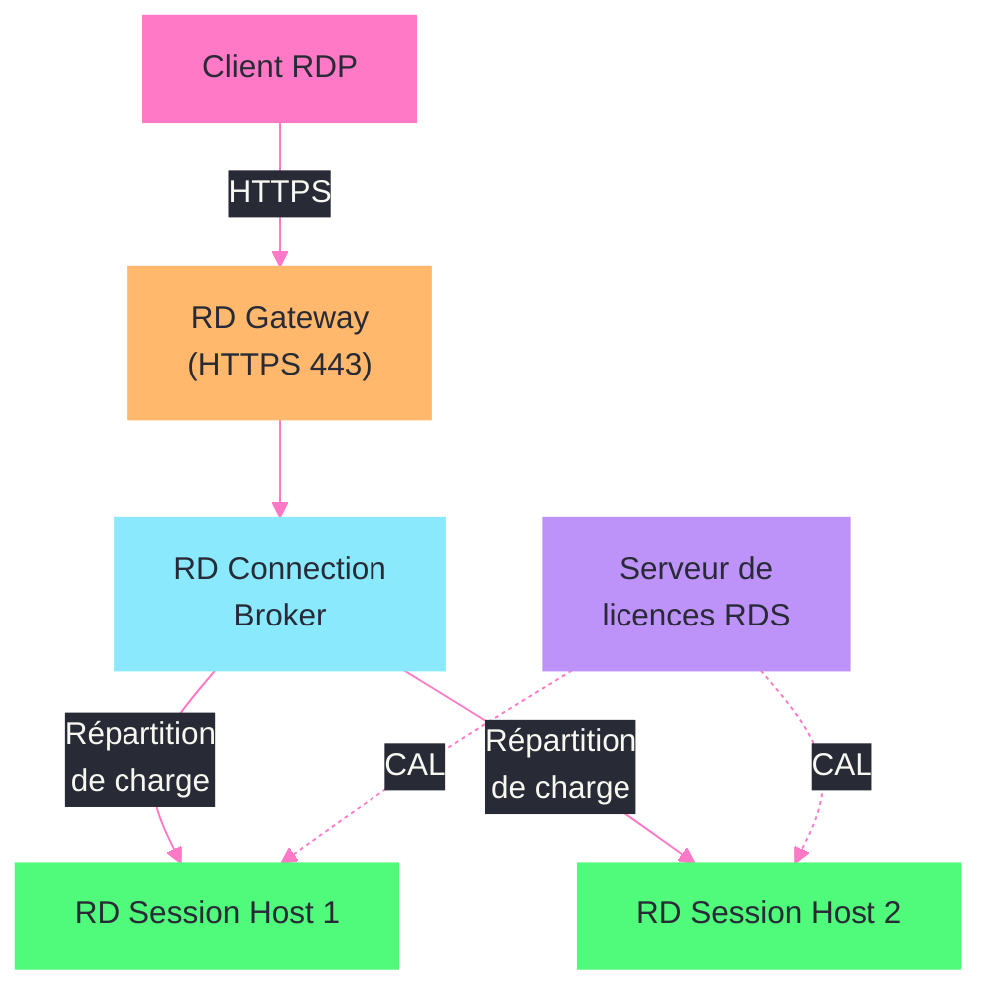
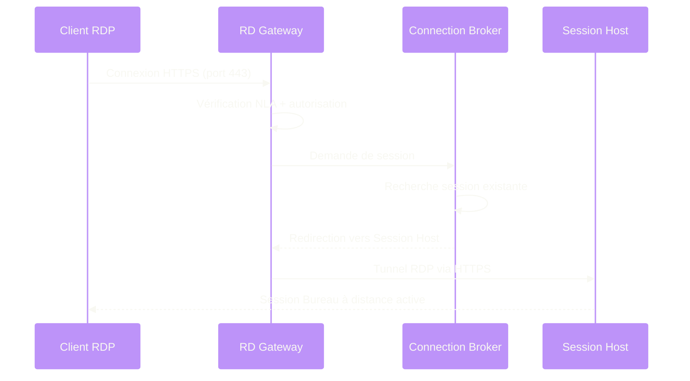

---
tags:
  - registre
  - rds
  - bureau-a-distance
  - terminal-server
---

# Remote Desktop Services

!!! abstract "Ce que vous allez apprendre"
    - Les cles registre qui controlent le listener RDP et ses parametres de connexion
    - Comment configurer les limites de session et les timeouts via le registre
    - La configuration du licensing RDS, du Gateway et du Connection Broker
    - Les parametres de publication RemoteApp dans le registre
    - Le durcissement NLA (Network Level Authentication) et les redirections de profil
    - Comment diagnostiquer et corriger le probleme "licensing mode not configured" sur une ferme RDS

---

## Configuration du listener RDP



Le listener RDP est le composant qui ecoute les connexions entrantes sur le port TCP 3389 (par defaut). Sa configuration complete reside sous :

```
HKLM\SYSTEM\CurrentControlSet\Control\Terminal Server
```

Et plus specifiquement, les parametres du listener lui-meme :

```
HKLM\SYSTEM\CurrentControlSet\Control\Terminal Server\WinStations\RDP-Tcp
```

### Activer ou desactiver le Bureau a distance

```powershell
# Check if Remote Desktop is enabled
Get-ItemProperty "HKLM:\SYSTEM\CurrentControlSet\Control\Terminal Server" -Name "fDenyTSConnections"
```

```title="Resultat attendu"
fDenyTSConnections : 0
```

| Valeur `fDenyTSConnections` | Signification |
|:---------------------------:|--------------|
| `0` | Bureau a distance active (connexions autorisees) |
| `1` | Bureau a distance desactive (connexions refusees) |

```powershell
# Enable Remote Desktop via registry
Set-ItemProperty -Path "HKLM:\SYSTEM\CurrentControlSet\Control\Terminal Server" `
    -Name "fDenyTSConnections" -Value 0 -Type DWord

# Also open the firewall rule
Enable-NetFirewallRule -DisplayGroup "Remote Desktop"
```

```title="Resultat attendu"
Aucune sortie pour Set-ItemProperty.
La regle de pare-feu est activee immediatement.
```

### Changer le port d'ecoute RDP

Le port d'ecoute par defaut (3389) est stocke dans la cle du listener :

```powershell
# Read current RDP listening port
Get-ItemProperty "HKLM:\SYSTEM\CurrentControlSet\Control\Terminal Server\WinStations\RDP-Tcp" `
    -Name "PortNumber"
```

```title="Resultat attendu"
PortNumber : 3389
```

```powershell
# Change RDP port to 3390 (for security through obscurity — not a replacement for NLA)
Set-ItemProperty -Path "HKLM:\SYSTEM\CurrentControlSet\Control\Terminal Server\WinStations\RDP-Tcp" `
    -Name "PortNumber" -Value 3390 -Type DWord

# Update the firewall to allow the new port
New-NetFirewallRule -DisplayName "RDP Custom Port 3390" `
    -Direction Inbound -Protocol TCP -LocalPort 3390 -Action Allow
```

```title="Resultat attendu"
Name                  : {guid}
DisplayName           : RDP Custom Port 3390
Direction             : Inbound
Action                : Allow
```

!!! warning "Apres un changement de port"
    Redemarrez le service TermService pour que le nouveau port soit pris en compte. N'oubliez pas de mettre a jour la regle de pare-feu **avant** de redemarrer le service, sinon vous perdez l'acces.

### Parametres du listener RDP-Tcp

La cle `RDP-Tcp` contient des dizaines de valeurs. Voici les plus importantes pour un administrateur :

| Valeur | Type | Description |
|--------|------|-------------|
| `PortNumber` | `REG_DWORD` | Port d'ecoute TCP |
| `SecurityLayer` | `REG_DWORD` | 0 = RDP, 1 = Negotiate, 2 = TLS |
| `UserAuthentication` | `REG_DWORD` | 1 = NLA obligatoire |
| `MinEncryptionLevel` | `REG_DWORD` | 1 = Low, 2 = Client-compatible, 3 = High, 4 = FIPS |
| `fInheritColorDepth` | `REG_DWORD` | Heriter de la profondeur de couleur client |
| `ColorDepth` | `REG_DWORD` | Profondeur de couleur forcee (1=8bit, 2=15bit, 3=16bit, 4=24bit) |
| `MaxInstanceCount` | `REG_DWORD` | Nombre maximal de connexions simultanees sur ce listener |

```powershell
# Read all RDP-Tcp listener settings
Get-ItemProperty "HKLM:\SYSTEM\CurrentControlSet\Control\Terminal Server\WinStations\RDP-Tcp" |
    Select-Object PortNumber, SecurityLayer, UserAuthentication, MinEncryptionLevel, MaxInstanceCount
```

```title="Resultat attendu"
PortNumber         : 3389
SecurityLayer      : 2
UserAuthentication : 1
MinEncryptionLevel : 3
MaxInstanceCount   : 4294967295
```

!!! info "En resume"
    - Le listener RDP est configure sous `HKLM\SYSTEM\CurrentControlSet\Control\Terminal Server\WinStations\RDP-Tcp`
    - `fDenyTSConnections` controle l'activation du Bureau a distance (0 = actif, 1 = desactive)
    - `SecurityLayer` et `UserAuthentication` definissent le niveau de securite de la connexion
    - Toute modification du port necessite une mise a jour du pare-feu et un redemarrage de TermService

---

## Limites de session et timeouts



Les timeouts de session RDS sont critiques en environnement multi-utilisateurs. Ils evitent l'accumulation de sessions orphelines qui consomment des ressources. Ces parametres se configurent a deux niveaux : par serveur (registre) et par GPO.

### Emplacement registre

Les timeouts sont sous la cle du listener ou sous la configuration de la session :

```
HKLM\SYSTEM\CurrentControlSet\Control\Terminal Server\WinStations\RDP-Tcp
```

Ou par GPO :

```
HKLM\SOFTWARE\Policies\Microsoft\Windows NT\Terminal Services
```

### Les trois timeouts fondamentaux

| Valeur | Type | Unite | Description |
|--------|------|-------|-------------|
| `MaxIdleTime` | `REG_DWORD` | Millisecondes | Duree maximale d'inactivite avant deconnexion |
| `MaxConnectionTime` | `REG_DWORD` | Millisecondes | Duree maximale totale d'une session (active ou non) |
| `MaxDisconnectionTime` | `REG_DWORD` | Millisecondes | Duree maximale d'une session en etat deconnecte avant fermeture |

!!! tip "Conversion millisecondes"
    - 15 minutes = 900000 ms
    - 30 minutes = 1800000 ms
    - 1 heure = 3600000 ms
    - 8 heures = 28800000 ms
    - 0 = Pas de limite (valeur par defaut)

```powershell
# Configure session timeouts on the RDP listener
$rdpPath = "HKLM:\SYSTEM\CurrentControlSet\Control\Terminal Server\WinStations\RDP-Tcp"

# Idle timeout: 30 minutes
Set-ItemProperty -Path $rdpPath -Name "MaxIdleTime" -Value 1800000 -Type DWord

# Max session duration: 8 hours
Set-ItemProperty -Path $rdpPath -Name "MaxConnectionTime" -Value 28800000 -Type DWord

# Disconnected session timeout: 15 minutes
Set-ItemProperty -Path $rdpPath -Name "MaxDisconnectionTime" -Value 900000 -Type DWord
```

```title="Resultat attendu"
Aucune sortie. Les timeouts s'appliquent aux nouvelles sessions.
```

### Actions en fin de session

Deux valeurs controlent ce qui se passe quand un timeout est atteint :

| Valeur | Type | Options |
|--------|------|---------|
| `fResetBroken` | `REG_DWORD` | 0 = Deconnecter la session, 1 = Terminer la session |
| `fReconnectSame` | `REG_DWORD` | 0 = Reconnexion depuis n'importe quel client, 1 = Uniquement depuis le client d'origine |

```powershell
# End session (logoff) when connection is broken, allow reconnect from any client
Set-ItemProperty -Path $rdpPath -Name "fResetBroken" -Value 0 -Type DWord
Set-ItemProperty -Path $rdpPath -Name "fReconnectSame" -Value 0 -Type DWord
```

```title="Resultat attendu"
Aucune sortie.
```

### Lire les timeouts actuels

```powershell
# Audit current timeout configuration
$rdpPath = "HKLM:\SYSTEM\CurrentControlSet\Control\Terminal Server\WinStations\RDP-Tcp"
$props = Get-ItemProperty $rdpPath

[PSCustomObject]@{
    MaxIdleTime           = if ($props.MaxIdleTime -gt 0) { "$($props.MaxIdleTime / 60000) min" } else { "Unlimited" }
    MaxConnectionTime     = if ($props.MaxConnectionTime -gt 0) { "$($props.MaxConnectionTime / 60000) min" } else { "Unlimited" }
    MaxDisconnectionTime  = if ($props.MaxDisconnectionTime -gt 0) { "$($props.MaxDisconnectionTime / 60000) min" } else { "Unlimited" }
    ResetBroken           = $props.fResetBroken
    ReconnectSame         = $props.fReconnectSame
} | Format-List
```

```title="Resultat attendu"
MaxIdleTime          : 30 min
MaxConnectionTime    : 480 min
MaxDisconnectionTime : 15 min
ResetBroken          : 0
ReconnectSame        : 0
```

!!! info "En resume"
    - Les trois timeouts cles sont `MaxIdleTime`, `MaxConnectionTime` et `MaxDisconnectionTime` (en millisecondes)
    - La valeur 0 signifie "pas de limite" — dangereux en production car les sessions s'accumulent
    - `fResetBroken` controle si une session est deconnectee (0) ou terminee (1) quand le lien est rompu
    - Les GPO ecrasent les valeurs locales si configurees sous `HKLM\SOFTWARE\Policies\Microsoft\Windows NT\Terminal Services`

---

## Configuration du serveur de licences RDS

Le licensing RDS est l'une des sources les plus frequentes de problemes sur les fermes RDS. La configuration est stockee dans le registre et doit correspondre aux CAL (Client Access Licenses) achetees.

### Cles de licensing

```
HKLM\SYSTEM\CurrentControlSet\Control\Terminal Server\RCM\Licensing Core
```

Et pour la configuration GPO :

```
HKLM\SOFTWARE\Policies\Microsoft\Windows NT\Terminal Services
```

| Valeur | Cle | Type | Description |
|--------|-----|------|-------------|
| `LicensingMode` | `Licensing Core` | `REG_DWORD` | 2 = Per Device, 4 = Per User |
| `LicenseServers` | `Licensing Core` | `REG_SZ` | Nom du serveur de licences |
| `LicensingMode` | `Terminal Services` (GPO) | `REG_DWORD` | Ecrase la valeur locale |
| `LicenseServers` | `Terminal Services` (GPO) | `REG_SZ` | Ecrase la valeur locale |

```powershell
# Check current licensing configuration
$licensePath = "HKLM:\SYSTEM\CurrentControlSet\Control\Terminal Server\RCM\Licensing Core"
Get-ItemProperty $licensePath -ErrorAction SilentlyContinue |
    Select-Object LicensingMode, LicenseServers
```

```title="Resultat attendu"
LicensingMode  : 4
LicenseServers : RDLIC01.contoso.com
```

```powershell
# Check if GPO overrides are in place
$gpoPath = "HKLM:\SOFTWARE\Policies\Microsoft\Windows NT\Terminal Services"
Get-ItemProperty $gpoPath -Name "LicensingMode", "LicenseServers" -ErrorAction SilentlyContinue
```

```title="Resultat attendu"
LicensingMode  : 4
LicenseServers : RDLIC01.contoso.com
```

### Configurer le mode de licensing

```powershell
# Set licensing mode to Per User and specify license server
$licensePath = "HKLM:\SYSTEM\CurrentControlSet\Control\Terminal Server\RCM\Licensing Core"

Set-ItemProperty -Path $licensePath -Name "LicensingMode" -Value 4 -Type DWord
Set-ItemProperty -Path $licensePath -Name "LicenseServers" -Value "RDLIC01.contoso.com" -Type String
```

```title="Resultat attendu"
Aucune sortie. Prend effet immediatement pour les nouvelles connexions.
```

!!! info "En resume"
    - Le licensing RDS est configure sous `HKLM\SYSTEM\CurrentControlSet\Control\Terminal Server\RCM\Licensing Core`
    - `LicensingMode` = 2 (Per Device) ou 4 (Per User)
    - Les GPO sous `HKLM\SOFTWARE\Policies\Microsoft\Windows NT\Terminal Services` ecrasent les valeurs locales
    - L'absence de configuration de licensing entraine une periode de grace de 120 jours puis le blocage des connexions

---

## RD Gateway et RD Connection Broker

### RD Gateway

Le RD Gateway permet l'acces RDP via HTTPS, sans exposer le port 3389 sur Internet. Ses parametres registre sont sous :

```
HKLM\SOFTWARE\Microsoft\Windows NT\CurrentVersion\Terminal Server\CentralPublishing
```

Et pour la configuration du service :

```
HKLM\SOFTWARE\Microsoft\Terminal Server Gateway
```

```powershell
# Check RD Gateway configuration
$gwPath = "HKLM:\SOFTWARE\Microsoft\Terminal Server Gateway\Config\Core"
Get-ItemProperty $gwPath -ErrorAction SilentlyContinue
```

```title="Resultat attendu"
IsAuthorizationDisabled      : 0
MaxConnections               : 4294967295
EnforceChannelBinding        : 0
```

### RD Connection Broker

Le Connection Broker gere la repartition des sessions entre les serveurs d'une ferme RDS. Sa configuration est sous :

```
HKLM\SYSTEM\CurrentControlSet\Control\Terminal Server\ClusterSettings
```

```powershell
# Check Connection Broker cluster settings
$cbPath = "HKLM:\SYSTEM\CurrentControlSet\Control\Terminal Server\ClusterSettings"
Get-ItemProperty $cbPath -ErrorAction SilentlyContinue |
    Select-Object SessionDirectoryActive, SessionDirectoryLocation, SessionDirectoryClusterName
```

```title="Resultat attendu"
SessionDirectoryActive       : 1
SessionDirectoryLocation     : RDCB01.contoso.com
SessionDirectoryClusterName  : RDS-Farm-01
```

| Valeur | Type | Description |
|--------|------|-------------|
| `SessionDirectoryActive` | `REG_DWORD` | 1 = Participe a la ferme RDS |
| `SessionDirectoryLocation` | `REG_SZ` | FQDN du serveur Connection Broker |
| `SessionDirectoryClusterName` | `REG_SZ` | Nom de la collection/ferme RDS |
| `ParticipateInLoadBalancing` | `REG_DWORD` | 1 = Participe a la repartition de charge |
| `RelativeWeight` | `REG_DWORD` | Poids relatif pour la repartition (100 = normal) |

```powershell
# Enable load balancing participation with weight 100
Set-ItemProperty -Path $cbPath -Name "ParticipateInLoadBalancing" -Value 1 -Type DWord
Set-ItemProperty -Path $cbPath -Name "RelativeWeight" -Value 100 -Type DWord
```

```title="Resultat attendu"
Aucune sortie. Prend effet apres redemarrage du service TermService.
```

!!! info "En resume"
    - Le RD Gateway est configure sous `HKLM\SOFTWARE\Microsoft\Terminal Server Gateway`
    - Le Connection Broker utilise `HKLM\SYSTEM\CurrentControlSet\Control\Terminal Server\ClusterSettings`
    - `SessionDirectoryActive` = 1 inscrit le serveur dans la ferme RDS
    - `RelativeWeight` controle la proportion de sessions dirigees vers chaque serveur

---

## Publication RemoteApp

Les RemoteApp sont des applications publiees sur un serveur RDS et affichees dans une fenetre locale chez l'utilisateur, comme si elles etaient installees localement. La configuration de publication est stockee dans le registre.

### Emplacement des RemoteApp publiees

```
HKLM\SOFTWARE\Microsoft\Windows NT\CurrentVersion\Terminal Server\TSAppAllowList\Applications
```

Chaque application est une sous-cle avec ses parametres :

```powershell
# List all published RemoteApp applications
$appPath = "HKLM:\SOFTWARE\Microsoft\Windows NT\CurrentVersion\Terminal Server\TSAppAllowList\Applications"
Get-ChildItem $appPath | ForEach-Object {
    $props = Get-ItemProperty $_.PSPath
    [PSCustomObject]@{
        Name        = $_.PSChildName
        Path        = $props.Path
        CommandLine = $props.CommandLineSetting
        IconPath    = $props.IconPath
    }
}
```

```title="Resultat attendu"
Name        Path                                    CommandLine IconPath
----        ----                                    ----------- --------
Notepad     C:\Windows\system32\notepad.exe         0           C:\Windows\system32\notepad.exe
Calculator  C:\Windows\system32\calc.exe            0           C:\Windows\system32\calc.exe
Excel       C:\Program Files\Microsoft Office\...   1           C:\Program Files\Microsoft Office\...
```

### Parametres d'une RemoteApp

| Valeur | Type | Description |
|--------|------|-------------|
| `Name` | `REG_SZ` | Nom affiche de l'application |
| `Path` | `REG_SZ` | Chemin complet vers l'executable |
| `VPath` | `REG_SZ` | Chemin virtuel (utilise par le Web Access) |
| `CommandLineSetting` | `REG_DWORD` | 0 = Pas d'arguments, 1 = Arguments optionnels, 2 = Arguments obligatoires |
| `RequiredCommandLine` | `REG_SZ` | Arguments par defaut |
| `IconPath` | `REG_SZ` | Chemin vers l'icone |
| `IconIndex` | `REG_DWORD` | Index de l'icone dans le fichier |
| `ShowInTSWA` | `REG_DWORD` | 1 = Visible dans RD Web Access |

```powershell
# Publish a new RemoteApp
$appBasePath = "HKLM:\SOFTWARE\Microsoft\Windows NT\CurrentVersion\Terminal Server\TSAppAllowList\Applications"
$appName = "WordPad"
$appPath = Join-Path $appBasePath $appName

New-Item -Path $appPath -Force | Out-Null
Set-ItemProperty -Path $appPath -Name "Name" -Value "WordPad" -Type String
Set-ItemProperty -Path $appPath -Name "Path" -Value "C:\Program Files\Windows NT\Accessories\wordpad.exe" -Type String
Set-ItemProperty -Path $appPath -Name "CommandLineSetting" -Value 0 -Type DWord
Set-ItemProperty -Path $appPath -Name "IconPath" -Value "C:\Program Files\Windows NT\Accessories\wordpad.exe" -Type String
Set-ItemProperty -Path $appPath -Name "IconIndex" -Value 0 -Type DWord
Set-ItemProperty -Path $appPath -Name "ShowInTSWA" -Value 1 -Type DWord
```

```title="Resultat attendu"
Aucune sortie. L'application apparait dans le RD Web Access apres actualisation.
```

### Autoriser les RemoteApp non listees

Par defaut, seules les applications explicitement publiees sont autorisees. Ce comportement est controle par :

```powershell
# Check the TSAppAllowList policy
Get-ItemProperty "HKLM:\SOFTWARE\Microsoft\Windows NT\CurrentVersion\Terminal Server\TSAppAllowList" `
    -Name "fDisabledAllowList" -ErrorAction SilentlyContinue
```

```title="Resultat attendu"
fDisabledAllowList : 0
```

| Valeur `fDisabledAllowList` | Signification |
|:---------------------------:|--------------|
| `0` | Seules les RemoteApp de la liste sont autorisees (securise) |
| `1` | Toutes les applications sont autorisees en RemoteApp (dangereux) |

!!! info "En resume"
    - Les RemoteApp sont enregistrees sous `HKLM\SOFTWARE\Microsoft\Windows NT\CurrentVersion\Terminal Server\TSAppAllowList\Applications`
    - Chaque application est une sous-cle avec `Path`, `Name`, `CommandLineSetting` et `ShowInTSWA`
    - `fDisabledAllowList` = 0 restreint l'execution aux seules applications publiees (recommande)

---

## NLA (Network Level Authentication)

NLA force l'authentification de l'utilisateur **avant** l'etablissement complet de la session RDP. C'est une mesure de securite essentielle qui protege contre les attaques par force brute et l'exploitation de vulnerabilites pre-authentification (comme BlueKeep).

### Activer NLA

```powershell
# Enable NLA on the RDP listener
Set-ItemProperty -Path "HKLM:\SYSTEM\CurrentControlSet\Control\Terminal Server\WinStations\RDP-Tcp" `
    -Name "UserAuthentication" -Value 1 -Type DWord

# Also set the security layer to TLS
Set-ItemProperty -Path "HKLM:\SYSTEM\CurrentControlSet\Control\Terminal Server\WinStations\RDP-Tcp" `
    -Name "SecurityLayer" -Value 2 -Type DWord
```

```title="Resultat attendu"
Aucune sortie. NLA est actif immediatement pour les nouvelles connexions.
```

### Verifier NLA via GPO

```powershell
# Check if NLA is enforced by Group Policy
$gpoPath = "HKLM:\SOFTWARE\Policies\Microsoft\Windows NT\Terminal Services"
Get-ItemProperty $gpoPath -Name "UserAuthentication" -ErrorAction SilentlyContinue
```

```title="Resultat attendu"
UserAuthentication : 1
```

### Niveaux de securite RDP

| SecurityLayer | UserAuthentication | Resultat |
|:-------------:|:------------------:|----------|
| 0 (RDP) | 0 | Aucune securite — connexion en clair (a proscrire) |
| 1 (Negotiate) | 0 | TLS si le client le supporte, sinon RDP |
| 2 (TLS) | 0 | TLS obligatoire, mais pas de NLA |
| 2 (TLS) | 1 | TLS + NLA — configuration recommandee |

```powershell
# Audit NLA and security layer on remote servers
$servers = @("RDSH01", "RDSH02", "RDSH03")
Invoke-Command -ComputerName $servers -ScriptBlock {
    $rdpPath = "HKLM:\SYSTEM\CurrentControlSet\Control\Terminal Server\WinStations\RDP-Tcp"
    $props = Get-ItemProperty $rdpPath
    [PSCustomObject]@{
        Server             = $env:COMPUTERNAME
        SecurityLayer      = $props.SecurityLayer
        UserAuthentication = $props.UserAuthentication
        MinEncryptionLevel = $props.MinEncryptionLevel
    }
} | Format-Table -AutoSize
```

```title="Resultat attendu"
Server  SecurityLayer UserAuthentication MinEncryptionLevel
------  ------------- ------------------ ------------------
RDSH01              2                  1                  3
RDSH02              2                  1                  3
RDSH03              2                  1                  3
```

!!! info "En resume"
    - NLA est controle par `UserAuthentication` = 1 dans la cle `RDP-Tcp`
    - La configuration recommandee est `SecurityLayer` = 2 (TLS) + `UserAuthentication` = 1 (NLA)
    - Les GPO sous `HKLM\SOFTWARE\Policies\Microsoft\Windows NT\Terminal Services` ecrasent la configuration locale
    - NLA protege contre BlueKeep et les attaques par force brute pre-authentification

---

## Profils utilisateur et redirection de session

### Profils itinerants RDS

Les profils itinerants specifiques aux sessions RDS sont configures separement des profils itinerants Windows classiques :

```
HKLM\SOFTWARE\Policies\Microsoft\Windows NT\Terminal Services
```

| Valeur | Type | Description |
|--------|------|-------------|
| `WFProfilePath` | `REG_SZ` | Chemin UNC du profil itinerant RDS (ex: `\\NAS01\RDSProfiles$\%username%`) |
| `WFHomeDir` | `REG_SZ` | Chemin du repertoire personnel RDS |
| `WFHomeDirDrive` | `REG_SZ` | Lettre de lecteur pour le repertoire personnel (ex: `H:`) |
| `DeleteRoamingProfilesOnLogoff` | `REG_DWORD` | 1 = Supprimer le profil local a la deconnexion |
| `MaxProfileSize` | `REG_DWORD` | Taille maximale du profil en Ko |

```powershell
# Configure RDS roaming profile path via registry
$tsPath = "HKLM:\SOFTWARE\Policies\Microsoft\Windows NT\Terminal Services"

if (-not (Test-Path $tsPath)) {
    New-Item -Path $tsPath -Force | Out-Null
}

Set-ItemProperty -Path $tsPath -Name "WFProfilePath" -Value "\\NAS01\RDSProfiles$\%username%" -Type String
Set-ItemProperty -Path $tsPath -Name "WFHomeDirDrive" -Value "H:" -Type String
Set-ItemProperty -Path $tsPath -Name "WFHomeDir" -Value "\\NAS01\RDSHome$\%username%" -Type String
```

```title="Resultat attendu"
Aucune sortie. S'applique aux prochaines ouvertures de session.
```

### User Profile Disks (UPD)

Les UPD sont une alternative aux profils itinerants, ou chaque utilisateur a un disque virtuel VHDX monte a la connexion. La configuration est sous :

```
HKLM\SYSTEM\CurrentControlSet\Control\Terminal Server\ClusterSettings
```

```powershell
# Check UPD configuration on the RDS session host
$clusterPath = "HKLM:\SYSTEM\CurrentControlSet\Control\Terminal Server\ClusterSettings"
Get-ItemProperty $clusterPath -Name "UvhdEnabled", "UvhdShareUrl" -ErrorAction SilentlyContinue
```

```title="Resultat attendu"
UvhdEnabled  : 1
UvhdShareUrl : \\NAS01\UPDisks$
```

### Redirection de peripheriques

Les redirections (presse-papier, imprimantes, lecteurs, ports COM) sont controlees dans la cle du listener :

```
HKLM\SYSTEM\CurrentControlSet\Control\Terminal Server\WinStations\RDP-Tcp
```

| Valeur | Type | Effet si = 1 |
|--------|------|--------------|
| `fDisableClip` | `REG_DWORD` | Desactive la redirection du presse-papier |
| `fDisableCpm` | `REG_DWORD` | Desactive la redirection des imprimantes |
| `fDisableCdm` | `REG_DWORD` | Desactive la redirection des lecteurs |
| `fDisableLPT` | `REG_DWORD` | Desactive la redirection des ports LPT |
| `fDisableCcm` | `REG_DWORD` | Desactive la redirection des ports COM |
| `fDisableAudioCapture` | `REG_DWORD` | Desactive la capture audio (microphone) |

```powershell
# Harden RDS: disable clipboard and drive redirection (prevent data exfiltration)
$rdpPath = "HKLM:\SYSTEM\CurrentControlSet\Control\Terminal Server\WinStations\RDP-Tcp"
Set-ItemProperty -Path $rdpPath -Name "fDisableClip" -Value 1 -Type DWord
Set-ItemProperty -Path $rdpPath -Name "fDisableCdm" -Value 1 -Type DWord
```

```title="Resultat attendu"
Aucune sortie. S'applique aux nouvelles sessions RDP.
```

!!! info "En resume"
    - Les profils itinerants RDS sont configures via `WFProfilePath` sous `Terminal Services` (GPO)
    - Les UPD (User Profile Disks) sont stockes dans le chemin defini par `UvhdShareUrl`
    - Les redirections de peripheriques se controlent par les valeurs `fDisable*` dans la cle `RDP-Tcp`
    - Desactiver le presse-papier et les lecteurs est une mesure anti-exfiltration courante

---

## Scenario reel : corriger "licensing mode not configured" sur une ferme RDS

### Contexte

Votre ferme RDS de 5 serveurs Session Host affiche le message **"The Remote Desktop Session Host server does not have a Remote Desktop license server specified"** dans l'Observateur d'evenements (Event ID 1128). Les utilisateurs voient un bandeau rouge indiquant que la periode de grace expire dans 30 jours. Vous disposez d'un serveur de licences `RDLIC01.contoso.com` avec des CAL Per User valides.

### Etape 1 : diagnostiquer l'etat du licensing

```powershell
# Check licensing configuration on all Session Hosts
$sessionHosts = @("RDSH01", "RDSH02", "RDSH03", "RDSH04", "RDSH05")

Invoke-Command -ComputerName $sessionHosts -ScriptBlock {
    # Check local registry
    $localPath = "HKLM:\SYSTEM\CurrentControlSet\Control\Terminal Server\RCM\Licensing Core"
    $local = Get-ItemProperty $localPath -ErrorAction SilentlyContinue

    # Check GPO registry
    $gpoPath = "HKLM:\SOFTWARE\Policies\Microsoft\Windows NT\Terminal Services"
    $gpo = Get-ItemProperty $gpoPath -Name "LicensingMode", "LicenseServers" -ErrorAction SilentlyContinue

    [PSCustomObject]@{
        Server           = $env:COMPUTERNAME
        LocalMode        = $local.LicensingMode
        LocalLicServer   = $local.LicenseServers
        GPOMode          = $gpo.LicensingMode
        GPOLicServer     = $gpo.LicenseServers
    }
} | Format-Table -AutoSize
```

```title="Resultat attendu"
Server  LocalMode LocalLicServer GPOMode GPOLicServer
------  --------- -------------- ------- ------------
RDSH01          0                                    
RDSH02          0                                    
RDSH03          4 RDLIC01.contoso.com                
RDSH04          0                                    
RDSH05          0                                    
```

Le diagnostic revele que seul RDSH03 est correctement configure. Les autres serveurs ont un `LicensingMode` a 0 (non configure) et aucun serveur de licences specifie.

### Etape 2 : verifier la connectivite avec le serveur de licences

```powershell
# Test connectivity to the license server from each session host
Invoke-Command -ComputerName $sessionHosts -ScriptBlock {
    $licServer = "RDLIC01.contoso.com"
    $dns = Resolve-DnsName $licServer -ErrorAction SilentlyContinue
    $tcp = Test-NetConnection $licServer -Port 135 -WarningAction SilentlyContinue

    [PSCustomObject]@{
        Server      = $env:COMPUTERNAME
        DNS         = if ($dns) { "OK" } else { "FAIL" }
        RPC_Port135 = if ($tcp.TcpTestSucceeded) { "OK" } else { "FAIL" }
    }
}
```

```title="Resultat attendu"
Server  DNS RPC_Port135
------  --- -----------
RDSH01  OK  OK
RDSH02  OK  OK
RDSH03  OK  OK
RDSH04  OK  FAIL
RDSH05  OK  OK
```

RDSH04 a un probleme de pare-feu qui bloque le port RPC vers le serveur de licences.

### Etape 3 : appliquer la configuration de licensing sur tous les serveurs

```powershell
# Apply licensing configuration on all session hosts
$sessionHosts = @("RDSH01", "RDSH02", "RDSH03", "RDSH04", "RDSH05")
$licServer = "RDLIC01.contoso.com"
$licMode = 4  # Per User

Invoke-Command -ComputerName $sessionHosts -ScriptBlock {
    param($mode, $server)

    # Set local registry configuration
    $localPath = "HKLM:\SYSTEM\CurrentControlSet\Control\Terminal Server\RCM\Licensing Core"
    Set-ItemProperty -Path $localPath -Name "LicensingMode" -Value $mode -Type DWord
    Set-ItemProperty -Path $localPath -Name "LicenseServers" -Value $server -Type String

    # Also set via the GPO path to ensure consistency
    $gpoPath = "HKLM:\SOFTWARE\Policies\Microsoft\Windows NT\Terminal Services"
    if (-not (Test-Path $gpoPath)) {
        New-Item -Path $gpoPath -Force | Out-Null
    }
    Set-ItemProperty -Path $gpoPath -Name "LicensingMode" -Value $mode -Type DWord
    Set-ItemProperty -Path $gpoPath -Name "LicenseServers" -Value $server -Type String

    Write-Output "$env:COMPUTERNAME : Licensing configured (Mode=$mode, Server=$server)"
} -ArgumentList $licMode, $licServer
```

```title="Resultat attendu"
RDSH01 : Licensing configured (Mode=4, Server=RDLIC01.contoso.com)
RDSH02 : Licensing configured (Mode=4, Server=RDLIC01.contoso.com)
RDSH03 : Licensing configured (Mode=4, Server=RDLIC01.contoso.com)
RDSH04 : Licensing configured (Mode=4, Server=RDLIC01.contoso.com)
RDSH05 : Licensing configured (Mode=4, Server=RDLIC01.contoso.com)
```

### Etape 4 : corriger le probleme de pare-feu sur RDSH04

```powershell
# Fix the firewall issue on RDSH04
Invoke-Command -ComputerName "RDSH04" -ScriptBlock {
    # Enable RPC communication for RD Licensing
    Enable-NetFirewallRule -DisplayGroup "Remote Desktop"

    # Verify the license server is now reachable
    $test = Test-NetConnection "RDLIC01.contoso.com" -Port 135 -WarningAction SilentlyContinue
    Write-Output "RDSH04 : RPC Port 135 = $($test.TcpTestSucceeded)"
}
```

```title="Resultat attendu"
RDSH04 : RPC Port 135 = True
```

### Etape 5 : reinitialiser la periode de grace (si necessaire)

Si la periode de grace a expire et que les connexions sont bloquees, il faut supprimer la cle qui stocke le compteur de grace. Cette cle est protegee et necessite des droits SYSTEM :

```powershell
# Delete the grace period timer (requires SYSTEM privileges via PsExec or scheduled task)
# WARNING: only use this if the grace period has expired and you have valid CALs

Invoke-Command -ComputerName $sessionHosts -ScriptBlock {
    $gracePath = "HKLM:\SYSTEM\CurrentControlSet\Control\Terminal Server\RCM\GracePeriod"

    if (Test-Path $gracePath) {
        # Take ownership and grant full control
        $acl = Get-Acl $gracePath
        $rule = New-Object System.Security.AccessControl.RegistryAccessRule(
            "BUILTIN\Administrators", "FullControl", "Allow")
        $acl.SetAccessRule($rule)
        Set-Acl $gracePath $acl

        # Delete the grace period key
        Remove-Item $gracePath -Force
        Write-Output "$env:COMPUTERNAME : Grace period reset"
    }
    else {
        Write-Output "$env:COMPUTERNAME : No grace period key found"
    }
}
```

```title="Resultat attendu"
RDSH01 : Grace period reset
RDSH02 : Grace period reset
RDSH03 : No grace period key found
RDSH04 : Grace period reset
RDSH05 : Grace period reset
```

!!! warning "Reinitialiser la grace period n'est pas une solution permanente"
    Cette manipulation ne doit etre utilisee que pour debloquer temporairement l'acces pendant que vous configurez correctement le licensing. Elle ne remplace pas l'achat de CAL valides.

### Etape 6 : valider la configuration

```powershell
# Validate licensing is working after restart
Invoke-Command -ComputerName $sessionHosts -ScriptBlock {
    # Check licensing events
    $events = Get-WinEvent -FilterHashtable @{
        LogName = 'System'
        ProviderName = 'TermServLicensing'
    } -MaxEvents 3 -ErrorAction SilentlyContinue

    [PSCustomObject]@{
        Server      = $env:COMPUTERNAME
        LastEvent   = if ($events) { $events[0].Message.Substring(0, [Math]::Min(80, $events[0].Message.Length)) } else { "No events" }
        EventId     = if ($events) { $events[0].Id } else { "N/A" }
    }
} | Format-Table -AutoSize
```

```title="Resultat attendu"
Server  LastEvent                                                                EventId
------  ---------                                                                -------
RDSH01  The Remote Desktop Session Host server is properly licensed with...      1076
RDSH02  The Remote Desktop Session Host server is properly licensed with...      1076
RDSH03  The Remote Desktop Session Host server is properly licensed with...      1076
RDSH04  The Remote Desktop Session Host server is properly licensed with...      1076
RDSH05  The Remote Desktop Session Host server is properly licensed with...      1076
```

!!! info "En resume"
    - Le probleme "licensing mode not configured" vient d'un `LicensingMode` a 0 et d'un `LicenseServers` vide
    - La solution consiste a configurer les deux valeurs dans `Licensing Core` et le chemin GPO
    - Verifiez la connectivite RPC (port 135) entre chaque Session Host et le serveur de licences
    - La cle `GracePeriod` peut etre supprimee en urgence pour debloquer l'acces, mais ce n'est pas une solution permanente
    - Deployer la configuration via GPO est recommande pour garantir la coherence sur tous les serveurs de la ferme

!!! tip "Voir aussi"
    - :material-shield-account: [Remote Desktop Services via GPO](../gpo-pour-les-admins/11-rds.md) — GPO Admins
    - :material-shield-account: [FSLogix et GPO](../gpo-pour-les-admins/29-fslogix.md) — GPO Admins
