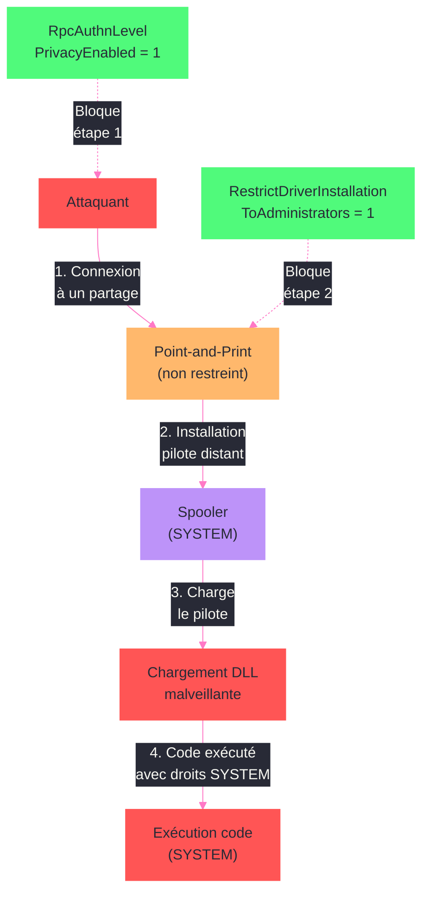

---
tags:
  - registre
  - impression
  - spooler
  - securite
  - PrintNightmare
---

# Print Server

!!! abstract "Ce que vous allez apprendre"
    - Configurer le service Print Spooler via le registre pour un serveur d'impression en entreprise
    - Gerer les pilotes, moniteurs de port et processeurs d'impression dans le registre
    - Configurer les files d'impression, les priorites et l'imprimante par defaut
    - Verrouiller Point-and-Print via les cles de strategie de groupe
    - Appliquer les mitigations post-PrintNightmare par le registre
    - Deployer des imprimantes via GPO et comprendre les cles associees
    - Configurer les processeurs d'impression et moniteurs de port personnalises
    - Scenario reel : securiser un serveur d'impression apres PrintNightmare

---

## Configuration du service Print Spooler


Le service Spooler est le moteur central du sous-systeme d'impression. Sur un serveur d'impression, sa configuration merite un ajustement fin pour gerer des centaines de files d'attente simultanees.

### Cle du service Spooler

```
HKLM\SYSTEM\CurrentControlSet\Services\Spooler
```

| Valeur | Type | Description |
|--------|------|-------------|
| `ImagePath` | `REG_EXPAND_SZ` | `%SystemRoot%\System32\spoolsv.exe` |
| `Start` | `REG_DWORD` | `2` = demarrage automatique |
| `Type` | `REG_DWORD` | `0x110` (processus propre, interactif) |
| `DependOnService` | `REG_MULTI_SZ` | `RPCSS`, `http` |
| `ObjectName` | `REG_SZ` | `LocalSystem` |

```powershell
# Check the Spooler service status and startup type
Get-Service -Name Spooler | Select-Object Name, Status, StartType
```

```title="Resultat attendu"
Name    Status StartType
----    ------ ---------
Spooler Running Automatic
```

### Parametres globaux du sous-systeme d'impression

La cle principale qui concentre toute la configuration d'impression :

```
HKLM\SYSTEM\CurrentControlSet\Control\Print
```

| Valeur | Type | Description |
|--------|------|-------------|
| `DefaultSpoolDirectory` | `REG_SZ` | Repertoire de spoule (defaut : `%SystemRoot%\System32\spool\PRINTERS`) |
| `BeepEnabled` | `REG_DWORD` | `1` = notification sonore en cas d'erreur |
| `RetryPopup` | `REG_DWORD` | `1` = popup de relance en cas d'erreur d'impression |
| `PortThreadPriority` | `REG_DWORD` | Priorite du thread de port (defaut : `0`, normal) |
| `SchedulerThreadPriority` | `REG_DWORD` | Priorite du thread planificateur (defaut : `0`) |
| `NetPopup` | `REG_DWORD` | `1` = notification reseau quand un travail termine |

Sur un serveur a forte charge, deplacer le repertoire de spoule vers un disque dedie ameliore les performances.

```powershell
# Move the spool directory to a dedicated disk
$spoolPath = "D:\PrintSpool"
if (-not (Test-Path $spoolPath)) {
    New-Item -Path $spoolPath -ItemType Directory -Force
}
Set-ItemProperty -Path "HKLM:\SYSTEM\CurrentControlSet\Control\Print" `
    -Name "DefaultSpoolDirectory" -Value $spoolPath
Restart-Service -Name Spooler -Force
```

```title="Resultat attendu"
aucune sortie si tout fonctionne. Le service Spooler redemarre et utilise le nouveau repertoire.
```

### Actions de recuperation du service

Sur un serveur de production, configurez le Spooler pour redemarrer automatiquement en cas de crash :

```powershell
# Configure Spooler recovery: restart on first and second failure, do nothing on third
sc.exe failure Spooler reset= 86400 actions= restart/60000/restart/60000//0
```

```title="Resultat attendu"
[SC] ChangeServiceConfig2 SUCCESS
```

Le registre stocke cette configuration dans la valeur binaire `FailureActions` sous `HKLM\SYSTEM\CurrentControlSet\Services\Spooler`.

!!! info "En resume"
    - Le service Spooler reside sous `HKLM\...\Services\Spooler` avec un demarrage automatique par defaut
    - La cle `HKLM\...\Control\Print` contient les parametres globaux du sous-systeme d'impression
    - Deplacer `DefaultSpoolDirectory` vers un disque dedie ameliore les performances sur un serveur a forte charge
    - Configurez les actions de recuperation pour garantir la continuite du service

---

## Gestion des pilotes d'impression dans le registre

Les pilotes d'impression sont organises par architecture et par version sous la cle `Environments`. Comprendre cette structure est indispensable pour diagnostiquer les problemes de pilotes.

### Arborescence des environnements

```
HKLM\SYSTEM\CurrentControlSet\Control\Print\Environments\
    Windows x64\
        Drivers\
            Version-3\        # Pilotes v3 (modele classique)
            Version-4\        # Pilotes v4 (modele classe)
        Print Processors\
    Windows NT x86\
        Drivers\
            Version-3\
        Print Processors\
```

Chaque pilote installe possede sa propre sous-cle sous `Version-3` ou `Version-4` :

```
HKLM\...\Environments\Windows x64\Drivers\Version-3\{NomPilote}
```

| Valeur | Type | Description |
|--------|------|-------------|
| `Driver` | `REG_SZ` | Nom du fichier DLL principal du pilote |
| `Configuration File` | `REG_SZ` | DLL de configuration (interface utilisateur) |
| `Data File` | `REG_SZ` | Fichier de donnees du pilote (PPD, GPD) |
| `Help File` | `REG_SZ` | Fichier d'aide |
| `Dependent Files` | `REG_MULTI_SZ` | Fichiers supplementaires requis |
| `Monitor` | `REG_SZ` | Moniteur de langue associe |
| `Version` | `REG_DWORD` | `3` pour v3, `4` pour v4 |

```powershell
# List all installed print drivers with their version
Get-PrinterDriver | Select-Object Name, MajorVersion, PrinterEnvironment |
    Format-Table -AutoSize
```

```title="Resultat attendu"
Name                                 MajorVersion PrinterEnvironment
----                                 ------------ ------------------
HP Universal Printing PCL 6                     3 Windows x64
Microsoft Print To PDF                          4 Windows x64
Microsoft XPS Document Writer v4                4 Windows x64
```

### Moniteurs de port

Les moniteurs de port gerent la communication entre le spooler et les peripheriques physiques :

```
HKLM\SYSTEM\CurrentControlSet\Control\Print\Monitors
```

| Sous-cle | DLL | Role |
|----------|-----|------|
| `Standard TCP/IP Port` | `tcpmon.dll` | Imprimantes reseau TCP/IP |
| `Local Port` | `localspl.dll` | Ports locaux (LPT, COM, FILE:, NUL:) |
| `USB Monitor` | `usbmon.dll` | Imprimantes USB |
| `WSD Port` | `WSDMon.dll` | Web Services for Devices |

```powershell
# List all registered port monitors
Get-ChildItem "HKLM:\SYSTEM\CurrentControlSet\Control\Print\Monitors" |
    ForEach-Object {
        [PSCustomObject]@{
            Monitor = $_.PSChildName
            Driver  = (Get-ItemProperty $_.PSPath).Driver
        }
    } | Format-Table -AutoSize
```

```title="Resultat attendu"
Monitor                Driver
-------                ------
Local Port             localspl.dll
Standard TCP/IP Port   tcpmon.dll
USB Monitor            usbmon.dll
WSD Port               WSDMon.dll
```

### Pilotes v3 vs v4

| Caracteristique | Pilote v3 | Pilote v4 |
|-----------------|-----------|-----------|
| Architecture | Charge dans le processus spoolsv.exe | Isole dans un processus separe |
| Impact crash | Crash du spooler complet | Seul le pilote est affecte |
| Installation | Droits admin requis | Pas de droits admin en mode classe |
| Securite | Surface d'attaque large (PrintNightmare) | Modele securise par conception |
| Deploiement | Complexe (fichiers INF + DLL multiples) | Package simplifie |

Sur un serveur d'impression, privilegiez les pilotes v4 ou le pilote universel (HP UPD, Microsoft IPP Class Driver) pour reduire la surface d'attaque.

!!! info "En resume"
    - Les pilotes sont organises par architecture sous `Environments\Windows x64\Drivers\Version-{3|4}`
    - Chaque pilote possede des valeurs pour la DLL principale, la configuration, les donnees et les dependances
    - Les moniteurs de port sous `Control\Print\Monitors` gerent la communication physique (TCP/IP, USB, WSD)
    - Les pilotes v4 sont plus securises car ils s'executent en isolation, hors du processus spoolsv.exe

---

## Configuration des files d'impression et imprimante par defaut

Chaque imprimante installee possede sa propre sous-cle dans le registre avec l'ensemble de ses parametres operationnels.

### Cle d'une imprimante

```
HKLM\SYSTEM\CurrentControlSet\Control\Print\Printers\{NomImprimante}
```

| Valeur | Type | Description |
|--------|------|-------------|
| `Name` | `REG_SZ` | Nom affiche de l'imprimante |
| `Port` | `REG_SZ` | Port(s) utilise(s), separes par des virgules |
| `Printer Driver` | `REG_SZ` | Nom du pilote associe |
| `Print Processor` | `REG_SZ` | Processeur d'impression (generalement `winprint`) |
| `Priority` | `REG_DWORD` | Priorite de la file (1 = minimum, 99 = maximum) |
| `DefaultPriority` | `REG_DWORD` | Priorite par defaut des travaux |
| `Attributes` | `REG_DWORD` | Bitmask d'attributs (partagee, reseau, publiee, etc.) |
| `Sharing Name` | `REG_SZ` | Nom de partage reseau |
| `Status` | `REG_DWORD` | Etat actuel |

```powershell
# List all printers with their key properties from the registry
Get-ItemProperty "HKLM:\SYSTEM\CurrentControlSet\Control\Print\Printers\*" |
    Select-Object Name, Port, "Printer Driver", Priority |
    Format-Table -AutoSize
```

```title="Resultat attendu"
Name                    Port           Printer Driver                 Priority
----                    ----           --------------                 --------
HP LaserJet Etage 2     IP_10.0.1.50   HP Universal Printing PCL 6          1
Canon IR-ADV C5535      IP_10.0.1.51   Canon Generic Plus UFR II            1
Microsoft Print to PDF  PORTPROMPT:    Microsoft Print To PDF               1
```

### Configuration de priorite entre files

Un cas d'usage courant : creer deux files pointant vers la meme imprimante physique, avec des priorites differentes. Les travaux urgents passent en premier.

```powershell
# Create a high-priority queue pointing to the same printer port
Add-Printer -Name "LaserJet-Urgents" -DriverName "HP Universal Printing PCL 6" `
    -PortName "IP_10.0.1.50" -Priority 99

# Verify both queues exist with different priorities
Get-Printer -Name "LaserJet*" | Select-Object Name, Priority | Format-Table
```

```title="Resultat attendu"
Name                Priority
----                --------
LaserJet Etage 2           1
LaserJet-Urgents          99
```

### Imprimante par defaut

Depuis Windows 10 version 1511, le systeme gere automatiquement l'imprimante par defaut (derniere utilisee). Pour desactiver ce comportement :

```
HKCU\SOFTWARE\Microsoft\Windows NT\CurrentVersion\Windows
```

| Valeur | Type | Description |
|--------|------|-------------|
| `LegacyDefaultPrinterMode` | `REG_DWORD` | `1` = mode classique (imprimante par defaut fixe) |

La valeur de l'imprimante par defaut elle-meme :

```
HKCU\SOFTWARE\Microsoft\Windows NT\CurrentVersion\Windows
    Device = "NomImprimante,winspool,Ne01:"
```

Pour la gestion centralisee via GPO :

```
HKCU\SOFTWARE\Policies\Microsoft\Windows NT\CurrentVersion\Windows
    LegacyDefaultPrinterMode = 1
```

```powershell
# Disable "Let Windows manage my default printer" via registry
Set-ItemProperty -Path "HKCU:\SOFTWARE\Microsoft\Windows NT\CurrentVersion\Windows" `
    -Name "LegacyDefaultPrinterMode" -Value 1 -Type DWord

# Set a specific default printer
$printer = "HP LaserJet Etage 2"
(New-Object -ComObject WScript.Network).SetDefaultPrinter($printer)
```

```title="Resultat attendu"
aucune sortie si tout fonctionne. L'imprimante par defaut est desormais fixe.
```

### Plages horaires d'impression

Chaque file d'impression peut etre restreinte a une plage horaire via les valeurs registre :

| Valeur | Type | Description |
|--------|------|-------------|
| `StartTime` | `REG_DWORD` | Heure de debut (minutes depuis minuit) |
| `UntilTime` | `REG_DWORD` | Heure de fin (minutes depuis minuit) |

```powershell
# Restrict a queue to business hours only (08:00 - 18:00)
$startMinutes = 8 * 60    # 480
$endMinutes = 18 * 60     # 1080
Set-ItemProperty -Path "HKLM:\SYSTEM\CurrentControlSet\Control\Print\Printers\HP LaserJet Etage 2" `
    -Name "StartTime" -Value $startMinutes -Type DWord
Set-ItemProperty -Path "HKLM:\SYSTEM\CurrentControlSet\Control\Print\Printers\HP LaserJet Etage 2" `
    -Name "UntilTime" -Value $endMinutes -Type DWord
```

```title="Resultat attendu"
aucune sortie. La file n'accepte desormais les impressions qu'entre 08h00 et 18h00.
```

!!! info "En resume"
    - Chaque imprimante est une sous-cle sous `Control\Print\Printers\{NomImprimante}` avec nom, port, pilote et priorite
    - Deux files avec des priorites differentes sur le meme port permettent de gerer les impressions urgentes
    - L'imprimante par defaut est controlee sous `HKCU\...\Windows` avec `LegacyDefaultPrinterMode` pour desactiver la gestion automatique
    - Les plages horaires (`StartTime`, `UntilTime`) restreignent l'acces a une file

---

## Restrictions Point-and-Print

Point-and-Print permet aux clients de telecharger automatiquement les pilotes depuis un serveur d'impression. Ce mecanisme est puissant mais represente un vecteur d'attaque majeur.

### Cle de strategie Point-and-Print

```
HKLM\SOFTWARE\Policies\Microsoft\Windows NT\Printers\PointAndPrint
```

| Valeur | Type | Description |
|--------|------|-------------|
| `RestrictDriverInstallationToAdministrators` | `REG_DWORD` | `1` = seuls les admins peuvent installer des pilotes |
| `NoWarningNoElevationOnInstall` | `REG_DWORD` | `0` = toujours afficher l'avertissement et demander l'elevation |
| `UpdatePromptSettings` | `REG_DWORD` | `0` = afficher un avertissement et une elevation lors des mises a jour |
| `InForest` | `REG_DWORD` | `1` = restreindre aux serveurs de la foret AD |
| `TrustedServers` | `REG_DWORD` | `1` = autoriser uniquement les serveurs de la liste |
| `ServerList` | `REG_SZ` | Liste des serveurs autorises (separes par des `;`) |

```powershell
# Lock down Point-and-Print to specific trusted servers only
$pnpPath = "HKLM:\SOFTWARE\Policies\Microsoft\Windows NT\Printers\PointAndPrint"
if (-not (Test-Path $pnpPath)) {
    New-Item -Path $pnpPath -Force | Out-Null
}
Set-ItemProperty -Path $pnpPath -Name "RestrictDriverInstallationToAdministrators" -Value 1 -Type DWord
Set-ItemProperty -Path $pnpPath -Name "NoWarningNoElevationOnInstall" -Value 0 -Type DWord
Set-ItemProperty -Path $pnpPath -Name "UpdatePromptSettings" -Value 0 -Type DWord
Set-ItemProperty -Path $pnpPath -Name "TrustedServers" -Value 1 -Type DWord
Set-ItemProperty -Path $pnpPath -Name "ServerList" -Value "printserver01.corp.local;printserver02.corp.local" -Type String
```

```title="Resultat attendu"
aucune sortie. Les restrictions Point-and-Print sont desormais actives.
```

### Package Point-and-Print

Une approche plus securisee consiste a utiliser les packages de pilotes pre-approuves :

```
HKLM\SOFTWARE\Policies\Microsoft\Windows NT\Printers\PackagePointAndPrint
```

| Valeur | Type | Description |
|--------|------|-------------|
| `PackagePointAndPrintOnly` | `REG_DWORD` | `1` = n'autoriser que les packages signes |
| `PackagePointAndPrintServerList` | `REG_DWORD` | `1` = restreindre aux serveurs listes |
| `ListofServers` | `REG_MULTI_SZ` | Serveurs autorises pour les packages |

```powershell
# Enforce packaged Point-and-Print only
$pkgPath = "HKLM:\SOFTWARE\Policies\Microsoft\Windows NT\Printers\PackagePointAndPrint"
if (-not (Test-Path $pkgPath)) {
    New-Item -Path $pkgPath -Force | Out-Null
}
Set-ItemProperty -Path $pkgPath -Name "PackagePointAndPrintOnly" -Value 1 -Type DWord
Set-ItemProperty -Path $pkgPath -Name "PackagePointAndPrintServerList" -Value 1 -Type DWord
New-ItemProperty -Path $pkgPath -Name "ListofServers" -Value @("printserver01.corp.local","printserver02.corp.local") `
    -PropertyType MultiString -Force
```

```title="Resultat attendu"
aucune sortie. Seuls les packages de pilotes signes provenant des serveurs autorises seront acceptes.
```

!!! warning "Point-and-Print sans restriction = vecteur d'attaque"
    Sans ces restrictions, n'importe quel serveur peut pousser un pilote (potentiellement malveillant) vers les postes clients. C'est exactement le mecanisme exploite par les vulnerabilites PrintNightmare (CVE-2021-34527, CVE-2021-1675).

!!! info "En resume"
    - La cle `PointAndPrint` sous `Policies` controle qui peut installer des pilotes et depuis quels serveurs
    - `RestrictDriverInstallationToAdministrators` a `1` bloque l'installation de pilotes par les utilisateurs standard
    - `TrustedServers` + `ServerList` restreignent les telechargements aux serveurs approuves
    - `PackagePointAndPrint` ajoute une couche supplementaire en exigeant des packages signes

---

## Mitigations PrintNightmare



PrintNightmare (CVE-2021-34527 et variantes) a expose une faille fondamentale dans le sous-systeme d'impression Windows. Les mitigations registre sont essentielles meme apres l'application des correctifs.

### Cles de mitigation principales

#### Restriction d'installation des pilotes

```
HKLM\SOFTWARE\Policies\Microsoft\Windows NT\Printers\PointAndPrint
    RestrictDriverInstallationToAdministrators = 1
```

Cette valeur, introduite par le correctif KB5005010, empeche les utilisateurs non-administrateurs d'installer ou mettre a jour des pilotes d'impression via Point-and-Print.

#### Niveau d'authentification RPC

```
HKLM\SYSTEM\CurrentControlSet\Control\Print
    RpcAuthnLevelPrivacyEnabled = 1
```

Force le chiffrement des communications RPC entre le client et le serveur d'impression. Introduit par le correctif d'octobre 2021, cette valeur protege contre l'interception des echanges de pilotes.

#### Desactivation de l'installation de pilotes distants

```
HKLM\SOFTWARE\Policies\Microsoft\Windows NT\Printers
    RegisterSpoolerRemoteRpcEndPoint = 2
```

| Valeur | Description |
|--------|-------------|
| `1` | Le spooler accepte les connexions RPC distantes (defaut) |
| `2` | Le spooler n'accepte que les connexions locales |

Sur les postes de travail qui n'ont pas besoin de partager des imprimantes, definir cette valeur a `2` reduit drastiquement la surface d'attaque.

### Application des mitigations en lot

```powershell
# Apply all PrintNightmare mitigations in a single script
$printPolicies = "HKLM:\SOFTWARE\Policies\Microsoft\Windows NT\Printers"
$pnpPolicies = "$printPolicies\PointAndPrint"
$printControl = "HKLM:\SYSTEM\CurrentControlSet\Control\Print"

# Create policy keys if they do not exist
foreach ($path in @($printPolicies, $pnpPolicies)) {
    if (-not (Test-Path $path)) {
        New-Item -Path $path -Force | Out-Null
    }
}

# Restrict driver installation to administrators only
Set-ItemProperty -Path $pnpPolicies -Name "RestrictDriverInstallationToAdministrators" -Value 1 -Type DWord

# Require elevation for Point-and-Print install and update
Set-ItemProperty -Path $pnpPolicies -Name "NoWarningNoElevationOnInstall" -Value 0 -Type DWord
Set-ItemProperty -Path $pnpPolicies -Name "UpdatePromptSettings" -Value 0 -Type DWord

# Enable RPC authentication level privacy
Set-ItemProperty -Path $printControl -Name "RpcAuthnLevelPrivacyEnabled" -Value 1 -Type DWord

# On workstations: disable remote spooler RPC endpoint
Set-ItemProperty -Path $printPolicies -Name "RegisterSpoolerRemoteRpcEndPoint" -Value 2 -Type DWord

Write-Output "All PrintNightmare mitigations applied."
```

```title="Resultat attendu"
All PrintNightmare mitigations applied.
```

### Verification des mitigations

```powershell
# Verify that all PrintNightmare mitigations are in place
$checks = @(
    @{
        Path  = "HKLM:\SOFTWARE\Policies\Microsoft\Windows NT\Printers\PointAndPrint"
        Name  = "RestrictDriverInstallationToAdministrators"
        Expected = 1
    },
    @{
        Path  = "HKLM:\SOFTWARE\Policies\Microsoft\Windows NT\Printers\PointAndPrint"
        Name  = "NoWarningNoElevationOnInstall"
        Expected = 0
    },
    @{
        Path  = "HKLM:\SYSTEM\CurrentControlSet\Control\Print"
        Name  = "RpcAuthnLevelPrivacyEnabled"
        Expected = 1
    }
)

foreach ($check in $checks) {
    $value = Get-ItemProperty -Path $check.Path -Name $check.Name -ErrorAction SilentlyContinue
    $actual = $value.($check.Name)
    $status = if ($actual -eq $check.Expected) { "OK" } else { "NON CONFORME" }
    Write-Output "$($check.Name) = $actual [$status]"
}
```

```title="Resultat attendu"
RestrictDriverInstallationToAdministrators = 1 [OK]
NoWarningNoElevationOnInstall = 0 [OK]
RpcAuthnLevelPrivacyEnabled = 1 [OK]
```

!!! danger "Les correctifs seuls ne suffisent pas"
    Microsoft a publie plusieurs correctifs pour PrintNightmare, mais chaque patch necessite que les valeurs registre soient correctement positionnees. Sans `RestrictDriverInstallationToAdministrators = 1`, le correctif n'est pas pleinement effectif.

!!! info "En resume"
    - `RestrictDriverInstallationToAdministrators = 1` bloque l'exploitation principale de PrintNightmare
    - `RpcAuthnLevelPrivacyEnabled = 1` chiffre les communications RPC du spooler
    - `RegisterSpoolerRemoteRpcEndPoint = 2` desactive les connexions RPC distantes sur les postes non-serveurs
    - Les correctifs KB sans les valeurs registre associees ne protegent pas completement

---

## Deploiement d'imprimantes via GPO

Les strategies de groupe permettent de deployer des connexions imprimante a grande echelle. Plusieurs mecanismes coexistent dans le registre.

### Connexions imprimante par machine (PushPrinterConnections)

Le service `PushPrinterConnections` lit les objets GPO et cree les connexions localement :

```
HKLM\SOFTWARE\Microsoft\Windows NT\CurrentVersion\Print\Connections\
    ,,serveur,NomPartage\
```

Chaque connexion est une sous-cle au format `,,serveur,NomPartage` avec les valeurs :

| Valeur | Type | Description |
|--------|------|-------------|
| `Server` | `REG_SZ` | Nom UNC du serveur (`\\serveur`) |
| `Printer` | `REG_SZ` | Chemin UNC complet (`\\serveur\NomPartage`) |
| `Provider` | `REG_SZ` | Fournisseur d'impression (`win32spl.dll`) |

### Connexions imprimante par utilisateur

```
HKCU\Printers\Connections\
    ,,serveur,NomPartage\
```

Meme structure que les connexions machine, mais limitee a la session de l'utilisateur.

```powershell
# List all per-user printer connections from the registry
Get-ChildItem "HKCU:\Printers\Connections" -ErrorAction SilentlyContinue |
    ForEach-Object {
        Get-ItemProperty $_.PSPath | Select-Object Server, Printer
    } | Format-Table -AutoSize
```

```title="Resultat attendu"
Server                   Printer
------                   -------
\\printserver01          \\printserver01\HP-Etage2
\\printserver01          \\printserver01\Canon-RDC
```

### Preferences de strategie de groupe (GPP)

Les preferences GPO ecrivent dans des cles specifiques pour deployer les imprimantes :

```
HKCU\SOFTWARE\Microsoft\Windows NT\CurrentVersion\PrinterPorts
```

| Valeur | Type | Description |
|--------|------|-------------|
| `{NomImprimante}` | `REG_SZ` | `winspool,Ne{XX}:,15,45` (fournisseur, port, timeout) |

```
HKCU\SOFTWARE\Microsoft\Windows NT\CurrentVersion\Devices
```

| Valeur | Type | Description |
|--------|------|-------------|
| `{NomImprimante}` | `REG_SZ` | `winspool,Ne{XX}:` |

### Publication dans Active Directory

Pour qu'une imprimante soit trouvable via la recherche AD, elle doit etre publiee. Le registre controle ce comportement :

```
HKLM\SOFTWARE\Policies\Microsoft\Windows NT\Printers
```

| Valeur | Type | Description |
|--------|------|-------------|
| `PublishPrinters` | `REG_DWORD` | `1` = publier automatiquement les imprimantes partagees dans AD |
| `PruneDownlevel` | `REG_DWORD` | `1` = supprimer les imprimantes obsoletes de AD |
| `Immortal` | `REG_DWORD` | `1` = ne jamais elaguer les imprimantes publiees |
| `PruningInterval` | `REG_DWORD` | Intervalle d'elagage en heures (defaut : `8`) |
| `PruningRetries` | `REG_DWORD` | Nombre de tentatives avant suppression (defaut : `2`) |

```powershell
# Publish all shared printers to Active Directory
$printersPath = "HKLM:\SOFTWARE\Policies\Microsoft\Windows NT\Printers"
if (-not (Test-Path $printersPath)) {
    New-Item -Path $printersPath -Force | Out-Null
}
Set-ItemProperty -Path $printersPath -Name "PublishPrinters" -Value 1 -Type DWord
Set-ItemProperty -Path $printersPath -Name "PruneDownlevel" -Value 1 -Type DWord
Set-ItemProperty -Path $printersPath -Name "PruningInterval" -Value 8 -Type DWord
```

```title="Resultat attendu"
aucune sortie. Les imprimantes partagees seront publiees dans Active Directory lors du prochain cycle GPO.
```

!!! info "En resume"
    - Les connexions machine sont sous `HKLM\...\Print\Connections` au format `,,serveur,partage`
    - Les connexions utilisateur sont sous `HKCU\Printers\Connections` avec la meme structure
    - La publication AD est controlee par `PublishPrinters` et les parametres d'elagage sous la cle Policies
    - Les preferences GPO ecrivent dans `PrinterPorts` et `Devices` sous HKCU

---

## Processeurs d'impression et moniteurs de port

Les processeurs d'impression et les moniteurs de port sont des composants intermediaires du pipeline d'impression, chacun enregistre dans le registre.

### Processeurs d'impression

```
HKLM\SYSTEM\CurrentControlSet\Control\Print\Environments\Windows x64\Print Processors\
```

Le processeur par defaut est `winprint` :

```
HKLM\...\Print Processors\winprint
    Driver = "winprint.dll"
```

| Processeur | DLL | Types de donnees supportes |
|------------|-----|---------------------------|
| `winprint` | `winprint.dll` | RAW, EMF, TEXT, XPS |
| Processeurs tiers | Variable | Depend du fournisseur |

```powershell
# List all registered print processors
Get-ChildItem "HKLM:\SYSTEM\CurrentControlSet\Control\Print\Environments\Windows x64\Print Processors" |
    ForEach-Object {
        [PSCustomObject]@{
            Processor = $_.PSChildName
            Driver    = (Get-ItemProperty $_.PSPath).Driver
        }
    } | Format-Table -AutoSize
```

```title="Resultat attendu"
Processor   Driver
---------   ------
winprint    winprint.dll
```

### Ports d'impression

Les ports configures sont listes sous la cle du moniteur correspondant :

```
HKLM\SYSTEM\CurrentControlSet\Control\Print\Monitors\Standard TCP/IP Port\Ports\{NomPort}
```

| Valeur | Type | Description |
|--------|------|-------------|
| `HostName` | `REG_SZ` | Adresse IP ou nom DNS de l'imprimante |
| `PortNumber` | `REG_DWORD` | Port TCP (defaut : `9100` pour RAW, `515` pour LPR) |
| `Protocol` | `REG_DWORD` | `1` = RAW, `2` = LPR |
| `SNMP Enabled` | `REG_DWORD` | `1` = activer SNMP pour le statut |
| `SNMP Community` | `REG_SZ` | Communaute SNMP (defaut : `public`) |
| `SNMP Index` | `REG_DWORD` | Index SNMP du peripherique |

```powershell
# List all TCP/IP printer ports with their configuration
$portsPath = "HKLM:\SYSTEM\CurrentControlSet\Control\Print\Monitors\Standard TCP/IP Port\Ports"
if (Test-Path $portsPath) {
    Get-ChildItem $portsPath | ForEach-Object {
        $props = Get-ItemProperty $_.PSPath
        [PSCustomObject]@{
            Port     = $_.PSChildName
            HostName = $props.HostName
            PortNum  = $props.PortNumber
            Protocol = if ($props.Protocol -eq 1) { "RAW" } else { "LPR" }
        }
    } | Format-Table -AutoSize
}
```

```title="Resultat attendu"
Port           HostName     PortNum Protocol
----           --------     ------- --------
IP_10.0.1.50   10.0.1.50       9100 RAW
IP_10.0.1.51   10.0.1.51       9100 RAW
```

### Creer un port TCP/IP via le registre

```powershell
# Create a new TCP/IP printer port
Add-PrinterPort -Name "IP_10.0.1.52" -PrinterHostAddress "10.0.1.52" -PortNumber 9100

# Verify the port in the registry
Get-ItemProperty "HKLM:\SYSTEM\CurrentControlSet\Control\Print\Monitors\Standard TCP/IP Port\Ports\IP_10.0.1.52" |
    Select-Object HostName, PortNumber, Protocol
```

```title="Resultat attendu"
HostName   PortNumber Protocol
--------   ---------- --------
10.0.1.52        9100        1
```

!!! info "En resume"
    - Les processeurs d'impression sont sous `Print Processors` dans chaque environnement ; `winprint.dll` gere RAW, EMF, TEXT et XPS
    - Les ports TCP/IP sont configures sous `Monitors\Standard TCP/IP Port\Ports` avec adresse, port et protocole
    - Le protocole RAW (port 9100) est le plus courant ; LPR (port 515) est utilise pour la compatibilite Unix
    - SNMP peut etre active par port pour remonter le statut de l'imprimante

---

## Scenario : securiser un serveur d'impression post-PrintNightmare

### Contexte

Votre entreprise exploite un serveur d'impression Windows Server 2019 (`PRINTSVR01`) qui dessert 50 imprimantes partagees. Suite a l'audit de securite trimestriel, l'equipe SSI exige un durcissement complet du sous-systeme d'impression en reponse aux vulnerabilites PrintNightmare.

### Etape 1 : inventaire de l'existant

Commencez par dresser l'etat des lieux avant toute modification :

```powershell
# Inventory: list all shared printers, drivers, and ports
Write-Output "=== PRINTERS ==="
Get-Printer | Where-Object { $_.Shared -eq $true } |
    Select-Object Name, DriverName, PortName, Shared |
    Format-Table -AutoSize

Write-Output "=== DRIVERS ==="
Get-PrinterDriver | Select-Object Name, MajorVersion, PrinterEnvironment |
    Format-Table -AutoSize

Write-Output "=== POINT AND PRINT SETTINGS ==="
$pnpPath = "HKLM:\SOFTWARE\Policies\Microsoft\Windows NT\Printers\PointAndPrint"
if (Test-Path $pnpPath) {
    Get-ItemProperty $pnpPath
} else {
    Write-Output "No Point-and-Print policies configured (VULNERABLE)."
}
```

```title="Resultat attendu"
=== PRINTERS ===
Name                  DriverName                     PortName       Shared
----                  ----------                     --------       ------
HP-Etage1             HP Universal Printing PCL 6    IP_10.0.1.50     True
HP-Etage2             HP Universal Printing PCL 6    IP_10.0.1.51     True
Canon-RDC             Canon Generic UFR II           IP_10.0.1.52     True

=== DRIVERS ===
Name                                 MajorVersion PrinterEnvironment
----                                 ------------ ------------------
HP Universal Printing PCL 6                     3 Windows x64
Canon Generic UFR II                            3 Windows x64
Canon Generic UFR II                            3 Windows NT x86

=== POINT AND PRINT SETTINGS ===
No Point-and-Print policies configured (VULNERABLE).
```

### Etape 2 : appliquer les mitigations registre

```powershell
# Full PrintNightmare hardening script for a print server
$printPolicies = "HKLM:\SOFTWARE\Policies\Microsoft\Windows NT\Printers"
$pnpPolicies = "$printPolicies\PointAndPrint"
$pkgPolicies = "$printPolicies\PackagePointAndPrint"
$printControl = "HKLM:\SYSTEM\CurrentControlSet\Control\Print"

# Create policy keys
foreach ($path in @($printPolicies, $pnpPolicies, $pkgPolicies)) {
    if (-not (Test-Path $path)) {
        New-Item -Path $path -Force | Out-Null
    }
}

# MITIGATION 1: Restrict driver installation to administrators
Set-ItemProperty -Path $pnpPolicies -Name "RestrictDriverInstallationToAdministrators" -Value 1 -Type DWord

# MITIGATION 2: Always show warning and require elevation
Set-ItemProperty -Path $pnpPolicies -Name "NoWarningNoElevationOnInstall" -Value 0 -Type DWord
Set-ItemProperty -Path $pnpPolicies -Name "UpdatePromptSettings" -Value 0 -Type DWord

# MITIGATION 3: Restrict to trusted servers
Set-ItemProperty -Path $pnpPolicies -Name "TrustedServers" -Value 1 -Type DWord
Set-ItemProperty -Path $pnpPolicies -Name "ServerList" -Value "PRINTSVR01.corp.local" -Type String

# MITIGATION 4: Enable RPC authentication privacy
Set-ItemProperty -Path $printControl -Name "RpcAuthnLevelPrivacyEnabled" -Value 1 -Type DWord

# MITIGATION 5: Require packaged Point-and-Print drivers
Set-ItemProperty -Path $pkgPolicies -Name "PackagePointAndPrintOnly" -Value 1 -Type DWord
Set-ItemProperty -Path $pkgPolicies -Name "PackagePointAndPrintServerList" -Value 1 -Type DWord
New-ItemProperty -Path $pkgPolicies -Name "ListofServers" -Value @("PRINTSVR01.corp.local") `
    -PropertyType MultiString -Force | Out-Null

Write-Output "All mitigations applied on PRINTSVR01."
```

```title="Resultat attendu"
All mitigations applied on PRINTSVR01.
```

### Etape 3 : supprimer les pilotes v3 x86 inutiles

Les pilotes 32 bits (x86) representent une surface d'attaque supplementaire. Si votre parc est 100% 64 bits, supprimez-les :

```powershell
# Remove 32-bit print drivers that are no longer needed
Get-PrinterDriver | Where-Object { $_.PrinterEnvironment -eq "Windows NT x86" } |
    ForEach-Object {
        Write-Output "Removing x86 driver: $($_.Name)"
        Remove-PrinterDriver -Name $_.Name -PrinterEnvironment "Windows NT x86" -ErrorAction SilentlyContinue
    }
```

```title="Resultat attendu"
Removing x86 driver: Canon Generic UFR II
```

### Etape 4 : desactiver le spooler sur les serveurs non-impression

Sur tous les serveurs qui n'hebergent pas de role d'impression, desactivez completement le service Spooler :

```powershell
# Disable the Print Spooler on non-print servers
Stop-Service -Name Spooler -Force
Set-Service -Name Spooler -StartupType Disabled

# Verify
Get-Service -Name Spooler | Select-Object Name, Status, StartType
```

```title="Resultat attendu"
Name    Status StartType
----    ------ ---------
Spooler Stopped  Disabled
```

### Etape 5 : validation finale

```powershell
# Comprehensive post-hardening validation
$results = @()

# Check 1: RestrictDriverInstallationToAdministrators
$val = (Get-ItemProperty "HKLM:\SOFTWARE\Policies\Microsoft\Windows NT\Printers\PointAndPrint" -ErrorAction SilentlyContinue).RestrictDriverInstallationToAdministrators
$results += [PSCustomObject]@{ Check = "RestrictDriverInstallation"; Value = $val; Status = if ($val -eq 1) {"PASS"} else {"FAIL"} }

# Check 2: RpcAuthnLevelPrivacyEnabled
$val = (Get-ItemProperty "HKLM:\SYSTEM\CurrentControlSet\Control\Print" -ErrorAction SilentlyContinue).RpcAuthnLevelPrivacyEnabled
$results += [PSCustomObject]@{ Check = "RpcAuthnLevelPrivacy"; Value = $val; Status = if ($val -eq 1) {"PASS"} else {"FAIL"} }

# Check 3: TrustedServers
$val = (Get-ItemProperty "HKLM:\SOFTWARE\Policies\Microsoft\Windows NT\Printers\PointAndPrint" -ErrorAction SilentlyContinue).TrustedServers
$results += [PSCustomObject]@{ Check = "TrustedServers"; Value = $val; Status = if ($val -eq 1) {"PASS"} else {"FAIL"} }

# Check 4: PackagePointAndPrintOnly
$val = (Get-ItemProperty "HKLM:\SOFTWARE\Policies\Microsoft\Windows NT\Printers\PackagePointAndPrint" -ErrorAction SilentlyContinue).PackagePointAndPrintOnly
$results += [PSCustomObject]@{ Check = "PackagePointAndPrintOnly"; Value = $val; Status = if ($val -eq 1) {"PASS"} else {"FAIL"} }

# Check 5: No x86 drivers remaining
$x86count = (Get-PrinterDriver | Where-Object { $_.PrinterEnvironment -eq "Windows NT x86" }).Count
$results += [PSCustomObject]@{ Check = "No x86 Drivers"; Value = $x86count; Status = if ($x86count -eq 0) {"PASS"} else {"FAIL"} }

$results | Format-Table -AutoSize
```

```title="Resultat attendu"
Check                        Value Status
-----                        ----- ------
RestrictDriverInstallation       1 PASS
RpcAuthnLevelPrivacy             1 PASS
TrustedServers                   1 PASS
PackagePointAndPrintOnly         1 PASS
No x86 Drivers                   0 PASS
```

!!! tip "Deployer via GPO"
    Pour appliquer ces mitigations a l'ensemble du parc, creez une GPO qui cible les cles sous `HKLM\SOFTWARE\Policies\Microsoft\Windows NT\Printers`. Les postes de travail doivent recevoir `RegisterSpoolerRemoteRpcEndPoint = 2` en complement, et les serveurs non-impression doivent avoir le service Spooler desactive.

!!! info "En resume"
    - L'inventaire prealable identifie les pilotes v3, les pilotes x86 et l'absence de restrictions Point-and-Print
    - Cinq mitigations registre couvrent l'essentiel : restriction admin, elevation, serveurs de confiance, RPC chiffre, packages signes
    - Les pilotes x86 doivent etre supprimes si le parc est 100% 64 bits
    - Le spooler doit etre desactive sur tout serveur qui n'a pas besoin du role d'impression
    - Un script de validation permet de verifier la conformite apres durcissement

!!! tip "Voir aussi"
    - :material-book-open-variant: [Sous-systeme d'impression et le registre](../bible-registre-windows/30-impression.md) — Bible Registre
    - :material-shield-account: [PrintNightmare et durcissement Print Spooler](../gpo-pour-les-admins/27-printnightmare-hardening.md) — GPO Admins
