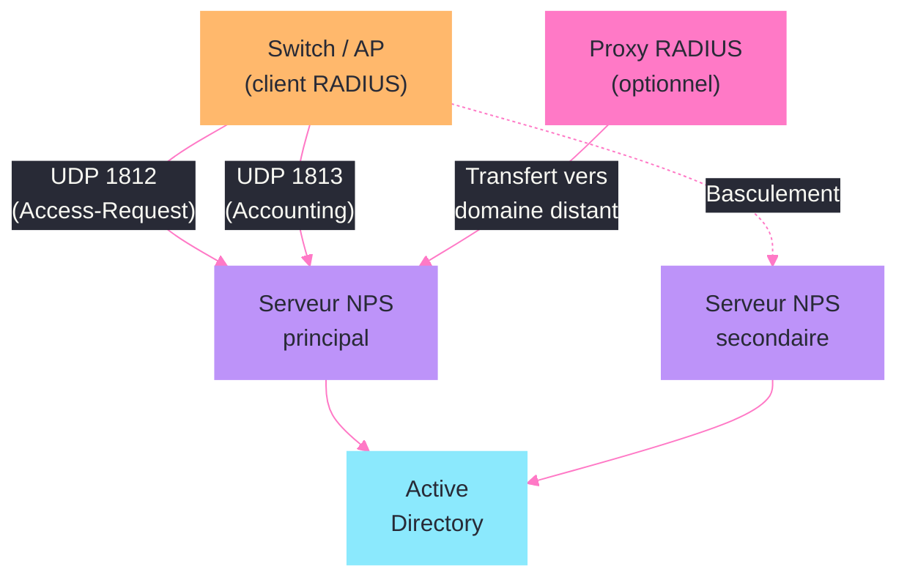
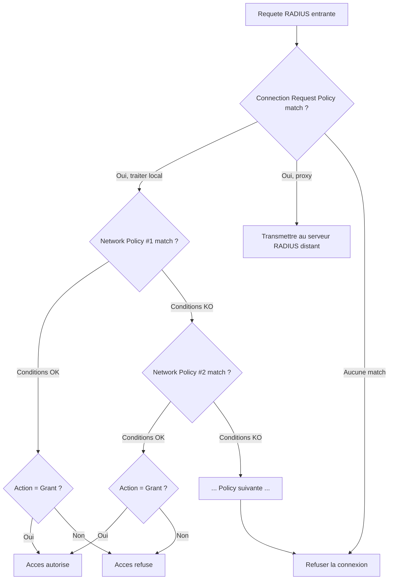
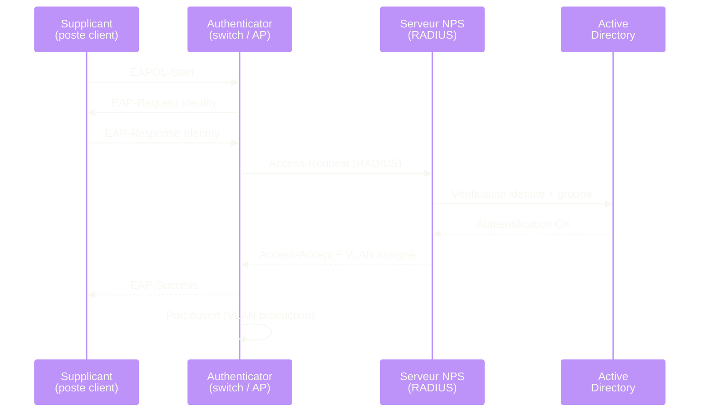

---
tags:
  - registre
  - radius
  - nps
  - authentification
  - 802.1X
---

# RADIUS / NPS

!!! abstract "Ce que vous allez apprendre"
    - Configurer le service NPS (Network Policy Server) via le registre
    - Gerer les clients et serveurs RADIUS dans le registre
    - Comprendre les strategies de connexion et les strategies reseau dans le registre
    - Configurer l'authentification 802.1X via les cles de registre
    - Parametrer l'authentification VPN avec NPS (PPTP, L2TP, IKEv2, SSTP)
    - Configurer les methodes EAP (PEAP, EAP-TLS) dans le registre
    - Activer et configurer la journalisation et la comptabilite NPS
    - Mettre en place un proxy RADIUS et diagnostiquer les echecs d'authentification 802.1X

---

## Configuration du service NPS

Le service IAS (Internet Authentication Service) est le nom interne du serveur NPS dans le registre. Meme sous Windows Server 2019/2022, le service conserve ce nom historique.

### Cle du service IAS

```
HKLM\SYSTEM\CurrentControlSet\Services\IAS
```

| Valeur | Type | Description |
|--------|------|-------------|
| `ImagePath` | `REG_EXPAND_SZ` | `%SystemRoot%\System32\ias.dll` |
| `Start` | `REG_DWORD` | `2` = demarrage automatique |
| `Type` | `REG_DWORD` | `0x20` (processus partage dans svchost) |
| `ObjectName` | `REG_SZ` | `LocalSystem` |
| `DependOnService` | `REG_MULTI_SZ` | `RPCSS` |
| `Description` | `REG_SZ` | Network Policy Server |

```powershell
# Check the NPS service status
Get-Service -Name IAS | Select-Object Name, DisplayName, Status, StartType
```

```title="Resultat attendu"
Name DisplayName             Status StartType
---- -----------             ------ ---------
IAS  Network Policy Server  Running Automatic
```

### Parametres principaux du service

La configuration NPS reside sous une arborescence dediee :

```
HKLM\SYSTEM\CurrentControlSet\Services\IAS\Parameters
```

| Valeur | Type | Description |
|--------|------|-------------|
| `Ping User-Name` | `REG_SZ` | Nom d'utilisateur pour les tests de connectivite RADIUS |
| `Allow RADIUS Signature` | `REG_DWORD` | `1` = exiger la signature des paquets RADIUS |
| `Max Lost Interval` | `REG_DWORD` | Intervalle maximal (en secondes) avant de considerer un client perdu |

### Enregistrement dans Active Directory

NPS doit etre enregistre dans AD pour pouvoir lire les proprietes de connexion distante des comptes utilisateurs :

```powershell
# Register NPS in Active Directory
netsh ras add registeredserver

# Verify registration
netsh nps show registeredserver
```

```title="Resultat attendu"
The RADIUS server was registered successfully in Active Directory domain corp.local.

Registered RADIUS servers in domain corp.local:
    NPS01.corp.local
```

L'enregistrement ajoute le compte machine au groupe `RAS and IAS Servers` dans AD, ce qui lui donne les droits de lecture necessaires sur les comptes utilisateurs.

!!! info "En resume"
    - Le service NPS s'appelle `IAS` dans le registre, sous `HKLM\...\Services\IAS`
    - La configuration NPS reside sous `IAS\Parameters` dans le registre
    - NPS doit etre enregistre dans AD (groupe `RAS and IAS Servers`) pour interroger les proprietes de compte

---

## Clients et serveurs RADIUS dans le registre



Les clients RADIUS (points d'acces, commutateurs, controleurs VPN) sont enregistres dans le registre NPS. Chaque client est identifie par un nom et une adresse IP.

### Emplacement des clients RADIUS

```
HKLM\SYSTEM\CurrentControlSet\Services\IAS\Parameters\Clients
```

Chaque client est une sous-cle numerotee :

```
HKLM\...\IAS\Parameters\Clients\{NumeroClient}
```

| Valeur | Type | Description |
|--------|------|-------------|
| `Client Name` | `REG_SZ` | Nom convivial du client RADIUS |
| `Client IPAddress` | `REG_SZ` | Adresse IP ou plage CIDR du client |
| `Shared Secret` | `REG_SZ` | Secret partage (chiffre dans le registre) |
| `NAS Manufacturer` | `REG_DWORD` | `0` = RADIUS standard, autre = specifique fournisseur |
| `Require Signature` | `REG_DWORD` | `1` = exiger la signature des paquets (Message-Authenticator) |

```powershell
# List all configured RADIUS clients
Get-NpsRadiusClient | Select-Object Name, Address, SharedSecret, Enabled |
    Format-Table -AutoSize
```

```title="Resultat attendu"
Name              Address       SharedSecret   Enabled
----              -------       ------------   -------
Switch-Etage1     10.0.1.10     ************      True
Switch-Etage2     10.0.1.11     ************      True
AP-WiFi-Corp      10.0.2.0/24   ************      True
VPN-Gateway       10.0.0.1      ************      True
```

### Ajouter un client RADIUS

```powershell
# Add a new RADIUS client for a network switch
New-NpsRadiusClient -Name "Switch-Etage3" `
    -Address "10.0.1.12" `
    -SharedSecret "C0mpl3x!Sh@redS3cret#2024" `
    -VendorName "RADIUS Standard"
```

```title="Resultat attendu"

Name          : Switch-Etage3
Address       : 10.0.1.12
SharedSecret  : ************
Enabled       : True
```

Le secret partage est stocke sous forme chiffree dans le registre. Ne tentez jamais de le modifier directement dans le registre ; utilisez toujours les cmdlets NPS ou la console `nps.msc`.

### Configuration du serveur RADIUS (ports d'ecoute)

```
HKLM\SYSTEM\CurrentControlSet\Services\IAS\Parameters
```

| Parametre | Port par defaut | Description |
|-----------|:--------------:|-------------|
| Authentication | `1812` | Port d'authentification RADIUS (UDP) |
| Accounting | `1813` | Port de comptabilite RADIUS (UDP) |
| Authentication (ancien) | `1645` | Port legacy (compatibilite) |
| Accounting (ancien) | `1646` | Port legacy (compatibilite) |

```powershell
# Verify NPS listening ports with netstat
netstat -an | Select-String ":1812|:1813"
```

```title="Resultat attendu"
  UDP    0.0.0.0:1812           *:*
  UDP    0.0.0.0:1813           *:*
```

!!! warning "Secrets partages faibles = authentification compromise"
    Un secret partage previsible permet a un attaquant de forger des paquets RADIUS. Utilisez des secrets de 22 caracteres minimum avec un melange de majuscules, minuscules, chiffres et caracteres speciaux. Chaque client doit avoir un secret unique.

!!! info "En resume"
    - Les clients RADIUS sont sous `IAS\Parameters\Clients` avec nom, adresse, secret partage et type de fournisseur
    - NPS ecoute par defaut sur les ports UDP 1812 (auth) et 1813 (accounting)
    - Les secrets partages sont chiffres dans le registre ; utilisez les cmdlets NPS pour les gerer
    - Chaque client RADIUS doit avoir un secret partage unique et complexe

---

## Strategies de connexion et strategies reseau

NPS utilise deux types de strategies evaluees dans l'ordre : les strategies de demande de connexion (qui decide du traitement) et les strategies reseau (qui autorise ou refuse).

### Strategies de demande de connexion (Connection Request Policies)

Ces strategies determinent si NPS traite la demande localement ou la transmet a un proxy RADIUS :

```
HKLM\SYSTEM\CurrentControlSet\Services\IAS\Parameters\Connection Request Policies
```

Chaque strategie est une sous-cle numerotee contenant :

| Valeur | Type | Description |
|--------|------|-------------|
| `msNPAction` | `REG_SZ` | `1` = traiter localement, `2` = transmettre au proxy |
| `msNPConstraint` | `REG_MULTI_SZ` | Conditions de correspondance (type NAS, heure, etc.) |
| `msNPSequence` | `REG_DWORD` | Ordre de priorite (plus petit = evalue en premier) |
| `PolicyName` | `REG_SZ` | Nom de la strategie |
| `Enabled` | `REG_DWORD` | `1` = active, `0` = desactivee |

### Strategies reseau (Network Policies)

Les strategies reseau determinent l'autorisation ou le refus de l'acces :

```
HKLM\SYSTEM\CurrentControlSet\Services\IAS\Parameters\Network Policies
```

Chaque strategie contient :

| Valeur | Type | Description |
|--------|------|-------------|
| `PolicyName` | `REG_SZ` | Nom de la strategie |
| `msNPAction` | `REG_DWORD` | `1` = accorder l'acces, `2` = refuser l'acces |
| `msNPSequence` | `REG_DWORD` | Ordre d'evaluation |
| `msNPAllowedPortTypes` | `REG_MULTI_SZ` | Types de ports autorises (Ethernet, WiFi, VPN, etc.) |
| `msNPAuthenticationType` | `REG_MULTI_SZ` | Types d'authentification autorises (EAP, MS-CHAPv2, etc.) |
| `msNPAllowedEapType` | `REG_DWORD` | Type EAP autorise (code numerique) |
| `msNPCalledStationId` | `REG_SZ` | Filtre par identifiant de station appelee (SSID pour le WiFi) |
| `Enabled` | `REG_DWORD` | `1` = active |

```powershell
# List all network policies and their processing order
Get-NpsNetworkPolicy | Select-Object Name, ProcessingOrder, Enabled, GrantAccess |
    Sort-Object ProcessingOrder | Format-Table -AutoSize
```

```title="Resultat attendu"
Name                            ProcessingOrder Enabled GrantAccess
----                            --------------- ------- -----------
802.1X Wired - Domain Computers               1    True        True
802.1X WiFi - Corp Employees                  2    True        True
VPN Remote Access                              3    True        True
Deny All Others                                4    True       False
```

### Flux d'evaluation des strategies

L'evaluation suit un ordre strict. La premiere strategie dont les conditions correspondent est appliquee :



!!! tip "La strategie par defaut refuse tout"
    Terminez toujours vos strategies reseau par une strategie "Deny All" en derniere position. Si aucune strategie ne correspond, NPS refuse silencieusement, mais une strategie explicite de refus facilite le diagnostic dans les logs.

!!! info "En resume"
    - Les strategies de demande de connexion (`Connection Request Policies`) decidedent du traitement local ou proxy
    - Les strategies reseau (`Network Policies`) autorisent ou refusent l'acces selon les conditions
    - L'evaluation est sequentielle : la premiere strategie qui correspond est appliquee
    - Terminez toujours par une strategie de refus explicite pour faciliter le diagnostic

---

## Authentification 802.1X



L'authentification 802.1X utilise NPS comme serveur RADIUS pour authentifier les postes et utilisateurs sur le reseau filaire et sans fil. La configuration implique a la fois le serveur NPS et les postes clients.

### Configuration du supplicant 802.1X (poste client)

Le service `dot3svc` (Wired AutoConfig) gere l'authentification 802.1X filaire :

```
HKLM\SYSTEM\CurrentControlSet\Services\dot3svc
```

| Valeur | Type | Description |
|--------|------|-------------|
| `Start` | `REG_DWORD` | `2` = automatique (necessaire pour 802.1X filaire) |

Pour le sans-fil, le service `Wlansvc` (WLAN AutoConfig) prend en charge 802.1X :

```
HKLM\SYSTEM\CurrentControlSet\Services\Wlansvc
```

### Profil 802.1X par interface (filaire)

```
HKLM\SOFTWARE\Microsoft\dot3svc\Interfaces\{GUID-Interface}
```

Le profil XML stocke dans cette cle definit la methode d'authentification, le type EAP et les parametres de validation du certificat serveur.

```powershell
# Enable the Wired AutoConfig service for 802.1X
Set-Service -Name dot3svc -StartupType Automatic
Start-Service -Name dot3svc

# Verify the service status
Get-Service -Name dot3svc | Select-Object Name, DisplayName, Status, StartType
```

```title="Resultat attendu"
Name    DisplayName       Status StartType
----    -----------       ------ ---------
dot3svc Wired AutoConfig Running Automatic
```

### Configuration 802.1X via GPO

Les strategies de groupe deploient les profils 802.1X via les cles suivantes :

```
HKLM\SOFTWARE\Policies\Microsoft\Windows\Wired\IEEE 802.1X
```

| Valeur | Type | Description |
|--------|------|-------------|
| `Enabled` | `REG_DWORD` | `1` = activer 802.1X sur les interfaces filaires |
| `EnabledProfile` | `REG_SZ` | Profil XML encode definissant la configuration EAP |

Pour le sans-fil :

```
HKLM\SOFTWARE\Policies\Microsoft\Windows\Wireless\IEEE 802.11
```

```powershell
# Check if 802.1X wired policy is applied
$wiredPolicy = "HKLM:\SOFTWARE\Policies\Microsoft\Windows\Wired\IEEE 802.1X"
if (Test-Path $wiredPolicy) {
    $props = Get-ItemProperty $wiredPolicy
    Write-Output "802.1X Wired Policy Enabled: $($props.Enabled)"
} else {
    Write-Output "No wired 802.1X GPO policy detected."
}
```

```title="Resultat attendu"
802.1X Wired Policy Enabled: 1
```

### Strategie reseau NPS pour 802.1X filaire

Voici les conditions typiques d'une strategie NPS autorisant l'acces 802.1X filaire :

| Condition NPS | Valeur | Registre (`msNPConstraint`) |
|---------------|--------|---------------------------|
| NAS Port Type | Ethernet | `MATCH("NAS-Port-Type=Ethernet")` |
| Windows Groups | Domain Computers | `MATCH("Windows-Group=CORP\Domain Computers")` |
| Authentication Type | EAP | `MATCH("Authentication-Type=EAP")` |
| EAP Type | PEAP ou EAP-TLS | `MATCH("EAP-Type=PEAP")` |

```powershell
# Create a network policy for 802.1X wired authentication
New-NpsNetworkPolicy -Name "802.1X Wired - Domain Computers" `
    -ProcessingOrder 1 `
    -AccessType "GRANT" `
    -UserGroupsCondition "CORP\Domain Computers" `
    -AuthenticationType "EAP"
```

```title="Resultat attendu"
Name                            : 802.1X Wired - Domain Computers
ProcessingOrder                 : 1
Enabled                         : True
GrantAccess                     : True
```

!!! info "En resume"
    - Le service `dot3svc` (Wired AutoConfig) gere le supplicant 802.1X filaire et doit etre demarre
    - Les profils 802.1X sont stockes par interface sous `dot3svc\Interfaces\{GUID}`
    - Les GPO deploient les profils via `Policies\Microsoft\Windows\Wired\IEEE 802.1X`
    - La strategie NPS doit filtrer par type de port (Ethernet), groupe Windows et type EAP

---

## Authentification VPN avec NPS

NPS sert de serveur RADIUS pour authentifier les connexions VPN. Chaque protocole VPN possede ses propres caracteristiques dans la configuration NPS.

### Protocoles VPN supportes

| Protocole | Port | Tunnel Type (attribut RADIUS) | Securite |
|-----------|------|-------------------------------|----------|
| PPTP | TCP 1723 + GRE | `PPTP` | Obsolete (MS-CHAPv2 attaquable) |
| L2TP/IPsec | UDP 1701 + 500 + 4500 | `L2TP` | Bon (certificat ou cle pre-partagee) |
| SSTP | TCP 443 | `SSTP` | Bon (TLS, traverse les pare-feu) |
| IKEv2 | UDP 500 + 4500 | `IKEv2` | Excellent (reconnexion automatique) |

### Configuration du service RRAS

Le service Routing and Remote Access (RRAS) utilise NPS comme fournisseur d'authentification :

```
HKLM\SYSTEM\CurrentControlSet\Services\RemoteAccess\Parameters
```

| Valeur | Type | Description |
|--------|------|-------------|
| `AuthenticationType` | `REG_DWORD` | `1` = Windows, `2` = RADIUS |
| `AccountingProvider` | `REG_DWORD` | `1` = Windows, `2` = RADIUS |

```
HKLM\SYSTEM\CurrentControlSet\Services\RemoteAccess\Parameters\AccountProviders\RadiusAccounting
```

| Valeur | Type | Description |
|--------|------|-------------|
| `Server` | `REG_SZ` | Adresse du serveur RADIUS (NPS) |
| `AuthPort` | `REG_DWORD` | Port d'authentification (defaut : `1812`) |
| `AcctPort` | `REG_DWORD` | Port de comptabilite (defaut : `1813`) |

### Strategie reseau NPS pour VPN

Les conditions specifiques pour une strategie VPN :

| Condition NPS | Valeur | Description |
|---------------|--------|-------------|
| NAS Port Type | `Virtual (VPN)` | Filtre les connexions VPN |
| Tunnel Type | `L2TP`, `IKEv2`, `SSTP` | Protocoles autorises |
| Windows Groups | `CORP\VPN-Users` | Groupe AD autorise |
| Day and Time | `Mon-Fri 07:00-20:00` | Restriction horaire optionnelle |

```powershell
# Check RRAS authentication provider configuration
$rrasParams = Get-ItemProperty "HKLM:\SYSTEM\CurrentControlSet\Services\RemoteAccess\Parameters" -ErrorAction SilentlyContinue
if ($rrasParams) {
    $authType = switch ($rrasParams.AuthenticationType) {
        1 { "Windows" }
        2 { "RADIUS" }
        default { "Unknown ($($rrasParams.AuthenticationType))" }
    }
    Write-Output "RRAS Authentication Provider: $authType"
}
```

```title="Resultat attendu"
RRAS Authentication Provider: RADIUS
```

### Desactiver PPTP via le registre

PPTP est considere comme non securise. Pour interdire ce protocole sur le serveur VPN :

```
HKLM\SYSTEM\CurrentControlSet\Services\RemoteAccess\Parameters\Protocols\Pptp
```

| Valeur | Type | Description |
|--------|------|-------------|
| `MaximumPorts` | `REG_DWORD` | `0` = desactiver PPTP |

```powershell
# Disable PPTP by setting maximum ports to zero
$pptpPath = "HKLM:\SYSTEM\CurrentControlSet\Services\RemoteAccess\Parameters\Protocols\Pptp"
if (Test-Path $pptpPath) {
    Set-ItemProperty -Path $pptpPath -Name "MaximumPorts" -Value 0 -Type DWord
    Write-Output "PPTP disabled (MaximumPorts set to 0)."
} else {
    Write-Output "PPTP protocol key not found."
}
```

```title="Resultat attendu"
PPTP disabled (MaximumPorts set to 0).
```

!!! danger "PPTP ne doit plus etre utilise"
    L'authentification MS-CHAPv2 utilisee par PPTP peut etre cassee en quelques heures. Migrez vers IKEv2 ou SSTP pour les connexions VPN. Si PPTP est encore necessaire pour un equipement legacy, isolez-le dans un VLAN dedie avec une surveillance renforcee.

!!! info "En resume"
    - RRAS utilise NPS comme serveur RADIUS via les cles sous `RemoteAccess\Parameters`
    - Chaque protocole VPN (PPTP, L2TP, SSTP, IKEv2) est identifie par son Tunnel Type dans les strategies NPS
    - PPTP est obsolete et peut etre desactive en mettant `MaximumPorts` a `0`
    - IKEv2 est le protocole recommande pour sa securite et sa capacite de reconnexion automatique

---

## Configuration des methodes EAP

Les methodes EAP (Extensible Authentication Protocol) definissent comment le client prouve son identite au serveur RADIUS. Les deux methodes les plus courantes en entreprise sont PEAP et EAP-TLS.

### Methodes EAP dans le registre

Les methodes EAP installees sont enregistrees sous :

```
HKLM\SYSTEM\CurrentControlSet\Services\EapHost\Methods
```

Chaque methode est identifiee par un couple `{AuthorID}\{EapTypeId}` :

| Methode | Author ID | EAP Type ID | Description |
|---------|-----------|-------------|-------------|
| PEAP | `311` (Microsoft) | `25` | Protected EAP (tunnel TLS + methode interne) |
| EAP-TLS | `311` | `13` | Certificat client X.509 |
| EAP-MSCHAPv2 | `311` | `26` | MS-CHAPv2 (methode interne PEAP) |
| EAP-TTLS | `311` | `21` | Tunneled TLS (moins courant en environnement Microsoft) |

```
HKLM\SYSTEM\CurrentControlSet\Services\EapHost\Methods\311\25
```

| Valeur | Type | Description |
|--------|------|-------------|
| `PeerDllPath` | `REG_EXPAND_SZ` | DLL cote client |
| `ServerDllPath` | `REG_EXPAND_SZ` | DLL cote serveur |
| `FriendlyName` | `REG_SZ` | Nom affiche |
| `Properties` | `REG_DWORD` | Proprietes de la methode |

```powershell
# List all registered EAP methods
Get-ChildItem "HKLM:\SYSTEM\CurrentControlSet\Services\EapHost\Methods" -Recurse |
    Where-Object { $_.PSChildName -match "^\d+$" -and $_.PSParentPath -match "Methods\\\d+$" } |
    ForEach-Object {
        $props = Get-ItemProperty $_.PSPath -ErrorAction SilentlyContinue
        if ($props.FriendlyName) {
            [PSCustomObject]@{
                EapType      = $_.PSChildName
                FriendlyName = $props.FriendlyName
            }
        }
    } | Format-Table -AutoSize
```

```title="Resultat attendu"
EapType FriendlyName
------- ------------
13      Microsoft: Smart Card or other certificate
25      Microsoft: Protected EAP (PEAP)
26      Microsoft: Secured password (EAP-MSCHAP v2)
```

### PEAP (Protected EAP)

PEAP cree un tunnel TLS entre le client et le serveur NPS, puis utilise une methode interne (generalement EAP-MSCHAPv2) pour l'authentification reelle. Le serveur NPS doit posseder un certificat serveur valide.

Configuration cote serveur NPS (stockee dans la strategie reseau) :

| Parametre | Valeur recommandee | Description |
|-----------|-------------------|-------------|
| Certificat serveur | Certificat emis par la PKI interne | Identifie le serveur NPS aupres des clients |
| Methode interne | EAP-MSCHAPv2 | Authentification par mot de passe |
| Reconnexion rapide | Active | Evite la reauthentification TLS complete |
| Cryptobinding TLV | Active | Protege contre les attaques relais |

### EAP-TLS (authentification par certificat)

EAP-TLS utilise des certificats X.509 cote client et cote serveur. C'est la methode la plus securisee car elle elimine les mots de passe.

Configuration du certificat client via GPO :

```
HKLM\SOFTWARE\Policies\Microsoft\SystemCertificates\My
```

Les certificats machines deployes via l'autoenrollment sont stockes dans le magasin machine local. Le poste selectionne automatiquement le certificat dont l'EKU (Extended Key Usage) contient `Client Authentication (1.3.6.1.5.5.7.3.2)`.

### Validation du certificat serveur (cote client)

Le client 802.1X verifie le certificat presente par le serveur NPS. La configuration de validation est critique :

```
HKLM\SOFTWARE\Policies\Microsoft\EapHost\Config
```

Les parametres de validation incluent :

| Parametre | Description |
|-----------|-------------|
| Autorites de certification racine | Liste des CA de confiance pour valider le certificat NPS |
| Noms de serveur | Suffixes DNS autorises (ex. `nps01.corp.local`) |
| Ne pas demander a l'utilisateur | Refuser la connexion si le certificat est invalide |

```powershell
# Verify the NPS server certificate
$cert = Get-ChildItem Cert:\LocalMachine\My |
    Where-Object { $_.EnhancedKeyUsageList.FriendlyName -contains "Server Authentication" } |
    Select-Object Subject, NotAfter, Thumbprint, Issuer
$cert | Format-List
```

```title="Resultat attendu"
Subject    : CN=NPS01.corp.local
NotAfter   : 15/03/2027 08:00:00
Thumbprint : A1B2C3D4E5F6A1B2C3D4E5F6A1B2C3D4E5F6A1B2
Issuer     : CN=Corp-Root-CA, DC=corp, DC=local
```

!!! warning "Certificat expire = authentification en echec"
    Si le certificat du serveur NPS expire, **toutes** les authentifications 802.1X et VPN echouent simultanement. Mettez en place une alerte sur la date d'expiration du certificat NPS au minimum 30 jours avant l'echeance.

!!! info "En resume"
    - Les methodes EAP sont enregistrees sous `EapHost\Methods` avec un identifiant auteur + type
    - PEAP (type 25) cree un tunnel TLS et utilise EAP-MSCHAPv2 en methode interne
    - EAP-TLS (type 13) utilise des certificats clients et offre la securite la plus elevee
    - La validation du certificat serveur cote client est critique : un certificat expire bloque toutes les connexions

---

## Journalisation et comptabilite NPS

La journalisation NPS est essentielle pour le diagnostic des echecs d'authentification et la conformite reglementaire. NPS supporte trois modes de journalisation.

### Configuration de la journalisation dans le registre

```
HKLM\SYSTEM\CurrentControlSet\Services\IAS\Parameters\Accounting
```

#### Journalisation dans un fichier texte

```
HKLM\...\IAS\Parameters\Accounting\Providers\File Accounting
```

| Valeur | Type | Description |
|--------|------|-------------|
| `Directory` | `REG_SZ` | Repertoire des fichiers journaux (defaut : `%SystemRoot%\System32\LogFiles`) |
| `LogType` | `REG_DWORD` | `0` = format IAS, `1` = format DTS compatible |
| `LogFrequency` | `REG_DWORD` | `0` = illimite, `1` = quotidien, `2` = hebdomadaire, `3` = mensuel |
| `LogAuthentication` | `REG_DWORD` | `1` = journaliser les requetes d'authentification |
| `LogAccounting` | `REG_DWORD` | `1` = journaliser les requetes de comptabilite |
| `LogInterimAccounting` | `REG_DWORD` | `1` = journaliser les mises a jour intermediaires |

```powershell
# Configure NPS text file logging
$logPath = "D:\NPS-Logs"
if (-not (Test-Path $logPath)) {
    New-Item -Path $logPath -ItemType Directory -Force
}

$fileAcctPath = "HKLM:\SYSTEM\CurrentControlSet\Services\IAS\Parameters\Accounting\Providers\File Accounting"
Set-ItemProperty -Path $fileAcctPath -Name "Directory" -Value $logPath
Set-ItemProperty -Path $fileAcctPath -Name "LogType" -Value 1 -Type DWord
Set-ItemProperty -Path $fileAcctPath -Name "LogFrequency" -Value 1 -Type DWord
Set-ItemProperty -Path $fileAcctPath -Name "LogAuthentication" -Value 1 -Type DWord
Set-ItemProperty -Path $fileAcctPath -Name "LogAccounting" -Value 1 -Type DWord

Restart-Service -Name IAS -Force
Write-Output "NPS file logging configured to $logPath."
```

```title="Resultat attendu"
NPS file logging configured to D:\NPS-Logs.
```

#### Journalisation SQL Server

Pour les environnements a fort volume, NPS peut ecrire directement dans une base SQL Server :

```
HKLM\...\IAS\Parameters\Accounting\Providers\SQL Accounting
```

| Valeur | Type | Description |
|--------|------|-------------|
| `DataSource` | `REG_SZ` | Instance SQL Server (ex. `SQLSVR01\NPS`) |
| `InitialCatalog` | `REG_SZ` | Nom de la base (ex. `NPSAccounting`) |
| `MaxSessionsPerServer` | `REG_DWORD` | Nombre maximal de sessions simultanees |
| `IntegratedSecurity` | `REG_SZ` | `SSPI` pour l'authentification Windows integree |

```powershell
# Configure NPS SQL logging
$sqlAcctPath = "HKLM:\SYSTEM\CurrentControlSet\Services\IAS\Parameters\Accounting\Providers\SQL Accounting"
if (Test-Path $sqlAcctPath) {
    Set-ItemProperty -Path $sqlAcctPath -Name "DataSource" -Value "SQLSVR01\NPS"
    Set-ItemProperty -Path $sqlAcctPath -Name "InitialCatalog" -Value "NPSAccounting"
    Set-ItemProperty -Path $sqlAcctPath -Name "IntegratedSecurity" -Value "SSPI"
    Write-Output "NPS SQL logging configured."
}
```

```title="Resultat attendu"
NPS SQL logging configured.
```

#### Journal des evenements Windows

NPS ecrit egalement dans le journal des evenements, independamment de la journalisation fichier ou SQL :

```powershell
# Query NPS authentication events from the Security log
Get-WinEvent -FilterHashtable @{
    LogName   = "Security"
    Id        = 6272, 6273
} -MaxEvents 10 |
    Select-Object TimeCreated, Id,
        @{N="Result"; E={if ($_.Id -eq 6272) {"Access-Accept"} else {"Access-Reject"}}},
        Message |
    Format-Table TimeCreated, Id, Result -AutoSize
```

```title="Resultat attendu"
TimeCreated           Id Result
-----------           -- ------
2024-03-15 14:32:01 6272 Access-Accept
2024-03-15 14:31:58 6273 Access-Reject
2024-03-15 14:30:45 6272 Access-Accept
```

| Event ID | Description |
|:--------:|-------------|
| `6272` | Access-Accept (authentification reussie) |
| `6273` | Access-Reject (authentification refusee) |
| `6274` | Requete rejetee (silencieux, aucune strategie ne correspond) |
| `6275` | Requete de comptabilite rejetee |
| `6276` | Utilisateur mis en quarantaine |
| `6278` | Connexion autorisee (completement authentifiee) |

!!! info "En resume"
    - NPS supporte trois modes de journalisation : fichier texte, SQL Server et journal des evenements Windows
    - La journalisation fichier se configure sous `IAS\Parameters\Accounting\Providers\File Accounting`
    - Les Event ID 6272 (Accept) et 6273 (Reject) dans le journal Security sont essentiels pour le diagnostic
    - La journalisation SQL est recommandee pour les environnements a fort volume ou multi-serveurs

---

## Configuration du proxy RADIUS

Le proxy RADIUS permet de transmettre les requetes d'authentification vers un autre serveur NPS, utile dans les architectures multi-sites ou multi-forets.

### Groupes de serveurs RADIUS distants

```
HKLM\SYSTEM\CurrentControlSet\Services\IAS\Parameters\Remote RADIUS Server Groups
```

Chaque groupe est une sous-cle contenant un ou plusieurs serveurs :

| Valeur | Type | Description |
|--------|------|-------------|
| `GroupName` | `REG_SZ` | Nom du groupe de serveurs |
| `Servers` | Sous-cles | Un serveur par sous-cle numerotee |

Pour chaque serveur dans le groupe :

| Valeur | Type | Description |
|--------|------|-------------|
| `Address` | `REG_SZ` | Adresse IP ou FQDN du serveur RADIUS distant |
| `AuthPort` | `REG_DWORD` | Port d'authentification (defaut : `1812`) |
| `AcctPort` | `REG_DWORD` | Port de comptabilite (defaut : `1813`) |
| `SharedSecret` | `REG_SZ` | Secret partage (chiffre) |
| `Priority` | `REG_DWORD` | Priorite du serveur dans le groupe |
| `Weight` | `REG_DWORD` | Poids pour la repartition de charge |
| `Timeout` | `REG_DWORD` | Delai d'expiration en secondes |
| `MaxLostPackets` | `REG_DWORD` | Paquets perdus avant de marquer le serveur indisponible |

### Repartition de charge et basculement

Le proxy RADIUS utilise la priorite et le poids pour distribuer les requetes :

| Configuration | Comportement |
|---------------|-------------|
| Meme priorite, meme poids | Round-robin entre les serveurs |
| Meme priorite, poids differents | Repartition proportionnelle au poids |
| Priorites differentes | Basculement : le serveur de priorite la plus basse est utilise en premier |

```powershell
# List remote RADIUS server groups and their members
netsh nps show remoteservergroup
```

```title="Resultat attendu"
Remote RADIUS Server Group Name = "NPS-Site-Paris"
    Server: NPS-PARIS01.corp.local
        Authentication Port: 1812
        Accounting Port: 1813
        Priority: 1
        Weight: 50

    Server: NPS-PARIS02.corp.local
        Authentication Port: 1812
        Accounting Port: 1813
        Priority: 1
        Weight: 50
```

### Lier un groupe proxy a une strategie de connexion

La strategie de demande de connexion doit etre configuree pour transmettre les requetes au groupe de serveurs distants (valeur `msNPAction = 2` dans le registre).

```powershell
# Create a connection request policy that proxies to remote NPS
# This is typically done via the NPS console (nps.msc) or exported configuration
netsh nps set connectionrequestpolicy name="Proxy-Site-Paris" state="enable" `
    processingorder=2
```

```title="Resultat attendu"
Ok.
```

!!! info "En resume"
    - Les groupes de serveurs RADIUS distants sont sous `IAS\Parameters\Remote RADIUS Server Groups`
    - Priorite et poids permettent le basculement et la repartition de charge entre serveurs
    - Les strategies de demande de connexion avec `msNPAction = 2` activent le mode proxy
    - Le proxy est utile pour les architectures multi-sites ou multi-forets AD

---

## Scenario : diagnostiquer des echecs d'authentification 802.1X

### Contexte

Les utilisateurs du batiment B signalent des echecs de connexion au reseau filaire. Leurs postes sous Windows 11 ne parviennent plus a s'authentifier en 802.1X depuis le remplacement du certificat du serveur NPS le week-end precedent. Le serveur NPS est `NPS01.corp.local` sous Windows Server 2022.

### Etape 1 : verifier les evenements NPS

```powershell
# Query recent NPS authentication failures
Get-WinEvent -ComputerName NPS01 -FilterHashtable @{
    LogName   = "Security"
    Id        = 6273
    StartTime = (Get-Date).AddHours(-4)
} -MaxEvents 20 |
    ForEach-Object {
        $xml = [xml]$_.ToXml()
        $data = $xml.Event.EventData.Data
        [PSCustomObject]@{
            Time      = $_.TimeCreated
            User      = ($data | Where-Object { $_.Name -eq "SubjectUserName" }).'#text'
            Reason    = ($data | Where-Object { $_.Name -eq "Reason" }).'#text'
            ReasonCode = ($data | Where-Object { $_.Name -eq "ReasonCode" }).'#text'
        }
    } | Format-Table -AutoSize
```

```title="Resultat attendu"
Time                    User                Reason                                      ReasonCode
----                    ----                ------                                      ----------
2024-03-15 10:45:23     CORP\jdupont        The client could not be authenticated...    16
2024-03-15 10:45:20     CORP\mmartin        The client could not be authenticated...    16
2024-03-15 10:44:58     host/PC-BAT-B-012   The client could not be authenticated...    16
```

Le code de raison `16` indique : "Authentication failed due to a user credentials mismatch. Either the user name provided does not map to an existing user account or the password was incorrect." Mais dans un contexte 802.1X EAP-TLS, ce code signifie souvent un probleme de validation de certificat.

### Etape 2 : verifier le certificat NPS

```powershell
# Check the NPS server certificate
$npsCert = Get-ChildItem Cert:\LocalMachine\My |
    Where-Object {
        $_.EnhancedKeyUsageList.FriendlyName -contains "Server Authentication" -and
        $_.Subject -match "NPS01"
    }

foreach ($cert in $npsCert) {
    [PSCustomObject]@{
        Subject     = $cert.Subject
        Issuer      = $cert.Issuer
        NotBefore   = $cert.NotBefore
        NotAfter    = $cert.NotAfter
        Thumbprint  = $cert.Thumbprint
        HasPrivKey  = $cert.HasPrivateKey
    }
} | Format-List
```

```title="Resultat attendu"
Subject    : CN=NPS01.corp.local
Issuer     : CN=Corp-SubCA-01, DC=corp, DC=local
NotBefore  : 10/03/2024 00:00:00
NotAfter   : 10/03/2026 00:00:00
Thumbprint : B2C3D4E5F6A7B8C9D0E1F2A3B4C5D6E7F8A9B0C1
HasPrivKey : True
```

Le nouveau certificat est emis par `Corp-SubCA-01`, alors que l'ancien etait emis par `Corp-Root-CA`. La chaine de certification a change.

### Etape 3 : verifier la configuration NPS

```powershell
# Export the current NPS configuration for analysis
$exportPath = "C:\Temp\nps-config-export.xml"
Export-NpsConfiguration -Path $exportPath
Write-Output "NPS configuration exported to $exportPath"

# Check which certificate thumbprint NPS is using
netsh nps show eapconfig
```

```title="Resultat attendu"
NPS configuration exported to C:\Temp\nps-config-export.xml
```

### Etape 4 : verifier la confiance cote client

Le probleme est que les postes clients ne font pas confiance a la nouvelle autorite de certification intermediaire `Corp-SubCA-01`. Verifions :

```powershell
# On a client machine: check trusted root and intermediate CAs
$subCA = Get-ChildItem Cert:\LocalMachine\CA |
    Where-Object { $_.Subject -match "Corp-SubCA-01" }

if ($subCA) {
    Write-Output "Intermediate CA found: $($subCA.Subject)"
} else {
    Write-Output "PROBLEM: Intermediate CA 'Corp-SubCA-01' NOT found in trusted store!"
}
```

```title="Resultat attendu"
PROBLEM: Intermediate CA 'Corp-SubCA-01' NOT found in trusted store!
```

### Etape 5 : appliquer le correctif

Deux actions sont necessaires : distribuer le certificat de la CA intermediaire et mettre a jour le profil 802.1X :

```powershell
# STEP A: Publish the intermediate CA certificate via GPO (on a Domain Controller)
# The certificate should be added to the "Intermediate Certification Authorities" store
# via Group Policy Management: Computer Configuration > Policies > Windows Settings >
# Security Settings > Public Key Policies > Intermediate Certification Authorities

# STEP B: Force a Group Policy update on affected clients
Invoke-Command -ComputerName (Get-ADComputer -Filter 'Name -like "PC-BAT-B-*"' |
    Select-Object -ExpandProperty Name) -ScriptBlock {
    gpupdate /force
    # Restart the Wired AutoConfig service to re-trigger 802.1X
    Restart-Service -Name dot3svc -Force
}
```

```title="Resultat attendu"
Mise a jour de la strategie d'ordinateur effectuee.
Mise a jour de la strategie d'utilisateur effectuee.
```

### Etape 6 : verifier que le profil 802.1X client fait confiance au bon CA

```powershell
# Check the 802.1X wired policy on a client
$wiredPolicyPath = "HKLM:\SOFTWARE\Policies\Microsoft\Windows\Wired\IEEE 802.1X"
if (Test-Path $wiredPolicyPath) {
    $profile = Get-ItemProperty $wiredPolicyPath
    Write-Output "802.1X Wired Policy present: Enabled = $($profile.Enabled)"
} else {
    Write-Output "No wired 802.1X policy found."
}

# Verify the intermediate CA is now in the certificate store
$subCA = Get-ChildItem Cert:\LocalMachine\CA |
    Where-Object { $_.Subject -match "Corp-SubCA-01" }
if ($subCA) {
    Write-Output "Intermediate CA present: $($subCA.Subject) (expires: $($subCA.NotAfter))"
}
```

```title="Resultat attendu"
802.1X Wired Policy present: Enabled = 1
Intermediate CA present: CN=Corp-SubCA-01, DC=corp, DC=local (expires: 15/03/2034 00:00:00)
```

### Etape 7 : validation finale

```powershell
# Monitor NPS events after the fix to confirm authentication success
Get-WinEvent -ComputerName NPS01 -FilterHashtable @{
    LogName   = "Security"
    Id        = 6272, 6273
    StartTime = (Get-Date).AddMinutes(-15)
} -MaxEvents 10 |
    Select-Object TimeCreated, Id,
        @{N="Result"; E={if ($_.Id -eq 6272) {"ACCEPT"} else {"REJECT"}}},
        @{N="User"; E={
            $xml = [xml]$_.ToXml()
            ($xml.Event.EventData.Data | Where-Object { $_.Name -eq "SubjectUserName" }).'#text'
        }} |
    Format-Table -AutoSize
```

```title="Resultat attendu"
TimeCreated             Id Result User
-----------             -- ------ ----
2024-03-15 15:05:12   6272 ACCEPT CORP\jdupont
2024-03-15 15:05:10   6272 ACCEPT host/PC-BAT-B-012
2024-03-15 15:04:58   6272 ACCEPT CORP\mmartin
2024-03-15 15:04:55   6272 ACCEPT host/PC-BAT-B-008
```

### Synthese du diagnostic

| Etape | Constat | Action |
|-------|---------|--------|
| Evenements NPS | Code 16 en masse depuis le week-end | Identifier le changement recent |
| Certificat NPS | Nouvelle CA intermediaire (`Corp-SubCA-01`) | Verifier la chaine de confiance |
| Magasin client | CA intermediaire absente | Publier via GPO |
| Profil 802.1X | Profil correct mais CA non approuvee | Distribuer le certificat CA |
| Validation | Events 6272 (Accept) apres correctif | Confirmer la resolution |

!!! tip "Lecons apprises"
    Avant de remplacer un certificat NPS, verifiez toujours : (1) la chaine de certification complete est distribuee aux clients, (2) le profil 802.1X client reference les bonnes autorites de certification racine et intermediaires, (3) testez sur un poste pilote avant le deploiement global.

!!! info "En resume"
    - L'Event ID 6273 (Access-Reject) avec le code de raison 16 dans un contexte 802.1X pointe souvent vers un probleme de certificat
    - Un changement de CA intermediaire necessite la distribution du nouveau certificat a tous les clients
    - L'export de la configuration NPS (`Export-NpsConfiguration`) permet l'analyse hors-ligne
    - Le service `dot3svc` doit etre redemarre sur les clients pour reinitialiser la session 802.1X
    - Testez tout changement de certificat NPS sur un poste pilote avant le deploiement en production

!!! tip "Voir aussi"
    - :material-shield-check: [Protection des identifiants](../hardening-windows/03-credential-protection.md) — Hardening
    - :material-shield-account: [Wi-Fi, VPN et 802.1X via GPO](../gpo-pour-les-admins/16-wifi-vpn.md) — GPO Admins
