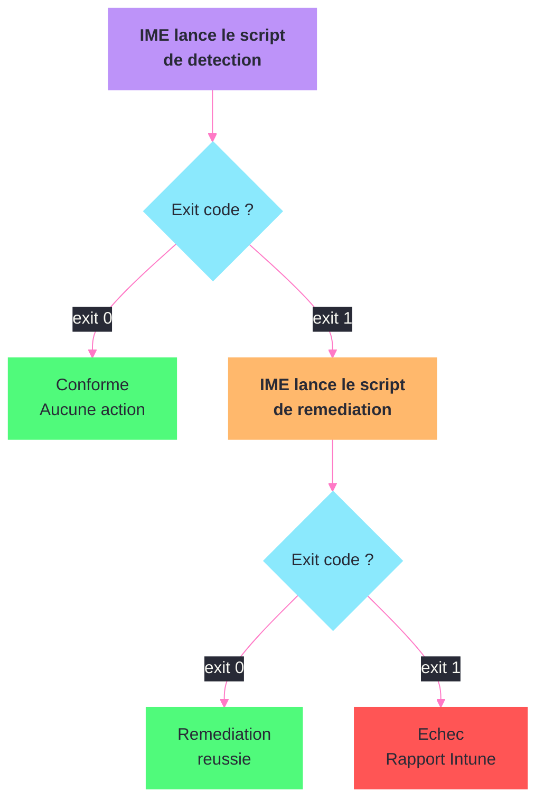

---
tags:
  - registre
  - intune
  - endpoint-manager
  - mdm
  - oma-uri
---

# Microsoft Intune

!!! abstract "Ce que vous allez apprendre"
    - Comment les politiques OMA-URI ciblent des cles de registre specifiques
    - Le fonctionnement des Configuration Service Providers (CSPs) et leur correspondance registre
    - Les regles de detection d'applications Win32 basees sur le registre
    - Les verifications de conformite utilisant des cles de registre
    - Les cles d'enrollment et d'autorite MDM dans le registre
    - Le fonctionnement de l'Intune Management Extension (IME) et ses traces registre
    - L'utilisation de scripts de remediation qui modifient le registre
    - Un scenario complet de deploiement d'un parametre registre via OMA-URI avec regle de detection

---

## OMA-URI et politiques registre personnalisees


OMA-URI (Open Mobile Alliance - Uniform Resource Identifier) est le mecanisme Intune pour configurer des parametres qui n'ont pas d'interface native dans le portail. Chaque OMA-URI correspond a un chemin CSP qui se traduit en cle de registre.

### Structure d'un OMA-URI

```
./Device/Vendor/MSFT/Policy/Config/<Area>/<PolicyName>
./User/Vendor/MSFT/Policy/Config/<Area>/<PolicyName>
```

Le prefixe `./Device/` cible `HKLM`, le prefixe `./User/` cible `HKCU`.

### Exemple concret : desactiver la telemetrie Windows

```powershell
# The OMA-URI:
# ./Device/Vendor/MSFT/Policy/Config/System/AllowTelemetry
# Maps to this registry key:
$regPath = "HKLM:\SOFTWARE\Policies\Microsoft\Windows\DataCollection"
$valueName = "AllowTelemetry"

# Verify the setting was applied
$val = Get-ItemProperty -Path $regPath -Name $valueName -ErrorAction SilentlyContinue
Write-Output "AllowTelemetry = $($val.$valueName)"
```

```title="Resultat attendu"
AllowTelemetry = 0
```

### Correspondances OMA-URI courantes

| OMA-URI | Cle de registre | Valeur |
|---------|----------------|--------|
| `./Device/Vendor/MSFT/Policy/Config/System/AllowTelemetry` | `HKLM\SOFTWARE\Policies\Microsoft\Windows\DataCollection\AllowTelemetry` | `0`-`3` |
| `./Device/Vendor/MSFT/Policy/Config/Browser/AllowSmartScreen` | `HKLM\SOFTWARE\Policies\Microsoft\MicrosoftEdge\PhishingFilter\EnabledV9` | `0` ou `1` |
| `./Device/Vendor/MSFT/Policy/Config/WindowsDefenderSecurityCenter/DisableAppBrowserUI` | `HKLM\SOFTWARE\Policies\Microsoft\Windows Defender Security Center\App and Browser protection\UILockdown` | `0` ou `1` |
| `./Device/Vendor/MSFT/Policy/Config/Update/ActiveHoursStart` | `HKLM\SOFTWARE\Microsoft\WindowsUpdate\UX\Settings\ActiveHoursStart` | `0`-`23` |

### Creer une politique OMA-URI personnalisee

Pour un parametre qui n'a pas de CSP natif, on utilise le CSP generique `Registry` :

```
OMA-URI: ./Device/Vendor/MSFT/Registry/HKLM/SOFTWARE/CustomApp/Settings/EnableFeature
Type:    Integer
Value:   1
```

Cette politique cree ou modifie la valeur suivante :

```powershell
# Verify custom OMA-URI was applied
$path = "HKLM:\SOFTWARE\CustomApp\Settings"
$val = (Get-ItemProperty -Path $path -Name "EnableFeature" -ErrorAction SilentlyContinue).EnableFeature
Write-Output "EnableFeature = $val"
```

```title="Resultat attendu"
EnableFeature = 1
```

!!! info "En resume"
    - Les OMA-URI commencant par `./Device/` ciblent HKLM, ceux par `./User/` ciblent HKCU
    - Chaque CSP a une correspondance registre precise documentee par Microsoft
    - Le CSP `Registry` permet de cibler n'importe quelle cle de registre directement

---

## Settings Catalog vs OMA-URI

Le `Settings Catalog` est la surface recommandée dès qu'un paramètre existe nativement dans Intune.
Il apporte la recherche, les types de données, les libellés, les dépendances et une validation plus sûre qu'un OMA-URI saisi à la main.

L'OMA-URI reste utile quand le paramètre n'est pas encore exposé dans le portail, quand un éditeur documente un CSP spécifique, ou quand vous devez reproduire précisément une policy ADMX-backed.

| Choix | À utiliser quand | Risque principal |
|---|---|---|
| Settings Catalog | Paramètre Windows ou Defender déjà exposé dans Intune | Dépendre du rythme de publication du portail |
| OMA-URI personnalisé | Paramètre absent du portail mais documenté en CSP | Erreur de chemin, type ou valeur |
| Registry CSP | Besoin de modifier une clé applicative précise | Contourner la logique CSP native |
| ADMX ingestion | Template tiers ou besoin historique spécifique | Maintenance plus lourde |

!!! tip "Règle simple"
    Si le paramètre existe dans le Settings Catalog, évitez l'OMA-URI manuel.
    Réservez l'OMA-URI aux écarts documentés et gardez une preuve du mapping CSP utilisé.

### Vérifier côté registre

Les paramètres MDM modernes apparaissent souvent sous :

```
HKLM\SOFTWARE\Microsoft\PolicyManager\current\device
HKLM\SOFTWARE\Microsoft\PolicyManager\providers\{ProviderGUID}
```

Les paramètres ADMX-backed peuvent aussi aboutir dans les chemins classiques `SOFTWARE\Policies\...` lus par le composant Windows concerné.
Il faut donc vérifier le CSP, `PolicyManager` et la clé finale quand vous dépannez un conflit GPO/MDM.

!!! info "En resume"
    - Le Settings Catalog est le choix par défaut pour les paramètres supportés
    - L'OMA-URI est une échappatoire maîtrisée, pas un style de configuration standard
    - Le diagnostic doit comparer `PolicyManager`, les clés `Policies` et l'état vu par le composant Windows

---

## Configuration Service Providers (CSPs)

Les CSPs sont l'interface entre les politiques MDM Intune et la configuration Windows. Chaque CSP gere un domaine specifique et traduit les instructions en modifications registre.

### Principaux CSPs et leur registre

| CSP | Fonction | Cle de registre associee |
|-----|----------|-------------------------|
| `Policy` | Politiques Windows | `HKLM\SOFTWARE\Microsoft\PolicyManager\current\device\*` |
| `Registry` | Acces registre direct | Chemin registre cible |
| `BitLocker` | Chiffrement disque | `HKLM\SOFTWARE\Policies\Microsoft\FVE` |
| `WindowsDefenderApplicationGuard` | Isolation navigateur | `HKLM\SOFTWARE\Policies\Microsoft\AppHVSI` |
| `Firewall` | Pare-feu Windows | `HKLM\SOFTWARE\Policies\Microsoft\WindowsFirewall` |

### Ou trouver les politiques CSP appliquees

```powershell
# List all policies applied via MDM (Intune)
$policyPath = "HKLM:\SOFTWARE\Microsoft\PolicyManager\current\device"
Get-ChildItem $policyPath -ErrorAction SilentlyContinue |
    Select-Object PSChildName | Sort-Object PSChildName
```

```title="Resultat attendu"
PSChildName
-----------
ApplicationManagement
Bluetooth
Browser
Connectivity
DeviceLock
Security
System
Update
WindowsDefenderSecurityCenter
```

### Explorer une politique specifique

```powershell
# Explore Update policies applied via Intune
$updatePath = "HKLM:\SOFTWARE\Microsoft\PolicyManager\current\device\Update"
Get-ItemProperty -Path $updatePath -ErrorAction SilentlyContinue |
    Select-Object ActiveHoursStart, ActiveHoursEnd, DeferFeatureUpdatesPeriodInDays,
        DeferQualityUpdatesPeriodInDays
```

```title="Resultat attendu"
ActiveHoursStart                 : 8
ActiveHoursEnd                   : 17
DeferFeatureUpdatesPeriodInDays  : 90
DeferQualityUpdatesPeriodInDays  : 14
```

### Difference entre PolicyManager et Policies

Il est important de comprendre que Intune ecrit dans deux emplacements :

| Emplacement | Role |
|-------------|------|
| `HKLM\SOFTWARE\Microsoft\PolicyManager\current\device` | Politiques MDM actives (gerees par Intune) |
| `HKLM\SOFTWARE\Microsoft\PolicyManager\Providers` | Source de chaque politique (quel profil l'a definie) |
| `HKLM\SOFTWARE\Policies\Microsoft\*` | Politiques traditionnelles (GPO et certains CSPs) |

```powershell
# Check which provider set a specific policy
$provPath = "HKLM:\SOFTWARE\Microsoft\PolicyManager\Providers"
Get-ChildItem $provPath -Recurse -ErrorAction SilentlyContinue |
    Where-Object { $_.PSChildName -eq "Update" } |
    ForEach-Object { Get-ItemProperty $_.PSPath } |
    Select-Object ActiveHoursStart, ActiveHoursEnd
```

```title="Resultat attendu"
ActiveHoursStart : 8
ActiveHoursEnd   : 17
```

!!! info "En resume"
    - Les CSPs sont l'intermediaire entre les politiques Intune et le registre Windows
    - `HKLM\SOFTWARE\Microsoft\PolicyManager\current\device` contient les politiques MDM actives
    - `PolicyManager\Providers` permet de tracer la source de chaque politique

---

## Regles de detection Win32

Les applications Win32 deployees via Intune necessitent des regles de detection pour verifier si l'installation a reussi. Le registre est la methode de detection la plus fiable.

### Types de regles de detection registre

| Type | Description | Exemple |
|------|-------------|---------|
| Cle existe | La cle de registre est presente | `HKLM\SOFTWARE\7-Zip` |
| Valeur existe | Une valeur specifique est presente | `HKLM\SOFTWARE\7-Zip\Path` |
| Comparaison de chaine | La donnee correspond a une chaine | `DisplayVersion` = `24.08` |
| Comparaison de version | La version est >= a une valeur | `DisplayVersion` >= `23.01` |
| Comparaison d'entier | Le DWORD correspond a une condition | `InstallStatus` = `1` |

### Configuration dans le portail Intune

Lors de la creation d'une application Win32, dans la section Detection Rules :

```
Rule type:           Registry
Key path:            HKEY_LOCAL_MACHINE\SOFTWARE\Microsoft\Windows\CurrentVersion\Uninstall\{APP-GUID}
Value name:          DisplayVersion
Detection method:    Version comparison
Operator:            Greater than or equal to
Value:               23.01
Associated with 32-bit app on 64-bit: No
```

### Verifier une regle de detection localement

```powershell
# Simulate what Intune checks for a Win32 app detection
$keyPath = "HKLM:\SOFTWARE\Microsoft\Windows\CurrentVersion\Uninstall\7-Zip"
$valueName = "DisplayVersion"
$expectedVersion = "23.01"

if (Test-Path $keyPath) {
    $actual = (Get-ItemProperty -Path $keyPath -Name $valueName -ErrorAction SilentlyContinue).$valueName
    if ($actual -and [version]$actual -ge [version]$expectedVersion) {
        Write-Output "DETECTE : $valueName = $actual (>= $expectedVersion)"
    } else {
        Write-Output "NON DETECTE : $valueName = $actual (< $expectedVersion)"
    }
} else {
    Write-Output "NON DETECTE : cle inexistante"
}
```

```title="Resultat attendu"
DETECTE : DisplayVersion = 24.08 (>= 23.01)
```

### Piege du WOW6432Node

Comme avec SCCM, les applications 32 bits ecrivent dans le noeud redirige :

```powershell
# Check both registry paths for 32-bit and 64-bit
$guid = "{23170F69-40C1-2702-2408-000001000000}"
$paths = @{
    "64-bit" = "HKLM:\SOFTWARE\Microsoft\Windows\CurrentVersion\Uninstall\$guid"
    "32-bit" = "HKLM:\SOFTWARE\WOW6432Node\Microsoft\Windows\CurrentVersion\Uninstall\$guid"
}

foreach ($arch in $paths.Keys) {
    $exists = Test-Path $paths[$arch]
    Write-Output "${arch} : $exists"
}
```

```title="Resultat attendu"
64-bit : True
32-bit : False
```

!!! info "En resume"
    - Les regles de detection registre verifient l'existence ou la valeur d'une cle apres installation
    - Cinq types de comparaison : existence de cle, existence de valeur, chaine, version, entier
    - Cocher "Associated with 32-bit app" dans Intune pour cibler `WOW6432Node`

---

## Politiques de conformite basees sur le registre

Les politiques de conformite Intune evaluent si un poste respecte les normes de securite. Bien que l'interface native n'offre pas de verification registre directe, les scripts de conformite personnalises le permettent.

### Script de conformite personnalise

Intune utilise un script de decouverte qui retourne un JSON. Voici un exemple verifiant une cle de registre :

```powershell
# Compliance discovery script — checks if BitLocker policy is correctly applied
$results = @{}

# Check 1: BitLocker encryption method
$blPath = "HKLM:\SOFTWARE\Policies\Microsoft\FVE"
$encMethod = (Get-ItemProperty -Path $blPath -Name "EncryptionMethodWithXtsOs" `
    -ErrorAction SilentlyContinue).EncryptionMethodWithXtsOs
$results["BitLockerEncryption"] = if ($encMethod -eq 7) { "Compliant" } else { "NonCompliant" }

# Check 2: Windows Defender real-time protection
$defPath = "HKLM:\SOFTWARE\Policies\Microsoft\Windows Defender\Real-Time Protection"
$rtProtect = (Get-ItemProperty -Path $defPath -Name "DisableRealtimeMonitoring" `
    -ErrorAction SilentlyContinue).DisableRealtimeMonitoring
$results["DefenderRealtime"] = if ($rtProtect -ne 1) { "Compliant" } else { "NonCompliant" }

# Output JSON for Intune compliance engine
$results | ConvertTo-Json -Compress
```

```title="Resultat attendu"
{"BitLockerEncryption":"Compliant","DefenderRealtime":"Compliant"}
```

### Cles de registre de conformite courantes

| Verification | Cle de registre | Valeur attendue |
|-------------|----------------|-----------------|
| BitLocker actif | `HKLM\SOFTWARE\Policies\Microsoft\FVE\EncryptionMethodWithXtsOs` | `7` (AES-256-XTS) |
| Pare-feu domaine | `HKLM\SYSTEM\CurrentControlSet\Services\SharedAccess\Parameters\FirewallPolicy\DomainProfile\EnableFirewall` | `1` |
| Ecran de veille | `HKCU\Control Panel\Desktop\ScreenSaveTimeOut` | `<= 900` |
| Credential Guard | `HKLM\SYSTEM\CurrentControlSet\Control\DeviceGuard\EnableVirtualizationBasedSecurity` | `1` |

### Script de conformite avec JSON structure Intune

```powershell
# Structured compliance output for Intune Custom Compliance
$compliancePayload = @(
    @{
        SettingName = "BitLockerEncryptionMethod"
        Operator    = "IsEquals"
        DataType    = "Int64"
        Operand     = 7
        MoreInfoUrl = "https://learn.microsoft.com/windows/security/operating-system-security/data-protection/bitlocker/"
        RemediationStrings = @(
            @{
                Language = "en_US"
                Title    = "BitLocker must use AES-256-XTS"
                Description = "Configure BitLocker to use XTS-AES 256-bit encryption."
            }
        )
    }
)

$compliancePayload | ConvertTo-Json -Depth 5
```

```title="Resultat attendu"
[
  {
    "SettingName": "BitLockerEncryptionMethod",
    "Operator": "IsEquals",
    "DataType": "Int64",
    "Operand": 7,
    "MoreInfoUrl": "https://learn.microsoft.com/...",
    "RemediationStrings": [...]
  }
]
```

!!! info "En resume"
    - Les verifications de conformite registre passent par des scripts de decouverte personnalises
    - Le script retourne un JSON que le moteur de conformite Intune evalue
    - Les cles liees a BitLocker, Defender, pare-feu et Credential Guard sont les plus courantes

---

## Enrollment et autorite MDM

L'enrollment (inscription) d'un poste dans Intune laisse des traces registre essentielles pour le diagnostic.

### Cles d'enrollment

```powershell
# List all MDM enrollments on the device
$enrollPath = "HKLM:\SOFTWARE\Microsoft\Enrollments"
Get-ChildItem $enrollPath -ErrorAction SilentlyContinue |
    ForEach-Object {
        $props = Get-ItemProperty $_.PSPath
        [PSCustomObject]@{
            EnrollmentID = $_.PSChildName
            ProviderID   = $props.ProviderId
            UPN          = $props.UPN
            EnrollType   = $props.EnrollmentType
        }
    } | Format-Table -AutoSize
```

```title="Resultat attendu"
EnrollmentID                         ProviderID                 UPN                        EnrollType
------------                         ----------                 ---                        ----------
A1B2C3D4-E5F6-7890-A1B2-C3D4E5F6A1B MS DM Server               user@entreprise.com        6
```

### Valeurs d'enrollment importantes

| Valeur | Description |
|--------|-------------|
| `ProviderId` | `MS DM Server` = Intune |
| `UPN` | UPN de l'utilisateur qui a inscrit le poste |
| `EnrollmentType` | `6` = MDM, `13` = Azure AD Join + MDM |
| `AADResourceID` | ID de la ressource Azure AD |
| `AADTenantID` | ID du tenant Azure AD |

### Verifier l'autorite MDM

```powershell
# Check MDM authority
$mdmPath = "HKLM:\SOFTWARE\Microsoft\Enrollments\*"
$enrollments = Get-ChildItem $mdmPath -ErrorAction SilentlyContinue |
    Where-Object {
        (Get-ItemProperty $_.PSPath -Name "ProviderId" -ErrorAction SilentlyContinue).ProviderId -eq "MS DM Server"
    }

if ($enrollments) {
    $props = Get-ItemProperty $enrollments[0].PSPath
    Write-Output "Autorite MDM    : Intune (MS DM Server)"
    Write-Output "UPN             : $($props.UPN)"
    Write-Output "Tenant ID       : $($props.AADTenantID)"
    Write-Output "Type enrollment : $($props.EnrollmentType)"
} else {
    Write-Output "ATTENTION : aucun enrollment Intune detecte sur ce poste."
}
```

```title="Resultat attendu"
Autorite MDM    : Intune (MS DM Server)
UPN             : user@entreprise.com
Tenant ID       : a1b2c3d4-e5f6-7890-a1b2-c3d4e5f6a1b2
Type enrollment : 6
```

### Diagnostic de co-management SCCM + Intune

En co-gestion, les deux autorites coexistent :

```powershell
# Check co-management status
$coMgmtPath = "HKLM:\SOFTWARE\Microsoft\CCM\CoManagementHandler"
$props = Get-ItemProperty -Path $coMgmtPath -ErrorAction SilentlyContinue

if ($props) {
    Write-Output "Co-management actif : Oui"
    Write-Output "Authority workloads : $($props.Authority)"
    Write-Output "Capabilities        : $($props.CoManagementFlags)"
} else {
    Write-Output "Co-management : Non configure"
}
```

```title="Resultat attendu"
Co-management actif : Oui
Authority workloads : 1
Capabilities        : 255
```

### Co-management : workload sliding SCCM → Intune

La co-gestion permet de déplacer progressivement certaines charges de Configuration Manager vers Intune.
Le mouvement doit être volontaire : pilote d'abord, bascule ensuite, puis retrait de l'ancien paramétrage quand les rapports sont stables.

| Workload | Exemple de bascule | Point de vigilance |
|---|---|---|
| Compliance policies | Conformité Intune pour Conditional Access | Ne pas garder deux règles contradictoires |
| Device configuration | Settings Catalog / Endpoint security | Vérifier les conflits GPO, SCCM et MDM |
| Endpoint protection | Defender, Firewall, ASR | Tester Tamper Protection et exclusions |
| Windows Update policies | Update rings / WUfB | Ne pas mélanger deadlines SCCM et WUfB |
| Client apps | Applications Intune Win32 | Clarifier l'autorité de détection et remédiation |
| Office Click-to-Run apps | Déploiement Microsoft 365 Apps | Attention aux canaux et redémarrages |

Le registre local aide à confirmer que la machine est bien co-gérée, mais il ne suffit pas à prouver que chaque workload a basculé.
Il faut comparer la console Configuration Manager, l'admin center Intune et les journaux locaux.

```powershell title="Lire les traces locales de co-management"
$paths = @(
    "HKLM:\SOFTWARE\Microsoft\CCM\CoManagementHandler",
    "HKLM:\SOFTWARE\Microsoft\DeviceManageabilityCSP"
)

foreach ($path in $paths) {
    Get-ItemProperty -Path $path -ErrorAction SilentlyContinue |
        Select-Object PSPath, Authority, CoManagementFlags, EnrollmentID
}
```

!!! warning "Bascule partielle"
    Un workload en mode pilote peut ne concerner qu'une collection limitée.
    Ne concluez pas depuis un seul poste : vérifiez la collection pilote, l'appartenance de l'appareil et les rapports de conformité.

!!! info "En resume"
    - Les enrollments sont stockes dans `HKLM\SOFTWARE\Microsoft\Enrollments\{GUID}`
    - `ProviderId = "MS DM Server"` confirme un enrollment Intune
    - En co-management, la cle `CCM\CoManagementHandler` indique la repartition des charges

---

## Intune Management Extension (IME)

L'Intune Management Extension est l'agent local qui execute les scripts PowerShell, les applications Win32 et les scripts de remediation. Ses logs et son etat sont accessibles via le registre.

### Emplacement de l'IME dans le registre

```powershell
# Check IME installation and status
$imePath = "HKLM:\SOFTWARE\Microsoft\IntuneManagementExtension"
$props = Get-ItemProperty -Path $imePath -ErrorAction SilentlyContinue

Write-Output "Version IME : $($props.Version)"

# Check the IME service
$svc = Get-Service IntuneManagementExtension -ErrorAction SilentlyContinue
Write-Output "Service IME : $($svc.Status)"
```

```title="Resultat attendu"
Version IME : 1.82.206.0
Service IME : Running
```

### Suivi de l'execution des scripts

```powershell
# Check script execution results
$scriptPath = "HKLM:\SOFTWARE\Microsoft\IntuneManagementExtension\Policies"
Get-ChildItem $scriptPath -ErrorAction SilentlyContinue |
    ForEach-Object {
        $p = Get-ItemProperty $_.PSPath
        [PSCustomObject]@{
            PolicyId = $_.PSChildName
            Result   = $p.Result
            LastExec = $p.LastExecution
        }
    } | Format-Table -AutoSize
```

```title="Resultat attendu"
PolicyId                              Result  LastExec
--------                              ------  --------
a1b2c3d4-e5f6-7890-a1b2-c3d4e5f6a1b2 Success 2026-04-03T10:30:00
c3d4e5f6-a1b2-c3d4-e5f6-a1b2c3d4e5f6 Failed  2026-04-02T14:15:00
```

### Logs de l'IME

Les logs detailles de l'IME se trouvent ici :

| Fichier | Emplacement | Contenu |
|---------|-------------|---------|
| `IntuneManagementExtension.log` | `C:\ProgramData\Microsoft\IntuneManagementExtension\Logs` | Log principal de l'agent |
| `AgentExecutor.log` | (idem) | Execution des scripts et installations |
| `ClientHealth.log` | (idem) | Sante de l'agent IME |

```powershell
# Search for recent errors in IME logs
$logPath = "C:\ProgramData\Microsoft\IntuneManagementExtension\Logs\IntuneManagementExtension.log"
if (Test-Path $logPath) {
    Get-Content $logPath -Tail 50 |
        Select-String -Pattern "Error|Failed|Exception"
}
```

```title="Resultat attendu"
<![LOG[Response from API: StatusCode=200]LOG]>
<![LOG[Win32App installation completed. Result: Success]LOG]>
```

### Forcer la re-synchronisation de l'IME

```powershell
# Force IME to re-sync with Intune
Restart-Service IntuneManagementExtension -Force

# Clear cached policy results to force re-evaluation
$cachePath = "HKLM:\SOFTWARE\Microsoft\IntuneManagementExtension\Policies"
Get-ChildItem $cachePath -ErrorAction SilentlyContinue |
    ForEach-Object {
        Remove-ItemProperty $_.PSPath -Name "Result" -ErrorAction SilentlyContinue
        Remove-ItemProperty $_.PSPath -Name "LastExecution" -ErrorAction SilentlyContinue
    }

Write-Output "Cache IME nettoye. Re-synchronisation en cours..."
```

```title="Resultat attendu"
Cache IME nettoye. Re-synchronisation en cours...
```

!!! info "En resume"
    - L'IME est l'agent local pour les scripts, applications Win32 et remediations
    - Son registre est sous `HKLM\SOFTWARE\Microsoft\IntuneManagementExtension`
    - Les logs dans `C:\ProgramData\Microsoft\IntuneManagementExtension\Logs` contiennent les details d'execution
    - Redemarrer le service et vider le cache force une re-evaluation des politiques

---

## Scripts de remediation



Les scripts de remediation (anciennement Proactive Remediations) sont des paires detection/remediation qui corrigent automatiquement les ecarts de configuration.

### Principe de fonctionnement

Chaque remediation comprend deux scripts :

1. **Script de detection** : verifie si le probleme existe (exit code 1 = probleme detecte)
2. **Script de remediation** : corrige le probleme (execute seulement si detection = 1)

### Exemple : forcer un parametre registre de securite

Script de detection :

```powershell
# Detection script: check if SMBv1 is disabled
$path = "HKLM:\SYSTEM\CurrentControlSet\Services\LanmanServer\Parameters"
$val = (Get-ItemProperty -Path $path -Name "SMB1" -ErrorAction SilentlyContinue).SMB1

if ($val -eq 0) {
    Write-Output "SMBv1 is disabled. Compliant."
    exit 0
} else {
    Write-Output "SMBv1 is NOT disabled. Remediation needed."
    exit 1
}
```

```title="Resultat attendu (si non conforme)"
SMBv1 is NOT disabled. Remediation needed.
```

Script de remediation :

```powershell
# Remediation script: disable SMBv1
$path = "HKLM:\SYSTEM\CurrentControlSet\Services\LanmanServer\Parameters"

try {
    Set-ItemProperty -Path $path -Name "SMB1" -Value 0 -Type DWord -Force
    Write-Output "SMBv1 disabled successfully."
    exit 0
} catch {
    Write-Output "Failed to disable SMBv1: $_"
    exit 1
}
```

```title="Resultat attendu"
SMBv1 disabled successfully.
```

### Suivi des remediations dans le registre

```powershell
# Check remediation execution history
$remPath = "HKLM:\SOFTWARE\Microsoft\IntuneManagementExtension\SideCarPolicies\Scripts\Execution"
Get-ChildItem $remPath -Recurse -ErrorAction SilentlyContinue |
    Where-Object { $_.PSChildName -match "^\d+$" } |
    ForEach-Object {
        $p = Get-ItemProperty $_.PSPath -ErrorAction SilentlyContinue
        [PSCustomObject]@{
            PolicyGuid  = $_.PSParentPath.Split('\')[-1]
            RunIndex    = $_.PSChildName
            ExitCode    = $p.ExitCode
            ResultType  = $p.ResultType
        }
    } | Format-Table -AutoSize
```

```title="Resultat attendu"
PolicyGuid                            RunIndex ExitCode ResultType
----------                            -------- -------- ----------
a1b2c3d4-e5f6-7890-a1b2-c3d4e5f6a1b2 1        0        Success
c3d4e5f6-a1b2-c3d4-e5f6-a1b2c3d4e5f6 1        1        DetectedIssue
c3d4e5f6-a1b2-c3d4-e5f6-a1b2c3d4e5f6 2        0        Remediated
```

### Exemple avance : corriger les parametres de mise a jour

```powershell
# Detection script: verify Windows Update settings
$wuPath = "HKLM:\SOFTWARE\Policies\Microsoft\Windows\WindowsUpdate\AU"
$autoUpdate = (Get-ItemProperty -Path $wuPath -Name "NoAutoUpdate" `
    -ErrorAction SilentlyContinue).NoAutoUpdate

if ($autoUpdate -eq 0 -or $null -eq $autoUpdate) {
    Write-Output "Windows Update automatic updates enabled. Compliant."
    exit 0
} else {
    Write-Output "Windows Update automatic updates DISABLED. Non-compliant."
    exit 1
}
```

```title="Resultat attendu (si conforme)"
Windows Update automatic updates enabled. Compliant.
```

```powershell
# Remediation script: re-enable automatic updates
$wuPath = "HKLM:\SOFTWARE\Policies\Microsoft\Windows\WindowsUpdate\AU"

try {
    if (-not (Test-Path $wuPath)) {
        New-Item -Path $wuPath -Force | Out-Null
    }
    Set-ItemProperty -Path $wuPath -Name "NoAutoUpdate" -Value 0 -Type DWord -Force
    Write-Output "Automatic updates re-enabled successfully."
    exit 0
} catch {
    Write-Output "Failed to re-enable automatic updates: $_"
    exit 1
}
```

```title="Resultat attendu"
Automatic updates re-enabled successfully.
```

!!! info "En resume"
    - Les remediations sont des paires detection (exit 0 = conforme, exit 1 = non conforme) / remediation
    - L'historique d'execution est dans `IntuneManagementExtension\SideCarPolicies\Scripts\Execution`
    - Les scripts de remediation sont ideals pour imposer des parametres registre de securite

---

## Scenario reel : deployer un parametre registre via OMA-URI avec detection

### Contexte

L'equipe securite exige que la fonctionnalite Windows Script Host soit desactivee sur tous les postes geres par Intune. Cette restriction empeche l'execution de fichiers `.vbs` et `.js` malveillants. Nous allons deployer le parametre via OMA-URI et verifier son application.

### Etape 1 : identifier la cle de registre cible

```powershell
# The registry key that disables Windows Script Host
$path = "HKLM:\SOFTWARE\Microsoft\Windows Script Host\Settings"
$valueName = "Enabled"
$valueData = 0

# Check current state
$current = (Get-ItemProperty -Path $path -Name $valueName -ErrorAction SilentlyContinue).$valueName
Write-Output "Etat actuel de Windows Script Host : $(if($current -eq 0){'Desactive'}else{'Actif'})"
```

```title="Resultat attendu"
Etat actuel de Windows Script Host : Actif
```

### Etape 2 : creer le profil OMA-URI dans Intune

Configuration dans le portail Intune :

```
Devices > Configuration profiles > Create profile
Platform: Windows 10 and later
Profile type: Templates > Custom

OMA-URI Setting:
  Name:        Disable Windows Script Host
  Description: Prevents execution of VBS and JS files
  OMA-URI:     ./Device/Vendor/MSFT/Registry/HKLM/SOFTWARE/Microsoft/Windows Script Host/Settings/Enabled
  Data type:   Integer
  Value:       0
```

### Etape 3 : creer la regle de detection

Pour verifier que le parametre est bien applique, nous creons aussi une application Win32 factice ou un script de conformite :

```powershell
# Compliance detection script for WSH disabled
$path = "HKLM:\SOFTWARE\Microsoft\Windows Script Host\Settings"
$enabled = (Get-ItemProperty -Path $path -Name "Enabled" -ErrorAction SilentlyContinue).Enabled

if ($enabled -eq 0) {
    Write-Output "Windows Script Host is disabled. Compliant."
    exit 0
} else {
    Write-Output "Windows Script Host is ENABLED. Non-compliant."
    exit 1
}
```

```title="Resultat attendu"
Windows Script Host is disabled. Compliant.
```

### Etape 4 : verifier l'application de la politique

Apres deploiement, verifiez sur un poste cible :

```powershell
# Full verification after Intune sync
Write-Output "=== Verification OMA-URI ==="

# Check 1: Registry value
$path = "HKLM:\SOFTWARE\Microsoft\Windows Script Host\Settings"
$val = (Get-ItemProperty -Path $path -Name "Enabled" -ErrorAction SilentlyContinue).Enabled
Write-Output "1. Registre WSH Enabled = $val (attendu: 0)"

# Check 2: MDM policy trace
$mdmPath = "HKLM:\SOFTWARE\Microsoft\PolicyManager\current\device"
Write-Output "2. PolicyManager accessible : $(Test-Path $mdmPath)"

# Check 3: Functional test — try to run a VBS script
$testVbs = "$env:TEMP\test-wsh.vbs"
Set-Content -Path $testVbs -Value 'WScript.Echo "test"'
$result = Start-Process wscript.exe -ArgumentList $testVbs -Wait -PassThru -ErrorAction SilentlyContinue
$exitCode = $result.ExitCode
Remove-Item $testVbs -Force
Write-Output "3. Execution VBS bloquee : $(if($exitCode -ne 0){'Oui'}else{'Non'})"

# Check 4: Intune enrollment active
$enrollments = Get-ChildItem "HKLM:\SOFTWARE\Microsoft\Enrollments" -ErrorAction SilentlyContinue |
    Where-Object {
        (Get-ItemProperty $_.PSPath -Name "ProviderId" -ErrorAction SilentlyContinue).ProviderId -eq "MS DM Server"
    }
Write-Output "4. Enrollment Intune actif : $(if($enrollments){'Oui'}else{'Non'})"
```

```title="Resultat attendu"
=== Verification OMA-URI ===
1. Registre WSH Enabled = 0 (attendu: 0)
2. PolicyManager accessible : True
3. Execution VBS bloquee : Oui
4. Enrollment Intune actif : Oui
```

### Etape 5 : remediation en cas d'echec

Si le parametre ne s'applique pas, creez un script de remediation en complement :

```powershell
# Remediation script: force WSH disable if OMA-URI failed
$path = "HKLM:\SOFTWARE\Microsoft\Windows Script Host\Settings"

if (-not (Test-Path $path)) {
    New-Item -Path $path -Force | Out-Null
}

Set-ItemProperty -Path $path -Name "Enabled" -Value 0 -Type DWord -Force

# Verify
$val = (Get-ItemProperty -Path $path -Name "Enabled").Enabled
if ($val -eq 0) {
    Write-Output "WSH desactive avec succes par remediation."
    exit 0
} else {
    Write-Output "Echec de la remediation WSH."
    exit 1
}
```

```title="Resultat attendu"
WSH desactive avec succes par remediation.
```

!!! info "En resume"
    - L'OMA-URI `./Device/Vendor/MSFT/Registry/...` permet de cibler n'importe quelle cle HKLM
    - Un script de conformite verifie l'application effective du parametre
    - Un script de remediation couvre les cas ou l'OMA-URI echoue a s'appliquer
    - La verification fonctionnelle (tenter d'executer un VBS) confirme que le parametre a l'effet attendu

!!! tip "Voir aussi"
    - :material-shield-account: [Migration GPO vers Intune](../gpo-pour-les-admins/19-migration-intune.md) — GPO Admins
    - :material-shield-lock: [GPO et MDM : convergence et coexistence](../bible-gpo/25-mdm-convergence.md) — Bible GPO
