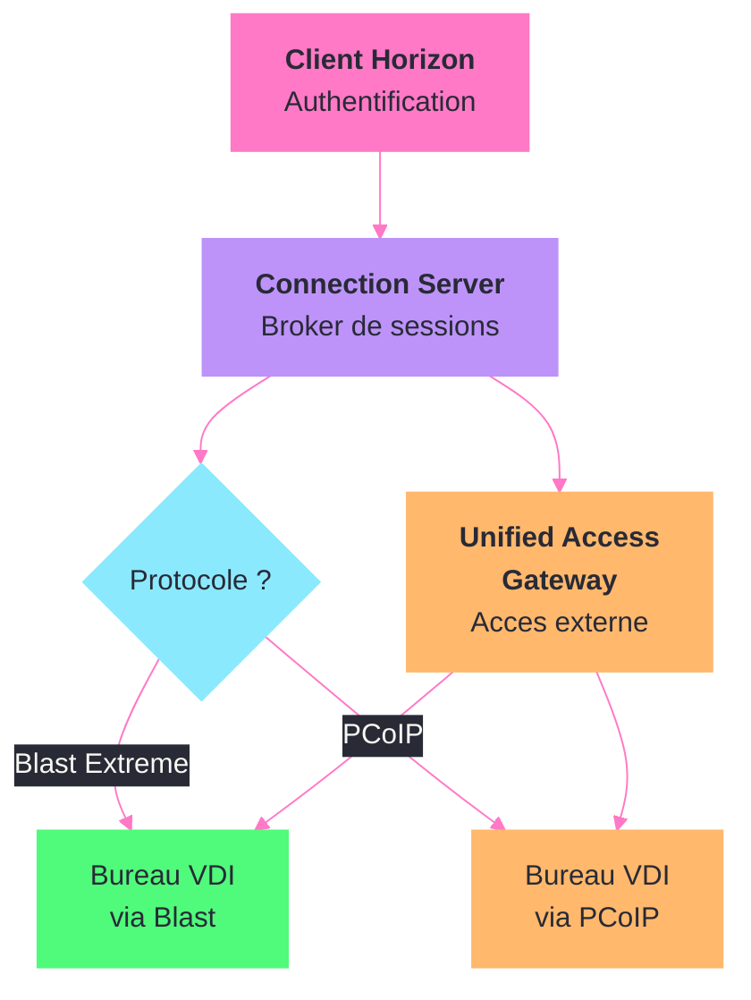

---
tags:
  - registre
  - vmware
  - horizon
  - vdi
---

# VMware Horizon / Workspace ONE

!!! abstract "Ce que vous allez apprendre"
    - Les cles de registre du client Horizon et de l'agent sur les VDI
    - Le tuning des protocoles Blast Extreme et PCoIP via le registre
    - La configuration de VMware Dynamic Environment Manager (DEM) dans le registre
    - L'inscription et la gestion des postes via Workspace ONE UEM
    - La redirection USB et le filtrage de peripheriques
    - La configuration avancee de l'agent Horizon
    - Un scenario reel : configurer Blast Extreme pour des charges de travail multimedia

---

## Cles du client Horizon



Le client VMware Horizon View stocke sa configuration sous une cle specifique dans le registre. Cette cle controle le comportement de connexion, les protocoles utilises et les preferences d'affichage.

### Cle principale

```
HKLM\SOFTWARE\VMware, Inc.\VMware VDM
```

Sur les systemes 64 bits avec le client 32 bits :

```
HKLM\SOFTWARE\WOW6432Node\VMware, Inc.\VMware VDM
```

```powershell
Get-ItemProperty "HKLM:\SOFTWARE\VMware, Inc.\VMware VDM" -ErrorAction SilentlyContinue
```

```title="Resultat attendu"
ClientAlwaysOnTop         : 0
DomainName                : corp.local
EnableShade               : 1
ServerURL                 : https://horizon.corp.local
```

### Valeurs de configuration du client

| Valeur | Type | Description |
|--------|------|-------------|
| `ServerURL` | `REG_SZ` | URL du serveur Connection Server |
| `DomainName` | `REG_SZ` | Domaine par defaut pour l'authentification |
| `LogPath` | `REG_SZ` | Chemin des fichiers de log du client |
| `EnableShade` | `REG_DWORD` | 1 = afficher la barre superieure dans la session |
| `ClientAlwaysOnTop` | `REG_DWORD` | 1 = fenetre du client toujours au premier plan |
| `DisableAutoConnect` | `REG_DWORD` | 1 = ne pas se connecter automatiquement au dernier bureau |
| `AllowDataSharing` | `REG_DWORD` | 0 = desactiver le partage de donnees telemetriques |

### Preconfigurer le client pour un deploiement en masse

```powershell
$vdmPath = "HKLM:\SOFTWARE\VMware, Inc.\VMware VDM"
if (-not (Test-Path $vdmPath)) { New-Item -Path $vdmPath -Force }
Set-ItemProperty -Path $vdmPath -Name "ServerURL" `
    -Value "https://horizon.corp.local" -Type String
Set-ItemProperty -Path $vdmPath -Name "DomainName" -Value "corp.local" -Type String
Set-ItemProperty -Path $vdmPath -Name "EnableShade" -Value 0 -Type DWord
Set-ItemProperty -Path $vdmPath -Name "AllowDataSharing" -Value 0 -Type DWord
```

```title="Resultat attendu"
Aucune sortie. Le client Horizon pointe automatiquement vers
horizon.corp.local avec le domaine corp.local preselectionne.
La barre superieure et la telemetrie sont desactivees.
```

### Configuration SSL du client

Pour imposer la validation de certificat ou definir des parametres SSL :

```
HKLM\SOFTWARE\VMware, Inc.\VMware VDM\Client\Security
```

| Valeur | Type | Description |
|--------|------|-------------|
| `CertCheckMode` | `REG_DWORD` | 0 = ne jamais connecter, 1 = avertir, 2 = ne jamais verifier |
| `SSLCipherList` | `REG_SZ` | Liste des suites de chiffrement autorisees |
| `EnableTicketSSLAuth` | `REG_DWORD` | 1 = authentification par ticket SSL |

```powershell
$secPath = "HKLM:\SOFTWARE\VMware, Inc.\VMware VDM\Client\Security"
if (-not (Test-Path $secPath)) { New-Item -Path $secPath -Force }
# Bloquer les connexions si le certificat n'est pas valide
Set-ItemProperty -Path $secPath -Name "CertCheckMode" -Value 0 -Type DWord
```

```title="Resultat attendu"
Aucune sortie. Le client refusera toute connexion
si le certificat du Connection Server n'est pas valide.
```

!!! info "En resume"
    - Le client Horizon se configure sous `HKLM\SOFTWARE\VMware, Inc.\VMware VDM`
    - `ServerURL` et `DomainName` simplifient l'experience utilisateur en preconfigurant la connexion
    - `CertCheckMode` controle la stricteur de la validation de certificat
    - Deployer ces cles via GPO ou SCCM pour une configuration homogene du parc

---

## Tuning de Blast Extreme


Blast Extreme est le protocole d'affichage moderne de VMware. Il utilise H.264 ou HEVC et supporte le transport UDP (via BEAT - Blast Extreme Adaptive Transport).

### Cle principale Blast

```
HKLM\SOFTWARE\VMware, Inc.\VMware Blast
```

Cote agent (sur le VDA) :

```
HKLM\SOFTWARE\VMware, Inc.\VMware Blast\Config
```

```powershell
Get-ItemProperty "HKLM:\SOFTWARE\VMware, Inc.\VMware Blast\Config" -ErrorAction SilentlyContinue
```

```title="Resultat attendu"
EncoderH264Enabled       : 1
EncoderHEVCEnabled       : 0
UdpEnabled               : 1
MaxBandwidthKbps         : 0
MaxFPS                   : 30
MinQuality               : 50
```

### Valeurs de configuration Blast Extreme

| Valeur | Type | Description |
|--------|------|-------------|
| `EncoderH264Enabled` | `REG_SZ` | `1` = codec H.264 actif |
| `EncoderHEVCEnabled` | `REG_SZ` | `1` = codec HEVC/H.265 actif |
| `UdpEnabled` | `REG_SZ` | `1` = transport UDP (BEAT) actif |
| `MaxBandwidthKbps` | `REG_SZ` | Bande passante max en Kbps (0 = illimite) |
| `MaxFPS` | `REG_SZ` | FPS maximum (defaut : 30) |
| `MinQuality` | `REG_SZ` | Qualite minimale de l'image (1-100, defaut : 50) |
| `MaxQualityAdjustFPS` | `REG_SZ` | FPS minimum pour l'ajustement de qualite |
| `EncoderMaxSessions` | `REG_SZ` | Nombre max de sessions d'encodage GPU |
| `AudioEnabled` | `REG_SZ` | `1` = audio Blast active |
| `ClipboardEnabled` | `REG_SZ` | `1` = presse-papiers bidirectionnel |
| `DragAndDropEnabled` | `REG_SZ` | `1` = glisser-deposer entre local et distant |
| `H264QualityLevel` | `REG_SZ` | Niveau de qualite H.264 (0-5, 0 = automatique) |

!!! warning "Type de donnees"
    Contrairement a la plupart des parametres registre, Blast Extreme utilise des valeurs `REG_SZ` (chaines) meme pour les parametres numeriques et booleens.

### Optimiser Blast pour un reseau local rapide

```powershell
$blastPath = "HKLM:\SOFTWARE\VMware, Inc.\VMware Blast\Config"
if (-not (Test-Path $blastPath)) { New-Item -Path $blastPath -Force }
Set-ItemProperty -Path $blastPath -Name "EncoderH264Enabled" -Value "1" -Type String
Set-ItemProperty -Path $blastPath -Name "EncoderHEVCEnabled" -Value "1" -Type String
Set-ItemProperty -Path $blastPath -Name "MaxFPS" -Value "60" -Type String
Set-ItemProperty -Path $blastPath -Name "MinQuality" -Value "80" -Type String
Set-ItemProperty -Path $blastPath -Name "MaxBandwidthKbps" -Value "0" -Type String
```

```title="Resultat attendu"
Aucune sortie. Blast est configure pour une qualite maximale :
60 FPS, HEVC actif et qualite minimale a 80%.
```

### Optimiser Blast pour un WAN lent

```powershell
$blastPath = "HKLM:\SOFTWARE\VMware, Inc.\VMware Blast\Config"
if (-not (Test-Path $blastPath)) { New-Item -Path $blastPath -Force }
Set-ItemProperty -Path $blastPath -Name "EncoderH264Enabled" -Value "1" -Type String
Set-ItemProperty -Path $blastPath -Name "EncoderHEVCEnabled" -Value "0" -Type String
Set-ItemProperty -Path $blastPath -Name "UdpEnabled" -Value "1" -Type String
Set-ItemProperty -Path $blastPath -Name "MaxFPS" -Value "15" -Type String
Set-ItemProperty -Path $blastPath -Name "MinQuality" -Value "30" -Type String
Set-ItemProperty -Path $blastPath -Name "MaxBandwidthKbps" -Value "5000" -Type String
```

```title="Resultat attendu"
Aucune sortie. Blast est configure pour economiser la bande passante :
15 FPS max, qualite minimale a 30%, bande passante limitee a 5 Mbps.
Le transport UDP (BEAT) est actif pour une meilleure tolerance aux pertes.
```

### Tuning PCoIP

PCoIP est l'ancien protocole de VMware, encore utilise dans certains environnements. Sa configuration se trouve a un emplacement distinct.

```
HKLM\SOFTWARE\Policies\Teradici\PCoIP\pcoip_admin_defaults
```

| Valeur | Type | Description |
|--------|------|-------------|
| `pcoip.max_link_rate` | `REG_DWORD` | Bande passante max en Kbps |
| `pcoip.minimum_image_quality` | `REG_DWORD` | Qualite d'image minimale (30-100) |
| `pcoip.maximum_frame_rate` | `REG_DWORD` | FPS maximum |
| `pcoip.enable_build_to_lossless` | `REG_DWORD` | 1 = progressif vers le sans perte |
| `pcoip.audio_bandwidth_limit` | `REG_DWORD` | Bande passante audio max en Kbps |
| `pcoip.udp_port` | `REG_DWORD` | Port UDP PCoIP (defaut : 4172) |

```powershell
$pcoipPath = "HKLM:\SOFTWARE\Policies\Teradici\PCoIP\pcoip_admin_defaults"
if (-not (Test-Path $pcoipPath)) { New-Item -Path $pcoipPath -Force }
Set-ItemProperty -Path $pcoipPath -Name "pcoip.max_link_rate" -Value 5000 -Type DWord
Set-ItemProperty -Path $pcoipPath -Name "pcoip.maximum_frame_rate" -Value 15 -Type DWord
Set-ItemProperty -Path $pcoipPath -Name "pcoip.minimum_image_quality" -Value 40 -Type DWord
Set-ItemProperty -Path $pcoipPath -Name "pcoip.enable_build_to_lossless" -Value 0 -Type DWord
```

```title="Resultat attendu"
Aucune sortie. PCoIP est configure avec une bande passante limitee,
15 FPS maximum et sans mode progressif vers le sans perte.
```

!!! info "En resume"
    - Blast Extreme se configure sous `HKLM\SOFTWARE\VMware, Inc.\VMware Blast\Config`
    - Les valeurs Blast sont de type `REG_SZ` (chaines), pas `REG_DWORD`
    - BEAT (transport UDP) ameliore les performances sur les reseaux instables
    - PCoIP se configure sous `HKLM\SOFTWARE\Policies\Teradici\PCoIP\pcoip_admin_defaults`
    - Reduire les FPS et la qualite minimale sont les leviers principaux pour les connexions WAN

---

## VMware Dynamic Environment Manager (DEM)

DEM (anciennement User Environment Manager) gere les parametres utilisateur, les variables d'environnement et les configurations applicatives. Ses reglages dans le registre controlent le comportement du service FlexEngine.

### Cle principale DEM

```
HKLM\SOFTWARE\VMware, Inc.\VMware UEM
```

Et pour les politiques :

```
HKLM\SOFTWARE\Policies\VMware, Inc.\VMware UEM\Agent
```

```powershell
Get-ItemProperty "HKLM:\SOFTWARE\VMware, Inc.\VMware UEM" -ErrorAction SilentlyContinue
```

```title="Resultat attendu"
FlexConfigPath          : \\fileserver\dem-config$
FlexProfilePath         : \\fileserver\dem-profiles$\%USERNAME%
FlexRepositoryPath      : \\fileserver\dem-config$
AgentType               : 1
```

### Valeurs de configuration DEM

| Valeur | Type | Description |
|--------|------|-------------|
| `FlexConfigPath` | `REG_SZ` | Chemin UNC de la configuration DEM |
| `FlexProfilePath` | `REG_SZ` | Chemin UNC des archives de profil utilisateur |
| `FlexRepositoryPath` | `REG_SZ` | Chemin UNC du referentiel de configuration |
| `AgentType` | `REG_DWORD` | 0 = complet, 1 = profil uniquement |
| `RunFlexEngine` | `REG_DWORD` | 1 = activer FlexEngine |
| `LogEnabled` | `REG_DWORD` | 1 = activer la journalisation |
| `LogPath` | `REG_SZ` | Chemin des fichiers de log |
| `LogLevel` | `REG_DWORD` | 0 = erreur, 1 = avertissement, 2 = info, 3 = debug |

### Configurer DEM pour un nouvel environnement

```powershell
$demPath = "HKLM:\SOFTWARE\VMware, Inc.\VMware UEM"
if (-not (Test-Path $demPath)) { New-Item -Path $demPath -Force }
Set-ItemProperty -Path $demPath -Name "FlexConfigPath" `
    -Value "\\fileserver\dem-config$" -Type String
Set-ItemProperty -Path $demPath -Name "FlexProfilePath" `
    -Value "\\fileserver\dem-profiles$\%USERNAME%" -Type String
Set-ItemProperty -Path $demPath -Name "FlexRepositoryPath" `
    -Value "\\fileserver\dem-config$" -Type String
Set-ItemProperty -Path $demPath -Name "RunFlexEngine" -Value 1 -Type DWord
```

```title="Resultat attendu"
Aucune sortie. DEM est configure pour utiliser les partages reseau.
FlexEngine s'executera a chaque ouverture de session.
```

### Activer la journalisation detaillee (depannage)

```powershell
$demPath = "HKLM:\SOFTWARE\VMware, Inc.\VMware UEM"
Set-ItemProperty -Path $demPath -Name "LogEnabled" -Value 1 -Type DWord
Set-ItemProperty -Path $demPath -Name "LogPath" -Value "C:\Logs\DEM" -Type String
Set-ItemProperty -Path $demPath -Name "LogLevel" -Value 3 -Type DWord
```

```title="Resultat attendu"
Aucune sortie. Les logs DEM sont ecrits dans C:\Logs\DEM
en mode debug. Repasser LogLevel a 0 apres le depannage.
```

### Parametres de politique DEM via GPO

Les ADMX VMware DEM ecrivent sous :

```
HKLM\SOFTWARE\Policies\VMware, Inc.\VMware UEM\Agent
```

| Valeur | Type | Description |
|--------|------|-------------|
| `FlexConfigPath` | `REG_SZ` | Chemin de configuration (ecrase le parametre local) |
| `DirectFlexEnabled` | `REG_DWORD` | 1 = activer DirectFlex (application en temps reel) |
| `PrivilegeElevationEnabled` | `REG_DWORD` | 1 = activer l'elevation de privilege |
| `AppBlockEnabled` | `REG_DWORD` | 1 = activer le blocage d'applications |
| `ProcessTimeout` | `REG_DWORD` | Timeout en secondes pour le traitement des profils |

```powershell
$demPolicyPath = "HKLM:\SOFTWARE\Policies\VMware, Inc.\VMware UEM\Agent"
if (-not (Test-Path $demPolicyPath)) { New-Item -Path $demPolicyPath -Force }
Set-ItemProperty -Path $demPolicyPath -Name "DirectFlexEnabled" -Value 1 -Type DWord
Set-ItemProperty -Path $demPolicyPath -Name "ProcessTimeout" -Value 60 -Type DWord
```

```title="Resultat attendu"
Aucune sortie. DirectFlex est active et le timeout de traitement est de 60 secondes.
Les parametres applicatifs seront appliques en temps reel.
```

!!! info "En resume"
    - DEM se configure sous `HKLM\SOFTWARE\VMware, Inc.\VMware UEM`
    - `FlexConfigPath` et `FlexProfilePath` definissent les chemins UNC des donnees
    - DirectFlex permet l'application en temps reel des parametres (sans deconnexion/reconnexion)
    - La journalisation en mode debug (`LogLevel` = 3) aide au depannage mais doit etre desactivee en production

---

## Workspace ONE UEM (inscription et gestion)

Workspace ONE UEM (anciennement AirWatch) gere les postes Windows 10/11 via MDM. Le registre contient les parametres d'inscription et les configurations poussees par le serveur.

### Cle d'inscription

```
HKLM\SOFTWARE\Microsoft\Provisioning\OMADM\Accounts
```

Cette cle est geree par le composant MDM natif de Windows. Elle contient l'identifiant du compte MDM et les parametres de connexion au serveur Workspace ONE.

```powershell
# Verifier l'inscription MDM
Get-ItemProperty "HKLM:\SOFTWARE\Microsoft\Provisioning\OMADM\Accounts\*" -ErrorAction SilentlyContinue |
    Select-Object PSChildName, ServerURL, AcctName
```

```title="Resultat attendu"
PSChildName : a1b2c3d4-e5f6-7890-abcd-ef1234567890
ServerURL   : https://ds1234.awmdm.com/omadm/syncml
AcctName    : VMware Workspace ONE
```

### Cles specifiques Workspace ONE

```
HKLM\SOFTWARE\AirWatchMDM
```

| Valeur | Type | Description |
|--------|------|-------------|
| `GroupID` | `REG_SZ` | Identifiant du groupe organisationnel |
| `ServerURL` | `REG_SZ` | URL du serveur Workspace ONE |
| `DeviceUid` | `REG_SZ` | Identifiant unique de l'appareil |
| `EnrollmentStatus` | `REG_SZ` | Statut d'inscription (Enrolled, Unenrolled) |
| `HostName` | `REG_SZ` | Nom du serveur AirWatch |

```powershell
Get-ItemProperty "HKLM:\SOFTWARE\AirWatchMDM" -ErrorAction SilentlyContinue |
    Select-Object GroupID, ServerURL, EnrollmentStatus
```

```title="Resultat attendu"
GroupID           : CORP-VDI
ServerURL         : https://ws1.corp.local
EnrollmentStatus  : Enrolled
```

### Forcer une re-synchronisation

Lorsqu'un poste ne recoit plus ses politiques, forcer une re-synchronisation via le registre :

```powershell
# Supprimer le cache de commande pour forcer la re-synchronisation
$cachePath = "HKLM:\SOFTWARE\AirWatchMDM\AppDeploymentAgent\S-1-5-18"
if (Test-Path $cachePath) {
    Remove-Item -Path $cachePath -Recurse -Force
    Restart-Service AirWatchService
}
```

```title="Resultat attendu"
Aucune sortie. Le cache de deploiement est purge.
Le service AirWatch va re-synchroniser les politiques.
```

### Intelligent Hub et inscription automatique

L'Intelligent Hub (agent Workspace ONE) stocke sa configuration sous :

```
HKLM\SOFTWARE\AIRWATCH\EnrollmentInfo
```

| Valeur | Type | Description |
|--------|------|-------------|
| `Server` | `REG_SZ` | FQDN du serveur d'inscription |
| `LGName` | `REG_SZ` | Nom du groupe organisationnel |
| `Username` | `REG_SZ` | Nom d'utilisateur pour l'inscription automatique |
| `Password` | `REG_SZ` | Mot de passe (chiffre) pour l'inscription automatique |
| `IsManaged` | `REG_DWORD` | 1 = appareil gere |

Pour une inscription silencieuse via ligne de commande :

```powershell
# Inscription silencieuse via l'installeur Hub
$hubArgs = "/S /V`"SERVER=ws1.corp.local LGNAME=CORP-VDI"
Start-Process "AirwatchAgent.msi" -ArgumentList "/S", `
    "SERVER=ws1.corp.local", "LGNAME=CORP-VDI", `
    "USERNAME=svc-enrollment", "PASSWORD=***" -Wait
```

```title="Resultat attendu"
L'inscription est silencieuse. Verifier le statut :
(Get-ItemProperty "HKLM:\SOFTWARE\AirWatchMDM").EnrollmentStatus
=> Enrolled
```

!!! info "En resume"
    - L'inscription MDM native est sous `HKLM\SOFTWARE\Microsoft\Provisioning\OMADM\Accounts`
    - Les donnees specifiques Workspace ONE sont sous `HKLM\SOFTWARE\AirWatchMDM`
    - Purger le cache de deploiement et redemarrer le service force la re-synchronisation
    - L'inscription silencieuse via Hub utilise les parametres `SERVER` et `LGNAME`

---

## Redirection USB et filtrage de peripheriques

La redirection USB dans Horizon permet aux utilisateurs d'utiliser leurs peripheriques locaux dans la session distante. Le registre offre un controle granulaire.

### Cle de configuration USB

```
HKLM\SOFTWARE\Policies\VMware, Inc.\VMware VDM\Agent\USB
```

Cote client :

```
HKLM\SOFTWARE\VMware, Inc.\VMware VDM\Client\USB
```

### Valeurs de configuration USB

| Valeur | Type | Description |
|--------|------|-------------|
| `AllowAutoDeviceSplitting` | `REG_SZ` | `true` = activer le split automatique des peripheriques composites |
| `BootDeviceSplitting` | `REG_SZ` | `true` = split au demarrage de la session |
| `ExcludeAllDevices` | `REG_SZ` | `true` = bloquer tous les peripheriques par defaut |
| `IncludeFamily` | `REG_MULTI_SZ` | Familles de peripheriques autorisees |
| `ExcludeFamily` | `REG_MULTI_SZ` | Familles de peripheriques bloquees |
| `IncludeVidPid` | `REG_MULTI_SZ` | Peripheriques autorises par VendorID/ProductID |
| `ExcludeVidPid` | `REG_MULTI_SZ` | Peripheriques bloques par VendorID/ProductID |

### Strategie de filtrage par liste blanche

L'approche la plus securisee consiste a tout bloquer puis a autoriser les peripheriques necessaires.

```powershell
$usbPath = "HKLM:\SOFTWARE\Policies\VMware, Inc.\VMware VDM\Agent\USB"
if (-not (Test-Path $usbPath)) { New-Item -Path $usbPath -Force }

# Bloquer tous les peripheriques par defaut
Set-ItemProperty -Path $usbPath -Name "ExcludeAllDevices" -Value "true" -Type String

# Autoriser les categories necessaires
Set-ItemProperty -Path $usbPath -Name "IncludeFamily" -Type MultiString -Value @(
    "o:smart-card",
    "o:audio",
    "o:video"
)
```

```title="Resultat attendu"
Aucune sortie. Tous les peripheriques USB sont bloques sauf
les lecteurs de carte a puce, les microphones et les webcams.
```

### Autoriser un peripherique specifique par VendorID/ProductID

Pour autoriser un scanner specifique (ex : Vendor 0x04B8, Product 0x0130) :

```powershell
$usbPath = "HKLM:\SOFTWARE\Policies\VMware, Inc.\VMware VDM\Agent\USB"
# Obtenir la liste existante et ajouter le peripherique
$currentIncludes = @("o:smart-card", "o:audio", "o:video")

Set-ItemProperty -Path $usbPath -Name "IncludeVidPid" -Type MultiString -Value @(
    "o:vid-04B8_pid-0130"
)
```

```title="Resultat attendu"
Aucune sortie. Le scanner Epson specifie (VID 04B8, PID 0130)
est autorise en plus des familles deja approuvees.
```

### Identifier les peripheriques USB connectes

Pour trouver les VendorID/ProductID des peripheriques connectes :

```powershell
Get-PnpDevice -Class USB | Where-Object { $_.Status -eq 'OK' } |
    Select-Object FriendlyName, InstanceId |
    Format-Table -AutoSize
```

```title="Resultat attendu"
FriendlyName                InstanceId
------------                ----------
USB Composite Device        USB\VID_04B8&PID_0130\5&1234ABCD&0&1
USB Root Hub (USB 3.0)      USB\ROOT_HUB30\4&12345678&0&0
Generic USB Hub             USB\VID_8087&PID_0024\5&ABCD1234&0&1
```

Extraire le VID et PID depuis l'InstanceId pour creer les regles de filtrage.

!!! info "En resume"
    - La redirection USB se gere sous `HKLM\SOFTWARE\Policies\VMware, Inc.\VMware VDM\Agent\USB`
    - L'approche par liste blanche (`ExcludeAllDevices` + `IncludeFamily`) est la plus securisee
    - Les peripheriques specifiques s'autorisent par VendorID/ProductID (`IncludeVidPid`)
    - Utiliser `Get-PnpDevice` pour identifier les VID/PID des peripheriques connectes

---

## Configuration de l'agent Horizon

L'agent Horizon installe sur chaque VDA controle les fonctionnalites disponibles dans la session : redirection multimedia, copier-coller, transfert de fichiers et plus.

### Cle principale de l'agent

```
HKLM\SOFTWARE\VMware, Inc.\VMware VDM\Agent
```

Et pour les fonctionnalites specifiques :

```
HKLM\SOFTWARE\VMware, Inc.\VMware VDM\Agent\Configuration
```

```powershell
Get-ItemProperty "HKLM:\SOFTWARE\VMware, Inc.\VMware VDM\Agent\Configuration" -ErrorAction SilentlyContinue
```

```title="Resultat attendu"
ClientClipboardState         : 2
DnDEnabled                   : 1
FileTransferEnabled          : 1
PrintRedirEnabled            : 1
SmartCardRedirEnabled        : 1
```

### Valeurs de configuration de l'agent

| Valeur | Type | Description |
|--------|------|-------------|
| `ClientClipboardState` | `REG_DWORD` | 0 = desactive, 1 = serveur vers client, 2 = bidirectionnel |
| `DnDEnabled` | `REG_DWORD` | 1 = glisser-deposer actif |
| `FileTransferEnabled` | `REG_DWORD` | 1 = transfert de fichiers via HTML Access |
| `PrintRedirEnabled` | `REG_DWORD` | 1 = redirection d'impression active |
| `SmartCardRedirEnabled` | `REG_DWORD` | 1 = redirection de carte a puce active |
| `CDSEnabled` | `REG_DWORD` | 1 = Client Drive Redirection active |
| `MMREnabled` | `REG_DWORD` | 1 = Multimedia Redirection active |
| `RTAVEnabled` | `REG_DWORD` | 1 = Real-Time Audio-Video active (webcam/micro) |

### Securiser l'agent pour un environnement reglemente

Dans un environnement ou la fuite de donnees est critique :

```powershell
$agentPath = "HKLM:\SOFTWARE\VMware, Inc.\VMware VDM\Agent\Configuration"
if (-not (Test-Path $agentPath)) { New-Item -Path $agentPath -Force }

# Presse-papiers : serveur vers client uniquement (pas de copie entrante)
Set-ItemProperty -Path $agentPath -Name "ClientClipboardState" -Value 1 -Type DWord
# Desactiver le glisser-deposer
Set-ItemProperty -Path $agentPath -Name "DnDEnabled" -Value 0 -Type DWord
# Desactiver le transfert de fichiers
Set-ItemProperty -Path $agentPath -Name "FileTransferEnabled" -Value 0 -Type DWord
# Desactiver le mappage de lecteurs clients
Set-ItemProperty -Path $agentPath -Name "CDSEnabled" -Value 0 -Type DWord
```

```title="Resultat attendu"
Aucune sortie. Le presse-papiers fonctionne uniquement dans le
sens serveur vers client. Le glisser-deposer, le transfert de
fichiers et le mappage de lecteurs sont desactives.
```

### Configuration du RDS Agent (sessions publiees)

Pour les sessions publiees sur des serveurs RDS, l'agent utilise des cles supplementaires :

```
HKLM\SOFTWARE\VMware, Inc.\VMware VDM\Agent\Configuration\RDS
```

| Valeur | Type | Description |
|--------|------|-------------|
| `MaxSessionsPerUser` | `REG_DWORD` | Nombre max de sessions par utilisateur |
| `DisconnectedSessionTimeout` | `REG_DWORD` | Timeout des sessions deconnectees (minutes) |
| `PreLaunchSessionTimeout` | `REG_DWORD` | Timeout des sessions pre-lancees (minutes) |
| `EnableCollaboration` | `REG_DWORD` | 1 = activer la collaboration de session |

```powershell
$rdsPath = "HKLM:\SOFTWARE\VMware, Inc.\VMware VDM\Agent\Configuration\RDS"
if (-not (Test-Path $rdsPath)) { New-Item -Path $rdsPath -Force }
Set-ItemProperty -Path $rdsPath -Name "MaxSessionsPerUser" -Value 1 -Type DWord
Set-ItemProperty -Path $rdsPath -Name "DisconnectedSessionTimeout" -Value 120 -Type DWord
```

```title="Resultat attendu"
Aucune sortie. Chaque utilisateur est limite a une session.
Les sessions deconnectees sont terminees apres 2 heures.
```

### Redirection multimedia (MMR)

La redirection multimedia permet de decoder les flux video directement sur le poste client :

```
HKLM\SOFTWARE\VMware, Inc.\VMware VDM\Agent\Configuration\MMR
```

| Valeur | Type | Description |
|--------|------|-------------|
| `MMREnabled` | `REG_DWORD` | 1 = MMR actif |
| `DisableMMRForNonAdmins` | `REG_DWORD` | 1 = desactiver MMR pour les non-administrateurs |
| `MMRURLList` | `REG_MULTI_SZ` | Liste des URLs autorisees pour le MMR |

```powershell
$mmrPath = "HKLM:\SOFTWARE\VMware, Inc.\VMware VDM\Agent\Configuration\MMR"
if (-not (Test-Path $mmrPath)) { New-Item -Path $mmrPath -Force }
Set-ItemProperty -Path $mmrPath -Name "MMREnabled" -Value 1 -Type DWord
Set-ItemProperty -Path $mmrPath -Name "MMRURLList" -Type MultiString -Value @(
    "https://youtube.com",
    "https://teams.microsoft.com",
    "https://vimeo.com"
)
```

```title="Resultat attendu"
Aucune sortie. Le MMR est actif pour YouTube, Teams et Vimeo.
Les flux video de ces sites seront decodes sur le poste client.
```

!!! info "En resume"
    - L'agent Horizon se configure sous `HKLM\SOFTWARE\VMware, Inc.\VMware VDM\Agent\Configuration`
    - `ClientClipboardState` permet un controle directionnel du presse-papiers (securite DLP)
    - Les sessions RDS se gerent sous la sous-cle `RDS` avec des limites par utilisateur
    - Le MMR decharge le decodage video vers le client, liberant les ressources du VDA

---

## Scenario : configurer Blast pour des charges multimedia

### Le contexte

Une equipe de 30 graphistes et monteurs video travaille a distance sur des bureaux virtuels VMware Horizon. Les postes clients disposent de GPU Nvidia. Les utilisateurs se plaignent de saccades lors de l'edition video dans Adobe Premiere et de la lecture de rushes en haute definition. La liaison WAN est de 100 Mbps symetriques.

### Diagnostic initial

```powershell
# Verifier la configuration Blast actuelle
Write-Host "=== Configuration Blast ===" -ForegroundColor Cyan
Get-ItemProperty "HKLM:\SOFTWARE\VMware, Inc.\VMware Blast\Config" -ErrorAction SilentlyContinue |
    Format-List

# Verifier l'acceleration GPU
Write-Host "=== GPU disponibles ===" -ForegroundColor Cyan
Get-WmiObject Win32_VideoController | Select-Object Name, DriverVersion, AdapterRAM |
    Format-Table -AutoSize

# Verifier la configuration de l'agent
Write-Host "=== Agent Horizon ===" -ForegroundColor Cyan
Get-ItemProperty "HKLM:\SOFTWARE\VMware, Inc.\VMware VDM\Agent\Configuration" -ErrorAction SilentlyContinue |
    Select-Object ClientClipboardState, MMREnabled, RTAVEnabled |
    Format-List

# Verifier les parametres USB (tablettes graphiques)
Write-Host "=== USB ===" -ForegroundColor Cyan
Get-ItemProperty "HKLM:\SOFTWARE\Policies\VMware, Inc.\VMware VDM\Agent\USB" -ErrorAction SilentlyContinue |
    Format-List
```

```title="Resultat attendu"
=== Configuration Blast ===
EncoderH264Enabled  : 1
EncoderHEVCEnabled  : 0
UdpEnabled          : 0
MaxFPS              : 30
MinQuality          : 50
MaxBandwidthKbps    : 0

=== GPU disponibles ===
Name                  DriverVersion   AdapterRAM
----                  -------------   ----------
NVIDIA Tesla T4       27.21.14.5671   17179869184

=== Agent Horizon ===
ClientClipboardState : 2
MMREnabled           : 0
RTAVEnabled          : 0

=== USB ===
ExcludeAllDevices : true
```

Les problemes identifies :

- HEVC n'est pas active : H.264 seul ne tire pas parti du GPU Nvidia pour l'encodage
- Le transport UDP est desactive : le TCP est sensible a la latence et aux pertes
- Le FPS est plafonne a 30 : insuffisant pour de l'edition video fluide
- La qualite minimale est trop basse pour du travail graphique
- Le MMR n'est pas active : les previews video sont encodees cote serveur
- Les tablettes graphiques USB sont bloquees par la politique globale

### Optimisations appliquees

#### Protocole Blast

```powershell
$blastPath = "HKLM:\SOFTWARE\VMware, Inc.\VMware Blast\Config"
if (-not (Test-Path $blastPath)) { New-Item -Path $blastPath -Force }

# Activer HEVC (exploitation du GPU Nvidia pour l'encodage)
Set-ItemProperty -Path $blastPath -Name "EncoderHEVCEnabled" -Value "1" -Type String

# Activer le transport UDP (BEAT) pour la tolerance aux pertes
Set-ItemProperty -Path $blastPath -Name "UdpEnabled" -Value "1" -Type String

# Augmenter le FPS a 60 pour l'edition video fluide
Set-ItemProperty -Path $blastPath -Name "MaxFPS" -Value "60" -Type String

# Qualite minimale elevee pour le travail graphique
Set-ItemProperty -Path $blastPath -Name "MinQuality" -Value "80" -Type String

# Niveau de qualite H.264 maximal
Set-ItemProperty -Path $blastPath -Name "H264QualityLevel" -Value "5" -Type String

# Pas de limite de bande passante (100 Mbps disponibles)
Set-ItemProperty -Path $blastPath -Name "MaxBandwidthKbps" -Value "0" -Type String
```

```title="Resultat attendu"
Aucune sortie. Blast est optimise pour le multimedia :
HEVC actif, 60 FPS, qualite minimale 80%, transport UDP.
```

#### Agent Horizon (multimedia et peripheriques)

```powershell
$agentPath = "HKLM:\SOFTWARE\VMware, Inc.\VMware VDM\Agent\Configuration"
if (-not (Test-Path $agentPath)) { New-Item -Path $agentPath -Force }

# Activer le MMR pour le decodage video cote client
Set-ItemProperty -Path $agentPath -Name "MMREnabled" -Value 1 -Type DWord

# Activer RTAV pour les visioconferences
Set-ItemProperty -Path $agentPath -Name "RTAVEnabled" -Value 1 -Type DWord

# Presse-papiers bidirectionnel (necessaire pour copier du texte entre apps)
Set-ItemProperty -Path $agentPath -Name "ClientClipboardState" -Value 2 -Type DWord

# Activer le glisser-deposer de fichiers
Set-ItemProperty -Path $agentPath -Name "DnDEnabled" -Value 1 -Type DWord
```

```title="Resultat attendu"
Aucune sortie. Le MMR, le RTAV, le presse-papiers bidirectionnel
et le glisser-deposer sont actifs.
```

#### Redirection des tablettes graphiques

```powershell
$usbPath = "HKLM:\SOFTWARE\Policies\VMware, Inc.\VMware VDM\Agent\USB"
if (-not (Test-Path $usbPath)) { New-Item -Path $usbPath -Force }

# Autoriser les tablettes graphiques Wacom (VID 056A) en plus des peripheriques existants
$currentIncludes = (Get-ItemProperty -Path $usbPath -Name "IncludeVidPid" -ErrorAction SilentlyContinue).IncludeVidPid
$wacomRules = @("o:vid-056A_pid-****")

Set-ItemProperty -Path $usbPath -Name "IncludeVidPid" -Type MultiString -Value $wacomRules

# Activer le split pour les peripheriques composites Wacom
Set-ItemProperty -Path $usbPath -Name "AllowAutoDeviceSplitting" -Value "true" -Type String
```

```title="Resultat attendu"
Aucune sortie. Toutes les tablettes Wacom (VID 056A) sont
autorisees en redirection USB avec split automatique.
```

### Verification complete

```powershell
Write-Host "=== Blast apres optimisation ===" -ForegroundColor Green
Get-ItemProperty "HKLM:\SOFTWARE\VMware, Inc.\VMware Blast\Config" |
    Select-Object EncoderH264Enabled, EncoderHEVCEnabled, UdpEnabled,
        MaxFPS, MinQuality, H264QualityLevel, MaxBandwidthKbps |
    Format-List

Write-Host "=== Agent apres optimisation ===" -ForegroundColor Green
Get-ItemProperty "HKLM:\SOFTWARE\VMware, Inc.\VMware VDM\Agent\Configuration" |
    Select-Object MMREnabled, RTAVEnabled, ClientClipboardState, DnDEnabled |
    Format-List

Write-Host "=== USB apres optimisation ===" -ForegroundColor Green
Get-ItemProperty "HKLM:\SOFTWARE\Policies\VMware, Inc.\VMware VDM\Agent\USB" |
    Select-Object ExcludeAllDevices, IncludeVidPid, AllowAutoDeviceSplitting |
    Format-List
```

```title="Resultat attendu"
=== Blast apres optimisation ===
EncoderH264Enabled  : 1
EncoderHEVCEnabled  : 1
UdpEnabled          : 1
MaxFPS              : 60
MinQuality          : 80
H264QualityLevel    : 5
MaxBandwidthKbps    : 0

=== Agent apres optimisation ===
MMREnabled           : 1
RTAVEnabled          : 1
ClientClipboardState : 2
DnDEnabled           : 1

=== USB apres optimisation ===
ExcludeAllDevices        : true
IncludeVidPid            : {o:vid-056A_pid-****}
AllowAutoDeviceSplitting : true
```

### Resume des gains attendus

| Parametre | Avant | Apres | Impact |
|-----------|-------|-------|--------|
| Codec | H.264 seul | H.264 + HEVC | Compression 30-40% meilleure avec GPU Nvidia |
| Transport | TCP | TCP + UDP (BEAT) | Latence reduite, tolerance aux pertes de paquets |
| FPS maximum | 30 | 60 | Edition video fluide, timeline reactive |
| Qualite minimale | 50 | 80 | Couleurs fideles pour le travail graphique |
| MMR | Desactive | Active | Preview video decodee sur le client, CPU serveur libere |
| RTAV | Desactive | Active | Visioconferences avec webcam locale |
| Tablettes Wacom | Bloquees | Autorisees | Les graphistes peuvent utiliser leurs tablettes |

### Points de vigilance

Le tableau suivant resume les risques a surveiller apres l'application de ces optimisations :

| Risque | Mitigation |
|--------|-----------|
| Consommation de bande passante elevee | Surveiller avec `perfmon` le compteur Blast ; limiter si necessaire via `MaxBandwidthKbps` |
| Charge GPU augmentee | Surveiller `nvidia-smi` ; verifier que le profil vGPU alloue assez de memoire |
| Latence BEAT sur VPN | Verifier que les ports UDP 443 et 8443 sont ouverts sur le pare-feu |
| Compatibilite HEVC | Verifier que les clients Horizon supportent HEVC (version 5.x minimum) |

!!! info "En resume"
    - Un environnement multimedia necessite HEVC, transport UDP, FPS eleve et qualite minimale haute
    - Le MMR decharge le decodage video vers le client : critique pour Adobe Premiere et la lecture de rushes
    - Les tablettes graphiques Wacom s'autorisent par VendorID (VID 056A) via les regles USB
    - Surveiller la bande passante et la charge GPU apres optimisation pour eviter la saturation

!!! tip "Voir aussi"
    - :material-book-open-variant: [Virtualisation et conteneurs](../bible-registre-windows/19-virtualisation.md) — Bible Registre
