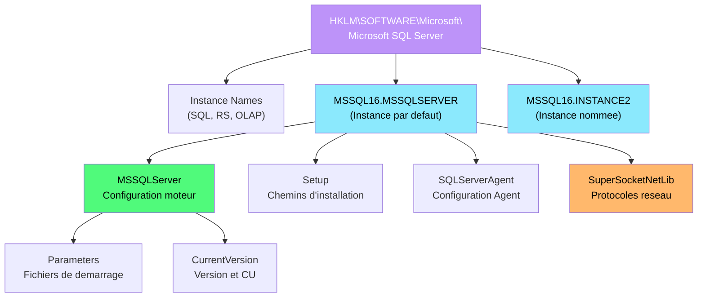
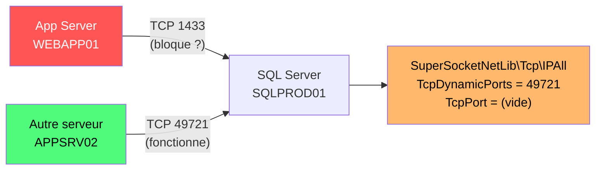

---
tags:
  - registre
  - sql-server
  - base-de-donnees
  - reseau
  - securite
  - always-on
---

# SQL Server

!!! abstract "Ce que vous allez apprendre"
    - Localiser et interpreter les cles de registre d'une instance SQL Server (HKLM\SOFTWARE\Microsoft\Microsoft SQL Server)
    - Configurer la memoire (MinServerMemory, MaxServerMemory) via le registre
    - Gerer les protocoles reseau (TCP/IP, Named Pipes, Shared Memory)
    - Auditer les parametres de securite (mode d'authentification, chiffrement, TDE)
    - Configurer SQL Server Agent dans le registre
    - Identifier les cles Always On Availability Groups
    - Manipuler les parametres de demarrage et les trace flags
    - Corriger un probleme de connectivite SQL en ajustant le port TCP et les protocoles

---

## Architecture registre de SQL Server

SQL Server utilise le registre Windows de maniere intensive pour stocker sa configuration d'instance, ses parametres reseau et ses options de demarrage. Chaque instance nommee possede sa propre arborescence de cles, identifiee par un identifiant unique (ex: `MSSQL16.MSSQLSERVER` pour SQL Server 2022 instance par defaut).



### Cle racine SQL Server

```
HKLM\SOFTWARE\Microsoft\Microsoft SQL Server
```

| Sous-cle | Description |
|----------|-------------|
| `Instance Names\SQL` | Mappage nom d'instance vers identifiant interne |
| `MSSQL16.MSSQLSERVER` | Configuration de l'instance par defaut (SQL 2022) |
| `MSSQL15.MSSQLSERVER` | Configuration de l'instance par defaut (SQL 2019) |
| `MSSQL14.MSSQLSERVER` | Configuration de l'instance par defaut (SQL 2017) |

```powershell
# Discover all SQL Server instances on this machine
$instancePath = "HKLM:\SOFTWARE\Microsoft\Microsoft SQL Server\Instance Names\SQL"
Get-ItemProperty $instancePath -ErrorAction SilentlyContinue
```

```title="Resultat attendu"
MSSQLSERVER : MSSQL16.MSSQLSERVER
REPORTING   : MSSQL16.REPORTING
```

### Informations d'installation

```powershell
# Read SQL Server installation details
$instanceId = "MSSQL16.MSSQLSERVER"
$setupPath = "HKLM:\SOFTWARE\Microsoft\Microsoft SQL Server\$instanceId\Setup"
Get-ItemProperty $setupPath |
    Select-Object SQLPath, SQLDataRoot, SQLBinRoot, Version, PatchLevel, Edition
```

```title="Resultat attendu"
SQLPath     : C:\Program Files\Microsoft SQL Server\MSSQL16.MSSQLSERVER\MSSQL
SQLDataRoot : C:\Program Files\Microsoft SQL Server\MSSQL16.MSSQLSERVER\MSSQL
SQLBinRoot  : C:\Program Files\Microsoft SQL Server\MSSQL16.MSSQLSERVER\MSSQL\Binn
Version     : 16.0.4175.1
PatchLevel  : 16.0.4175.1
Edition     : Enterprise Edition (64-bit)
```

### Service SQL Server

```
HKLM\SYSTEM\CurrentControlSet\Services\MSSQLSERVER
```

| Valeur | Type | Description |
|--------|------|-------------|
| `Start` | REG_DWORD | `2` = automatique, `3` = manuel |
| `ImagePath` | REG_EXPAND_SZ | Chemin de l'executable avec parametres de demarrage |
| `ObjectName` | REG_SZ | Compte de service |
| `DependOnService` | REG_MULTI_SZ | Services prerequis |

```powershell
# Check SQL Server service configuration
Get-ItemProperty "HKLM:\SYSTEM\CurrentControlSet\Services\MSSQLSERVER" |
    Select-Object DisplayName, ImagePath, Start, ObjectName
```

```title="Resultat attendu"
DisplayName : SQL Server (MSSQLSERVER)
ImagePath   : "C:\Program Files\Microsoft SQL Server\MSSQL16.MSSQLSERVER\MSSQL\Binn\sqlservr.exe" -sMSSQLSERVER
Start       : 2
ObjectName  : NT Service\MSSQLSERVER
```

!!! info "En resume"
    - Chaque instance SQL a un identifiant unique (ex: `MSSQL16.MSSQLSERVER`) dans le registre
    - `Instance Names\SQL` mappe les noms logiques vers les identifiants internes
    - La sous-cle `Setup` contient les chemins d'installation, la version et l'edition
    - Le service Windows utilise le compte `NT Service\MSSQLSERVER` par defaut

---

## Gestion de la memoire

SQL Server est gourmand en memoire par defaut : sans limitation, il consomme toute la RAM disponible. Les parametres `MinServerMemory` et `MaxServerMemory` sont essentiels sur les serveurs partages.

### Cles de configuration memoire

```
HKLM\SOFTWARE\Microsoft\Microsoft SQL Server\MSSQL16.MSSQLSERVER\MSSQLServer
```

La memoire est normalement configuree via T-SQL (`sp_configure`), mais les valeurs sont refletees dans le registre. Voici comment les lire directement.

```powershell
# Read memory configuration from registry
$mssqlPath = "HKLM:\SOFTWARE\Microsoft\Microsoft SQL Server\MSSQL16.MSSQLSERVER\MSSQLServer"
Get-ItemProperty $mssqlPath -ErrorAction SilentlyContinue |
    Select-Object MinServerMemory, MaxServerMemory
```

```title="Resultat attendu"
MinServerMemory : 8192
MaxServerMemory : 32768
```

### Configurer la memoire via T-SQL (methode recommandee)

```powershell
# Set SQL Server memory limits via T-SQL (recommended approach)
$query = @"
EXEC sp_configure 'show advanced options', 1;
RECONFIGURE;
EXEC sp_configure 'min server memory (MB)', 8192;
EXEC sp_configure 'max server memory (MB)', 32768;
RECONFIGURE;
"@
Invoke-Sqlcmd -Query $query -ServerInstance "."
```

```title="Resultat attendu"
Configuration option 'show advanced options' changed from 0 to 1.
Configuration option 'min server memory (MB)' changed from 0 to 8192.
Configuration option 'max server memory (MB)' changed from 2147483647 to 32768.
```

### Recommandations de dimensionnement

| RAM serveur | MaxServerMemory recommande | Reserve pour l'OS |
|:-----------:|:--------------------------:|:-----------------:|
| 16 Go | 12 Go (12288) | 4 Go |
| 32 Go | 26 Go (26624) | 6 Go |
| 64 Go | 56 Go (57344) | 8 Go |
| 128 Go | 116 Go (118784) | 12 Go |

```powershell
# Calculate recommended MaxServerMemory based on installed RAM
$totalRamMB = (Get-CimInstance Win32_PhysicalMemory | Measure-Object Capacity -Sum).Sum / 1MB
$osReserveMB = [math]::Max(4096, [math]::Ceiling($totalRamMB * 0.1))
$recommendedMax = $totalRamMB - $osReserveMB

Write-Output "Total RAM: $totalRamMB MB"
Write-Output "OS Reserve: $osReserveMB MB"
Write-Output "Recommended MaxServerMemory: $recommendedMax MB"
```

```title="Resultat attendu"
Total RAM: 65536 MB
OS Reserve: 6554 MB
Recommended MaxServerMemory: 58982 MB
```

### Verifier l'utilisation memoire actuelle

```powershell
# Check current SQL Server memory usage
$query = @"
SELECT
    physical_memory_in_use_kb / 1024 AS MemoryUsedMB,
    locked_page_allocations_kb / 1024 AS LockedPagesMB,
    total_virtual_address_space_kb / 1024 AS VirtualMemMB,
    process_physical_memory_low AS MemoryPressureLow,
    process_virtual_memory_low AS VirtualPressureLow
FROM sys.dm_os_process_memory;
"@
Invoke-Sqlcmd -Query $query -ServerInstance "."
```

```title="Resultat attendu"
MemoryUsedMB    : 28456
LockedPagesMB   : 0
VirtualMemMB    : 8388608
MemoryPressureLow  : 0
VirtualPressureLow : 0
```

!!! info "En resume"
    - Sans `MaxServerMemory`, SQL Server consomme toute la RAM disponible
    - Reservez au minimum 4 Go pour l'OS et les autres services
    - La configuration memoire se fait via `sp_configure` (repercutee dans le registre)
    - `sys.dm_os_process_memory` montre l'utilisation memoire en temps reel

---

## Configuration reseau (protocoles)

La connectivite SQL Server depend de trois protocoles reseau configures dans le registre. Un protocole mal configure ou desactive est la cause numero un des echecs de connexion.

### Cles des protocoles reseau

```
HKLM\SOFTWARE\Microsoft\Microsoft SQL Server\MSSQL16.MSSQLSERVER\MSSQLServer\SuperSocketNetLib
```

| Sous-cle | Protocole | Port defaut |
|----------|-----------|:-----------:|
| `Tcp` | TCP/IP | 1433 |
| `Np` | Named Pipes | `\\.\pipe\sql\query` |
| `Sm` | Shared Memory | N/A (local uniquement) |

```powershell
# Check network protocol status
$netLibPath = "HKLM:\SOFTWARE\Microsoft\Microsoft SQL Server\MSSQL16.MSSQLSERVER\MSSQLServer\SuperSocketNetLib"

$protocols = @("Tcp", "Np", "Sm")
foreach ($proto in $protocols) {
    $protoPath = Join-Path $netLibPath $proto
    $enabled = (Get-ItemProperty $protoPath -ErrorAction SilentlyContinue).Enabled
    Write-Output "$proto : Enabled = $enabled"
}
```

```title="Resultat attendu"
Tcp : Enabled = 1
Np : Enabled = 0
Sm : Enabled = 1
```

### Configuration TCP/IP

```
HKLM\SOFTWARE\Microsoft\Microsoft SQL Server\MSSQL16.MSSQLSERVER\MSSQLServer\SuperSocketNetLib\Tcp
```

| Valeur | Type | Description |
|--------|------|-------------|
| `Enabled` | REG_DWORD | `1` = protocole actif |
| `KeepAlive` | REG_DWORD | Intervalle TCP Keep-Alive en millisecondes (defaut : 30000) |
| `ListenOnAllIPs` | REG_DWORD | `1` = ecouter sur toutes les interfaces |

```
HKLM\SOFTWARE\Microsoft\Microsoft SQL Server\MSSQL16.MSSQLSERVER\MSSQLServer\SuperSocketNetLib\Tcp\IPAll
```

| Valeur | Type | Description |
|--------|------|-------------|
| `TcpPort` | REG_SZ | Port statique (vide = port dynamique) |
| `TcpDynamicPorts` | REG_SZ | Port dynamique assigne (vide si port statique) |

```powershell
# Check TCP/IP port configuration
$tcpAllPath = "HKLM:\SOFTWARE\Microsoft\Microsoft SQL Server\MSSQL16.MSSQLSERVER\MSSQLServer\SuperSocketNetLib\Tcp\IPAll"
Get-ItemProperty $tcpAllPath | Select-Object TcpPort, TcpDynamicPorts
```

```title="Resultat attendu"
TcpPort         : 1433
TcpDynamicPorts :
```

### Forcer un port TCP statique

L'utilisation d'un port statique est recommandee en production. Un port dynamique change a chaque redemarrage du service et complique la configuration des pare-feu.

```powershell
# Set a static TCP port and disable dynamic ports
$tcpAllPath = "HKLM:\SOFTWARE\Microsoft\Microsoft SQL Server\MSSQL16.MSSQLSERVER\MSSQLServer\SuperSocketNetLib\Tcp\IPAll"

# Set static port to 1433
Set-ItemProperty -Path $tcpAllPath -Name "TcpPort" -Value "1433" -Type String

# Clear dynamic port (empty string disables dynamic assignment)
Set-ItemProperty -Path $tcpAllPath -Name "TcpDynamicPorts" -Value "" -Type String

# Restart SQL Server to apply
Restart-Service MSSQLSERVER -Force
```

```title="Resultat attendu"
Aucune sortie. SQL Server redemarrera avec le port statique 1433.
```

!!! warning "Impact du redemarrage SQL Server"
    `Restart-Service MSSQLSERVER` coupe toutes les connexions actives. Prevoyez une fenetre de maintenance.

### Activer Named Pipes

```powershell
# Enable Named Pipes protocol
$npPath = "HKLM:\SOFTWARE\Microsoft\Microsoft SQL Server\MSSQL16.MSSQLSERVER\MSSQLServer\SuperSocketNetLib\Np"
Set-ItemProperty -Path $npPath -Name "Enabled" -Value 1 -Type DWord

# Named Pipes pipe name
Get-ItemProperty $npPath -Name "PipeName"
```

```title="Resultat attendu"
PipeName : \\.\pipe\sql\query
```

### Service SQL Browser

Le service SQL Server Browser est essentiel pour les instances nommees. Il ecoute sur le port UDP 1434 et repond aux clients qui cherchent le port TCP d'une instance nommee.

```
HKLM\SYSTEM\CurrentControlSet\Services\SQLBrowser
```

```powershell
# Check SQL Browser service status
Get-Service SQLBrowser | Select-Object Name, Status, StartType
```

```title="Resultat attendu"
Name        Status  StartType
----        ------  ---------
SQLBrowser  Running Automatic
```

!!! info "En resume"
    - Les protocoles reseau SQL sont sous `SuperSocketNetLib` (Tcp, Np, Sm)
    - Utilisez un port TCP statique en production pour simplifier les regles de pare-feu
    - La cle `IPAll\TcpPort` definit le port statique ; `TcpDynamicPorts` doit etre vide
    - SQL Browser (UDP 1434) est requis pour les instances nommees

---

## Parametres de securite

La securite SQL Server combine l'authentification, le chiffrement des connexions et le chiffrement des donnees au repos (TDE). Le registre stocke le mode d'authentification et les indicateurs de chiffrement.

### Mode d'authentification

```
HKLM\SOFTWARE\Microsoft\Microsoft SQL Server\MSSQL16.MSSQLSERVER\MSSQLServer
```

| Valeur | Type | Description |
|--------|------|-------------|
| `LoginMode` | REG_DWORD | `1` = Windows Authentication only, `2` = Mixed Mode |
| `AuditLevel` | REG_DWORD | `0` = aucun, `1` = echecs, `2` = succes, `3` = tous |

```powershell
# Check authentication mode and audit level
$mssqlPath = "HKLM:\SOFTWARE\Microsoft\Microsoft SQL Server\MSSQL16.MSSQLSERVER\MSSQLServer"
$props = Get-ItemProperty $mssqlPath
$loginMode = switch ($props.LoginMode) { 1 {"Windows Only"} 2 {"Mixed Mode"} default {"Unknown"} }
$auditLevel = switch ($props.AuditLevel) { 0 {"None"} 1 {"Failed logins"} 2 {"Successful logins"} 3 {"All logins"} default {"Unknown"} }

Write-Output "Authentication Mode: $loginMode"
Write-Output "Login Audit Level: $auditLevel"
```

```title="Resultat attendu"
Authentication Mode: Mixed Mode
Login Audit Level: Failed logins
```

### Modifier le mode d'authentification via le registre

```powershell
# Switch to Windows Authentication only (more secure)
$mssqlPath = "HKLM:\SOFTWARE\Microsoft\Microsoft SQL Server\MSSQL16.MSSQLSERVER\MSSQLServer"
Set-ItemProperty -Path $mssqlPath -Name "LoginMode" -Value 1 -Type DWord

# Enable auditing of all login attempts
Set-ItemProperty -Path $mssqlPath -Name "AuditLevel" -Value 3 -Type DWord

# Restart SQL Server to apply
Restart-Service MSSQLSERVER -Force
```

```title="Resultat attendu"
Aucune sortie. SQL Server redemarrera en mode Windows Authentication uniquement.
```

### Chiffrement des connexions (Force Encryption)

```
HKLM\SOFTWARE\Microsoft\Microsoft SQL Server\MSSQL16.MSSQLSERVER\MSSQLServer\SuperSocketNetLib
```

| Valeur | Type | Description |
|--------|------|-------------|
| `ForceEncryption` | REG_DWORD | `1` = chiffrement TLS obligatoire pour toutes les connexions |
| `Certificate` | REG_SZ | Thumbprint du certificat TLS a utiliser |

```powershell
# Check and enable forced encryption
$netLibPath = "HKLM:\SOFTWARE\Microsoft\Microsoft SQL Server\MSSQL16.MSSQLSERVER\MSSQLServer\SuperSocketNetLib"
Get-ItemProperty $netLibPath | Select-Object ForceEncryption, Certificate
```

```title="Resultat attendu"
ForceEncryption : 0
Certificate     :
```

```powershell
# Enable forced encryption with a specific certificate
$netLibPath = "HKLM:\SOFTWARE\Microsoft\Microsoft SQL Server\MSSQL16.MSSQLSERVER\MSSQLServer\SuperSocketNetLib"
$certThumbprint = "A1B2C3D4E5F6A1B2C3D4E5F6A1B2C3D4E5F6A1B2"

Set-ItemProperty -Path $netLibPath -Name "ForceEncryption" -Value 1 -Type DWord
Set-ItemProperty -Path $netLibPath -Name "Certificate" -Value $certThumbprint -Type String

# Restart SQL Server to apply
Restart-Service MSSQLSERVER -Force
```

```title="Resultat attendu"
Aucune sortie. Toutes les connexions SQL Server seront desormais chiffrees.
```

### Transparent Data Encryption (TDE)

TDE chiffre les fichiers de base de donnees au repos. La presence de TDE est detectable via T-SQL mais le certificat de chiffrement est reference dans le registre machine.

```powershell
# Check which databases have TDE enabled
$query = @"
SELECT db.name, db.is_encrypted,
    dm.encryption_state, dm.key_algorithm, dm.key_length
FROM sys.databases db
LEFT JOIN sys.dm_database_encryption_keys dm ON db.database_id = dm.database_id
WHERE db.is_encrypted = 1 OR dm.encryption_state IS NOT NULL;
"@
Invoke-Sqlcmd -Query $query -ServerInstance "."
```

```title="Resultat attendu"
name      is_encrypted encryption_state key_algorithm key_length
----      ------------ ---------------- ------------- ----------
AppDB     True         3                AES           256
tempdb    False        3                AES           256
```

!!! danger "Sauvegarde du certificat TDE"
    Si vous perdez le certificat TDE et sa cle privee, les bases de donnees chiffrees deviennent irrecuperables. Exportez le certificat immediatement apres activation.

!!! info "En resume"
    - `LoginMode` controle le mode d'authentification (`1` = Windows, `2` = Mixed)
    - `AuditLevel` definit les tentatives de connexion journalisees
    - `ForceEncryption` et `Certificate` sous `SuperSocketNetLib` imposent le chiffrement TLS
    - TDE chiffre les fichiers au repos ; le certificat doit etre sauvegarde imperativement

---

## SQL Server Agent

SQL Server Agent execute les travaux planifies, les alertes et la replication. Sa configuration registre est sous l'arborescence de l'instance.

### Cles principales

```
HKLM\SOFTWARE\Microsoft\Microsoft SQL Server\MSSQL16.MSSQLSERVER\SQLServerAgent
```

| Valeur | Type | Description |
|--------|------|-------------|
| `WorkingDirectory` | REG_SZ | Repertoire de travail de l'Agent |
| `ErrorLogFile` | REG_SZ | Chemin du journal d'erreurs de l'Agent |
| `DatabaseMailProfile` | REG_SZ | Profil Database Mail pour les notifications |
| `SqlAgentMailProfile` | REG_SZ | Profil mail (deprecated, utiliser Database Mail) |
| `RestartSQLServerOnJobStepFailure` | REG_DWORD | Redemarrer SQL Server en cas d'echec d'etape critique |

```powershell
# Check SQL Agent configuration
$agentPath = "HKLM:\SOFTWARE\Microsoft\Microsoft SQL Server\MSSQL16.MSSQLSERVER\SQLServerAgent"
Get-ItemProperty $agentPath -ErrorAction SilentlyContinue |
    Select-Object WorkingDirectory, ErrorLogFile, DatabaseMailProfile
```

```title="Resultat attendu"
WorkingDirectory    : C:\Program Files\Microsoft SQL Server\MSSQL16.MSSQLSERVER\MSSQL\JOBS
ErrorLogFile        : C:\Program Files\Microsoft SQL Server\MSSQL16.MSSQLSERVER\MSSQL\Log\SQLAGENT.OUT
DatabaseMailProfile : SQLAlerts
```

### Service SQL Agent

```
HKLM\SYSTEM\CurrentControlSet\Services\SQLSERVERAGENT
```

```powershell
# Check SQL Agent service status
Get-Service SQLSERVERAGENT | Select-Object Name, Status, StartType
```

```title="Resultat attendu"
Name              Status  StartType
----              ------  ---------
SQLSERVERAGENT    Running Automatic
```

### Modifier le repertoire de travail de l'Agent

```powershell
# Move SQL Agent working directory to a dedicated volume
$agentPath = "HKLM:\SOFTWARE\Microsoft\Microsoft SQL Server\MSSQL16.MSSQLSERVER\SQLServerAgent"

New-Item -Path "D:\SQLAgent\Jobs" -ItemType Directory -Force | Out-Null
Set-ItemProperty -Path $agentPath -Name "WorkingDirectory" -Value "D:\SQLAgent\Jobs" -Type String

# Restart SQL Agent
Restart-Service SQLSERVERAGENT
```

```title="Resultat attendu"
Aucune sortie. L'Agent utilisera le nouveau repertoire de travail apres redemarrage.
```

!!! info "En resume"
    - La configuration SQL Agent est sous `MSSQL16.MSSQLSERVER\SQLServerAgent`
    - Le journal d'erreurs de l'Agent est dans `SQLAGENT.OUT`
    - Le service `SQLSERVERAGENT` doit etre en demarrage automatique
    - Database Mail remplace SQL Mail pour les notifications

---

## Always On Availability Groups

Always On Availability Groups (AG) est la solution de haute disponibilite de SQL Server. Le registre stocke les parametres du cluster et les references aux groupes de disponibilite.

### Cles Always On

```
HKLM\SOFTWARE\Microsoft\Microsoft SQL Server\MSSQL16.MSSQLSERVER\MSSQLServer\HADR
```

| Valeur | Type | Description |
|--------|------|-------------|
| `HADR_Enabled` | REG_DWORD | `1` = Always On active, `0` = desactive |

```powershell
# Check if Always On is enabled
$hadrPath = "HKLM:\SOFTWARE\Microsoft\Microsoft SQL Server\MSSQL16.MSSQLSERVER\MSSQLServer\HADR"
$hadrEnabled = (Get-ItemProperty $hadrPath -ErrorAction SilentlyContinue).HADR_Enabled

if ($hadrEnabled -eq 1) {
    Write-Output "Always On Availability Groups: ENABLED"
} else {
    Write-Output "Always On Availability Groups: DISABLED"
}
```

```title="Resultat attendu"
Always On Availability Groups: ENABLED
```

### Activer Always On via le registre

```powershell
# Enable Always On Availability Groups
$hadrPath = "HKLM:\SOFTWARE\Microsoft\Microsoft SQL Server\MSSQL16.MSSQLSERVER\MSSQLServer\HADR"
if (-not (Test-Path $hadrPath)) {
    New-Item -Path $hadrPath -Force | Out-Null
}
Set-ItemProperty -Path $hadrPath -Name "HADR_Enabled" -Value 1 -Type DWord

# Restart SQL Server to activate
Restart-Service MSSQLSERVER -Force
```

```title="Resultat attendu"
Aucune sortie. Always On est active apres le redemarrage.
```

### Verifier l'etat des replicas

```powershell
# Check Availability Group status
$query = @"
SELECT
    ag.name AS AGName,
    ar.replica_server_name AS Replica,
    ars.role_desc AS Role,
    ars.synchronization_health_desc AS SyncHealth,
    ars.connected_state_desc AS ConnState
FROM sys.availability_groups ag
JOIN sys.availability_replicas ar ON ag.group_id = ar.group_id
JOIN sys.dm_hadr_availability_replica_states ars ON ar.replica_id = ars.replica_id;
"@
Invoke-Sqlcmd -Query $query -ServerInstance "."
```

```title="Resultat attendu"
AGName    Replica       Role      SyncHealth ConnState
------    -------       ----      ---------- ---------
AG-PROD   SQL01         PRIMARY   HEALTHY    CONNECTED
AG-PROD   SQL02         SECONDARY HEALTHY    CONNECTED
AG-PROD   SQL03         SECONDARY HEALTHY    CONNECTED
```

### Configuration du cluster Windows

Always On depend du cluster de basculement Windows (WSFC). Les cles du cluster sont sous :

```
HKLM\Cluster
```

```powershell
# Check Windows Failover Cluster node status
Get-ClusterNode | Select-Object Name, State, DynamicWeight
```

```title="Resultat attendu"
Name  State DynamicWeight
----  ----- -------------
SQL01 Up    1
SQL02 Up    1
SQL03 Up    1
```

!!! info "En resume"
    - `HADR_Enabled` sous `MSSQLServer\HADR` controle l'activation d'Always On
    - Un redemarrage SQL Server est requis apres activation/desactivation
    - Always On depend du cluster de basculement Windows (WSFC)
    - `sys.dm_hadr_availability_replica_states` montre l'etat de sante des replicas

---

## Parametres de demarrage et trace flags

Les parametres de demarrage controlent le comportement fondamental de SQL Server : chemins des fichiers systeme, trace flags globaux et options de diagnostic.

### Parametres de demarrage dans le registre

```
HKLM\SOFTWARE\Microsoft\Microsoft SQL Server\MSSQL16.MSSQLSERVER\MSSQLServer\Parameters
```

Chaque parametre est stocke comme une valeur nommee `SQLArg0`, `SQLArg1`, `SQLArg2`, etc.

| Valeur | Contenu typique | Description |
|--------|----------------|-------------|
| `SQLArg0` | `-dC:\...\master.mdf` | Chemin du fichier de donnees master |
| `SQLArg1` | `-eC:\...\ERRORLOG` | Chemin du journal d'erreurs |
| `SQLArg2` | `-lC:\...\mastlog.ldf` | Chemin du journal de transactions master |

```powershell
# Read all SQL Server startup parameters
$paramsPath = "HKLM:\SOFTWARE\Microsoft\Microsoft SQL Server\MSSQL16.MSSQLSERVER\MSSQLServer\Parameters"
$params = Get-ItemProperty $paramsPath

$params.PSObject.Properties |
    Where-Object { $_.Name -like "SQLArg*" } |
    Sort-Object Name |
    ForEach-Object { Write-Output "$($_.Name) = $($_.Value)" }
```

```title="Resultat attendu"
SQLArg0 = -dC:\Program Files\Microsoft SQL Server\MSSQL16.MSSQLSERVER\MSSQL\DATA\master.mdf
SQLArg1 = -eC:\Program Files\Microsoft SQL Server\MSSQL16.MSSQLSERVER\MSSQL\Log\ERRORLOG
SQLArg2 = -lC:\Program Files\Microsoft SQL Server\MSSQL16.MSSQLSERVER\MSSQL\DATA\mastlog.ldf
```

### Ajouter un trace flag au demarrage

Les trace flags activent des comportements specifiques du moteur SQL. Certains sont recommandes en production.

| Trace Flag | Description |
|:----------:|-------------|
| `-T1117` | Croissance automatique uniforme de tous les fichiers d'un filegroup |
| `-T1118` | Forcer les allocations uniformes (eliminer les mixed extents) |
| `-T3226` | Supprimer les messages de backup dans le journal d'erreurs |
| `-T7412` | Activer le profilage leger des requetes (SQL 2016+) |

```powershell
# Add trace flags to SQL Server startup parameters
$paramsPath = "HKLM:\SOFTWARE\Microsoft\Microsoft SQL Server\MSSQL16.MSSQLSERVER\MSSQLServer\Parameters"

# Find the next available SQLArg index
$existing = (Get-ItemProperty $paramsPath).PSObject.Properties |
    Where-Object { $_.Name -like "SQLArg*" }
$nextIndex = $existing.Count

# Add trace flag 3226 (suppress backup log messages)
Set-ItemProperty -Path $paramsPath -Name "SQLArg$nextIndex" -Value "-T3226" -Type String
$nextIndex++

# Add trace flag 7412 (lightweight query profiling)
Set-ItemProperty -Path $paramsPath -Name "SQLArg$nextIndex" -Value "-T7412" -Type String

Write-Output "Trace flags added. Restart SQL Server to apply."
```

```title="Resultat attendu"
Trace flags added. Restart SQL Server to apply.
```

### Mode maintenance (demarrage minimal)

Pour demarrer SQL Server en mode minimal (utile pour la recuperation) :

```powershell
# Start SQL Server in minimal configuration mode
# Add -f flag to startup parameters temporarily
$paramsPath = "HKLM:\SOFTWARE\Microsoft\Microsoft SQL Server\MSSQL16.MSSQLSERVER\MSSQLServer\Parameters"
$existing = (Get-ItemProperty $paramsPath).PSObject.Properties |
    Where-Object { $_.Name -like "SQLArg*" }
$nextIndex = $existing.Count

Set-ItemProperty -Path $paramsPath -Name "SQLArg$nextIndex" -Value "-f" -Type String

# Start SQL in minimal mode
Restart-Service MSSQLSERVER -Force
Write-Output "SQL Server started in minimal configuration mode"

# IMPORTANT: Remove the -f flag after maintenance
Remove-ItemProperty -Path $paramsPath -Name "SQLArg$nextIndex"
```

```title="Resultat attendu"
SQL Server started in minimal configuration mode
```

!!! warning "Mode minimal (-f)"
    Le mode `-f` demarre SQL Server avec une configuration minimale (un seul CPU, memoire minimale, pas de procedures stockees de demarrage). Retirez ce flag apres la maintenance.

!!! info "En resume"
    - Les parametres de demarrage sont sous `MSSQLServer\Parameters` comme `SQLArg0`, `SQLArg1`, etc.
    - Les trois premiers parametres (master.mdf, ERRORLOG, mastlog.ldf) sont obligatoires
    - Les trace flags s'ajoutent comme parametres supplementaires (`-T3226`, `-T7412`)
    - Le flag `-f` demarre SQL Server en mode minimal pour la recuperation

---

## Scenario reel : corriger un probleme de connectivite SQL Server

### Contexte

Une nouvelle application web ne parvient pas a se connecter a l'instance SQL Server `SQLPROD01`. L'erreur rapportee est : `A network-related or instance-specific error occurred. SQL Server does not exist or access denied`. Les autres applications sur d'autres serveurs se connectent sans probleme. L'equipe reseau confirme qu'aucun pare-feu ne bloque le trafic entre les deux serveurs.



### Etape 1 : verifier le port TCP configure

```powershell
# Check current TCP port configuration on SQLPROD01
$tcpAllPath = "HKLM:\SOFTWARE\Microsoft\Microsoft SQL Server\MSSQL16.MSSQLSERVER\MSSQLServer\SuperSocketNetLib\Tcp\IPAll"
$tcpConfig = Get-ItemProperty $tcpAllPath
Write-Output "Static Port (TcpPort): '$($tcpConfig.TcpPort)'"
Write-Output "Dynamic Port (TcpDynamicPorts): '$($tcpConfig.TcpDynamicPorts)'"
```

```title="Resultat attendu"
Static Port (TcpPort): ''
Dynamic Port (TcpDynamicPorts): '49721'
```

Le probleme est identifie : SQL Server utilise un **port dynamique** (49721) au lieu du port statique standard (1433). L'application web est configuree pour se connecter sur le port 1433.

### Etape 2 : verifier les protocoles actifs

```powershell
# Check which protocols are enabled
$netLibPath = "HKLM:\SOFTWARE\Microsoft\Microsoft SQL Server\MSSQL16.MSSQLSERVER\MSSQLServer\SuperSocketNetLib"
$protocols = @{
    Tcp = "TCP/IP"
    Np = "Named Pipes"
    Sm = "Shared Memory"
}

foreach ($key in $protocols.Keys) {
    $enabled = (Get-ItemProperty (Join-Path $netLibPath $key)).Enabled
    $status = if ($enabled -eq 1) { "ENABLED" } else { "DISABLED" }
    Write-Output "$($protocols[$key]) : $status"
}
```

```title="Resultat attendu"
TCP/IP : ENABLED
Named Pipes : DISABLED
Shared Memory : ENABLED
```

TCP/IP est actif, c'est bon. Le probleme vient uniquement du port dynamique.

### Etape 3 : configurer un port TCP statique

```powershell
# Set static TCP port 1433 and disable dynamic port
$tcpAllPath = "HKLM:\SOFTWARE\Microsoft\Microsoft SQL Server\MSSQL16.MSSQLSERVER\MSSQLServer\SuperSocketNetLib\Tcp\IPAll"

# Set static port
Set-ItemProperty -Path $tcpAllPath -Name "TcpPort" -Value "1433" -Type String

# Clear dynamic port
Set-ItemProperty -Path $tcpAllPath -Name "TcpDynamicPorts" -Value "" -Type String

# Verify the change
$tcpConfig = Get-ItemProperty $tcpAllPath
Write-Output "New Static Port: '$($tcpConfig.TcpPort)'"
Write-Output "New Dynamic Port: '$($tcpConfig.TcpDynamicPorts)'"
```

```title="Resultat attendu"
New Static Port: '1433'
New Dynamic Port: ''
```

### Etape 4 : ouvrir le pare-feu et redemarrer

```powershell
# Open firewall for SQL Server static port
New-NetFirewallRule -DisplayName "SQL Server TCP 1433" `
    -Direction Inbound -Protocol TCP -LocalPort 1433 -Action Allow -Profile Domain

# Open firewall for SQL Browser (UDP 1434) - required for named instances
New-NetFirewallRule -DisplayName "SQL Server Browser UDP 1434" `
    -Direction Inbound -Protocol UDP -LocalPort 1434 -Action Allow -Profile Domain

# Restart SQL Server to apply port change
Restart-Service MSSQLSERVER -Force
Write-Output "SQL Server restarted with static port 1433"
```

```title="Resultat attendu"
SQL Server restarted with static port 1433
```

### Etape 5 : valider la connectivite

```powershell
# Test connectivity from the app server (run on WEBAPP01)
Test-NetConnection -ComputerName SQLPROD01 -Port 1433
```

```title="Resultat attendu"
ComputerName     : SQLPROD01
RemoteAddress    : 10.0.1.50
RemotePort       : 1433
TcpTestSucceeded : True
```

```powershell
# Test SQL authentication from the app server
$query = "SELECT @@SERVERNAME AS ServerName, @@VERSION AS Version"
Invoke-Sqlcmd -Query $query -ServerInstance "SQLPROD01" -TrustServerCertificate
```

```title="Resultat attendu"
ServerName : SQLPROD01
Version    : Microsoft SQL Server 2022 (RTM-CU15) - 16.0.4175.1 (X64)
```

### Etape 6 : verifier la configuration finale

```powershell
# Full SQL Server network configuration audit
$instanceId = "MSSQL16.MSSQLSERVER"
$basePath = "HKLM:\SOFTWARE\Microsoft\Microsoft SQL Server\$instanceId\MSSQLServer"

# Authentication mode
$loginMode = (Get-ItemProperty "$basePath").LoginMode
$loginDesc = if ($loginMode -eq 1) { "Windows Only" } else { "Mixed Mode" }

# TCP port
$tcpPort = (Get-ItemProperty "$basePath\SuperSocketNetLib\Tcp\IPAll").TcpPort

# Encryption
$forceEnc = (Get-ItemProperty "$basePath\SuperSocketNetLib").ForceEncryption

Write-Output "Authentication: $loginDesc"
Write-Output "TCP Port: $tcpPort"
Write-Output "Force Encryption: $forceEnc"
Write-Output "SQL Browser: $((Get-Service SQLBrowser).Status)"
```

```title="Resultat attendu"
Authentication: Mixed Mode
TCP Port: 1433
Force Encryption: 0
SQL Browser: Running
```

!!! tip "Standardiser les ports SQL Server"
    Deployer une GPO ou un script de configuration qui force le port statique 1433 sur toutes les instances SQL par defaut. Les instances nommees doivent utiliser un port statique documente (ex: 1434, 1435).

!!! info "En resume"
    - L'erreur "SQL Server does not exist" est souvent causee par un port dynamique au lieu d'un port statique
    - `TcpPort` = port statique, `TcpDynamicPorts` = port dynamique ; les deux sont mutuellement exclusifs
    - Le pare-feu doit autoriser le port TCP choisi et le port UDP 1434 (SQL Browser)
    - Toujours verifier les protocoles actifs, le port et le pare-feu en cas de probleme de connectivite

!!! tip "Voir aussi"
    - :material-book-open-variant: [Services Windows en profondeur](../bible-registre-windows/14-services.md) — Bible Registre
    - :material-book-open-variant: [Securite et permissions](../bible-registre-windows/06-securite.md) — Bible Registre
