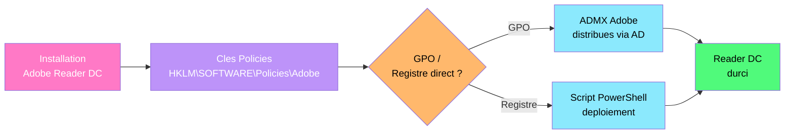
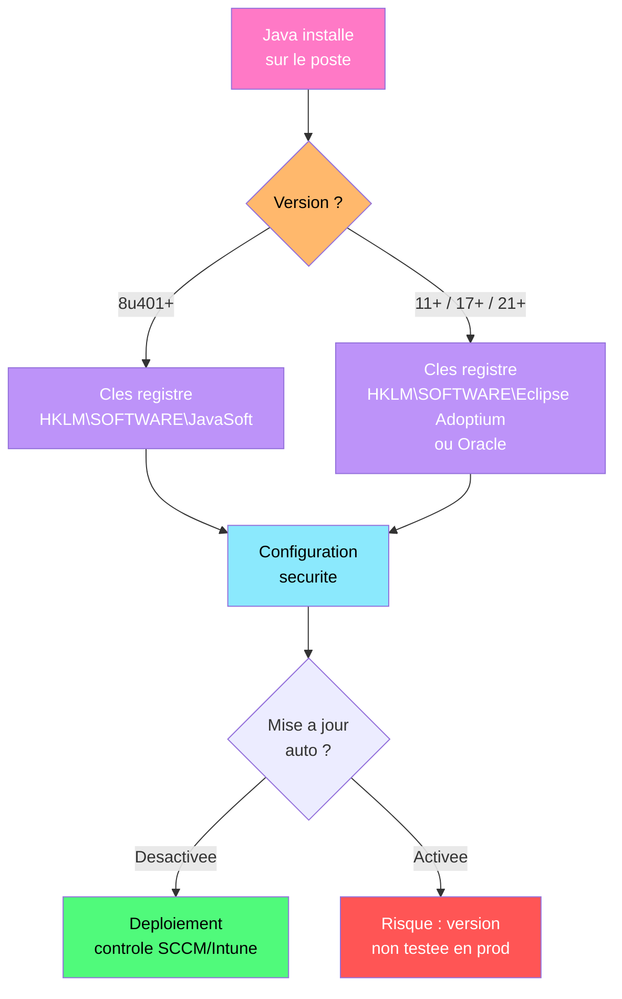

---
tags:
  - registre
  - adobe
  - acrobat
  - creative-cloud
  - java
  - jre
  - deploiement
  - securite
---

# Adobe Creative Suite & Java/JRE

!!! abstract "Ce que vous allez apprendre"
    - Configurer Adobe Acrobat Reader DC via les cles de registre de politique
    - Deployer et verrouiller Adobe Creative Cloud en environnement entreprise
    - Gerer les mises a jour silencieuses et le version pinning des produits Adobe
    - Localiser et configurer les cles Java/JRE pour le deploiement enterprise
    - Controler les parametres de securite Java et la liste d'exceptions de sites
    - Desactiver les mises a jour automatiques Java et gerer les versions
    - Supprimer les plugins navigateur Java pour reduire la surface d'attaque
    - Scenario reel : durcir Adobe Reader et gerer les versions Java sur un parc de 300 postes

---

## Adobe Acrobat Reader DC : cles de registre



Adobe Acrobat Reader DC stocke ses politiques enterprise sous un chemin de registre dedie. Les administrateurs peuvent verrouiller le comportement du lecteur PDF sans passer par la console d'administration Creative Cloud.

### Emplacements principaux

```
HKLM\SOFTWARE\Policies\Adobe\Acrobat Reader\DC\FeatureLockDown
HKLM\SOFTWARE\Adobe\Acrobat Reader\DC\Installer
HKLM\SOFTWARE\WOW6432Node\Adobe\Acrobat Reader\DC\Installer
```

| Cle | Role |
|-----|------|
| `FeatureLockDown` | Racine des politiques de verrouillage |
| `FeatureLockDown\cServices` | Services cloud Adobe (Send, Store, Sign) |
| `FeatureLockDown\cWebmailProfiles` | Profils de messagerie web |
| `FeatureLockDown\cSharePoint` | Integration SharePoint |
| `FeatureLockDown\cCloud` | Services Document Cloud |
| `Installer` | Informations d'installation et de version |

```powershell
# Check Adobe Reader DC installation and version
$paths = @(
    "HKLM:\SOFTWARE\Adobe\Acrobat Reader\DC\Installer",
    "HKLM:\SOFTWARE\WOW6432Node\Adobe\Acrobat Reader\DC\Installer"
)

foreach ($p in $paths) {
    if (Test-Path $p) {
        $info = Get-ItemProperty -Path $p -ErrorAction SilentlyContinue
        Write-Output "Path    : $p"
        Write-Output "Version : $($info.VersionMajor).$($info.VersionMinor)"
        Write-Output "Instdir : $($info.Path)"
        break
    }
}
```

```title="Resultat attendu"
Path    : HKLM:\SOFTWARE\Adobe\Acrobat Reader\DC\Installer
Version : 24.3
Instdir : C:\Program Files\Adobe\Acrobat DC\Reader\
```

### Durcissement securite Reader DC

Les cles sous `FeatureLockDown` permettent de desactiver les fonctionnalites a risque sans toucher a l'interface utilisateur.

```
HKLM\SOFTWARE\Policies\Adobe\Acrobat Reader\DC\FeatureLockDown
```

| Valeur | Type | Description | Recommandation |
|--------|------|-------------|----------------|
| `bEnableFlash` | REG_DWORD | Contenu Flash dans les PDF | `0` (desactiver) |
| `bDisableJavaScript` | REG_DWORD | Execution JavaScript dans les PDF | `1` (desactiver) |
| `bEnhancedSecurityStandalone` | REG_DWORD | Mode protege en mode autonome | `1` (activer) |
| `bEnhancedSecurityInBrowser` | REG_DWORD | Mode protege dans le navigateur | `1` (activer) |
| `bProtectedMode` | REG_DWORD | Sandbox (bac a sable) | `1` (activer) |
| `iProtectedView` | REG_DWORD | Vue protegee : `0` desactive, `1` fichiers non fiables, `2` tout | `2` |

```powershell
# Harden Adobe Reader DC via registry
$featurePath = "HKLM:\SOFTWARE\Policies\Adobe\Acrobat Reader\DC\FeatureLockDown"
New-Item -Path $featurePath -Force | Out-Null

# Disable JavaScript execution in PDFs
Set-ItemProperty -Path $featurePath -Name "bDisableJavaScript" -Value 1 -Type DWord

# Disable Flash content
Set-ItemProperty -Path $featurePath -Name "bEnableFlash" -Value 0 -Type DWord

# Enable Enhanced Security (standalone and browser)
Set-ItemProperty -Path $featurePath -Name "bEnhancedSecurityStandalone" -Value 1 -Type DWord
Set-ItemProperty -Path $featurePath -Name "bEnhancedSecurityInBrowser" -Value 1 -Type DWord

# Enable Protected Mode (sandbox)
Set-ItemProperty -Path $featurePath -Name "bProtectedMode" -Value 1 -Type DWord

# Enable Protected View for all files
Set-ItemProperty -Path $featurePath -Name "iProtectedView" -Value 2 -Type DWord
```

```title="Resultat attendu"
Aucune sortie. Les parametres de durcissement sont appliques immediatement au prochain lancement de Reader.
```

### Desactiver les services cloud Adobe

En environnement entreprise, les services cloud Adobe (Send, Store, Sign) representent un risque d'exfiltration de donnees. Desactivez-les via le registre.

```
HKLM\SOFTWARE\Policies\Adobe\Acrobat Reader\DC\FeatureLockDown\cServices
```

| Valeur | Type | Description |
|--------|------|-------------|
| `bToggleAdobeDocumentServices` | REG_DWORD | `1` = desactiver Document Cloud |
| `bToggleWebConnectors` | REG_DWORD | `1` = desactiver les connecteurs web |
| `bToggleSendAndTrack` | REG_DWORD | `1` = desactiver Send & Track |
| `bToggleAdobeSign` | REG_DWORD | `1` = desactiver Adobe Sign |

```powershell
# Disable all Adobe cloud services
$svcPath = "HKLM:\SOFTWARE\Policies\Adobe\Acrobat Reader\DC\FeatureLockDown\cServices"
New-Item -Path $svcPath -Force | Out-Null

Set-ItemProperty -Path $svcPath -Name "bToggleAdobeDocumentServices" -Value 1 -Type DWord
Set-ItemProperty -Path $svcPath -Name "bToggleWebConnectors" -Value 1 -Type DWord
Set-ItemProperty -Path $svcPath -Name "bToggleSendAndTrack" -Value 1 -Type DWord
Set-ItemProperty -Path $svcPath -Name "bToggleAdobeSign" -Value 1 -Type DWord

# Disable SharePoint and Webmail integration
$spPath = "HKLM:\SOFTWARE\Policies\Adobe\Acrobat Reader\DC\FeatureLockDown\cSharePoint"
New-Item -Path $spPath -Force | Out-Null
Set-ItemProperty -Path $spPath -Name "bDisableSharePointFeatures" -Value 1 -Type DWord

$wmPath = "HKLM:\SOFTWARE\Policies\Adobe\Acrobat Reader\DC\FeatureLockDown\cWebmailProfiles"
New-Item -Path $wmPath -Force | Out-Null
Set-ItemProperty -Path $wmPath -Name "bDisableWebmail" -Value 1 -Type DWord
```

```title="Resultat attendu"
Aucune sortie. Les services cloud Adobe sont desactives pour tous les utilisateurs de la machine.
```

!!! info "En resume"
    - Les politiques Reader DC se configurent sous `HKLM\SOFTWARE\Policies\Adobe\Acrobat Reader\DC\FeatureLockDown`
    - Desactiver JavaScript, Flash, et activer Protected Mode + Protected View sont les mesures prioritaires
    - Les services cloud (Send, Sign, Document Cloud) doivent etre desactives en environnement sensible
    - Les cles sous `cServices` controlent chaque service cloud individuellement

---

## Adobe Creative Cloud : deploiement enterprise

Adobe Creative Cloud utilise un mecanisme de deploiement base sur l'Adobe Admin Console et le package SCCM/Intune. Cependant, plusieurs parametres cles sont accessibles via le registre.

### Emplacements principaux

```
HKLM\SOFTWARE\Adobe\OOBE
HKLM\SOFTWARE\Adobe\Adobe ARM\Legacy\Reader\{AC76BA86-7AD7-1036-7B44-AC0F074E4100}
HKLM\SOFTWARE\Policies\Adobe\CCXProcess
```

| Valeur | Cle | Type | Description |
|--------|-----|------|-------------|
| `Catalogs` | `OOBE` | REG_DWORD | Controle du catalogue Creative Cloud |
| `iDisableCheckForUpdates` | `Adobe ARM\Legacy\Reader\{GUID}` | REG_DWORD | Desactive la verification des mises a jour ARM |
| `Mode` | `Adobe ARM\Legacy\Reader\{GUID}` | REG_DWORD | `0` = pas de verification, `3` = telechargement auto, `4` = installation auto |

```powershell
# Check Adobe ARM (update manager) configuration
$armPath = "HKLM:\SOFTWARE\Adobe\Adobe ARM\1.0\ARM"
if (Test-Path $armPath) {
    Get-ItemProperty -Path $armPath | Select-Object iCheckReader, iDisableCheckForUpdates, Mode
} else {
    Write-Output "Adobe ARM not found. Check WOW6432Node path."
    $armWow = "HKLM:\SOFTWARE\WOW6432Node\Adobe\Adobe ARM\1.0\ARM"
    if (Test-Path $armWow) {
        Get-ItemProperty -Path $armWow | Select-Object iCheckReader, iDisableCheckForUpdates, Mode
    }
}
```

```title="Resultat attendu"
iCheckReader          iDisableCheckForUpdates Mode
------------          ----------------------- ----
           0                                1    0
```

### Desactiver les mises a jour automatiques Adobe

En entreprise, les mises a jour doivent etre testees avant deploiement. Desactivez les mises a jour automatiques via Adobe ARM et le service Adobe Update.

```powershell
# Disable Adobe automatic updates via ARM
$armPath = "HKLM:\SOFTWARE\Adobe\Adobe ARM\1.0\ARM"
New-Item -Path $armPath -Force | Out-Null
Set-ItemProperty -Path $armPath -Name "iCheckReader" -Value 0 -Type DWord
Set-ItemProperty -Path $armPath -Name "iDisableCheckForUpdates" -Value 1 -Type DWord
Set-ItemProperty -Path $armPath -Name "Mode" -Value 0 -Type DWord

# Disable Adobe Acrobat Update Service
Set-Service -Name "AdobeARMservice" -StartupType Disabled -ErrorAction SilentlyContinue
Stop-Service -Name "AdobeARMservice" -ErrorAction SilentlyContinue

# Disable Adobe Genuine Monitor Service
Set-Service -Name "AGMService" -StartupType Disabled -ErrorAction SilentlyContinue

# Verify services status
foreach ($svc in @("AdobeARMservice", "AGMService", "AdobeUpdateService")) {
    $s = Get-Service -Name $svc -ErrorAction SilentlyContinue
    if ($s) {
        Write-Output "$($s.Name) : Status=$($s.Status), StartType=$($s.StartType)"
    }
}
```

```title="Resultat attendu"
AdobeARMservice : Status=Stopped, StartType=Disabled
AGMService : Status=Stopped, StartType=Disabled
```

### Version pinning via registre

Pour empecher les utilisateurs de mettre a jour Adobe Reader au-dela d'une version approuvee, combinez la desactivation des mises a jour avec un controle de version.

```powershell
# Pin Adobe Reader to a specific version by blocking ARM checks
$armLegacyPath = "HKLM:\SOFTWARE\Adobe\Adobe ARM\Legacy\Reader\{AC76BA86-7AD7-1036-7B44-AC0F074E4100}"
if (-not (Test-Path $armLegacyPath)) {
    New-Item -Path $armLegacyPath -Force | Out-Null
}
Set-ItemProperty -Path $armLegacyPath -Name "Mode" -Value 0 -Type DWord

# Block Creative Cloud Desktop App auto-update
$ccxPath = "HKLM:\SOFTWARE\Policies\Adobe\CCXProcess"
New-Item -Path $ccxPath -Force | Out-Null
Set-ItemProperty -Path $ccxPath -Name "DisableAutoUpdate" -Value 1 -Type DWord

# Verify current installed version
$readerExe = "C:\Program Files\Adobe\Acrobat DC\Reader\AcroRd32.exe"
if (Test-Path $readerExe) {
    $ver = (Get-Item $readerExe).VersionInfo.ProductVersion
    Write-Output "Adobe Reader DC version courante : $ver"
} else {
    $readerExe64 = "C:\Program Files\Adobe\Acrobat DC\Reader\Acrobat.exe"
    if (Test-Path $readerExe64) {
        $ver = (Get-Item $readerExe64).VersionInfo.ProductVersion
        Write-Output "Adobe Acrobat DC version courante : $ver"
    }
}
```

```title="Resultat attendu"
Adobe Reader DC version courante : 24.003.20180
```

!!! info "En resume"
    - Adobe ARM controle les mises a jour : `Mode = 0` desactive toute verification
    - Le service `AdobeARMservice` doit etre desactive pour bloquer les mises a jour en arriere-plan
    - Le version pinning combine la desactivation ARM + blocage du service + politique CCX
    - En entreprise, testez chaque version Adobe avant deploiement via SCCM ou Intune

---

## Java/JRE : deploiement enterprise



Java reste omnipresent dans les applications metier (comptabilite, ERP, applications internes). La gestion des versions et de la securite via le registre est un incontournable pour les administrateurs.

### Emplacements principaux

```
HKLM\SOFTWARE\JavaSoft\Java Runtime Environment
HKLM\SOFTWARE\JavaSoft\Java Runtime Environment\<version>
HKLM\SOFTWARE\JavaSoft\Java Update\Policy
HKLM\SOFTWARE\WOW6432Node\JavaSoft\Java Runtime Environment
```

| Cle | Role |
|-----|------|
| `Java Runtime Environment` | Racine JRE — contient `CurrentVersion` |
| `Java Runtime Environment\<version>` | Parametres specifiques a chaque version installee |
| `Java Update\Policy` | Politique de mise a jour automatique |
| `Java Development Kit` | Informations sur le JDK (si installe) |

```powershell
# Enumerate all installed Java versions
$jrePaths = @(
    "HKLM:\SOFTWARE\JavaSoft\Java Runtime Environment",
    "HKLM:\SOFTWARE\WOW6432Node\JavaSoft\Java Runtime Environment",
    "HKLM:\SOFTWARE\JavaSoft\JDK",
    "HKLM:\SOFTWARE\Eclipse Adoptium\JRE",
    "HKLM:\SOFTWARE\Eclipse Adoptium\JDK"
)

foreach ($base in $jrePaths) {
    if (Test-Path $base) {
        Write-Output "=== $base ==="
        $props = Get-ItemProperty -Path $base -ErrorAction SilentlyContinue
        if ($props.CurrentVersion) {
            Write-Output "  Current Version : $($props.CurrentVersion)"
        }
        Get-ChildItem -Path $base -ErrorAction SilentlyContinue |
            ForEach-Object {
                $verProps = Get-ItemProperty -Path $_.PSPath -ErrorAction SilentlyContinue
                Write-Output "  $($_.PSChildName) -> JavaHome: $($verProps.JavaHome)"
            }
    }
}
```

```title="Resultat attendu"
=== HKLM:\SOFTWARE\JavaSoft\Java Runtime Environment ===
  Current Version : 1.8.0_401
  1.8 -> JavaHome: C:\Program Files\Java\jre1.8.0_401
  1.8.0_401 -> JavaHome: C:\Program Files\Java\jre1.8.0_401
```

### Cles de version Java

Chaque version installee cree une sous-cle avec ses parametres specifiques :

```
HKLM\SOFTWARE\JavaSoft\Java Runtime Environment\1.8.0_401
```

| Valeur | Type | Description |
|--------|------|-------------|
| `JavaHome` | REG_SZ | Repertoire d'installation du JRE |
| `RuntimeLib` | REG_SZ | Chemin de la DLL jvm.dll |
| `MicroVersion` | REG_SZ | Numero de micro-version |
| `UpdateVersion` | REG_SZ | Numero de mise a jour (ex: 401) |

```powershell
# Get detailed Java version info from registry
$currentVer = (Get-ItemProperty "HKLM:\SOFTWARE\JavaSoft\Java Runtime Environment" -ErrorAction SilentlyContinue).CurrentVersion
if ($currentVer) {
    $verPath = "HKLM:\SOFTWARE\JavaSoft\Java Runtime Environment\$currentVer"
    $info = Get-ItemProperty -Path $verPath -ErrorAction SilentlyContinue
    Write-Output "Java Version  : $currentVer"
    Write-Output "Java Home     : $($info.JavaHome)"
    Write-Output "Runtime Lib   : $($info.RuntimeLib)"
    Write-Output "Update Version: $($info.UpdateVersion)"
}
```

```title="Resultat attendu"
Java Version  : 1.8.0_401
Java Home     : C:\Program Files\Java\jre1.8.0_401
Runtime Lib   : C:\Program Files\Java\jre1.8.0_401\bin\server\jvm.dll
Update Version: 401
```

!!! info "En resume"
    - Java stocke ses informations de version sous `HKLM\SOFTWARE\JavaSoft\Java Runtime Environment`
    - La valeur `CurrentVersion` indique la version par defaut utilisee par le systeme
    - Chaque version installee a sa propre sous-cle avec `JavaHome` et `RuntimeLib`
    - Les JRE modernes (Adoptium, Corretto) utilisent des chemins differents (`Eclipse Adoptium`, `Amazon`)

---

## Securite Java et liste d'exceptions

Les parametres de securite Java controlent le niveau de confiance accorde aux applets et applications Web Start. Depuis Java 8, le niveau de securite par defaut est "Eleve", mais certaines applications metier necessitent des exceptions.

### Niveau de securite global

```
HKLM\SOFTWARE\JavaSoft\Java Runtime Environment
```

| Valeur | Type | Description |
|--------|------|-------------|
| `SECURITY_LEVEL` | REG_DWORD | `0` = Personnalise, `1` = Moyen (deconseille), `2` = Eleve, `3` = Tres eleve |

```powershell
# Set Java security level to High via registry
$jrePath = "HKLM:\SOFTWARE\JavaSoft\Java Runtime Environment"
if (Test-Path $jrePath) {
    Set-ItemProperty -Path $jrePath -Name "SECURITY_LEVEL" -Value 2 -Type DWord
    Write-Output "Java security level set to HIGH (2)"
}
```

```title="Resultat attendu"
Java security level set to HIGH (2)
```

### Deployer la liste d'exceptions de sites (Exception Site List)

La liste d'exceptions permet d'autoriser certaines URLs a executer du contenu Java malgre le niveau de securite eleve. En entreprise, cette liste est deployee via un fichier `exception.sites` et une cle de registre.

```
HKLM\SOFTWARE\JavaSoft\Java Runtime Environment
    Valeur : DEPLOYMENT_RULE_SET (chemin vers le fichier DeploymentRuleSet.jar)

%USERPROFILE%\AppData\LocalLow\Sun\Java\Deployment\security\exception.sites
%WINDIR%\Sun\Java\Deployment\exception.sites  (deploiement machine)
```

```powershell
# Deploy Java Exception Site List for all users
$deploymentDir = "$env:WINDIR\Sun\Java\Deployment"
$securityDir = "$deploymentDir\security"
New-Item -Path $securityDir -ItemType Directory -Force | Out-Null

# Create the exception site list
$exceptionSites = @(
    "https://erp.entreprise.com",
    "https://compta.entreprise.com",
    "https://intranet.entreprise.com:8443"
)
$exceptionSites | Out-File "$securityDir\exception.sites" -Encoding ASCII

# Create deployment.properties to point to the system-wide config
$deploymentProps = @"
deployment.user.security.exception.sites=$securityDir\exception.sites
deployment.security.level=HIGH
deployment.security.level.locked
"@
$deploymentProps | Out-File "$deploymentDir\deployment.properties" -Encoding ASCII

# Verify files created
Get-ChildItem $securityDir
Get-Content "$securityDir\exception.sites"
```

```title="Resultat attendu"
    Directory: C:\Windows\Sun\Java\Deployment\security

Mode                 LastWriteTime         Length Name
----                 -------------         ------ ----
-a---           2026-04-04    10:00           98 exception.sites

https://erp.entreprise.com
https://compta.entreprise.com
https://intranet.entreprise.com:8443
```

### Deployment Rule Set (DRS)

Pour un controle plus granulaire, le Deployment Rule Set permet de definir des regles par URL et par certificat. Le fichier `DeploymentRuleSet.jar` est signe et place dans un emplacement de confiance.

```powershell
# Point Java to the Deployment Rule Set
$jrePath = "HKLM:\SOFTWARE\JavaSoft\Java Runtime Environment"
Set-ItemProperty -Path $jrePath -Name "DEPLOYMENT_RULE_SET" `
    -Value "C:\Windows\Sun\Java\Deployment\DeploymentRuleSet.jar" -Type String

# Verify the DRS path
$drsPath = (Get-ItemProperty -Path $jrePath -ErrorAction SilentlyContinue).DEPLOYMENT_RULE_SET
Write-Output "DRS Path : $drsPath"
Write-Output "DRS Exists : $(Test-Path $drsPath)"
```

```title="Resultat attendu"
DRS Path : C:\Windows\Sun\Java\Deployment\DeploymentRuleSet.jar
DRS Exists : True
```

!!! info "En resume"
    - Le niveau de securite Java se controle via `SECURITY_LEVEL` (recommandation : `2` = Eleve)
    - La liste d'exceptions de sites autorise des URLs specifiques a executer du contenu Java
    - Le Deployment Rule Set offre un controle granulaire par URL et certificat
    - Deployez les fichiers de configuration dans `%WINDIR%\Sun\Java\Deployment\` pour une application machine

---

## Controle des mises a jour Java

Les mises a jour automatiques Java peuvent casser des applications metier anciennes. Le controle des mises a jour est essentiel en entreprise.

### Desactiver la mise a jour automatique

```
HKLM\SOFTWARE\JavaSoft\Java Update\Policy
HKLM\SOFTWARE\WOW6432Node\JavaSoft\Java Update\Policy
```

| Valeur | Type | Description |
|--------|------|-------------|
| `EnableJavaUpdate` | REG_DWORD | `0` = desactiver les mises a jour automatiques |
| `EnableAutoUpdateCheck` | REG_DWORD | `0` = desactiver la verification automatique |
| `NotifyDownload` | REG_DWORD | `0` = pas de notification de telechargement |
| `NotifyInstall` | REG_DWORD | `0` = pas de notification d'installation |

```powershell
# Disable Java auto-update completely
$updatePaths = @(
    "HKLM:\SOFTWARE\JavaSoft\Java Update\Policy",
    "HKLM:\SOFTWARE\WOW6432Node\JavaSoft\Java Update\Policy"
)

foreach ($path in $updatePaths) {
    if (-not (Test-Path $path)) {
        New-Item -Path $path -Force | Out-Null
    }
    Set-ItemProperty -Path $path -Name "EnableJavaUpdate" -Value 0 -Type DWord
    Set-ItemProperty -Path $path -Name "EnableAutoUpdateCheck" -Value 0 -Type DWord
    Set-ItemProperty -Path $path -Name "NotifyDownload" -Value 0 -Type DWord
    Set-ItemProperty -Path $path -Name "NotifyInstall" -Value 0 -Type DWord
}

# Disable the Java Update Scheduler task
$taskName = "JavaUpdateSched"
$task = Get-ScheduledTask -TaskName $taskName -ErrorAction SilentlyContinue
if ($task) {
    Disable-ScheduledTask -TaskName $taskName
    Write-Output "Task '$taskName' disabled."
} else {
    Write-Output "Task '$taskName' not found."
}

# Disable Java Update Service
Set-Service -Name "JavaQuickStarterService" -StartupType Disabled -ErrorAction SilentlyContinue
Stop-Service -Name "JavaQuickStarterService" -ErrorAction SilentlyContinue
```

```title="Resultat attendu"
Task 'JavaUpdateSched' disabled.
```

### Gestion multi-versions

Certaines applications metier requierent des versions differentes de Java. Le registre permet de gerer la coexistence.

```powershell
# List all installed Java versions with their paths
$registryRoots = @(
    "HKLM:\SOFTWARE\JavaSoft\Java Runtime Environment",
    "HKLM:\SOFTWARE\WOW6432Node\JavaSoft\Java Runtime Environment"
)

$javaVersions = @()
foreach ($root in $registryRoots) {
    if (Test-Path $root) {
        Get-ChildItem -Path $root -ErrorAction SilentlyContinue |
            ForEach-Object {
                $props = Get-ItemProperty -Path $_.PSPath -ErrorAction SilentlyContinue
                if ($props.JavaHome) {
                    $javaVersions += [PSCustomObject]@{
                        Version  = $_.PSChildName
                        JavaHome = $props.JavaHome
                        Arch     = if ($root -match "WOW6432") { "x86" } else { "x64" }
                        Exists   = Test-Path $props.JavaHome
                    }
                }
            }
    }
}
$javaVersions | Format-Table -AutoSize
```

```title="Resultat attendu"
Version     JavaHome                                    Arch Exists
-------     --------                                    ---- ------
1.8         C:\Program Files\Java\jre1.8.0_401         x64    True
1.8.0_401   C:\Program Files\Java\jre1.8.0_401         x64    True
1.8         C:\Program Files (x86)\Java\jre1.8.0_401   x86    True
1.8.0_401   C:\Program Files (x86)\Java\jre1.8.0_401   x86    True
```

### Changer la version Java par defaut

```powershell
# Set default Java version via registry
$targetVersion = "1.8.0_401"
$jrePath = "HKLM:\SOFTWARE\JavaSoft\Java Runtime Environment"

if (Test-Path "$jrePath\$targetVersion") {
    Set-ItemProperty -Path $jrePath -Name "CurrentVersion" -Value $targetVersion -Type String
    Write-Output "Default Java version set to $targetVersion"

    # Verify
    $current = (Get-ItemProperty $jrePath).CurrentVersion
    Write-Output "Current version (registry) : $current"
    & java -version 2>&1 | Select-Object -First 1
} else {
    Write-Output "Version $targetVersion not found in registry."
}
```

```title="Resultat attendu"
Default Java version set to 1.8.0_401
Current version (registry) : 1.8.0_401
java version "1.8.0_401"
```

!!! info "En resume"
    - Desactivez les mises a jour via `EnableJavaUpdate = 0` et `EnableAutoUpdateCheck = 0`
    - Desactivez egalement la tache planifiee `JavaUpdateSched` et le service `JavaQuickStarterService`
    - La gestion multi-versions passe par les sous-cles de `Java Runtime Environment`
    - `CurrentVersion` definit la version par defaut utilisee par le systeme

---

## Plugins navigateur Java

Depuis Java 9, Oracle a supprime le plugin navigateur NPAPI. Pour Java 8, le plugin doit etre desactive manuellement pour reduire la surface d'attaque.

### Desactiver le plugin navigateur

```
HKLM\SOFTWARE\JavaSoft\Java Plug-in
HKLM\SOFTWARE\WOW6432Node\JavaSoft\Java Plug-in
```

```powershell
# Disable Java browser plugin
$pluginPaths = @(
    "HKLM:\SOFTWARE\JavaSoft\Java Plug-in",
    "HKLM:\SOFTWARE\WOW6432Node\JavaSoft\Java Plug-in"
)

foreach ($path in $pluginPaths) {
    $versions = Get-ChildItem -Path $path -ErrorAction SilentlyContinue
    foreach ($ver in $versions) {
        Set-ItemProperty -Path $ver.PSPath -Name "UseNewJavaPlugin" -Value 0 -Type DWord `
            -ErrorAction SilentlyContinue
        Write-Output "Disabled Java plugin for $($ver.PSChildName)"
    }
}

# Remove Java from Internet Explorer Add-ons
$iePath = "HKLM:\SOFTWARE\Microsoft\Windows\CurrentVersion\Ext\PreApproved"
$javaClsids = @(
    "{CAFEEFAC-0016-0000-FFFF-ABCDEFFEDCBA}",
    "{CAFEEFAC-0017-0000-FFFF-ABCDEFFEDCBA}",
    "{CAFEEFAC-0018-0000-FFFF-ABCDEFFEDCBA}"
)
foreach ($clsid in $javaClsids) {
    $fullPath = "$iePath\$clsid"
    if (Test-Path $fullPath) {
        Remove-Item -Path $fullPath -Force
        Write-Output "Removed IE pre-approval for $clsid"
    }
}
```

```title="Resultat attendu"
Disabled Java plugin for 180401
```

### Bloquer Java dans les navigateurs via politique

```powershell
# Block Java plugin in Chrome and Edge via policy
$chromePath = "HKLM:\SOFTWARE\Policies\Google\Chrome"
$edgePath = "HKLM:\SOFTWARE\Policies\Microsoft\Edge"

foreach ($path in @($chromePath, $edgePath)) {
    $pluginBlock = "$path\PluginsBlockedForUrls"
    New-Item -Path $pluginBlock -Force | Out-Null
    Set-ItemProperty -Path $pluginBlock -Name "1" -Value "[*.]" -Type String
}
Write-Output "Java plugin blocked in Chrome and Edge policies."
```

```title="Resultat attendu"
Java plugin blocked in Chrome and Edge policies.
```

!!! info "En resume"
    - Java 9+ n'inclut plus de plugin navigateur, mais Java 8 en necessite la desactivation manuelle
    - `UseNewJavaPlugin = 0` desactive le plugin Java pour chaque version sous `Java Plug-in`
    - Supprimez les CLSID Java pre-approuves pour Internet Explorer
    - Utilisez les politiques navigateur pour bloquer les plugins Java dans Chrome et Edge

---

## Scenario : durcir Adobe Reader et gerer Java sur un parc de 300 postes

### Contexte

L'equipe securite a identifie deux risques majeurs lors d'un audit : Adobe Reader DC n'est pas durci (JavaScript actif dans les PDF, services cloud accessibles) et trois versions differentes de Java coexistent sans controle sur les 300 postes du parc. L'objectif est de deployer un durcissement complet via un script unique, executable par GPO ou SCCM.

### Etape 1 : inventaire pre-deploiement

```powershell
# Pre-deployment inventory script (run on each machine via SCCM or GPO)
$inventory = [PSCustomObject]@{
    ComputerName   = $env:COMPUTERNAME
    AdobeVersion   = $null
    AdobeJSEnabled = $null
    JavaVersions   = @()
    JavaAutoUpdate = $null
}

# Adobe Reader version
$adobePath = "HKLM:\SOFTWARE\Adobe\Acrobat Reader\DC\Installer"
if (Test-Path $adobePath) {
    $adobe = Get-ItemProperty -Path $adobePath -ErrorAction SilentlyContinue
    $inventory.AdobeVersion = "$($adobe.VersionMajor).$($adobe.VersionMinor)"
}

# Adobe JS status
$featurePath = "HKLM:\SOFTWARE\Policies\Adobe\Acrobat Reader\DC\FeatureLockDown"
if (Test-Path $featurePath) {
    $features = Get-ItemProperty -Path $featurePath -ErrorAction SilentlyContinue
    $inventory.AdobeJSEnabled = ($features.bDisableJavaScript -ne 1)
} else {
    $inventory.AdobeJSEnabled = $true  # No policy = JS enabled by default
}

# Java versions
$jrePath = "HKLM:\SOFTWARE\JavaSoft\Java Runtime Environment"
if (Test-Path $jrePath) {
    Get-ChildItem -Path $jrePath -ErrorAction SilentlyContinue |
        ForEach-Object {
            $props = Get-ItemProperty $_.PSPath -ErrorAction SilentlyContinue
            if ($props.JavaHome) {
                $inventory.JavaVersions += $_.PSChildName
            }
        }
}

# Java auto-update
$updatePath = "HKLM:\SOFTWARE\JavaSoft\Java Update\Policy"
if (Test-Path $updatePath) {
    $update = Get-ItemProperty -Path $updatePath -ErrorAction SilentlyContinue
    $inventory.JavaAutoUpdate = ($update.EnableJavaUpdate -ne 0)
} else {
    $inventory.JavaAutoUpdate = $true  # No policy = auto-update enabled
}

$inventory | Format-List
```

```title="Resultat attendu"
ComputerName   : PC-COMPTA-042
AdobeVersion   : 24.3
AdobeJSEnabled : True
JavaVersions   : {1.8, 1.8.0_361, 1.8.0_401}
JavaAutoUpdate : True
```

### Etape 2 : script de durcissement complet

```powershell
# Complete hardening script for Adobe Reader DC + Java
# Deploy via GPO startup script or SCCM task sequence

# ---- ADOBE READER DC HARDENING ----
$featurePath = "HKLM:\SOFTWARE\Policies\Adobe\Acrobat Reader\DC\FeatureLockDown"
$svcPath = "$featurePath\cServices"
$cloudPath = "$featurePath\cCloud"

foreach ($p in @($featurePath, $svcPath, $cloudPath)) {
    New-Item -Path $p -Force | Out-Null
}

# Security hardening
$adobeHardening = @{
    "bDisableJavaScript"            = 1
    "bEnableFlash"                  = 0
    "bEnhancedSecurityStandalone"   = 1
    "bEnhancedSecurityInBrowser"    = 1
    "bProtectedMode"                = 1
    "iProtectedView"                = 2
    "iFileAttachmentPerms"          = 1  # Block file attachments by default
}

foreach ($key in $adobeHardening.Keys) {
    Set-ItemProperty -Path $featurePath -Name $key -Value $adobeHardening[$key] -Type DWord
}

# Cloud services lockdown
$cloudLockdown = @{
    "bToggleAdobeDocumentServices"  = 1
    "bToggleWebConnectors"          = 1
    "bToggleSendAndTrack"           = 1
    "bToggleAdobeSign"              = 1
}

foreach ($key in $cloudLockdown.Keys) {
    Set-ItemProperty -Path $svcPath -Name $key -Value $cloudLockdown[$key] -Type DWord
}

# Disable Adobe updates
$armPath = "HKLM:\SOFTWARE\Adobe\Adobe ARM\1.0\ARM"
New-Item -Path $armPath -Force | Out-Null
Set-ItemProperty -Path $armPath -Name "iCheckReader" -Value 0 -Type DWord
Set-ItemProperty -Path $armPath -Name "iDisableCheckForUpdates" -Value 1 -Type DWord
Set-ItemProperty -Path $armPath -Name "Mode" -Value 0 -Type DWord

# ---- JAVA HARDENING ----
# Disable auto-update
$javaUpdatePaths = @(
    "HKLM:\SOFTWARE\JavaSoft\Java Update\Policy",
    "HKLM:\SOFTWARE\WOW6432Node\JavaSoft\Java Update\Policy"
)

foreach ($path in $javaUpdatePaths) {
    New-Item -Path $path -Force | Out-Null
    Set-ItemProperty -Path $path -Name "EnableJavaUpdate" -Value 0 -Type DWord
    Set-ItemProperty -Path $path -Name "EnableAutoUpdateCheck" -Value 0 -Type DWord
}

# Set Java security level to High
$jrePath = "HKLM:\SOFTWARE\JavaSoft\Java Runtime Environment"
if (Test-Path $jrePath) {
    Set-ItemProperty -Path $jrePath -Name "SECURITY_LEVEL" -Value 2 -Type DWord
}

# Deploy exception site list
$deployDir = "$env:WINDIR\Sun\Java\Deployment\security"
New-Item -Path $deployDir -ItemType Directory -Force | Out-Null
@(
    "https://erp.entreprise.com",
    "https://compta.entreprise.com"
) | Out-File "$deployDir\exception.sites" -Encoding ASCII

# Disable Java browser plugin (Java 8)
$pluginPaths = @(
    "HKLM:\SOFTWARE\JavaSoft\Java Plug-in",
    "HKLM:\SOFTWARE\WOW6432Node\JavaSoft\Java Plug-in"
)
foreach ($path in $pluginPaths) {
    Get-ChildItem -Path $path -ErrorAction SilentlyContinue |
        ForEach-Object {
            Set-ItemProperty -Path $_.PSPath -Name "UseNewJavaPlugin" -Value 0 `
                -Type DWord -ErrorAction SilentlyContinue
        }
}

# Disable scheduled task and services
Disable-ScheduledTask -TaskName "JavaUpdateSched" -ErrorAction SilentlyContinue
Set-Service -Name "AdobeARMservice" -StartupType Disabled -ErrorAction SilentlyContinue
Stop-Service -Name "AdobeARMservice" -ErrorAction SilentlyContinue

Write-Output "Hardening complete on $env:COMPUTERNAME"
```

```title="Resultat attendu"
Hardening complete on PC-COMPTA-042
```

### Etape 3 : verification post-deploiement

```powershell
# Post-deployment verification script
$results = @()

# Check Adobe hardening
$featurePath = "HKLM:\SOFTWARE\Policies\Adobe\Acrobat Reader\DC\FeatureLockDown"
$features = Get-ItemProperty -Path $featurePath -ErrorAction SilentlyContinue

$results += [PSCustomObject]@{
    Check  = "Adobe JS disabled"
    Status = if ($features.bDisableJavaScript -eq 1) { "PASS" } else { "FAIL" }
}
$results += [PSCustomObject]@{
    Check  = "Adobe Protected Mode"
    Status = if ($features.bProtectedMode -eq 1) { "PASS" } else { "FAIL" }
}
$results += [PSCustomObject]@{
    Check  = "Adobe Protected View = All"
    Status = if ($features.iProtectedView -eq 2) { "PASS" } else { "FAIL" }
}

# Check Java hardening
$updatePath = "HKLM:\SOFTWARE\JavaSoft\Java Update\Policy"
$update = Get-ItemProperty -Path $updatePath -ErrorAction SilentlyContinue
$results += [PSCustomObject]@{
    Check  = "Java auto-update disabled"
    Status = if ($update.EnableJavaUpdate -eq 0) { "PASS" } else { "FAIL" }
}

$jrePath = "HKLM:\SOFTWARE\JavaSoft\Java Runtime Environment"
$jre = Get-ItemProperty -Path $jrePath -ErrorAction SilentlyContinue
$results += [PSCustomObject]@{
    Check  = "Java security level = HIGH"
    Status = if ($jre.SECURITY_LEVEL -eq 2) { "PASS" } else { "FAIL" }
}

# Check exception site list
$exceptionFile = "$env:WINDIR\Sun\Java\Deployment\security\exception.sites"
$results += [PSCustomObject]@{
    Check  = "Java exception sites deployed"
    Status = if (Test-Path $exceptionFile) { "PASS" } else { "FAIL" }
}

$results | Format-Table -AutoSize

$passCount = ($results | Where-Object Status -eq "PASS").Count
$totalCount = $results.Count
Write-Output "Score : $passCount / $totalCount checks passed"
```

```title="Resultat attendu"
Check                        Status
-----                        ------
Adobe JS disabled            PASS
Adobe Protected Mode         PASS
Adobe Protected View = All   PASS
Java auto-update disabled    PASS
Java security level = HIGH   PASS
Java exception sites deployed PASS

Score : 6 / 6 checks passed
```

!!! info "En resume"
    - Le script de durcissement combine Adobe Reader DC et Java en une seule execution
    - Le deploiement via GPO (script de demarrage) ou SCCM (task sequence) couvre l'ensemble du parc
    - La verification post-deploiement valide chaque parametre individuellement
    - Les services cloud Adobe et les mises a jour automatiques Java sont les deux priorites de verrouillage

!!! tip "Voir aussi"
    - :material-shield-account: [Applications tierces via GPO](../gpo-pour-les-admins/21-apps-tierces.md) — GPO Admins
    - :material-book-open-variant: [Windows Installer (MSI) et le registre](../bible-registre-windows/26-msi-installer.md) — Bible Registre
