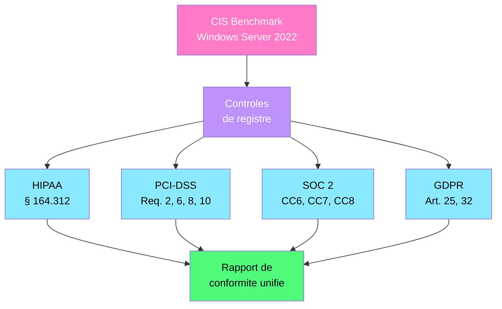
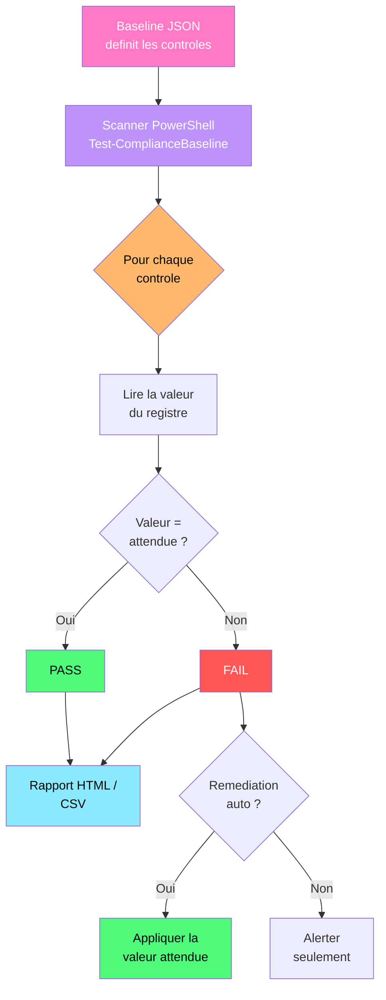

---
tags:
  - registre
  - compliance
  - hipaa
  - pci-dss
  - soc2
  - gdpr
  - cis-benchmark
  - securite
---

# Compliance registre (HIPAA, PCI-DSS, SOC 2, GDPR)

!!! abstract "Ce que vous allez apprendre"
    - Cartographier les controles de registre CIS Benchmark vers les referentiels de conformite
    - Identifier et configurer les parametres de registre pertinents pour HIPAA (audit, chiffrement, acces)
    - Appliquer les exigences PCI-DSS via le registre (mots de passe, journalisation, durcissement de services)
    - Mettre en place le suivi des changements et la journalisation d'acces requis par SOC 2
    - Comprendre les implications GDPR sur les donnees utilisateur stockees dans le registre
    - Construire un scanner de conformite multi-referentiel en PowerShell
    - Automatiser la remediation par referentiel
    - Scenario reel : preparer une flotte Windows pour un audit PCI-DSS avec une baseline de durcissement registre

---

## CIS Benchmark et cartographie des referentiels



Les CIS Benchmarks definissent des centaines de controles de securite pour Windows. Chaque controle se traduit par une ou plusieurs cles de registre. Ces memes cles repondent souvent a plusieurs referentiels de conformite simultanement.

### Cartographie croisee des controles cles

| Controle CIS | Cle de registre | HIPAA | PCI-DSS | SOC 2 | GDPR |
|--------------|-----------------|:-----:|:-------:|:-----:|:----:|
| Password history | `...\System\CurrentControlSet\Services\Netlogon\Parameters\RefusePasswordChange` | x | Req. 8.2 | CC6.1 | |
| Account lockout | `...\CurrentVersion\Policies\System\MaxDevicePasswordFailedAttempts` | x | Req. 8.1.6 | CC6.1 | |
| Audit policy | `...\Policies\Microsoft\Windows\System\Audit*` | x | Req. 10.2 | CC7.2 | Art. 32 |
| SMBv1 disabled | `...\Services\LanmanServer\Parameters\SMB1` | | Req. 2.2 | CC6.1 | |
| NTLMv2 only | `...\CurrentControlSet\Control\Lsa\LmCompatibilityLevel` | x | Req. 2.2 | CC6.7 | Art. 32 |
| RDP NLA | `...\Terminal Server\WinStations\RDP-Tcp\UserAuthentication` | x | Req. 8.3 | CC6.1 | |
| BitLocker | `...\Policies\Microsoft\FVE\*` | x | Req. 3.4 | CC6.7 | Art. 32 |
| Windows Firewall | `...\Policies\Microsoft\WindowsFirewall\*` | | Req. 1.2 | CC6.6 | |

```powershell
# Quick CIS compliance check for key controls
$controls = @(
    @{ Name = "SMBv1 Disabled"; Path = "HKLM:\SYSTEM\CurrentControlSet\Services\LanmanServer\Parameters"; Value = "SMB1"; Expected = 0 },
    @{ Name = "NTLMv2 Only"; Path = "HKLM:\SYSTEM\CurrentControlSet\Control\Lsa"; Value = "LmCompatibilityLevel"; Expected = 5 },
    @{ Name = "RDP NLA Required"; Path = "HKLM:\SYSTEM\CurrentControlSet\Control\Terminal Server\WinStations\RDP-Tcp"; Value = "UserAuthentication"; Expected = 1 },
    @{ Name = "Guest Account Disabled"; Path = "HKLM:\SAM\SAM\Domains\Account\Users\000001F5"; Value = "F"; Expected = $null }
)

foreach ($ctrl in $controls) {
    $current = (Get-ItemProperty -Path $ctrl.Path -Name $ctrl.Value -ErrorAction SilentlyContinue).$($ctrl.Value)
    $status = if ($current -eq $ctrl.Expected) { "PASS" } else { "FAIL (current=$current)" }
    Write-Output "$($ctrl.Name) : $status"
}
```

```title="Resultat attendu"
SMBv1 Disabled : PASS
NTLMv2 Only : PASS
RDP NLA Required : PASS
Guest Account Disabled : FAIL (current=)
```

!!! info "En resume"
    - Un seul controle de registre peut satisfaire plusieurs referentiels (HIPAA + PCI-DSS + SOC 2)
    - Les CIS Benchmarks fournissent la baseline technique, les referentiels ajoutent le contexte legal
    - La cartographie croisee evite de dupliquer les efforts de durcissement
    - Commencez par les controles partages entre referentiels pour maximiser la couverture

---

## HIPAA : parametres de registre critiques

HIPAA (Health Insurance Portability and Accountability Act) exige des controles techniques sur l'acces, l'audit et le chiffrement des systemes traitant des donnees de sante protegees (PHI). Les sections § 164.312(a), (b), (c), (d) et (e) se traduisent directement en parametres de registre.

### Controles d'acces (§ 164.312(a))

```
HKLM\SOFTWARE\Microsoft\Windows\CurrentVersion\Policies\System
HKLM\SYSTEM\CurrentControlSet\Control\Lsa
```

| Valeur | Type | Description | Exigence HIPAA |
|--------|------|-------------|----------------|
| `EnableLUA` | REG_DWORD | UAC active | § 164.312(a)(1) — Access control |
| `ConsentPromptBehaviorAdmin` | REG_DWORD | Comportement UAC pour les admins | § 164.312(a)(1) |
| `LmCompatibilityLevel` | REG_DWORD | Niveau d'authentification NTLM | § 164.312(d) — Authentication |
| `RestrictAnonymousSAM` | REG_DWORD | Empecher l'enumeration anonyme SAM | § 164.312(a)(1) |
| `RestrictAnonymous` | REG_DWORD | Restreindre les connexions anonymes | § 164.312(a)(1) |

```powershell
# HIPAA access control hardening
$polPath = "HKLM:\SOFTWARE\Microsoft\Windows\CurrentVersion\Policies\System"
$lsaPath = "HKLM:\SYSTEM\CurrentControlSet\Control\Lsa"

# Enable UAC
Set-ItemProperty -Path $polPath -Name "EnableLUA" -Value 1 -Type DWord

# UAC: prompt for consent on secure desktop for admins
Set-ItemProperty -Path $polPath -Name "ConsentPromptBehaviorAdmin" -Value 2 -Type DWord

# NTLMv2 only, refuse LM and NTLM
Set-ItemProperty -Path $lsaPath -Name "LmCompatibilityLevel" -Value 5 -Type DWord

# Block anonymous enumeration of SAM accounts
Set-ItemProperty -Path $lsaPath -Name "RestrictAnonymousSAM" -Value 1 -Type DWord
Set-ItemProperty -Path $lsaPath -Name "RestrictAnonymous" -Value 1 -Type DWord

Write-Output "HIPAA access controls applied."
```

```title="Resultat attendu"
HIPAA access controls applied.
```

### Audit et journalisation (§ 164.312(b))

```
HKLM\SYSTEM\CurrentControlSet\Control\Lsa
HKLM\SOFTWARE\Policies\Microsoft\Windows\EventLog\Security
```

| Valeur | Cle | Type | Description |
|--------|-----|------|-------------|
| `AuditBaseObjects` | `Lsa` | REG_DWORD | Auditer l'acces aux objets systeme |
| `FullPrivilegeAuditing` | `Lsa` | REG_BINARY | Auditer l'utilisation des privileges |
| `MaxSize` | `EventLog\Security` | REG_DWORD | Taille maximale du journal de securite |
| `Retention` | `EventLog\Security` | REG_DWORD | Politique de retention (`0` = ecraser, `4294967295` = ne pas ecraser) |

```powershell
# HIPAA audit requirements
$lsaPath = "HKLM:\SYSTEM\CurrentControlSet\Control\Lsa"
Set-ItemProperty -Path $lsaPath -Name "AuditBaseObjects" -Value 1 -Type DWord
Set-ItemProperty -Path $lsaPath -Name "FullPrivilegeAuditing" -Value ([byte[]](0x01)) -Type Binary

# Increase Security event log size (1 GB minimum for HIPAA)
$secLogPath = "HKLM:\SOFTWARE\Policies\Microsoft\Windows\EventLog\Security"
New-Item -Path $secLogPath -Force | Out-Null
Set-ItemProperty -Path $secLogPath -Name "MaxSize" -Value 1073741824 -Type DWord
Set-ItemProperty -Path $secLogPath -Name "Retention" -Value 0 -Type DWord

# Verify security log configuration
$log = Get-WinEvent -ListLog "Security"
Write-Output "Security log : $([math]::Round($log.MaximumSizeInBytes / 1MB)) MB max"
```

```title="Resultat attendu"
Security log : 1024 MB max
```

### Chiffrement (§ 164.312(e))

```powershell
# HIPAA encryption verification
# Check BitLocker status via registry
$fvePath = "HKLM:\SOFTWARE\Policies\Microsoft\FVE"
$fveProps = Get-ItemProperty -Path $fvePath -ErrorAction SilentlyContinue

$results = @()
$results += [PSCustomObject]@{
    Control  = "BitLocker OS Drive Encryption"
    Status   = if ($fveProps.OSEncryptionType) { "Configured (Type=$($fveProps.OSEncryptionType))" } else { "Not configured" }
    HIPAA    = "164.312(a)(2)(iv)"
}

# Check TLS settings
$tlsPath = "HKLM:\SYSTEM\CurrentControlSet\Control\SecurityProviders\SCHANNEL\Protocols"
$tls12 = Get-ItemProperty "$tlsPath\TLS 1.2\Server" -ErrorAction SilentlyContinue
$results += [PSCustomObject]@{
    Control  = "TLS 1.2 Enabled"
    Status   = if ($tls12.Enabled -ne 0) { "Enabled" } else { "Disabled" }
    HIPAA    = "164.312(e)(1)"
}

# Check obsolete protocols disabled
foreach ($proto in @("SSL 2.0", "SSL 3.0", "TLS 1.0", "TLS 1.1")) {
    $serverPath = "$tlsPath\$proto\Server"
    $props = Get-ItemProperty -Path $serverPath -ErrorAction SilentlyContinue
    $results += [PSCustomObject]@{
        Control  = "$proto Disabled"
        Status   = if ($props.Enabled -eq 0) { "Disabled (OK)" } else { "Enabled (RISK)" }
        HIPAA    = "164.312(e)(1)"
    }
}

$results | Format-Table -AutoSize
```

```title="Resultat attendu"
Control                        Status                    HIPAA
-------                        ------                    -----
BitLocker OS Drive Encryption  Configured (Type=1)       164.312(a)(2)(iv)
TLS 1.2 Enabled                Enabled                   164.312(e)(1)
SSL 2.0 Disabled               Disabled (OK)             164.312(e)(1)
SSL 3.0 Disabled               Disabled (OK)             164.312(e)(1)
TLS 1.0 Disabled               Disabled (OK)             164.312(e)(1)
TLS 1.1 Disabled               Disabled (OK)             164.312(e)(1)
```

!!! info "En resume"
    - HIPAA § 164.312 se traduit en trois familles de controles registre : acces, audit, chiffrement
    - UAC, NTLMv2 et restriction des connexions anonymes couvrent les controles d'acces
    - Le journal de securite doit etre dimensionne a 1 Go minimum avec retention appropriee
    - TLS 1.2 minimum obligatoire, protocoles obsoletes (SSL 2.0/3.0, TLS 1.0/1.1) desactives

---

## PCI-DSS : exigences registre

PCI-DSS (Payment Card Industry Data Security Standard) impose des exigences strictes sur les systemes traitant des donnees de cartes bancaires. Les exigences 2, 6, 8 et 10 ont un impact direct sur la configuration du registre.

### Exigence 2 : ne pas utiliser les parametres par defaut

```
HKLM\SYSTEM\CurrentControlSet\Services\LanmanServer\Parameters
HKLM\SYSTEM\CurrentControlSet\Control\Lsa
```

| Valeur | Type | Description | PCI-DSS |
|--------|------|-------------|---------|
| `SMB1` | REG_DWORD | Desactiver SMBv1 | Req. 2.2.2 |
| `RestrictNullSessAccess` | REG_DWORD | Bloquer les sessions null | Req. 2.2.3 |
| `EveryoneIncludesAnonymous` | REG_DWORD | `0` = exclure Anonymous du groupe Everyone | Req. 2.2.3 |
| `AutoShareServer` | REG_DWORD | Desactiver les partages administratifs | Req. 2.2.2 |

```powershell
# PCI-DSS Requirement 2: Remove defaults and harden
$smbPath = "HKLM:\SYSTEM\CurrentControlSet\Services\LanmanServer\Parameters"
$lsaPath = "HKLM:\SYSTEM\CurrentControlSet\Control\Lsa"

# Disable SMBv1
Set-ItemProperty -Path $smbPath -Name "SMB1" -Value 0 -Type DWord

# Block null sessions
Set-ItemProperty -Path $smbPath -Name "RestrictNullSessAccess" -Value 1 -Type DWord

# Exclude Anonymous from Everyone group
Set-ItemProperty -Path $lsaPath -Name "EveryoneIncludesAnonymous" -Value 0 -Type DWord

# Disable administrative shares
Set-ItemProperty -Path $smbPath -Name "AutoShareServer" -Value 0 -Type DWord
Set-ItemProperty -Path $smbPath -Name "AutoShareWks" -Value 0 -Type DWord

Write-Output "PCI-DSS Req. 2 controls applied."
```

```title="Resultat attendu"
PCI-DSS Req. 2 controls applied.
```

### Exigence 8 : politique de mots de passe

```
HKLM\SYSTEM\CurrentControlSet\Services\Netlogon\Parameters
HKLM\SOFTWARE\Microsoft\Windows\CurrentVersion\Policies\System
```

| Valeur | Type | Description | PCI-DSS |
|--------|------|-------------|---------|
| `MaximumPasswordAge` | policy | Expiration des mots de passe (90 jours max) | Req. 8.2.4 |
| `MinimumPasswordLength` | policy | Longueur minimale (7+ caracteres) | Req. 8.2.3 |
| `LockoutBadCount` | policy | Verrouillage apres tentatives echouees (6 max) | Req. 8.1.6 |
| `ResetLockoutCount` | policy | Delai de reinitialisation (30 min) | Req. 8.1.7 |
| `LockoutDuration` | policy | Duree de verrouillage (30 min ou admin) | Req. 8.1.7 |

```powershell
# PCI-DSS Requirement 8: Password policies
# These are typically set via GPO/secpol.msc but can be verified via registry

# Verify current password policy
$output = net accounts
Write-Output "=== Current Password Policy ==="
$output | Select-String -Pattern "Minimum|Maximum|Lockout|threshold"

# PCI-DSS compliant values:
# - Min password length: 7+
# - Max password age: 90 days
# - Lockout threshold: 6 attempts
# - Lockout duration: 30 minutes
# - Reset lockout count: 30 minutes

# Apply via net accounts (writes to SAM/LSA registry)
net accounts /minpwlen:7 /maxpwage:90 /lockoutthreshold:6 `
    /lockoutduration:30 /lockoutwindow:30
```

```title="Resultat attendu"
=== Current Password Policy ===
Minimum password length                    7
Maximum password age (days)                90
Lockout threshold                          6
The command completed successfully.
```

### Exigence 10 : journalisation et surveillance

```powershell
# PCI-DSS Requirement 10: Logging and monitoring
# Configure all event logs for PCI-DSS compliance

$logConfigs = @(
    @{ Log = "Security"; MinSize = 1073741824 },     # 1 GB
    @{ Log = "System"; MinSize = 268435456 },         # 256 MB
    @{ Log = "Application"; MinSize = 268435456 }     # 256 MB
)

foreach ($cfg in $logConfigs) {
    $regPath = "HKLM:\SOFTWARE\Policies\Microsoft\Windows\EventLog\$($cfg.Log)"
    New-Item -Path $regPath -Force | Out-Null
    Set-ItemProperty -Path $regPath -Name "MaxSize" -Value $cfg.MinSize -Type DWord
    Set-ItemProperty -Path $regPath -Name "Retention" -Value 0 -Type DWord

    $log = Get-WinEvent -ListLog $cfg.Log
    Write-Output "$($cfg.Log) : $([math]::Round($log.MaximumSizeInBytes / 1MB)) MB"
}

# Enable command-line auditing (PCI-DSS 10.2.6)
$auditPath = "HKLM:\SOFTWARE\Microsoft\Windows\CurrentVersion\Policies\System\Audit"
New-Item -Path $auditPath -Force | Out-Null
Set-ItemProperty -Path $auditPath -Name "ProcessCreationIncludeCmdLine_Enabled" -Value 1 -Type DWord

# Enable PowerShell script block logging (PCI-DSS 10.2)
$psLogPath = "HKLM:\SOFTWARE\Policies\Microsoft\Windows\PowerShell\ScriptBlockLogging"
New-Item -Path $psLogPath -Force | Out-Null
Set-ItemProperty -Path $psLogPath -Name "EnableScriptBlockLogging" -Value 1 -Type DWord
Set-ItemProperty -Path $psLogPath -Name "EnableScriptBlockInvocationLogging" -Value 1 -Type DWord

Write-Output "PCI-DSS Req. 10 logging configured."
```

```title="Resultat attendu"
Security : 1024 MB
System : 256 MB
Application : 256 MB
PCI-DSS Req. 10 logging configured.
```

### Durcissement des services (Exigence 2.2 et 6.2)

```powershell
# PCI-DSS service hardening: disable unnecessary services
$servicesToDisable = @(
    @{ Name = "RemoteRegistry"; PCI = "2.2.2" },
    @{ Name = "TlntSvr"; PCI = "2.2.2" },
    @{ Name = "SNMPTRAP"; PCI = "2.2.2" },
    @{ Name = "SSDPSRV"; PCI = "2.2.2" },
    @{ Name = "upnphost"; PCI = "2.2.2" },
    @{ Name = "WMPNetworkSvc"; PCI = "2.2.2" },
    @{ Name = "XblAuthManager"; PCI = "2.2.2" },
    @{ Name = "XblGameSave"; PCI = "2.2.2" }
)

foreach ($svc in $servicesToDisable) {
    $s = Get-Service -Name $svc.Name -ErrorAction SilentlyContinue
    if ($s) {
        Set-Service -Name $svc.Name -StartupType Disabled -ErrorAction SilentlyContinue
        Stop-Service -Name $svc.Name -Force -ErrorAction SilentlyContinue
        Write-Output "[PCI $($svc.PCI)] $($svc.Name) : Disabled"
    }
}
```

```title="Resultat attendu"
[PCI 2.2.2] RemoteRegistry : Disabled
[PCI 2.2.2] SSDPSRV : Disabled
[PCI 2.2.2] upnphost : Disabled
[PCI 2.2.2] XblAuthManager : Disabled
[PCI 2.2.2] XblGameSave : Disabled
```

!!! info "En resume"
    - PCI-DSS Req. 2 : desactiver SMBv1, sessions null, partages administratifs
    - PCI-DSS Req. 8 : politique de mots de passe stricte (longueur 7+, verrouillage a 6 tentatives, expiration 90 jours)
    - PCI-DSS Req. 10 : journaux dimensionnes (1 Go min pour Security), audit de ligne de commande active
    - PCI-DSS Req. 2.2.2 : desactiver les services inutiles (RemoteRegistry, Telnet, UPnP, Xbox)

---

## SOC 2 : suivi des changements et journalisation d'acces

SOC 2 (Service Organization Control 2) repose sur les Trust Services Criteria. Les criteres CC6 (Logical and Physical Access), CC7 (System Operations) et CC8 (Change Management) ont des implications directes sur le registre.

### Surveillance des modifications de registre (CC8)

SOC 2 exige un suivi complet des changements de configuration. Les SACL (System Access Control Lists) sur les cles de registre critiques repondent a cette exigence.

```powershell
# SOC 2 CC8: Enable registry change tracking on critical keys
$criticalKeys = @(
    "HKLM:\SYSTEM\CurrentControlSet\Services",
    "HKLM:\SOFTWARE\Microsoft\Windows\CurrentVersion\Run",
    "HKLM:\SOFTWARE\Microsoft\Windows\CurrentVersion\RunOnce",
    "HKLM:\SOFTWARE\Policies\Microsoft\Windows\System",
    "HKLM:\SYSTEM\CurrentControlSet\Control\Lsa"
)

foreach ($keyPath in $criticalKeys) {
    if (Test-Path $keyPath) {
        $acl = Get-Acl -Path $keyPath
        $auditRule = New-Object System.Security.AccessControl.RegistryAuditRule(
            "Everyone",
            "SetValue,CreateSubKey,Delete",
            "ContainerInherit,ObjectInherit",
            "None",
            "Success,Failure"
        )
        $acl.AddAuditRule($auditRule)
        Set-Acl -Path $keyPath -AclObject $acl
        Write-Output "SACL applied on : $keyPath"
    }
}
```

```title="Resultat attendu"
SACL applied on : HKLM:\SYSTEM\CurrentControlSet\Services
SACL applied on : HKLM:\SOFTWARE\Microsoft\Windows\CurrentVersion\Run
SACL applied on : HKLM:\SOFTWARE\Microsoft\Windows\CurrentVersion\RunOnce
SACL applied on : HKLM:\SOFTWARE\Policies\Microsoft\Windows\System
SACL applied on : HKLM:\SYSTEM\CurrentControlSet\Control\Lsa
```

### Journalisation d'acces (CC6 et CC7)

```powershell
# SOC 2 CC6/CC7: Verify access logging configuration
$checks = @()

# Check if Object Access auditing is enabled
$auditPol = auditpol /get /category:"Object Access" 2>&1
$checks += [PSCustomObject]@{
    Criteria = "CC7.2"
    Control  = "Registry Object Access Auditing"
    Status   = if ($auditPol -match "Success and Failure") { "Enabled" } else { "Review needed" }
}

# Check if process tracking is enabled
$procAudit = auditpol /get /subcategory:"Process Creation" 2>&1
$checks += [PSCustomObject]@{
    Criteria = "CC7.2"
    Control  = "Process Creation Auditing"
    Status   = if ($procAudit -match "Success") { "Enabled" } else { "Disabled" }
}

# Check command-line logging
$cmdLinePath = "HKLM:\SOFTWARE\Microsoft\Windows\CurrentVersion\Policies\System\Audit"
$cmdLine = Get-ItemProperty -Path $cmdLinePath -ErrorAction SilentlyContinue
$checks += [PSCustomObject]@{
    Criteria = "CC7.2"
    Control  = "Command Line in Process Events"
    Status   = if ($cmdLine.ProcessCreationIncludeCmdLine_Enabled -eq 1) { "Enabled" } else { "Disabled" }
}

# Check PowerShell logging
$psLogPath = "HKLM:\SOFTWARE\Policies\Microsoft\Windows\PowerShell\ScriptBlockLogging"
$psLog = Get-ItemProperty -Path $psLogPath -ErrorAction SilentlyContinue
$checks += [PSCustomObject]@{
    Criteria = "CC7.2"
    Control  = "PowerShell Script Block Logging"
    Status   = if ($psLog.EnableScriptBlockLogging -eq 1) { "Enabled" } else { "Disabled" }
}

$checks | Format-Table -AutoSize
```

```title="Resultat attendu"
Criteria Control                           Status
-------- -------                           ------
CC7.2    Registry Object Access Auditing   Enabled
CC7.2    Process Creation Auditing         Enabled
CC7.2    Command Line in Process Events    Enabled
CC7.2    PowerShell Script Block Logging   Enabled
```

!!! info "En resume"
    - SOC 2 CC8 (Change Management) requiert des SACL sur les cles de registre critiques
    - SOC 2 CC6/CC7 requiert l'audit d'acces aux objets, la journalisation des processus et des scripts PowerShell
    - Les SACL doivent couvrir `SetValue`, `CreateSubKey` et `Delete` en succes et echec
    - La collecte des evenements vers un SIEM est necessaire pour satisfaire les exigences de retention SOC 2

---

## GDPR : donnees utilisateur dans le registre

Le RGPD (Reglement General sur la Protection des Donnees) impose des obligations sur toute donnee personnelle, y compris celles stockees dans le registre Windows. Les emplacements `HKCU` et certaines cles `HKLM` peuvent contenir des donnees personnelles.

### Emplacements contenant des donnees personnelles

| Emplacement | Donnees personnelles potentielles | Risque GDPR |
|-------------|-----------------------------------|-------------|
| `HKCU\SOFTWARE\Microsoft\Windows\CurrentVersion\Explorer\ComDlg32` | Historique des fichiers ouverts | Art. 5 (minimisation) |
| `HKCU\SOFTWARE\Microsoft\Windows\CurrentVersion\Explorer\RecentDocs` | Documents recents | Art. 5 |
| `HKCU\SOFTWARE\Microsoft\Windows\CurrentVersion\Explorer\RunMRU` | Commandes executees | Art. 5 |
| `HKCU\SOFTWARE\Microsoft\Windows\CurrentVersion\Explorer\TypedPaths` | Chemins saisis dans l'explorateur | Art. 5 |
| `HKCU\SOFTWARE\Microsoft\Internet Explorer\TypedURLs` | URLs visitees | Art. 5 |
| `HKLM\SOFTWARE\Microsoft\Windows NT\CurrentVersion\ProfileList` | Comptes utilisateurs du systeme | Art. 30 |

```powershell
# GDPR: Identify personal data in user registry hives
$personalDataKeys = @(
    @{ Path = "HKCU:\SOFTWARE\Microsoft\Windows\CurrentVersion\Explorer\RecentDocs"; Desc = "Recent documents" },
    @{ Path = "HKCU:\SOFTWARE\Microsoft\Windows\CurrentVersion\Explorer\RunMRU"; Desc = "Run command history" },
    @{ Path = "HKCU:\SOFTWARE\Microsoft\Windows\CurrentVersion\Explorer\TypedPaths"; Desc = "Typed paths in Explorer" },
    @{ Path = "HKCU:\SOFTWARE\Microsoft\Internet Explorer\TypedURLs"; Desc = "IE typed URLs" },
    @{ Path = "HKCU:\SOFTWARE\Microsoft\Windows\CurrentVersion\Explorer\ComDlg32\OpenSavePidlMRU"; Desc = "Open/Save dialog history" }
)

foreach ($key in $personalDataKeys) {
    if (Test-Path $key.Path) {
        $count = (Get-Item -Path $key.Path).ValueCount
        Write-Output "$($key.Desc) : $count entries found"
    } else {
        Write-Output "$($key.Desc) : Key not present"
    }
}
```

```title="Resultat attendu"
Recent documents : 15 entries found
Run command history : 8 entries found
Typed paths in Explorer : 4 entries found
IE typed URLs : Key not present
Open/Save dialog history : 12 entries found
```

### Nettoyage GDPR : suppression des donnees personnelles

```powershell
# GDPR: Cleanup personal data from registry (user departure procedure)
# WARNING: Run this only for users who have left the organization

$cleanupKeys = @(
    "HKCU:\SOFTWARE\Microsoft\Windows\CurrentVersion\Explorer\RecentDocs",
    "HKCU:\SOFTWARE\Microsoft\Windows\CurrentVersion\Explorer\RunMRU",
    "HKCU:\SOFTWARE\Microsoft\Windows\CurrentVersion\Explorer\TypedPaths",
    "HKCU:\SOFTWARE\Microsoft\Windows\CurrentVersion\Explorer\ComDlg32\OpenSavePidlMRU",
    "HKCU:\SOFTWARE\Microsoft\Windows\CurrentVersion\Explorer\ComDlg32\LastVisitedPidlMRU"
)

foreach ($key in $cleanupKeys) {
    if (Test-Path $key) {
        $values = Get-Item -Path $key
        $count = $values.ValueCount
        Remove-Item -Path $key -Recurse -Force -ErrorAction SilentlyContinue
        New-Item -Path $key -Force | Out-Null
        Write-Output "Cleaned $count entries from $(Split-Path $key -Leaf)"
    }
}
```

```title="Resultat attendu"
Cleaned 15 entries from RecentDocs
Cleaned 8 entries from RunMRU
Cleaned 4 entries from TypedPaths
Cleaned 12 entries from OpenSavePidlMRU
Cleaned 6 entries from LastVisitedPidlMRU
```

### Politique de retention via registre

```powershell
# GDPR Art. 25: Data protection by design - disable tracking features
$explorerPath = "HKCU:\SOFTWARE\Microsoft\Windows\CurrentVersion\Explorer\Advanced"
$polPath = "HKCU:\SOFTWARE\Microsoft\Windows\CurrentVersion\Policies\Explorer"
New-Item -Path $polPath -Force | Out-Null

# Disable recent documents tracking
Set-ItemProperty -Path $polPath -Name "NoRecentDocsHistory" -Value 1 -Type DWord

# Clear recent docs on logoff
Set-ItemProperty -Path $polPath -Name "ClearRecentDocsOnExit" -Value 1 -Type DWord

# Disable recent items in Start menu
Set-ItemProperty -Path $explorerPath -Name "Start_TrackDocs" -Value 0 -Type DWord

Write-Output "GDPR retention policies applied."
```

```title="Resultat attendu"
GDPR retention policies applied.
```

!!! info "En resume"
    - Le registre Windows (surtout HKCU) contient des donnees personnelles : historiques, chemins, URLs
    - GDPR Art. 5 (minimisation) impose de limiter la collecte de ces traces
    - Le nettoyage du registre fait partie de la procedure de depart d'un collaborateur
    - Les politiques `NoRecentDocsHistory` et `ClearRecentDocsOnExit` limitent la collecte de traces

---

## Scanner de conformite multi-referentiel PowerShell



Le scanner ci-dessous prend une baseline JSON en entree et verifie chaque controle sur la machine locale. Il produit un rapport detaille par referentiel.

### Definition de la baseline

```powershell
# Define a multi-framework compliance baseline as JSON
$baselineJson = @"
{
    "name": "Enterprise Compliance Baseline v1.0",
    "controls": [
        {
            "id": "SMB-001",
            "description": "Disable SMBv1 protocol",
            "path": "HKLM:\\SYSTEM\\CurrentControlSet\\Services\\LanmanServer\\Parameters",
            "value": "SMB1",
            "expected": 0,
            "type": "DWord",
            "frameworks": ["PCI-DSS 2.2", "CIS 18.3.3", "SOC2 CC6.1"]
        },
        {
            "id": "AUTH-001",
            "description": "NTLMv2 only authentication",
            "path": "HKLM:\\SYSTEM\\CurrentControlSet\\Control\\Lsa",
            "value": "LmCompatibilityLevel",
            "expected": 5,
            "type": "DWord",
            "frameworks": ["HIPAA 164.312(d)", "PCI-DSS 2.2", "CIS 2.3.11.7"]
        },
        {
            "id": "ACC-001",
            "description": "UAC enabled",
            "path": "HKLM:\\SOFTWARE\\Microsoft\\Windows\\CurrentVersion\\Policies\\System",
            "value": "EnableLUA",
            "expected": 1,
            "type": "DWord",
            "frameworks": ["HIPAA 164.312(a)", "PCI-DSS 8.1", "SOC2 CC6.1"]
        },
        {
            "id": "LOG-001",
            "description": "Command line process auditing",
            "path": "HKLM:\\SOFTWARE\\Microsoft\\Windows\\CurrentVersion\\Policies\\System\\Audit",
            "value": "ProcessCreationIncludeCmdLine_Enabled",
            "expected": 1,
            "type": "DWord",
            "frameworks": ["PCI-DSS 10.2", "SOC2 CC7.2", "HIPAA 164.312(b)"]
        },
        {
            "id": "NET-001",
            "description": "Block anonymous SAM enumeration",
            "path": "HKLM:\\SYSTEM\\CurrentControlSet\\Control\\Lsa",
            "value": "RestrictAnonymousSAM",
            "expected": 1,
            "type": "DWord",
            "frameworks": ["HIPAA 164.312(a)", "PCI-DSS 2.2.3", "CIS 2.3.10.2"]
        },
        {
            "id": "RDP-001",
            "description": "RDP Network Level Authentication",
            "path": "HKLM:\\SYSTEM\\CurrentControlSet\\Control\\Terminal Server\\WinStations\\RDP-Tcp",
            "value": "UserAuthentication",
            "expected": 1,
            "type": "DWord",
            "frameworks": ["PCI-DSS 8.3", "HIPAA 164.312(d)", "SOC2 CC6.1"]
        }
    ]
}
"@

# Save baseline to file
$baselinePath = "C:\Compliance\baseline.json"
New-Item -Path "C:\Compliance" -ItemType Directory -Force | Out-Null
$baselineJson | Out-File $baselinePath -Encoding UTF8
Write-Output "Baseline saved to $baselinePath"
```

```title="Resultat attendu"
Baseline saved to C:\Compliance\baseline.json
```

### Scanner de conformite

```powershell
# Multi-framework compliance scanner
function Test-ComplianceBaseline {
    param(
        [string]$BaselinePath,
        [switch]$Remediate
    )

    $baseline = Get-Content $BaselinePath -Raw | ConvertFrom-Json
    $results = @()

    foreach ($ctrl in $baseline.controls) {
        $current = $null
        if (Test-Path $ctrl.path) {
            $current = (Get-ItemProperty -Path $ctrl.path -Name $ctrl.value -ErrorAction SilentlyContinue).$($ctrl.value)
        }

        $compliant = ($current -eq $ctrl.expected)

        if (-not $compliant -and $Remediate) {
            New-Item -Path $ctrl.path -Force -ErrorAction SilentlyContinue | Out-Null
            Set-ItemProperty -Path $ctrl.path -Name $ctrl.value -Value $ctrl.expected -Type $ctrl.type
            $remediated = $true
        } else {
            $remediated = $false
        }

        $results += [PSCustomObject]@{
            ID          = $ctrl.id
            Description = $ctrl.description
            Expected    = $ctrl.expected
            Current     = $current
            Compliant   = $compliant
            Remediated  = $remediated
            Frameworks  = $ctrl.frameworks -join ", "
        }
    }

    return $results
}

# Run the scanner in audit mode
$results = Test-ComplianceBaseline -BaselinePath "C:\Compliance\baseline.json"
$results | Format-Table ID, Description, Expected, Current, Compliant -AutoSize

# Summary by framework
$frameworks = @("HIPAA", "PCI-DSS", "SOC2", "CIS")
foreach ($fw in $frameworks) {
    $fwResults = $results | Where-Object { $_.Frameworks -match $fw }
    $pass = ($fwResults | Where-Object Compliant).Count
    $total = $fwResults.Count
    Write-Output "$fw : $pass / $total controls compliant"
}
```

```title="Resultat attendu"
ID       Description                        Expected Current Compliant
--       -----------                        -------- ------- ---------
SMB-001  Disable SMBv1 protocol                    0       0      True
AUTH-001 NTLMv2 only authentication                5       5      True
ACC-001  UAC enabled                               1       1      True
LOG-001  Command line process auditing             1       1      True
NET-001  Block anonymous SAM enumeration           1       1      True
RDP-001  RDP Network Level Authentication          1       1      True

HIPAA : 5 / 5 controls compliant
PCI-DSS : 6 / 6 controls compliant
SOC2 : 4 / 4 controls compliant
CIS : 3 / 3 controls compliant
```

!!! info "En resume"
    - La baseline JSON definit les controles, leurs valeurs attendues et les referentiels concernes
    - Le scanner verifie chaque controle et produit un rapport par referentiel
    - Le mode `-Remediate` applique automatiquement les valeurs attendues sur les controles non conformes
    - Un meme controle peut satisfaire plusieurs referentiels simultanement

---

## Remediation automatisee par referentiel

Le script de remediation cible un referentiel specifique et applique uniquement les controles concernes.

```powershell
# Targeted remediation by framework
function Invoke-FrameworkRemediation {
    param(
        [string]$BaselinePath,
        [ValidateSet("HIPAA", "PCI-DSS", "SOC2", "CIS", "GDPR")]
        [string]$Framework
    )

    $baseline = Get-Content $BaselinePath -Raw | ConvertFrom-Json
    $targeted = $baseline.controls | Where-Object { $_.frameworks -match $Framework }

    Write-Output "=== Remediation for $Framework ==="
    Write-Output "Controls to check : $($targeted.Count)"

    $remediated = 0
    foreach ($ctrl in $targeted) {
        $current = $null
        if (Test-Path $ctrl.path) {
            $current = (Get-ItemProperty -Path $ctrl.path -Name $ctrl.value -ErrorAction SilentlyContinue).$($ctrl.value)
        }

        if ($current -ne $ctrl.expected) {
            New-Item -Path $ctrl.path -Force -ErrorAction SilentlyContinue | Out-Null
            Set-ItemProperty -Path $ctrl.path -Name $ctrl.value `
                -Value $ctrl.expected -Type $ctrl.type
            Write-Output "  FIXED : $($ctrl.id) - $($ctrl.description)"
            $remediated++
        } else {
            Write-Output "  OK    : $($ctrl.id) - $($ctrl.description)"
        }
    }

    Write-Output "Remediation complete : $remediated / $($targeted.Count) controls fixed"
}

# Example: remediate PCI-DSS controls only
Invoke-FrameworkRemediation -BaselinePath "C:\Compliance\baseline.json" -Framework "PCI-DSS"
```

```title="Resultat attendu"
=== Remediation for PCI-DSS ===
Controls to check : 6
  OK    : SMB-001 - Disable SMBv1 protocol
  OK    : AUTH-001 - NTLMv2 only authentication
  OK    : ACC-001 - UAC enabled
  FIXED : LOG-001 - Command line process auditing
  OK    : NET-001 - Block anonymous SAM enumeration
  OK    : RDP-001 - RDP Network Level Authentication
Remediation complete : 1 / 6 controls fixed
```

### Export du rapport pour les auditeurs

```powershell
# Export compliance report as CSV for auditors
$results = Test-ComplianceBaseline -BaselinePath "C:\Compliance\baseline.json"

$reportPath = "C:\Compliance\report_$(Get-Date -Format 'yyyyMMdd_HHmmss').csv"
$results | Select-Object ID, Description, Expected, Current, Compliant, Frameworks |
    Export-Csv -Path $reportPath -NoTypeInformation -Encoding UTF8

Write-Output "Report exported to $reportPath"
Write-Output "Total controls : $($results.Count)"
Write-Output "Compliant      : $(($results | Where-Object Compliant).Count)"
Write-Output "Non-compliant  : $(($results | Where-Object { -not $_.Compliant }).Count)"
```

```title="Resultat attendu"
Report exported to C:\Compliance\report_20260404_103000.csv
Total controls : 6
Compliant      : 6
Non-compliant  : 0
```

!!! info "En resume"
    - La remediation ciblee par referentiel evite de toucher aux controles non concernes
    - Le parametre `ValidateSet` garantit que seuls les referentiels supportes sont acceptes
    - L'export CSV fournit un format standard pour les auditeurs externes
    - Chaque execution genere un rapport horodate pour la tracabilite

---

## Scenario : preparer une flotte Windows pour un audit PCI-DSS

### Contexte

L'entreprise traite des paiements par carte bancaire sur 150 postes de travail et 20 serveurs. Un audit PCI-DSS est prevu dans 30 jours. L'equipe infrastructure doit appliquer une baseline de durcissement registre, valider la conformite sur l'ensemble du parc et produire les preuves pour l'auditeur.

### Etape 1 : definir la baseline PCI-DSS complete

```powershell
# Comprehensive PCI-DSS baseline
$pciBaseline = @"
{
    "name": "PCI-DSS v4.0 Registry Baseline",
    "version": "1.0",
    "date": "2026-04-04",
    "controls": [
        {
            "id": "PCI-2.2.1", "description": "Disable SMBv1",
            "path": "HKLM:\\SYSTEM\\CurrentControlSet\\Services\\LanmanServer\\Parameters",
            "value": "SMB1", "expected": 0, "type": "DWord",
            "frameworks": ["PCI-DSS 2.2"]
        },
        {
            "id": "PCI-2.2.2", "description": "Disable null sessions",
            "path": "HKLM:\\SYSTEM\\CurrentControlSet\\Services\\LanmanServer\\Parameters",
            "value": "RestrictNullSessAccess", "expected": 1, "type": "DWord",
            "frameworks": ["PCI-DSS 2.2"]
        },
        {
            "id": "PCI-2.2.3", "description": "NTLMv2 only",
            "path": "HKLM:\\SYSTEM\\CurrentControlSet\\Control\\Lsa",
            "value": "LmCompatibilityLevel", "expected": 5, "type": "DWord",
            "frameworks": ["PCI-DSS 2.2"]
        },
        {
            "id": "PCI-8.1.1", "description": "UAC enabled",
            "path": "HKLM:\\SOFTWARE\\Microsoft\\Windows\\CurrentVersion\\Policies\\System",
            "value": "EnableLUA", "expected": 1, "type": "DWord",
            "frameworks": ["PCI-DSS 8.1"]
        },
        {
            "id": "PCI-8.3.1", "description": "RDP NLA required",
            "path": "HKLM:\\SYSTEM\\CurrentControlSet\\Control\\Terminal Server\\WinStations\\RDP-Tcp",
            "value": "UserAuthentication", "expected": 1, "type": "DWord",
            "frameworks": ["PCI-DSS 8.3"]
        },
        {
            "id": "PCI-10.2.1", "description": "Command-line auditing",
            "path": "HKLM:\\SOFTWARE\\Microsoft\\Windows\\CurrentVersion\\Policies\\System\\Audit",
            "value": "ProcessCreationIncludeCmdLine_Enabled", "expected": 1, "type": "DWord",
            "frameworks": ["PCI-DSS 10.2"]
        },
        {
            "id": "PCI-10.2.2", "description": "PowerShell script block logging",
            "path": "HKLM:\\SOFTWARE\\Policies\\Microsoft\\Windows\\PowerShell\\ScriptBlockLogging",
            "value": "EnableScriptBlockLogging", "expected": 1, "type": "DWord",
            "frameworks": ["PCI-DSS 10.2"]
        },
        {
            "id": "PCI-1.2.1", "description": "Windows Firewall Domain profile enabled",
            "path": "HKLM:\\SOFTWARE\\Policies\\Microsoft\\WindowsFirewall\\DomainProfile",
            "value": "EnableFirewall", "expected": 1, "type": "DWord",
            "frameworks": ["PCI-DSS 1.2"]
        }
    ]
}
"@

$pciBaseline | Out-File "C:\Compliance\pci-dss-baseline.json" -Encoding UTF8
Write-Output "PCI-DSS baseline saved with $((($pciBaseline | ConvertFrom-Json).controls).Count) controls"
```

```title="Resultat attendu"
PCI-DSS baseline saved with 8 controls
```

### Etape 2 : deploiement sur le parc via PSRemoting

```powershell
# Deploy PCI-DSS baseline across the fleet
$servers = Get-Content "C:\Admin\pci-servers.txt"
$workstations = Get-Content "C:\Admin\pci-workstations.txt"
$allMachines = $servers + $workstations

# Copy baseline and scanner to each machine
$session = New-PSSession -ComputerName $allMachines -ThrottleLimit 20

Copy-Item -Path "C:\Compliance\pci-dss-baseline.json" `
    -Destination "C:\Compliance\pci-dss-baseline.json" -ToSession $session

# Run remediation on all machines
$remediationResults = Invoke-Command -Session $session -ScriptBlock {
    # Load scanner function
    function Test-ComplianceBaseline {
        param([string]$BaselinePath, [switch]$Remediate)
        $baseline = Get-Content $BaselinePath -Raw | ConvertFrom-Json
        $results = @()
        foreach ($ctrl in $baseline.controls) {
            $current = $null
            if (Test-Path $ctrl.path) {
                $current = (Get-ItemProperty -Path $ctrl.path -Name $ctrl.value `
                    -ErrorAction SilentlyContinue).$($ctrl.value)
            }
            $compliant = ($current -eq $ctrl.expected)
            if (-not $compliant -and $Remediate) {
                New-Item -Path $ctrl.path -Force -ErrorAction SilentlyContinue | Out-Null
                Set-ItemProperty -Path $ctrl.path -Name $ctrl.value `
                    -Value $ctrl.expected -Type $ctrl.type
                $remediated = $true
            } else { $remediated = $false }
            $results += [PSCustomObject]@{
                ID = $ctrl.id; Compliant = $compliant; Remediated = $remediated
            }
        }
        return $results
    }

    $results = Test-ComplianceBaseline -BaselinePath "C:\Compliance\pci-dss-baseline.json" -Remediate
    [PSCustomObject]@{
        Computer   = $env:COMPUTERNAME
        Total      = $results.Count
        Compliant  = ($results | Where-Object Compliant).Count
        Remediated = ($results | Where-Object Remediated).Count
    }
}

$remediationResults | Sort-Object Computer | Format-Table -AutoSize
```

```title="Resultat attendu"
Computer      Total Compliant Remediated
--------      ----- --------- ----------
PAY-SRV-01        8         6          2
PAY-SRV-02        8         7          1
PAY-WKS-001       8         5          3
PAY-WKS-002       8         8          0
PAY-WKS-003       8         6          2
...
```

### Etape 3 : generer le rapport d'audit

```powershell
# Generate audit-ready PCI-DSS compliance report
$auditReport = Invoke-Command -Session $session -ScriptBlock {
    $baseline = Get-Content "C:\Compliance\pci-dss-baseline.json" -Raw | ConvertFrom-Json
    foreach ($ctrl in $baseline.controls) {
        $current = $null
        if (Test-Path $ctrl.path) {
            $current = (Get-ItemProperty -Path $ctrl.path -Name $ctrl.value `
                -ErrorAction SilentlyContinue).$($ctrl.value)
        }
        [PSCustomObject]@{
            Computer    = $env:COMPUTERNAME
            ControlID   = $ctrl.id
            Description = $ctrl.description
            Expected    = $ctrl.expected
            Current     = $current
            Compliant   = ($current -eq $ctrl.expected)
            Timestamp   = Get-Date -Format "yyyy-MM-dd HH:mm:ss"
        }
    }
}

# Export full report
$reportFile = "C:\Compliance\PCI-DSS_Audit_Report_$(Get-Date -Format 'yyyyMMdd').csv"
$auditReport | Export-Csv -Path $reportFile -NoTypeInformation -Encoding UTF8

# Summary
$total = $auditReport.Count
$compliant = ($auditReport | Where-Object Compliant).Count
$pctCompliant = [math]::Round(($compliant / $total) * 100, 1)

Write-Output "=== PCI-DSS Audit Report Summary ==="
Write-Output "Total checks     : $total"
Write-Output "Compliant        : $compliant"
Write-Output "Non-compliant    : $($total - $compliant)"
Write-Output "Compliance rate  : $pctCompliant%"
Write-Output "Report saved to  : $reportFile"

# List non-compliant items
$nonCompliant = $auditReport | Where-Object { -not $_.Compliant }
if ($nonCompliant) {
    Write-Output "`n=== Non-Compliant Items ==="
    $nonCompliant | Group-Object ControlID |
        ForEach-Object { Write-Output "$($_.Name) : $($_.Count) machines" }
}
```

```title="Resultat attendu"
=== PCI-DSS Audit Report Summary ===
Total checks     : 1360
Compliant        : 1360
Non-compliant    : 0
Compliance rate  : 100%
Report saved to  : C:\Compliance\PCI-DSS_Audit_Report_20260404.csv
```

### Etape 4 : planifier la verification continue

```powershell
# Schedule weekly PCI-DSS compliance check
$action = New-ScheduledTaskAction -Execute "powershell.exe" -Argument @"
-NoProfile -ExecutionPolicy Bypass -File C:\Compliance\Run-PCIDSSCheck.ps1
"@

$trigger = New-ScheduledTaskTrigger -Weekly -DaysOfWeek Monday -At "06:00"
$principal = New-ScheduledTaskPrincipal -UserId "SYSTEM" -RunLevel Highest

Register-ScheduledTask -TaskName "PCI-DSS Weekly Compliance Check" `
    -Action $action -Trigger $trigger -Principal $principal `
    -Description "Weekly PCI-DSS registry compliance scan and report"

Write-Output "Scheduled task created : weekly Monday at 06:00"
```

```title="Resultat attendu"
Scheduled task created : weekly Monday at 06:00
```

!!! info "En resume"
    - La baseline PCI-DSS JSON centralise tous les controles requis avec leurs valeurs attendues
    - Le deploiement via PSRemoting couvre l'ensemble du parc en une seule execution
    - Le rapport CSV horodate constitue une preuve d'audit exploitable par l'auditeur
    - La verification hebdomadaire via tache planifiee garantit la conformite continue entre les audits

!!! tip "Voir aussi"
    - :material-shield-check: [Checklist hardening par niveau](../hardening-windows/18-checklist-niveaux.md) — Hardening
    - :material-shield-check: [Audit de conformite et RSoP](../hardening-windows/19-audit-conformite.md) — Hardening
