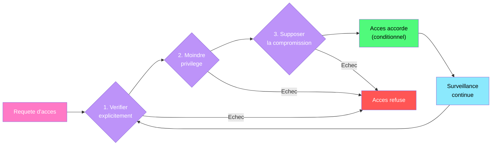
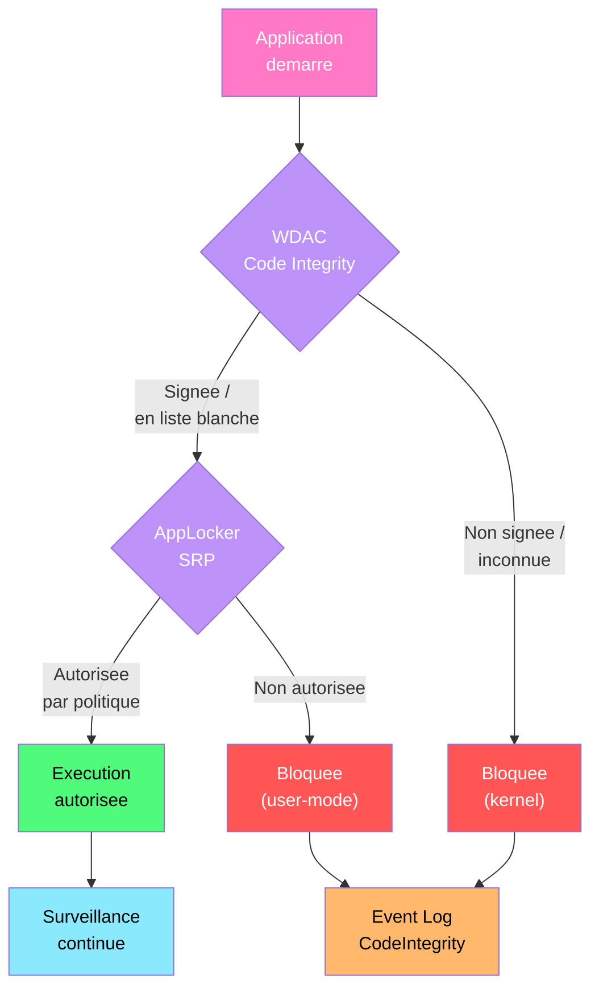

---
tags:
  - registre
  - zero-trust
  - vdi
  - citrix
  - vmware
  - avd
  - wdac
  - applocker
  - securite
---

# Zero Trust Architecture & VDI

!!! abstract "Ce que vous allez apprendre"
    - Appliquer les principes Zero Trust au durcissement du registre Windows
    - Configurer les cles d'attestation de sante (TPM, Secure Boot, HVCI) via le registre
    - Exploiter les indicateurs de conformite Conditional Access dans le registre
    - Optimiser le registre pour les environnements VDI (Citrix, VMware, Azure Virtual Desktop)
    - Gerer l'isolation des sessions et le registre multi-utilisateur
    - Configurer la micro-segmentation via les politiques de pare-feu Windows dans le registre
    - Deployer l'isolation applicative via WDAC et AppLocker depuis le registre
    - Scenario reel : implementer une baseline Zero Trust pour une main-d'oeuvre hybride

---

## Principes Zero Trust appliques au registre



Le modele Zero Trust repose sur trois piliers : verifier explicitement, appliquer le moindre privilege, et supposer la compromission. Chaque pilier se traduit par des controles de registre specifiques.

### Cartographie Zero Trust vers le registre

| Pilier | Controle registre | Cle |
|--------|-------------------|-----|
| Verifier explicitement | NLA obligatoire pour RDP | `...\Terminal Server\WinStations\RDP-Tcp\UserAuthentication = 1` |
| Verifier explicitement | MFA via Credential Guard | `...\DeviceGuard\EnableVirtualizationBasedSecurity = 1` |
| Moindre privilege | UAC au niveau maximal | `...\Policies\System\ConsentPromptBehaviorAdmin = 2` |
| Moindre privilege | Bloquer les comptes locaux distants | `...\Control\Lsa\TokenLeakDetectDelaySecs` |
| Supposer la compromission | Credential Guard | `...\DeviceGuard\LsaCfgFlags = 1` |
| Supposer la compromission | WDAC active | `...\CodeIntegrity\VerifiedAndReputablePolicyState` |
| Surveillance | PowerShell logging | `...\PowerShell\ScriptBlockLogging\EnableScriptBlockLogging = 1` |

```powershell
# Verify Zero Trust foundational controls
$ztControls = @(
    @{ Name = "UAC Enabled"; Path = "HKLM:\SOFTWARE\Microsoft\Windows\CurrentVersion\Policies\System"; Value = "EnableLUA"; Expected = 1 },
    @{ Name = "UAC Admin Prompt"; Path = "HKLM:\SOFTWARE\Microsoft\Windows\CurrentVersion\Policies\System"; Value = "ConsentPromptBehaviorAdmin"; Expected = 2 },
    @{ Name = "RDP NLA"; Path = "HKLM:\SYSTEM\CurrentControlSet\Control\Terminal Server\WinStations\RDP-Tcp"; Value = "UserAuthentication"; Expected = 1 },
    @{ Name = "NTLMv2 Only"; Path = "HKLM:\SYSTEM\CurrentControlSet\Control\Lsa"; Value = "LmCompatibilityLevel"; Expected = 5 },
    @{ Name = "Credential Guard"; Path = "HKLM:\SYSTEM\CurrentControlSet\Control\DeviceGuard"; Value = "EnableVirtualizationBasedSecurity"; Expected = 1 },
    @{ Name = "Secure Boot"; Path = "HKLM:\SYSTEM\CurrentControlSet\Control\SecureBoot\State"; Value = "UEFISecureBootEnabled"; Expected = 1 }
)

foreach ($ctrl in $ztControls) {
    $current = (Get-ItemProperty -Path $ctrl.Path -Name $ctrl.Value -ErrorAction SilentlyContinue).$($ctrl.Value)
    $status = if ($current -eq $ctrl.Expected) { "PASS" } else { "FAIL (current=$current)" }
    Write-Output "$($ctrl.Name) : $status"
}
```

```title="Resultat attendu"
UAC Enabled : PASS
UAC Admin Prompt : PASS
RDP NLA : PASS
NTLMv2 Only : PASS
Credential Guard : PASS
Secure Boot : PASS
```

!!! info "En resume"
    - Zero Trust se traduit par trois categories de controles registre : verification, moindre privilege, surveillance
    - Credential Guard et WDAC sont les piliers techniques du modele "supposer la compromission"
    - UAC et NLA assurent la verification explicite de l'identite
    - La surveillance continue (PowerShell logging, audit d'acces) boucle le cycle Zero Trust

---

## Attestation de sante : TPM, Secure Boot, HVCI

L'attestation de sante du poste est un prerequis Zero Trust. Avant d'accorder l'acces a une ressource, le systeme doit prouver son integrite materielle et logicielle.

### TPM (Trusted Platform Module)

```
HKLM\SYSTEM\CurrentControlSet\Services\TPM
HKLM\SOFTWARE\Microsoft\Tpm
```

| Valeur | Cle | Type | Description |
|--------|-----|------|-------------|
| `Start` | `Services\TPM` | REG_DWORD | Type de demarrage du service TPM |
| `IsEnabled` | `Microsoft\Tpm` | REG_DWORD | TPM active dans le firmware |
| `OwnedAuth` | `Microsoft\Tpm` | REG_SZ | Hash d'autorisation TPM |

```powershell
# Verify TPM status via registry and WMI
$tpmReg = Get-ItemProperty "HKLM:\SOFTWARE\Microsoft\Tpm" -ErrorAction SilentlyContinue
$tpmWmi = Get-WmiObject -Namespace "root\cimv2\Security\MicrosoftTpm" `
    -Class Win32_Tpm -ErrorAction SilentlyContinue

Write-Output "TPM Present       : $(if ($tpmWmi) { 'Yes' } else { 'No' })"
Write-Output "TPM Version       : $($tpmWmi.SpecVersion)"
Write-Output "TPM Activated     : $($tpmWmi.IsActivated_InitialValue)"
Write-Output "TPM Owned         : $($tpmWmi.IsOwned_InitialValue)"
Write-Output "TPM Registry Key  : $(if ($tpmReg) { 'Present' } else { 'Missing' })"
```

```title="Resultat attendu"
TPM Present       : Yes
TPM Version       : 2.0, 0, 1.38
TPM Activated     : True
TPM Owned         : True
TPM Registry Key  : Present
```

### Secure Boot

```
HKLM\SYSTEM\CurrentControlSet\Control\SecureBoot\State
```

```powershell
# Verify Secure Boot status
$sbPath = "HKLM:\SYSTEM\CurrentControlSet\Control\SecureBoot\State"
$sbState = Get-ItemProperty -Path $sbPath -ErrorAction SilentlyContinue

Write-Output "Secure Boot Enabled : $(if ($sbState.UEFISecureBootEnabled -eq 1) { 'Yes' } else { 'No' })"

# Cross-reference with Confirm-SecureBootUEFI
try {
    $confirmed = Confirm-SecureBootUEFI
    Write-Output "Confirm-SecureBootUEFI : $confirmed"
} catch {
    Write-Output "Confirm-SecureBootUEFI : Not supported on this platform"
}
```

```title="Resultat attendu"
Secure Boot Enabled : Yes
Confirm-SecureBootUEFI : True
```

### HVCI (Hypervisor-Protected Code Integrity)

```
HKLM\SYSTEM\CurrentControlSet\Control\DeviceGuard
HKLM\SYSTEM\CurrentControlSet\Control\DeviceGuard\Scenarios\HypervisorEnforcedCodeIntegrity
```

| Valeur | Type | Description |
|--------|------|-------------|
| `EnableVirtualizationBasedSecurity` | REG_DWORD | `1` = activer VBS |
| `RequirePlatformSecurityFeatures` | REG_DWORD | `1` = Secure Boot, `3` = Secure Boot + DMA |
| `Enabled` | REG_DWORD | `1` = activer HVCI (sous la sous-cle `Scenarios`) |
| `Locked` | REG_DWORD | `1` = verrouiller la configuration (redemarrage requis pour desactiver) |

```powershell
# Enable VBS and HVCI via registry
$dgPath = "HKLM:\SYSTEM\CurrentControlSet\Control\DeviceGuard"
$hvciPath = "$dgPath\Scenarios\HypervisorEnforcedCodeIntegrity"

# Enable Virtualization Based Security
Set-ItemProperty -Path $dgPath -Name "EnableVirtualizationBasedSecurity" -Value 1 -Type DWord
Set-ItemProperty -Path $dgPath -Name "RequirePlatformSecurityFeatures" -Value 3 -Type DWord

# Enable HVCI
New-Item -Path $hvciPath -Force | Out-Null
Set-ItemProperty -Path $hvciPath -Name "Enabled" -Value 1 -Type DWord
Set-ItemProperty -Path $hvciPath -Name "Locked" -Value 1 -Type DWord

# Enable Credential Guard
$credGuardPath = "$dgPath\Scenarios\CredentialGuard"
New-Item -Path $credGuardPath -Force | Out-Null
Set-ItemProperty -Path $credGuardPath -Name "Enabled" -Value 1 -Type DWord
Set-ItemProperty -Path $credGuardPath -Name "Locked" -Value 1 -Type DWord

# Verify Device Guard status
$dgInfo = Get-CimInstance -ClassName Win32_DeviceGuard -Namespace "root\Microsoft\Windows\DeviceGuard" `
    -ErrorAction SilentlyContinue
Write-Output "VBS Status           : $($dgInfo.VirtualizationBasedSecurityStatus)"
Write-Output "HVCI Running         : $($dgInfo.SecurityServicesRunning -contains 2)"
Write-Output "Credential Guard     : $($dgInfo.SecurityServicesRunning -contains 1)"
```

```title="Resultat attendu"
VBS Status           : 2
HVCI Running         : True
Credential Guard     : True
```

!!! warning "Redemarrage requis"
    L'activation de VBS, HVCI et Credential Guard necessite un redemarrage. Avec `Locked = 1`, la desactivation necesite egalement un redemarrage avec intervention physique.

!!! info "En resume"
    - TPM 2.0, Secure Boot et HVCI forment le triptyque d'attestation de sante materielle
    - VBS (Virtualization Based Security) est le prerequis de Credential Guard et HVCI
    - `RequirePlatformSecurityFeatures = 3` exige Secure Boot et protection DMA
    - Verrouillez les configurations avec `Locked = 1` pour empecher la desactivation sans redemarrage

---

## Conditional Access et indicateurs de conformite

Les solutions de gestion (Intune, SCCM) evaluent la conformite du poste en lisant des cles de registre specifiques. Ces indicateurs alimentent les politiques Conditional Access d'Azure AD / Entra ID.

### Indicateurs de conformite dans le registre

```
HKLM\SOFTWARE\Microsoft\PolicyManager\current\device
HKLM\SOFTWARE\Microsoft\IntuneManagementExtension\Policies
HKLM\SOFTWARE\Microsoft\EnterpriseDesktopAppManagement
```

| Valeur | Cle | Description |
|--------|-----|-------------|
| `BitLockerStatus` | `device\DeviceStatus` | Etat du chiffrement BitLocker |
| `AntivirusStatus` | `device\DeviceStatus` | Etat de l'antivirus |
| `FirewallStatus` | `device\DeviceStatus` | Etat du pare-feu |
| `SecureBootState` | `device\DeviceStatus` | Etat de Secure Boot |
| `CodeIntegrityState` | `device\DeviceStatus` | Etat de l'integrite de code |

```powershell
# Check device compliance indicators used by Conditional Access
$complianceChecks = @(
    @{
        Name = "BitLocker Encryption"
        Check = { (Get-BitLockerVolume -MountPoint "C:" -ErrorAction SilentlyContinue).ProtectionStatus -eq "On" }
    },
    @{
        Name = "Windows Firewall (Domain)"
        Check = {
            $fw = Get-ItemProperty "HKLM:\SOFTWARE\Policies\Microsoft\WindowsFirewall\DomainProfile" -ErrorAction SilentlyContinue
            $fw.EnableFirewall -eq 1
        }
    },
    @{
        Name = "Antivirus Active"
        Check = {
            $status = Get-MpComputerStatus -ErrorAction SilentlyContinue
            $status.RealTimeProtectionEnabled -eq $true
        }
    },
    @{
        Name = "Secure Boot"
        Check = {
            $sb = Get-ItemProperty "HKLM:\SYSTEM\CurrentControlSet\Control\SecureBoot\State" -ErrorAction SilentlyContinue
            $sb.UEFISecureBootEnabled -eq 1
        }
    },
    @{
        Name = "Credential Guard"
        Check = {
            $dg = Get-ItemProperty "HKLM:\SYSTEM\CurrentControlSet\Control\DeviceGuard" -ErrorAction SilentlyContinue
            $dg.EnableVirtualizationBasedSecurity -eq 1
        }
    }
)

foreach ($check in $complianceChecks) {
    $result = try { & $check.Check } catch { $false }
    $status = if ($result) { "Compliant" } else { "Non-Compliant" }
    Write-Output "$($check.Name) : $status"
}
```

```title="Resultat attendu"
BitLocker Encryption : Compliant
Windows Firewall (Domain) : Compliant
Antivirus Active : Compliant
Secure Boot : Compliant
Credential Guard : Compliant
```

!!! info "En resume"
    - Les indicateurs de conformite sous `HKLM\SOFTWARE\Microsoft\PolicyManager` alimentent Conditional Access
    - BitLocker, pare-feu, antivirus, Secure Boot et Credential Guard sont les cinq piliers de conformite
    - Intune et SCCM evaluent ces indicateurs pour autoriser ou bloquer l'acces aux ressources cloud
    - Un poste non conforme est redirige vers une page de remediation au lieu d'acceder aux donnees

---

## Optimisation VDI : Citrix, VMware, Azure Virtual Desktop

Les environnements VDI (Virtual Desktop Infrastructure) necessitent une optimisation specifique du registre pour les performances et la densite d'utilisateurs.

### Citrix Virtual Apps & Desktops

```
HKLM\SOFTWARE\Citrix\PortICA
HKLM\SOFTWARE\Policies\Citrix\VirtualDesktopAgent
HKLM\SOFTWARE\Citrix\Graphics
```

| Valeur | Cle | Type | Description |
|--------|-----|------|-------------|
| `DisableLogoffCheck` | `PortICA` | REG_DWORD | `1` = desactiver la verification de deconnexion |
| `EnableLossless` | `Graphics` | REG_DWORD | `0` = compression avec perte (meilleure perf) |
| `MaxFramesPerSecond` | `Graphics` | REG_DWORD | Limiter les FPS (15-30 pour VDI) |
| `DisableDesktopComposition` | `PortICA` | REG_DWORD | `1` = desactiver la composition graphique |

```powershell
# Citrix VDI optimization via registry
$citrixGraphics = "HKLM:\SOFTWARE\Citrix\Graphics"
$citrixPortICA = "HKLM:\SOFTWARE\Citrix\PortICA"

New-Item -Path $citrixGraphics -Force | Out-Null
New-Item -Path $citrixPortICA -Force | Out-Null

# Limit FPS for better density
Set-ItemProperty -Path $citrixGraphics -Name "MaxFramesPerSecond" -Value 24 -Type DWord

# Use lossy compression for better bandwidth
Set-ItemProperty -Path $citrixGraphics -Name "EnableLossless" -Value 0 -Type DWord

# Disable desktop composition
Set-ItemProperty -Path $citrixPortICA -Name "DisableDesktopComposition" -Value 1 -Type DWord

Write-Output "Citrix VDI optimization applied."
```

```title="Resultat attendu"
Citrix VDI optimization applied.
```

### VMware Horizon

```
HKLM\SOFTWARE\VMware, Inc.\VMware VDM\Agent\Configuration
HKLM\SOFTWARE\Policies\VMware, Inc.\VMware Blast
```

| Valeur | Cle | Type | Description |
|--------|-----|------|-------------|
| `MaxSessionTimeout` | `Agent\Configuration` | REG_DWORD | Timeout de session (minutes) |
| `MaxBandwidthKbps` | `VMware Blast` | REG_DWORD | Bande passante maximale (kbps) |
| `EncoderMaxFPS` | `VMware Blast` | REG_DWORD | FPS maximum de l'encodeur |
| `H264maxQP` | `VMware Blast` | REG_DWORD | Qualite H.264 (0-51, plus eleve = moins bonne qualite) |

```powershell
# VMware Horizon VDI optimization
$blastPath = "HKLM:\SOFTWARE\Policies\VMware, Inc.\VMware Blast\Config"
New-Item -Path $blastPath -Force | Out-Null

# Limit bandwidth and FPS
Set-ItemProperty -Path $blastPath -Name "MaxBandwidthKbps" -Value 25000 -Type DWord
Set-ItemProperty -Path $blastPath -Name "EncoderMaxFPS" -Value 24 -Type DWord
Set-ItemProperty -Path $blastPath -Name "H264maxQP" -Value 36 -Type DWord

# Disable USB redirection for security
$usbPath = "HKLM:\SOFTWARE\Policies\VMware, Inc.\VMware VDM\Agent\USB"
New-Item -Path $usbPath -Force | Out-Null
Set-ItemProperty -Path $usbPath -Name "DisableRemoteConfig" -Value 1 -Type DWord

Write-Output "VMware Horizon VDI optimization applied."
```

```title="Resultat attendu"
VMware Horizon VDI optimization applied.
```

### Azure Virtual Desktop (AVD)

```
HKLM\SOFTWARE\Policies\Microsoft\Windows NT\Terminal Services
HKLM\SYSTEM\CurrentControlSet\Control\Terminal Server\WinStations
```

| Valeur | Cle | Type | Description |
|--------|-----|------|-------------|
| `AVC444ModePreferred` | `Terminal Services` | REG_DWORD | `1` = mode AVC/H.264 444 (haute qualite) |
| `AVCHardwareEncodePreferred` | `Terminal Services` | REG_DWORD | `1` = encodage GPU |
| `SelectTransport` | `Terminal Services` | REG_DWORD | `1` = UDP prefere |
| `MaxIdleTime` | `WinStations\RDP-Tcp` | REG_DWORD | Timeout d'inactivite (ms) |
| `MaxDisconnectionTime` | `WinStations\RDP-Tcp` | REG_DWORD | Timeout de deconnexion (ms) |

```powershell
# Azure Virtual Desktop optimization
$tsPath = "HKLM:\SOFTWARE\Policies\Microsoft\Windows NT\Terminal Services"
New-Item -Path $tsPath -Force | Out-Null

# Enable AVC 444 mode for better visual quality
Set-ItemProperty -Path $tsPath -Name "AVC444ModePreferred" -Value 1 -Type DWord

# Prefer GPU hardware encoding
Set-ItemProperty -Path $tsPath -Name "AVCHardwareEncodePreferred" -Value 1 -Type DWord

# Prefer UDP transport (Shortpath)
Set-ItemProperty -Path $tsPath -Name "SelectTransport" -Value 1 -Type DWord

# Session timeouts
$rdpPath = "HKLM:\SYSTEM\CurrentControlSet\Control\Terminal Server\WinStations\RDP-Tcp"
Set-ItemProperty -Path $rdpPath -Name "MaxIdleTime" -Value 900000 -Type DWord         # 15 minutes
Set-ItemProperty -Path $rdpPath -Name "MaxDisconnectionTime" -Value 3600000 -Type DWord # 1 hour

# Disable printer redirection (security + performance)
Set-ItemProperty -Path $tsPath -Name "fDisableCpm" -Value 1 -Type DWord

Write-Output "Azure Virtual Desktop optimization applied."
```

```title="Resultat attendu"
Azure Virtual Desktop optimization applied.
```

### Cloud PC (Windows 365)

Un Cloud PC Windows 365 est une VM Windows hebergee dans Azure, geree par Microsoft et administree comme un poste via Intune. Le registre reste celui d'un poste Windows, mais le contexte materiel n'est pas le meme.

#### Differences registre entre Cloud PC et poste physique

| Point | Poste physique | Cloud PC |
|-------|----------------|----------|
| Firmware | UEFI local, accessible via BIOS/UEFI | Pas d'acces direct au firmware |
| TPM | Puce physique ou firmware TPM | vTPM expose au systeme |
| Disque OS | Local | Heberge dans Azure |
| Registre | Local | Identique fonctionnellement, mais latence de stockage differente |

```
HKLM\SOFTWARE\Microsoft\Virtual Machine\Guest\Parameters
HKLM\SYSTEM
```

| Valeur | Type | Effet |
|--------|------|-------|
| `HostName` | REG_SZ | Peut contenir le nom de l'hote Azure/Hyper-V |
| `HyperVisorPresent` | REG_DWORD | Signal de virtualisation a verifier selon build et image |

!!! warning "Detection Cloud PC"
    Ne basez pas un ciblage critique sur une seule cle. Combinez les signaux Intune, le join type, le modele de machine, `Win32_ComputerSystem.HypervisorPresent` et les cles Hyper-V guest si vous devez distinguer Cloud PC, AVD et VM interne.

#### Intune vs GPO pour Cloud PC

Cloud PC peut etre Microsoft Entra joined ou Microsoft Entra Hybrid Join. En Entra Join pur, la gestion attendue est Intune : Settings Catalog, profils de configuration ou OMA-URI. Les GPO AD ne s'appliquent que dans les scenarios hybrid avec ligne de vue domaine.

```
HKLM\SOFTWARE\Policies\Microsoft\Windows\MDM
```

| Valeur | Type | Donnees | Effet |
|--------|------|---------|-------|
| `MDMWinsOverGP` | REG_DWORD | `1` | Intune prioritaire sur GPO en cas de conflit |

Si vous avez encore besoin de GPO, documentez explicitement le design : Entra Hybrid Join, Azure AD Domain Services ou domaine AD joignable depuis le reseau Cloud PC. Sans cela, un troubleshooting GPO sur Cloud PC devient rapidement ambigu.

!!! quote "En resume"
    - Cloud PC utilise un registre Windows standard, mais tourne dans une VM geree par Microsoft.
    - Le vTPM et l'hyperviseur changent le diagnostic materiel, pas les cles de politique Windows.
    - En Entra Join pur, Intune pilote la configuration ; les GPO ne concernent que les designs hybrid.
    - `MDMWinsOverGP=1` clarifie la priorite Intune quand GPO et MDM configurent le meme parametre.

### Optimisation Windows generique pour VDI

```powershell
# Generic VDI Windows optimizations via registry
$explorerPath = "HKCU:\SOFTWARE\Microsoft\Windows\CurrentVersion\Explorer\Advanced"
$visualPath = "HKCU:\SOFTWARE\Microsoft\Windows\CurrentVersion\Explorer\VisualEffects"
$sysPath = "HKLM:\SOFTWARE\Microsoft\Windows\CurrentVersion\Policies\System"

# Disable animations and visual effects
Set-ItemProperty -Path $explorerPath -Name "TaskbarAnimations" -Value 0 -Type DWord
Set-ItemProperty -Path "HKCU:\Control Panel\Desktop" -Name "MenuShowDelay" -Value 0 -Type String
Set-ItemProperty -Path "HKCU:\Control Panel\Desktop\WindowMetrics" -Name "MinAnimate" -Value 0 -Type String

# Disable Windows Search indexing service
Set-Service -Name "WSearch" -StartupType Disabled -ErrorAction SilentlyContinue
Stop-Service -Name "WSearch" -ErrorAction SilentlyContinue

# Disable Superfetch / SysMain
Set-Service -Name "SysMain" -StartupType Disabled -ErrorAction SilentlyContinue
Stop-Service -Name "SysMain" -ErrorAction SilentlyContinue

# Disable Windows Tips
$contentPath = "HKCU:\SOFTWARE\Microsoft\Windows\CurrentVersion\ContentDeliveryManager"
New-Item -Path $contentPath -Force | Out-Null
Set-ItemProperty -Path $contentPath -Name "SoftLandingEnabled" -Value 0 -Type DWord
Set-ItemProperty -Path $contentPath -Name "SubscribedContent-338389Enabled" -Value 0 -Type DWord

# Reduce event log sizes for non-persistent VDI
$logNames = @("Application", "System")
foreach ($log in $logNames) {
    $logPath = "HKLM:\SYSTEM\CurrentControlSet\Services\EventLog\$log"
    Set-ItemProperty -Path $logPath -Name "MaxSize" -Value 5242880 -Type DWord  # 5 MB
}

Write-Output "Generic VDI Windows optimization applied."
```

```title="Resultat attendu"
Generic VDI Windows optimization applied.
```

!!! info "En resume"
    - Citrix : limiter les FPS (24), desactiver la composition graphique, utiliser la compression avec perte
    - VMware : controler la bande passante Blast, limiter l'encodeur FPS, desactiver la redirection USB
    - AVD : activer AVC 444 + encodage GPU + transport UDP Shortpath
    - Optimisations generiques : desactiver les animations, WSearch, SysMain et reduire les journaux

---

## Isolation des sessions et registre multi-utilisateur

En environnement VDI et RDS, plusieurs utilisateurs partagent le meme serveur. L'isolation du registre entre sessions est critique pour la securite et la confidentialite.

### Profils utilisateur et HKCU

```
HKLM\SOFTWARE\Microsoft\Windows NT\CurrentVersion\ProfileList
```

Chaque utilisateur connecte a une session RDS/VDI possede sa propre ruche HKCU chargee en memoire. Le registre isole automatiquement les sessions, mais certaines cles HKLM sont partagees.

```powershell
# List all loaded user profiles (active sessions)
$profilePath = "HKLM:\SOFTWARE\Microsoft\Windows NT\CurrentVersion\ProfileList"
Get-ChildItem $profilePath | ForEach-Object {
    $props = Get-ItemProperty $_.PSPath
    $sid = $_.PSChildName
    $loaded = Test-Path "Registry::HKU\$sid"
    [PSCustomObject]@{
        SID        = $sid
        Profile    = $props.ProfileImagePath
        Loaded     = $loaded
        LastLogon  = if ($props.LocalProfileLoadTimeHigh) { "Active" } else { "Cached" }
    }
} | Where-Object { $_.SID -match "S-1-5-21" } | Format-Table -AutoSize
```

```title="Resultat attendu"
SID                                            Profile                        Loaded LastLogon
---                                            -------                        ------ ---------
S-1-5-21-1234567890-1234567890-1234567890-1001 C:\Users\jdupont               True   Active
S-1-5-21-1234567890-1234567890-1234567890-1042 C:\Users\mmartin               True   Active
S-1-5-21-1234567890-1234567890-1234567890-1108 C:\Users\pdurand               False  Cached
```

### Isoler les parametres de registre entre sessions

```powershell
# Verify session isolation: each user has separate HKCU
$activeSessions = query user 2>&1 | Select-Object -Skip 1 | ForEach-Object {
    $fields = $_ -split "\s{2,}"
    [PSCustomObject]@{
        User      = $fields[0].Trim()
        SessionID = $fields[2].Trim()
        State     = $fields[3].Trim()
    }
} | Where-Object { $_.State -eq "Active" }

Write-Output "Active sessions : $($activeSessions.Count)"
$activeSessions | Format-Table -AutoSize

# Each session uses isolated HKCU via SID mapping
Write-Output "`nRegistry isolation verified via HKU hive:"
Get-ChildItem "Registry::HKU" | Where-Object { $_.Name -match "S-1-5-21" -and $_.Name -notmatch "_Classes" } |
    ForEach-Object { Write-Output "  $($_.Name)" }
```

```title="Resultat attendu"
Active sessions : 2

User      SessionID State
----      --------- -----
jdupont   2         Active
mmartin   3         Active

Registry isolation verified via HKU hive:
  HKEY_USERS\S-1-5-21-1234567890-1234567890-1234567890-1001
  HKEY_USERS\S-1-5-21-1234567890-1234567890-1234567890-1042
```

!!! info "En resume"
    - Chaque session VDI/RDS dispose de sa propre ruche HKCU isolee via le SID
    - La cle `ProfileList` enumere tous les profils connus et leur etat de chargement
    - L'isolation est native a Windows, mais les cles HKLM restent partagees entre toutes les sessions
    - Pour les environnements non-persistants, les profils sont detruits a la deconnexion

---

## Micro-segmentation via pare-feu Windows

La micro-segmentation est un pilier Zero Trust : chaque machine ne communique qu'avec les services strictement necessaires. Le pare-feu Windows, configure via le registre, permet cette granularite.

### Politiques de pare-feu dans le registre

```
HKLM\SOFTWARE\Policies\Microsoft\WindowsFirewall\DomainProfile
HKLM\SOFTWARE\Policies\Microsoft\WindowsFirewall\StandardProfile
HKLM\SOFTWARE\Policies\Microsoft\WindowsFirewall\PublicProfile
```

| Valeur | Type | Description |
|--------|------|-------------|
| `EnableFirewall` | REG_DWORD | `1` = activer le pare-feu pour ce profil |
| `DefaultInboundAction` | REG_DWORD | `1` = bloquer par defaut |
| `DefaultOutboundAction` | REG_DWORD | `0` = autoriser, `1` = bloquer |
| `DisableNotifications` | REG_DWORD | `1` = masquer les notifications |
| `LogFilePath` | REG_SZ | Chemin du fichier journal |
| `LogFileSize` | REG_DWORD | Taille maximale du journal (Ko) |
| `LogDroppedPackets` | REG_DWORD | `1` = journaliser les paquets bloques |
| `LogSuccessfulConnections` | REG_DWORD | `1` = journaliser les connexions reussies |

```powershell
# Zero Trust firewall: enable all profiles, block inbound by default, log everything
$profiles = @("DomainProfile", "StandardProfile", "PublicProfile")

foreach ($profile in $profiles) {
    $fwPath = "HKLM:\SOFTWARE\Policies\Microsoft\WindowsFirewall\$profile"
    $logPath = "$fwPath\Logging"
    New-Item -Path $logPath -Force | Out-Null

    # Enable firewall, block inbound
    Set-ItemProperty -Path $fwPath -Name "EnableFirewall" -Value 1 -Type DWord
    Set-ItemProperty -Path $fwPath -Name "DefaultInboundAction" -Value 1 -Type DWord
    Set-ItemProperty -Path $fwPath -Name "DefaultOutboundAction" -Value 0 -Type DWord
    Set-ItemProperty -Path $fwPath -Name "DisableNotifications" -Value 1 -Type DWord

    # Enable comprehensive logging
    Set-ItemProperty -Path $logPath -Name "LogFilePath" `
        -Value "%systemroot%\system32\LogFiles\Firewall\pfirewall.log" -Type String
    Set-ItemProperty -Path $logPath -Name "LogFileSize" -Value 32767 -Type DWord
    Set-ItemProperty -Path $logPath -Name "LogDroppedPackets" -Value 1 -Type DWord
    Set-ItemProperty -Path $logPath -Name "LogSuccessfulConnections" -Value 1 -Type DWord

    Write-Output "$profile : Firewall enabled, inbound blocked, logging active"
}
```

```title="Resultat attendu"
DomainProfile : Firewall enabled, inbound blocked, logging active
StandardProfile : Firewall enabled, inbound blocked, logging active
PublicProfile : Firewall enabled, inbound blocked, logging active
```

### Regles de micro-segmentation

```powershell
# Zero Trust micro-segmentation: allow only necessary traffic
# Example: workstation that only needs AD, DNS, DHCP, and a web app

# Remove all existing rules (start from zero)
Get-NetFirewallRule | Where-Object { $_.Group -ne "Core Networking" } |
    Remove-NetFirewallRule -ErrorAction SilentlyContinue

# Allow only essential services
$rules = @(
    @{ Name = "ZT-DNS"; Proto = "UDP"; Port = 53; Remote = "10.0.0.10,10.0.0.11"; Desc = "DNS servers" },
    @{ Name = "ZT-Kerberos"; Proto = "TCP"; Port = 88; Remote = "10.0.0.10,10.0.0.11"; Desc = "AD Kerberos" },
    @{ Name = "ZT-LDAP"; Proto = "TCP"; Port = 389; Remote = "10.0.0.10,10.0.0.11"; Desc = "AD LDAP" },
    @{ Name = "ZT-LDAPS"; Proto = "TCP"; Port = 636; Remote = "10.0.0.10,10.0.0.11"; Desc = "AD LDAPS" },
    @{ Name = "ZT-DHCP"; Proto = "UDP"; Port = 67; Remote = "Any"; Desc = "DHCP" },
    @{ Name = "ZT-WebApp"; Proto = "TCP"; Port = 443; Remote = "10.0.1.50"; Desc = "Internal web app" }
)

foreach ($rule in $rules) {
    New-NetFirewallRule -DisplayName $rule.Name -Direction Outbound `
        -Protocol $rule.Proto -RemotePort $rule.Port `
        -RemoteAddress $rule.Remote -Action Allow `
        -Description $rule.Desc -Profile Domain | Out-Null
    Write-Output "Rule created : $($rule.Name) -> $($rule.Proto)/$($rule.Port) to $($rule.Remote)"
}
```

```title="Resultat attendu"
Rule created : ZT-DNS -> UDP/53 to 10.0.0.10,10.0.0.11
Rule created : ZT-Kerberos -> TCP/88 to 10.0.0.10,10.0.0.11
Rule created : ZT-LDAP -> TCP/389 to 10.0.0.10,10.0.0.11
Rule created : ZT-LDAPS -> TCP/636 to 10.0.0.10,10.0.0.11
Rule created : ZT-DHCP -> UDP/67 to Any
Rule created : ZT-WebApp -> TCP/443 to 10.0.1.50
```

!!! info "En resume"
    - Zero Trust impose le blocage de tout le trafic entrant par defaut sur les trois profils
    - La journalisation complete (paquets bloques + connexions reussies) est obligatoire
    - La micro-segmentation autorise uniquement les flux necessaires (DNS, AD, application metier)
    - Les regles de pare-feu sont stockees sous `HKLM\SYSTEM\CurrentControlSet\Services\SharedAccess\Parameters\FirewallPolicy`

---

## Isolation applicative : WDAC et AppLocker



WDAC (Windows Defender Application Control) et AppLocker offrent deux niveaux d'isolation applicative. WDAC opere au niveau du noyau, AppLocker au niveau utilisateur.

### WDAC dans le registre

```
HKLM\SYSTEM\CurrentControlSet\Control\CI
HKLM\SOFTWARE\Policies\Microsoft\Windows\DeviceGuard
```

| Valeur | Cle | Type | Description |
|--------|-----|------|-------------|
| `VerifiedAndReputablePolicyState` | `CI` | REG_DWORD | Etat de la politique WDAC |
| `UMCIAuditMode` | `CI` | REG_DWORD | `1` = mode audit (ne bloque pas) |
| `ConfigCIPolicyFilePath` | `DeviceGuard` | REG_SZ | Chemin de la politique WDAC |
| `DeployConfigCIPolicy` | `DeviceGuard` | REG_DWORD | `1` = deployer la politique |

```powershell
# Check WDAC status via registry
$ciPath = "HKLM:\SYSTEM\CurrentControlSet\Control\CI"
$ciProps = Get-ItemProperty -Path $ciPath -ErrorAction SilentlyContinue

Write-Output "WDAC Policy State : $($ciProps.VerifiedAndReputablePolicyState)"
Write-Output "UMCI Audit Mode   : $(if ($ciProps.UMCIAuditMode -eq 1) { 'Audit (non-blocking)' } else { 'Enforced' })"

# Check for deployed WDAC policies
$policyDir = "C:\Windows\System32\CodeIntegrity\CIPolicies\Active"
if (Test-Path $policyDir) {
    $policies = Get-ChildItem $policyDir -Filter "*.cip"
    Write-Output "Active WDAC policies : $($policies.Count)"
    $policies | ForEach-Object { Write-Output "  $($_.Name) ($([math]::Round($_.Length / 1KB)) KB)" }
} else {
    Write-Output "Active WDAC policies : None"
}
```

```title="Resultat attendu"
WDAC Policy State : 2
UMCI Audit Mode   : Enforced
Active WDAC policies : 1
  {A244370E-44C9-4C06-B551-F6016E563076}.cip (42 KB)
```

### AppLocker dans le registre

```
HKLM\SOFTWARE\Policies\Microsoft\Windows\SrpV2
```

| Sous-cle | Description |
|----------|-------------|
| `SrpV2\Exe` | Regles pour les executables (.exe, .com) |
| `SrpV2\Dll` | Regles pour les DLL (rarement utilise, impact perf) |
| `SrpV2\Script` | Regles pour les scripts (.ps1, .bat, .cmd, .vbs, .js) |
| `SrpV2\Msi` | Regles pour les installateurs (.msi, .msp, .mst) |
| `SrpV2\Appx` | Regles pour les applications packagees (UWP) |

```powershell
# Check AppLocker configuration via registry
$srpPath = "HKLM:\SOFTWARE\Policies\Microsoft\Windows\SrpV2"
$categories = @("Exe", "Dll", "Script", "Msi", "Appx")

foreach ($cat in $categories) {
    $catPath = "$srpPath\$cat"
    if (Test-Path $catPath) {
        $rules = Get-ChildItem $catPath -ErrorAction SilentlyContinue
        $enforcement = (Get-ItemProperty $catPath -ErrorAction SilentlyContinue).EnforcementMode
        $mode = switch ($enforcement) {
            0 { "Audit" }
            1 { "Enforce" }
            default { "Not configured" }
        }
        Write-Output "$cat : $($rules.Count) rules, Mode = $mode"
    } else {
        Write-Output "$cat : Not configured"
    }
}

# Check AppLocker service
$appidSvc = Get-Service -Name "AppIDSvc" -ErrorAction SilentlyContinue
Write-Output "`nAppIDSvc : Status=$($appidSvc.Status), StartType=$($appidSvc.StartType)"
```

```title="Resultat attendu"
Exe : 5 rules, Mode = Enforce
Dll : Not configured
Script : 3 rules, Mode = Audit
Msi : 2 rules, Mode = Enforce
Appx : 1 rules, Mode = Enforce

AppIDSvc : Status=Running, StartType=Automatic
```

### Activer AppLocker en mode audit

```powershell
# Enable AppLocker audit mode for executables (safe first step)
$exePath = "HKLM:\SOFTWARE\Policies\Microsoft\Windows\SrpV2\Exe"
New-Item -Path $exePath -Force | Out-Null
Set-ItemProperty -Path $exePath -Name "EnforcementMode" -Value 0 -Type DWord  # 0 = Audit

# Ensure AppIDSvc is running
Set-Service -Name "AppIDSvc" -StartupType Automatic
Start-Service -Name "AppIDSvc" -ErrorAction SilentlyContinue

# Check audit events
$auditEvents = Get-WinEvent -LogName "Microsoft-Windows-AppLocker/EXE and DLL" `
    -MaxEvents 5 -ErrorAction SilentlyContinue
if ($auditEvents) {
    Write-Output "Recent AppLocker events :"
    $auditEvents | ForEach-Object {
        Write-Output "  [$($_.TimeCreated)] $($_.Message.Substring(0, [Math]::Min(100, $_.Message.Length)))..."
    }
} else {
    Write-Output "No AppLocker events found yet. Wait for application launches."
}
```

```title="Resultat attendu"
Recent AppLocker events :
  [2026-04-04 10:15:30] %SYSTEM32%\cmd.exe was allowed to run...
  [2026-04-04 10:15:28] %PROGRAMFILES%\Adobe\Acrobat DC\Reader\Acrobat.exe was allowed to run...
```

!!! info "En resume"
    - WDAC opere au niveau noyau (Code Integrity) et bloque les binaires non signes avant execution
    - AppLocker opere au niveau utilisateur et utilise des regles par categorie (Exe, Script, Msi, Appx)
    - Commencez toujours en mode audit (`EnforcementMode = 0`) avant de passer en mode blocage
    - Le service `AppIDSvc` doit etre demarrage automatique pour qu'AppLocker fonctionne

---

## Scenario : baseline Zero Trust pour une main-d'oeuvre hybride

### Contexte

L'entreprise passe a un modele hybride : 200 collaborateurs travaillent depuis le bureau, la maison ou en deplacement. Le RSSI exige une baseline Zero Trust garantissant que chaque poste — quelle que soit sa localisation — respecte les memes controles de securite avant d'acceder aux ressources.

### Etape 1 : definir la baseline Zero Trust

```powershell
# Zero Trust baseline definition
$ztBaseline = @{
    "Device Health" = @(
        @{ Name = "Secure Boot"; Path = "HKLM:\SYSTEM\CurrentControlSet\Control\SecureBoot\State"; Value = "UEFISecureBootEnabled"; Expected = 1 },
        @{ Name = "VBS Enabled"; Path = "HKLM:\SYSTEM\CurrentControlSet\Control\DeviceGuard"; Value = "EnableVirtualizationBasedSecurity"; Expected = 1 },
        @{ Name = "Credential Guard"; Path = "HKLM:\SYSTEM\CurrentControlSet\Control\DeviceGuard\Scenarios\CredentialGuard"; Value = "Enabled"; Expected = 1 },
        @{ Name = "HVCI"; Path = "HKLM:\SYSTEM\CurrentControlSet\Control\DeviceGuard\Scenarios\HypervisorEnforcedCodeIntegrity"; Value = "Enabled"; Expected = 1 }
    )
    "Access Control" = @(
        @{ Name = "UAC Enabled"; Path = "HKLM:\SOFTWARE\Microsoft\Windows\CurrentVersion\Policies\System"; Value = "EnableLUA"; Expected = 1 },
        @{ Name = "UAC Admin Consent"; Path = "HKLM:\SOFTWARE\Microsoft\Windows\CurrentVersion\Policies\System"; Value = "ConsentPromptBehaviorAdmin"; Expected = 2 },
        @{ Name = "NTLMv2 Only"; Path = "HKLM:\SYSTEM\CurrentControlSet\Control\Lsa"; Value = "LmCompatibilityLevel"; Expected = 5 },
        @{ Name = "RDP NLA"; Path = "HKLM:\SYSTEM\CurrentControlSet\Control\Terminal Server\WinStations\RDP-Tcp"; Value = "UserAuthentication"; Expected = 1 }
    )
    "Network Security" = @(
        @{ Name = "SMBv1 Disabled"; Path = "HKLM:\SYSTEM\CurrentControlSet\Services\LanmanServer\Parameters"; Value = "SMB1"; Expected = 0 },
        @{ Name = "Firewall Domain"; Path = "HKLM:\SOFTWARE\Policies\Microsoft\WindowsFirewall\DomainProfile"; Value = "EnableFirewall"; Expected = 1 },
        @{ Name = "Firewall Private"; Path = "HKLM:\SOFTWARE\Policies\Microsoft\WindowsFirewall\StandardProfile"; Value = "EnableFirewall"; Expected = 1 },
        @{ Name = "Firewall Public"; Path = "HKLM:\SOFTWARE\Policies\Microsoft\WindowsFirewall\PublicProfile"; Value = "EnableFirewall"; Expected = 1 }
    )
    "Monitoring" = @(
        @{ Name = "PS ScriptBlock Log"; Path = "HKLM:\SOFTWARE\Policies\Microsoft\Windows\PowerShell\ScriptBlockLogging"; Value = "EnableScriptBlockLogging"; Expected = 1 },
        @{ Name = "CMD Line Audit"; Path = "HKLM:\SOFTWARE\Microsoft\Windows\CurrentVersion\Policies\System\Audit"; Value = "ProcessCreationIncludeCmdLine_Enabled"; Expected = 1 }
    )
}
```

### Etape 2 : appliquer la baseline

```powershell
# Apply Zero Trust baseline
$totalControls = 0
$appliedControls = 0

foreach ($category in $ztBaseline.Keys) {
    Write-Output "=== $category ==="
    foreach ($ctrl in $ztBaseline[$category]) {
        $totalControls++
        $current = $null
        if (Test-Path $ctrl.Path) {
            $current = (Get-ItemProperty -Path $ctrl.Path -Name $ctrl.Value `
                -ErrorAction SilentlyContinue).$($ctrl.Value)
        }

        if ($current -ne $ctrl.Expected) {
            New-Item -Path $ctrl.Path -Force -ErrorAction SilentlyContinue | Out-Null
            Set-ItemProperty -Path $ctrl.Path -Name $ctrl.Value `
                -Value $ctrl.Expected -Type DWord
            Write-Output "  APPLIED : $($ctrl.Name) ($current -> $($ctrl.Expected))"
            $appliedControls++
        } else {
            Write-Output "  OK      : $($ctrl.Name)"
        }
    }
}

Write-Output "`n=== Summary ==="
Write-Output "Total controls    : $totalControls"
Write-Output "Already compliant : $($totalControls - $appliedControls)"
Write-Output "Applied now       : $appliedControls"
```

```title="Resultat attendu"
=== Device Health ===
  OK      : Secure Boot
  APPLIED : VBS Enabled (0 -> 1)
  APPLIED : Credential Guard ( -> 1)
  APPLIED : HVCI ( -> 1)
=== Access Control ===
  OK      : UAC Enabled
  OK      : UAC Admin Consent
  OK      : NTLMv2 Only
  OK      : RDP NLA
=== Network Security ===
  OK      : SMBv1 Disabled
  APPLIED : Firewall Domain ( -> 1)
  APPLIED : Firewall Private ( -> 1)
  APPLIED : Firewall Public ( -> 1)
=== Monitoring ===
  APPLIED : PS ScriptBlock Log ( -> 1)
  APPLIED : CMD Line Audit ( -> 1)

=== Summary ===
Total controls    : 14
Already compliant : 6
Applied now       : 8
```

### Etape 3 : verification de conformite a distance

```powershell
# Remote Zero Trust compliance verification across the hybrid fleet
$machines = Get-Content "C:\Admin\hybrid-fleet.txt"

$complianceResults = Invoke-Command -ComputerName $machines -ThrottleLimit 30 -ScriptBlock {
    $checks = @(
        @{ Name = "Secure Boot"; Path = "HKLM:\SYSTEM\CurrentControlSet\Control\SecureBoot\State"; Value = "UEFISecureBootEnabled"; Expected = 1 },
        @{ Name = "VBS"; Path = "HKLM:\SYSTEM\CurrentControlSet\Control\DeviceGuard"; Value = "EnableVirtualizationBasedSecurity"; Expected = 1 },
        @{ Name = "UAC"; Path = "HKLM:\SOFTWARE\Microsoft\Windows\CurrentVersion\Policies\System"; Value = "EnableLUA"; Expected = 1 },
        @{ Name = "NTLMv2"; Path = "HKLM:\SYSTEM\CurrentControlSet\Control\Lsa"; Value = "LmCompatibilityLevel"; Expected = 5 },
        @{ Name = "SMBv1 Off"; Path = "HKLM:\SYSTEM\CurrentControlSet\Services\LanmanServer\Parameters"; Value = "SMB1"; Expected = 0 },
        @{ Name = "FW Domain"; Path = "HKLM:\SOFTWARE\Policies\Microsoft\WindowsFirewall\DomainProfile"; Value = "EnableFirewall"; Expected = 1 },
        @{ Name = "PS Logging"; Path = "HKLM:\SOFTWARE\Policies\Microsoft\Windows\PowerShell\ScriptBlockLogging"; Value = "EnableScriptBlockLogging"; Expected = 1 }
    )

    $pass = 0
    foreach ($chk in $checks) {
        $current = (Get-ItemProperty -Path $chk.Path -Name $chk.Value -ErrorAction SilentlyContinue).$($chk.Value)
        if ($current -eq $chk.Expected) { $pass++ }
    }

    [PSCustomObject]@{
        Computer   = $env:COMPUTERNAME
        Total      = $checks.Count
        Compliant  = $pass
        Score      = [math]::Round(($pass / $checks.Count) * 100)
        ZeroTrust  = if ($pass -eq $checks.Count) { "READY" } else { "NOT READY" }
    }
}

$complianceResults | Sort-Object Score -Descending | Format-Table -AutoSize

# Fleet summary
$ready = ($complianceResults | Where-Object ZeroTrust -eq "READY").Count
$total = $complianceResults.Count
Write-Output "`nFleet Zero Trust readiness : $ready / $total machines ($([math]::Round(($ready/$total)*100))%)"
```

```title="Resultat attendu"
Computer       Total Compliant Score ZeroTrust
--------       ----- --------- ----- ---------
LAPTOP-JD-001      7         7   100 READY
DESKTOP-MM-PC      7         7   100 READY
LAPTOP-PD-002      7         6    86 NOT READY
DESKTOP-LB-PC      7         5    71 NOT READY

Fleet Zero Trust readiness : 2 / 4 machines (50%)
```

### Etape 4 : rapport de conformite pour le RSSI

```powershell
# Generate executive Zero Trust compliance report
$report = $complianceResults | Group-Object ZeroTrust | ForEach-Object {
    [PSCustomObject]@{
        Status   = $_.Name
        Count    = $_.Count
        Percent  = [math]::Round(($_.Count / $complianceResults.Count) * 100, 1)
    }
}

Write-Output "=== Zero Trust Compliance Report ==="
Write-Output "Date          : $(Get-Date -Format 'yyyy-MM-dd HH:mm')"
Write-Output "Fleet size    : $($complianceResults.Count) machines"
Write-Output ""
$report | Format-Table -AutoSize

# Export detailed report
$exportPath = "C:\Compliance\ZeroTrust_Report_$(Get-Date -Format 'yyyyMMdd').csv"
$complianceResults | Export-Csv -Path $exportPath -NoTypeInformation -Encoding UTF8
Write-Output "Detailed report exported to $exportPath"

# List machines needing remediation
$needsWork = $complianceResults | Where-Object ZeroTrust -eq "NOT READY"
if ($needsWork) {
    Write-Output "`nMachines requiring remediation :"
    $needsWork | ForEach-Object {
        Write-Output "  $($_.Computer) : $($_.Compliant)/$($_.Total) controls ($($_.Score)%)"
    }
}
```

```title="Resultat attendu"
=== Zero Trust Compliance Report ===
Date          : 2026-04-04 10:30
Fleet size    : 4 machines

Status    Count Percent
------    ----- -------
READY         2    50.0
NOT READY     2    50.0

Detailed report exported to C:\Compliance\ZeroTrust_Report_20260404.csv

Machines requiring remediation :
  LAPTOP-PD-002 : 6/7 controls (86%)
  DESKTOP-LB-PC : 5/7 controls (71%)
```

!!! info "En resume"
    - La baseline Zero Trust couvre quatre axes : sante du poste, controle d'acces, securite reseau, surveillance
    - Le deploiement via PSRemoting applique la baseline uniformement, quel que soit l'emplacement du poste
    - Le score de conformite par machine identifie les postes non prets pour le modele Zero Trust
    - Le rapport pour le RSSI fournit une vue executive du taux de preparation de la flotte

!!! tip "Voir aussi"
    - :material-shield-account: [Zero Trust et GPO : le futur de la configuration](../gpo-pour-les-admins/25-zero-trust.md) — GPO Admins
    - :material-shield-check: [Philosophie du hardening](../hardening-windows/01-philosophie.md) — Hardening
