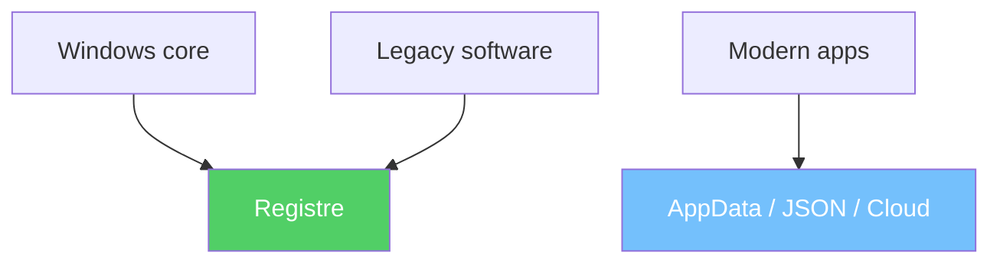

---
tags:
  - registre
  - débutant
  - introduction
---

# C'est quoi la base de registre ?

!!! abstract "Ce que vous allez apprendre"
    - Ce qu'est la base de registre en termes simples
    - Pourquoi elle existe
    - Ce qu'elle contient (et ce qu'elle ne contient pas)
    - Si c'est dangereux d'y toucher
    - Ou elle se trouve sur votre disque dur

!!! info "La bonne posture pour ce chapitre"
    Vous n'avez rien à mémoriser par cœur ici.

    Le but est simplement de vous faire une image mentale claire : la base de registre est un grand carnet de réglages que Windows consulte sans arrêt.

---

## Voyons d'abord un exemple concret

Appuyez sur ++win+r++, tapez `regedit`, puis naviguez jusqu'a :

```
HKEY_CURRENT_USER\Control Panel\Desktop
```

Cherchez la valeur **Wallpaper** dans la liste a droite. Vous voyez le chemin vers votre fond d'ecran actuel -- par exemple `C:\Users\VotreNom\Pictures\plage.jpg`.

Maintenant, ouvrez les **Parametres Windows** (++win+i++) et changez votre fond d'ecran. Revenez dans Regedit, appuyez sur ++f5++ pour rafraichir : la valeur **Wallpaper** a change. Windows vient de "noter" votre nouveau choix ici.

C'est ca, la **base de registre** : l'endroit ou Windows ecrit ses reglages pour s'en souvenir, meme apres un redemarrage.

!!! quote "En resume"
    - Quand vous changez un reglage (fond d'ecran, langue, etc.), Windows le "note" quelque part pour s'en souvenir apres un redemarrage.
    - Cet endroit, c'est la **base de registre**. Vous pouvez le voir vous-meme dans Regedit.

### Un deuxième exemple très concret : l'installation d'un logiciel

Quand vous installez un programme, Windows et l'installateur laissent souvent une petite fiche dans le registre.

Cette fiche permet au système de savoir comment afficher le logiciel dans la liste des programmes installés, quelle version vous avez, et quoi lancer si vous cliquez sur **Désinstaller**.

Un chemin très courant pour cela est :

```
HKEY_LOCAL_MACHINE\SOFTWARE\Microsoft\Windows\CurrentVersion\Uninstall
```

Dans cette zone, vous verrez souvent plusieurs sous-clés.

Chaque sous-clé correspond souvent à un logiciel, à une mise à jour, ou à un composant installé sur l'ordinateur.

C'est un peu comme une rangée de fiches dans un tiroir d'administration.

On y trouve souvent des valeurs très parlantes :
`DisplayName` pour le nom affiché,
`DisplayVersion` pour la version,
et `UninstallString` pour la commande de désinstallation.

!!! info "Traduction en langage courant"
    - `DisplayName` : le nom que vous lisez dans la liste des logiciels
    - `DisplayVersion` : la version actuellement installée
    - `UninstallString` : l'instruction qui permet de retirer proprement le programme

Autrement dit, le registre ne mémorise pas seulement vos préférences visuelles.

Il peut aussi servir de petite fiche d'identité pour les programmes installés sur la machine.

!!! quote "En résumé"
    - Lorsqu'un programme s'installe, il écrit souvent une fiche dans `HKEY_LOCAL_MACHINE\SOFTWARE\Microsoft\Windows\CurrentVersion\Uninstall`.
    - Cette fiche peut contenir le nom du logiciel, sa version et la commande utilisée pour le désinstaller.
    - Le registre sert donc aussi de mémoire pour les logiciels installés.

### Ce que ces deux exemples vous montrent déjà

Dans le premier exemple, Windows mémorise votre fond d'écran.

Dans le second, il mémorise la présence d'un logiciel installé.

Dans les deux cas, la logique est la même : une action bien réelle laisse une trace durable.

| Ce que vous faites | Ce que le registre garde | Pourquoi c'est utile |
|--------------------|--------------------------|----------------------|
| Changer le fond d'écran | Le chemin de l'image | Retrouver le bon fond au prochain démarrage |
| Installer un logiciel | Son nom, sa version, sa commande de désinstallation | Lister et gérer les programmes installés |

Le registre n'est donc pas une idée abstraite réservée aux experts.

C'est un outil de mémoire utilisé en permanence, même quand vous n'y pensez jamais.

!!! quote "En résumé"
    - Une action simple, comme changer un fond d'écran ou installer un programme, peut laisser une trace dans le registre.
    - Le registre sert avant tout à ce que Windows et les logiciels se "souviennent" de ce qu'il faut faire plus tard.

---

## L'analogie du carnet de reglages

Imaginez que votre ordinateur possede un immense carnet de notes. Dedans, il inscrit **tous** ses reglages :

- :material-image: Quel fond d'ecran afficher
- :material-rocket-launch: Quels programmes lancer au demarrage
- :material-keyboard: Quelle est la langue du clavier
- :material-folder: Ou est installe tel logiciel
- :material-desktop-tower: Quel est le nom de votre PC sur le reseau

Ce carnet, c'est la **base de registre** (ou *registre* tout court).

!!! info "En anglais"
    On l'appelle le *Windows Registry*. Vous verrez souvent ce terme dans les tutoriels en ligne.

!!! quote "En resume"
    - La base de registre est un immense carnet ou Windows note **tous** ses reglages : fond d'ecran, programmes au demarrage, langue du clavier, etc.
    - On l'appelle aussi *Windows Registry* en anglais.

### D'autres exemples du quotidien

Le plus surprenant, c'est que Windows écrit dans le registre même quand vous avez l'impression de ne rien faire de spécial.

Beaucoup de gestes banals du quotidien laissent une petite trace utile pour le système ou pour une application.

| Action que vous faites | Ce que Windows note dans le registre |
|------------------------|--------------------------------------|
| Vous rouvrez souvent les mêmes fichiers dans Word ou Excel | Une liste des derniers fichiers ouverts, appelée liste MRU (*Most Recently Used*) |
| Vous imprimez sur une imprimante précise | Le système peut mémoriser la dernière imprimante utilisée |
| Vous choisissez Chrome, Firefox ou Edge comme navigateur par défaut | Windows note quelle application doit ouvrir les liens web |
| Vous baissez ou augmentez le volume | Le niveau sonore ou certains réglages audio peuvent être mémorisés |
| Vous rebranchez une clé USB déjà connue | Windows garde des informations pour reconnaître ce périphérique plus vite |

!!! tip "MRU, retenez juste l'idée"
    "MRU" est un terme anglais qui signifie simplement "les derniers éléments utilisés".

    Pour un débutant, vous pouvez le traduire par : "la petite liste des choses récemment ouvertes".

!!! quote "En résumé"
    - Même des actions très ordinaires, comme ouvrir un document ou régler le volume, peuvent laisser une trace dans le registre.
    - Le registre travaille souvent en arrière-plan, sans vous demander votre avis ni vous afficher un message.

---

## Pourquoi ca existe ?

### Le bazar des annees 90

Dans les annees 90, chaque logiciel stockait ses reglages dans son propre petit fichier texte (les fichiers `.ini`).

C'est un peu comme si chaque commercant d'un marche notait ses prix sur sa propre feuille volante, dans un format different. Impossible de s'y retrouver !

Le probleme :

- :material-file-multiple: Des dizaines de fichiers de configuration eparpilles partout
- :material-format-list-bulleted: Aucune organisation commune
- :material-shield-off: Pas de protection : n'importe qui pouvait modifier n'importe quoi

### La solution de Microsoft

Microsoft a cree la base de registre pour **centraliser** tout ca dans un seul endroit structure, avec des regles de securite.

C'est comme remplacer toutes les feuilles volantes par **un grand classeur** bien organise, avec une serrure.


!!! quote "En resume"
    - Dans les annees 90, chaque logiciel stockait ses reglages dans ses propres fichiers `.ini`, sans organisation commune.
    - Microsoft a cree le registre pour **centraliser** tous les parametres dans un seul endroit structure et securise.

### Et aujourd'hui ?

Aujourd'hui, tout n'est plus stocké uniquement dans le registre.

Beaucoup d'applications modernes utilisent aussi `AppData`, de petits fichiers `JSON`, ou même une synchronisation dans le cloud.

Par exemple, une application récente peut garder son thème, sa dernière fenêtre ouverte ou vos préférés dans un fichier comme `C:\Users\VotreNom\AppData\Roaming\MonApp\settings.json`.

C'est un peu comme si certains outils modernes préféraient leur propre petit carnet spécialisé.

Mais le registre reste central pour plusieurs choses importantes :

- Windows lui-même
- Les logiciels anciens encore très nombreux
- Les réglages qui concernent toute la machine
- Les pilotes matériels



Quand votre carte réseau, votre carte son ou votre imprimante ont besoin de réglages bas niveau, le registre reste souvent au centre du jeu.

En clair, les outils modernes ont ajouté d'autres endroits de stockage, mais ils n'ont pas remplacé totalement le registre.

!!! quote "En résumé"
    - Certaines applications modernes stockent aussi leurs réglages dans `AppData`, des fichiers `JSON` ou le cloud.
    - Malgré cela, le registre reste central pour Windows lui-même, les logiciels anciens, la configuration système et les pilotes matériels.

---

## Quand Windows consulte le registre ?

Windows ne lit pas le registre une seule fois, puis l'oublie.

Il le consulte à différents moments de la vie normale du PC.


Voici trois moments très courants :

| Moment | Ce que Windows ou le logiciel peut aller chercher |
|--------|---------------------------------------------------|
| Au démarrage | Des services, des pilotes, des réglages machine |
| Quand vous ouvrez votre session | Vos préférences personnelles, comme le bureau ou certains choix d'affichage |
| Quand vous lancez une application | Les options de l'application, sa configuration, parfois sa licence ou son état |

Autrement dit, le registre n'est pas un vieux coffre oublié dans un coin.

C'est un annuaire de réglages consulté régulièrement.

!!! quote "En résumé"
    - Windows et les logiciels consultent le registre à plusieurs moments : au démarrage, à l'ouverture de session et au lancement d'une application.
    - Le registre est donc une mémoire active, pas un simple dépôt passif.

---

## Est-ce que c'est dangereux d'y toucher ?

Soyons honnetes : **oui, mais pas plus que de toucher au tableau electrique de votre maison**.

Si vous savez quel fusible actionner, tout ira bien. Si vous appuyez sur tous les boutons au hasard... vous risquez de couper le courant partout.

!!! tip "Bonne nouvelle"
    Contrairement a un tableau electrique, il est tres facile de **faire une sauvegarde** du registre avant d'y toucher. Si quelque chose ne va pas, il suffit de restaurer la sauvegarde. On verra comment au chapitre 5.

!!! danger "La regle d'or"
    Ne modifiez **jamais** quelque chose dans le registre si vous ne comprenez pas ce que ca fait. Toujours sauvegarder avant.

Pour rendre ce risque plus concret, voici deux petites histoires très réalistes.

!!! example "Scénario A : embêtant, mais généralement réparable"
    Une personne supprime par erreur la clé `Run` qui contient des programmes à lancer au démarrage.

    Résultat : ses petites applications habituelles ne se lancent plus en ouvrant la session, mais Windows démarre encore. C'est pénible, mais souvent corrigible avec une sauvegarde, une réparation du logiciel, ou en recréant la clé.

!!! example "Scénario B : beaucoup plus grave"
    Une personne supprime des éléments critiques sous `HKEY_LOCAL_MACHINE\SYSTEM`.

    Résultat : Windows peut ne plus savoir comment charger certains services ou certains pilotes essentiels, et la machine peut ne plus démarrer du tout. Là, on n'est plus dans le simple petit souci, mais dans la panne sérieuse.

!!! warning "Le message important"
    Supprimer ou modifier une petite zone "confort" peut seulement casser un comportement secondaire.

    Supprimer une zone vitale du système peut empêcher Windows de démarrer.

!!! tip "Le bon réflexe avant toute modification"
    - Faire une sauvegarde de la clé concernée
    - Noter le chemin exact avant de toucher quoi que ce soit
    - Éviter les manipulations "pour voir ce que ça fait"

La sauvegarde n'est donc pas un détail administratif.

C'est votre filet de sécurité.

!!! quote "En resume"
    - Modifier le registre n'est pas dangereux si on **sauvegarde avant** et qu'on comprend ce qu'on fait.
    - En cas d'erreur, il suffit de restaurer la sauvegarde (on verra comment au chapitre 5).

---

## Ce que la base de registre contient

| Categorie | Exemples |
|-----------|----------|
| Reglages de Windows | Apparence, comportement, reseau, securite |
| Configuration des logiciels | Preferences de chaque application installee |
| Associations de fichiers | Quel programme ouvre les `.pdf`, les `.jpg`, etc. |
| Comptes utilisateurs | Chaque utilisateur et ses preferences |
| Services et pilotes | Les composants materiels et services systeme |

### Les types de données

Quand vous regardez le registre dans Regedit, vous ne voyez pas seulement des noms de réglages.

Vous voyez aussi leur **type**.

Pour l'instant, pas besoin d'apprendre toute la liste.

Les trois types ci-dessous suffisent largement pour débuter sans se perdre.

| Type | Ce que c'est | Exemple |
|------|--------------|---------|
| `REG_SZ` | Une valeur texte | Un nom de logiciel ou un chemin comme `C:\Program Files\MonApp` |
| `REG_DWORD` | Un nombre | `0` pour désactivé, `1` pour activé |
| `REG_BINARY` | Des données binaires brutes | Des informations techniques rarement modifiées à la main |

!!! tip "Pour l'instant, retenez juste l'idée"
    Pour l'instant, retenez juste que certains réglages sont du texte, d'autres des chiffres.

    Les données binaires, elles, sont plutôt du domaine "on ne touche pas sans raison très précise".

!!! quote "En résumé"
    - Dans le registre, un réglage n'est pas seulement un nom : il a aussi un type.
    - Pour débuter, retenez surtout `REG_SZ` pour le texte, `REG_DWORD` pour les nombres et `REG_BINARY` pour les données brutes.

### Clé, valeur, donnée : trois mots à distinguer

Ces trois mots reviennent tout le temps dans les tutoriels.

Mieux vaut les séparer tout de suite pour ne pas tout mélanger.

| Mot | En langage simple | Analogie |
|-----|-------------------|----------|
| Clé | Un "dossier" de réglages | Un tiroir |
| Valeur | Un réglage à l'intérieur de la clé | Une fiche dans le tiroir |
| Donnée | Le contenu réel de cette valeur | Ce qui est écrit sur la fiche |

Prenons un exemple simple :

- La clé serait `HKEY_CURRENT_USER\Control Panel\Desktop`
- La valeur serait `Wallpaper`
- La donnée serait `C:\Users\VotreNom\Pictures\plage.jpg`

Vu comme ça, le vocabulaire devient beaucoup moins impressionnant.

Vous n'êtes pas face à un langage mystique.

Vous êtes juste face à des dossiers, des noms, et des contenus.

!!! quote "En résumé"
    - Une clé ressemble à un dossier.
    - Une valeur ressemble à un réglage nommé.
    - La donnée est simplement le contenu réel de ce réglage.

## Ce qu'elle ne contient **pas**

!!! warning "Idees recues"
    Le registre ne contient **aucun** de vos fichiers personnels.

| Ce qui n'est PAS dedans | Ou c'est en realite |
|------------------------|---------------------|
| Vos documents, photos, videos | Dans vos dossiers personnels |
| Les logiciels eux-memes (les `.exe`) | Sur le disque dur (ex. `C:\Program Files`) |
| Vos mots de passe du navigateur | Dans le stockage securise du navigateur |

Pour reprendre notre analogie : le carnet de reglages note "le fond d'ecran est `plage.jpg`" mais ne contient pas la photo elle-meme.

!!! quote "En resume"
    - Le registre contient les **reglages** de Windows et des logiciels : apparence, associations de fichiers, comptes utilisateurs, services.
    - Il ne contient **pas** vos fichiers personnels (documents, photos, videos) ni les programmes eux-memes.

### Pourquoi on confond souvent le registre et le disque dur

La confusion est normale.

Quand on voit un chemin comme `C:\Users\VotreNom\Pictures\plage.jpg` dans le registre, on peut croire que le fichier est "dans" le registre.

En réalité, le registre contient juste une information **à propos** du fichier.

Un peu comme un carnet d'adresses contient le numéro d'une personne, mais pas la personne elle-même.

| Le registre dit | Ce qui existe réellement ailleurs |
|-----------------|-----------------------------------|
| "Le fond d'écran est ici" | Le fichier image est sur le disque |
| "Ce logiciel est installé" | Les fichiers du logiciel sont dans `Program Files` ou ailleurs |
| "Ce navigateur est par défaut" | Le navigateur lui-même reste une application séparée |

!!! quote "En résumé"
    - Le registre stocke surtout des informations *sur* des choses, pas les choses elles-mêmes.
    - Il pointe, il décrit, il mémorise, mais il ne remplace pas vos fichiers ni vos programmes.

---

## Ou se trouve-t-elle sur le disque ?

La base de registre n'est pas un fichier unique. Elle est repartie en plusieurs fichiers caches :

| Emplacement | Ce qu'il contient |
|-------------|-------------------|
| `C:\Windows\System32\config\` | Les fichiers principaux du systeme |
| `C:\Users\VotreNom\NTUSER.DAT` | Votre configuration personnelle |

!!! info "Fichiers proteges"
    Ces fichiers sont **verrouilles** par Windows en permanence. Vous ne pouvez pas les ouvrir avec le Bloc-notes ou les copier tant que Windows fonctionne. C'est normal et c'est une protection.

### Pourquoi il y a plusieurs fichiers

Windows sépare certaines parties du registre pour une raison simple :

tout n'a pas la même fonction, et tout ne doit pas être mélangé dans un seul gros bloc.

Les réglages de la machine vivent plutôt côté système.

Vos réglages personnels, eux, vivent plutôt dans votre profil utilisateur.

C'est un peu comme avoir un classeur commun pour toute la maison, puis un petit carnet personnel pour chaque habitant.

Cela permet aussi à Windows de charger seulement ce qu'il faut, au bon moment.

!!! quote "En résumé"
    - Le registre n'est pas stocké dans un seul gros fichier.
    - Windows sépare les informations système et les informations utilisateur dans plusieurs fichiers cachés et protégés.

!!! quote "En resume"
    - Le registre est reparti en plusieurs fichiers caches : les fichiers systeme dans `C:\Windows\System32\config\` et votre profil dans `C:\Users\VotreNom\NTUSER.DAT`.
    - Ces fichiers sont verrouilles par Windows et ne peuvent pas etre ouverts directement.

---

## Comment lire un chemin de registre sans paniquer ?

Les chemins de registre impressionnent souvent au premier regard.

Ils sont longs, remplis de barres obliques inverses, et donnent l'impression d'être réservés aux techniciens.

En réalité, ils se lisent presque comme un chemin de dossiers.

Prenons cet exemple :

```
HKEY_CURRENT_USER\Software\Microsoft\Windows\CurrentVersion
```

| Morceau du chemin | Comment le comprendre |
|-------------------|-----------------------|
| `HKEY_CURRENT_USER` | On est dans la zone de l'utilisateur actuel |
| `Software` | On parle de logiciels |
| `Microsoft` | On regarde les réglages liés à Microsoft |
| `Windows` | On descend dans la partie Windows |
| `CurrentVersion` | On arrive dans la zone de la version actuelle |

Chaque morceau vous emmène un peu plus loin dans l'arborescence.

C'est exactement la même logique que `C:\Dossiers\Photos\Vacances`, sauf qu'ici on parcourt des réglages.

!!! tip "Le bon réflexe"
    Ne cherchez pas à comprendre tout le chemin d'un seul coup.

    Lisez-le morceau par morceau, comme une adresse postale qu'on découpe en pays, ville, rue, puis numéro.

!!! quote "En résumé"
    - Un chemin de registre se lit segment par segment, comme un chemin de dossiers.
    - Il n'a rien de magique : c'est simplement une adresse pour retrouver un réglage précis.

---

## Comment on y accede ?

Windows fournit un outil integre appele **Regedit** (l'editeur du registre).

C'est l'equivalent d'un explorateur de fichiers, mais au lieu de naviguer dans vos dossiers, vous naviguez dans les **reglages** de Windows.

Le chapitre suivant vous guide pas a pas dans vos premiers pas avec Regedit.

!!! quote "En resume"
    - On accede au registre avec **Regedit**, un outil integre a Windows qui fonctionne comme un explorateur de fichiers pour les reglages.
    - Le chapitre suivant vous guide pas a pas dans vos premiers pas avec cet outil.

### Ce que vous ferez dans la suite du livre

Pour l'instant, vous n'avez besoin que d'une idée simple : le registre est une mémoire de réglages.

Dans les chapitres suivants, vous allez progresser par petites marches, sans vous jeter dans le grand bain.

| Suite du parcours | Ce que vous y ferez |
|-------------------|---------------------|
| Chapitre 2 | Ouvrir Regedit et se repérer dans l'interface |
| Chapitre 3 | Comprendre la structure des clés et des ruches principales |
| Chapitre 4 | Voir comment une modification se fait proprement |
| Chapitre 5 | Apprendre à sauvegarder avant toute manipulation |

L'idée est de construire des réflexes sains avant de toucher à quoi que ce soit.

Observer d'abord.

Comprendre ensuite.

Modifier seulement à la fin, et avec sauvegarde.

!!! quote "En résumé"
    - La suite du livre avance dans l'ordre : observer, comprendre, sauvegarder, puis modifier.
    - Vous n'avez donc pas besoin d'être "technique" dès maintenant pour continuer.

---

!!! quote "En resume"
    | Question | Reponse |
    |----------|---------|
    | C'est quoi ? | La base de donnees centrale des reglages de Windows |
    | Une analogie ? | Un grand carnet ou Windows note tous ses reglages |
    | C'est dangereux ? | Pas si on sauvegarde avant et qu'on sait ce qu'on modifie |
    | Ca contient mes fichiers ? | Non, uniquement des parametres de configuration |
    | Ou c'est stocke ? | Dans des fichiers caches et proteges par Windows |
    | Comment on y accede ? | Avec l'outil **Regedit** integre a Windows |
