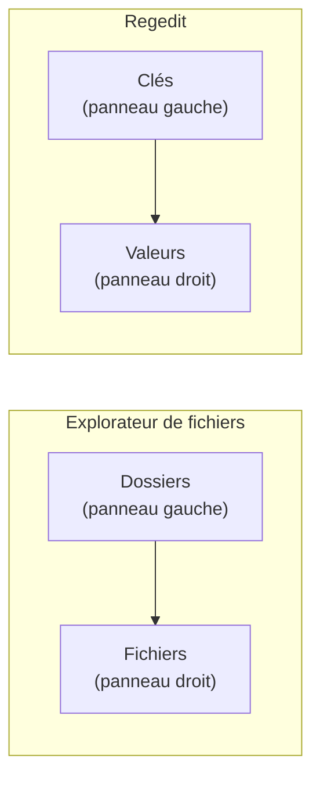

---
tags:
  - registre
  - débutant
  - regedit
---

# Premiers pas avec Regedit

!!! abstract "Ce que vous allez apprendre"
    - Comment ouvrir Regedit (deux methodes)
    - Comprendre l'interface : panneau gauche, panneau droit
    - Naviguer dans l'arborescence
    - Lire les differents types de valeurs
    - Utiliser la barre d'adresse et les favoris
    - Votre premier exercice : observer sans toucher

---

## Lancer Regedit

### Methode 1 : la plus rapide

1. Appuyer sur ++win+r++ (la touche Windows + la lettre R)
2. Taper `regedit`
3. Appuyer sur ++enter++
4. Cliquer **Oui** sur la demande d'autorisation administrateur

Vous devriez voir apparaitre cette fenetre :

```
┌─────────────────────────────────────────────────────────────────┐
│  Éditeur du Registre                                            │
│  Fichier  Édition  Affichage  Favoris  ?                        │
├──────────────────────────┬──────────────────────────────────────┤
│  ▶ Ordinateur            │  (rien pour l'instant)               │
│    ▶ HKEY_CLASSES_ROOT   │                                      │
│    ▶ HKEY_CURRENT_USER   │                                      │
│    ▶ HKEY_LOCAL_MACHINE  │                                      │
│    ▶ HKEY_USERS          │                                      │
│    ▶ HKEY_CURRENT_CONFIG │                                      │
└──────────────────────────┴──────────────────────────────────────┘
```

### Methode 2 : via la recherche

1. Cliquer sur la barre de recherche dans la barre des taches
2. Taper `regedit`
3. Cliquer sur **Editeur du Registre**
4. Confirmer l'autorisation administrateur

!!! info "Pourquoi une demande d'autorisation ?"
    Regedit peut modifier des parametres critiques du systeme. Windows vous demande de confirmer que c'est bien **vous** qui l'avez lance, et non un programme malveillant. C'est comme un vigile qui verifie votre badge avant de vous laisser entrer dans la salle des serveurs.

!!! quote "En resume"
    - Pour ouvrir Regedit : ++win+r++ puis tapez `regedit` et confirmez l'autorisation administrateur.
    - Vous pouvez aussi passer par la barre de recherche du menu Demarrer.

---

## Decouvrir l'interface

L'editeur du registre ressemble beaucoup a l'**explorateur de fichiers**. Et ce n'est pas un hasard : la logique est la meme !



| Explorateur de fichiers | Regedit |
|:-----------------------:|:-------:|
| Dossiers | Cles |
| Fichiers | Valeurs |
| Contenu d'un fichier | Donnees d'une valeur |

- **Panneau de gauche** : l'arborescence des cles (comme les dossiers)
- **Panneau de droite** : les valeurs contenues dans la cle selectionnee (comme les fichiers dans un dossier)

### Clé, sous-clé et valeur : le trio à retenir

Trois mots reviennent tout le temps dans le registre.

Si vous retenez bien ces trois mots, la suite devient beaucoup plus simple.

| Mot | En langage courant | Exemple |
|-----|--------------------|---------|
| **Clé** | Un dossier de réglages | `HKEY_CURRENT_USER\Software` |
| **Sous-clé** | Un sous-dossier de réglages | `HKEY_CURRENT_USER\Software\MonApp` |
| **Valeur** | Le réglage concret stocké dans la clé | `Theme = Clair` |

```text
HKEY_CURRENT_USER
└── Software
    └── MonApp
        ├── Theme = Clair
        └── TaillePolice = 14
```

Dans cet exemple :

- `MonApp` est une **clé** ;
- `Theme` est une **valeur** ;
- `Clair` est la **donnée** enregistrée dans cette valeur.

!!! example "Image mentale"
    Imaginez un classeur de recettes.

    La **clé** est le classeur.

    La **sous-clé** est un intercalaire comme "Desserts".

    La **valeur** est une fiche précise, par exemple "Temps de cuisson = 30 minutes".

!!! info "Pourquoi cette distinction est importante"
    Beaucoup de tutoriels disent : "allez dans telle clé, puis modifiez telle valeur".

    Si vous confondez les deux, vous pouvez chercher longtemps au mauvais endroit.

!!! quote "En résumé"
    - Une **clé** ressemble à un dossier.
    - Une **sous-clé** est une clé située à l'intérieur d'une autre.
    - Une **valeur** est le réglage affiché dans le panneau de droite.

!!! quote "En resume"
    - Regedit fonctionne comme l'Explorateur de fichiers : les cles (gauche) sont les dossiers, les valeurs (droite) sont les fichiers.
    - Chaque valeur a un **nom**, un **type** et des **donnees**.

---

## Naviguer dans l'arborescence

### Les 5 branches principales

L'arborescence commence par 5 grandes branches. Pas besoin de toutes les retenir pour l'instant !

Voici les **deux seules** que vous utiliserez 90 % du temps :

| Branche | Abreviation | Ce qu'elle contient | Analogie |
|---------|:-----------:|-------------------|----------|
| `HKEY_CURRENT_USER` | HKCU | **Vos** reglages personnels | Votre casier personnel |
| `HKEY_LOCAL_MACHINE` | HKLM | Les reglages de **la machine** | Le tableau de bord commun |

Les trois autres branches existent aussi.

Vous n'allez presque jamais les modifier au debut, mais il est utile de savoir **a quoi elles servent** quand vous les croisez.

| Branche | Ce qu'elle contient | À retenir |
|---------|---------------------|-----------|
| `HKEY_CLASSES_ROOT` (`HKCR`) | Les associations de fichiers et de protocoles : quel programme ouvre un `.pdf`, un `.jpg`, un lien `mailto`, etc. | Rarement modifiée directement. |
| `HKEY_USERS` (`HKU`) | Les profils de tous les utilisateurs de la machine. | `HKCU` est un raccourci vers votre profil actif. |
| `HKEY_CURRENT_CONFIG` (`HKCC`) | La configuration matérielle chargée au démarrage. | Très technique, quasi jamais modifiée. |

!!! note "Retenez surtout"
    Dans la vraie vie d'un débutant, **HKCU** et **HKLM** couvrent environ 90 % des cas.

    Si un tutoriel ne précise rien, il vous emmènera très souvent dans l'une de ces deux branches.

!!! quote "En résumé"
    - Les cinq grandes branches sont les portes d'entrée du registre.
    - Pour débuter, concentrez-vous surtout sur **HKCU** et **HKLM**.
    - Quand vous voyez **HKCR**, **HKU** ou **HKCC**, pensez : "plus technique, à manipuler plus tard".

### Se deplacer dans l'arbre

Trois facons de naviguer :

| Action | Comment faire |
|--------|---------------|
| Ouvrir une cle | Cliquer sur la fleche `▶` a gauche |
| Developper rapidement | Double-cliquer sur le nom de la cle |
| Navigation au clavier | Fleches ++arrow-up++ ++arrow-down++ pour monter/descendre, ++arrow-right++ pour ouvrir, ++arrow-left++ pour fermer |

### La barre d'adresse (votre meilleure amie)

Depuis Windows 10, Regedit possede une **barre d'adresse** en haut de la fenetre.

Vous pouvez y coller directement un chemin copie depuis un tutoriel :

```
HKEY_CURRENT_USER\Software\Microsoft\Windows\CurrentVersion\Explorer\Advanced
```

!!! tip "Astuce du pro"
    Quand un tutoriel vous indique un chemin de registre, **copiez-le** et collez-le dans la barre d'adresse de Regedit. C'est beaucoup plus rapide (et moins risque) que de naviguer clic par clic.

### Lire un chemin comme une adresse

Un chemin de registre peut sembler intimidant la premiere fois.

En realite, il se lit comme une adresse postale, morceau par morceau.

Prenons cet exemple :

```
HKEY_CURRENT_USER\Software\Microsoft\Windows\CurrentVersion\Explorer\Advanced
```

| Morceau du chemin | Ce que cela veut dire |
|-------------------|-----------------------|
| `HKEY_CURRENT_USER` | On part de **vos** réglages personnels |
| `Software` | On entre dans la zone des logiciels |
| `Microsoft` | On cible un logiciel ou composant Microsoft |
| `Windows` | On descend vers les réglages liés à Windows |
| `CurrentVersion` | On vise la version actuellement utilisée |
| `Explorer` | On parle de l'Explorateur Windows |
| `Advanced` | On arrive dans les réglages avancés |

!!! example "Traduction en français courant"
    Ce chemin veut dire :

    "Dans mes réglages personnels, dans les logiciels Microsoft, puis dans Windows, puis dans l'Explorateur, ouvre les options avancées."

!!! info "Pourquoi les chemins sont longs"
    Le registre classe les informations par familles.

    C'est pratique pour Windows, mais un peu verbeux pour nous.

    La barre d'adresse sert justement à éviter de cliquer quinze fois de suite.

---

## Comprendre ce qu'on voit

Quand vous cliquez sur une cle dans le panneau de gauche, le panneau de droite affiche ses **valeurs**. Chaque ligne a trois colonnes :

| Colonne | Signification | Analogie |
|---------|--------------|----------|
| **Nom** | Le nom du reglage | L'etiquette sur un bouton |
| **Type** | Le format des donnees | Est-ce un interrupteur ? Un curseur ? Un champ texte ? |
| **Donnees** | La valeur actuelle | La position du bouton ou le texte saisi |

### La valeur (Par défaut)

Chaque clé possède une valeur spéciale appelée **`(Par défaut)`**.

Dans Regedit, elle apparaît souvent en italique.

Cette valeur est un peu particulière : elle existe presque toujours, même quand elle est vide.

Très souvent, vous verrez simplement qu'elle n'est **pas définie**.

Ce n'est pas une erreur.

Cela veut juste dire qu'aucune donnée n'a été enregistrée dedans.

Certains programmes s'en servent pour stocker la valeur principale d'une clé.

Un cas fréquent est celui des associations de fichiers, où la valeur par défaut peut indiquer le programme lié à une extension.

Voici à quoi cela ressemble :

```text
Nom : (Par défaut) | Type : REG_SZ | Données : (valeur non définie)
```

!!! info "À ne pas confondre"
    **`(Par défaut)`** n'est pas le "réglage recommandé" par Windows.

    C'est juste le nom spécial d'une valeur prévue par le registre.

!!! example "Exemple simple"
    Si une clé représente le type de fichier `.pdf`, la valeur **`(Par défaut)`** peut contenir le nom interne du programme associé.

    En langage humain : "quand je double-clique sur ce type de fichier, quel logiciel doit s'ouvrir ?"

!!! quote "En résumé"
    - Chaque clé possède une valeur spéciale nommée **`(Par défaut)`**.
    - Elle est souvent vide, et c'est normal.
    - Certains logiciels l'utilisent pour stocker la valeur principale de la clé.

### Les 3 types les plus courants

Pour un debutant, seuls trois types comptent vraiment :

| Type affiche | En langage humain | Exemple concret |
|:------------:|:-----------------:|:---------------:|
| `REG_SZ` | Du texte | `C:\Program Files\MonApp` |
| `REG_DWORD` | Un nombre | `0x00000001` (= 1) |
| `REG_EXPAND_SZ` | Du texte avec des variables | `%USERPROFILE%\Documents` |

!!! tip "Les nombres dans Regedit"
    Regedit affiche les DWORD en **hexadecimal** (base 16). Pas de panique ! Quand vous modifiez une valeur DWORD, vous pouvez choisir **Decimal** pour utiliser des nombres normaux (1, 2, 3...).

    Pour les valeurs simples comme `0` et `1`, c'est identique dans les deux bases. Ouf !

!!! quote "En resume"
    - Les trois types de valeurs les plus courants sont : `REG_SZ` (texte), `REG_DWORD` (nombre) et `REG_EXPAND_SZ` (texte avec variables).
    - Les DWORD sont affiches en hexadecimal, mais vous pouvez choisir **Decimal** lors de la modification.

### Rechercher dans le registre

Quand on ne connait pas le chemin exact, la recherche peut aider.

Le raccourci le plus utile est ++ctrl+f++.

Il ouvre la boite de dialogue **Rechercher**.

Dans cette fenetre, vous pouvez choisir **ce que Regedit doit chercher** :

| Option | Ce que Regedit cherche | Quand c'est utile |
|--------|------------------------|-------------------|
| **Clés** | Les noms des clés dans le panneau de gauche | Quand vous cherchez un dossier de réglages |
| **Valeurs** | Les noms des valeurs dans le panneau de droite | Quand vous connaissez le nom d'un réglage |
| **Données** | Le contenu stocké dans les valeurs | Quand vous connaissez un texte, un chemin ou un numéro |

Vous pouvez cocher ou décocher ces cases.

Regedit cherchera seulement dans les catégories sélectionnées.

!!! tip "Le bon réflexe"
    Pour la plupart des recherches de débutant, cochez **Valeurs** + **Données** en même temps.

    C'est le duo le plus efficace pour retrouver un réglage sans connaître son emplacement exact.

!!! example "Exemple concret"
    Vous cherchez un programme nommé `MonAppli`.

    Si ce nom apparaît dans la **donnée** d'une valeur, une recherche limitée aux **Clés** ne trouvera rien.

    En revanche, avec **Valeurs** + **Données**, vous avez beaucoup plus de chances de tomber dessus.

!!! warning "La recherche est lente"
    La recherche dans Regedit est **lente**.

    L'outil parcourt le registre de façon séquentielle, un peu comme quelqu'un qui relit un gros classeur page par page.

    Si cela prend du temps, soyez patient.

    N'appuyez pas dix fois sur le bouton en pensant que l'outil s'est bloque.

!!! quote "En résumé"
    - ++ctrl+f++ ouvre la recherche.
    - Les trois zones de recherche sont **Clés**, **Valeurs** et **Données**.
    - Pour débuter, cherchez souvent dans **Valeurs** + **Données** et laissez le temps à Regedit de travailler.

---

## Premier exercice : regarder sans toucher

!!! example "Essayez vous-meme"
    Decouvrons des informations sur votre installation de Windows.

**Etape 1** : Ouvrez Regedit (++win+r++ puis `regedit`).

**Etape 2** : Copiez ce chemin et collez-le dans la barre d'adresse :

```
HKEY_LOCAL_MACHINE\SOFTWARE\Microsoft\Windows NT\CurrentVersion
```

**Etape 3** : Appuyez sur ++enter++.

**Ce que vous devriez voir** dans le panneau de droite :

| Valeur | Ce qu'elle indique | Exemple de resultat |
|--------|-------------------|---------------------|
| `ProductName` | Le nom de votre Windows | `Windows 10 Pro` |
| `CurrentBuildNumber` | Le numero de build | `19045` |
| `RegisteredOwner` | Le proprietaire enregistre | `Jean Dupont` |
| `InstallDate` | La date d'installation | Un nombre technique (secondes depuis 1970) |

!!! warning "Observer uniquement !"
    Pour ce premier exercice, contentez-vous de **regarder**. Ne modifiez rien. On apprendra a faire des modifications en toute securite dans les chapitres suivants.

Bravo, vous venez de lire votre premiere cle de registre ! :material-party-popper:

!!! quote "En resume"
    - La cle `HKLM\SOFTWARE\Microsoft\Windows NT\CurrentVersion` contient des informations sur votre installation de Windows : nom du produit, numero de build, proprietaire.
    - Pour ce premier exercice, on se contente de **regarder** sans rien modifier.

### Deuxième exercice : trouver un programme installé

!!! example "Essayez vous-meme"
    1. Ouvrez Regedit.
    2. Collez ce chemin dans la barre d'adresse :

       ```
       HKEY_LOCAL_MACHINE\SOFTWARE\Microsoft\Windows\CurrentVersion\Uninstall
       ```

    3. Développez les sous-clés : chacune représente un programme ou un composant installé.
    4. Cliquez sur une sous-clé et cherchez dans le panneau de droite :

       - `DisplayName` : le nom du programme ;
       - `DisplayVersion` : sa version ;
       - `Publisher` : l'éditeur.

Ce coin du registre ressemble un peu à la liste des applications installées dans Windows.

Sauf qu'ici, vous voyez les informations "brutes", telles qu'elles sont enregistrées.

!!! warning "Observer uniquement"
    Regardez les informations, mais ne modifiez rien.

    Ce chapitre sert à prendre vos repères.

    Les suppressions ou corrections viendront plus tard, avec sauvegarde.

!!! quote "En résumé"
    - La clé `HKLM\SOFTWARE\Microsoft\Windows\CurrentVersion\Uninstall` recense beaucoup de programmes et composants installés.
    - Les valeurs `DisplayName`, `DisplayVersion` et `Publisher` sont les plus parlantes pour un débutant.
    - Même si les noms internes paraissent bizarres, le plus important est d'apprendre à lire ce qui est affiché.

---

## Les favoris : votre carnet d'adresses

Si vous revenez souvent au meme endroit dans le registre, ajoutez-le aux favoris. C'est comme un marque-page dans un navigateur web.

**Pour ajouter un favori** :

1. Naviguer vers la cle souhaitee
2. Menu **Favoris** > **Ajouter aux favoris**
3. Donner un nom descriptif (ex. : `Reglages Explorateur`)

**Pour y retourner** :

1. Menu **Favoris** > cliquer sur le nom enregistre

!!! tip "Astuce"
    Ajoutez des maintenant la cle de l'exercice ci-dessus en favori. Vous la retrouverez facilement plus tard.

!!! quote "En resume"
    - Les **favoris** de Regedit fonctionnent comme des marque-pages : menu **Favoris** > **Ajouter aux favoris** pour sauvegarder une cle, puis cliquer sur son nom pour y retourner.
    - Donnez un nom descriptif a vos favoris pour les retrouver facilement.

---

## Raccourcis clavier utiles

Quand on debute, on pense souvent qu'il faut tout faire a la souris.

En realite, quelques raccourcis rendent Regedit beaucoup plus confortable.

| Raccourci | À quoi il sert | Quand l'utiliser |
|-----------|----------------|------------------|
| ++f5++ | Rafraîchir l'affichage | Après une navigation ou un changement d'état |
| ++ctrl+f++ | Rechercher dans le registre | Quand vous ne connaissez pas le chemin exact |
| ++f3++ | Rechercher l'occurrence suivante | Après un premier résultat |
| ++ctrl+c++ / ++ctrl+v++ | Copier / coller le nom ou un chemin | Pour réutiliser rapidement une information |
| ++alt+left++ | Revenir à la clé précédente | Comme le bouton "retour" d'un navigateur |
| ++tab++ | Passer d'une zone à l'autre | Pour naviguer sans souris |
| ++alt+f4++ | Fermer Regedit | Raccourci Windows standard pour fermer la fenetre |
| ++del++ | Supprimer l'élément sélectionné | À éviter sans sauvegarde préalable |

!!! danger "Attention à la touche Suppr"
    Regedit affiche generalement une confirmation avant suppression, mais une fois validee l'element disparait immediatement et ne passe pas par la corbeille.

    Une clé supprimée par erreur ne se retrouve pas dans la corbeille.

    Sauvegardez toujours avant d'explorer.

!!! quote "En résumé"
    - Quelques raccourcis suffisent pour être plus à l'aise dans Regedit.
    - Les plus utiles au quotidien sont ++ctrl+f++, ++f3++, ++f5++ et ++alt+left++.
    - La touche ++del++ doit être considérée comme dangereuse tant que vous n'avez pas de sauvegarde.

---

## Les erreurs classiques du débutant

Les erreurs de debutant sont normales.

Le but n'est pas de ne jamais se tromper.

Le but est de reconnaitre les pieges assez tot pour les eviter.

| Erreur | Pourquoi ça arrive | Comment l'éviter |
|--------|--------------------|------------------|
| Cliquer **Modifier** au lieu de juste regarder | L'interface ne distingue pas très clairement observer et éditer | Double-cliquer = modifier. Clic simple = sélectionner seulement. |
| Supprimer une valeur par accident | La touche Suppr est silencieuse | Toujours avoir une sauvegarde avant d'explorer (chapitre 5). |
| Confondre une clé et une valeur | Les deux apparaissent dans l'interface | Clé = panneau gauche. Valeur = panneau droit. |
| Se perdre dans l'arborescence | Les chemins sont longs et similaires | Utiliser la barre d'adresse + les favoris. |

!!! tip "Si vous avez touché quelque chose sans le vouloir"
    Si vous avez modifié quelque chose par accident et que vous ne savez pas quoi, fermez Regedit sans faire d'autre action et consultez la sauvegarde du chapitre 5.

!!! quote "En résumé"
    - Les erreurs les plus fréquentes viennent surtout de l'interface, pas d'un manque d'intelligence.
    - Retenez cette boussole : **clé à gauche, valeur à droite, clic simple pour observer**.
    - Quand vous êtes perdu, revenez à la barre d'adresse et aux favoris.

---

!!! quote "En resume"
    | Concept | Ce qu'il faut retenir |
    |---------|----------------------|
    | Ouvrir Regedit | ++win+r++ puis `regedit` |
    | Panneau gauche | Les cles (= dossiers de reglages) |
    | Panneau droit | Les valeurs (= les reglages eux-memes) |
    | Barre d'adresse | Collez-y un chemin pour y aller directement |
    | `REG_SZ` | Du texte |
    | `REG_DWORD` | Un nombre |
    | Favoris | Marque-pages pour vos cles frequentes |
