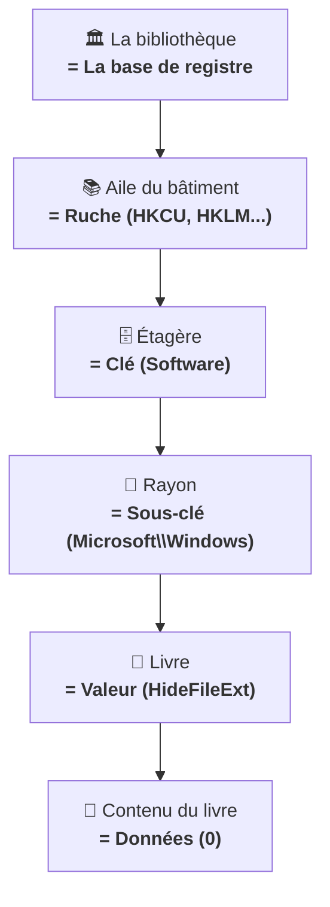

---
tags:
  - registre
  - débutant
  - structure
---

# Comprendre la structure

!!! abstract "Ce que vous allez apprendre"
    - Comment le registre est organise (avec une analogie simple)
    - Le role de chacune des 5 branches principales
    - La difference entre cles, sous-cles, valeurs et donnees
    - Comment lire un chemin de registre trouve dans un tutoriel

---

## Voyons d'abord un exemple concret

Ouvrez Regedit et collez ce chemin dans la barre d'adresse :

```
HKEY_CURRENT_USER\Software\Microsoft\Windows\CurrentVersion\Explorer\Advanced
```

Ce que vous voyez :

- **A gauche** : une arborescence de "dossiers" imbriques (`Software` > `Microsoft` > `Windows` > ...)
- **A droite** : une liste de reglages avec des noms comme `Hidden`, `HideFileExt`, `LaunchTo`

Voila, vous etes en train de regarder la **structure** du registre. Demystifions tout ca.

!!! quote "En resume"
    - En ouvrant Regedit, vous voyez une arborescence de "dossiers" a gauche (les cles) et une liste de reglages a droite (les valeurs).
    - C'est la **structure** du registre, que l'on va detailler dans ce chapitre.

---

## L'analogie de la bibliotheque

Pour bien comprendre l'organisation, imaginez une **bibliotheque municipale** :



| Dans la bibliotheque | Dans le registre | Exemple |
|:--------------------:|:----------------:|:-------:|
| Aile du batiment | Ruche (branche racine) | `HKEY_CURRENT_USER` |
| Etagere | Cle | `Software` |
| Rayon | Sous-cle | `Microsoft\Windows` |
| Livre | Valeur | `HideFileExt` |
| Contenu du livre | Donnees | `0` (= afficher les extensions) |

!!! quote "En resume"
    - Le registre est organise comme une bibliotheque : ruches (ailes), cles (etageres), sous-cles (rayons), valeurs (livres) et donnees (contenu).
    - Chaque element s'imbrique dans le precedent, formant une arborescence navigable.

---

## Les 5 branches en detail

### HKEY_CURRENT_USER (HKCU) -- Votre espace perso

C'est **votre** espace. Tout ce qui concerne **vos** preferences :

- :material-image: Votre fond d'ecran
- :material-weather-night: Votre theme (sombre ou clair)
- :material-rocket-launch: Vos programmes au demarrage
- :material-keyboard: La disposition de votre clavier
- :material-cog: Les reglages de vos logiciels

!!! tip "Bonne nouvelle"
    Modifier quelque chose dans `HKCU` n'affecte que **votre** compte. Les autres utilisateurs du meme PC ne sont pas impactes. C'est l'endroit le plus sur pour experimenter.

---

### HKEY_LOCAL_MACHINE (HKLM) -- Le tableau de bord du PC

Les reglages qui s'appliquent a **tout le PC**, quel que soit l'utilisateur connecte :

- :material-package-variant: Les logiciels installes pour tous les utilisateurs
- :material-chip: Les pilotes materiels
- :material-cog-transfer: Les services Windows
- :material-lan: La configuration reseau
- :material-shield-lock: Les parametres de securite

!!! warning "Droits administrateur requis"
    Modifier des cles dans `HKLM` necessite des droits administrateur. C'est normal : ces reglages affectent **tout le monde** sur le PC. Pensez-y comme au compteur electrique de l'immeuble : seul le gardien a la cle.

---

### HKEY_CLASSES_ROOT (HKCR) -- Qui ouvre quoi ?

Cette branche determine **quel programme ouvre quel type de fichier** :

| Extension | Programme associe |
|:---------:|:-----------------:|
| `.pdf` | Adobe Reader (ou un autre lecteur PDF) |
| `.jpg` | Visionneuse de photos |
| `.docx` | Microsoft Word |

Quand vous **double-cliquez** sur un fichier, Windows doit repondre a une question toute simple :

> "Quel programme dois-je lancer pour ouvrir ca ?"

HKCR sert justement a faire ce lien entre **un type de fichier** et **une action**.

Elle gere aussi les **menus contextuels** : le menu qui apparait quand vous faites un clic droit sur un fichier.

Autrement dit, les options comme **Ouvrir**, **Modifier**, **Imprimer** ou **Ouvrir avec** viennent souvent d'ici.

| Action visible au clic droit | Idee derriere le decor |
|-----------------------------|------------------------|
| `Open` / `Ouvrir` | Quel programme lancer |
| `Edit` / `Modifier` | Quel programme utiliser pour modifier |
| `Print` / `Imprimer` | Quelle commande envoyer a l'imprimante |
| `Open with...` / `Ouvrir avec...` | Quelle liste d'applications proposer |

Prenons un exemple tres concret avec un fichier `.txt`.

Quand vous faites un clic droit dessus, vous pouvez voir une option comme **Ouvrir avec le Bloc-notes**.

En version simplifiee, Windows suit une chaine comme celle-ci :

```text
HKCR\.txt → (Par défaut) = "txtfile"
HKCR\txtfile\shell\open\command → (Par défaut) = "notepad.exe %1"
```

Ce que cela veut dire, en francais normal :

1. Windows regarde d'abord l'extension du fichier : ici `.txt`.
2. Il voit que `.txt` correspond au type logique `txtfile`.
3. Il va ensuite chercher, dans `txtfile`, quelle commande correspond a l'action `open`.
4. Il trouve `notepad.exe %1`, ce qui signifie en gros : "ouvre le fichier clique avec le Bloc-notes".

Le petit symbole `%1` represente simplement **le nom du fichier sur lequel vous avez clique**.

Si vous avez clique sur `courses.txt`, Windows comprend donc quelque chose comme :

```text
notepad.exe courses.txt
```

Vous n'avez pas besoin de memoriser ce chemin par coeur.

Retenez juste l'idee : **extension -> type de fichier -> action -> programme a lancer**.

!!! example "Image mentale utile"
    Pensez a HKCR comme a un standardiste.
    Vous lui dites : "J'ai un fichier `.txt`."
    Il regarde sa fiche, puis repond : "Pour ca, j'appelle le Bloc-notes."

!!! tip "Si un clic droit sur un fichier ne propose plus le bon programme, c'est souvent dans HKCR que le problème se cache."

!!! warning "HKCR est une branche à observer, rarement à modifier. Une erreur ici peut désactiver l'ouverture de tous vos fichiers d'un certain type."

!!! quote "En résumé"
    - HKCR dit a Windows **quoi faire** quand vous double-cliquez ou faites un clic droit sur un type de fichier.
    - Pour un fichier `.txt`, Windows peut suivre la chaine `.txt` -> `txtfile` -> `shell\open\command` -> `notepad.exe %1`.
    - Si les mauvaises options apparaissent au clic droit, HKCR est souvent l'endroit a inspecter en premier.

---

### HKEY_USERS (HKU) -- Tous les utilisateurs

Contient les reglages de **tous** les comptes utilisateurs actuellement connectes.

!!! note "En pratique"
    Vous utiliserez plutot `HKCU` qui pointe automatiquement vers **votre** profil. `HKU` est surtout utile aux administrateurs systeme qui gerent plusieurs comptes.

---

### HKEY_CURRENT_CONFIG (HKCC) -- Le materiel actuel

HKCC contient le **profil materiel charge au demarrage**.

En pratique, cela correspond au materiel et aux reglages que Windows a **effectivement retenus pour cette session** : par exemple certains parametres d'affichage, de resolution ou d'equipements branches.

Cette branche n'est pas vraiment stockee a part.

C'est en fait un **raccourci** (un alias, ou lien symbolique) vers une sous-cle situee ici :

```text
HKLM\SYSTEM\CurrentControlSet\Hardware Profiles\Current
```

Vous pouvez voir HKCC comme une **porte d'entree pratique** vers ce profil materiel courant, sans avoir a parcourir tout `HKLM\SYSTEM`.

Pour un debutant, le point important est le suivant : on ne change presque jamais ces elements a la main dans Regedit.

Quand vous modifiez la resolution d'ecran, l'echelle d'affichage ou certains reglages du materiel, vous passez normalement par **Parametres Windows**, **Panneau de configuration** ou l'outil fourni par le constructeur.

Windows se charge ensuite d'ecrire les bonnes informations au bon endroit.

!!! info "HKCC n'est pas vraiment une branche indépendante. C'est un alias vers une partie de HKLM. Vous n'avez pas besoin de l'explorer directement."

!!! note "Le bon reflexe"
    Si vous cherchez a changer un reglage d'ecran, commencez par `Parametres` avec ++win+i++.
    N'allez pas fouiller dans `HKCC` en premier.

!!! quote "En résumé"
    - HKCC montre le **profil materiel actuellement utilise** par Windows.
    - Ce n'est pas une branche separee : c'est un alias vers `HKLM\SYSTEM\CurrentControlSet\Hardware Profiles\Current`.
    - Dans la vraie vie, on passe presque toujours par les outils Windows plutot que par une modification manuelle de HKCC.

!!! quote "En resume"
    - **HKCU** contient vos preferences personnelles (sans risque pour les autres utilisateurs), **HKLM** contient les reglages machine (necessite les droits admin).
    - **HKCR** gere les associations de fichiers, **HKU** regroupe tous les profils, et **HKCC** concerne le materiel actuel.

---

## Cles et sous-cles : les dossiers du registre

Les cles fonctionnent **exactement** comme des dossiers et sous-dossiers sur votre disque dur :

```
HKEY_CURRENT_USER                              ← Ruche (la racine)
└── Software                                   ← Clé
    └── Microsoft                              ← Sous-clé
        └── Windows                            ← Sous-sous-clé
            └── CurrentVersion                 ← Encore une sous-clé
                └── Explorer                   ← ...
                    └── Advanced               ← Et encore une !
```

Le **chemin complet** se lit de haut en bas, separe par des anti-slashs `\` :

```
HKEY_CURRENT_USER\Software\Microsoft\Windows\CurrentVersion\Explorer\Advanced
```

C'est comme un chemin de fichier (`C:\Users\Jean\Documents\Factures`), mais pour les reglages.

!!! quote "En resume"
    - Les cles fonctionnent comme des dossiers et sous-dossiers, imbriques les uns dans les autres.
    - Le chemin complet se lit de haut en bas, separe par des `\`, comme un chemin de fichier.

### HKCU ou HKLM : qui gagne quand les deux existent ?

Parfois, **le meme reglage** existe a deux endroits :

- dans `HKLM` pour definir une base commune a tout le PC ;
- dans `HKCU` pour enregistrer **votre** preference personnelle.

Pour debuter, retenez cette regle simple :

**si le meme reglage existe dans les deux, `HKCU` passe avant `HKLM` pour l'utilisateur connecte.**

Pourquoi ? Parce que `HKLM` sert souvent de **reglage par defaut pour la machine**, alors que `HKCU` sert de **personnalisation individuelle**.

Exemple tres courant :

un logiciel installe "pour tout le monde" place une configuration generale dans `HKLM`.

Puis, quand **vous** changez une preference dans ce logiciel, votre choix est ecrit dans `HKCU`.

Au moment de lire le reglage, Windows ou le logiciel prend alors votre valeur `HKCU`, qui **ecrase** la valeur machine pour votre session.

| Situation | Cle utilisee | Effet |
|-----------|-------------|-------|
| Reglage machine par defaut | HKLM | S'applique a tous les utilisateurs |
| Vous personnalisez ce reglage | HKCU | Votre valeur ecrase HKLM pour votre session |
| Vous supprimez votre valeur HKCU | HKLM | Le reglage machine reprend le dessus |

Imaginez un **hotel** :

- `HKLM`, c'est la chambre preparee par defaut : temperature, rideaux, disposition generale.
- `HKCU`, c'est ce que **vous** changez pendant votre sejour : vous ouvrez la fenetre, vous baissez la lumiere, vous deplacez un coussin.

Tant que votre preference personnelle existe, c'est **elle** qui s'applique pour vous.

Si vous l'enlevez, la chambre revient a la configuration par defaut de l'hotel.

!!! info "C'est pourquoi certains réglages faits par un admin pour tous les utilisateurs peuvent être surchargés par chaque utilisateur dans son propre HKCU."

!!! example "Petit scenario"
    Un administrateur installe un logiciel pour toute l'entreprise.
    Le logiciel met `Theme=clair` dans `HKLM`.
    Vous ouvrez les preferences et choisissez `Theme=sombre`.
    Votre choix part dans `HKCU`, et vous voyez alors le theme sombre, meme si le theme clair reste defini pour la machine.

!!! quote "En résumé"
    - `HKLM` pose souvent le decor pour tout le PC, `HKCU` ajoute votre couche personnelle.
    - Quand les deux existent pour le meme reglage, retenez la regle simple : **votre `HKCU` passe d'abord**.
    - Si votre valeur `HKCU` disparait, Windows ou le logiciel retombe sur la valeur definie dans `HKLM`.

---

## Les valeurs et leurs donnees

Chaque cle peut contenir des **valeurs**. Une valeur, c'est un reglage individuel compose de trois elements :


### Exemple concret

!!! example "Essayez vous-meme"
    Naviguez vers `HKCU\Software\Microsoft\Windows\CurrentVersion\Explorer\Advanced` et reperez ces valeurs dans le panneau de droite :

| Nom | Type | Donnees | Ce que ca fait en vrai |
|-----|:----:|:-------:|------------------------|
| `Hidden` | REG_DWORD | `1` | Affiche les fichiers caches |
| `HideFileExt` | REG_DWORD | `0` | Affiche les extensions de fichiers |
| `LaunchTo` | REG_DWORD | `1` | Ouvre l'explorateur sur "Ce PC" |

Vous voyez ? Chaque reglage a un **nom**, un **type** et des **donnees**. Rien de sorcier.

### La valeur "(Par defaut)"

Chaque cle possede automatiquement une valeur speciale appelee **(Par defaut)**.

Elle est souvent vide et rarement utilisee directement. Ne vous en preoccupez pas pour l'instant : elle sert principalement pour les associations de fichiers dans `HKCR`.

!!! quote "En resume"
    - Chaque valeur est composee de trois elements : un **nom**, un **type** (REG_SZ, REG_DWORD...) et des **donnees**.
    - La valeur "(Par defaut)" est presente dans chaque cle mais rarement utilisee directement.

## Les types de valeurs courants

Chaque valeur du registre a aussi un **type**.

Ce type indique **quelle forme de donnee** Windows s'attend a trouver dedans.

Pensez-y comme au contenant :

- une case pour du texte ;
- une case pour un nombre ;
- une case pour plusieurs lignes ;
- une case pour des donnees techniques plus brutes.

| Type | Nom complet | Ce que ça stocke | Exemple |
|------|-------------|------------------|---------|
| REG_SZ | String Value | Du texte simple | `C:\Program Files\MonApp\app.exe` |
| REG_DWORD | Double Word | Un nombre entier (32 bits) | `1` (activé) ou `0` (désactivé) |
| REG_EXPAND_SZ | Expandable String | Du texte avec variables d'environnement | `%USERPROFILE%\Documents` |
| REG_BINARY | Binary Value | Des données binaires brutes | Rarement modifié à la main |
| REG_MULTI_SZ | Multi-String | Plusieurs lignes de texte | Liste de services ou de chemins |

Voici la lecture la plus simple possible :

- `REG_SZ` : du texte "normal"
- `REG_DWORD` : un petit nombre, souvent utilise pour `0` ou `1`
- `REG_EXPAND_SZ` : du texte qui contient des raccourcis comme `%USERPROFILE%`
- `REG_BINARY` : des octets techniques, rarement agreables a lire
- `REG_MULTI_SZ` : plusieurs lignes de texte rangees ensemble

!!! tip "Pour un débutant, REG_SZ et REG_DWORD couvrent 90 % des cas. Les autres types se rencontrent mais se modifient rarement directement."

Un detail qui surprend souvent au debut :

quand vous voyez `0x00000001` a cote d'une valeur `DWORD`, cela veut simplement dire **1 en hexadecimal**.

L'hexadecimal est une autre facon d'ecrire un nombre, un peu comme si Windows parlait son dialecte technique.

Pour eviter de vous melanger, quand une boite de dialogue vous demande un format, choisissez **Decimale** si vous voulez taper des nombres "normaux".

!!! example "Le bon reflexe"
    Si un tutoriel dit "mettre la valeur a 1", vous pouvez presque toujours choisir **Decimale** puis taper `1`.
    Pas besoin de convertir a la main en `0x00000001`.

!!! note "Petit pense-bete"
    Si vous voyez un chemin de programme ou de dossier, pensez souvent `REG_SZ`.
    Si vous voyez un interrupteur du style actif / inactif, pensez souvent `REG_DWORD`.

!!! quote "En résumé"
    - Le type d'une valeur indique **quelle sorte de donnee** elle peut contenir.
    - Pour debuter, vous rencontrerez surtout `REG_SZ` (texte) et `REG_DWORD` (nombre).
    - Si `0x00000001` vous intimide, retenez simplement que cela correspond a **1**.

---

## Lire un chemin de registre (pas a pas)

Quand un tutoriel vous dit d'aller a :

```
HKEY_CURRENT_USER\Control Panel\Desktop
```

Voici comment le decomposer :

| Morceau | Signification | Action |
|---------|---------------|--------|
| `HKEY_CURRENT_USER` | La branche | Vos reglages personnels |
| `Control Panel` | La premiere cle | Cliquer pour ouvrir |
| `Desktop` | La sous-cle | C'est ici que se trouve le reglage |

**Deux facons d'y aller** :

1. **Clic par clic** : ouvrir chaque niveau dans le panneau de gauche
2. **Copier-coller** : coller le chemin entier dans la barre d'adresse (recommande !)

!!! tip "La methode express"
    Copiez toujours le chemin complet et collez-le dans la barre d'adresse. C'est plus rapide, et surtout vous ne risquez pas de vous tromper de cle.

!!! quote "En resume"
    - Un chemin de registre se decompose en branche (`HKEY_CURRENT_USER`), cle (`Control Panel`) et sous-cle (`Desktop`).
    - La methode la plus rapide et la plus sure : **copier-coller** le chemin complet dans la barre d'adresse de Regedit.

---

!!! quote "En resume"

    ```mermaid
    graph TD
        A["Base de registre"] --> B["HKCU<br>Vos réglages perso"]
        A --> C["HKLM<br>Réglages machine"]
        A --> D["HKCR<br>Associations fichiers"]
        A --> E["HKU<br>Tous les utilisateurs"]
        A --> F["HKCC<br>Matériel actuel"]
        B --> G["Clés = dossiers"]
        G --> H["Sous-clés = sous-dossiers"]
        H --> I["Valeurs = réglages"]
        I --> J["Données = la valeur effective"]
    ```

    - Le registre est organise en **5 branches** (ruches)
    - Vous utiliserez surtout **HKCU** (vos reglages) et **HKLM** (reglages machine)
    - Les **cles** sont comme des dossiers, les **valeurs** sont comme des fichiers
    - Chaque valeur a un **nom**, un **type** et des **donnees**
    - On navigue par **copier-coller** dans la barre d'adresse (c'est le plus simple !)

---

!!! tip "Pour aller plus loin"
    L'architecture interne des ruches (cellules, bacs, en-tetes binaires) est detaillee dans [La Bible — Architecture et structure](../bible-registre-windows/02-architecture.md).
